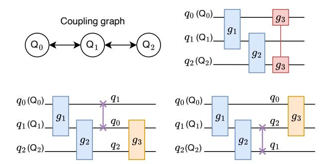
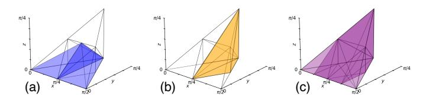
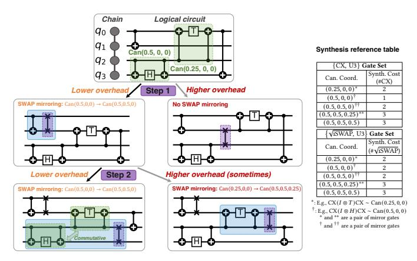
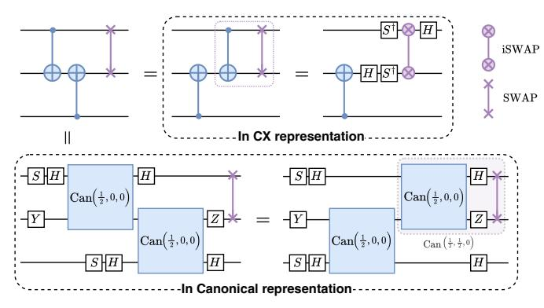
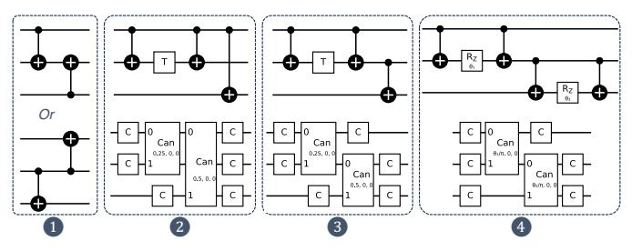
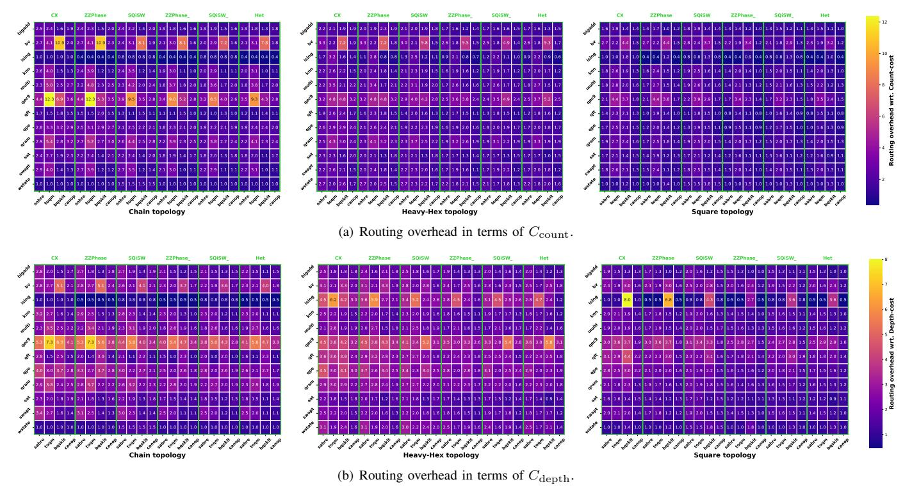
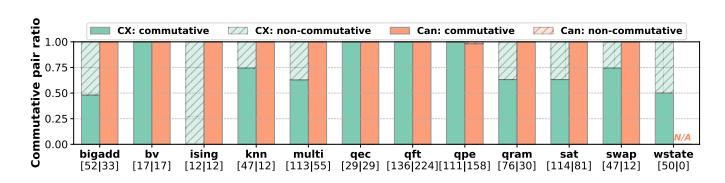
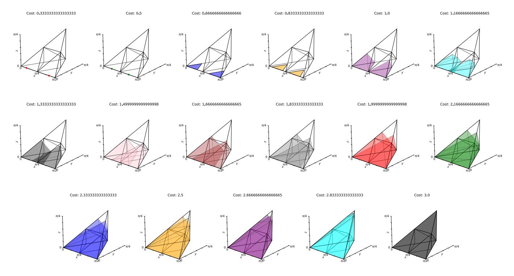
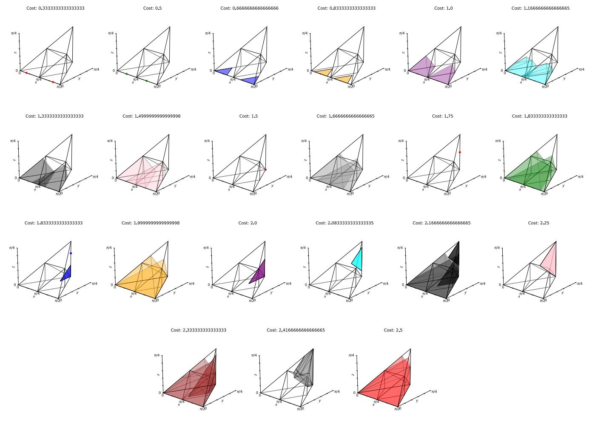

# Unifying Qubit Routing Across Diverse Quantum ISAs via Canonical Representation

Zhaohui Yang\*, Kai Zhang<sup>†‡</sup>, Xinyang Tian<sup>§</sup>, Xiangyu Ren<sup>¶</sup>, Yingjian Liu<sup>∥</sup>, Yunfeng Li\*\*, Dawei Ding<sup>††‡‡</sup>, Jianxin Chen<sup>⊠†</sup>, Yuan Xie\*

\*Department of Electronic and Computer Engineering, The Hong Kong University of Science and Technology, Hong Kong

†Department of Computer Science and Technology, Tsinghua University, Beijing 100084, China

‡Department of Intelligent Computing, Pengcheng Laboratory, Guangdong 518066, China

§Institute for Interdisciplinary Information Sciences, Tsinghua University, Beijing 100084, China

¶Institute for Computer System Architecture, The University of Edinburgh, Edinburgh EH8 9AB, UK

µDepartment of Integrated Circuit, Shenzhen Polytechnic University, Guangdong 518055, China

\*\*Institute-Lorentz for Theoretical Physics, Leiden University, 2300 RA Leiden, The Netherlands

††Center for Mathematics and Interdisciplinary Sciences, Fudan University, Shanghai 200433, China

‡‡Shanghai Institute for Mathematics and Interdisciplinary Sciences, Shanghai 200433, China

Abstract—Qubit mapping/routing is a critical stage in compilation for both near-term and fault-tolerant quantum computers, yet existing scalable methods typically impose several times the routing overhead in terms of circuit depth or duration. This inefficiency stems from a fundamental disconnect: compilers rely on an abstract routing model (e.g., three-CX-unrolled SWAP insertion) that completely ignores the idiosyncrasies of native gates supported by physical devices.

Recent hardware breakthroughs have enabled high-precision implementations of diverse instruction set architectures (ISAs) beyond standard CX-based gates. Advanced ISAs involving gates such as  $\sqrt{iSWAP}$  and  $ZZ(\theta)$  gates offer superior circuit synthesis capabilities and can be realized with higher fidelities. However, systematic compiler optimization strategies tailored to these advanced ISAs are lacking.

To address this, we propose CANOPUS, a unified qubit mapping/routing framework applicable to diverse quantum ISAs. Built upon the canonical representation of two-qubit gates, CANOPUS centers on qubit routing to perform deep cooptimization in an ISA-aware approach. CANOPUS leverages the two-qubit canonical representation and the monodromy polytope theory to model the synthesis cost for more intelligent SWAP insertion during qubit routing. We also formalize the commutation relations between two-qubit gates through the canonical form, providing a generalized approach to commutativity-based optimization. Experiments show that CANOPUS consistently reduces routing overhead by 15%-35% compared to state-of-theart methods across various backend ISAs and device topologies. More broadly, this work establishes a coherent method for coexploration of program patterns, quantum ISAs, and hardware topologies, yielding concrete guidelines for hardware-software co-design. This is the first practical demonstration of how to efficiently utilize advanced quantum ISAs, opening the door to designing more powerful and synergistic quantum systems.

Index Terms—Quantum Computing, Qubit Routing, Compiler, Instruction Set Architecture, Co-Design.

#### I. INTRODUCTION

Quantum computing is a revolutionary computational paradigm leveraging quantum mechanical principles such as superposition and entanglement of qubit states [52]. It has

oxdiv Corresponding author: chenjianxin@tsinghua.edu.cn.


<span id="page-0-0"></span>Fig. 1. Compilation workflows by means of conventional approaches (top) and CANOPUS (bottom) targeting diverse quantum ISAs. CANOPUS integrates the synthesis cost model (monodromy polytopes within the Weyl chamber) to consider backend ISA properties during the routing stage, enabling deeply cooptimized, ISA-aware compilation across heterogeneous hardware backends. CANOPUS routing operates in the 2Q canonical representation while the specific synthesis is completed by the backend synthesizer.

grown rapidly in recent decades due to the potential speedup in tasks such as integer factorization [62], solving linear equations [26], and simulation of quantum systems [46].

Holistic benchmarks of quantum computers such as quantum volume [17] are predicated on concurrent advancements in both hardware and software. Recently, numerous systematic techniques regarding compiler optimization and architecture design have been presented to push the limit of hardware performance. Quantum compilers play a pivotal role in this process, translating high-level programs into executable instructions, usually the native single-qubit (10) and two-qubit (2Q) gates on realistic quantum hardware. This typically involves several stages: (1) compiling programs into basic quantum gates, (2) performing hardware-agnostic (logicallevel) circuit optimization, (3) resolving backend topology constraints via qubit placement and routing, and (4) converting circuits to native gates for further optimization and scheduling. The primary goal of compiler optimization is to lower the 20 gate count and circuit depth while resolving backend constraints, with a particular emphasis on 2Q gates due to their significantly higher error rates compared to 1Q gates.

For mainstream quantum platforms such as superconducting qubits [\[36\]](#page-14-2), 2Q gates can only operate between nearestneighbor physical qubit pairs (e.g., Google's devices with 2D square topology [\[5\]](#page-13-0), IBM's devices with 2D heavy-hex topology [\[11\]](#page-14-3)). Consequently, qubit placement and SWAP-based routing are crucial for resolving this connectivity constraint by dynamically remapping logical qubits to physical ones by inserting SWAP gates acting on adjacent physical qubit pairs. This introduces a routing overhead that typically increases the gate count and circuit depth by a factor of 2–5× relative to the pre-mapped circuits when using state-of-the-art (SOTA) scalable routing methods [\[43\]](#page-15-3), [\[45\]](#page-15-4), [\[75\]](#page-15-5), [\[80\]](#page-15-6). Therefore, mitigating this routing overhead remains a central and longstanding challenge in compiler optimization.

Within the scope of NISQ and low-level fault-tolerant compilation especially for static, nearest-neighbor superconducting topologies—as opposed to dynamically reconfigurable systems like neutral atoms—most studies on qubit routing rely on a simplified routing model, where circuit cost is quantified by the CX-based gate count and circuit depth while each SWAP gate is unrolled into three CX gates according to the textbook pattern SWAPq0,q<sup>1</sup> = CXq0,q1CXq1,q0CXq0,q<sup>1</sup> . However, this CX-centric view is misaligned with the physical reality of modern quantum devices. Although quantum algorithms are typically expressed in terms of CX gates, the underlying hardware may not execute native CX-equivalent gates, nor does this gate cost or circuit cost quantification method accurately reflect the true operational cost. Indeed, beyond the native support for CX-equivalent gates (e.g., CZ [\[36\]](#page-14-2), Cross-Resonance [\[61\]](#page-15-7), Mølmer-Sørensen [\[8\]](#page-14-4)), modern quantum hardware increasingly features diverse native 2Q basis gates in recent years. These alternative basis gates, or the abstracted instruction set architectures (ISAs) in a narrow sense, can be more powerful than CX-equivalent gates in terms of synthesis capabilities (i.e., the efficiency of decomposing arbitrary two-qubit unitaries into hardware-native basis gates) and fidelity of realization, such as <sup>√</sup> iSWAP [\[29\]](#page-14-5), the iSWAPfamily and CX-family fractional gates [\[31\]](#page-14-6), [\[50\]](#page-15-8), and heterogeneous basis gates [\[50\]](#page-15-8), [\[55\]](#page-15-9). With such ISAs, SWAP can be implemented with a lower cost than three CX gates or even be natively realized with high fidelity [\[13\]](#page-14-7), [\[51\]](#page-15-10), [\[68\]](#page-15-11). Therefore, the simplified routing model completely ignores the backend ISA properties, severely limiting the potential of compiler optimization. Furthermore, the absence of systematic compiler optimization methods across these diverse (even complex, heterogeneous) ISAs has prevented the community from fully exploiting their power and exploring the rich software-hardware co-design space.

In our work, we propose a unified qubit mapping/routing framework CANOPUS (Canonical-Optimized Placement Utility Suite) tailored to diverse quantum ISAs. Unlike conventional CX-based routing approaches, CANOPUS is fundamentally ISA-aware. As illustrated in Fig. [1,](#page-0-0) it considers the properties of the target ISA by formulating an appropriate cost model to facilitate deep co-optimization of routing and synthesis. By means of the canonical 2Q gate representation [\[76\]](#page-15-12), CANOPUS fully exploits the synthesis capabilities of the given ISA . This approach demonstrates that advanced ISAs can achieve significantly lower routing overhead than conventional models suggest.

The main ideas of CANOPUS are as follows: ① Significant optimization opportunities emerge when native gate synthesis costs are directly incorporated into the qubit routing process. For instance, synthesizing a 2Q block and a subsequent SWAP with the same qubit pair acted on as a single composite operation is often more efficient than synthesizing them individually. ② Expanding the quantum ISA is crucial for boosting the performance of real-world quantum applications. For example, the fractional ZZ(θ) gate set widely adopted by hardware vendors (e.g., IBM [\[30\]](#page-14-8), Quantinuum [\[59\]](#page-15-13), IonQ [\[32\]](#page-14-9)) enables more efficient execution of chemistry simulation kernels within which many 2-local Pauli rotations are involved. The combination of CX and iSWAP gates have been demonstrated to benefit stabilizer circuits to protect error-corrected qubit information [\[77\]](#page-15-14). ③ The monodromy polytope theory [\[56\]](#page-15-15) based on the canonical representation of 2Q gates [\[76\]](#page-15-12) provides a formal, universal, and quantitative description of the 2Q synthesis cost for arbitrary quantum ISAs, establishing a foundation for unified compiler optimization. Guided by these insights, CANOPUS performs intelligent SWAP insertion during qubit routing to holistically minimize post-mapping circuit cost (in terms of both gate count and depth) given any quantum ISA, thus performing deep routing-synthesis co-optimization with significantly lower routing overhead induced. Importantly, while CANOPUS is ISA-aware, it always operates on the canonical-form circuits, and the gate/circuit cost quantification via monodromy polytope is independent of backend's specific ISA rebase implementation. In this sense, CANOPUS offers LLVM-style compiler optimization.

Experimental results demonstrate that CANOPUS consistently provides 15%-35% reduction (in terms of both gate count and depth) of routing overhead compared to other SOTA methods across representative quantum ISAs, *including the conventional* CX *ISA*. This cross-ISA comparison also reveals some consistent or program-specific and topologyspecific guidelines for hardware-software co-design. Source code and data are available on [GitHub](https://github.com/Youngcius/canopus) [\[1\]](#page-13-1). Our work makes the following key contributions:

- ❶ We utilize the canonical 2Q gate representation and the monodromy polytope theory to quantify costs of 2Q gates and the overall circuit. This formal approach accurately guides synthesis-routing co-optimization and cross-ISA evaluation.
- ❷ We formalize the analysis of commutation relations between arbitrary 2Q canonical gates that share one qubit. This offers a generalized commutativity-based optimization mechanism, moving beyond those tailored only for CX gates [\[44\]](#page-15-16).
- ❸ We conduct comprehensive experiments across a wide range of real-world benchmarks, hardware topologies, and representative ISAs, showing that CANOPUS consistently reduces routing overhead by 15%-35% compared to scalable SOTA



<span id="page-2-0"></span>Fig. 2. Mapping/routing to resolve topology constraints via SWAP insertion. With the initial mapping  $\{q_i : Q_i\}$  (upper right),  $g_3$  is not hardware compliant. Both SWAP $_{q_0,q_1}$  and SWAP $_{q_1,q_2}$  are sufficient to make  $g_3$  executable.

methods. Our results also yield holistic guidelines for the codesign of quantum programs, ISAs, and hardware.

**4** We confirm that theoretically expressive ISAs exhibit superior performance to the conventional CX ISA, challenging the conclusions of prior works [34]. We demonstrate some codesign guidelines for ISA-program-topology co-exploration.

Our case studies, including the real-machine QFT kernel execution and the end-to-end QEC circuit simulation, unequivocally showcase CANOPUS' superiority in both near-term and fault-tolerant applications. For example, on the task of mapping QFT on 1D chain topology, CANOPUS finds the provably optimal routing scheme, surpassing the results previously reported as optimal in prior work [75]; and experiments on IBM's QPUs demonstrate that, compared to QISKIT, CANOPUS reduces errors by an average of 26.89% and 34.98% for the CZ and  $ZZ(\theta)$  gate sets, respectively.

## II. BACKGROUND

# A. Qubit mapping/routing

Real quantum hardware typically has connectivity constraints, whereas algorithms often assume arbitrary interactions. To execute quantum circuits on topology-constrained hardware, logical qubits must first be mapped to physical qubit positions. This is called the initial mapping. In most cases, even an optimal initial mapping cannot guarantee all logical 2Q gates are mapped on physically connected qubit pairs. The common solution is to dynamically change logical-to-physical qubit mappings by inserting SWAP gates, as a SWAP gate exchanges state subspaces of two operand qubits, such that non-adjacent logical qubit states can be moved next to each other. Therefore, the qubit placement and routing compilation stage takes a logical circuit and hardware coupling graph as the input and outputs a transformed circuit within which each 2Q gate, with respect to a qubit mapping, is hardware compliant. An example is depicted in Fig. 2.

#### B. Canonical description of 2Q gates

Any 2Q gate can be represented by a  $4 \times 4$  matrix in SU(4), up to a global phase, with its canonical form defined as:


<span id="page-2-1"></span>Fig. 3. Geometric illustration of canonical gates confined to the Weyl chamber. For visualization convenience, herein the Weyl chamber is confined to  $\left\{\frac{\pi}{4} \geq x \geq y \geq z \geq 0\right\} \cup \left\{\frac{\pi}{4} \geq \frac{\pi}{2} - x \geq y \geq z \geq 0\right\}$ , equivalent to the canonical coefficient convention  $\left\{(a,b,c) \mid \frac{1}{2} \geq a \geq b \geq |c|\right\}$ .

**Definition 1** (Canonical gate). Any 2Q gate  $U \in SU(4)$  can be expressed by the composition of its unique canonical form

$$\operatorname{Can}(a, b, c) := e^{-i\frac{\pi}{2}(a \, XX + b \, YY + c \, ZZ)}, \, \frac{1}{2} \ge a \ge b \ge |c|$$

sandwiched by 1Q gates such that we say U is locally equivalent to  $(\sim)$  the canonical form  $\operatorname{Can}(a,b,c)$ .

The canonical coefficients (a, b, c) are confined to a tetrahedron known as the *Weyl chamber*, which provides a geometric representation of all local equivalence classes of 2Q gates [76]. Fig. 3 visualizes some common 2Q gates. E.g.,

- CX, CZ, and CR are all equivalent to  $Can(\frac{1}{2}, 0, 0)$ .
- CX family:  $XX(\theta) \sim YY(\theta) \sim ZZ(\theta) \sim Can(\frac{\theta}{\pi}, 0, 0)$ .
- Param-SWAP family:  $pSWAP(\theta) \sim Can(\frac{1}{2}, \frac{1}{2}, \frac{1}{2} \frac{\theta}{\pi})$ .

In practice, the canonical form is acquired by KAK decomposition [66] and has been widely used [9], [12]. Appendix A and Appendix B provides a more detailed introduction to the canonical form and its properties.

#### <span id="page-2-2"></span>C. Gate realization cost on hardware

The transformed circuits via qubit routing will be ultimately converted into basis gates for execution on hardware. Basis gates refer to those natively implemented and calibrated on physical platforms. Typical native gates in superconducting platforms are CR [61], CZ, and iSWAP gates [36]. The realization cost of basis gates involves multiple aspects, including the benchmarked fidelity, gate duration, calibration efficiency, etc. For example, gates with shorter duration are more likely to achieve high fidelity, as qubit decoherence dominates the noise source; although some gate schemes can now implement more basis gates [13], [51], those with simpler pulse control are more likely to be calibrated with high precision, such as the iSWAP-family gates on flux-tunable transmons.

2Q gates are not natively implemented and must be synthesized by native gates. Their realization cost is determined by the basis gates used for synthesis. For example, any 2Q gate can be minimally synthesized by 3 CX gates, except for Can(a,b,0) for which the required CX count is 2. Conventionally, SWAP is regarded as 3 times that of CX realization

cost, while it can also be synthesized by "1 CX + 1 iSWAP" or "3 <sup>√</sup> iSWAP" gates. The monodromy polytope theory was recently proposed to determine the optimal synthesis cost for any 2Q gate given a specific set of basis gates through analysis of local invariants of canonical gates [\[56\]](#page-15-15). By this method, the set of gates realizable by a specified number of 2Q gates from the basis set, with arbitrary 1Q gates, corresponds to a polytope within the Weyl chamber. For instance, the polytope reachable by 2 <sup>√</sup> iSWAP gates with arbitrary 1Q gates is a tetrahedron confined to {1/2 ≥ a ≥ b + |c|} [\[29\]](#page-14-5).

# III. MOTIVATION

*a) Limitations of conventional qubit routing models:* Conventional qubit routing models are ill-equipped to exploit the versatility of modern quantum hardware. First, whether optimizing for gate count or circuit depth, they typically assume that a SWAP costs three CX gates according to the textbook decomposition. This assumption is divorced from hardware reality. For example, a combination of CX and iSWAP is sufficient to realize a SWAP while both CZ (locally equivalent to CX) and iSWAP are natively supported on mainstream superconducting platforms like Google's Sycamore [\[5\]](#page-13-0). Such platforms can even directly implement a high-fidelity SWAP gate, with the pulse duration only 1.5 times that of CZ [\[13\]](#page-14-7). Thus, SWAP is not as costly as assumed in previous qubit routing frameworks. Second, while prior works [\[44\]](#page-15-16), [\[64\]](#page-15-18) do assume the cost of a SWAP is context-dependent, their analysis remains strictly confined to the CX-centric routing model. By relying on this overly simplistic model, conventional routers cannot accurately predict circuit execution costs and remain blind to the substantial optimization opportunities offered by richer, more diverse ISAs.

*b) Co-optimization as the key to unlocking the superiority of advanced ISAs:* In response to the limitations of the CXonly paradigm, a new generation of sophisticated quantum processors has emerged, featuring advanced ISAs with more powerful basis gates. Notable examples include the <sup>√</sup> iSWAP gate proposed by Huang et al. [\[29\]](#page-14-5), the continuous ZZ(θ) (equivalent to XX(θ), ZX(θ), MS(0, 0, θ/2)) jointly adopted by major vendors [\[30\]](#page-14-8), [\[32\]](#page-14-9), [\[59\]](#page-15-13), and selected fractional or heterogeneous basis gates [\[50\]](#page-15-8). Despite their theoretical promise for greater synthesis power and noise resilience, these advanced ISAs have largely remained in the proof-of-concept stage, with no systematic framework to harness their full potential in real-world quantum applications.

Prior efforts have been narrowly focused on local 2Q or multi-qubit synthesis tasks [\[29\]](#page-14-5), [\[65\]](#page-15-19) or brute-force numerical optimizations [\[19\]](#page-14-13), [\[74\]](#page-15-20). Such rebase passes are tailored to a specific quantum ISA and fail to deliver clear benefits when applied to advanced ISAs in realistic workloads [\[34\]](#page-14-10). This has led to a critical question lingering in the community: "Are these more expressive, noise-resilient ISAs actually better?" Recently there have been attempts to harness the properties of advanced ISAs, although through manual, adhoc heuristics, such as the <sup>√</sup> iSWAP-based routing-synthesis optimization [\[50\]](#page-15-8) and the CX-iSWAP based routing for defect

effect mitigation [\[77\]](#page-15-14). In our work, we highlight that collaborative compiler optimization, especially at the stage following logical-level circuit optimization and followed by the final ISA rebase pass, is a key to fully exploiting the capabilities of those powerful ISAs: First, high-level algorithms are predominantly expressed in the CX representation, which then undergo template-based and peephole optimizations that are highly sophisticated and tailored for CX-based circuit patterns (e.g., commutativity, Clifford equivalence); Second, the disconnect between na¨ıve qubit routing models and backend ISA properties apparently leaves a large untapped co-optimization space. Thus we aim to validate this point through a systematic ISAaware routing framework.

*c) The "Tower of Babel dilemma" for utilizing diverse ISAs:* The proliferation of diverse quantum ISAs—from monolithic to complex, heterogeneous basis gate sets supported by various physical platforms—has created a "Tower of Babel dilemma" in the architecture and systems community. Developing bespoke compiler optimizations for each unique hardware backend is unsustainable, leading to the same software fragmentation that we have encountered in classical computing. Consequently, it is important to seek a unified approach that can effectively handle various platformspecific abstractions resembling the LLVM compiler [\[41\]](#page-15-21). The recently proposed monodromy polytope theory [\[56\]](#page-15-15), for example, provides a method for optimal analysis of ISA synthesis capabilities. Specifically regarding the circuit-level compiler optimization, the monodromy polytope with canonical 2Q gate representations offers a unified approach to evaluating circuit cost and modeling routing-synthesis co-optimization. Building on this, CANOPUS proves to be an elegant and unified solution to the Tower of Babel dilemma at the compiler level.

*d) Coherent cross-ISA, topology, and program pattern co-exploration:* Ultimately, the goal of quantum computing systems is not just to optimize software for existing hardware, but to co-design the entire stack—from algorithms to architecture—to build the most efficient system possible. This requires a holistic exploration of a vast and complex design space, asking critical questions like: Which ISA is best suited for a given class of applications (e.g., quantum error correction vs. quantum simulation)? How does the choice of qubit topology interact with the ISA to affect performance? Answering these questions is currently an ad-hoc, laborintensive process, hindering systematic progress. Therefore, our work aims to provide the missing piece: a unified and automated framework for this co-exploration. By integrating qubit routing with a formal, ISA-aware synthesis cost model, CANOPUS can systematically evaluate the performance of various program patterns across heterogeneous ISAs and diverse hardware topologies. This empowers researchers with informed, data-driven insights to identify optimal co-design points, accelerating the development of robust, fault-tolerant quantum systems.


<span id="page-4-0"></span>Fig. 4. Overview of the CANOPUS framework.



<span id="page-4-1"></span>Fig. 5. Synthesis coverage for  $\{\sqrt{iSWAP}, ECP\}$  gate set. The trivial points  $(\sqrt{iSWAP})$  and ECP themselves) are not shown in this figure. 2Q overage regions correspond to those that require (a)  $2\sqrt{iSWAP}$  gates or 2 ECP gates; (b)  $1\sqrt{iSWAP} + 1$  ECP; (c) 3 gates ( $3\sqrt{iSWAP}$ , 3 ECP,  $2\sqrt{iSWAP} + 1$  ECP, etc.) from this gate set for synthesis, respectively.

#### IV. CANOPUS FRAMEWORK

#### A. Overview

The overall qubit routing procedure of CANOPUS is illustrated in Fig. 4. Prior to routing, the input circuit is rebased to {Can, U3} gate set. All subsequent processes operate on the directed acyclic graph (DAG) representation of the circuit. During the routing pass, CANOPUS integrates the ISA-specific synthesis cost model into its SWAP search process, dynamically determining the most appropriate SWAP at each route step. The routing cost is efficiently computed via formal analysis of 2Q canonical forms, without explicitly performing any ISA rebase process. Thus, the output is still a circuit DAG represented in {Can, U3} with inserted SWAP gates.

Notably, CANOPUS inherits the basic concepts and data structures introduced in SABRE [43], which is one of the industrial-standard qubit mapping/routing algorithms. Given the input circuit DAG, CANOPUS first attempts to map 2Q gates layer by layer via extracting the front layer F, peeling executable gates and searching SWAP gates to minimize the routing cost according to a unified heuristic cost function. On the backbone of SABRE, we further introduce several key data structures such as the last mapped layer L and the wire duration record D, to support the efficient implementation of ISA-aware routing and reducing both gate count and depth related routing overhead.

# B. 2Q synthesis cost modeling

As introduced in Section II-C, given any basis gate set, the synthesis cost of a target 2Q gate can be exactly computed through monodromy polytope [56]. This cost (which basis gates are sufficient for synthesis) only depends on the canonical coefficients of the target gate. For example, Fig. 5 illustrates various polytopes for the gate set  $\{\sqrt{iSWAP}, ECP\}$ . In practice, the costs of each basis gate are pre-defined, thus the whole set of polytopes helps decide the optimal synthesis scheme with the minimal circuit cost we should prioritize. For example, if  $\sqrt{iSWAP}$  and ECP have the same unit cost, the  $SWAP \sim Can(\frac{1}{2}, \frac{1}{2}, \frac{1}{2})$  gate realization will prioritize the "1  $\sqrt{iSWAP}$  + 1 ECP" combination; if ECP cost is set to be more than twice that of  $\sqrt{iSWAP}$ , the SWAP realization prioritizes the "3  $\sqrt{iSWAP}$ " pattern.

# C. Routing in canonical form

Our ISA-aware routing primarily leverages the mechanism that some inserted SWAP gates can "piggyback" a preceding 2Q gate with the same qubit pair acted on and thus result in lower (even negative) routing overhead than what naïve SWAP synthesis cost may imply. Based on the ISA-specific synthesis cost model, CANOPUS utilizes a holistic heuristic cost function that considers various requirements of qubit routing for simultaneous reduction of both gate count and circuit depth overhead in a unified, quantitative approach.

Instead of treating SWAP as an independent, fixed-cost insertion, we evaluate its cost based on how it interacts with the "last mapped layer" L, defined as the set of 2Q gates in the current DAG that have no succeeding interactions. When a candidate SWAP acts on the same physical qubit pair as a gate  $U \in L$ , it can be "absorbed" by consolidating them into a single composite unitary  $U' = \text{SWAP} \cdot U$ , dubbed "SWAP mirroring", as detailed in Appendix C. This SWAP insertion cost is then defined as the marginal synthesis cost increment:  $c_g = \text{COST}(\text{SWAP} \cdot U) - \text{COST}(U)$ . The cost component  $c_g$  is typically lower than the naïve cost  $c_{\text{swap}}$  of an independent SWAP gate, and it can even be negative when the composite unitary is cheaper to synthesize than U. For instance, under

<span id="page-5-0"></span>

(a) ISA-aware SWAP insertion in a local circuit window.


<span id="page-5-1"></span>(b) SWAP insertion patterns with different gate count and depth costs.

Fig. 6. Qubit routing with the canonical 2Q gate representation.

CX basis, if the absorption location is an iSWAP-equivalent gate, the composite SWAP · iSWAP ~  $\operatorname{Can}\left(\frac{1}{2},0,0\right)$  requires only one CX gate to synthesize, leading to a negative gate count increment  $(c_g = c_{\text{cx}} - 2\,c_{\text{cx}} = -c_{\text{cx}})$ ; similarly, with  $\sqrt{\text{iSWAP}}$  basis, the resulting  $c_q$  is zero.

As illustrated in Fig. 6(a), CANOPUS evaluates SWAP insertions by regarding all 2Q gates/blocks as canonical gates and quantifying their synthesis costs based on the target ISA. Without loss of generality, this example considers only the overhead of SWAP insertion, omitting topological distance and circuit depth heuristics. According to the synthesis cost reference table in Fig. 6(a), an independent SWAP gate normally costs three 2Q gates under both the CX and √iSWAP gate set. However, in the first SWAP search step, absorbing a SWAP candidate into a preceding Can(0.5, 0, 0) gate (left selection) forms the mirror gate Can(0.5, 0.5, 0), merely yielding a marginal synthesis cost increment of  $c_g = 1 \times c_{\mathrm{cx}}$  or  $c_g = 0 \times c_{\sqrt{\text{iswap}}}$ . In the second step, both selections offer absorbable SWAP candidates with identical  $c_g$  costs under the CX basis. Yet, targeting the  $\sqrt{iSWAP}$  basis prioritizes the left selection ( $c_g = 0 \times c_{\sqrt{\text{iswap}}}$  vs.  $1 \times c_{\sqrt{\text{iswap}}}$ ). This example demonstrates how ISA-aware cost evaluation steers routing to effectively exploit the specific synthesis capabilities of the underlying hardware.

To optimize circuit execution time, we also evaluate the "circuit depth" cost increment ( $\Delta_{\rm depth}$ ) by tracking the accumulated duration on each physical qubit wire via a data structure D. As Fig. 6(b) illustrates, different SWAP insertion choices yield varying trade-offs between gate count and circuit depth, necessitating a comprehensive consideration. Notably,

we quantify circuit depth based on the predefined costs of the underlying basis gates which reflect their physical durations, through tracking the length of the weighted critical path on the mapped DAG. By integrating both gate count and depth costs into a unified heuristic, CANOPUS can make informed decisions that balance these two critical metrics. The detailed heuristic cost function is defined as:

<span id="page-5-2"></span>
$$H = w_g c_g + w_d \Delta_{\text{depth}} + (\Delta_{\text{Avg}\{\text{dist}[i,i]\}_E} + k_E \Delta_{\text{Avg}\{\text{dist}[i,i]\}_E}) c_{\text{swap}}, \quad (1)$$

where  $w_q$  and  $w_d$  weight the count and depth cost components. The final term adapts SABRE's topological heuristic  $(H_{SABRE} = Avg\{dist[i,j]\}_F + k_E Avg\{dist[i,j]\}_E),$  which relies on the average shortest-path distance between physical qubits mapped to demanded logical interactions in the front layer F and the lookahead extended set E. Instead of using absolute topological distances, CANOPUS computes the "differential" average distance  $(\Delta_{Avg\{dist\}})$  resulting from a candidate SWAP, scaled by the ISA-specific SWAP cost  $(c_{\text{swap}})$ . This securely translates topological distance reduction into a concrete basis-gate cost metric. Because  $c_q$  and  $\Delta_{\text{depth}}$ provide highly accurate, hardware-aware feedback for countdepth co-optimization, the empirical decay factor originally required in SABRE is no longer needed. Ultimately, every term in Equation (1) represents a marginal cost increment, allowing the heuristic to holistically minimize routing overhead.

# <span id="page-5-3"></span>D. Enhanced optimization via commutation

Previous works have observed that employing the commutativity between CX gates exposes more optimization opportunities for SWAP insertion [44]. However, the commutation pattern they exploit is limited to a pair of CX gates, where they either act on the same control qubit or target qubit. In our findings, the general 2Q gate commutativity can be captured through the canonical form:

<span id="page-5-4"></span>**Theorem 1** (Canonical gate commutation). Let  $Can(a, b, c)_{q_0,q_1}$  and  $Can(a', b', c')_{q_1,q_2}$  denote canonical gates acting on qubits  $(q_0, q_1)$  and  $(q_1, q_2)$  respectively, with an overlapping qubit  $q_1$ . They are commutative if and only if

$$b = b' = c = c' = 0, (2)$$

that is, when both consist solely of XX rotations.

Detailed proof is in Appendix D. Through this formalized commutativity determination, the ordinary CX commutation pattern can be captured without tracking the control and target qubit positions, as shown in Fig. 7(a). Moreover, Fig. 7(b) showcases additional commutation patterns that are captured in the canonical form but remain difficult to handle for CX-based compilers. These patterns are commonly observed in real-world circuits (e.g., arithmetic, QFT, chemistry simulation) and the transformation to commutative canonical gates can be readily obtained using TKET.

<span id="page-6-0"></span>

(a) Efficient SWAP absorption via canonical commutation relations.



<span id="page-6-1"></span>(b) More commutation pattern examples captured by the canonical form.

Fig. 7. Canonical representation efficiently captures commutative relations in real-world quantum circuits. (a) The canonical commutation relation enhances SWAP absorption opportunities in a formal and efficient manner. Herein commutativity within CX chain can be identified without tracking control and target qubit positions. (b) Additional commutation patterns captured in the canonical form. The first pattern is intuitive in the standard CX basis, while the subsequent three highlight complex equivalences obscured in the CX basis but clearly exposed in canonical form (C denotes 1Q Clifford).

# **Algorithm 1:** Update L when adding a new 2Q gate

```
Input: G' (Routed DAG), \pi (current logic-to-physical
              mapping), L (last mapped layer), D (wire durations
             for each qubit), C (commutative pairs within L)
   Output: Updated G', L, D, C
   /\star g: resolved logical gate; g': routed gate \star/
 1 g' \leftarrow G'.PUSHBACK(g, \pi[g.q_0], \pi[g.q_1]); // <math>g'.q_i = \pi[g.q_i]
2 d \leftarrow \text{MAX}(D[g'.q_0], D[g'.q_1]) + \text{SYNTHCOST}(g);
3 D[g'.q_0] \leftarrow d; D[g'.q_1] \leftarrow d;
4 for pred \in G'.PREDECESSORS(g') do
        if IS2QGATE(pred) then
5
            if isCommutativeCanonicalPair(g', pred)
                 C[(\text{pred}.q_0, \text{pred}.q_1)] \leftarrow (g'.q_0, g'.q_1);
 7
                 L.POP((pred.q_0, pred.q_1), NONE);
                 C.POP((pred.q_0, pred.q_1), NONE);
10
11
             /* pred_pred must be None or a 2Q gate */
             \operatorname{pred\_pred} \leftarrow \operatorname{NEXT}(G'.\operatorname{PREDECESSORS}(\operatorname{pred}));
12
            if pred_pred \neq None then
13
                 L.POP((pred\_pred.q_0, pred\_pred.q_1), NONE);
14
                 C.POP((pred\_pred.q_0, pred\_pred.q_1), NONE);
15
16 L[(g'.q_0, g'.q_1)] \leftarrow g';
```

# **Algorithm 2:** Update D when adding a SWAP gate

```
Input: swap (encountered SWAP gate), can (canonical gate within L on the same qubits as swap), D, C

Output: Updated D

1 if (swap.q_0, swap.q_1) \in C then

2 q'_0, q'_1 \leftarrow C[(swap.q_0, swap.q_1)];
/* Adjust D by finding matched qubits q_i \in \{swap.q_0, swap.q_1\} and q'_j \in \{q'_0, q'_1\} */

3 D[q_i] \leftarrow D[q'_j] + \text{SYNTHCOST(can)};
4 D[\text{the other swap qubit}] \leftarrow D[q_i];
5 d \leftarrow \text{MAX}(D[\text{swap.}q_0], D[\text{swap.}q_1]) + \text{SYNTHCOST(can.MIRROR())} - \text{SYNTHCOST(can)};
6 D[\text{swap.}q_0] \leftarrow d; D[\text{swap.}q_1] \leftarrow d;
```

#### E. Scalability and implementation

The overall algorithm framework to implement CANOPUS resembles SABRE. To efficiently implement the sophisticated SWAP insertion mechanism in CANOPUS, we develop specific core algorithms. Algorithm 1 specifies how the essential data structures—the last mapped layer L, commutative canonical gate pairs C within L, wire duration record D—will be updated when adding an executable 2Q gate to the routed circuit DAG. Algorithm 2 shows how the wire durations D should be correctly updated when encountering a SWAP insertion that can exploit the canonical gate commutativity optimization opportunity. That is also crucial to evaluate the total circuit cost after mapping. Notably, all the computation processes within these algorithms are based on conditional control and operations on hashed data structures, achieving  $\mathcal{O}(1)$  time complexity. The synthesis cost of a target 2Q gate is quantified by identifying the convex polytope containing its canonical coordinate, for which the computation process is highly efficient with linear time complexity. CANOPUS also caches canonical gate costs it has computed to avoid repetitive computation. Consequently, the overall scalability of CANOPUS is on par with that of SABRE, ensuring its practical applicability to large-scale circuits.

For the specific hyperparameter values, we set  $k_E$  to 0.5, consistent with SABRE. Both  $w_g$  and  $w_d$  are also set to 0.5. This configuration ensures that the synthesis-aware optimization significantly influences routing decisions without overshadowing the primary objective of minimizing topological distance. The depth weight  $w_d$  is further scaled by a topology-adaptive factor  $\bar{d}/(2+\bar{d})$ , where  $\bar{d}$  is the average degree of the device coupling graph, reflecting that depth optimization is more impactful on denser topologies. The sensitivity of these choices is evaluated in Section VI-G.

The implementation of CANOPUS which is accessible on GitHub [1] builds on qiskit, monodromy, and pytket, along with additional self-implemented utilities. The core routing algorithm is realized as a native QISKIT TransformationPass, allowing seamless integration into existing QISKIT transpilation pipelines without any refactoring. Extending CANOPUS to a new ISA requires only a simple configuration step—specifying the unit costs for the target


<span id="page-7-1"></span>Fig. 8. Mapping/routing comparison for the QFT kernel. For convenient visualization, only CPhase and SWAP gates are shown. (a) TOQM generates a sub-optimal mapping scheme, with 2Q depth of 10. (b) CANOPUS generates the optimal scheme in a perfect butterfly structure, with 2Q depth of 9.

<span id="page-7-0"></span> $\label{thm:comparison} TABLE\ I$  Qubit routing comparison for the QFT kernel.

<span id="page-7-2"></span>

| Benchmark |         | qft_6 |         | qft_12    |           |  |
|-----------|---------|-------|---------|-----------|-----------|--|
| Topology  | Method  | #Can  | Depth2Q | #Can      | Depth2Q   |  |
|           | Optimal | 15    | 9       | 66        | 21        |  |
| 1D Chain  | TOQM    | 16    | 10      | 67        | 22        |  |
|           | CANOPUS | 15    | 9       | 66        | 21        |  |
| 2D Square | TOQM    | 21    | 13      | 100       | 39        |  |
| 2D Square | CANOPUS | 15    | 9       | 75 (±10%) | 33 (±10%) |  |

basis gates—without requiring any algorithmic modification.

#### V. CASE STUDIES

We validate the practical advantages of CANOPUS through two realistic case studies: the real-machine execution of quantum Fourier transform (QFT) circuits on IBM's QPU ibm\_marrakesh, and the end-to-end simulation of quantum low-density parity-check (qLDPC) stabilizer measurement circuits to assess its impact on the logical error rate.

## <span id="page-7-5"></span>A. QFT kernel

QFT is a fundamental subroutine in many promising quantum algorithms like Shor's algorithm [62] and quantum phase estimation [35]. Amid extensive research on dedicated QFT compilers [33], [47], [75], we select the specialized SOTA TOQM [75] as our primary baseline.

A key finding is that CANOPUS always achieves the optimal QFT routing scheme on the 1D chain topology, while TOQM does not. It can be proven that the minimal number of SWAP insertions to route an n-qubit QFT is  $\frac{n(n-1)}{2} - 2$ , that is, 2 fewer than the original CPhase count. This results in a perfect, symmetric butterfly circuit structure, as exemplified in Fig. 8(b), with minimal #Can and 2Q circuit depth. Notably, this result is indeed optimal, surpassing the manually designed scheme previously reported as optimal by Maslov [47] where 2 more SWAP gates are required. This optimal scheme is irrespective of the target ISA. In contrast, our experiments show that TOQM despite claiming to realize the scheme from [47], fails to reproduce it and consistently yields inferior results to CANOPUS, as illustrated in Fig. 8.

We compare compilation performance for both 6- and 12-qubit QFT kernels on both 1D chain and 2D square topologies, with results summarized in Table I. On the 1D chain, CANOPUS always produces the theoretically optimal routing


<span id="page-7-3"></span>Fig. 9. QFT kernel fidelity comparison benchmarked on IBM® Quantum Platform (ibm\_marrakesh). ibm\_marrakesh is a Heron-R2 QPU with native gate set  $\{CZ, \sqrt{X}, Z(\theta), ZZ(\theta)\}$ .


<span id="page-7-4"></span>Fig. 10. Logical error rates with error correction via qLDPC stabilizer circuits compiled for 2D heavy-hex (left) and square (right) topologies.

result, while TOQM does not. For the small-scale qft\_6 kernel on the 2D square, CANOPUS also achieves the optimal routing, superior to TOQM in both #Can and 2Q depth. For the large-scale qft\_12 kernel, CANOPUS consistently outperforms TOQM in both metrics.

To further validate these results, we performed real-machine experiments on IBM's ibm\_marrakesh QPU. We compiled QFT circuits of sizes  $n \in \{6, 8, 10, 12\}$  for a 1D chain topology using both CANOPUS and the default QISKIT compiler. Although ibm\_marrakesh has a heavy-hex topology, it contains linear chains of sufficient size for these benchmarks. Fidelity was measured using the Hellinger fidelity between the experimental and ideal output distributions, with the number of shots set to MAX $\{4096, 2^n \times 10\}$ . A layer of Hadamard gates is appended to each circuit execution so that the ideal final state will be  $|0\rangle^{\otimes n}$ . In Fig. 9, circuits compiled with CANOPUS achieve, on average, a 52.9% reduction in CZ gate count, a 66.4% reduction in 2Q-gate depth, and a 26.89% error reduction for the CZ/CX and 34.98% for the ZZ( $\theta$ ) gate set, respectively, compared to QISKIT with default settings. These results unequivocally demonstrate the practical advantages of CANOPUS for QFT kernel compilation.

#### B. qLDPC stabilizer circuit

For our second case study, we shift to the fault-tolerant quantum computing (FTQC) context by looking at an important class of quantum error correction circuit—the stabilizer measurement circuit for qLDPC codes. qLDPC codes are rapidly moving from a topic of theoretical interest to a cornerstone of experimental FTQC research, mainly because of their superior encoding efficiency [6], [7]. However, due to their frequent long-range interactions for stabilizer measurement [7], [53], realizing qLDPC codes on superconducting

processors with fixed, local connectivity is still hampered by significant routing overhead [67].

We demonstrate that the ISA-aware optimization mechanism of CANOPUS is crucial to mitigating the routing overhead across a diverse set of qLDPC codes. Here we attempt to compile the stabilizer measurement circuits with two ISAs: (1) CX ISA with CX as the 2Q basis gate; (2) CX-iSWAP ISA with both CX and iSWAP as basis gates, assumed to have an identical cost. Particularly, the CX-iSWAP ISA aligns with practical hardware realities, e.g., both CZ and iSWAP can be natively supported by mainstream superconducting platforms [5], [36], [68]. In addition, an ISA incorporating both iSWAP and CX leads to significant opportunities to "piggyback" a SWAP insertion on a CX without incurring extra 2Q gate count, as the composite block is equivalent to an iSWAP, enabling the possibility of optimizing qubit routing overhead during the execution of stabilizer measurements.

We further build an end-to-end evaluation pipeline with qLDPC code examples from [53], [67], including the generalized bicycle (GB) and bivariate bicycle (BB) codes. We simulate the standard memory experiments using stim [23] to evaluate the fault-tolerant performance of our compiled stabilizer measurement circuits, under the same circuit-level noise model as described in [6]. Finally, all syndromes are decoded using the BP-OSD decoder [28], [53] to determine the logical qubit error rate.

As shown in Fig. 10, CANOPUS consistently achieves lower logical error rates than SABRE, as the ISA-aware approach of CANOPUS results in compiled circuits with less CX/iSWAP gate count and circuit depth. Under the CX ISA, CANOPUS yields an average logical error suppression of 49.4% on the square topology and 11.4% on the heavyhex topology compared to SABRE. The advantage becomes even more pronounced with the CX-iSWAP combinatorial ISA, where CANOPUS achieves a 52.6% (square) and 29.3% (heavy-hex) error suppression, resulting from that there are many opportunities for SWAP insertions piggybacked on CX gates without incurring extra 2Q gate count. These results highlight two key findings: first, the ISA-aware mechanism in CANOPUS is highly effective for compiling QEC circuits, and second, the dedicated use of a hybrid CX-iSWAP gate set offers a significant practical advantage for qLDPC code demonstrations on superconducting hardware.

## VI. EVALUATION

We further holistically evaluate CANOPUS compared to other leading methods, across representative ISAs and hardware topologies. The evaluation provides both cross-compiler and cross-ISA comparisons under the coherent settings for basis gate cost and routing overhead metric.

#### A. Experimental settings

1) ISAs and basis gate costs: We consider six different ISAs (including the conventional CX ISA) listed in Table II. These cover a wide range of basis gates from individual CX-family or iSWAP-family gates to combinatorial ones.

TABLE II SELECTED QUANTUM ISAS.

<span id="page-8-0"></span>

| ISA      | 2Q basis gates                                                                                                             | Description                                                                                   |  |  |  |
|----------|----------------------------------------------------------------------------------------------------------------------------|-----------------------------------------------------------------------------------------------|--|--|--|
| CX       | {CX}                                                                                                                       | Conventional CX gate                                                                          |  |  |  |
|          |                                                                                                                            | Discrete CX-                                                                                  |  |  |  |
| ZZPhase  | $\left\{ ZZ_{\frac{\pi}{6}}, ZZ_{\frac{\pi}{4}}, ZZ_{\frac{\pi}{2}} \right\}$                                              | family gates, i.e.,                                                                           |  |  |  |
|          | 6 4 2                                                                                                                      | family gates, i.e., $\left\{ \sqrt[3]{\text{CX}}, \sqrt{\text{CX}}, \text{CX} \right\} $ [55] |  |  |  |
| SQiSW    | $\{\sqrt{\text{iSWAP}}, \text{iSWAP}\}$                                                                                    | Half evolution of iSWAP                                                                       |  |  |  |
| PÕTPM    | VISWAI, ISWAI                                                                                                              | and iSWAP [29]                                                                                |  |  |  |
| ZZPhase_ | ZZPhase + $\left\{pSWAP_{\frac{\pi}{6}, \frac{\pi}{4}, \frac{\pi}{2}}\right\}$                                             | ZZPhase ISA with the                                                                          |  |  |  |
|          | $\begin{bmatrix} 221 \text{ flase} + \left( \text{PSWM} \frac{\pi}{6}, \frac{\pi}{4}, \frac{\pi}{2} \right) \end{bmatrix}$ | minor Button                                                                                  |  |  |  |
| SOiSW    | sqisw + {ECP, CX}                                                                                                          | SQiSW ISA with the mir-                                                                       |  |  |  |
| DOTOW_   | SQISW + (LOI, OA)                                                                                                          | ror gates [50]                                                                                |  |  |  |
| Het      | ZZPhase + SQiSW                                                                                                            | Heterogeneous CX-family                                                                       |  |  |  |
| 1160     | 12111036 + 2013W                                                                                                           | and iSWAP-family gates                                                                        |  |  |  |

<span id="page-8-2"></span>TABLE III BENCHMARKS INFORMATION. THESE METRICS ARE COLLECTED FROM TKET-OPTIMIZED LOGICAL CIRCUITS WITH ONLY Can AND U3 GATES. CIRCUIT COST ( $C_{\rm count}$  AND  $C_{\rm depth}$ ) IS CALCULATED IN CX ISA.

| Program         | #Qubit | #Can | Depth2Q | $C_{\mathrm{count}}$ | $C_{\text{depth}}$ |
|-----------------|--------|------|---------|----------------------|--------------------|
| bigadder [42]   | 18     | 114  | 79      | 130.0                | 88.0               |
| bv [42]         | 19     | 18   | 18      | 18.0                 | 18.0               |
| ising [42]      | 26     | 25   | 2       | 50.0                 | 4.0                |
| knn [42]        | 25     | 72   | 50      | 84.0                 | 62.0               |
| multiplier [42] | 15     | 198  | 122     | 222.0                | 133.0              |
| qec9xz [42]     | 17     | 32   | 12      | 32.0                 | 12.0               |
| qft [60]        | 18     | 153  | 33      | 306.0                | 66.0               |
| qpeexact [60]   | 16     | 127  | 43      | 260.0                | 86.0               |
| qram [42]       | 20     | 110  | 70      | 130.0                | 78.0               |
| sat [42]        | 11     | 210  | 182     | 252.0                | 204.0              |
| swap_test [42]  | 25     | 72   | 50      | 84.0                 | 62.0               |
| wstate [42]     | 27     | 52   | 28      | 52.0                 | 28.0               |

Particularly, SQiSW [29] proves to be a powerful ISA option and has been adopted by recent software projects [25], [50]. ZZPhase ISA containing three fractional  $ZZ(\theta)$  rotation gates (equivalently,  $\left\{\sqrt[3]{CX}, \sqrt{CX}, CX\right\}$ ) is adopted by QISKIT's latest synthesis functionalities [31], [55]. For ZZPhase and SQiSW, we also consider the mirror-enhanced version by incorporating the mirrored basis gates [17], [50] into the ISAs. We also include the Het ISA that is the composition of ZZPhase and SQiSW. Their synthesis capabilities are visualized as coverage sets within Weyl chamber, respectively, as demonstrated in Figs. 15 to 20 in Appendix.

To conduct a coherent cross-ISA performance comparison, we use a consistent basis gate cost setting:

<span id="page-8-1"></span>
$$\left\{ \begin{array}{l} \operatorname{CX}: 1, \operatorname{ZZ}(\frac{\pi}{t}): \frac{2}{t}, \sqrt{\operatorname{iSWAP}}: 0.75, \\ \operatorname{iSWAP}: 1.5, \operatorname{ECP}: 1.25, \operatorname{pSWAP}(\frac{\pi}{t}): 2 - \frac{1}{t} \end{array} \right\}, \quad (3)$$

where CX gate is the unit cost. Such a setting ensures the continuity of gate costs along the critical edges in the Weyl chamber. For example, pSWAP( $\pi/2$ ) is equivalent to iSWAP and they have the same cost of 1.5. With a specific gate family, basis gates with larger canonical coefficients usually requires proportionally longer interaction time on physical devices, which was reflected in the cost setting. Note that this setting is a comprehensive consideration for current gate schemes and hardware-implemented gate fidelities in superconducting [3],

[\[5\]](#page-13-0), [\[13\]](#page-14-7), [\[51\]](#page-15-10), [\[68\]](#page-15-11). It is neither limited to a specific gate scheme nor a specific hardware platform.

- *2) Metrics:* With the consistent basis gate cost settings above, we can evaluate cross-ISA circuit cost comparison, in terms of both gate count (Ccount) and circuit depth (Cdepth). Specifically, Ccount refers to the sum of all 2Q gate costs according to the basis gate setting in Equation [\(3\)](#page-8-1). Cdepth refers to the length of the cost-weighted critical path within the circuit DAG. Ccount and Cdepth are naturally the generalized metrics for 2Q gate count and circuit depth. To quantify the routing effects across ISAs and topologies, we define the routing overhead as the ratio of routed circuit cost to the pre-routed circuit cost, for which the pre-routed logical-level circuit cost is uniformly computed in the CX ISA.
- *3) Benchmarks:* We select medium-size benchmarks from QASMBench [\[42\]](#page-15-25) and MQTBench [\[60\]](#page-15-26) spanning various categories of quantum programs. These benchmarks first go through logical-level optimization by TKET and are rebased to {Can, U3} as the input of the evaluated compilers, with their detailed characteristics summarized in Table [III.](#page-8-2)
- *4) Baselines:* The leading methods SABRE, TOQM, and BQSKIT are selected as our baselines, as they represent the most practical, scalable qubit routing approaches currently available. We implement SABRE and CANOPUS in the Pythonbased QISKIT framework, that is, we do not use the Rustaccelerated SABRE in the latest QISKIT version, for fair runtime comparison. TOQM is the SOTA circuit depth driven qubit routing method [\[75\]](#page-15-5). We also select BQSKIT as a baseline as it represents another different cross-ISA compilation paradigm [\[73\]](#page-15-27). Given a target gate set and coupling graph, BQSKIT performs end-to-end compilation via numerical optimization, that is, finally the rebased circuit is generated.

Hyperparameters for SABRE and CANOPUS are of the same settings. Each performs 10 times layout procedure, within which 8-round bidirectional passes are proceeded and each pass performs 10 trials. The best result across all attempts is selected. TOQM can obtain the deterministic routing result in one go. Compiled circuits by BQSKIT, although in terms of only the 2Q gate arrangement, is also random. Thus we perform 3 trials for each input case and report the best result.

# *B. Suppression of routing overhead*

Table [IV](#page-9-0) lists the geometric-mean routing overhead across all 216 cases (3 topologies × 6 ISAs × 12 programs) for each compiler, with per-benchmark details shown in Fig. [11.](#page-10-0) CANOPUS achieves the lowest routing overhead for every ISA-topology combination. Specifically, CANOPUS reduces average routing overhead by 16.06% in Ccount and 26.44% in Cdepth compared to SABRE, by 34.70% and 21.25% compared to TOQM, and by 19.89% and 20.72% compared to BQSKIT.

Notably, CANOPUS uniquely leverages the synthesis capabilities of more expressive ISAs. With CANOPUS, transitioning from CX to more powerful ISAs yields substantial routing overhead reductions—e.g., from 1.88× to 1.39× (−26%) on 1D chain, and from 1.38× to 0.99× (−28%) on 2D square for Ccount when equipped with ZZPhase\_ ISA—while baseline

TABLE IV AVERAGE (GEOMETRIC-MEAN) ROUTING OVERHEAD.

<span id="page-9-0"></span>

| Routing overhead |          | In terms of Ccount |      |                         |      | In terms of Cdepth |      |                         |      |
|------------------|----------|--------------------|------|-------------------------|------|--------------------|------|-------------------------|------|
| Topo             | ISA Type |                    |      | sabre toqm bqskit canop |      |                    |      | sabre toqm bqskit canop |      |
|                  | CX       | 2.26               | 3.07 | 2.27                    | 1.88 | 2.57               | 2.38 | 2.18                    | 1.81 |
|                  | ZZPhase  | 1.97               | 2.75 | 1.92                    | 1.7  | 2.22               | 2.15 | 1.91                    | 1.63 |
|                  | SQiSW    | 2.06               | 2.63 | 1.85                    | 1.73 | 2.32               | 2.08 | 1.84                    | 1.68 |
| Chain            | ZZPhase_ | 1.61               | 2.18 | 1.69                    | 1.39 | 1.82               | 1.72 | 1.66                    | 1.35 |
|                  | SQiSW_   | 1.72               | 2.25 | 1.68                    | 1.45 | 1.95               | 1.76 | 1.66                    | 1.4  |
|                  | Het      | 1.65               | 2.23 | 1.58                    | 1.43 | 1.86               | 1.76 | 1.56                    | 1.36 |
|                  | CX       | 2.37               | 2.82 | 2.59                    | 1.93 | 3.05               | 2.68 | 2.66                    | 2.08 |
|                  | ZZPhase  | 2.12               | 2.65 | 2.25                    | 1.74 | 2.77               | 2.52 | 2.26                    | 1.91 |
|                  | SQiSW    | 2.14               | 2.48 | 2.17                    | 1.72 | 2.71               | 2.43 | 2.28                    | 1.96 |
| HHex             | ZZPhase_ | 1.7                | 2.08 | 1.88                    | 1.4  | 2.2                | 2.0  | 1.96                    | 1.56 |
|                  | SQiSW_   | 1.78               | 2.09 | 1.98                    | 1.46 | 2.27               | 2.02 | 2.1                     | 1.66 |
|                  | Het      | 1.74               | 2.13 | 1.86                    | 1.43 | 2.25               | 2.05 | 1.98                    | 1.58 |
|                  | CX       | 1.64               | 2.18 | 2.06                    | 1.38 | 1.94               | 1.87 | 2.47                    | 1.49 |
|                  | ZZPhase  | 1.35               | 1.87 | 1.61                    | 1.16 | 1.63               | 1.61 | 1.94                    | 1.24 |
|                  | SQiSW    | 1.63               | 2.05 | 1.74                    | 1.34 | 1.89               | 1.81 | 2.02                    | 1.42 |
| Square           | ZZPhase_ | 1.16               | 1.55 | 1.43                    | 0.99 | 1.39               | 1.36 | 1.65                    | 1.09 |
|                  | SQiSW_   | 1.31               | 1.69 | 1.56                    | 1.11 | 1.54               | 1.47 | 1.83                    | 1.2  |
|                  | Het      | 1.18               | 1.58 | 1.36                    | 1.0  | 1.41               | 1.38 | 1.56                    | 1.09 |

methods exhibit much less pronounced improvements. This confirms that CANOPUS does not merely benefit from ISA rebase but actively exploits ISA expressiveness during routing.

The advantage of CANOPUS also lies in its unified optimization of both gate count and circuit depth. In contrast, SABRE and BQSKIT are primarily gate-count-driven, while TOQM specializes in optimizing depth. This bias manifests in measurable weaknesses. TOQM incurs the worst count overhead across nearly all configurations. For instance, on 1D chain with CX, TOQM's reaches 3.07× routing in terms of Ccount, more than 63% above that of CANOPUS (1.88×). Conversely, BQSKIT suffers severe depth overhead on 2D square topology, where its Cdepth-related routing overhead consistently exceeds those of all other compilers (e.g., 2.47× for CX versus 1.49× for CANOPUS).

Additionally, CANOPUS maintains consistently low overhead across all benchmarks, whereas every baseline fails on specific circuits. For instance, TOQM and BQSKIT cannot effectively manage the routing overhead for some structurally challenging circuits like qec9 and qram; BQSKIT struggles with bv even under expressive ISAs.

# *C. Program-ISA-Topology co-exploration*

Our evaluation also systematically explores how program patterns, ISA selection, and hardware topologies impact each other. We highlight some co-design guidelines particularly according to results achieved by CANOPUS (Table [IV,](#page-9-0) Fig. [11\)](#page-10-0):

- *Topology-program affinity matters more than raw connectivity:* Heavy-hex topology consistently incurs higher routing overhead across all ISAs, despite having higher average connectivity. This is because most quantum algorithms are constructed in a subroutine-unrolling approach, naturally more friendly to chain topology. The QFT kernel detailed in Section [V-A](#page-7-5) is a thorough good example.
- *Heterogeneous ISAs yield disproportionate gains:* Combining CX-family and iSWAP-family gates into Het provides



<span id="page-10-0"></span>Fig. 11. Routing overhead in terms of (a) C<sub>count</sub> and (b) C<sub>depth</sub> for different compilers across various device topologies and quantum ISAs.

substantially greater routing overhead reduction than either family alone. On 1D chain under Canopus, ZZPhase reduces count overhead by 9.6% and SQiSW by 7.9% relative to CX, while Het achieves a 23.9% reduction. The same amplified effect holds across other topologies, indicating that the two gate families address complementary routing scenarios, enabling Canopus to select the most efficient decomposition in each SWAP insertion context. This benefit is more pronounced for circuits largely containing CX/CZ as 2Q blocks, such as qec9.

- Gate mirroring is another approach to designing powerful quantum ISAs: Both ZZPhase and SQiSW achieve comparable results to Het, since mirror gates naturally enable low-overhead SWAP absorption, that is, SWAP mirroring.
- ISA selection should be program-aware: For Hamiltonian simulation programs like ising, ZZPhase ISA is essential to improve execution performance. Therein multiple Ising gates (i.e., 2-local Pauli rotations equivalent to XX(θ)) are included. As a discrete fractional XX(θ) basis gate set, ZZPhase ISA inherently aligns better with these workloads than other gate families, significantly boosting execution performance. Besides, the commutation patterns (the fourth pattern in Fig. 7(b)) occurring in ising can be effectively identified in the canonical form and the commutativity-optimization mechanism plays a critical role in routing (see Fig. 13, Table V and Section VI-F for further discussion). While circuits dominated by CX/CZ blocks (e.g., qec9) benefit more from heterogeneous ISAs in which both

# CX/CZ and iSWAP gates are included.

The real-machine experiment in Section V-A showcases how our method can help achieve superior compilation results and thus higher program fidelities for QFT kernels using the CX and ZZPhase ISAs via IBM Quantum Cloud. However, there are current practical hurdles to extending this realmachine validation to alternative ISAs—ones that arise primarily from the continued scarcity of quantum processors with well-calibrated heterogeneous gate sets. Fortunately, a path forward is emerging with the recently proposed AshN gate scheme [12] and its extended generalization [72] that enable directly implementing any basis gates with the optimal gate durations. It is also experimentally demonstrated on transmon qubits by Chen et al. [13], where multiple basis gates are calibrated with high fidelity, which aligns with our cost model as well. This development may enable comprehensive, realmachine program-ISA-topology co-exploration in the near future.

#### D. Diverse-ISA compilation paradigms

Prior to this work, there are two major compilation paradigms targeting diverse ISAs: (1) Use the conventional compiler that operates entirely on the CX-based circuit representation before ISA rebase. The final-stage rebase pass can usually be completed via optimal synthesis in efficient analytical or numerical computation [29], [49], [55], [66]. (2) Use brute-force approximate synthesis to perform structural search and numerical optimization to determine the synthesized circuit with minimal gate count [19], [37], [54]. SABRE/TOQM


<span id="page-11-1"></span>Fig. 12. Compilation latency comparison.

and BOSKIT are representative of these two paradigms, respectively. In our evaluation, BQSKIT even underperforms the industrial-standard SABRE in most cases. As an exception, in terms of the circuit depth, BQSKIT leads to better results than other baselines on sparse topologies (chain, heavy-hex), as its A\*-based search for 2Q gate arrangement could exhibit advantages over long-range qubit routing, but this advantage does not hold for more connected topologies. Besides, the second numerical optimization based paradigm is of exponential computational complexity. For benchmarking the 216 medium-size cases, the Rust-backend BQSKIT requires on average 18 minutes to process each circuit with an Apple M3 Max CPU; in contrast, the Python-implemented SABRE requires only 17 seconds. Consequently, this second paradigm is ill-suited for compiling real-world programs, proving both ineffective and inefficient when targeting diverse ISAs (at least for discrete gate sets). Instead, although there is a gap between the conventional routing model and backend ISA properties, by means of the routing-synthesis co-optimization mechanism of CANOPUS, the first paradigm is enhanced to bridge the gap between the routing model and backend ISA properties and thus provides a more viable path.

# E. Runtime analysis

In our field tests for the 216 cases above, CANOPUS consistently exhibits  $1\text{--}2\times$  runtime latency of SABRE. To further evaluate runtime scalability, we benchmark CANOPUS against SABRE on three representative quantum algorithms including QFT [62], QAOA (MaxCut on random 3-regular graphs) [21], and CDKM ripple-carry adder [18], across 1D chain and 2D square topologies, with qubit counts ranging from 10 to 40 or 50. As shown in Fig. 12, both methods exhibit polynomial scaling (linear trends on log-log axes), confirming that CANOPUS preserves the asymptotic complexity of the underlying SABRE routing procedure. The near-constant-factor overhead arises from (1) evaluating the heuristic cost for each SWAP candidate, including computing the cost component  $c_g$  and depth overhead  $\Delta_{\rm depth}$  and (2) updating the state tracking variables (L, D, and C in Algorithm 1 and Algorithm 2)

after inserting the best SWAP or mapping an executable gate. All these operations do not involve matrix-level numerical computations and full data structure rebuilds, thus CANOPUS does not change the asymptotic scaling. Across all sizes of benchmarks, the average runtime ratio  $T_{\rm CANOPUS}/T_{\rm SABRE}$  remains within 2–5× (Fig. 12), with lower ratios observed on the square topology (2.3–3.4×), where higher connectivity requires fewer SWAP candidate evaluations, and moderately higher on the sparser chain (2.6–4.8×). Overall, despite its sophisticated data structures and computation mechanisms, CANOPUS achieves practical compilation scalability comparable to the industry-standard SABRE algorithm.

#### <span id="page-11-0"></span>F. Ablation study

To isolate the contribution of the canonical commutativity optimization (Section IV-D), we run CANOPUS with and without it across all 216 test cases. A prerequisite for this optimization is the availability of commutative 2Q gate pairs in the circuit DAG. As shown in Fig. 13, canonical-basis circuits exhibit significantly higher commutative pair ratio (always near 100%) among all successive 2Q gates, meaning that almost all consecutive 2Q canonical gates in these real-world applications are commutative, whose commutation patterns are partly illustrated by Fig. 7(b). This substantially larger pool of reorderable gates translates into concrete routing improvements. Table V reports the gate count and circuit depth reductions achieved by enabling commutativity optimization. Across all ISA-topology combinations in our field tests, enabling commutativity yields an average gate count reduction of 2–11% and depth reduction of 2–10%, with peak improvements reaching 37-48% on individual benchmarks. The gains are most pronounced on the chain topology under CX ISA, where the limited connectivity forces more SWAP insertions and thus creates more opportunities for commutation-based reordering to find lower-cost SWAP insertions.

Specifically, circuits with dense, non-local interaction patterns benefit most: knn and swap\_test on chain achieve 31-37% count reduction, as their high density of overlapping two-qubit gates provides abundant commutation opportunities for the router to exploit. Arithmetic circuits such as bigadder and multiplier also see consistent improvements across topologies, since their structured but nontrivial qubit interaction graphs produce many reorderable gate pairs. In contrast, circuits with inherently local connectivity (e.g., ising, wstate) show negligible change, as their routing overhead is already minimal and leaves little room for commutation-based improvement. On denser topologies such as heavy-hex and square, the absolute reductions are smaller but remain consistent. Notably, ISAs with mirror-enhanced gate sets such as SQiSW\_ show smaller marginal gains from commutativity, as their richer native gate repertoire already reduces the baseline routing overhead, leaving less room for further optimization through gate reordering.

<span id="page-12-2"></span>TABLE V
ROUTING OVERHEAD IMPROVEMENT OF CANOPUS VS. ROUTING WITHOUT COMMUTATIVE OPTIMIZATION (No\_comm).

| $C_{\text{count}}$ improv.  | Chain                              |                                       | HHex                               |                                      | Square                            |                                     |  |
|-----------------------------|------------------------------------|---------------------------------------|------------------------------------|--------------------------------------|-----------------------------------|-------------------------------------|--|
| vs. no_comm                 | Avg.                               | Мах.                                  | Avg.                               | Max.                                 | Avg.                              | Max.                                |  |
| CX                          | -10.56%                            | -37.57%                               | -0.77%                             | -12.35%                              | -4.1%                             | -20.59%                             |  |
| ZZPhase                     | -4.31%                             | -34.81%                               | -8.44%                             | -35.29%                              | -2.51%                            | -15.62%                             |  |
| SQiSW                       | -5.81%                             | -30.97%                               | -6.13%                             | -42.86%                              | -4.82%                            | -20.0%                              |  |
| ZZPhase_                    | 0.04%                              | -5.38%                                | -5.44%                             | -26.58%                              | -2.56%                            | -8.0%                               |  |
| SQiSW_                      | -2.88%                             | -12.12%                               | -5.9%                              | -27.14%                              | -2.86%                            | -11.86%                             |  |
| Het                         | -3.59%                             | -26.67%                               | -8.74%                             | -47.92%                              | -3.59%                            | -18.52%                             |  |
|                             |                                    | Chain                                 |                                    | HHex                                 |                                   | Square                              |  |
| $C_{\text{depth}}$ improv.  | Ch                                 | ain                                   | HE                                 | łex                                  | Squ                               | uare                                |  |
| $C_{\rm depth}$ improv.     | Avg.                               | ain<br>Max.                           | Avg.                               | Hex<br>Max.                          | Sqı<br>Avg.                       | mare Max.                           |  |
|                             |                                    |                                       |                                    |                                      |                                   |                                     |  |
| vs. no_comm                 | Avg.                               | Мах.                                  | Avg.                               | Max.                                 | Avg.                              | Мах.                                |  |
| vs. no_comm                 | Avg9.15%                           | <i>Max.</i> -38.57%                   | Avg1.99%                           | Max20.0%                             | Avg.                              | Max10.13%                           |  |
| Vs. no_comm CX ZZPhase      | Avg.<br>-9.15%<br>-4.76%           | Max.<br>-38.57%<br>-40.44%            | Avg.<br>-1.99%<br>-10.61%          | Max.<br>-20.0%<br>-31.08%            | Avg.<br>-1.88%<br>0.16%           | Max.<br>-10.13%<br>-12.89%          |  |
| vs.no_comm CX ZZPhase SQiSW | Avg.<br>-9.15%<br>-4.76%<br>-3.26% | Max.<br>-38.57%<br>-40.44%<br>-31.71% | Avg.<br>-1.99%<br>-10.61%<br>1.14% | Max.<br>-20.0%<br>-31.08%<br>-29.63% | Avg.<br>-1.88%<br>0.16%<br>-2.16% | <i>Max.</i> -10.13% -12.89% -13.75% |  |



<span id="page-12-1"></span>Fig. 13. Commutative pairs within successive 2Q Gates. X-axis ticks indicate the benchmark name and the total number of successively occurring 2Q gate pairs, i.e., [#CX\_pairs | #Can\_pairs] shown below the circuit name; Y-axis indicates the ratio of commutative pairs among all successive 2Q gates.


(a) Average routing overhead wrt. varying weight on 1D chain.


<span id="page-12-3"></span>(b) Average routing overhead wrt. varying weight on 2D square.

Fig. 14. Sensitivity analysis for the weight factors  $w_g$  and  $w_d$  in the heuristic cost function. Routing overhead is geometric-mean average across all 12 benchmarks under CX ISA on (a) 1D chain or (b) 2D square topologies.

#### <span id="page-12-0"></span>G. Sensitivity and trade-off analysis

To assess the sensitivity to the weight factors  $w_a$  and  $w_d$ (Equation (1)), we sweep both parameters from 0.2 to 0.8 in steps of 0.15 (totally 25 combinations). For each configuration, we evaluate the average routing overhead across all 12 benchmarks using the CX ISA on both 1D chain and 2D square topologies. To accelerate this extensive evaluation, all data points are generated using a reduced number of bidirectional routing iterations. Fig. 14 demonstrates that the heuristic is robust to the choice of weights: across the central region  $(w_q, w_d \in [0.35, 0.65])$ , the average count overhead varies by less than 3.5% on both topologies (chain: 1.92–1.97; square: 1.41-1.45), and the default setting  $(w_q = w_d = 0.5)$  lies within 2.5% of the global optimum in all four heatmaps. The worst overhead consistently occurs at low  $w_d$  values (bottom rows), where the synthesis-aware depth optimization is effectively disabled and the heuristic degrades toward vanilla gate count driven routing; increasing  $w_d$  progressively improves depth quality, an effect especially pronounced on 2D square. The default  $w_q = w_d = 0.5$  setting therefore provides a wellbalanced operating point that sits close to the Pareto front between gate count and circuit depth.

#### VII. RELATED WORK

Qubit mapping/routing is one of the most well-explored topics of quantum compiler research [78], as it shares similar methodologies with instruction scheduling [15], [27] and register allocation [10], [57] in classical computing.

To perform scalable qubit routing, Zulehner et al. [80] introduces an A\*-based algorithm to minimize SWAP gate overhead for concurrent CX gate layers. The approach partitions the circuit into layers and solves the mapping problem subsequently. Li et al. [43] also utilizes the circuit DAG layering thought and proposes a bidirectional routing procedure SABRE to find better initial mappings thus with lower SWAP insertion count. It also briefly discusses the trade-off between the inserted SWAP count and the circuit depth but does not prioritize optimizing circuit depth. Subsequent works have aimed to improve circuit depth and parallelism, either by using SABRE-like heuristics [4], [40], [79] or graph matching techniques [14]. Zhang et al. [75] systematically investigates the depth-optimality of qubit mapping and proposes an A\*based method TOQM that reported superior performance over existing solver-based depth-driven approaches [63]. However, holistic optimality of qubit routing is contingent on the specific ISA, device topology, and circuit cost model, and is rarely guaranteed by theoretical bounds. Indeed, our evaluation reveals that TOQM does not always produce depth-optimal results compared to our heuristic, CANOPUS. For instance, the case study in Section V-A demonstrates that the mapping scheme for the QFT kernel, purported to be optimal in their analysis, can be further improved. Besides, while several studies have explored merging SWAP gates with preceding operations and reordering commutative gates during routing to enhance performance [38], [44], [50], [64], these approaches remain largely restricted to specific routing models, program patterns, or basis gate sets.

With the recent development of advanced quantum ISAs such as superconducting fractional gates [\[30\]](#page-14-8) and fSim [\[22\]](#page-14-28), [\[39\]](#page-15-37) or XY [\[2\]](#page-13-4) family gates, ion-trapped partial entangling gates [\[32\]](#page-14-9), [\[70\]](#page-15-38), and the AshN gates [\[12\]](#page-14-12), [\[13\]](#page-14-7), [\[72\]](#page-15-28), some works have begun exploring how to efficiently utilize these ISAs to make compiler optimizations closer to hardware characteristics. McKinney et al. [\[50\]](#page-15-8) investigates the practical performance of SQiSW ISA proposed by Huang et al. [\[29\]](#page-14-5) and the synthesis capability when incorporating the basis gates' mirrors into the ISA. Their modified SABRE algorithm offers a preliminary attempt at the collaborative gate decomposition and qubit routing approach, while the optimization opportunities considered therein are limited and the algorithmic techniques are not sophisticated. BQSKIT [\[73\]](#page-15-27) and the series of works behind it [\[19\]](#page-14-13), [\[37\]](#page-14-21), [\[69\]](#page-15-39), [\[74\]](#page-15-20) provide a toolkit to rebase arbitrary 2Q unitaries to specific ISAs through approximate synthesis (structural search and numerical optimization) which is not computationally efficient. Approximate synthesis by BQSKIT does not ensure optimal schemes for two-qubit and multi-qubit circuit synthesis. In addition, due to the lack of native compilation strategies and a rational synthesis cost model, Kalloor et al. [\[34\]](#page-14-10) claims that alternative ISAs are hardly comparable to CX when evaluating quantum hardware roofline by BQSKIT. As for the applicability of expanded ISAs to QEC, Google's latest theoretical [\[48\]](#page-15-40) and experimental [\[20\]](#page-14-29) works demonstrate that the CX-iSWAP combination ISA could help suppress the fault-tolerant threshold. Zhou et al. [\[77\]](#page-15-14) proposes a routing-based method enhanced by CXiSWAP for overcoming ancilla defects among surface code blocks while preserving encoded logical information, but it relies on manual design and experience.

# VIII. CONCLUSION

In our work, we introduce CANOPUS, the first unified, ISAaware qubit routing framework designed to operate across diverse quantum hardware. By leveraging the canonical twoqubit gate representation and a formal cost model derived from monodromy polytope theory, CANOPUS achieves deep co-optimization of routing and synthesis. It not only demonstrates the practical superiority of emerging quantum ISAs but also enables systematic co-exploration of how different ISAs, program patterns, and hardware topologies interact, providing a powerful new tool for quantum computing system design.

# ACKNOWLEDGEMENTS

This research was partially conducted by AI Chip Center for Emerging Smart Systems (ACCESS), supported by the InnoHK initiative of the Innovation and Technology Commission of the Hong Kong Special Administrative Region Government. It was also supported partially by Research Grants Council of Hong Kong SAR (#16213824 & #16212825). This research was also funded by the Shanghai Institute of Mathematics and Interdisciplinary Sciences under grant number SIMIS-ID-2025-QT. Z. Y. would like to thank Xueci Zhang for her valuable suggestions on the paper's visual presentation, especially the figure and color styles. D. D. would like to thank God for all of His provisions.

# REFERENCES

- <span id="page-13-1"></span>[1] "CANOPUS GitHub repo," [https://github.com/Youngcius/canopus,](https://github.com/Youngcius/canopus) 2025.
- <span id="page-13-4"></span>[2] D. M. Abrams, N. Didier, B. R. Johnson, M. P. d. Silva, and C. A. Ryan, "Implementation of xy entangling gates with a single calibrated pulse," *Nature Electronics*, vol. 3, no. 12, pp. 744–750, 2020.
- <span id="page-13-2"></span>[3] R. Acharya, D. A. Abanin, L. Aghababaie-Beni, I. Aleiner, T. I. Andersen, M. Ansmann, F. Arute, K. Arya, A. Asfaw, N. Astrakhantsev, J. Atalaya, R. Babbush, D. Bacon, B. Ballard, J. C. Bardin, J. Bausch, A. Bengtsson, A. Bilmes, S. Blackwell, S. Boixo, G. Bortoli, A. Boussass, J. Bovaird, L. Brill, M. Broughton, D. A. Browne, B. Buchea, B. B. Buckley, D. A. Buell, T. Burger, B. Burkett, N. Bushnell, A. Cabrera, J. Campero, H.-S. Chang, Y. Chen, Z. Chen, B. Chiaro, D. Chik, C. Chou, J. Claes, A. Y. Clambaneanu, J. Cong, R. Collins, P. Conner, W. Cournier, A. L. Crook, B. Curtin, S. Das, A. Davies, L. De Lorezzo, D. M. Debry, S. Denver, M. Devoret, A. Di Paolo, P. Donoho, I. Drozdov, A. Dunsworth, C. Eark, T. Elich, A. Eickbusch, A. M. Elbag, M. Elzouka, C. Erickson, L. Faoro, E. Farhi, V. S. Ferreira, L. F. Burgos, E. Forati, A. G. Fowler, B. Foxen, S. Ganjam, G. Garcia, R. Gasca, E. Genois, W. Giang, C. Gidney, D. Gilboa, R. Gokhale, A. G. Daul, D. Grauman, A. Greene, J. A. Gross, S. Habegger, J. Hall, M. C. Hamilton, M. Hansen, M. Harrigan, S. D. Harrington, F. J. Heras, S. Hincks, P. Hoel, O. Higgott, G. Hill, J. Hilton, G. Holland, S. Hong, H.-Y. Huang, A. Huff, W. J. Huggins, L. B. Ioffe, S. V. Isakov, J. J. Iveland, E. Jeffrey, Z. Jiang, C. Jones, S. Jordan, C. John, P. Juhas, D. Kafri, H. Kang, A. H. Karamlou, K. Kechedzhi, J. Kelly, T. Khaire, T. H. Khattar, S. Kim, P. V. Klimov, A. R. Klots, B. Kobrin, P. Kohli, A. N. Korotkov, F. Kostritsa, R. Kothari, B. Kozlovskii, J. M. Kreikebaum, V. D. Kurilovich, N. Lacroix, D. Landhuis, T. Lange-Dei, B. W. Langley, P. Laptev, K.-M. Lau, L. Le Guevel, J. Ledford, J. Lee, K. Lee, Y. D. Lensky, S. Leon, B. J. Lester, W. Y. Li, Y. Li, A. T. Lili, W. Liu, W. P. Livingston, A. Locharla, E. Lucero, D. Lundahl, A. Luni, S. Madhuk, F. D. Malone, A. Maloney, S. Mandra, J. Manyika, L. S. Martin, O. Martin, S. Martin, C. Marfield, J. R. McClean, M. McEwen, S. Meeks, A. Megrant, X. Mi, K. C. Miao, A. Mieszala, R. Mola, S. Molina, S. Montazeri, A. Morvan, R. Moussa, W. Muczkiewicz, O. Naaman, M. Neeley, C. Neil, A. Nersisyan, H. Neven, M. Newman, J. H. Ng, A. Nguyen, M. Nguyen, C.-H. Ni, M. Y. Niu, T. E. O'Brien, W. D. Oliver, A. Opremcak, K. Ottosson, A. Petukhov, A. Pizzito, J. Platt, R. Potter, O. Pritchard, L. P. Pryadko, C. Quintana, G. Ramachandran, M. J. Reagor, J. Redding, D. M. Rados, G. Roberts, E. Rosenberg, E. Rosenfeld, P. Roushan, N. C. Rubin, N. Y. Saei, D. Sank, K. Sankaragomathi, K. J. Satzinger, H. F. Schurkus, C. Schuster, A. W. Senior, M. J. Shearn, A. Shorter, N. Shutty, V. Shvarts, S. Singh, V. Sivak, J. Skruzny, S. Small, V. Smelyanskiy, W. C. Smith, R. Somma, S. Springer, G. Sterling, D. Strain, J. Suchard, A. Szasz, A. Sztein, D. Thor, A. Torres, M. M. Torubaldi, A. Vishnav, J. Vargas, S. Vdovichev, G. Vidal, B. Villalonga, C. V. Heidweiller, S. Waltman, S. X. Wang, B. Ware, K. Weber, T. Weidel, T. White, K. Wong, B. W. Woo, C. Xing, Z. J. Yao, P. Yeh, B. Ying, J. Yoo, N. Yost, G. Young, A. Zalcman, Y. Zhang, N. Zhu, and N. Zobrist, "Quantum error correction below the surface code threshold," *Nature*, vol. 638, no. 8052, p. 920, 2024.
- <span id="page-13-3"></span>[4] A. Annechini, M. Venere, D. Sciuto, and M. D. Santambrogio, "Ddroute: A novel depth-driven approach to the qubit routing problem," in *2025 62nd ACM/IEEE Design Automation Conference (DAC)*. IEEE, 2025, pp. 1–7.
- <span id="page-13-0"></span>[5] F. Arute, K. Arya, R. Babbush, D. Bacon, J. C. Bardin, R. Barends, R. Biswas, S. Boixo, F. G. S. L. Brandao, D. A. Buell, B. Burkett, Y. Chen, Z. Chen, B. Chiaro, R. Collins, W. Courtney, A. Dunsworth, E. Farhi, B. Foxen, A. Fowler, C. Gidney, M. Giustina, R. Graff, K. Guerin, S. Habegger, M. P. Harrigan, M. J. Hartmann, A. Ho, M. Hoffmann, T. Huang, T. S. Humble, S. V. Isakov, E. Jeffrey, Z. Jiang, D. Kafri, K. Kechedzhi, J. Kelly, P. V. Klimov, S. Knysh, A. Korotkov, F. Kostritsa, D. Landhuis, M. Lindmark, E. Lucero, D. Lyakh, S. Mandra,` J. R. McClean, M. McEwen, A. Megrant, X. Mi, K. Michielsen, M. Mohseni, J. Mutus, O. Naaman, M. Neeley, C. Neill, M. Y. Niu, E. Ostby, A. Petukhov, J. C. Platt, C. Quintana, E. G. Rieffel, P. Roushan, N. C. Rubin, D. Sank, K. J. Satzinger, V. Smelyanskiy, K. J. Sung, M. D. Trevithick, A. Vainsencher, B. Villalonga, T. White, Z. J. Yao, P. Yeh,

- A. Zalcman, H. Neven, and J. M. Martinis, "Quantum supremacy using a programmable superconducting processor," *Nature*, vol. 574, no. 7779, pp. 505–510, 2019.
- <span id="page-14-16"></span>[6] S. Bravyi, A. W. Cross, J. M. Gambetta, D. Maslov, P. Rall, and T. J. Yoder, "High-threshold and low-overhead fault-tolerant quantum memory," *Nature*, vol. 627, no. 8005, pp. 778–782, 2024.
- <span id="page-14-17"></span>[7] N. P. Breuckmann and J. N. Eberhardt, "Quantum low-density paritycheck codes," *PRX Quantum*, vol. 2, no. 4, p. 040101, 2021.
- <span id="page-14-4"></span>[8] C. D. Bruzewicz, J. Chiaverini, R. McConnell, and J. M. Sage, "Trappedion quantum computing: Progress and challenges," *Applied Physics Reviews*, vol. 6, no. 2, p. 021314, 2019.
- <span id="page-14-11"></span>[9] S. S. Bullock and I. L. Markov, "An arbitrary two-qubit computation in 23 elementary gates or less," in *Proceedings of the 40th Annual Design Automation Conference*. Anaheim, CA, USA: IEEE, 2003, pp. 324– 329.
- <span id="page-14-26"></span>[10] G. J. Chaitin, "Register allocation & spilling via graph coloring," *ACM Sigplan Notices*, vol. 17, no. 6, pp. 98–101, 1982.
- <span id="page-14-3"></span>[11] C. Chamberland, G. Zhu, T. J. Yoder, J. B. Hertzberg, and A. W. Cross, "Topological and subsystem codes on low-degree graphs with flag qubits," *Physical Review X*, vol. 10, no. 1, p. 011022, 2020.
- <span id="page-14-12"></span>[12] J. Chen, D. Ding, W. Gong, C. Huang, and Q. Ye, "One gate scheme to rule them all: Introducing a complex yet reduced instruction set for quantum computing," in *Proceedings of the 29th ACM International Conference on Architectural Support for Programming Languages and Operating Systems, Volume 2*. La Jolla, CA, USA: ACM, 2024, pp. 779–796.
- <span id="page-14-7"></span>[13] Z. Chen, W. Liu, Y. Ma, W. Sun, R. Wang, H. Wang, H. Xu, G. Xue, H. Yan, Z. Yang, J. Ding, Y. Gao, F. Li, Y. Zhang, Z. Zhang, Y. Jin, H. Yu, J. Chen, and F. Yan, "Efficient implementation of arbitrary two-qubit gates using unified control," *Nature Physics*, Aug 2025. [Online]. Available: <https://doi.org/10.1038/s41567-025-02990-x>
- <span id="page-14-27"></span>[14] A. M. Childs, E. Schoute, and C. M. Unsal, "Circuit transformations for quantum architectures," *arXiv preprint arXiv:1902.09102*, 2019.
- <span id="page-14-24"></span>[15] J. M. Codina, J. Sanchez, and A. Gonz ´ alez, "A unified modulo ´ scheduling and register allocation technique for clustered processors," in *Proceedings 2001 International Conference on Parallel Architectures and Compilation Techniques*. IEEE, 2001, pp. 175–184.
- <span id="page-14-30"></span>[16] G. E. Crooks, "Gates, states, and circuits," 2020, available at [https://](https://threeplusone.com/pubs/on-gates-v0-5/) [threeplusone.com/pubs/on-gates-v0-5/.](https://threeplusone.com/pubs/on-gates-v0-5/)
- <span id="page-14-1"></span>[17] A. W. Cross, L. S. Bishop, S. Sheldon, P. D. Nation, and J. M. Gambetta, "Validating quantum computers using randomized model circuits," *Physical Review A*, vol. 100, no. 3, p. 032328, 2019.
- <span id="page-14-23"></span>[18] S. A. Cuccaro, T. G. Draper, S. A. Kutin, and D. P. Moulton, "A new quantum ripple-carry addition circuit," 2004. [Online]. Available: <https://arxiv.org/abs/quant-ph/0410184>
- <span id="page-14-13"></span>[19] M. G. Davis, E. Smith, A. Tudor, K. Sen, I. Siddiqi, and C. Iancu, "Heuristics for quantum compiling with a continuous gate set," 2019, arXiv preprint arXiv:1912.02727.
- <span id="page-14-29"></span>[20] A. Eickbusch, M. McEwen, V. Sivak, A. Bourassa, J. Atalaya, J. Claes, D. Kafri, C. Gidney, C. W. Warren, J. Gross, A. Opremcak, N. Zobrist, K. C. Miao, G. Roberts, K. J. Satzinger, A. Bengtsson, M. Neeley, W. P. Livingston, A. Greene, R. Acharya, L. A. Beni, G. Aigeldinger, R. Alcaraz, T. I. Andersen, M. Ansmann, F. Arute, K. Arya, A. Asfaw, R. Babbush, B. Ballard, J. C. Bardin, A. Bilmes, J. Bovaird, D. Bowers, L. Brill, M. Broughton, D. A. Browne, B. Buchea, B. B. Buckley, T. Burger, B. Burkett, N. Bushnell, A. Cabrera, J. Campero, H.-S. Chang, B. Chiaro, L.-Y. Chih, A. Y. Cleland, J. Cogan, R. Collins, P. Conner, W. Courtney, A. L. Crook, B. Curtin, S. Das, A. Del Toro Barba, S. Demura, L. De Lorenzo, A. Di Paolo, P. Donohoe, I. K. Drozdov, A. Dunsworth, A. M. Elbag, M. Elzouka, C. Erickson, V. S. Ferreira, L. Flores Burgos, E. Forati, A. G. Fowler, B. Foxen, S. Ganjam, G. Garcia, R. Gasca, E. Genois, W. Giang, D. Gilboa, R. Gosula, ´ A. Grajales Dau, D. Graumann, T. Ha, S. Habegger, M. Hansen, M. P. Harrigan, S. D. Harrington, S. Heslin, P. Heu, O. Higgott, R. Hiltermann, J. Hilton, H.-Y. Huang, A. Huff, W. J. Huggins, E. Jeffrey, Z. Jiang, X. Jin, C. Jones, C. Joshi, P. Juhas, A. Kabel, H. Kang, A. H. Karamlou, K. Kechedzhi, T. Khaire, T. Khattar, M. Khezri, S. Kim, B. Kobrin, A. N. Korotkov, F. Kostritsa, J. M. Kreikebaum, V. D. Kurilovich, D. Landhuis, T. Lange-Dei, B. W. Langley, K.-M. Lau, J. Ledford, K. Lee, B. J. Lester, L. Le Guevel, W. Y. Li, A. T. Lill, A. Locharla, E. Lucero, D. Lundahl, A. Lunt, S. Madhuk, A. Maloney, S. Mandra, L. S. ` Martin, O. Martin, C. Maxfield, J. R. McClean, S. Meeks, A. Megrant, R. Molavi, S. Molina, S. Montazeri, R. Movassagh, M. Newman, A. Nguyen, M. Nguyen, C.-H. Ni, L. Oas, R. Orosco, K. Ottosson,

- A. Pizzuto, R. Potter, O. Pritchard, C. Quintana, G. Ramachandran, M. J. Reagor, D. M. Rhodes, E. Rosenberg, E. Rossi, K. Sankaragomathi, H. F. Schurkus, M. J. Shearn, A. Shorter, N. Shutty, V. Shvarts, S. Small, W. C. Smith, S. Springer, G. Sterling, J. Suchard, A. Szasz, A. Sztein, D. Thor, E. Tomita, A. Torres, M. M. Torunbalci, A. Vaishnav, J. Vargas, S. Vdovichev, G. Vidal, C. Vollgraff Heidweiller, S. Waltman, J. Waltz, S. X. Wang, B. Ware, T. Weidel, T. White, K. Wong, B. W. K. Woo, M. Woodson, C. Xing, Z. J. Yao, P. Yeh, B. Ying, J. Yoo, N. Yosri, G. Young, A. Zalcman, Y. Zhang, N. Zhu, S. Boixo, J. Kelly, V. Smelyanskiy, H. Neven, D. Bacon, Z. Chen, P. V. Klimov, P. Roushan, C. Neill, Y. Chen, and A. Morvan, "Demonstration of dynamic surface codes," *Nature Physics*, pp. 1–8, 2025.
- <span id="page-14-22"></span>[21] E. Farhi, J. Goldstone, and S. Gutmann, "A quantum approximate optimization algorithm," *arXiv preprint arXiv:1411.4028*, 2014.
- <span id="page-14-28"></span>[22] B. Foxen, C. Neill, A. Dunsworth, P. Roushan, B. Chiaro, A. Megrant, J. Kelly, Z. Chen, K. Satzinger, R. Barends, F. Arute, K. Arya, R. Babbush, D. Bacon, J. Bardin, S. Boixo, D. Buell, B. Burkett, Y. Chen, R. Collins, E. Farhi, A. Fowler, C. Gidney, M. Giustina, R. Graff, M. Harrigan, T. Huang, S. Isakov, E. Jeffrey, Z. Jiang, D. Kafri, K. Kechedzhi, P. Klimov, A. Korotkov, F. Kostritsa, D. Landhuis, E. Lucero, J. McClean, M. McEwen, X. Mi, M. Mohseni, J. Mutus, O. Naaman, M. Neeley, M. Niu, A. Petukhov, C. Quintana, N. Rubin, D. Sank, V. Smelyanskiy, A. Vainsencher, T. White, Z. Yao, P. Yeh, A. Zalcman, H. Neven, and J. M. Martinis, "Demonstrating a continuous set of two-qubit gates for near-term quantum algorithms," *Physical Review Letters*, vol. 125, no. 12, p. 120504, 2020.
- <span id="page-14-18"></span>[23] C. Gidney, "Stim: a fast stabilizer circuit simulator," *Quantum*, vol. 5, p. 497, 2021. [Online]. Available: [https://api.semanticscholar.](https://api.semanticscholar.org/CorpusID:232104816) [org/CorpusID:232104816](https://api.semanticscholar.org/CorpusID:232104816)
- <span id="page-14-31"></span>[24] M. Goerz and E. McKinney, "weylchamber: Python package for analyzing two-qubit gates in the weyl chamber," [https://pypi.org/project/](https://pypi.org/project/weylchamber/) [weylchamber/,](https://pypi.org/project/weylchamber/) 2024, python package.
- <span id="page-14-20"></span>[25] Google Quantum AI, "Cirq api," [https://quantumai.google/reference/](https://quantumai.google/reference/python/cirq/two_qubit_matrix_to_sqrt_iswap_operations) [python/cirq/two](https://quantumai.google/reference/python/cirq/two_qubit_matrix_to_sqrt_iswap_operations) qubit matrix to sqrt iswap operations, 2025.
- <span id="page-14-0"></span>[26] A. W. Harrow, A. Hassidim, and S. Lloyd, "Quantum algorithm for linear systems of equations," *Physical review letters*, vol. 103, no. 15, p. 150502, 2009.
- <span id="page-14-25"></span>[27] J. L. Hennessy and T. Gross, "Postpass code optimization of pipeline constraints," *ACM Transactions on Programming Languages and Systems (TOPLAS)*, vol. 5, no. 3, pp. 422–448, 1983.
- <span id="page-14-19"></span>[28] T. Hillmann, L. Berent, A. O. Quintavalle, J. Eisert, R. Wille, and J. Roffe, "Localized statistics decoding: A parallel decoding algorithm for quantum low-density parity-check codes," *arXiv preprint arXiv:2406.18655*, 2024.
- <span id="page-14-5"></span>[29] C. Huang, T. Wang, F. Wu, D. Ding, Q. Ye, L. Kong, F. Zhang, X. Ni, Z. Song, Y. Shi, H.-H. Zhao, C. Deng, and J. Chen, "Quantum instruction set design for performance," *Physical Review Letters*, vol. 130, p. 070601, Feb 2023. [Online]. Available: <https://link.aps.org/doi/10.1103/PhysRevLett.130.070601>
- <span id="page-14-8"></span>[30] IBM Quantum, "New fractional gates reduce circuit depth for utilityscale workloads," [https://www.ibm.com/quantum/blog/fractional-gates,](https://www.ibm.com/quantum/blog/fractional-gates) 2024, accessed: Nov. 18, 2024.
- <span id="page-14-6"></span>[31] ——, "Qiskit api," [https://quantum.cloud.ibm.com/docs/en/api/qiskit/](https://quantum.cloud.ibm.com/docs/en/api/qiskit/qiskit.synthesis.XXDecomposer) [qiskit.synthesis.XXDecomposer,](https://quantum.cloud.ibm.com/docs/en/api/qiskit/qiskit.synthesis.XXDecomposer) 2025.
- <span id="page-14-9"></span>[32] IonQ, "Getting started with ionq's hardware-native gateset," [https://docs.](https://docs.ionq.com/guides/getting-started-with-native-gates) [ionq.com/guides/getting-started-with-native-gates,](https://docs.ionq.com/guides/getting-started-with-native-gates) 2023.
- <span id="page-14-15"></span>[33] Y. Jin, X. Gao, M. Guo, H. Chen, F. Hua, C. Zhang, and E. Z. Zhang, "Optimizing quantum fourier transformation (qft) kernels for modern nisq and ft architectures," in *SC24: International Conference for High Performance Computing, Networking, Storage and Analysis*. IEEE, 2024, pp. 1–15.
- <span id="page-14-10"></span>[34] J. Kalloor, M. Weiden, E. Younis, J. Kubiatowicz, B. De Jong, and C. Iancu, "Quantum hardware roofline: Evaluating the impact of gate expressivity on quantum processor design," in *2024 IEEE International Conference on Quantum Computing and Engineering (QCE)*, vol. 1. IEEE, 2024, pp. 805–816.
- <span id="page-14-14"></span>[35] A. Y. Kitaev, "Quantum measurements and the abelian stabilizer problem," *arXiv preprint quant-ph/9511026*, 1995.
- <span id="page-14-2"></span>[36] P. Krantz, M. Kjaergaard, F. Yan, T. P. Orlando, S. Gustavsson, and W. D. Oliver, "A quantum engineer's guide to superconducting qubits," *Applied Physics Reviews*, vol. 6, no. 2, p. 021318, 2019.
- <span id="page-14-21"></span>[37] A. Kukliansky, E. Younis, L. Cincio, and C. Iancu, "Qfactor: A domainspecific optimizer for quantum circuit instantiation," in *2023 IEEE International Conference on Quantum Computing and Engineering (QCE)*, vol. 1. IEEE, 2023, pp. 814–824.

- <span id="page-15-36"></span>[38] L. Lao and D. E. Browne, "2qan: a quantum compiler for 2-local qubit hamiltonian simulation algorithms," in *Proceedings of the 49th Annual International Symposium on Computer Architecture*, 2022, pp. 430–445.
- <span id="page-15-37"></span>[39] L. Lao, P. Murali, M. Martonosi, and D. Browne, "Designing calibration and expressivity-efficient instruction sets for quantum computing," in *Proceedings of the 48th Annual International Symposium on Computer Architecture*, 2021, pp. 363–376.
- <span id="page-15-33"></span>[40] L. Lao, H. Van Someren, I. Ashraf, and C. G. Almudever, "Timing and resource-aware mapping of quantum circuits to superconducting processors," *IEEE Transactions on Computer-Aided Design of Integrated Circuits and Systems*, vol. 41, no. 2, pp. 359–371, 2021.
- <span id="page-15-21"></span>[41] C. Lattner and V. Adve, "Llvm: A compilation framework for lifelong program analysis & transformation," in *Proceedings of the International Symposium on Code Generation and Optimization (CGO)*. Washington, DC, USA: IEEE Computer Society, 2004, pp. 75–86.
- <span id="page-15-25"></span>[42] A. Li, S. Stein, S. Krishnamoorthy, and J. Ang, "Qasmbench: A lowlevel quantum benchmark suite for nisq evaluation and simulation," *ACM Transactions on Quantum Computing*, vol. 4, no. 2, pp. 1–26, 2023.
- <span id="page-15-3"></span>[43] G. Li, Y. Ding, and Y. Xie, "Tackling the qubit mapping problem for nisq-era quantum devices," in *Proceedings of the twenty-fourth international conference on architectural support for programming languages and operating systems*, 2019, pp. 1001–1014.
- <span id="page-15-16"></span>[44] J. Liu, P. Li, and H. Zhou, "Not all swaps have the same cost: A case for optimization-aware qubit routing," in *2022 IEEE International Symposium on High-Performance Computer Architecture (HPCA)*. IEEE, 2022, pp. 709–725.
- <span id="page-15-4"></span>[45] J. Liu, E. Younis, M. Weiden, P. Hovland, J. Kubiatowicz, and C. Iancu, "Tackling the qubit mapping problem with permutation-aware synthesis," in *2023 IEEE International Conference on Quantum Computing and Engineering (QCE)*, vol. 1. IEEE, 2023, pp. 745–756.
- <span id="page-15-2"></span>[46] S. Lloyd, "Universal quantum simulators," *Science*, vol. 273, no. 5278, pp. 1073–1078, 1996.
- <span id="page-15-22"></span>[47] D. Maslov, "Linear depth stabilizer and quantum fourier transformation circuits with no auxiliary qubits in finite-neighbor quantum architectures," *Physical Review A—Atomic, Molecular, and Optical Physics*, vol. 76, no. 5, p. 052310, 2007.
- <span id="page-15-40"></span>[48] M. McEwen, D. Bacon, and C. Gidney, "Relaxing hardware requirements for surface code circuits using time-dynamics," *Quantum*, vol. 7, p. 1172, 2023.
- <span id="page-15-29"></span>[49] E. McKinney and L. S. Bishop, "Two-qubit gate synthesis via linear programming for heterogeneous instruction sets," *arXiv preprint arXiv:2505.00543*, 2025.
- <span id="page-15-8"></span>[50] E. McKinney, M. Hatridge, and A. K. Jones, "Mirage: Quantum circuit decomposition and routing collaborative design using mirror gates," in *2024 IEEE International Symposium on High-Performance Computer Architecture (HPCA)*. IEEE, 2024, pp. 704–718.
- <span id="page-15-10"></span>[51] L. B. Nguyen, Y. Kim, A. Hashim, N. Goss, B. Marinelli, B. Bhandari, D. Das, R. K. Naik, J. M. Kreikebaum, A. N. Jordan, D. I. Santiago, and I. Siddiqi, "Programmable heisenberg interactions between floquet qubits," *Nature Physics*, vol. 20, no. 2, pp. 240–246, 2024.
- <span id="page-15-0"></span>[52] M. A. Nielsen and I. L. Chuang, *Quantum computation and quantum information*. Cambridge university press, 2010.
- <span id="page-15-23"></span>[53] P. Panteleev and G. Kalachev, "Degenerate quantum ldpc codes with good finite length performance," *Quantum*, vol. 5, p. 585, 2021.
- <span id="page-15-30"></span>[54] T. Patel, E. Younis, C. Iancu, W. de Jong, and D. Tiwari, "Quest: systematically approximating quantum circuits for higher output fidelity," in *Proceedings of the 27th ACM International Conference on Architectural Support for Programming Languages and Operating Systems*, 2022, pp. 514–528.
- <span id="page-15-9"></span>[55] E. C. Peterson, L. S. Bishop, and A. Javadi-Abhari, "Optimal synthesis into fixed xx interactions," *Quantum*, vol. 6, p. 696, 2022.
- <span id="page-15-15"></span>[56] E. C. Peterson, G. E. Crooks, and R. S. Smith, "Fixed-depth two-qubit circuits and the monodromy polytope," *Quantum*, vol. 4, p. 247, 2020.
- <span id="page-15-32"></span>[57] M. Poletto and V. Sarkar, "Linear scan register allocation," *ACM Transactions on Programming Languages and Systems (TOPLAS)*, vol. 21, no. 5, pp. 895–913, 1999.
- <span id="page-15-42"></span>[58] T. Proctor, K. Rudinger, K. Young, E. Nielsen, and R. Blume-Kohout, "Measuring the capabilities of quantum computers," *Nature Physics*, vol. 18, no. 1, pp. 75–79, 2022.
- <span id="page-15-13"></span>[59] Quantinuum, "Native parameterized angle hardware gates," [https://docs.quantinuum.com/systems/trainings/helios/getting](https://docs.quantinuum.com/systems/trainings/helios/getting_started/parameterized_angle_2_qubit_gates.html) started/ [parameterized](https://docs.quantinuum.com/systems/trainings/helios/getting_started/parameterized_angle_2_qubit_gates.html) angle 2 qubit gates.html, 2024.

- <span id="page-15-26"></span>[60] N. Quetschlich, L. Burgholzer, and R. Wille, "Mqt bench: Benchmarking software and design automation tools for quantum computing," *Quantum*, vol. 7, p. 1062, 2023.
- <span id="page-15-7"></span>[61] C. Rigetti and M. Devoret, "Fully microwave-tunable universal gates in superconducting qubits with linear couplings and fixed transition frequencies," *Physical Review B—Condensed Matter and Materials Physics*, vol. 81, no. 13, p. 134507, 2010.
- <span id="page-15-1"></span>[62] P. W. Shor, "Algorithms for quantum computation: discrete logarithms and factoring," in *Proceedings 35th annual symposium on foundations of computer science*. Ieee, 1994, pp. 124–134.
- <span id="page-15-35"></span>[63] B. Tan and J. Cong, "Optimal layout synthesis for quantum computing," in *Proceedings of the 39th International Conference on Computer-Aided Design*, 2020, pp. 1–9.
- <span id="page-15-18"></span>[64] ——, "Optimal qubit mapping with simultaneous gate absorption," in *2021 IEEE/ACM International Conference On Computer Aided Design (ICCAD)*. IEEE, 2021, pp. 1–8.
- <span id="page-15-19"></span>[65] J. Tang, J. Zhang, and X. Sun, "Quantum circuit synthesis with sqisw," *arXiv preprint arXiv:2412.14828*, 2024.
- <span id="page-15-17"></span>[66] R. R. Tucci, "An introduction to cartan's kak decomposition for qc programmers," 2005, arXiv preprint quant-ph/0507171.
- <span id="page-15-24"></span>[67] K. Wang, Z. Lu, C. Zhang, G. Liu, J. Chen, Y. Wang, Y. Wu, S. Xu, X. Zhu, F. Jin *et al.*, "Demonstration of low-overhead quantum error correction codes," *Nature Physics*, pp. 1–7, 2026.
- <span id="page-15-11"></span>[68] K. X. Wei, I. Lauer, E. Pritchett, W. Shanks, D. C. McKay, and A. Javadi-Abhari, "Native two-qubit gates in fixed-coupling, fixed-frequency transmons beyond cross-resonance interaction," *PRX Quantum*, vol. 5, no. 2, p. 020338, 2024.
- <span id="page-15-39"></span>[69] X.-C. Wu, M. G. Davis, F. T. Chong, and C. Iancu, "Qgo: Scalable quantum circuit optimization using automated synthesis," *arXiv preprint arXiv:2012.09835*, 2020.
- <span id="page-15-38"></span>[70] C. G. Yale, A. D. Burch, M. N. Chow, B. P. Ruzic, D. S. Lobser, B. K. McFarland, M. C. Revelle, and S. M. Clark, "Realization and calibration of continuously parameterized two-qubit gates on a trapped-ion quantum processor," *arXiv preprint arXiv:2504.06259*, 2025.
- <span id="page-15-43"></span>[71] C. G. Yale, R. Rines, V. Omole, B. Thotakura, A. D. Burch, M. N. Chow, M. Ivory, D. Lobser, B. K. McFarland, M. C. Revelle, S. M. Clark, and P. Gokhale, "Noise-aware circuit compilations for a continuously parameterized two-qubit gateset," *arXiv preprint arXiv:2411.01094*, 2024.
- <span id="page-15-28"></span>[72] Z. Yang, D. Ding, Q. Ye, C. Huang, J. Chen, and Y. Xie, "Reconfigurable quantum instruction set computers for high performance attainable on hardware," in *Proceedings of the 31st ACM International Conference on Architectural Support for Programming Languages and Operating Systems, Volume 2*, 2026, pp. 1523–1546.
- <span id="page-15-27"></span>[73] E. Younis, C. C. Iancu, W. Lavrijsen, M. Davis, and E. Smith, "Berkeley Quantum Synthesis Toolkit (BQSKit)," GitHub, 4 2021.
- <span id="page-15-20"></span>[74] E. Younis, K. Sen, K. Yelick, and C. Iancu, "Qfast: Conflating search and numerical optimization for scalable quantum circuit synthesis," in *2021 IEEE International Conference on Quantum Computing and Engineering (QCE)*. IEEE, 2021, pp. 232–243.
- <span id="page-15-5"></span>[75] C. Zhang, A. B. Hayes, L. Qiu, Y. Jin, Y. Chen, and E. Z. Zhang, "Timeoptimal qubit mapping," in *Proceedings of the 26th ACM International Conference on Architectural Support for Programming Languages and Operating Systems*, 2021, pp. 360–374.
- <span id="page-15-12"></span>[76] J. Zhang, J. Vala, S. Sastry, and K. B. Whaley, "Geometric theory of nonlocal two-qubit operations," *Physical Review A*, vol. 67, no. 4, p. 042313, 2003.
- <span id="page-15-14"></span>[77] R. Zhou, F. Zhang, L. Kong, and J. Chen, "Halma: a routing-based technique for defect mitigation in quantum error correction," *arXiv preprint arXiv:2412.21000*, 2024.
- <span id="page-15-31"></span>[78] C. Zhu, X. Wu, Z. Yang, J. Wang, A. Wu, S. Zheng, and X. Wang, "Quantum compiler design for qubit mapping and routing: A crossarchitectural survey of superconducting, trapped-ion, and neutral atom systems," *arXiv preprint arXiv:2505.16891*, 2025.
- <span id="page-15-34"></span>[79] H. Zou, M. Treinish, K. Hartman, A. Ivrii, and J. Lishman, "Lightsabre: A lightweight and enhanced sabre algorithm," *arXiv preprint arXiv:2409.08368*, 2024.
- <span id="page-15-6"></span>[80] A. Zulehner, A. Paler, and R. Wille, "An efficient methodology for mapping quantum circuits to the ibm qx architectures," *IEEE Transactions on Computer-Aided Design of Integrated Circuits and Systems*, vol. 38, no. 7, pp. 1226–1236, 2018.
- <span id="page-15-41"></span>[81] A. Zulehner and R. Wille, "Compiling su (4) quantum circuits to ibm qx architectures," in *Proceedings of the 24th Asia and South Pacific Design Automation Conference*. Tokyo, Japan: ACM New York, NY, USA, 2019, pp. 185–190.

#### <span id="page-16-0"></span>A. Canonical decomposition

 $\mathbf{SU}(N)$  is a real manifold with dimension  $N^2-1$ , within which any element is a *special unitary* matrix with determinant equal to 1. Since the global phase does not affect quantum computation processes, it is sufficient to focus on the mathematical properties of special unitaries in the area of circuit synthesis. A generic 2Q gate, despite having 15 real parameters, can have its nonlocal behavior fully characterized by only 3 real parameters. This method, known as *Canonical decomposition* or *KAK decomposition* from Lie algebra theory, is widely adopted in quantum computing [9], [66], [76], [81]. Specifically, for any  $U \in \mathbf{SU}(4)$ , there exists a unique  $\vec{\eta} = (x, y, z) \in W \subseteq \mathbb{R}^3$ , along with  $V_1, V_2, V_3, V_4 \in \mathbf{SU}(2)$  and a global phase, such that

$$U = g \cdot (V_1 \otimes V_2) e^{-i\vec{\eta} \cdot \vec{\Sigma}} (V_3 \otimes V_4), g \in \{1, i\}$$

$$\tag{4}$$

where  $\vec{\Sigma} \equiv (XX, YY, ZZ)$  [66]. The set

$$W := \left\{ (x, y, z) \in \mathbb{R}^3 \mid \frac{\pi}{4} \ge x \ge y \ge |z|, \ z \ge 0 \text{ if } x = \frac{\pi}{4} \right\}$$
 (5)

is known as the Weyl chamber [76], and  $\vec{\eta} \in W$  is known as the Weyl coordinate of U. We also refer to a gate of the form

$$\mathrm{Can}(a,b,c) := e^{-i\frac{\pi}{2}(a\,XX + b\,YY + c\,ZZ)} = \begin{pmatrix} e^{-i\frac{c\pi}{2}}\cos\frac{(a-b)\pi}{2} & 0 & 0 & -ie^{-i\frac{c\pi}{2}}\sin\frac{(a-b)\pi}{2} \\ 0 & e^{i\frac{c\pi}{2}}\cos\frac{(a+b)\pi}{2} & -ie^{i\frac{c\pi}{2}}\sin\frac{(a+b)\pi}{2} & 0 \\ 0 & -ie^{i\frac{c\pi}{2}}\sin\frac{(a+b)\pi}{2} & e^{i\frac{c\pi}{2}}\cos\frac{(a+b)\pi}{2} & 0 \\ -ie^{-i\frac{c\pi}{2}}\sin\frac{(a-b)\pi}{2} & 0 & 0 & e^{-i\frac{c\pi}{2}}\cos\frac{(a-b)\pi}{2} \end{pmatrix}$$

as a *canonical* gate. Two 2Q gates U and V are considered *locally equivalent* if they differ only by 1Q gates, meaning their canonical coefficients can be transformed into one another via the equivalence rules [16]:

- 1)  $(a,b,c) \sim (b,a,c)$  or  $(a,b,c) \sim (c,b,a)$ , i.e., any permutation of the coefficients;
- 2)  $(a, b, c) \sim (-a, -b, c)$ ;
- 3)  $(a,b,c) \sim (a-1,b,c)$ ;
- 4)  $(1/2, b, c) \sim (1/2, b, -c)$ .

Note that we align the conventional that canonical coefficient (a,b,c) differs from Weyl coordinate (x,y,z) by a  $\frac{\pi}{2}$  factor. Unless otherwise specified, the canonical coefficients of gates in quantum ISAs and circuits are confined to  $\frac{1}{2} \geq a \geq b \geq |c|$ . While for the Weyl chamber visualization by means of weylchamber [24], we assume the Weyl coordinates are confined to  $\left\{\frac{\pi}{4} \geq x \geq y \geq z \geq 0\right\} \cup \left\{\frac{\pi}{4} \geq \frac{\pi}{2} - x \geq y \geq z \geq 0\right\}$ , as illustrated by Fig. 3. Conversion of Weyl coordinates for different conventions is simple according to the equivalence rules above.

#### <span id="page-16-1"></span>B. Quantum ISA and the synthesis capability

A quantum ISA typically includes qubit initialization, a universal gate set, and measurement. It serves as an interface between software and hardware by mapping high-level semantics of quantum programs to low-level native quantum operations or pulse


<span id="page-16-2"></span>Fig. 15. Coverage set for CX ISA.

Fig. 16. Coverage set for SQiSW ISA.


Fig. 17. Coverage set for SQiSW\_ISA.



Fig. 18. Coverage set for ZZPhase ISA.

sequences on hardware. The universal gate set, especially specified by its 2Q basis gates, is the key component of a quantum ISA that dominates its hardware-implementation accuracy and cost, as well as software-expressivity sufficiency.

CX or CNOT is the most popular basis gate provides by hardware vendors and considered by various quantum compiler optimization methods. The superconducting Cross-Resonance gate [61] and ion-trapped Mølmer-Sørensen gate [8] are both CX-equivalent gates with the same canonical form  $\operatorname{Can}\left(\frac{1}{2},0,0\right)$ . In the superconducting platforms with XY-coupled Hamiltonian like Google's Sycamore [5], iSWAP  $\sim \operatorname{Can}\left(\frac{1}{2},\frac{1}{2},0\right)$  is another representative native 2Q basis gate and could be less sensitive to leakage error than the native CZ gate. Recent experimental advances demonstrate that more basis gates could be implemented natively and calibrated in high precision [13], [68], [70]. Particularly, some basis gates like  $\sqrt{\mathrm{iSWAP}} \sim \operatorname{Can}\left(\frac{1}{4},\frac{1}{4},0\right)$  and fractional  $\mathrm{ZZ}(\theta) \sim \operatorname{Can}\left(a,0,0\right)$  gates offers more promising ISA selections as they exhibit shorter gate duration, higher gate accuracy, and stronger synthesis capability.

The synthesis capability or computational power of basis gates can be geometrically illustrated by monodromy polytopes within the Weyl chamber. The coverage set for CX depicted in Fig. 15 implies that

- 1) One CX gate is required to synthesize 2Q gates  $\sim \operatorname{Can}(\frac{1}{2},0,0)$ , i.e., CX-equivalent gates  $(V_1 \otimes V_2)\operatorname{CX}(V_3 \otimes V_4)$ ;
- 2) Two CX gates are required to synthesize 2Q gates  $\sim \text{Can}(a,b,0)$ , i.e.,  $(V_1 \otimes V_2)\text{CX}(V_3 \otimes V_4)\text{CX}(V_5 \otimes V_6)$ ;
- 3) Three CX gates are required to synthesize 2Q gates  $\sim \text{Can}(a,b,c)$ , i.e.,  $(V_1 \otimes V_2)\text{CX}(V_3 \otimes V_4)\text{CX}(V_5 \otimes V_6)\text{CX}(V_7 \otimes V_8)$ .

We assume the cost of one CX gate is 1.0. Polytopes in different colors denotes the minimal circuit cost (duration) for the coverage set if synthesized by CX and arbitrary 1Q gates. That is, on average, the number of CX gates required to synthesize arbitrary 2Q gates is 3. In contrast, the number for SQiSW ISA is 2.21 [29].

Monodromy polytope theory [56] provides a framework for determining the synthesis coverage set and circuit cost (in 2Q depth) for any set of basis gates with specified costs, while the specific gate decomposition process is left to the synthesizer to complete. For the selected ISAs in Table II with the basis gate costs assumed in Equation (3), Figs. 15 to 20 describes their coverage sets, respectively. With the enrichment of quantum ISA (e.g., combining gate families, involving mirror gates) and heterogeneous basis gate cost settings, the coverage set reveals a richer variety of convex polyhedra. That implies more optimization effects for the ISA-ware routing mechanism in CANOPUS.

#### <span id="page-17-0"></span>C. 20 gate mirroring

The mirror symmetry of a 2Q gate U is defined as the composition of the original gate and a SWAP gate [58], i.e., SWAP  $\cdot U$ . For example, CX and iSWAP is a typical pair of mirror gates as shown below.



Fig. 19. Coverage set for ZZPhase\_ ISA.

$$= \begin{array}{c} S^{\dagger} \\ -H \\ S^{\dagger} \end{array}$$
 iswap

In general, the mirroring rule for Canonical coefficients is described as

$$\text{SWAP} \cdot \text{Can}(a,b,c) \sim \left(a + \frac{1}{2}, b + \frac{1}{2}, c + \frac{1}{2}\right) \\ \sim \left(a + \frac{1}{2} - 1, b + \frac{1}{2} - 1, c + \frac{1}{2} - 1\right) \sim \begin{cases} \left(\frac{1}{2} - c, \frac{1}{2} - b, a - \frac{1}{2}\right), & \text{if } c \geq 0 \\ \left(\frac{1}{2} + c, \frac{1}{2} - b, \frac{1}{2} - a\right), & \text{if } c < 0 \end{cases}$$

The mirror pair of CX and iSWAP is a special case implying that a CX-iSWAP combination ISA could result in lower overhead in routing-synthesis collaborative optimization. Yale et al. [71] once considers inserting SWAP gates to get mirrored gates with lower synthesis overhead compared to the original gates, given the all-to-all topology and continuous  $ZZ(\theta)$  gate set on ion-trapped hardware. McKinney et al. [50] discusses that integrating  $\sqrt{iSWAP}$ 's mirror gate, i.e.,  $ECP \sim Can(\frac{1}{4}, \frac{1}{4}, 0)$  gate, into the powerful SQiSW ISA, could further improve the ISA's synthesis capability and end-to-end routing-synthesis co-optimization on limited topologies.

## <span id="page-18-0"></span>D. Commutative relation of canonical gates

Herein we present detailed proof for Theorem 1. The *if* direction is trivial, and hence we justify the *only if* direction, relying on the following two lemmas.

<span id="page-18-1"></span>**Lemma 1.** Let A, B be two Hermitian matrices with eigenvalues in the range [-2,2). If  $[e^{-i\frac{\pi}{2}A},e^{-i\frac{\pi}{2}B}]=0$  then [A,B]=0.


<span id="page-19-0"></span>Fig. 20. Coverage set for Het ISA.


Fig. 21. Mirror symmetry for  $\operatorname{Can}(a,b,0)$  and  $\operatorname{Can}(\frac{1}{2},b',c')$  gate families.

*Proof.* This follows from the fact that compatible observables (commuting operators) can be simultaneously diagonalized. In this case, the respective unitary matrix  $e^{-i\frac{\pi}{2}A}$  commutes with  $e^{-i\frac{\pi}{2}B}$ . Denote by  $A_{\lambda}$  the eigenspace corresponding to the eigenvalue  $\lambda$  of  $e^{-i\frac{\pi}{2}A}$ , i.e.  $e^{-i\frac{\pi}{2}A}=\oplus_{\lambda}\lambda A_{\lambda}$ . Then we have

$$\forall \vec{v} \in A_{\lambda}, \, e^{-i\frac{\pi}{2}B} e^{-i\frac{\pi}{2}A} \vec{v} = e^{-i\frac{\pi}{2}B} \lambda \vec{v} = \lambda e^{-i\frac{\pi}{2}B} \vec{v} = e^{-i\frac{\pi}{2}A} e^{-i\frac{\pi}{2}B} \vec{v}, \tag{6}$$

and thus  $e^{-i\frac{\pi}{2}B}\vec{v}\in A_\lambda$ . Thus  $A_\lambda$  is  $e^{-i\frac{\pi}{2}B}$ -invariant and the restriction  $e^{-i\frac{\pi}{2}B}\big|_{A_\lambda}$  of  $e^{-i\frac{\pi}{2}B}$  to  $A_\lambda$  is still unitary since it preserves inner products. Hence it is diagonalizable and we can find an orthonormal basis  $w_{\lambda_1}, w_{\lambda_2}, \dots, w_{\lambda_k}$  consisting of eigenvectors of  $e^{-i\frac{\pi}{2}B}\big|_{A_\lambda}$ . Note that these are also eigenvectors of  $e^{-i\frac{\pi}{2}A}$  (with eigenvalue  $\lambda$ ). Following the same token as above, for each eigenspace  $E_{\lambda_i}$  of  $e^{-i\frac{\pi}{2}A}$ , we can construct an orthonormal basis  $\beta_i$  for it consisting of eigenvectors of  $e^{-i\frac{\pi}{2}B}$ . Finally since the eigenspaces of different eigenvalues of  $e^{-i\frac{\pi}{2}A}$  are orthogonal to each other,  $\beta = \cup_i \beta_i$  forms an orthonormal basis of the entire Hilbert space  $\mathcal{H}_n$  consisting of the coeigenvectors of both  $e^{-i\frac{\pi}{2}A}$  and  $e^{-i\frac{\pi}{2}B}$ .

Now let U be a unitary matrix with the vectors in  $\beta$  being its columns, then

$$U^{\dagger}e^{-i\frac{\pi}{2}A}U = D_A$$

$$U^{\dagger}e^{-i\frac{\pi}{2}B}U = D_B$$
(7)

In general, an eigenvector of  $e^{-i\frac{\pi}{2}A}$  need *not* be that of A. However, since A has its eigenvalues in the range [-2,2), the map

$$f: [-2,2) \to U(1), a \to e^{-i\frac{\pi}{2}a}$$
 (8)

is injective. Consequently different eigenvalues of A correspond to different eigenvalues of  $e^{-i\frac{\pi}{2}A}$ , and hence the eigenspaces of  $e^{-i\frac{\pi}{2}A}$  and A coincide. Therefore, we have that

$$U^{\dagger}AU = \Sigma_A$$

$$U^{\dagger}BU = \Sigma_B$$
(9)

П

and since  $[\Sigma_A, \Sigma_B] = 0$  as they are diagonal, [A, B] = 0. We obtain the desired result.

<span id="page-20-0"></span>**Lemma 2.** Let  $P_1=(a_1X_1X_2+b_1Y_1Y_2+c_1Z_1Z_2)I_3$ ,  $P_2=I_1(a_2X_2X_3+b_2Y_2Y_3+c_2Z_2Z_3)$  with  $|c_1|\leq b_1\leq a_1\leq \frac{1}{2}$ ,  $|c_2|\leq b_2\leq a_2\leq \frac{1}{2}$ . If  $[P_1,P_2]=0$  and  $P_1,P_2\neq 0$ , then  $b_1=b_2=c_1=c_2=0$ .

*Proof.* Consider the product  $P_1P_2$ . We assume for the sake of contradiction that  $b_1 \neq 0$ . Using [X,Y] = 2iZ, [Y,Z] = 2iX, [Z,X] = 2iY, we expand

$$[P_1, P_2] = 2i(a_1b_2X_1Z_2Y_3 - b_1a_2Y_1Z_2X_3 + b_1c_2Y_1X_2Z_3) - 2i(a_1c_2X_1Y_2Z_3 + c_1a_2Z_1Y_2X_3 + c_1b_2Z_1X_2Y_3).$$
(10)

Since the each Pauli string is linearly independent in the  $8 \times 8$  operator basis, e.g. term  $Y_1Z_2X_3$  cannot be canceled out by any other terms, contradictory to the fact that  $[P_1, P_2] = 0$ . Hence, vanishing of  $[P_1, P_2]$  requires

$$a_1b_2 = a_1c_2 = b_1c_2 = b_1a_2 = c_1a_2 = c_1b_2 = 0.$$
 (11)

Since  $P_1, P_2 \neq 0$ , at least  $a_1, a_2$  is nonzero, leading to  $b_1 = b_2 = c_1 = c_2 = 0$ .

Using Lemma 1 and Lemma 2 above, it is straightforward to prove Theorem 1. We see that  $\|P_1\| \leq \|a_1X_1X_2I_3\| + \|b_1Y_1Y_2I_3\| + \|c_1Z_1Z_2I_3\| \leq |a_1| + |b_1| + |c_1| \leq \frac{3}{2}$ , where  $\|\cdot\|$  is the operator norm. Hence, eigenvalues of  $P_1$  are in range of [-2,2). Same as the eigenvalues of  $P_2$ . Now if  $[e^{-i\frac{\pi}{2}P_1},e^{-i\frac{\pi}{2}P_2}]=0$ , then we have that  $[P_1,P_2]=0$  according to Lemma 1, and thus  $b_1=b_2=c_1=c_2=0$  according to Lemma 2, which proves the *only if* direction.