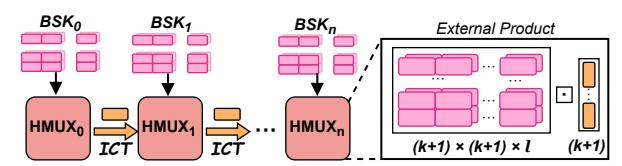
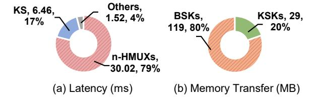
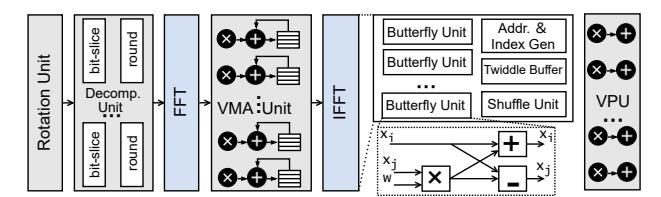
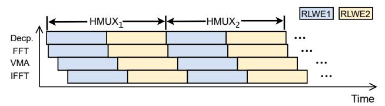
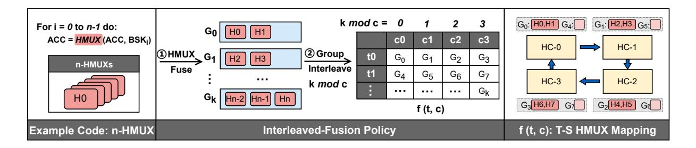
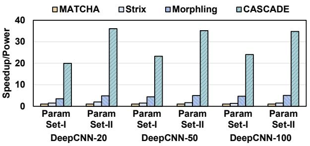
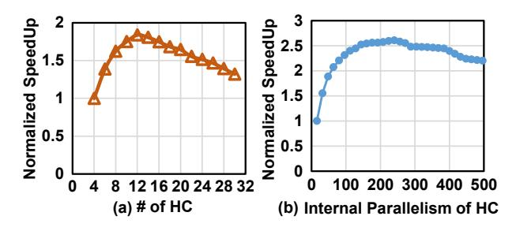
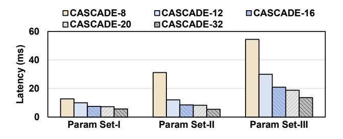
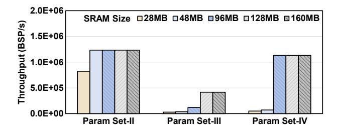

# Unlocking Pipeline Parallelism for Bootstrapping: A Pipelined Multi-Chiplet TFHE Accelerator

Yibo Du<sup>1</sup>,<sup>2</sup> , Mengdi Wang<sup>1</sup>B, Cangyuan Li<sup>1</sup> , Yinhe Han<sup>1</sup>B, Ying Wang<sup>1</sup>B <sup>1</sup> Research Center for Intelligent Computing Systems, State Key Lab of Processors, Institute of Computing Technology, Chinese Academy of Sciences, China <sup>2</sup> University of Chinese Academy of Sciences, China duyibo21@mails.ucas.ac.cn, {wangmengdi, licangyuan, yinhes, wangying2009}@ict.ac.cn

*Abstract*—TFHE (FHE over the Torus) is a promising fully homomorphic encryption scheme, but it suffers from significant performance overhead. Its performance is severely constrained by the n iterations of Homomorphic MUXs (HMUXs) within the bootstrapping procedure (n is an encryption parameter). To address this, prior works have proposed TFHE accelerators, which process these n iterations of HMUXs sequentially, fundamentally bottlenecking the overall throughput. In this paper, we explore the previously overlooked pipeline parallelism across HMUXs, overcoming the sequential execution bottleneck to achieve extraordinary throughput.

However, *unleashing this pipeline parallelism incurs extreme memory bandwidth pressure*, as each of the HMUXs requires access to a bootstrapping key (BSK) represented as high-degree polynomials, and n HMUXs access different BSKs. Conventional HBM-based solutions struggle to handle the massive concurrent BSK accesses needed to sustain the across-HMUX pipeline parallelism. To address this challenge, we propose a multi-chiplet pipelined architecture, which features a distributed SRAM hierarchy to buffer all BSKs so that BSK movement over off-chip memory can be eliminated. By keeping the BSKs resident within distributed on-chip SRAMs, which we call the BSK-distributed strategy, this distributed memory hierarchy confines intensive BSK access within each chiplet, resolving simultaneous BSK access conflicts. Furthermore, this architecture enables both intra- and inter-chiplet polynomial coefficientgrained pipeline to maximize resource utilization. *Another challenge arises from the inter-HMUX ciphertext transfers*, which could cause frequent die-to-die communication, and this interdie communication has higher latency than intra-die access. To address this, we propose an Interleaved-Fusion policy that fuses multiple contiguous HMUXs into groups and interleaves these groups across chiplets. As the optimal interleaved-fusion mapping varies under different encryption parameters (e.g., different iteration count n), we propose an Offline Interleaved-Fusion Scheduler with an Interleaved-Fusion Cost Model and a dynamic programming algorithm, minimizing the total execution time. Evaluation demonstrates a 3.1×–30.5× performance-perarea improvement on TFHE applications over state-of-the-art TFHE accelerators.

# I. INTRODUCTION

Fully Homomorphic Encryption (FHE) enables computation on encrypted data [1], emerging as a foundational technology for privacy-preserving applications. Among FHE cryptosystems, FHE over the Torus (TFHE) [2] is uniquely promising due to its programmable bootstrapping feature, which allows TFHE to efficiently support a wider variety of operations (e.g.,

B Corresponding authors are Ying Wang, Yinhe Han, and Mengdi Wang

logical and relational operators) [3] and makes it suitable for numerous privacy-preserving applications [4]–[9].

Despite its promise, TFHE suffers from significant performance overhead. A key source of this performance overhead lies in the n sequential iterations of homomorphic MUXs (HMUXs), also known as Blind Rotation, in the bootstrapping procedure, where n is an encryption parameter. To preserve cryptographic security, a large n is often required [2], [3]. Prior accelerators process n HMUX iterations sequentially [10]–[13], which makes their performance fundamentally constrained by this serial execution dependency.

In this paper, we exploit the previously overlooked pipeline parallelism among the n HMUXs, overcoming the sequential execution bottleneck to achieve extraordinary throughput. *However,* ➊ *unleashing this pipeline parallelism introduces extreme memory-bandwidth pressure from massive concurrent BSK access*. Each of the n HMUXs requires access to a unique bootstrapping key (BSK), which is represented as high-degree polynomials. This concurrent BSK access could create a dramatic memory-bandwidth requirement for the hardware. Prior works [10]–[12] attempt to mitigate massive BSK access by using High Bandwidth Memory (HBM) [14]. However, even with an optimized multi-level memory hierarchy, they cannot resolve the memory-bandwidth bottleneck caused by concurrent BSK access in cross-HMUX pipeline parallelism. The brute-force approach of provisioning more HBM stacks to meet the enormous bandwidth demand is fundamentally impractical. For instance, in Morphling [12], one HBM stack would consume nearly 30W of power, which is nearly 56% of the accelerator die's power. Therefore, scaling up the number of HBMs to sustain pipeline parallelism incurs unacceptable overheads in cost and power consumption.

To address this extreme bandwidth challenge, we propose a *multi-chiplet pipelined architecture* that features distributed on-chip SRAMs to store all BSKs (up to 126 MB), eliminating BSK movement over slow external memory. As BSKs can be reused by batching multiple bootstrappings, keeping them resident in on-chip SRAMs is a promising approach. To fully unleash the potential of this pipelined architecture, we design a fine-grained pipeline model with two levels: intrachiplet and inter-chiplet polynomial coefficient-grained (PCG) pipeline, which decentralizes BSK accesses across chiplets and confines each access within its local chiplet, removing the centralized bandwidth bottleneck.

Another challenge arises from the 2 intermediate ciphertext transfers (ICTs) between HMUXs. Each HMUX depends on the output ciphertext from the previous one, which introduces frequent ICTs and consequently causes severe D2D communication traffic. Existing locality-prioritized policies attempt to minimize D2D communication, such as widely used bootstrapping-level HMUX mapping [11], [12] and segmented mapping that evenly segments n HMUXs across c chiplets. However, these approaches either require expensive BSK duplication across all chiplets or incur severe pipeline bubbles due to coarse-grained mapping. To address this, we propose an Interleaved-Fusion policy that fuses contiguous HMUXs into multiple groups and interleaves these groups across the chiplets. By fusing HMUXs into a group, the ICTs within the group are confined to one chiplet, reducing D2D communications. Formally, this mapping is expressed by a two-dimensional temporal-spatial function, f(t, c), which represents the fused group mapped to the temporal layer t on chiplet c. Crucially, these groups may have variable fusion sizes. Our study shows that this flexible two-dimensional mapping unlocks several advantages, including avoiding the ICT bottleneck, reducing pipeline bubbles, and improving mapping utilization.

Finding the optimal mapping is non-trivial, as the ideal configuration varies under different encryption parameters (e.g., different iteration counts n). Therefore, we propose an Offline Interleaved-Fusion Scheduler (OIFS), which models this as an integer-partitioning problem and uses a dynamic programming algorithm to determine the optimal f(t,c).

This paper proposes CASCADE, a multi-chiplet pipelined TFHE accelerator that fully unleashes the potential of pipeline parallelism across HMUXs by addressing its two primary challenges: the extreme bandwidth pressure of concurrent BSK access and the intermediate ciphertext transfer bottleneck. CASCADE achieves significant performance-per-area improvement for practical applications, setting a new paradigm for high-efficiency TFHE acceleration. The key contributions of this paper are as follows:

- We identify the performance bottleneck resulting from the n HMUX iterations in TFHE bootstrapping, and propose \nexploiting the previously overlooked pipeline parallelism to overcome this sequential execution bottleneck and achieve high throughput.
- To address the extreme memory bandwidth demand from concurrent BSK access, we propose a multichiplet pipelined architecture, which features a distributed SRAM hierarchy with a BSK-distributed method to keep BSKs resident in distributed SRAMs, and intra- and interchiplet PCG pipelines to achieve high pipeline efficiency.
- To address frequent intermediate ciphertext transfers, we propose an Interleaved-Fusion mapping policy that combines the temporal and spatial mapping spaces, and an Offline Interleaved-Fusion-based scheduler that finds the optimal Interleaved-Fusion mapping under different encryption parameters.

#### **Algorithm 1** Programmable Bootstrapping (BSP)

```
Require: LWE ciphertext: c_{in} = (a_1, a_2, ..., a_n, b).
Require: RLWE ciphertext: c_{T}; GGSW ciphertexts: Bootstrapping Keys BSK; KeySwitching Keys: KSK.

Ensure: LWE ciphertext: c_{out}.

1: c \leftarrow \frac{2N}{q} \cdot c_{in}
2: (a_1, ..., a_n, b) \leftarrow c
3: ACC \leftarrow X^{-b} \cdot c_T
4: for (i \leftarrow 1; i \leq n; i \leftarrow i + 1) do Blind Rotation (BR)
5: BSK_i \leftarrow (X^{-\overline{a_i}} - 1) \cdot BSK_i
6: ACC_i \leftarrow BSK_i \boxdot ACC_{i-1}
7: end for
8: (a'_{i,1}, ..., a'_{i,l_{ks}}, b') = SampleExtract(ACC)
9: c_{out} \leftarrow (0, ..., 0, b') - \sum_{i=1}^{N} \sum_{j=1}^{l_{ks}} a'_{i,j} \cdot KSK_{i,j}
```

• We conducted experiments on TFHE applications and performed performance/area comparisons with TFHE accelerators. CASCADE achieves  $3.1 \times -30.5 \times$  speedup/area over prior TFHE accelerators.

#### II. BACKGROUND AND MOTIVATION

# A. Fully homomorphic encryption over the Torus (TFHE)

Fully homomorphic encryption (**FHE**) is a leading privacy-preserving cryptographic technique that enables direct computation on encrypted data and is resistant even to quantum attacks [15]–[17]. TFHE (FHE over the Torus) is an FHE scheme based on the learning with errors (LWE) problem [18], offering superior *bootstrapping* (BSP) efficiency. BSP can refresh noise accumulated in ciphertexts during computation without decryption [15].

TFHE offers several advantages, especially through its BSP mechanism. **First**, compared with alternative FHE schemes such as CKKS [19], TFHE has lower memory consumption. TFHE requires bootstrapping keys (BSKs) at the 10s–100s MB scale, while CKKS requires GB-scale BSKs. **Second**, with *programmable bootstrapping*, TFHE can efficiently evaluate arbitrary univariate functions [3]. Specifically, TFHE bootstrapping iteratively rotates a look-up table (LUT) across its *n* iterations. By encoding a function in the LUT, BSP evaluates that function homomorphically. This is why it is often called programmable bootstrapping. TFHE was initially limited to Boolean operations; it has been extended to include operations for integers [20]–[22]. ZAMA has deployed various TFHE-based neural networks for private inference (PI) [3], [21], [23].

Encrypted Parameters and Ciphertext Structure. TFHE encryption parameters are shown in Table I, which include parameter sets that achieve the 128-bit security level and are representative of practical, high-security scenarios. TFHE has several ciphertext structures: an LWE ciphertext is a vector of length n. Ring LWE (RLWE) is a (k+1)-vector of degree-N polynomials. General GSW (GGSW) ciphertext is an  $L \times (k+1) \times (k+1)$  polynomial matrix, where each element is a degree-N polynomial.

#### B. TFHE Bootstrapping

1) n-iteration HMUX in bootstrapping: TFHE faces a fundamental performance challenge: the iterative ciphertext



Fig. 1. *n*-iteration HMUX in bootstrapping. Each HMUX accesses a BSK and transfers intermediate ciphertext (ICT). The external product inside HMUX is a matrix-vector multiplication between the BSK and ACC.

TABLE I
TFHE ENCRYPTION PARAMETERS.

| Parameter Set | n   | N    | L | k | Security Level |
|---------------|-----|------|---|---|----------------|
| I             | 500 | 1024 | 2 | 1 | 80-bit         |
| II            | 600 | 1024 | 3 | 1 | 110-bit        |
| III           | 592 | 2048 | 3 | 1 | 128-bit        |
| IV            | 478 | 512  | 3 | 3 | 128-bit        |

manipulations in bootstrapping. Algorithm 1 describes bootstrapping. The core of BSP consists of the n iterations, as shown in Algorithm 1, lines 4–6, which perform **Homomorphic Multiplexer (HMUX)**. Figure 1 illustrates this iterative process. Each  $HMUX_i$  requires a bootstrapping key  $(BSK_i)$  and the intermediate ciphertext produced by the previous  $HMUX_{i-1}$ . As a result, these iterations are strictly sequential, forming a long chain of data dependencies and limiting computational throughput.

- 2) Data Operands and Computational Kernels: This iterative structure is defined by two key data flows:
  - Concurrent BSK Access: Each of the n HMUXs accesses a unique bootstrapping key (BSK<sub>i</sub>).
  - Intermediate Ciphertext Transfers (ICTs): Each  $HMUX_i$  requires the output of  $HMUX_{i-1}$  (ACC), creating intermediate ciphertext transfers.

The BSK is a GGSW ciphertext, an  $L \times (k+1) \times (k+1)$  polynomial matrix where each element is an N-degree polynomial. The intermediate ciphertext, ACC, is an RLWE ciphertext.

The computation within each  $HMUX_i$  involves two main steps: BSK rotation (Line 5) and external product (EP) (Line 6). The external product dominates the computational cost, performing a matrix-vector multiplication (an  $L \times (k+1) \times (k+1)$  matrix by a (k+1)-vector) where each element is an N-degree polynomial. To optimize polynomial multiplication, FFT/IFFT (Fast Fourier Transform) is used to convert polynomial multiplication into element-wise multiplication, reducing the complexity from  $O(N^2)$  to  $O(N\log_2 N)$ . After the n HMUXs, key switching is performed, which involves scalar multiplication between the LWE ciphertext and key-switching keys. BSKs serve as the parameters of BSP and can be reused across multiple BSP executions under the same encryption parameters. However, a BSK cannot be reused across different  $HMUX_i$  within a BSP.

3) **Performance Bottleneck**: This unique iterative nature makes BSP the dominant bottleneck in TFHE. We measure the execution time of TFHE computation on an Intel(R) Xeon(R) 6148 CPU. As shown in Figure 2 (a), the *n*-iteration HMUXs occupy 79% of the total execution time, making them the most severe performance bottleneck in BSP. Furthermore,



Fig. 2. (a) BSP execution-time breakdown on CPU (running parameter Set III). (b) Memory breakdown in bootstrapping.


Fig. 3. The arithmetic intensity of n-HMUX, which is significantly lower than the balanced machine balance point of the NVIDIA A100 GPU. The A100 GPU has a peak computational performance of 624 TOPS and a memory bandwidth of 1555 GB/s [24]. Its balanced machine balance point is 440 GOPS/s.

measurements of data movement in BSP show that BSK transfers dominate all other data movement, accounting for 80% of total data transfer, as shown in Figure 2 (b).

#### C. Motivational Study

1) Potentials of n-HMUX Pipeline Parallelism: Prior works process these n iterations sequentially, making their performance fundamentally constrained by serial execution dependencies. To quantify this, let  $t_{HMUX}$  denote the execution latency of one HMUX. The nominal throughput is approximately  $Thp_{seq} \approx \frac{1}{n \times t_{HMUX}}$ . In practice, n is large, because a high iteration count is often required to preserve cryptographic security. Thus, the achievable throughput faces a hard ceiling imposed by n, regardless of how well  $t_{HMUX}$  is optimized.

In contrast, pipeline parallelism across n HMUXs offers a transformative alternative. When the n HMUXs are ideally pipelined, the steady-state initiation interval becomes bounded by the latency of a single HMUX, and the ideal throughput becomes  $Thp_{pipe} \approx \frac{1}{t_{HMUX}}$ .

This reveals that pipeline parallelism can yield a theoretical throughput improvement of up to  $n \times$ . Unlocking this potential to achieve massive, large-scale TFHE speedups is the core motivation of this work.

2) Extreme Bandwidth Challenge of Pipeline Parallelism: Unleashing this pipeline parallelism introduces a severe challenge: massive **concurrent BSK access**. Pipeline parallelism across HMUXs requires each of the n HMUXs to access a unique, large-scale BSK and therefore requires concurrent access to n BSKs, creating dramatic memory-bandwidth pressure on hardware. This extreme memory-bandwidth pressure cannot be solved by increasing the batch size alone. Although batching multiple bootstrappings can improve BSK reuse, it does not fundamentally change the extremely low arithmetic intensity or remove the memory-bandwidth bottleneck, as

shown in Figure 3. Therefore, pipeline parallelism in n-HMUX remains severely challenged by concurrent BSK access.

Pipeline parallelism was not merely overlooked by prior studies [10]-[12]; it was actively foregone because prior TFHE accelerators rely on a centralized memory hierarchy that cannot sustain massive concurrent BSK access. For instance, Morphling [12] uses a centralized multi-level memory hierarchy (on-chip buffers and HBM) to improve data reuse. Although Morphling employs batching to increase BSK reuse, it still cannot resolve the significant memory-bandwidth demands caused by concurrent BSK access. Therefore, prior accelerators enforce sequential BSK access to avoid bandwidth collapse. To supply the required bandwidth, centralizedmemory TFHE accelerators would need to add more HBM stacks to support cross-HMUX pipeline parallelism. However, provisioning additional HBM stacks to match this dramatic bandwidth demand is fundamentally impractical, as it incurs prohibitive cost and power consumption. Therefore, a new architectural paradigm is required to unlock high-throughput TFHE acceleration.

# III. CASCADE: A MULTI-CHIPLET PIPELINED TFHE ACCELERATOR

We propose CASCADE, a multi-chiplet pipelined TFHE accelerator that exploits cross-HMUX pipeline parallelism. The key insight behind CASCADE is to • store all BSKs in distributed on-chip SRAMs and • execute these n HMUXs in a pipelined manner. CASCADE is provisioned with 126 MB of BSK SRAM, sufficient to accommodate encryption parameters up to the 128-bit security level. To reduce the high cost of a monolithic chip design, CASCADE introduces a distributed memory hierarchy that distributes SRAM across chiplets.

By keeping the BSKs resident in distributed on-chip SRAMs, which we call the **BSK-distributed strategy**, CAS-CADE not only eliminates most off-chip BSK transfers, but also confines intensive BSK accesses within each chiplet, preventing the BSK access conflicts and inflexibility caused by the centralized memory hierarchies of prior TFHE accelerators.

We first introduce the multi-chiplet pipeline in Sec. III. To address frequent intermediate-result transfers through D2D communication, CASCADE is co-designed with the Interleaved-Fusion mapping policy (Sec. IV) and offline scheduler (Sec. V), which are essential for hiding D2D latency.

#### A. Architecture Overview

The CASCADE architecture overview is shown in Figure 4. CASCADE consists of C HMUX Chiplets (HCs). 12 HCs are organized in a  $4\times3$  grid and interconnected in a ring topology via high-speed D2D (die-to-die) links (e.g., UCIe [25]). This ring topology allows the final chiplet  $(HC_{C-1})$  to pass data back to the first chiplet  $(HC_0)$ , enabling deep and flexible pipeline execution.

# B. HMUX Chiplet (HC) Organization

As shown in Figure 4 (right), each HC comprises multiple dedicated functional units designed to match the computational


Fig. 4. CASCADE Architecture Overview.


Fig. 5. Illustration of intra- and inter-HC pipeline execution.

flow of HMUX. Each HC includes a Rotation Unit, a Decomposition Unit, an FFT Unit, a Vector-Multiplication-Addition (VMA) Unit, and an IFFT Unit. These units are fully pipelined to process a stream of ciphertexts in a dataflow manner. A full traversal through these pipelined functional units corresponds to one complete HMUX. Each HC also contains input/output buffers, which are double-buffered to hide the D2D latency of receiving the next intermediate ciphertext while the core processes the current one. It also integrates BSK SRAM and a D2D PHY. All HCs are architecturally identical, with one exception: the first chiplet  $(HC_0)$  also integrates a Vector Processing Unit (VPU), which is responsible for key-switching and other pre- and post-processing operations, preventing them from disrupting the high-throughput HMUX pipeline.

#### C. Intra- and Inter-HC Pipeline

To satisfy the unique data dependency of bootstrapping  $(HMUX_i \rightarrow HMUX_{i+1})$ , CASCADE is designed with a fine-grained intra- and inter-HC pipeline. As shown in Figure 5, CASCADE has two levels of pipelining: an Intra-HC Pipeline and an Inter-HC Pipeline, both operating at polynomial coefficient granularity (PCG). The Intra-HC Pipeline streams the intermediate results between internal function units, which is supported by a streaming datapath inside the HC. Instead of waiting for an entire RLWE ciphertext to be processed at one stage, the PCG pipeline model streams the coefficients of a polynomial to the next functional unit as soon as they are computed. This fine-grained execution overlaps the execution, keeps all functional units busy, and achieves a high degree of internal parallelism.

The Inter-HC Pipeline streams the intermediate result (ACC) between HCs. As soon as an upstream HC completes the computation for a polynomial's coefficients, it transmits



Fig. 6. Microarchitecture of the HMUX Chiplet (HC).

the polynomial to its downstream HC without waiting for the entire RLWE result to complete. This fine-grained model effectively minimizes the memory footprint required for buffering. We use D2D PHYs compliant with the UCIe specification, supporting a data transfer rate of 16 GT/s [25].

#### D. Inter-HC BSK-Stationary Dataflow

CASCADE proposes a BSK-stationary, RLWE-flowing dataflow. Bootstrapping keys (BSKs) remain resident in the private SRAM of each HC as stationary data, while intermediate RLWE ciphertexts flow between chiplets via D2D links. All HCs compute in parallel: in every time slot, each HC transfers its output to its downstream HC and simultaneously receives a ciphertext from its upstream HC, ensuring high utilization of all compute resources. Furthermore, the ring topology allows the system to efficiently process HMUX chains where n is much larger than C. The intermediate RLWE ciphertexts simply circulate through the HC ring multiple times until all n iterations are complete.

The rationale for this BSK-stationary design, rather than an RLWE-stationary design, is that the BSK is significantly larger than the RLWE. By keeping the BSKs stationary, our dataflow avoids moving the largest data component across the D2D interface, thereby alleviating the D2D communication bottleneck.

#### E. Intra-HC Microarchitecture

The architecture of the HMUX Chiplet is shown in Figure 6. Each chiplet implements a streaming HMUX datapath composed of several dedicated processing units (PUs) that are deeply pipelined to sustain high throughput on incoming ciphertext streams. The primary PUs are the Rotation Unit, Decomposition Unit, VMA (Vector Multiplication-Add) Unit, and FFT/IFFT Modules.

- 1) Decomposition Unit: The Decomposition Unit performs bitwise decomposition for the coefficients in the polynomial. It decomposes (k+1) polynomials into  $(k+1) \times l$  polynomials. This allows the external product to be implemented as a series of multiplications and accumulations between BSK polynomials and ACC polynomials. The decomposition consists of two steps: bit-slicing each coefficient and then rounding the result.
- 2) VMA (Vector Multiplication-Add) Unit: The VMA Unit computes the external product, which is a vector-matrix multiplication of polynomials between ACC and BSK, as illustrated in Figure 6. The VMA Unit has a vector multiplication unit for element-wise multiplication, because the multiplications between BSK polynomials and ACC polynomials become

coefficient-wise multiplications after FFT, and an accumulator for coefficient-wise addition.

- 3) FFT/IFFT Unit: CASCADE implements the FFT/IFFT Unit to optimize polynomial multiplication in TFHE. FFT reduces the complexity of polynomial multiplication from  $O(N^2)$  to  $O(N \log_2 N)$ , where N is the degree of the polynomial. After the input polynomials are transformed by FFT, multiplication of two polynomials is performed as element-wise multiplication. The FFT transformation consists of  $\log_2 N$  stages of butterfly computations. Each stage can be executed by multiple parallel butterfly units. The microarchitecture of the butterfly unit is shown in Figure 6. We exploit parallelism and pipelining when computing and mapping FFT: BU butterfly units perform butterfly computations in parallel, processing  $2 \cdot BU$  coefficients of a polynomial. This allows us to execute the  $\log_2 N$  stages in approximately  $\log_2 N \cdot \frac{N}{2 \cdot BU}$  cycles. The FFT controller is responsible for address generation, which maps the data within each stage into the butterfly units using the address assignment method proposed in [26]. Based on the conflict-free index generation and address assignment principles in [26], we implement the FFT controller with an address generator to avoid access conflicts and ensure that the coefficients needed for parallel butterfly operations can be fetched in parallel. Since the Decomposition Unit decomposes polynomials into smaller-valued polynomials, it creates an imbalanced workload between FFT and IFFT: the FFT Unit needs to process more polynomials. To maintain pipeline utilization, the FFT Unit is allocated more resources than the IFFT Unit.
- 4) Rotation Unit: The Rotation Unit is responsible for performing negacyclic rotation and polynomial subtraction. It takes  $ACC_{i-1}$  and the corresponding mask, performs cyclic rotation, and subtracts polynomials.
- 5) Vector Processing Unit: The Vector Processing Unit (VPU) is responsible for executing other lightweight operations, such as key-switching, homomorphic addition, sample extraction, and scalar multiplication on ciphertexts. These operations account for a smaller fraction of the computational burden than blind rotation (n HMUXs). Because these operations are element-wise, the VPU is implemented with parallel multipliers, adders, and local buffers. This VPU is integrated into the first chiplet and works in parallel with the other functional units to avoid interrupting the HMUX pipeline.
- 6) Distributed BSK SRAMs: Each chiplet houses a BSK buffer that stores a partition of the BSK set. The chiplet also embeds a small local buffer that holds temporaries such as ACC, as well as input/output double buffers that enable overlap between computation and D2D transfer. For this purpose, each HC integrates a total of 11.5 MB of SRAM (10.5 MB for the BSK buffer, 768 KB for the local buffer, 128 KB for the input buffer, and 128 KB for the output buffer). The first chiplet  $(HC_0)$  integrates a slightly larger 12 MB SRAM to additionally store key-switching keys for the VPU.


Fig. 7. An example of mapping HMUXs on four HCs.



Fig. 8. An example of an intra-HC pipeline fusing two HMUXs in one HC.

#### IV. INTERLEAVED-FUSION MAPPING POLICY

CASCADE's BSK-distributed strategy decentralizes concurrent BSK accesses across chiplets and eliminates largescale BSK movement. However, this architecture introduces frequent intermediate ciphertext transfers (ICTs) between chiplets, which can lead to substantial D2D communication traffic. Figure 7 (a) shows that naively interleaving each HMUX across HCs to maximize parallelism makes D2D communication the bottleneck, because the D2D communication latency is higher than the HMUX computation time. As a result, the HCs are severely underutilized. This bottleneck cannot be resolved by simply increasing the inter-HC batch size. In the example in Figure 7 (a), the inter-HC batch size is four to keep four pipelined HCs busy. However, inter-HC batching proportionally increases the amount of ICTs that must cross chiplet boundaries and therefore does not reduce the total cross-chiplet communication volume.

We propose an Interleaved-Fusion (IF) mapping policy that fuses contiguous HMUXs into groups and interleaves these groups across different chiplets. The core insight of the IF policy is to execute multiple contiguous HMUXs locally, so that the intermediate ciphertexts between these HMUXs remain within the chiplet, thereby reducing the frequency of ICTs instead of issuing them after every HMUX. Meanwhile, the IF policy interleaves different fused groups to preserve high pipeline parallelism. Figure 7 (b) illustrates that, by fusing two HMUXs, the computation time of a stage ( $T_{Group} = T_{H0} + T_{H1}$ ) becomes close to the D2D communication latency.

When the IF policy fuses multiple HMUXs onto a chiplet, the intermediate result of one HMUX is fed back to the HC input and re-executed through the same functional units. As

illustrated in Figure 8, for RLWE1, the ciphertext traverses the streaming PCG pipeline to complete  $HMUX_1$ , and its output is then fed back to traverse the same functional units to complete  $HMUX_2$ . Because these functional units are organized as a polynomial coefficient-grained streaming pipeline, their executions can overlap in time rather than requiring one functional unit to finish the entire computation before the next functional unit starts; thus, the latency of one HMUX is approximately determined by the longest pipeline stage. To avoid bubbles in the functional units, multiple ciphertexts (e.g., RLWE2) are injected into a HC (intra-HC batching), allowing different ciphertext computations to overlap.

Figure 9 shows the two-step Interleaved-Fusion policy.

- First, the Interleaved-Fusion policy partitions n HMUXs into k contiguous groups  $(G_0 \dots G_k)$ .
- Then, it interleaves these contiguous groups across the C chiplets in a cyclic temporal-spatial order.

For instance, with four chiplets,  $G_0$  is assigned to  $C_0$  (0 mod 4),  $G_1$  to  $C_1$  (1 mod 4), and so on. This Interleaved-Fusion mapping can be represented by a two-dimensional temporal-spatial matrix f(t,c), where t denotes the temporal layer (interleaving stage) and c denotes the chiplet index, as shown in Figure 9. The function f(t,c) represents the HMUXs fused and assigned to the corresponding temporal-spatial slot.

#### V. OFFLINE INTERLEAVED-FUSION SCHEDULER

The Interleaved-Fusion policy combines spatial and temporal dimensions, offering strong potential for balancing D2D communication. However, this flexibility also greatly enlarges the mapping design space. Partitioning the n HMUX iterations into fused groups, represented by the mapping function f(t,c), becomes a nonlinear integer-partitioning problem that directly affects pipeline utilization, workload balance, and overall execution time. As a result, finding an efficient mapping is nontrivial. Two mapping penalties must be considered:

- Empty-slot penalty. When the fusion configuration in f(t,c) is suboptimal, many empty slots (f=0) appear in the mapping matrix. For example, in Figure 10, when n=17 and C=4, partitioning HMUXs into fixed-size groups (two in this example) leaves three empty slots ("NA" in the figure) in the final temporal layer, wasting compute cycles.
- **Bubble penalty.** When the fusion granularity is too coarse, each fused group contains more HMUXs, which increases pipeline bubble overhead ( $T_{bubble}$ ) during pipeline startup and draining. For example, segmented HMUX mapping evenly divides the n HMUXs into C segments, but this coarse-grained mapping increases bubble overhead.

We introduce an Offline Interleaved-Fusion Scheduler (OIFS) to determine the optimal f(t,c) configuration. Unlike fixed fusion, where every group contains the same number of HMUXs, OIFS allows groups to have different sizes. This flexibility is important because the scheduler can tolerate slight workload imbalance if doing so eliminates empty slots and reduces total execution time.



Fig. 9. Illustration of the Interleaved-Fusion Mapping Policy. In this example, the number of HCs is four.

- 1) Problem Formulation: OIFS formalizes the mapping task as a constrained 2D integer-partitioning problem, where n HMUXs are partitioned into groups and assigned to a mapping matrix f(t,c). The scheduler's goal is to search for an optimal f(t,c) that satisfies two conditions:
  - Completeness Constraint: The sum of the number of HMUXs in all fused groups must equal n,  $\sum_{t,c} |f(t,c)| = n$ .
  - Optimization Objective: Minimize the total execution time represented by a cost function T<sub>total</sub>.

In this formulation, t indexes the interleaving layer  $(t=0,1,\ldots)$ , and c indexes the chiplet  $(c=0,\ldots,C-1)$ . Each f(t,c) represents the fused HMUXs assigned to chiplet c at temporal stage t, and |f(t,c)| denotes the number of HMUXs within that group. If |f(t,c)| = 0, the corresponding pipeline slot is idle; this empty slot contributes no progress but increases latency.

2) Interleaved-Fusion Cost Model (IFCM): To guide OIFS in finding the optimal f(t,c), we develop the Interleaved-Fusion Cost Model. This model accurately estimates the total execution time  $(T_{task})$  for a given B parallel BSPs.

We model the total execution time  $T_{task}$  as the sum of the steady-state pipeline runtime  $(T_{run})$  and the pipeline bubble overhead  $(T_{bubble})$ , as shown in Equation 1.

$$T_{task} = T_{run} + T_{bubble} \tag{1}$$

CASCADE can process multiple independent BSPs in parallel. We define the system batch size (bs) as the total number of RLWE bootstrappings that the C chiplets can sustain, which is C times the intra-HC batch size in one HC. An application layer with B total BSPs will therefore require W waves of execution, where  $W = \lceil B/bs \rceil$ , as shown in Equation 2. The execution time for processing bs RLWE bootstrappings is the duration from when the first RLWE enters the pipeline to when the last RLWE completes, which equals the sum of  $T_{exe}(t,c)$  across the temporal (t) and chiplet (c) dimensions.  $T_{exe}(t,c)$  is the execution time for a single fused group at a given temporal-spatial slot. This time is governed by the fundamental trade-off of our architecture: it is the maximum of the local computation time and the D2D communication latency  $(T_{comm})$  of ICTs. The local computation time is the time for a single HMUX  $(T_{comp})$  multiplied by the fusion size,

|    | c0     | c1     | c2     | сЗ     | <u> </u>      | <b>③</b> | f (t, c) | update |        |        |
|----|--------|--------|--------|--------|---------------|----------|----------|--------|--------|--------|
| t0 | H0,1   | H2,3   | H4,5   | H6,7   |               |          | c0       | c1     | c2     | с3     |
| t1 | H8,9   | H10,11 | H12,13 | H14,15 | $\Rightarrow$ | t0       | H0,1     | H2,3   | H4,5   | H6,7   |
| t3 | H16,17 | NA     | NA     | NA     |               | t1       | H8,9     | H10,11 | H12~14 | H15~17 |

Fig. 10. An example of updating f(t,c) to find the optimal configuration. Left: evenly dividing 17 HMUXs causes three empty slots ("NA").

|f(t,c)|, as shown in Equation 3. This equation accurately captures how fusion, through a larger |f(t,c)|, helps hide the  $T_{comm}$  bottleneck.

$$T_{run} = \left\lceil \frac{B}{bs} \right\rceil \sum_{t} \sum_{c} T_{exe}(t, c) \tag{2}$$

$$T_{exe}(t,c) = max(T_{comp} \times | f(t,c) |, T_{comm})$$
 (3)

3) Optimization Algorithm: To efficiently solve this complex nonlinear integer-programming problem, our core method is dynamic programming (DP). To find the optimal f(t,c), the proposed algorithm first fuses n HMUXs into k groups  $(f_1,f_2,\ldots,f_k)$ , where  $f_j$  is the size (number of HMUXs) of the j-th group, and the total sum  $\sum f_j = n$ . These k groups are placed into the 2D f(t,c) matrix, and our cost model (IFCM) then accurately calculates the total cost. The goal is to find the k and all  $f_j$  ( $f_j$  could be different across groups) that minimize the total cost.

We define the DP state as DP[j][r], which represents the minimum  $T_{run}$  cost to partition the first j HMUX tasks using exactly r fusion groups. The algorithm proceeds in two steps:

- DP pre-computation: The algorithm first fills the DP table to compute the row DP[n][k] for all possible group counts k (from 1 to n). This DP[n][k] state contains the optimal  $T_{run}$  cost for partitioning n HMUXs into exactly k groups, without requiring fixed fusion sizes across groups.
- O(n) search: After DP[n][k] is filled, the algorithm performs a simple linear scan over the possible group counts k. The k that minimizes  $T_{task}$  is the global optimum.

To make this DP algorithm scalable and computationally tractable, we introduce two key pruning strategies. First, we accelerate DP state transitions by enforcing a maximum fusion granularity,  $S_{max}$ . This prunes the search space by preventing the algorithm from exploring impractically large fusion groups that would create massive pipeline bubbles. Second, we prune


Fig. 11. Workflow of OIFS.

the final O(n) search by enforcing a minimum group count, kmin (e.g., kmin = C), which discards inefficient solutions that fail to utilize the available chiplet-level parallelism.

*4) Workflow of OIFS:* Building on the above analysis, OIFS finds the optimal f(t, c) for a given workload. As shown in Figure 11, the OIFS workflow consists of three main stages:

First, OIFS parses the input TFHE workload and builds a BSP-level computation graph. This graph is composed of layers of BSP nodes. Within a layer, BSP nodes can be processed in parallel, while nodes in different layers cannot be executed in parallel. Each BSP node also encapsulates other lightweight, non-BSP operations. OIFS analyzes the total number of parallelizable BSP tasks (B), which is used to estimate the total task execution time.

Next, OIFS uses the cost model (IFCM) and the DP algorithm to find the optimal 2D mapping matrix, f(t, c). The objective of the DP algorithm is to minimize the total task latency (Ttask), not just to optimize D2D communication.

Finally, OIFS compares the optimal cost across all possible k and finds the globally optimal f(t, c) matrix, guiding the CASCADE architecture to map HMUX tasks and place the BSKs, thereby achieving the minimum possible latency.

OIFS serves as the compiler-level scheduler that deploys the TFHE applications to CASCADE by automatically constructing the task graph from the input application and generating an optimized execution schedule.

# VI. EVALUATION

# *A. Experimental setup*

Hardware Implementation. We implemented one CAS-CADE HMUX Chiplet in RTL and synthesized it using Synopsys Design Compiler with the TSMC 28nm library to obtain area and power. The clock frequency is set to 1.2 GHz. For die-to-die (D2D) communication, we model the D2D interconnect using the Universal Chiplet Interconnect Express (UCIe) Advanced specification, with a data transfer rate of 16 GT/s (transfers per second, where a "transfer" refers to one signaling event on a 1-bit physical lane) and a 64-bit data width [27], achieving 1024 Gbps of D2D bandwidth. The UCIe PHY area and power are also estimated according to [27]. The full CASCADE accelerator organizes 12 HCs in a 4 × 3 grid. The hardware configuration of one HC is shown in Table II. The HC includes five function units, a 10.5 MB BSK SRAM, and 1 MB of internal buffers (768 KB for the local buffer, 128 KB for the input buffer, and 128 KB for the output buffer). CASCADE's fine-grained pipeline achieves a low memory footprint and therefore requires only small internal buffers. The total area of a single HC is 92.5

TABLE II HARDWARE CONFIGURATION OF HMUX CHIPLET AND CASCADE.

| Area (mm2<br>) | TDP (W)    |
|----------------|------------|
|                | 0.1        |
| 35.5           | 5          |
| 16.2           | 2.2        |
| 8.1            | 2.6        |
|                | <0.1       |
| 22.2           | 11.6       |
| 1.9            | 0.4        |
| 8.1            | 8          |
| 92.5           | 29.91      |
| 60.1           | 13.8       |
| 1170.1         | 372.72     |
|                | 0.4<br>0.1 |

TABLE III COMPARISON OF CASCADE WITH BASELINES ACROSS DIFFERENT IMPLEMENTATION PLATFORMS.

|                | Platform                 | Param. Set     | Latency (ms)         | Thp (BSP/s)                       |
|----------------|--------------------------|----------------|----------------------|-----------------------------------|
| CPU            | Concrete [28]            | I<br>II<br>III | 15.6<br>26.2<br>80.8 | 64<br>36<br>15                    |
| GPU            | nuFHE [29]<br>cuFHE [30] | I<br>I         | 36<br>67             | 2,000<br>6,000                    |
| FTP [31]       | FPGA                     | I              | 0.7                  | 28,400                            |
| MATCHA [10]    | ASIC                     | I              | 0.2                  | 10,000                            |
| Strix [11]     | ASIC                     | I<br>II<br>III | 0.16<br>0.23<br>0.44 | 74,696<br>39,600<br>21,104        |
| Morphling [12] | ASIC                     | I<br>II<br>III | 0.11<br>0.2<br>0.38  | 147,615<br>78,692<br>41,850       |
| CASCADE        | ASIC                     | I<br>II<br>III | 0.01<br>0.02<br>0.04 | 2,133,624<br>1,235,248<br>416,408 |

mm<sup>2</sup> . The first chiplet (HC0) consumes an additional 60.1 mm<sup>2</sup> for the integrated Vector Processing Unit (VPU).

Performance Modeling. To evaluate the performance of CASCADE, we developed a cycle-accurate simulator based on the method in [32]. This simulator models the microarchitectural behavior of each function unit within the HCs and D2D communication, to measure execution time in cycles. The simulator integrates the proposed Offline Interleaved-Fusion Scheduler. It tracks data dependencies and communication between BSPs, determines the optimal Interleaved-Fusion mapping for a given workload, and measures the total execution time.

Baselines. We use CPU, GPU, and state-of-the-art (SOTA) TFHE accelerators as baselines. CPU: Intel(R) Xeon(R) Platinum 8275 CPU @ 3.00 GHz. GPU: NVIDIA A100, which has 2.4 TB/s memory bandwidth. SOTA TFHE accelerators include MATCHA [10], Strix [11], and Morphling [12]. These accelerators are equipped with HBM. For a fair comparison, all accelerators are scaled to the same technology node and the same frequency. For instance, MATCHA has an area of


Fig. 12. Performance comparison of CASCADE with baselines on DeepCNN-20, DeepCNN-50, and DeepCNN-100.


Fig. 13. Area-normalized performance (Speedup/Area) comparison with TFHE ASICs. All performance speedups are normalized to MATCHA.



Fig. 14. Power-normalized performance (Speedup/Power) comparison with TFHE ASICs. All performance speedups are normalized to MATCHA.

36.9 mm<sup>2</sup> in PTM 16nm, equivalent to 156 mm<sup>2</sup> when scaled to TSMC 28nm [33].

**Benchmarks.** We evaluate CASCADE using both microbenchmarks and end-to-end application benchmarks. The encryption parameters used in our evaluation are listed in Table I, which are recommended by [28], [34], [35].

- Micro-benchmark: bootstrapping. We evaluate bootstrapping steady-state throughput (n-iterations).
- Application benchmarks: We assess end-to-end performance on DeepCNNs, privacy-preserving inference (PI) workloads from ZAMA [3]. We evaluate three configurations: DeepCNN-20, DeepCNN-50, and DeepCNN-100, corresponding to networks with 20, 50, and 100 layers, respectively. We also evaluate XG-Classifier [36], Encrypted-AES [6], and VGG-9 for CIFAR-10 image classification [23].

#### B. Evaluation Results

1) **Performance on micro-benchmarks:** Table III presents the latency and steady-state throughput of CASCADE and prior works on micro-benchmarks.

TABLE IV
CASCADE UTILIZATION ON DIVERSE APPLICATIONS.

| Benchmarks    | CPU (s) | GPU (s) | CASCADE (ms) | Utilization |
|---------------|---------|---------|--------------|-------------|
| XG-Classifier | 8.7     | 0.9     | 0.16         | 91.03%      |
| AES           | 54.3    | 5.6     | 3.2          | 91.39%      |
| VGG9          | 146     | 9.4     | 5.9          | 97.18%      |

2) Performance on application benchmarks: Then, we evaluate CASCADE on DeepCNN inference. As shown in Figure 12, CASCADE achieves, on average, 2201.5×, 770.6×, 229.2×, 129.4×, and 48.5× speedup compared with CPU, GPU, MATCHA, Strix, and Morphling, respectively. When normalized by area, as shown in Figure 13, CASCADE achieves 30.5×, 15.6×, and 3.1× higher Speedup/Area than MATCHA, Strix, and Morphling, respectively. Then, we normalize speedup by power (Speedup/Power). As shown in Figure 14, CASCADE delivers 22.3×, 16.4×, and 5.2× higher performance-per-power than MATCHA, Strix, and Morphling, respectively. For the baseline accelerators, the power model includes the HBM stack power.

These results demonstrate the superior performance-per-area of CASCADE. The main reason for the high performance improvement is threefold. First, intra-HC and inter-HC polynomial coefficient-grained pipeline. CASCADE implements intra-HC and inter-HC polynomial coefficient-grained (PCG) pipelines, which achieve overlapped execution and significantly improve throughput. Meanwhile, the proposed BSK-distributed strategy enables pipeline parallelism without being overwhelmed by concurrent BSK accesses, removing the off-chip memory bandwidth bottleneck. Second, Interleaved-Fusion policy. CASCADE uses a novel Interleaved-Fusion policy to alleviate the frequent intermediate ciphertext transfers (ICTs) that cause severe D2D communication traffic. **Third, OIFS.** CASCADE uses OIFS to find the optimal mapping configuration for a given workload, minimizing pipeline empty-slot penalties and improving mapping utilization.

# C. Performance Analysis

1) Utilization Analysis: We evaluate CASCADE on diverse applications and measure its utilization. Table IV lists the results of CASCADE on XG-Classifier [36], Encrypted-AES [6], and VGG-9 [23] under parameter set III. XG-Classifier is a tree-based classification model that performs comparisons at

TABLE V LATENCY BREAKDOWN, HARDWARE UTILIZATION, AND D2D BANDWIDTH UTILIZATION OF CASCADE RUNNING DIFFERENT APPLICATIONS AND ENCRYPTION PARAMETERS WITH THE PROPOSED OIFS, SEGMENTED HMUX MAPPING (SHM), AND FIXED-FUSION MAPPING (FFM).

|                                 |      |            | Latency (ms) |              |        | Average Utilization |                         |                    |
|---------------------------------|------|------------|--------------|--------------|--------|---------------------|-------------------------|--------------------|
|                                 |      | Avg. Comp. | Avg. Comm.   | Pipeline Run | Bubble | Total Execution     | HC Resource Utilization | D2D BW Utilization |
| DeepCNN-50<br>(Param Set-I)     | OIFS | 1.15       | 0.92         | 3.93         | 0.15   | 4.08                | 95.9%                   | 76.8%              |
|                                 | SHM  | 1.15       | 0.12         | 3.93         | 1.06   | 5.00                | 76.8%                   | 7.7%               |
|                                 | FFM  | 1.15       | 0.96         | 4.20         | 0.13   | 4.33                | 90.7%                   | 75.7%              |
| DeepCNN-50<br>(Param Set-II)    | OIFS | 1.45       | 1.15         | 6.96         | 0.15   | 7.11                | 96.7%                   | 76.9%              |
|                                 | SHM  | 1.45       | 0.12         | 6.96         | 1.34   | 8.30                | 76.8%                   | 6.1%               |
|                                 | FFM  | 1.45       | 1.21         | 7.15         | 0.13   | 7.28                | 93.6%                   | 78.1%              |
| XG-Classifier<br>(Parameter-IV) | OIFS | 0.04       | 0.04         | 0.11         | 0.01   | 0.12                | 94.7%                   | 77.9%              |
|                                 | SHM  | 0.04       | 0.005        | 0.11         | 0.04   | 0.15                | 72.4%                   | 7.4%               |
|                                 | FFM  | 0.04       | 0.04         | 0.12         | 0.01   | 0.13                | 87.9%                   | 73.9%              |

each decision node. Each comparison function is evaluated by programmable bootstrapping. Encrypted-AES homomorphically evaluates the AES algorithm by using programmable bootstrapping to implement all core operations [6]. In VGG for CIFAR-10 image classification, TFHE is used to compute linear operations and evaluate activation functions through programmable bootstrapping. Table IV shows the pipeline utilization of CASCADE. CASCADE achieves high pipeline utilization across all applications, ranging from 91.03% to 97.18%. CASCADE achieves such high utilization primarily because of its fine-grained pipeline and the proposed OIFS, which ensure high pipeline utilization and efficiency.

- *2) Execution Time Breakdown:* Next, we conduct an execution-time breakdown to understand the performance of CASCADE. Table V presents an execution-time breakdown. We use DeepCNN-50 and XG-Classifier benchmarks as case studies. The total execution time is divided into Pipeline Run Time (the time during which the pipeline actively processes data) and Pipeline Bubble Time (the time spent filling and draining the pipeline). Table V shows that CASCADE has:
- High Pipeline Efficiency: In CASCADE, Pipeline Run Time dominates Pipeline Bubble Time. This indicates high pipeline efficiency and utilization, which is a direct benefit of CASCADE's intra-HC and inter-HC polynomial coefficientgrained pipeline and OIFS.
- Balanced Compute vs. Communication: We sample the pipeline run time and measure the compute time and D2D communication time during this sampled execution. The results show that compute time is consistently slightly greater than D2D communication time. This confirms that our OIFS scheduler successfully hides D2D latency and balances computation and communication.
- *3) OIFS Analysis:* To quantify the benefit of OIFS, we compare it against two baseline mapping policies:
- Segmented HMUX Mapping (SHM) policy, which evenly divides the n HMUXs into C segments and executes segmentgrained mapping. In this policy, HMUXs are divided into 12 segments, one segment for each HC.
- Fixed-Fusion Mapping (FFM) policy, a simplified version of IF that uses a fixed fusion size for all groups. This is used to evaluate the effect of variable fusion sizes across groups.


Fig. 15. Speedup breakdown of CASCADE.

Table V shows that OIFS outperforms both. Compared with Segmented Mapping: OIFS reduces Pipeline Bubble Time. The segmented policy's coarse granularity reduces pipeline parallelism, leading to extremely long execution intervals per chiplet and large bubble overheads. Its low D2D bandwidth utilization further confirms its failure to exploit pipeline parallelism. Compared with Fixed-Fusion Mapping: OIFS primarily reduces Pipeline Run Time. The Fixed-Fusion policy, which uses a fixed fusion size, suffers from the Empty-Slot Penalty, forcing the pipeline to run empty cycles. OIFS's flexible, unequal group sizes eliminate these empty slots. The improved hardware utilization confirms that OIFS reduces empty slots compared with fixed-fusion mapping.

*4) Breakdown of Speedup:* We conduct a speedup breakdown on the DeepCNN-50 benchmark to isolate and quantify the individual performance contributions of the multi-chiplet pipelined architecture and its OIFS scheduler.

CASCADE unlocks deep pipeline parallelism, overcoming the sequential execution bottleneck in the monolithic design. To isolate this benefit, we establish a "Monolithic Design" baseline, which is configured with one chiplet and HBM3, without any pipeline or intra-HC batching strategy. This baseline processes ciphertexts sequentially. The "CASCADE w/o OIFS" configuration represents the multi-chiplet architecture with both intra-HC and inter-HC fine-grained pipelines, which process ciphertexts in a streaming manner. However, it uses a naive parallel strategy that interleaves all HMUXs across the HCs. As shown in Figure 15, this architectural design with fine-grained pipelining provides a 13.2× speedup over the Monolithic Design because "CASCADE w/o OIFS" exploits both intra- and inter-HC parallelism, whereas the "Monolithic



Fig. 16. Effects of the number of HCs and internal parallelism on performance-per-area.

Design" executes sequentially and keeps only one functional unit active at a time. Next, we apply the proposed OIFS to CASCADE. The "CASCADE with OIFS" delivers an additional  $4.1\times$  performance improvement by effectively hiding D2D communication latency. This clearly demonstrates that both the multi-chiplet pipelined architecture and the OIFS are essential for achieving the total  $53.5\times$  speedup.

#### D. Architectural Analysis

We analyze two key parameters: the number of HMUX Chiplets (C) and the internal parallelism of each HC (IP).

1) Impact of the Number of HCs: To analyze the effect of the number of HCs, we sweep the number of HCs (C) and perform design space exploration (DSE) to find the optimal performance. The optimization goal is to maximize areanormalized performance, defined as Throughput/Area, under the total system area budget. The total area budget used in this analysis corresponds to the area consumption of CASCADE. To determine this budget, we first constrain the area of a single HC die to 50-150 mm<sup>2</sup>, which lies within the mature high-yield region of industrial chiplet designs according to [37], [38]. We further restrict the number of chiplets to a practical range of  $C \in [4,32]$ , considering packaging feasibility. Then, we perform design space exploration and select the configuration that achieves the best performance-perarea. This configuration corresponds to the final CASCADE design, whose total area budget is used as the fixed budget in the following analysis. Figure 16 (a) shows the optimal normalized performance achieved for each chiplet count C. We use DeepCNN-50 as the benchmark. The results clearly show that performance is not monotonic with the number of chiplets. Performance-per-area increases until it peaks at C = 12. This trend is dictated by the trade-off between parallelism and fixed area overheads. When C is low (C < 12), adding more chiplets increases chiplet-level parallelism, leading to higher performance. When C is high (C > 12), each additional chiplet must pay a fixed area tax for its D2D PHY and interconnect logic. To stay within the fixed area budget, the area dedicated to computational logic within each chiplet must be reduced. After C=12, the diminishing return on computation, combined with the rising PHY area tax, outweighs the benefit of adding more chiplets, causing normalized performance to decline. This DSE guides our final design choice of C=12.



Fig. 17. Scalability analysis with varying chiplet counts. CASCADE-x denotes a configuration with x HC chiplets.

2) Impact of the Internal Parallelism Degree of HC: We sweep the internal parallelism of each HC (IP) to find the optimal configuration. IP denotes the hardware parallelism of the VMA unit, which fetches BSKs to perform externalproduct operations. Therefore, IP also represents the internal BSK SRAM bandwidth. The optimization goal is to maximize area-normalized performance (Throughput/Area) under a fixed total area budget. Figure 16 (b) plots the normalized performance for each IP configuration. The performance curve rises sharply as IP increases, reaches its peak at IP = 256, and then slowly declines. When IP is low, the HMUX Chiplet is compute-bound. In this region, increasing IP (e.g., from 16 to 32) dramatically shortens the latency, yielding significant performance improvement. However, as IP becomes larger, the marginal benefit of further increasing IP diminishes. After IP = 256, the area-normalized performance declines. Among these plateau regions, IP = 256 provides the best area-normalized performance because its power-of-two parallelism better aligns with the hardware execution granularity, improving effective utilization. Therefore, we select an internal parallelism of IP = 256 to maximize performance-per-area.

#### E. Scalability Analysis

We vary the chiplet count in CASCADE and measure the resulting performance to evaluate its scale-out capability. We increase or decrease the number of HC dies to construct different configurations, denoted as CASCADE-x, where x represents the HC chiplet count, and evaluate these configurations using the DeepCNN-100 workload. As shown in Figure 17, end-to-end execution latency consistently decreases as the number of chiplets increases. This trend demonstrates that CASCADE scales effectively with additional chiplets.

This scalability arises from two architectural properties. First, the **BSK-distributed strategy** ensures that off-chip memory pressure does not increase with the chiplet count. By distributing the BSKs across chiplets and keeping them resident in the local SRAM of each chiplet, CASCADE confines the most intensive BSK accesses within each chiplet and eliminates frequent off-chip memory accesses, thereby preventing memory-bandwidth collapse as the chiplet count increases. Second, the **proposed dataflow and Interleaved-Fusion** (**IF**) **strategy** effectively mitigate inter-chiplet communication overhead as CASCADE scales. CASCADE introduces a BSK-stationary, ciphertext-flowing dataflow, which ensures



Fig. 18. Sensitivity of throughput to total SRAM capacity.

that ICTs occur only between physically adjacent chiplets, thereby avoiding inter-chiplet communication congestion. Furthermore, the Interleaved-Fusion strategy overlaps communication with computation, effectively hiding ICT latency within pipeline execution. Therefore, by jointly optimizing memory access and inter-chiplet communication, CASCADE achieves excellent scale-out capability.

#### F. Sensitivity to SRAM Capacity

To evaluate the sensitivity of CASCADE to BSK SRAM capacity, we vary the total BSK SRAM capacity while **keeping the chiplet count unchanged.** Specifically, we sweep the total distributed BSK SRAM capacity from 28 MB to 160 MB and evaluate performance under high-security parameters. As shown in Figure 18, when the SRAM capacity is insufficient to fully accommodate all BSKs, performance is low. This occurs because CASCADE is forced to fetch data from off-chip memory, leading to noticeable performance degradation. However, once the SRAM capacity exceeds a critical threshold, performance rapidly reaches its peak, and further increasing SRAM capacity yields negligible marginal benefit. The results show that the current 126 MB distributed BSK SRAM configuration is sufficient to fully accommodate 128-bit security-level parameters (112 MB for parameter set III and 90 MB for parameter set IV).

Although CASCADE leverages a large SRAM capacity to maintain BSK residency, the architecture is designed with a distributed memory hierarchy to ensure that SRAM capacity remains flexible and scalable. CASCADE avoids reliance on a monolithic large memory structure. Instead, CASCADE introduces a distributed memory hierarchy, which converts a centralized large-capacity memory into multiple small SRAMs across chiplets, thereby preventing the bandwidth and flexibility limitations inherent to centralized memory. Therefore, CASCADE can flexibly scale total SRAM capacity by integrating additional chiplets, as analyzed in Sec. VI-E, allowing CASCADE to accommodate future increases in BSK size without architectural redesign.

# G. Comparison with Alternative Solutions

To justify the design choices of CASCADE, we compare CASCADE against the state-of-the-art TFHE accelerator Morphling, which relies on a centralized multi-level memory hierarchy. Specifically, Morphling uses both on-chip SRAM and HBM, and employs batching to increase BSK reuse.


Fig. 19. (a) Area-normalized performance (Speedup/Area) and (b) power-normalized performance (Speedup/Power) compared with MP-PP and MP-PP-HBM. All performance speedups are normalized to Morphling. MP-PP: Morphling scaled to the same area as CASCADE with pipeline parallelism enabled. MP-PP-HBM: MP-PP augmented with additional HBM stacks.

However, to prevent bandwidth collapse under this centralized architecture, Morphling strictly enforces sequential execution during bootstrapping.

Comparison with MP-PP: We first establish a baseline denoted as MP-PP (Morphling-Pipeline Parallelism). This configuration scales the Morphling architecture to the same silicon area as CASCADE and equips it with inter-core communication capabilities to support cross-HMUX pipeline parallelism. We evaluate this configuration using the DeepCNN-100 workload under parameter Set II. As shown in Figure 19 (a), the area-normalized performance (Speedup/Area) of MP-PP is lower than that of the original Morphling baseline. This degradation occurs because, despite Morphling's optimized memory hierarchy and batching techniques, its centralized memory hierarchy cannot sustain the massive concurrent BSK accesses required by cross-HMUX pipelining. Consequently, the memory bandwidth quickly saturates, throttling the overall hardware utilization of MP-PP to only 14.3%.

Comparison with MP-PP-HBM: A straightforward alternative to alleviate this bandwidth bottleneck is to provision additional HBM stacks. To evaluate this, we establish the MP-PP-HBM baseline, which scales the number of HBM stacks to fully supply the required pipeline bandwidth. As shown in Figure 19 (b), CASCADE achieves 3.7× higher performanceper-watt (Speedup/Power) than MP-PP-HBM. This efficiency gap arises because scaling HBM bandwidth incurs prohibitive power overhead. A single HBM stack consumes approximately 30 W [39], and MP-PP-HBM requires eight stacks to sustain the pipeline, resulting in a high system-level power burden. While CASCADE introduces its own power overhead through die-to-die (D2D) communication, this overhead is much smaller than the combined power draw of multiple HBM stacks and the HBM PHY. Therefore, simply scaling HBM stacks to meet pipeline bandwidth demand is not a sustainable solution.

In contrast, CASCADE implements a fundamentally different distributed memory hierarchy using the BSK-distributed strategy, which avoids excessive reliance on HBM. By distributing memory across chiplets, CASCADE provides architectural flexibility and allows the system to scale its capacity linearly by adding more chiplets. Ultimately, CASCADE of-

fers a scalable solution for large-scale TFHE acceleration.

# VII. RELATED WORK

# *A. TFHE Accelerators*

Various studies have been proposed to speed up TFHE [8], [40]–[42]. Some works implement GPU-based solutions [2], [43]–[45]. However, GPUs lack the ability to efficiently manage large ciphertexts. Several FPGA-based works, such as FPT, have also been proposed [13], [31], [46], [47]. Zhang et al. [47] optimize execution at the RTL level. They are constrained by limited operating frequency and available resources, making it difficult to achieve the desired performance improvement for TFHE. Nam et al. [46] propose parallelizing multiple BSP instances (up to four via its TGCs), but still execute the n iterations sequentially. TFHE ASICs provide the most acceleration and focus on accelerating the most timeconsuming bootstrapping. MATCHA [10] proposes a dedicated bootstrapping unrolling architecture, but cannot achieve bootstrapping key reuse. Strix [11] proposes a temporal architecture with a large global scratchpad and SIMD-like streaming cores. Morphling [12] exploits output reuse to reduce the number of domain-transform operations, which is orthogonal to our work. Cores in prior accelerators (e.g., XPUs in Morphling) cannot directly communicate ciphertexts with each other. Therefore, they cannot be adapted to our design. In this work, we conduct an in-depth analysis of TFHE bootstrapping and identify a major performance challenge: the n-iteration HMUXs. All prior TFHE accelerators strictly execute these n HMUXs sequentially and therefore suffer from a severe performance bottleneck. We propose CASCADE, a pipelined multi-chiplet TFHE accelerator that features an intra- and inter-HC polynomial coefficient-grained pipeline, significantly improving throughput. CASCADE is designed with distributed BSK buffers and bandwidth-matched double buffers in each HC to support the proposed BSK-stationary, ciphertext-flowing dataflow, which is distinct from prior centralized memory hierarchies. CASCADE also uses a decentralized communication datapath rather than global communication, achieving efficient die-to-die ciphertext transfers. These mechanisms allow CASCADE to implement an intra- and inter-chiplet finegrained pipeline. In addition to this architectural novelty, we also propose an offline Interleaved-Fusion-based scheduler that determines the optimal mapping for given TFHE applications and encryption parameters, enabling high utilization during deployment.

# *B. BGV/CKKS Accelerators*

Several accelerators have been proposed for BGV/CKKS schemes [32], [48]–[60]. CKKS is an approximate FHE scheme. However, CKKS differs fundamentally from TFHE in terms of data structures and computational requirements [61]. These FHE accelerators are not applicable to TFHE, and vice versa. CiFHER proposes a chiplet-based CKKS accelerator [62], showing a growing trend toward high-performance, modular, and scalable FHE computing.

# *C. Chiplet-based Designs*

Leveraging chiplet-based designs to construct highperformance systems has become a growing trend. AMD GPUs [63]–[65] are notable examples of this trend, integrating Zen 4 CPU cores, CDNA GPU compute units in six compute dies, and HBM3 memory into a single package. Furthermore, numerous domain-specific architectures based on multi-chiplet designs have been proposed [66]–[70]. These systems span a wide range of deployments, from industrial processors such as Intel Sapphire Rapids [71] to extreme wafer-scale systems such as Cerebras WSE [72]. These developments demonstrate that multi-chiplet integration is a practical and scalable approach for constructing large computing systems. Motivated by these advances, CASCADE adopts a multi-chiplet architecture for FHE acceleration. To mitigate packaging complexity, CASCADE avoids aggressive packaging technologies; instead, it uses mature, low-complexity 2.5D passive silicon interposers. Consequently, CASCADE's overall scale, interconnect density, and packaging complexity remain moderate and well within the proven constraints of existing industrial multi-chiplet products such as Intel Sapphire Rapids [71], making its deployment feasible with current engineering capabilities.

# VIII. CONCLUSION

In this paper, we addressed the fundamental performance bottleneck of TFHE: the n-iteration sequential HMUXs. We proposed exploiting pipeline parallelism across HMUXs. However, unlocking this parallelism is blocked by two critical, previously unaddressed challenges: (1) massive concurrent BSK access, which incurs extreme BSK-access bandwidth pressure and overwhelms conventional centralized memory hierarchies, and (2) frequent ICTs. We proposed CASCADE, a novel multi-chiplet pipelined architecture that uses large, distributed on-chip SRAMs to store all BSKs, thereby eliminating the offchip memory-bandwidth bottleneck. CASCADE also features an efficient intra- and inter-HC polynomial coefficient-grained pipeline to improve hardware utilization. To address the frequent ICTs that cause severe D2D communication traffic, we co-designed the Interleaved-Fusion (IF) mapping policy and the OIFS scheduler. This scheduler uses a dynamic programming algorithm to find a globally optimal 2D temporal-spatial mapping. The IF policy intelligently fuses contiguous HMUX tasks to hide D2D latency and interleaves these fused groups to maintain high pipeline utilization, balancing the complex trade-offs between pipeline bubbles and empty slots. CAS-CADE provides a novel architecture for unlocking pipeline parallelism and, together with the OIFS scheduler, achieves significant acceleration for practical TFHE applications.

# IX. ACKNOWLEDGEMENT

We sincerely thank anonymous reviewers for their insightful suggestions. This paper is supported by the National Key R&D Program of China: 2023YFB4404400. The corresponding authors areYing Wang, Yinhe Han, and Mengdi Wang.

# REFERENCES

- [1] Len Adleman Rivest, Ronald L. and Michael L. Dertouzos. On data banks and privacy homomorphisms. *Foundations of secure computation*, 4(11):169–180, 1978.
- [2] Ilaria Chillotti, Nicolas Gama, Mariya Georgieva, and Malika Izabachene. Tfhe: fast fully homomorphic encryption over the torus. ` *Journal of Cryptology*, 33(1):34–91, 2020.
- [3] Ilaria Chillotti, Marc Joye, and Pascal Paillier. Programmable bootstrapping enables efficient homomorphic inference of deep neural networks. In *Cyber Security Cryptography and Machine Learning: 5th International Symposium, CSCML 2021, Be'er Sheva, Israel, July 8–9, 2021, Proceedings 5*, pages 1–19. Springer, 2021.
- [4] Ilaria Chillotti, Damien Ligier, Jean-Baptiste Orfila, and Samuel Tap. Improved programmable bootstrapping with larger precision and efficient arithmetic circuits for tfhe. In *Advances in Cryptology–ASIACRYPT 2021: 27th International Conference on the Theory and Application of Cryptology and Information Security, Singapore, December 6–10, 2021, Proceedings, Part III 27*, pages 670–699. Springer, 2021.
- [5] Daphne Trama, Pierre-Emmanuel Clet, Aymen Boudguiga, and Renaud ´ Sirdey. Building blocks for lstm homomorphic evaluation with tfhe. In *International Symposium on Cyber Security, Cryptology, and Machine Learning*, pages 117–134. Springer, 2023.
- [6] Daphne Trama, Pierre-Emmanuel Clet, Aymen Boudguiga, and Renaud ´ Sirdey. A homomorphic aes evaluation in less than 30 seconds by means of tfhe. In *Proceedings of the 11th Workshop on Encrypted Computing & Applied Homomorphic Cryptography*, pages 79–90, 2023.
- [7] Halima Ibrahim Kure, Shareeful Islam, and Mohammad Abdur Razzaque. An integrated cyber security risk management approach for a cyber-physical system. *Applied Sciences*, 8(6):898, 2018.
- [8] Qian Lou and Lei Jiang. She: A fast and accurate deep neural network for encrypted data. *Advances in neural information processing systems*, 32, 2019.
- [9] Ran Ran, Wei Wang, Quan Gang, Jieming Yin, Nuo Xu, and Wujie Wen. Cryptogcn: Fast and scalable homomorphically encrypted graph convolutional network inference. *Advances in Neural information processing systems*, 35:37676–37689, 2022.
- [10] Lei Jiang, Qian Lou, and Nrushad Joshi. Matcha: A fast and energyefficient accelerator for fully homomorphic encryption over the torus. In *Proceedings of the 59th ACM/IEEE Design Automation Conference (DAC)*, pages 235–240, 2022.
- [11] Adiwena Putra, Prasetiyo, Yi Chen, John Kim, and Joo-Young Kim. Strix: An end-to-end streaming architecture with two-level ciphertext batching for fully homomorphic encryption with programmable bootstrapping. In *Proceedings of the 56th Annual IEEE/ACM International Symposium on Microarchitecture*, pages 1319–1331, 2023.
- [12] Adiwena Putra and Joo-Young Kim. Morphling: A throughputmaximized tfhe-based accelerator using transform-domain reuse. In *2024 IEEE International Symposium on High-Performance Computer Architecture (HPCA)*, pages 249–262. IEEE, 2024.
- [13] Tian Ye, Rajgopal Kannan, and Viktor K Prasanna. Fpga acceleration of fully homomorphic encryption over the torus. In *2022 IEEE High Performance Extreme Computing Conference (HPEC)*, pages 1–7. IEEE, 2022.
- [14] Myeong-Jae Park, Jinhyung Lee, Kyungjun Cho, Jihwan Park, Junil Moon, Sung-Hak Lee, Tae-Kyun Kim, Sanghoon Oh, Seokwoo Choi, Yongsuk Choi, Ho Sung Cho, Taesik Yun, Young Jun Koo, Jae-Seung Lee, Byung-Kuk Yoon, Young-Jun Park, Sangmuk Oh, Chang Kwon Lee, Seong-Hee Lee, Hyun-Woo Kim, Yucheon Ju, Seung-Kyun Lim, Kyo Yun Lee, Sang-Hoon Lee, Woo Sung We, Seungchan Kim, Seung Min Yang, Keonho Lee, In-Keun Kim, Younghyun Jeon, Jae-Hyung Park, Jong Chan Yun, Seonyeol Kim, Dong-Yeol Lee, Su-Hyun Oh, Jung-Hyun Shin, Yeonho Lee, Jieun Jang, and Joohwan Cho. A 192-gb 12-high 896-gb/s hbm3 dram with a tsv auto-calibration scheme and machine-learning-based layout optimization. *IEEE Journal of Solid-State Circuits*, 58(1):256–269, 2023.
- [15] Vadim Lyubashevsky, Chris Peikert, and Oded Regev. On ideal lattices and learning with errors over rings. In *Advances in Cryptology– EUROCRYPT 2010: 29th Annual International Conference on the Theory and Applications of Cryptographic Techniques, French Riviera, May 30–June 3, 2010. Proceedings 29*, pages 1–23. Springer, 2010.
- [16] Chiara Marcolla, Victor Sucasas, Marc Manzano, Riccardo Bassoli, Frank HP Fitzek, and Najwa Aaraj. Survey on fully homomor-

- phic encryption, theory, and applications. *Proceedings of the IEEE*, 110(10):1572–1609, 2022.
- [17] Mingqin Han, Yilan Zhu, Qian Lou, Zimeng Zhou, Shanqing Guo, and Lei Ju. coxhe: A software-hardware co-design framework for fpga acceleration of homomorphic computation. In *2022 Design, Automation & Test in Europe Conference & Exhibition (DATE)*, pages 1353–1358. IEEE, 2022.
- [18] Craig Gentry, Amit Sahai, and Brent Waters. Homomorphic encryption from learning with errors: Conceptually-simpler, asymptotically-faster, attribute-based. In *Advances in Cryptology–CRYPTO 2013: 33rd Annual Cryptology Conference, Santa Barbara, CA, USA, August 18-22, 2013. Proceedings, Part I*, pages 75–92. Springer, 2013.
- [19] Jung Hee Cheon, Andrey Kim, Miran Kim, and Yongsoo Song. Homomorphic encryption for arithmetic of approximate numbers. In *Advances in Cryptology–ASIACRYPT: 23rd International Conference on the Theory and Applications of Cryptology and Information Security*. Springer.
- [20] Ilaria Chillotti, Nicolas Gama, Mariya Georgieva, and Malika Izabachene. A homomorphic lwe based e-voting scheme. In ` *Post-Quantum Cryptography: 7th International Workshop, PQCrypto 2016, Fukuoka, Japan, February 24-26, 2016, Proceedings 7*, pages 245–265. Springer, 2016.
- [21] Ilaria Chillotti, Marc Joye, Damien Ligier, Jean-Baptiste Orfila, and Samuel Tap. Concrete: Concrete operates on ciphertexts rapidly by extending tfhe. In *WAHC 2020-8th Workshop on Encrypted Computing & Applied Homomorphic Cryptography*, 2020.
- [22] Ilaria Chillotti, Damien Ligier, Jean-Baptiste Orfila, and Samuel Tap. Improved programmable bootstrapping with larger precision and efficient arithmetic circuits for tfhe. In *Advances in Cryptology–ASIACRYPT 2021: 27th International Conference on the Theory and Application of Cryptology and Information Security, Singapore, December 6–10, 2021, Proceedings, Part III 27*, pages 670–699. Springer, 2021.
- [23] Andrei Stoian, Jordan Frery, Roman Bredehoft, Luis Montero, Celia Kherfallah, and Benoit Chevallier-Mames. Deep neural networks for encrypted inference with tfhe. In *International Symposium on Cyber Security, Cryptology, and Machine Learning*, pages 493–500. Springer, 2023.
- [24] Mark Field, Takuji Kimura, John Atkinson, Diana Gamzina, Neville C Luhmann, Brad Stockwell, Thomas J Grant, Zachary Griffith, Robert Borwick, and Christopher Hillman. Development of a 100-w 200-ghz high bandwidth mm-wave amplifier. *IEEE Transactions on Electron Devices*, 65(6):2122–2128, 2018.
- [25] Debendra Das Sharma, Gerald Pasdast, Zhiguo Qian, and Kemal Aygun. Universal chiplet interconnect express (ucie): An open industry standard for innovations with chiplets at package level. *IEEE Transactions on Components, Packaging and Manufacturing Technology*, 12(9):1423– 1431, 2022.
- [26] Jianan Mu, Yi Ren, Wen Wang, Yizhong Hu, Shuai Chen, Chip-Hong Chang, Junfeng Fan, Jing Ye, Yuan Cao, Huawei Li, and Xiaowei Li. Scalable and conflict-free ntt hardware accelerator design: Methodology, proof, and implementation. *IEEE Transactions on Computer-Aided Design of Integrated Circuits and Systems*, 42(5):1504–1517, 2023.
- [27] Debendra Das Sharma, Swadesh Choudhary, Peter Onufryk, and Rob Pelt. On-package memory with universal chiplet interconnect express (ucie): A low power, high bandwidth, low latency and low cost approach. *arXiv preprint arXiv:2510.06513*, 2025.
- [28] Zama. Concrete ML: a privacy-preserving machine learning library using fully homomorphic encryption for data scientists, 2022. https: //github.com/zama-ai/concrete-ml.
- [29] nufhe. *[online] Available: https://github.com/nucypher/nufhe.*
- [30] cufhe. *[online] Available: . https://github.com/vernamlab/cuFHE.*
- [31] Michiel Van Beirendonck, Jan-Pieter D'Anvers, Furkan Turan, and Ingrid Verbauwhede. Fpt: A fixed-point accelerator for torus fully homomorphic encryption. In *Proceedings of the 2023 ACM SIGSAC Conference on Computer and Communications Security*, pages 741–755, 2023.
- [32] Axel Feldmann, Nikola Samardzic, Aleksandar Krastev, Srini Devadas, Ron Dreslinski, Karim Eldefrawy, Nicholas Genise, Chris Peikert, and Daniel Sanchez. F1: A fast and programmable accelerator for fully homomorphic encryption (extended version). *arXiv preprint arXiv:2109.05371*, 2021.
- [33] Oreste Villa, Daniel R Johnson, Mike Oconnor, Evgeny Bolotin, David Nellans, Justin Luitjens, Nikolai Sakharnykh, Peng Wang, Paulius Micikevicius, Anthony Scudiero, Stephen W. Keckler, and William J. Dally.

- Scaling the power wall: a path to exascale. In *SC'14: Proceedings of the International Conference for High Performance Computing, Networking, Storage and Analysis*, pages 830–841. IEEE, 2014.
- [34] Lars Brenna, Isak Sunde Singh, Havard Dagenborg Johansen, and Dag ˚ Johansen. Tfhe-rs: A library for safe and secure remote computing using fully homomorphic encryption and trusted execution environments. *Array*, 13:100118, 2022.
- [35] Ilaria Chillotti, Marc Joye, and Pascal Paillier. Programmable bootstrapping enables efficient homomorphic inference of deep neural networks. In *International Symposium on Cyber Security Cryptography and Machine Learning*, pages 1–19. Springer, 2021.
- [36] Jordan Frery, Andrei Stoian, Roman Bredehoft, Luis Montero, Celia Kherfallah, Benoit Chevallier-Mames, and Arthur Meyre. Privacypreserving tree-based inference with tfhe. In *International Conference on Mobile, Secure, and Programmable Networking*, pages 139–156. Springer, 2023.
- [37] Alexander Graening, Saptadeep Pal, and Puneet Gupta. Chiplets: How small is too small? In *2023 60th ACM/IEEE Design Automation Conference (DAC)*, pages 1–6. IEEE, 2023.
- [38] Alexander Graening, Jonti Talukdar, Saptadeep Pal, Krishnendu Chakrabarty, and Puneet Gupta. Catch: a cost analysis tool for cooptimization of chiplet-based heterogeneous systems. *IEEE Transactions on Computer-Aided Design of Integrated Circuits and Systems*, 2025.
- [39] Hengrui Zhang, Pratyush Patel, August Ning, and David Wentzlaff. Spad: Specialized prefill and decode hardware for disaggregated llm inference. *arXiv preprint arXiv:2510.08544*, 2025.
- [40] Eduardo Chielle, Oleg Mazonka, Homer Gamil, and Michail Maniatakos. Accelerating fully homomorphic encryption by bridging modular and bit-level arithmetic. In *Proceedings of the 41st International Conference on Computer-Aided Design*, ICCAD '22, New York, NY, USA, 2022. Association for Computing Machinery.
- [41] Adrien Benamira, Tristan Guerand, Thomas Peyrin, and Sayandeep ´ Saha. Tt-tfhe: a torus fully homomorphic encryption-friendly neural network architecture. *arXiv preprint arXiv:2302.01584*, 2023.
- [42] Luis Montero, Jordan Frery, Celia Kherfallah, Roman Bredehoft, and Andrei Stoian. Neural network training on encrypted data with tfhe. *arXiv preprint arXiv:2401.16136*, 2024.
- [43] Ilaria Chillotti, Marc Joye, Damien Ligier, Jean-Baptiste Orfila, and Samuel Tap. Concrete: Concrete operates on ciphertexts rapidly by extending tfhe. In *WAHC 2020-8th Workshop on Encrypted Computing & Applied Homomorphic Cryptography*, 2020.
- [44] Wei Dai and Berk Sunar. cuhe: A homomorphic encryption accelerator library. In *Cryptography and Information Security in the Balkans: Second International Conference, BalkanCryptSec 2015, Koper, Slovenia, September 3-4, 2015, Revised Selected Papers 2*, pages 169–186. Springer, 2016.
- [45] Wonkyung Jung, Sangpyo Kim, Jung Ho Ahn, Jung Hee Cheon, and Younho Lee. Over 100x faster bootstrapping in fully homomorphic encryption through memory-centric optimization with gpus. *IACR Transactions on Cryptographic Hardware and Embedded Systems*, pages 114–148, 2021.
- [46] Kevin Nam, Hyunyoung Oh, Hyungon Moon, and Yunheung Paek. Accelerating n-bit operations over tfhe on commodity cpu-fpga. In *Proceedings of the 41st IEEE/ACM International Conference on Computer-Aided Design*, pages 1–9, 2022.
- [47] Jian Zhang, Aijiao Cui, and Yier Jin. Acceleration of the bootstrapping in tfhe by fpga. *IEEE Transactions on Emerging Topics in Computing*, 13(2):496–511, 2024.
- [48] David Du Pont, Jonas Bertels, Furkan Turan, Michiel Van Beirendonck, and Ingrid Verbauwhede. Hardware acceleration of the prime-factor and rader ntt for bgv fully homomorphic encryption. *Cryptology ePrint Archive*, 2024.
- [49] Robin Geelen, Michiel Van Beirendonck, Hilder VL Pereira, Brian Huffman, Tynan McAuley, Ben Selfridge, Daniel Wagner, Georgios Dimou, Ingrid Verbauwhede, Frederik Vercauteren, and David W. Archer. Basalisc: Programmable asynchronous hardware accelerator for bgv fully homomorphic encryption. *arXiv preprint arXiv:2205.14017*, 2022.
- [50] Jonas Bertels, Michiel Van Beirendonck, Furkan Turan, and Ingrid Verbauwhede. Hardware acceleration of fhew. In *2023 26th International Symposium on Design and Diagnostics of Electronic Circuits and Systems (DDECS)*, pages 57–60. IEEE, 2023.
- [51] Yinghao Yang, Huaizhi Zhang, Shengyu Fan, Hang Lu, Mingzhe Zhang, and Xiaowei Li. Poseidon: Practical homomorphic encryption accel-

- erator. In *2023 IEEE International Symposium on High-Performance Computer Architecture (HPCA)*, pages 870–881. IEEE, 2023.
- [52] Xianglong Deng, Shengyu Fan, Zhicheng Hu, Zhuoyu Tian, Zihao Yang, Jiangrui Yu, Dingyuan Cao, Dan Meng, Rui Hou, Meng Li, Qian Lou, and Mingzhe Zhang. Trinity: A general purpose fhe accelerator. In *2024 57th IEEE/ACM International Symposium on Microarchitecture (MICRO)*, pages 338–351. IEEE, 2024.
- [53] Rashmi Agrawal, Anantha Chandrakasan, and Ajay Joshi. Heap: A fully homomorphic encryption accelerator with parallelized bootstrapping. In *2024 ACM/IEEE 51st Annual International Symposium on Computer Architecture (ISCA)*, pages 756–769. IEEE, 2024.
- [54] Jongmin Kim, Sangpyo Kim, Jaewan Choi, Jaiyoung Park, Donghwan Kim, and Jung Ho Ahn. Sharp: A short-word hierarchical accelerator for robust and practical fully homomorphic encryption. In *Proceedings of the 50th Annual International Symposium on Computer Architecture*, pages 1–15, 2023.
- [55] Rashmi Agrawal, Leo de Castro, Guowei Yang, Chiraag Juvekar, Rabia Yazicigil, Anantha Chandrakasan, Vinod Vaikuntanathan, and Ajay Joshi. Fab: An fpga-based accelerator for bootstrappable fully homomorphic encryption. In *2023 IEEE International symposium on high-performance computer architecture (HPCA)*, pages 882–895. IEEE, 2023.
- [56] Junxue Zhang, Xiaodian Cheng, Liu Yang, Jinbin Hu, Ximeng Liu, and Kai Chen. Sok: Fully homomorphic encryption accelerators. *ACM Computing Surveys*, 56(12):1–32, 2024.
- [57] Kaustubh Shivdikar, Yuhui Bao, Rashmi Agrawal, Michael Shen, Gilbert Jonatan, Evelio Mora, Alexander Ingare, Neal Livesay, Jose L Abell ´ an, ´ John Kim, Ajay Joshi, and David Kaeli. Gme: Gpu-based microarchitectural extensions to accelerate homomorphic encryption. In *Proceedings of the 56th Annual IEEE/ACM International Symposium on Microarchitecture*, pages 670–684, 2023.
- [58] Nikola Samardzic, Axel Feldmann, Aleksandar Krastev, Nathan Manohar, Nicholas Genise, Srinivas Devadas, Karim Eldefrawy, Chris Peikert, and Daniel Sanchez. Craterlake: a hardware accelerator for efficient unbounded computation on encrypted data. In *Proceedings of the 49th Annual International Symposium on Computer Architecture*, pages 173–187, 2022.
- [59] Sangpyo Kim, Jongmin Kim, Michael Jaemin Kim, Wonkyung Jung, John Kim, Minsoo Rhu, and Jung Ho Ahn. Bts: An accelerator for bootstrappable fully homomorphic encryption. 2021.
- [60] Jongmin Kim, Gwangho Lee, Sangpyo Kim, Gina Sohn, Minsoo Rhu, John Kim, and Jung Ho Ahn. Ark: Fully homomorphic encryption accelerator with runtime data generation and inter-operation key reuse. In *2022 55th IEEE/ACM International Symposium on Microarchitecture (MICRO)*, pages 1237–1254. IEEE, 2022.
- [61] Zhihan Xu, Tian Ye, Rajgopal Kannan, and Viktor K Prasanna. Fast: Fpga acceleration of fully homomorphic encryption with efficient bootstrapping. In *Proceedings of the 2025 ACM/SIGDA International Symposium on Field Programmable Gate Arrays*, pages 115–126, 2025.
- [62] Sangpyo Kim, Jongmin Kim, Jaeyoung Choi, and Jung Ho Ahn. Cifher: A chiplet-based fhe accelerator with a resizable structure. In *2024 International Symposium on Secure and Private Execution Environment Design (SEED)*, pages 119–130. IEEE, 2024.
- [63] Suggs et al. The amd "zen 2" processor. *IEEE Micro*, 40(2):45–52, 2020.
- [64] Michael Steffen and Michael Floyd. 4th gen amd cdna tm generative ai architecture powering amd instinct m350 series gpus and platforms. In *2025 IEEE Hot Chips 37 Symposium (HCS)*, pages 1–37. IEEE, 2025.
- [65] Alan Smith, Eric Chapman, Chintan Patel, Raja Swaminathan, John Wuu, Tyrone Huang, Wonjun Jung, Alexander Kaganov, Hugh McIntyre, and Ramon Mangaser. 11.1 amd instincttm mi300 series modular chiplet package–hpc and ai accelerator for exa-class systems. In *2024 IEEE International Solid-State Circuits Conference (ISSCC)*, volume 67, pages 490–492. IEEE, 2024.
- [66] Ranggi Hwang, Taehun Kim, Youngeun Kwon, and Minsoo Rhu. Centaur: A chiplet-based, hybrid sparse-dense accelerator for personalized recommendations. In *2020 ACM/IEEE 47th Annual International Symposium on Computer Architecture (ISCA)*, pages 968–981. IEEE, 2020.
- [67] Jingwei Cai, Zuotong Wu, Sen Peng, Yuchen Wei, Zhanhong Tan, Guiming Shi, Mingyu Gao, and Kaisheng Ma. Gemini: Mapping and architecture co-exploration for large-scale dnn chiplet accelerators. In *2024 IEEE International Symposium on High-Performance Computer Architecture (HPCA)*, pages 156–171. IEEE, 2024.

- [68] Emil Talpes, Douglas Williams, and Debjit Das Sarma. Dojo: The microarchitecture of tesla's exa-scale computer. In *2022 IEEE Hot Chips 34 Symposium (HCS)*, pages 1–28. IEEE Computer Society, 2022.
- [69] Mohanad Odema, Luke Chen, Hyoukjun Kwon, and Mohammad Abdullah Al Faruque. Scar: Scheduling multi-model ai workloads on heterogeneous multi-chiplet module accelerators. In *2024 57th IEEE/ACM International Symposium on Microarchitecture (MICRO)*, pages 565– 579. IEEE, 2024.
- [70] Zhanhong Tan, Hongyu Cai, Runpei Dong, and Kaisheng Ma. Nnbaton: Dnn workload orchestration and chiplet granularity exploration for multichip accelerators. In *2021 ACM/IEEE 48th Annual International Symposium on Computer Architecture (ISCA)*, pages 1013–1026, 2021.
- [71] Nevine Nassif, Ashley O Munch, Carleton L Molnar, Gerald Pasdast, Sitaraman V Lyer, Zibing Yang, Oscar Mendoza, Mark Huddart, Srikrishnan Venkataraman, Sireesha Kandula, et al. Sapphire rapids: The next-generation intel xeon scalable processor. In *2022 IEEE International Solid-State Circuits Conference (ISSCC)*, volume 65, pages 44–46. IEEE, 2022.
- [72] Sean Lie. Cerebras architecture deep dive: First look inside the hw/sw co-design for deep learning: Cerebras systems. In *2022 IEEE Hot Chips 34 Symposium (HCS)*, pages 1–34. IEEE, 2022.