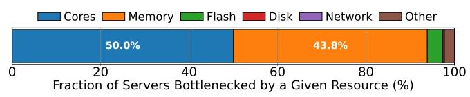
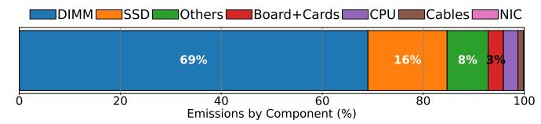
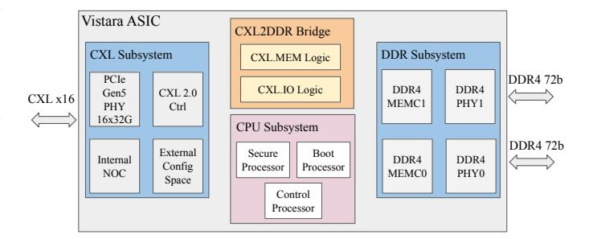
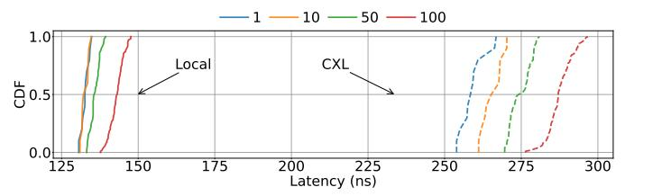
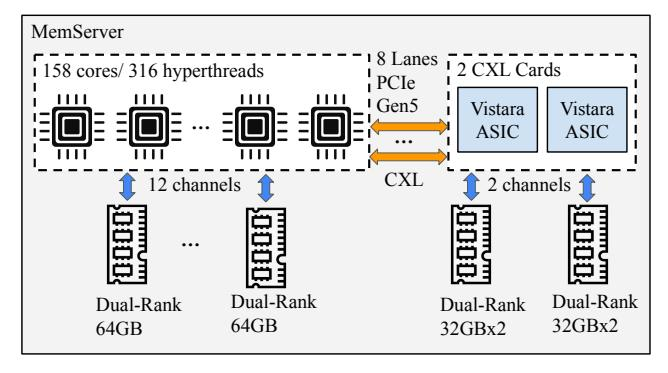
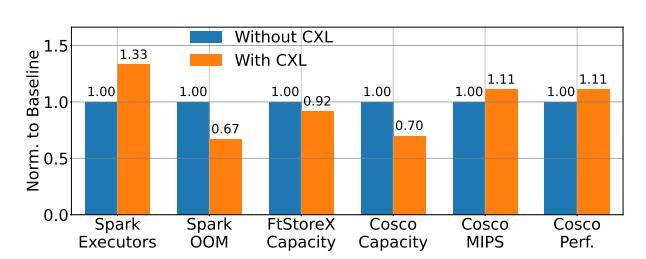
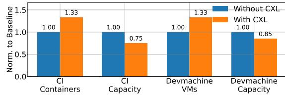

# Vistara: Making CXL Real—Full Path from ASIC Design and OS Support to Hyperscale Deployment

Neha Gholkar Jovan Stojkovic† Hasan Al Maruf Gregory Price Prakash Chauhan Hiral Patel Cedric Van Goethem Kiran Vemuri Kiran Malwankar Kishore Sriadibhatla Kalyan Subramanian Shobhit Kanaujia Chunqiang Tang Abhishek Dhanotia *Meta Platforms* †*Meta Platforms & UT-Austin*

*Abstract*—Memory capacity is a major bottleneck in hyperscale datacenters, with approximately 40% of servers—out of millions at our company—being memory-capacity bound, which limits both performance and scalability. Compute Express Link (CXL) offers a promising solution by decoupling memory capacity from server memory channels, enabling flexible memory expansion and the reuse of decommissioned DIMMs. However, six years after its introduction, CXL's broad applicability remains uncertain due to a striking lack of large-scale, real-world workload experience, despite extensive research and commercial interest. To establish its real-world viability, we present the first report of an endto-end CXL solution deployed at scale—from ASIC design and OS support to diverse production workloads—conclusively demonstrating CXL's benefits and highlighting critical challenges that must be addressed. Additionally, we refute common misconceptions about CXL, such as long-tail latencies caused by its hardware and the significant overheads attributed to the TPP software. Our CXL solution achieves substantial gains for diverse workloads, including up to a 25% reduction in server count for disaggregated ML inference and a 29% reduction in average latency for distributed caches.

# I. INTRODUCTION

Memory exhibits several unique characteristics that complicate modern datacenter operations. First, it is a common bottleneck resource [35], [42]; about 40% of servers—out of millions at our company—are memory-capacity bound, limiting performance and scalability across diverse workloads. Other hyperscalers also report memory capacity as a pressing constraint. For instance, Microsoft has recently announced CXL-expanded VMs to accommodate larger data sets in a costeffective manner [10], while Google offers VMs with up to 32TB [7]. Second, memory dominates the carbon footprint of the fleet [8], accounting for 69% of CO2 emissions and posing a significant sustainability challenge [4]. DRAM dominates datacenter embodied CO2 largely because it is ubiquitous and deployed in large quantities across essentially all servers. Based on our internal fleet data, and aligned with studies from other hyperscalers such as Microsoft [33], memory is one of the largest single embodied-emissions contributors. Third, memory has a much longer useful lifetime (10–14 years) than servers (5-7 years). Early retirement wastes resources, while naively reusing older memory in newer servers degrades performance due to lower bandwidth and higher latency.

A single, unified solution addressing all these challenges simultaneously is to leverage Compute Express Link (CXL) [6], an industry-standard interconnect, to attach older memory (e.g., DDR4 DIMMs) recycled from decommissioned servers to newer servers as expanded memory alongside servers' local memory (e.g., DDR5 DIMMs). This approach offers a compelling combination of benefits: near zero-cost memory expansion through recycling, performance gains from higher memory capacity, and a reduced carbon footprint.

Given the clear benefits of CXL-based memory expansion through tiering—extensively explored by both academic publications [2], [5], [12], [13], [16]–[18], [24], [30], [37], [38], [44], [45] and commercial products [1], [25], [27], [41]—an important question remains: why has large-scale CXL deployment not yet been reported, six years after its introduction? This paper addresses that question.

Despite its promise, memory tiering with CXL faces critical challenges. Multiple studies [19], [28], [39], [44] have highlighted the low bandwidth, high latency, and high runtime overhead of added memory layers via CXL. For example, the *expanded* memory we use in production delivers ≈10× lower bandwidth and ≈60% higher latency than local memory. Moreover, despite many commercial CXL products, none at the time of our production development were suitable for reusing older memory. Most CXL solutions bundle DRAM with the controller—preventing DIMM reuse—and often omit DDR4 support, which is a requirement for repurposing older memory. Additionally, their high power consumption and high cost further limit their appeal. Important to note is that the reason for higher latency is not the performance of old memory; it is due to memory tiering via CXL: 1) ≈150ns extra latency comes from the expander datapath (controller/PHY/bridge), and 2) we run the expander-side DDR4 at lower data rates (2400MT/s) for power and mixed-vintage compatibility.

We address these challenges via *hardware–software codesign*. On the hardware side, we design an in-house CXL ASIC, Vistara, optimized for DRAM reuse, power efficiency, and low latency. On the software side, we build an optimized solution based on TPP [24], determine the appropriate local-toexpanded memory ratio for each workload, and automate perworkload configuration, including disabling expanded memory for workloads that cannot tolerate the increased latency.

We have deployed our CXL solution in hyperscale infrastructure with millions of servers, across a variety of production workloads, including disaggregated ML inference (embedding tables in recommendation systems), big data processing, databases, distributed caches, and CI/CD build systems. These deployments have demonstrated large benefits, such as reducing the server count by up to 25% for disaggregated inference. **Contributions:** We make the following contributions.

• While arguments both for and against CXL exist [15], the lack of reports on large-scale, real-world experience with CXL six years after its introduction leaves its broad applicability uncertain. This paper establishes CXL's viability by presenting the first report of an end-to-end CXL solution deployed at hyperscale—from ASIC design and OS support to diverse production workloads—conclusively showing CXL's benefits and highlighting important challenges that must be addressed.

• Based on our large-scale production experience, we refute some misconceptions about CXL to clarify the community's understanding and guide future practice. For CXL hardware design, contrary to reports of highly unstable tail latencies [19], we show that with careful engineering, high tail latencies are not inherent to CXL; a production device can deliver tail-latency behavior comparable to local DRAM even under high contention. For memory-tiering software, despite concerns that TPP introduces substantial overheads [44], we demonstrate that a simple, production-minded design keeps these overheads below 0.5%, making complex OS solutions unnecessary. Our production experience further shows that a simple LRU-based hotness detector provides sufficient accuracy for hot/cold page identification in most applications, addressing prior concerns [9], [14], [20], [29], [38], [40]. Lastly, as our page migration traffic is minimal, using DMA engines for migration [21] is unlikely to improve the efficiency.

# II. MOTIVATION AND REQUIREMENTS

## A. Need for Memory Expansion

A large fraction of our general-purpose (CPU) server fleet is fundamentally constrained by *memory capacity*. Figure 1 shows the distribution of servers in our fleet bottlenecked by various resources, such as CPU cores, memory capacity, and memory bandwidth. We can see that 43.7% of all servers are fundamentally limited by the amount of available memory, i.e., *memory-capacity bound*.

Fig. 1. Fraction of servers bottlenecked by a given resource.

Memory pressure spans a diverse set of services: distributed caches, development infrastructure, large-scale data warehouse analytics, and modern ML workloads such as parameter servers, graph analytics, and real-time recommendation systems. The working set size of these workloads have outpaced per-node DRAM capacity growth, resulting in resource stranding: CPUs, storage, and network bandwidth are left underutilized because memory is exhausted first. For example, on prior hardware generations, memory-bound services routinely strand 25–40% of available CPU resources, with utilization rates for memory-bound jobs dropping as low as 25–35% on 64GB DRAM SKUs compared to the 128GB DRAM SKUs.

Moreover, in the context of large-scale ML serving, the inability to fit model parameters in memory leads to increased

fan-out, higher latency, and a proliferation of CPU shards, all of which inflate the TCO and degrade system efficiency.

The introduction of *CXL memory expansion* represents an architectural shift in our infrastructure. CXL decouples memory capacity from the constraints of on-socket DRAM channels. This directly addresses memory-capacity bottlenecks via CXL-enabled servers with up to 1TB of memory.

**Tolerance to Lower Memory Performance.** CXL memory expansion comes with increased access latency and reduced bandwidth compared to socket-attached memory. However, across our fleet, we observe the majority of workloads are memory capacity-bound rather than latency- or BW-bound.

Figure 2 shows the effective bandwidth per GB of memory capacity for local and CXL memory across five production services after we deployed and tuned workloads on CXL-expanded servers. For all services, the BW/GB observed on CXL memory is much lower than on local DRAM, because our software stack intentionally places cold pages on the CXL tier and thus accesses it infrequently. As a result, the lower achievable CXL-attached memory bandwidth does not impact end-to-end performance, since the majority of bandwidth-sensitive accesses continue to hit local memory.

Fig. 2. Bandwidth per capacity for local and CXL memory.

We further analyze memory access patterns of our workloads. We find a large portion of memory footprints consist of *cold* pages, i.e., infrequently accessed and idle for extended periods. A small fraction of memory is accessed at any given moment, the rest is cold. Table I quantifies *coldness* as the distribution of memory idle times across workloads.

TABLE I PER-WORKLOAD MEMORY IDLE TIME PERCENTILES.

|      | P25                                              | P50                                                        | P75                                                       | P99                                                |
|------|--------------------------------------------------|------------------------------------------------------------|-----------------------------------------------------------|----------------------------------------------------|
| Web1 | 22.5 seconds 4.3 minutes 7.9 seconds 4.2 seconds | 28.3 minutes 19.4 minutes 2.1 minutes 1.7 minutes | 1.3 hours 43.8 minutes 30.9 minutes 27.1 minutes | 1.9 hours 1.4 hours 38.5 hours 72.9 hours |

Table I shows the 25th–99th percentile idle times for pages, where *idle time* is defined as the duration since last access. For example, if 25% of memory was accessed at least once within the last minute, while the remaining 75% was not accessed at all, the P25 idle time is 1 minute. A large fraction of memory remains untouched for long intervals: most pages are cold.

Hence, placing cold pages in a slower CXL-memory tier will minimally impact overall application performance. Since these pages are rarely accessed, the increased latency and reduced bandwidth of CXL memory are unlikely to become bottlenecks. Even with basic memory-tiering mechanisms in the upstream Linux Kernel, systems can achieve higher memory capacity with CXL without sacrificing workload performance.

#### B. Need for System Reliability

CXL memory expansion has a direct impact on system reliability for hyperscale applications. Historically, memory overprovisioning has been required to meet reliability targets and avoid out-of-memory (OOM) events, which are a major source of wasted compute and failed jobs. For instance, in large-scale ML training and serving, the deployment of CXL memory has led to a 50% reduction in OOMs for certain workloads, and has enabled the stable serving of models that would otherwise be infeasible on DRAM-only configurations.

#### C. Need for Reduced Carbon Emissions

Beyond performance, improving the sustainability of datacenter infrastructure is increasingly important. Figure 3 shows a breakdown of per-component carbon emissions based on lifecycle assessment models, accounting for manufacturing, operation, and end-of-life phases. We can see that DRAM DIMMs are the single largest source of emissions (69%). CXL-based memory expansion directly addresses this challenge by enabling the reuse of existing DIMMs and extending their service life, thereby reducing both the need for new DRAM production and the overall carbon footprint of the fleet.

Fig. 3. Breakdown of carbon emissions across components.

## D. Requirement for Transparent Memory Tiering

For seamless deployment of CXL memory across a heterogeneous fleet, CXL memory must be transparently presented to applications, and applications must run largely unmodified on servers with or without CXL hardware. While many hyperscale applications are already NUMA-aware, the introduction of CXL-attached memory as an additional NUMA node required some refinement of NUMA policies and memory allocation strategies to ensure tiered memory was utilized without performance regressions.

## E. Requirement for CXL-Adoption Flexibility

Given the diversity of datacenter workloads, an opt-in mechanism for tiered memory is important. Some applications do not fully utilize the memory capacity, while others may experience performance regressions when accessing CXL-attached memory. As shown in Table I, certain workloads have low memory idle time at the P75/P99 percentile. These workloads are better served by opting out of CXL capacity to avoid regressions. Thus, we need a framework for workloads to selectively use or avoid CXL memory.

## III. VISTARA HARDWARE STACK

#### A. Chip Design

The Vistara ASIC is Meta's first-generation, custom CXL memory expander, designed to address the growing memory capacity needs in datacenters. The goal is to maximize

memory capacity and efficiency within strict power and area constraints. The system also minimizes the impact on bandwidth and access latency to approach the performance of local DRAM. Figure 4 shows the high-level Vistara architecture.

Fig. 4. High-level architecture of a Vistara ASIC.

Memory Subsystem. At its core, the Vistara ASIC is designed to bridge DDR4 memory to host processors via a CXL 2.0/1.1-compliant PCIe Gen5 x16 interface. Each Vistara ASIC integrates two independent 72-bit DDR4 memory channels, supporting speeds up to 3200 MT/s and up to 256GB per chip with 64GB DIMMs. In our production deployments, we use 32GB DIMMs, as this was the highest capacity available for reuse, resulting in 128GB per chip (typically 4x32GB DIMMs). With two Vistara ASICs per board, this enables 256GB of CXL-attached DDR4 memory expansion in production. Vistara provides enhanced DDR4 reliability through RS-based 2-symbol error correction and x4 chip-kill capability.

Table II summarizes Vistara ASIC's key specifications.

TABLE II VISTARA ASIC KEY SPECIFICATIONS.

| Parameter         | Specification                                |  |  |
|-------------------|----------------------------------------------|--|--|
| CXL Compliance    | CXL 2.0/1.1, Type-3 Memory Expander          |  |  |
| Host Interface    | PCIe Gen5 x16 (deployed as x8)               |  |  |
| DDR4 Channels     | 2 independent, 72-bit, 2DPC                  |  |  |
| Max DDR4 Speed    | Up to 3200 MT/s (prod: 2400 MT/s)            |  |  |
| Max Capacity      | 256 GB (4×64GB); prod: 128 GB (4×32GB)       |  |  |
| ECC               | RS(36,32), 2-symbol correction, x4 chip-kill |  |  |
| ASIC Idle Latency | ≈50 ns                                       |  |  |
| Management Cores  | 3× RISC-V (secure, control, boot)            |  |  |
| Interfaces        | CCI, SMBus, PCIe FW update                   |  |  |
| ASIC Power        | ≈9 W                                         |  |  |

The PCIe Gen5 interface delivers high-bandwidth (32GT/s per lane) and low-latency connectivity. Moreover, Vistara's memory controller pipeline is streamlined for efficient request handling, minimizing protocol overhead and supporting dynamic adjustment of link width and channel usage to optimize for power and cost. The memory controller and CXL protocol stack are co-optimized to minimize queuing delays and ensure robust performance across a range of operating conditions.

Vistara balances between maximizing aggregate memory bandwidth and minimizing die area and power consumption. The number of memory channels and the PCIe interface width were chosen to match the bandwidth requirements of capacity-bound workloads, while avoiding overprovisioning. Furthermore, the ASIC is fabricated in an advanced process node and incorporates aggressive clock and power gating.

Management Subsystem. Vistara features a robust management subsystem for configuration, health monitoring, and error reporting. This subsystem leverages multiple embedded RISC-V cores: a *secure processor* for secure boot and firmware authentication, a *control processor* for CXL memory expander firmware, and a *boot processor* for device initialization. The management subsystem supports advanced features: firmware updates over PCIe and SMBUS, comprehensive monitoring of DIMM and ASIC temperature and health, and error injection capabilities for validating various RAS flows required for atscale monitoring and service. Additionally, it implements the CXL Command Interface (CCI), enabling standard software to manage the device from both the host and the BMC.

Characterizing Vistara's Performance. We characterize Vistara's bandwidth and latency using a memory-intensive MLC streaming microbenchmark [11] on a single-socket MemServer node (Table VI). Threads are pinned to the target NUMA node (local DRAM or CXL) to isolate each memory tier. We sweep read-to-write ratios and concurrency levels, and report steadystate averages over 60-second measurement windows after a warm-up phase. Table III summarizes the measured peak bandwidth for both native (local DRAM) and Vistara's CXLattached memory under various read-to-write traffic patterns. We conduct measurements with a CPU frequency of 2.3GHz, with local DDR5 channels operating at 6400MT/s and CXLattached DDR4 channels at 2400MT/s. As expected, CXL memory bandwidth is lower than that of local DRAM, primarily due to DDR4 bus speed. The bandwidth gap persists across mixed read-write patterns, but remains within the requirements of the target workloads.

TABLE III PEAK BANDWIDTH IN GBPS (AND PERCENTAGE OF THEORETICAL PEAK) FOR NATIVE AND CXL MEMORY UNDER DIFFERENT READ:WRITE RATIOS.

| Traffic Pattern | Native Memory  | CXL Memory    |
|-----------------|----------------|---------------|
| ALL Reads       | 497 GBps (80%) | 48 GBps (62%) |
| 3:1 Read:Write  | 455 GBps (74%) | 41 GBps (54%) |
| 2:1 Read:Write  | 453 GBps (73%) | 42 GBps (55%) |
| 1:1 Read:Write  | 439 GBps (71%) | 42 GBps (55%) |

While the bandwidth of CXL-attached memory is lower than that of local DRAM, this is not a limiting factor for the majority of capacity-bound workloads in production (Figure 2). The operating point in production is around 60% native bandwidth utilization and less than 10% CXL bandwidth utilization.

Table IV shows the memory access latency for native and CXL memory at different bandwidth utilizations. As utilization increases, both native and CXL memory experience higher latencies, with CXL consistently incurring a greater penalty. For instance, at 60% bandwidth utilization native memory exhibits a latency of 234 ns, while CXL memory reaches 372 ns. Despite this gap, the absolute latency of CXL-attached memory remains within a range that is acceptable for the majority of capacity-bound workloads targeted by Vistara.

Contrary to the findings reported in [19], Vistara demonstrates stable tail latencies. Specifically, the variation in latency for CXL-attached memory is close to that observed with local

TABLE IV MEMORY ACCESS LATENCY FOR NATIVE AND CXL MEMORY AT DIFFERENT BANDWIDTH UTILIZATION POINTS.

| BW Util. [%] | Native Latency [ns] | CXL Latency [ns] |
|--------------|---------------------|------------------|
| 10           | 169                 | 269              |
| 30           | 173                 | 292              |
| 60           | 234                 | 372              |

memory. Figure 5 presents the cumulative distribution function (CDF) of memory access latency as the number of concurrent latency threads increases from 1 to 100, with all threads pinned either to local DRAM or to CXL-attached memory. For each thread count, the tail latency distribution for CXL-attached memory closely tracks that of local memory, indicating comparable variability under contention. With more threads, both configurations exhibit higher tail latencies due to increased contention for memory resources. In contrast, the FPGA device tested in [19] shows anomalous tail latencies, likely due to inherent FPGA limitations, such as limited SRAM, e.g., insufficient credit buffers for outstanding transactions.

Fig. 5. CDF of memory access latency in local and CXL-attached memory with different number of latency threads (1, 10, 50, and 100).

We also evaluate power and cost of CXL-attached memory. Table V compares the power consumption of CXL-attached memory alongside the cost per GB and power per GB, each normalized to the values for native DRAM. This comparison clarifies the practical trade-offs of deploying CXL memory, and shows its potential for cost-effective capacity expansion.

TABLE V COMPARISON OF LOCAL AND CXL MEMORY IN TERMS OF CAPACITY, BANDWIDTH, POWER, AND NORMALIZED COST/POWER PER GB.

| Memory | Capacity | BW     | Power | Relative | Relative |
|--------|----------|--------|-------|----------|----------|
| Type   | [GB]     | [GB/s] | [W]   | Power/GB | Cost/GB  |
| Local  | 768      | 614.4  | 132   | 1        | 1        |
| CXL    | 256      | 57.6   | 30    | 0.7      | 0.13     |

Performance Optimizations. To minimize the performance gap between local and CXL memory, the Vistara design incorporates a range of architectural and system-level optimizations.

We reduced ASIC *idle round-trip latency* to ≈50 ns, by: *1)* configuring the CXL and DDR controller IPs for low latency, *2)* minimizing clock-domain crossings, and *3)* targeted physical design optimizations, e.g., tight floorplanning of latencycritical blocks and selective low-Vt usage on critical datapaths.

We optimize the *loaded latency* with large completion buffers, wide flow-control windows, and sufficient replay depth in the CXL controller. Further, the DDR subsystem leverages multi-channel access, bank-level parallelism, and deep read data and command queues.

The *memory controller pipeline* is engineered to reduce queuing and arbitration delays by streamlining the scheduling of memory requests. This is achieved through a reduction in pipeline stages and implementation of fast-path logic for common transactions. Additionally, firmware-based interrupt rate limiting prevents error interrupt storms from overwhelming the controller, ensuring responsiveness under adverse conditions.

At the *protocol level*, the CXL stack is tightly integrated with the PCIe Gen5 physical layer. This direct coupling reduces protocol translation overhead and leverages the full bandwidth and low latency of the underlying transport. The firmware further accelerates mailbox command handling for CXL.io and CXL.mem operations, enabling efficient event logging, register access, and firmware management. Robust error recovery mechanisms are implemented to handle incomplete or stuck transactions, with coordinated resets across the CXL controller, DDR controller, and internal interconnect to ensure reliable operation following power cycles or reboots.

# *B. System Integration*

Having developed the Vistara ASIC as a scalable CXL memory expander, we then integrate it into our memoryoptimized server platform, *MemServer*. This platform is designed to fully leverage Vistara's capabilities, enabling efficient and reliable memory expansion at scale. Figure 6 shows the server's high-level architecture.

Fig. 6. High-level architecture of a *MemServer*.

Compute and Memory Architecture. Each MemServer node has a single-socket AMD Turin processor, built on the Zen5 microarchitecture [3]. CPU has 158 cores per node, where each core is 2-way SMT and operates at ≈3GHz.

The memory subsystem in MemServer provides high capacity and high bandwidth. Local DRAM is provisioned at 768GB of DDR5-6400 per node, organized across 12 memory channels. Each channel operates at 6400 mega-transfers per second (MT/s), thus, the system delivers up to 614 GB/s of aggregate bandwidth. The idle latency for local DRAM is ≈130 ns, and the system is capable of sustaining peak bandwidths exceeding 400 GB/s under mixed read/write workloads.

CXL Integration. CXL memory expansion is enabled by two Vistara ASICs per node, each connected via a PCIe Gen5 x8 interface. Vistara CXL ASIC supports two independent DDR4 memory channels (72 bits wide), with two 32GB DIMMs per channel, resulting in a total of 256GB of CXL-attached memory per server. Hence, in total, the server has 158 cores or 316 hyperthreads with 1TB of memory.

Each DDR4 channel operates at 2400 MT/s, delivering sufficient aggregate bandwidth to support capacity-bound workloads at low power and cost. By engineering Vistara to accept industry-standard DDR4 RDIMMs, including modules reclaimed from decommissioned servers, we efficiently reuse a substantial pool of DDR4 memory. This approach maximizes resource utilization and enables a sustainable and costeffective path to large-scale memory expansion as the fleet transitions to DDR5-native CPUs.

CXL Access Interleaving. To ensure balanced utilization of the CXL links and minimize contention, memory accesses are interleaved across Vistara devices at a 256-byte granularity at the CPU host-bridge. This means consecutive memory blocks are alternately mapped across both Vistara CXL modules. Within each Vistara device, accesses are further interleaved across DIMMs, ranks, and banks to maximize parallelism and ensure a fair distribution of traffic across all memory channels and components. Hence, the system maximizes aggregate bandwidth by allowing simultaneous access to both devices, and helps to evenly distribute traffic, reducing the risk of bottlenecks or contention on any single CXL link.

Platform Configuration Summary. Table VI consolidates the MemServer platform configuration for reference.

TABLE VI MEMSERVER PLATFORM CONFIGURATION.

| Component          | Specification                            |
|--------------------|------------------------------------------|
| CPU                | AMD Turin, 158/316 cores/threads, ≈3 GHz |
| CPU TDP            | 300 W                                    |
| Local Memory       | 768 GB DDR5-6400, 12 channels            |
| Local Peak BW      | 614 GB/s                                 |
| Local Idle Latency | ≈130 ns                                  |
| CXL Devices        | 2× Vistara ASICs, PCIe Gen5 x8 each      |
| CXL Memory         | 256 GB DDR4-2400 (8×32 GB RDIMMs)        |
| CXL Peak BW        | ≈76 GB/s                                 |
| CXL Idle Latency   | ≈250 ns                                  |
| CXL Interleave     | 256 B granularity across 2 devices       |
| CXL + DIMM Power   | ≈50 W total (2 ASICs + 8 DIMMs)          |
| Total Memory       | 1024 GB (1 TB)                           |
| Total Server Power | 450–560 W                                |

Power and Thermal Management. In the memory-optimized configuration, the processor operates at a TDP of 300W, while the local DDR5 memory subsystem contributes an additional 50–60W per node under load. Each Vistara CXL ASIC draws up to 9W, and the associated CXL-attached DDR4 DIMMs add approximately 32W, resulting in a total CXL memory expansion power budget of ≈50W per server. Overall, the total server power consumption at high utilization is between 450W and 560W, depending on workload mix and turbo settings.

The Vistara CXL cards are installed in dedicated rearaccessible slots within each MemServer chassis. To manage the increased thermal load from high-density memory and CXL devices, the chassis employs directed airflow with highcapacity fans that channel cool air directly across the Vistara modules, for stable operation under heavy workloads.

# IV. VISTARA SOFTWARE STACK

In addition to efficient hardware, the successful deployment of CXL memory at hyperscale requires a carefully engineered software stack that can manage new memory tiers transparently, reliably, and efficiently. To achieve this, the software stack introduces a set of mechanisms that govern how CXL memory is presented, managed, and utilized in production. We describe the core software principles and system-level features that underpin Vistara's deployment at scale.

# *A. CXL Integration with Operating System*

NUMA-based Memory Tiering. CXL-attached memory is exposed to the OS as a distinct, *CPU-less NUMA node*, separate from the local DRAM nodes directly attached to the processor. This allows the system to maintain clear boundaries between memory tiers, enabling the kernel memory management subsystem to recognize and manage CXL memory independently. As a result, memory allocation, placement, and access policies can be tailored to the unique latency and bandwidth characteristics of each tier, while preserving compatibility with standard OS and virtualization frameworks. Linux CXL Driver. The Linux CXL driver is critical for this process. Rather than relying on the BIOS to configure CXL memory as regular system RAM, we deferred management to the kernel driver. Our driver configuration onlines CXL memory as ZONE\_MOVABLE on a discrete NUMA node, ensuring kernel allocations (such as page tables) and other non-migratable allocations do not inadvertently land on CXL memory. Ensuring migratability is important for robust tiering,

and isolating kernel data from CXL mitigates reliability and performance risks. All Linux Kernel CXL driver code in use for Vistara is either present in the upstream kernel, or is on

its way to being included in the upstream kernel.

ACPI Tables. Operating System-directed configuration and Power Management (OSPM) generated ACPI tables provide configuration and performance data about CXL hardware. For example, the *CXL Early Discovery Table (CEDT)* describes CXL memory configurations for use by Linux drivers. The *Heterogeneous Memory Attribute Table (HMAT)* exposes the relative latencies and bandwidths of each memory NUMA node, which are used by the kernel to make informed memory allocation and tiering decisions. Correct ACPI table configuration is fundamental: bugs or inconsistencies in these tables can block proper device driver management and memory-tier subsystem behavior. We worked closely with platform vendors to validate ACPI system topology and performance data.

# *B. CXL-Memory Transparency*

*Transparent* CXL memory usage by applications and users is a requirement for hyperscale deployment. The Vistara software stack presents CXL-attached memory in a manner that closely resembles standard system memory, minimizing the need for application-level changes or awareness. This is necessary for seamless adoption across a diverse fleet, where application code-bases and deployment models vary widely.

As shown in Figure 7, the OS plays a critical role in achieving this transparency. By leveraging kernel memory tiering features, such as Transparent Page Placement (TPP) [24], and userland-driven proactive reclaim policy such as *Transparent Memory Offloading* [35] the OS dynamically identifies hot and cold memory pages based on access patterns. Hot pages are preferentially placed in local DRAM, while colder pages are migrated to CXL memory. This migration occurs without application intervention. We tune parameters based on production profiling, such as enabling NUMA demotion (numa\_demotion\_enabled=1), setting NUMA balancing to migrate pages (numa\_balancing=2), and enabling all zone reclaim policies (zone\_reclaim\_mode=7). We leave other settings at their default values.

Fig. 7. CXL memory in our fleet is transparent to the applications and is exposed as a NUMA node. OS allocates pages in the local DRAM (NUMA 0) and dynamically migrates pages across tiers based on access patterns.

Default Memory Policy. The default memory policy prioritizes allocations in local NUMA nodes, spilling over to CXL memory when local resources are exhausted. This fallback policy is in the Linux kernel memory management subsystem.

We deploy two methods of cold-page demotion. In the Linux Kernel, when DRAM pressure increases, the kernel's reclaim mechanism demotes eligible colder pages from DRAM to CXL. Additionally, we employ TMO to *proactively* demote cold pages. Both mechanisms free up DRAM for new or hot allocations. During testing, we discovered, patched, and published fixes for a variety of bugs in the Linux kernel related to fallback allocation and reclaim.

Page migration is guided by real-time access tracking and decoupled allocation/reclamation watermarks, so that sufficient DRAM headroom is always maintained for both new allocations and promotion of hot pages from CXL.

Advanced Memory Policies. The kernel supports advanced memory policies that optimize bandwidth and minimize unnecessary migrations, building on TPP. These policies are available to NUMA-aware applications and can be controlled directly from user-space via sysfs interfaces.

For example, the *cache-pages preferably allocated to remote node* policy steers file cache and tmpfs allocations to CXL memory by default, freeing up local DRAM for hot anonymous pages. This is effective during application warmup phases, when file I/O generates large caches that consume significant memory capacity but are accessed infrequently. By allocating these cold file caches to the remote node from the outset, the system avoids occupying local memory with inactive data and reduces the need for subsequent migrations of anonymous memory. If a cached page on CXL becomes hot, the kernel automatically promotes it back to DRAM.

We evaluated this policy on our caching workload. Specifically, when using this policy, on an experimental system with 20GB local memory and 76GB CXL-attached memory achieves the same throughput as a system with 96GB all-local memory.

Another advanced page placement policy is the *weighted interleave* policy which allocates a weighted (N:M) ratio of memory across NUMA nodes. Bandwidth-bound workloads can use this policy to tune the ratio between DRAM and CXL memory to balance bandwidth and latency. The ratio is dynamically configurable via sysfs to match workload and hardware characteristics. We implemented and upstreamed Linux support for auto-tuning weighted interleave.

# *C. Fleet Homogeneity and Health Monitoring*

Uniformity across the server fleet is a foundational principle for reliable and efficient hyperscale operations. In the context of CXL memory deployment, the Vistara software stack is designed to *always enable* and integrate CXL memory as part of the system memory on every server. This means that, regardless of workload or deployment environment, each MemServer node is recognized as a 1TB system, with both local DRAM and CXL memory available for allocation.

Consistent configuration eliminates the need for selective offlining of CXL memory or the use of specialized memory modes, which introduce heterogeneity and complicate fleet management. By maintaining a uniform memory topology, the software stack simplifies the process of hardware management, as all nodes can be evaluated and managed using the same set of tools and policies. This is particularly important for detecting and responding to hardware faults, as well as for ensuring that memory resources are being utilized as intended. Health Monitoring. Vistara management subsystem integrates telemetry and error reporting features. The software stack collects metrics on memory usage, error rates, and device health, and continuously reports them to centralized monitoring systems. Then, the system can proactively identify potential issues, such as failing DIMMs or degraded CXL links, allowing for intervention before the workload is impacted.

In addition, the software stack supports robust mechanisms for firmware updates and device management, further contributing to fleet homogeneity. Updates can be rolled out in a coordinated manner, with health checks and rollback procedures in place to minimize disruption. The result is a highly reliable and maintainable memory infrastructure that scales with the needs of our datacenters.

Resource Provisioning. The uniform exposure of CXL memory also streamlines operational processes such as server provisioning, maintenance, and decommissioning. With every node presenting the same memory configuration, automation systems can apply consistent policies for workload placement, memory allocation, and resource scaling. This reduces the risk of configuration drift and ensures that operational best practices are uniformly enforced across the fleet.

# *D. Flexible Opt-Out Support for Fungibility*

While uniformity is fundamental for large-scale operations, flexibility in memory usage is important for supporting diverse workload requirements and maximizing server fungibility. The Vistara software stack addresses this need by providing a software-based *opt-out mechanism* that allows workloads to selectively avoid using CXL memory when necessary.

This opt-out capability is implemented through the Linux cgroup framework, specifically the cpuset.mems controller. By configuring this controller to restrict a workload's memory allocations to the local NUMA node, operators can effectively disable access to CXL memory for that workload. This approach does not require any changes to BIOS settings or server reboots. Hence, the system can transition between memory configurations in a rapid and non-disruptive manner.

Opt-out policy is particularly useful for workloads with strict latency requirements or those that have not yet been validated for operation on tiered memory systems. It also enhances server fungibility, as nodes can be flexibly moved in and out of different service pools without hardware reconfiguration.

A server can be temporarily assigned to a latency-sensitive application that only uses local DRAM, and later returned to the general pool for capacity-bound workloads.

Memory Policy Automation. The opt-out feature is integrated with our infrastructure's existing resource orchestrator [32], allowing operators to automate memory policy enforcement based on workload characteristics and operational priorities. The orchestrator manages the cpuset.mems cgroup controller for each workload, dynamically setting the allowed NUMA nodes according to service profiles or host policies: enabling or disabling access to CXL memory as needed.

These memory policies can be specified declaratively and are automatically applied at job launch. Thus, the memory allocation rules are consistently enforced across the fleet without manual intervention. Furthermore, the orchestrator can react to real-time signals, such as workload migration, scaling events, or service health, to update memory policies on the fly, supporting rapid transitions between opt-in and opt-out states and maximizing both performance and server fungibility.

Fig. 8. The resource orchestrator deploys services with their memory policies. By default, all services use CXL memory, but some services can opt-out.

Fine-Grained Opt-Out Control. The opt-out mechanism also supports *selective use of CXL memory* within a single host. Background processes or less critical services can be directed to utilize CXL memory, freeing up local DRAM for primary workloads. This fine-grained control over memory allocation enables more efficient resource utilization and helps to balance performance and capacity across the fleet.

Lower-priority system services are defaulted to opt-in to CXL memory usage, as testing demonstrated most background services are neither memory-capacity nor memoryperformance sensitive. This maximizes available DRAM-tier capacity for all workloads, whether they opt in or out of CXL. This also provides telemetry on CXL memory reliability by ensuring some CXL memory is used at least some of the time.

As shown in Figure 8, the Vistara software stack's flexible opt-out support maintains high server fungibility and operational agility while enabling large-scale CXL deployment.

# *E. Risk Mitigation for Non-Migratable Memory*

The introduction of a tiered memory architecture with CXL expansion brings new challenges in managing non-migratable memory allocations. Certain types of kernel data, such as slab caches, page tables, and other immovable structures, must remain accessible at all times and cannot be safely migrated between memory tiers. Placing such allocations in CXL memory, which may be subject to higher latency or transient errors, poses a risk to system stability and reliability.

To mitigate this risk, we configure CXL memory as zone\_movable within the Linux kernel. This restricts the placement of non-migratable pages: only user-space memory and migratable kernel data are allocated in CXL-attached memory. All critical kernel structures remain in local DRAM, where they benefit from lower latency and higher reliability.

This design decision enhances the effectiveness of TPP, as it helps ensure the OS can freely migrate hot user pages from CXL to local memory without concern for immovable kernel data being stranded in the slower tier. It also simplifies memory management, as the kernel can enforce clear boundaries between migratable and non-migratable allocations.

The software stack further supports validation and monitoring of memory placement policies, providing visibility into the distribution of kernel and user pages across memory tiers. This enables operators to verify that non-migratable allocations are correctly confined to local DRAM and to detect any anomalies that may arise due to misconfiguration or software bugs.

# *F. Telemetry and Observability*

Robust telemetry enables at-scale observability and rapid debugging of CXL memory deployments. The Vistara stack exposes a comprehensive set of kernel- and device-level metrics, including CXL memory bandwidth, page hint faults, successful promotions and demotions, CXL utilization, error rates, and device health status. These metrics are continuously collected and fed into centralized monitoring systems, allowing operators to track memory tier usage, identify bottlenecks, and proactively detect hardware or software anomalies. For example, TPP reports real-time statistics on page migration and access patterns, while the CXL subsystem exports device-level bandwidth and error counters. This telemetry supports fleetwide health monitoring, enables efficient root-cause analysis, and guides ongoing policy tuning.

# V. EVALUATING VISRATA DEPLOYMENT IN PRODUCTION

Vistara CXL memory expansion has been deployed across a diverse set of services at Meta, spanning caching, data warehouse, ML parameter servers, developer infrastructure (DevInfra) such as build and continuous integration. Table VII summarizes the observed improvements in throughput, efficiency, and resource utilization across these domains.

# *A. Methodology*

All production experiments are conducted on MemServer nodes. This is a single-socket AMD Turin machine (158 cores, 2-way SMT, ≈3 GHz) with 768 GB local DDR5-6400 and 256 GB CXL-attached DDR4-2400 (2× Vistara ASICs), totaling 1 TB per server. The configuration is shown in Table VI.

We evaluate each workload via A/B testing: identically configured MemServer nodes serve production traffic, differing only in whether CXL memory is enabled (via the cpuset.mems cgroup controller). Traffic is split evenly across test and control groups by the production load balancer, ensuring both groups observe the same request mix and diurnal patterns. Each experiment runs for at least one week to capture steady-state behavior and traffic variability.

We measure service-level metrics (throughput/QPS, p50/p99 latency, cache hit rates, OOM rates) alongside system-level metrics (local and CXL memory bandwidth, CPU utilization, TPP promotion/demotion rates, NUMA hint faults). Table VIII provides a unified view of the TPP telemetry.

# *B. Caching Workloads*

*1) Workload Description:* Caching services are foundational to the delivery of user-facing content and internal data at hyperscale. They serve billions of requests per second, operating under stringent latency and reliability constraints.

The access patterns are highly skewed, typically following a Zipfian or power-law distribution, and the object catalogs are vast, often comprising billions of unique items. The operational environment is highly dynamic, with frequent shifts in object popularity and sudden traffic surges.

The workload is characterized by a mix of read and write operations, with caching tiers spanning DRAM, flash, and remote storage. These tiers are managed by sophisticated multi-level admission and eviction policies, including MLbased admission and LRU-tail age strategies.

The main metrics are *request rates* reaching tens of millions of QPS per cluster, *hit rates* ranging 80%-99% depending on the cache tier, and strict *latency targets*: sub-millisecond for DRAM and ≈10ms for flash. Finally, *write amplification* is an key metric for maintaining flash device longevity.

TABLE VII
IMPROVEMENTS WITH VISTARA CXL ACROSS SERVICES.

| Service    | Workload            | Primary Resource | Local Memory | CXL Memory | Improvement                                         |
|------------|---------------------|------------------|--------------|------------|-----------------------------------------------------|
| CacheA     | Caching             | Memory           | 730 GB       | 256 GB     | Improved t-put by 25%, retention time 5–10× longer  |
| CacheB     | Caching             | Network BW       | 745 GB       | 253 GB     | Reduced average query processing time by 29%        |
| Spark      | Data Warehouse      | Alloc Mem/CPU    | 700 GB       | 150-200 GB | Increased the number of executors per server by 25% |
| FtStorex   | Data Warehouse      | CPU              | 722 GB       | 252 GB     | Improved throughput by 8.6%                         |
| CI         | DevInfra            | Memory           | 585 GB       | 255 GB     | Increased the number of per-server jobs by 33%      |
| Devmachine | DevInfra            | Memory           | 751 GB       | 255 GB     | Increased the number of per-server VMs by 33%       |
| MRS        | ML Parameter Server | Memory           | 750 GB       | 123 GB     | Reduced number of servers by 25%, 12% higher t-put  |

2) Architectural Implications and CXL Benefits: In our hyperscale infrastructure, caching workloads are predominantly memory-capacity bound, with performance closely tied to the ability to retain hot objects in memory.

**Higher Hit Rates.** The introduction of CXL memory expansion alters this landscape: the expanded memory footprint allows a larger fraction of the working set to be cached inmemory, which in turn drives higher hit rates and reduces tail latency, as more requests are served directly from DRAM rather than slower flash or remote storage.

Longer Flash Endurance. Limited DRAM capacity forces a large fraction of write operations to be absorbed by SSDs, accelerating wear and ultimately reducing device longevity due to write amplification. By absorbing a greater proportion of writes in memory, CXL-enabled systems reduce the write pressure on flash devices. This reduction in write amplification translates to improved flash endurance, allowing SSDs to operate reliably for longer periods and reducing the frequency of costly device replacements and maintenance interventions.

Lower Infrastructure Cost. CXL memory expansion also contributes to overall infrastructure efficiency by reducing the volume of requests that must be served by backend storage systems. Fewer cache misses result in a lower rate of requests propagating to flash and remote storage tiers. This decreases the load on downstream storage systems and leads to tangible cost savings by minimizing the need for overprovisioning and reducing network bandwidth consumption.

Improved Retention Ages. With increased cache capacity, the system can support longer retention ages for cached objects, meaning that items remain in memory for extended periods before eviction. This extended retention reduces the frequency of cache rebalancing operations, which are triggered by shifts in object popularity or traffic surges. By smoothing out the rebalancing events, the system can better handle sudden changes in workload characteristics, such as load bursts, without incurring performance penalties or risking cache thrashing.

*3) Production Results:* Figure 9 summarizes the results for the caching workloads with Vistara CXL.

CacheA is a hybrid cache system that keeps frequently accessed objects in memory and less frequently accessed ones in storage. Objects in memory are actively accessed, as memory acts as the primary cache layer above the flash cache. As a result, cache objects or shared memory accesses can generally be considered uniform and random and also do not contribute significantly to the overall request processing

Fig. 9. Improvements across key metrics (cache size, throughput, average query latency, retention age, and hits in flash) in cache workloads.

times. However, there are smaller regions of the heap that are extremely hot, such as memory used for connections, hashtables or indexes, and in-flight request data. The addition of CXL memory expanded the memory tier from 680GB to 890GB. The architecture ensures the hot heap memory remains in local memory, while the cache is demoted to CXL memory with negligible impact on latency, thanks to kernel-level TPP and TMO. This enabled an increase of 33% in sustainable QPS per server while sustaining longer retention ages for cached objects (which increased from  $\approx 1$  minute to  $\approx 5$ -10 minutes), effectively recovering performance previously lost to endurance bottlenecks.

CacheB similarly benefited from CXL. The cache size increased from 590GB to 820GB. As a result, the average query processing time, on production traffic, got reduced by 29%. Enabling CXL memory shifted 2.3% of cache hits from flash to memory, effectively reducing the flash wear-out.

To enable CXL for CacheB, we performed A/B testing with and without CXL, comparing key metrics to validate that there were no regressions. Our main concern was read-side latency of CacheB, since CXL memory expansion increases such latency. However, under production operating conditions, we observed that CXL bandwidth usage remained under 9GBps, while local bandwidth was much higher at 160GBps, which typically drives higher latency. Hence, the gap between local and CXL latencies was imperceptible to the workload.

# C. Data Warehouse Workloads

1) Workload Description: Our data warehouse workloads are distributed analytics systems such as Spark and Hive, which routinely operate on PB-scale datasets. They are characterized by high concurrency, complex query patterns involving multi-stage joins, aggregations, and large-scale scans, and highly variable resource requirements. To maximize resource utilization, jobs are aggressively bin-packed onto servers: memory emerges as the primary bottleneck.

Typical metrics for these workloads include executor counts per server ranging from 10 to over 100, dataset sizes of TBs to PBs per job, and memory footprint of 100s of GBs per job.

However, in such environments, reliability is paramount, as out-of-memory (OOM) events can disrupt critical business analytics and ML pipelines. The target OOM rate needs to be kept below 0.1% per job to ensure robust operation.

2) Architectural Implications and CXL Benefits: The deployment of CXL memory expansion in our data warehouse infrastructure directly addresses memory bottlenecks in largescale analytics and opens new opportunities for optimizing resource allocation and operational efficiency.

**Denser Packing.** With CXL, servers can be provisioned with much more memory than previously possible, which directly enables denser bin-packing of analytic executors on each node. This increased density allows a single server to host a greater number of concurrent jobs, maximizing hardware utilization and reducing the total number of servers required to support a given workload.

**Improved Reliability.** The expanded memory headroom provided by CXL enhances system reliability. By mitigating the risk of out-of-memory (OOM) events, CXL reduces the frequency of job failures and the associated overhead of job restarts and resource fragmentation by 33%. This improvement is particularly impactful for complex, multi-stage queries that are sensitive to memory pressure and can be resource-intensive to re-execute. Recall, the benefits are realized transparently through kernel-level mechanisms such as TPP.

*3) Production Results:* Figure 10 summarizes the results for data warehouse services with Vistara CXL.

Fig. 10. Improvements across important metrics (number of executors, query performance, compute capacity, and MIPS) in data warehouse workloads.

Spark is a cornerstone of distributed analytics. With CXL, Spark is now able to bin-pack up to 33% more executors per server. This directly translates to higher hardware utilization and a reduction in the number of servers required to support the same workload. The result is a more efficient fleet, with lower power and management overhead.

Cosco is a distributed shuffle service. Cosco leveraged CXL to pack more executors per server, reducing the compute capacity by 30%, alongside an 11% increase in MIPS per cluster and a 10% reduction in executor runtime.

FtStoreX is a hybrid storage and serving system that efficiently manages and delivers feature data for large-scale, real-time applications. It uses CXL memory expansion to improve throughput and decrease its compute capacity by up to 8.4%. The improved memory efficiency in FtStoreX led to a decrease

in ZippyDB backend utilization, reducing storage usage and further improving infrastructure efficiency.

## D. DevInfra Services

1) Workload Description: DevInfra services are the backbone of our company's continuous integration (CI) pipelines, build systems, and developer productivity tools (devmachines). These workloads have high job concurrency, short-lived build artifacts, and highly bursty resource usage.

Build jobs are distributed across thousands of servers, with memory and I/O serving as the primary constraints. The system must balance throughput, resource efficiency, and reliability, as OOMs and resource contention have a direct and immediate impact on developer velocity.

Important metrics include build job concurrency of 10 to 100 per server, artifact sizes ranging from MBs to GBs per job, and throughput measured in 1000s of builds per hour. The target OOM rate is kept below 0.01% per job.

2) Architectural Implications and CXL Benefits: Vistara's CXL memory expansion addresses the acute memory constraints faced by DevInfra services in two ways: by improving the overall throughput and by reducing the frequency of OOM events. Overall, it results in higher developer productivity.

**Improved DevInfra Throughput.** With increased memory available per server, DevInfra platforms can support a higher degree of job concurrency, allowing more build and test jobs to run in parallel on each machine. This directly translates to improved throughput and reduced build latency, as developers experience faster feedback cycles and less queuing. The ability to stack more jobs per server also streamlines resource scheduling and reduces the need for overprovisioning.

**Less OOM.** In addition, the expanded memory headroom lowers the risk of OOM events, which are a major source of job failures and wasted compute cycles in CI environments. By minimizing OOMs, CXL reduces the frequency of job retries and the associated delays.

3) Production Results: Figure 11 summarizes the results for DevInfra workloads with Vistara CXL.

Fig. 11. Improvements across important metrics (number of containers and compute capacity) in DevInfra workloads.

Devmachine provides engineers with virtual development servers tailored for software development, debugging, and testing. These servers are available in various VM configurations, offering different levels of compute power and memory and storage sizes to efficiently support a wide range of use cases ranging from general debugging to AI/ML development. Collocating multiple VMs on a physical server maximizes resource utilization and enables more developers to work

simultaneously, reducing the inefficiency of assigning dedicated hardware to individual users. With CXL, devmachines increase the number of VMs per server by 33%, with each VM experiencing only a modest 10% performance regression due to CPU and storage sharing. Hence, the devmachine fleet needs 15% fewer servers for the same level of developer efficiency.

#### E. ML Parameter Server

1) Workload Description: ML parameter server workloads are foundational for the distributed training and inference of large-scale machine learning models, such as recommendation systems and LLMs. They have intense memory-capacity demands, as servers must host substantial model shards and facilitate high-throughput updates to ensure model freshness. The architecture is designed to support rapid and frequent parameter updates, in order to maintain the accuracy and relevance of models in production environments.

ML parameter server workloads have to balance several competing factors: model size, update rate, and serving latency. As models grow in complexity and scale, the system must efficiently manage the distribution of model shards across servers, while minimizing bottlenecks such as fan-out and rebatching. These bottlenecks can impact both the speed of updates and the responsiveness of inference requests.

Typical metrics for these workloads include model sizes that range from 10s to over 100 TB, with individual server shards spanning 100s of GBs. Update rates can reach millions of parameters per second. Serving QPS are also substantial, with clusters routinely handling hundreds of thousands of requests.

2) Architectural Implications and CXL Benefits: Vistara's CXL memory expansion transforms the architecture of ML parameter server workloads. In practice, Vistara reduced the overall capacity requirements of ML clusters, enhanced model freshness through more efficient updates, and provided a scalable foundation for managing future 100TB-scale models. **Capacity Reduction.** A primary benefit of CXL is the ability to consolidate larger model shards onto each server, reducing the total number of machines required to host a given model. This consolidation lowers capital and operational costs, simplifies cluster management, and reduces the system footprint. Improved Model Freshness. Beyond capacity reduction, CXL also improves model freshness and serving performance by reducing fan-out during parameter updates. With larger shards per server, each update operation touches fewer machines, decreasing network overhead and update latency. This streamlined communication path enables faster propagation of model changes, supporting real-time inference and training workloads with higher throughput and lower tail latency.

**Enabling 100TB Models.** Finally, the memory scalability provided by Vistara helps support the next generation of ML models, which are expected to reach sizes of 100TB and beyond. By breaking through traditional memory limitations, CXL future-proofs our infrastructure, ensuring that it can accommodate the rapid growth in model complexity and size without requiring disruptive architectural changes.

3) Production Results: In production, the deployment of ML parameter server workloads on MemServer led to improvements in both throughput and resource efficiency.

When serving a 5.1TB production model, the transition to MemServer platforms resulted in an increase in model serving throughput by 4%. This enhancement in throughput directly translates to faster inference and supports higher query rates.

Fig. 12. Improvements in throughput and compute capacity requirements with Vistara CXL device as we scale the model size.

The reduction in CPU serving cost due to CXL-based memory expansion is substantial. Specifically, with Vistara CXL, ML Parameter Server uses 25% less compute capacity. These savings are achieved through the consolidation of workloads onto fewer, more memory-rich servers.

As shown in Figure 12, with model sizes scaling further, up to 20TB, Vistara continues to yield throughput improvements by 4–12% compared to configurations without CXL. Additionally, we constantly need 20-25% less servers. This confirms the scalability benefits of memory expansion, particularly as next-generation models push the boundaries of memory capacity.

## F. TPP Performance Heuristics in Production

Table VIII analyzes the TPP performance heuristics across our production services. Across all services, we observe that CPU overheads from TPP, including the use of minor page faults to detect hot pages, remain low in practice, with no evidence of TPP-induced performance regressions. The bandwidth driven from CXL-attached memory is generally modest compared to local memory bandwidth, indicating that most production workloads are far from saturating CXL bandwidth. Additionally, CXL bandwidth utilization is primarily influenced by accesses to a broader range of cold pages, rather than frequent accesses to hot pages and hence we observe minimal traffic related to page promotions. Thus, approaches that leverage DMA engines to accelerate page migration [21] are unlikely to provide significant performance benefits.

TABLE VIII
TPP PERFORMANCE HEURISTICS ACROSS PRODUCTION SERVICES.

| Workload                                                   | LocalBW                                                                       | CXLBW                                                                     | NUMAhintfaults                                                                                  | Promotions                                                                                    |
|------------------------------------------------------------|-------------------------------------------------------------------------------|---------------------------------------------------------------------------|-------------------------------------------------------------------------------------------------|-----------------------------------------------------------------------------------------------|
| CacheA CacheB DevInfra DataWA DataWB DataWC | 225 GB/s 150 GB/s 50 GB/s 300 GB/s 273 GB/s 110 GB/s 2 GB/s | 5 GB/s 11 GB/s 13 GB/s 10 GB/s 10 GB/s 0.5 GB/s 94 MB/s | 32 per min 87 per min 24 per min 12K per min 36 per min 500 per min 2 per min | 7 per min 88 per min 33 per min 7K per min 10 per min 500 per min 2 per min |

# *G. Local:CXL Memory Sensitivity Analysis*

To directly quantify the performance tradeoff of memory tiering at equal total capacity, we compare iso-capacity configurations against an all-local DRAM baseline on two additional Meta's workloads: a web service based on HHVM [26] and a data preprocessing service (DPP) [43]. Both workloads run on MemServer default configurations. Starting from the default 3:1 local:CXL ratio, we progressively increase the CXL share to 2:1 and 1:1 by reducing local memory and adding CXL memory, while keeping total capacity constant and serving identical production traffic.

At the default 3:1 ratio, both workloads show no measurable regression compared to the all-local baseline. Web sustains identical MIPS, IPC, and CPU utilization (≈80%), with application-level metrics within a 1% error margin. Under this setup, only ≈10% of the total allocation spills to CXL, and the P90 CXL bandwidth is 1.5 GBps. DPP similarly maintains its baseline MIPS, IPC, and network throughput, with less than 2% CXL spill. At a 2:1 ratio, which represents the worst-case scenario for the default 3:1 deployments where all memory capacity is fully utilized, CXL spill increases to 20–25% and CXL bandwidth rises to 3.6–12 GBps at P90. Importantly, both workloads remain within the error margin of the alllocal baseline (<1% IPC deviation, <1% application-level regression for Web, <0.3% for DPP).

Measurable regressions emerge only at the aggressive 1:1 ratio, where 35–40% of the working set resides on CXL and P90 CXL bandwidth reaches ≈44.5 GBps. Web experiences a 3% MIPS and 5% IPC drop, with request rates declining by 6% and average request latency increasing by up to 9%. DPP shows a 12% MIPS regression and 19% lower throughput. These regressions are driven by the large fraction of the working set residing on higher-latency CXL memory and the resulting pressure on CXL bandwidth. These results confirm that at relevant local:CXL ratios (3:1 and 2:1), CXL memory expansion delivers its capacity benefits with negligible performance cost relative to an iso-capacity all-local DRAM configuration, while identifying the 1:1 boundary as the regime where memory tiering isolation becomes necessary.

# *H. Multi-Tenant CXL Memory Fairness*

The preceding evaluations focus on single-tenant servers, which represent the dominant production mode for our largest services. However, a fraction of our fleet stacks multiple containers on a single host to maximize utilization. In a tiered-memory system, na¨ıve page placement can cause one container to monopolize local DRAM while pushing a colocated neighbor disproportionately onto CXL, creating unfair latency imbalances and vulnerability to noisy-neighbor effects.

To evaluate this, we stack two CacheA containers on a single MemServer, each serving ≈2.5 M QPS with ≈430 GB of cache memory. With the baseline TPP policy, memory allocation across tiers is highly unbalanced: Container A retains 90% of its working set in local DRAM while Container B retains only 70%, despite identical loads. This imbalance leads to a 20% deviation in P99 latency between the two containers. Worse, when Container B experiences a sudden load spike (noisy neighbor), Container A's QPS drops by 65% and it is eventually OOM-killed due to excessive demotion pressure.

To address this, we introduce per-container memory-tier accounting (Fair Share). The algorithm enforces configurable per-container bounds (locallow, localhigh) on local DRAM usage; when a container exceeds localhigh, pages are demoted to CXL. As Table IX shows, Fair Share maintains a balanced ≈3:1 local:CXL split for both containers (74% vs. 71% local), improving P99 latency by 1.6× and 1.8× for Containers A and B, respectively. Under the same noisyneighbor scenario, Fair Share limits Container A's worst-case QPS dip to 12% (recovering within seconds) and eliminates the OOM risk entirely.

TABLE IX MULTI-TENANT CXL FAIRNESS: TWO CO-LOCATED CACHEA CONTAINERS UNDER BASELINE (TPP) AND FAIR-SHARE.

|                      | Baseline |       | Fair-Share |       |  |
|----------------------|----------|-------|------------|-------|--|
| Metric               | Ctr A    | Ctr B | Ctr A      | Ctr B |  |
| Local Memory (GB)    | 407      | 315   | 343        | 330   |  |
| CXL Memory (GB)      | 47       | 137   | 120        | 132   |  |
| Local Fraction (%)   | 90       | 70    | 74         | 71    |  |
| P99 Latency (µs)     | 283      | 327   | 176        | 185   |  |
| QPS Drop (noisy nbr) | 65%      | —     | 12%        | —     |  |

# *I. Knee-of-the-Curve: CXL Bottleneck Threshold*

The previous sections demonstrate that production workloads perform well with CXL. To identify the *threshold* at which DDR4-enabled CXL becomes a performance bottleneck, we run stress-test experiments that synthetically vary the fraction of the memory footprint that is actively (hotly) accessed. We use a memory-intensive benchmark on the Mem-Server platform (768 GB local DDR5 + 256 GB CXL DDR4) with a configurable hot-page fraction: a tunable percentage of the total memory footprint is accessed frequently, while the remainder is accessed infrequently. The kernel's TPP mechanism transparently manages page placement throughout, promoting hot pages to local DDR5 and demoting cold pages to CXL-attached DDR4. Table X summarizes the results.

TABLE X KNEE-OF-THE-CURVE STRESS TEST. LATENCY OVERHEAD IS RELATIVE TO THE 10% BASELINE (273 NS).

| Hot Footprint (%) | Latency (ns) | Local BW (GBps) | CXL BW (GBps) | Latency Overhead |
|----------------------|-----------------|--------------------|------------------|---------------------|
| 10                   | 258             | 134                | 4.9              | - %                 |
| 20                   | 261             | 134                | 5.1              | +1%                 |
| 40                   | 261             | 134                | 4.9              | +1%                 |
| 60                   | 261             | 134                | 4.9              | +1%                 |
| 70                   | 264             | 132                | 6.9              | +2%                 |
| 75                   | 269             | 124                | 12.4             | +4%                 |
| 80                   | 279             | 108                | 21               | +8%                 |
| 100                  | 315             | 72                 | 34               | +22%                |

Stable regime (under 75% hot footprint). When the hot fraction is under 75%, the system operates in a flat, stable regime: average memory access latency remains under 264 ns, local DRAM bandwidth is high around 130 GBps, and CXL bandwidth stays at under 7 GBps. In this regime, TPP successfully accommodates the entire hot working set in local DRAM, and CXL traffic is limited to infrequent cold-page accesses.

The knee (75% hot footprint). The inflection point appears around 75%. Beyond 75% hot footprint, latency rises to 269 ns (+4%), local bandwidth drops to 124 GBps, and CXL bandwidth jumps to 12 GBps—upto 2.4× increase over the stable regime—as the hot working set begins to exceed what TPP can fully accommodate in local DRAM and promotion/demotion traffic intensifies.

Degradation regime (>75% hot footprint). Beyond 75%, performance degrades rapidly. At 80%, latency rises to 279 ns (+8%), local bandwidth falls to 108 GBps, and CXL bandwidth reaches 21 GBps. At 100%, where the entire footprint is hot, latency reaches 315 ns (+22%) while drawing CXL bandwidth as high as 34 GBps.

Datacenter workloads operate below the knee. All services evaluated in this paper have large cold memory fractions: Table I shows that at least 75% of pages remain idle for over 4 seconds across all workloads, and Table VIII confirms that CXL bandwidth in the fleet is 10–100× lower than local bandwidth. These workloads sit firmly in the flat regime, well below the ≈60% knee, confirming that DDR4-enabled CXL memory expansion is robust for the capacity-bound workloads typical of hyperscale deployments. For workloads that approach or exceed this threshold, higher-bandwidth CXL links (e.g., PCIe x16) or next-generation DDR5-based CXL devices would be needed.

# VI. EXPERIENCES AND LEARNINGS

Our deployment surfaced a wide range of insights; we focus on the main learnings most relevant for future CXL systems.

DRAM Reuse and CXL ASIC Flexibility. Reusing DRAM from decommissioned servers faces practical challenges due to the variety of DDR4 DIMMs available. Figure 13 shows the distribution of DDR4 DIMM types in our fleet. This diversity requires CXL ASICs to support a wide range of DRAM devices and configurations. Additionally, managing the supply and demand of reused DIMMs is operationally complex. We developed specialized tooling and processes to prepare tested DIMM inventories for just-in-time manufacturing and to maintain spares for datacenter repairs.

Fig. 13. Distribution of available DDR4 DIMM components in the fleet.

CXL Bandwidth Utilization and PCIe Sizing. Our production data shows that the memory bandwidth drawn from CXL devices is relatively low for current workloads, making an x8 PCIe connection sufficient. The observed local-to-CXL bandwidth ratio of approximately 10:1 meets the needs of today's applications. However, as new use cases such as CXL memory compression emerge, future CXL devices may need to offer a more balanced bandwidth-to-capacity ratio.

Transparent Tiering Overheads. Contrary to some prior work, we find that the overheads introduced by transparent memory tiering are modest. Our measurements indicate that CPU and system overheads with CXL are not significantly higher than with local memory alone (less than 0.5%). This suggests that complex OS optimizations to reduce tiering overhead may not be necessary for most production scenarios.

Application Footprints and Memory Ratios. Many applications exhibit a substantial cold memory footprint and tolerate tier-2 (CXL) memory with minimal performance impact. This observation opens the door to more aggressive local-to-CXL memory ratios in future platforms, potentially moving beyond the current 3:1 ratio to further optimize for efficiency.

# VII. RELATED WORK

CXL for Datacenter Applications. A number of recent studies have investigated diverse use cases for CXL in datacenters. First works characterized CXL memory and found use-cases across a wide range of workloads [18], [31], [34]. Then, researchers explored leveraging CXL as a bandwidth expander [31] and as memory pools to reduce resource stranding and improve memory utilization in multi-tenant cloud settings [16]. Other works examined the potential of CXL for disaggregated memory architectures [44], in-memory data processing [36], faster RPCs [22], [23], and memory sharing and elasticity across heterogeneous workloads [38].

This paper shows the need for CXL-based *memory expansion* in our fleet, driven by the increasing memory demands of datacenter workloads. Our discussion spans both hardware integration and software adaptation of CXL devices, offering practical insights for large-scale adoption of CXL technology. Memory Tiering with CXL. A large body of research explores the potential of CXL-attached memory for memory tiering [2], [12], [13], [24], [38], [44]. TPP [24] proposes an application-transparent page placement mechanism for CXLenabled memory, leveraging a lightweight approach to identify and migrate hot and cold pages across memory tiers. CXLFork [2] utilizes CXL memory to accelerate serverless' cold starts. In contrast, this paper presents a comprehensive experience of deploying CXL devices at hyperscale. We share insights and results from deploying the Vistara CXL chip across our production workloads.

# VIII. CONCLUSIONS

This paper presented Vistara, Meta's first hardware-software co-designed platform for CXL-based memory expansion. We described Vistara's architecture, software stack, and its production deployment at hyperscale. Our experience demonstrates that CXL memory can be integrated transparently and robustly into large-scale server fleets, delivering large improvements in efficiency, performance, and resource utilization.

# REFERENCES

- [1] Altera, "Compute Express Link (CXL) IP," https://www.altera.com/ products/ip/a1jui0000049uvbma2/compute-express-link-cxl-ip, 2025.
- [2] C. Alverti, S. Psomadakis, B. Ocalan, S. Jaiswal, T. Xu, and J. Torrellas, "CXLfork: Fast Remote Fork over CXL Fabrics," in *Proceedings of the 30th ACM International Conference on Architectural Support for Programming Languages and Operating Systems (ASPLOS'25)*, 2025.
- [3] AMD, "5th Generation AMD EPYC™ Processors," https://www.amd. com/en/products/processors/server/epyc/9005-series.html, 2025.
- [4] D. Azevedo, M. Patterson, J. Pouchet, and R. Tipley, "Carbon usage effectiveness (cue): A green grid data center sustainability metric," *White paper*, vol. 32, 2010.
- [5] A. Cho, A. Saxena, M. Qureshi, and A. Daglis, "COAXIAL: A CXL-Centric Memory System for Scalable Servers," in *Proceedings of the International Conference for High Performance Computing, Networking, Storage, and Analysis (SC'24)*, 2024.
- [6] D. Das Sharma, R. Blankenship, and D. Berger, "An Introduction to the Compute Express Link (CXL) Interconnect," *ACM Comput. Surv.*, 2024.
- [7] E. DeJesus and Z. Kalmanovich, "Now GA: Compute Engine C3 bare-metal and X4 instances," https://cloud.google.com/blog/products/ compute/compute-engine-c3-bare-metal-and-x4-machine-types-nowga, 2024.
- [8] U. Gupta, M. Elgamal, G. Hills, G.-Y. Wei, H.-H. S. Lee, D. Brooks, and C.-J. Wu, "ACT: Designing Sustainable Computer Systems with an Architectural Carbon Modeling Tool," in *Proceedings of the 49th Annual International Symposium on Computer Architecture (ISCA'22)*, 2022.
- [9] J. Hu, Z. Hu, C.-F. Wu, and M.-C. Yang, "Demeter: A scalable and elastic tiered memory solution for virtualized cloud via guest delegation," in *Proceedings of the ACM SIGOPS 31st Symposium on Operating Systems Principles*, ser. SOSP '25. New York, NY, USA: Association for Computing Machinery, 2025, p. 169–185. [Online]. Available: https://doi.org/10.1145/3731569.3764801
- [10] E. Hylander, "Running SAP Applications on the Microsoft Platform," https://techcommunity.microsoft.com/blog/sapapplications/azuredelivers-the-first-cloud-vm-with-intel-xeon-6-and-cxl-memory---nowin-priv/4470067, 2025.
- [11] Intel, "Intel® Memory Latency Checker (Intel® MLC)," https://www.intel.com/content/www/us/en/download/736633/intelmemory-latency-checker-intel-mlc.html, 2026.
- [12] H. Kim, H. Ji, and R. Kim, "DAMON based 2-tier memory management for CXL memory," https://lore.kernel.org/linux-mm/20240405101316. 2890-1-honggyu.kim@sk.com/T/, 2024.
- [13] K. Kim, H. Kim, J. So, W. Lee, J. Im, S. Park, J. Cho, and H. Song, "SMT: Software-Defined Memory Tiering for Heterogeneous Computing Systems With CXL Memory Expander," *IEEE Micro*, vol. 43, no. 2, pp. 20–29, 2023.
- [14] T. Lee, S. K. Monga, C. Min, and Y. I. Eom, "Memtis: Efficient memory tiering with dynamic page classification and page size determination," in *Proceedings of the 29th Symposium on Operating Systems Principles*, 2023, pp. 17–34.
- [15] P. Levis, K. Lin, and A. Tai, "A case against cxl memory pooling," in *Proceedings of the 22nd ACM Workshop on Hot Topics in Networks*, 2023, pp. 18–24.
- [16] H. Li, D. S. Berger, L. Hsu, D. Ernst, P. Zardoshti, S. Novakovic, M. Shah, S. Rajadnya, S. Lee, I. Agarwal, M. D. Hill, M. Fontoura, and R. Bianchini, "Pond: CXL-Based Memory Pooling Systems for Cloud Platforms," in *Proceedings of the 28th ACM International Conference on Architectural Support for Programming Languages and Operating Systems (ASPLOS'23)*, 2023.
- [17] H. Liu, L. Zheng, Y. Huang, J. Zhou, C. Liu, R. Wang, X. Liao, H. Jin, and J. Xue, "Enabling Efficient Large Recommendation Model Training with Near CXL Memory Processing," in *Proceedings of the ACM/IEEE 51st Annual International Symposium on Computer Architecture (ISCA'24)*, 2024.
- [18] J. Liu, H. Hadian, Y. Wang, D. S. Berger, M. Nguyen, X. Jian, S. H. Noh, and H. Li, "Systematic CXL Memory Characterization and Performance Analysis at Scale," in *Proceedings of the 30th ACM International Conference on Architectural Support for Programming Languages and Operating Systems (ASPLOS'25)*, 2025.
- [19] J. Liu, H. Hadian, H. Xu, D. S. Berger, and H. Li, "Dissecting cxl memory performance at scale: Analysis, modeling, and optimization," 2024. [Online]. Available: https://arxiv.org/abs/2409.14317

- [20] J. Liu, H. Hadian, H. Xu, and H. Li, "Tiered memory management beyond hotness," in *Proceedings of the 19th USENIX Conference on Operating Systems Design and Implementation (OSDI'25)*, 2025.
- [21] R. Liu, T. Ma, M. Zhang, J. Huang, Y. Shan, Z. Liu, L. Xiang, Z. Lin, H. Lu, J. Rao, K. Chen, and Y. Wu, "Dsa-2lm: a cpu-free tiered memory architecture with intel dsa," in *Proceedings of the 2025 USENIX Conference on Usenix Annual Technical Conference*, ser. USENIX ATC '25. USA: USENIX Association, 2025.
- [22] T. Ma, Z. Liu, C. Wei, J. Huang, Y. Zhuo, H. Li, N. Zhang, Y. Guan, D. Niu, M. Zhang, and T. Ma, "HydraRPC: RPC in the CXL Era," in *2024 USENIX Annual Technical Conference (USENIX ATC 24)*. Santa Clara, CA: USENIX Association, Jul. 2024, pp. 387–395. [Online]. Available: https://www.usenix.org/conference/atc24/presentation/ma
- [23] S. Mahar, E. Hajyjasini, S. Lee, Z. Zhang, M. Shen, and S. Swanson, "Telepathic Datacenters: Fast RPCs using Shared CXL Memory," 2024. [Online]. Available: https://arxiv.org/abs/2408.11325
- [24] H. A. Maruf, H. Wang, A. Dhanotia, J. Weiner, N. Agarwal, P. Bhattacharya, C. Petersen, M. Chowdhury, S. Kanaujia, and P. Chauhan, "TPP: Transparent Page Placement for CXL-Enabled Tiered-Memory," in *Proceedings of the 28th ACM International Conference on Architectural Support for Programming Languages and Operating Systems (ASPLOS'23)*, 2023.
- [25] Marvell, "CXL Near-Memory Compute and Expansion," http://marvell. com/products/cxl.html, 2025.
- [26] Meta, "HHVM," https://github.com/facebook/hhvm, 2025.
- [27] H. Park, J. Gim, J. Jung, M. Garg, and C. Choi, "CMM-B: CXL Memory Module - Box," Samsung, White Paper, 2024. [Online]. Available: https://download.semiconductor.samsung. com/resources/white-paper/CMM-B whitepaper-V2.pdf
- [28] K. Song, J. Yang, S. Liu, and G. Pekhimenko, "Lightweight frequency-based tiering for cxl memory systems," *arXiv preprint arXiv:2312.04789*, 2023.
- [29] K. Song, J. Yang, Z. Wang, J. Zhao, S. Liu, and G. Pekhimenko, "HybridTier: an Adaptive and Lightweight CXL-Memory Tiering System," in *Proceedings of the 30th ACM International Conference on Architectural Support for Programming Languages and Operating Systems (ASPLOS'25)*, 2025.
- [30] Y. Sun, J. Kim, Z. Yu, J. Zhang, S. Chai, M. J. Kim, H. Nam, J. Park, E. Na, Y. Yuan, R. Wang, J. H. Ahn, T. Xu, and N. S. Kim, "M5: Mastering Page Migration and Memory Management for CXL-based Tiered Memory Systems," in *Proceedings of the 30th ACM International Conference on Architectural Support for Programming Languages and Operating Systems (ASPLOS'25)*, 2025.
- [31] Y. Sun, Y. Yuan, Z. Yu, R. Kuper, C. Song, J. Huang, H. Ji, S. Agarwal, J. Lou, I. Jeong, R. Wang, J. H. Ahn, T. Xu, and N. S. Kim, "Demystifying CXL Memory with Genuine CXL-Ready Systems and Devices," in *Proceedings of the 56th Annual IEEE/ACM International Symposium on Microarchitecture*, ser. MICRO '23. New York, NY, USA: Association for Computing Machinery, 2023, p. 105–121. [Online]. Available: https://doi.org/10.1145/3613424.3614256
- [32] C. Tang, K. Yu, K. Veeraraghavan, J. Kaldor, S. Michelson, T. Kooburat, A. Anbudurai, M. Clark, K. Gogia, L. Cheng, B. Christensen, A. Gartrell, M. Khutornenko, S. Kulkarni, M. Pawlowski, T. Pelkonen, A. Rodrigues, R. Tibrewal, V. Venkatesan, and P. Zhang, "Twine: A Unified Cluster Management System for Shared Infrastructure," in *Proceedings of the 14th USENIX Symposium on Operating Systems Design and Implementation*, 2020, pp. 787–803.
- [33] J. Wang, D. S. Berger, F. Kazhamiaka, C. Irvene, C. Zhang, E. Choukse, K. Frost, R. Fonseca, B. Warrier, C. Bansal, J. Stern, R. Bianchini, and A. Sriraman, "Designing Cloud Servers for Lower Carbon," in *Proceedings of the 51st Annual International Symposium on Computer Architecture*, ser. ISCA '24, 2025, p. 452–470.
- [34] X. Wang, J. Liu, J. Wu, S. Yang, J. Ren, B. Shankar, and D. Li, "Performance Characterization of CXL Memory and Its Use Cases," in *2025 IEEE International Parallel and Distributed Processing Symposium (IPDPS)*, 2025, pp. 1048–1061.
- [35] J. Weiner, N. Agarwal, D. Schatzberg, L. Yang, H. Wang, B. Sanouillet, B. Sharma, T. Heo, M. Jain, C. Tang, and D. Skarlatos, "TMO: Transparent Memory Offloading in Datacenters," in *Proceedings of the 27th ACM International Conference on Architectural Support for Programming Languages and Operating Systems (ASPLOS'22)*, 2022.
- [36] M. Weisgut, D. Ritter, P. Toz¨ un, L. Benson, and T. Rabl, "CXL ¨ Memory Performance for In-Memory Data Processing," *Proc. VLDB*

- *Endow.*, vol. 18, no. 9, p. 3119–3133, May 2025. [Online]. Available: https://doi.org/10.14778/3746405.3746432
- [37] J. Wu, J. Liu, G. Kestor, R. Gioiosa, D. Li, and A. Marquez, "Performance Study of CXL Memory Topology," in *Proceedings of the International Symposium on Memory Systems (MEMSYS'24)*, 2024.
- [38] L. Xiang, Z. Lin, W. Deng, H. Lu, J. Rao, Y. Yuan, and R. Wang, "NO-MAD: non-exclusive memory tiering via transactional page migration," in *Proceedings of the 18th USENIX Conference on Operating Systems Design and Implementation*, ser. OSDI'24. USA: USENIX Association, 2024.
- [39] Y. Yang, L. Xiang, P. Du, Z. Lin, W. Deng, R. Wang, A. Kudryavtsev, L. Ko, H. Lu, and J. Rao, "Architectural and system implications of cxl-enabled tiered memory," *arXiv preprint arXiv:2503.17864*, 2025.
- [40] X. Yi, H. Du, Y. Wang, J. Zhang, Q. Li, and C. J. Xue, "ArtMem: Adaptive Migration in Reinforcement Learning-Enabled Tiered Memory," in *Proceedings of the 52nd Annual International Symposium on Computer Architecture (ISCA'25)*, 2025.
- [41] J. Zeng, S. Pei, D. Zhang, Y. Zhou, A. Beygi, X. Yao, R. Kachare, T. Zhang, Z. Li, M. Nguyen, R. Pitchumani, Y. S. Ki, and C. Jung, "Performance Characterizations and Usage Guidelines of Samsung CXL Memory Module Hybrid Prototype," 2025. [Online]. Available: https://arxiv.org/abs/2503.22017
- [42] K. Zhao, K. Xue, Z. Wang, D. Schatzberg, L. Yang, A. Manousis, J. Weiner, R. Van Riel, B. Sharma, C. Tang, and D. Skarlatos, "Contiguitas: The Pursuit of Physical Memory Contiguity in Datacenters," in *Proceedings of the 50th Annual International Symposium on Computer Architecture (ISCA'23)*, 2023.
- [43] M. Zhao, N. Agarwal, A. Basant, B. Gedik, S. Pan, M. Ozdal, R. Komuravelli, J. Pan, T. Bao, H. Lu *et al.*, "Understanding data storage and ingestion for large-scale deep recommendation model training: Industrial product," in *Proceedings of the 49th annual international symposium on computer architecture*, 2022, pp. 1042–1057.
- [44] Y. Zhong, D. S. Berger, C. Waldspurger, R. Wee, I. Agarwal, R. Agarwal, F. Hady, K. Kumar, M. D. Hill, M. Chowdhury, and A. Cidon, "Managing Memory Tiers with CXL in Virtualized Environments," in *18th USENIX Symposium on Operating Systems Design and Implementation (OSDI 24)*. Santa Clara, CA: USENIX Association, Jul. 2024, pp. 37–56. [Online]. Available: https: //www.usenix.org/conference/osdi24/presentation/zhong-yuhong
- [45] Z. Zhou, Y. Chen, T. Zhang, Y. Wang, R. Shu, S. Xu, P. Cheng, L. Qu, Y. Xiong, J. Zhang, and G. Sun, "NeoMem: Hardware/Software Co-Design for CXL-Native Memory Tiering," in *Proceedings of the 57th IEEE/ACM International Symposium on Microarchitecture (MICRO'24)*, 2024.