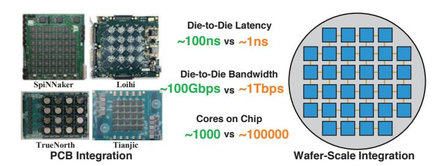
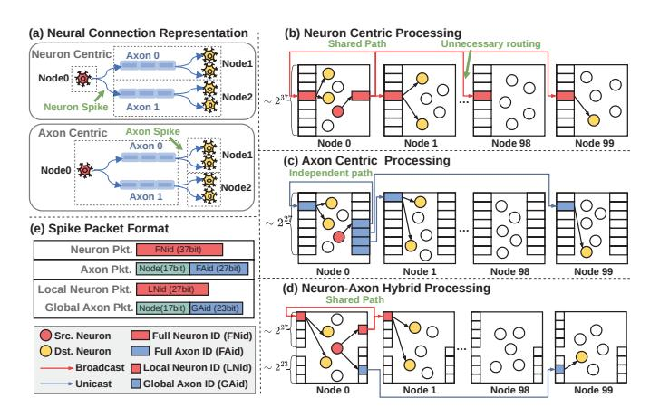
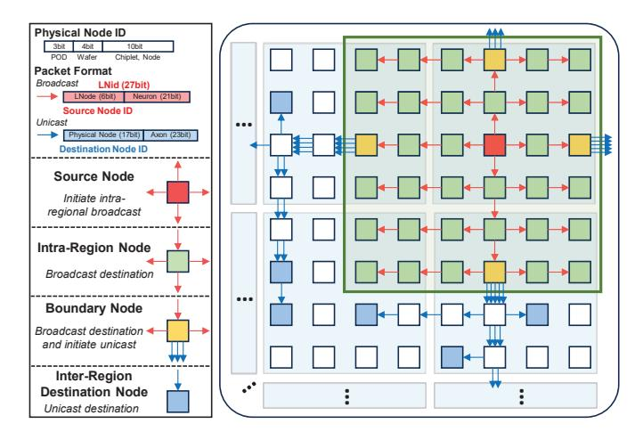
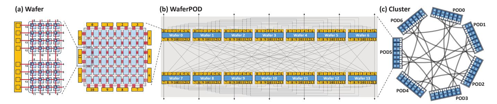
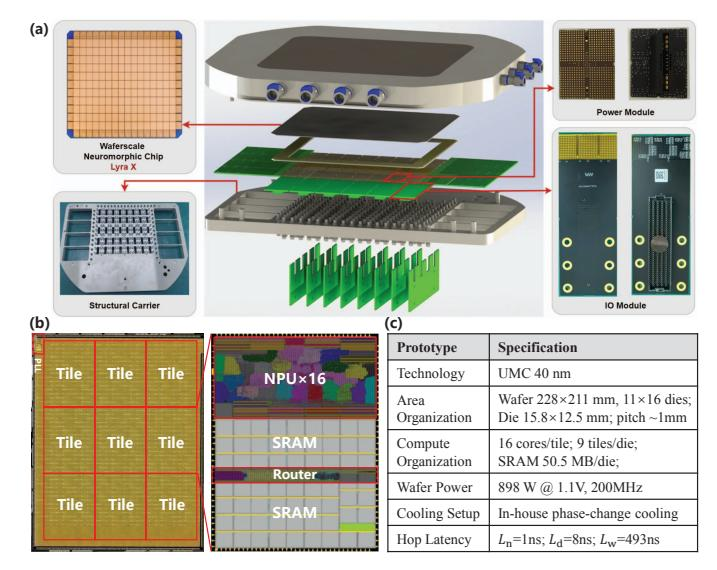
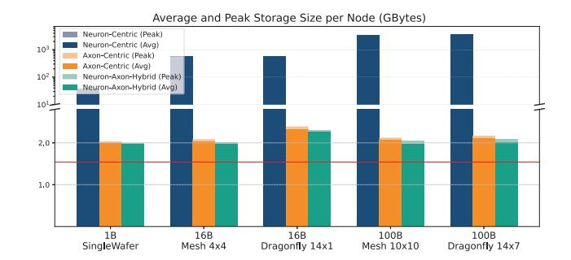
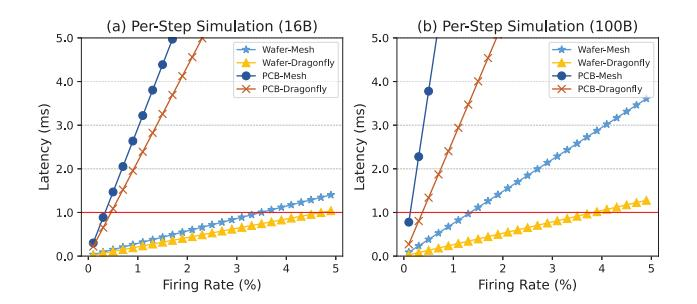

# WaferBRAIN: Whole-Brain Scale Neuromorphic Architecture Based on Wafer-Scale Integration

Yukun Feng<sup>1,2,†</sup>, Hao Jia<sup>2,†</sup>, Liangyu Gan<sup>1,2</sup>, Haoming Chu<sup>2</sup>, Yufan He<sup>2</sup>, Jiaxin Yin<sup>2</sup>, Lirong Zheng<sup>2</sup>, Ning Ma<sup>2,\*</sup>, Yuxiang Huan<sup>2,\*</sup>

<sup>1</sup>Faculty of Science and Technology, University of Macau, Macao, China <sup>2</sup>Guangdong Institute of Intelligence Science and Technology, Guangdong, China

{fengyukun,jiahao}@gdiist.cn, yc57997@um.edu.mo, {chuhaoming,heyufan,yinjiaxin,zhenglirong,maning,yxhuan}@gdiist.cn

Abstract—Scaling neuromorphic systems to whole-brain models is constrained by inefficient processing paradigms and long, sparse off-chip links in PCB integration. We present Wafer-BRAIN, a wafer-scale neuromorphic architecture that co-designs event representation, routing, storage, and topology for wholebrain scale cortical models. WaferBRAIN adopts a neuron-axon hybrid paradigm: local broadcast within brain regions, targeted unicast across regions, and boundary-triggered scheduling to mitigate hotspots, reducing router traffic by up to 300×, latency by up to  $14\times$ , and indexing storage by up to  $7,400\times$ . For further scaling-out of the single neuromorphic wafer chips, a switchless dragonfly inter-wafer network shortens paths and balances traffic, reducing inter-wafer congestion by 3.4–3.7 $\times$ . Calibrated with a 12-inch prototype *Lyra X*, WaferBRAIN sustains the firing rates required for biological real-time simulation, achieving per-step communication latencies consistently below the 1 ms simulation time step. Furthermore, 3D Wafer-Scale Integration provides sufficient DRAM capacity to support 1B neurons and 256B synapses per wafer, and compared with neuromorphic processors by PCB-level integration, it improves sustainable firing rates by 13×. Together, these advances enable real-time whole-brain neuromorphic simulation on digital wafer-scale platforms.

Index Terms—neuromorphic architecture, 3D wafer-scale integration, whole-brain simulation, interconnect architecture

## I. INTRODUCTION

Simulating brain-scale neurodynamics is not only a milestone in neuroscience but also a key step in revealing how large-scale connectivity and event-driven computing can coexist efficiently in silicon systems. Achieving whole-brain scale simulations requires collaborative progress in both biology and engineering [20]. With recent advances in neuroscience that have mapped increasingly complete and quantitative neural connectivity atlases, the need for hardware platforms capable of handling substantial spike-event throughput in real time has become more urgent.

Large-scale neuromorphic processors generally adopt highly interconnected cores, tightly integrating computation and storage functionalities [1], [5], [6], [25], [26], [29], [42]. Moreover, neuromorphic systems leverage distributed inter-core communication links to propagate sparse spike events in parallel, thereby enhancing overall spike transmission capacity. While these platforms enabled early demonstrations of neuromorphic computing, they do not scale to substantially

† These authors contributed equally to this work. \* Corresponding authors.



Fig. 1. Comparison of PCB and wafer-scale integration. Die-to-die bandwidth denotes the communication between nodes on different dies.

larger networks. Most prior systems rely on SRAM-based or crossbar-based synaptic storage together with PCB-level multichip integration, which fundamentally constrains memory capacity and communication. At the target biological scale (100 billion neurons and 10 trillion synapses) [12], [28], a wholebrain model would require an enormous number of compute nodes. Therefore, as the network scale expands, communication bandwidth has rapidly become a major bottleneck.

Recent advances in wafer-scale integration (WSI) [22], [30], [31], [39] offer a transformative path for scaling neuromorphic systems. By leveraging advanced packaging technologies such as CoWoS [14] and 3D integration [17]-[19], wafer-scale architectures can significantly expand chip area and consolidate compute, memory, and interconnect resources within a single wafer-scale substrate. Recent advances in lithography, wafer bonding, and yield-aware routing have made it feasible to fabricate ultra-large chips with high-density metal routing layers, enabling die-to-die (D2D) latency on the order of 1 ns and bandwidths exceeding 1 Tbps [22], [31], [39], along with 3D-stacked memory capacity of up to 2 TB. Moreover, the massive core count on a single wafer reduces chip-tochip traffic and eliminates the need for costly chip-to-chip interfaces. As summarized in Fig. 1, these advantages make 3D-stacked memory WSI (3D-WSI) uniquely suited for largescale neuromorphic systems that demand extreme interconnect efficiency, low latency, and high throughput. Thus, rethinking neuromorphic architecture in the 3D-WSI context is key to practical whole-brain scale simulation.

First, 3D-WSI lifts the hard-capacity wall without consuming front-side logic area, letting each node host far more neurons and improving locality; yet the memory sys-

tem is no longer SRAM-centric. We must exploit a hierarchical memory system that keeps hot state data in SRAM and places connection data in 3D-DRAM, while redesigning data structures (contiguity-aware adjacency blocks, compressed IDs, coalesced DMA/prefetch) to balance compute–communication–memory and amortize DRAM latency. At whole-brain scale, multi-wafer deployment becomes necessary; adopting a low-diameter inter-wafer fabric instead of a mesh or torus reduces hop counts and hotspots, thereby lowering traffic and latency.

Second, mainstream communication schemes and connection representations impose substantial traffic and storage overheads. For spike-event transmission, unicast fails to exploit shared-path reuse, concentrating load near sources and increasing cumulative hop cost; broadcast floods the network with redundant traffic; and multicast relies on large per-node routing tables that inflate memory. On the connectivity side, neuroncentric indexing is redundant (storing large fan-in entries), while crossbar-based organizations cap fan-in and fare poorly on sparse, irregular networks. As systems toward whole-brain scale, these costs compound, turning interconnect traffic and indexing/memory usage into first-order bottlenecks.

Motivated by the limits of conventional neuromorphic systems and the emerging potential of 3D-WSI, we propose WaferBRAIN, a wafer-scale neuromorphic architecture for whole-brain simulation. WaferBRAIN introduces a neuronaxon hybrid processing (NAHP) paradigm that marries the path-reuse benefits of neuron-driven broadcast with the selectivity of axon-driven unicast, reducing both traffic and indexing overheads. Connectivity is organized hierarchically: neuron-driven broadcast within regions for dense local fanout, and axon-driven unicast across regions for sparse longrange projections. A region-level boundary-triggered mechanism relocates inter-region unicasts to boundary nodes, further reducing hotspots and cumulative hop cost. On the memory side, WaferBRAIN employs a wafer-native hierarchy: hot neuron state and event queues reside in on-chip SRAM, while synapses and fan-in/out metadata are placed in 3Dstacked DRAM using compact identifiers and contiguity-aware adjacency blocks to enable coalesced DMA-balancing compute, communication, and memory. For scale-out, we combine a switchless-dragonfly fabric with WC-to-NC sharding and preplanned deterministic unicast paths, providing low diameter and high throughput for brain-scale sparse communication. We evaluate WaferBRAIN on brain-scale workloads, reporting communication traffic, storage cost, topology efficiency, and single-step latency. The main contributions of this work are:

- We present WaferBRAIN, a neuromorphic architecture on 3D-WSI that co-designs topology, routing, and connection representation, enabling 1B-neuron simulation on a single 12-inch wafer.
- We provide a systematic analysis of neuron-centric and axon-centric paradigms, identifying scaling limits in routing reuse, indexing overhead, and memory under brainscale connectivity.
- We propose a region-level boundary-triggered NAHP


Fig. 2. (a) Event-driven SNN computation and dominant bottlenecks. AER: Addressing Event Representation. (b) Structural connection matrix of the human brain: dense intra-regional connections and sparse inter-regional projections [13].

- scheme that combines local neuron-driven broadcast and global axon-driven unicast, reducing traffic by  $2.6-300 \times$  and single-step latency by  $4.7-14 \times$  at whole-brain scale.
- We design NAHP's storage organization as a wafer-native hierarchy that keeps hot neuron state and spike queues in on-chip SRAM, while placing synapses and axon-in/out in 3D-stacked DRAM. With compact identifiers and contiguity-aware adjacency blocks for coalesced DMA, it reduces indexing overhead by up to 7,400×.
- We present a switchless dragonfly scale-out fabric and routing design: table-free mesh-XY on-wafer; small route info to select the egress across the node/wafer/POD hierarchy; and per-egress sharding with preallocated deterministic routes that materialize unicast paths. The fabric lowers peak traffic by 2.8×, and achieves 13× lower latency than PCB-level integration and 2.9× lower latency than a 2D-mesh baseline.

# II. BACKGROUND AND MOTIVATION

#### A. Whole-Brain Scale Simulation

Recent trends make whole-brain simulation both more urgent and more actionable, strengthening the need for scalable, real-time neuromorphic infrastructure [2], [4], [8]. The rapid progress of data-driven biological modeling [3], together with the growing availability of connectomes and region-resolved structural datasets, provides a much more solid foundation for brain-scale network models than earlier neuromorphic efforts. Importantly, many target neuroscience workflows demand *biological real-time* for interactive and closed-loop studies, such as dynamic clamp with hard real-time feedback and electrical stimulation driven by ongoing neural activity [4], [32], [34]. Thus, our optimization goal is to maximize the system's capacity for simulating neural activity under a fixed real-time step budget. Higher capacity enables larger-scale models, more complex firing dynamics, and finer-grained neural simulations.

Meeting the real-time constraint at the brain scale requires sustaining massive event throughput across coupled compute, memory, and communication resources. At whole-brain scale  $(10^{11} \text{ neurons}, 10^{14} \text{ synapses})$ , each step executes a continuous event-driven pipeline (Fig. 2(a)): Axon.in gathers incoming events; Synapse performs sparse weight lookups/decay (memory-bound); Dendrite accumulates postsynaptic currents

via segmented-reduce; Soma integrates membrane state and thresholds spikes (compute-bound); and Axon.out emits events through local broadcast and boundary-triggered scatter while the NoC routes packets (communication-bound). This pipeline implies trillions of event-level operations per step with heterogeneous bottlenecks, rendering conventional platforms impractical. Even large supercomputing efforts remain far from biological real time: a recent whole-brain simulation using 14,012 GPUs runs  $65-118.8 \times$  slower than real time [24], and another large-scale effort using 82,944 CPU nodes runs 578× slower [40]. The largest existing neuromorphic systems can achieve biological real-time for selected workloads, but scaling remains limited to the billion-neuron scale (e.g., SpiN-Naker and Loihi2), far below the whole-brain scale [20]. As the system scales out, computation and memory access do not improve proportionally, while communication overhead increases sharply and becomes a primary bottleneck [24], [40]. This work targets that limitation by co-designing the communication paradigm, routing, and storage organization for wafer-scale neuromorphic simulation.

Understanding whole-brain structural connectivity is essential for scalable neuromorphic architecture design. The brain comprises distinct regions defined by anatomy and function [11]. Cortical networks exhibit small-world, distance-dependent organization: most synapses are local, with sparse long-range projections [27], [33], [36], [37]. As in Fig. 2(b), the human connectivity matrix concentrates dense intra-regional links along the diagonal, with obviously sparser inter-regional connections, supporting local dense processing and global sparse communication. This structure is mainly exploited by neuromorphic software toolchains for partitioning and mapping to reduce cross-node connections and improve locality [16], [41]. Existing communication paradigms for this connectivity pattern have been explored, but they remain inefficient at scale.

#### B. Taxonomy and Limitations of Prior Work

Prior neuromorphic systems largely fall into two distributed paradigms: neuron-centric and axon-centric. As in Fig. 3(a), one neuron emits multiple axons targeting different postsynaptic groups. The key difference is the routing entity and its metadata: neuron-centric paradigm routes *neuron spikes* directly, whereas axon-centric paradigm routes *axon spikes* and attach per-axon fan-in/out information. Consequently, as shown in Fig. 3(b)(c), they diverge in event encoding, routing reuse, synapse addressing, and storage organization.

**Neuron-centric processing** encodes events with full neuron IDs (FNids) and uses the FNid to address synapses. Systems such as SpiNNaker and Darwin multicast FNids from the source nodes, letting destination nodes index their local synapses [26], [29]. This exploits shared-path reuse, but multicast requires large per-chip routing tables at scale; broadcast shrinks routing tables yet floods nodes with unnecessary traffic (Fig. 3(b)). Moreover, FNid-based addressing implies a global neuron directory on every chip (e.g.,  $\sim 2^{37}$  entries for a 100B-



Fig. 3. (a) Neuronal connection representation under neuron-centric and axon-centric schemes. (b) Neuron-centric: broadcasting FNid reuses shared paths, but cause unnecessary traffic. (c) Axon-centric: unicasting FAid avoids unnecessary delivery, but loses path reuse. (d) NAHP: broadcasts LNid locally for reuse and unicasts GAid globally for sparse long-range projections, while also enabling more compact storage. (e) Packet formats for three paradigms.

neuron model), yielding prohibitive memory overhead. CPUand GPU-based neuromorphic software simulators typically adopt a neuron-centric paradigm, where spikes carry sourceneuron identifiers and synaptic lookup is performed at the destination nodes. While these methods are neuron-centric in communication semantics, their implementation is often realized as sequences of point-to-point messages orchestrated by MPI collectives, lacking NoC-style hardware path reuse and in-router packet replication. These works further exploits the local-dense/global-sparse structure of brain connectivity to reduce communication overhead. DFMG separates spike exchange into local-regular and global-flush components and decomposes a global All-Gathery-style exchange into multiple smaller communication groups, improving locality and reducing the number of communication targets per step [21]. Xin Du et al. propose a greedy grouping strategy and a twolevel routing algorithm: GPUs within each group communicate via point-to-point links, while cross-group communication is forwarded through designated bridge GPUs [7]. While these technologies reduce redundant transmissions, communication remains a major challenge at large scale: as scale increases, switch fabrics become more complex, communication paths lengthen, and path reuse remains limited, making it difficult to sustain high real-time performance.

Axon-centric processing encodes events with full axon IDs (FAids) and addresses synapses by FAid. In Loihi and Darwin3, the source node stores fan-out FAids and unicasts them to destination nodes; receivers index their synapses by the incoming FAid (Fig. 3(c)) [5], [25]. FAid-based indexing shrinks global directories (e.g.,  $\sim 2^{27}$  entries for a 100B-neuron model), but packets must carry destination chip IDs. While this avoids large tables and redundant delivery and thus scales well, independent unicasts forgo shared-path reuse, creating congestion under dense local connectivity. In addition, some designs (TrueNorth, Tianjic, PAICORE) rely on crossbar synapse arrays, which cap fan-in and impede biological

connectivity [1], [6], [43].

Neither neuron-centric nor axon-centric designs align with brain connectivity: the former wastes traffic on global broadcast, the latter misses local path reuse. Both incur unfavorable trade-offs in synapse addressing, routing overhead, and memory, limiting scalability to whole-brain scale models. To reconcile these trade-offs, we propose NAHP, which matches the brain structural connectivity by combining neuron-driven with axon-driven.

Neuron-axon hybrid processing uses neuron-driven broadcast within a region (dense local fan-out) and axondriven unicast across regions (sparse long-range projections), as in Fig. 3(d). For dense local connectivity, the source broadcasts local neuron IDs (LNids) within its local region, enabling routing path reuse across multiple destinations. For sparse long-range connectivity, the source unicasts global axon IDs (GAids) to the respective destinations, minimizing unnecessary traffic. By separating local and global connections, the addressing entries for the local part are the number of neurons within a region (e.g.,  $\sim 2^{27}$  in a 100B model), while sparse global axon entries require only  $\sim 2^{23}$ . This separation allows compressed packet formats (Fig. 3(e)) and efficient synaptic storage. Overall, the hybrid paradigm preserves routing reuse for dense local fan-out, eliminates redundant long-range transmissions, and maintains a scalable, memory-efficient synapse addressing scheme suitable for billion-scale neuromorphic systems.

#### C. 3D Wafer-Scale Integration

3D-WSI refers to the fabrication and vertical stacking of multiple functional layers on a full wafer using advanced hybrid bonding techniques. Logic layers are directly integrated with 3D-stacked DRAM on wafer, providing both massive compute density and terabyte-scale memory capacity. The monolithic architecture of WSI delivers orders-of-magnitude improvements in inter-core bandwidth, latency, and energy efficiency, while enabling ultra-high integration density [22], [31], [39]. Recent platforms such as Cerebras WSE-2 and Tesla Dojo have demonstrated the practicality of WSI, integrating hundreds of thousands of cores per wafer with tens of petabytes per second bandwidth and nanosecond-scale latency, far surpassing PCB systems [10], [22], [38]. Furthermore, advances in 3D stacking technologies [17]-[19] now enable the vertical integration of logic wafers with DRAM wafers, achieving tight coupling of memory and computation in a truly 3D compute-in-memory substrate. State-of-the-art 3Dintegrated DRAM reaches an areal density of approximately  $0.43 - 0.66Gb/mm^2$  [15], and exposes extremely high aggregate parallel bandwidth that supports massive, fast, parallel reads-well-matched to sparse spike-event memory access patterns. This heterogeneous integration provides large onwafer memory capacity and improves fan-in/fan-out locality by colocating synaptic storage with compute units in the vertical dimension.

In neuromorphic computing, the analog BrainScaleS demonstrated wafer-level integration of  $2\times10^5$  neurons with

biologically realistic, energy-efficient dynamics [35]. However, their analog architecture imposes inherent limitations in scalability, programmability, and numerical precision. Our goal is to implement a digital WSI architecture to overcome these limits and enable on-wafer integration of 1 billion neurons. WSI fundamentally reshapes the communication landscape by eliminating off-chip bottlenecks, drastically reducing traffic and propagation latency, and scaling neuron capacity to billions per wafer. This enables real-time brain-scale simulations with biological connectivity and dynamics, delivering unprecedented parallelism, bandwidth, and throughput.

#### III. ARCHITECTURE

This section presents the WaferBRAIN architecture. Section III-A describes the underlying 3D-WSI chip architecture, which defines the hardware substrate for system design. Building upon this foundation, Section III-B introduces a distributed NAHP data structure that serves as the storage foundation for NAHP, enabling scalable representation of sparse, hierarchical connectivity. Section III-C then develops the NAHP communication stack: it specifies the overall scheme, details how the two hybrid routing modes are implemented on WaferBRAIN, and describes an efficient triggering mechanism for activating either mode. Section III-D presents a dragonfly-based, switchless inter-wafer interconnect and its system integration. Section III-E details how unicast is realized over the switchless dragonfly fabric, including channel selection, sharding, and preallocated deterministic routes for materializing end-to-end unicast paths. Together, these components balance traffic, memory scalability, and biological plausibility, enabling realtime whole-brain spiking emulation on wafer-scale platforms.

# A. 3D-WSI Neuromorphic Chip Architecture

Our wafer-scale chip adopts a 3D-enabled chiplet-based WSI architecture, where compute dies and DRAM dies are vertically stacked and interconnected across the entire wafer through hybrid bonding, as shown in Fig. 4.

(1) Wafer Architecture: In the proposed architecture, the 215 mm ×215 mm wafer integrates 6 × 8 compute dies in a 2D mesh topology, with each compute die vertically bonded to a dedicated 3D-stacked DRAM die. Compared with alternative topologies such as dragonfly, the mesh topology achieves a favorable balance of bandwidth, signal integrity, and scalability at the wafer level. Owing to its reliance solely on nearest-neighbor connections, the mesh exhibits a simplified interconnect pattern that is more compatible with packaging integration, making it particularly suited for large-scale chiplet networks on wafers. Furthermore, 3D-WSI provides low-latency D2D communication and efficient compute-to-memory data transfers, alleviating the latency penalties of large mesh scaling and enabling superior data locality.

(2) Chiplet Architecture: To accommodate a  $6 \times 8$  chiplet array on a 215 mm  $\times$ 215 mm wafer, each chiplet is allotted an area budget of 23 mm  $\times$  32 mm. Every chiplet integrates a 4  $\times$  4 array of Brain Processing Unit (BPU) nodes for domain-specific neuromorphic computing. A D2D interface enables


Fig. 4. Overview of wafer-scale chip architecture.

chiplet-level scale-out, while 3D-stacked DRAM provides high-capacity synapse storage. Each BPU node contains a lightweight network-on-chip (NoC) router that supports both unicast and broadcast dissemination of spiking events, together with four functional modules, including axon-in, dendrite, soma, and axon-out (Fig. 4).

**Axon-in module.** Ingests AER spikes from local and global sources and performs direct pointer/fan-out lookups in 3D-stacked DRAM. Pointer/fan-out tables map each spike to its target synapse lists (local or global), supplying the metadata needed to initiate memory accesses.

**Dendrite module.** A DMA engine fetches synaptic data encoded in an adjacency-list format from the 3D-stacked DRAM. Each synapse weight and related metadata is decoded and dispatched to different FIFOs based on the destination neuron ID. This realizes sparse synapse indexing in hardware and supports event-driven, asynchronously parallel accumulation of synaptic currents across FIFOs. The accumulated currents are then handed off to the soma for subsequent membrane-potential updates.

**Soma module.** Maintains neuron state in dedicated SRAM and updates membrane potentials according to the neuron model. Threshold crossings generate new spike events that are forwarded to the axon-out stage.

**Axon-out module.** Packages and distributes outgoing spikes along local or global paths. Axon-pointer/fan-out tables determine destinations within and across BPUs/chiplets, driving either NoC unicast or broadcast as appropriate.

This hierarchical organization enables efficient event-driven processing, scalable inter-chiplet communication, and dense synaptic storage, making the architecture well-suited for large-scale wafer-level neuromorphic integration.

(3) Package View: The package adopts a 3D-WSI scheme in which multiple compute dies and stacked DRAM dies are integrated on a silicon interposer. As shown in Fig. 4, DRAM dies are connected to the underlying redistribution layer (RDL) through through-silicon vias (TSVs), enabling dense vertical interconnects and minimizing memory—compute communication distance. The RDL provides fine-pitch routing for signals and power delivery across dies and further redistributes connections to the package substrate. Finally, the package substrate is bonded to the PCB, establishing external signal connections. This hierarchical integration eliminates


Fig. 5. The distributed data structure of NAHP. (a) A cross-region connectivity example. (b) Its NAHP mapping: red indicates local (LNid-based) connectivity; blue and green indicate global connectivity, corresponding to axon-out and axon-in metadata, respectively. Dashed boxes summarize each structure's format and storage scaling.

long PCB traces found in conventional multi-chip systems, thereby reducing interconnect latency, enhancing D2D bandwidth, and improving signal integrity.

# B. Storage Organization for NAHP

**SRAM for hot state.** We dedicate on-chip SRAM (Fig. 4) to high-frequency neuron state and per-step event queues (e.g., membrane potential, refractory flags, and temporary accumulators). Keeping these hot variables in SRAM minimizes latency for neuron updates and prevents thrashing on frequently accessed state.

**DRAM for connectivity.** Connectivity metadata and synaptic weights are placed in 3D-stacked DRAM and organized as adjacency lists tailored to NAHP's two addressing modes (Fig. 5): a neuron-driven local layout for dense intra-region tar-



Fig. 6. NAHP communication scheme. Red arrows show intra-region broadcast within a configurable region (green region), and blue arrows show boundary-initiated inter-region unicast to inter-region destinations. In broadcast packets, *LNode* is the packet source's relative ID in its region; in unicast packets, *Physical Node* denotes the packet destination's absolute position in the global system.

gets, and an axon-driven global layout for sparse inter-region projections. Each block exposes a compact pointer/length header followed by a contiguous adjacency list, enabling coalesced accesses while keeping index overhead small.

- 1) Local (Neuron-Driven) Layout: When postsynaptic targets reside within the same region as the source neuron (intra-region node in Fig. 5), NAHP uses a neuron-driven representation:
  - Local Axon-in. Indexed by the local neuron identifier LNid; each entry returns a compact record with (L.Syn.Pointer,Fanout), where L.Syn.Pointer points to the local synapse address and Fanout provides the number of target synapses.
  - Local Synapse. A contiguous adjacency list for the neuron's intra-region fan-out, stored as entries \DstNeuron, Weight\rangle (or delay/plasticity flags).
- 2) Global (Axon-Driven) Layout: For targets outside the source region (inter-region node of Fig. 5), NAHP employs an axon-driven representation that factors long-range projections by destination node:
  - Global Axon-out Index. This table is the index that maps a source neuron to multiple axon-out entries. Indexed by source neuron (LNid). Each entry records the address pointer Axon-out. Pointer and Fanout of the neuron's global axon-outs.
  - Global Axon-out. For a specific remote destination node DstNode, the axon-out record carries the receiver-side axon identifier, i.e., \DstNode, GAid\). It serves as the compact directory that the sender uses to reference the corresponding receiver-side axon.
  - Global Axon-in. Indexed by the global axon identifier GAid local to the destination node DstNode; each entry returns (G.Syn.Pointer,Fanout), where G.Syn.Pointer points to the node-local global synapse block.


Fig. 7. The framework of the NAHP router. Packets are first classified by the 0/1 mode bit to select broadcast or unicast. For broadcast packets, routers use a small route\_info table indexed by *LNode*; the dashed box illustrates the even/odd source split used in broadcast routing. For unicast packets, routers perform on-wafer mesh-XY routing or egress WC selection, followed by deterministic-route forwarding based on the selected WC.

 Global Synapse. A contiguous list of (DstNeuron, Weight) entries for all inter-region synapses hosted in the same destination node.

In NAHP, hot, frequently updated neuron state resides in SRAM, while large, sparse connectivity and weights are stored in DRAM using two complementary block-contiguous layouts. This separation decouples compute from connectivity size, preserves locality at both intra- and inter-region scales. These storage layouts are complementary to off-chip sparse-aware memory-management techniques explored in prior neuromorphic systems (e.g., ActiveN [23]), and could be integrated to further improve irregular synapse-access efficiency.

## C. NAHP Communication Scheme

NAHP combines two communication modes to match brain connectivity: a local neuron-driven broadcast for dense intraregion fan-out and a global axon-driven unicast for sparse inter-region projections. As shown in Fig. 6, NAHP selects between the two modes based on the spatial distribution of destinations, and couples each mode with its corresponding metadata and storage organization.

1) Local Region Broadcast: For postsynaptic targets localized within the same cortical region (the green  $N \times M$  tile in Fig. 6, where N and M are configurable to match the size/shape of a brain region mapping), NAHP uses neuron-driven broadcast with packets carrying only  $LNid=\langle LNode, Neuron\rangle$ . Routers identify such packets by mode=0 and route solely based on LNode (the relative node ID in region). Each router implements broadcast via a table-based datapath (Fig. 7): a small per-node routing table, indexed by LNode, returns a 5-bit  $\{N, E, S, W, L\}$  mask specifying the enabled output ports when a broadcast packet from that source LNode traverses the router. The entries are precomputed for the configured region shape by broadcast-path planning and loaded into each router-local SRAM during system configuration, enabling one-cycle lookup and deadlock-free forwarding.

To balance link utilization in both dimensions, the planned broadcast paths adopt an even/odd source split: even LNodes use column-expansion broadcast, whereas odd LNodes use row-expansion broadcast. In the example of Fig. 7, an even source LNode=0 uses column-expansion broadcast; when its packet reaches the red router, the lookup returns 00101, corresponding to {S,L}, which matches the blue entry in the route info table. An odd source *LNode*=1 uses row-expansion broadcast; when its packet reaches the red router, the lookup returns 01111, corresponding to {E,S,W,L}, which matches the green entry in the route\_info table. By alternating these two expansion patterns across sources, the broadcast traffic is balanced across both dimensions of the region without any per-packet on-the-fly routing decision. Because forwarding depends only on the table entry indexed by *LNode*, changing the region size or tiling pattern requires only (i) assigning LNodes during region allocation and (ii) generating and loading the matching broadcast table; no packet-format change and no runtime computation are needed.

- 2) Inter-Region Unicast: For postsynaptic targets outside the source region, NAHP uses axon-driven unicast. Packets carry mode=1 and a destination physical ID \(\text{POD}, Wafer, Node\); the GAid is delivered to the receiver for synapse addressing but is not used by routing. As shown in Fig. 7, given mode=1, the router follows a unified unicast procedure with two cases:
- (1) Same wafer  $\Rightarrow$  Mesh-XY: First, the router determines whether the packet targets the local wafer. If so, it performs table-free XY routing by comparing the packet's destination coordinate against the router's current coordinate in the coordinate comparator, and selects the next hop until reaching the destination node.
- (2) Cross-wafer/cross-POD  $\Rightarrow$  channel egress: For any off-wafer destination, the router first selects an egress wafer channel (WC) based on the destination location (Egress-WCselection logic in Fig. 7). If the destination lies in a different POD, WC selection is driven primarily by the destination POD. If the destination is within the same POD but on a different wafer, WC selection is driven by the destination Wafer. How WCs are selected and how the deterministic paths are preplanned (including WC to node channel sharding and POD channel pairing) depends on the switchless-dragonfly interconnect and is detailed in Sec. III-E. Once the WC is determined, routers index a WC-selected routing table stored in router-local SRAM to obtain the preplanned next-hop mask, forwarding the packet along the deterministic path to the WC egress. After crossing to the target wafer, delivery within that wafer proceeds via mesh-XY routing to the destination node.
- 3) Region-Level Boundary Triggering: To exploit locality and avoid concentrating axon-driven unicasts near a firing source, NAHP introduces a region-level boundary triggering mechanism (Fig. 6). The key idea is that global unicasts are generated only at boundary nodes, never by interior nodes. When a neuron fires, the source node issues only the intraregion broadcast (mode=0, LNid=\langle LNode, Neuron \rangle); via this region-wide broadcast, all nodes in this region receive this

```
Algorithm 1 Deterministic Axon-to-Boundary Assignment
```

```
Input: Region size N \times M, source chip (i, j), destination chip
Output: Assigned boundary chip (i_b, j_b)
 1: if source and destination chips are on the same wafer then
        (i_a, j_a) \leftarrow (i_d, j_d) {Use destination chip as anchor}
        (i_a, j_a) \leftarrow \text{intra-wafer exit point to destination wafer}
 5: end if
 6: Initialize boundary set:
 7: \mathcal{B} \leftarrow \{(i,0), (i,M-1), (0,j), (N-1,j)\}
 8: d_{\min} \leftarrow \infty, (i_b, j_b) \leftarrow \emptyset
 9: for all (i_c, j_c) \in \mathcal{B} do
        d \leftarrow |i_a - i_c| + |j_a - j_c|
        if d < d_{\min} then
11:
            d_{\min} \leftarrow d
12:
            (i_b, j_b) \leftarrow (i_c, j_c)
13:
        end if
14:
15: end for
16: return (i_b, j_b)
```

event. The boundary node that holds the corresponding axonout metadata then triggers inter-region delivery by sending a unicast packet (mode=1) addressed to the destination  $\langle \texttt{POD}, \texttt{Wafer}, \texttt{Node} \rangle$ . Thus, global propagation is decomposed into two stages: (i) an intra-region broadcast and (ii) a boundary-triggered unicast to the remote destination. This shares the intra-region path, avoids redundant far-field delivery, and reduces unicast hotspots near the source.

To enable boundary-initiated inter-region unicasts, NAHP assigns each inter-region axon to a unique boundary owner within the source region, which stores the axon-out metadata and is responsible for initiating the unicast. For a source node (i, j) in an  $N \times M$  region, NAHP first designates four boundary candidates on the same row/column,  $\{(i,0),(i,M-$ 1), (0, j), (N-1, j)}, as potential owners to hold its interregion axon-out metadata (illustrated by the four yellow boundary nodes in Fig. 6). For each inter-region axon, NAHP select its unique owner from these four candidates using the nearest-boundary rule, i.e., minimum Manhattan distance to the routing anchor  $(i_a, j_a)$ . For same-wafer unicast,  $(i_a, j_a)$  is the destination node; otherwise,  $(i_a, j_a)$  is the node that hosts the selected WC egress for cross-wafer/cross-POD unicast. Ties are broken lexicographically to ensure a unique owner. The complete procedure is summarized in Algorithm 1.

To accommodate the additional axon-out metadata, each boundary node reduces its neuron placement by 20%, and the displaced neurons are redistributed evenly within the region to keep storage pressure uniform and preserve broadcast fan-out symmetry. If each neuron has k inter-region axons, assigning senders to boundary owners reduces the average cumulative routing distance per neuron by  $(N+M-2)\cdot k/4$ , lowering link contention and improving reuse of the shared intra-region path before the boundary-triggered unicast.



Fig. 8. Switchless dragonfly interconnect across three scales. (a) A wafer aggregates edge links into 14 WCs. (b) A WaferPOD connects 14 wafers in an all-to-all using WCs. (c) Seven WaferPODs form a 98-wafer cluster, where paired outward WCs form PCs.

## D. Switchless Dragonfly Inter-Wafer Fabric

To support whole-brain—scale simulation, we propose a 3D-WSI scale-out fabric. Unlike mesh/torus topologies with large diameters or switch-based dragonfly networks that rely on high-radix switches, our design aggregates on-wafer edge links into switchless wafer- and POD-level channels. We define three channel levels: a die-level node channel (NC), a wafer channel (WC) formed by aggregating eight NCs from an adjacent boundary-die pair, and a POD channel (PC) used between WaferPODs. At larger scales, these channels instantiate a hierarchical switchless dragonfly in which wafer-boundary dies act as direct communication channels, eliminating switches while maintaining high throughput and low diameter [9]. Fig. 8 illustrates the resulting hierarchy across wafer, WaferPOD, and cluster scales.

- (1) Wafer-level (14 WCs). Each wafer integrates a  $6\times8$  grid of dies, and each die contains a  $4\times4$  array of processing nodes. As shown in Fig. 8(a), each adjacent boundary-die pair along the wafer perimeter exposes a shared WC that aggregates eight NCs. In total, the wafer provides 14 bidirectional WCs, indexed 0–13, as its scale-out interfaces.
- (2) WaferPOD level (intra-POD). A WaferPOD connects 14 wafers in a full all-to-all topology using WCs. We denote  $WC_k(w)$  as the k-th wafer channel of wafer w. As shown in Fig. 8(b),  $WC_j(i)$  connects directly to  $WC_i(j)$ , so any two wafers are one hop apart. Each wafer uses 13 of its 14 WCs for intra-POD all-to-all links and reserves its diagonal channel  $WC_i(i)$  as the outward interface, yielding 14 outward WCs per WaferPOD for the next level.
- (3) Cluster level (inter-POD). Seven WaferPODs are interconnected via their outward WCs, which are paired to form PCs. We denote by  $PC_i(k)$  the *i*-th PC of WaferPOD k. In our design,  $PC_i(k)$  is realized by bonding two outward WCs within WaferPOD k, namely  $WC_i(i)$  and  $WC_{i+7}(i+7)$ . As shown in Fig. 8(c),  $PC_j(i)$  connects directly to  $PC_i(j)$ , so each WaferPOD reaches the corresponding WaferPOD i via  $PC_i$ . As a result, the end-to-end distance is 1 hop within a WaferPOD and 3 hops across the cluster  $(14 \times 7)$ , a dramatic reduction from the 18 hops of a  $10 \times 10$  mesh.

## E. Unicast over the Switchless Dragonfly Fabric

We next describe how NAHP realizes deterministic unicast over the switchless dragonfly fabric. The key is to (i) select an egress WC based on the destination POD/wafer and (ii) follow


Fig. 9. Unicast routing over the switchless dragonfly fabric. (a) annotates the end-to-end forwarding stages; (b) illustrates WC-to-NC sharding and the preplanned on-wafer deterministic routes, which materialize the WC-indexed deterministic-route entries used along the path to each WC egress.

preallocated deterministic routes to reach that WC, while distributing traffic across the eight NCs within the chosen WC. The resulting end-to-end forwarding stages and the WC-to-NC sharding used to populate the router tables are illustrated in Fig. 9.

- a) End-to-end forwarding: As shown in Fig. 9(a), unicast forwarding consists of five deterministic steps, detailed below. When the destination is in a different POD, it goes through the full sequence  $\textcircled{1}\rightarrow\textcircled{2}\rightarrow\textcircled{3}\rightarrow\textcircled{4}\rightarrow\textcircled{5}$ ; when the destination is within the same POD but on another wafer, it follows  $\textcircled{1}\rightarrow\textcircled{4}\rightarrow\textcircled{5}$ ; and when the destination is on the same wafer, routing uses only the on-wafer mesh step 5.
  - Ascend to the selected WC (①). Starting from the source node, the packet follows a preplanned on-wafer deterministic route to reach the designated egress WC for the destination.

- 2) **Rule for cross-POD selection** (②). If the destination lies in POD M, the packet traverses the corresponding  $PC_M(A)$  of the current POD A, while  $PC_M(A)$  is realized by the bonded outward WC pair  $(WC_M(M), WC_{M+7}(M+7))$ . To balance load, wafers with local index 0-6 use  $WC_M(M)$ , while wafers 7-13 use  $WC_{M+7}(M+7)$ . This rule corresponds to the green egress-WC-selection logic in Fig. 7.
- 3) **Inter-POD hop** (③). The packet crosses from the selected  $PC_M(A)$  to its peer  $PC_A(M)$  via the bonded outward WCs, thereby entering POD M.
- 4) **Intra-POD inter-wafer hop** (**④**). After arriving at the target POD (or when the destination is already in the same POD), if the destination wafer is *K*, the packet leaves via *K*-th WC and reaches wafer *K* through the intra-POD all-to-all links. This rule corresponds to the pink egress-WC-selection logic in Fig. 7.
- 5) On-wafer mesh delivery (⑤). Once on the destination wafer, simple coordinate-based mesh-XY routing routes the packet to the destination node.
- b) WC-to-NC planning and tables: After selecting a WC, we further determine which of its 8 NCs each injecting node uses for egress. For a given  $WC_k$ , we partition all injecting nodes that may egress via  $WC_k$  into eight disjoint shards and bind each shard to one NC. This yields a per-WC sharding function that maps (Chiplet, Node) to an NC index  $q \in \{0, ..., 7\}$ , assigning each injecting node to an NC for  $WC_k$ . This produces deterministic-route entries for  $WC_k$ , corresponding to the k-indexed entry of the WC routing table in Fig. 7. After  $WC_k$  is selected, each router indexes its deterministic-route table by  $WC_k$  to obtain the next-hop port mask, deterministically forwarding the packet along a preplanned path to the  $WC_k$  egress and out through the corresponding NC. Fig. 9(b) visualizes the WC-to-NC sharding and the preplanned on-wafer paths for two example WCs (WC<sub>2</sub> and WC<sub>6</sub>). The color of each injecting node indicates the selected NC index q for that WC, while the overlaid lines show the corresponding deterministic route from the node to the WC egress. We generate the deterministic-route tables offline by tracing these paths and writing the resulting per-router nexthop masks into the k-indexed WC entry. Together with the PC selection rule, these tables fully determine the end-to-end unicast path referenced in Sec. III-C2.

#### IV. EVALUATION

## A. Experiment Settings

1) Prototype Wafer-Scale System and Measurements: We built a WSI neuromorphic prototype, Lyra X, in UMC 40 nm. Figure 10 shows the prototyped 12-inch wafer-scale chip. The wafer measures 228 ×211 mm and integrates an 11 ×16 mesh of dies with ~1mm bump pitch. Using SRAM-only storage, Lyra X supports 202M neurons and 2B synapses, enabling fully on-wafer execution. We also developed a complete wafer-scale computing setup—vertical power modules, high-speed I/O, mechanical carrier, and support circuitry—to obtain real,



Fig. 10. (a) Prototyped 12-inch wafer-scale neuromorphic system Lyra~X. (b) Die photo and die-level floorplan highlighting the tile organization and major blocks. (c) Specifications table of Lyra~X.  $L_{\rm n},~L_{\rm d},~{\rm and}~L_{\rm w}$  denote the perhop latencies for node-to-node, die-to-die, and wafer-to-wafer communication, respectively.

TABLE I
DESIGN AND MEASURED PARAMETERS FOR EVALUATION

| Type                     | Parameters                          | Value         |
|--------------------------|-------------------------------------|---------------|
| Configuration            | Die per Wafer                       | 48 (6×8 mesh) |
|                          | Node per Die                        | 16 (4×4 mesh) |
|                          | DRAM per Die                        | 40 GB         |
|                          | Router Throughput                   | 1 Tb/s        |
|                          | Router Forward Latency $t_r$        | 5 ns          |
| Measured<br>by Prototype | Intra-die Hop Latency $L_{\rm n}$   | 1 ns          |
|                          | Inter-die Hop Latency $L_{\rm d}$   | 8 ns          |
|                          | Inter-wafer Hop Latency $L_{\rm w}$ | 493 ns        |

system-level latency measurements for both intra-die and interdie paths. Fig. 10(c) summarizes the Lyra X prototyped waferscale system, including wafer/die organization, SRAM capacity, measured hop latencies, wafer-level power, and cooling setup. While the single-wafer Lyra X is still far from a full 100B-neuron, multi-wafer whole-brain system, it provides realistic implementation data that inform and ground the nextgeneration design. WaferBRAIN architecture targets a 3D-WSI multi-wafer system for whole-brain-scale (100B) realtime neuromorphic simulation. The proposed WaferBRAIN primarily focuses on wafer-scale communication architecture, including the scale-up/scale-out interconnect and communication paradigm optimizations, and their latency/traffic implications for brain-scale simulation. Accordingly, the architectural evaluation of WaferBRAIN is informed by measured hop latencies from the fabricated prototype, including intra-die  $L_n$ , inter-die  $L_d$ , and inter-wafer  $L_w$ , to anchor the interconnect timing assumptions in real system data and improve the reliability of the architectural modeling.

2) Evaluation Configuration: We next describe the modeled WaferBRAIN configuration and the brain-model workloads used in evaluation. Table I summarizes the architectural parameters used throughout the evaluation (e.g., wafer-scale

TABLE II
MAPPING CONFIGURATIONS FOR BRAIN-SCALE MODELS.

| Model           | Neurons / Synapses | Topology       | Neurons per Node |
|-----------------|--------------------|----------------|------------------|
| 1B              | 1B / 256B          | Single Wafer   | ~1.30M           |
| Cerebral cortex | 16B / 4.1T         | 4×4 Mesh       | ~1.30M           |
| 16B             |                    | 14×1 Dragonfly | ~1.49M           |
| Whole brain     | 100B / 25.6T       | 10×10 Mesh     | ∼1.30M           |
| 100B            |                    | 14×7 Dragonfly | ∼1.33M           |


Fig. 11. Framework of the custom simulator used in evaluation.

chip configuration and router pipeline parameters). The hoplatency parameters in Table I are taken directly from prototype measurements, grounding the modeled interconnect latencies in realistic implementation data.

We evaluate three biologically grounded brain models with 1B, 16B, and 100B neurons, each with an average fanout of 256 synapses and a firing rate of 30 Hz. The 16B model reflects the total number of neurons the human cerebral cortex, while the 100B model covers the full human brain. Neurons are organized into cortical regions (at least 80M neurons each) with 95% local and 5% long-range connectivity, the latter distributed evenly across five randomly selected regions [27]. These workloads preserve the key structural properties of whole-brain neuromorphic simulation, including region-level modularity, dense local connectivity, sparse longrange projections, and biologically plausible firing activity. The models are mapped onto the wafer-scale system described in Sections III-D. The 1B model fits on a single wafer, while the 16B (cortex-scale) and 100B (whole-brain) models are deployed using both conventional mesh and proposed dragonfly interconnects, as detailed in Table II. Each cortical region is assigned an 8 × 8 node grid (64 nodes), yielding 83–95M neurons per region depending on per-node density.

3) Comparison Approaches: We compare the proposed NAHP paradigm with neuron-centric and axon-centric processing paradigms, as described in section II-B. A detailed comparison of these paradigms is summarized in Table III. At the interconnect level, we evaluate the proposed dragonfly wafer-scale topology against a conventional mesh topology, and also compare WSI-based deployment with traditional PCB-level integration under the same network configurations.

# B. Evaluation Methodology

We implement a custom, topology-aware analytical simulator tailored to NAHP and wafer-scale fabrics. As illustrated

in Fig. 11, the simulator takes as input (i) the brain model parameters (regions, neurons, and connectivity), (ii) the evaluated processing paradigm (data structure, routing scheme with packet format), and (iii) the modeled hardware parameters (interconnect topology and router/link timing and throughput). It constructs the NoC and derives the per-node workload, then performs storage analysis and routing-based traffic simulation. Moreover, it aggregates expected spike events over a 1 ms step and evaluates per-step communication latency with topologydependent propagation delay. To formalize these computations, we model the neuromorphic system as a graph G = (V, E), where each vertex  $v_i \in V$  represents a neuromorphic processing node and each edge  $e\langle v_i, v_i \rangle \in E$  denotes a physical communication link between two nodes. For each neuron  $n_i$ , we denote its residing node as  $v(n_i)$ , and let  $V_d(n_i)$  be the set of destination nodes where its post-synaptic neurons reside. The evaluation metrics are derived in three parts: communication load/traffic, storage footprint, and per-step latency.

a) Communication.: The routing cost of a firing neuron  $n_i$  depends on the routing scheme. For broadcast, the cost is destination-independent and defined as

$$L_b(n_i, V_d(n_i)) = |V_b| - 1, (1)$$

where  $V_b$  denotes the set of nodes within the broadcast domain. In neuron-centric,  $V_b$  includes all nodes V, while NAHP is restricted to nodes within the local region. For unicast, the cost is determined by the hop distance between the source node and each destination:

$$L_u(n_i, V_d(n_i)) = \sum_{v_j \in V_d(n_i)} \text{Dist}(v(n_i), v_j),$$
 (2)

where  $\mathrm{Dist}(v(n_i),v_j)$  indicates the hop distance between the injecting node  $v(n_i)$  and the destination node  $v_j$ . Since unicast transmissions are independent point-to-point deliveries,  $L_u$  equals the total sum of hop distances from  $v(n_i)$  to all  $v_j \in V_d(n_i)$ . In axon-centric processing,  $v(n_i)$  is the source node that injects the unicast packets, whereas in NAHP the unicast packets are injected by the boundary nodes assigned to the source neuron.

The average routing load R denotes the number of packets processed per router per second. We categorize synapses into local (intra-region) and global (inter-region) connections, denoted by destination sets  $V_d^L(n_i)$  and  $V_d^G(n_i)$ , respectively. The average per-node load is given by

$$R = R_{\text{Local}} + R_{\text{Global}},\tag{3}$$

$$R_{\text{Local}} = \frac{\lambda}{|V|} \sum_{n_i} L(n_i, V_d^L(n_i)), \tag{4}$$

$$R_{\text{Global}} = \frac{\lambda}{|V|} \sum_{n_i} L(n_i, V_d^G(n_i)), \tag{5}$$

where  $R_{\rm Local}$  and  $R_{\rm Global}$  denote the average packet rate per node due to local and global synaptic transmissions, with  $\lambda$  representing the firing rate. Since both neuron-centric and NAHP employ broadcast for local connections,  $R_{\rm Local}$  remains

TABLE III

COMPARISON OF NEUROMORPHIC PROCESSING PARADIGMS

| Paradigm                  | Neuron-Centric                         | Axon-Centric                                                            | Neuron-Axon Hybrid (Ours)                           |
|---------------------------|----------------------------------------|-------------------------------------------------------------------------|-----------------------------------------------------|
| Routing Method            | Broadcast (or Multicast <sup>1</sup> ) | Unicast                                                                 | Local Broadcast + Global Unicast                    |
| Routing Path Reuse        | Yes                                    | No                                                                      | Yes                                                 |
| Destination Scope         | All chips                              | Only destination                                                        | Local Region + Destination                          |
| Event Representation      | FNid (37bit)                           | NodeID&FAid (17+29bit)                                                  | LNid (27bit) + NodeID&GAid (17+23bit)               |
| Synapse Storage           | Adjacency List                         | Adjacency List (or Crossbar*)                                           | Local List + Global List                            |
| Synapse Addressing Scheme | FNid (237 entries)                     | FAid (2 <sup>27</sup> entries)                                          | LNid ( $2^{27}$ entries) + GAid ( $2^{23}$ entries) |
| Addressing Entry Width    | 37bit                                  | 37bit                                                                   | Local(37bit) + Global(33bit)                        |
| Synapse Addressing Cost   | High                                   | Low                                                                     | Low                                                 |
| Typical Processors        | SpiNNaker [29], Darwin [26]            | Loihi [5], TrueNorth* [1],<br>Tianjic* [6], Darwin3 [25], PAICORE* [43] | This work                                           |

<sup>[1]</sup> Multicast requires large routing tables for each node, which is not scalable to billion-scale systems.

identical. For global connections, our boundary-triggering mechanism reduces redundant hops, yielding lower  $R_{\rm Global}$  compared to axon-centric systems. The average traffic (in bits) is then computed as:

$$T = R_{\text{Local}} \times W_L + R_{\text{Global}} \times W_G, \tag{6}$$

where  $W_L$  and  $W_G$  denote the packet sizes for local and global events (Table III). Neuron-centric systems use FNids for both  $W_L$  and  $W_G$ , while axon-centric systems require NodeID+FAids. Our hybrid scheme employs LNids for local broadcast, reducing  $W_L$  by 10 bits in the 100B model, and GAids for global unicast, reducing  $W_G$  by 4 bits.

*b)* Storage.: The storage can be expressed as the sum of neuron states, synaptic weights, and indexing structures:

$$S_{\text{total}} = S_{\text{neuron}} + S_{\text{synapse}} + S_{\text{index}},$$
 (7)

Let N denote the number of neurons per node, F the average fan-out,  $B_n$  the storage per neuron (bits), and  $B_s$  the storage per synapse (bits). Then

$$S_{\text{neuron}} = N \cdot B_n, \ S_{\text{synapse}} = N \cdot F \cdot B_s,$$
 (8)

In our experiments,  $N=1.3-1.49\times 10^6$  (requiring 21 bits), F=256, and  $B_n=64$  bits. The synaptic weight is represented with 16 bits. Each synapse stores the target neuron ID together with its weight, giving  $B_s=21+16=37$  bits. Accordingly,  $S_{\rm neuron}=10.4$  MB and  $S_{\rm synapse}=1.54$  GB, showing that synaptic weights dominate overall storage.

The indexing overhead  $S_{\text{index}}$  varies with the processing paradigm, since the primary cost comes from synapse addressing entries. In neuron-centric and axon-centric methods, adjacency lists are maintained for both local and global synapses. As summarized in Table III, both requires each entry to store a 37 bit synapse addressing entry (29 bit address + 8 bit fanout). In contrast, the NAHP separates local and global synapses: local entries are proportional to the number of neurons within the region, while global entries, only about 5% of the total, are indexed separately with 4 fewer address bits. In terms of entry count, the neuron-centric paradigm stores the full neuron entries at every node, leading to an overhead that scales with the model size. The axon-centric paradigm

requires storing only the entries corresponding to the total fanin connections. The NAHP paradigm partitions addressing into local and global domains: local entries are equal to the number of neurons within a region, while the remaining global axon entries are maintained separately.

c) Latency.: Cycle-accurate latency simulation is intractable at whole-brain scale. We therefore use a step-level latency model that abstracts away fine-grained queuing dynamics within a 1 ms step, and defines the communication latency of a single simulation step (excluding computation) as the sum of the service time at the most heavily loaded router and the propagation delay along the longest path:

$$Latency = \frac{T_{\text{max}}}{\Theta_{\text{router}}} + \delta_{\text{max}}, \tag{9}$$

where  $\Theta_{\mathrm{router}}$  denotes the router throughput (bits/s). We compute the per-router traffic T(v) (bits) by accumulating all packets that traverse router v under the deterministic routes above, including transit traffic. The peak load is  $T_{\mathrm{max}} = \max_{v \in V} T(v)$ , which captures the worst-case congestion/hotspot for the given processing paradigm and topology. The maximum path propagation delay  $\delta_{\mathrm{max}}$  is defined as

$$\delta_{\text{max}} = L_{\text{n}} \cdot H_{\text{n}} + L_{\text{d}} \cdot H_{\text{d}} + L_{\text{w}} \cdot H_{\text{w}} + t_{r} \cdot (H_{\text{n}} + H_{\text{d}} + H_{\text{w}}), \quad (10)$$

where  $L_{\rm n}$ ,  $L_{\rm d}$ , and  $L_{\rm w}$  are the per-hop delays for intra-node, inter-die, and inter-wafer links, respectively, and  $H_{\rm n}$ ,  $H_{\rm d}$ , and  $H_{\rm w}$  are the corresponding hop counts along the longest communication path. The term  $t_r$  accounts for the router forwarding latency incurred at each hop. We calibrate  $L_{\rm n}$ ,  $L_{\rm d}$ , and  $L_{\rm w}$  using the prototype measurements in Table I, and take  $t_r$  and  $\Theta_{\rm router}$  from the modeled configuration in Table I. Overall, this model captures coarse traffic-induced serialization at the busiest router and topology-dependent propagation delay.

# C. Performance

1) Comparison of Processing Paradigms: We evaluate the communication performance of different neuromorphic processing paradigms. Fig. 12(a) reports the average and peak router load (packet/s), and Fig. 12(b) shows the corresponding traffic rate (bits/s). Across all configurations, NAHP consistently achieves the lowest router load and traffic, reducing

<sup>[\*]</sup> Crossbar architectures impose strict fan-in limitations, rendering them unsuitable for large-scale sparse connectivity.


Fig. 12. Communication overhead across neuromorphic processing paradigms.


Fig. 13. Per-step simulation latency comparison across neuromorphic processing paradigms. Firing rates are swept from 0.1% to 4.9% in 0.2% increments.

average traffic by  $2.6\text{--}300\times$  and peak traffic by  $2.5\text{--}140\times$  relative to the baselines. In the 1B single-wafer case, NAHP reduces average traffic by  $6.2\times$  and  $13\times$  compared to neuron-centric and axon-centric processing, respectively; in the 100B dragonfly configuration, the reductions reach  $300\times$  and  $6.9\times$ .

To analyze traffic composition, we further separate local and global components in Fig. 12(c) and Fig. 12(d), respectively. Fig. 12(c) focuses on local (intra-region) traffic. The axoncentric paradigm exhibits high local traffic due to the lack of path reuse. In contrast, neuron-centric shows much lower local traffic, while NAHP further reduces it by compressing local neuron identifiers. In the 100B dragonfly configuration, NAHP reduces local traffic by  $1.4-32 \times$  compared to the baselines. Fig. 12(d) shows the global (inter-region) traffic. Here, neuroncentric incurs the highest overhead due to highly redundant global broadcast. Axon-centric performs better, but still incurs non-trivial cost due to fully independent long-range unicasts. NAHP achieves the lowest global traffic by using region-level boundary triggering mechanism to reuse intra-region routing paths and compact global axon identifiers to reduce packet sizes. In the 100B dragonfly configuration, NAHP reduces global traffic by  $1.3-360\times$  across paradigms, consistently demonstrating its advantage at large scale. Overall, NAHP paradigm suppresses total traffic through selective routing and region-aware data layout, offering superior scalability for brain-scale neuromorphic systems.

Fig. 13 reports per-step communication latency under varying firing rates. The horizontal red line marks the 1 ms threshold, which matches the typical time step used in biological simulation experiments. Given that average firing rates in the human brain are commonly on the order of 15–30Hz, a real-time whole-brain system should sustain at least a  $\sim$ 3% per-step firing activity at a 1 ms time scale. Reaching this regime is important for enabling biological real-time brain simulation.



Fig. 14. Memory usage across processing paradigms.

Across all scales, the neuron-centric paradigm exhibits the steepest latency growth; in the 100B system, latency already exceeds 1 ms even at a 0.1% firing rate. At the 16B and 100B scales, once firing rates enter the  $\sim\!1\%$  regime, both baseline paradigms violate the 1 ms latency bound. In contrast, NAHP consistently achieves the lowest latency across firing rates and configurations, sustaining up to a 3.8% firing rate even in the 100B dragonfly deployment. Notably, at the 1B scale, NAHP increases the maximum sustainable firing rate under the 1 ms bound by  $3.7\times$  and  $12\times$  over neuron-centric and axon-centric, respectively. At the 100B dragonfly scale, the gains remain substantial at  $14\times$  and  $4.7\times$ .

We evaluate per-node storage in Fig. 14. The horizontal red line marks the common baseline of neuron state and synaptic weights (1.54GB/node; Sec. IV-B) required by all designs, and any additional storage reflects indexing overhead. Neuron-centric designs replicate global neuron directories at every node, causing index size to grow with model scale and pushing per-node storage toward terabytes at the 100B scale. In contrast, NAHP reduces indexing by using local neuron indices for intra-region connections and compact global axon


Fig. 15. Impact of interconnect topology on inter-wafer and peak node traffic.



Fig. 16. Per-step simulation latency comparison between wafer-scale and PCB-based implementations under mesh and dragonfly topologies.

indices for sparse inter-region projections. After subtracting the shared 1.54GB baseline, NAHP reduces indexing overhead by 1.2–7,400× compared to competing schemes in the 100B dragonfly configuration.

2) Impact of Inter-wafer Topology and Integration Method: We examine how inter-wafer topology affects communication efficiency under large-scale deployment. All results in this comparison use NAHP to ensure a consistent baseline across topologies. As shown in Fig. 12(b) and Fig. 12(d), both total and global traffic are sensitive to the underlying topology, especially at large scale. Compared to mesh, the switchless dragonfly reduces hop counts and mitigates traffic concentration, improving communication efficiency. In the 100B-scale configuration, it reduces global traffic by up to  $2.7\times$ , highlighting its suitability for large-scale deployments.

To further quantify the impact on inter-wafer traffic, we report the average and peak per-NC inter-wafer traffic in Fig. 15(a), which is particularly important because cross-wafer links have the highest hop latency and are typically the most expensive and throughput-limiting component in the scale-out fabric. The mesh topology exhibits severe hotspots due to limited path diversity and concentrated long-range flows. In contrast, the dragonfly topology flattens the distribution, reducing peak inter-wafer traffic by 3.4–3.7× by spreading inter-wafer routes more evenly across the network. In addition, Fig. 15(b) reports the peak traffic handled by the most congested node. Again, dragonfly reduces peak node traffic by 1.3–2.8×, directly contributing to lower communication latency and improved scalability.

We extend the step-level latency analysis to compare WSI and PCB-based implementations across interconnect topologies. In the PCB configuration, D2D delay is set to 100 ns and

router throughput to 100 Gbps as reported for Loihi [5]. As shown in Fig. 16, WSI consistently outperforms PCB-based designs due to dense on-wafer integration and low-latency inter-die links. Overall, WSI systems sustain up to 13× higher firing rates than PCB-based systems, which fail to support even a 0.5% firing rate because of board-level propagation delays and limited bandwidth. In WSI systems, topology plays a critical role. The mesh topology exhibits steeper latency growth and stronger traffic concentration at central routers, sustaining only a 1.3% real-time firing rate at the 100B scale. In contrast, the dragonfly topology benefits from a low diameter to sustain the lowest latency, achieving up to 3.8%. This corresponds to a 2.9× improvement over mesh, highlighting dragonfly's scalability advantage. PCB implementations follow the same topology-dependent trend but remain limited by their higher baseline latency, further emphasizing the necessity of dense wafer-scale links for biologically plausible real-time brainscale simulation.

#### V. Conclusion

Scaling neuromorphic computing to whole-brain models requires co-design across the processing paradigm, interconnect, and physical integration. WaferBRAIN achieves this through three key innovations: (1) A NAHP paradigm with regionlevel boundary triggering mechanism, which combines local broadcast with global unicast. This design reduces average and peak router traffic by up to  $300\times$  and  $140\times$ , lowers global traffic by up to 360×, sustains real-time operation at firing rates  $14 \times$  higher than neuron-centric and  $4.7 \times$  higher than axon-centric at 100B scale, and minimizes indexing overhead by up to  $7,400\times$ . (2) A 3D-WSI substrate that provides sufficient DRAM capacity for synaptic storage, enabling billion-neuron-scale deployment per wafer. Compared with PCB-level integration, it achieves a 13× improvement in sustainable firing rates, highlighting the critical role of dense on-wafer connectivity for real-time whole-brain simulation. (3) A switchless dragonfly inter-wafer topology, which balances global bandwidth and shortens path lengths. Compared to mesh, it reduces peak inter-wafer traffic by  $3.7\times$ , peak pernode load by  $2.8\times$ , and improves sustainable firing rates by 2.9× at the 100B scale. In summary, calibrated on a 12-inch prototype Lyra X with realistic hop latencies, these results highlight WaferBRAIN's scalability and real-time execution advantage, providing a practical path toward whole-brain digital neuromorphic simulation.

## ACKNOWLEDGEMENTS

This work was supported in part by the Key-Area Research and Development Program of Guangdong Province, China, under Grants 2023B0303030003 and 2023B0303040002, and in part by the China Postdoctoral Science Foundation under Grant 2023M740775.

# REFERENCES

F. Akopyan, J. Sawada, A. Cassidy, R. Alvarez-Icaza, J. Arthur,
 P. Merolla, N. Imam, Y. Nakamura, P. Datta, G.-J. Nam et al.,
 "Truenorth: Design and tool flow of a 65 mw 1 million neuron

- programmable neurosynaptic chip," *IEEE transactions on computeraided design of integrated circuits and systems*, vol. 34, no. 10, pp. 1537–1557, 2015.
- [2] K. Amunts, J. DeFelipe, C. Pennartz, A. Destexhe, M. Migliore, P. Ryvlin, S. Furber, A. Knoll, L. Bitsch, J. G. Bjaalie *et al.*, "Linking brain structure, activity, and cognitive function through computation," *eneuro*, vol. 9, no. 2, 2022.
- [3] C. Bunne, Y. Roohani, Y. Rosen, A. Gupta, X. Zhang, M. Roed, T. Alexandrov, M. AlQuraishi, P. Brennan, D. B. Burkhardt *et al.*, "How to build the virtual cell with artificial intelligence: Priorities and opportunities," *Cell*, vol. 187, no. 25, pp. 7045–7063, 2024.
- [4] M. Chiappalone and T. Levi, "Advancing neuroengineering with neuromorphic twins," *Nature Communications*, 2026.
- [5] M. Davies, N. Srinivasa, T.-H. Lin, G. Chinya, Y. Cao, S. H. Choday, G. Dimou, P. Joshi, N. Imam, S. Jain *et al.*, "Loihi: A neuromorphic manycore processor with on-chip learning," *Ieee Micro*, vol. 38, no. 1, pp. 82–99, 2018.
- [6] L. Deng, G. Wang, G. Li, S. Li, L. Liang, M. Zhu, Y. Wu, Z. Yang, Z. Zou, J. Pei *et al.*, "Tianjic: A unified and scalable chip bridging spikebased and continuous neural computation," *IEEE Journal of Solid-State Circuits*, vol. 55, no. 8, pp. 2228–2246, 2020.
- [7] X. Du, Y. Liu, Z. Lu, Q. Duan, J. Feng, J. Wu, B. Chen, and Q. Zheng, "A low-latency communication design for brain simulations," *IEEE Network*, vol. 36, no. 2, pp. 8–15, 2022.
- [8] G. T. Einevoll, A. Destexhe, M. Diesmann, S. Grun, V. Jirsa, ¨ M. de Kamps, M. Migliore, T. V. Ness, H. E. Plesser, and F. Schurmann, ¨ "The scientific case for brain simulations," *Neuron*, vol. 102, no. 4, pp. 735–744, 2019.
- [9] Y. Feng and K. Ma, "Switch-less dragonfly on wafers: A scalable interconnection architecture based on wafer-scale integration," in *SC24: International Conference for High Performance Computing, Networking, Storage and Analysis*. IEEE, 2024, pp. 1–17.
- [10] T. C. Fischer, A. K. Nivarti, R. Ramachandran, R. Bharti, D. Carson, A. Lawrendra, V. Mudgal, V. Santhosh, S. Shukla, and T.-C. Tsai, "9.1 d1: A 7nm ml training processor with wave clock distribution," in *2023 IEEE International Solid-State Circuits Conference (ISSCC)*. IEEE, 2023, pp. 8–10.
- [11] A. E. Furtjes, J. H. Cole, B. Couvy-Duchesne, and S. J. Ritchie, "A ¨ quantified comparison of cortical atlases on the basis of trait morphometricity," *Cortex*, vol. 158, pp. 110–126, 2023.
- [12] A. A. Galakhova, S. Hunt, R. Wilbers, D. B. Heyer, C. P. de Kock, H. D. Mansvelder, and N. A. Goriounova, "Evolution of cortical neurons supporting human cognition," *Trends in cognitive sciences*, vol. 26, no. 11, pp. 909–922, 2022.
- [13] P. Hagmann, L. Cammoun, X. Gigandet, R. Meuli, C. J. Honey, V. J. Wedeen, and O. Sporns, "Mapping the structural core of human cerebral cortex," *PLoS biology*, vol. 6, no. 7, p. e159, 2008.
- [14] S. Hou, W. C. Chen, C. Hu, C. Chiu, K. Ting, T. Lin, W. Wei, W. Chiou, V. J. Lin, V. C. Chang *et al.*, "Wafer-level integration of an advanced logic-memory system through the second-generation cowos technology," *IEEE Transactions on Electron Devices*, vol. 64, no. 10, pp. 4071–4077, 2017.
- [15] P.-K. Hsu, S. Cho, J. Sharda, H. Park, S. Datta, and S. Yu, "Monolithic 3d stackable dram design with beol-compatible oxide channel access transistor," in *2025 IEEE International Memory Workshop (IMW)*. IEEE, 2025, pp. 1–4.
- [16] J. Igarashi, H. Yamaura, and T. Yamazaki, "Large-scale simulation of a layered cortical sheet of spiking network model using a tile partitioning method," *Frontiers in Neuroinformatics*, vol. 13, p. 71, 2019.
- [17] D. B. Ingerly, S. Amin, L. Aryasomayajula, A. Balankutty, D. Borst, A. Chandra, K. Cheemalapati, C. Cook, R. Criss, K. Enamul *et al.*, "Foveros: 3d integration and the use of face-to-face chip stacking for logic devices," in *2019 IEEE International Electron Devices Meeting (IEDM)*. IEEE, 2019, pp. 19–6.
- [18] J. Jeddeloh and B. Keeth, "Hybrid memory cube new dram architecture increases density and performance," in *2012 symposium on VLSI technology (VLSIT)*. IEEE, 2012, pp. 87–88.
- [19] H. Jun, J. Cho, K. Lee, H.-Y. Son, K. Kim, H. Jin, and K. Kim, "Hbm (high bandwidth memory) dram technology and architecture," in *2017 IEEE International Memory Workshop (IMW)*. IEEE, 2017, pp. 1–4.
- [20] D. Kudithipudi, C. Schuman, C. M. Vineyard, T. Pandit, C. Merkel, R. Kubendran, J. B. Aimone, G. Orchard, C. Mayr, R. Benosman *et al.*, "Neuromorphic computing at scale," *Nature*, vol. 637, no. 8047, pp. 801–812, 2025.

- [21] H. Liang, Z. Chen, Y. Zeng, G. Feng, and Y. Lu, "Dfmg: Delay-flush multi-group algorithm for spiking neural network simulation," in *Proceedings of the 2025 International Conference on Artificial Intelligence and Computational Intelligence*, 2025, pp. 479–485.
- [22] S. Lie, "Cerebras architecture deep dive: First look inside the hw/sw codesign for deep learning: Cerebras systems," in *2022 IEEE Hot Chips 34 Symposium (HCS)*. IEEE Computer Society, 2022, pp. 1–34.
- [23] X. Liu, Z. Pu, P. Qu, W. Zheng, and Y. Zhang, "Activen: a scalable and flexibly-programmable event-driven neuromorphic processor," in *2024 57th IEEE/ACM International Symposium on Microarchitecture (MICRO)*. IEEE, 2024, pp. 1122–1137.
- [24] W. Lu, X. Du, J. Wang, L. Zeng, L. Ye, S. Xiang, Q. Zheng, J. Zhang, N. Xu, J. Feng *et al.*, "Simulation and assimilation of the digital human brain," *Nature Computational Science*, vol. 4, no. 12, pp. 890–898, 2024.
- [25] D. Ma, X. Jin, S. Sun, Y. Li, X. Wu, Y. Hu, F. Yang, H. Tang, X. Zhu, P. Lin *et al.*, "Darwin3: a large-scale neuromorphic chip with a novel isa and on-chip learning," *National Science Review*, vol. 11, no. 5, p. nwae102, 2024.
- [26] D. Ma, J. Shen, Z. Gu, M. Zhang, X. Zhu, X. Xu, Q. Xu, Y. Shen, and G. Pan, "Darwin: A neuromorphic hardware co-processor based on spiking neural networks," *Journal of systems architecture*, vol. 77, pp. 43–51, 2017.
- [27] N. T. Markov, M. M. Ercsey-Ravasz, A. Ribeiro Gomes, C. Lamy, L. Magrou, J. Vezoli, P. Misery, A. Falchier, R. Quilodran, M.-A. Gariel *et al.*, "A weighted and directed interareal connectivity matrix for macaque cerebral cortex," *Cerebral cortex*, vol. 24, no. 1, pp. 17– 36, 2014.
- [28] A. Mehonic and A. J. Kenyon, "Brain-inspired computing needs a master plan," *Nature*, vol. 604, no. 7905, pp. 255–260, 2022.
- [29] E. Painkras, L. A. Plana, J. Garside, S. Temple, F. Galluppi, C. Patterson, D. R. Lester, A. D. Brown, and S. B. Furber, "Spinnaker: A 1-w 18-core system-on-chip for massively-parallel neural network simulation," *IEEE Journal of Solid-State Circuits*, vol. 48, no. 8, pp. 1943–1953, 2013.
- [30] S. Pal, J. Liu, I. Alam, N. Cebry, H. Suhail, S. Bu, S. S. Iyer, S. Pamarti, R. Kumar, and P. Gupta, "Designing a 2048-chiplet, 14336 core waferscale processor," in *2021 58th ACM/IEEE Design Automation Conference (DAC)*. IEEE, 2021, pp. 1183–1188.
- [31] S. Pal, D. Petrisko, M. Tomei, P. Gupta, S. S. Iyer, and R. Kumar, "Architecting waferscale processors-a gpu case study," in *2019 IEEE International Symposium on High Performance Computer Architecture (HPCA)*. IEEE, 2019, pp. 250–263.
- [32] Y. A. Patel, A. George, A. D. Dorval, J. A. White, D. J. Christini, and R. J. Butera, "Hard real-time closed-loop electrophysiology with the real-time experiment interface (rtxi)," *PLoS computational biology*, vol. 13, no. 5, p. e1005430, 2017.
- [33] T. C. Potjans and M. Diesmann, "The cell-type specific cortical microcircuit: relating structure and activity in a full-scale spiking network model," *Cerebral cortex*, vol. 24, no. 3, pp. 785–806, 2014.
- [34] V. R. Rao and J. D. Rolston, "Unearthing the mechanisms of responsive neurostimulation for epilepsy," *Communications medicine*, vol. 3, no. 1, p. 166, 2023.
- [35] H. Schmidt, A. Grubl, J. Montes, E. M ¨ uller, S. Schmitt, and J. Schem- ¨ mel, "Demonstrating the advantages of analog wafer-scale neuromorphic hardware," in *2025 Neuro Inspired Computational Elements (NICE)*. IEEE, 2025, pp. 1–5.
- [36] O. Sporns, "The human connectome: a complex network," *Annals of the new York Academy of Sciences*, vol. 1224, no. 1, pp. 109–125, 2011.
- [37] O. Sporns and J. D. Zwi, "The small world of the cerebral cortex," *Neuroinformatics*, vol. 2, no. 2, pp. 145–162, 2004.
- [38] E. Talpes, D. D. Sarma, D. Williams, S. Arora, T. Kunjan, B. Floering, A. Jalote, C. Hsiong, C. Poorna, V. Samant *et al.*, "The microarchitecture of dojo, tesla's exa-scale computer," *IEEE Micro*, vol. 43, no. 3, pp. 31– 39, 2023.
- [39] E. Talpes, D. Williams, and D. D. Sarma, "Dojo: The microarchitecture of tesla's exa-scale computer," in *2022 IEEE Hot Chips 34 Symposium (HCS)*. IEEE Computer Society, 2022, pp. 1–28.
- [40] H. Yamaura, J. Igarashi, and T. Yamazaki, "Simulation of a human-scale cerebellar network model on the k computer," *Frontiers in neuroinformatics*, vol. 14, p. 16, 2020.
- [41] Y. Zeng, G. Feng, Z. Chen, Y. Lu, and N. Xiao, "Atm: Area-based partition and topology-aware mapping for large-scale snn simulation," in *2024 IEEE International Symposium on Parallel and Distributed Processing with Applications (ISPA)*. IEEE, 2024, pp. 1841–1848.

- [42] Y. Zhang, P. Qu, Y. Ji, W. Zhang, G. Gao, G. Wang, S. Song, G. Li, W. Chen, W. Zheng *et al.*, "A system hierarchy for brain-inspired computing," *Nature*, vol. 586, no. 7829, pp. 378–384, 2020.
- [43] Y. Zhong, Y. Kuang, K. Liu, Z. Wang, S. Feng, G. Chen, Y. Yang, X. Cui, Q. Wang, J. Cao, S. Jia, Y. Liang, G. Sun, X. Cui, R. Huang, and Y. Wang, "Paicore: A 1.9-million-neuron 5.181-tsops/w digital neuromorphic processor with unified snn-ann and on-chip learning paradigm," *IEEE Journal of Solid-State Circuits*, vol. 60, no. 2, pp. 651–671, 2025.