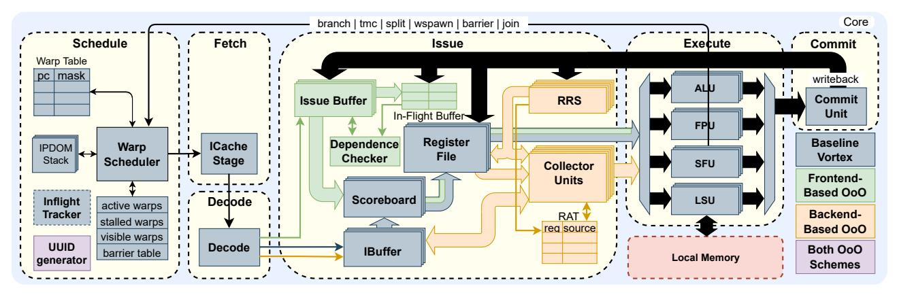
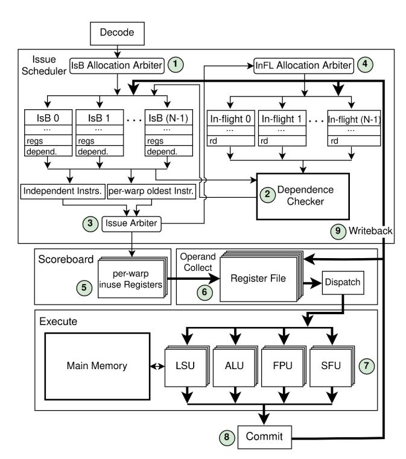
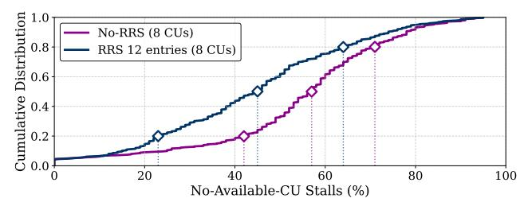
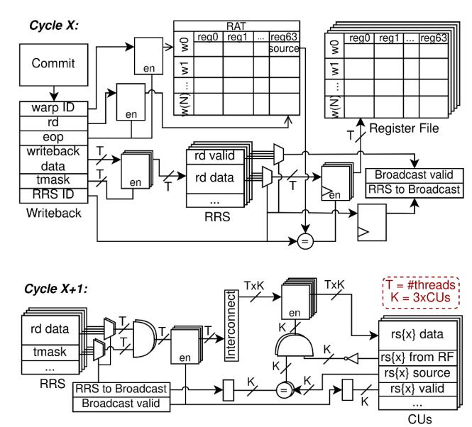
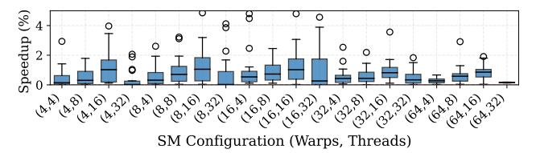
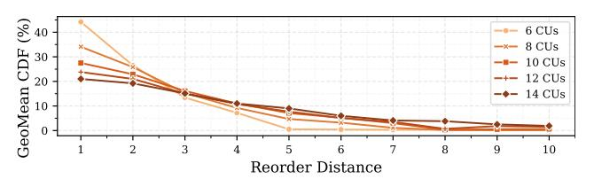
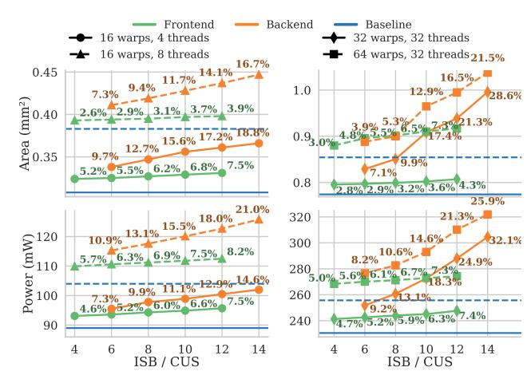
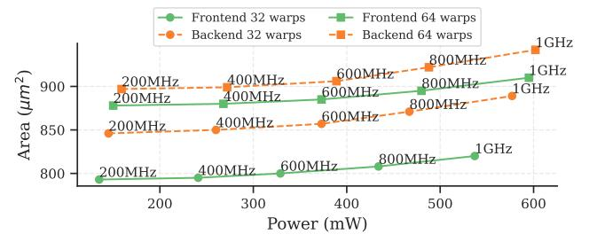
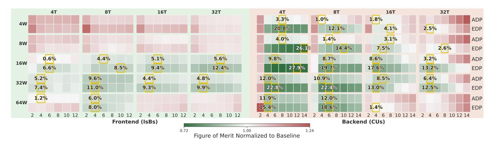
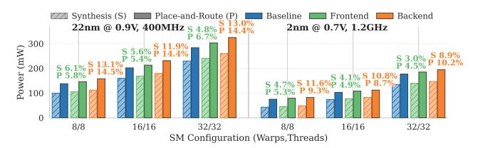

# sCROOGe: Circuit-level Design and Optimization Framework for RISC-V Out-of-Order GPUs

Maria Zerva\* , Panagiotis-Eleftherios Eleftherakis\* , Alexis Maras\* , Konstantinos Iliakis, Alexandros Moiras and Sotirios Xydis *National Technical University of Athens* Athens, Greece {mzerva, pelef, amaras, kiliakis, moiralex, sxydis}@microlab.ntua.gr

*Abstract*—Graphics Processing Units (GPUs) have evolved into the dominant hardware accelerators for general-purpose computing, yet many workloads underutilize the available resources due to inadequate Thread-Level Parallelism (TLP). To address this, techniques leveraging Instruction-Level Parallelism (ILP), such as dynamic instruction reordering, have been proposed. However, existing solutions rely on software simulators lacking RTL validation and abstracting away critical micro-architectural details, limiting accuracy in performance, power, and area modeling. In this work, we present the first synthesizable RTL assessment and optimization framework of both frontend- and backend-based Out-of-Order (OoO) execution schemes within the open-source RISC-V Vortex GPGPU framework. Both schemes are directly implemented in RTL by extending the pipeline with light-weight scheduling logic and register renaming. Our approach manages to capture critical micro-architectural details absent from prior simulation-only studies and reveals key insights into the performance scalability and implementation cost of OoO execution paths in GPUs. We leverage this flexibility to explore different reordering configurations, isolate the impact of key components, and optimize hardware structures for balanced performance, power, area and timing. We evaluate their performance across diverse workloads, and perform design space exploration by tuning parameters such as warp and thread counts. Furthermore, we quantify the power and area trade-offs via ASIC synthesis flow, demonstrating a 14.4% performance gain compared to iso-area in-order GPU cores and 27.9% improved *Energy-Delay Product (EDP)*. This work demonstrates the practical applicability of light-weight OoO schemes for enhanced GPU throughput and energy efficiency, establishing a foundation for future ILP-aware designs validated through real hardware modeling.

*Index Terms*—GPU, GPU Micro-architecture, Out-of-Order Execution, Register Transfer Level, Logic Synthesis, RISC-V

# I. INTRODUCTION

In the advent of Artificial Intelligence (AI), High-Performance Computing (HPC), and Big Data, Graphics Processing Units (GPUs) have become the dominant hardware accelerator, serving a multitude of computing domains. Initially destined to accelerate graphics rendering and gaming applications, their massive parallelism, efficient execution, and concomitant power efficiency have steered them into the acceleration of general-purpose workloads.

The above merits arise from a stall-hiding mechanism inherent to the GPU that utilizes context-switching in the presence of Thread-Level-Parallelism (TLP), overlaying the execution of active threads with stalled ones. While this model aligns naturally with highly parallel graphics tasks, its integration to general-purpose computing has limitations, as many workloads exhibit insufficient TLP, resulting in frequent stalls and underutilization of resources, hence sub-optimal performance [28], [49]. While intuitive, increasing the number of concurrent warps is shown to introduce contention in the GPU cache hierarchy, leading to performance deterioration [38], [40], [49], [78]. Techniques opting to alter instruction scheduling [3], [16], [33], [46], [53], [67], [69], [77], or introduce warp size manipulations [19], [44], [52] suffer from high complexity and are bounded by the in-order instruction sequence. Notably, the most modern GPU architectures (NVIDIA Blackwell [25], Ampere [63] and Volta [62]) can schedule only one warp instruction [17] per processing block (sub-core) per cycle, while higher per-warp concurrency arises from in-flight instructions.

To advance beyond the already fully exploited TLP, several Out-of-Order (OoO) approaches have been introduced [13], [21], [24], [28], [41], [51], [76], to harness the underutilized Instruction-Level Parallelism (ILP). Some require compiler support [21], [51], or switch between in-order and OoO modes [21], [41], inducing hardware overheads to save the processor state. Among them, LOOG [27], [28] stands out as the state-of-the-art (SoTA) GPU backend-based reordering scheme -taking place in the Operand Collect (OC) stage of the pipeline- using register renaming, while GhOST [13] and SIMIL [24] are the most prevalent light-weight frontend-based OoO mechanisms -implemented in the Issue Stage.

However, all prior designs have been evaluated in simulation-based environments [8], [39] which, despite their drastic improvements, still exhibit substantial performance inaccuracies, as they rely on high-level, empirical microarchitectural models. AccelWattch [35], the SoTA power modeling framework for GPUs, exhibits similar inefficiencies due to its extrapolation over outdated McPAT [48] models. Moreover, prior works neither account for nor optimize delicate but critical circuit-level effects (e.g. frequency degradation, pipeline timing variability) introduced by OoO microarchitectural structures, which only emerge through postsynthesis analysis. Currently, such circuit-level evaluation capabilities are available only for in-order GPU designs through RTL frameworks such as MIAOW [9] and Vortex [71], leaving the circuit-level implications of OoO execution unexplored.

\*These authors contributed equally and share first authorship.

Fig. 1: Simulated vs Hardware-measured cycles per-kernel on the Rodinia-3.1 and Deepbench benchmark suites.

To address these limitations, we introduce sCROOGe, a circuit-level micro-architectural platform for the assessment and optimization of OoO GPGPUs, that supports design customization, exploration, and high-fidelity evaluation of both frontend and backend OoO execution schemes. In contrast to SoTA simulator-based approaches that rely on high-level approximations, sCROOGe enables cycle- and timing-accurate performance modeling, along with precise area, power, and frequency assessments derived by the ASIC flow (Table I). Moreover, we resolve key implementation ambiguities often overlooked in prior high-level proposals, such as the instruction sequencing mechanism, that is necessary across all aforementioned OoO schemes and not modeled to date. We further enable accurate modeling of overheads when scaling interconnected hardware modules, thereby bridging the gap between simulation and hardware-realistic implementations. Additionally, we introduce several design optimisations, namely: i) light-weight unique instruction identifiers (UUIDs) for efficient instruction tracking, ii) the right-sizing of the newly implemented RRS, iii) an optimized routing scheme for the OC stage to reduce interconnection complexity, iv) advanced scheduling techniques for independent instruction dispatch in frontend OoO schemes, which allow for the removal of centralized structures such as the scoreboard and v) reassessment of hardware-costly structures such as LOOG's [28] Load-Store Queue (LSQ) under post-synthesis aware constraints.

Leveraging sCROOGe's synthesizable GPGPU model, we conduct an extended post-synthesis evaluation of backend-and frontend-based OoO execution schemes by exploring key GPU architectural parameters as well as OoO specific components. We explore how these parameters affect area, power, and frequency, enabling component right-sizing and design optimization. Our experimental evaluation reveals performance gains of up to 27.3% in general purpose workloads and up to 53% in Machine Learning (ML) applications across different micro-architectural arrangements, highlighting the sensitivity of OoO effectiveness to resource provisioning. Within backend-based designs, performance scaling of up to 5.8% is observed through CU scaling and an improvement of 12% and 27.9% in *Area-Delay Product (ADP)* and *Energy-Delay Product (EDP)* respectively across our design space. To

TABLE I: Qualitative comparison of prior art OoO GPUs.

| Technique       | OoO Mechanism      | Evaluation  |       |                    |                    |  |
|-----------------|--------------------|-------------|-------|--------------------|--------------------|--|
| 1               |                    | Performance | Clock | Power              | Area               |  |
| WarpedP [41]    | Backend            | PTXPlus     | Х     | GPUWattch          | Х                  |  |
| HAWS [21]       | Compiler, Frontend | Multi2Sim   | X     | X                  | CACTI [75]         |  |
| Turbulence [51] | ISA, Frontend      | SASS        | X     | GPUWattch          | X                  |  |
| LOOG [28]       | Backend            | PTXPlus     | X     | GPUWattch          | GPUWattch          |  |
| SOCGPU [23]     | Frontend           | SASS        | X     | AccelWattch        | Part. Synth. 14nm  |  |
| SIMIL [24]      | Frontend           | SASS        | X     | AccelWattch        | Part. Synth. 14nm  |  |
| GhOST [13]      | Frontend           | SASS        | X     | Part. Synth. 45nm  | Part. Synth. 45nm  |  |
| sCROOGe         | Frontend, Backend  | RTL         | /     | Synthesis 22, 2 nm | Synthesis 22, 2 nm |  |

enable direct comparisons with SoTA in-order GPU schemes, we perform an extensive comparative analysis against isoarea in-order Streaming Multiprocessors (SMs) enhanced with additional concurrent warps. The OoO SMs produced by sCROOGe outperform their iso-area in-order counterparts by an average of 14.4%, further validating the feasibility of adopting the examined OoO execution schemes in GPUs. We validate our synthesis-based results through post- Place-and-Route (PnR) measurements on a representative subset of our configuration space and scaling to a 2nm [18], [30] technology node, confirming the persistence of key power, area and efficiency trends.

# II. MOTIVATION Accurate assessment in terms of run-time, area, and power

is a key challenge in GPU research - especially for microarchitectural innovations like OoO execution. While several GPU OoO schemes have been proposed, their evaluation relies on software simulators [8], [10], [35], [39], [74], which overlook hardware-critical details. Despite the wide adoption of these tools, they cannot fully capture timing behavior or circuit-level trade-offs, often leading to unreliable results. Analytical alternatives report runtime gains of two orders of magnitude with a considerable accuracy penalty [22], [45]. Simulator-based performance modeling inefficiencies: To quantify the limitations of simulator-based approaches, we analyze the cycle-level accuracy of Accel-Sim [39], the current SoTA GPU performance simulator, by comparing its predictions against real hardware measurements obtained from an NVIDIA Tesla V100 GPU (Volta architecture) [62]), over the Rodinia-3.1 [14] and Deepbench [39] CUDA benchmarks. As shown in Fig. 1, Accel-Sim yields a Mean Absolute Percentage Error (MAPE) of 11.55%. For Deepbench [57] the MAPE exceeds 30%, while for a GRU-based RNN inference benchmark, the error reaches 73%. Such results indicate the absence of RTL-informed design at the abstraction level upon which Accel-Sim operates, leading to inaccurate micro-architectural modeling. Specifically, despite its cycle-level modeling, Accel-Sim merely employs abstract per-cycle component behavior description in high-level language (C++), calibrated by microbenchmarking and component-wise correlation analyses. In contrast to assessing our proposed modifications at this level of abstraction, we utilize an RTL cycle-accurate behavioral model [70] in the rest of this work.

The pitfalls of simulation on GPGPUs are exacerbated when considering more innovative micro-architectures. Past works such as GhOST [13], SIMIL [24], and LOOG [28]

introduce non-trivial modifications to the GPU pipeline, often extending or altering the critical paths of typical in-order designs. Moreover, as crucial structures increase to accommodate more aggressive instruction reordering, non-linear scaling is incurred w.r.t. interconnection complexity and intra-core data movement. Yet across literature, micro-architecture research is typically performed using such software simulators, providing crude abstractions of the above phenomena, adding to their imperfect cycle accuracy.

As a proof of concept, Table II presents a comparative analysis of SoTA OoO execution schemes, using data from their original publications [13], [24], [28], against the corresponding circuit-level implementations developed in sCROOGe. The comparison spans multiple figures of merit and is conducted under iso-resource GPU configurations (see Section VII), assuming 64 warps and 32 threads per warp. The improvement in Instructions Per Cycle (IPC) is largely overestimated by the simulation-based prior-art. Notably, the frontend OoO scheme delivers an IPC gain that falls within the margin of error. In contrast, more significant performance gains are obtained for other warp and thread configurations, explored in Section VII. Limitations of analytical area and power modeling: Stateof-the-art analytical models for GPU area and power estimation suffer from significant limitations when applied to novel micro-architectural designs. The most widely used area modeling tool for GPGPUs is a GPU-customized variant of McPAT [48], integrated into GPUWattch [47]. However, this model fundamentally extrapolates GPU area estimates from respective CPU model templates, fails to normalize for modern technology nodes [47], and results in limited accuracy. As such, it is only usable for *relative comparisons within fixed architectures, rather than for evaluating new microarchitectural innovations*, where the pipeline structure can deviate significantly from conventional baselines. Regarding power modeling, the leading tool is AccelWattch [35], whose SASS-based simulation mode supports exploratory studies but remains limited in accurately capturing fine-grained architectural optimizations. In contrast to the aforementioned techniques, evaluation of sCROOGe schemes regarding power and area is performed via gate-level synthesis and postsynthesis simulation. Performance is obtained using the SoTA RTL framework [70], having verified that no timing constraint violations are induced by the schemes' pipeline modifications.

To quantify these discrepancies, we provide area and power overheads as well in Table II. While the values presented in Table II seem unfavorable for OoO execution schemes, Section VII shows encouraging results for alternative configurations. Focusing on the SM configuration that most closely resembles the prior-art baseline, the area overhead for LOOG and the area and power overheads for GhOST that were considered insignificant emerge as significant when measured through ASIC-grade post-synthesis metric evaluations. In the case of area, discrepancies can be attributed to the synthesisagnostic evaluation methodology, that does not capture the intricate behavior of critical OoO-specific components. In the case of power, partial synthesis of added components and

|                      | Simulation                |                         |                           | RTL                       |                         |  |
|----------------------|---------------------------|-------------------------|---------------------------|---------------------------|-------------------------|--|
| Metric               | LOOG                      | GhOST                   | SIMIL                     | Backend                   | Frontend                |  |
| Area Power IPC | 1.28% 10.05% 23.00% | 0.01% 0.67% 6.90% | 4.28% 14.21% 31.00% | 21.50% 25.90% 4.18% | 6.50% 6.70% 0.86% |  |

TABLE II: Overhead/Gain Comparison of sCROOGe vs SoTA OoO schemes reported results (64 warps, 32 threads).

technology node normalization is employed, failing to account for realistic interfacing and sizing of those components. For SIMIL, while the area and power align closely with RTL, the performance gain observed through RTL modeling diverges substantially from simulation across our evaluated designs. Notably, RTL implementation leads to new insights, such as the examination of critical timing paths of pipeline stages presented in Section VII-C, and the area and power measurement of specific components. For instance, the overhead of scaling the Collector Units (CUs) from 32 to 48 in the simulator-driven analysis [28] is a mere 2.57% for area and < 1% for power, while our measurements indicate 10.3% area and 10.4% power overhead when scaling the CUs from 8 to 12.

sCROOGe incentives: The aforementioned timing, area, and power limitations inherent in GPU simulation frameworks have prompted the development of sCROOGe, a circuit-level micro-architectural assessment and optimization framework that supports RTL-based modeling of advanced GPU microarchitectures, emphasizing in emerging OoO GPU execution schemes. sCROOGe leverages both post-synthesis and full physical ASIC design flows ensuring realistic assessments w.r.t. the inaccuracies of simulation-only studies. For instance, regarding power measurements, the transition to RTL enables more accurate assessment of novel GPU architectures through a precise view of circuit switching activation factors, measured on designs under realistic synthesis conditions. Additionally, FPGA emulation of the RTL design provides substantial runtime gains (hundreds of MHz) compared to Accel-Sim [39] (a few KHz). sCROOGe builds upon the highly configurable Vortex GPGPU framework (e.g. adjustable number and configuration of SMs, cache hierarchy and sizes, number of Functional Units, etc.). This allows for broad Design Space Exploration (DSE), like that achieved through the SoTA cycleaccurate GPU simulators [39]. As already demonstrated in the field of CPUs, modern RTL frameworks like Chipyard [2] and BOOM-Explorer [7], [36] enable deeper, more efficient DSE with parametrized RTL than software simulators.

# III. RELATED WORK

Prior efforts have explored alternative GPU execution models aimed at improving latency hiding by harnessing ILP and employing instruction reordering. Some have even explored OoO execution beyond performance optimization to reduce power consumption [1]. These approaches can be broadly categorized into compiler-assisted [21], [41] and pure-hardware techniques [13], [23], [24], [28]. Another axis of categorization regards register renaming [28], [41] or lack thereof [13], [21],

Fig. 2: Baseline and modified Vortex pipeline. The blue components refer to the baseline, the green to the frontend-based and the orange to the backend-based sCROOGe scheme. Purple components are common between the two OoO schemes.

[23], [24] for the elimination of output- and anti-dependencies. Extending this categorization, instruction reordering can take place in the OC stage [28], [41] or the Issue stage [13], [21], [23], [24], [51] of the pipeline, rendering the corresponding scheme backend-based or frontend-based respectively. While our work shares foundational motivations with these approaches, it distinguishes itself through a comprehensive circuit-level implementation of both frontend and backend instruction reordering, enabling more insightful post-synthesis evaluation of design trade-offs. Warped-P [41] introduces a pseudo-speculative execution mode allowing warps to issue independent instructions during stalls. However, it restricts reordering to speculative paths, lacking true OoO support, while its evaluation is limited only to simulation. Our work extends beyond this scope by enabling full hardware-managed OoO execution with RTL implementation and ASIC-level synthesis. HAWS [21] uses compiler-inserted hints to guide instruction issue during stalls, relying on static dependence resolution. Though hardware-light, it remains compiler-dependent and simulation-only. Turbulence [51] modifies the ISA to support OoO execution via hybrid distance-based operand encoding, avoiding renaming by referencing operands positionally. It reduces false dependencies but requires compiler/toolchain changes and is not validated in hardware. Relative to this landscape, our work positions itself as an ISA-agnostic, purely micro-architectural enhancement. LOOG, GhOST, and SIMIL [13], [24], [28] are the most architecturally aligned with our approach. LOOG uses operand collector units and register renaming to implement instruction reordering in the backend, while GhOST and SIMIL apply dependence-aware scheduling in the frontend using a dependence checker and queue.

Across proposed OoO designs, including Warped-P, HAWS, SIMIL, SOCGPU, Turbulence, LOOG, and GhOST, a common pursuit is the exploitation of ILP to enhance performance across general-purpose workloads. However, these efforts often rely on ISA modifications and compiler hints and are evaluated on simulators that utilize abstracted models. Our work is the first to realize both frontend and backend reordering in syn-

thesizable RTL, providing insights into Performance, Power, and Area (PPA) implications, rendering it as a concrete and scalable path toward practical, ILP-aware GPU architectures.

Several efforts have been made towards more accurate prototyping and modeling of CPU and GPU micro-architectures. Akin to Vortex, MIAOW [9] provides a synthesizable Verilog GPGPU that targets a subset of AMD's Southern Islands ISA. While MIAOW represents an important step in GPGPU research tooling, it adopts a hybrid RTL/behavioral modeling approach, omitting certain components like memory controllers and caches to simplify design and improve flexibility. In contrast, Vortex is implemented entirely in synthesizable Verilog, featuring a modular and parameterizable architecture, memory hierarchy components and network-on-chip (NoC) elements. Building upon this foundation, Vortex [71] laid the groundwork for open-source RISC-V GPU research with support for hardware texture units and the OpenGL API. Skybox [72] extends Vortex by adding hardware rasterization and render output units, significantly broadening the pipeline coverage. Complementing these efforts, SoftGPU [34] represents a fully synthesizable, OpenCL-programmable soft GPGPU overlay for FPGAs, prioritizing area efficiency and portability while demonstrating competitive compute density and energy efficiency in comparison to both HLS-generated accelerators and traditional soft-core MPSoCs. VeriGPU [65] and Nyuzi [12] present fully open-source GPU architectures, the first focusing on ML workloads, emphasizing compatibility with modern frameworks like PyTorch, and the second accelerating graphics and general-purpose applications.

#### IV. VORTEX GPGPU

Vortex [71] is a soft GPGPU built upon the RISC-V ISA, supporting general-purpose and graphics workloads using the SIMT model [15]. Introducing minimal ISA extensions to enable thread control, divergence management, synchronization, and texture-sampling, the Vortex infrastructure implements a complete GPU stack on FPGAs, enabling full-system optimization across application, compiler, and hardware layers.

From an architectural point of view, Vortex features a hierarchical memory organization with multi-banked caches using virtual multi-porting and miss-status holding registers (MSHRs) to support concurrent memory accesses. The baseline Vortex GPU features a six-stage pipeline, as shown in Fig. 2. It starts with the Schedule stage, where a warp scheduler selects the next program counter and manages active and stalled warps. Divergence is handled using an IPDOM stack to track split/join points, while an in-flight tracker monitors all active instructions. In the Fetch stage, instructions are retrieved while handling instruction cache requests and responses to maintain throughput. The Decode stage translates instructions into operations, with control instructions updating the warp scheduler to enable fast adaptation to control flow changes and thread divergence. In the Issue stage, decoded instructions are queued per warp within an Instruction Buffer (IBuffer). A scoreboard tracks register dependencies, while an Operand Collector retrieves required operands from the Register File (RF). In the Execute stage, specialized units perform the respective operations, and the Commit stage writes results to the RF and updates the scoreboard. Vortex adopts a hierarchical clustering model: cores are grouped into sockets sharing an L1 cache, and multiple sockets share an L2 cache.

#### V. SCROOGE MICRO-ARCHITECTURAL DESIGN

# *A. UUID Generation Unit*

To correctly handle OoO execution in both sCROOGe architectures, we need to keep track of the original program order of instructions. To facilitate this, we implemented a unit responsible for generating an ascending per-warp Universal Unique Identification (UUID) number for each scheduled instruction. Once generated, it is embedded within each instruction's data until arrival at the Commit stage, enabling safe OoO execution without the overhead of a fully associative reorder buffer.

Although the availability of an infinite, or substantially large, pool of UUIDs would be ideal, it would incur unnecessary area overhead. To address this, we combine the UUID bits with the warp id and reuse UUIDs circularly by employing a modified definition of the "less than (<)" operator. More in detail, a UUID with its Most Significant Bits (MSBs) set to '00' is considered after a UUID with MSBs set to '11'. This adjustment allows us, if the UUID bit-width is N, to obtain a margin of 2 N − 2 instructions that can be safely processed before a serialization error arises. Should this be exceeded, an out-of-bounds flag is set, prompting a pipeline stall. The mechanism to detect such exceptions is depicted in Fig. 3. These occur under the transition of the MSBs from 11 to 00 and 00 to 01, if instructions co-exist in the affected pipeline stage such that their UUIDs belong to a different iteration.

# *B. Frontend-based sCROOGe execution scheme*

In this section, the frontend-based sCROOGe execution scheme is presented, highlighting the extensions and design disparities between the GhoST [13] and SIMIL [24] implementations and our sCROOGe RTL design.

Fig. 3: Out-of-bounds UUID checking mechanism for MSB transitions of 11 to 00 and 00 to 01.

Fig. 4: Dependence Checker of frontend-based sCROOGe.

Issue Buffer. In GhOST [13], an arbiter issues in-order instructions from the IBuffer to the Issue Buffer (IsB). In sCROOGe, the IBuffer supplied by the Decode stage was omitted, since the throughput of the Fetch and Decode stages is one instruction per cycle. Moreover, GhOST's control flag responsible for synchronization management is not required, as the scheduling of instructions under synchronization is handled in the Schedule stage, as described in Section IV.

In-Flight Instruction Buffer. To correctly track dependencies to account for data hazards, we need to store the destination register of executing instructions that have passed the IsB substage in a buffer up until their writeback. This is referred to as the In-Flight buffer (InFL). Each entry comprises two fields, an allocation bit and the respective instruction's destination register, which effectively contains the warp ID.

Dependence Checker. This component (Fig. 4) identifies data dependencies of IsB instructions by comparing source (rs) and destination register (rd) fields in both the InFl and IsB and assigns a dependence bit-vector in the target IsB entry. Read-After-Write (RAW) hazards are detected by comparing the three rs fields of the IsB entry with all rd registers in InFl and IsB, and for the Write-After-Write (WAW) it compares the selected rd with other rds. Write-After-Read (WAR) hazards are found by comparing the selected rd with rs registers in the IsB only, since beyond the Issue stage execution is in-order, making rs–to–rd checks in InFl unnecessary.

Issue Arbiter. This circuit selects an entry from the "independent instructions" pool to pass on to the Scoreboard stage and update the InFl allocation arbiter. If there are no independent instructions, it selects one from the "per-warp oldest" set, emerged from UUID comparisons. For both sets, the policy is to trivially select the instruction with the lowest IsB ID.

The instruction flow of the sCROOGe frontend scheme is illustrated in Fig. 5. A newly decoded instruction is placed in the IsB by the IsB allocation arbiter 1 . For this operation, at least one IsB entry needs to be vacant, and the UUID bounds conditions need to be satisfied as displayed in Fig. 3; otherwise, the instruction remains in the supplying register. In the following cycle, the Dependence Checker 2 operates on the instruction and accordingly updates the respective IsB entry. The "independent" and "per-warp oldest" bit-vectors are produced by sequential circuits whose inputs are the dependence vectors and the UUIDs of the allocated IsB entries. This circuit also deems non-independent all memory instructions that are not the oldest available. Subsequently, the Issue arbiter 3 operates, provided that a free InFl entry exists or the instruction does not require a writeback. The dependence bit for all IsB entries indexed by the newly issued instruction's IsB ID is unset, since IsB hazards no longer apply. The corresponding bit in the InFl section is updated according to hazards with the introduced In-Flight instruction. As of the WAR hazards from a newly issued instruction, they are removed, as they cannot arise for In-Flight instructions. In the next cycle, the InFl entry selected by the InFl allocation arbiter 4 is allocated, and the IsB entry selected by the Issue arbiter is vacated. Regarding pipeline stages 5 - 8 , their functionality is the same as in the baseline model, save for the InFl entry ID field that is carried through up to the Writeback stage. The latter 9 takes place by updating the rd value in the RF. Since the results of threads within the same warp can arrive asynchronously, writeback 8 completion is signaled by the end-of-packet (eop) bit, also flushing the appropriate InFl buffer entry, and unsetting the respective dependence bits.

# *C. Backend-based sCROOGe execution scheme*

Similarly to Section V-B, we outline the micro-architectural details of the backend-based sCROOGe micro-architecture. Collector Units. Traditional GPU architectures use CUs to hold instruction data until source registers are read from the RF [50]. In LOOG [28], instruction reordering occurs in the Operand Collect (OC) stage, where CUs act as Reservation Stations (RSs). In sCROOGe, a configurable number of CUs enables exploration of reordering at varying depths. CUs track instruction metadata (PC, warp ID, active threads, etc.) from Issue to Dispatch, after which relevant fields are maintained by the RRS. They store flags regarding allocation status, operand retrieval from the RF or from a result broadcast, and operand readiness. Register data and immediate values needed in later pipeline stages are also preserved by the CU.

Register Alias Table. Rather than using a scoreboard to monitor RAW dependencies, sCROOGe employs a Register Alias Table (RAT). This also eliminates WAR and WAW hazards through register renaming, replacing the register name with the corresponding RRS ID. Each RAT entry is composed of two components: a bit indicating whether the register's data needs to be sourced from the RF and an RRS ID field.

Fig. 5: Frontend-based sCROOGe instruction flow.

Register Renaming Stack. In the initial iteration of LOOG [28], CUs serve as RSs of the Tomasulo algorithm, keeping instructions' data up to writeback for result broadcast monitoring. This prolonged allocation significantly increases stalls due to limited CUs; however, scaling their availability would incur large area overheads. To remedy this, the RRS serves as a light-weight mechanism to provide identifiers stored in the RAT in place of CU IDs, allowing CUs to be released immediately after Dispatch. A CU is substantially larger than an RRS entry; for a configuration with a 32 warps, 32 threads and 12 CUs, a CU requires over four times the number of bits with an area overhead of approximately 21.382µm2 or 2.28% of the total design area (0.9387mm2 as shown in Section VII), with the respective overhead for an RRS entry being only 0.873µm2 , or 0.09%. Fig. 6 illustrates the impact of the RRS on CU availability by showing the Cumulative Distribution Function (CDF) of stalls attributed to unavailable CUs across workloads and SM configurations. Compared to sCROOGe with no RRS, the RRS-enhanced one significantly reduces the occurrence of such stalls. Notably, for 80% of applications across configurations, the percentage of no-available-CU stalls is higher than 42% when no RRS is utilized, and higher than only 23% with an RRS of size 12.

The instruction flow of the backend-based sCROOGe is outlined in Fig. 7. The Scoreboard stage is eliminated due to the relocation of data dependence tracking to the OC. When an instruction transitions to the OC, the allocation arbiter 1 validates three conditions: the presence of an empty CU, UUID

Fig. 6: CDF of No-Available-CU stalls for backend sCROOGe.

Fig. 7: Backend-based sCROOGe instruction flow.

bounds compliance, and sufficient writeback resources (either a free RRS entry or no writeback required). If satisfied, an unoccupied CU and - if necessitated by a writeback operation - an RRS entry are allocated, with the RRS ID being stored in the CU. In the next clock cycle, the recently allocated CU consults the RAT 2. It copies the renamed source registers into their respective fields, determining whether the data should be accessed from the RF or obtained via broadcast. If the instruction requires a writeback, the CU writes its RRS ID in the respective RAT rd field. Thus, subsequent instructions with a RAW dependence upon it will stall until its result is broadcast. Next, the CU collects the appropriate rs values. Should any operands require direct retrieval from the RF 3, a reading status is assigned to the CU. To decide which CU is granted RF access, three arbiters were tested: lowest CU ID first, Round-Robin (RR), RR for RF access and CU allocation. The best in terms of performance and logic

Fig. 8: Writeback and Broadcast stages of backend-based sCROOGe Pipeline.

complexity was found to be the first one. The chosen CU will proceed to fetch its operands sequentially (one per cycle). Once the data is acquired and each operand is valid, the CU is flagged as ready 4. From this pool of ready CUs, one is selected each cycle to be promoted to the Execution 6 stage by the Dispatch arbiter 5. When an instruction passes the Commit **7** stage, it may need to write back the result, which is routed to the OC stage, where the CUs and RF are located. Until writeback completion, the incoming data are temporarily stored in a dedicated field within the RRS entry. Once the eop signal is detected, the corresponding entry in the RAT is reevaluated. If the instruction's RRS ID matches this field, it transfers the result to the RF and updates the RAT; otherwise, this task falls to another RRS entry with the same rd. The write operation to the RF **9** occurs in the following cycle, alongside the update of all CUs' data that depend on the broadcast result. Subsequently, the RRS entry is ready for deallocation. For the instructions in the OC to ascertain the correct RRS entry to retrieve broadcast data from, each CU retains the ID of the RRS entry on which it is contingent.

Memory Operation Reordering. Prior art in OoO GPUs [28] explored the reordering of memory instructions in the Load-Store Queue (LSQ). To ensure program correctness when dispatching two warp memory instructions OoO, every address of the first should be compared to all addresses of the second, causing the probability of a conflict to scale proportionally to the square of the warp size and increase with the SM warp count. Fig. 9 shows the maximum attainable speedup by memory reordering, which is proven negligible across all configurations, limited to less than 1.1% on average. To estimate the upper bound on cycles saved through memory

Fig. 9: Memory reordering speedup ceiling.

reordering, we construct a per-warp Directed Acyclic Graph (DAG), that represents the true register dependencies among warp instructions as described in Section VII-B. We analyze deviations in the longest dependence chain accounting for gain in cycles by reordering memory operations when possible.

To assess the viability of such a mechanism, we implement it within the backend-based sCROOGe. In prior simulatorbased studies [28], address dependency-aware dispatching happens within one cycle, necessitating the use of LSQ  $size^2 \times$  $T^2$  4-byte address comparators per SM. Adopting an RTLaware standpoint enables exploration of the trade-off between the mechanism's logic complexity and added latency. From instructions in the LSQ -where memory operations reside instead of CUs- that are marked as ready 4, one can be selected each cycle. By storing its target addresses in an intermediate register, we detect conflicts with all other LSQ entries before updating a dependence bitmap. This introduces a one-cycle pipeline penalty for dispatching memory operations, but reduces the required comparators to  $LSQ\_size \times T^2$ . We measure the area and power overhead of this more light-weight mechanism on the {4,16} design point -which exhibits the highest speedup ceiling of 1.1%- configured with four LSQ entries and four CUs. The area and power overheads are found to be 8.7% and 9.3%. Given the limited speedup potential and the prohibitive LSQ overhead, this component is excluded from the backend-based sCROOGe implementation.

# VI. INTERCONNECTION AND SCHEDULING OPTIMIZATIONS

### Broadcast pipelining for reduced interconnection pressure.

As demonstrated in [13], [28], core components of OoO schemes often require scaling to provide speedup, introducing significant area and power overheads. One such overhead arises in the backend sCROOGe scheme's broadcasting, where each CU may need to receive data for any rs from any RRS entry. For R RRS entries, N CUs and T threads per warp, this results in  $3 \times N \times R \times T \times datasize$  interconnections, which is impractical for large N and R values. To mitigate this, we introduce an intermediate result register between the broadcasting RRS and the recipients, as shown in Fig. 8. Since one writeback occurs per cycle, a single register suffices, reducing connections to  $4 \times N \times T \times datasize$  and easing congestion without adding latency. The added cycle is hidden within the two stages already required for writeback; the rise of the rd valid flag and a potential RF write. Designs with 12 CUs or more are further optimized with two buffers containing the same broadcast value, each connecting to a distinct subset of CUs. While the overall interconnection count increases, the load is better balanced and the timing paths are shortened.

Frontend-based OoO Optimization. This is driven by the observation that in the frontend sCROOGe scheme, instructions selected from the "per-warp oldest" buffer tend to advance to the scoreboard and stall the pipeline due to unresolved dependencies while newly issued independent instructions are available. To resolve this, we opt to supply the Issue arbiter seen in Fig. 5 only with independent instructions, boosting performance by an additional 2% gain, while allowing the removal of the "per-warp oldest" buffer, the SRAM array corresponding to the scoreboard and their concomitant logic.

Evidently, in previous simulator-based studies, such design decisions were not taken into account, showcasing the increased level of detail and intricacies that are addressed when transitioning to RTL modeling of the OoO execution schemes.

### VII. EVALUATION

#### A. Experimental Setup

sCROOGe supports a configurable number of concurrent warps and threads per warp. As this analysis aims to evaluate the efficiency and feasibility of OoO execution schemes, the examined designs are configured with representative sizes of these parameters commonly found in modern GPUs. Across NVIDIA architectures, the maximum number of concurrent warps is 32, 48, or 64, with threads per warp fixed to 32 [61]. Embedded GPUs, on the other end, typically employ narrower SIMD widths, and less maximum concurrent warps [32]. To account for the wide variability in the industry [4]–[6], [11], [29], [31], [54]–[56], [58]–[60], [64], [66], sCROOGe covers a broad space including configurations as little as {warps=4, threads-per-warp=4}, to as large as {64,32}.

Our PPA evaluation focuses on a single Vortex SM comprising one processing block and a 16 KB L1 cache, as depicted in Fig. 2. For DRAM modeling, Vortex and sCROOGe are integrated with Ramulator [42]. Since the modifications are confined within the SM, their assessment extends to the whole GPU. sCROOGe adopts the Vortex software stack, which uses POCL for OpenCL frontend compilation and LLVM for application binaries. We evaluate sCROOGe across 22 diverse benchmarks (shown in Fig. 10) from the Vortex framework.

To evaluate area, power, and throughput, both schemes were implemented in SystemVerilog HDL. The designs were synthesized using Synopsys Design Compiler, targeting a GlobalFoundries' 22nm FDSOI technology node under typical operating conditions (TT corner, 0.9 V, 25°C). Register File, local memories, and cache modules were instantiated using SRAM macros generated by the GlobalFoundries Memory Compiler, enabling realistic memory behavior and physical layout. Functionality was verified via extensive gate-level simulations, while power was estimated by analyzing postsynthesis VCD switching activity with Synopsys PrimeTime.

# B. ILP Analysis

Regarding the Vortex workloads' exploitable ILP, a detailed analysis on instruction traces drawn from kernels is performed.

Fig. 10: Average ILP across applications.

Fig. 11: Reorder distance percentages of backend sCROOGe across CU counts, with 12 RRS entries.

The dynamic instruction stream is split into basic blocks by memory fences and control instructions, respecting true data dependencies, as well as dependencies through memory within each block. The average ILP is calculated as the fraction of the total number of instructions for warp 0 (since uniform behavior was seen across warps), divided by the longest chain of dependent instructions within the workload. Fig. 10 shows variation in the average ILP across workloads (2.02-2.92).

The backend sCROOGe scheme issues instructions in-order, so in stall-free scenarios the instruction stream minimally deviates from the baseline. However, when individual instructions start stalling, backend sCROOGe dynamically reorders ready-to-execute operations ahead of earlier issued stalled ones. Fig. 11 displays the percentage of instructions that dispatched OoO per each reorder distance. Most of them overtake only one instruction ahead, while less than 10% overtake four or more instructions, regardless of the CU size. Moreover, larger CU configurations enable deeper reordering and therefore have better potential in exploiting ILP, coinciding also with their performance improvement seen in Fig. 14.

TABLE III: Pipeline stage delays (psec) for the baseline and both sCROOGe schemes, synthesized at 1GHz frequency.

|          | Schedule | Issue | $Commit \rightarrow Issue$ | Execute |
|----------|----------|-------|----------------------------|---------|
| Baseline | 634      | 295   | 353                        | 993     |
| Frontend | 634      | 600   | 390                        | 993     |
| Backend  | 634      | 901   | 466                        | 993     |

# C. Timing-aware Performance Evaluation

To assess the timing impact of hardware additions required by the sCROOGe schemes, we synthesize the aforementioned micro-architectural configurations at 22nm technology at their maximum achievable frequency of 1GHz. Table III provides the critical path delays of sCROOGe's dominant pipeline stages. Evidently, the Execution stage delivers the global critical path delay. As expected, this delay remains stable across

Fig. 12: Baseline Vortex IPC per SM configuration.

Fig. 13: Absolute cycles of the baseline and both sCROOGe schemes for each application in the (32,4) configuration.

examined micro-architectures since none of sCROOGe OoO schemes modify it. Issue stage modifications are significant for both sCROOGe schemes, especially for the backend-based one, as it approaches (without surpassing) the timing of the global critical path of Execution stage. Notably, the long result bus connecting the Commit and Issue stages does not alter the critical paths as significantly, since it has been optimized to connect only to the CUs and not directly to the RF.

Since both the baseline and the examined sCROOGe schemes can be clocked with the same maximum frequency, it is safe to comparatively evaluate performance through the IPC rate. Fig. 12 demonstrates the performance scaling of the baseline for different warp and thread counts. Evidently, performance shows weak sensitivity to warp count, while near-linear scaling is demonstrated with increasing threads. Therefore, thread-level scaling yields higher IPC due to its inherent correlation with throughput; however, most workloads saturate their performance at four concurrent warps. Regarding the distribution of IPC across benchmarks, high diversity is observed in terms of performance as the number of threads scales -directly correlating to the diverse amount of TLP exhibited across workloads. For instance, for an SM of 32 warps, performance scales near linearly for the average benchmark while saturation is observed at 32 threads for the maximum.

Fig. 13 illustrates the execution cycles in the baseline and both sCROOGe schemes for all of the 22 individual apps under examination. As observed, notable speedups are obtained for most of the applications (27.3%) and 6.7% for the backend-and frontend- based scheme respectively).

Fig. 14 depicts the performance gains obtained by both sCROOGe schemes across warp-thread configurations and differently sized critical components, i.e., the number of IsB entries for the frontend scheme and the CUs count for the backend. The backend implementation always outperforms

Fig. 14: Speedup w.r.t. baseline for differently scaled frontend- and backend-based sCROOGe configurations.

Fig. 15: Total IPC comparison between 1, 2, and 4 SMs configured for 16 warps and 32 threads per warp.

the frontend one, which is expected given its more complex and potent reordering mechanism outlined in Section V-C. Evidently, speedup for the backend-based scheme decreases as the number of threads increases, while mixed behavior is seen for the frontend-based scheme regarding this parameter. Moreover, no specific trend can be seen with respect to varying warp capacities, supporting the claim that workloads exhibiting both sufficient and insufficient TLP benefit from execution on the implemented OoO mechanisms. Notably, minor speedups can be observed for the frontend scheme in most configurations and even slowdowns for the smallest ones. These slowdowns are attributed to the introduction of extra pipeline stages, which, in certain cases, outweigh the performance benefits gained through instruction reordering.

Finally, Fig. 15 shows the performance scaling behavior of sCROOGe when extending the design beyond a single SM, scaling accordingly the workload of each examined benchmark (weak scaling analysis). Both the frontend- and backend-based OoO schemes retain their relative performance advantage over the in-order baseline as the number of SMs increases, demonstrating that the architectural benefits of sCROOGe persist under multi-SM configurations. The marginal reduction in speedup observed at higher SM counts is attributed to increased contention in shared resources, particularly at the global memory interface. The observed scalability of the evaluated workloads across multiple SMs, demonstrates that the proposed OoO mechanisms effectively harness intra- and inter-warp ILP even under elevated TLP conditions.

New performance counters were added in the Vortex pipeline to collect stall information about the baseline and both sCROOGe schemes. The stalls are counted in the scheduler (sched) when the Fetch stage is empty and the scheduler has no warp instruction to forward, in the execution units (exu) when structural hazards occur, in the OC stage where RF reads are

Fig. 16: Stalls breakdown of the baseline (left), frontend OoO (middle) and backend OoO (right), w.r.t. the baseline cycles (16 warps, 32 threads per warp).

serialized, and finally in the corresponding unit for handling data dependencies according to the scheme under examination. The last two categories are denoted as dependence (dpnd) stalls. One or more stall types can occur in each cycle. In Fig. 16, these stall types are presented as percentages of the total baseline execution. The total stalls correlate with the schemes' performance gains across applications (-11.8% and -14.8% on average for the frontend and backend schemes). Interestingly, scheduler stalls are minimized in both OoO schemes (-51% and -61% respectively) and dependence-exclusive stalls are diminished in the backend OoO scheme. Despite introducing additional potential sources of stalls, the scheme effectively mitigates them through efficient reordering of instructions and a significant reduction of RF accesses.

We extend our set of workloads to cover critical ML applications that span representative fields of the AI ecosystem, such as Convolutional Neural Networks (CNNs) and Large Language Models. Fig. 17 depicts the performance improvement of the frontend OoO with 12 IsBs and backend OoO with 14 CUs relative to baseline across four such applications. *llama2-Gemm* corresponds to a full tensor operation from llama2-48M [73] performed as fused multiply-add operations (FP32 FMADD) in the FPU. *CNN-Layer* corresponds to a convolutional layer from AlexNet [43]. Focusing on the class of embedded GPUs, as outlined in Sections VII-A and VII-F, we further assess a *SqueezeLayer* from SqueezeNet's Fire module, which uses 1×1 convolutions to feed expand [26].

Fig. 17: Speedup on ML workloads of OoO schemes across SM configurations (top: frontend, bottom: backend).

Fig. 18: Performance and load latency of the OoO schemes w.r.t. to L1 and L2 sizes (16 warps, 32 threads per warp).

Both layers are drawn from the Tango Suite [37]. *llama-260k* refers to the end-to-end execution of a 260k parameter model [20] of the llama architecture [73]. Notably, *llama2-Gemm* benefits significantly from both schemes and across the same configurations. In contrast, *CNN-Layer* benefits from the backend-based scheme, which leverages register renaming, but shows minimal improvement on the frontend-based scheme. The *Squeeze-Layer* and *llama-260k* demonstrate similar behavior across OoO schemes and configurations.

#### D. Sensitivity analysis of memory hierarchy parameters

Fig. 18 shows the performance gain and load latency reduction distributions for both OoO schemes when varying L1 and L2 data cache capacities (half and double). Slight speedup gains (< 2%) for both schemes appear with larger L1 capacity, without a clear load latency trend. Increasing L2 capacity reduces both speedup and latency loss, notably for the backend-based scheme, by 2.5% and 6% respectively, as higher L2 hit rates limit OoO benefits by shortening memory stalls. The instruction cache and the number of banks in L1/L2 show minimal sensitivity in similar experiments, yielding nearly identical speedup distributions (8% and 15% for the frontend and backend-based scheme).

# E. Insights from Post-Synthesis Area and Power Evaluation

The hardware complexity of both OoO schemes scales linearly with OoO critical components, as shown in Fig. 19. While the frontend scheme maintains remarkably consistent relative overheads across configurations, peaking at only 7.5% for area and 8.2% for power, the backend scheme's costs

Fig. 19: Area & power overheads across sCROOGe schemes for different SM configurations, synthesized at 400 MHz.

Fig. 20: Area and power of sCROOGe schemes w.r.t. timing constraints, for 4 IsB entries, 8 CUs and 32 threads per warp.

substantially surpass these values at 28.6% and 32.1% respectively, with slopes diverging sharply for upscaled {warp, thread} configurations. These observations stem from the underlying circuit implementation: whereas frontend modifications primarily scale through sequential elements (registers), the backend additions introduce significant combinational logic, which scales non-linearly with the warps and threads to manage the increased interconnect.

Fig. 20 depicts the area and power of sCROOGe schemes when synthesized across different clock frequency constraints. Area scales quite efficiently (also validating the sCROOGe design's efficiency) since for a frequency scaling of 5×, the area increase is around 6%. As expected, this is not the case for power scaling, where a 4× increase is observed. This is attributed to the synthesis tool's effort to meet timing constraints through standard cell sizing i.e. by placing cells with greater driving strength, resulting in smaller delay and higher power consumption and area. As mentioned in Section II and seen in Table II, the drastically different area and power overheads of the OoO schemes between simulation and RTL validation for the configuration of 64 warps and 32 threads (representative of commercial NVIDIA GPUs) shed doubt on the relevance of the aforementioned mechanisms for these GPUs.

Fig. 21 depicts the power of the backend sCROOGe scheme

Fig. 21: Power under valid operating conditions (64 warps, 32 threads per warp) and IPC/W for applications with IPC>1.

Fig. 22: Area and power breakdown of the proposed execution schemes per component.

across a range of voltage–frequency operating points2. We invoke Synopsys PrimeTime augmented with Unified Power Format (UPF) to ensure accurate power intent modeling. Power estimates were derived by leveraging the characterization capabilities of the Synopsys toolchain and interpolating across the GlobalFoundries 22 nm PVT corner libraries. As shown, power increases predictably with both parameters, across feasible operating points. For each voltage, the energy efficiency (GOPS/W) of the timing optimal design (highlighted boxes) is also observed in the right panel, per application. As expected, a decreasing efficiency trend is evident; Power rises quadratically with voltage, while throughput increases only linearly, i.e. frequency scales roughly proportionally to V in the valid operating range (left subfigure). As a result, an almost linear decline is seen in GOPS/W as voltage increases.

Fig. 22 displays a detailed power breakdown of the baseline and scaled-up OoO execution schemes w.r.t. their most significant components. As outlined in Sections V-B and V-C, the Issue stage solely contributes to the area and power overheads of the proposed execution schemes. Due to the minimal modifications, the frontend scheme introduces minor overheads. In Table IV, we assess whether a baseline Vortex configuration with increased warp capacity would outperform an upscaled configuration of a backend OoO scheme occupying the same area. Notably, the OoO configurations always outperform the baseline with marginally less area values, by an average of 14.4%. This further supports the hypothesis that TLP-driven performance gains are nearing saturation, whereas ILP remains a promising avenue for improvement.

TABLE IV: Iso-area comparison of sCROOGe with a baseline of increased warps (W) and the same threads per warp (T).

| Backend-based OoO |               |               | Baseline       |                         | δ <b>IPC</b> (%)                    |               |                         |                                                 |
|-------------------|---------------|---------------|----------------|-------------------------|-------------------------------------|---------------|-------------------------|-------------------------------------------------|
| W                 | T             | CU            | RRS            | A $(\mu m^2)$           | IPC   W                             | T             | A $(\mu m^2)$           | IPC   IPC Gain                                  |
| 32 32 32    | 8 16 32 | 14 10 8 | 28 20 16 | 479,2 716,8 850,5 | 1.46   64 1.99   64 2.26   64 | 8 16 32 | 501,0 742,1 854,4 | 1.26   16.30% 1.79   11.61% 1.96   15.30% |

#### F. Right-Sizing the OoO schemes across SM configurations

In this section, we assess the efficiency of OoO GPU designs on a per-{warp,thread} configuration basis and across the Area-Delay Product (ADP) and Energy-Delay Product (EDP) Figures-of-Merit (FoM). The design space includes IsB entries and CUs, which directly determine the reordering potential of the OoO schemes. Fig. 23 illustrates the values of both FoM, normalized to the baseline and reported as the geometric mean over the whole set of workloads. The optimal CU and IsB count per {warp,thread} configuration leading to a FoM improvement is annotated. An emerging trend is that for the lowest warp counts, the effective instruction window for reordering is underutilized, and for the highest ones, it is congested to such a degree that the cost of upscaling OoO structures has diminishing returns in performance. The latter design points benefit from OoO execution by operating on smaller instruction windows (CU counts), yielding EDP improvement of up to 18.6%. Considering this analysis, we observe that design points employing 16 warps provide optimal CU sharing and exhibit the greatest improvements, up to 12.4% for the frontend- and up to 27.9% for the backend- based scheme. As shown, the {64,32} configuration is inefficient on both OoO schemes, while configurations with 4 or 8 warps, as well as {64,16}, are inefficient solely on frontend-based sCROOGe.

We further categorize applications into low-ILP and high-ILP classes, defined as the groups of eight at the extremes of Fig. 10. On average, optimal CU and IsB points shift by +1 and +0.75 for the high-ILP class w.r.t. the low-ILP class. Workloads of the high-ILP class can better exploit the upscaled OoO resources because of higher reordering potential. The area and power cost of upscaling is offset, providing a 1.62% and 3.06% improvement of EDP for the high ILP class on the frontend- and backend-based scheme respectively.

#### G. Cross-Validation of Synthesis Trends via Full-PnR Flow

Due to the prohibitive turnaround time of the full-Place-and-Route (PnR) flow, we use synthesis for our complete DSE. We validate these results on selected configurations based on Fig. 23 by executing the physical implementations of the designs using the Cadence tool suite, encompassing standard cell placement, clock tree synthesis, and detailed routing, with a conservative target clock frequency of 400 MHz to guarantee timing closure, in sync with our post-synthesis analysis. As illustrated in Fig. 24, the comparison between post-synthesis and post-PnR power values confirms that the relative overheads identified in synthesis are preserved in a fully

 $^2 The$  frontend-based sCROOGe scheme presents near-identical valid points and power values (<  $1.2\%\Delta power)$  across operating conditions.

Fig. 23: sCROOGe schemes right-sizing across {Warp,Thread} configurations regarding ADP, EDP FoM. Optimal CU and IsB counts are outlined and FoM improvement on the optimal values is annotated.

Fig. 24: Post-PnR power deviation from synthesis. CUs and IsBs correspond to efficient points of Fig. 23. The annotated bars describe the measured overheads w.r.t. the baseline.

routed implementation; hence, the FoM in Fig. 23 are largely sustained. While absolute switching power increases post-route due to wire-load-capacitance induced power, accounting on average for 20% of the total compared to the 4% estimated during synthesis, this shift affects all designs uniformly. This discrepancy is mostly attributed to early-stage synthesis failing to account for clock tree buffer insertion or the precise parasitic resistance and capacitance of the metal layers. The stability observed validates our synthesis-based analysis as a high-fidelity proxy for the proposed architectural trade-offs, with power overhead deviations between post-synthesis and post-PnR remaining within 0.8% for the frontend and 1.7% for the backend OoO scheme relative to the baseline.

# H. Scaling from 22nm to 2nm Nanosheets

To ensure the architectural relevance of our insights beyond the baseline 22nm FD-SOI results, we extend our assessment to the IMEC N2 pathfinding PDK [18], [30] (Fig. 24), which incorporates advanced Gate-All-Around (GAA) Nanosheet transistors. For the 2nm implementation, the design targets a 1.2 GHz frequency to verify that timing closure can be achieved under high-performance constraints. The total power attributed to switching wire loads increases by 17% across all designs, compared to the 22nm node, reflecting the inability of high-density metal stacks' interconnect resistance and capacitance to scale as aggressively as transistor dimensions [68]. Nevertheless, since the OoO schemes do not introduce wide,

wire-dominated data-paths or NoC interconnects, the relative increase in total power consumption compared to the baseline is slightly lower in the 2nm node than in the 22nm technology.

#### VIII. CONCLUSIONS

This paper presents sCROOGe, the first synthesizable RTL implementation and optimization of both frontend and backend instruction reordering schemes for GPUs, realized within the Vortex GPGPU framework. By moving beyond simulator-based studies, developing the OoO schemes at circuit-level and specifying critical design choices from an RTL standpoint, we provide a precise and robust platform for evaluating power, area, and frequency trade-offs verifiable through ASIC synthesis. Our implementations capture micro-architectural subtleties that are often neglected in high-level simulators, enabling a deeper understanding of ILP-aware GPU design.

Through extensive DSE, we quantify the impact of key structures such as the RRS, CUs, and IsB, and analyze how critical GPU parameters influence performance scalability and efficiency. We demonstrate that light-weight OoO execution can be practically integrated into GPU pipelines, offering significant throughput gains with limited area and power overheads, decreasing EDP up to 27.9%. Our iso-area comparisons further confirm that such micro-architectural enhancements can rival conventional scaling approaches based on increased concurrent warp capacity, outperforming them by more than 14%. These findings validate the applicability of instruction reordering for ILP-boosting in GPU architectures and provide a solid foundation for future research and development in high-performance, RTL-accurate GPU design.

# IX. ACKNOWLEDGEMENTS

We thank the anonymous reviewers of MICRO 2025, HPCA 2026 and ISCA 2026 for their valuable and constructive feedback, as well as professors Dimitrios Soudris and Francky Catthoor for their insightful comments. This work was partially funded by the EU Horizon programs under grant agreement No 101096698 REFMAP, and 101271620 IAM-CC.

# APPENDIX

# *A. Abstract*

This paper's artifact comprises the source code for the baseline as well as frontend- and backend- based sCROOGe execution schemes implemented on top of Vortex 3 . All dynamic instruction traces are included for the trace-driven analyses (Fig. 9,10), as well as intermediate .csv files for performance, area and power evaluation. Performance measurements can be collected through RTL simulation within the provided container. Auxiliary scripts for reproducing the plots in the paper are also included. The artifact is available publicly through an archived repository. System requirements are specified and instructions are provided for evaluating sCROOGe, detailed in this appendix. A linux operating system with sufficient resources (detailed below) and Docker support is required to test the artifact. Users can reproduce the results shown in Figures 1,6,9-24, evaluating the performance, power and area overheads of sCROOGe.

# *B. Artifact check-list (meta-information)*

- Program: The artifact includes the System Verilog source code of the OoO schemes implementation as well as the source code of the benchmarks listed in VII and seen in Fig. 17.
- Compilation: All needed tools are included in the container and have the appropriate versions.
- Transformations: The required execution scheme is passed as a bash script option to /vortex/ci/blackbox.sh.
- Binary: The artifact does not contain pre-compiled binaries. Everything is compiled through the bash scripts in /vortex.
- Data set: Post-synthesis as well as post Place-and-Route power and area measurements are included across technology nodes.
- Run-time environment: A Docker container image is provided to run on a linux machine. All the required tools as well as python package dependencies are installed within the image.
- Hardware: A machine with > 32GB RAM.
- Execution: The performance evaluation experiments can take up to ∼ 270h to complete (single process).
- Metrics: Per-kernel total instructions and cycles are generated through RTL simulation using Verilator.
- Output: Validation plots for Fig. 1,6,9-24 as well as all intermediate .csv files.
- Experiments: The artifact includes a script that downloads the appropriate container image. All necessary source code is found within the container, along with pre-computed dynamic instruction traces and intermediate .csv files. RTL simulation experiments using Verilator overwrite these files with results obtained anew and validation plots can thus be produced.
- How much time is needed to prepare workflow (approximately)?: < 5 minutes.
- How much time is needed to complete experiments (approximately)?: ∼ 100h for Fig. 14, an additional ∼ 170h (single process) for the rest of the results.
- Publicly available?: Yes.

# *C. Description*

- *1) How to access:* The artifact is available at Zenodo at: https://doi.org/10.5281/zenodo.19453033.
  - *2) Hardware dependencies:*
  - A machine with >32GB memory is required.
  - A machine with >120GB disk space is required.
  - 3https://github.com/vortexgpgpu/vortex/commit/abdea91

- *3) Software dependencies:* Linux operating system with Docker container support.
- *4) Data sets:* Area and power data is included in intermediate .csv files that are passed to the scripts generating the plots 19-24. Benchmark input datasets are also included.

# *D. Installation*

The bash script download.sh downloads the container image. Launching the container requires installing the Docker Engine by following the instructions found in https:// docs.docker.com/engine/install/ubuntu/.

# *E. Experiment workflow*

Instructions to obtain the performance measurements as well as the corresponding validation figures are outlined in the /vortex/README.md file. This file also specifies the reproduction of the intermediate .csv files, which are already provided to enable fast reproduction of the plots and are overwritten by the execution of the respective simulations. Note that the duration of end-to-end result reproduction can surpass 11 days on a single process. The methodology and details for the ASIC-flow-obtained results are outlined in Section H. Due to licensing restrictions, access to the relevant tools cannot be provided, hence the exclusive use of .csv files reporting area and power across the Design Space.

# *F. Evaluation and expected results*

The corresponding reference Figures for all the newly reproduced Figures are located in /home/reference.

# *G. Experiment customization*

Different bash script options can be provided when executing /vortex/ci/blackbox.sh, elaborated on in the /vortex/README.md file, such as the OoO scheme, including the no\_rrs backend-based sCROOGe variant, as well as specialized hardware counters and build flags.

# *H. Notes*

Regarding the ASIC flow employed in Section VII, experimental results were generated using a standard industry flow:

- Synthesis. Synopsys Design Compiler (v2022.12) was utilized for post-synthesis PPA (Power, Performance, and Area) characterization.
- Physical Design. Cadence Innovus (v23.11) was employed for the full Placement and Routing (PnR) flow.

The quantitative data showcased in Table III and Figures 19- 24, specifically power consumption, area footprint, and timing details, derive from physical implementations using the IMEC N2 and GF22 Process Design Kits (PDKs). Due to strict Non-Disclosure Agreements (NDAs), the proprietary standard cell libraries and memory compilers cannot be redistributed. However, we provide the complete RTL source code. This allows researchers and reviewers with authorized access to these foundry libraries to independently verify our physical evaluation results using the same tool versions.

#### REFERENCES

- [1] H. Aghilinasab, M. Sadrosadati, M. H. Samavatian, and H. Sarbazi-Azad, "Reducing power consumption of gpgpus through instruction reordering," in *Proceedings of the 2016 International Symposium on Low Power Electronics and Design*, ser. ISLPED '16. New York, NY, USA: Association for Computing Machinery, 2016, p. 356–361. [Online]. Available: https://doi.org/10.1145/2934583.2934606
- [2] A. Amid, D. Biancolin, A. Gonzalez, D. Grubb, S. Karandikar, H. Liew, A. Magyar, H. Mao, A. Ou, N. Pemberton, P. Rigge, C. Schmidt, J. Wright, J. Zhao, Y. S. Shao, K. Asanovic, and B. Nikoli ´ c, "Chipyard: ´ Integrated design, simulation, and implementation framework for custom socs," *IEEE Micro*, vol. 40, no. 4, pp. 10–21, 2020.
- [3] J. Anantpur, N. G. Dwarakanath, S. Kalyanakrishnan, S. Bhatnagar, and R. Govindarajan, "Rlws: A reinforcement learning based gpu warp scheduler," *arXiv preprint arXiv:1712.04303*, 2017.
- [4] Apple, "Optimizing gpu performance," https://developer.apple.com/ documentation/xcode/optimizing-gpu-performance, n.d., apple Developer Documentation. Accessed: 2026-03-05.
- [5] Arm Limited, "Mali-g77 performance counters reference guide," https: //developer.arm.com/documentation/102730/0101, 2021, mali-G77 Performance Counters Reference Guide.
- [6] ——, "Arm® gpu best practices," https://documentation-service.arm. com/static/67a62b17091bfc3e0a947695, 2025, arm GPU Best Practices Developer Guide, Revision 3.4, Issue 10.
- [7] C. Bai, Q. Sun, J. Zhai, Y. Ma, B. Yu, and M. D. F. Wong, "Boomexplorer: Risc-v boom microarchitecture design space exploration," *ACM Trans. Des. Autom. Electron. Syst.*, vol. 29, no. 1, Dec. 2023. [Online]. Available: https://doi.org/10.1145/3630013
- [8] A. Bakhoda, G. L. Yuan, W. W. L. Fung, H. Wong, and T. M. Aamodt, "Analyzing cuda workloads using a detailed gpu simulator," in *2009 IEEE International Symposium on Performance Analysis of Systems and Software*, 2009, pp. 163–174.
- [9] R. Balasubramanian, V. Gangadhar, Z. Guo, C.-H. Ho, C. Joseph, J. Menon, M. P. Drumond, R. Paul, S. Prasad, P. Valathol, and K. Sankaralingam, "Miaow - an open source rtl implementation of a gpgpu," in *2015 IEEE Symposium in Low-Power and High-Speed Chips (COOL CHIPS XVIII)*, 2015, pp. 1–3.
- [10] N. Binkert, B. Beckmann, G. Black, S. K. Reinhardt, A. Saidi, A. Basu, J. Hestness, D. R. Hower, T. Krishna, S. Sardashti, R. Sen, K. Sewell, M. Shoaib, N. Vaish, M. D. Hill, and D. A. Wood, "The gem5 simulator," *SIGARCH Comput. Archit. News*, vol. 39, no. 2, p. 1–7, Aug. 2011. [Online]. Available: https://doi.org/10.1145/2024716.2024718
- [11] Broadcom, "Broadcom-videocore-iv-qpu," https://docs.broadcom.com/ doc/12358545, Sep. 2013, videoCore IV 3D Architecture Reference Guide.
- [12] J. Bush, M. A. Khasawneh, K. Z. Mahmoud, and T. N. Miller, "Nyuziraster: Optimizing rasterizer performance and energy in the nyuzi open source gpu," in *2016 IEEE International Symposium on Performance Analysis of Systems and Software (ISPASS)*. IEEE, 2016, pp. 204–213.
- [13] I. Chaturvedi, B. R. Godala, Y. Wu, Z. Xu, K. Iliakis, P.-E. Eleftherakis, S. Xydis, D. Soudris, T. Sorensen, S. Campanoni, T. M. Aamodt, and D. I. August, "Ghost: a gpu out-of-order scheduling technique for stall reduction," in *2024 ACM/IEEE 51st Annual International Symposium on Computer Architecture (ISCA)*, 2024, pp. 1–16.
- [14] S. Che, M. Boyer, J. Meng, D. Tarjan, J. W. Sheaffer, S.-H. Lee, and K. Skadron, "Rodinia: A benchmark suite for heterogeneous computing," in *2009 IEEE International Symposium on Workload Characterization (IISWC)*, 2009, pp. 44–54.
- [15] E. Cui, T. Li, and Q. Wei, "Risc-v instruction set architecture extensions: A survey," *IEEE Access*, vol. 11, pp. 24 696–24 711, 2023.
- [16] C. T. Do, H. J. Choi, S. W. Chung, and C. H. Kim, "A novel warp scheduling scheme considering long-latency operations for highperformance gpus," *J. Supercomput.*, vol. 76, no. 4, p. 3043–3062, Apr. 2020. [Online]. Available: https://doi.org/10.1007/s11227-019-03091-2
- [17] N. Emmart, J. Luitjens, C. Weems, and C. Woolley, "Optimizing modular multiplication for nvidia's maxwell gpus," in *2016 IEEE 23nd Symposium on Computer Arithmetic (ARITH)*, 2016, pp. 47–54.
- [18] A. Farokhnejad, S. S. Sahoo, D. Abdi, J. Cousins, A. Dutta, G. Mirabelli, V. Sankatali, L. Verschueren, S. Yang, O. Zografos *et al.*, "N2 nanosheet pathfinding-pdk (p-pdk tm) including back-side pdn," in *2024 IEEE European Solid-State Electronics Research Conference (ESSERC)*. IEEE, 2024, pp. 17–20.

- [19] W. W. Fung, I. Sham, G. Yuan, and T. M. Aamodt, "Dynamic warp formation and scheduling for efficient gpu control flow," in *40th Annual IEEE/ACM International Symposium on Microarchitecture (MICRO 2007)*, 2007, pp. 407–420.
- [20] ggml-org, "tiny-llamas," https://huggingface.co/ggml-org/tiny-llamas, 2026, hugging Face model page. Accessed: 2026-03-07.
- [21] X. Gong, X. Gong, L. Yu, and D. Kaeli, "Haws: Accelerating gpu wavefront execution through selective out-of-order execution," *ACM Trans. Archit. Code Optim.*, vol. 16, no. 2, Apr. 2019. [Online]. Available: https://doi.org/10.1145/3291050
- [22] J.-C. Huang, J. H. Lee, H. Kim, and H.-H. S. Lee, "Gpumech: Gpu performance modeling technique based on interval analysis," in *Proceedings of the 47th Annual IEEE/ACM International Symposium on Microarchitecture*, ser. MICRO-47. USA: IEEE Computer Society, 2014, p. 268–279.
- [23] R. Huerta, J.-M. Arnau, and A. Gonzalez, "Simple out of order core for gpgpus," in *Proceedings of the 15th Workshop on General Purpose Processing Using GPU*, ser. GPGPU '23. New York, NY, USA: Association for Computing Machinery, 2023, p. 21–26. [Online]. Available: https://doi.org/10.1145/3589236.3589244
- [24] R. Huerta, J.-L. Cruz, J.-M. Arnau, and A. Gonzalez, "Simil: Simple ´ issue logic for gpus," *Microprocessors and Microsystems*, vol. 111, p. 105105, 2024. [Online]. Available: https://www.sciencedirect.com/ science/article/pii/S0141933124001005
- [25] R. Huerta, M. A. Shoushtary, J.-L. Cruz, and A. Gonzalez, "Dissecting and modeling the architecture of modern gpu cores," in *Proceedings of the 58th IEEE/ACM International Symposium on Microarchitecture*, ser. MICRO '25, 2025, p. 369–384. [Online]. Available: https://doi.org/10.1145/3725843.3756041
- [26] F. N. Iandola, S. Han, M. W. Moskewicz, K. Ashraf, W. J. Dally, and K. Keutzer, "Squeezenet: Alexnet-level accuracy with 50x fewer parameters and ¡0.5mb model size," 2016. [Online]. Available: https://arxiv.org/abs/1602.07360
- [27] K. Iliakis, S. Xydis, and D. Soudris, "Loog: Improving gpu efficiency with light-weight out-of-order execution," *IEEE Computer Architecture Letters*, vol. 18, no. 2, pp. 166–169, 2019.
- [28] ——, "Repurposing gpu microarchitectures with light-weight out-oforder execution," *IEEE Transactions on Parallel and Distributed Systems*, vol. 33, no. 2, pp. 388–402, 2022.
- [29] Imagination Technologies, "A quick guide to writing opencl kernels for powervr rogue gpus," https://blog.imaginationtech.com/a-quick-guideto-writing-opencl-kernels-for-rogue/, Aug. 2015, a quick guide to writing OpenCL kernels for PowerVR Rogue GPUs.
- [30] imec. (2025, Nov.) Nanoic adds advanced SRAM memory macros to its N2 pathfinding PDK. Press Release. [Online]. Available: https://www.imec-int.com/en/press/nanoic-adds-advancedsram-memory-macros-its-n2-pathfinding-pdk
- [31] Intel, "Intel® xe gpu architecture," https://www.intel.com/content/ www/us/en/docs/oneapi/optimization-guide-gpu/2025-0/intel-xe-gpuarchitecture.html, Nov. 2024, intel Xe GPU Architecture, in oneAPI GPU Optimization Guide, document ID 771772, version 2025.0.
- [32] Intel Corporation, *Intel® Xe GPU Architecture*, Intel Corporation, 2025, accessed: 2025-04-11. [Online]. Available: https://www.intel.com/content/www/us/en/docs/oneapi/ optimization-guide-gpu/2025-0/intel-xe-gpu-architecture.html
- [33] A. Jog, O. Kayiran, N. Chidambaram Nachiappan, A. K. Mishra, M. T. Kandemir, O. Mutlu, R. Iyer, and C. R. Das, "Owl: cooperative thread array aware scheduling techniques for improving gpgpu performance," *SIGPLAN Not.*, vol. 48, no. 4, p. 395–406, Mar. 2013.
- [34] M. A. Kadi, B. Janssen, J. Yudi, and M. Huebner, "General-purpose computing with soft gpus on fpgas," *ACM Trans. Reconfigurable Technol. Syst.*, vol. 11, no. 1, Jan. 2018. [Online]. Available: https://doi.org/10.1145/3173548
- [35] V. Kandiah, S. Peverelle, M. Khairy, J. Pan, A. Manjunath, T. G. Rogers, T. M. Aamodt, and N. Hardavellas, "Accelwattch: A power modeling framework for modern gpus," in *MICRO-54: 54th Annual IEEE/ACM International Symposium on Microarchitecture*, ser. MICRO '21. New York, NY, USA: Association for Computing Machinery, 2021, p. 738–753. [Online]. Available: https://doi.org/10.1145/3466752.3480063
- [36] S. Karandikar, A. J. Ou, A. Amid, H. Mao, R. H. Katz, B. Nikolic, and K. Asanovic, "Fireperf: Fpga-accelerated full-system hardware/software performance profiling and co-design," in *ASPLOS '20: Architectural Support for Programming Languages and Operating Systems, Lausanne, Switzerland, March 16-20, 2020*, J. R. Larus,

- L. Ceze, and K. Strauss, Eds. ACM, 2020, pp. 715–731. [Online]. Available: https://doi.org/10.1145/3373376.3378455
- [37] A. Karki, C. Palangotu Keshava, S. Mysore Shivakumar, J. Skow, G. Madhukeshwar Hegde, and H. Jeon, "Tango: A deep neural network benchmark suite for various accelerators," in *2019 IEEE International Symposium on Performance Analysis of Systems and Software (ISPASS)*, 2019, pp. 137–138.
- [38] O. Kayıran, A. Jog, M. T. Kandemir, and C. R. Das, "Neither more nor less: Optimizing thread-level parallelism for gpgpus," in *Proceedings of the 22nd International Conference on Parallel Architectures and Compilation Techniques*, 2013, pp. 157–166.
- [39] M. Khairy, Z. Shen, T. M. Aamodt, and T. G. Rogers, "Accel-sim: An extensible simulation framework for validated gpu modeling," in *2020 ACM/IEEE 47th Annual International Symposium on Computer Architecture (ISCA)*, 2020, pp. 473–486.
- [40] H. Kim, S. Hong, H. Lee, E. Seo, and H. Han, "Compiler-assisted gpu thread throttling for reduced cache contention," in *Proceedings of the 48th International Conference on Parallel Processing*, ser. ICPP '19. New York, NY, USA: Association for Computing Machinery, 2019. [Online]. Available: https://doi.org/10.1145/3337821.3337886
- [41] K. Kim, S. Lee, M. K. Yoon, G. Koo, W. W. Ro, and M. Annavaram, "Warped-preexecution: A gpu pre-execution approach for improving latency hiding," in *2016 IEEE International Symposium on High Performance Computer Architecture (HPCA)*, 2016, pp. 163–175.
- [42] Y. Kim, W. Yang, and O. Mutlu, "Ramulator: A fast and extensible dram simulator," *IEEE Comput. Archit. Lett.*, vol. 15, no. 1, p. 45–49, Jan. 2016. [Online]. Available: https://doi.org/10.1109/LCA.2015.2414456
- [43] A. Krizhevsky, I. Sutskever, and G. E. Hinton, "Imagenet classification with deep convolutional neural networks," in *Advances in Neural Information Processing Systems*, F. Pereira, C. Burges, L. Bottou, and K. Weinberger, Eds., vol. 25. Curran Associates, Inc., 2012. [Online]. Available: https://proceedings.neurips.cc/paper files/ paper/2012/file/c399862d3b9d6b76c8436e924a68c45b-Paper.pdf
- [44] A. Lashgar, A. Baniasadi, and A. Khonsari, "Dynamic warp resizing: Analysis and benefits in high-performance simt," in *2012 IEEE 30th International Conference on Computer Design (ICCD)*, 2012, pp. 502– 503.
- [45] J. Lee, Y. Ha, S. Lee, J. Woo, J. Lee, H. Jang, and Y. Kim, "Gcom: a detailed gpu core model for accurate analytical modeling of modern gpus," in *Proceedings of the 49th Annual International Symposium on Computer Architecture*, 2022, pp. 424–436.
- [46] S.-Y. Lee and C.-J. Wu, "Caws: Criticality-aware warp scheduling for gpgpu workloads," in *2014 23rd International Conference on Parallel Architecture and Compilation Techniques (PACT)*, 2014, pp. 175–186.
- [47] J. Leng, T. Hetherington, A. ElTantawy, S. Gilani, N. S. Kim, T. M. Aamodt, and V. J. Reddi, "Gpuwattch: enabling energy optimizations in gpgpus," in *Proceedings of the 40th Annual International Symposium on Computer Architecture*, ser. ISCA '13. New York, NY, USA: Association for Computing Machinery, 2013, p. 487–498. [Online]. Available: https://doi.org/10.1145/2485922.2485964
- [48] S. Li, J. H. Ahn, R. D. Strong, J. B. Brockman, D. M. Tullsen, and N. P. Jouppi, "Mcpat: An integrated power, area, and timing modeling framework for multicore and manycore architectures," in *2009 42nd Annual IEEE/ACM International Symposium on Microarchitecture (MICRO)*, 2009, pp. 469–480.
- [49] Z. Lin, M. Mantor, and H. Zhou, "Gpu performance vs. thread-level parallelism: Scalability analysis and a novel way to improve tlp," *ACM TACO*, vol. 15, no. 1, Mar. 2018.
- [50] E. Lindholm, J. Nickolls, S. Oberman, and J. Montrym, "Nvidia tesla: A unified graphics and computing architecture," *Micro, IEEE*, vol. 28, pp. 39 – 55, 04 2008.
- [51] R. Matsuo, T. Koizumi, H. Irie, S. Sakai, and R. Shioya, "Turbulence: Complexity-effective out-of-order execution on gpu with distance-based isa," in *2023 Design, Automation & Test in Europe Conference & Exhibition (DATE)*, 2023, pp. 1–2.
- [52] J. Meng, D. Tarjan, and K. Skadron, "Dynamic warp subdivision for integrated branch and memory divergence tolerance," *SIGARCH Comput. Archit. News*, vol. 38, no. 3, p. 235–246, Jun. 2010.
- [53] V. Narasiman, M. Shebanow, C. J. Lee, R. Miftakhutdinov, O. Mutlu, and Y. N. Patt, "Improving gpu performance via large warps and twolevel warp scheduling," in *2011 44th Annual IEEE/ACM International Symposium on Microarchitecture (MICRO)*, 2011, pp. 308–317.
- [54] NVIDIA, "Nvidia cuda c programming guide," https://developer. download.nvidia.com/compute/DevZone/docs/html/C/doc/CUDA C

- Programming Guide.pdf, Apr. 2012, nVIDIA CUDA C Programming Guide, Version 4.2.
- [55] ——, "Nvidia tesla v100 gpu architecture," https://images.nvidia.com/ content/volta-architecture/pdf/volta-architecture-whitepaper.pdf, 2020, nVIDIA A100 Tensor Core GPU Architecture, v1.0.
- [56] ——, "Cuda programming guide," https://docs.nvidia.com/cuda/cudaprogramming-guide/05-appendices/compute-capabilities.html, 2024, cUDA Programming Guide, Section 5.1: Compute Capabilities, v13.1.
- [57] ——, "cuDNN: CUDA Deep Neural Network Library," https:// developer.nvidia.com/cudnn, 2024, accessed: 2025-04-11.
- [58] ——, "Nvidia ada gpu architecture tuning guide," https://docs.nvidia. com/cuda/ada-tuning-guide/index.html, 2024, nVIDIA Ada GPU Architecture Tuning Guide, v13.1.
- [59] ——, "Nvidia ampere gpu architecture tuning guide," https://docs. nvidia.com/cuda/ampere-tuning-guide/index.html, 2024, nVIDIA Ampere GPU Architecture Tuning Guide, v13.1.
- [60] ——, "Nvidia blackwell tuning guide," https://docs.nvidia.com/cuda/ blackwell-tuning-guide/index.html, 2025, nVIDIA Blackwell Tuning Guide, v13.1.
- [61] NVIDIA Corporation, "Nvidia geforce gtx 680 whitepaper," NVIDIA Corporation, Santa Clara, CA, Tech. Rep., 2012, accessed: 2025-04- 11. [Online]. Available: https://www.nvidia.com/content/pdf/productspecifications/geforce gtx 680 whitepaper final.pdf
- [62] ——, "Nvidia tesla v100 gpu architecture: The world's most advanced data center gpu," NVIDIA Corporation, Tech. Rep. WP-08608-001 v1.1, August 2017, whitepaper. [Online]. Available: https://images.nvidia. com/content/volta-architecture/pdf/volta-architecture-whitepaper.pdf
- [63] ——, "Nvidia a100 tensor core gpu architecture," NVIDIA Corporation, White Paper, May 2020, a100 GPU based on NVIDIA Ampere architecture (GA100/GA102). [Online]. Available: https://images.nvidia.com/aem-dam/en-zz/Solutions/data-center/ nvidia-ampere-architecture-whitepaper.pdf
- [64] ——, "Nvidia hopper tuning guide," https://docs.nvidia.com/cuda/ archive/12.8.1/pdf/Hopper Tuning Guide.pdf, Feb. 2025, hopper Tuning Guide, Release 12.8.
- [65] H. Perkins, "Verigpu: Opensource gpu, in verilog, loosely based on riscv isa," https://github.com/hughperkins/VeriGPU, 2025, accessed: 2025- 04-11.
- [66] Qualcomm Technologies, Inc., "Qualcomm® snapdragon™ mobile platform opencl general programming and optimization," https://lpgpu.org/ files/qfile/33472/80-nb295-11 a.pdf, Nov. 2017, qualcomm Snapdragon Mobile Platform OpenCL General Programming and Optimization, document 80-NB295-11 A.
- [67] T. G. Rogers, M. O'Connor, and T. M. Aamodt, "Cache-conscious wavefront scheduling," in *2012 45th Annual IEEE/ACM International Symposium on Microarchitecture*, 2012, pp. 72–83.
- [68] L. Ruotolo, L. Orlandic, P. Yu, M. Brunion, D. J. Pagliari, D. Biswas, G. Ansaloni, D. Atienza, J. Ryckaert, F. Catthoor, and Y. Chen, "Physical design exploration of a wire-friendly domain-specific processor for angstrom-era nodes," *IEEE Embedded Systems Letters*, pp. 1–1, 2025.
- [69] A. Sethia, D. A. Jamshidi, and S. Mahlke, "Mascar: Speeding up gpu warps by reducing memory pitstops," in *2015 IEEE 21st International Symposium on High Performance Computer Architecture (HPCA)*, 2015, pp. 174–185.
- [70] W. Snyder, "Verilator and systemperl," in *North American SystemC Users' Group, Design Automation Conference*, vol. 79, 2004, pp. 122– 148.
- [71] B. Tine, F. Elsabbagh, K. Yalamarthy, and H. Kim, "Vortex: Extending the risc-v isa for gpgpu and 3d-graphicsresearch," 2021. [Online]. Available: https://arxiv.org/abs/2110.10857
- [72] B. Tine, V. Saxena, S. Srivatsan, J. R. Simpson, F. Alzammar, L. Cooper, and H. Kim, "Skybox: Open-source graphic rendering on programmable risc-v gpus," in *Proceedings of the 28th ACM International Conference on Architectural Support for Programming Languages and Operating Systems, Volume 3*, ser. ASPLOS 2023, New York, NY, USA, 2023, p. 616–630. [Online]. Available: https://doi.org/10.1145/3582016.3582024
- [73] H. Touvron, L. Martin, K. Stone, P. Albert, A. Almahairi, Y. Babaei, N. Bashlykov, S. Batra, P. Bhargava, S. Bhosale, D. Bikel, L. Blecher, C. C. Ferrer, M. Chen, G. Cucurull, D. Esiobu, J. Fernandes, J. Fu, W. Fu, B. Fuller, C. Gao, V. Goswami, N. Goyal, A. Hartshorn, S. Hosseini, R. Hou, H. Inan, M. Kardas, V. Kerkez, M. Khabsa, I. Kloumann, A. Korenev, P. S. Koura, M.-A. Lachaux, T. Lavril, J. Lee, D. Liskovich, Y. Lu, Y. Mao, X. Martinet, T. Mihaylov, P. Mishra, I. Molybog, Y. Nie, A. Poulton, J. Reizenstein, R. Rungta,

- K. Saladi, A. Schelten, R. Silva, E. M. Smith, R. Subramanian, X. E. Tan, B. Tang, R. Taylor, A. Williams, J. X. Kuan, P. Xu, Z. Yan, I. Zarov, Y. Zhang, A. Fan, M. Kambadur, S. Narang, A. Rodriguez, R. Stojnic, S. Edunov, and T. Scialom, "Llama 2: Open foundation and fine-tuned chat models," 2023. [Online]. Available: https://arxiv.org/abs/2307.09288
- [74] R. Ubal, B. Jang, P. Mistry, D. Schaa, and D. Kaeli, "Multi2sim: A simulation framework for cpu-gpu computing," in *2012 21st International Conference on Parallel Architectures and Compilation Techniques (PACT)*, 2012, pp. 335–344.
- [75] S. Wilton and N. Jouppi, "Cacti: an enhanced cache access and cycle time model," *IEEE Journal of Solid-State Circuits*, vol. 31, no. 5, pp. 677–688, 1996.
- [76] C. Yu, Y. Bai, and R. Wang, "Mipsgpu: Minimizing pipeline stalls for gpus with non-blocking execution," *IEEE Transactions on Computers*, vol. 70, no. 11, pp. 1804–1816, 2021.
- [77] Y. Yu, W. Xiao, X. He, H. Guo, Y. Wang, and X. Chen, "A stall-aware warp scheduling for dynamically optimizing thread-level parallelism in gpgpus," in *Proceedings of the 29th ACM on International Conference on Supercomputing*, ser. ICS '15. New York, NY, USA: Association for Computing Machinery, 2015, p. 15–24.
- [78] J. Zhang, Y. He, F. Shen, Q. Li, and H. Tan, "Memory-aware tlp throttling and cache bypassing for gpus," *Cluster Computing*, vol. 22, no. 1, pp. 871–883, 2019.