# täkōFormal: Enabling Robust Software for Programmable Memory Hierarchies (Extended Version)

Pranav Srinivasan Manos Kapritsos Yatin A. Manerkar University of Michigan {pransrin, manosk, manerkar}@umich.edu

Abstract—Accelerators provide large performance and energyefficiency benefits, but can significantly change the hardwaresoftware interface. The täko programmable memory hierarchy accelerates data movement by enabling programmers to run userdefined callback functions triggered by cache misses, evictions, and writebacks. However, it also leads to drastically increased complexity and counterintuitive outcomes. In response, we develop an ISA-level memory consistency model (MCM) for täkō that captures the semantics of its operation, and we show how it enables programmers to formally reason about their täkō programs. We also prove the soundness of this ISA-level MCM by constructing a detailed täkō implementation model and verifying that all executions of the implementation model are allowed by our ISA-level MCM. Along the way, we discover useful insights about microarchitectural modeling and verification that are applicable to hardware in general.

This is the extended version of the ISCA 2026 paper "täkōFormal: Enabling Robust Software for Programmable Memory Hierarchies". This version adds material on additional litmus tests to Section V to further explore the programmability of täkō using our ISA-level MCM.

Index Terms—memory consistency models, programmable memory hierarchies, formal verification, computer architecture.

#### I. INTRODUCTION

With the end of Moore's Law, hardware innovation has moved towards increasing performance via accelerator-level parallelism [19]. Innovation in this direction involves hardware and software changes that provide significant performance and energy-efficiency gains.

These benefits come with new challenges. Accelerators today have various shapes and sizes, and often change the hardware-software interface [22, 55, 61]. These changes make it difficult for non-experts to understand, program, and verify such systems. Precisely defining a hardware-software interface and verifying implementations against it is essential. In the past, a lack of careful reasoning about this interface has led to critical vulnerabilities, unintuitive program outcomes, and design specification ambiguities [7, 24, 28, 41, 60].

Formal methods have been used to define hardware-software interface specifications for traditional architectures for many years [5, 49, 52, 53], as well as to verify hardware implementations against such specifications [10, 11, 39]. However, barring a few exceptions (e.g., [6, 57, 58]), most formal methods work still assumes a traditional view of the computing stack rather

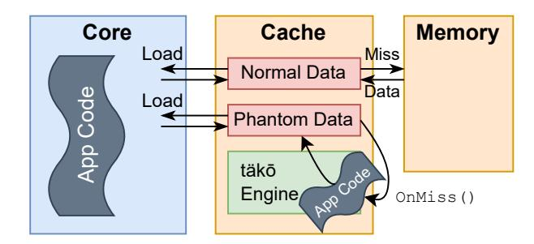

Fig. 1: Image and caption from [55] showing the organization of a täkō program. An application registers an address range whose semantics are defined by software callbacks. These callbacks run in-cache on programmable engines.

than the accelerator-rich landscape of today. Furthermore, the accelerator design space is so rich and varied that one cannot create a single effective methodology for formally specifying and verifying all possible accelerators. Still, architects and formal methods experts must work together to develop new techniques for modeling and verifying classes of accelerators that have not been previously studied.

In this work, we focus on developing a verified formal hardware-software interface for the täkō [55] programmable memory hierarchy (PMH). Figure 1 shows täkō's high-level operation: users can write *callbacks* that run on cache misses, evictions, and writebacks. These callbacks give the user increased control over data movement, enabling various performance and energy-efficiency benefits.

We chose to formally model and verify täkō for multiple reasons. Firstly, täkō fundamentally changes the hardware-software interface. In addition to its callbacks triggered by cache events, it supports *phantom addresses* which are not backed by main memory. These features lead to complicated executions and counterintuitive program outcomes, requiring programmers to understand the intricacies of the memory hierarchy (e.g., details of prefetching and replacement policies) to understand how their programs will behave. This complexity makes täkō a challenging and worthwhile case study for formal methods. Secondly, täkō is intended to be a general-purpose accelerator. The täkō paper shows how täkō can be used to improve the performance and energy efficiency of a diverse set of workloads, including graph traversals, scatter-updates,

| Core 0        | [x].OnMiss   |
|---------------|--------------|
| (i1) [x] ← 1  | (i3) [x] ← 2 |
| (i2) r1 ← [x] |              |

(a)

| Core 0                  | [x].OnMiss           |
|-------------------------|----------------------|
| (1) [x] misses in cache |                      |
|                         | [x] ← 2<br>(2) (i3)1 |
| (3) (i1) [x] ← 1        |                      |
| (4) [x] evicted         |                      |
| (5) [x] misses in cache |                      |
|                         | [x] ← 2<br>(6) (i3)2 |
| (7) (i2) r1 ← [x]       |                      |
| (b)                     |                      |

Fig. 2: (a) A sample tak¨ o program. (b) A possible execution ¯ of said program. The evictions and misses from the cache, which were previously hidden hardware details, now impact the outcome of the program.

and non-volatile memory transactions. Thus, insights gained from modeling and verifying tak¨ o are likely to be more broadly ¯ applicable than those gained from modeling a more specialized accelerator. Finally, no implementation of tak¨ o currently exists ¯ beyond the closed-source simulator used for the tak¨ o paper. ¯ Thus, there is no way for researchers other than the authors of tak¨ o to validate whether a t ¯ ak¨ o implementation is correct. ¯ A formal hardware-software interface for tak¨ o would enable ¯ such verification, and we create such an interface in this paper.

As an example of how tak¨ o programs can execute in coun- ¯ terintuitive ways, consider the program in Figure 2a, in which a program thread writes to an address [x] and subsequently reads from it. In this case, [x] is a phantom address with an OnMiss callback registered for it. When an access to [x] misses in the cache, the callback runs, populating the cache with a value of 2 for [x]. In an execution where [x] is brought into the cache to execute (i1) and remains there for the execution of (i2), the value of 2 would be overwritten to 1 by (i1), and thus (i2) would read the value of 1 into r1. However, if an eviction occurs between these instructions, (i2) would miss in the cache, causing the OnMiss to be invoked again. In this case, the previously written value is *dropped entirely*, since phantom addresses are not backed by main memory. An execution illustrating this counterintuitive behavior is shown in Figure 2b. In this case, the intervening cache eviction and subsequent OnMiss cause the value that is loaded by (i2) to completely forget the occurrence of the previous write. In such a system, the previously hidden details of cache features, such as a prefetching or cache replacement policy, now have a direct impact on the functional results of the program.

tak¨ o's linkage of cache features to program results funda- ¯ mentally changes the memory consistency model (MCM) of an ISA that may implement tak¨ o. MCMs constrain the values that ¯ can be read by load instructions in parallel programs, so precisely specifying MCMs and verifying their implementations is critical to parallel system correctness. A formally specified MCM for an architecture also enables proving correctness of compilation to that architecture, as well as program synthesis [16] (code generation with correctness guarantees) for that architecture. Defining the MCM of an architecture like tak¨ o¯ requires reasoning beyond what is used in traditional systems, because conventional MCMs have no notion of phantom addresses or cache-event-triggered callbacks.

In this work, we develop new formalisms for reasoning about cache events, callbacks, and phantom addresses to create a new ISA-level MCM for tak¨ o (§IV). This MCM is ¯ *axiomatic*, i.e., executions must obey a set of axioms (properties) to be correct under the MCM. In §V, we show how programmers can use our MCM to reason about realistic tak¨ o programs. ¯

To verify that our MCM accurately captures tak¨ o function- ¯ ality, we create a detailed *operational* (state machine-based) model of a tak¨ o implementation (§VI). We then formally prove ¯ (§VII) that for all programs, any execution possible on the operational model is also allowed by our ISA-level MCM. This proof is machine-checked, which means that a verification engine ensures that the steps we write in our proof do indeed prove all required theorems.

In the course of our formalization, we come to the realization that architects and formal methods experts have different needs from formal models – not just for tak¨ o, but in general. ¯ While formal methods experts are concerned with verifiability, architects desire the flexibility to change design features that may improve performance or energy efficiency.

Our work serves the needs of *both* camps. For tak¨ o, our for- ¯ malisms must account for prefetching and cache replacement policies because they can affect tak¨ o correctness. However, the ¯ best prefetching and replacement policies for a desired level of performance and energy efficiency may not be known until late-stage implementation. Thus, we parameterize our operational model across prefetching policies, cache replacement policies, and network-on-chip specifics so that architects can change them in a tak¨ o implementation without compromising ¯ their conformance with our MCM. On the formal methods side, we formulate our axioms to be prefix-closed [25, 47], a property which enables inductive proofs of implementations against these axioms across all programs.

This work makes the following contributions:

- First Cache-Aware ISA-level MCM. We develop the first MCM capable of reasoning about the semantics of cache misses, evictions, writebacks, callbacks, and phantom addresses at an ISA level.
- Parameterized Formal Implementation Model of tak¨ o.¯ We construct a detailed microarchitectural model of tak¨ o¯ in Dafny [31]. This model parameterizes over tak¨ o-¯ adjacent properties that can impact performance (cache replacement policy, prefetching policy, network-on-chip specifics), ensuring that proofs about this model are valid for all choices of these parameters.
- Machine-Checked Soundness Proof of our MCM. We formally prove that for all programs, any execution of our operational model is also allowed by our ISA-level MCM, ensuring that our ISA-level MCM accurately represents


Fig. 3: Image from [55] showing the order of events in tak¨ o¯ when an OnMiss occurs for an L3 phantom address.

tak¨ o functionality. To our knowledge, this is the first ¯ end-to-end machine checked proof of an operational implementation against an axiomatic ISA-level MCM.

• General Formal Modeling and Verification Insights. We discover that architects and formal methods experts have different needs from a formal model, and that a model must serve both communities to be truly effective. We also discover that enforcing prefix-closure [25, 47] for axioms is extremely useful for enabling inductive proofs of microarchitectural implementations against axiomatic ISA-level MCMs.

# II. BACKGROUND

# *A. tak¨ o Hardware Overview ¯*

As Figure 3 shows, tak¨ o is a tiled chip. Each tile has a core, ¯ an L1, a private L2, and a shard of an L3 bank which is shared across tiles. Each tile also has an engine that runs callbacks.

tak¨ o allows programmers to register ¯ OnMiss, OnEvict, and OnWriteback (henceforth OnWB) callbacks for virtual address ranges. These callbacks run on the tile's engine during the corresponding cache events. Figure 3 depicts an OnMiss workflow. When an address with a registered OnMiss misses in the cache, a hardware thread runs the OnMiss on the corresponding engine to calculate the cache line's contents.

Similarly, when a line in the address range is evicted from a cache, an OnEvict or OnWB is invoked to run, depending on whether the data is clean or dirty respectively. Together, tak¨ o's three callback types allow for custom calculations and ¯ behavior to run as part of the cache's handling of these address ranges. This functionality allows data transformation to occur as part of data movement instead of occurring once the data has been loaded, and for any clean-up to happen as part of data eviction. Moreover, as the computation results are cached, redundant work is avoided if the same transformation needs to be run again, improving performance on certain workloads. For addresses with no callbacks registered, the semantics of the conventional load/store interface are preserved.

# *B. Callback Synchronization*

In tak¨ o, the microarchitecture's prefetching and cache re- ¯ placement policies still control *when* a cache line is moved in and out of the cache, as Figure 2 showed. Thus, callbacks can

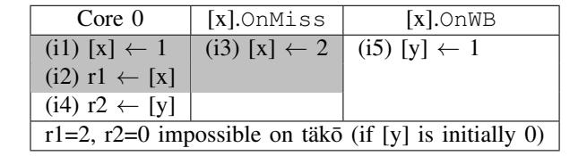

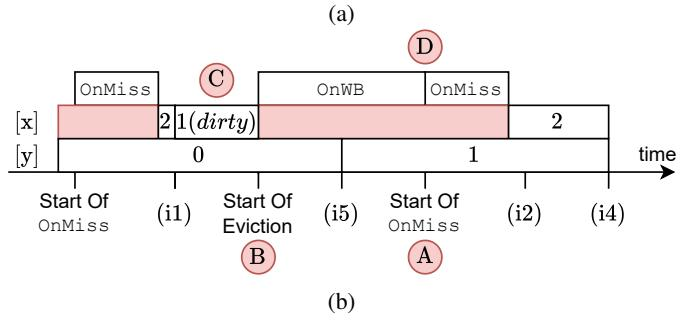

Fig. 4: (a) An extended version of Figure 2a's program (original program in gray) that depicts the interactions of callbacks and regular address [y]. The outcome r1=2, r2=0 is impossible on tak¨ o. (b) A timeline that explains why the outcome is ¯ impossible, as r1=2 implies the OnWB has completed and written 1 to [y], forbidding r2=0.

be interleaved rather arbitrarily with core thread instructions. While a load reading from an OnMiss cannot commit before the OnMiss completes, OnEvict and OnWB callbacks can execute anytime after their address is brought into the cache or written to in the cache respectively. tak¨ o thus offers a ¯ FlushRange synchronization primitive. A FlushRange causes all cache lines with addresses in the mentioned range to be evicted from the cache, invoking their OnEvict or OnWB and blocking the FlushRange till they complete.

tak¨ o engines serialize all callbacks to the same address ¯ in FIFO order to reduce the possibility of races on those addresses [55]. However, tak¨ o executions can still easily lead ¯ to races and counterintuitive outcomes, as we discuss next.

# III. THE NEED FOR FORMALIZATION

# *A. High Complexity*

In tak¨ o, accesses performed during callbacks can interleave ¯ with accesses on core threads, increasing system complexity and counterintuitive outcomes. The confusion is exacerbated by the fact that callbacks can also access regular addresses. Programmers thus have to reckon not only with phantom address semantics, but also with how cache events for phantom addresses can trigger changes in the values of regular addresses. Next, we provide an example of this complexity.

# *B. Reasoning About Callbacks*

Consider Figure 4a, the example from §I augmented with an additional OnWB callback that writes the value 1 to address [y] (a regular address with no callbacks registered). If Figure 4a were a regular 3-thread program, the outcome r1=2, r2=0 would be possible. This outcome is actually impossible on tak¨ o, but understanding why this is the case requires reasoning ¯ about the semantics of caches and callbacks.

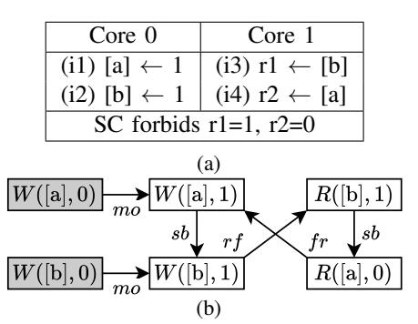

Fig. 5: (a) The mp (message passing) litmus test. All addresses are assumed to be 0 initially. (b) An execution graph of mp that is outlawed under sequential consistency (SC).

Figure 4b explains this reasoning. If r1=2, the value for (i2) must have been generated as the result of an OnMiss A instead of by (i1). Thus, an interspersed OnMiss must have run between (i1) and (i2). However, since (i1) would have brought the data for [x] into the cache, that data must also have been evicted B before the execution of the OnMiss that (i2) read r1=2 from. This eviction must have been an OnWB, as the data has been modified by (i1) and is dirty C . Due to the serialization of callbacks ensured by the cache controller D , we can guarantee that (i5) (the write to [y]) has already completed by the time (i4) runs. Thus, the load of [y] in (i4) must read a value of r2=1 for [y] in this execution, making the outcome r1=2, r2=0 impossible.

# *C. Formalization To The Rescue*

To enable programmers to rigorously reason about tak¨ o¯ programs, we develop an ISA-level MCM for tak¨ o (§IV). ¯ This ISA MCM captures the semantics of cache events and callbacks, but does not require programmers to fully understand tak¨ o's microarchitectural details, thus enhancing ¯ tak¨ o's programmability, which we demonstrate with illustrative ¯ litmus tests (§V). We ensure that our ISA MCM accurately reflects tak¨ o by first constructing a detailed implementation ¯ model of tak¨ o (§VI), and then proving that all executions ¯ of the implementation model are allowed by our ISA MCM (§VII). Along the way, we discover insights about how to construct microarchitectural models that are useful for both architects and formal methods experts. We also discover a best practice for ISA-level MCM design to enable effective proofs of hardware implementations against such MCMs.

# IV. CACHE-AWARE REASONING AT THE ISA LEVEL

We now explain our ISA-level MCM for tak¨ o. We begin ¯ with background on ISA MCMs (§IV-A), and then describe our MCM's new events and relations (§IV-B). The rest of the section discusses key axioms in our MCM in the context of outlawing a forbidden outcome of Figure 4a's program.

# *A. Axiomatic Memory Consistency Models*

An axiomatic memory model is a formalization used to define the allowable executions of a program. A program execution is represented as a directed graph, where nodes represent instructions and labeled edges encode relations between instructions. The allowable executions of the program are given by axioms that enforce constraints on these defined relations. Various memory consistency models have been encoded using this approach [2, 4, 5, 29, 49, 65, 68].

As an example, consider Figure 5a's (non-tak¨ o) program. ¯ Under sequential consistency (SC) [29], the allowed executions are those corresponding to an interleaving of each core's instructions in program order. As such, the outcome of r1=1, r2=0 here is outlawed, as r1=1 would indicate (i2) has completed and r2=0 would indicate (i1) has not completed, violating program order on either core 0 or core 1.

Figure 5b shows an execution graph for the r1=1, r2=0 outcome of Figure 5a. All addresses are assumed to initially be 0, as enforced by the initialization writes (W) of 0 to [a] and [b]. The other W nodes are the write events ((i1) and (i2)), while the R nodes are the read events. Each node is annotated with its address and value read or written. The sb (sequencedbefore) edges connect a given instruction to instructions after it in program order. The rf (reads-from) edge denotes that the read at the target reads from the write at the source. The fr (from-reads) edge denotes that the write at the target occurs *after* the read at the source. The mo (modification order) relation establishes a total order on all writes to an address<sup>1</sup> .

The axiomatization of SC [5] forbids cycles comprised of the rf, fr, sb and mo relations. Formally, this is stated as acyclic(rf ∪fr∪sb∪mo). Figure 5b's execution graph has a cycle comprised of these relations. Thus, it is forbidden under SC, as we would expect for the outcome of r1=1, r2=0.

# *B. Cache Events And Relations*

Our ISA-level MCM for tak¨ o introduces new events and ¯ relations to enable reasoning about caches and callbacks. Since the semantics of phantom reads and writes require reasoning about callbacks (e.g., Figure 2), we denote phantom reads and writes using Rcb and Wcb events (cb for callback). Regular reads and writes are denoted using R and W. For both address types, we denote an atomic read-modify-write operation with RMWcb and RMW respectively. We add Fl events to represent the flushing of an address by FlushRange.

We add events for the beginning and end of each callback, denoted M<sup>s</sup> and M<sup>e</sup> (OnMiss start and end respectively) and E<sup>s</sup> and E<sup>e</sup> (OnEvict or OnWB start and end respectively). We differentiate between OnEvict and OnWB events using a *dirty bit* for each E<sup>s</sup> or E<sup>e</sup> event. The dirty bit is false for OnEvict events and true for OnWB events.

We add a new relation called cbo (callback order) to enforce orderings on these new events. cbo establishes a total order on all callback events (Rcb, Wcb, RMWcb, Ms, Me, Es, Ee) for a single address, and reflects tak¨ o's serialization of all ¯ callbacks to a given address [55].

Next, we describe how the axioms we develop on these relations forbid the r1=2, r2=0 outcome for Figure 4a's program.

1 In the literature (e.g., [5]), the relation denoting program order is sometimes labeled po and the relation denoting modification order is sometimes labeled co (coherence order).

```
\forall \mathbf{R}.\exists !\mathbf{W}.(\mathbf{W},\mathbf{R}) \in rf
                                                           empty([M_s]; cbo; cbo; [M_e] \cap thd)
                                               RfWf1
                                                                                                                                                   CboM
 rf \subseteq val \cap addr
                                               RfWf2
                                                           empty([E_s]; cbo; cbo; [E_e] \cap thd)
                                                                                                                                                    CboE
\forall A.to(mo, \mathbf{W}^A)
                                              MoWf1
                                                           empty([\mathbf{W_{cb}}]; viscb; [E_s(..., ..., false)])
                                                                                                                                                 EvDirty
 mo \subseteq addr
                                              MoWf2
                                                           empty(viscb; [E_s(..., true)] \setminus [\mathbf{W_{cb}}]; viscb)
                                                                                                                                               WbDirty
 \forall A.to(cbo, CB_{se}^A \cup CB_{me}^A)
                                             CboWf1
                                                           empty([M_e]; cbo; [M_s] \setminus [M_e]; cbo; [E_s]; thd; [E_e]; cbo; [M_s])
                                                                                                                                                   OEInt
 cbo \subseteq addr
                                             CboWf2
                                                           empty([E_e]; cbo; [E_s] \setminus [E_e]; cbo; [M_s]; thd; [M_e]; cbo; [E_s])
                                                                                                                                                  OMInt
 viscb \subseteq val
                                              CboVal
                                                           \forall M_e.\exists!M_s.(M_s,M_e)\in thd
                                                                                                                                                 OMThd
                                                           \forall E_e.\exists !E_s.(E_s,E_e) \in thd
 [M_s]; thd; [M_e] \subseteq cbo
                                                ThdM
                                                                                                                                                 OEThd
                                                           empty([M_s]; cbo; [M_s] \setminus [M_s]; thd; [M_e]; cbo; [M_s])
 [E_s]; thd; [E_e] \subset cbo
                                                                                                                                                   MeInt
                                                 ThdE
 [E_s]; thd; [E_e] \subseteq dirty
                                             DirtyWf
                                                           empty([E_s]; cbo; [E_s] \setminus [E_s]; thd; [E_e]; cbo; [E_s])
                                                                                                                                                    EeInt
                                                           \forall CB_{me}.\exists !M_e.(M_e,CB_{me}) \in vf
 irreflexive(hb)
                                                    Hb
                                                                                                                                                    VfWf
 irreflexive(eco; hb)
                                                           \forall E_s.\exists !M_e.(M_e,E_s) \in ef
                                                    Vis
                                                                                                                                                    EfWf
 irreflexive(rf \cup
                                                           \forall Fl.(\forall M_s.(Fl, M_s) \in addr \Rightarrow (Fl, M_s) \in cbo)) \lor
                                                                                                                                                    EbWf
    (mo; mo; rf^{-1}) \cup (mo; rf)
                                                               (\exists! E_e.(E_e, Fl) \in eb)
 irreflexive(cbo; hb)
                                                VisCb
where
                                             \mathbf{W} = \{W, RMW\}
                                                                                  vf = ([M_e]; cbo; [CB_{me}]) \setminus ([M_e]; cbo; [CB_{se}]; cbo; [CB_{me}])
\mathbf{R} = \{R, RMW\}
                                            \mathbf{W_{cb}} = \{W_{cb}, RMW_{cb}\} \qquad ef = ([M_e]; cbo; [E_s]) \setminus ([M_e]; cbo; [CB_{se}]; cbo; [E_s])
\mathbf{R_{cb}} = \{R_{cb}, RMW_{cb}\}
CB_{me} = \{R_{cb}, W_{cb}, RMW_{cb}\} \quad CB_{se} = \{M_s, M_e, E_s, E_e\} \quad eb = ([E_e]; cbo; [Fl]) \setminus ([E_e]; cbo; [CB_{se}]; cbo; [Fl])
 fr = rf^{-1}; mo
                                            eco = (rf \cup mo \cup fr)^+ sw = ([RMW]; rf; [RMW]) \cup ([RMW_{cb}]; cbo; [RMW_{cb}])
 hb = ((I \times \neg I) \cup sb \cup sw \cup vf \cup eb \cup ([M_e]; cbo; [E_s]) \cup ([E_e]; cbo; [M_s]))^+
 viscb = ([\mathbf{W_{cb}} \cup M_e]; cbo; [\mathbf{R_{cb}} \cup E_s]) \setminus ([\mathbf{W_{cb}} \cup M_e]; cbo; [CB_{se} \cup \mathbf{W_{cb}}]; cbo; [\mathbf{R_{cb}} \cup E_s])
 to(R, S) = irreflexive(R) \land transitive(R) \land (\forall s_1, s_2 \in S.R(s_1, s_2) \lor R(s_2, s_1))
 race = ((((W \cup R \cup W_{cb} \cup R_{cb}) \times (W \cup R \cup W_{cb} \cup R_{cb})) \setminus ((R \times R) \cup (R_{cb} \times R_{cb}))) \cap addr) \setminus (id \cup hb \cup hb^{-1})
```

 $X^A$  is all X events with address A. I denotes initialization events. id is the identity relation, i.e. pairs of identical events. Fig. 6: All axioms for our täkō MCM. Executions must satisfy all axioms to be allowed. A is the elements of type A in relation form [59].  $A \times B$  are pairs of an element of type A and an element of type  $A \setminus B$  is the elements of A that are not in B. Semicolons (;) denote relational composition, e.g., e1; e2 is two relations e1 and e2 where the destination node of

e1 is the source node of e2.  $R^{-1}$  is the inverse of R.  $\exists$ ! specifies existence of a unique element with the specified property.

Each address is of type Synch or Data.  $RMW/RMW_{cb}$  run on Synch addresses;  $R/W/R_{cb}/W_{cb}$  run on Data.

addr, val, dirty denote pairs of events with matching addresses, values, and dirty bits respectively.

Figure 6 contains all our axioms and their names. We refer to axioms using these names throughout the rest of the paper.

### C. Ensuring Phantom Address Sources

Figure 7 depicts execution graphs for the r1=2, r2=0 outcome of Figure 4a's program. This outcome is impossible on täkō due to cache and callback semantics (§III-B). Figure 7a depicts an execution graph for this outcome without täkō-specific axioms. Traditional MCM axioms cannot reason about cache events and callbacks, so täkō-specific axioms are needed to forbid this execution. Graphs (b)-(e) depict execution graphs after the addition of one or more täkō-specific axioms and/or relations that outlaw the previous flawed execution graph but not the forbidden outcome of r1=2, r2=0. Graph (f) depicts the execution graph after enough axioms and relations have been added to forbid the r1=2, r2=0 outcome.

First, consider Figure 7a's execution, in which no callbacks execute. The regular read of [y] can read its initial value of 0 from memory, but [x] is a phantom address that does not live outside the cache. Since the caches are initially empty, for [x] to be read, a value for it must first be created in the cache by running an OnMiss callback for [x]. Thus, we must outlaw

executions in which reads or writes of phantom addresses like [x] are not preceded by the execution of an OnMiss for them.

To this end, we add axioms (**VfWf** in Figure 6) to ensure that any  $R_{cb}$  or  $W_{cb}$  must be preceded in cbo by an  $M_e$ . Analogously, a Fl must be preceded by an  $E_e$ , denoting that an eviction has completed for the address being flushed (**EbWf**). An Fl may also occur before its address is ever brought into the cache (i.e., before there is anything to flush). These axioms are sufficient to outlaw Figure 7a's execution. Adding the required OnMiss gives us Figure 7b, which we discuss next.

# D. Ensuring Callback Value Correspondence

Figure 7b includes an OnMiss to generate a value for [x]. However, note that the OnMiss generates a value of 2 for [x] (the  $M_e([x], 2)$  node). This is then overwritten by the write of 1 to [x] (the  $W_{cb}$  node). The subsequent read of [x] (i.e., the  $R_{cb}$  node) runs after the write to [x], and so should see the updated value of 1. However, it currently reads a 2.

To fix this problem, we need to add an axiom to ensure that reads of phantom addresses (and eviction callbacks) do not read values that have been overwritten. Specifically, we must ensure that for a given address a, if there is no intervening


(e) Problem: Violates happens-before visibility for [y]. Solution: §IV-F.

(f) Final execution graph for outcome r1=2, r2=0

Fig. 7: (a-e) Faulty candidate execution graphs for Figure 4a's tak¨ o program with an outcome of r1=2, r2=0. (f) The final ¯ execution graph for the outcome r1=2, r2=0 once all relevant events, relations, and axioms are added. §IV explains how we encode the semantics of caches and callbacks into axioms to enforce that impossible outcomes like r1=2, r2=0 are forbidden.

write (e.g., a Wcb) to a in cbo order between the end of an OnMiss (i.e., an Me) for a and a read (e.g., an Rcb) of a, then the value of the read must match the value of the Me. On the other hand, if there is an intervening write to a in cbo order between the M<sup>e</sup> and the Rcb to a, then the value of the Rcb must match the value of the most recent such write in cbo. The latter case occurs when a phantom address is brought into the cache and then written to. Both cases are depicted below:

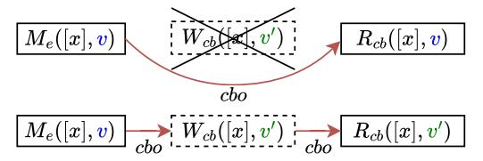

To express this constraint formally, we first define a viscb relation to denote phantom writes and OnMiss results that are visible to phantom reads and eviction callbacks. We then require that viscb ⊆ val (CboVal in Figure 6). The val relation links elements with the same value, so this constraint requires that elements linked by viscb must have the same value. This constraint ensures that phantom reads and eviction callbacks must have values that are actually visible to them.

Returning to Figure 7b, now the only way the read of [x]

could get a value of 2 in our program is if another OnMiss ran and generated that value of 2, which was then read by the Rcb node. Adding this extra OnMiss to the graph gives us Figure 7c, which we discuss in the next section.

# *E. Ensuring Correct Callback Correspondences*

As Figure 7c shows, we have now ensured correct values for the phantom reads in our execution. However, note that Figure 7c contains two OnMiss callbacks for [x] without [x] being evicted from the cache in between. This is impossible, and so an eviction callback (OnEvict or OnWB) for [x] must run in between the two OnMiss callbacks.

To enforce this constraint, we require that there must be an OnEvict or OnWB (i.e. an Es/E<sup>e</sup> pair) between the end of an OnMiss and the beginning of another OnMiss to that same address. Graphically, this constraint requires the dotted events in the diagram below to exist between the M<sup>s</sup> and M<sup>e</sup> (thd refers to events on the same thread):

$$M_e([x],n)$$
  $C_s([x],n',d)$   $C_s([x],d)$   $C_s([x],d)$   $C_s([x],d)$   $C_s([x],d)$ 

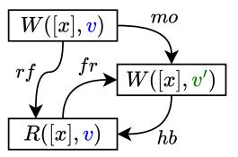

Fig. 8: A pattern forbidden by traditional happens-before (hb).

Formally, this axiom is OEInt in Figure 6. We also add a similar axiom for the existence of an OnMiss between two eviction callbacks of the same phantom address (OMInt).

The OEInt axiom only ensures that an eviction callback runs in between two OnMisses. It does not enforce whether said callback is an OnEvict or OnWB for the appropriate cases. With OEInt, an execution graph like Figure 7d is possible. Here, we have an OnEvict for [x] in between the two OnMisses (the dirty bits of the E<sup>s</sup> and E<sup>e</sup> are false). Since [x] is written to by the Wcb node in the graph before its eviction, an OnWB for [x] should run instead of the OnEvict. The OnEvict should only have run if [x] had not been written to in the cache before its eviction.

To this end, we establish a correspondence between the dirty bits of E<sup>s</sup> and E<sup>e</sup> events and the existence of a write to a phantom address after it is brought into the cache. If the dirty bit of an E<sup>s</sup> is false (OnEvict case), we outlaw the existence of a callback write event in cbo order occurring between the previous M<sup>e</sup> (i.e., the end of the most recent OnMiss) and this Es. Conversely, if the dirty bit of the E<sup>s</sup> is true (OnWB case), we necessitate the existence of a write event in between the previous M<sup>e</sup> and the Es. Both cases are depicted below:

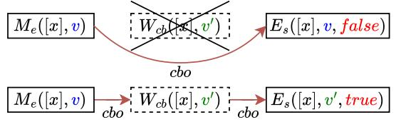

To express this formally (Figure 6), we enforce EvDirty for the OnEvict and WbDirty for the OnWB cases.

Once we enforce the correct type for each eviction callback, Figure 7d can no longer be generated. Figure 7e shows the execution of our running example with an OnWB between the two OnMiss callbacks for [x], as required.

While we have now enforced correct values for the callbacks and phantom addresses, the effects of these callbacks and phantom addresses on *regular* addresses have not been enforced. Specifically, Figure 7e shows that the write of 1 to [y] in the OnWB of [x] runs before the Rcb of [x], which in turn runs before the read of [y]. (We assume no load-load reordering in our system; the tak¨ o paper [55] uses the x86 ¯ ISA which forbids load-load reordering [49].) Thus, the read of [y] should see the write of 1 to [y], but there is currently no axiom enforcing this. To enforce this ordering, we need to augment the happens-before reasoning from traditional MCMs with callback-related orderings, which we do next.

# *F. Augmenting Happens-Before With Callback Ordering*

*1) Traditional Happens-Before Ordering:* In conventional consistency models, the hb (happens-before) relation governs which writes are visible to a read. The hb relation enables capturing orderings enforced by inter-thread synchronization such as release-acquire [14]. Stated formally, the hb relation is typically defined as (sb∪sw) <sup>+</sup>, or the transitive closure (+) of sb and sw (synchronizes with) edges [2, 9]. hb also connects initialization events to non-initialization events (I × ¬I).

Consider Figure 8's relational pattern. Here, the read R of [x] reads from the write of v to [x], but a later write of v ′ to [x] happens-before the read. The read should not observe the older write of v and should instead read the write of v ′ . Thus, this pattern and other similar ones should be forbidden. We, like prior work, do so using Figure 6's Vis axiom.

*2) Adding Callback Ordering to hb:* Now consider Figure 7e's execution graph. In tak¨ o, the write of [y] happens ¯ before the read of [y], as §IV-E covers. However, there is no hb edge from the write of [y] to the read of [y] in Figure 7e, because the traditional hb relation does not take callback orderings into account. Thus, Figure 8's pattern does not show up in the graph, and the execution is not forbidden by the Vis axiom. For our hb relation to be accurate, we need to augment it with callback-related orderings.

There are four additions that we make to the traditional hb relation of (sb ∪ sw) <sup>+</sup> in our tak¨ o MCM (Figure 6). Our first ¯ two additions to hb are vf (value-from) and eb (evicts-before) edges. vf edges connect M<sup>e</sup> events to the Rcb or Wcb that they populate the cache for, while eb connects E<sup>e</sup> events to the next Fl for the corresponding address. Intuitively, these orderings are part of hb because an OnMiss for a phantom address must finish before a read or write to that phantom address, and an eviction of a phantom address must complete before the next FlushRange for that address completes.

The remaining two additions to hb come from tak¨ o's serial- ¯ ization of callbacks to the same address. Specifically, we add any cbo edges from M<sup>e</sup> to E<sup>s</sup> nodes (i.e., from the end of an OnMiss to the start of an eviction for the same address) and from E<sup>e</sup> to M<sup>s</sup> nodes (i.e., from the end of an eviction to the start of an OnMiss for the same address).

Figure 7f shows the execution graph from Figure 7e with edges added from our updated hb relation. Our updated hb relation correctly enforces the hb edge we know should exist from the write of [y] to the read of [y]. The graph now contains an instance of Figure 8's forbidden pattern, which is forbidden by the Vis axiom (§IV-F1). Thus, Figure 7f's execution is now forbidden by our axioms. There is no additional execution that allows the outcome of r1=2, r2=0, so the axioms we have discussed suffice to forbid that outcome.

# *G. Summary*

In this section, we showed how we encoded reasoning about tak¨ o's callbacks and cache events into our ISA-level MCM for ¯ tak¨ o. We could not discuss all our MCM axioms from Figure 6 ¯ due to space constraints, but we discussed many important ones. We have encoded all of our axioms as well as our tak¨ o¯ litmus tests in Alloy [21] to support use of our MCM. A programmer can now simply use our MCM to check whether a given outcome is possible for their tak¨ o program, without ¯

| Core 0                                                  | Core 1               | [b].OnMiss   |  |  |
|---------------------------------------------------------|----------------------|--------------|--|--|
| (i1) [a] ← 1                                            | (i3) RMW([b], r1, 1) | (i5) [b] ← 0 |  |  |
| (i2) RMW([b],<br>, 1)                                   | (i4) r2 ← [a]        |              |  |  |
| mprmw<br>([b] is a regular address, no OnMiss):         |                      |              |  |  |
| r1 = 1, r2 = 0 forbidden by our MCM                     |                      |              |  |  |
| mpcb<br>([b] is a phantom address, OnMiss<br>included): |                      |              |  |  |
| r1 = 1, r2 = 0 forbidden by our MCM                     |                      |              |  |  |


Fig. 9: (a) The mprmw (no callback) and mpcb (OnMiss for [b]) litmus tests. (b) A forbidden execution of mprmw where the RMWs augment the hb relation to outlaw the reading of 0 for [a]. (c) An analogous forbidden execution of mpcb showing the same pattern when [b] is a phantom address.

needing to understand the intricacies of a tak¨ o implementation. ¯ §V shows how to use our MCM to analyze tak¨ o programs. ¯

# V. PROGRAMMING TAK¨ O¯ USING OUR MCM

We now show how programmers can use litmus tests to write and analyze tak¨ o programs using our MCM (§V-A- ¯ V-E). We also analyze a real tak¨ o application (§V-F) using ¯ our MCM, and highlight the insights we discover about writing tak¨ o programs that are both correct and performant. ¯

# *A. Programs Without Callbacks*

Our MCM imposes minimal restrictions on programs without callbacks to avoid adding ordering requirements to nontak¨ o programs. We do not require preservation of program or- ¯ der between different addresses, so for instance, the execution of mp in Figure 5b is allowed under our model.

Similar to release consistency [14] and C11 [8], we classify addresses as data or synchronization addresses, and enforce that if one thread performs a synchronization write that is read by a synchronization read on another thread, accesses after the synchronization read are required to observe accesses before the synchronization write. In our model's parlance, this synchronization read-write pair induces an sw edge between the two accesses. We chose RMW operations to implement all accesses to synchronization addresses [1] for simplicity. (Additional constructs like C11 low-level atomics [9] could be added in the future.) For instance, consider the mprmw litmus test in Figure 9a (where [b] is a regular address and its OnMiss is thus omitted). This test changes the read and write of [b] in Figure 5b to RMW operations, inducing an sw edge from the write of [b] to the read of [b], as shown in Figure 9b. The Vis axiom then enforces that the read of [a] is required to see the write of 1 to [a], forbidding the outcome of r1=1,r2=0. Vis also enforces per-address SC for regular addresses.

Both regular and phantom conflicting accesses (i.e., a pair of accesses to the same address in different threads not ordered by hb where at least one is a write) constitute a race if they are to a data address, e.g., Figure 5b's read of [a] and write of 1 to [a] constitute a race. Figure 6 defines our race relation.

# *B. Synchronizing With RMWs To Phantom Addresses*

RMWs to phantom addresses (i.e., RMWcb events (§IV-B)) can also be used to enforce ordering constraints, similar to how regular address RMWs can be used on conventional programs (§V-A). This is illustrated in the mpcb litmus test (Figure 9a), where the address [b] is a phantom address with an OnMiss that returns 0. Similar to mprmw, the outcome of r1=1,r2=0 is forbidden by our tak¨ o MCM. ¯

Figure 9c demonstrates a forbidden execution graph that shows the happens-before reasoning in mpcb, which is analogous to that presented in §V-A for mprmw. In this case, as the cbo relation between the two RMWcb events is also added to the sw relation, the same hb edge is constructed between the write and read of [a]. The Vis axiom then forbids the outcome of r1=1,r2=0 for this test, very similar to how it forbids this outcome in mprmw.

Of course, with the use of a phantom address, one must reason about intervening evictions that could occur between the RMWcb accesses. In mpcb, the VisCb axiom ensures that if (i3) reads a value of 1, it must get this value from (i2) (as the OnMiss can only produce the value 0), ensuring that no eviction occurs in between.

# *C. Instruction Ordering Within Callbacks*

Our MCM does not require the preservation of program order between instructions to different addresses in callbacks, similar to how we do not require such ordering in nontak¨ o programs (§V-A). We demonstrate this using the ¯ icbsb litmus test in Figure 10a. In this test, two cores perform writes (i1) and (i2) to phantom addresses [x] and [y] respectively. As there are no restrictions in tak¨ o that prevent running callbacks ¯ for *different* addresses concurrently, the two OnWBs can run at any time with respect to each other, and perform writes and reads to addresses [a] and [b].

The OnWBs for [x] and [y] recreate the well-known sb (store buffering) litmus test [53]. As in the sb test, for both loads in the callbacks to return 0 (i.e., the outcome r1=0, r2=0), the instructions in at least one callback must be reordered. Figure 10b shows an execution with the outcome r1=0,r2=0 that is allowed under our model, thus showing that our model does not require the preservation of program order in callbacks. More specifically, the axioms in our MCM allow the fr∪sb cycle among the callback instructions in Figure 10b.

By not requiring program order to be preserved in callbacks, our MCM gives computer architects significant freedom when

| Core 0                                   | [x].OnMiss   | [x].OnWB      |  |
|------------------------------------------|--------------|---------------|--|
| (i1) [x] ← 1                             | (i3) [x] ← 0 | (i5) [a] ← 1  |  |
|                                          |              | (i6) r1 ← [b] |  |
| Core 1                                   | [y].OnMiss   | [y].OnWB      |  |
| (i2) [y] ← 1                             | (i4) [y] ← 0 | (i7) [b] ← 1  |  |
|                                          |              | (i8) r2 ← [a] |  |
| icbsb: r1 = 0, r2 = 0 allowed by our MCM |              |               |  |

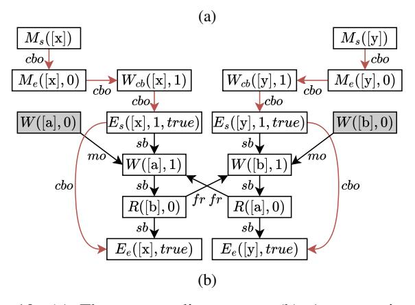

Fig. 10: (a) The icbsb litmus test. (b) An execution of icbsb that demonstrates the intra-callback instruction reordering that is allowed by our MCM.

designing the callback engine. In particular, tak¨ o designs that ¯ buffer and reorder memory operations in the engine can still use our MCM.

# *D. FlushRange as a Synchronization Primitive*

While the use of an OnMiss-generated value (Me) by a Rcb or Wcb induces an hb edge between the events (§IV-F2), an OnEvict or OnWB for a phantom address can execute anytime after the address is brought into the cache (for OnEvict) or after the address is written to in the cache (for OnWB). This freedom allows races between accesses in these eviction callbacks and those in core program threads.

Consider the wbr litmus test from Figure 11a, where the bolded FlushRange (i2) is omitted. This program distills a use case of phantom memory as a write-combining buffer for scatter-updates [55], which are published back to regular memory via OnWBs. In this test, Core 0 updates the buffer at phantom address [x] in (i1), and (i5) publishes the update to address [y] in regular memory on a writeback. Core 0 also reads the published update in (i3).

Figure 11b shows that since the OnWB of [x] can execute anytime after (i1), (i5) and (i3) are unordered by hb, causing a race. If we add the FlushRange (i2) from Figure 11a to the wbr test to give us the wbf test, the race is eliminated. Specifically, this FlushRange must either commit before the OnMiss of [x] or after the OnWB of [x], as enforced by EbWf (Figure 6). Committing the FlushRange before the OnMiss causes a forbidden cycle in cbo (CboWf1). Meanwhile, Figure 11c depicts the execution where it commits after the OnWB of [x]. Here, an hb edge is added between

| Core 0                                                     | [x].OnMiss   | [x].OnWB     |  |  |
|------------------------------------------------------------|--------------|--------------|--|--|
| (i1) [x] ← 1                                               | (i4) [x] ← 0 | (i5) [y] ← 1 |  |  |
| (i2) FlushRange[x]                                         |              |              |  |  |
| (i3) r1 ← [y]                                              |              |              |  |  |
| wbr<br>(without (i2)): program racy under our tak¨ o MCM ¯ |              |              |  |  |

wbr (without (i2)): program racy under our tak¨ o MCM ¯ wbf (with (i2)): no race, r1 = 0 forbidden by our MCM

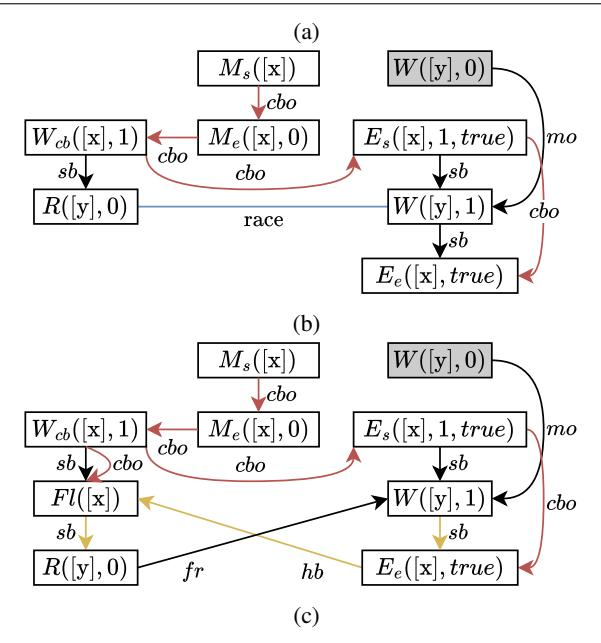

Fig. 11: (a) The wbr (Writeback Race) and wbf (Writeback Flush) litmus tests. (b) wbr execution where the accesses to [y] race because the OnWB is non-blocking. (c) wbf eliminates the race using a FlushRange, and forbids r1=0.

the E<sup>e</sup> and the Fl as per Figure 6's definitions of eb and hb. Combining this edge transitively with the two yellow sb edges gives us an hb edge between (i5) and (i3), eliminating the race. We now also have a cycle in hb and fr between (i3) and (i5), which violates the Vis axiom, forbidding this execution's outcome of r1=0. Our MCM thus formalizes how FlushRange synchronization can be used to eliminate races.

The race in wbr illustrates a key difference between tak¨ o¯ and prior works like IMO [20] and EcMon [45] that allow userspace traps for cache events. In these works, traps effectively have *function call* semantics: they interrupt a core thread (either immediately after a cache event or at a predetermined execution point), execute a handler, and then return control. Thus, the ability of traps to concurrently execute with core threads is greatly reduced if not eliminated. In contrast, in tak¨ o, callbacks have ¯ *thread* semantics [55]: they execute on dedicated engines in parallel with core program threads. As a result, conflicting accesses across tak¨ o callbacks and core ¯ program threads can be races. This would not be the case in IMO and EcMon where callbacks are not separate threads.

# *E.* FlushRange *Utility in Multicore Programs*

We now explore the utility of the FlushRange primitive in a multicore setting by considering a multicore version of the wbf litmus test (§V-D). Figure 12 contains 2 implementations

| Core 0                                                | Core 1                |                    | [x].OnMiss   |         |
|-------------------------------------------------------|-----------------------|--------------------|--------------|---------|
| (i1) RMW([x],<br>, 1)                                 | (i4) RMW([x],<br>, 2) |                    | (i7) [x] ← 0 |         |
| (i2) FlushRange[x]                                    |                       | (i5) FlushRange[x] |              |         |
| (i3) r1 ← [y]                                         | (i6) r2 ← [z]         |                    |              |         |
| [x].OnWB<br>(1)                                       | [x].OnWB<br>(2)       |                    |              |         |
| r3 ← [y]<br>(i8)                                      |                       | (i12)              | if x = 1:    |         |
| (i9)<br>if r3 = 0:                                    |                       | (i13)              |              | [y] ← 1 |
| [y] ← 1<br>(i10)                                      |                       |                    | else:        |         |
| else:                                                 |                       | (i14)              |              | [z] ← 2 |
| [z] ← 2<br>(i11)                                      |                       |                    |              |         |
| phiR<br>(with OnWB<br>(1)):                           |                       |                    |              |         |
| program racy under our tak¨ o MCM ¯                   |                       |                    |              |         |
| phiNR<br>(with OnWB<br>(2)):                          |                       |                    |              |         |
| no race, r1 = 0, r2 = 0 forbidden by our tak¨ o MCM ¯ |                       |                    |              |         |

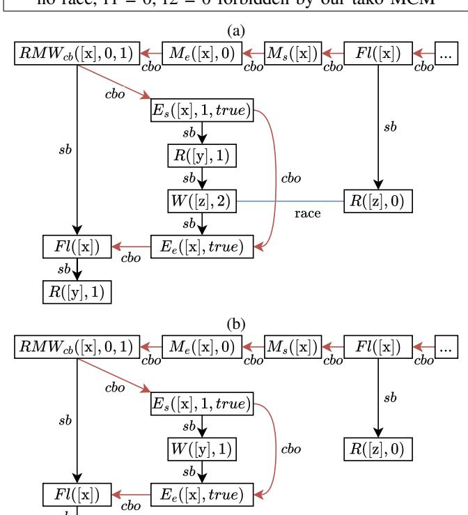

Fig. 12: (a) The phiR (with OnWB (1)) and phiNR (with OnWB (2)) litmus tests. (b) Execution snippet showing phiR race due to OnWB from core 0's write occurring after FlushRange on core 1. (c) Execution snippet showing how phiNR avoids the race by branching on evicted value in the OnWB.

(c)

of a program (named phiR and phiNR) in which multiple cores concurrently write updates to a phantom address [x] and the OnWB of [x] publishes the results back to different locations ([y] and/or [z]), depending on how many updates have previously been published (for phiR) and which update was written last (for phiNR). This logic is inspired by how the tak¨ o paper's acceleration of scatter-updates uses the number of ¯ updates in the line at eviction to determine whether to apply the updates in place or log them [55]. We additionally use RMW instructions ((i1) and (i4)) to update [x] in both tests because using stores for (i1) and (i4) would result in a race between those two accesses.

In phiR, the program runs with the OnWB (1) implementation of the OnWB for [x]. In this OnWB implementation, (i8) first reads [y]. If [y] has a value of 0 (i.e., if [y] has not yet been written to), (i10) writes 1 to [y]. If [y] has already been written to by a prior OnWB for [x], (i11) writes 2 to [z] instead. Thus, the first time the OnWB runs, it will write to [y], and if it runs a second time, it will write to [z].

The phiR litmus test is racy, as demonstrated by the execution snippet in Figure 12b. The core cause of the race is that the RMWs (i1) and (i4) can occur in either order, but the OnWB will always write to [y] in its first iteration and [z] if it runs a second time. Consider the case where (i4) runs first (not shown in Figure 12b) and then (i5) invokes the OnWB and causes [y] to be updated to 1 (this OnWB is also not shown). Figure 12b shows that when (i1) subsequently writes to [x] and (i2) then invokes the OnWB, this will trigger the write to [z] in (i11). However, nothing stops this write from racing with the read of [z] in (i6) on core 1, giving us a race.

This execution demonstrates a key requirement when using FlushRange for synchronization: for FlushRange to be able to eliminate a race, callbacks should not be able to run accesses that cause the race after the FlushRange in question has committed. Here, it is possible for the OnWB to be triggered and run (i11) after (i5) has committed, so (i5) is unable to prevent (i11) from racing with (i6).

The above requirement is fulfilled by the phiNR litmus test from Figure 12a that uses OnWB (2) as the OnWB for [x]. Here, the OnWB uses the evicted value to determine which value to write. (i12) checks the evicted value. If it is 1 (i.e., the last update was from Core 0), then (i13) writes 1 to [y]. If it is 2 (i.e., the last update was from Core 1), then (i14) writes 2 to [z]. Thus, once (i5) commits, any write to [z] is guaranteed to have completed – the OnWB only writes 2 to [z] if [x] is 2, and that can only happen after (i4) and before (i5) commits. Thus, there is no write to [z] that can race with (i6) in any execution. (Similarly, once (i2) commits, there is no write to [y] left that can race with (i3), eliminating races on [y] as well.) Figure 12c shows how there is no write to [z] in an OnWB triggered by (i1) and (i2), thus eliminating the race seen in Figure 12b.

In phiNR, the outcome r1=0,r2=0 is forbidden by our MCM, because neither (i3) nor (i6) can run before at least one FlushRange instruction (i.e., (i2) or (i5)) commits. Since the FlushRange instructions are each after RMW instructions that write to [x] in program order, the first FlushRange to commit will cause the OnWB to run, which will update one of [y] or [z]. Thus, at least one of [y] or [z] will have been written to before (i3) or (i6) run, preventing them both from returning 0 and forbidding the outcome of r1=0,r2=0.

In phiR and phiNR, the OnWB callback runs a maximum of two times, so the complexity is relatively easy to manage. Next, we investigate tak¨ o's implementation of accelerated ¯

|      | Core 0          |       | [e].OnMiss  |       | [e].OnEvict  |
|------|-----------------|-------|-------------|-------|--------------|
| (i1) | RMW([e], r1, 1) | (i4)  | r3 ← [g]    | (i9)  | if [e] ̸= 1: |
| (i2) | FlushRange[e]   | (i5)  | if r3 ̸= 1: | (i10) | [ℓ] ← 1      |
| (i3) | r2 ← [ℓ]        | (i6)  | [g] ← 1     |       |              |
|      |                 | (i7)  | [e] ← 0     |       |              |
|      |                 | else: |             |       |              |
|      |                 | (i8)  | [e] ← 1     |       |              |

hatsR (without (i9)): program racy under our tak¨ o MCM ¯ hatsNR (with (i9)): no race, r1 ̸= r2 forbidden by MCM

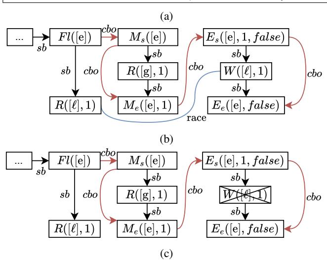

Fig. 13: (a) hatsR and hatsNR litmus tests. (b) Execution snippet showing hatsR race due to OnEvict writing to the log post-traversal. (c) Snippet showing how hatsNR eliminates the race by only logging valid edges in the OnEvict.

graph traversal, which is more difficult to write correctly because it has writes in OnEvict callbacks that can run an arbitrary number of times.

# *F. A tak¨ o Application Case Study: HATS ¯*

We now analyze tak¨ o's implementation of HATS ¯ (Hardware-Accelerated Traversal Scheduling) [43], which accelerates graph processing. The tak¨ o paper [55] states that ¯ OnMiss and OnEvict should be side-effect-free because they can occur at any time, but does not formalize why. tak¨ o's ¯ HATS implementation ignores this guideline, making it an interesting case study. We use our MCM to analyze HATS and identify when OnEvict side effects are acceptable.

tak¨ o's HATS implementation creates a phantom address ¯ range to store all graph edges *sequentially*. It then uses OnMiss callbacks to traverse the graph and place edges in this range as the main program thread accesses the phantom addresses. Thus, the main thread can iterate over the edges sequentially (an easy-to-predict pattern with good locality), while the engine handles the hard-to-predict graph traversal.

Each time the OnMiss runs, it provides the next edge from the traversal. The OnMiss only returns each edge once. Even if the same phantom address misses twice, the two OnMisses will return different edges. Thus, edges that are evicted before being processed would be lost without additional handling. Eviction callbacks therefore log edges that are evicted too early to regular memory. The main thread processes the log after iterating through the phantom addresses [55].

The hatsR litmus test (Figure 13a, without (i9)) contains the core logic of a naive tak¨ o HATS implementation. The ¯ phantom address [e] represents a graph edge, with 0 being a valid edge and 1 an invalid one. Core 0 reads [e] to process it using an RMW, atomically reading [e] and writing 1 to [e] to mark it as processed. This ensures that an eviction cannot occur between reading the edge and marking it processed, which would cause the edge to be processed twice. Core 0 then flushes [e] to ensure that any in-progress OnEvicts for it are completed. It then processes the log (represented by reading address [ℓ]). The OnMiss maintains an engine-local view of the graph (address [g]), and populates [e] with a valid edge if traversing the graph (i.e., if [g] = 0) or an invalid edge if the graph has already been traversed (i.e, if [g] = 1). The OnEvict writes the edge to the log ([ℓ]). The OnWB is empty. The intuition here is that if the edge is evicted before being written to, it has not yet been processed.

This hatsR program is racy, as Figure 13b's graph snippet shows. The specific problem is that an OnMiss-OnEvict sequence for a phantom address can run as many times as the cache wants, without action from the core. For instance, the cache's prefetcher may load [e], the cache may then evict it, and this sequence may then repeat. Here, [e] is first loaded in and processed (or not) by the core, and evicted or written back (depending on whether or not it was processed) before (i2)'s FlushRange. However, nothing stops the cache from then *reloading* [e] (triggering a second OnMiss) and then evicting it (triggering an OnEvict). This second OnMiss-OnEvict sequence is shown in Figure 13b. The write in the OnEvict races with the read of the log in (i3). While this write may not change the value of [ℓ] in the test (if [e] was not processed by the core, [ℓ] will already be 1), recall that each such write to [ℓ] corresponds to updating the log in the real HATS application, and would cause spurious edges to be added to the log, impacting correctness.

Fixing this issue is tricky as the cache cannot be prevented from loading or evicting phantom addresses after the graph traversal completes. The solution is to ensure that once the traversal completes, (i) the OnMiss does not provide spurious data for [e] and (ii) neither the OnMiss or OnEvict access addresses besides their registered address [e] and engine-local addresses like [g]. This solution is presented in the hatsNR test (Figure 13a including (i9)), where the OnEvict only logs valid edges, and the OnMiss (as before) returns invalid edges once the graph has been traversed. Figure 13c shows how this eliminates the race: post-traversal OnEvicts will never log edges in hatsNR, thus eliminating the write of the race. We encoded hatsNR in our Alloy model of our MCM and searched for races with a large bound. None were found, giving us confidence that hatsNR is indeed race-free.

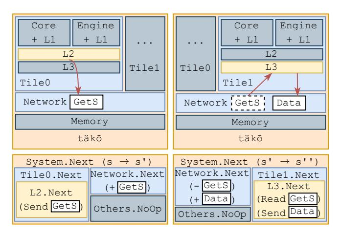

Fig. 14: Our hierarchical transition system instantiated with two tiles, executing two transitions ( $s \to s'$  and  $s' \to s''$ ). In the first transition, Tile0's L2 cache sends a GetS request into the Network. In the second, Tile1's L3 cache receives said request and responds with a Data message. All other state machines perform a NoOp transition (colored ).

#### VI. A PARAMETERIZED MODEL OF TÄKŌ

#### A. Operational Models

An operational model is a transition system, which consists of a set of states S, as well as two predicates over elements of this set: an initial state predicate Init(s) that is true when  $s \in S$  represents a valid initial state, and a transition predicate Next(s,s') that is true for a pair of states  $s,s' \in S$  when they represent a valid transition from s to s'.

We implement our transition system in Dafny [31], a verification-aware language that enables proving properties about programs and abstract models in a partially automated way. Dafny converts properties into Satisfiability Modulo Theories (SMT) queries and then uses Z3 [12] to verify them.

#### B. täkō State Machine Overview

Figure 14 depicts the components in our täkō transition system, instantiated with two tiles, as well as two example transitions. The model is hierarchical: each tile of the täkō chip (Figure 3) is its own transition system, consisting of individual transition systems representing each major component of said tile (the Core + L1, Engine + L1, L2, and L3 slice). A single Memory state machine represents main memory.

To enable communication between the individual components, we add a state machine called Network to the design, which contains all in-flight messages between components. During any individual component transition, a single message may be read from or written into the Network (potentially both). The Network's internal structure determines which messages can be delivered during a transition: for coherence messages, this is an unordered set, allowing arbitrary reordering to overapproximate various network-on-chip designs. For engine requests, the Network is stricter, enforcing FIFO ordering per address on callback requests, as täkō requires [55].

The overall Next predicate for the system is a transition of a single component state machine alongside a transition of the Network to capture a potential message the component transition might send and/or receive. Figure 14 illustrates transitions in greater detail, depicting how the transition system represents the behavior of the L2 requesting data from the L3. In this case, the L2.Next predicate adds a GetS to the Network, and a subsequent transition in the L3 state machine receives this message from the Network and replies with the requested data. Thus, an execution trace for a program in the full state machine is decomposed into individual atomic steps that are taken by its component state machines, alongside Network steps for communication.

Our model currently supports programs with Load, Store, RMW, Flush, and Branch instructions. The execution of an instruction potentially corresponds to several transitions that occur in the system (e.g., to request its value from the memory hierarchy). Each instruction is committed using a PerformInst transition in either the Core or Engine component state machines, depending on if the instruction is in a program thread or a callback.

Our caches are inclusive (enforced by täkō [55]), and kept coherent through a hierarchical directory-based MSI protocol [46]. The higher protocol has the L2 as a directory and the Core and Engine L1s as children, while the lower protocol has L3 shards as a directory and L2 caches as children. We use the HieraGen [48] approach of a proxy L2 cache to communicate between the two protocols. Our protocols do not require point-to-point ordering, as our Network model does not enforce point-to-point ordering for coherence messages.

# C. Model Parameterization

Our model is parameterized over the size of all caches, the executing program, the number of cores, and the mapping of addresses to L3 banks. By making these parameters generic instead of concrete values, we ensure that when we prove facts about the transition system (§VII-A), we in fact prove them for *any* configuration of these values. This parameterization makes our proof notably harder, as we now cover a wider range of possibilities. However, our proof becomes much more useful, as it applies to *all* configurations of these parameters.

#### D. Environmental Transitions

In systems like täkō, callback code can execute due to events like evictions or prefetches. Hardware controls when these events happen, so they may interleave arbitrarily with main program threads. To model such variable timing, we use environmental transitions (transitions that are not dependent on instructions) [64] to overapproximate cache behavior. Environmental transitions decouple memory hierarchy transitions from the instructions on cores and engines, enabling us to model cases where an instruction triggered a memory request, as well as cases where the same request was triggered by a prefetch or eviction. Using environmental transitions thus ensures that our proof of consistency (§VII) is sound even under varied prefetching and cache replacement policies.


Fig. 15: Environmental transitions in action. For the five pictured potential transitions, 3, 4, and 5 can occur at any time without any dependencies on each other. The Loads (1, 2) are dependent on the Data being in their cache.

Figure 15 illustrates environmental transitions in the context of two loads. Consider modeling a load's execution if its data is not present in the L1, e.g., the load of [x] in Figure 15. Instead of making the load send a GetS to the L2 state machine, we decompose this transition into two independent ones (1) and (3) in Figure 15). (1) is a PerformLoad step that can only execute if the data is in the L1, and (3) is a SendGetS step that can execute whenever the data is not in the cache. We thus capture executions in which a GetS is triggered without a specific load causing it (e.g., on a prefetch), as well as executions where the events are causally linked. Thus, even though Figure 15 has the load of [x] (1) before the load of [y](2) in program order, their requests to the memory hierarchy (3) and (4)) are not ordered with respect to each other due to environmental transitions, as they could be prefetched out of order. Callback scheduling and running are also environmental transitions, since misses, evictions, and writebacks can occur arbitrarily. Thus, the eviction of [z] (5) in Figure 15 can also be interleaved with other transitions arbitrarily.

We allow callback environmental transitions to repeat if their preconditions are met. For instance, our model can execute repeated OnMiss-OnEvict sequences for an address [x] without a core ever requesting [x]. This is because a prefetch could bring [x] in and the cache could then evict it at any time. Allowing such loops enables our model to overapproximate replacement policy or prefetcher-based triggering of callbacks that might cause unexpected outcomes. Our proof in §VII is valid across all such callback combinations.

#### VII. A MACHINE-CHECKED CONSISTENCY PROOF

Here, we describe how we produce a machine-checked, all-program proof that our täkō ISA-level MCM (§IV) is sound with respect to our model of the täkō hardware (§VI).

#### A. Proof by Induction

Induction is a powerful proof technique that can prove properties about infinite executions of a state machine while only reasoning about one transition at a time. In the realm of hardware, where many designs are modeled as state machines, this approach is broadly applicable [13, 51, 56, 63].

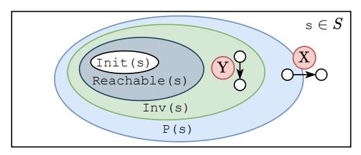

Fig. 16: A Venn diagram motivating inductive invariants. Non-reachable states can leave the P(s) set by transitioning (X), so a strengthening Inv(s) is constructed such that any transition of a state in Inv(s) (Y) remains in Inv(s).

Given a state machine and a property P(s), induction requires us to prove two things: a) that the initial state satisfies P(s), and b) that all transitions preserve P(s). This proves that P(s) is maintained throughout the execution.

Formally, the second obligation is  $P(s) \land Next(s, s') \Longrightarrow P(s')$ ), i.e., if we are in a state satisfying P, any transition from that state should lead to another state that satisfies P. Alas, this proposition simply does not hold for most systems.

To understand why, consider Figure 16's Venn diagram. The outer rectangle represents all possible states in the system, including states not reachable by the state machine. The outer circle represents P(s); i.e., all states s for which P holds. It is possible that a transition like  $\widehat{\mathbf{X}}$  exists, such that the above implication is violated. This *does not* mean that our system is incorrect, as  $\widehat{\mathbf{X}}$  originates in an unreachable state and is thus a spurious counterexample. But it *does* mean we cannot directly use P in our inductive proof.

Instead, we use an *inductive invariant* (Inv(s)) in Figure 16), a strengthening of P(s) (i.e.,  $Inv(s) \Longrightarrow P(s)$ ) which is always preserved under Next (as exemplified by Y). Our proof obligation is then to show that  $Inv(s) \land Next(s,s') \Longrightarrow Inv(s')$  and  $Init(s) \Longrightarrow Inv(s)$ . This ensures that P(s) holds throughout the execution, because  $Inv(s) \Longrightarrow P(s)$ . Finding an inductive invariant for a system is a key challenge when verifying a system inductively [36, 50, 70].

#### B. Intermediate State Machine

We wish to demonstrate via induction that each axiom in our MCM holds for all executions. However, recall that axioms are properties of execution graphs, meaning they hold for a full execution of a program. In contrast, our operational model is a transition system that incrementally builds the execution with each transition. Inductive proofs (§VII-A) require a property to hold during these intermittent stages as well. Thus, we first need a notion of a partial execution graph which represents the execution graph of a program that has not yet completed running. To that end, we first build an intermediate state machine (henceforth ISM for short) that is much simpler than the operational model in §VI. The state of this ISM includes a partial execution graph for a program, and its transitions represent how running a program updates this graph. We then require that each axiom, when strengthened with an inductive invariant (§VII-A), is true for the partial graph at Init(s), and is preserved by Next's additions to these partial graphs.


Fig. 17: Two formulations of an axiom restricting the number of M<sup>s</sup> and M<sup>e</sup> events in an execution graph. While both are true about full executions of our operational model, Axiom1 is not provable using induction, because there are transitions from reachable states (e.g., s0 → s1) where Axiom1 temporarily fails to hold. Axiom2 (MeInt in our MCM), phrased in a prefix-closed manner, avoids this issue by ensuring that the axiom holds for all reachable partial executions as well.

# *C. Using Prefix-Closure To Ensure Provable Axioms*

A key potential pitfall with this inductive approach is that certain axioms can be true about the final, *full* execution graph, but fail to hold for partial graphs along the way. For example, an axiom we originally added to our model expressed the property that for each M<sup>s</sup> node in the graph, there was a corresponding M<sup>e</sup> that belonged to the same thread. An axiom like this was needed to outlaw *full* executions where there were more M<sup>s</sup> events than M<sup>e</sup> events; such executions are impossible, as an OnMiss requires both an M<sup>s</sup> and an Me.

Figure 17 illustrates why this axiom (Axiom1) cannot be verified *despite being true*. Consider the transition which adds an M<sup>s</sup> to the ISM's partial execution graph, representing an OnMiss starting in the engine. As this callback has not completed, its associated M<sup>e</sup> has not yet been added. As such, while Axiom1 is valid for full executions, it *cannot be proven* by standard induction as it fails to hold for a partial execution graph after a transition from a reachable state (s0 → s1).

To remedy this, a key feature of the axiom set we design in §IV is that each axiom is prefix-closed: that is, if it holds for the full execution, it will hold for all partial executions along its construction (its *prefixes*) 2 . This property has a remarkable consequence for inductive verification: if an axiom is prefixclosed and true about the system, *one can always find an inductive invariant to prove it*. For our system, we changed Axiom1 to Axiom2, which states that for every pair of Ms, there exists an M<sup>e</sup> in between them (MeInt in Figure 6). This accomplishes the same goal, but is also true when an OnMiss is partially complete, and thus can be verified inductively.

Prior work [25, 47] has used prefix-closure for its axiom sets to ensure that its construction of partial execution graphs starts and remains consistent as it produces a complete execution trace. We leverage this same property in a new way: to ensure axioms about our system, when true about full executions, are always provable on a state machine representation of the hardware using inductive verification. This approach can be applied for general proofs of hardware correctness against prefix-closed MCM axioms. As such, future designers of MCMs should strive for axioms that respect this property to unlock this method of MCM verification.

# *D. Proof Architecture: Dividing the Proof Obligation*

Figure 18 illustrates the two forms of reasoning in our endto-end proof. First, one must reason ( I ) about the ISM itself (§VII-B) to determine if it satisfies the axiom we are verifying using induction (§VII-A). Second, one must connect ( R ) the ISM with the operational model to ensure that the ISM is a faithful representation of the hardware.

Previous work has separated these two forms of reasoning by introducing an intermediate state machine that builds partial execution graphs [5, 25, 47, 64], and demonstrating that the axioms hold for each generated partial execution. Some of these works [5] performed a machine-checked proof of I by showing that the ISM produces exactly the set of all axiomatically consistent outcomes. However, the proof that the executions of the operational model correspond to those of the ISM ( R ) was done by hand, an error-prone approach that has historically missed bugs [28, 41, 65].

In contrast, we machine-check both parts, constructing an *end-to-end* machine-checked proof of axiomatic consistency. The feasibility of machine-checking the entire proof is facilitated by the decoupling of concerns that allows the two proofs to focus on different aspects of correctness in a modular way: the refinement proof (§VII-E) focuses solely on abstracting away the internals of data movement through layers of the caches and the engine running in the operational model, while the proof of axiomatic consistency only reasons about how adding events to the execution graph changes its structure.

# *E. Connecting the ISM and Operational Model via Refinement*

The goal of the refinement proof is to demonstrate that any execution trace of the operational model (§VI) corresponds to an ISM execution trace that produces partial execution graphs.

What complicates this is the detail in the operational model: most transitions do not update the execution graph but still meaningfully impact the state for transitions that do. Figure 18 shows this disconnect in an execution snippet of Figure 4a's program. While the operational model performs four transitions (s1 → s5), only two of them (ending an OnWB (s1 → s2) and starting an OnMiss (s4 → s5)) update the execution graph. In contrast, when the L3 sends an OnMiss request to the Network (s2 → s3) and the Engine receives it (s3 → s4), the graph is not updated (as our MCM is at ISA level and does not model unnecessary hardware details).

However, these *internal steps* are still pivotal to correctness: when the Engine later starts an OnMiss (s4 → s5), the address for which it runs and the cache line it populates are

<sup>2</sup>Prefix-closure in the literature is typically defined with respect to a commitment order: our commitment order respects cbo, meaning we never add callback events to the graph in an order that violates cbo.

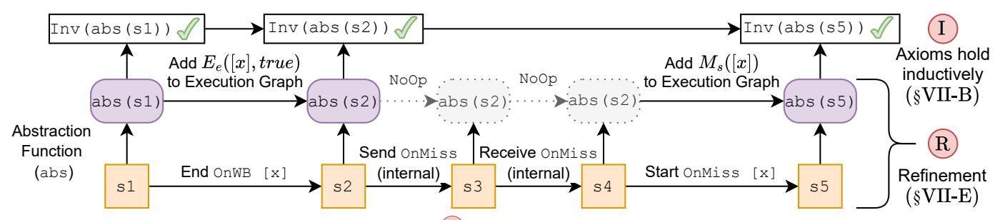

Fig. 18: The two components of our soundness proof. (\$VII-E) The refinement proof (\$VII-E) proves that each operational model execution (e.g.,  $s1 \to s5$ ), abstracted at each state, maps to an intermediate state machine execution (e.g.,  $abs(s1) \to abs(s5)$ ). Operational model transitions either add nodes to the partial execution graph (e.g.,  $s1 \to s2$ ) or are internal steps that abstract up to NoOps (e.g.,  $s2 \to s3$ ). (\$VII-B).

determined by the message it receives from the Network, which in turn is determined by the previous internal steps.

Figure 18 shows how refinement reasons about correctness in the presence of internal steps. We first define an abstraction function abs that, for any s of the täkō operational model produces an equivalent state in the ISM. Then we show via induction that for any transition  $s \to s'$  of the operational model,  $abs(s) \to abs(s')$  is either a valid ISM transition (e.g.,  $s1 \to s2$ ), or makes no change to the graph (e.g.,  $s2 \to s3$ ).

As we prove refinement through induction, this involves proving an inductive invariant which shows that the added complexity of caches and Network communication does not change the underlying behavior of the system.

Our proof assumes certain basic properties about our coherence protocol to avoid having to prove coherence in addition to correspondence between our täkō implementation model and our ISA-level MCM. We do so because the coherence protocol we use is well-studied and is known to provide coherence [46, 48]. Additionally, the coherence protocol in a täkō system is tangential to täkō's novel features: after phantom data is received from the engine and populates an entry in the directory-level cache, the data is indistinguishable from data fetched from memory to the coherence protocol.

We explicitly model all protocol transient states and their interaction with täkō, thus verifying any coherence-consistency interface [40] issues that might arise. For example, we verify that the dirty bit at directory level is accurately preserved by the coherence protocol, to ensure that OnEvict and OnWB are invoked appropriately. Even assuming coherence, our proof still required adding 119 clauses to our inductive invariant and 61K LoC of proof annotations.

# VIII. RELATED WORK

**High-Level Language (HLL) and ISA MCMs:** There is a long line of work that models various ISA and HLL MCMs [2, 3, 5, 9, 34, 37, 42, 49, 52, 53]. Prior work on such models highlighted prefix-closure as a useful property [25, 47]. There have been a few papers on MCMs and coherence for novel hardware [6, 58, 68], but more research in this area is needed.

Hardware Models and Proofs: There has also been much work on formally modeling hardware designs using a variety of representations [10, 11, 33, 35, 57, 64, 68]. Work on formal

verification of hardware implementations includes bounded proofs [33, 35, 39, 40, 69] and complete (all-program) [10, 11, 30, 38, 62, 64] proofs. Some prior hardware verification work uses an intermediate state machine to decompose the proof [5, 64]. However, none of these prior decomposed proofs are completely machine-checked like ours. Refinement has been used to verify hardware [10, 11, 30] as well as distributed and operating systems [15, 17, 18, 23, 26, 32, 66]. Pensieve [67] uses uninterpreted functions to overapproximate microarchitectural security behavior, similar to how we overapproximate cache behavior using environmental transitions (§VI-D). Our environmental transitions are inspired by Wickerson et al. [64].

**Programmable Memory Hierarchies:** Programmable memory hierarchies give software greater control over data movement through the memory hierarchy [27, 43, 44, 54, 55], and can improve performance and energy efficiency.

# IX. CONCLUSION

We develop a MCM for the täkō PMH, enabling programmers to reason about täkō programs without understanding täkō's implementation details. We also construct a microarchitectural täkō model that is parameterized over prefetching policies, cache replacement policies, and network-onchip specifics. This model enables architects to change these features in their täkō design to improve performance without compromising correctness. Finally, we prove our MCM sound against our microarchitectural model across all programs, thus verifying that our MCM accurately represents täkō.

Our formalization also discovers two more general insights. First, when creating an ISA-level MCM, ensuring prefix-closure for its axioms makes the MCM amenable to inductive correctness proofs. Second, microarchitectural models should (and *can*) serve the needs of both architects and formal methods experts, as our microarchitectural model of täkō does.

#### ACKNOWLEDGMENTS

We thank the anonymous reviewers and our shepherd for their helpful feedback. We thank Brian Schwedock and Nathan Beckmann for clarifying certain täkō implementation details. This work was supported in part by National Science Foundation grant CCF-2318954. GitHub Copilot was used for mundane code autocomplete and generation (e.g., find &

replace) in our Dafny proofs. (We handwrote the vast majority of our proofs.)

# ARTIFACT APPENDIX

# *A. Abstract*

This artifact contains two major components:

- 1) A Dafny end-to-end machine checked proof of axiomatic consistency for a state machine representation of the tak¨ o¯ hardware (§VII), which can be explicitly verified.
- 2) An Alloy encoding of the axioms (Figure 6) along with the tak¨ o litmus tests presented in the paper, which can ¯ be run to confirm the results presented in the paper are consistent with our axioms.

# *B. Artifact check-list (meta-information)*

- Run-time environment: Tested on Windows 11 Enterprise 23H2, with Dafny 4.11.0 and Alloy 6.2.0. Dafny on Windows requires .NET installation. Alloy requires Java (JVM 17+, tested with JVM 24.0.1).
- Hardware: Tested on 12th Gen Intel(R) Core i7-1280P Windows Laptop with 32 GB RAM.
- Metrics: Machine-Checked Proof Verification; confirming Litmus Test outcomes for Axiomatic Model.
- Output: Scripts will output results to the console. Dafny proof expected result: verification script succeeds. Alloy model expected result: Alloy execution matches expected result printed by script.
- Experiments: Experiment setup and listing included in README file.
- How much disk space required (approximately)?: With a Dafny installation and Alloy Installation, the full repository size is ∼180 MB.
- How much time is needed to prepare workflow (approximately)?: Around 15 minutes. (installing Dafny + Alloy, Java and potentially .NET).
- How much time is needed to complete experiments (approximately)?: Around 1.5 hours.
- Publicly available?: Yes, on GitHub.
- Code licenses (if publicly available)?: MIT License (included in repository).
- Workflow automation framework used?: Bash Scripts.
- Archived (provide DOI)?: Version 1.1.1 uploaded to https://doi.org/10.5281/zenodo.19444275

# *C. Description*

- *1) How to access:* The artifact can be cloned from the GitHub Repository at https://github.com/GenericMonkey/takoFormal. The following instructions are all found in the README of this repository as well.
- *2) Hardware dependencies:* The submitted artifact has been tested on an 12th Gen Intel(R) Core(TM) i7-1280P Windows Laptop (32 GB RAM) running Windows 11 Enterprise 23H2. The tools are available for other operating systems and the results should be portable, but there are known brittleness issues with Dafny in particular across different systems. If the scripts are used on a different architecture and certain proofs timeout or face internal errors, please contact.

*3) Software dependencies:* Installations of Dafny 4.11.0 and Alloy 6.2.0 are required to run the verification scripts. The README contains detailed instructions and links for installation instructions.

# *D. Installation*

Other than software dependencies mentioned above, no installation is necessary. The files in the repository can be verified using the included bash scripts.

# *E. Evaluation and expected results*

The two provided scripts correspond to the 2 components of the artifact. Running the run\_alloy\_tests.sh script will iterate through the litmus tests in the repository and confirm the expected outcomes claimed for these tests in the paper. A full table of these is included below, as well as in the README.

| Figure                        | Claimed Result                               | File (.als)   |  |
|-------------------------------|----------------------------------------------|---------------|--|
| Figure 4a                     | r1 = 2, r2 = 0<br>forbidden                  | test_paper_ex |  |
| Figure 5a                     | r1 = 1, r2 = 0<br>allowed (§V-A)             | test_mp       |  |
| Figure 9a<br>(w/o OnMiss)     | r1 = 1, r2 = 0<br>forbidden                  | test_mp_rmw   |  |
| Figure 9a<br>(w/ OnMiss)      | r1 = 1, r2 = 0<br>forbidden                  | test_mp_rmwcb |  |
| Figure 10a                    | r1 = 0, r2 = 0<br>allowed                    | test_icb_sb   |  |
| Figure 11a<br>(w/o i2))       | racy                                         | test_wbrace   |  |
| Figure 11a<br>(w/ i2))        | a) no race<br>b) r1 = 0<br>forbidden         | test_wbflush  |  |
| Figure 12a<br>(w/ OnWB<br>1)) | racy                                         | test_phir     |  |
| Figure 12a<br>(w/ OnWB<br>2)) | a) no race<br>b) r1 = 0, r2 = 0<br>forbidden | test_phinr    |  |
| Figure 13a<br>(w/o i9))       | racy                                         | test_hatsr    |  |
| Figure 13a<br>(w/ i9))        | a) no race<br>b) r1 ̸= r2<br>forbidden       | test_hatsnr   |  |

Running the run\_dafny\_verification.sh script will verify all the Dafny files that make up the end-to-end proof discussed in §VII. The translation of each axiom presented in Figure 6 to its corresponding file is included in the README.

# *F. Methodology*

Submission, reviewing and badging methodology:

- https://www.acm.org/publications/policies/ artifact-review-and-badging-current
- https://cTuning.org/ae

# REFERENCES

- [1] S. Adve and K. Gharachorloo, "Shared memory consistency models: A tutorial," *IEEE Computer*, vol. 29, no. 12, pp. 66–76, 1996.
- [2] S. V. Adve and M. D. Hill, "Weak ordering—a new definition," in *Proceedings of the 17th Annual International Symposium on Computer Architecture*, ser. ISCA '90. New York, NY, USA: Association for Computing Machinery, 1990, p. 2–14. [Online]. Available: https://doi.org/10.1145/325164.325100
- [3] J. Alglave, M. Batty, A. F. Donaldson, G. Gopalakrishnan, J. Ketema, D. Poetzl, T. Sorensen, and J. Wickerson, "GPU Concurrency: Weak Behaviours and Programming Assumptions," in *Proceedings of the Twentieth International Conference on Architectural Support for Programming Languages and Operating Systems*. Istanbul Turkey: ACM, Mar. 2015, pp. 577–591. [Online]. Available: https: //dl.acm.org/doi/10.1145/2694344.2694391
- [4] J. Alglave, L. Maranget, S. Sarkar, and P. Sewell, "Fences in Weak Memory Models," in *Computer Aided Verification*, D. Hutchison, T. Kanade, J. Kittler, J. M. Kleinberg, F. Mattern, J. C. Mitchell, M. Naor, O. Nierstrasz, C. Pandu Rangan, B. Steffen, M. Sudan, D. Terzopoulos, D. Tygar, M. Y. Vardi, G. Weikum, T. Touili, B. Cook, and P. Jackson, Eds. Berlin, Heidelberg: Springer Berlin Heidelberg, 2010, vol. 6174, pp. 258–272, series Title: Lecture Notes in Computer Science. [Online]. Available: http: //link.springer.com/10.1007/978-3-642-14295-6 25
- [5] J. Alglave, L. Maranget, and M. Tautschnig, "Herding Cats: Modelling, Simulation, Testing, and Data Mining for Weak Memory," *ACM Transactions on Programming Languages and Systems*, vol. 36, no. 2, pp. 7:1–7:74, Jul. 2014. [Online]. Available: https://doi.org/10.1145/ 2627752
- [6] G. Ambal, B. Dongol, H. Eran, V. Klimis, O. Lahav, and A. Raad, "Semantics of Remote Direct Memory Access: Operational and Declarative Models of RDMA on TSO Architectures," *Proc. ACM Program. Lang.*, vol. 8, no. OOPSLA2, pp. 341:1982–341:2009, Oct. 2024. [Online]. Available: https://dl.acm.org/doi/10.1145/3689781
- [7] ARM, "Cortex-A9 MPCore Programmer Advice Notice Read-after-Read Hazards," ARM, Arm Reference 761319, 2011. [Online]. Available: https://developer.arm.com/documentation/uan0004/a/
- [8] M. Batty, A. F. Donaldson, and J. Wickerson, "Overhauling SC Atomics in C11 and OpenCL," in *Proceedings of the 43rd Annual ACM SIGPLAN-SIGACT Symposium on Principles of Programming Languages*, Jan. 2016, pp. 634–648, arXiv:1503.07073 [cs]. [Online]. Available: http://arxiv.org/abs/1503.07073
- [9] M. Batty, S. Owens, S. Sarkar, P. Sewell, and T. Weber, "Mathematizing C++ concurrency," in *Proceedings of the 38th annual ACM SIGPLAN-SIGACT symposium on Principles of programming languages*, ser. POPL '11. New York, NY, USA: Association for Computing Machinery, Jan. 2011, pp. 55–66. [Online]. Available: https://doi.org/ 10.1145/1926385.1926394
- [10] J. R. Burch and D. L. Dill, "Automatic verification of Pipelined Microprocessor Control," in *Proceedings of the 6th International Conference on Computer Aided Verification*, ser. CAV '94. Berlin, Heidelberg: Springer-Verlag, Jun. 1994, pp. 68–80.
- [11] J. Choi, M. Vijayaraghavan, B. Sherman, A. Chlipala, and Arvind, "Kami: a platform for high-level parametric hardware specification and its modular verification," *Proceedings of the ACM on Programming Languages*, vol. 1, no. ICFP, pp. 24:1–24:30, Aug. 2017. [Online]. Available: https://doi.org/10.1145/3110268
- [12] L. de Moura and N. Bjørner, "Z3: An Efficient SMT Solver," in *Tools and Algorithms for the Construction and Analysis of Systems*, C. R. Ramakrishnan and J. Rehof, Eds. Berlin, Heidelberg: Springer, 2008, pp. 337–340.
- [13] M. R. Fadiheh, A. Wezel, J. Muller, J. Bormann, S. Ray, J. M. Fung, S. Mitra, D. Stoffel, and W. Kunz, " An Exhaustive Approach to Detecting Transient Execution Side Channels in RTL Designs of Processors ," *IEEE Transactions on Computers*, vol. 72, no. 01, pp. 222–235, Jan. 2023. [Online]. Available: https://doi.ieeecomputersociety.org/10.1109/TC.2022.3152666
- [14] K. Gharachorloo, D. Lenoski, J. Laudon, P. Gibbons, A. Gupta, and J. Hennessy, "Memory consistency and event ordering in scalable shared-memory multiprocessors," in *Proceedings of the 17th Annual International Symposium on Computer Architecture*, ser. ISCA '90. New York, NY, USA: Association for Computing Machinery, 1990, p. 15–26. [Online]. Available: https://doi.org/10.1145/325164.325102

- [15] R. Gu, Z. Shao, H. Chen, X. Wu, J. Kim, V. Sjoberg, and D. Costanzo, ¨ "CertiKOS: an extensible architecture for building certified concurrent OS kernels," in *Proceedings of the 12th USENIX conference on Operating Systems Design and Implementation*, ser. OSDI'16. USA: USENIX Association, Nov. 2016, pp. 653–669.
- [16] S. Gulwani, O. Polozov, and R. Singh, "Program synthesis," *Foundations and Trends® in Programming Languages*, vol. 4, no. 1-2, pp. 1–119, 2017. [Online]. Available: http://dx.doi.org/10.1561/2500000010
- [17] C. Hawblitzel, J. Howell, M. Kapritsos, J. R. Lorch, B. Parno, M. L. Roberts, S. Setty, and B. Zill, "IronFleet: proving practical distributed systems correct," in *Proceedings of the 25th Symposium on Operating Systems Principles*. Monterey California: ACM, Oct. 2015, pp. 1–17. [Online]. Available: https://dl.acm.org/doi/10.1145/2815400.2815428
- [18] C. Hawblitzel, J. Howell, J. R. Lorch, A. Narayan, B. Parno, D. Zhang, and B. Zill, "Ironclad apps: end-to-end security via automated fullsystem verification," in *Proceedings of the 11th USENIX conference on Operating Systems Design and Implementation*, ser. OSDI'14. USA: USENIX Association, Oct. 2014, pp. 165–181.
- [19] M. D. Hill and V. J. Reddi, "Accelerator-level parallelism," *Communications of the ACM*, vol. 64, no. 12, pp. 36–38, Dec. 2021. [Online]. Available: https://dl.acm.org/doi/10.1145/3460970
- [20] M. Horowitz, M. Martonosi, T. C. Mowry, and M. D. Smith, "Informing memory operations: providing memory performance feedback in modern processors," in *Proceedings of the 23rd annual international symposium on Computer architecture*, ser. ISCA '96. New York, NY, USA: Association for Computing Machinery, May 1996, pp. 260–270. [Online]. Available: https://dl.acm.org/doi/10.1145/232973.233000
- [21] D. Jackson, "Alloy: a lightweight object modelling notation," *ACM Trans. Softw. Eng. Methodol.*, vol. 11, no. 2, pp. 256–290, Apr. 2002. [Online]. Available: https://dl.acm.org/doi/10.1145/505145.505149
- [22] N. Jouppi, G. Kurian, S. Li, P. Ma, R. Nagarajan, L. Nai, N. Patil, S. Subramanian, A. Swing, B. Towles, C. Young, X. Zhou, Z. Zhou, and D. A. Patterson, "Tpu v4: An optically reconfigurable supercomputer for machine learning with hardware support for embeddings," in *Proceedings of the 50th Annual International Symposium on Computer Architecture*, ser. ISCA '23. New York, NY, USA: Association for Computing Machinery, 2023. [Online]. Available: https://doi.org/10.1145/3579371.3589350
- [23] G. Klein, T. Sewell, and S. Winwood, "Refinement in the Formal Verification of the seL4 Microkernel," in *Design and Verification of Microprocessor Systems for High-Assurance Applications*, D. S. Hardin, Ed. Boston, MA: Springer US, 2010, pp. 323–339. [Online]. Available: https://doi.org/10.1007/978-1-4419-1539-9 11
- [24] P. Kocher, J. Horn, A. Fogh, D. Genkin, D. Gruss, W. Haas, M. Hamburg, M. Lipp, S. Mangard, T. Prescher, M. Schwarz, and Y. Yarom, "Spectre Attacks: Exploiting Speculative Execution," in *2019 IEEE Symposium on Security and Privacy (SP)*, May 2019, pp. 1–19, iSSN: 2375-1207. [Online]. Available: https: //ieeexplore.ieee.org/document/8835233
- [25] M. Kokologiannakis, O. Lahav, K. Sagonas, and V. Vafeiadis, "Effective stateless model checking for C/C++ concurrency," *Proceedings of the ACM on Programming Languages*, vol. 2, no. POPL, pp. 1–32, Jan. 2018. [Online]. Available: https://dl.acm.org/doi/10.1145/3158105
- [26] B. Kragl and S. Qadeer, "The civl verifier," in *2021 Formal Methods in Computer Aided Design (FMCAD)*, 2021, pp. 143–152.
- [27] J. Kuskin, D. Ofelt, M. Heinrich, J. Heinlein, R. Simoni, K. Gharachorloo, J. Chapin, D. Nakahira, J. Baxter, M. Horowitz, A. Gupta, M. Rosenblum, and J. Hennessy, "The Stanford FLASH multiprocessor," in *Proceedings of 21 International Symposium on Computer Architecture*, Apr. 1994, pp. 302–313. [Online]. Available: https://ieeexplore.ieee.org/abstract/document/288140?casa token= 6LrIkfTALWcAAAAA:pMvOhg3kx7qh dYOzL g GXWtYgGmqGU XJJeGnJah1eq4Wz9M8i28LPSkZXRkdiUiIPWrQw
- [28] O. Lahav, V. Vafeiadis, J. Kang, C.-K. Hur, and D. Dreyer, "Repairing sequential consistency in C/C++11," in *Proceedings of the 38th ACM SIGPLAN Conference on Programming Language Design and Implementation*, ser. PLDI 2017. New York, NY, USA: Association for Computing Machinery, Jun. 2017, pp. 618–632. [Online]. Available: https://doi.org/10.1145/3062341.3062352
- [29] Lamport, "How to Make a Multiprocessor Computer That Correctly Executes Multiprocess Programs," *IEEE Transactions on Computers*, vol. C-28, no. 9, pp. 690–691, Sep. 1979. [Online]. Available: https://ieeexplore.ieee.org/document/1675439

- [30] S. Lau, T. Bourgeat, C. Pit-Claudel, and A. Chlipala, "Specification and verification of strong timing isolation of hardware enclaves," in *Proceedings of the 2024 on ACM SIGSAC Conference on Computer and Communications Security*, ser. CCS '24. New York, NY, USA: Association for Computing Machinery, 2024, p. 1121–1135. [Online]. Available: https://doi.org/10.1145/3658644.3690203
- [31] K. R. M. Leino, "Dafny: An Automatic Program Verifier for Functional Correctness," in *Logic for Programming, Artificial Intelligence, and Reasoning*, E. M. Clarke and A. Voronkov, Eds. Berlin, Heidelberg: Springer Berlin Heidelberg, 2010, vol. 6355, pp. 348–370, series Title: Lecture Notes in Computer Science. [Online]. Available: http://link.springer.com/10.1007/978-3-642-17511-4 20
- [32] J. R. Lorch, Y. Chen, M. Kapritsos, B. Parno, S. Qadeer, U. Sharma, J. R. Wilcox, and X. Zhao, "Armada: low-effort verification of high-performance concurrent programs," in *Proceedings of the 41st ACM SIGPLAN Conference on Programming Language Design and Implementation*, ser. PLDI 2020. New York, NY, USA: Association for Computing Machinery, Jun. 2020, pp. 197–210. [Online]. Available: https://doi.org/10.1145/3385412.3385971
- [33] D. Lustig, M. Pellauer, and M. Martonosi, "PipeCheck: Specifying and Verifying Microarchitectural Enforcement of Memory Consistency Models," in *Proceedings of the 47th Annual IEEE/ACM International Symposium on Microarchitecture*, ser. MICRO-47. USA: IEEE Computer Society, Dec. 2014, pp. 635–646. [Online]. Available: https://dl.acm.org/doi/10.1109/MICRO.2014.38
- [34] D. Lustig, S. Sahasrabuddhe, and O. Giroux, "A Formal Analysis of the NVIDIA PTX Memory Consistency Model," in *Proceedings of the Twenty-Fourth International Conference on Architectural Support for Programming Languages and Operating Systems*, ser. ASPLOS '19. New York, NY, USA: Association for Computing Machinery, Apr. 2019, pp. 257–270. [Online]. Available: https: //dl.acm.org/doi/10.1145/3297858.3304043
- [35] D. Lustig, G. Sethi, M. Martonosi, and A. Bhattacharjee, "COATCheck: Verifying Memory Ordering at the Hardware-OS Interface," in *Proceedings of the Twenty-First International Conference on Architectural Support for Programming Languages and Operating Systems*. Atlanta Georgia USA: ACM, Mar. 2016, pp. 233–247. [Online]. Available: https://dl.acm.org/doi/10.1145/2872362.2872399
- [36] H. Ma, A. Goel, J.-B. Jeannin, M. Kapritsos, B. Kasikci, and K. A. Sakallah, "I4: incremental inference of inductive invariants for verification of distributed protocols," in *Proceedings of the 27th ACM Symposium on Operating Systems Principles*, ser. SOSP '19. New York, NY, USA: Association for Computing Machinery, 2019, p. 370–384. [Online]. Available: https://doi.org/10.1145/3341301.3359651
- [37] S. Mador-Haim, L. Maranget, S. Sarkar, K. Memarian, J. Alglave, S. Owens, R. Alur, M. M. K. Martin, P. Sewell, and D. Williams, "An Axiomatic Memory Model for POWER Multiprocessors," in *Computer Aided Verification*, D. Hutchison, T. Kanade, J. Kittler, J. M. Kleinberg, F. Mattern, J. C. Mitchell, M. Naor, O. Nierstrasz, C. Pandu Rangan, B. Steffen, M. Sudan, D. Terzopoulos, D. Tygar, M. Y. Vardi, G. Weikum, P. Madhusudan, and S. A. Seshia, Eds. Berlin, Heidelberg: Springer Berlin Heidelberg, 2012, vol. 7358, pp. 495–512, series Title: Lecture Notes in Computer Science. [Online]. Available: http://link.springer.com/10.1007/978-3-642-31424-7 36
- [38] Y. A. Manerkar, D. Lustig, M. Martonosi, and A. Gupta, "PipeProof: Automated Memory Consistency Proofs for Microarchitectural Specifications," in *2018 51st Annual IEEE/ACM International Symposium on Microarchitecture (MICRO)*. Fukuoka: IEEE, Oct. 2018, pp. 788–801. [Online]. Available: https://ieeexplore.ieee.org/document/8574586/
- [39] Y. A. Manerkar, D. Lustig, M. Martonosi, and M. Pellauer, "RTLcheck: verifying the memory consistency of RTL designs," in *Proceedings of the 50th Annual IEEE/ACM International Symposium on Microarchitecture*, ser. MICRO-50 '17. New York, NY, USA: Association for Computing Machinery, Oct. 2017, pp. 463–476. [Online]. Available: https://dl.acm.org/doi/10.1145/3123939.3124536
- [40] Y. A. Manerkar, D. Lustig, M. Pellauer, and M. Martonosi, "CCICheck: using µhb graphs to verify the coherence-consistency interface," in *Proceedings of the 48th International Symposium on Microarchitecture*. Waikiki Hawaii: ACM, Dec. 2015, pp. 26–37. [Online]. Available: https://dl.acm.org/doi/10.1145/2830772.2830782
- [41] Y. A. Manerkar, C. Trippel, D. Lustig, M. Pellauer, and M. Martonosi, "Counterexamples and Proof Loophole for the C/C++ to POWER and ARMv7 Trailing-Sync Compiler

- Mappings," Nov. 2016, arXiv:1611.01507 [cs]. [Online]. Available: http://arxiv.org/abs/1611.01507
- [42] J. Manson, W. Pugh, and S. V. Adve, "The Java memory model," in *Proceedings of the 32nd ACM SIGPLAN-SIGACT Symposium on Principles of Programming Languages*, ser. POPL '05. New York, NY, USA: Association for Computing Machinery, 2005, p. 378–391. [Online]. Available: https://doi.org/10.1145/1040305.1040336
- [43] A. Mukkara, N. Beckmann, M. Abeydeera, X. Ma, and D. Sanchez, "Exploiting Locality in Graph Analytics through Hardware-Accelerated Traversal Scheduling," in *2018 51st Annual IEEE/ACM International Symposium on Microarchitecture (MICRO)*, Oct. 2018, pp. 1– 14. [Online]. Available: https://ieeexplore.ieee.org/abstract/document/ 8574527
- [44] A. Mukkara, N. Beckmann, and D. Sanchez, "PHI: Architectural Support for Synchronization- and Bandwidth-Efficient Commutative Scatter Updates," in *Proceedings of the 52nd Annual IEEE/ACM International Symposium on Microarchitecture*, ser. MICRO '52. New York, NY, USA: Association for Computing Machinery, Oct. 2019, pp. 1009–1022. [Online]. Available: https://dl.acm.org/doi/10.1145/3352460.3358254
- [45] V. Nagarajan and R. Gupta, "ECMon: exposing cache events for monitoring," *SIGARCH Comput. Archit. News*, vol. 37, no. 3, pp. 349–360, Jun. 2009. [Online]. Available: https://dl.acm.org/doi/10.1145/ 1555815.1555798
- [46] V. Nagarajan, D. J. Sorin, M. D. Hill, and D. A. Wood, *A Primer on Memory Consistency and Cache Coherence*, ser. Synthesis Lectures on Computer Architecture. Cham: Springer International Publishing, 2020. [Online]. Available: https://link.springer.com/10.1007/ 978-3-031-01764-3
- [47] K. Nienhuis, K. Memarian, and P. Sewell, "An operational semantics for C/C++11 concurrency," in *Proceedings of the 2016 ACM SIGPLAN International Conference on Object-Oriented Programming, Systems, Languages, and Applications*. Amsterdam Netherlands: ACM, Oct. 2016, pp. 111–128. [Online]. Available: https://dl.acm.org/doi/10.1145/ 2983990.2983997
- [48] N. Oswald, V. Nagarajan, and D. J. Sorin, "HieraGen: Automated Generation of Concurrent, Hierarchical Cache Coherence Protocols," in *2020 ACM/IEEE 47th Annual International Symposium on Computer Architecture (ISCA)*. Valencia, Spain: IEEE, May 2020, pp. 888–899. [Online]. Available: https://ieeexplore.ieee.org/document/9138912/
- [49] S. Owens, S. Sarkar, and P. Sewell, "A Better x86 Memory Model: x86-TSO," in *Theorem Proving in Higher Order Logics*, S. Berghofer, T. Nipkow, C. Urban, and M. Wenzel, Eds. Berlin, Heidelberg: Springer Berlin Heidelberg, 2009, vol. 5674, pp. 391–407, series Title: Lecture Notes in Computer Science. [Online]. Available: http://link.springer.com/10.1007/978-3-642-03359-9 27
- [50] O. Padon, K. L. McMillan, A. Panda, M. Sagiv, and S. Shoham, "Ivy: safety verification by interactive generalization," in *Proceedings of the 37th ACM SIGPLAN Conference on Programming Language Design and Implementation*, ser. PLDI '16. New York, NY, USA: Association for Computing Machinery, 2016, p. 614–630. [Online]. Available: https://doi.org/10.1145/2908080.2908118
- [51] R. Peled, D. Kroening, M. Tautschnig, and Y. Vizel, "Large Lemma Miners: Can LLMs do Induction Proofs for Hardware?" Nov. 2025, arXiv:2511.02521 [cs]. [Online]. Available: http://arxiv.org/abs/2511. 02521
- [52] C. Pulte, S. Flur, W. Deacon, J. French, S. Sarkar, and P. Sewell, "Simplifying ARM concurrency: multicopy-atomic axiomatic and operational models for ARMv8," *Proceedings of the ACM on Programming Languages*, vol. 2, no. POPL, pp. 1–29, Jan. 2018. [Online]. Available: https://dl.acm.org/doi/10.1145/3158107
- [53] S. Sarkar, P. Sewell, J. Alglave, L. Maranget, and D. Williams, "Understanding POWER multiprocessors," in *Proceedings of the 32nd ACM SIGPLAN Conference on Programming Language Design and Implementation*, ser. PLDI '11. New York, NY, USA: Association for Computing Machinery, Jun. 2011, pp. 175–186. [Online]. Available: https://doi.org/10.1145/1993498.1993520
- [54] B. C. Schwedock and N. Beckmann, "Leviathan: A Unified System for General-Purpose Near-Data Computing," in *2024 57th IEEE/ACM International Symposium on Microarchitecture (MICRO)*, Nov. 2024, pp. 1278–1294, iSSN: 2379-3155. [Online]. Available: https://ieeexplore.ieee.org/document/10764520
- [55] B. C. Schwedock, P. Yoovidhya, J. Seibert, and N. Beckmann, "tak¨ o:¯ a polymorphic cache hierarchy for general-purpose optimization of data movement," in *Proceedings of the 49th Annual International*

- *Symposium on Computer Architecture*, ser. ISCA '22. New York, NY, USA: Association for Computing Machinery, Jun. 2022, pp. 42–58. [Online]. Available: https://doi.org/10.1145/3470496.3527379
- [56] M. Sheeran, S. Singh, and G. Stalmarck, "Checking Safety Properties ˚ Using Induction and a SAT-Solver," in *Proceedings of the Third International Conference on Formal Methods in Computer-Aided Design*, ser. FMCAD '00. Berlin, Heidelberg: Springer-Verlag, Nov. 2000, pp. 108–125.
- [57] P. Subramanyan, Y. Vizel, S. Ray, and S. Malik, "Template-based synthesis of instruction-level abstractions for SoC verification," in *Proceedings of the 15th Conference on Formal Methods in Computer-Aided Design*, ser. FMCAD '15. Austin, Texas: FMCAD Inc, Sep. 2015, pp. 160–167.
- [58] C. Tan, A. F. Donaldson, and J. Wickerson, "Formalising CXL Cache Coherence," in *Proceedings of the 30th ACM International Conference on Architectural Support for Programming Languages and Operating Systems, Volume 2*. New York, NY, USA: Association for Computing Machinery, Mar. 2025, pp. 437–450. [Online]. Available: https://doi.org/10.1145/3676641.3715999
- [59] A. Tarski, "On the calculus of relations," *Journal of Symbolic Logic*, vol. 6, no. 3, pp. 73–89, Sep. 1941. [Online]. Available: https://www.cambridge.org/core/product/identifier/ S0022481200106528/type/journal article
- [60] C. Trippel, Y. A. Manerkar, D. Lustig, M. Pellauer, and M. Martonosi, "TriCheck: Memory Model Verification at the Trisection of Software, Hardware, and ISA," in *Proceedings of the Twenty-Second International Conference on Architectural Support for Programming Languages and Operating Systems*. Xi'an China: ACM, Apr. 2017, pp. 119–133. [Online]. Available: https://dl.acm.org/doi/10.1145/3037697.3037719
- [61] M. van der Hagen and B. Lucia, "Client-optimized algorithms and acceleration for encrypted compute offloading," in *Proceedings of the 27th ACM International Conference on Architectural Support for Programming Languages and Operating Systems*, ser. ASPLOS '22. New York, NY, USA: Association for Computing Machinery, Feb. 2022, pp. 683–696. [Online]. Available: https://dl.acm.org/doi/10.1145/ 3503222.3507737
- [62] M. Vijayaraghavan, A. Chlipala, Arvind, and N. Dave, "Modular deductive verification of multiprocessor hardware designs," in *Computer Aided Verification*, D. Kroening and C. S. Pas˘ areanu, Eds. Cham: Springer ˘ International Publishing, 2015, pp. 109–127.
- [63] Z. Wang, G. Mohr, K. von Gleissenthall, J. Reineke, and M. Guarnieri, "Specification and Verification of Side-channel Security for Opensource Processors via Leakage Contracts," in *Proceedings of the 2023 ACM SIGSAC Conference on Computer and Communications Security*, ser. CCS '23. New York, NY, USA: Association for Computing Machinery, Nov. 2023, pp. 2128–2142. [Online]. Available: https://dl.acm.org/doi/10.1145/3576915.3623192
- [64] J. Wickerson, M. Batty, B. M. Beckmann, and A. F. Donaldson, "Remote-scope promotion: clarified, rectified, and verified," *SIGPLAN Not.*, vol. 50, no. 10, pp. 731–747, Oct. 2015. [Online]. Available: https://doi.org/10.1145/2858965.2814283
- [65] J. Wickerson, M. Batty, T. Sorensen, and G. A. Constantinides, "Automatically comparing memory consistency models," in *Proceedings of the 44th ACM SIGPLAN Symposium on Principles of Programming Languages*, ser. POPL '17. New York, NY, USA: Association for Computing Machinery, Jan. 2017, pp. 190–204. [Online]. Available: https://doi.org/10.1145/3009837.3009838
- [66] J. R. Wilcox, D. Woos, P. Panchekha, Z. Tatlock, X. Wang, M. D. Ernst, and T. Anderson, "Verdi: a framework for implementing and formally verifying distributed systems," in *Proceedings of the 36th ACM SIGPLAN Conference on Programming Language Design and Implementation*, ser. PLDI '15. New York, NY, USA: Association for Computing Machinery, Jun. 2015, pp. 357–368. [Online]. Available: https://dl.acm.org/doi/10.1145/2737924.2737958
- [67] Y. Yang, T. Bourgeat, S. Lau, and M. Yan, "Pensieve: Microarchitectural Modeling for Security Evaluation," in *Proceedings of the 50th Annual International Symposium on Computer Architecture*, ser. ISCA '23. New York, NY, USA: Association for Computing Machinery, Jun. 2023, pp. 1–15. [Online]. Available: https://dl.acm.org/doi/10.1145/ 3579371.3589094
- [68] H. Zhang, C. Trippel, Y. A. Manerkar, A. Gupta, M. Martonosi, and S. Malik, "ILA-MCM: Integrating Memory Consistency Models with Instruction-Level Abstractions for Heterogeneous System-on-Chip Verification," in *2018 Formal Methods in Computer Aided Design*

- *(FMCAD)*. Austin, TX, USA: IEEE, Oct. 2018, pp. 1–10. [Online]. Available: https://ieeexplore.ieee.org/document/8603015/
- [69] R. Zhang, C. Deutschbein, P. Huang, and C. Sturton, "End-to-end automated exploit generation for validating the security of processor designs," in *2018 51st Annual IEEE/ACM International Symposium on Microarchitecture (MICRO)*, 2018, pp. 815–827.
- [70] T. N. Zhang, K. Singh, T. Chajed, M. Kapritsos, and B. Parno, "Basilisk: using provenance invariants to automate proofs of undecidable protocols," in *Proceedings of the 19th USENIX Conference on Operating Systems Design and Implementation*, ser. OSDI '25. USA: USENIX Association, 2025.