# æSIP: µArch-aware ASIP-ISA Co-Design via Program Synthesis, Equality Saturation, and External Don't Cares

Haoran "Allen" Jin ®\*†, Jirong Yang\*®, Barry Lyu®, Ruijie "Jerry" Gao®, Nathan Bleier® Department of Electrical Engineering and Computer Science
University of Michigan, Ann Arbor, MI, USA
\*Equal contribution. †Corresponding author: allenjin@umich.edu

Abstract—An increasing number of applications, including implantables, IoT devices, and printed electronics, impose stringent power and area constraints. With the end of Dennard scaling, Application Specific Instruction Processors (ASIPs) have emerged as a promising solution, reducing power consumption and silicon area by sacrificing generality compared to general-purpose processors. However, existing approaches predominantly optimize hardware through software profiling, potentially overlooking optimization opportunities through software rewriting. We propose æSIP, a hardware-software co-optimization framework for efficient ASIP design. Our framework leverages e-graph data structures to explore semantically equivalent software implementations through rewriting rules derived from program synthesis. We employ a divide-and-conquer approach that performs local saturation at basic-block granularity followed by Integer Linear Programming (ILP)-based global extraction at whole-program scope, enabling scalability to real-world applications. We develop a don't care-based hardware optimizer that automatically generates ASIP designs for each equivalent program variant, enabling agile design space exploration. We further incorporate a constraint-based sharing algorithm that clusters applications with similar characteristics and limits the number of ASIP variants, thereby enabling efficient reuse across workloads and balancing area/power efficiency with NRE cost.

To our knowledge, this represents the first systematic hardware—software co-design framework for agile multi-objective ASIP development. Experimental evaluation on widely used embedded benchmark suites, MiBench and Embench, demonstrates geometric mean area reduction of 17.0% and power savings of 12.3% compared to state-of-the-art ASIP generators. When energy is the optimization objective, æSIP achieves geometric mean energy reductions of 4.1% (CMOS 130 nm) and 6.3% (Inkjet Printed Electronics process). Furthermore, æSIP enables generalization across diverse workloads while preserving specialization. Our trade-off analysis shows that with only five shared ASIPs, æSIP achieves a 17.3% area reduction with 11.9% latency overhead, compared to 22.4% area reduction and 15.1% latency overhead under full per-application specialization.

## I. INTRODUCTION

The proliferation of embedded systems has intensified the demand for energy-efficient, area-constrained processing solutions. While energy is undeniably critical, area and power remain the binding constraints in many applications, with latency requirements varying across use cases.

**Printed and flexible electronics** fabricate transistors on plastic or paper substrates at feature sizes of  $1-10\,\mu\mathrm{m}$ , yielding transistor budgets two to three orders of magnitude below

TABLE I
DESIGN CONSTRAINT PROFILES FOR EMERGING EMBEDDED DOMAINS
TARGETED BY &SIP.  $\blacksquare$  = PRIMARY,  $\blacksquare$  = VARIES,  $\bigcirc$  = RELAXED.

| Domain                      | Power | Area | Energy | Latency |
|-----------------------------|-------|------|--------|---------|
| Printed / Flexible IC       | 0     | •    | 0      |         |
| Cryogenic Quantum Ctrl      | •     | •    | 0      | •       |
| Active RFID / IoT           | •     | 0    | •      | 0       |
| Implantable / Health Care   | •     | •    | •      | •       |
| Wearables                   | •     | Ö    | •      | Ō       |
| General Embedded (baseline) | •     | •    | •      | •       |

silicon [12], [13], [49]. Every eliminated gate directly reduces material cost, and defect exposure – the dominant yield limiter for large-area flexible circuits. Classical control logic in cryogenic quantum systems faces tight power and area budgets. Dilution refrigerators provide only microwatts of cooling at the millikelvin stage [9]. Current superconducting fabrication processes support limited Josephson junctions per chip [65], [74], making every gate a scarce resource. Active RFID tags harvest ambient RF energy, making power draw (not throughput) the factor that determines whether the device operates at all. Implantable neural interfaces are similarly limited: thermal dissipation in brain tissue must stay below approximately 40 mW/cm² to prevent tissue damage [4], and device volume is dictated by the implantation site.

In these resource-constrained settings, general-purpose processors are increasingly untenable. This has driven growing interest in application-specific instruction-set processors (ASIPs), which trade full generality for domain-tailored ISA and microarchitectures: depending on the target, specialization may aim to reduce area and energy, lower latency, or even accept modest resource overheads in exchange for critical domain-specific functionality [33], [38].

Historically, ASIP design has followed an additive methodology, augmenting base instruction sets with customized extensions to improve performance [8], [31], [46], [76]. While this approach successfully addresses computational requirements, it fundamentally fails to reduce area and power consumption—adding instructions inevitably yields larger, not smaller, processor cores. This represents a critical missed opportunity: empirical studies of real-world workloads consistently demon-

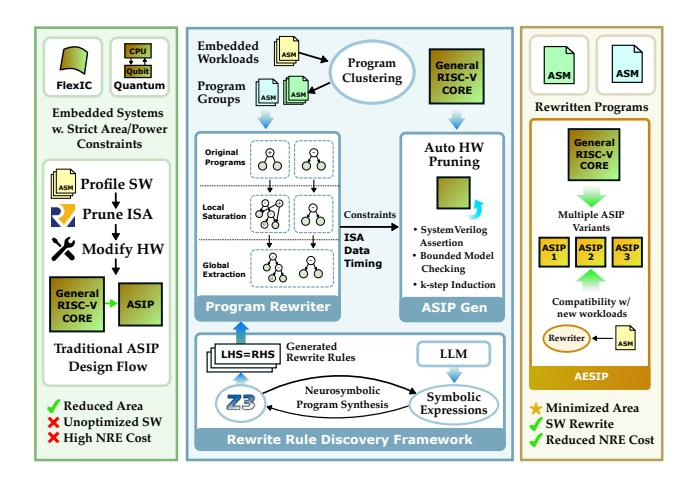

Fig. 1. æSIP: an agile hardware-software co-design framework. Traditional ASIP [59] design profiles target applications and designs specialized hardware. Despite its performance benefits, it falls short for embedded systems with strict area/power constraints. Reduced Instruction Set Processors (RISPs) address this by pruning unused hardware according to actual instruction usage. æSIP enhances this approach through hardware-aware program rewriting, combining neurosymbolic-based program synthesis, divide-and-conquer equality saturation, and external don't care-based hardware pruning.

strate that most applications utilize only a small subset of available ISA instructions [11], [58], suggesting that significant hardware resources in general-purpose processors remain unused and could be eliminated without affecting its correctness.

This insight has catalyzed the development of Reduced-Instruction Set Processorss (RISPs), designed through subtractive processes — removing ISA instructions rather than adding them — which enables systematically removing unused hardware [58]. Bespoke microprocessors [22] demonstrated that processors can be optimized to support only a single application through automated hardware removal. PDAG [11] generalized this approach to support arbitrary ISA and microarchitecture combinations using Linear Temporal Logic (LTL) model checking to identify and eliminate unused structures. RISSP [58] applied similar principles specifically to RISC-V subsets, though constrained to a particular singlecycle microarchitecture. FSYN [34] ported PDAG to an opensource toolchain. Complementary approaches have explored approximate computing through Application Specific Approximate Behavioral Processors [67], extended symbolic execution frameworks as follow-up to Bespoke [66], applied PDAG-like structural subsetting to accelerators [81], and developed formal CPU profiling methods for embedded processors [70].

However, existing approaches share fundamental limitations that constrain their practical applicability and optimization potential [11], [22], [34], [58], [66], [67], [70], [81]. First, current approaches derive ISA constraints by profiling target applications, yet the compilers generating these applications remain unaware of opportunities to reduce instruction usage for additional area savings. Second, existing constraints are coarse-grained and microarchitecture-agnostic. Most works

rely solely on ISA-level constraints, overlooking optimization opportunities inherent in application-specific data patterns and timing constraints. Third, most works inadequately address the trade-off between specialization and generalization. While extreme specialization yields substantial area and power benefits, minimal generalization results in high Non-Recurring Engineering (NRE) costs and severely limits future software upgrade capabilities.

To address the aforementioned challenge, we propose &SIP, a hardware-software (ASIP-ISA) co-design framework that aims at efficient and effective automatic ASIP generation as shown in Figure 1. &SIP is an end-to-end framework that accepts target applications, a baseline general-purpose processor, and latency constraints as inputs, producing an optimized ASIP and verifiably equivalent rewritten programs.

æSIP uses program synthesis to automatically discover instruction rewriting rules. These rules are applied via equality saturation: rather than applying rewrites sequentially (where ordering affects the outcome), all rules are applied simultaneously to an e-graph that compactly encodes the full space of equivalent programs.

The equivalent programs are then analyzed to extract microarchitecture-aware constraints, including ISA, data, and timing-level constraints. Using these constraints, the framework efficiently prunes the baseline general-purpose processor to generate the optimized ASIP, leveraging Observability Don't Cares (ODCs)-based optimizations and semiformal verification. Because different rewrite choices yield different area—latency trade-offs, æSIP sweeps the latency constraint to produce a Pareto frontier of design variants, enabling domain-appropriate selection as motivated by Table I.

To explore the trade-off between NRE cost/upgradability and area/power of ASIPs, we develop a clustering-based algorithm to partition applications into sub-ecosystems based on their similarity. Then co-design between ASIP generation and program rewriting at the ecosystem scale enables efficient NRE amortization.

The major research contributions of this paper are as follows:

- We propose æSIP, the first e-graph-based hardwaresoftware co-design framework that not only enables extreme area reduction, but explores pareto trade-offs between area, power, and latency via program rewriting.
- We use neuro-symbolic-based program synthesis to automatically derive rewrite rules for equality saturation.
- We develop a divide-and-conquer rewriting framework that performs local saturation at basic-block granularity and global extraction at whole-program scope, enabling scalability to real-world benchmarks.
- We incorporate previously ignored microarchitectureaware constraints into the ASIP generator.
- We propose an ASIP-ecosystem co-design that reduces NRE cost through ILP-based ASIP allocation across applications, and demonstrate that unseen workloads can be rewritten onto the resulting ISA subsets.

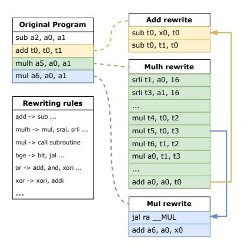

Fig. 2. Hardware-aware program rewriting for ASIP optimization. Instructions such as mul, mulh, and add are replaced with semantically equivalent instruction sequences, reducing instruction diversity and enabling aggressive gate-level pruning for smaller ASIP implementations. Rewrite rule details and stack allocation are omitted here due to space limit.

æSIP is released as an open-source design tool: https://github.com/CrucibleComputingGroup/aesip.git.

#### II. MOTIVATING EXAMPLE

State of the Art (SOTA) ASIP design frameworks [11], [22], [34], [58] profile target applications to gather instruction usage information, which is then translated into ISA-level constraints for pruning unused gates to obtain smaller ASIP designs. However, existing compilers focus on performance optimization rather than reducing instruction usage to reduce chip area. We observe that strategic program rewriting can significantly reduce instruction diversity, thereby enabling more aggressive hardware pruning.

Figure 2 illustrates this opportunity through a concrete example in RV32IM instruction set. The upper-bit multiplication instructions (mulh, mulhu, mulhsu) can each be rewritten as sequences using mul with shifts and accumulations, enabling the safe removal of upper-bit multiplier logic. Furthermore, mul itself can be decomposed into a subroutine consisting solely of additions and shifts, potentially eliminating the entire multiplier unit. The resulting ASIPs, due to different ways of program rewriting, are shown in Figure 3.

While this approach demonstrates clear area benefits, it raises several fundamental challenges:

- Correctness validation: We must systematically derive and verify semantic-preserving rewriting rules.
- Phase ordering problem: The application order of rewrite rules critically affects optimization outcomes. In our example, mulh must be rewritten before mul to achieve complete elimination of multiplication hardware.
- Latency/Area trade-off: Decomposing complex instructions into primitive operations reduces area at the cost of program latency. Different applications impose varying latency constraints that must be respected.
- Scalability: The approach must scale to large, real-world workloads while maintaining tractability. Program rewrit-

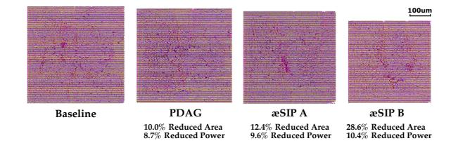

Fig. 3. Place-and-route (PnR) results for ASIPs pruned from the baseline Ibex RISC-V core in 130nm technology. PDAG [11] represents the SOTA RISP design methodology, which profiles target applications and prunes the baseline processor based on ISA constraints. æSIP A and B represent two variants with different program rewriting strategies. More aggressive rewriting achieves greater area/power reduction at the expense of increased latency.

ing may lead to combinatorial explosion, as each rewriting step can potentially introduce additional rewriting opportunities, creating a cascading effect that becomes computationally intractable.

To address these challenges comprehensively, we propose as SIP, an ASIP-ISA co-design framework that combines program synthesis, equality saturation, and external don't-care-based hardware pruning. To the best of our knowledge, this represents the first systematic approach to minimizing ASIP area through hardware-aware program transformation.

#### III. BACKGROUND

#### A. Program Synthesis

Program synthesis systematically searches for semanticspreserving program transformations and is widely used in code super-optimizers [1], [56].

- 1) Symbolic synthesis: Symbolic approaches encode the search problem as logical constraints, typically using SAT/SMT solvers. Existing works like Sketch and Rosette [69], [72] demonstrate how symbolic reasoning enables automated derivation of correct-by-construction transformations. These synthesizers treat the program synthesis problem directly as a search for a constructive proof of a second order existential logic theorem they must prove (by construction) that there exists a program which, for all possible inputs, satisfies the intended semantics. This gives it a complexity of  $\Sigma_3^0$ -complete in the arithmetic hierarchy [40].
- 2) Stochastic and heuristic synthesis: Due to the significant computational overhead of symbolic synthesis, stochastic superoptimizers (e.g., STOKE [64]) explore the program space using Monte Carlo search, or simulated annealing. They trade optimality for scalability and can discover non-obvious rewrites that are difficult for symbolic methods to reach.
- 3) Enumerative synthesis: Enumerative techniques enumerate candidate expressions under a bounded grammar. Although exponential in the worst case, recent pruning and version-space techniques make enumerative synthesis practical for domain-specific instruction-level rewrites [3].

## B. E-Graphs and Equality Saturation

E-graphs provide a compact and canonical representation for large sets of equivalent expressions. Originally developed for automated theorem provers (ATPs) [27], the data structure has recently gained renewed attention with the advent of state-of-the-art open-source equality-saturation frameworks such as egg [79] and egglog [85]. These systems demonstrate that e-graphs are effective across a wide range of compiler and synthesis tasks, including code optimization [20], [84], technology mapping [18], [19], [83], circuit datapath synthesis [24], [25], and arithmetic reasoning [23], [42], [53], [75].

An e-graph consists of *e-nodes* (individual operators) and *e-classes* (sets of equivalent nodes). The overall workflow comprises two phases: saturation and extraction. Given an initial program representation and a rewrite rule set, equality saturation repeatedly applies all applicable rewrite rules to the e-graph. In the subsequent extraction phase, a user-defined cost model is used to select a combination of e-nodes, yielding an optimized program that is semantically equivalent.

#### C. External Don't Care

Don't cares (DCs) [14] are a well-established technique in logic synthesis that allows minimizing logic complexity by exploiting conditions where certain values are irrelevant. Don't cares are typically categorized into Internal Don't Cares [14], [63], which arise from the netlist structure itself, and External Don't Care (EDC) [41], [63]. EDC represent constraints from the user specifications that some input patterns will never appear. They present a unique optimization challenge because they transform the problem from optimizing a completely specified Boolean function to optimizing a Boolean relation, enabling additional gate reductions.

## IV. METHODOLOGY

In this section, we describe the implementation details of as IP, following the order of its workflow as shown in Figure 4.

#### A. Synthesis Based Rewrite Rules Discovery

Manually crafting rewrite rules for each instruction in RV32IM is both tedious and error-prone [43]. To systematically discover rewrite rules that are both correct and effective for gate reduction, we developed a synthesis tool by extending and repurposing Greenthumb [56], a superoptimizer construction framework, as shown in Figure 5. The tool consists of (1) a RISC-V verification engine that checks each instruction sequence for semantic equivalence against the original instruction via SMT solving, and (2) four search algorithms that independently propose candidate sequences.

1) RISC-V Verification Engine: We implement a RISC-V simulator and validator with Greenthumb's data structures to enable formal equivalence checking of candidate rewrites. In RV32IM, the program state is modeled as a tuple of registers and memory, State =  $\mathcal{R} \times \mathcal{M}$ , where  $\mathcal{R} = \{f \mid f : \mathbb{B}^5 \to \mathbb{B}^{32}\}$  and  $\mathcal{M} = \{f \mid f : \mathbb{B}^{32} \to \mathbb{B}^8\}$ ,  $\mathbb{B} = \{0, 1\}$ .

Each instruction defines a transformation on the program state: [inst]: State  $\rightarrow$  State. An instruction sequence can therefore be composed as:

$$[S] = [\inf_n] \circ \cdots \circ [\inf_1].$$

TABLE II
REPRESENTATIVE REWRITING RULES IN ÆSIP

| Original         | Rewritten rules                                                                    | Method |  |  |  |  |  |  |  |
|------------------|------------------------------------------------------------------------------------|--------|--|--|--|--|--|--|--|
| I-type (8 rules) |                                                                                    |        |  |  |  |  |  |  |  |
| xori             | xor rs (addi x0 imm)                                                               | G      |  |  |  |  |  |  |  |
| ori              | or rs (addi x0 imm)                                                                | G      |  |  |  |  |  |  |  |
| andi             | and rs (addi x0 imm)                                                               | G      |  |  |  |  |  |  |  |
| slli             | sll rs (addi x0 imm)                                                               | G      |  |  |  |  |  |  |  |
| srli             | srl rs (addi x0 imm)                                                               | G      |  |  |  |  |  |  |  |
| srai             | sra rs (addi x0 imm)                                                               | G      |  |  |  |  |  |  |  |
|                  | Arithmetic (17 rules)                                                              |        |  |  |  |  |  |  |  |
| or               | xor (xor rs1 rs2) (and rs1 rs2)                                                    | G      |  |  |  |  |  |  |  |
| add              | sub rs2 (sub x0 rs1)                                                               | G      |  |  |  |  |  |  |  |
| and              | sub rs1 (sub (or rs1 rs2) rs2)                                                     | G      |  |  |  |  |  |  |  |
| xor              | sub (or rs1 rs2) (and rs1 rs2)                                                     | G      |  |  |  |  |  |  |  |
|                  | Branch (14 rules)                                                                  |        |  |  |  |  |  |  |  |
| blt              | seq (bge rs1 rs2 +8) (jal tag)                                                     | L      |  |  |  |  |  |  |  |
| jal              | beq a a tag                                                                        | L      |  |  |  |  |  |  |  |
|                  | Mult/Div (8 rules)                                                                 |        |  |  |  |  |  |  |  |
| mul              | callmul sequence using <add addi="" andi="" beq<="" td=""><td>L</td></add>         | L      |  |  |  |  |  |  |  |
|                  | srli slli bne jalr>                                                                |        |  |  |  |  |  |  |  |
| mulh             | mul sequence using <lui add="" addi="" and="" mul="" srai="" srli="" sub=""></lui> | L      |  |  |  |  |  |  |  |
| div              | calldiv sequence using <blt beg="" bgeu<="" bne="" td=""><td>L</td></blt>          | L      |  |  |  |  |  |  |  |
| uiv              | bge bltu addi slli sub or auipc jalr>                                              | L      |  |  |  |  |  |  |  |
|                  | Ld/St (4 rules)                                                                    |        |  |  |  |  |  |  |  |
| lh               | inline sequence using lw slli srai                                                 | L      |  |  |  |  |  |  |  |
| lbu              | inline sequence using lw andi                                                      | L      |  |  |  |  |  |  |  |

G = discovered via existing search algorithms in Greenthumb [56]; L = discovered via LLM agent. Total: 51 rewrite rules. seq is pseudo instruction to enforce the sequential relationship between instructions.

Finding rewrite rules thus involves synthesizing an instruction sequence  $S_{\rm synth}$  that produces the same state transformation as the original instruction sequence  $S_{\rm spec}$ . Verifying equivalence then reduces to proving the following relation:

$$S_{\text{spec}} \equiv S_{\text{synth}} \iff \forall \sigma, \ [S_{\text{spec}}](\sigma) = [S_{\text{synth}}](\sigma),$$

where  $\sigma$  denotes the initial program state. With precisely defined semantics for each instruction, we translate instruction sequences into SMT formulas and prove equivalence using the Z3 solver [27].

2) Search Algorithms: Instead of optimizing for performance, our goal is to find equivalent sequences that reduce overall distinct instruction usage. To achieve this, we constrain the candidate instruction set to exclude the original instruction. This forces the search algorithms to synthesize the original instruction's behavior using alternative instruction sequences. More importantly, we prioritize instruction subsets that utilize different hardware components, ensuring that the hardware required by the original instruction can be safely removed to reduce total chip area.

The three inherited search algorithms—symbolic, stochastic, and enumerative—can synthesize rewrite rules for simple arithmetic instructions within minutes. However, for complex instructions such as mulh and div, these algorithms time out after 12 hours even with 64 parallel search instances, as the required rewrite sequences are lengthy and involve non-obvious algorithmic patterns.

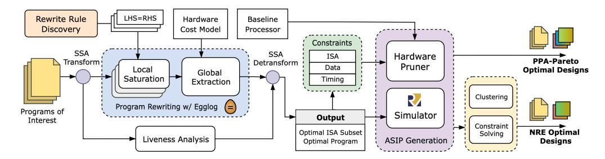

Fig. 4. Overview of the æSIP workflow. Program synthesis is invoked once to derive verified rewrite rules. For given programs of interest, equality saturation generates multiple semantically equivalent rewritten programs. Static analysis then automatically infers microarchitecture-level constraints, which are subsequently incorporated into ASIP generation. Optionally, constraint-aware optimization can be applied to enable NRE exploration.

To address this limitation, we incorporate a neurosymbolic [77] refinement loop that uses an LLM (Claude Opus 4.5) as a fourth search strategy [5]. Recent work has shown that LLMs can capture structural algebraic transformations that are difficult to enumerate symbolically [40], [42], [51], [54], [73]. We warm-start the LLM with expert-verified rewrite examples drawn from existing RISC-V software emulation libraries (e.g., the RV32I library routines for mul, div, and rem), enabling it to generalize common patterns and propose semantically plausible candidates. The LLM leverages knowledge of known algorithms—for instance, it proposes convolutionbased and Karatsuba-based decompositions for efficient mulh rewriting—that are impractical to discover through bruteforce enumeration [78]. Each candidate is then verified by the SMT-based verification engine, and any counterexamples produced by the solver are fed back to the LLM, forming a counterexample-guided synthesis loop. In practice, the LLMguided search converges within several iterations when the traditional algorithms fail to find solutions.

*3) Comparison with Alternative Approaches:* Pros: We build our rewrite rule discovery framework on Greenthumb, as it provides well-defined semantics for registers, memory, program flags, and instructions. Additionally, it offers non-LLM search strategies that provide better extensibility to unseen or bespoke ISAs and avoid token costs. Cons: Greenthumb assumes linear execution—programs are straight-line

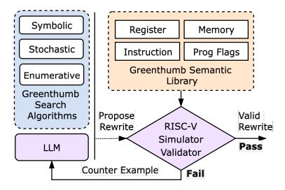

Fig. 5. Overview of the rewrite rule discovery framework. The orange dashed box encloses Greenthumb's semantics library (Register, Memory, Instruction, and Program Flag), upon which we build the RISC-V Simulator and Validator (purple, center). The blue dashed box encloses Greenthumb's three inherited search algorithms (symbolic, stochastic, and enumerative). The LLM-guided search (purple, right) is our addition. All four search algorithms propose candidate sequences to the validator for formal equivalence checking. Note that program flags are not used in RV32IM.

instruction sequences with no control flow. Specifically, no program counter, or branch target is tracked. This prevents us from formally verifying rewrite rules involving branch instructions. We instead validate those rewrite rules via endto-end simulation by comparing the outputs of the rewritten and original programs. Formal ISA specification frameworks such as Sail [6], [10], [62] and ILA [37] provide more systematic ISA modeling capabilities that may help address that but do not include built-in search algorithms. Conversely, rewrite rule discovery frameworks such as Ruler [50] and Enumo [52] offer principled search strategies but are designed for high-level algebraic domains rather than machine-level ISA semantics; adapting them to reason about register-level instruction equivalences would require non-trivial engineering effort.

- *4) Results and Generalizability:* Through the cooperative effort of all four search algorithms, we obtained a total of 51 rewrite rules covering 26 distinct instructions. Representative rules are shown in Table II. Our approach is designed to be generalizable beyond RISC-V: Greenthumb already supports ARMv7 and GA [32], a low-power, stack-based, 18-bit ISA. Extending æSIP to a new ISA requires only implementing the corresponding ISA simulator and validator within the existing framework, by providing the semantics of the ISA's instructions. The search algorithms, and SMT solver are all ISA-independent and can be easily reused, though LLMguided synthesis may be less effective for bespoke or novel ISAs with limited training data.
- *5) Preservation of Turing Completeness:* A natural concern is whether aggressive instruction pruning might reduce the ISA subset below the threshold of Turing completeness. Classical results in computability theory establish that Turing completeness requires three fundamental capabilities: arithmetic/logic computation, conditional control flow, and memory access [47]. In æSIP, every rewrite rule replaces an instruction with a semantically equivalent sequence that necessarily *retains* at least one instruction from the same functional category—a memory access cannot be emulated without a memory instruction, nor a conditional branch without control flow. For example, lh → lw+slli+srai retains a load, and blt → bge+jal retains a conditional branch. Since rewriting never vacates an entire functional category, the resulting ISA subset is guaranteed to retain at least one representative from each

category and therefore remains Turing-complete whenever the original ISA subset is. A formal proof of this invariant is left to future work.

## *B. E-Graph Based Hardware-Aware Program Rewriting*

*1) Preprocessing:* We select well-studied embedded workloads from standard benchmark suites [35], [55]. Several applications invoke small library routines (e.g., string manipulation or math helpers). To ensure that rewriting and instructionsubset extraction operate on a closed program, we manually inline these library functions into the application's source code. We then compile all benchmarks using the RV32IM toolchain. Because the compiler emits pseudo-instructions (e.g., li, mv) that are not directly implemented in hardware, we analyze the generated assembly and expand all pseudo-instructions into their canonical sequences of real RISC-V instructions, producing a self-contained assembly program.

The resulting assembly contains no pseudo-instructions or external symbols and serves as the direct input to our rewriting engine. Consequently, all extracted variants remain valid standalone .s files that assemble into runnable binaries, which disassembly-based rewriting approaches cannot guarantee.

*2) Assembly-Level Local Saturation:* Traditional compilers suffer from the well-known phase-ordering problem: the effectiveness of an optimization depends critically on the order in which transformations are applied. Equality saturation addresses this issue by applying all rewrite rules simultaneously within an e-graph, ensuring that all semantically equivalent program variants are represented.

However, applying full-program equality saturation directly to real applications quickly becomes infeasible. Rewrite rules interact non-locally and recursively expand the search space, often resulting in combinatorial blow-up. In practice, the extraction phase often dominates the overall runtime of equality saturation [82], and the resulting complex e-graphs further exacerbate the cost of extraction. Prior work either performs coarse-grained saturation over high-level IRs [20], [84] or restricts saturation to small local regions applied sequentially [61], rather than allowing every instruction across the entire program to participate in rewriting concurrently.

To make this tractable, we develop a divide-and-conquer rewriting framework that accelerates both saturation and extraction. Fig. 6 shows an overview of this workflow.

We first analyze the program's control flow and partition the entire application into a set of basic blocks. Our rewriting engine then performs structured local saturation within each basic block rather than saturating the full program monolithically. For every basic block, we create a pseudo-root e-class that serves as the anchor for all expressions derived within that block. These locally saturated subgraphs are subsequently merged into a single global e-graph by connecting all pseudoroots to a global root e-class. This construction captures the full program's equivalence space while avoiding the blowup associated with whole-program saturation, and enables extraction to consider inter-block alternatives within one unified global e-graph.

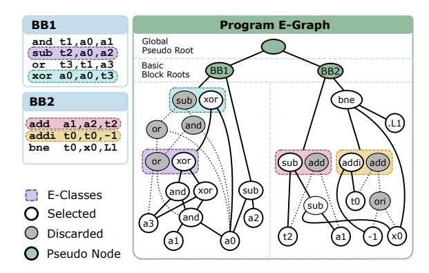

Fig. 6. Example of the divide-and-conquer rewriting workflow. Left: The input program consists of two basic blocks. Color-coded instructions correspond to the e-classes highlighted in the e-graph below. Right: The unified program e-graph after local saturation and global ILP extraction. A global pseudo-root (green) connects to per-block pseudo-roots, which anchor each block's local e-graph. In BB1, the sub node computing t2 is an *orphan* e-class: it does not participate in BB1's primary expression tree (rooted at xor a0, a0, t3) but must be preserved because BB2 consumes t2. The orphan is linked to BB1's pseudo-root to prevent the extractor from treating it as dead code. Rewrite rules (e.g., or → xor(xor, and)) populate eclasses with alternatives, and the ILP globally selects the combination that minimizes instruction-type diversity under latency constraints.

In addition, any orphan e-classes—those that do not participate in a block's primary expression tree but nonetheless correspond to values used across basic blocks—are explicitly linked back to the block's pseudo-root. This prevents the extraction phase from incorrectly treating cross-block dependencies as dead code and ensures that instructions whose results are consumed outside the local block are preserved.

*3) ILP based Global Extraction:* Local saturation builds rich equivalence spaces within each basic block, but selecting a concrete program requires globally consistent decisions. Traditional greedy extraction, which chooses the locally cheapest e-node in each e-class, is insufficient because the objectives we optimize depend on global instruction choices.

To address this, we cast extraction as a lightweight global optimization problem and solve it using ILP [2]. We model the e-graph as a set of e-classes E, where N (e) denotes the set of e-nodes in e-class e ∈ E and O denotes the set of instruction types. For each e-node n ∈ N (e) we introduce a binary decision variable xe,n, while each e-class e is associated with a binary activation variable a<sup>e</sup> indicating whether it is selected in the extracted program. We also introduce a binary variable y<sup>o</sup> for each instruction type o ∈ O, indicating whether any e-node using type o is selected.

Let ce,n denote the local cost (e.g., latency) of e-node n, and let w<sup>o</sup> denote a hardware-aware weight that captures the area/power cost of instruction type o (e.g., multipliers and dividers are assigned much larger w<sup>o</sup> than simple ALU operations).

We define the ILP objective as:

$$\min_{x,a,y} \quad \lambda \sum_{o \in \mathcal{O}} w_o y_o + (1 - \lambda) \sum_{e \in \mathcal{E}} \sum_{n \in \mathcal{N}(e)} c_{e,n} x_{e,n}, \quad (1)$$

where the first term minimizes the set of distinct instruction types used and the second term (scaled by a user-chosen factor  $\lambda$ ) minimizes their total usage count. By adjusting the relative scale between  $\{w_o\}$  and  $\lambda$ , we can bias extraction toward variants that minimize hardware area, reduce program latency, or balance the two. Note that latency in the cost model is estimated based on spike simulation. RTL simulation is applied later for accurate evaluation. In practice, we sweep a broad range of weight configurations to generate multiple program variants, enabling exploration of the area-latency tradeoff for the ASIP tailored to this application.

The constraints are summarized as follows. Let  $\mathcal{R} \subseteq \mathcal{E}$  denote the set of pseudo-root and orphan e-classes that must be extracted, let  $\operatorname{child}(n)$  be the set of child e-classes of e-node n, and let  $\operatorname{op}(n) \in \mathcal{O}$  be the instruction type of n. First, each activated e-class must select exactly one e-node:

$$\forall e \in \mathcal{E}: \sum_{n \in \mathcal{N}(e)} x_{e,n} = a_e.$$
 (2)

All pseudo-root and orphan e-classes are forced to be active:

$$\forall r \in \mathcal{R}: \quad a_r = 1. \tag{3}$$

If an e-node is selected, all of its child e-classes must be active:

$$\forall e \in \mathcal{E}, \ \forall n \in \mathcal{N}(e), \ \forall e' \in \text{child}(n): \quad x_{e,n} \leq a_{e'}.$$
 (4)

If an e-node is selected, the corresponding instruction type must also be enabled:

$$\forall e \in \mathcal{E}, \ \forall n \in \mathcal{N}(e): \quad x_{e,n} \le y_{\text{op}(n)}.$$
 (5)

Finally, we forbid invalid self-cycles by assigning each e-class an integer "level"  $\ell_e$  and enforcing a strict topological order whenever a parent–child dependency is selected:

$$\forall e \in \mathcal{E}, \ \forall n \in \mathcal{N}(e), \ \forall e' \in \text{child}(n),$$

$$x_{e,n} = 1 \ \Rightarrow \ \ell_{e'} \ge \ell_e + 1$$
(6)

which we encode using a standard Big-M linearization in the actual ILP.

Because pseudo-root and orphan e-classes are explicitly forced active by (3), their corresponding basic blocks must be extracted. The remaining constraints (2)–(6) follow the standard formulation used in existing e-graph extractors, while our additional operator-type variables  $y_o$  and weights  $w_o$  make the optimization hardware-aware. Under these constraints, the ILP solver naturally decomposes the optimization across basic blocks: each block has its own root e-class and local e-nodes, but all blocks share the same global operator-type variables  $y_o$ . This implicit block-level parallelism substantially accelerates global extraction while preserving full semantic correctness, reducing overall runtime from hours under monolithic extraction to seconds in our parallel block-wise workflow.

4) Postprocessing: Given the selected e-classes and e-nodes from the global extraction phase, we reconstruct the program by rebuilding the corresponding expression graph and performing a postorder traversal to emit concrete assembly instructions. Our framework automatically tracks operand registers and assigns destination registers by inheriting the original instruction's rd whenever the rewritten instruction belongs to the same e-class.

When a single instruction is rewritten into a longer sequence, additional temporary registers may be required. To handle register pressure, we implement a lightweight linear-scan-style [57] register allocator within each basic block that reuses temporaries whenever their live ranges do not overlap and spills to the stack only when free registers are exhausted.

#### C. Don't Care Based µArch-Aware Agile ASIP Generator

Figure 7 illustrates the workflow of our constraint-driven ASIP generator. The pipeline takes three user-provided inputs—the baseline processor RTL, the rewritten program from the equality saturation, and the memory configuration—and produces a pruned ASIP through three stages: (1) deriving microarchitectural constraints from the rewritten program and memory configuration (§IV-C1); (2) translating these constraints into SystemVerilog assertions (SVA) and injecting them into the baseline netlist (§IV-C2); (3) provable hardware pruning via semiformal verification (§IV-C3).

1) Microarchitectural Constraints: Beyond ISA-level constraints, which restrict the decoder to only the opcodes present in the rewritten program, we introduce (1) data-level constraints and (2) timing-level constraints for additional circuit pruning.

**Data-Level Constraints** arise from the observation that certain instructions operate on restricted data ranges despite having wider architectural support. These include:

- Operand Width Constraints: Many instructions in practice operate on data types narrower than the processor's word width. For instance, string processing routines frequently manipulate only char (8-bit) values within 32-bit registers. When certain instructions never utilize the full register width, the corresponding arithmetic units can be simplified. For example, if multiply instructions only process 16-bit operands, the upper multiplication logic becomes redundant and can be safely removed.
- Immediate Value Constraints: Instructions with immediate operands often use only a small discrete subset of possible values. For example, although the ISA supports arbitrary shift amounts, programs typically use only a small set of immediate values in shift instructions, enabling specialized, area-efficient implementations. Furthermore, program rewriting can intentionally strengthen these constraints. For instance, if srai (shift right arithmetic immediate) operations use only the values 2 and 4, we can decompose them into sequences of srai by 2, trading a minor latency penalty for area savings when srai by 4 is rarely executed.

Timing-Level Constraints capture the temporal behavior of memory subsystems and other microarchitectural components. These constraints reflect design-specific guarantees about latencies and access patterns. For example, one can assert that data/instruction cache hits complete within one cycle while misses resolve within five cycles. These constraints enable simplification of memory interface state machines, removing states and transitions that handle scenarios outside our specified bounds. Unlike data-level constraints, which are

derived automatically from the rewritten program, timing-level constraints are orthogonal to the program rewriting stage. They depend on the memory subsystem assumptions provided by the user, as shown in Figure 7. It is crucial that users validate these timing constraints against their specific application workloads and baseline processor microarchitecture. Invalid constraints could lead to incorrect behavior in scenarios not covered by the validation suite.

*2) Constraint Translation and SVA Generation:* As shown in Figure 7, our automated tool statically analyzes the rewritten assembly code to extract opcode usage and immediate value usage, then feeds these into the SVA generator alongside the user-provided memory configuration. Our SVA generator automatically converts the constraints into SystemVerilog assertions that formally specify the EDC.

ISA-level and immediate value constraints are derived via static analysis of the rewritten assembly code, requiring no simulation. Operand width constraints, however, require dynamic profiling (cycle-level simulation) for precise characterization. This trades generality for more aggressive specialization, as the resulting ASIP would only be functionally equivalent for applications exhibiting the same operand width patterns. In this work, we restrict ourselves to statically derivable constraints to preserve broader applicability.

Representative assertions for each category include:

```
ISA Constraint
# Only Allow Some opcodes.
assume ((i_rdata[1:0] != 2'b11) || (
  (((i_rdata[31:0] & 32'hfe00707f) == OP_ADD))
  || (((i_rdata[31:0] & 32'hfe00707f) == OP_MUL))))
                     Data Constraint
# Shift right amount must be 1 or 2.
assume ((opcode == SRAI) |-> (shamt inside {1, 2}));
                    Timing Constraint
# Data cache misses are resolved within five cycles.
assume (dcache_miss |-> ##[1:5] dcache_response);
```

*3) Semiformal Verification for Gate Pruning :* The first challenge lies in formally proving that a gate can be safely removed under the specified EDC. Exhaustive verification via complete state-space exploration is computationally intractable for industrial-scale designs. For example, Linear Temporal Logic (LTL) model checking scales exponentially with the number of state elements [11], [36].

Therefore, we employ a semiformal verification approach based on k-step induction (k-induction) [48]. Instead of computing the complete reachable state space, k-induction relies on Bounded Model Checking (BMC) to prove that if a property holds for an arbitrary sequence of k states, it logically implies its validity in the (k + 1)-th state. By restricting the solver's scope to a localized, finite temporal window rather than an unbounded time frame, this method trades strict completeness for substantial gains in scalability.

While a property may remain undecidable if its inductive invariant requires a depth greater than k, empirical evaluations

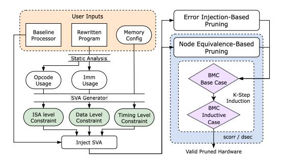

Fig. 7. Pipeline of the constraint-driven ASIP generator. User inputs (baseline processor RTL, rewritten program, and memory configuration) are analyzed to extract opcode and immediate value usage. The SVA generator produces ISAlevel, data-level, and timing-level constraints as SystemVerilog assumptions. These are used during error injection and node equivalence based pruning. The scorr engine in abc performs k-step induction to identify and prune provably equivalent nodes. The dsec engine, also based on k-step induction, verifies sequential equivalence in the presence of injected stuck at 0/1 faults, enabling further optimizations.

demonstrate that modest values (typically 2 ≤ k ≤ 5) are sufficient to efficiently identify the vast majority of opportunities while maintaining practical runtimes.

The second task is to identify which gates can be pruned. We leverage two complementary techniques [45], both verified via k-induction. *Sequential resubstitution*: the scorr engine identifies pairs of nodes that are functionally equivalent considering all reachable states under the EDC and replaces one with the other. *Sequential redundancy removal*: we inject stuck-at-0/1 faults into individual nodes and use the dsec engine to verify whether the faulted circuit remains sequentially equivalent to the original under the EDC. Nodes proven to be sequentially redundant—i.e., stuck at a constant across all reachable states—are removed.

In summary, our contributions are the automated constraint derivation and implementation of error-injection-based gate pruning. scorr and dsec are existing commands in abc [15], [48].

## *D. End-to-End Validation*

As a hardware–software co-design framework, æSIP is designed to be fully end-to-end and practically deployable. Although we prune the microarchitecture, we neither introduce new instructions beyond the original ISA (RV32IM) nor alter pipeline depth, issue width, or branch prediction. The pruned processor therefore remains fully compatible with the unmodified RISC-V toolchain for simulation and verification. Note that ISA-level compatibility (drop-in toolchain support) and microarchitectural specialization operate at different levels: the pruned processor executes every instruction in the selected ISA subset with architecturally correct results, a property guaranteed by our don't care-based hardware pruner.

We validate end-to-end correctness by executing rewritten programs on spike with pk across all 22 benchmarks from MiBench and EmBench. For MiBench applications, we compare outputs between the rewritten and original programs. For EmBench applications, we use the built-in verify function and the program exit code to confirm correctness.

## E. Hardware-Software-Ecosystem Codesign for NRE Reduction

A key challenge in ASIP development is the substantial Non-Recurring Engineering (NRE) cost of tapeout, verification, and tool-flow customization [26], [30], [68], [71]. Prior approaches [8], [11], [38], [58], [59] target single applications, limiting NRE amortization across the families of related workloads typical of embedded domains [39].

æSIP introduces a hardware–software–ecosystem co-design strategy that largely sidesteps this trade-off through ISA convergence. Rather than taking the union of each application's original ISA requirements—which grows with every additional workload and erodes specialization—æSIP rewrites each program toward a common ISA subset before forming the union. Because the rewriting engine can often eliminate the instructions that would have caused ISA expansion, adding a program to a cluster does not necessarily enlarge the shared ISA, allowing a single ASIP instance to serve an entire subecosystem while preserving most of the specialization benefit.

The designer need not manually select which applications to group; the ILP formulation (Section IV-B3) takes the desired number of ASIP variants k as input and jointly assigns programs to chips and selects rewrite variants to minimize the global objective. The only user-facing decision is k itself, which reflects a business-level NRE budget.

Designers are also not required to anticipate future applications at design time. When a new application arrives post-tapeout, æSIP attempts to rewrite it into the ISA subset of an existing ASIP. If the latency overhead is acceptable, no new hardware is needed; otherwise, the ecosystem optimization is re-run with k+1 variants. Rewriting between arbitrary Turing complete subsets is theoretically possible but would require a much larger ruleset that slows saturation and extraction without guaranteed area benefit; we leave this exploration to future work.

#### V. EVALUATION

We target the Ibex RISC-V core [44] in its Small configuration (2-stage pipeline, no branch prediction) with RV32IM support and evaluate on embedded workloads from MiBench and EmBench [35], [55]. All reported area and power numbers reflect logic only (including the synthesized register file) and exclude memory structures (instruction/data caches and SRAM); cycle-accurate latency is measured via RTL simulation with both instruction and data caches enabled. The rewriting engine uses egglog [79], [85] for equality saturation and Rosette v1.1/Racket 6.7 [29], [72] for program synthesis. Compilation uses riscv32-unknown-elf-gcc (GCC 15.1) with -03 [60]. All experiments run on an AMD EPYC 9575F 64-Core server.

For area and power we adopt a two-fold flow: Yosys 0.33 [80] + OpenSTA [21] for rapid design space exploration (e.g., sweeping 27  $\lambda$  values in Equation 1), and Cadence Innovus [16] with the SkyWater 130nm library [28] at iso-frequency 25 MHz for final place-and-route results. We also evaluate on the PPDK standard cell library (1.0 V, 25°C,

typical corner) to demonstrate applicability to printed electronics. Printed technologies such as PPDK are characterized by dominant static power (99%) and large transistor feature sizes, resulting in substantial die area (67.53 cm² reported for a RISC-V core [17]) — making area reduction particularly impactful.

#### A. Minimal-Instruction-Usage Design via Program Rewriting

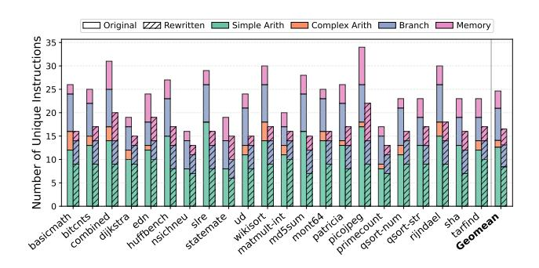

Fig. 8. Comparison between original program and æSIP rewritten programs with the minimal-instruction-usage. Up to 46.4% instructions can be safely removed without affecting functional correctness of target program. Besides, the instruction composition before and after rewriting are shown in different colors.

We statically analyze the rewritten assembly code to characterize the instruction usage reduction achieved by æSIP by comparing the distinct instruction types in the original programs against the minimal-instruction-usage variants.

As shown in Figure 8, each program utilizes only a subset of all 45 instructions supported by RV32IM. SOTA ASIP design frameworks such as PDAG [11] and RISSP [58] leverage this observation to prune unused hardware components. Our program rewriting framework further reduces the distinct instruction count by 31.8% on average (up to 46.4% for md5), enabling additional area optimization with the don't care-based ASIP generator.

The rewriting achieves broad coverage across instruction categories, demonstrating the effectiveness of the synthesis based rewrite rules discovery and e-graph based hardware-aware program rewriting. All complex arithmetic instructions (Mul/Div) are fully eliminated across every benchmark, simple arithmetic and branch instructions are reduced by 33.3% and 31.9% on average, respectively, and memory instructions see a more modest 8.1% reduction.

## B. Multi-objective Optimization

In this section, we present the ASIPs optimized using asIP and compare against SOTA ASIP design frameworks. We select PDAG [11] as the representative ASIP design methodology, which prunes unused hardware from the baseline processor using ISA-level constraints derived from software profiling. We report results for two optimization objectives: minimum area and minimum energy, with all values normalized to the ASIP generated using PDAG's methodology.

TABLE III

MINIMUM-AREA VARIANT SELECTION NORMALIZED TO PDAG [11], UNDER  $1.2 \times$  LATENCY CONSTRAINT AND UNCONSTRAINED SETTINGS.

| Benchmark   | PDAG (baseline)      |            |                         |            | 1.2× latency |        |        |        | Unconstrained |        |        |        |
|-------------|----------------------|------------|-------------------------|------------|--------------|--------|--------|--------|---------------|--------|--------|--------|
|             | SKY130               |            | PPDK                    |            | SKY130       |        | PPDK   |        | SKY130        |        | PPDK   |        |
|             | Area $(\mu m^2)$     | Power (mW) | Area (cm <sup>2</sup> ) | Power (mW) | ΔArea        | ΔPower | ΔArea  | ΔPower | ΔArea         | ΔPower | ΔArea  | ΔPower |
| basicmath   | $1.31 \times 10^{5}$ | 4.4        | $1.41 \times 10^{2}$    | 659.4      | -2.9%        | -2.3%  | -3.2%  | -2.7%  | -29.5%        | -22.2% | -23.3% | -18.7% |
| bitcnts     | $1.16 \times 10^{5}$ | 4.0        | $1.21 \times 10^{2}$    | 580.7      | -21.9%       | -16.4% | -14.7% | -10.2% | -21.9%        | -16.4% | -14.7% | -10.2% |
| combined    | $1.23 \times 10^{5}$ | 4.1        | $1.29 \times 10^{2}$    | 605.5      | -8.5%        | -5.2%  | -9.6%  | -6.8%  | -23.9%        | -15.7% | -15.9% | -11.0% |
| dijkstra    | $1.22 \times 10^{5}$ | 4.0        | $1.29 \times 10^{2}$    | 603.6      | -8.0%        | -3.7%  | -8.2%  | -5.9%  | -23.6%        | -13.6% | -19.2% | -13.7% |
| edn         | $1.14 \times 10^{5}$ | 3.9        | $1.21 \times 10^{2}$    | 577.4      | -1.2%        | -1.8%  | -2.1%  | -1.4%  | -18.0%        | -10.6% | -9.9%  | -6.6%  |
| huffbench   | $9.05 \times 10^{4}$ | 3.3        | $1.08 \times 10^{2}$    | 536.6      | -0.1%        | -0.2%  | -6.0%  | -4.5%  | -0.1%         | -0.2%  | -6.0%  | -4.5%  |
| nsichneu    | $9.29 \times 10^{4}$ | 3.4        | $1.03 \times 10^{2}$    | 517.6      | -3.3%        | -4.9%  | -0.6%  | -0.5%  | -3.3%         | -4.9%  | -0.6%  | -0.5%  |
| slre        | $9.31 \times 10^{4}$ | 3.4        | $1.08 \times 10^{2}$    | 537.1      | -2.5%        | -3.2%  | -6.4%  | -4.8%  | -2.5%         | -3.2%  | -6.4%  | -4.8%  |
| statemate   | $9.35 \times 10^{4}$ | 3.4        | $1.00 \times 10^{2}$    | 508.8      | -3.0%        | -2.5%  | 0.0%   | 0.0%   | -3.0%         | -2.5%  | 0.0%   | 0.0%   |
| ud          | $1.27 \times 10^{5}$ | 4.4        | $1.39 \times 10^{2}$    | 652.0      | -0.1%        | 1.4%   | -2.3%  | -1.8%  | -27.3%        | -22.3% | -22.3% | -17.8% |
| wikisort    | $1.30 \times 10^{5}$ | 4.5        | $1.40 \times 10^{2}$    | 656.8      | -14.0%       | -15.5% | -16.4% | -13.9% | -28.3%        | -23.4% | -22.5% | -17.9% |
| matmult-int | $1.22 \times 10^{5}$ | 4.0        | $1.31 \times 10^{2}$    | 615.1      | -8.5%        | -3.0%  | -9.6%  | -7.0%  | -24.0%        | -13.3% | -17.5% | -12.5% |
| md5sum      | $9.35 \times 10^{4}$ | 3.5        | $1.09 \times 10^{2}$    | 538.9      | -0.5%        | -1.7%  | -4.7%  | -3.6%  | -0.5%         | -1.7%  | -4.7%  | -3.6%  |
| mont64      | $1.12 \times 10^{5}$ | 3.9        | $1.20 \times 10^{2}$    | 576.3      | 0.0%         | 0.0%   | -1.7%  | -1.1%  | -17.2%        | -12.7% | -13.5% | -9.3%  |
| patricia    | $1.27 \times 10^{5}$ | 4.4        | $1.20 \times 10^{2}$    | 578.0      | -27.0%       | -21.2% | -13.4% | -9.6%  | -27.0%        | -21.2% | -13.4% | -9.6%  |
| picojpeq    | $1.15 \times 10^{5}$ | 3.9        | $1.21 \times 10^{2}$    | 580.3      | -0.5%        | 1.0%   | -0.7%  | -0.5%  | -18.8%        | -12.4% | -10.8% | -7.3%  |
| primecount  | $1.16 \times 10^{5}$ | 4.0        | $1.21 \times 10^{2}$    | 578.3      | -3.5%        | -4.4%  | -2.3%  | -1.7%  | -20.2%        | -15.0% | -10.3% | -6.8%  |
| gsort-num   | $1.22 \times 10^{5}$ | 4.0        | $1.29 \times 10^{2}$    | 604.7      | -2.2%        | -0.7%  | -1.1%  | -0.6%  | -23.7%        | -14.2% | -17.5% | -11.7% |
| gsort-str   | $9.32 \times 10^{4}$ | 3.5        | $1.08 \times 10^{2}$    | 536.9      | -2.5%        | -3.9%  | -5.5%  | -3.8%  | -2.5%         | -3.9%  | -5.5%  | -3.8%  |
| rijndael    | $1.22 \times 10^{5}$ | 4.2        | $1.32 \times 10^{2}$    | 629.3      | -8.2%        | -10.4% | -10.8% | -10.0% | -23.5%        | -18.6% | -17.9% | -14.8% |
| sha         | $9.32 \times 10^{4}$ | 3.4        | $1.05 \times 10^{2}$    | 527.7      | -2.1%        | -2.5%  | -3.9%  | -3.1%  | -2.1%         | -2.5%  | -3.9%  | -3.1%  |
| tarfind     | $1.16\times10^{5}$   | 4.0        | $1.21\times10^2$        | 579.8      | -3.0%        | -2.6%  | -1.9%  | -1.5%  | -19.4%        | -14.0% | -10.5% | -7.1%  |
| Geomean     |                      |            |                         |            | -5.9%        | -4.9%  | -5.8%  | -4.4%  | -17.0%        | -12.3% | -12.4% | -9.0%  |

a) Minimum Area: To accommodate diverse latency requirements, we report the best-area variant under both a 1.2× latency constraint and an unconstrained setting; all comparisons are at iso-frequency. Under the 1.2× constraint, æSIP achieves geometric-mean area reductions of 5.9% (SKY130) and 5.8% (PPDK) over PDAG, with power reduced by 4.9% and 4.4%, respectively. The unconstrained setting enables more aggressive area reduction: geometric-mean area reaches 17.0% under SKY130 and 12.4% under PPDK, with corresponding power reductions of 12.3% and 9.0%. Individual benchmarks such as basicmath (-29.5%) and wikisort (-28.3%) demonstrate the largest area savings under the unconstrained setting.

Table III shows that PDAG achieves substantial area reduction when programs utilize only small instruction subsets, particularly those excluding complex instructions like mul or mulh. For instance, nsichneu uses only 16 instructions without complex operations and benefits significantly from ISA pruning. However, programs like bitchts and dijkstra see limited benefit under PDAG, as they require complex instructions like mul despite their low usage.

æSIP, on the other hand, achieves up to 29.5% and on average 17.0% additional area reduction compared to PDAG. This improvement stems from two key factors. First, program rewriting significantly reduces instruction usage, enabling more aggressive ISA-level constraints and area reduction. For example, multiplication-related rewrite rules automatically generated by the neuro-symbolic program synthesis engine express mulh/mulhu/mulhsu via convolution- or Karatsubastyle decompositions [78]; these rules are explored by the equality-saturation engine to eliminate upper-bit multiplication logic when profitable under the cost model. Second, data-level

and timing-level constraints unlocks optimization opportunities, including memory system state machine and barrel shifter simplification, even when rewrites are inapplicable.

Note that the area reductions under PPDK are smaller than under SKY130 because flip-flops dominate the area budget in printed electronics [13], and our current framework does not target flip-flop pruning.

b) Minimum Energy: Table IV shows the best-energy variant for each benchmark under both technologies. We scale each variant's frequency to its maximum achievable value; this preserves dynamic energy while reducing static energy by shortening execution time. The geometric-mean energy reduction is 4.1% and 6.3% for SKY130 and PPDK respectively. Benchmarks such as bitchts (-16% SKY130) and wikisort (-22% PPDK) benefit the most, where area reduction and frequency upscaling combine to lower energy. Although pruning complex hardware units reduces area and power, program rewriting also reduces ISA expressiveness, increasing cycle counts for the rewritten instruction sequences. Consequently, the energy savings are moderate in aggregate. Larger reductions could be achieved by combining the current instruction-reduction technique with instruction fusion to efficiently execute commonly occurring computational patterns [8], [31], [46], [76]; we leave this to future work.

## C. Area-Latency Trade-off Analysis

In this section, we present the latency-area trade-off exploration supported by æSIP to address varying latency constraints [9], [12], [58]. æSIP achieves aggressive hardware pruning through program rewriting, which generally increases cycle count (e.g., rewriting mul via shifts and adds can expand execution to hundreds of cycles). However, removing

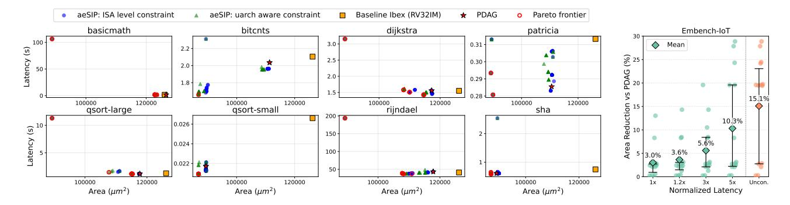

Fig. 9. Area-latency trade-off validated with cycle-accurate RTL simulation. Latency is computed as cycles/(frequency  $\times$  10<sup>6</sup>) using RTL cycle counts and post-synthesis clock frequencies. **Left:** Pareto frontiers for all eight MiBench benchmarks. Each subplot shows &SIP design variants at two constraint levels (ISA-level only and with additional  $\mu$ Arch-aware constraints), alongside PDAG and the baseline Ibex (RV32IM). Open red circles mark the Pareto frontier. **Right:** Mean area reduction over PDAG across all Embench-IoT benchmarks at increasing latency budgets (1× to unconstrained), along with interquartile range (Q1–Q3).

TABLE IV
MINIMUM-ENERGY VARIANT SELECTION NORMALIZED TO PDAG [11],
UNDER SKY130 AND PPDK TECHNOLOGIES.

|             | SKY130 |       |      |        | PPDK |       |      |        |  |
|-------------|--------|-------|------|--------|------|-------|------|--------|--|
| Benchmark   | Area   | Power | Freq | Energy | Area | Power | Freq | Energy |  |
| basicmath   | 0.97   | 0.93  | 0.95 | 0.98   | 0.97 | 1.01  | 1.13 | 0.90   |  |
| bitcnts     | 0.78   | 1.24  | 1.49 | 0.84   | 0.85 | 0.92  | 1.08 | 0.85   |  |
| combined    | 0.97   | 0.94  | 0.96 | 0.98   | 1.00 | 1.00  | 1.00 | 1.00   |  |
| dijkstra    | 0.98   | 1.02  | 1.03 | 0.99   | 0.92 | 0.95  | 1.01 | 0.98   |  |
| edn         | 0.99   | 1.04  | 1.06 | 0.98   | 1.00 | 1.00  | 1.00 | 1.00   |  |
| huffbench   | 1.00   | 1.06  | 1.06 | 1.00   | 0.94 | 0.96  | 1.01 | 0.96   |  |
| nsichneu    | 0.97   | 0.90  | 0.95 | 0.95   | 1.00 | 1.00  | 1.00 | 1.00   |  |
| slre        | 0.97   | 0.96  | 0.99 | 0.97   | 0.99 | 1.00  | 1.02 | 0.97   |  |
| statemate   | 0.97   | 1.07  | 1.10 | 0.97   | 1.01 | 1.01  | 1.03 | 0.98   |  |
| ud          | 1.00   | 1.00  | 1.00 | 1.00   | 0.98 | 1.01  | 1.12 | 0.90   |  |
| wikisort    | 0.87   | 0.92  | 1.05 | 0.88   | 0.85 | 0.90  | 1.17 | 0.78   |  |
| matmult-int | 0.91   | 0.80  | 0.83 | 0.98   | 0.91 | 0.95  | 1.04 | 0.92   |  |
| md5sum      | 1.00   | 0.93  | 0.94 | 0.99   | 1.00 | 1.00  | 1.00 | 1.00   |  |
| mont64      | 1.00   | 1.05  | 1.06 | 0.99   | 0.98 | 1.02  | 1.12 | 0.91   |  |
| patricia    | 0.74   | 1.19  | 1.52 | 0.87   | 0.87 | 0.92  | 1.07 | 0.95   |  |
| picojpeq    | 1.00   | 1.00  | 1.00 | 1.00   | 1.01 | 1.03  | 1.11 | 0.93   |  |
| primecount  | 0.96   | 0.99  | 1.04 | 0.96   | 0.98 | 1.01  | 1.10 | 0.91   |  |
| qsort-num   | 0.98   | 1.08  | 1.09 | 0.99   | 1.00 | 1.00  | 1.00 | 1.00   |  |
| gsort-str   | 0.97   | 0.98  | 1.02 | 0.96   | 0.94 | 0.96  | 0.97 | 0.99   |  |
| rijndael    | 0.92   | 0.87  | 0.97 | 0.90   | 0.90 | 0.92  | 1.09 | 0.85   |  |
| sha         | 0.98   | 0.92  | 0.94 | 0.98   | 0.99 | 1.00  | 1.04 | 0.96   |  |
| tarfind     | 0.97   | 0.95  | 0.98 | 0.97   | 1.00 | 1.04  | 1.14 | 0.90   |  |
| Geomean     | 0.95   | 0.99  | 1.04 | 0.96   | 0.96 | 0.98  | 1.06 | 0.94   |  |

instructions also shortens the critical path, allowing frequency upscaling that partially compensates for the increased cycle count.

To address these concerns, &SIP explores the latency-area trade-off by tuning  $\lambda$  in the cost model:  $\lambda \times Area + (1-\lambda) \times Latency$ , which guides program rewriting. We sweep 27 values of  $\lambda$  from 0 to 1, with finer granularity near  $\lambda=0$  (where the cost model is area-dominated) to capture the steep region of the trade-off curve. Each variant comprises its rewritten program, area, frequency, and latency. The resulting Pareto frontier based on area and latency enables architects to select variants tailored to their requirements.

Figure 9 (left) presents Pareto frontiers for all eight MiBench benchmarks in SKY130 library. Workloads such as bitchts, qsort-small, patricia, and sha achieve both smaller area and shorter latency—up to 29% area reduction with 0.79× latency—because complex arithmetic constitutes a negligible fraction of their execution, so rewriting

it introduces minimal cycle penalty while the simplified datapath increases frequency. For workloads like basicmath and rijndael, completely removing all complex instructions achieves  $\sim$ 29% area reduction but incurs large latency increases. However, intermediate Pareto-optimal variants obtained by selectively rewriting subsets of instructions achieve 8-15% area reduction with less than  $1.1\times$  latency overhead, as seen in dijkstra (-14.4% area,  $1.02\times$ ) and rijndael (-14.6% area,  $0.94\times$ ). These constrained variants therefore also improve the area-delay product (ADP) over PDAG, confirming that æSIP's gains are not limited to areaonly optimization. We note that some variants exhibit a slight area increase over the PDAG design despite disallowing more instructions. This occurs because the don't care based pruner operates at the and-inverter graph level, and the downstream synthesis tool may not always recover a smaller netlist from the pruned representation.

Figure 9 (right) summarizes the Embench-IoT results as geometric-mean area reduction over PDAG at increasing latency budgets. Note that a large variance exists as PDAG performs fairly well if the program is already very simple.

The two constraint levels in Figure 9 also serve as an ablation study. The "ISA-level only" series isolates the contribution of program rewriting: it applies the same rewritedriven ISA pruning as full æSIP but uses only opcode-presence constraints, comparable to augmenting PDAG with our rewriting front-end. The " $\mu$ Arch-aware" series adds datalevel and timing-level constraints on top. Across the MiBench benchmarks,  $\mu$ Arch-aware constraints consistently push design points to lower area at comparable latency, with the gap most pronounced for workloads that retain complex instructions (e.g., dijkstra, rijndael) where barrel-shifter and memory-subsystem simplifications provide additional savings beyond ISA-level pruning.

#### D. Ecosystem-Level ASIP Sharing and NRE Reduction

Practical deployment requires amortizing non-recurring engineering (NRE) cost across an evolving ecosystem of workloads. æSIP targets this requirement by jointly optimizing program rewriting and ISA-subset customization so that a

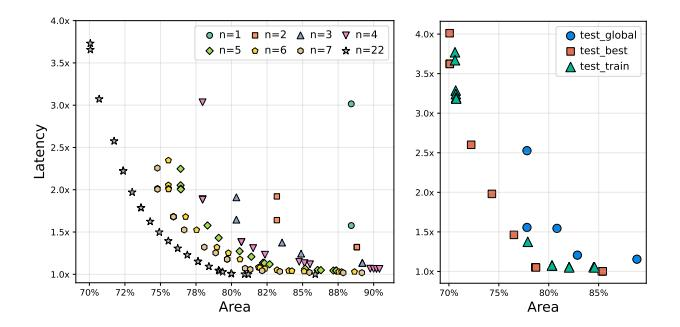

Fig. 10. (Left) Area-latency Pareto frontier under different maximum numbers of ASIP variants. Both axes report normalized values. Even with only a few ASIPs,  $\alpha$ SIP achieves near-optimal specialization while greatly reducing NRE cost. (Right) Generalization of shared ASIPs to unseen workloads (n=3). We compare three configurations: (1)  $test\_global$ , where NRE optimization is performed jointly across all programs; (2)  $test\_best$ , where ASIPs are optimized specifically for the test programs; and (3)  $test\_train$ , where ASIPs are learned from the training set and applied to the test programs.

small set of shared ASIP variants can efficiently support many applications, rather than building a bespoke ASIP for each program.

To quantify this ecosystem-level sharing, we use the full set of program variants generated by the rewriting pipeline. We formulate this as a constrained optimization problem. Given a budget of num-chip ASIP variants, we jointly select one variant per program and extract num-chip distinct ISA subsets, such that every program can be mapped to one of these subsets. Intuitively, num-chip controls the degree of sharing: smaller values enforce broader ISA coverage per ASIP, whereas larger values allow more specialization.

Figure 10 shows the resulting area-latency Pareto frontiers under different num-chip budgets. When the system is constrained to very few ASIPs (e.g., num-chip=1 or 2), each shared ISA subset must include nearly the union of instruction types used across the suite, leaving limited hardwarepruning headroom and making area-latency trade-offs brittle. As num-chip increases, each ISA subset becomes increasingly specialized, enabling more aggressive hardware trimming and significant area reductions. Remarkably, with only a few ASIP variants, æSIP recovers the majority of the benefits achieved by full per-application specialization (num-chip=22). All metrics are normalized to the baseline ibex per program and reported as the geometric mean across benchmarks. At num-chip=5, æSIP achieves a 17.3% area reduction with only 11.9% latency overhead, compared to 22.4% area reduction and 15.1% latency overhead under full per-application specialization (num-chip=22). The gap of ~5 percentage points—despite each ASIP serving 5-6 programs—demonstrates that rewrite-driven ISA convergence preserves most of the specialization benefit. This is not a simple sacrifice of customization depth: without rewriting, sharing would force the ISA to the union of all original instruction sets, eliminating most pruning opportunities. Rewriting narrows each program's ISA footprint before the union is taken, keeping the shared subset close to what per-application optimization would produce.

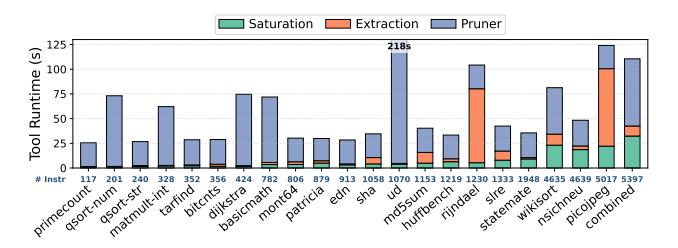

Fig. 11. Tool runtime versus instruction count. Bars show the runtime breakdown of saturation, extraction, and scorr pruning for each benchmark.

Beyond demonstrating that only a few ASIP variants suffice, we also evaluate whether shared ASIPs generalize to unseen workloads. We randomly split the benchmarks into 70% training and 30% test sets, run the NRE optimization only on the training set, and select the Pareto-optimal design for a target budget num-chip=n. The resulting n ISA subsets are then injected as fixed constraints during extraction when rewriting the test programs, enforcing a subset-to-subset mapping.

Figure 10 (right) reports results for n=3. We compare three configurations:  $test\_global$  (NRE optimization over all programs),  $test\_best$  (NRE optimization tailored to the test set), and  $test\_train$  (ASIPs derived from the training set and applied to the test programs). Despite the test programs being unseen during ASIP design,  $test\_train$  achieves performance close to  $test\_best$ , and even outperforms  $test\_global$ , demonstrating that hardware-aware rewriting enables effective subsetto-subset mapping to shared ASIPs.

Overall, these results demonstrate that æSIP enables substantial ecosystem-level NRE amortization while preserving the benefits of specialization. The rewrite-driven ISA convergence not only makes multi-workload ASIP sharing feasible today, but also ensures that future workloads introduced over time can be rewritten to run on existing ASIPs, further extending the value of each design.

#### E. Runtime Overhead

We evaluate the end-to-end runtime of our framework across 22 benchmarks. For each benchmark, we generate one saturation graph and 27 rewritten variants.

As illustrated in Figure 11, saturation time ranges from  $1.2 \, s$  to  $32.4 \, s$ , while extraction time ranges from  $0.3 \, s$  to  $78.4 \, s$ , with a median of  $21.9 \, s$ . The scorr engine takes between  $22.5 \, s$  and  $213.8 \, s$ , with a median of  $25.0 \, s$ .

Hardware pruning dominates the overall framework runtime, while the program rewriting stage remains relatively lightweight. The program rewriting runtime generally scales with instruction count, but even the largest programs complete within tens of seconds, demonstrating the practical scalability of our approach.

For comparison, performing global saturation and extraction on the full program—while controlling the iteration budget to keep the number of e-nodes and e-classes approximately the same—times out after 1 hour. Similarly, PDAG-based pruning under the RV32I baseline times out after 5 hours.

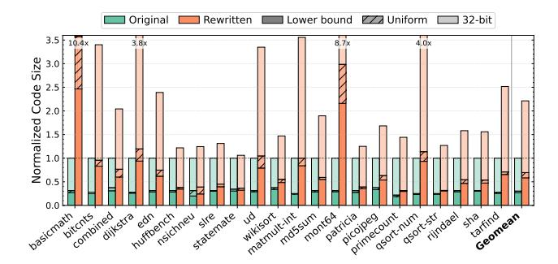

Fig. 12. Code size of minimal-instruction-usage variants normalized to the original 32-bit program. Under entropy-optimal encoding, rewritten programs average  $0.60\times$  the original 32-bit size, as the reduced ISA uses fewer distinct instruction types. The hatched region shows the overhead of uniform encoding ( $\lceil \log_2 N \rceil$  bits per instruction, where N is the number of unique instructions). Values exceeding  $3.0\times$  are annotated above the bars.

With minimal engineering effort, we parallelize multiple variants of the same program using multi-processing, enabling the complete Pareto trade-off exploration to finish within 44 minutes.

#### VI. DISCUSSION

## A. Code Size Analysis

A natural concern with program rewriting is the impact on code size, since replacing compact instructions (e.g., mul) with equivalent multi-instruction sequences inevitably increases the instruction count. We analyze the minimal-instruction-usage variants, which represent the worst case for code size expansion. Under a conventional fixed-width 32-bit encoding, these rewritten programs are on average 2.27× larger than the originals (Figure 12), with benchmarks that heavily use Mul/Div instructions (e.g., mont 64, basicmath) experiencing the largest blowup.

However, because the rewritten programs use fewer distinct instruction types, they are highly amenable to compressed encoding. We apply Shannon's source coding theorem to compute the entropy lower bound on code size; Huffman coding achieves within 0.5% of this bound across all benchmarks. As shown in Figure 12, the entropy-coded rewritten programs are on average  $0.60\times$  the size of the original 32-bit programs. Even a simpler uniform encoding ( $\lceil \log_2 N \rceil$  bits per instruction, where N is the number of unique instructions) incurs only modest overhead above the entropy bound while preserving random-access decoding.

#### B. Modularity and Extensibility

A key design principle of &SIP is that its three stages—rewrite rule discovery, equality saturation-based program rewriting, and microarchitecture-aware hardware pruning—are *modular*: each stage can be replaced or augmented independently (e.g., substituting Ruler [50], Enumo [52], or Sail [6] for rule discovery). Retargeting to a new ISA requires only four ISA-specific inputs: an ISA semantics model, instruction semantics in egglog, a synthesizable baseline core, and an analytical hardware cost model. The core equality

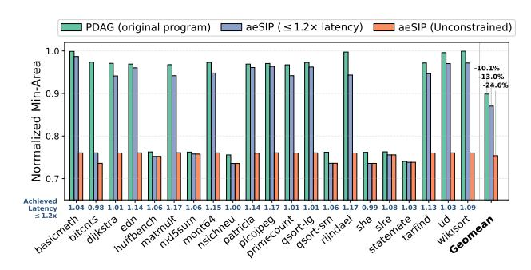

Fig. 13. Area comparison on the Rocket core (5-stage, in-order, RV32IM). PDAG [11] reduces baseline area by 10.1% (geometric mean).  $\alpha$ SIP achieves 13.0% reduction under  $\leq$ 1.2× latency constraint and 24.6% unconstrained. Per-benchmark latency ratios are annotated on the constrained bars.

saturation engine, and hardware pruning infrastructure remain unchanged.

To demonstrate this extensibility, we apply  $\alpha$ SIP to a 5-stage in-order RV32IM Rocket core [7]—a substantially different microarchitecture from the 2-stage Ibex. As shown in Figure 13,  $\alpha$ SIP achieves a 24.6% area reduction (geometric mean) with unconstrained latency, compared to 10.1% for PDAG [11] alone. Under a  $\leq$ 1.2× latency constraint,  $\alpha$ SIP still reduces area by 13.0% with only 1.07× latency overhead, confirming that the framework generalizes across pipeline depths and microarchitectural organizations.

#### VII. CONCLUSION

This paper presented &SIP, the first hardware-software codesign framework that jointly optimizes program implementation and processor microarchitecture. By treating software as mutable through verified rewriting, &SIP unlocks optimization opportunities invisible to prior hardware-only or software-only approaches. Evaluation on MiBench and EmBench shows geometric mean area reduction of 17.0% and power savings of 12.3% over SOTA ASIP generators, with full functional correctness via end-to-end validation. Pareto-optimal designs expose area—latency trade-offs for timing-critical applications, and ecosystem-level ASIP sharing substantially reduces NRE costs, making extreme customization viable even at modest volumes.

## ACKNOWLEDGEMENTS

The authors thank the anonymous ISCA reviewers for their thoughtful feedback, which substantially improved this paper. We are especially grateful to John Sartori, whose foundational work on bespoke processors inspired this line of research and whose generous discussions and encouragement over the years have shaped our thinking on application-specific computing. We also thank Kris Flautner for his insightful conversations and continued encouragement, which have meaningfully influenced our perspective on this work. We also thank our colleagues in the Department of Electrical Engineering and Computer Science at the University of Michigan for their helpful comments on early drafts.

## REFERENCES

- [1] A. Abate, C. David, P. Kesseli, D. Kroening, and E. Polgreen, "Counterexample guided inductive synthesis modulo theories," in *International Conference on Computer Aided Verification*. Springer, 2018, pp. 270– 288.
- [2] T. Achterberg, "What's new in gurobi 9.0," 2019. [Online]. Available: https://cdn.gurobi.com/wp-content/uploads/Gurobi-9.0-Overview-Webinar-Slides-1.pdf
- [3] T. Akiba, K. Imajo, H. Iwami, Y. Iwata, T. Kataoka, N. Takahashi, M. Moskal, and N. Swamy, "Calibrating research in program synthesis using 72,000 hours of programmer time," *MSR, Redmond, WA, USA, Tech. Rep*, 2013.
- [4] H. An, S. R. Nason-Tomaszewski, J. Lim, K. Kwon, M. S. Willsey, P. G. Patil, H.-S. Kim, D. Sylvester, C. A. Chestek, and D. Blaauw, "A power-efficient brain-machine interface system with a sub-mw feature extraction and decoding asic demonstrated in nonhuman primates," *IEEE transactions on biomedical circuits and systems*, vol. 16, no. 3, pp. 395– 408, 2022.
- [5] Anthropic, "Claude (opus 4.5)," 2025. [Online]. Available: https: //www.anthropic.com/news/claude-opus-4-5
- [6] A. Armstrong, T. Bauereiss, B. Campbell, A. Reid, K. E. Gray, R. M. Norton, P. Mundkur, M. Wassell, J. French, C. Pulte, S. Flur, I. Stark, N. Krishnaswami, and P. Sewell, "Isa semantics for armv8-a, risc-v, and cheri-mips," *Proc. ACM Program. Lang.*, vol. 3, no. POPL, Jan. 2019. [Online]. Available: https://doi.org/10.1145/3290384
- [7] K. Asanovic, R. Avizienis, J. Bachrach, S. Beamer, D. Biancolin, ´ C. Celio, H. Cook, D. Dabbelt, J. Hauser, A. Izraelevitz, S. Karandikar, B. Keller, D. Kim, J. Koenig, Y. Lee, E. Love, M. Maas, A. Magyar, H. Mao, M. Moreto, A. Ou, D. A. Patterson, B. Richards, C. Schmidt, S. Twigg, H. Vo, and A. Waterman, "The rocket chip generator," Tech. Rep. UCB/EECS-2016-17, Apr 2016. [Online]. Available: http: //www2.eecs.berkeley.edu/Pubs/TechRpts/2016/EECS-2016-17.html
- [8] K. Atasu, L. Pozzi, and P. Ienne, "Automatic application-specific instruction-set extensions under microarchitectural constraints," in *Proceedings of the 40th Annual Design Automation Conference*, ser. DAC '03. New York, NY, USA: Association for Computing Machinery, 2003, p. 256–261. [Online]. Available: https://dl.acm.org/ doi/abs/10.1145/775832.775897
- [9] J. C. Bardin, E. Jeffrey, E. Lucero, T. Huang, S. Das, D. T. Sank, O. Naaman, A. E. Megrant, R. Barends, T. White *et al.*, "Design and characterization of a 28-nm bulk-cmos cryogenic quantum controller dissipating less than 2 mw at 3 k," *IEEE Journal of Solid-State Circuits*, vol. 54, no. 11, pp. 3043–3060, 2019.
- [10] T. Bauereiss, B. Campbell, T. Sewell, A. Armstrong, L. Esswood, I. Stark, G. Barnes, R. N. Watson, and P. Sewell, "Verified security for the morello capability-enhanced prototype arm architecture," in *European Symposium on Programming*. Springer, 2022, pp. 174–203.
- [11] N. Bleier, J. Sartori, and R. Kumar, "Property-driven automatic generation of reduced-isa hardware," in *2021 58th ACM/IEEE Design Automation Conference, DAC 2021*, ser. Proceedings - Design Automation Conference. United States: Institute of Electrical and Electronics Engineers Inc., Dec. 2021, pp. 349–354, publisher Copyright: © 2021 IEEE.; 58th ACM/IEEE Design Automation Conference, DAC 2021 ; Conference date: 05-12-2021 Through 09-12-2021.
- [12] N. Bleier, C. Lee, F. Rodriguez, A. Sou, S. White, and R. Kumar, "Flexicores: low footprint, high yield, field reprogrammable flexible microprocessors," in *Proceedings of the 49th Annual International Symposium on Computer Architecture*, 2022, pp. 831–846.
- [13] N. Bleier, M. H. Mubarik, F. Rasheed, J. Aghassi-Hagmann, M. B. Tahoori, and R. Kumar, "Printed microprocessors," in *2020 ACM/IEEE 47th Annual International Symposium on Computer Architecture (ISCA)*. IEEE, 2020, pp. 213–226.
- [14] D. Brand, "Redundancy and don't cares in logic synthesis," *IEEE Transactions on Computers*, vol. C-32, no. 10, pp. 947–952, 1983.
- [15] R. Brayton and A. Mishchenko, "Abc: An academic industrial-strength verification tool," in *International Conference on Computer Aided Verification*. Springer, 2010, pp. 24–40.
- [16] Cadence Design Systems, *Innovus Implementation System*. [Online]. Available: https://www.cadence.com/en\_US/home/tools/digitaldesign-and-signoff/soc-implementation-and-floorplanning/innovusimplementation-system.html
- [17] P. Chaidos, G. Armeniakos, S. Xydis, and D. Soudris, "A bespoke design approach to low-power printed microprocessors for machine learning

- applications," in *2025 IEEE International Symposium on Circuits and Systems (ISCAS)*. IEEE, 2025, pp. 1–5.
- [18] C. Chen, G. Hu, C. Yu, Y. Ma, and H. Zhang, "E-morphic: Scalable equality saturation for structural exploration in logic synthesis," in *2025 62nd ACM/IEEE Design Automation Conference (DAC)*. IEEE, 2025, pp. 1–7.
- [19] C. Chen, G. Hu, D. Zuo, C. Yu, Y. Ma, and H. Zhang, "E-syn: E-graph rewriting with technology-aware cost functions for logic synthesis," in *Proceedings of the 61st ACM/IEEE Design Automation Conference*, 2024, pp. 1–6.
- [20] J. Cheng, S. Coward, L. Chelini, R. Barbalho, and T. Drane, "Seer: Super-optimization explorer for high-level synthesis using e-graph rewriting," in *Proceedings of the 29th ACM International Conference on Architectural Support for Programming Languages and Operating Systems, Volume 2*, ser. ASPLOS '24. New York, NY, USA: Association for Computing Machinery, 2024, p. 1029–1044. [Online]. Available: https://doi.org/10.1145/3620665.3640392
- [21] J. Cherry and W. Scott, "OpenSTA: Static timing analyzer," https: //github.com/The-OpenROAD-Project/OpenSTA, 2020, version 2.2.0.
- [22] H. Cherupalli, H. Duwe, W. Ye, R. Kumar, and J. Sartori, "Bespoke processors for applications with ultra-low area and power constraints," in *Proceedings of the 44th Annual International Symposium on Computer Architecture*, 2017, pp. 41–54.
- [23] S. Coward, G. A. Constantinides, and T. Drane, "Abstract interpretation on e-graphs," *arXiv preprint arXiv:2203.09191*, 2022.
- [24] ——, "Automatic datapath optimization using e-graphs," in *2022 IEEE 29th Symposium on Computer Arithmetic (ARITH)*, 2022, pp. 43–50.
- [25] S. Coward, T. Drane, E. Morini, and G. A. Constantinides, "Combining power and arithmetic optimization via datapath rewriting," in *2024 IEEE 31st Symposium on Computer Arithmetic (ARITH)*. IEEE, 2024, pp. 24–31.
- [26] D. Das Sharma, G. Pasdast, Z. Qian, and K. Aygun, "Universal chiplet interconnect express (ucie): An open industry standard for innovations with chiplets at package level," *IEEE Transactions on Components, Packaging and Manufacturing Technology*, vol. 12, no. 9, pp. 1423– 1431, 2022.
- [27] L. De Moura and N. Bjørner, "Z3: An efficient smt solver," in *International conference on Tools and Algorithms for the Construction and Analysis of Systems*. Springer, 2008, pp. 337–340.
- [28] T. Edwards, "Introduction to the skywater pdk: The new age of open source silicon," *Google, Skywater, GitHub Repository, Tech. Rep*, 2021.
- [29] M. Felleisen, R. B. Findler, M. Flatt, S. Krishnamurthi, E. Barzilay, J. McCarthy, and S. Tobin-Hochstadt, "A programmable programming language," *Communications of the ACM*, vol. 61, no. 3, pp. 62–71, 2018.
- [30] Y. Feng and K. Ma, "Chiplet actuary: a quantitative cost model and multi-chiplet architecture exploration," in *Proceedings of the 59th ACM/IEEE Design Automation Conference*, ser. DAC '22. New York, NY, USA: Association for Computing Machinery, 2022, p. 121–126. [Online]. Available: https://doi.org/10.1145/3489517.3530428
- [31] R. E. Gonzalez, "Xtensa: A configurable and extensible processor," *IEEE micro*, vol. 20, no. 2, pp. 60–70, 2000.
- [32] Green Arrays, *G144A12 Chip Reference*, 2011. [Online]. Available: http://www.greenarraychips.com/home/documents/greg/DB002- 110705-G144A12.pdf
- [33] M. Gries and K. Keutzer, *Building ASIPS: The mescal methodology*. Springer Science & Business Media, 2005.
- [34] D. Große, L. Klemmer, and D. Bonora, "Using formal verification methods for optimization of circuits under external constraints," in *2024 Design, Automation & Test in Europe Conference & Exhibition (DATE)*, 2024, pp. 1–6.
- [35] M. Guthaus, J. Ringenberg, D. Ernst, T. Austin, T. Mudge, and R. Brown, "Mibench: A free, commercially representative embedded benchmark suite," in *Proceedings of the Fourth Annual IEEE International Workshop on Workload Characterization. WWC-4 (Cat. No.01EX538)*, 2001, pp. 3–14.
- [36] K. Heljanko and I. Niemelä, "Bounded ltl model checking with stable models," *Theory and Practice of Logic Programming*, vol. 3, no. 4-5, pp. 519–550, 2003.
- [37] B.-Y. Huang, H. Zhang, P. Subramanyan, Y. Vizel, A. Gupta, and S. Malik, "Instruction-level abstraction (ila): A uniform specification for system-on-chip (soc) verification," *ACM Trans. Des. Autom. Electron. Syst.*, vol. 24, no. 1, Dec. 2018. [Online]. Available: https://doi.org/10.1145/3282444

- [38] P. Ienne and R. Leupers, Customizable Embedded Processors: Design Technologies and Applications. San Francisco, CA, USA: Morgan Kaufmann Publishers Inc., 2006.
- [39] H. Jin, J. Yang, Y. Liu, B. Lyu, K. Zhang, and N. Bleier, "Mozart: A chiplet ecosystem-accelerator codesign framework for composable bespoke application specific integrated circuits," arXiv preprint arXiv:2510.08873, 2025.
- [40] J. Kim, "Program synthesis is ∑<sub>3</sub><sup>0</sup>-complete," 2024. [Online]. Available: https://arxiv.org/abs/2405.16997
- [41] S.-Y. Lee, H. Riener, and G. De Micheli, "External don't cares in logic synthesis," in Advanced Boolean Techniques: Selected Papers from the 15th International Workshop on Boolean Problems. Springer, 2023, pp. 33–47.
- [42] Z. Li, Z. Li, W. Tang, X. Zhang, Y. Yao, X. Si, F. Yang, K. Yang, and X. Ma, "Proving olympiad inequalities by synergizing Ilms and symbolic reasoning," in *International Conference on Learning Representations* (ICLR), 2025.
- [43] N. P. Lopes, D. Menendez, S. Nagarakatte, and J. Regehr, "Provably correct peephole optimizations with alive," in *Proceedings of the 36th ACM SIGPLAN Conference on Programming Language Design and Implementation*, ser. PLDI '15. New York, NY, USA: Association for Computing Machinery, 2015, p. 22–32. [Online]. Available: https://doi.org/10.1145/2737924.2737965
- [44] C. LowRISC, "Ibex: An embedded 32 bit risc-v cpu core," Captured in: https://ibex-core. readthedocs. io, 2021.
- [45] D. S. Marakkalage, E. Testa, W. L. Neto, A. Mishchenko, G. De Micheli, and L. Amarù, "Scalable sequential optimization under observability don't cares," in 2024 Design, Automation & Test in Europe Conference & Exhibition (DATE). IEEE, 2024, pp. 1–6.
- [46] H. Meyr, "Application specific instruction-set processors (asip's) for wireless communications: design, cost, and energy efficiency vs. flexibility," in 2004 International Symposium on System-on-Chip, 2004. Proceedings. IEEE, 2004, pp. 1–2.
- [47] M. L. Minsky, Computation: Finite and Infinite Machines. Prentice-Hall Englewood Cliffs, 1967.
- [48] A. Mishchenko, M. Case, R. Brayton, and S. Jang, "Scalable and scalably-verifiable sequential synthesis," in 2008 IEEE/ACM International Conference on Computer-Aided Design, 2008, pp. 234–241.
- [49] M. H. Mubarik, D. D. Weller, N. Bleier, M. Tomei, J. Aghassi-Hagmann, M. B. Tahoori, and R. Kumar, "Printed machine learning classifiers," in 2020 53rd Annual IEEE/ACM International Symposium on Microarchitecture (MICRO). IEEE, 2020, pp. 73–87.
- [50] C. Nandi, M. Willsey, A. Zhu, Y. R. Wang, B. Saiki, A. Anderson, A. Schulz, D. Grossman, and Z. Tatlock, "Rewrite rule inference using equality saturation," *Proc. ACM Program. Lang.*, vol. 5, no. OOPSLA, Oct. 2021. [Online]. Available: https://doi.org/10.1145/3485496
- [51] A. Novikov, N. Vũ, M. Eisenberger, E. Dupont, P.-S. Huang, A. Z. Wagner, S. Shirobokov, B. Kozlovskii, F. J. Ruiz, A. Mehrabian et al., "Alphaevolve: A coding agent for scientific and algorithmic discovery," arXiv preprint arXiv:2506.13131, 2025.
- [52] A. Pal, B. Saiki, R. Tjoa, C. Richey, A. Zhu, O. Flatt, M. Willsey, Z. Tatlock, and C. Nandi, "Equality saturation theory exploration à la carte," *Proc. ACM Program. Lang.*, vol. 7, no. OOPSLA2, Oct. 2023. [Online]. Available: https://doi.org/10.1145/3622834
- [53] P. Panchekha, A. Sanchez-Stern, J. R. Wilcox, and Z. Tatlock, "Automatically improving accuracy for floating point expressions," *Acm Sigplan Notices*, vol. 50, no. 6, pp. 1–11, 2015.
- [54] E. Parisotto, A.-r. Mohamed, R. Singh, L. Li, D. Zhou, and P. Kohli, "Neuro-symbolic program synthesis," in *International Conference on Learning Representations (ICLR)*, 2017.
- [55] D. Patterson, J. Bennett, M. Bennett, H. Chelin, D. Harris, J. Hellar, W. Jones, K. Moron, P. Savini, R. Shepherd, R. Simar, Z. Susskind, and S. Wallentowitz, "Embench iot 2.0 and dsp 1.0: Modern embedded computing benchmarks," *Computer*, vol. 58, no. 5, pp. 37–47, 2025.
- [56] P. M. Phothilimthana, A. Thakur, R. Bodik, and D. Dhurjati, "Greenthumb: superoptimizer construction framework," in *Proceedings* of the 25th International Conference on Compiler Construction, ser. CC '16. New York, NY, USA: Association for Computing Machinery, 2016, p. 261–262. [Online]. Available: https://doi.org/10.1145/2892208. 2892233
- [57] M. Poletto and V. Sarkar, "Linear scan register allocation," ACM Transactions on Programming Languages and Systems (TOPLAS), vol. 21, no. 5, pp. 895–913, 1999.

- [58] A. Raisiardali, K. Iordanou, J. Kufel, K. Gudimetla, K. Myny, and E. Ozer, "Flexing risc-v instruction subset processors to extreme edge," in *Proceedings of the 58th IEEE/ACM International Symposium on Microarchitecture*, ser. MICRO '25. New York, NY, USA: Association for Computing Machinery, 2025, p. 1147–1159. [Online]. Available: https://doi.org/10.1145/3725843.3756036
- [59] E. Rezunov, N. Zurstraßen, L. M. Reimann, and R. Leupers, "Automatic microarchitecture-aware custom instruction design for risc-v processors," in 2025 IEEE/ACM International Conference On Computer Aided Design (ICCAD), 2025, pp. 1–9.
- [60] RISC-V Contributors, "RISC-V GNU Toolchain," https://github.com/ riscv-collab/riscv-gnu-toolchain.
- [61] B. Saiki, J. Brough, J. Regehr, J. Ponce, V. Pradeep, A. Akhileshwaran, Z. Tatlock, and P. Panchekha, "Target-aware implementation of real expressions," in *Proceedings of the 30th ACM International Conference on Architectural Support for Programming Languages and Operating Systems, Volume 1*, ser. ASPLOS '25. New York, NY, USA: Association for Computing Machinery, 2025, p. 1069–1083. [Online]. Available: https://doi.org/10.1145/3669940.3707277
- [62] M. Sammler, A. Hammond, R. Lepigre, B. Campbell, J. Pichon-Pharabod, D. Dreyer, D. Garg, and P. Sewell, "Islaris: verification of machine code against authoritative is a semantics," in *Proceedings of the 43rd ACM SIGPLAN International Conference on Programming Language Design and Implementation*, ser. PLDI 2022. New York, NY, USA: Association for Computing Machinery, 2022, p. 825–840. [Online]. Available: https://doi.org/10.1145/3519939.3523434
- [63] H. Savoj and R. K. Brayton, "The use of observability and external don't cares for the simplification of multi-level networks," in *Proceedings of* the 27th ACM/IEEE Design Automation Conference, 1990, pp. 297–301.
- [64] E. Schkufza, R. Sharma, and A. Aiken, "Stochastic superoptimization," in Proceedings of the Eighteenth International Conference on Architectural Support for Programming Languages and Operating Systems, ser. ASPLOS '13. New York, NY, USA: Association for Computing Machinery, 2013, p. 305–316. [Online]. Available: https://doi.org/10.1145/2451116.2451150
- [65] V. K. Semenov, Y. A. Polyakov, and S. K. Tolpygo, "Ac-biased shift registers as fabrication process benchmark circuits and flux trapping diagnostic tool," *IEEE Transactions on Applied Superconductivity*, vol. 27, no. 4, pp. 1–9, 2017.
- [66] S. Sethumurugan, S. Hegde, H. Cherupalli, and J. Sartori, "A scalable symbolic simulation tool for low power embedded systems," in *Proceedings of the 59th ACM/IEEE Design Automation Conference*, ser. DAC '22. New York, NY, USA: Association for Computing Machinery, 2022, p. 175–180. [Online]. Available: https://doi.org/10.1145/3489517.3530433
- [67] Q. Si, P. Chowdhury, R. Sreekumar, and B. C. Schafer, "Application Specific Approximate Behavioral Processor," *IEEE Transactions* on Sustainable Computing, vol. 8, no. 02, pp. 165–179, Apr. 2023. [Online]. Available: https://doi.ieeecomputersociety.org/10.1109/ TSUSC.2022.3222117
- [68] A. Smith, G. H. Loh, M. J. Schulte, M. Ignatowski, S. Naffziger, M. Mantor, M. Fowler, N. Kalyanasundharam, V. Alla, N. Malaya, J. L. Greathouse, E. Chapman, and R. Swaminathan, "Realizing the amd exascale heterogeneous processor vision: Industry product," in 2024 ACM/IEEE 51st Annual International Symposium on Computer Architecture (ISCA), 2024, pp. 876–889.
- [69] A. Solar-Lezama, "The sketching approach to program synthesis," in Proceedings of the 7th Asian Symposium on Programming Languages and Systems, ser. APLAS '09. Berlin, Heidelberg: Springer-Verlag, 2009, p. 4–13. [Online]. Available: https://doi.org/10.1007/978-3-642-10672-9\_3
- [70] S. G. Sørensen, C. Bartsch, D. Stoffel, and W. Kunz, "Generation of formal cpu profiles for embedded systems," in 2022 IFIP/IEEE 30th International Conference on Very Large Scale Integration (VLSI-SoC). IEEE, 2022, pp. 1–6.
- [71] M. B. Taylor, L. Vega, M. Khazraee, I. Magaki, S. Davidson, and D. Richmond, "Asic clouds: specializing the datacenter for planet-scale applications," *Commun. ACM*, vol. 63, no. 7, p. 103–109, Jun. 2020. [Online]. Available: https://doi.org/10.1145/3399734
- [72] E. Torlak and R. Bodik, "Growing solver-aided languages with rosette," in *Proceedings of the 2013 ACM International Symposium* on New Ideas, New Paradigms, and Reflections on Programming & Software, ser. Onward! 2013. New York, NY, USA: Association

- for Computing Machinery, 2013, p. 135–152. [Online]. Available: https://doi.org/10.1145/2509578.2509586
- [73] T. H. Trinh, Y. Wu, Q. V. Le, H. He, and T. Luong, "Solving olympiad geometry without human demonstrations," *Nature*, vol. 625, no. 7995, pp. 476–482, 2024.
- [74] G. Tzimpragos, J. Volk, A. Wynn, J. E. Smith, and T. Sherwood, "Superconducting computing with alternating logic elements," in *2021 ACM/IEEE 48th Annual International Symposium on Computer Architecture (ISCA)*, 2021, pp. 651–664.
- [75] E. Ustun, I. San, J. Yin, C. Yu, and Z. Zhang, "Impress: Large integer multiplication expression rewriting for fpga hls," in *2022 IEEE 30th Annual International Symposium on Field-Programmable Custom Computing Machines (FCCM)*. IEEE, 2022, pp. 1–10.
- [76] J. Van Praet, G. Goossens, D. Lanneer, and H. De Man, "Instruction set definition and instruction selection for asips," in *Proceedings of the 7th International Symposium on High-level Synthesis*, 1994, pp. 11–16.
- [77] Z. Wan, C.-K. Liu, H. Yang, R. Raj, C. Li, H. You, Y. Fu, C. Wan, S. Li, Y. Kim *et al.*, "Towards efficient neuro-symbolic ai: From workload characterization to hardware architecture," *IEEE Transactions on Circuits and Systems for Artificial Intelligence*, vol. 1, no. 1, pp. 53–68, 2024.
- [78] A. Weimerskirch and C. Paar, "Generalizations of the karatsuba algorithm for efficient implementations," *Cryptology ePrint Archive*, 2006.
- [79] M. Willsey, C. Nandi, Y. R. Wang, O. Flatt, Z. Tatlock, and P. Panchekha, "egg: Fast and extensible equality saturation," *Proc. ACM Program. Lang.*, vol. 5, no. POPL, Jan. 2021. [Online]. Available: https://doi.org/10.1145/3434304
- [80] C. Wolf and J. Glaser, "Yosys-a free verilog synthesis suite," in *Proceedings of the 21st Austrian Workshop on Microelectronics (Austrochip)*, 2013, pp. 1–6.
- [81] S. Xu and B. C. Schafer, "Approximating behavioral hw accelerators through selective partial extractions onto synthesizable predictive models," in *2019 IEEE/ACM International Conference on Computer-Aided Design (ICCAD)*, 2019, pp. 1–8.
- [82] J. Yin, Z. Song, C. Chen, Y. Cai, Z. Zhang, and C. Yu, "e-boost: Boosted e-graph extraction with adaptive heuristics and exact solving," in *2025 IEEE/ACM International Conference On Computer Aided Design (IC-CAD)*, 2025.
- [83] J. Yin, Z. Song, C. Chen, Q. Hu, and C. Yu, "Boole: Exact symbolic reasoning via boolean equality saturation," *arXiv preprint arXiv:2504.05577*, 2025.
- [84] A.-E.-A. Zayed and C. Dubach, "Dialegg: Dialect-agnostic mlir optimizer using equality saturation with egglog," in *Proceedings of the 23rd ACM/IEEE International Symposium on Code Generation and Optimization*, ser. CGO '25. New York, NY, USA: Association for Computing Machinery, 2025, p. 271–283. [Online]. Available: https://doi.org/10.1145/3696443.3708957
- [85] Y. Zhang, Y. R. Wang, O. Flatt, D. Cao, P. Zucker, E. Rosenthal, Z. Tatlock, and M. Willsey, "Better together: Unifying datalog and equality saturation," *Proc. ACM Program. Lang.*, vol. 7, no. PLDI, Jun. 2023. [Online]. Available: https://doi.org/10.1145/3591239

## VIII. ARTIFACT APPENDIX

## *A. Abstract*

In this section, we provide detailed information that will facilitate the artifact evaluation process of æSIP. æSIP is a hardware-software co-design framework that automatically generates Application-Specific Instruction Set Processors (ASIPs) tailored to embedded applications. It combines program synthesis, equality saturation (e-graphs), ILP-based global extraction, don't-care-based hardware pruning, and ecosystem-level NRE optimization. For Artifact Evaluation, we provide convenient scripts and a Jupyter notebook to reproduce the key experiments in the paper, as well as a tutorial on using æSIP. In the following, we summarize the requirements and instructions to reproduce the experiments.

## *B. Artifact Check-list (Meta-information)*

- Algorithm: Program synthesis for rewrite rule discovery, equality saturation for exploring semantically equivalent programs, ILP-based global extraction for selecting optimal instruction combinations, semiformal verification (k-induction) for hardware pruning, and clustering for ecosystem-level NRE reduction.
- Program: Python (≥ 3.12), Rust (for egglog), Racket 6.7 (for Rosette-based synthesis), C/C++ (for RISC-V toolchain, Verilator, ABC).
- Compilation: riscv32-unknown-elf-gcc (GCC 15.1) with -O3, Conda environment for Python dependencies, Rust/Cargo for egglog build.
- Docker image: Pre-built Docker image available (polasip/esip:rv32im); alternatively, build from provided Dockerfile.
- Dataset: MiBench (8 benchmarks) and EmBench-IoT (14 benchmarks), included in the repository.
- Run-time environment: Ubuntu 24.04 (Docker image) or equivalent Linux system.
- Hardware: No special hardware required. Experiments use CPU only for simulation/modeling. Recommended: multi-core server (≥16 cores) for parallel variant evaluation.
- Execution: Automated via Jupyter notebook (artifact\_evaluation.ipynb) and pipeline shell scripts.
- Metrics: Area (µm<sup>2</sup> for SKY130, cm<sup>2</sup> for PPDK), power (mW), frequency (MHz), latency (cycles and seconds), energy, distinct instruction count, area-delay product.
- Output: Figures 8–10 and Tables III–IV from the paper; Pareto frontiers, instruction usage profiles, area/power/energy comparisons.
- Experiments: Four experiments: (1) Minimal instruction usage (Fig. 8), (2) Multi-objective optimization (Tables III, IV), (3) Area–latency trade-off (Fig. 9), (4) Ecosystem-level ASIP sharing (Fig. 10).
- How much disk space required (approximately)? More than 10 GB (Docker image ∼8 GB; output data ∼1 GB for full 22-benchmark sweep).
- How much time is needed to prepare workflow (approximately)? Less than 30 minutes (pulling Docker image and launching Jupyter).
- How much time is needed to complete experiments (approximately)? Our fast design-space exploration completes the full sweep of 22 benchmarks with 27 λ values in ∼2 hour, producing the corresponding rewritten code and pruned hardware designs. Optional postprocessing steps require additional time: RTL simulation takes ∼3 hours, and place-and-route (PnR) takes another ∼6 hours.
- Publicly available? Yes.
- Code licenses (if publicly available)? MIT.
- Data licenses (if publicly available)? No data.
- Workflow framework used? Jupyter Notebook, Bash

scripts, Python multiprocessing.

• Archived (provide DOI)? https://zenodo.org/records/ 19560118

## *C. Description*

We provide one software repository for evaluation. The main framework (program rewriting, equality saturation, ILP extraction, hardware synthesis, and postprocessing) is implemented in Python and orchestrated by shell scripts. The Ibex RISC-V core RTL is included as a submodule for hardware synthesis and optional RTL simulation.

*1) How to Access:* For the artifact evaluation, please access the framework from:

## https://zenodo.org/records/19560118

Besides, pull the pre-built Docker image:

```
docker pull polasip/esip:rv32im-sta270
```

- *2) Hardware Dependencies:* The experiments use CPU only for simulation and modeling. No GPU or specialized hardware is required. A multi-core server (≥16 cores) is recommended for parallel evaluation of design variants. We used an AMD EPYC 9575F 64-Core Processor for the results reported in the paper.
- *3) Software Dependencies:* The scripts are designed to run on Linux systems. All dependencies are pre-installed in the Docker image. Key dependencies include:
  - Equality saturation: egglog 11.4.0
  - Commercial software: Gurobi (requires a license) and Cadence Innovus (requires a license).
  - RISC-V toolchain: riscv-gnu-toolchain (rv32im\_zicsr\_zifencei)
  - ISA simulation: Spike RISC-V simulator + proxy kernel (pk)
  - RTL synthesis: Yosys 0.33, Synlig, sv2v v0.0.13
  - Timing analysis: OpenSTA v2.7.0
  - Logic optimization: ABC (Berkeley)
  - RTL simulation: Verilator
  - Python: 3.12, with numpy, scipy, pandas, matplotlib, gurobipy, scikit-learn, networkx
- *4) Datasets:* No external data sets are required. The MiBench and EmBench-IoT benchmark sources are included in the repository under the benchmark/ directory.
  - *5) Models:* No pre-trained models are required.

## *D. Installation*

Please follow the instructions below to set up the environment. We recommend using the pre-built Docker image for a reproducible setup.

```
# Pull the pre-built image
$ docker pull polasip/esip:rv32im
# Launch with Jupyter and Gurobi support
$ module load gurobi # if using shared server
$ docker run -it --rm \
```

```
-p 8888:8888 \
--security-opt seccomp=unconfined \
-v $(pwd):/workspace \
-v $GUROBI_HOME:$GUROBI_HOME:ro \
-e GUROBI_HOME=$GUROBI_HOME \
-e GRB_LICENSE_FILE=$GUROBI_HOME/gurobi.lic \
-e LD_LIBRARY_PATH=$GUROBI_HOME/lib \
polasip/esip:rv32im \
jupyter notebook --ip=0.0.0.0 \
    --port=8888 --no-browser --allow-root
```

Alternatively, install dependencies manually by following the Dockerfile and environment.yml for the Conda environment (esip, Python 3.12).

## *E. Experiment Workflow*

- Experiment setup. Pull the Docker image and launch the Jupyter notebook (artifact\_evaluation.ipynb). The notebook is self-contained and walks through all experiments step by step. Verify that all tools are accessible (egglog, riscv32im GCC, spike, yosys, sv2v, sta, abc).
- Data preprocessing (Section 0–1 of notebook). Compile MiBench benchmarks to RISC-V assembly, clean pseudoinstructions, append software mul/div routines, and run frontend analysis (basic block extraction, CFG, SSA conversion). EmBench-IoT benchmarks are pre-compiled.
- E-graph-based program rewriting (Section 2). Run equality saturation on all basic blocks, then perform ILPbased global extraction across 27 λ values. Reconstruct rewritten assembly files and verify functional equivalence against the original via the Spike ISA simulator.
- Hardware-aware ISA pruning and synthesis (Section 3). Extract instruction subsets from each variant, generate DSL constraint files, and run parallel hardware synthesis (Yosys/Synlig). Parse area and frequency results, compute Pareto frontiers, and generate crossprogram summary tables. This step reproduces Fig. 9.
- Postprocessing (Section 5). Clone and patch the Ibex core, build the Verilator simulator, and run cycle-accurate RTL simulation for all variants (∼3 hours). Run place & route (PnR) to obtain physical-design area and power estimates. Aggregate results across all benchmarks, recompute energy metrics, and (re)generate remaining paper figures and tables (Fig. 8, 9, 10, Tables III–IV).

## *F. Evaluation and Expected Results*

If run successfully, you will reproduce Fig. 8 (instruction usage reduction), Tables III–IV (area/power/energy), Fig. 9 (Pareto frontier), and Fig. 10 (ecosystem NRE).