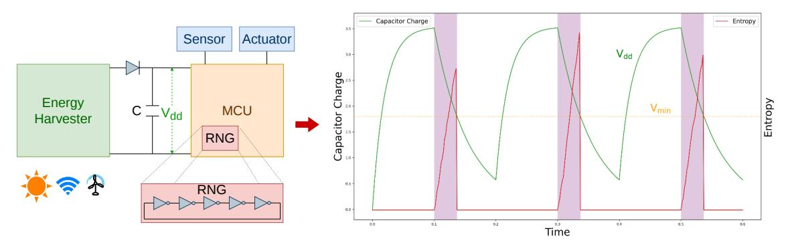
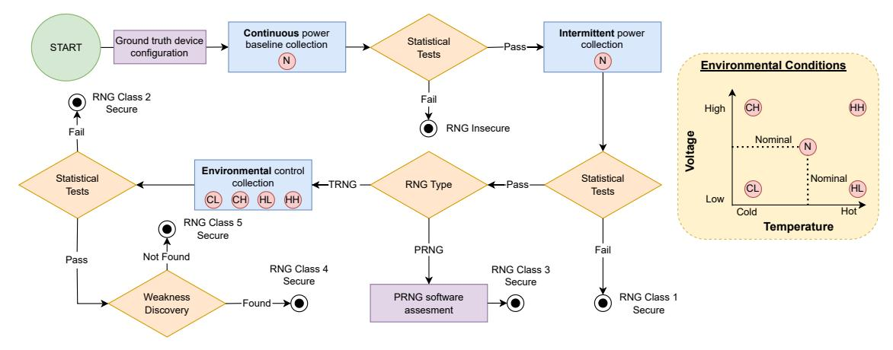
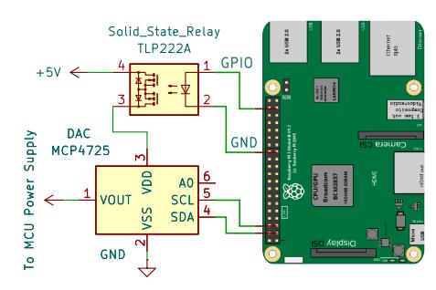
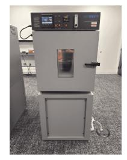
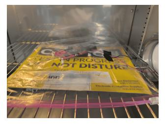
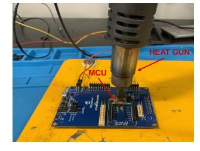

# µRNG: A Framework for Assessing Randomness in Intermittent Computing Devices

Prakhar Sah *Virginia Tech* Blacksburg, USA sprakhar@vt.edu

Matthew Hicks *Virginia Tech* Blacksburg, USA mdhicks2@vt.edu

*Abstract*—Ultra-low Size, Weight, and Power (UlSWaP) devices, capable of energy harvesting and intermittent computation, are enabling the deployment of vast networks of self-powered sensors that integrate seamlessly into our everyday environments. These technologies bring us closer to the horizon of the Fourth Industrial Revolution: a hyper-connected and automated world of smart dust. The combination of pervasive connectivity and physical proximity to sensitive data raises new security challenges. Although lightweight cryptographic protocols exist for resource-constrained systems, their behavior under intermittent power remains poorly understood. While researchers have made significant progress toward realizing practical intermittent computing systems, securing these devices and their communications remains an open problem.

We lay the groundwork for securing intermittent computing systems by addressing the foundation of all cryptographic protocols: random number generation. Security protocols rely on random values for key material and nonces, yet the impact of intermittent operation on Random Number Generators (RNGs) is unclear. We survey real-world UlSWaP devices suitable for intermittent computation and observe a wide range of RNG implementations. We show that applying traditional statistical analyses, designed for continuously powered systems with limited attacker access, can yield a false sense of security in intermittent environments. To address this gap, we introduce a systematic framework for assessing and qualifying RNGs under intermittent operation. Using this framework, we evaluate nine UlSWaP device families representative of academic and commercial platforms, spanning 189 devices across manufacturers, cores, operating conditions, and security capabilities. Our analysis finds that 132 devices lack on-chip RNGs, 27 employ RNGs that are insecure under intermittency and environmental influence, and only 23 provide trustworthy entropy sources. We conclude with recommendations for selecting devices to serve as the base for future security-enabled intermittent computing systems.

## I. INTRODUCTION

The Internet of Things (IoT) industry generates over one trillion dollars in annual revenue [89]. Its ubiquity: 30.9 billion connected devices [77] storing 79 zettabytes of data [78] demands secure communication among edge nodes. However, the resource constraints of Ultra-low Size, Weight, and Power (UlSWaP) devices that underpin intermittent computing systems make the direct application of security mechanisms used in desktops or smartphones infeasible. A key consequence is the limited ability of these devices to generate secure key material. Common-case power cycles and dependence on an attacker-controlled environment put further stress on the secure generation of cryptographic randomness.

Cryptographic protocols rely fundamentally on randomness. Random values underpin both long-term and ephemeral session keys. Long-term keys are typically derived from device-specific identity extractors such as Physical Unclonable Functions (PUFs), providing persistent authentication anchors. Forward secrecy, however, requires ephemeral keys that are independent of both long-term material and earlier ephemeral keys. This demands continuous access to high-quality randomness on the device.

Commodity systems meet this need by coalescing entropy from non-deterministic physical processes such as user input timing, disk I/O latencies, or specialized hardware True Random Number Generators (TRNGs). UlSWaP devices, defined by their deeply embedded nature and constrained by limited peripherals and simplified hardware, lack such entropy diversity. Previous research demonstrates that insufficient entropy in headless embedded systems leads to weak and duplicate TLS and SSH keys across the Internet [28], [30], [38]. UlSWaP devices amplify this problem by offering even fewer entropy sources, forcing longer collection times before secure key material becomes available. This is antithetical to the runtime profiles of intermittent systems, which include power-on times often lasting less than 100 ms [35]. Adding further complexity, intermittent systems harvest energy from their environment by design, providing attackers with a leverage point to influence and undermine random number generation. Traditional approaches to RNG security analysis do not account for these dynamics or the influence of the attacker on power availability.

In this paper, we present µRNG, a systematic framework for evaluating the robustness of Random Number Generators (RNGs) in intermittent computing systems. µRNG integrates industry-standard tests with custom analyses that capture the dynamics and adversarial influence of intermittent environments to characterize statistical strength, implementation flaws, and environmental resilience. We apply our framework to a diverse set of commercial off-the-shelf UlSWaP devices used in energy harvesting and intermittent computing systems across academia and industry, spanning 189 devices, varying in architecture, operating conditions, and manufacturer. Our analysis finds that 132 devices lack on-chip RNGs, 27 employ RNGs that are insecure under intermittency in an attackercontrolled environment, and 23 provide intermittent-tolerant and resilient random numbers. Our evaluation further exam-

Fig. 1: Energy-harvesting systems replace batteries with an energy-storage capacitor. This figure depicts the capacitor's ideal duty cycle under square-wave input power. The harvester charges the capacitor until  $V_{dd}$  exceeds the MCU turn-on threshold, after which the MCU executes and discharges the capacitor faster than the harvester can replenish it. When  $V_{dd}$  falls below the minimum operating voltage  $V_{min}$ , the MCU powers off. The highlighted intervals indicate active computation. Entropy slowly accumulates within a power cycle (5-stage ring oscillator depicted) and resets between power cycles. TRNG weaknesses and low rate along with power-cycle-induced entropy loss lead to weak keys and nonces.

ines RNG throughput and hardware pseudorandom support to identify systemic weaknesses. Based on these findings, we provide guidelines for RNG qualification to inform future secure intermittent computing system design.

In summary, this paper makes the following contributions:

- We develop μRNG, a systematic framework for evaluating the robustness of random number generators in energy harvesting/intermittent computing settings (§IV, V).
- We survey a range of 189 UISWaP devices and characterize their random number generators using our framework, revealing many devices provide no RNG support and some that do are insecure for the intermittent computation use case (§VI).
- We provide device guidelines for different applications and threat models, and suggest future directions for deployed systems with weak RNGs (§VI, VII).

## II. BACKGROUND

Modern cryptographic systems depend on unpredictable key material to safeguard confidentiality in both symmetric and asymmetric techniques. Nonces and keyed hashes, meanwhile, provide integrity and protection against replay attacks during communication. A Random Number Generator (RNG) generates a sequence of bits, the ideal odds of guessing a bit being no better than a truly random event such as a fair coin toss. Deriving truly random numbers requires sampling a source that is non-deterministic. While non-determinism is abundant in the physical environment, it remains challenging to harness in digital circuits due to their inherent determinism.

### A. Random Number Generation in Energy Harvesting Systems

Energy harvesting systems replace batteries by extracting energy from sources like sunlight [68], wind [41], and radio waves [36], [68], [97], but this results in intermittent, insufficient power for sustained operation. Figure 1 illustrates

intermittent nature of power in energy harvesting systems. Correctly supporting long-running computation across these frequent and unpredictable power cycles is known as intermittent computation.

Intermittent computation is widely studied, and most system designs [7], [8], [31], [35], [43], [46], [66], [95] enable forward progress by checkpointing intermediate program state to non-volatile memory and restoring that state after a power failure. With these techniques now well established, security becomes the next critical challenge for intermittent devices. Specifically, when intermittent devices store sensitive data (including checkpoints) or interface with established secure services and protocols, they must provide strong confidentiality, integrity, and authentication guarantees to preserve end-to-end security.

Figure 1 illustrates how entropy accumulates in a ringoscillator RNG across power cycles. Intermittent power from an energy harvester constrains computation to brief execution bursts, with power-on times that can drop below 100 ms [35] depending on the energy source, ambient conditions, and storage capacitance. However, most physical entropy sources are rate-limited and require a nontrivial interval after boot to accumulate sufficient entropy for cryptographic use. This mismatch between the entropy accumulation time and the available execution window, known as boot-time entropy hole is emphasized in intermittent computation, leaving software with inadequate entropy [30], leading to the generation of weak keys and nonces, undermining the security of all subsequent cryptographic operations. Consequently, it is important to evaluate RNGs in intermittent computing settings as such devices live in the boot-time entropy hole.

## B. Energy Harvesting Capable UlSWaP Devices

Ultra-low Size, Weight, and Power (UlSWaP) devices that enable intermittent computation on energy harvesting systems are deeply embedded around us, often deployed on their own, and as such interact with users very infrequently. Their mWscale power budgets and small area make it difficult to implement specialized circuitry for random number generation. Additionally, their environmental dependence and physical accessibility make them vulnerable to manipulation, while intermittent operation impedes entropy accumulation. Given these challenges, *it is crucial to audit RNGs available in commodity UlSWaP devices before building secure intermittent systems on top of them.*

# *C. True Random Number Generators (TRNGs)*

TRNGs harvest entropy from physical phenomena to generate non-deterministic bit streams. Commodity systems often sample timing variations in user input, device noise, or peripheral activity (e.g., Linux's /dev/random). In contrast, Ul-SWaP devices must rely on lightweight analog noise sources. Three dominant entropy sources are used in such settings.

- *1) Ring Oscillators (ROs):* Ring Oscillators (ROs) consist of an odd number of inverters connected in a feedback loop, generating oscillations whose frequency depends on loop delay. Small timing variations caused by temperature or supply fluctuations introduce jitter, which can be digitized into random-influenced bits. However, this sensitivity also makes ROs vulnerable to environmental interference.
- *2) SRAM:* Each SRAM cell comprises cross-coupled inverters that, upon powering up, resolve to a state determined by manufacturing variation and environmental noise [81]. Transistors with nearly identical threshold voltages settle on a mostly random value each startup, providing entropy. Like ROs, the sensitivity of SRAM's power-up state to environmental noise makes it vulnerable to attacker influence. Moreover, SRAM cell transistors also suffer from Bias Temperature Instability (BTI) [72]: as a transistor ages (due to it driving the cell's state), the voltage at which it turns-on increases (i.e., threshold voltage). This changes the odds of the next power-on race to set the cell's state [32], [47], [49].
- *3) Electrical Noise:* Electrical noise includes shot noise, thermal noise, and flicker noise, with thermal noise (Johnson-Nyquist noise) being the primary type captured by embedded TRNGs. Thermal noise manifests itself as voltage or current noise and is in turn caused by blackbody radiation inside a conductor. Hence, it mainly depends on the temperature and resistance of the electrical component. TRNGs capture Johnson-Nyquist noise through voltage fluctuations across a resistive component, digitized to produce random-influenced numbers. Although such TRNGs directly harness the effects of Johnson-Nyquist noise, it is present in other analog domain processes as well, like the timing jitter in ROs.

# *D. Pseudo Random Number Generators (PRNGs)*

PRNGs use deterministic algorithms (e.g., cryptographic hashes or stream ciphers) to expand a small, high-quality seed into a long random-looking sequence. Their security depends entirely on the secrecy and unpredictability of that seed. In practice, TRNGs and PRNGs are combined: the PRNG "stretches" a small amount of randomness from the TRNG to create many keys, such as in Linux's /dev/urandom.

## III. THREAT MODEL

Ultra-low Size, Weight, and Power (UlSWaP) devices are deeply embedded into society, granting an adversary physical access. This proximity, combined with the known sensitivity of hardware True Random Number Generators (TRNGs) to operational and aging attacks [11], [32], [49], [51], [58], [79], [98], forms the basis of our threat model.

Traditional TRNG threat models fail to capture cross-layer effects because they isolate attacks into separate categories (e.g., operational, physical, or software). Since intermittent systems inherently entail a close coupling of hardware and software, we propose a unified, cross-layer threat model. This model aligns with contemporary research on these emerging devices [29], [49], [63], [70] and serves as the foundation for evaluating the robustness of their TRNGs.

Adversary Capabilities: Our adversary is a Level 2 physical attacker following the FIPS 140 taxonomy [59], where the microcontroller package acts as the security perimeter. The attacker is capable of invasive, non-destructive manipulation and possesses the following key capabilities:

- Power and Environmental Control: The attacker can manipulate the device's power supply (e.g., through brownouts or surges) and remove off-chip components to bypass regulation circuitry. They also have control over ambient environmental conditions, including temperature, humidity, and supply voltage. This control enables them to control power cycles and accelerate the aging process of the internal transistors non-destructively.
- Physical Monitoring: The attacker can probe package pins to monitor board-level communication, e.g., traffic between external TRNGs, memory chips, and the MCU.
- Software Tampering: The attacker can leverage standard programming interfaces, such as debuggers and Direct Memory Access (DMA), to inspect or tamper with the victim's software state and memory. This includes the ability to load untrusted software.

Following the threat model of related operational attacks [48], we consider devices that are permanently locked against programming and software updates to be outside the scope of our threat model. This work also does not focus on side-channel attacks, as our goal is not to exfiltrate the key material but to assess the quality of its source. This unified model serves as the basis for evaluating TRNG robustness under physically accessible, environmentally controlled conditions typical of intermittent computing systems.

# IV. µRNG FRAMEWORK OVERVIEW

The goal of a True Random Number Generator (TRNG) is to produce an unpredictable sequence of bits to be used for ephemeral keys and nonces. This means that seeing the entire history of bits produced by a TRNG does not help you guess the next bit (or set of bits) that it produces (i.e., bits are independent). Probabilistically, the occurrence for each possible number that an ideal TRNG generates is equal, i.e., *uniformly distributed*. Given the sensitivity of hardware-based

Fig. 2:  $\mu$ RNG testing framework.

noise sources to their environment, it is possible to influence this probability of occurrence.  $\mu$ RNG testing framework combines different experiments to quantify and influence the quality of a TRNG's output. Based on the outcome of these experiments, we classify RNGs into classes:

- Insecure: do not use in any scenario.
- Class 1: suitable for nominal, continuous operation.
- Class 2: suitable for nominal, intermittent operation.
- Class 3: suitable for extreme, intermittent operation as long as all software is trusted.
- Class 4: suitable for extreme, intermittent operation, possibly weak.
- Class 5: suitable for extreme, intermittent operation, recommended.

Figure 2 presents the experimental stages of  $\mu$ RNG. The framework evaluates and characterizes RNG robustness under varying operating conditions. Before every experiment, we uncover the ground truth configuration of the RNG. Our goal is to capture the RNG output before any hardware or software modifies it. This ensures that we characterize and evaluate the raw TRNG sequence without masking any effects of drop in entropy. We begin our experiments by collecting a continuous batch of outputs under nominal conditions and analyze them statistically to quantify their quality. Many well-established test suites exist for statistical analysis, such as NIST [69], Diehard [16], [52] or TestU01 [44]. If the RNG passes this stage, we proceed to collect outputs under intermittent operation and varying environmental conditions to assess RNG strength in deeply-embedded intermittent settings.

For the second analysis stage we introduce the effects of intermittency on the RNG. Intermittent systems are plagued by common-case restarts; this is often when RNGs are least secure as they have not accrued enough entropy [28], [30]. Thus, key material and nonces will always come shortly after

power-on in intermittent computing systems. To replicate the effects of intermittency on key generation, we take the first set of bits from the RNG after each power cycle of the target device. We then stitch these initial RNG outputs together to form a longer bit stream. Just as in the previous stage, we use existing tools to analyze the quality of the resulting bit stream.2 Once the key material has been recorded, we power cycle the device.

For the third stage we determine if the RNG is actually a Pseudo-RNG (PRNG) or a TRNG. If it is a PRNG, then environmental variation has no impact on the resulting bit stream because its behavior is entirely software defined. In this case, we analyze the security of the seed used by the PRNG from a co-resident software attacker. This analysis centers on uncovering how the device reads, updates, and protects the key from being accessed by unprivileged software. In the case of a TRNG, we analyze the security of the TRNG with respect to a physical attacker.

The headless nature of UISWaP devices means TRNGs must harvest randomness from analog domain noise; this makes them sensitive to environmental conditions like temperature and voltage. The fourth stage of analysis accounts for effects of the environment on TRNG output: for each device, we define extreme voltage/temperature corners of operation. For each corner of operation, we perform the same data collection and analysis that we did for the second analysis stage.

Devices that still produce bit streams that pass all statistical tests move to the fifth and final analysis stage: weakness detection. In this stage, we couple existing statistical tests with additional low-level tests to determine whether there is a correlation between environmental conditions and the TRNG output quality. Note that in this case, quality is no longer binary as we are looking for a weakness that a determined/powerful attacker might be able to exploit in the future.3

&lt;sup>1TRNG post-processing only serves to mask inherent TRNG weakness deterministically. Thus, we must analyze the raw TRNG outputs to assess its true strength.

&lt;sup>2These test suites evaluate randomness primarily by detecting statistical deviations in a bitstream, agnostic of its semantic "continuity".

&lt;sup>3As with DES, MD5, and SHA1, weakness often precedes full compromise.

Fig. 3: Power controller circuit diagram.

# V. µRNG IMPLEMENTATION

Table I lists the device families that we select for evaluation inspired by prior work on intermittent computing devices [31], [35], [43], [45], [46], [66], [93]–[95]. They span nine families across four manufacturers, totaling 189 devices with diverse architectures, clock speeds, memory specifications, and operating capabilities. For each family, we select a representative device for evaluation, with the results extending to the rest of the devices in the family. These platforms follow a modular design and reuse common components across variants, so devices within a family share the same RNG implementation. We confirm this by cross-checking vendor datasheets, technical whitepapers, and schematic diagrams before generalizing the results. From a security standpoint, these families differ in protection mechanisms and randomness generation strategies, exhibiting varied resistance to software and physical attacks. This section details the µRNG testing framework's implementation stages and their adaptation to the challenges posed by this diverse device set.

# *A. Uncovering Ground Truth Configuration*

Our goal is to capture the RNG output before any hardware or software modifies it. While some devices directly provide an API for the raw TRNG output, others require modification to the source code to access it. Apollo 4 family of MCUs statically link shared crypto libraries at compile time, which means that we cannot modify the source code directly to get the raw TRNG output. In this case, we manually reverse engineer the binary by single stepping via a debugger to find the instruction at which the TRNG hardware populates its output at a memory-mapped output register. Then we patch the binary to get this raw RNG output instead of the one provided by the library API.

# *B. Intermittent Power Collection*

To assess the impact of intermittent operation on random number generation, we power cycle the target, collecting the most significant 16 bits of the first RNG output each cycle. We perform this collection across 65,536 power cycles,

Fig. 4: Left: TE-123H temperature/humidity chamber. Right: MSPM0L2228 evaluation board in an airtight bag inside the thermal chamber with soldered connections going out.

concatenating the results to form a single 128 KB bit stream that we pass on to statistical testing. Each power cycle includes sufficient downtime (2 seconds) to discharge residual conductance and prevent carry-over from prior power-on periods.

To systematically power cycle the devices across a large number of trials and vary their supply voltage, we create a power controller as depicted in Figure 3. The power controller consists of a single pole single throw TLP222AF solid state relay [19] along with a MCP4725 Digital-to-Analog Converter [34] (DAC) on its power plane, which transforms the input voltage to the desired output voltage. We use a Raspberry Pi 3B to send control signals to the relay and supply its power plane with a steady 5V. The Raspberry Pi communicates with the DAC via I2C protocol to control the output voltage, which ranges from 0V to 5V. The Raspberry Pi also serves as the external storage device when the MCU on-board storage is insufficient. Finally, we execute a script on the Raspberry Pi to automate the scheduled power on and off cycles of the Device Under Test (DUT).

## *C. Thermal Control Configuration*

To stress test RNGs under extreme environmental conditions, we follow the device-specific operating ranges, listed in Table I. For extreme thermal conditions, we consider the industrial operation range of -40 C to +85 C. Although it is tempting to go beyond this range, most devices fail to operate outside of it as solder weakens if subjected to temperatures above +85 C for extended periods of time. However, during our experiments, we observe that some devices withstand temperatures as low as -68 C. For precise control of the testbed environment for extended periods, we use the TE-123H temperature/humidity chamber [83] shown in Figure 4. This chamber features a thermal range of -68 C to +175 C and has the ability to reliably maintain <25% humidity at room temperature and above. We place our DUT inside the chamber, connected to the power control setup fixed on the outer wall of the chamber.4 During our experimental trials, we observe that cooling the DUT to sub-freezing temperatures

4The operating ranges of individual components in our power control setup interfere with the DUT's operating range, so we opt to place it outside the chamber.

| Device Family            | Processor Core | Max Clock (MHz) | NVM Type | NVM Size (KB) | Min NVM Write Size (B) | SRAM Size (KB) | Operating Volt. (V) | Operating Temp. (C) |
|-----------------------------|-------------------|--------------------|-------------|------------------|---------------------------|-------------------|---------------------|---------------------|
| (1) FE310-G002 [75]         | RISC-V            | 320                | Flash       | 4096*            | 1                         | 16                | 1.8 - 3.3           | -40 / +85           |
| (44) MSP430FR59x/69x [86]   | MSP430X           | 16                 | FRAM        | 32 - 256         | 1                         | 1 - 8             | 1.8 - 3.6           | -68 / +85           |
| (23) MSPM0 L-Series [88]    | Cortex-M0+        | 32                 | Flash       | 8 - 256          | 8                         | 2 - 32            | 1.62 - 3.6          | -68 / +85           |
| (15) SAM D21 [56]           | Cortex-M0+        | 48                 | Flash       | 32 - 256         | 64                        | 4 - 32            | 1.62 - 3.63         | -40 / +125          |
| (27) SAM L10/L11 [57]       | Cortex-M23        | 32 - 48            | Flash       | 16 - 512         | 64                        | 4 - 64            | 1.62 - 3.63         | -68 / +215          |
| ( <b>51</b> ) TM4C123x [87] | Cortex-M4         | 80                 | Flash       | 32 - 256         | 4                         | 12 - 32           | 1.7 - 3.3           | -40 / +105          |
| (14) MSP432Px [84]          | Cortex-M4         | 24 - 48            | Flash       | 128 - 2048       | 1                         | 32 - 256          | 1.62 - 3.7          | -68 / +85           |
| (7) Apollo3 [2]             | Cortex-M4         | 96                 | Flash       | 1024 - 2048      | 16                        | 384 - 768         | 1.75 - 3.63         | -40 / +85           |
| (7) Apollo4 [3]             | Cortex-M4         | 192                | MRAM        | 2048             | 16                        | 1024 - 2816       | 1.71 - 2.2          | -40 / +85           |

TABLE I: Device family specifications for MCUs we evaluate. Operating ranges reflect observed tolerances during experiments, not necessarily documented limits. \*Size determined by external flash chip. The number before each family name indicates how many unique devices belong to that family.

for extended periods causes frost formation on its surface, which prematurely halts its operation due to short circuits. To overcome this, we first reduce chamber humidity to below 25% at room temperature with the DUT placed inside an airtight package and then seal the package before cooling the DUT.

#### D. Statistical Tests

| NIST Statistical Tests         |                           |  |  |  |  |
|--------------------------------|---------------------------|--|--|--|--|
| Monobit                        | Universal Statistical     |  |  |  |  |
| Frequency Within a Block       | Linear Complexity         |  |  |  |  |
| Runs                           | Serial                    |  |  |  |  |
| Longest-Run-of-Ones in a Block | Approximate Entropy       |  |  |  |  |
| Binary Matrix Rank             | Cumulative Sums           |  |  |  |  |
| Discrete Fourier Transform     | Random Excursions         |  |  |  |  |
| Non-Overlapping Template       | Random Excursions Variant |  |  |  |  |
| Overlapping Template Matching  |                           |  |  |  |  |

TABLE II: List of tests in the NIST Statistical Test Suite

No single test fully quantifies randomness, as apparent nondeterminism may stem from limited understanding, while truly random processes can occasionally show low entropy due to pure chance. Over years of deliberation, this challenge has led to the development of statistical test suites that assess randomness from multiple analytical perspectives. The National Institute of Standards and Technology (NIST) provides a widely-adopted test suite [69], consisting of 15 different tests (Table II) to evaluate the statistical quality and unpredictability of bit sequences. Industry standards require RNGs to pass NIST certification by analyzing long continuous sequences that rule out short-term entropy fluctuations. Following suit, the initial step in our framework is to verify RNG robustness in the continuous collection mode. However, passing the NIST tests in this manner is insufficient to claim security, as their diagnostic reliability depends strongly on how the data is collected, segmented, and concatenated before analysis.

#### E. Weakness Discovery Tests

To characterize TRNG behavior across environmental corners, we supplement NIST tests with additional tests aimed at exploring characteristics that reveal deeper insights into distribution quality, entropy behavior, and spatial correlation.

1) Collision Tests: Consider an RNG that outputs n uniformly distributed random bits at a time. How many such n-bit random sequences do we need before two sequences collide? For a total of  $2^n$  different possible combinations,  $2^n + 1$  sequences guarantee that at least one sequence repeats, an intuitive fact known as the pigeonhole principle. However, it is more likely than not (> 0.5 probability) that a collision occurs at a much smaller number of samples than intuition dictates, known as the birthday paradox.

The minimum number of samples required (k) for the probability (p) that at least one collision occurs is given by:

$$k \simeq \sqrt{2 \cdot 2^n \cdot \ln(\frac{1}{1-p})} \tag{1}$$

The birthday problem [53] details how the probability of collision becomes > 0.5 at a sample size of 302 and > 0.99 (guaranteed collision for practical purposes) at 777 samples, a number much lower than the intuitive 65,537 samples. Interestingly, when the generated sequence exhibits a non-uniform distribution—indicating a reduction in RNG output unpredictability and hence, its overall security—the practical sample size required to observe a collision diverges from the theoretically expected value based on uniform randomness. To better quantify this, we consider the equation of expected number of collisions (E) for a given number of samples collected (k):

$$E = \binom{k}{2} \cdot (\frac{1}{2^n}) \tag{2}$$

Our primary goal in this experiment is to check whether environmental stresses cause deviations in the observed number of collisions from the expected value. Moreover, we want to find out whether recognizable patterns emerge in these deviations under different environmental conditions.

2) Entropy: Another way to think of "non-uniformness" in RNG generated distributions is entropy. Entropy is the measure of uncertainty in an RNG's output or in the context of a TRNG, the measure of operational noise in the output. Various entropy estimation metrics exist, the two most popular ones being min-entropy and Shannon's Entropy, belonging to the Renyi family of entropies [17]. min-entropy measures the worst-case uncertainty of a random sequence. It encapsulates the odds

of an attacker with a priori knowledge of the RNG's outputs at guessing the next output. Naturally, for a knowledgeable attacker, the best strategy is to guess the most likely output:

$$min\text{-}entropy = -\log_2(\max_i p(x_i))$$
 (3)

Shannon's Entropy on the other hand, measures the average uncertainty of a random sequence. It encapsulates the guessing odds of an attacker with no prior knowledge of the RNG's outputs. The best strategy in this case is blind guessing, captured in Shannon's Entropy calculation:

Shannon's 
$$Entropy = -\sum_{i=1}^{m} p(x_i) \log_2 p(x_i)$$
 (4)

where m is the total number of collected samples. For a perfectly random generator with  $2^n$  possible n-bit outcomes, all outcomes occur with equal probability. Consequently, both Shannon's Entropy and min-entropy attain the theoretical maximum of n, meaning that each bit contributes equally to the total randomness of the sequence, both on average and in the worst-case sense. The goal of this experiment is to quantify the drop in operational noise of RNGs as we vary the environmental conditions.

3) Moran's I: Moran's I is a statistical measure of spatial autocorrelation that quantifies the degree of clustering in spatial data. We apply it to bitmaps to identify and compare the clustering of data. It is defined as:

Moran's 
$$I = \frac{N}{W} \cdot \frac{\sum_{i=1}^{N} \sum_{j=1}^{N} w_{ij} (x_i - \bar{x})(x_j - \bar{x})}{\sum_{i=1}^{N} (x_i - \bar{x})^2}$$
 (5)

where N is the number of elements in the bitmap,  $w_{ij}$  denotes the spatial weight between elements i and j (we calculate this using shared borders and k-nearest neighbors),  $W = \sum_{i=1}^{N} \sum_{j=1}^{N} w_{ij}$ ,  $\bar{x}$  is the mean value of the dataset, and  $x_i$  is the value of element i. Moran's I is bounded in [-1, 1], with -1 indicating complete dispersion, 0 indicating spatial randomness, and 1 signifying perfect clustering. For a truly random bitmap, the expected Moran's I value is 0, representing the absence of spatial correlation.

# F. Data Collection

We store RNG sequences either on-chip or off-chip depending on the available NVM capacity, as characterization requires up to 384 KB of storage in some cases ( $\S$ VI-B5). Characterizing a TRNG, as described in  $\S$ V-E1, requires  $2^n \cdot n$  bits of storage for n-bit outputs (over 16 GB for 32-bit generators) and takes roughly 136 years to collect considering 1 s per sample. 5 To make this feasible, we limit analysis to the 16 most significant bits, which are suitable for detecting weaknesses while requiring only 128 KB of storage, compatible with UISWaP NVM sizes. 6

Devices with flash-based NVM often restrict writes to linesized operations. For these, we fill an array the size of the write line with the 16-bit random value, mask unused bits with ones, and write repeatedly to the same line until it is full before moving to the next available line. MSPM0 L-series Flash Controller also generates an Error Correction Code (ECC) during line writes, preventing rewrites to the same line before erasing it. In this case, we write to a shadow NVM address space that mirrors the actual NVM address space, but does not involve any ECC checks.

Devices with small NVMs, such as the ATSAML11E16A (64 KB), cannot store all samples, so we transmit data externally over UART. However, UART is slower than on-chip storage. Since we need to allow sufficient downtime between each power cycle (2 seconds on average), collecting  $2^{16}$  samples of 16-bit RNG sequences takes up to 55 hours in certain cases. Thus, we select the optimal strategy per device to minimize collection time and manage NVM constraints.

#### VI. EVALUATION

All intermittent computing devices provide the abstraction of random number generation, even when they lack the capability to produce true randomness. In this section, we assess the support for cryptographic-grade random number generation available to intermittent systems using our representative device suite. Our evaluation addresses the following questions:

- What type of RNGs exist in intermittent platforms?
- How do these RNGs perform under intermittent power?
- How do these RNGs perform in an attacker-controlled environment?
- How do devices with PRNGs resist software-level attack?
- Which devices are viable foundations for future secure intermittent computing systems?

# A. Reference Entropy Sources

SRAM and ring oscillators (RO) are among the most widely used sources of true randomness in commercial resource-constrained devices. Our survey reveals that most UlSWaP TRNGs do not explicitly disclose their underlying entropy source. However, UlSWaP devices, particularly those based on ARM Cortex-M architectures, commonly employ RO jitter as the primary noise source for their TRNGs [4]. To evaluate the security of this prevalent design choice, we require a reliable reference. Additionally, six of the nine device families in our suite lack an integrated hardware TRNG. Given that SRAM is standard in UlSWaP devices, an SRAM-based TRNG serves as an ad-hoc alternative. Accordingly, we characterize both SRAM-based and RO-based entropy sources to assess the security of this broad class of TRNGs.

1) SRAM-based Entropy Source: SRAM-based entropy sources derive randomness from manufacturing-time variation and operational noise at power-up. To characterize SRAM behavior across environmental corners, we collect 4 KB of power-up state from an MSP432P401R Launchpad [85] over

&lt;sup>5Average power cycle time for our DUTs is 3 secs. (2s off, 1s on).

&lt;sup>6For certain security primitives, such as ring oscillators, randomness tends to increase from the most to the least significant bits. To expose potential weaknesses, we focus our analysis on the most significant bits.

Fig. 5: Heatmaps of 4KB of SRAM state across 20 power cycles. Green: 0, Black: 1, Red: Unstable cells. Startup state instability decreases at cold temperature whereas layout asymmetries become more apparent at slow voltage ramp rate.

20 power cycles. The MCU's internal voltage regulation circuitry normally prevents direct manipulation of the power supply. However, because passive components such as decoupling capacitors and inductors are located outside the SoC to save die area, manage heat and maintain a wholly digital process, removing the inductive component enables direct access to the SRAM power rail, bypassing regulation circuits between Vdd and the internal power line that supplies SRAM. We externally supply power to this rail via an RC circuit connected to our power controller (Figure 3), allowing precise ramp-up control.7 Each power cycle includes a 10 s downtime to ensure the voltage fully resets before the next measurement.

*a) SRAM a viable entropy source:* Holcomb et al. [32] demonstrate that 512 bytes of SRAM power-up state can yield a 128-bit random sequence. Under nominal conditions, we observe that 4 KB of SRAM power-up state yields 0.149 bits of entropy per bit and a Moran's I of 0.032, making SRAM a viable source of entropy when conditioned with pseudo random functions. While SRAM cannot generate unbounded entropy as it requires power-cycling for new states, this characteristic suits energy harvesting devices operating intermittently.

*b) When SRAM fails as a viable entropy source:* Figure 5 presents heatmaps of SRAM power-up states across various environmental corners. Our experiments reveal two competing phenomena influencing SRAM behavior: data retention and cell bias due to layout asymmetries. We observe that lower temperatures increase data retention, becoming marked below -40 C. Consequently, at -68 C, 4KB of SRAM state yields 0.004 per-bit entropy. In contrast, at higher temperatures, data retention is very low due to SRAM's insufficient internal capacitance. This lack of data retention combined with the increased thermal noise makes power-up states of SRAM cells more random (per-bit entropy = 0.108 at +85 C). However, this apparent randomness masks a biasing pattern.

Fig. 6: 8-bit entropies of 1000 32-bit sequences from RO TRNG under all operational corners. Solid line shows Shannon's Entropy, dotted line shows min-entropy. Sampling times set as multiples of RO's oscillation period under each corner. RO TRNG randomness improves at lower temperature and higher supply voltage. Also, increasing the sampling time has a generally positive effect on entropy accumulation.

| Operating Conditions | -68◦C    | +25◦C    | +85◦C    |
|----------------------|----------|----------|----------|
| 3.3 V                | 4.00 MHz | 8.54 kHz | 6.27 kHz |
| 2.1 V                | 463 kHz  | 1.01 kHz | 1.33 kHz |

TABLE III: Oscillation frequencies of the five-stage boardlevel RO at different operational corners. Clearly, RO oscillates faster at lower temperature and higher supply voltage directly affecting the TRNG quality as shown in Figure 6.

This pattern is always present in a given SRAM powerup state due to SRAM array layout asymmetries biasing cells closer to the Vdd or ground lines. Slow voltage rampup reduces the uncertainty present during the power-on race, causing SRAM cells to favor states dictated by layout-induced biases. Consequently, at +85 C with slow ramp, 4 KB of SRAM state shows significant stripping with a Moran's I of 0.127. At cold temperatures, however, slow voltage ramp competes with data retention causing a slight increase in the number of unstable cells (per-bit entropy = 0.05) without significant increase in the stripping (Moran's I = 0.015).

Summary: SRAM-based TRNGs suffer from two attackercontrollable sources of insecurity: data retention at cold temperatures and structural asymmetry imprinting at slow voltage ramp rates. This sensitivity to environmental influence makes SRAM-based TRNGs Class 2 secure.

*2) Ring Oscillator-based Entropy Source:* Jitter in RO frequency exhibits strong sensitivity to operational variations arising from variations in propagation delay. For process nodes above 22 nm, the randomness quality of an RO degrades with increasing temperature and decreasing supply voltage.

7Since voltage-level corners are not meaningful for SRAM-based TRNGs, we instead evaluate voltage-ramp-rate corners.

Elevated temperatures reduce carrier mobility in semiconductor materials,8 lengthening the propagation delay of each inverter stage. Although higher temperatures also lower threshold voltages which slightly improve switching speed, carrier mobility degradation dominates at these process node sizes. Similarly, a lower supply voltage decreases the switching speeds of transistors by slowing the charging and discharging of input parasitic capacitances. The resulting slower oscillation produces fewer jitter events per unit time as the transition wave circumvents the feedback loop fewer times, thereby reducing overall non-determinism in the RO's sampled output.

To validate this behavior, we implement a board-level RObased TRNG using five CMOS inverter gates. A Raspberry Pi 3B samples Vout through its GPIO pins (rated 3.3 V) using a custom C program that directly accesses memorymapped registers to satisfy real-time sampling requirements. Figure 6 shows the variation of 8-bit block entropy with sampling time, while Table III lists the measured oscillation frequencies of the RO under different operating conditions, confirming the predicted trends. The results show that sequence entropy depends on the RO's oscillation frequency and therefore on environmental conditions that directly modulate that frequency. Moreover, entropy increases with sampling time and then saturates, as jitter in the oscillations accumulates over successive traversals of the RO transition waveform.

Summary: Randomness of CMOS RO-based TRNGs degrades as temperature rises and supply voltage falls, enabling attackers to influence their outputs. Since RO-based TRNG quality varies substantially across process nodes and inverterstage configurations, we classify these designs as Class 4 secure, potentially degrading to Class 2 secure depending on the specific RO implementation.

# *B. Commercial Devices*

We audit nine commodity UlSWaP families spanning 189 devices to identify RNGs suitable for secure intermittent systems. Table IV summarizes the main findings of our assessment. Our analysis identifies 88 devices with PRNGs seeded non-randomly (Class 1) and 44 devices with fixed device-level PRNG seed (Class 3). Among 50 devices with on-chip TRNGs, 27 meet Class 2 security and only 23 provide trustworthy entropy (Class 5). We also find bus-snooping vulnerabilities in off-chip TRNGs on SAM L10/L11 Xplained Pro boards. Finally, we find that 7 devices feature a Hybrid RNG (HRNG) with indication of environmental influence (Class 4) and vulnerable intermediate software state (Class 3). We further characterize each RNG by its conditioning Pseudo Random Function (PRF) and throughput. In the following sections, we examine each RNG type in detail.

*1) PRNGs with non-random seeds:* Five out of nine device families, spanning 88 devices, lack a dedicated RNG. They only offer pseudo random generation through C Standard Library's rand() API, failing to meet NIST SP 800-90C [10] requirements due to absence of an entropy source. Moreover, these PRNGs fail the NIST tests under intermittent collection because they reinitialize from a constant seed. The Adafruit Metro M0 Express [1] (SAM D21) also supports Circuit-Python's random.getrandbits() and os.urandom() APIs, but since the SAM D21 lacks a TRNG, calls to os.urandom() raise a NotImplementedError. In that case, seeding falls back to system uptime, which resets on power cycles (error ≈ 100 ns), producing repeating sequences that again fail the NIST tests.

PRNGs initialized with non-random seeds are unsuitable for intermittent use. We recommend using a TRNG to continuously reseed the PRNG with high-entropy input to maintain unpredictability across power cycles.

*2) PRNGs with device-specific seed:* 44 devices from Texas Instruments' MSP430FR59x/69x family incorporate a HW AES accelerator to implement a PRNG for cryptographic applications [65]. At its core, this PRNG, called the Counter Mode Deterministic Random Byte Generator (CTR-DRBG), uses the AES accelerator as a stream cipher to generate random bits in 128-bit multiples for key or key-material generation. The CTR-DRBG operates in three phases: *instantiation*, *working-state update*, and *random-bit generation*.

When invoked, the RNG API checks the value of an 8-bit instantiated\_flag stored in the .infoD FRAM section. If the flag is unset, the API performs instantiation using a 128-bit fixed seed located in device descriptor memory (TLV) at 0x1A30 and a 64-bit nonce at 0x1A0A. 9 The AES accelerator expands them into a 128-bit cipher key and 128-bit data block forming the 256-bit working state. The API then calls ctr\_drbg\_update(), which increments and encrypts the data twice with the key to produce a new working state, before saving it to .infoD and setting the instantiated\_flag to 0xAA. Once instantiated, the PRNG generates random bytes by incrementing and encrypting the data block with the key until it reaches the requested length. Finally, ctr\_drbg\_update() refreshes the working state. In subsequent calls, instantiation is skipped.

Under continuous collection, NIST tests reveal no statistical weaknesses. Because the API updates the working state to non-volatile FRAM, the device continues generating unique sequences under intermittent operation as well. However, the TLV region containing the initial seed and nonce is readable by co-resident software as well as external interfaces (debugger and DMA). Although TLV is read-only, knowledge of these constants exposes the entire pseudorandom sequence. More critically, the .infoD FRAM section, holding both the working state and instantiated\_flag, is fully accessible for read and write operations, allowing an attacker to not only reconstruct but also manipulate the PRNG state.

To demonstrate the extent of this vulnerability in the realworld, we construct an exploit showing how access to the

8This is only true above cryogenic temperatures. At sub-cryogenic temperatures, impurity scattering dominates lattice scattering, causing a decline in carrier mobility with decrease in temperature.

9Both values are programmed during production and remain constant.

| Device Family     | Device Count | RNG Type | Entropy Source    | PRF Applied               | PRF Platform | RNG Security    | Throughput (bits/cycle) |  |
|----------------------|-----------------|-------------|----------------------|------------------------------|-----------------|--------------------|-------------------------|--|
| TM4C123x [87]        | 51              | PRNG        | Х                    | LCG                          | SW              | Class 1            | 0.4054                  |  |
| Apollo3 [2]          | 7               | PRNG        | Х                    | LCG                          | SW              | Class 1            | 0.3333                  |  |
| MSP432Px [84]        | 14              | PRNG        | Х                    | LCG                          | SW              | Class 1            | 0.3750                  |  |
| FE310-G002 [75]      | 1               | PRNG        | Х                    | LCG                          | SW              | Class 1            | 0.0006*                 |  |
| SAM D21 [56]         | 15              | PRNG        | System Uptime        | Yasmarang                    | SW              | Class 1            | 0.0085                  |  |
| MSP430FR59x/69x [86] | 44              | PRNG        | Device-Specific Seed | AES-128-CTR                  | SW+HW           | Class 3            | 0.2402                  |  |
|                      |                 | TRNG        | ND                   | ND                           | ND              | Insecure           | 0.0007                  |  |
| SAML10/L11 [57]      | 27              | (off-chip)  | (off-chip)           | (off-chip)                   | (off-chip)      | (bus-snooping)     | 0.0007                  |  |
|                      |                 | TRNG        | ND                   | ND                           | ND              | Class 2            | 0.3810                  |  |
| MSPM0 L-Series [88]  | 23              | TRNG        | Thermal Noise        | Stream Cipher Bitwise XOR | HW              | Class 5            | 0.1250 - 1.0000         |  |
| Apollo4 [3]          | 7               | HRNG        | ND                   | ND SHA512 AES-CTR      | SW+HW           | Class 3 Class 4 | 0.0001                  |  |

TABLE IV: RNG evaluation results. LCG: Linear Congruential Generator. ND: Not Disclosed. \*Subsequent requests execute faster due to pre-initialization and caching, but since operation is intermittent, we report the first-request throughput.

PRNG's internal state compromises message confidentiality. 10 Two MSP430FR5994 boards using a Diffie-Hellman key exchange protocol generate 2048 bits of random data to derive a shared secret. We reconstruct the CTR-DRBG algorithm in software on our workstation and, using the knowledge of fixed seeds and nonces, reproduce their exact 2048-bit random streams and derive the shared secret. Now, if the devices contain pre-instantiated PRNGs, an attacker has to search the generated sequences to locate the correct 2048-bit random stream to derive the secret. To simplify this, we exploit write access to the working state. We load a malicious patch on each device to reset the instantiated\_flag before the API check, forcing re-instantiation. Since re-instantiation uses the initial seed and nonce, the PRNGs repeat the same sequence of bits, enabling immediate recovery of the shared secret.

PRNGs seeded with a fixed device-specific seed lose security when the seed, nonce, or internal state become accessible. Periodic reseeding with TRNG entropy ensures prediction resistance and preserves cryptographic strength.

3) Off-chip TRNGs: SAM L10/L11 Xplained Pro [55] include the off-chip cryptographic accelerator ATECC508A [54] which supports authentication using ECDH, ECDSA and SHA256 protocols. This accelerator features an internal FIPScompliant RNG for the purpose of preventing replay attacks during public-private key pair generation, as well as to support any cryptographic protocol on the MCU that requires random numbers. However, since the RNG resides off-chip, it remains vulnerable to bus snooping attacks. To validate this, we place probes on the MCU's I2C SDA and SCL pins (PA16 and PA17 on SAML11 Xplained Pro), and monitor them on an oscilloscope, successfully capturing the random bits transferred from the accelerator to the MCU. Notably, the SiFive HiFive1 Rev B development board [76], which we use to evaluate the FE310-G002 MCUs, also includes an ESP32 WiFi and Bluetooth module [23] that features a TRNG. However, the MCU lacks

Fig. 7: Percentage deviation in actual collisions from expected collisions for  $2^{16}$  random samples generated from SAML11E16 under different environmental conditions. Indicates exponential relation between deviation and temperature.

Fig. 8: Heat gun setup for ATSAML11E16A evaluation; proving attackers do not need precise control to weaken TRNGs.

a direct interface for requesting randomness from the off-chip module; therefore, we exclude it from our evaluation.

Off-chip TRNGs are vulnerable to bus-snooping attacks.

4) On-chip TRNGs: On-chip TRNGs embed the entropy source in the SoC, providing stronger protection against software and physical attacks. This section evaluates their behavior under varying conditions and notes potential limitations.

10 Extends to message integrity as well.

[A] SAM L10/L11. 27 devices from Microchip's SAM L10 and SAM L11 families feature an on-chip TRNG. The on-chip TRNG produces a 32-bit random number in 84 cycles and stores it in the memory-mapped register TRNG\_REGS->TRNG\_DATA for consumption. The documentation provides no details on the entropy source used or any conditioning algorithm. Both continuous and intermittent samples pass the NIST tests, though the collision test reveals a pattern emerging with variation in environmental conditions.

Figure 7 shows that increasing the temperature increases the number of collisions while voltage11 is inversely proportional. Moreover, there appears to be an exponential relationship between deviation from expected collisions and temperature. At +85 C and 3.3 V, we observe the highest number of collisions with 4.2% deviation from expected collisions, while -68 C and 1.8 V register the lowest number of collisions at -1% deviation from expected. The TRNGs behavior aligns with the characteristics of a ring oscillator which we describe in §VI-A2. To scope the extent of this deviation, we subject the SoC to +215 C12 using a heat gun (Figure 8) and run our tests again. At this elevated temperature, the on-chip TRNG fails 8 out of 15 NIST tests, rendering it Class 2 secure.

SAM L10/L11 TRNGs are sensitive to environmental factors, showing exponential deviation from true randomness with increasing temperature. Do not deploy these devices in scenarios where attackers control ambient conditions or in extreme thermal environments.

[B] MSPM0 L-series. MSPM0 L-series MCUs, spanning 23 devices, include an on-chip TRNG that provides entropy for cryptographic PRNG algorithms. The TRNG employs an analog Johnson-Nyquist noise source digitized by a deltasigma modulator and powered through a dedicated internal Low-Dropout Regulator (LDO) to resist power-based attacks. The resulting digital noise passes through a conditioning block, reportedly stream-cipher-based, followed by a configurable decimation stage (1-8 samples). Decimation occurs via bitwise XOR operations; in this study, decimation is disabled (rate=1) to analyze minimally conditioned outputs. Although higher decimation increases entropy, it reduces throughput, as summarized in Table IV. The final 32-bit random number is stored in the memory-mapped register trng->DATA\_CAPTURE, with all operations implemented in hardware, ensuring no software intervention during generation.

The TRNG integrates startup and continuous health tests to detect entropy loss or module faults. Failure triggers an ERROR state that halts operation. Notably, during startup, predetermined test patterns cause the first 32-bit word to be deterministic and must therefore be discarded, effectively halving the throughput for intermittently powered deployments. Empirical evaluation shows that both continuous and intermittent outputs pass all NIST tests. The µRNG framework reports no statistical weaknesses or deviations across voltage or temperature variations. The internal LDO, however, prevents direct testing of supply-dependent effects. These results suggest that the MSPM0 L-series on-chip TRNG is robust against intermittent operation and environmental influence.

MSPM0 L-series TRNGs exhibit strong environmental resilience and high physical security but provide lower throughput for intermittent applications, which constrains frequently reseeded systems.

*5) Hybrid RNGs (HRNG):* Seven MCUs from Ambiq's Apollo4 ultra-low power series offer an on-chip TRNG. The Apollo4 documentation reveals no architectural details beyond compliance with BSI AIS-31 [73] and NIST SP 800-90B [90], rendering the design essentially a black box. Since the provided RNG API uses statically linked cryptocell and mbedtls shared libraries, we reverse engineer the binary to understand the RNG process. We find that Apollo4 RNG API employs a hybrid scheme: the on-chip TRNG seeds a PRNG based on a HW AES accelerator. On each API call, the TRNG generates a 24-byte seed at 0x400c0114 within the crypto subsystem on-chip peripheral address space, which the API copies to SRAM before requesting another 24 bytes and concatenating them. The combined 48-byte value is hashed with a software implementation of SHA-512 to seed an AES-CTR PRNG. Because the raw seed resides in SRAM during seeding, we control the final output of the RNG API.

We patch the LLF\_RND\_TRNG\_ReadEhrData() macro to access this raw seed and reroute execution to our instrumentation code, which copies the 24-byte sequence to on-chip nonvolatile memory. Notably, reading the final four bytes of the random seed within the crypto address space before halting the TRNG triggers a hardware refresh that regenerates the random sequence and increments a counter at 0x400c0134 by 0x4001. While we do not know the exact relationship between the random sequence and the counter, we observe that collecting TRNG output after a power cycle resets the counter to 1, thereby reducing its likelihood of masking any drop in entropy of the noise source. We store this counter (4 bytes) along with 16 most significant bits of the raw TRNG output in each collection trial for further inspection.

We do not detect any statistically significant weaknesses in the random seed, however, we observe a deviation in the counter value with temperature. At -40 C, the counter value deviates to 0x4002 in 6 out of 2 16 trials. This deviation increases to 666 trials at +85 C, where we also observe a counter value of 0x8003 in three instances. We repeat this experiment multiple times to verify the behavior of the counter across temperature variations, and consistently observe fewer than 10 deviations at -40 C and more than 600 at +85 C. These deviations indicate repeated re-invocations of the TRNG, consistent with hardware health-test failures prescribed by NIST SP 800-90B. Although entropy remains high, the temperature

11Actual voltage measured at the SoC power rails is 1.27 V and 1.3 V. This results from the presence of a buck converter on the power path that steps down the input voltage supply to the SoC.

12Maximum temperature we observe that the SoC can withstand; external components of evaluation kit not subjected to +215 C.

dependency of the counter suggests environmental susceptibility of the noise source, likely based on a ring-oscillator mechanism, though not conclusively confirmed.

Without details on the TRNG architecture and hardwarelevel conditioning, we cannot know if environmental influence is accounted for or represents a weakness. Hence we recommend avoiding Apollo4 MCUs in attacker-controlled or extreme thermal environments. Moreover, since an attacker is able to interpose between the TRNG and PRNG stages, securing the HRNG's intermediate state is critical.

## *C. Practical Implications*

Weak RNGs compromise the security guarantees of derived keys and nonces. Class 1 and Class 2 devices are particularly vulnerable because they generate low entropy outputs across power cycles and environmental conditions. Low entropy leads to weak or duplicate key material, as prior work demonstrates [28], [30], [38]. To illustrate this risk, we evaluate the Adafruit Metro M0 Express, which seeds its random.getrandbits() API using system uptime. We request 128 bits of randomness to seed software implementations of SHA-512 and AES-CTR PRNG and generate 2048-bit random sequences for Diffie-Hellman key exchange. Because uptime varies by only ∼100 ns across power cycles, the exchange produces 121 repeating shared secrets. Class 1–2 RNGs further embed latent structures, including biased, partially known, or correlated bits, that previous works based on lattice-based cryptanalysis [12], [14], [15], [33], [60] show leads to secret recovery after observing only a few sequences.

Class 3 and off-chip RNGs expose a different attack surface: recovery of internal seed material. In §VI-B2, we show that access to the MSP430FR59x/69x CTR-DRBG internal state enables an attacker to recover the Diffie-Hellman shared secret. To demonstrate this vulnerability on other Class 3 and offchip RNGs, we setup an Apollo4 Blue Plus and a SAML11 Xplained Pro to perform a Diffie-Hellman exchange. On the Apollo4, we use the native cryptocell and mbedtls libraries to generate the random output. On the SAML11 board, we request 128 bits of randomness from the off-chip ATECC508A module and supply them to software implementations of SHA-512 and AES-CTR PRNG. By intercepting the Apollo4's 48-byte TRNG seed written to SRAM and probing the SAML11's I2C SDA and SCL lines to its ATECC508A module, we reconstruct both devices' 2048-bit random streams and derive the shared secret on our workstation.

Since Diffie-Hellman underpins the TLS handshake, these vulnerabilities render intermittent platforms with Class 1-3 and off-chip RNGs incompatible with secure network protocols. Key and nonce recovery also undermines cryptographic checkpointing schemes [20], [39], [40], [80], [91] designed to address a central barrier to intermittent computing: security of data at rest. µRNG detects RNG vulnerabilities and helps intermittent system designers select suitable platforms to avoid these attack classes.

# VII. RECOMMENDATIONS

Commercial off-the-shelf UlSWaP devices offer system designers attractive clock rates, low energy demands, and mixedsignal analog components, such as analog-to-digital converters and voltage comparators, ideal for supporting intermittent operation, yet our results show most devices have no or weak RNGs. To guide system designers building secure intermittent systems, we recommend making high-quality random numbers a first-class abstraction of the hardware:

- TRNGs must be on-chip: physical access is common to these deeply embedded devices, making them vulnerable to bus-snooping attacks;
- use voltage regulations in the TRNG's power path to mitigate voltage-manipulation attacks;
- voltage regulation must be entirely on chip (e.g., avoid inductor-based buck converters in favor of LDOs) to prevent attacker interposition;
- accumulate and distill entropy using an XOR tree, shiftbased cipher, or PRNG before exposing it to software;
- entropy accumulation and distillation should be implemented in hardware;
- use a high-rate entropy source and block software requests until at least 128 bits of true randomness accrue.

If you must implement entropy accumulation and distillation in software, feed the PRNG directly from internal hardware registers rather than memory-mapped registers, and apply lightweight memory isolation schemes [22], [27], [42], [61], [62] to protect the PRNG code and state. These measures also mitigate the secret recovery exploits described in §VI-B2.

Memory isolation schemes also address the boot-time entropy hole by protecting early key material from disclosure and tampering. Store accumulated random bits in protected non-volatile memory and consume them only after sufficient entropy accrues. Integrate the entropy source with lightweight NIST-recommended health tests [90] to verify sufficient entropy accumulation. Mix different entropy sources, such as a Ring Oscillator (RO) and SRAM startup state, to increase throughput. Combining sources with different environmental sensitivities (e.g., SRAM entropy increases at elevated temperatures, whereas RO entropy increases at lower temperatures) also reduces the risk of failure at any single operating corner.

From the evaluated devices, we recommend MSPM0 Lseries microcontrollers [88], since our analysis identifies their on-chip TRNGs as the most environmentally resilient and physically secure. For intermittent operation, set the decimation rate to 4, which provides a strong balance between randomness quality and throughput (∼1 ms to generate 2048 random bits at an 8 MHz clock). MSPM0 L-series also integrates secure key storage, hardware cryptographic accelerators, and memory protection, offering the necessary components for secure TRNG integration with standard cryptographic protocols. Although this platform offers a promising path toward secure intermittent systems, our results underscore the urgent need for intermittent-aware security analysis and design.

## VIII. RELATED WORK

The primary contribution of this paper is a framework for evaluating the robustness of Random Number Generators (RNGs) in intermittent computing systems. µRNG systematically examines intermittency-induced and environmental threats, revealing vulnerabilities that conventional statistical tests overlook. We apply this framework to characterize randomness in commercial intermittent computing platforms, exposing how intermittent operation and environmental manipulation affect entropy generation. While our evaluation focuses on UlSWaP devices, the framework generalizes to any RNG influenced by frequent power cycles and environmental noise.

Evaluation Frameworks and Tools: Quantifying true randomness remains inherently difficult, motivating a range of statistical test suites that estimate deviation from ideal uniformity. The most widely used frameworks: NIST SP 800-22 [69], Diehard [52] and its successor Dieharder [16], and TestU01 [44] form the foundation of most existing RNG evaluations. Subsequent research [21], [24] extends these batteries to detect subtler or previously unobserved statistical weaknesses. Santoro et al. [71] and Rojas-Munoz et al. [67] ˜ adapt these suites for online randomness monitoring in embedded and IoT devices. While these tests are effective in identifying entropy loss or non-uniformity in RNG outputs, their diagnostic power heavily depends on how data is collected, segmented, and concatenated prior to analysis. Our results demonstrate that traditional statistical tests applied without attention to sampling conditions or environmental variation can mask significant weaknesses. µRNG exposes these flaws by modulating environmental conditions and structuring data streams in the most extreme conditions an attacker can create, revealing flaws missed with more traditional structuring.

Surveys and Reviews: Several studies have surveyed RNGs and entropy sources across application domains. Bhattacharjee et al. [13] compare popular PRNG algorithms using standard test suites (e.g., NIST SP 800-22, Diehard, and TestU01) complemented by lattice and space-time analyses. Other reviews examine true randomness derived from electrical noise [26] or silicon-embedded entropy mechanisms [18], while later work explores sources based on chaotic dynamics [96] and quantum phenomena [50]. However, these studies do not evaluate true random number generation within commercially deployed, resource-constrained devices central to intermittent computing systems. In the embedded domain, Orue et al. [64] analyze ´ the implementation cost and limits of cryptographic-grade RNGs for wireless sensor networks and RFID tags. Followup work investigates the statistical quality and hardware overheads of FPGA-based RNG architectures for IoT [6], [82]. Seyhan et al. [74] present a broad survey of RNG designs across IoT applications, while Fujdiak et al. [25] characterize on-chip clock-jitter RNGs in TI MSP430 microcontrollers. These efforts correspond to the first stage of our framework (statistical tests over a continuous-power use case), but omit subsequent stages that vary sampling and environmental conditions for intermittent-computing-oriented assessment. In our

experiments, every RNG passes traditional first-stage tests; yet, later stages expose fundamental security weaknesses.

Attack-focused Studies: Prior work recognizes that hardware RNGs are vulnerable to non-destructive physical attacks [79]. Studies on frequency and electromagnetic injection [11], [51], [98] demonstrate that ring-oscillator TRNGs can be biased when interference locks oscillator frequencies. Other efforts analyze how SRAM aging and supply-voltage or temperature variations degrade stability of SRAM-based PUFs [5], [58]. While these works provide insights into deviceand attack-specific failure mechanisms, µRNG provides a general methodology capturing environmental and softwarelevel threats across diverse RNG architectures and weaknesses.

Guidelines and Recommendations: Several standards define design and validation requirements for cryptographically secure RNGs, including BSI AIS 20/31 [73], NIST SP 800- 90 [9], [10], [90], and FIPS 140 [59]. Viega [92] extends these requirements to commodity OSs, emphasizing software practices such as Linux's /dev/random subsystem to mitigate boot-time entropy deficiencies. Kietzmann et al. [37] adapt similar analyses to IoT OSs, identifying systemic weaknesses in their PRNG subsystems. However, none of these works address the unique challenges of intermittent computing platforms: systems without traditional OS support, where entropy accumulation is disrupted by frequent power cycles and where attacker-controlled environmental factors directly influence randomness quality. µRNG fills this gap by integrating statistical validation with intermittent-oriented composition.

Summary: µRNG complements prior statistical and standards-driven methodologies by unifying randomness evaluation with environmental stress testing. This integration enables a holistic understanding of entropy generation under intermittent operation, laying the foundation for secure, selfpowered computing at the edge.

## IX. CONCLUSION

This paper exposes fundamental weaknesses in the randomness foundations of intermittent computing systems and provides a principled path forward. Our evaluation across a diverse set of UlSWaP devices reveals that intermittent operation, characterized by short attacker-influenced power cycles, undermines the assumptions underpinning traditional random number generator analyses. By introducing µRNG, a systematic framework tailored to the unique temporal and environmental dynamics of energy-harvesting systems, we demonstrate how to identify and quantify vulnerabilities that threaten the security of cryptographic protocols at the device edge. The results highlight an urgent need for intermittentaware security analysis, and our recommendations establish practical guidelines for qualifying RNGs in future secure intermittent computing systems.

# X. ACKNOWLEDGMENTS

We thank the anonymous reviewers for their helpful suggestions. This material is based upon work supported by the National Science Foundation under Grant No. 2240744.

# REFERENCES

- [1] Adafruit Industries, *Adafruit Metro M0 Express*, September 2025. [Online]. Available: https://cdn-learn.adafruit.com/downloads/ pdf/adafruit-metro-m0-express.pdf
- [2] Ambiq Micro, *Apollo3 Blue SoC Datasheet*, 1st ed., February 2024. [Online]. Available: https://contentportal.ambiq.com/documents/20123/ 388385/Apollo3-Blue-SoC-Datasheet.pdf
- [3] ——, *Apollo4 Blue Plus SoC Datasheet*, April 2024. [Online]. Available: https://contentportal.ambiq.com/documents/20123/ 388410/Apollo4-Blue-Plus-SoC-Datasheet.pdf
- [4] Arm Limited, *Arm True Random Number Generator (TRNG) Characterization Application Note*, Arm Limited, 2020, available online: https://developer.arm.com/documentation/100685/0000?lang=en. [Online]. Available: https://developer.arm.com/documentation/100685/ 0000?lang=en
- [5] J. Bahrami, J.-L. Danger, M. Ebrahimabadi, S. Guilley, and N. Karimi, "Challenges in generating true random numbers considering the variety of corners, aging, and intentional attacks," in *2023 International Conference on IC Design and Technology (ICICDT)*. IEEE, 2023, pp. 10–15.
- [6] M. Bakiri, C. Guyeux, J.-F. Couchot, and A. K. Oudjida, "Survey on hardware implementation of random number generators on fpga: Theory and experimental analyses," *Computer Science Review*, vol. 27, pp. 135– 153, 2018.
- [7] D. Balsamo, A. S. Weddell, A. Das, A. R. Arreola, D. Brunelli, B. M. Al-Hashimi, G. V. Merrett, and L. Benini, "Hibernus++: a self-calibrating and adaptive system for transiently-powered embedded devices," *IEEE Transactions on Computer-Aided Design of Integrated Circuits and Systems*, vol. 35, no. 12, pp. 1968–1980, 2016.
- [8] D. Balsamo, A. S. Weddell, G. V. Merrett, B. M. Al-Hashimi, D. Brunelli, and L. Benini, "Hibernus: Sustaining computation during intermittent supply for energy-harvesting systems," *IEEE Embedded Systems Letters*, vol. 7, no. 1, pp. 15–18, 2014.
- [9] E. Barker and J. Kelsey, "Recommendation for random number generation using deterministic random bit generators (revised)," National Institute of Standards and Technology, NIST Special Publication 800-90A Rev. 1, June 2015. [Online]. Available: https: //nvlpubs.nist.gov/nistpubs/SpecialPublications/NIST.SP.800-90Ar1.pdf
- [10] E. Barker, J. Kelsey, K. McKay, A. Roginsky, and M. S. Turan, "Recommendation for random bit generator (rbg) constructions," National Institute of Standards and Technology, NIST Special Publication 800-90C, September 2025. [Online]. Available: https: //nvlpubs.nist.gov/nistpubs/SpecialPublications/NIST.SP.800-90C.pdf
- [11] P. Bayon, L. Bossuet, A. Aubert, V. Fischer, F. Poucheret, B. Robisson, and P. Maurine, "Contactless electromagnetic active attack on ring oscillator based true random number generator," in *International Workshop on Constructive Side-Channel Analysis and Secure Design*. Springer, 2012, pp. 151–166.
- [12] M. Bellare, S. Goldwasser, and D. Micciancio, ""pseudo-random" number generation within cryptographic algorithms: The dds case," in *Annual International Cryptology Conference*. Springer, 1997, pp. 277–291.
- [13] K. Bhattacharjee and S. Das, "A search for good pseudo-random number generators: Survey and empirical studies," *Computer Science Review*, vol. 45, p. 100471, 2022.
- [14] S. Binder, E. Ren, and K. Kosaian, "The hidden number problem," *Archive of Formal Proofs, June*, 2025.
- [15] J. Breitner and N. Heninger, "Biased nonce sense: Lattice attacks against weak ecdsa signatures in cryptocurrencies," in *International Conference on Financial Cryptography and Data Security*. Springer, 2019, pp. 3–20.
- [16] R. G. Brown, "Dieharder," https://webhome.phy.duke.edu/∼rgb/General/ dieharder.php, accessed October 30, 2025.
- [17] C. Cachin, "Entropy measures and unconditional security in cryptography," Ph.D. dissertation, ETH Zurich, 1997.
- [18] Y. Cao, W. Liu, L. Qin, B. Liu, S. Chen, J. Ye, X. Xia, and C. Wang, "Entropy sources based on silicon chips: True random number generator and physical unclonable function," *Entropy*, vol. 24, no. 11, p. 1566, 2022.
- [19] T. E. D. . S. Corporation, *TLP222A, TLP222A-2 Photorelay Datasheet*, Toshiba, 2019, publication date: 2019-06-17. [Online]. Available: https://tinyurl.com/TLP222A

- [20] D. Dinu, A. S. Khrishnan, and P. Schaumont, "Sia: Secure intermittent architecture for off-the-shelf resource-constrained microcontrollers," in *2019 IEEE International Symposium on Hardware Oriented Security and Trust (HOST)*. IEEE, 2019, pp. 208–217.
- [21] F. Dorre and V. Klebanov, "Practical detection of entropy loss in pseudo- ¨ random number generators," in *Proceedings of the 2016 ACM SIGSAC Conference on Computer and Communications Security*, ser. CCS '16. New York, NY, USA: Association for Computing Machinery, 2016, p. 678–689. [Online]. Available: https://doi.org/10.1145/2976749.2978369
- [22] K. Eldefrawy, G. Tsudik, A. Francillon, and D. Perito, "SMART: Secure and Minimal Architecture for (Establishing Dynamic) Root of Trust," in *NDSS*, vol. 12, 2012, pp. 1–15.
- [23] Espressif Systems, *ESP32 Technical Reference Manual*, August 2025. [Online]. Available: https://documentation.espressif.com/esp32 technical reference manual en.pdf
- [24] C. Foreman, R. Yeung, and F. J. Curchod, "Statistical testing of random number generators and their improvement using randomness extraction," *Entropy*, vol. 26, no. 12, p. 1053, 2024.
- [25] R. Fujdiak, J. Misurec, P. Mlynek, and O. Raso, "Analysis of random number generator from texas instrument in msp430 x5xx families," in *2015 38th International Conference on Telecommunications and Signal Processing (TSP)*. IEEE, 2015, pp. 653–656.
- [26] L. Gong, J. Zhang, H. Liu, L. Sang, and Y. Wang, "True random number generators using electrical noise," *IEEE Access*, vol. 7, pp. 125 796– 125 805, 2019.
- [27] M. Grisafi, M. Ammar, M. Roveri, and B. Crispo, "PISTIS: Trusted computing architecture for low-end embedded systems," in *31st USENIX Security Symposium (USENIX Security 22)*. Boston, MA: USENIX Association, Aug. 2022, pp. 3843–3860. [Online]. Available: https://www.usenix.org/conference/usenixsecurity22/presentation/grisafi
- [28] Z. Gutterman, B. Pinkas, and T. Reinman, "Analysis of the linux random number generator," in *2006 IEEE Symposium on Security and Privacy (S&P'06)*, 2006, pp. 15 pp.–385.
- [29] J. A. Halderman, S. D. Schoen, N. Heninger, W. Clarkson, W. Paul, J. A. Calandrino, A. J. Feldman, J. Appelbaum, and E. W. Felten, "Lest we remember: cold-boot attacks on encryption keys," *Communications of the ACM*, vol. 52, no. 5, pp. 91–98, 2009.
- [30] N. Heninger, Z. Durumeric, E. Wustrow, and J. A. Halderman, "Mining your ps and qs: Detection of widespread weak keys in network devices," in *21st USENIX Security Symposium (USENIX Security 12)*, 2012, pp. 205–220.
- [31] M. Hicks, "Clank: Architectural support for intermittent computation," in *Proceedings of the 44th Annual International Symposium on Computer Architecture*, ser. ISCA '17. New York, NY, USA: Association for Computing Machinery, 2017, p. 228–240. [Online]. Available: https://doi.org/10.1145/3079856.3080238
- [32] D. E. Holcomb, W. P. Burleson, and K. Fu, "Power-up sram state as an identifying fingerprint and source of true random numbers," *IEEE Transactions on Computers*, vol. 58, no. 9, pp. 1198–1210, 2009.
- [33] N. A. Howgrave-Graham and N. P. Smart, "Lattice attacks on digital signature schemes," *Designs, Codes and Cryptography*, vol. 23, no. 3, pp. 283–290, 2001.
- [34] M. T. Inc., *MCP4725 12-Bit DAC with EEPROM Memory Data Sheet*, Microchip Technology, 2020, document No. DS20002039E, Publication date: January 2020. [Online]. Available: https: //ww1.microchip.com/downloads/aemDocuments/documents/MSLD/ ProductDocuments/DataSheets/MCP4725-Data-Sheet-20002039E.pdf
- [35] H. Jayakumar, A. Raha, and V. Raghunathan, "Quickrecall: A low overhead hw/sw approach for enabling computations across power cycles in transiently powered computers," in *2014 27th International Conference on VLSI Design and 2014 13th International Conference on Embedded Systems*, 2014, pp. 330–335.
- [36] U. Karthaus and M. Fischer, "Fully integrated passive uhf rfid transponder ic with 16.7-µw minimum rf input power," *IEEE Journal of solidstate circuits*, vol. 38, no. 10, pp. 1602–1608, 2003.
- [37] P. Kietzmann, T. C. Schmidt, and M. Wahlisch, "A guideline on ¨ pseudorandom number generation (prng) in the iot," *ACM Computing Surveys (CSUR)*, vol. 54, no. 6, pp. 1–38, 2021.
- [38] J. Kilgallin and R. Vasko, "Factoring rsa keys in the iot era," in *2019 First IEEE International Conference on Trust, Privacy and Security in Intelligent Systems and Applications (TPS-ISA)*, 2019, pp. 184–189.
- [39] A. S. Krishnan and P. Schaumont, "Benchmarking and configuring security levels in intermittent computing," *ACM Transactions on Embedded Computing Systems (TECS)*, vol. 21, no. 4, pp. 1–22, 2022.

- [40] A. S. Krishnan, C. Suslowicz, D. Dinu, and P. Schaumont, "Secure intermittent computing protocol: Protecting state across power loss," in *2019 Design, Automation & Test in Europe Conference & Exhibition (DATE)*. IEEE, 2019, pp. 734–739.
- [41] X. Li, Z. Li, C. Bi, B. Liu, and Y. Su, "Study on wind energy harvesting effect of a vehicle-mounted piezo-electromagnetic hybrid energy harvester," *IEEE Access*, vol. 8, pp. 167 631–167 646, 2020.
- [42] A. Limited, "TrustZone technology for Armv8-M Architecture," https: //developer.arm.com/documentation/100690/0201, October 2018.
- [43] B. Lucia and B. Ransford, "A simpler, safer programming and execution model for intermittent systems," *SIGPLAN Not.*, vol. 50, no. 6, p. 575–585, Jun. 2015. [Online]. Available: https://doi.org/10. 1145/2813885.2737978
- [44] P. L'Ecuyer and R. Simard, "A software library in ansi c for empirical testing of random number generators," Technical report, Technical report, Departement d'Informatique et de . . . , Tech. Rep., 2002. ´
- [45] K. Maeng, A. Colin, and B. Lucia, "Alpaca: intermittent execution without checkpoints," *Proc. ACM Program. Lang.*, vol. 1, no. OOPSLA, Oct. 2017. [Online]. Available: https://doi.org/10.1145/3133920
- [46] K. Maeng and B. Lucia, "Adaptive dynamic checkpointing for safe efficient intermittent computing," in *13th USENIX Symposium on Operating Systems Design and Implementation (OSDI 18)*. Carlsbad, CA: USENIX Association, Oct. 2018, pp. 129–144. [Online]. Available: https://www.usenix.org/conference/osdi18/presentation/maeng
- [47] J. Mahmod and M. Hicks, "Invisible bits: hiding secret messages in sram's analog domain," in *Proceedings of the 27th ACM International Conference on Architectural Support for Programming Languages and Operating Systems*, 2022, pp. 1086–1098.
- [48] ——, "Sram has no chill: exploiting power domain separation to steal on-chip secrets," in *Proceedings of the 27th ACM International Conference on Architectural Support for Programming Languages and Operating Systems*, 2022, pp. 1043–1055.
- [49] ——, "Untrustzone: Systematic accelerated aging to expose on-chip secrets," in *2024 IEEE Symposium on Security and Privacy (SP)*, 2024, pp. 4107–4124.
- [50] V. Mannalath, S. Mishra, and A. Pathak, "A comprehensive review of quantum random number generators: Concepts, classification and the origin of randomness," *arXiv preprint arXiv:2203.00261*, 2022.
- [51] A. T. Markettos and S. W. Moore, "The frequency injection attack on ring-oscillator-based true random number generators," in *International Workshop on Cryptographic Hardware and Embedded Systems*. Springer, 2009, pp. 317–331.
- [52] G. Marsaglia, "Diehard battery of tests of randomness," https://web. archive.org/web/20160125103112/http://stat.fsu.edu/pub/diehard/, 1995, archived from the original at Florida State University.
- [53] E. H. McKinney, "Generalized birthday problem," *The American Mathematical Monthly*, vol. 73, no. 4, pp. 385–387, 1966.
- [54] Microchip Technology, *ATECC508A Summary Data Sheet*, December 2017. [Online]. Available: https: //ww1.microchip.com/downloads/aemDocuments/documents/OTH/ ProductDocuments/DataSheets/20005928A.pdf
- [55] ——, *SAM L10/L11 Xplained Pro User Guide*, June 2018. [Online]. Available: https://ww1.microchip.com/downloads/en/ DeviceDoc/70005359B.pdf
- [56] ——, *SAM D21/DA1 Family Data Sheet*, April 2021. [Online]. Available: https://ww1.microchip.com/downloads/en/DeviceDoc/SAM-D21DA1-Family-Data-Sheet-DS40001882G.pdf
- [57] ——, *SAM L10/L11 Family Data Sheet*, June 2021. [Online]. Available: https://ww1.microchip.com/downloads/en/DeviceDoc/SAM-L10L11-Family-DataSheet-DS60001513F.pdf
- [58] M. Moukarzel and M. Hicks, "Ringram: A unified hardware securityprimitive for iot devices that gets better with age," in *Annual Computer Security Applications Conference*, ser. ACSAC, 2021, pp. 660–674.
- [59] National Institute of Standards and Technology, "Security requirements for cryptographic modules," U.S. Department of Commerce, Gaithersburg, MD, Federal Information Processing Standards Publication FIPS PUB 140-3, Mar. 2019, federal Information Processing Standards Publication. [Online]. Available: https://doi.org/10.6028/NIST.FIPS.140-3
- [60] Nguyen and Shparlinski, "The insecurity of the digital signature algorithm with partially known nonces," *Journal of Cryptology*, vol. 15, no. 3, pp. 151–176, 2002.
- [61] J. Noorman, P. Agten, W. Daniels, R. Strackx, A. V. Herrewege, C. Huygens, B. Preneel, I. Verbauwhede, and F. Piessens, "Sancus:

- Low-cost trustworthy extensible networked devices with a zerosoftware trusted computing base," in *22nd USENIX Security Symposium (USENIX Security 13)*. Washington, D.C.: USENIX Association, Aug. 2013, pp. 479–498. [Online]. Available: https://www.usenix.org/ conference/usenixsecurity13/technical-sessions/presentation/noorman
- [62] I. D. O. Nunes, K. Eldefrawy, N. Rattanavipanon, M. Steiner, and G. Tsudik, "VRASED: A Verified Hardware/Software Co-Design for Remote Attestation," in *28th USENIX Security Symposium (USENIX Security 19)*, 2019, pp. 1429–1446.
- [63] C. O'Flynn, "Fault injection using crowbars on embedded systems," *Cryptology ePrint Archive*, 2016.
- [64] A. B. Orue, L. Hern ´ andez Encinas, V. Fern ´ andez, and F. Montoya, "A ´ review of cryptographically secure prngs in constrained devices for the iot," in *International Workshop on Soft Computing Models in Industrial and Environmental Applications*. Springer, 2017, pp. 672–682.
- [65] A. Patel and C. Overbay, "Random number generation using msp430fr59xx and msp430fr69xx microcontrollers," Texas Instruments, Application Report SLAA725, January 2017. [Online]. Available: https://www.ti.com/lit/an/slaa725/slaa725.pdf
- [66] B. Ransford, J. Sorber, and K. Fu, "Mementos: system support for long-running computation on rfid-scale devices," *SIGPLAN Not.*, vol. 46, no. 3, p. 159–170, Mar. 2011. [Online]. Available: https://doi.org/10.1145/1961296.1950386
- [67] L. F. Rojas-Munoz, S. S ˜ anchez-Solano, M. C. Mart ´ ´ınez-Rodr´ıguez, and P. Brox, "On-line evaluation and monitoring of security features of an ro-based puf/trng for iot devices," *Sensors*, vol. 23, no. 8, p. 4070, 2023.
- [68] S. Roy, J.-J. Tiang, M. B. Roslee, M. T. Ahmed, and M. P. Mahmud, "A quad-band stacked hybrid ambient rf-solar energy harvester with higher rf-to-dc rectification efficiency," *IEEE Access*, vol. 9, pp. 39 303–39 321, 2021.
- [69] A. Rukhin, J. Soto, J. Nechvatal, M. Smid, E. Barker, S. Leigh, M. Levenson, M. Vangel, D. Banks, A. Heckert, J. Dray, S. Vo, and L. E. Bassham, "A statistical test suite for random and pseudorandom number generators for cryptographic applications," National Institute of Standards and Technology, Gaithersburg, MD, Special Publication 800-22 Revision 1a, Apr. 2010, computer Security Division, Information Technology Laboratory. [Online]. Available: https://doi.org/10.6028/NIST.SP.800-22r1a
- [70] P. Sah and M. Hicks, "Hitchhiker's guide to secure checkpointing on energy-harvesting systems," in *Proceedings of the 11th International Workshop on Energy Harvesting & Energy-Neutral Sensing Systems*, ser. ENSsys '23. New York, NY, USA: Association for Computing Machinery, 2023, p. 8–15. [Online]. Available: https://doi.org/10.1145/ 3628353.3628542
- [71] R. Santoro, O. Sentieys, and S. Roy, "On-line monitoring of random number generators for embedded security," in *2009 IEEE International Symposium on Circuits and Systems*. IEEE, 2009, pp. 3050–3053.
- [72] S. S. Sapatnekar, "What happens when circuits grow old: Aging issues in cmos design," in *2013 International Symposium on VLSI Technology, Systems and Application (VLSI-TSA)*, 2013, pp. 1–2.
- [73] W. Schindler, "Overview of ais 20/31," https://csrc.nist.gov/csrc/ media/Presentations/2023/overview-of-ais-2031/images-media/session-2-schindler-overview-of-ais-20-31.pdf, 2023, random Bit Generation Workshop 2023.
- [74] K. Seyhan and S. Akleylek, "Classification of random number generator applications in iot: A comprehensive taxonomy," *Journal of Information Security and Applications*, vol. 71, p. 103365, 2022.
- [75] SiFive, *FE310-G002 Datasheet*, March 2021. [Online]. Available: https://www.sifive.com/document-file/freedom-e310-g002-datasheet
- [76] ——, *SiFive HiFive1 Rev B Getting Started Guide*, March 2023. [Online]. Available: https://www.sifive.com/document-file/hifive1bgetting-started-guide
- [77] Statista, "Internet of Things (IoT) and non-IoT active device connections worldwide from 2010 to 2025," https://www.statista.com/statistics/ 1101442/iot-number-of-connected-devices-worldwide/, 2020, accessed: 2025-10-24.
- [78] ——, "Internet of Things (IoT Statistics Report)," https: //www.statista.com/study/27915/internet-of-things-iot-statista-dossier/, 2024, accessed: 2025-10-24.
- [79] B. Sunar, W. J. Martin, and D. R. Stinson, "A provably secure true random number generator with built-in tolerance to active attacks," *IEEE Transactions on computers*, vol. 56, no. 1, pp. 109–119, 2007.
- [80] C. Suslowicz, A. S. Krishnan, D. Dinu, and P. Schaumont, "Secure application continuity in intermittent systems," in *2018 Ninth International*

- *Green and Sustainable Computing Conference (IGSC)*. IEEE, 2018, pp. 1–8.
- [81] X. Tang, V. K. De, and J. D. Meindl, "Intrinsic mosfet parameter fluctuations due to random dopant placement," *IEEE Transactions on Very Large Scale Integration (VLSI) Systems*, vol. 5, no. 4, pp. 369– 376, 1997.
- [82] T. H. Teo, "Pseudo random number generator using internet-of-things techniques on portable field-programmable-gate-array platform," *arXiv preprint arXiv:2505.03741*, 2025.
- [83] TestEquity, *Model 123H Temperature/Humidity Chamber*, TestEquity LLC, 2020, product datasheet. [Online]. Available: https://www.testequity.com/category/Environmental-Chambers-Ovens/Temperature-Humidity-Chambers/TestEquity-123H-Temperature-Humidity-Chamber-North-America-Version-17267-1
- [84] Texas Instruments, *MSP432P401R, MSP432P401M Mixed-Signal Microcontrollers*, July 2016. [Online]. Available: https://www.ti.com/lit/ ds/slas826e/slas826e.pdf
- [85] ——, *MSP432P401R SimpleLink Microcontroller LaunchPad Development Kit (MSP-EXP432P401R)*, March 2018. [Online]. Available: https://docs.rs-online.com/3934/A700000006811369.pdf
- [86] ——, *MSP430FR58xx, MSP430FR59xx, and MSP430FR6xx Family User's Guide*, April 2020. [Online]. Available: https://www.ti.com/lit/ ug/slau367p/slau367p.pdf
- [87] ——, *TM4C Microcontrollers Product Selection Guide*, January 2021, accessed: November 17, 2025. [Online]. Available: https: //www.ti.com/lit/sg/spmt285e/spmt285e.pdf
- [88] ——, *MSPM0 L-Series 32-MHz Microcontrollers Technical Reference Manual*, May 2025. [Online]. Available: https://www.ti.com/lit/ug/ slau847e/slau847e.pdf
- [89] The Business Research Company, "IoT market size, trends and global forecast to 2032," https://www.thebusinessresearchcompany.com/report/ iot-global-market-report, accessed: 2025-10-24.
- [90] M. S. Turan, E. Barker, J. Kelsey, K. McKay, M. L. Baish, and M. Boyle, "Recommendation for the entropy sources used for random bit generation," National Institute of Standards and Technology, NIST Special Publication 800-90B, January 2018. [Online]. Available: https: //nvlpubs.nist.gov/nistpubs/SpecialPublications/NIST.SP.800-90B.pdf
- [91] E. Valea, M. Da Silva, M.-L. Flottes, G. Di Natale, S. Dupuis, and B. Rouzeyre, "Providing confidentiality and integrity in ultra low power iot devices," in *2019 14th International Conference on Design & Technology of Integrated Systems In Nanoscale Era (DTIS)*, 2019, pp. 1–6.
- [92] J. Viega, "Practical random number generation in software," in *19th Annual Computer Security Applications Conference, 2003. Proceedings.* IEEE, 2003, pp. 129–140.
- [93] H. Williams and M. Hicks, "A survey of prototyping platforms for intermittent computing research," in *Proceedings of the 12th International Workshop on Energy Harvesting and Energy-Neutral Sensing Systems*, 2024, pp. 8–14.
- [94] H. Williams, X. Jian, and M. Hicks, "Forget failure: Exploiting sram data remanence for low-overhead intermittent computation," in *Proceedings of the Twenty-Fifth International Conference on Architectural Support for Programming Languages and Operating Systems*, ser. ASPLOS '20. New York, NY, USA: Association for Computing Machinery, 2020, p. 69–84. [Online]. Available: https://doi.org/10.1145/3373376.3378478
- [95] J. V. D. Woude and M. Hicks, "Intermittent computation without hardware support or programmer intervention," in *12th USENIX Symposium on Operating Systems Design and Implementation (OSDI 16)*. Savannah, GA: USENIX Association, Nov. 2016, pp. 17–32. [Online]. Available: https://www.usenix.org/conference/ osdi16/technical-sessions/presentation/vanderwoude
- [96] F. Yu, L. Li, Q. Tang, S. Cai, Y. Song, and Q. Xu, "A survey on true random number generators based on chaos," *Discrete Dynamics in Nature and Society*, vol. 2019, no. 1, p. 2545123, 2019.
- [97] H. Zhang, J. Gummeson, B. Ransford, and K. Fu, "Moo: A batteryless computational rfid and sensing platform," *University of Massachusetts Computer Science Technical Report UM-CS-2011-020*, 2011.
- [98] Z. Zhang and T. Su, "Behavioral analysis and immunity design of the ro-based trng under electromagnetic interference," *Electronics*, vol. 10, no. 11, p. 1347, 2021.