# CAGE: Curvature-Aware Gradient Estimation For Accurate Quantization-Aware Training

Rush (Soroush) Tabesh **Mher Safaryan** Andrei Panferov Alexandra Volkova Dan Alistarh

# **Quantization-Aware Training (QAT)**

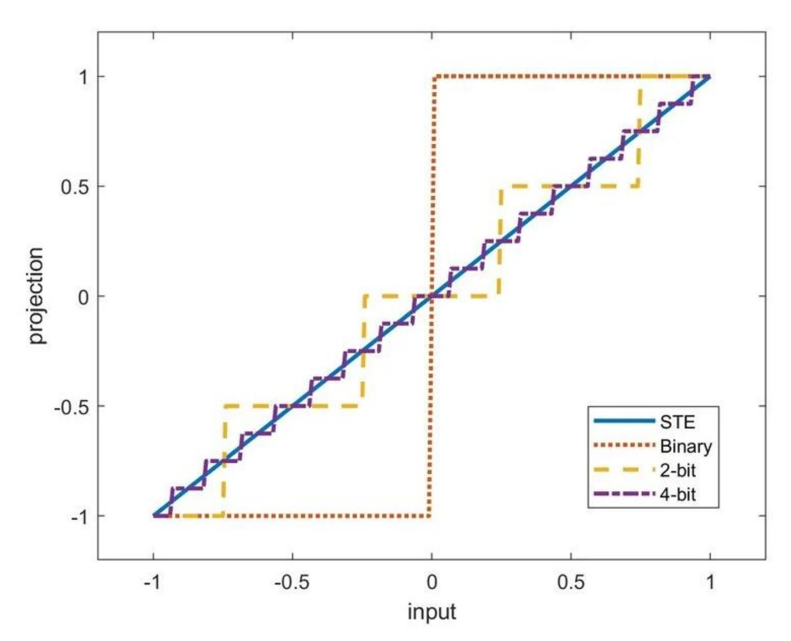

Straight-Through Estimation (STE) Image: https://www.researchgate.net/figure/Projection-stepswith-straight-through-estimator-approximation\_fig3\_371594378

$$\min_{x \in \mathbb{R}^d} f(Q(x))$$
Quantization operator (discontinuous) Does NOT exist  $\nabla_x[f(Q(x))] = JQ(x)^\top \nabla_f(Q(x))$ 
 $\nabla_x \in \mathbb{R}^d$ 

# **Optimality Condition for QAT**

$$\min_{x \in \mathbb{R}^d} f(Q(x)) \qquad \|\nabla f(Q(x_t))\| \le \epsilon + \mathcal{O}(\text{quant.error})$$

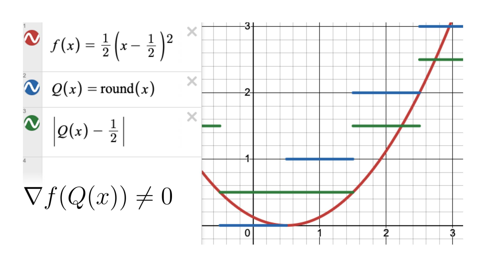

# **A Multi-Objective View of QAT**

$$\nabla f(x^*) = 0$$

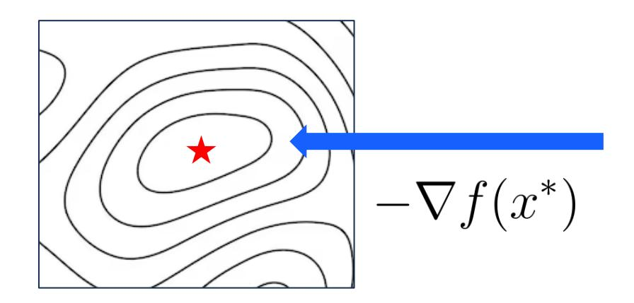

### Minimize Quantization Error

$$Q(x^*) - x^* = 0$$

$$(x^*) - x^* \cdot \dots \cdot \dots \cdot \dots \cdot \dots \cdot \dots \cdot \dots \cdot \dots \cdot \dots \cdot \dots \cdot$$

$$\nabla_{\lambda \mathbf{P}} f(Q(x^*)) := \nabla f(x^*) + \lambda (x^* - Q(x^*)) = 0$$
 Pareto-optimal state

#### **CAGE Framework Overview**

#### **Require:** Initial parameters $x_0$ ; total steps T;

**Quantizer** Q (e.g., QuEST INT)

CAGE coefficient  $\lambda$ , silence ratio s

for t = 0, 1, ..., T - 1 do

 $r_t \leftarrow (t+1)/T$ 

b training progress ratio

if  $r_t \leq s$  then

$$\lambda_t \leftarrow 0$$

⊳ silence period

else  $r_t > s$ 

$$\lambda_t \leftarrow \lambda \cdot \frac{r_t - s}{1 - s}$$

⊳ linear ramp-up

end if

- Sample minibatch and do quantized forward pass
- $\rightarrow e_t \leftarrow x_t Q(x_t)$

 $g_t \leftarrow g_t + \lambda_t e_t$ 

> coupled correction

Optimizer (e.g., AdamW)

 $\Delta_t \leftarrow \textit{OptimizerUpdate}$ 

- $\rightarrow \Delta_t \leftarrow \Delta_t + |\lambda_t e_t|$
- $\rightarrow x_{t+1} \leftarrow x_t \alpha \Delta_t$

□ update master weights

end for

return  $x_T$ 

**CAGE** is optimizer agnostic!

**CAGE** is quantizer agnostic!

near-cost-free correction term

### Coupled vs Decoupled CAGE

**Require:** Initial parameters  $x_0$ ; total steps T;

Quantizer Q (e.g., QuEST INT)

CAGE coefficient  $\lambda$ , silence ratio s

for 
$$t = 0, 1, ..., T - 1$$
 do

$$r_t \leftarrow (t+1)/T$$

 $r_t \leftarrow (t+1)/T$  > training progress ratio

if  $r_t \leq s$  then

$$\lambda_t \leftarrow 0$$

else  $r_t > s$ 

$$\lambda_t \leftarrow \lambda \cdot \frac{r_t - s}{1 - s}$$

⊳ linear ramp-up

end if

Sample minibatch and do quantized forward pass

$$e_t \leftarrow x_t - Q(x_t)$$

> quantization error (no grad)

$$g_t \leftarrow g_t + \lambda_t e_t$$

> coupled correction

Optimizer (e.g., AdamW)

 $\Delta_t \leftarrow \mathit{OptimizerUpdate}$ 

$$\Delta_t \leftarrow \Delta_t + |\lambda_t e_t|$$

▶ decoupled correction

$$x_{t+1} \leftarrow x_t - \alpha \Delta_t$$

□ update master weights

end for

return  $x_T$ 

| Method                                            | 30M                        | 50M                        | 100M                       |
|---------------------------------------------------|----------------------------|----------------------------|----------------------------|
| $CAGE_D + HT$ $CAGE_C + HT$                       | 26.277 26.271           | 22.747 22.752           | 18.944 18.948           |
| QuEST + HT                                        | 26.475                     | 23.062                     | 19.123                     |
| $CAGE_D$ (no HT) $CAGE_C$ (no HT) $QuEST$ (no HT) | 27.287 27.285 27.401 | 23.781 23.786 23.991 | 19.630 19.625 19.799 |
| BF16                                              | 24.715                     | 21.491                     | 17.923                     |

near-cost-free correction term

### The Role of the Silence Period

**Require:** Initial parameters  $x_0$ ; total steps T;

Quantizer Q (e.g., QuEST INT)

CAGE coefficient  $\lambda$ , silence ratio s

for 
$$t = 0, 1, ..., T - 1$$
 do

$$r_t \leftarrow (t+1)/T$$

b training progress ratio

if  $r_t \leq s$  then

$$\lambda_t \leftarrow 0$$

▶ silence period

else  $r_t > s$ 

$$\lambda_t \leftarrow \lambda \cdot \frac{r_t - s}{1 - s}$$

▶ linear ramp-up

end if

Sample minibatch and do quantized forward pass

$$e_t \leftarrow x_t - Q(x_t)$$

⊳ quantization error (no grad)

$$g_t \leftarrow g_t + \lambda_t e_t$$

Optimizer (e.g., AdamW)

 $\Delta_t \leftarrow$  OptimizerUpdate

$$\Delta_t \leftarrow \Delta_t + |\lambda_t e_t|$$

▶ decoupled correction

$$x_{t+1} \leftarrow x_t - \alpha \Delta_t$$

□ update master weights

end for

return  $x_T$ 

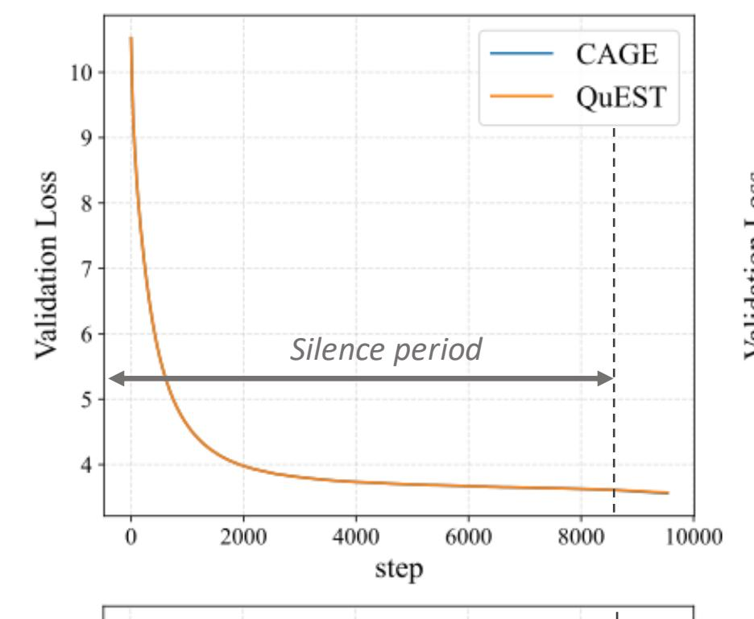

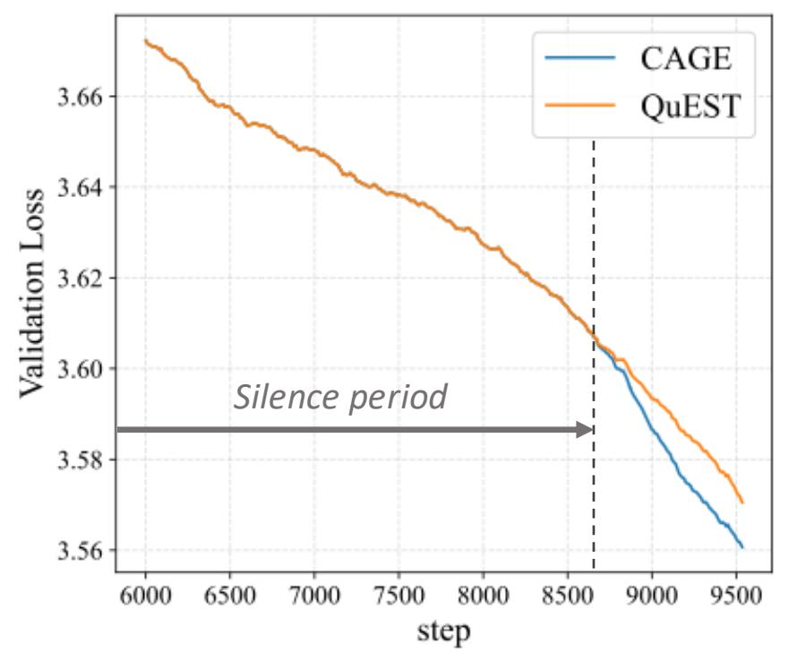

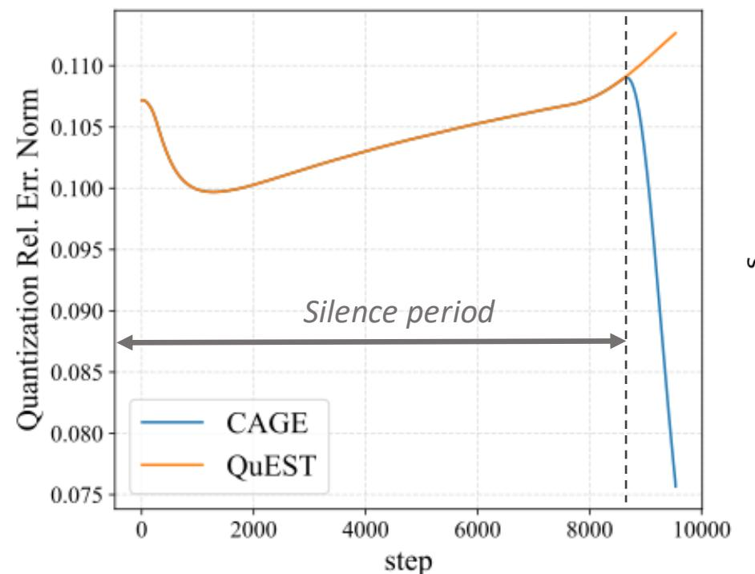

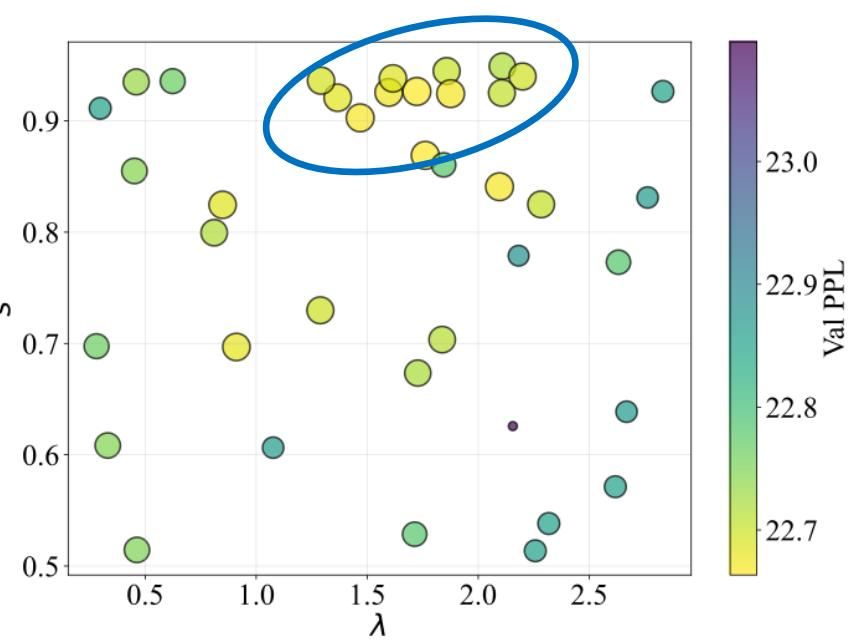

# **Validation Loss Scaling**

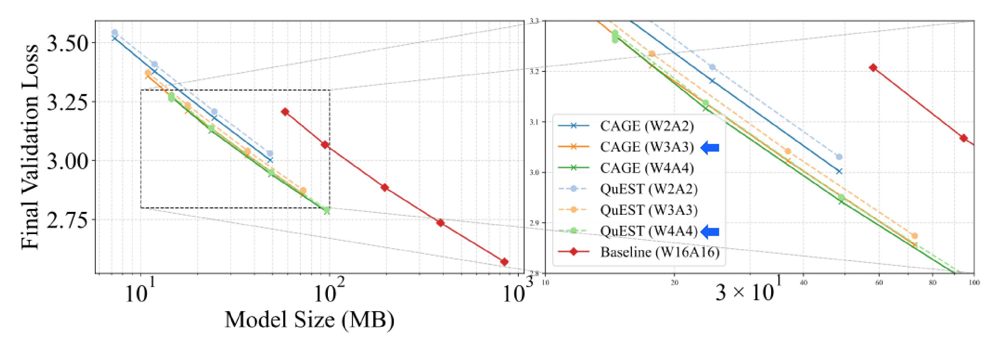

CAGE-trained models with 3-bits weights and activations (W3A3) offer **lower loss** than 4-bit (W4A4) models trained with the prior best method (QuEST)

### **Scaling Laws and Parameter Efficiency**

$$\mathcal{L}(N, D, P) = \frac{A}{(N \cdot \text{eff}(P))^{\alpha}} + \frac{B}{D^{\beta}} + E_{\beta}$$

 $\mathcal{L}$  – validation loss

N – parameter count

D – token count

P – precision

eff(P) – effective capacity

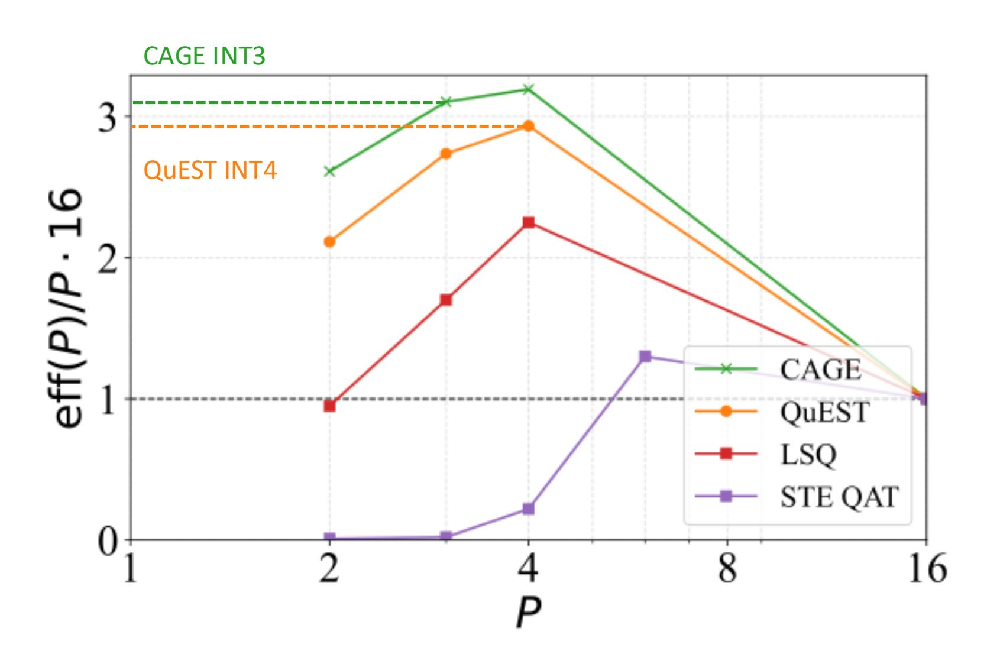

# **Theoretical Analysis**

$$x_{t+1} = x_t - \alpha(\widetilde{\nabla}f(x_t) + \lambda(x_t - Q(x_t))), \text{ for } t \ge 0$$

$$\mathbb{E}\Big[\|\nabla_{\lambda \mathrm{P}} f(Q(\hat{x}_T))\|^2\Big] = \mathcal{O}\left(\frac{1}{\sqrt{T}}\right), \text{ where } \hat{x}_T \sim \mathrm{Uniform}(x_0, x_1, \dots, x_{T-1}).$$

$$\nabla_{\lambda \mathbf{P}} f(Q(x^*)) := \nabla f(x^*) + \lambda (x^* - Q(x^*)) = 0$$
 Pareto-optimal state

# Thank you

#### **MLSys**

#### CAGE: Curvature-Aware Gradient Estimation For Accurate Quantization-Aware Training

Soroush Tabesh1 Mher Safaryan1 Andrei Panferov1 Alexandra Volkova1 Dan Alistarh1,2

1Institute of Science and Technology Austria (ISTA) 2Red Hat AI

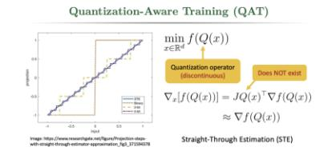

#### Algorithm 1 CAGE (with AdamW Optimizer)

**Require:** Initial parameters  $x_0$ ; total steps T; AdamW hyperparameters  $\beta_1, \beta_2, \alpha, \omega, \varepsilon$ ; Quantization operator Q (e.g., QuEST); CAGE coefficient  $\lambda$ , silence ratio s

| 1: <b>In</b> | itialize: $m_{-1} \leftarrow 0, \ v_{-1}$                  | $\leftarrow 0$              |
|--------------|------------------------------------------------------------|-----------------------------|
| 2: <b>fo</b> | r t = 0, 1,, T - 1 do                                      |                             |
| 3:           | $r_t \leftarrow (t+1)/T$                                   | > training progress ratio   |
| 4:           | if $r_t \leq s$ then                                       |                             |
| 5:           | $\lambda_t \leftarrow 0$                                   | ⊳ silence period            |
| 6:           | else $r_t > s$                                             |                             |
| 7:           | $\lambda_t \leftarrow \lambda \cdot \frac{r_t - s}{1 - s}$ | ⊳ linear ramp-up            |
| 8:           | end if                                                     |                             |
| 9:           | Sample minibatch and                                       | do quantized forward pass   |
| 10:          | $e_t \leftarrow x_t - Q(x_t)  \triangleright$              | quantization error (no grad |
| 11:          | $q_t \leftarrow \widetilde{\nabla} f(x_t) + \lambda_t e_t$ | coupled correction          |

| 9:  | Sample minibatch and                                                                   | do quantized forw                                                                                                                                                                                                                                                                                                                                                                                                                                                                                                                                                                                                                                                                                                                                                                                                                                                                                                                                                                                                                                                                                                                                                                                                                                                                                                                                                                                                                                                                                                                                                                                                                                                                                                                                                                                                                                                                                                                                                                                                                                                                                                     | ard pass   |
|-----|----------------------------------------------------------------------------------------|-----------------------------------------------------------------------------------------------------------------------------------------------------------------------------------------------------------------------------------------------------------------------------------------------------------------------------------------------------------------------------------------------------------------------------------------------------------------------------------------------------------------------------------------------------------------------------------------------------------------------------------------------------------------------------------------------------------------------------------------------------------------------------------------------------------------------------------------------------------------------------------------------------------------------------------------------------------------------------------------------------------------------------------------------------------------------------------------------------------------------------------------------------------------------------------------------------------------------------------------------------------------------------------------------------------------------------------------------------------------------------------------------------------------------------------------------------------------------------------------------------------------------------------------------------------------------------------------------------------------------------------------------------------------------------------------------------------------------------------------------------------------------------------------------------------------------------------------------------------------------------------------------------------------------------------------------------------------------------------------------------------------------------------------------------------------------------------------------------------------------|------------|
| 10: | $e_t \leftarrow x_t - Q(x_t)  \triangleright$                                          | quantization error                                                                                                                                                                                                                                                                                                                                                                                                                                                                                                                                                                                                                                                                                                                                                                                                                                                                                                                                                                                                                                                                                                                                                                                                                                                                                                                                                                                                                                                                                                                                                                                                                                                                                                                                                                                                                                                                                                                                                                                                                                                                                                    | r (no grad |
| 11: | $g_t \leftarrow \widetilde{\nabla} f(x_t) + \lambda_t e_t$                             | coupled o                                                                                                                                                                                                                                                                                                                                                                                                                                                                                                                                                                                                                                                                                                                                                                                                                                                                                                                                                                                                                                                                                                                                                                                                                                                                                                                                                                                                                                                                                                                                                                                                                                                                                                                                                                                                                                                                                                                                                                                                                                                                                                             | correction |
| 12: | $x_t \leftarrow (1 - \alpha \omega) x_t$                                               | b decoupled we                                                                                                                                                                                                                                                                                                                                                                                                                                                                                                                                                                                                                                                                                                                                                                                                                                                                                                                                                                                                                                                                                                                                                                                                                                                                                                                                                                                                                                                                                                                                                                                                                                                                                                                                                                                                                                                                                                                                                                                                                                                                                                        | ight deca  |
| 13: | $m_t \leftarrow \beta_1 m_{t-1} + (1 -$                                                | $\beta_1)g_t$                                                                                                                                                                                                                                                                                                                                                                                                                                                                                                                                                                                                                                                                                                                                                                                                                                                                                                                                                                                                                                                                                                                                                                                                                                                                                                                                                                                                                                                                                                                                                                                                                                                                                                                                                                                                                                                                                                                                                                                                                                                                                                         |            |
| 14: | $v_t \leftarrow \beta_2 v_{t-1} + (1 - \beta_2 v_{t-1})$                               | $(g_2) g_t \odot g_t$                                                                                                                                                                                                                                                                                                                                                                                                                                                                                                                                                                                                                                                                                                                                                                                                                                                                                                                                                                                                                                                                                                                                                                                                                                                                                                                                                                                                                                                                                                                                                                                                                                                                                                                                                                                                                                                                                                                                                                                                                                                                                                 | OR         |
| 15: | $\hat{m}_t \leftarrow m_t/(1-\beta_1^t);$                                              | $\hat{v}_t \leftarrow v_t/(1-\beta_2^t)$                                                                                                                                                                                                                                                                                                                                                                                                                                                                                                                                                                                                                                                                                                                                                                                                                                                                                                                                                                                                                                                                                                                                                                                                                                                                                                                                                                                                                                                                                                                                                                                                                                                                                                                                                                                                                                                                                                                                                                                                                                                                              |            |
| 16: | $\Delta_t \leftarrow \frac{\hat{m}_t}{\sqrt{\hat{v}_t} + \varepsilon} + \lambda_t e_t$ | decoupled of the decoupled of the decoupled of the decoupled of the decoupled of the decoupled of the decoupled of the decoupled of the decoupled of the decoupled of the decoupled of the decoupled of the decoupled of the decoupled of the decoupled of the decoupled of the decoupled of the decoupled of the decoupled of the decoupled of the decoupled of the decoupled of the decoupled of the decoupled of the decoupled of the decoupled of the decoupled of the decoupled of the decoupled of the decoupled of the decoupled of the decoupled of the decoupled of the decoupled of the decoupled of the decoupled of the decoupled of the decoupled of the decoupled of the decoupled of the decoupled of the decoupled of the decoupled of the decoupled of the decoupled of the decoupled of the decoupled of the decoupled of the decoupled of the decoupled of the decoupled of the decoupled of the decoupled of the decoupled of the decoupled of the decoupled of the decoupled of the decoupled of the decoupled of the decoupled of the decoupled of the decoupled of the decoupled of the decoupled of the decoupled of the decoupled of the decoupled of the decoupled of the decoupled of the decoupled of the decoupled of the decoupled of the decoupled of the decoupled of the decoupled of the decoupled of the decoupled of the decoupled of the decoupled of the decoupled of the decoupled of the decoupled of the decoupled of the decoupled of the decoupled of the decoupled of the decoupled of the decoupled of the decoupled of the decoupled of the decoupled of the decoupled of the decoupled of the decoupled of the decoupled of the decoupled of the decoupled of the decoupled of the decoupled of the decoupled of the decoupled of the decoupled of the decoupled of the decoupled of the decoupled of the decoupled of the decoupled of the decoupled of the decoupled of the decoupled of the decoupled of the decoupled of the decoupled of the decoupled of the decoupled of the decoupled of the decoupled of the decoupled of the decoupled of the decoupled of t | correction |
| 17: | $x_{t+1} \leftarrow x_t - \alpha \Delta_t$                                             | □ update mast                                                                                                                                                                                                                                                                                                                                                                                                                                                                                                                                                                                                                                                                                                                                                                                                                                                                                                                                                                                                                                                                                                                                                                                                                                                                                                                                                                                                                                                                                                                                                                                                                                                                                                                                                                                                                                                                                                                                                                                                                                                                                                         | er weight  |
| 18: | end for                                                                                |                                                                                                                                                                                                                                                                                                                                                                                                                                                                                                                                                                                                                                                                                                                                                                                                                                                                                                                                                                                                                                                                                                                                                                                                                                                                                                                                                                                                                                                                                                                                                                                                                                                                                                                                                                                                                                                                                                                                                                                                                                                                                                                       |            |
| 19: | return $x_T$                                                                           |                                                                                                                                                                                                                                                                                                                                                                                                                                                                                                                                                                                                                                                                                                                                                                                                                                                                                                                                                                                                                                                                                                                                                                                                                                                                                                                                                                                                                                                                                                                                                                                                                                                                                                                                                                                                                                                                                                                                                                                                                                                                                                                       |            |
|     |                                                                                        |                                                                                                                                                                                                                                                                                                                                                                                                                                                                                                                                                                                                                                                                                                                                                                                                                                                                                                                                                                                                                                                                                                                                                                                                                                                                                                                                                                                                                                                                                                                                                                                                                                                                                                                                                                                                                                                                                                                                                                                                                                                                                                                       |            |

| Method / Model size | CAGE (D+HT) | CAGE (C+HT) | QuEST (+HT) | CAGE (D, no HT) | CAGE (C, no HT) | QuEST (no HT) | BF16   |
|------------------------|----------------|----------------|----------------|--------------------|--------------------|------------------|--------|
| 30M                    | 26.277         | 26.271         | 26.475         | 27.287             | 27.285             | 27.401           | 24.715 |
| 50M                    | 22.747         | 22.752         | 23.062         | 23.781             | 23.786             | 23.991           | 21.491 |
| 100M                   | 18.944         | 18.948         | 19.123         | 19.630             | 19.625             | 19.799           | 17.923 |

sizes for coupled (C) and decoupled (D) variants of CAGE

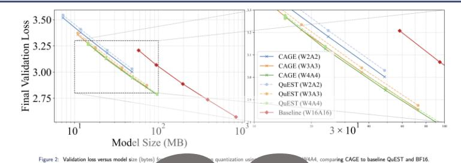

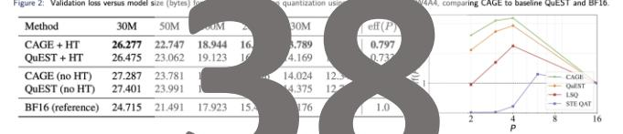

Figure 3: (Left) Pretraining results (final validation loss efficiency eff(P), normalized relative to standard 16-bit, acro and P denotes the bit budget. The factor  $\operatorname{eff}(P)$  captures the

| Method                    | 100M (ms/iter)  | 430M (ms/iter)  | Model                               | Avg. RULER scor |
|---------------------------|-----------------|-----------------|-------------------------------------|-----------------|
| OuEST (no HT)             | $101.6 \pm 1.7$ | $282.7 \pm 3.1$ | Llama 3.1-8B (base, full precision) | 88.3            |
| CAGE D (no HT) | $101.1 \pm 1.8$ | $283.1 \pm 3.0$ | Llama 3.1-8B (CAGE, W4A16)          | 73.2            |
| <i>D</i> , ,              | 202.2 == 2.0    |                 | Llama 3.1-8B (QuEST, W4A16)         | 68.7            |
| QuEST (+HT)               | $117.5 \pm 1.8$ | $286.6 \pm 2.3$ | Llama 3.1-8B (GPTQ, W4A16)          | 65.1            |
| $CAGE_D$ (+HT)            | $105.8 \pm 1.2$ | $316.1 \pm 3.7$ | Llama 3.1-8B (RTN, W4A16)           | 41.5            |

Figure 4: (Left) Runtime per iteration (ms: mean ± std) for W4A4 training on a single H100 (sequence length 2048, batch size 16). (Right) RULER average score (higher is better) for Llama 3.1-8B

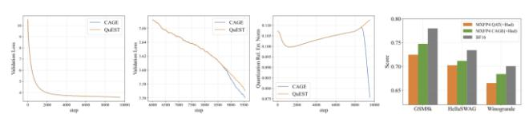

Figure 5: (From left) Illustration of the validation loss for training the 50M Llama model in W4A4 using the QuEST baseline end-to-end (1st), focused on the last fraction of steps (2nd), and in terms of quantization error (regularizer) values (3rd). (4th) QAT fine-tuning accuracy on Llama-3.2-3B (Tulu-SFT) for CAGE vs. the state-of-the-art MXFP4 baseline, using QuEST.

#### Multi-Objective Optimization

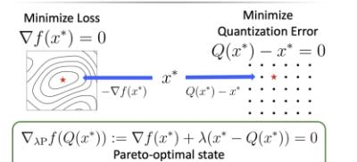

#### Theoretical Analysis

Main Theorem (informal). Under smoothness assumptions on the loss function f and quantization operator Q, for any  $\lambda \geq 0$ , CAGE with SGD  $x_{t+1} = x_t - \alpha(\widetilde{\nabla}f(x_t) + \lambda(x_t - Q(x_t))), \text{ for } t \ge 0,$  $\mathbb{E}\left[\|\nabla_{\lambda P} f(Q(\hat{x}_T))\|^2\right] = \mathcal{O}\left(\frac{1}{\sqrt{T}}\right)$ , where  $\hat{x}_T \sim \text{Uniform}(x_0, x_1, \dots, x_{T-1})$ .

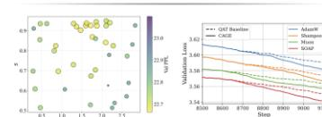

and regularization coefficient  $\lambda$  on the 50M Llama model with W4A4 quantization. (Right) QAT and CAGE. Solid lines denote training with CAGE, dashed - without. Across all

- Andrei Panferov, Jiale Chen, Soroush Tabesh, Roberto L. Castro, Mahdi Nikdan, and Das Alistarh, QuEST: Stable Training of LLMs with 1-Bit Weights and Activations. ICML 2005.
- [2] reja usosimiov and ranas intuites, recessiones webpa acting regularizations. ICLR 2017. Sleework Esser, Jeffery L. McKinstry, Depolis Balbaia, Rethinakimar Appoissmurg, and Diarmenfra S. Modila, Learned step size quantization. ICLR 2020. [4] Miglia Kwun, Depos Morswan, (John Banagyasan Sa, Esphaine Gal, Nikhil Anand, and Sham Kakode, LOTTON: Smoothing the Optimization Landscape for Quantized Trainings arXiv:2301088776, 2022.