# FuseFlow: A Fusion-Centric Compilation Framework for Sparse Deep Learning on Streaming Dataflow

Rubens Lacouture Stanford University Stanford, USA rubensl@stanford.edu

Marco Siracusa
Barcelona Supercomputing Center
Barcelona, Spain
marco.siracusa@bsc.es

Nathan Zhang SambaNova Systems, Inc. Palo Alto, USA stanfurd@stanford.edu

Fredrik Kjolstad Stanford University Stanford, USA kjolstad@stanford.edu

Olivia Hsu
Stanford University
Stanford, USA
Carnegie Mellon University
Pittsburgh, USA
owhsu@stanford.edu

Ritvik Sharma Stanford University Stanford, USA rsharma3@stanford.edu

Kunle Olukotun Stanford University Stanford, USA kunle@stanford.edu

#### **Abstract**

As deep learning models scale, sparse deep learning (DL) models that exploit sparsity in weights, activations, or inputs and specialized dataflow hardware have emerged as powerful solutions to address efficiency. We propose Fuse-Flow, a compiler that converts sparse machine learning models written in PyTorch to fused sparse dataflow graphs for reconfigurable dataflow architectures (RDAs). FuseFlow is the first compiler to support general cross-expression fusion of sparse operations. In addition to fusion across kernels (expressions), FuseFlow also supports optimizations like parallelization, dataflow ordering, and sparsity blocking. It targets a cycle-accurate dataflow simulator for microarchitectural analysis of fusion strategies. We use FuseFlow for design-space exploration across four real-world machine learning applications with sparsity, showing that full fusion (entire cross-expression fusion across all computation in an end-to-end model) is not always optimal for sparse models—fusion granularity depends on the model itself. FuseFlow also provides a heuristic to identify and prune suboptimal configurations. Using FuseFlow, we achieve performance improvements, including a ~2.7x speedup over an unfused baseline for GPT-3 with BigBird block-sparse attention.


This work is licensed under a Creative Commons Attribution 4.0 International License.

ASPLOS '26, Pittsburgh, PA, USA.
© 2026 Copyright held by the owner/author(s).
ACM ISBN 979-8-4007-2359-9/2026/03
https://doi.org/10.1145/3779212.3790165

*CCS Concepts:* • Computer systems organization  $\rightarrow$  *Data flow architectures*; • Theory of computation  $\rightarrow$  Streaming models; • Computing methodologies  $\rightarrow$  Machine learning; • Software and its engineering  $\rightarrow$  Compilers.

**Keywords:** sparse machine learning, Einsum, tensor compiler, kernel fusion, spatial dataflow accelerator

#### **ACM Reference Format:**

Rubens Lacouture, Nathan Zhang, Ritvik Sharma, Marco Siracusa, Fredrik Kjolstad, Kunle Olukotun, and Olivia Hsu. 2026. FuseFlow: A Fusion-Centric Compilation Framework for Sparse Deep Learning on Streaming Dataflow. In *Proceedings of the 30th ACM International Conference on Architectural Support for Programming Languages and Operating Systems, Volume 2 (ASPLOS '26), March 21–26, 2026, Pittsburgh, PA, USA.* ACM, New York, NY, USA, 23 pages. https://doi.org/10.1145/3779212.3790165

#### <span id="page-0-0"></span>1 Introduction

Deep learning models may have sparse weights, activations, or inputs—naturally occurring or induced. Exploiting this sparsity during computation, which we call *sparse deep learning (DL)*, reduces compute and memory requirements but introduces irregular memory access patterns [21, 22, 27, 30, 70]. To increase hardware efficiency, researchers are building specialized hardware to accelerate sparse computations [9, 13, 20, 28, 42, 52, 54, 56, 57, 60, 64]. In order to increase efficiency in these hardware architectures, they are also making increasing use of dataflow, or direct connections between coarsegrained functional units, to rely less on expensive caches, local memories, and memory operations. Dataflow architectures are particularly well-suited for sparse computation because they explicitly coordinate data movement through

<span id="page-1-0"></span>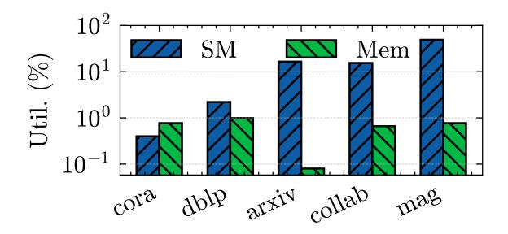

Figure 1. Log plot of SM and DRAM utilization (%) for PyG GCN inference on an RTX 5090 across five datasets.

streaming connections rather than relying on caches, naturally handling the irregular memory access patterns inherent in sparse data [\[32,](#page-15-6) [42,](#page-15-2) [60\]](#page-16-2). Empirically, GPUs are underutilized: A 3-layer GCN inference in PyTorch Geometric (PyG) on an RTX 5090 across five real-world graphs shows consistently low compute (SM) utilization (avg 16.7%) and ∼1% memory utilization (Figure [1\)](#page-1-0). These observations motivate specialized sparse dataflow accelerators and the compiler support to program them.

Hsu et al. [\[32\]](#page-15-6) introduced the Sparse Abstract Machine (SAM) to increase the programmability of these emerging sparse dataflow hardware architectures. The Sparse Abstract Machine is a dataflow abstract machine for sparse tensor algebra computations. It adopts a streaming dataflow model, where data flows between compute nodes. It can express any tensor algebra expression by composing a handful of simple and intuitive dataflow blocks. It also naturally supports expressing fused computation across multiple expressions, different ways to order the dataflow (the iteration order) within an expression (e.g., Gustavson's algorithm [\[25\]](#page-14-6) versus inner product for sparse matrix multiplication), and lends itself to compile to fabricated hardware [\[42\]](#page-15-2). SAM is therefore a natural starting point as a compiler intermediate representation (IR) for targeting sparse ML models to dataflow hardware.

Hsu et al. [\[32\]](#page-15-6) also describe a compilation flow from highlevel sparse tensor algebra expressions to SAM dataflow graphs. Their Custard compiler generates SAM graphs that fuse operations across a sparse tensor algebra expression and lets users control the dataflow order. The Custard compilation algorithm is a significant step forward, as the first to demonstrate compilation of sparse tensor algebra expressions to dataflow. It is not, however, suitable for ML model compilation due to its limited capabilities for fusion.

Because Custard compiles individual expressions, it is unable to fuse operations across expressions—a key feature in ML compilers [\[11,](#page-14-7) [44\]](#page-15-7). Moreover, the intra-expression fusion that falls out of Custard's compilation algorithm fully fuses each expression without any support for partial fusion. Partial fusion is often desirable to provide some of the benefits of fusion while controlling the amount of reuse within a

computation (as demonstrated by FlashAttention [\[14\]](#page-14-8)). The fusion–recomputation tradeoff is fundamental: fusion eliminates intermediate tensors between operations, reducing memory traffic, but excessive fusion can force recomputation of values [\[17,](#page-14-9) [82\]](#page-16-4). Conversely, insufficient fusion materializes intermediate tensors to memory, forcing more data movement. This tradeoff is even more critical, and looks different from that of dense computation, since fused sparse computation may have better asymptotic complexity [\[2,](#page-14-10) [4,](#page-14-11) [32,](#page-15-6) [38\]](#page-15-8). Therefore, an ML compiler should expose the fusion granularity as a user schedule so the fusion and reuse tradeoff can be explored across models.

In this paper, we describe a new approach for lowering sparse DL models, models with one or more sparse tensors, to SAM dataflow graphs. Unlike prior work on sparse tensor algebra compilers that target individual expressions, FuseFlow compiles complete sparse DL inference pipelines, including nonlinear operations and masking. FuseFlow supports sparse tensors from any source, whether from pruning, natural zeros, or induced patterns, provided that the sparse data structure type is determined before compilation (Section [4.1\)](#page-4-0).

Our approach supports both cross-expression fusion and partial fusion, allowing users to explore the trade-off between fusion and reuse. Our work consists of two new IRs that enable this fusion exploration. The first IR, a fused Einstein Summation (Einsum) representation, tracks the flow of indexing (coordinate) data and values across fused expressions. Then, we introduce a new fusion table representation, a lowering IR that names and memoizes intermediate streams allowing the compiler to reference subgraphs before their materialization to efficiently emit the fused dataflow graph.

We also develop FuseFlow, the first academic end-to-end sparse ML compiler for reconfigurable dataflow architectures. FuseFlow compiles PyTorch [\[3\]](#page-14-12) with sparse annotations [\[24,](#page-14-13) [75\]](#page-16-5) to SAM graphs. In FuseFlow, users leverage a scheduling language that lets them control fusion granularity and dataflow ordering of expressions. To support modern ML models, we also add support for dense blocks to support block-sparse tensors, non-linear functions, and masking operations to SAM. Finally, our FuseFlow system can generate dataflow graphs that execute in a data-parallel fashion in addition to the pipeline parallelism native to dataflow graphs. FuseFlow targets both cycle-accurate simulation and FPGA synthesis and existing dataflow accelerators [\[10,](#page-14-14) [42\]](#page-15-2), with validated agreement between FPGA and the simulation (Section [8.2\)](#page-10-0). Our technical contributions are thus:

- A new data structure and algorithm for fusion across multiple independent Einsum expressions (Section [5\)](#page-6-0),
- A new abstraction that enables interleaved reductions for factored iteration and on-the-fly rearrangement of dataflow graphs (Section [6\)](#page-7-0),
- A lowering algorithm that converts the fused Einsum expressions to a dataflow representation (Section [6\)](#page-7-0)

<span id="page-2-0"></span>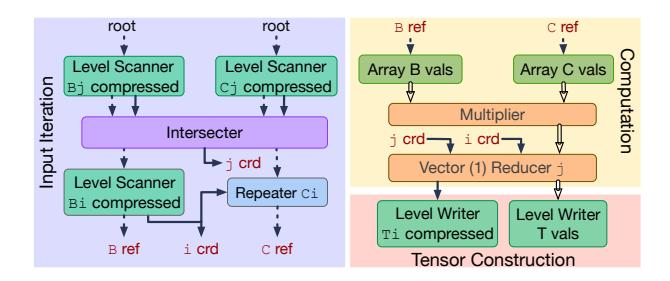

**Figure 2.** SAM graph for sparse-matrix vector multiplication with  $j \rightarrow i$  dataflow. Streams: solid grey = coordinate (crd), dashed grey = reference (ref), double black = value (val).

 An end-to-end compiler framework for sparse dataflow machines (Section 7). The implementation includes optimizations necessary for performant application code like parallelization, block sparsity, dataflow ordering, and a fusion heuristic.

We demonstrate the effectiveness of FuseFlow across four model classes by generating 56 equivalent dataflow configurations that yield speedups from  $\sim 1.5 \mathrm{x}$  to  $\sim 3.9 \mathrm{x}$ . Our evaluation underscores the importance of selecting the appropriate fusion granularity and shows that FuseFlow's heuristic successfully prunes inefficient configurations, offering critical insights for the deployment of large-scale sparse ML applications on dataflow architectures.

# <span id="page-2-1"></span>2 Sparse Abstract Machine Background

We provide necessary background on the Sparse Abstract Machine (SAM) [32] to understand our FuseFlow system and the code that it generates. SAM expresses tensor algebra kernels as dataflow graphs by providing a streamingtensor abstraction and primitives that compose to perform tensor algebra operations. Tensor algebra kernels can be expressed in Einsum notation where tensors are indexed by variables, with addition and multiplication as the core operations. The index variables specify how levels across tensors are broadcast, reduced, and contracted. SAM also introduces the Custard compiler, which compiles high-level Einsum into SAM dataflow graphs. These dataflow graphs are suitable for VLSI implementations and simulation but remain abstract in order to cleanly decouple programs from accelerator implementations.

Figure 2 shows the SAM graph for sparse matrix-vector multiplication (SpMV)  $T_i = B_{ij}C_j$  with the  $j \rightarrow i$  dataflow ( $\forall_{ji} T_i += B_{ij}C_j$ ) where B is stored in a compressed format (e.g., compressed sparse row (CSR)) [12, 24] SAM expresses tensors as streams of data with control tokens, where these tensor streams flow on the arrows between primitives (boxes) in a SAM dataflow graph. SAM's primitives include:

**Level scanners (LS)** traverse tensor levels. Nested LS produce streams that are logically equivalent to multidimensional tensors (e.g.,  $B_i$  with  $B_i$  fetch matrix B's coordinates).

**Stream joiners (Intersect/Union)** combine or skip coordinates across tensors (e.g., the j intersect joins  $B_j$  and  $C_j$ . **Repeaters (Rep)** broadcast operands (e.g., C across each i). **ALU and reducers (Red)** perform elementwise operations and reductions (e.g., reduce over j in  $j \rightarrow i$ ).

**Level writers (LW) and coordinate droppers (CD)** write results and elide empty coordinates.

As in Figure 2, SAM primitives compose together with streams to form SAM graphs that represent any tensor algebra expression with varying dataflows. Arrows in Figure 2 connect dataflow primitives together and transmit streams, where each stream is a sequence of tokens that transmits one level of a tensor in fibertree form (a nested representation of per-level coordinates and values) [73]. Streams are of three types: coordinates (crd), references to inner levels (ref), and values (val). An *n*-order tensor is represented by *n* coordinate streams plus one values stream (*n*+1 total).

SAM graphs comprise three regions (see shading in Figure 2): input iteration, computation, and tensor construction. The input iteration region (shown in blue) iterates through the tensor coordinates of all input operands, joining the sparse coordinates together (e.g. through intersecter<sub>j</sub>). The computation region (shown in yellow) fetches data values using coordinates and computes the result values. And, the tensor construction region (shown in red) writes the result values and coordinates back to memory, dropping any zero coordinates. Our work builds upon SAM and addresses compiler limitations by targeting fused applications beyond single sparse tensor kernels.

## <span id="page-2-2"></span>3 Forms of Fusion

Fusion in dense and sparse compilers can be categorized by scope and by technique. We describe three main types of fusion and provide a diagram of them in Figure 3.

Pattern-based operator fusion (POF) refers to merging operations based on recognized patterns, where sequences of operators are replaced by one kernel that fuses those operations. Often, the fused kernel is handcrafted. This operator fusion approach is common in dense compilers on CPUs, GPUs, and TPUs. Because POF is often completely automatic (all detected operator patterns are always replaced with the fused version), it is typically limited to localized patterns that are known in advance. Due to its localized nature, operator fusion is an intra-layer technique.

Intra-expression iteration fusion (IIF) merges the iteration space of a single tensor algebra expression—co-iterating its inputs—without crossing kernel boundaries. IIF manifests as loop fusion for dense computation, co-iteration for sparse computation, and dataflow iteration fusion in dataflow graphs. Existing sparse tensor compilers that target dataflow hardware [31, 32] employ this type of fusion, co-iterating to generate fused iteration spaces that elide zeros for one sparse expression at a time.

<span id="page-3-0"></span>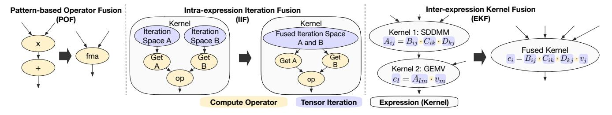

Figure 3. Dataflow diagrams for the forms of fusion, showing how they differ and are related.

**Inter-expression kernel fusion (EKF)** fuses across different kernels or sub-computations into a single fused computation graph. This type of fusion can be implemented in conjunction with POF and IIF, but is not supported by existing sparse dataflow compilers [31, 32].

Of the forms of fusion above, Table 1 summarizes how prior frameworks fit into these categories. Existing frameworks thus leave a gap: no prior compiler automatically fuses across multiple sparse expressions in a general way. POF in dense compilers is limited to known templates and IIF in dense compilers is straightforward. IIF in sparse compilers stop at single-kernel fusion. However, EKF is necessary to enable fusion across multiple sparse expressions in a model. FuseFlow addresses this gap by providing a general algorithm for fusing entire sparse ML pipelines across kernel boundaries. Therefore, as highlighted by Table 1, FuseFlow is the first sparse compiler to provide an algorithmic approach focusing on inter-expression kernel fusion.

As FuseFlow is a sparse dataflow compiler, we contrast its fusion capabilities with the capabilities of the two prior sparse dataflow compilers Custard [32] and Stardust [31] (C+S) in Figure 4.<sup>1</sup> Custard and Stardust only support fusion within an expression and not across expressions. Although a user can combine expressions into a larger expression, which can then be fused, they must do so by hand and cannot fuse computations that have more than one result. The various fused regions (blue boxes) compare C+S fusion regions with our FuseFlow, which fuses all kernels within a fusion region.

FuseFlow's comprehensive fusion support leads to better performance. In GCN on the OGB-Collab dataset [34] (Figure 4b), fusion with Custard and Stardust using a handwritten rewrite yields  $1.97\times$  speedup over the unfused baseline. With less user effort, FuseFlow achieves another  $1.33\times$  speedup over C+S, leading to a  $\sim 2.63\times$  speedup in total. We detail the comparison methodology for these results, and further analysis, in Section 8.4. FuseFlow's additional speedups come from its support for IIF during code generation. Along with EKF, efficient fused sparse DL also hinges on the design of IIF, which we discuss next.

<span id="page-3-1"></span>

| Tensor<br>Compiler | Multi-<br>expression | Sparsity | Fusion<br>Strategy | Backends      |
|--------------------|----------------------|----------|--------------------|---------------|
| TensorRT [55]      | ✓                    | X        | POF                | GPU           |
| XLA [61]           | ✓                    | X        | POF, IIF           | CPU, GPU      |
| DNNFusion [53]     | ✓                    | X        | POF, IIF           | CPU, GPU      |
| TVM [11]           | ✓                    | X        | POF, IIF           | CPU, GPU, TPU |
| TACO [37]          | ×                    | ✓        | IIF                | CPU, GPU      |
| SparseTIR [77]     | ×                    | ✓        | IIF                | CPU, GPU      |
| ReACT [82]         | ×                    | ✓        | IIF                | CPU, GPU      |
| Stardust [31]      | ×                    | ✓        | IIF                | Dataflow      |
| Custard [32]       | ×                    | ✓        | IIF                | Dataflow      |
| This Work          | ✓                    | ✓        | EKF, IIF           | Dataflow      |

**Table 1.** Landscape of tensor compilers. **EKF (Inter-Expression Kernel Fusion)** enables fusion across multiple sparse tensor expressions. Prior sparse compilers only support **IIF (Intra-Expression Iteration Fusion)** within single kernels and dense compilers primarily rely on limited **POF (Pattern-based Operator Fusion)** via pattern matching.

<span id="page-3-2"></span>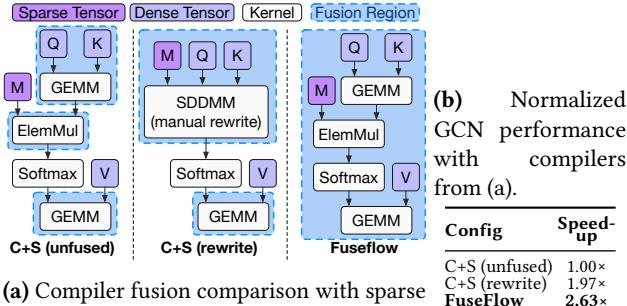

(a) Compiler fusion comparison with sparse attention. Custard+Stardust (C+S) support IIF and only support EKF manually where unsupported ops break EKF.

**Figure 4.** Comparing fusion coverage and performance.

The Iteration Space Problem. In both inter- and intraexpression fusion approaches for sparse tensor operations, there are multiple equivalent ways to iterate through sparse tensors, each with fundamental tradeoffs. Two primary costs, coordinate processing and computation, define the tradeoff between globally fused and factored iteration spaces.

A globally fused iteration space, shown in Figure 5a, iterates over every index variable, creating an n-dimensional

<span id="page-3-3"></span><sup>&</sup>lt;sup>1</sup>The motivation and description in Section 1 is also true for the Stardust compiler [31], another compiler from the same high-level sparse tensor algebra languages to a real dataflow accelerator [60].

```
1 for(int i = 0; i < I; i++)
2 for(int k = 0; k < K; k++)
3 for(int j = 0; j < J; j++)
4 for(int l = 0; l < L; l++)
5 D[i,l] += A[i,k] * B[k,j] * C[j,l]
         (a) Global iteration space with loops
1 for(int i = 0; i < I; i++)
2 for(int k = 0; k < K; k++)
3 for(int j = 0; j < J; j++)
4 E[i,j] += A[i,k] * B[k,j]
5 for(int j = 0; j < J; j++)
6 for(int l = 0; l < L; l++)
7 D[i,l] += E[i,j] * C[j,l]
        (b) Factored iteration space with loops
```

Figure 5. Two iteration patterns for ∀ += , that are represented via loop nests with higher-order reduction variables highlighted in blue [\[36\]](#page-15-14). FuseFlow lowers to a dataflow input iteration graph with a factored iteration space (b), whereas prior work produces dataflow graphs with fully fused iteration spaces (a).

iteration space, where n is the number of index variables (e.g., 4-dimensional in Figure [5a\)](#page-4-1). It efficiently filters unnecessary numerical computations but incurs significant coordinate processing overhead, causing coordinate explosion as expressions grow. Prior work on sparse tensor algebra compilation to dataflow accelerators by default generates code that traverses a global iteration space [\[31,](#page-15-9) [32\]](#page-15-6). In contrast, factored iteration iterates pairwise over input tensors (see Figure [5b\)](#page-4-1). It generates multiple smaller sub-spaces, one per binary operation (i.e. two 3-dimensional iteration spaces in Figure [5b\)](#page-4-1). Each sub-space independently handles coordinate processing, significantly reducing overhead by limiting coordinate analysis to binary operations. However, as this analysis is local rather than global, factored iteration may miss opportunities to skip unnecessary computations, potentially increasing operations.

Global iteration spaces often perform poorly for sparse ML applications for two key reasons. First, these applications typically contain numerous higher-order tensors and indices, leading to a dimensionality explosion. Second, the mixture of sparse and dense tensors increases iteration points within each dimension. This combination makes traversing sparse ML models with global iteration significantly less efficient than factored iteration approaches. Hence, we opt for factored input-iteration in FuseFlow, by design, when pushing fusion through our lowering algorithm.

Avoiding global iteration space materialization requires a complete restructuring of the dataflow graph and its compiler lowering. Factored iteration preserves the order of reduction operations, unlike global iteration. Figure [5](#page-4-1) highlights these behaviors. Recall that SAM graphs comprise three sequential regions—input iteration, computation, and tensor construction (see Section [2\)](#page-2-1). Global iteration computations occur at the innermost loop (line 5 in Figure [5a\)](#page-4-1), while factored iteration interleaves loops and computations (lines 4 and 7 in Figure [5b\)](#page-4-1). From a dataflow perspective, rather than loop transformations, the graph input iteration and computation pipelines need to be interleaved, which we show later in Figure [11.](#page-8-0) Specifically, higher-order reducers produce coordinate streams that must interact with the input iterations of subsequent operations to enable fusion. Therefore, we need a new compiler approach, like FuseFlow's, to handle efficient sparse ML workloads on dataflow hardware.

# <span id="page-4-2"></span>4 Overview of FuseFlow

Figure [6](#page-5-0) summarizes FuseFlow's compilation flow from Py-Torch to a fused, hardware-ready sparse dataflow graph. Models are first lowered from PyTorch [\[3\]](#page-14-12) to MLIR (Linalg + SparseTensor dialects) using either Torch-MLIR [\[47\]](#page-15-15) for dense model components or MPACT [\[24\]](#page-14-13) for sparse model components, with user-specified sparse formats and optional schedules. Since FuseFlow's optimizations operate entirely at the MLIR Linalg + SparseTensor dialect level or lower, any frontend, which includes PyTorch through Torch-MLIR [\[47\]](#page-15-15), that lowers to these dialects is supported. This process yields a graph of Einsum expressions extended with non-algebraic operators as shown by Figure [6a](#page-5-0) to Figure [6b](#page-5-0). This stage preserves sparsity semantics from the frontend and provides the knobs (schedules) that guide downstream optimization.

## <span id="page-4-0"></span>4.1 Supported Sparsity Types

FuseFlow operates on tensors whose sparse structure type is known before compilation, although the data itself does not need to be available until the generated code is executed. The supported sparse data structure types include, in the language of the TACO data structure language [\[12,](#page-14-15) [37\]](#page-15-13), compressed data structures, uncompressed/dense data structures, coordinates, and any combination thereof in higher dimensions (e.g. dense, COO, CSR, DCSR, blocked structures, etc.). This design makes FuseFlow orthogonal to the source of sparsity such as from weights, activations, or inputs.

FuseFlow's design is sparsity-source agnostic because its fusion algorithm (Section [5\)](#page-6-0) and lowering (Section [6\)](#page-7-0) operate on sparse tensor formats via MLIR's SparseTensor dialect, which encodes where nonzeros exist. Whether zeros arise from lossless sparsity (e.g., graph adjacency) or lossy sparsity (e.g., magnitude pruning), the resulting compressed format representation is identical. The system's constraints (Section [5\)](#page-6-0) depend only on tensor mode orders and dataflow dependencies, not on sparsity provenance. Fusion tables (Section [6\)](#page-7-0) organize iteration based on format structure, independent of how that structure was produced.

<span id="page-5-0"></span>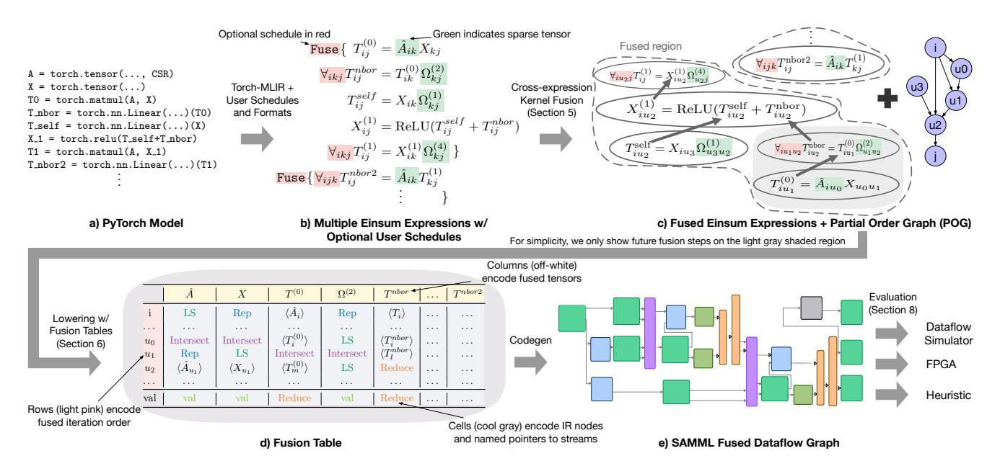

**Figure 6. Compilation flow of FuseFlow.** (a) PyTorch model. (b) Einsum expressions with optional user schedules (red) and sparse formats (green). (c) Cross-expression fusion of Fuse regions yields fused Einsum subgraphs and a partial-order graph. (d) Fusion tables encode iteration (rows), tensors (columns), and IR nodes/streams (cells). (e) Codegen emits a SAMML fused dataflow graph; evaluation targets a dataflow simulator, FPGA, or a heuristic model (Section 8).

<span id="page-5-1"></span>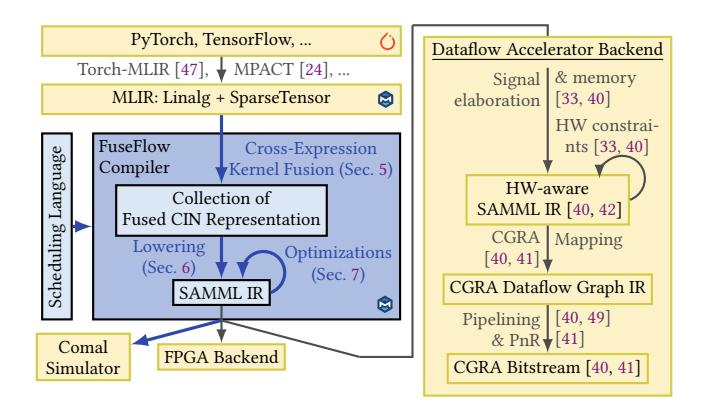

**Figure 7.** System overview of FuseFlow, where blue denotes new contributions.

#### 4.2 Compilation Flow

FuseFlow then applies cross-expression kernel fusion to usermarked fusion regions (denoted by Fuse{}) in Figure 6b), producing a fused Einsum representation (Section 5). The fused Einsum representation includes fused components that form connected subgraph (as shown in the dashed fused region in Figure 6c) along with a partial order graph that encodes index constraints. Within the connected subgraph, the arrows indicate direct producer-consumer expression fusion. To generate this representation, FuseFlow inlines producer results into their consumers across kernel boundaries while building the partial order graph (Figure 6c). Partial order graph constraints are derived from the user-schedules (red) and sparse storage formats (green) (from Figure 6b).

To lower the fused expressions, FuseFlow introduces a new IR called fusion tables (Figure 6d). This representation addresses the complexity of lowering multiple fused expressions to fused dataflow graphs. The fusion table encodes: the fused iteration order based on the partial order graph in its rows (shown in Figure 6d in light pink), the fused expression which is implicit in the tensor order of its columns (shown in off-white), and IR nodes along with named pointers to intermediate streams before they are materialized in their cells (shown in cool gray). Therefore, fusion tables represent the fused tensor computation in a tabular format before code generation, allowing for factored iteration with interleaved input iteration and computation. Because prior work [31, 32] compiles single kernels, they do not scale to face similar challenges (i.e. requiring references to temporary streams) that FuseFlow address with its fusion table IR.

FuseFlow generates SAM dataflow graphs with ML primitives, which we call SAMML. FuseFlow applies user-guided or autotuned parallelization, sparsity blocking, and dataflow-order selection, and provides a fast heuristic to estimate FLOPs/bytes for early pruning. It then executes in Comal, a cycle-accurate simulator within the open-source DAM simulation framework [81], or maps to FPGA backends.

*Full Compilation Stack.* Figure 7 shows the full compilation stack of FuseFlow. Blue components are new contributions of this work and yellow components leverage prior work for the frontend and lower-level compilation paths to

<span id="page-6-1"></span>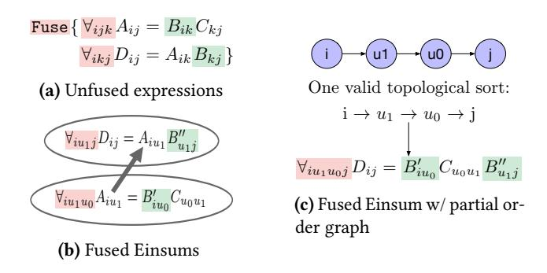

**Figure 8.** The input (a) with sparse matrix *B* stored in CSR format and equivalent output representations (b) and (c) of our automated cross-expression fusion algorithm.

hardware. Our contributions focus on algorithms for fusion and other optimizations (PyTorch  $\rightarrow$  SAMML graphs), where the challenges lie for performant ML with sparse tensors on dataflow. We describe our compiler implementation and its surrounding software ecosystem in more detail in Section 7.

Scheduling Language. FuseFlow exposes fusion granularity, dataflow ordering, parallelization, and a performance heuristic through explicit user schedules, enabling the design-space exploration in Section 8. Users specify fusion via Fuse{} regions (i.e. denoted in MLIR with functions), dataflow order via modifying Linalg affine maps, and other parameters via a command line interface. While this control is essential for optimal performance, future work includes autoscheduling to determine fusion schedules for common sparse ML patterns.

#### <span id="page-6-0"></span>5 Cross-Expression Fusion Algorithm

Our solution for automatically generating fused code relies on FuseFlow's cross-expression fusion algorithm. It fuses across distinct expressions while preserving correctness and efficiency in sparse iteration. Once fusion regions are scheduled, FuseFlow's algorithm produces a collection of fused Einsum expressions and a partial order graph for each fusion region that serves as the foundation for further optimization.

Sparsity-specific challenges arise when multiple expressions each impose their own traversal order over many sparse tensors. Efficient sparse tensor iteration requires *concordant traversal*, a fused iteration order compatible with each operand's native mode order (storage order) [80]. Traversing a sparse tensor against its storage format (e.g., columnwise over a CSR matrix) is *discordant* and is often asymptotically worse. Ignoring this critical aspect of sparse tensor traversal can lead to incorrect code [37] or suboptimal performance due to expensive indirect lookups and tensor reformatting [37, 80].

Our approach treats ordering constraints as first-class: (i) user-specified dataflow order constraints of each local expression—unspecified orders remain free—and (ii) pertensor mode order required by storage format (e.g. CSR

requires  $i \rightarrow j$ , denoted as [i,j] = [0,1]). For example, suppose we fuse:  $A_{ij} = B_{ik}C_{kj}$  and  $E_{ij} = B_{ik}A_{kj}$ , both with inner product dataflow  $(i \rightarrow j \rightarrow k)$ . Simple index substitution conflicts with A's required mode orders [0,1] vs. [1,0], forcing discordant traversal. When a tensor is used multiple times, FuseFlow treats each use as a distinct *tensor view* (denoted with primes (in Figure 8b); each view is annotated with its required mode order.

We therefore introduce a fusion algorithm that extends index substitution [15] with ordering constraints maintained in a directed graph called a partial order graph (POG).

While processing each local expression, FuseFlow inserts edges into the POG to represent both dataflow order and mode order constraints so that global consistency is maintained across the fused region.

The POG allows FuseFlow to track index order constraints of a fused expression based on the mode order of the input sparse tensors, and final output tensor as well as the local dataflow order of each expression to be fused. This cross-expression fusion is achieved in several steps, as shown in Figure 8. For each expression to be fused:

- 1) Rename local index variables: For each tensor in the expression, FuseFlow replaces all local reduction indices (those not on the left-hand side) with fresh indices (denoted as u-indices in Figure 8b) and adds POG edges to enforce each sparse tensor view's mode order constraints (i.e.  $i \rightarrow u_0$  based on B' in Figure 8b).
- 2) Build fused Einsum producer-consumer edges: For each tensor, FuseFlow connects producer uses with their consumers, as shown by the arrows in Figure 8b, while substituting index variables. This fused Einsum expressions representation is similar to the ideas presented by [82].
- **3) Propagate order constraints:** As each producer-to-consumer edge is added, FuseFlow inserts directed edges in the POG between indices that have an outer-to-inner ordering relationship.
- 4) Handle multiple tensor uses: For any tensor used multiple times, FuseFlow assigns a distinct view to each use, annotating it with the required mode order. Equivalent views are merged, where equivalence means: (i) identical modeorder sequences and (ii) equivalent index maps. If distinct views of the same tensor induce conflicting ordering constraints (detected as a cycle in the POG) and no concordant topological order exists, FuseFlow materializes a permuted copy of the tensor (a higher-order transpose) for one of the views to break the cycle.

By applying the above steps to every expression to be fused, we accumulate a unified index-space representation with all necessary constraints. Throughout this process, the POG ensures that global index ordering remains consistent with all mode orders and user-scheduled dataflow orders encountered. If the graph remains acyclic, FuseFlow performs a topological sort to produce all valid global dataflow orders that respects all constraints. FuseFlow can traverse the

fused Einsum representation and emit a single, fully fused Einsum (Figure 8c), equivalent to the fused representation in Figure 8b The full algorithm can be found in Section B.4.

## <span id="page-7-0"></span>6 Lowering with Fusion tables

To facilitate code generation, we introduce *fusion tables*, a tabular lowering IR that memoizes intermediate streams and defers node creation. It provides named pointers to each component in the final dataflow graph, allowing for references to components that have not been created yet. Programming a dataflow machine differs from typical loop-based paradigms in that it relies on a spatial connection topology of operators/nodes and data rather than iterative control flow. During lowering, a dataflow compiler maps how dataflow primitives are connected to assemble the final dataflow graph. Fusion tables capture these connections by treating each operator as a cell in a table with pointers representing data movement through nodes. Fusion tables also enable fusion across multiple expressions to target a dataflow system. We first provide details on the fusion tables (Section 6.1) and show how they are used by FuseFlow for code generation (Section 6.2).

#### <span id="page-7-1"></span>6.1 Fusion Table IR

As discussed in Section 3, our compiler must dynamically adjust and interleave the topology of iteration and computation pipelines. We use a fusion table IR to accomplish this task. A fusion table allows the compiler to defer materializing the final graph and instead work with a named, structured representation. The compiler can assign placeholders to dataflow nodes that are not yet created, enabling later pointers (references) to those future nodes by name. In essence, the fusion table provides a spatially organized plan of the fused index iteration and operations, which can be manipulated freely before committing to a final dataflow graph.

**Fusion Table Structure.** A fusion table can be thought of as a two-dimensional grid. Rows represent index variables or value results, which are ordered by fused iteration index order. For example, in Figure 9a the table contains rows that represent the iteration order of the expression  $(i \to k \to j)$  with the last row for value computation. Columns represent tensor expressions, with each operand or intermediate result in the fused expression assigned to its own column. By reading across a given row, we see all tensors involved at that loop level. In other words, rows slice the computation by control (loop levels), while columns slice it by data (tensors). Cells occupy the intersection of a row and a column; each cell represents either an operation to perform or a pointer to another cell's operation. A cell can be one of two types:

1) Primitive cell: creates a new dataflow node corresponding to a fundamental operation as defined in Section 2. Placing a primitive cell in the table is akin to planning the instantiation of that dataflow node in the SAMML graph.

**2) Reference cell:** points to an existing cell that reuses an already generated node (e.g.,  $\langle T_i^0 \rangle$  in Figure 9c) or passes through values when an index variable is not needed for the current operation (e.g.  $\langle T_i^0 \rangle$  in Figure 9c).

By ordering indices and operations in this structured grid, the compiler spatially captures the relationships between tensor computations and their iteration space. Figure 9 illustrates this concept using a sparse matrix multiplication (SpMM) example. Figure 9a shows an empty fusion table for the SpMM kernel  $T_{ij}^0 = \sum_k A_{ik} \times X_{kj}$  with  $i \to k \to j$ iteration order. Figure 9b shows the table partially filled as the compiler processes the fused Einsum expressions step by step. Note that some cells are already referencing nodes (marked by angle brackets) that have not been materialized yet, indicating future connections (i.e.  $\langle A_{val} \rangle$  referencing  $\langle A_i \rangle$ ). In Figure 9c, the fusion table is fully populated after handling all operations. Finally, Figure 9d depicts the final dataflow graph generated from the completed fusion table, with the color coding showing how each cell in the table maps to a component in the final graph.

**Fusion Table Construction.** To understand how fusion tables are constructed by FuseFlow, we walk through the fusion table construction for the SpMM example shown in Figure 9. FuseFlow populates fusion tables by processing each operation in the input program one by one. FuseFlow uses several steps for each operation, as detailed below:

- 1) Insert level scanners and value nodes: For every input tensor view, FuseFlow assigns level scanner cells and value cells in a top-down fashion following the dataflow order. If an input tensor is not the result of a prior operation, a value cell is placed. In Figure 9c, LS cells (in dark green) for  $\hat{A}_i$ ,  $\hat{A}_k$ ,  $\hat{X}_k$ , and  $\hat{X}_j$  are created, along with the corresponding value cells (labeled "Val" in light green).
- 2) Insert repeat and compute nodes: When processing intermediate tensor views, FuseFlow identifies index variables missing from each input operand's tensor view and assigns Rep nodes for each of these cases. Repeat nodes' inputs include the stream being repeated and the repeat signal. The computation pipeline for the intermediate tensor view is also assigned at this point, meaning ALU and reduction nodes (if applicable) are inserted. In Figure 9c, the compute pipeline cell (in orange) is inserted for  $T^0$ .
- 3) Handle higher-order reductions: When a higher-order reduction is encountered, the compiler updates the relevant cells with the reduction outputs. For example, in Figure 9c, a first-order higher-order reduction (e.g.,  $\langle T_j^0 \rangle$ ) is applied: it consumes a value stream and two coordinate streams. It produces a reduced value stream along with a final reduced output coordinate.
- **4) Insert stream merging nodes:** After processing all tensors, the compiler identifies index variables shared across multiple tensor views. It then creates stream merging nodes (intersect or union) by relocating existing level scanner cells

<span id="page-8-2"></span>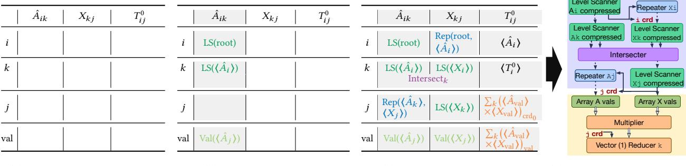

- (a) Initial empty fusion table
- (b) Partially filled table
- (c) Fully constructed table
- (d) Partial SAMML graph.

**Figure 9.** Fusion table construction for sparse matrix multiplication  $\forall_{ikj} T_{ij}^0 = \hat{A}_{ik} X_{kj}$ : (a) an empty fusion table; (b) a partially filled table as the compiler walks the expression DAG—highlighting how it can reference cells (nodes) not yet materialized; (c) the fully populated fusion table; (d) the generated dataflow graph generated from the completed table. Colors in the table visually indicate how cell components map to nodes in Figure 9d. Shaded column mark which column FuseFlow has processed.

<span id="page-8-3"></span>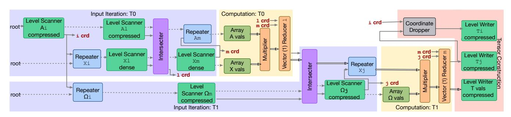

**Figure 10.** SAMML graph for the neighborhood subcomputation  $T_{ij}^{nbor} = \hat{\mathbf{A}}_{il} X_{lm} \Omega_{mj}^{(2)}$  from GraphSAGE with  $i \to l \to m \to j$  order. See Figure 20 in Section B.2 for the full fusion table that generates this graph.

<span id="page-8-0"></span>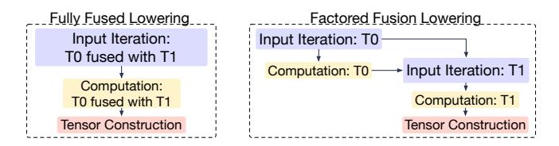

**Figure 11.** How fully fused input iteration (Figure 5a) vs. factored input iteration (Figure 5b) manifests spatially in sparse dataflow graphs. Factored fusion splits the iteration sub-graphs (two blue regions), while fully-fused iteration keeps the iteration sub-graph intact (one blue region).

into newly created merged cells, effectively rewiring the graph before code generation. In Figure 9c, FuseFlow merges cells for  $\hat{A}_k$  and  $X_j$  into an intersect (shown in purple). If output coordinates coming from a higher-order reducer need merging, the corresponding reduction node's cell is moved instead. This step shows how the compiler modifies the input iteration pipeline through simple cell movement.

Why fusion tables? Conventional compiler representations, such as dependency graphs or value-numbering approaches, represent computations as fixed nodes and edges

- [32]. However, these approaches lack flexibility: once nodes are instantiated, it becomes challenging to reorder or restructure them dynamically without cumbersome graph transformations. In contrast, the fusion table is designed to be a malleable blueprint that the compiler can adjust before final code generation. This brings two key benefits:
- 1) Deferred graph construction for flexibility: As described previously, fusion tables defer node creation and memoize intermediate streams, allowing for references before creation. This feature lets the compiler rewire node connections without complex graph manipulation.
- 2) Explicit grid layout: Rows encode fused iteration (control) and columns encode tensor views (data), with cells as operations or references. This grid makes dependencies and reuse obvious, simplifying fused graph generation and mapping cleanly to sparse dataflow hardware.

#### <span id="page-8-1"></span>6.2 Code Generation

FuseFlow generates the final dataflow graph by traversing the fusion table top-down, instantiating nodes for coordinate iteration and computation as dictated by the table structure. Starting from the output tensor value cell, FuseFlow recursively expands dependent cells upward, constructing the graph nodes and streams that correspond to the fused loops. Finally, tensor construction nodes (level writers, coordinate droppers) are added to finalize outputs. Figure [10](#page-8-3) shows the final dataflow graph generated for a fused GraphSAGE kernel (see Section [B.2](#page-18-0) for its corresponding fusion table). The result is a hardware-efficient dataflow graph in the factorediteration style. By design, our fusion table lowering yields a factored (not global) iteration space, interleaving input iteration and computation, as motivated in Section [3](#page-2-2) and illustrated in Figure [11](#page-8-0) on the right. A direct comparison of the SAM graph with global iteration space and the SAMML graph with factored iteration space is shown in Section [B.3.](#page-18-1) These lowering algorithm implications are further discussed in Section [B.3.](#page-18-1) The full lowering algorithm can be found in Section [B.5.](#page-19-2) Lowering FuseFlow's generated SAMML graph to real hardware follows prior work [\[42\]](#page-15-2), as each node lends itself to VLSI implementations. Therefore, SAMML graphs compose to represent sparse DL on dataflow accelerators.

# <span id="page-9-0"></span>7 FuseFlow Implementation

We implement FuseFlow within the MLIR compiler framework. We reimplement SAM as an MLIR dialect with a new FuseFlow MLIR compilation path as described in Section [4.](#page-4-2) FuseFlow compiles these dialects to SAM graphs and lets users control fusion and dataflow ordering through a scheduling language as shown in Figure [7.](#page-5-1) FuseFlow also includes additional optimizations, which were discussed in the context of the SAM IR but not previously present in any SAM compiler [\[32\]](#page-15-6). These optimizations—such as parallelization, sparsity blocking, dataflow ordering, and an analytical fusion heuristic—are necessary for efficient, large-scale ML. Users can guide these optimizations through a commandline scheduling interface.

For lower-level compilation to hardware, we leverage established infrastructure from prior work as shown in Figure [7.](#page-5-1) This stack handles hardware constraints, signal elaboration, memory allocation, CGRA mapping, and pipelining with place-and-route. Following modern compiler design principles like MLIR, separating high-level transformations from backend-specific lowering enables portability across different dataflow backends (simulator, FPGA, CGRA).

Parallelization. Our compiler applies vectorization and loop unrolling optimizations inspired by SAM [\[32\]](#page-15-6), concretizing them via stream parallelizer and serializer primitives. Users specify parallelization by selecting index variables and parallelization factors. The compiler partitions tensor coordinates and duplicates compute subgraphs, distributing work across parallel streams and merging results upon completion.

Sparsity Blocking. FuseFlow efficiently targets structured sparsity (e.g., block-sparsity [\[14,](#page-14-8) [79\]](#page-16-11)) by mapping dense blocks onto the innermost coordinates of tensors. Sparse iteration occurs at outer levels, with dense blocks streamed

<span id="page-9-2"></span>

| Model                                    | Dataset       | MxN               | Sparsity % | Sparsity Source              |
|------------------------------------------|---------------|-------------------|------------|------------------------------|
| GCN/GraphSAGE Cora [76]                  |               | 2708x1433         | 99.7%      | ZB lossless (in)             |
| GCN/GraphSAGE Cora_ML [7]                |               | 2995x2879         | 99.8%      | ZB lossless (in)             |
| GCN/GraphSAGE DBLP [7]                   |               | 17716x1639        | 99.6%      | ZB lossless (in)             |
| GCN/GraphSAGE OGB-Collab [34] 235868x128 |               |                   | 99.9%      | ZB lossless (in)             |
| GCN/GraphSAGE OGB-MAG [34]               |               | 1939743x128 99.9% |            | ZB lossless (in)             |
| SAE                                      | ImageNet [16] | 224x224           | 50%        | ZB lossy (wt)                |
| SAE                                      | NIH-CXR [69]  | 1024x1024         | 50%        | ZB lossy (wt)                |
| SAE                                      | LUNA16 [63]   | 512x512           | 50%        | ZB lossy (wt)                |
| GPT-3 w/ BigBird IMDB [7]                |               | –                 |            | 53.9%-86.5%* ZB lossy (mask) |

Table 2. Datasets with sparsity levels and types. ZB = zerobased, in = input, wt = weight, mask = masked activation. \*Attention mask sparsity.

directly to vectorized ALUs, maintaining sparsity-driven dataflow benefits while enhancing computational density.

Dataflow Ordering. FuseFlow enumerates valid dataflow orders that do not break fusion, enabling users or autotuning frameworks to select schedules to optimize performance [\[45\]](#page-15-20). Each dataflow order yields different SAMML graphs and asymptotic efficiencies.

Fusion Heuristic. Our heuristic rapidly estimates FLOPs and memory transfers of fused programs without full simulation. Users input tensor dimensions, sparsity percentages, and intersection rates. The fusion heuristic enables lightweight analysis to quickly prune suboptimal schedules, significantly reducing the optimization search space.

# <span id="page-9-1"></span>8 Evaluation

To evaluate the techniques presented in this paper, we use FuseFlow to compile various real-world sparse machine learning applications to our SAMML IR and simulate their end-to-end cycle-accurate performance. We showcase our compiler's generality by using four different model classes. We also perform ablation studies on various key features of FuseFlow in Section [8.3](#page-10-2) to Section [8.8.](#page-11-0) FuseFlow's general algorithmic fusion mechanism allows us to explore a vast space of fusion and dataflow schedules, unlocking speedups that were previously unattainable with existing frameworks for sparse DL on dataflow hardware.

#### 8.1 Methodology

Benchmark Applications and Datasets. We evaluate Fuse-Flow on four sparse machine learning model classes across different domains: Sparse Autoencoder (SAE) [\[51\]](#page-15-21) (3 layers), Graph Convolutional Networks (GCN) [\[35\]](#page-15-22) (2 layers), Graph-SAGE [\[26\]](#page-14-19) (2 layers), and GPT-3 Small (125M parameters) with BigBird attention [\[79\]](#page-16-11) (sequence length of 1024). For SAE, we randomly sampled 5 images. Real world datasets (spanning 50%-99.9% and comprising lossless and lossy sparsity sources) were used for each model as shown in Table [2.](#page-9-2)

FuseFlow Compiler. FuseFlow is implemented in MLIR within LLVM 19.1.0, with dependencies including Protobuf 28.1 and OR-Tools 9.10, and compiled using GCC 14.2.0. For

<span id="page-10-3"></span>

| '                | Avg % Error |       |  |
|------------------|-------------|-------|--|
| Model class      | FLOPs       | Bytes |  |
| GPT-3 (block=16) | 1.8         | 5.7   |  |
| GCN              | 2.8         | 9.6   |  |
| GraphSAGE        | 2.6         | 11.5  |  |

**Table 3.** Average percent error of FLOPs and memory accesses on OGB-Collab.

| Model            | Unconstr.                                 | Constr.                      |
|------------------|-------------------------------------------|------------------------------|
| GCN<br>GraphSAGE | $2.0 \cdot 10^{8*}$<br>$3.9 \cdot 10^{7}$ | $6.3\cdot10^7\\1.1\cdot10^3$ |

**Table 4.** Number of dataflow orders with and without local constraints (\*capped, estimated up to  $\sim 10^{15}$ ).

all evaluated benchmarks, we select by default the first valid topological sort provided by FuseFlow (see Section 5).

Compilation Overhead. All models compile in < 750ms. Simulator Framework. Our Comal simulator models the architectural behavior of each IR node and tracks cycles based on fully pipelined dataflow graphs, as in SAM [32]. It incorporates HBM2 memory simulation via Ramulator 2.0 [48], a cycle-accurate DRAM simulator, and provides instrumentation to estimate operations and memory accesses. Comal uses the DAM simulation framework [81] in Rust 1.87.0 with all simulation functional results verified against a dense PyTorch implementation.

#### <span id="page-10-0"></span>8.2 Hardware Validation

As in SAM [32], our primary evaluation uses a cycle-accurate simulator. At the time of writing, no existing accelerator broadly supported end-to-end sparse ML. The closest, Onyx [42], a coarse-grained reconfigurable array (CGRA) targeting sparse tensor algebra, is insufficient for sparse ML as it lacks support for nonlinear and masking operations. Therefore, we validate simulator fidelity against a post-synthesis RTL simulation of a Xilinx VU9P (AWS F1) design generated from FuseFlow's SAMML. FuseFlow lowers to Comal for simulation and to Vitis HLS for FPGA, using a minimal, proof-of-concept HLS library to instantiate streaming operators. We select kernels that fit entirely in on-chip BRAM to isolate compute, including partially fused (one-layer) GCN and GraphSAGE, fully fused GCN, and BigBird attention. Concretely, GCN (11 kernels) and GraphSAGE (13 kernels) on KarateClub [78] and GPT-3 (17 kernels) with sequence length 64. For each model, we normalize kernel cycle counts by the best across both backends and report trend agreement via  $R^2$  over kernels. We observe a strong agreement of  $R^2$ =0.991 in Figure 13. Fairly recently, Chen et al. [10] introduced Opal, a followon CGRA to Onyx with sparse ML support and improved dataflow orderings, which we plan to target as future work.

#### <span id="page-10-2"></span>8.3 Fusion

We use FuseFlow to generate fused graphs for each model comparing the performance at different fusion levels against unfused configurations. Accelerating unoptimized code is rarely useful, making fusion an essential avenue for optimization. We show that it is important to identify the right fusion granularity to ensure meaningful performance gains.

**Fusion Configurations.** We evaluate three fusion granularities: *unfused* (separate operations), *partially fused*, and *fully fused*. For graph models and SAE, partial fusion groups operations within each layer while full fusion merges all layers. For GPT-3, reshape operations act as fusion barriers; partial fusion groups operations between reshapes within decoder blocks, while full fusion additionally merges across decoder boundaries. See Section C in the Appendix for a visual breakdown of these exact fusion boundaries.

As demonstrated in Figure 12, GPT-3 achieves up to  $\sim 2.7 \times$  improvement with full fusion. GCN and GraphSAGE experience performance degradation under full fusion due to increased computational overhead from nested matrix multiplications, so partial fusion remains more effective for these models (up to  $\sim 2.6 \times$  for GCN on OGB-collab and  $\sim 3.9 \times$  for GraphSAGE on OGB-mag). SAE achieves  $1.94 \times$  with full fusion but only  $\sim 1.01 \times$  with partial fusion. Full fusion benefits from removing inter-layer materialization, but partial fusion offers limited benefit because each layer is dominated by a large sparse matrix multiplication, so fusing smaller subsequent operations provides minimal incremental gain. Models with similar patterns—large compute kernels followed by many smaller operations—will exhibit similar behavior.

Analyzing GCN further, partially fusing the first layer significantly reduces bytes transferred compared to unfused versions, improving operational intensity (Figure 14). Fully fused GCN, while having higher operational intensity, suffers from recomputation, degrading overall performance. Thus, optimal fusion must carefully balance reduced data movement against additional computation.

Finally, our heuristic effectively estimates computational and memory costs. It correctly predicts optimal fusion configurations and enables early pruning of suboptimal strategies as shown in Table 3, which shows the average percentage errors for FLOPs and memory accesses on GPT-3 (w/ block size 16), GCN, and GraphSAGE on OGB-Collab.

#### <span id="page-10-1"></span>8.4 Comparison with Prior Dataflow Compilers

We compare FuseFlow against Custard [32] and Stardust [31] (C+S), the two prior sparse dataflow compilers for general sparse tensor algebra. As discussed in Section 3, C+S only support IIF and require manual rewrites for cross-expression fusion. We evaluate on GCN with the OGB-Collab dataset [34] using identical simulator settings and hardware parameters across all configurations. The *unfused* baseline compiles each kernel independently, materializing all intermediate tensors to memory. The *C+S* (*rewrite*) configuration applies manual expression rewrites to C+S's inputs that force fused output code within the constraints of C+S, only support for sparse tensor computations). *FuseFlow* uses our automatic cross-expression fusion techniques.

<span id="page-11-2"></span>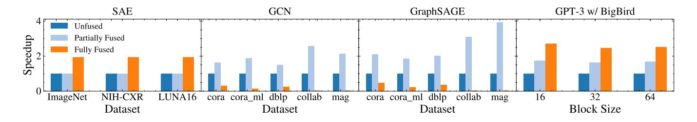

**Figure 12.** The effect of fusion on dataflow performance across various models.

<span id="page-11-1"></span>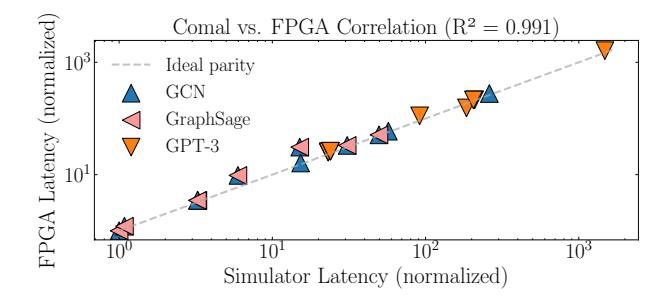

**Figure 13.** Latency correlation of Comal simulation versus an FPGA across kernels across various models. Colors denote models; the dashed line shows parity.

As shown in Figure 4b, C+S with handwritten rewrites achieves 1.97× speedup over the unfused baseline. Fuse-Flow achieves an additional 1.33× speedup over C+S, yielding 2.63× total speedup. FuseFlow's gains come from two sources: (1) automatic cross-expression fusion eliminates intermediate materializations that baseline C+S cannot fuse, and (2) factored iteration during code generation reduces coordinate processing overhead. Importantly, FuseFlow achieves this with less user effort since no manual expression rewrites as the input program to the compiler are required.

#### 8.5 Sparsity Ablation Study

To isolate sparsity's effect on fusion performance, we evaluate FuseFlow on 2-layer GCN using synthetic graphs (500 nodes, 128-dimensional features) with adjacency matrix sparsity varying from 50% to 95%. We test three graph structures (sparsity patterns): uniform random, power-law (scale-free networks), and block diagonal (clustered communities). Figure 15 shows that partial fusion achieves consistent speedups that increase with sparsity, as sparser matrices reduce coordinate processing overhead. Structured patterns (power-law, block diagonal) outperform uniform random due to better locality. In contrast, full fusion incurs slowdowns

when coordination overhead dominates the reduced computation. These results confirm that optimal fusion granularity depends on both sparsity level and structure. Fuse-Flow scales with nonzero count rather than dense dimensions, which aligns with studies from prior sparse compilers [29, 32, 37, 38].

#### 8.6 Parallelization

We evaluate FuseFlow's capacity to enhance performance by generating parallel dataflow graphs. We first perform a sweep of parallelization factors from 1 to 64 to parallelize a single index variable in BigBird attention, as shown in Figure 16a. We find that FuseFlow's generated program scales well with the amount of added parallelism. We also demonstrate FuseFlow's ability to parallelize across different index variables, and its support for nested parallelism. Figure 16b shows the impact of parallelizing two different index variables in BigBird attention, highlighting the performance effects when sweeping across various parallelization factors, as well as applying a constant factor of 4 across both levels at the same time. While varying parallelization location, we find that FuseFlow's generated programs are able to obtain performance improvements relative to the parallelization factor. Parallelizing both levels at the same time by a parallel factor of 4 results in  $\sim$ 15.9x speedup.

## 8.7 Block Sparse Computation

We evaluate FuseFlow's sparsity blocking on the BigBird attention module for all three block configurations. We compare the performance of this blocked approach with our results in Figure 12, which treats the tensors as unstructured sparse computation. The results in Figure 17 show that the speedup obtained is proportional to the block size.

## <span id="page-11-0"></span>8.8 Dataflow Ordering

We evaluate the impact of dataflow ordering by varying the order of nested matrix multiplication (matmul)—a core operation in GCN and GraphSAGE—using KarateClub [78]. As shown in Figure 18, suboptimal orders cause up to  $\sim$ 29× slowdown compared to the best. Leveraging the best order thus provides an end-to-end speedup of  $\sim$ 29× for fused GCN and GraphSAGE models. Additionally, constraining each matmul

<span id="page-12-0"></span>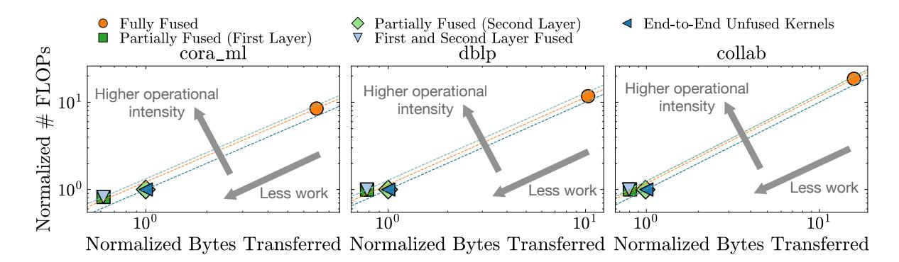

**Figure 14.** GCN FLOPs and memory accesses normalized to the unfused baseline across datasets. Dashed lines show operational intensity. Fusion increases operational intensity, but full fusion's recomputation increases both FLOPs and memory.

<span id="page-12-1"></span>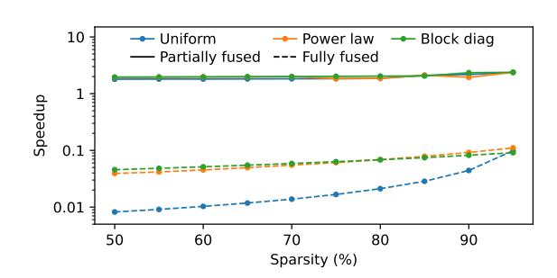

**Figure 15.** Speedup over unfused baseline vs. adjacency matrix sparsity on a 2-layer GCN with synthetic graphs (500 nodes, 128 features) across three sparsity patterns: uniform random, power-law, and block diagonal.

<span id="page-12-2"></span>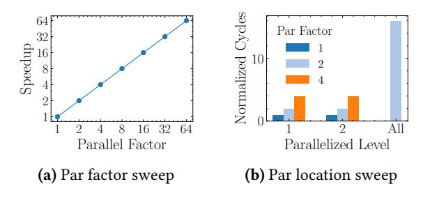

**Figure 16.** The effect of parallelization factor and parallelization location for BigBird attention.

kernel to the best dataflow order significantly reduces the design-space size by 68.5%-99.9%, as shown in Table 4. Without these constraints, GCN alone has an impractically large number of possible dataflows (estimated up to  $\sim 10^{15}$ ), so we limit the search space to  $2 \times 10^8$  configurations in FuseFlow.

## 9 Related Work

This paper shows how to compile sparse ML models to a sparse dataflow abstract machine. We review related work on sparse compilation to dataflow hardware, fusion in sparse tensor algebra frameworks, and sparse ML systems.

<span id="page-12-3"></span>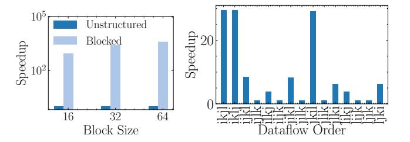

**Figure 17.** Performance **Figure 18.** Dataflow order sweep of block sparse computa- for nested matmul normalized by tion for BigBird attention. worst dataflow.

#### 9.1 Compiling Sparse Tensor Algebra to Dataflow

Several techniques have been proposed for compiling sparse tensor algebra to dataflow hardware. Closest to our work is the Custard compiler [32]. Custard compiles sparse tensor algebra expressions to SAM graphs with intra-layer iteration fusion (IIF). Moreover, the compiler for the Onyx chip [42] maps SAM graphs to physical sparse CGRA hardware. The SAMML dataflow graphs we target are an extension of SAM graphs with additional ML primitives. Unlike Custard, our work supports a different form of IIF through factored iteration and introduces cross-expression fusion (EKF).

An extension to the Spatial compiler [39, 60] for Capstan hardware [57, 60] compiles computations written in parallel patterns—a loop-based declarative language—to sparse dataflow hardware. Moreover, the Stardust [31] compiler can compile high-level sparse tensor algebra languages to these parallel patterns. Stardust, like Custard, only supports tensor expressions and cannot compile entire sparse ML models or provide cross-expression fusion.

Finally, there is a class of work on compiling general-purpose C code to reconfigurable dataflow accelerators. Weng et al. [71] describe a compiler from annotated sparse loops to their SPU hardware [13], and Gobieski et al. [23] presents a co-designed compiler from general code to a CGRA. Both works support sparse loops in their general-purpose input code but do not compile from higher-level sparse languages.

#### 9.2 Fusion in Sparse Tensor Frameworks

The TACO compiler [\[37\]](#page-15-13) showed how to generate fused loops for sparse tensor algebra expressions on CPUs and GPUs [\[62\]](#page-16-17). Later sparse tensor algebra compilers have expanded such fusion capabilities [\[82\]](#page-16-4) to expressions over additional data structures [\[1,](#page-14-21) [12,](#page-14-15) [46,](#page-15-26) [77\]](#page-16-8) and operations [\[29,](#page-15-24) [43,](#page-15-27) [59,](#page-16-18) [66\]](#page-16-19). The fusion support in these compilers, however, is limited to tensor algebra expressions and CPU/GPU compilation [\[74\]](#page-16-20). Other frameworks such as FusedMM [\[58\]](#page-16-21) and SeaStar [\[72\]](#page-16-22) support sparse operator fusion but are limited to specific patterns (e.g., SDDMM+SpMM operations or GNN messagepassing patterns). Zhou et al. [\[82\]](#page-16-4) introduce techniques that identify and avoid four common redundancy types in IIF for sparse tensor algebra. Their compiler, ReACT, is most similar to ours as it introduces a representation close to our fused Einsums to and generates factored iteration code. SparseLNR [\[17\]](#page-14-9) extends TACO with selective fusion/distribution to balance complexity and locality. Both compilers generate factored iteration code similar to ours, but they cannot fuse multiple independent expressions or generate dataflow code. Building upon these works, we show how to fuse across independent Einsum expressions in an ML model and how to do so when compiling to dataflow machines.

The TeAAL framework [\[50\]](#page-15-28) presents a declarative language of cascaded Einsums to describe sparse tensor algebra accelerators and generates an accelerator simulator and performance model from that language. TeAAL represents multiple Einsum expressions similar to our work, but our work generates fused code across those Einsum expressions. While TeAAL is a tool for modeling dataflow accelerators, FuseFlow generates a program configuration or mapping to dataflow accelerators through the SAMML IR along with a simulation of that program.

# 9.3 Relation to Classic Loop Optimizations

FuseFlow's iteration-space transformations are the sparse dataflow analogues of classical loop optimizations studied extensively in prior compilers with sparse-loop optimizations [\[5,](#page-14-22) [6,](#page-14-23) [38,](#page-15-8) [67\]](#page-16-23) and the polyhedral compilation literature [\[8,](#page-14-24) [18,](#page-14-25) [65\]](#page-16-24). Our intra-expression iteration fusion (IIF) corresponds to loop fusion, while dataflow order selection corresponds to loop interchange. However, unlike traditional polyhedral compilation that operates on dense affine iteration spaces, FuseFlow fuses sparse tensor algebra operations whose iteration spaces can be thought of as polyhedra with holes [\[37\]](#page-15-13). In dataflow, we operate on compressed-coordinate streams with strict ordering constraints; these streams can be viewed as a linearization of the sparse iteration space [\[32,](#page-15-6) [43\]](#page-15-27). Our POG encodes constraints on the loop-ordering scheduling space, analogous to dependence polyhedra, while fusion tables—similar to certain fusion information contained in schedule trees—reshape streaming dataflow primitives into

a fixed iteration policy that aligns with the POG rather than rearranging imperative loop nests.

## 9.4 Sparse ML Compilation and Frameworks

A few ML frameworks have been designed with support for sparse tensors and, hence, sparse ML models. Scorch [\[75\]](#page-16-5) describes several techniques needed to implement a version of the PyTorch API that supports sparse as well as dense tensors. The MLIR Linalg + SparseTensor dialects [\[5\]](#page-14-22) combined with the MLIR lowering from PyTorch to Linalg [\[24\]](#page-14-13) also provides a sparse ML framework for CPUs. Our compilation techniques complement these frameworks with a compilation path to sparse dataflow hardware. Domain-specific libraries like PyTorch Geometric (PyG) [\[19\]](#page-14-26) and Deep Graph Library (DGL) [\[68\]](#page-16-25) integrate sparse computation into specific applications, but they lack the generality needed for targeting a broader range of sparse models.

# 10 Conclusion

FuseFlow introduces key pieces in compiling large-scale sparse ML models expressed in PyTorch to dataflow architectures. We believe such frameworks are essential for making productive use of these architectures. Our work opens up several avenues of future compiler work to develop further optimizations on sparse dataflow and to map from SAMML to physical RDA hardware.

# Acknowledgments

We would like to thank James Dong, Benjamin Driscoll, Chris Gyurgyik, Konstantin Hossfeld, Jungwoo Kim, Scott Kovach, Devanshu Ladsaria, Sai Gautham Ravipati, AJ Root, Alex Rucker, Nathan Sobotka, Gina Sohn, Bala Vinaithirthan, Rohan Yadav, Bobby Yan, Genghan Zhang, and Qizheng Zhang for their feedback on this paper. We would also like to thank Bo Wun Cheng and Zhouhua Xie for help on technical ideas. We would especially like to thank Shiv Sundram and Mark Horowitz for their feedback on both the work and the paper. This work was supported in part by the National Science Foundation under grant number 2216964, DARPA under the Machine learning and Optimization-guided Compilers for Heterogeneous Architectures (MOCHA) program (award number HR00112520038), and by the Naval Surface Warfare Center under Agreement No. N00164-23-9-G057-01. This research was also supported in part by the Stanford Data Analytics for What's Next (DAWN) Affiliate Program and the PRISM center, one of seven centers in JUMP 2.0, a Semiconductor Research Corporation (SRC) program sponsored by DARPA. Olivia Hsu was supported in part by an NSF GRFP. Any opinions, findings, and conclusions or recommendations expressed in this material are those of the authors and do not necessarily reflect the views of the aforementioned funding agencies.

#### References

- <span id="page-14-21"></span>[1] Willow Ahrens, Daniel Donenfeld, Fredrik Kjolstad, and Saman Amarasinghe. 2023. Looplets: A Language for Structured Coiteration. In Proceedings of the 21st ACM/IEEE International Symposium on Code Generation and Optimization (Montréal, QC, Canada) (CGO '23). Association for Computing Machinery, New York, NY, USA, 41–54. doi:10.1145/3579990.3580020
- <span id="page-14-10"></span>[2] Willow Ahrens, Fredrik Kjolstad, and Saman Amarasinghe. 2022. Autoscheduling for sparse tensor algebra with an asymptotic cost model. In Proceedings of the 43rd ACM SIGPLAN International Conference on Programming Language Design and Implementation (San Diego, CA, USA) (PLDI 2022). Association for Computing Machinery, New York, NY, USA, 269–285. doi:10.1145/3519939.3523442
- <span id="page-14-12"></span>[3] Jason Ansel, Edward Yang, Horace He, Natalia Gimelshein, Animesh Jain, Michael Voznesensky, Bin Bao, Peter Bell, David Berard, Evgeni Burovski, Geeta Chauhan, Anjali Chourdia, Will Constable, Alban Desmaison, Zachary DeVito, Elias Ellison, Will Feng, Jiong Gong, Michael Gschwind, Brian Hirsh, Sherlock Huang, Kshiteej Kalambarkar, Laurent Kirsch, Michael Lazos, Mario Lezcano, Yanbo Liang, Jason Liang, Yinghai Lu, C. K. Luk, Bert Maher, Yunjie Pan, Christian Puhrsch, Matthias Reso, Mark Saroufim, Marcos Yukio Siraichi, Helen Suk, Shunting Zhang, Michael Suo, Phil Tillet, Xu Zhao, Eikan Wang, Keren Zhou, Richard Zou, Xiaodong Wang, Ajit Mathews, William Wen, Gregory Chanan, Peng Wu, and Soumith Chintala. 2024. Py-Torch 2: Faster Machine Learning Through Dynamic Python Bytecode Transformation and Graph Compilation. In Proceedings of the 29th ACM International Conference on Architectural Support for Programming Languages and Operating Systems, Volume 2 (La Jolla, CA, USA) (ASPLOS '24). Association for Computing Machinery, New York, NY, USA, 929-947. doi:10.1145/3620665.3640366
- <span id="page-14-11"></span>[4] Manya Bansal, Olivia Hsu, Kunle Olukotun, and Fredrik Kjolstad. 2023. Mosaic: An Interoperable Compiler for Tensor Algebra. *Proc. ACM Program. Lang.* 7, PLDI, Article 122 (June 2023), 26 pages. doi:10.1145/3591236
- <span id="page-14-22"></span>[5] Aart Bik, Penporn Koanantakool, Tatiana Shpeisman, Nicolas Vasilache, Bixia Zheng, and Fredrik Kjolstad. 2022. Compiler Support for Sparse Tensor Computations in MLIR. ACM Trans. Archit. Code Optim. 19, 4, Article 50 (Sept. 2022), 25 pages. doi:10.1145/3544559
- <span id="page-14-23"></span>[6] Aart J. C. Bik and Harry A. G. Wijshoff. 1993. Compilation Techniques for Sparse Matrix Computations. In *International Conference on Supercomputing*. ACM, 416–424. doi:10.1145/165939.166023
- <span id="page-14-17"></span> [7] Aleksandar Bojchevski and Stephan Günnemann. 2018. Deep Gaussian Embedding of Graphs: Unsupervised Inductive Learning via Ranking. arXiv:1707.03815 [stat.ML] https://arxiv.org/abs/1707.03815
- <span id="page-14-24"></span>[8] Uday Bondhugula, Albert Hartono, J. Ramanujam, and P. Sadayappan. 2008. A practical automatic polyhedral parallelizer and locality optimizer. In Proceedings of the 29th ACM SIGPLAN Conference on Programming Language Design and Implementation (PLDI). 101–113.
- <span id="page-14-3"></span>[9] Alex Carsello, Kathleen Feng, Taeyoung Kong, Kalhan Koul, Qiaoyi Liu, Jackson Melchert, Gedeon Nyengele, Maxwell Strange, Keyi Zhang, Ankita Nayak, Jeff Setter, James Thomas, Kavya Sreedhar, Po-Han Chen, Nikhil Bhagdikar, Zachary Myers, Brandon D'Agostino, Pranil Joshi, Stephen Richardson, Rick Bahr, Christopher Torng, Mark Horowitz, and Priyanka Raina. 2022. Amber: A 367 GOPS, 538 GOPS/W 16nm SoC with a Coarse-Grained Reconfigurable Array for Flexible Acceleration of Dense Linear Algebra. IEEE Symposium on VLSI Technology & Circuits.
- <span id="page-14-14"></span>[10] Po-Han Chen, Bo Wun Cheng, Michael Oduoza, Zhouhua Xie, Rupert Lu, Sai Gautham Ravipati, Kalhan Koul, Alex Carsello, Yuchen Mei, Mark Horowitz, and Priyanka Raina. 2025. Opal: A 16-nm Coarse-Grained Reconfigurable Array SoC for Full Sparse Machine Learning Applications. IEEE Solid-State Circuits Letters 8 (2025), 293–296. doi:10. 1109/LSSC.2025.3613245

- <span id="page-14-7"></span>[11] Tianqi Chen, Thierry Moreau, Ziheng Jiang, Lianmin Zheng, Eddie Yan, Haichen Shen, Meghan Cowan, Leyuan Wang, Yuwei Hu, Luis Ceze, Carlos Guestrin, and Arvind Krishnamurthy. 2018. TVM: An Automated End-to-End Optimizing Compiler for Deep Learning. In 13th USENIX Symposium on Operating Systems Design and Implementation (OSDI 18). USENIX Association, Carlsbad, CA, 578–594. https://www.usenix.org/conference/osdi18/presentation/chen
- <span id="page-14-15"></span>[12] Stephen Chou, Fredrik Kjolstad, and Saman Amarasinghe. 2018. Format Abstraction for Sparse Tensor Algebra Compilers. Proc. ACM Program. Lang. 2, OOPSLA, Article 123 (October 2018), 30 pages.
- <span id="page-14-4"></span>[13] Vidushi Dadu, Jian Weng, Sihao Liu, and Tony Nowatzki. 2019. Towards General Purpose Acceleration by Exploiting Common Data-Dependence Forms. In Proceedings of the 52nd Annual IEEE/ACM International Symposium on Microarchitecture (Columbus, OH, USA) (MICRO '52). Association for Computing Machinery, New York, NY, USA, 924–939. doi:10.1145/3352460.3358276
- <span id="page-14-8"></span>[14] Tri Dao, Dan Fu, Stefano Ermon, Atri Rudra, and Christopher Ré. 2022. Flashattention: Fast and memory-efficient exact attention with io-awareness. Advances in Neural Information Processing Systems 35 (2022), 16344–16359.
- <span id="page-14-16"></span>[15] N.G de Bruijn. 1972. Lambda calculus notation with nameless dummies, a tool for automatic formula manipulation, with application to the Church-Rosser theorem. *Indagationes Mathematicae (Proceedings)* 75, 5 (1972), 381–392. doi:10.1016/1385-7258(72)90034-0
- <span id="page-14-18"></span>[16] Jia Deng, Wei Dong, Richard Socher, Li-Jia Li, Kai Li, and Li Fei-Fei. 2009. ImageNet: A large-scale hierarchical image database. In Proceedings of the IEEE conference on computer vision and pattern recognition (CVPR). 248–255.
- <span id="page-14-9"></span>[17] Adhitha Dias, Kirshanthan Sundararajah, Charitha Saumya, and Milind Kulkarni. 2022. SparseLNR: accelerating sparse tensor computations using loop nest restructuring. In Proceedings of the 36th ACM International Conference on Supercomputing. 1–14.
- <span id="page-14-25"></span>[18] Paul Feautrier. 1991. Dataflow analysis of array and scalar references. International Journal of Parallel Programming 20, 1 (1991), 23–53.
- <span id="page-14-26"></span>[19] Matthias Fey and Jan E. Lenssen. 2019. Fast Graph Representation Learning with PyTorch Geometric. In ICLR Workshop on Representation Learning on Graphs and Manifolds.
- <span id="page-14-5"></span>[20] Amin Firoozshahian, Joel Coburn, Roman Levenstein, Rakesh Nattoji, Ashwin Kamath, Olivia Wu, Gurdeepak Grewal, Harish Aepala, Bhasker Jakka, Bob Dreyer, et al. 2023. Mtia: First generation silicon targeting meta's recommendation systems. In Proceedings of the 50th Annual International Symposium on Computer Architecture. 1–13.
- <span id="page-14-0"></span>[21] Trevor Gale, Erich Elsen, and Sara Hooker. 2019. The state of sparsity in deep neural networks. arXiv preprint arXiv:1902.09574 (2019).
- <span id="page-14-1"></span>[22] Trevor Gale, Matei Zaharia, Cliff Young, and Erich Elsen. 2020. Sparse GPU Kernels for Deep Learning. IEEE Press, Chapter 17, 1–14.
- <span id="page-14-20"></span>[23] Graham Gobieski, Souradip Ghosh, Marijn Heule, Todd Mowry, Tony Nowatzki, Nathan Beckmann, and Brandon Lucia. 2023. RipTide: A Programmable, Energy-Minimal Dataflow Compiler and Architecture. In Proceedings of the 55th Annual IEEE/ACM International Symposium on Microarchitecture (Chicago, Illinois, USA) (MICRO '22). IEEE Press, 546–564. doi:10.1109/MICRO56248.2022.00046
- <span id="page-14-13"></span>[24] Google. 2021. MLIR Sparsifier. https://developers.google.com/mlirsparsifier
- <span id="page-14-6"></span>[25] Fred G. Gustavson. 1978. Two Fast Algorithms for Sparse Matrices: Multiplication and Permuted Transposition. ACM Trans. Math. Softw. 4, 3 (1978).
- <span id="page-14-19"></span>[26] William L. Hamilton, Rex Ying, and Jure Leskovec. 2017. Inductive Representation Learning on Large Graphs. In Proceedings of the 31st International Conference on Neural Information Processing Systems (Long Beach, California, USA) (NIPS'17). Curran Associates Inc., Red Hook, NY, USA, 1025–1035.
- <span id="page-14-2"></span>[27] Song Han, Jeff Pool, John Tran, and William J. Dally. 2015. Learning both Weights and Connections for Efficient Neural Networks.

- arXiv:1506.02626 [cs.NE] https://arxiv.org/abs/1506.02626
- <span id="page-15-1"></span>[28] Kartik Hegde, Hadi Asghari-Moghaddam, Michael Pellauer, Neal Crago, Aamer Jaleel, Edgar Solomonik, Joel Emer, and Christopher W Fletcher. 2019. ExTensor: An accelerator for sparse tensor algebra. In Proceedings of the 52nd Annual IEEE/ACM International Symposium on Microarchitecture. 319–333.
- <span id="page-15-24"></span>[29] Rawn Henry, Olivia Hsu, Rohan Yadav, Stephen Chou, Kunle Olukotun, Saman Amarasinghe, and Fredrik Kjolstad. 2021. Compilation of Sparse Array Programming Models. *Proc. ACM Program. Lang.* 5, OOPSLA, Article 128 (October 2021), 29 pages. doi:10.1145/3485505
- <span id="page-15-0"></span>[30] Torsten Hoefler, Dan Alistarh, Tal Ben-Nun, Nikoli Dryden, and Alexandra Peste. 2021. Sparsity in deep learning: Pruning and growth for efficient inference and training in neural networks. *Journal of Machine Learning Research* 22, 241 (2021), 1–124.
- <span id="page-15-9"></span>[31] Olivia Hsu, Alexander Rucker, Tian Zhao, Varun Desai, Kunle Olukotun, and Fredrik Kjolstad. 2025. Stardust: Compiling Sparse Tensor Algebra to a Reconfigurable Dataflow Architecture. In Proceedings of the 23rd ACM/IEEE International Symposium on Code Generation and Optimization (Las Vegas, NV, USA) (CGO '25). Association for Computing Machinery, New York, NY, USA, 628–643. doi:10.1145/3696443.3708918
- <span id="page-15-6"></span>[32] Olivia Hsu, Maxwell Strange, Ritvik Sharma, Jaeyeon Won, Kunle Olukotun, Joel S Emer, Mark A Horowitz, and Fredrik Kjølstad. 2023. The sparse abstract machine. In Proceedings of the 28th ACM International Conference on Architectural Support for Programming Languages and Operating Systems, Volume 3. 710–726.
- <span id="page-15-18"></span>[33] Olivia Weiya Hsu. 2025. Programming Systems for Sparse Accelerators. Ph. D. Dissertation. Stanford University.
- <span id="page-15-10"></span>[34] Weihua Hu, Matthias Fey, Marinka Zitnik, Yuxiao Dong, Hongyu Ren, Bowen Liu, Michele Catasta, and Jure Leskovec. 2020. Open Graph Benchmark: Datasets for Machine Learning on Graphs. arXiv preprint arXiv:2005.00687 (2020).
- <span id="page-15-22"></span>[35] Thomas N. Kipf and Max Welling. 2017. Semi-Supervised Classification with Graph Convolutional Networks. In *International Conference on Learning Representations*. https://openreview.net/forum?id=SJU4ayYgl
- <span id="page-15-14"></span>[36] Fredrik Kjolstad, Peter Ahrens, Shoaib Kamil, and Saman Amarasinghe. 2019. Tensor Algebra Compilation with Workspaces. *International Symposium on Code Generation and Optimization* (February 2019).
- <span id="page-15-13"></span>[37] Fredrik Kjolstad, Shoaib Kamil, Stephen Chou, David Lugato, and Saman Amarasinghe. 2017. The tensor algebra compiler. *Proceedings* of the ACM on Programming Languages 1, OOPSLA (2017), 1–29.
- <span id="page-15-8"></span>[38] Fredrik Berg Kjølstad. 2020. Sparse tensor algebra compilation. Ph. D. Dissertation. Massachusetts Institute of Technology.
- <span id="page-15-25"></span>[39] David Koeplinger, Matthew Feldman, Raghu Prabhakar, Yaqi Zhang, Stefan Hadjis, Ruben Fiszel, Tian Zhao, Luigi Nardi, Ardavan Pedram, Christos Kozyrakis, and Kunle Olukotun. 2018. Spatial: A Language and Compiler for Application Accelerators. In Proceedings of the 39th ACM SIGPLAN Conference on Programming Language Design and Implementation (Philadelphia, PA, USA) (PLDI 2018). Association for Computing Machinery, New York, NY, USA, 296–311. doi:10.1145/3192366.3192379
- <span id="page-15-16"></span>[40] Kalhan Koul, Olivia Hsu, Yuchen Mei, Sai Gautham Ravipati, Maxwell Strange, Jackson Melchert, Alex Carsello, Taeyoung Kong, Po-Han Chen, Huifeng Ke, Keyi Zhang, Qiaoyi Liu, Gedeon Nyengele, Zhouhua Xie, Akhilesh Balasingam, Jayashree Adivarahan, Ritvik Sharma, Christopher Torng, Joel S. Emer, Fredrik Kjolstad, Mark Horowitz, and Priyanka Raina. 2025. Onyx: A 12-nm Programmable Accelerator for Dense and Sparse Applications. IEEE Journal of Solid-State Circuits (2025), 1–13. doi:10.1109/JSSC.2025.3604724
- <span id="page-15-17"></span>[41] Kalhan Koul, Jackson Melchert, Kavya Sreedhar, Leonard Truong, Gedeon Nyengele, Keyi Zhang, Qiaoyi Liu, Jeff Setter, Po-Han Chen, Yuchen Mei, Maxwell Strange, Ross Daly, Caleb Donovick, Alex Carsello, Taeyoung Kong, Kathleen Feng, Dillon Huff, Ankita Nayak, Rajsekhar Setaluri, James Thomas, Nikhil Bhagdikar, David Durst, Zachary Myers, Nestan Tsiskaridze, Stephen Richardson, Rick Bahr,

- Kayvon Fatahalian, Pat Hanrahan, Clark Barrett, Mark Horowitz, Christopher Torng, Fredrik Kjolstad, and Priyanka Raina. 2023. AHA: An Agile Approach to the Design of Coarse-Grained Reconfigurable Accelerators and Compilers. *ACM Trans. Embed. Comput. Syst.* 22, 2, Article 35 (Jan. 2023), 34 pages. doi:10.1145/3534933
- <span id="page-15-2"></span>[42] Kalhan Koul, Maxwell Strange, Jackson Melchert, Alex Carsello, Yuchen Mei, Olivia Hsu, Taeyoung Kong, Po-Han Chen, Huifeng Ke, Keyi Zhang, Qiaoyi Liu, Gedeon Nyengele, Akhilesh Balasingam, Jayashree Adivarahan, Ritvik Sharma, Zhouhua Xie, Christopher Torng, Joel Emer, Fredrik Kjolstad, Mark Horowitz, and Priyanka Raina. 2024. Onyx: A 12nm 756 GOPS/W Coarse-Grained Reconfigurable Array for Accelerating Dense and Sparse Applications. IEEE Symposium on VLSI Technology and Circuits (VLSI) (June 2024).
- <span id="page-15-27"></span>[43] Scott Kovach, Praneeth Kolichala, Tiancheng Gu, and Fredrik Kjolstad. 2023. Indexed Streams: A Formal Intermediate Representation for Fused Contraction Programs. *Proc. ACM Program. Lang.* 7, PLDI, Article 154 (June 2023), 25 pages. doi:10.1145/3591268
- <span id="page-15-7"></span>[44] Rubens Lacouture, Olivia Hsu, Kunle Olukotun, and Fredrik Kjolstad. [n. d.]. Challenges with Hardware-Software Co-design for Sparse Machine Learning on Streaming Dataflow. ([n. d.]).
- <span id="page-15-20"></span>[45] Rubens Lacouture, Genghan Zhang, Konstantin Hossfeld, Tian Zhao, and Kunle Olukotun. 2025. LLM-Guided Autoscheduling for Large-Scale Sparse Machine Learning. In NeurIPS 2025 Workshop on Machine Learning for Systems (ML for Systems). https://openreview.net/forum? id=7H9qWe8ILO
- <span id="page-15-26"></span>[46] Jie Liu, Zhongyuan Zhao, Zijian Ding, Benjamin Brock, Hongbo Rong, and Zhiru Zhang. 2024. UniSparse: An Intermediate Language for General Sparse Format Customization. *Proc. ACM Program. Lang.* 8, OOPSLA1, Article 99 (April 2024), 29 pages. doi:10.1145/3649816
- <span id="page-15-15"></span>[47] LLVM. [n. d.]. Torch-MLIR. https://github.com/llvm/torch-mlir
- <span id="page-15-23"></span>[48] Haocong Luo, Yahya Can Tuğrul, F. Nisa Bostancı, Ataberk Olgun, A. Giray Yağlıkçı, , and Onur Mutlu. 2023. Ramulator 2.0: A Modern, Modular, and Extensible DRAM Simulator.
- <span id="page-15-19"></span>[49] Jackson Melchert, Yuchen Mei, Kalhan Koul, Qiaoyi Liu, Mark Horowitz, and Priyanka Raina. 2024. Cascade: An Application Pipelining Toolkit for Coarse-Grained Reconfigurable Arrays. *Trans. Comp.-Aided Des. Integ. Cir. Sys.* 43, 10 (Oct. 2024), 3055–3067. doi:10.1109/ TCAD.2024.3390542
- <span id="page-15-28"></span>[50] Nandeeka Nayak, Toluwanimi O Odemuyiwa, Shubham Ugare, Christopher Fletcher, Michael Pellauer, and Joel Emer. 2023. Teaal: A declarative framework for modeling sparse tensor accelerators. In Proceedings of the 56th Annual IEEE/ACM International Symposium on Microarchitecture. 1255–1270.
- <span id="page-15-21"></span>[51] Andrew Ng et al. 2011. Sparse autoencoder. CS294A Lecture notes 72, 2011 (2011), 1–19.
- <span id="page-15-3"></span>[52] Quan M. Nguyen and Daniel Sanchez. 2021. Fifer: Practical Acceleration of Irregular Applications on Reconfigurable Architectures. In MICRO-54: 54th Annual IEEE/ACM International Symposium on Microarchitecture (Virtual Event, Greece) (MICRO '21). Association for Computing Machinery, New York, NY, USA, 1064–1077. doi:10.1145/3466752.3480048
- <span id="page-15-12"></span>[53] Wei Niu, Jiexiong Guan, Yanzhi Wang, Gagan Agrawal, and Bin Ren. 2021. Dnnfusion: accelerating deep neural networks execution with advanced operator fusion. In Proceedings of the 42nd ACM SIGPLAN International Conference on Programming Language Design and Implementation. 883–898.
- <span id="page-15-4"></span>[54] Tony Nowatzki, Vinay Gangadhar, Newsha Ardalani, and Karthikeyan Sankaralingam. 2017. Stream-dataflow acceleration. In 2017 ACM/IEEE 44th Annual International Symposium on Computer Architecture (ISCA). 416–429. doi:10.1145/3079856.3080255
- <span id="page-15-11"></span>[55] NVIDIA. [n. d.]. TensorRT. https://github.com/NVIDIA/TensorRT
- <span id="page-15-5"></span>[56] Angshuman Parashar, Michael Pellauer, Michael Adler, Bushra Ahsan, Neal Crago, Daniel Lustig, Vladimir Pavlov, Antonia Zhai, Mohit Gambhir, Aamer Jaleel, Randy Allmon, Rachid Rayess, Stephen Maresh,

- and Joel Emer. 2013. Triggered Instructions: A Control Paradigm for Spatially-Programmed Architectures. In *Proceedings of the 40th Annual International Symposium on Computer Architecture* (Tel-Aviv, Israel) (*ISCA '13*). Association for Computing Machinery, New York, NY, USA, 142–153. doi:10.1145/2485922.2485935
- <span id="page-16-1"></span>[57] Raghu Prabhakar, Yaqi Zhang, David Koeplinger, Matt Feldman, Tian Zhao, Stefan Hadjis, Ardavan Pedram, Christos Kozyrakis, and Kunle Olukotun. 2017. Plasticine: A Reconfigurable Architecture For Parallel Paterns. SIGARCH Comput. Archit. News 45, 2 (June 2017), 389–402. doi:10.1145/3140659.3080256
- <span id="page-16-21"></span>[58] Md Khaledur Rahman, Majedul Haque Sujon, and Ariful Azad. 2021. Fusedmm: A unified sddmm-spmm kernel for graph embedding and graph neural networks. In 2021 IEEE International Parallel and Distributed Processing Symposium (IPDPS). IEEE, 256–266.
- <span id="page-16-18"></span>[59] Alexander J Root, Bobby Yan, Peiming Liu, Christophe Gyurgyik, Aart J.C. Bik, and Fredrik Kjolstad. 2024. Compilation of Shape Operators on Sparse Arrays. Proc. ACM Program. Lang. 8, OOPSLA2, Article 312 (Oct. 2024), 27 pages. doi:10.1145/3689752
- <span id="page-16-2"></span>[60] Alexander Rucker, Matthew Vilim, Tian Zhao, Yaqi Zhang, Raghu Prabhakar, and Kunle Olukotun. 2021. Capstan: A Vector RDA for Sparsity. In MICRO-54: 54th Annual IEEE/ACM International Symposium on Microarchitecture (Virtual Event, Greece) (MICRO '21). Association for Computing Machinery, New York, NY, USA, 1022–1035. doi:10. 1145/3466752.3480047
- <span id="page-16-7"></span>[61] Amit Sabne. 2020. XLA: Compiling Machine Learning for Peak Performance.
- <span id="page-16-17"></span>[62] Ryan Senanayake, Changwan Hong, Ziheng Wang, Amalee Wilson, Stephen Chou, Shoaib Kamil, Saman Amarasinghe, and Fredrik Kjolstad. 2020. A Sparse Iteration Space Transformation Framework for Sparse Tensor Algebra. *Proc. ACM Program. Lang.* 4, OOPSLA, Article 158 (Nov. 2020), 30 pages. doi:10.1145/3428226
- <span id="page-16-14"></span>[63] Arnaud Arindra Adiyoso Setio, Alberto Traverso, Thomas de Bel, Moira SN Berens, Cas van den Bogaard, Piergiorgio Cerello, Hao Chen, Qi Dou, Maria Evelina Fantacci, Bram Geurts, et al. 2017. Validation, comparison, and combination of algorithms for automatic detection of pulmonary nodules in computed tomography images: The LUNA16 challenge. Medical image analysis 42 (2017), 1–13.
- <span id="page-16-3"></span>[64] Marco Siracusa, Víctor Soria-Pardos, Francesco Sgherzi, Joshua Randall, Douglas J Joseph, Miquel Moretó Planas, and Adrià Armejach. 2023. A tensor marshaling unit for sparse tensor algebra on general-purpose processors. In Proceedings of the 56th Annual IEEE/ACM International Symposium on Microarchitecture. 1332–1346.
- <span id="page-16-24"></span>[65] Michelle Mills Strout, Alan LaMielle, Larry Carter, Jeanne Ferrante, Barbara Kreaseck, and Catherine Olschanowsky. 2016. An Approach for Code Generation in the Sparse Polyhedral Framework. *Parallel Comput.* 53 (April 2016), 32–57.
- <span id="page-16-19"></span>[66] Shiv Sundram, Muhammad Usman Tariq, and Fredrik Kjolstad. 2024. Compiling Recurrences over Dense and Sparse Arrays. Proc. ACM Program. Lang. 8, OOPSLA1, Article 103 (April 2024), 26 pages. doi:10. 1145/3649820
- <span id="page-16-23"></span>[67] Anand Venkat, Mary Hall, and Michelle Strout. 2015. Loop and Data Transformations for Sparse Matrix Code. SIGPLAN Not. 50, 6 (June 2015), 521–532. doi:10.1145/2813885.2738003
- <span id="page-16-25"></span>[68] Minjie Wang, Da Zheng, Zihao Ye, Quan Gan, Mufei Li, Xiang Song, Jinjing Zhou, Chao Ma, Lingfan Yu, Yu Gai, Tianjun Xiao, Tong He, George Karypis, Jinyang Li, and Zheng Zhang. 2019. Deep Graph Library: A Graph-Centric, Highly-Performant Package for Graph Neural Networks. arXiv preprint arXiv:1909.01315 (2019).
- <span id="page-16-13"></span>[69] Xiaosong Wang, Yifan Peng, Le Lu, Zhiyong Lu, Mohammadhadi Bagheri, and Ronald M Summers. 2017. ChestX-ray8: Hospital-scale chest X-ray database and benchmarks on weakly-supervised classification and localization of common thorax diseases. In Proceedings of the IEEE conference on computer vision and pattern recognition (CVPR). 2097–2106.

- <span id="page-16-0"></span>[70] Wei Wen, Chunpeng Wu, Yandan Wang, Yiran Chen, and Hai Li. 2016. Learning structured sparsity in deep neural networks. Advances in neural information processing systems 29 (2016).
- <span id="page-16-16"></span>[71] Jian Weng, Sihao Liu, Dylan Kupsh, and Tony Nowatzki. 2022. Unifying spatial accelerator compilation with idiomatic and modular transformations. *IEEE Micro* 42, 5 (2022), 59–69.
- <span id="page-16-22"></span>[72] Yidi Wu, Kaihao Ma, Zhenkun Cai, Tatiana Jin, Boyang Li, Chenguang Zheng, James Cheng, and Fan Yu. 2021. Seastar: vertex-centric programming for graph neural networks. In *Proceedings of the sixteenth* european conference on computer systems. 359–375.
- <span id="page-16-6"></span>[73] Yannan Nellie Wu, Po-An Tsai, Angshuman Parashar, Vivienne Sze, and Joel S. Emer. 2022. Sparseloop: An Analytical Approach To Sparse Tensor Accelerator Modeling. doi:10.48550/ARXIV.2205.05826
- <span id="page-16-20"></span>[74] Rohan Yadav, Alex Aiken, and Fredrik Kjolstad. 2022. SpDISTAL: Compiling Distributed Sparse Tensor Computations. arXiv preprint arXiv:2207.13901 (2022).
- <span id="page-16-5"></span>[75] Bobby Yan, Alexander J Root, Trevor Gale, David Broman, and Fredrik Kjolstad. 2024. Scorch: A Library for Sparse Deep Learning. arXiv preprint arXiv:2405.16883 (2024).
- <span id="page-16-12"></span>[76] Zhilin Yang, William W. Cohen, and Ruslan Salakhutdinov. 2016. Revisiting Semi-Supervised Learning with Graph Embeddings. arXiv:1603.08861 [cs.LG] https://arxiv.org/abs/1603.08861
- <span id="page-16-8"></span>[77] Zihao Ye, Ruihang Lai, Junru Shao, Tianqi Chen, and Luis Ceze. 2022. SparseTIR: Composable Abstractions for Sparse Compilation in Deep Learning. doi:10.48550/ARXIV.2207.04606
- <span id="page-16-15"></span>[78] Wayne W Zachary. 1977. An information flow model for conflict and fission in small groups. *Journal of anthropological research* 33, 4 (1977), 452–473
- <span id="page-16-11"></span>[79] Manzil Zaheer, Guru Guruganesh, Kumar Avinava Dubey, Joshua Ainslie, Chris Alberti, Santiago Ontanon, Philip Pham, Anirudh Ravula, Qifan Wang, Li Yang, et al. 2020. Big bird: Transformers for longer sequences. Advances in neural information processing systems 33 (2020), 17283–17297
- <span id="page-16-10"></span>[80] Genghan Zhang, Olivia Hsu, and Fredrik Kjolstad. 2024. Compilation of Modular and General Sparse Workspaces. Proceedings of the ACM on Programming Languages 8, PLDI (2024), 1213–1238.
- <span id="page-16-9"></span>[81] Nathan Zhang, Rubens Lacouture, Gina Sohn, Paul Mure, Qizheng Zhang, Fredrik Kjolstad, and Kunle Olukotun. 2024. The Dataflow Abstract Machine Simulator Framework. In 2024 ACM/IEEE 51st Annual International Symposium on Computer Architecture (ISCA). 532–547. doi:10.1109/ISCA59077.2024.00046
- <span id="page-16-4"></span>[82] Tong Zhou, Ruiqin Tian, Rizwan A Ashraf, Roberto Gioiosa, Gokcen Kestor, and Vivek Sarkar. 2022. ReACT: Redundancy-aware code generation for tensor expressions. In Proceedings of the International Conference on Parallel Architectures and Compilation Techniques. 1–13.

# A Artifact Appendix

#### A.1 Artifact Abstract

This appendix describes how to set up and run the Fuse-Flow system, which includes programs compiled using the FuseFlow compiler and run on the Comal simulator. Our artifact provides a Docker image containing all required dependencies (Python, Rust, MLIR via LLVM, protobuf, etc.) and scripts to reproduce the experimental results reported in this paper. The artifact can be executed with any x86-64 machine with Docker, Python3, Git, and Bash support, at least 64 GB of RAM, and more than 200 GB of disk space.

#### A.2 Artifact Check-List (Meta-Information)

- **Data set**: We use select datasets from the following sources [7, 16, 34, 63, 69, 76].
- Run-time environment: Docker, Git, Python 3, and bash need to be installed on the local machine. We recommend proficiency in bash and git.
- Hardware: Any conventional x86-64 CPU with at least 64 GB of RAM.
- Metrics: Number of FLOPs, number of bytes transferred or accessed, search space size, latency in cycles and normalized.
- Output: Terminal outputs, files, graphs (PDF figures).
- How much disk space required (approximately)?:
   Approximately 200 GB of disk space would be sufficient
- How much time is needed to prepare workflow (approximately)?: About 5 human-minutes and 10-20 compute-minutes.
- How much time is needed to complete experiments (approximately)?: The total time to complete all experiments is approximately 5 human-minutes and 96 compute-hours when measured on a Google Cloud C2-standard-60 instance (60 logical threads running on a Intel Xeon Gold 6253CL Processor with 240 GB memory).
- Publicly available?: Yes, on Github at the fuseflowartifact and on a publicly available archive Figshare DOI.
- Code licenses (if publicly available)?: MIT License
- Workflow framework used?: Docker
- **Archived (provide DOI)?**: Yes, the reserved DOI is this Figshare DOI.

#### A.3 Description

**A.3.1 How to Access.** The code for this submission can be downloaded from the fuseflow-artifact repository. The repository includes a Dockerfile that can be used to build the Docker image for the full evaluation of the artifact. The artifact is also available at this reserved Figshare DOI.

A.3.2 Hardware Dependencies. We recommend using an x86-64 machine with at least 64 GB of RAM. The more RAM available, the less compute-hours each experiment will take. The Figure 12 benchmark script takes in as a parameter the number of workers that dictate how many simultaneous simulations to schedule. By default we use 2, but it can be scaled up with the available memory. Running with 3 workers, it peaked at 140 GB of memory. Our compute-time estimates are calculated on a machine with 240 GB of RAM.

**A.3.3 Software Dependencies.** The artifact requires a machine with Docker, Git, Python 3, and bash installed. We evaluated the artifact with the following configuration Debian 6.1, Docker 20.10.24+dfsg1, Python 3.11.2, and GNU bash 5.2.15(1)-release on an Intel-based machine.

**A.3.4 Data sets.** We use select datasets from the following sources [7, 16, 34, 63, 69, 76]. The full set of datasets corresponding to each model can be found at Table 2.

#### A.4 Installation

To install, first clone the fuseflow-artifact repository to the local machine. Then build the Docker image with the following commands (the build can take up to 20 minutes):

```
### Clone via HTTPS ###
$ git clone --recursive https://github.com/
```

The Docker container can be started with the following command within a bash terminal. This command will also print the container ID CONTAINER\_ID.

- \$ docker run -d -it --rm fuseflow-artifact bash
  The container can be attached to by running:
- \$ docker attach <CONTAINER\_ID>

Once attached to the docker container, it is important not to not type exit in the docker terminal as this will kill the container. The proper way to exit the docker is the sequence CTRL-p, CTRL-q.

#### A.5 Experimental Workflow

The experimental workflow for this artifact includes running scripts in the Docker container to run experiments and generate figures in the paper. The detailed instructions can be found in the README.md within the repository.

#### A.6 Evaluation and Expected Results

Within the Docker container, run the following to generate all results:

```
### In Docker Container ###
$ bash scripts/run_all_benchmarks.sh
# ctrl+p ctrl+q
```

Once the experiments finish, detach the container by pressing ctrl+p and ctrl+q. To copy the experiment results and figures from the container, move outside of the fuseflow-artifact repository on the local machine and run the following commands: The CONTAINER\_ID is the same ID used to attach to the container. You may also retrieve the CONTAINER\_ID again by running docker ps in your terminal. The results and figures will be copied to fuseflow-artifact/results.

```
### In the local machine ###
# Within fuseflow-artifact/
$ bash scripts/extract_results.sh
```

The expected results in the fuseflow-artifact/results directory are:

fuseflow-artifact/results

- |- figure12.pdf |- figure13.pdf |- figure14.pdf |- figure16a.pdf |- figure16b.pdf |- figure17.pdf |- figure18.pdf
  - Figure 12: The reproduced figure and experimental results can be found in the fuseflow-artifact/results folder under figure12.pdf and figure12\_results.json. Verify that the results match the figure.
  - Figure 13: We do not provide artifact evaluation code to reproduce the results for the hardware validation as it requires access to proprietary Xilinx FPGA tools and takes too long to synthesize the Verilog hardware.
  - Figure 14: The reproduced figure and experimental results can be found in the fuseflow-artifact/results folder under figure14.pdf and figure14\_results.json. Verify that the results match the figure.
  - Figure 16a: The reproduced figure and experimental results can be found in the fuseflow-artifact/results folder under figure16a.pdf and figure16a\_results.json. Verify that the results match the figure.
  - Figure 16b: The reproduced figure and experimental results can be found in the fuseflow-artifact/results folder under figure16b.pdf and figure16b\_results.json. Verify that the results match the figure.
  - Figure 17: The reproduced figure and experimental results can be found in the fuseflow-artifact/results folder under figure17.pdf and figure17\_results.json. Verify that the results match the figure.
  - Figure 18: The reproduced figure and experimental results can be found in the fuseflow-artifact/results

folder under figure 18. pdf and figure 18\_results. json. Verify that the results match the figure.

## **B** Appendix

#### **B.1** Intra-expression Iteration Fusion Details

Although we provide a diagram of intra-expression iteration fusion in Figure 3 for dataflow, we also want to tie it to imperative loops for better understanding. We provide an example IIF fusion transformation for dense loops in Figure 19. The transformation for sparse loops is similar but includes coiteration of sparse tensors and iteration of compressed tensor reference arrays.

```
1  for(int i = 0; i < I; i++)
2  a[i] = ...
3  for(int i = 0; i < I; i++)
4  b[i] = ...</pre>
```

(a) Unfused intra-expression iteration dense loops.

```
1  for(int i = 0; i < I; i++)
2  a[i] = ...
3  b[i] = ...</pre>
```

**(b)** Fused intra-expression iteration dense loops.

**Figure 19.** Code demonstrating IIF on dense iteration spaces for dense compilers. Figure 19a unfuses the dense iteration space for vectors a and b, while Figure 19b fuses the dense iteration space for a and b. This transformation is often equivalent to loop fusion on dense loops.

#### <span id="page-18-0"></span>**B.2** Full Fusion Table for GraphSAGE Example

Figure 20 shows the full fusion table for the GraphSAGE fused kernel.

## <span id="page-18-1"></span>**B.3** Lowering Algorithm Implications

Our proposed lowering method produces dataflow graphs with computations, along with their reductions, placed in their natural positions rather than deferring them to the end. In particular, The FuseFlow compiler generates factored iteration because it does not distribute multiplications across sums and does not construct a fully fused global iteration space. For our GraphSAGE example in Figure 10, we use background color shading to help visualize this placement and distinguish interleaved regions: blue shading highlights input iteration regions, while yellow shading highlights computation regions. Concretely, higher-order reducer primitives spatially appear earlier in the graph and generate coordinate streams that flow to stream joiners later in the graph. An abstracted version of this interleaving is shown in Figure 11 (right) with behavior equivalent to the factored fusion iteration space from Figure 5b. On the other hand, Figure 11 (left) shows the generated SAM graphs from prior work [32]

<span id="page-19-1"></span>

|     | $\hat{A}_{il}$                                                       | $ X_{lm} $                                   | $T_{im}^0$                                                                                                  | $\Omega_{mj}^2$                                                                            | $T_{ij}^{nbor}$              |
|-----|----------------------------------------------------------------------|----------------------------------------------|-------------------------------------------------------------------------------------------------------------|--------------------------------------------------------------------------------------------|------------------------------|
| i   | LS(root)                                                             | Rep(root, $\langle \hat{A}_i \rangle$ )      | $\langle \hat{A}_i \rangle$                                                                                 | Rep(root, $\langle T_i^0 \rangle$ )                                                        | $T_i^0$                      |
| l   | LS( $\langle \hat{A}_i \rangle$ ) Inter                              | $  \operatorname{LS}(\langle X_i \rangle)  $ | $\langle T_i^0 \rangle$                                                                                     | $\langle \Omega_i^{(2)} \rangle$                                                           | $\langle T_i^{nbor} \rangle$ |
| m   | $\operatorname{Rep}(\langle \hat{A}_l \rangle, \langle X_m \rangle)$ | LS( $\langle X_l \rangle$ )                  | Red1 <sub>l</sub> Inter                                                                                     | $\left  \operatorname{LS}(\langle \Omega_l^{(2)} \rangle) \right $ $\operatorname{sect}_m$ | $\langle T_l^{nbor} \rangle$ |
| j   | $\langle \hat{A}_m \rangle$                                          | $\langle X_m \rangle$                        | $\langle T_m^0 \rangle [\operatorname{crd}_0]$                                                              | LS( $\langle \Omega_m^{(2)} \rangle$ )                                                     | $Red1_m[crd_0]$              |
| val | $\operatorname{Val}(\langle \hat{A}_j \rangle)$                      | $\operatorname{Val}(\langle X_j \rangle)$    | $ \frac{ \operatorname{Rep}(\langle T_m^0 \rangle [\operatorname{val}],}{\langle \Omega_j^{(2)} \rangle)} $ | $\operatorname{Val}(\langle \Omega_j^{(2)} \rangle)$                                       | $Red1_m[val]$                |

**Figure 20.** Fusion table for our  $T^{nbor}$  example from GraphSAGE where  $\text{Red1}_{l}[\text{crd0}, \text{val}] = \sum_{l} \langle \hat{A}_{val} \rangle \times \langle X_{val} \rangle$  and  $\text{Red1}_{m}[\text{crd}_{0}, \text{val}] = \sum_{m} \langle T_{val}^{0} \rangle \times \langle \Omega_{val}^{(2)} \rangle$ .

<span id="page-19-4"></span>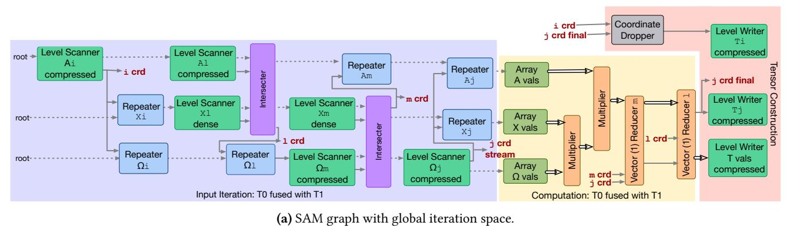

Input Iteration: T0

Level Scanner Array Avals

Repeater Xi dense

Level Scanner Ompressed

Repeater Xi dense

Level Scanner Ompressed

Repeater On Array Avals

Repeater On Array Avals

Repeater On Array Avals

Repeater On On On On On On On On On On On On On

(b) SAMML graph with factored iteration space.

Figure 21. SAM graph with global iteration space vs. SAMML graph with factored iteration space.

with its behavior equivalent to the global iteration space in Figure 5a. In this case, all computation is combined at the end, rather than interleaved. Figure 11 demonstrates how our sparse abstract machine dataflow graphs changed given the new lowering algorithm presented in this section. Concretely, for our GraphSAGE example, the SAM graph with global iteration space is shown in Figure 21a, constrasting with the SAMML graph with factored iteration space as shown in Figure 21b.

#### <span id="page-19-0"></span>**B.4** Full Cross-Expression Fusion Algorithm

We present the cross-expression fusion algorithm as described in Section 5 below in Algorithm 1.

## <span id="page-19-2"></span>**B.5** Full Fusion Table Lowering Algorithm

We present the full fusion table lowering algorithm as described in Section 6.1 below in Algorithm 2.

## <span id="page-19-3"></span>C Fusion Configuration Breakdown

We present the breakdown for each of the fusion configurations tested in Section 8 in Figure 22. Fused subset boxes

## <span id="page-20-0"></span>Algorithm 1 Cross-Expression Fusion with Ordering-Constraints

```
Require: List of kernel expressions \mathcal{E} = \{e_1, \dots, e_m\} in program order
Ensure: Fused Einsum expressions \mathcal{F} and a global partial-order graph P = (V, E)
 1: procedure FuseExpressions(\mathcal{E})
                                                                                                                             ▶ Init partial order graph
         P \leftarrow \text{InitPOG}
                                                                                                                            ▶ nodes = index variables
 3:
         \mathcal{F} \leftarrow []
                                                                                                                         ▶ accumulates fused kernels
         for all expression e \in \mathcal{E} do
 4:
              for all tensor T in e do
 5:
                   for all reduction indices r of T do
  6:
  7:
                       u \leftarrow \text{GETFRESHINDEXVAR}()
                       e \leftarrow e[r \leftarrow u]
                                                                                                                                           ▶ substitution
  8:
                   E \leftarrow E \cup \text{ModeOrderEdges}(T)
                                                                                                                  \triangleright add (\cdot \rightarrow \cdot) edges for T's format
  9:
              InlineUses(e, \mathcal{F})
                                                                                                                     ▶ replace all uses of e's outputs
10.
              order \leftarrow DataflowOrder(e)
                                                                                                                                         \triangleright e.g. j \rightarrow k \rightarrow i
11:
              for all outer \rightarrow inner in order do
12:
                   E \leftarrow E \cup \{(outer, inner)\}
13:
              for all tensor uses U in e grouped by original tensor name do
14:
                   if CompatibleViews(U) then
15:
                       MergeViews(U)
16:
                   else
17:
18
                       TAGDUPLICATE(U)
         if CycleDetected(P) then
19:
              RESOLVECYCLES((P))
                                                                                                        ▶ insert permutations on offending views
20:
          \pi \leftarrow \text{TopologicalSort}(P)
                                                                                                                            ▶ global concordant order
21:
          \mathcal{F} \leftarrow \text{EmitEinsum}(\pi)
                                                                                                                    ▶ respecting P and tensor views
22:
         return \mathcal{F}, P
23:
```

align with their corresponding unfused operations to show which components are combined.

## <span id="page-21-0"></span>Algorithm 2 Lowering a Tensor Computation Graph with Fusion Tables

```
Require: Tensor-IR graph G = (V, E)
Ensure: Staged, hardware-ready stream graph G'
 1: procedure LowerGraph(G)
        G' \leftarrow \text{InitGraph}
        for all tensor-views T in V (top-down) do
 3:
                                                                                            ▶ 1) Insert level scanners & value nodes
            if T is InputTensor then
 4:
                INSERTLSANDVAL(T, G')
 5:
                                                                                               ▶ 2) Insert repeat and compute nodes
            if T is IntermediateTensor then
 6:
                missing \leftarrow indices absent from T
 7.
                for all i \in missing do
 8:
                    InsertRep(T, i, G')
 9:
                InsertComputePipeline(T, G')
10:
                                                             ▶ 3) Handle higher-order reductions (modifies table by moving cells)
            if HasHigherOrderReduction(T) then
11:
                LOWERREDUCTION(T, G')
12:
                                                          ▶ 4) Stream-level merging across views (modifies table by moving cells)
        for all index-vars i shared by > 1 view do
13:
            MergeStreams(i, G')
                                                                                                                   ▶ intersect / union
14:
                                                                                            ▶ 5) Emit lambda table of cell evaluators
        \Lambda \leftarrow \text{EmitFusionTable}(G')
                                                                                                                         \triangleright \Lambda : \text{cell} \mapsto \lambda
15:
                                                                                   ▶ 6) Trigger graph construction via output view
        T_{\text{out}} \leftarrow \text{OutputTensor}(G)
16:
        Evaluate(\Lambda[T_{\mathrm{out}}])
17:
        return G'
18:
```

<span id="page-22-1"></span><span id="page-22-0"></span>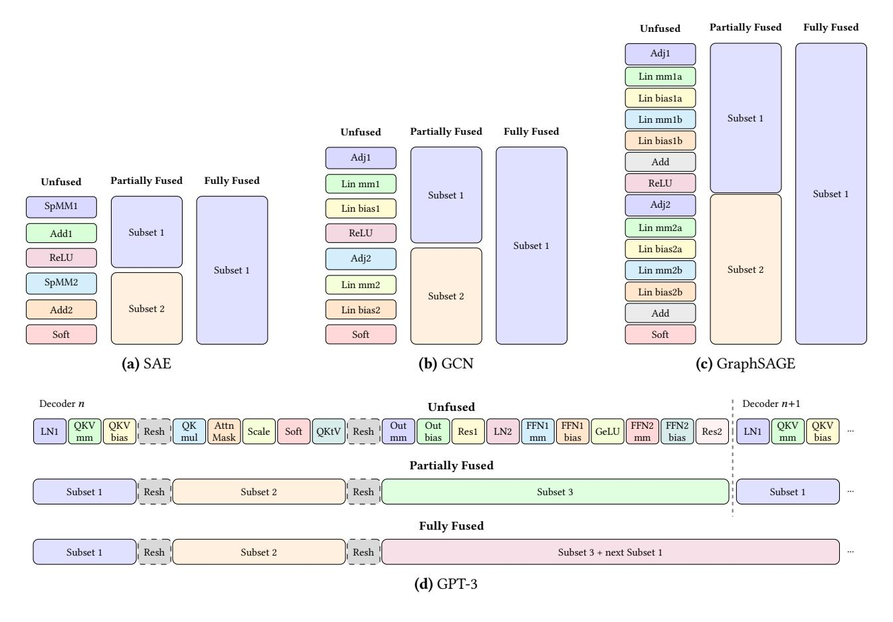

**Figure 22.** Fusion configurations for evaluated models. (a)–(c) show SAE, GCN, and GraphSAGE with three fusion granularities: unfused (separate kernels), partially fused (subsets per layer), and fully fused (single kernel). (d) GPT-3: reshape operations (dashed) act as fusion boundaries. Partial fusion groups operations into 3 subsets within each decoder. Fully fused merges Subset 3 of decoder n with Subset 1 of decoder n+1, fusing across decoder boundaries.