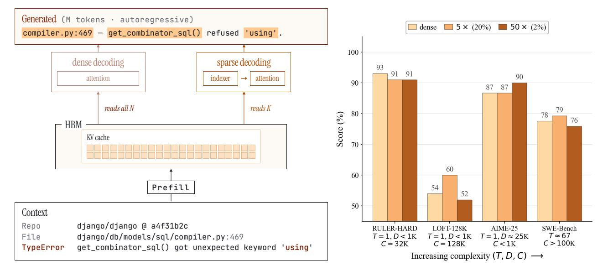
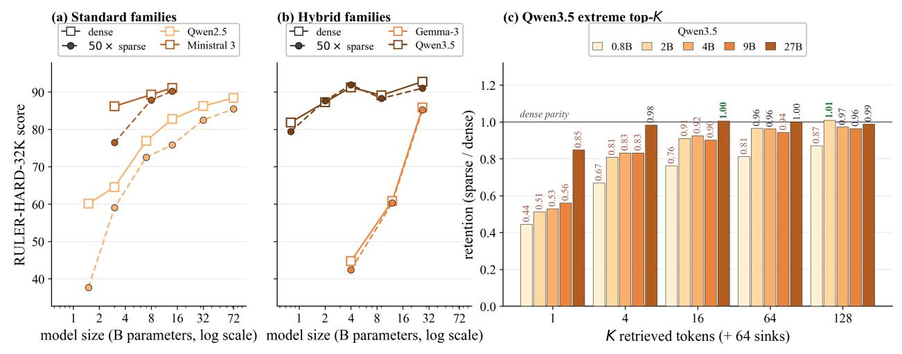
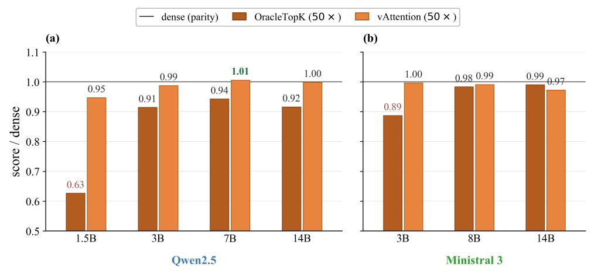
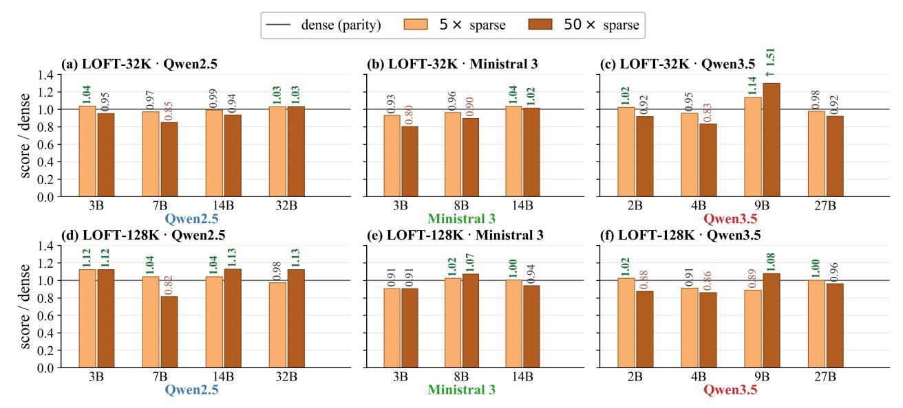
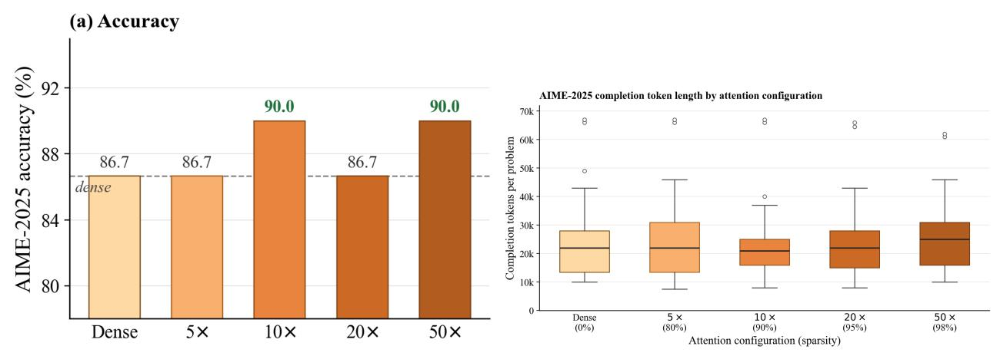
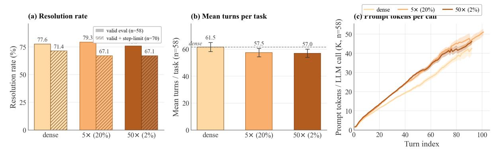
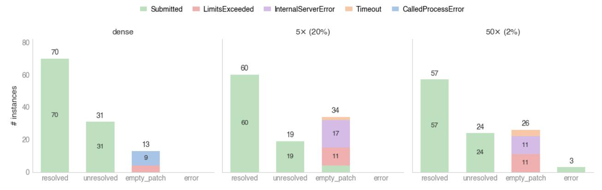
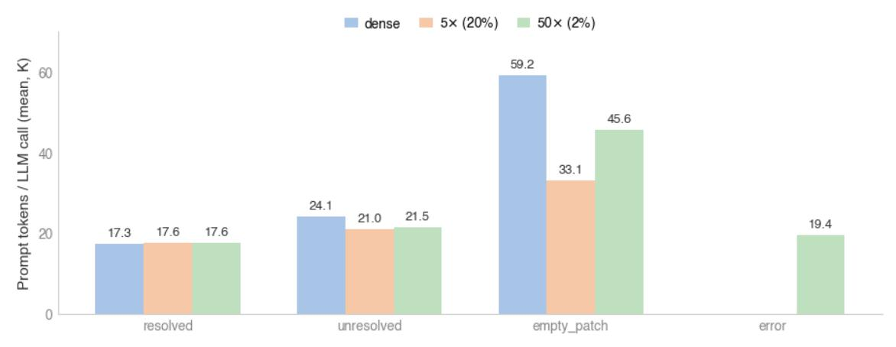

## Inference Time Context Sparsity: Illusion or Opportunity?

Sahil Joshi*α,*∗ Prithvi Dixit*β,*∗ Agniva Chowdhury*α* Anshumali Shrivastava*α* Joseph E. Gonzalez*β* Ion Stoica*β* Kumar Krishna Agrawal*β,*† Aditya Desai*γ,*† *α* Rice University *β* UC Berkeley *γ* IIT Bombay

#### **Abstract**

Sparsity has long been a central theme in LLM efficiency, but its role in context processing remains unresolved. As LLM workloads shift toward longer contexts and agentic interactions, the compute and memory bottlenecks of attention become increasingly critical, raising the question of whether these constraints are fundamental. Our position is that these constraints are artificial and unnecessary, and that the future of LLM inference lies in extreme but principled sparsity along the context dimension. This position is supported by several strands of empirical and theoretical evidence. First, we find the insistence on dense attention unreasonable, since in a long context a query effectively projects O(N) attention information into a hidden space of dimension *d* ≪ *N*, making the process inherently lossy. Second, we perform an extensive study of sparsity in LLMs spanning 20 models across five model families, varying context lengths, and different sparsity levels. We empirically demonstrate a strong trend: current LLMs, despite not being trained for context sparsity, are remarkably robust to inference-time decode sparsity across tasks of varying complexity, including retrieval, multi-hop QA, mathematical reasoning, and agentic coding. For instance, Qwen3.5-27B can tolerate up to 100× sparsity on benchmarks such as RULER-HARD and AIME2025 without loss of quality, and up to 50× sparsity on LOFT and SWE with only a small drop in performance. These results suggest that a transition to complete sparsity may be possible without meaningful loss of capability. Importantly, we also show that current hardware is already sufficient to realize substantial gains from this sparsity. For example, our sparse decode kernels accelerate large-context processing by up to 10× over FlashInfer at 50× sparsity levels on hardware such as the H100. Overall, these results position extreme context sparsity not as a heuristic, but as a principled foundation for LLM inference, training, and architecture design: one that is both feasible and beneficial, and a compelling direction for future systems.

**Code:** <https://github.com/skylight-org/sparse-attention-hub> **Project page:** <https://sky-light.eecs.berkeley.edu>

### **1 Introduction**

Sparsity in LLM inference has long been a goal for researchers. Efforts to sparsify the FFN component of Transformers [\[5,](#page-10-0) [10,](#page-10-1) [32,](#page-12-0) [39\]](#page-12-1) have largely converged on Mixture-of-Experts (MoE) as the de facto architecture across frontier labs [\[2,](#page-10-2) [27,](#page-12-2) [40,](#page-13-0) [46,](#page-13-1) [54\]](#page-14-0). In contrast, a similar consensus has yet to emerge for attention mechanisms, or more broadly, context processors. Research on sparsity in attention dates back several years and has recently re-emerged in the LLM era, primarily focusing on emergent sparsity in trained models [\[1,](#page-10-3) [6,](#page-10-4) [8,](#page-10-5) [9,](#page-10-6) [14,](#page-11-0) [20,](#page-11-1) [24,](#page-11-2) [30,](#page-12-3) [31,](#page-12-4) [42,](#page-13-2) [48,](#page-13-3) [55,](#page-14-1) [56,](#page-14-2) [57\]](#page-14-3). However, such sparsity is rarely adopted in state-of-the-art inference engines, highlighting a limited understanding of its practical value. There has been some consolidation of this line of work through the adoption of sparse attention during post-training [\[28,](#page-12-5) [54\]](#page-14-0). However, demonstrated gains are largely confined to extremely large model regimes, raising questions about their general applicability. In parallel, an

∗Equal contribution.

†Co-lead: kagrawal@berkeley.edu, apdesai@cse.iitb.ac.in.

**(a)** Inference-time attention I/O across decode regimes. **(b)** Qwen3.5-27B across workloads.

https://019dd287-bdd9-74fe-888e-dc41d8f40e8a.claudeusercontent.com/v1/design/projects/019dd287-bdd9-74fe-888e-dc41…abd17876f8801c35362e.b6f65acf-112c-4c45-a74d-79a3e46f8a51.c67336d4-4916-4146-a993-0abc9c8f6b80.1779413688&direct=1 Page 1 of 1 **Figure 1: Inference-time** 50× **context sparsity is bandwidth-friendly by construction (a) and retains near-dense quality across diverse workloads on a single model (b). (a)** Three decode regimes share an HBM band but read from it differently. *Dense* reads the full KV cache every step (O(*N*·*d*) bytes); *Sparse* routes through a lightweight indexer that selects *k* rows (O(*k*·*d*) bytes, *k*≪*N*); *Linear* (Gated DeltaNet) reads a fixed-size recurrent state *S* (O(*d* 2 ) bytes, constant in *N*). All three are memory-bandwidth bound on H100/B200; the contrast is whether per-step traffic scales with context length. **(b)** Qwen3.5-27B on four workloads ordered by increasing complexity along (*T, D, C*) – turns, decoded tokens per turn, input context per turn ([§3\)](#page-3-0). Configurations: **RULER-HARD-32K** (*T*=1*, D<*1K*, C*=32K); **LOFT-128K** (*T*=1*, D<*1K*, C*=128K); **AIME-2025** (*T*=1*, D*≈25K*, C<*1K); **SWE-Bench Django** (*T*≈67*, D*∼1K per turn*, C* grows to *>*100K). Sparse within ≤2 points of dense at 50× on retrieval (RULER, LOFT), reasoning (AIME), and agentic coding (SWE-Bench *S*3 subset, *n*=58, App. [B\)](#page-15-0). Kernel-level speedup on H100/B200 is deferred to [§4](#page-8-0) and Tab. [1.](#page-8-1)

alternative form of sparsity has emerged through the development of lightweight context processors, such as linear attention [\[7,](#page-10-7) [21,](#page-11-3) [22,](#page-11-4) [34,](#page-12-6) [53\]](#page-14-4), and SSMs [\[12,](#page-10-8) [23,](#page-11-5) [50,](#page-13-4) [52\]](#page-14-5). While these approaches have seen some adoption, modern architectures still retain full scaled dot-product attention (SDPA) layers, underscoring the limited expressivity of purely SSM-based models. This leads to a fundamental question: are the quadratic compute bottleneck during prefill and the linear memory bottleneck during decoding inherent constraints that are here to stay? This question is becoming increasingly important as LLM workloads shift toward substantially longer contexts and generations. Emerging use cases such as agentic tool use, code generation, retrieval augmented generation, multi document reasoning, long form dialogue, and repository scale software understanding are all driving this trend [\[13,](#page-10-9) [15,](#page-11-6) [17,](#page-11-7) [18,](#page-11-8) [26,](#page-11-9) [35,](#page-12-7) [36,](#page-12-8) [37,](#page-12-9) [38,](#page-12-10) [45,](#page-13-5) [49\]](#page-13-6). To ground this in concrete terms, a single 50 page PDF can contain on the order of 33K tokens. An LLM that aims to condition its responses on corporate or legal documents may therefore need to process hundreds of thousands, if not millions, of tokens within a single context window. At the same time, expectations for state of the art models continue to increase, with each generation pushing toward larger and more persistent context handling. Recent examples further highlight this shift. Systems such as openclaw [\[41\]](#page-13-7) have been reported to use system prompts reaching 160K tokens[1](#page-1-0) , illustrating how rapidly context sizes are expanding in practice. Importantly, these workloads do not merely involve longer prompts, but also often require long form generation over extended histories. This challenge is further amplified in agentic settings, where models iteratively generate outputs, incorporate new information, and repeatedly condition on growing interaction traces among agents. As a result, the question becomes of utmost importance: what does the future of LLM Inference looks like in context dimension?

1https://github.com/openclaw/openclaw/issues/21999

We take the following position: *The future of LLM inference lies in extreme sparsity along the context dimension.* Our position is primarily motivated by our large-scale empirical findings on inference-time sparsity, as well as the substantial speedups we demonstrate over FlashInfer even under sparsity patterns that are arguably highly irregular.

**Sparsity already exists in new generation models:** In Section [3](#page-3-0) we observe empirically that sparsity is already emerging in modern architectures. Larger and more recent models exhibit remarkable robustness to aggressive context sparsification across a wide spectrum of tasks as shown in Section [3.](#page-3-0) This holds for relatively simpler benchmarks such as RULER-HARD, a challenging subset of RULER [\[16\]](#page-11-10), and LOFT [\[25\]](#page-11-11), as well as for more complex reasoning tasks such as AIME [\[33\]](#page-12-11) and real-world agentic workloads such as SWE [\[19\]](#page-11-12) (50+ agentic turns). To our knowledge, this is the first study to examine inference-time sparsity on an agentic workload. Of course, inducing sparsity during training is ideal, but the emergence of sparsity at inference time reinforces the possibility that models can operate effectively in highly sparse regimes and provides greater confidence in designing training procedures that explicitly target sparsity. We empirically evaluate five model families, including Llama3[\[11\]](#page-10-10), Qwen2.5[\[47\]](#page-13-8), Qwen3.5[\[44\]](#page-13-9), Gemma3[\[43\]](#page-13-10), and Ministral3[\[29\]](#page-12-12), across four tasks: RULER-HARD (32K), LOFT (32K and 128K), AIME (65K generation length), and SWE (50+ agentic turns). Our results show that the effectiveness of inference-time sparsity improves with both model scale and the use of hybrid architectures. In particular, larger models from newer-generation families such as Qwen3.5, Gemma3, and Ministral3 sustain quality parity with dense execution even at 50× sparsity. For smaller standard models, the observed degradation can largely be mitigated through stochastic index selection [\[8\]](#page-10-5). Notably, these gains are achieved purely at inference time, suggesting that incorporating sparsity during training could yield even greater benefits.

**Sparsity can be leveraged for system gains:** The alignment of sparsity with hardware is of paramount importance for fully realizing its benefits. It is therefore essential to evaluate whether sparsity actually alleviates the underlying bottlenecks. A common belief is that efficiency gains require block-structured sparsity [\[58\]](#page-14-6); without it, sparsity is unlikely to translate into real speedups. We present an argument against this view. Notably, DeepSeek Attention [\[28\]](#page-12-5) demonstrates both trainingand inference-time speedups with token-level sparsity during prefill. This serves as evidence that token-level sparsity can indeed translate into practical efficiency gains without imposing excessive structure on the model. We extend this further to decoding. For decoding, we provide kernels that accelerate inference under per-token, per-query, and per-head sparsity, i.e., highly irregular sparsity patterns. These gains persist even under grouped query attention, where the number of query heads can be a factor (typically 4) larger than the number of key-value heads. This is possible because the KV cache's vector dimension provides sufficient contiguous memory to make such sparsity effective on modern hardware. In particular, our optimized sparse attention kernel, built on top of FlashInfer with a paged KV-cache backend, achieves up to 10× kernel speedup at 50× sparsity for large batch sizes.

**Non-existence of a truly dense attention:** Apart from the empirically strong results, our position and research is strongly rooted in the idea that dense attention is incompatible with long context. We show a simple result that truly dense attention does not exist in practice: full attention is ultimately bottlenecked by the hidden dimension, causing it to collapse unable to distinguish between varying attention distributions. While the result itself is straightforward, the implications are significant. It suggests that complete sparsity is not merely a practical approximation but principally a superior objective. Overall, this paper argues that the community should actively explore extreme sparsity along the context dimension without compromises such as partially retaining full attention layers. The empirical emergence of sparsity across multiple axes highlights strong potential, and decode-time sparse kernel analyses in Section [3,](#page-3-0) augmented by results from recent DeepSeek models, demonstrate the significant efficiency gains that can be unlocked.

### **2 Why Dense Attention is not meant for Long Context**

We begin by examining whether attention layers can remain truly dense as context length grows, and show that they cannot.

#### **2.1 Dense Attention Collapses Through The Hidden Dimension.**

While sparse attention and SSMs have their own shortcomings, fully dense attention has its own bottleneck: it assigns a weight to every context token, but the layer passes forward only a fixeddimensional hidden vector.

**Theorem 1.** *Let V* ∈ R *N*×*d be any value matrix, and let the dense attention output be o* = *V* ⊤*a, where a* = (*a*1*, . . . aN* ) *is an attention distribution over N context tokens. If d < N* − 1*, then this map is not injective on the attention simplex. In particular, there exist two distinct dense attention distributions a, a*′ *such that a* ̸= *a* ′ *, and V* ⊤*a* = *V* ⊤*a* ′ *. Thus, a d-dimensional post-attention embedding cannot preserve all dense attention-score variations over more than d* + 1 *context tokens.*

**Corollary 2.** *If all dense attention distributions over N context tokens must remain distinguishable after the attention output V* ⊤*a, then the hidden dimension must satisfy d* ≥ *N* − 1*. Thus, losslessly preserving arbitrary dense attention over a million-token context requires million-scale hidden width.*

This is the embedding bottleneck. When *d* ≪ *N*, the map *a* 7→ *V* ⊤*a* collapses many distinct attention patterns into the same hidden representation; hence not every fine-grained variation in a dense attention distribution can be carried forward by the post-attention vector. This conclusion is consistent with lower bounds for indexed lookup: finite-precision recurrent models, including RNNs, LSTMs, state-space models, and recurrent linear attention, require hidden-state size Ω(*N*) to recover arbitrary tokens from an *N*-token sequence [\[4\]](#page-10-11). These observations motivate a complete context-sparse attention.

## **3 Emergent Sparsity Observed in State-of-the-art Models**

We now turn to empirical evidence showing that even under current training recipes and latest architectures, where attention is not explicitly trained to be sparse, sparsity emerges regardless. This reinforces our proposal: it suggests that in principle, models can transition to extremely sparse context processing without any loss in capability. We adopt the following evaluation setup.

**Algorithms:** We enforce sparse attention at decode time and measure the effect across models, architectures, and tasks. The primary mechanism is exact *oracle* top-*k* selection (to eliminate confounds from approximate top-*k* indexers); in selected experiments we also report stochastic indexing via vAttention [\[8\]](#page-10-5).

**Datasets:** For long-context retrieval, we report the average score on RULER-32K-HARD, a challenging subset consisting of six tasks from RULER-32K [\[16\]](#page-11-10) (fwe, qa1, qa2, vt, nm2, and nm3). On the LOFT [\[25\]](#page-11-11) benchmark, we evaluate long-context performance by averaging results over five datasets (hotpotqa, nq, musique, qampari, and quest) at both 32K and 128K context lengths. To assess sparsity in long-form generation settings, we evaluate the largest hybrid model, Qwen3.5-27B [\[44\]](#page-13-9), on AIME2025 [\[33\]](#page-12-11), where we limit the generation length to 65K tokens. For agentic workloads, we evaluate Qwen3.5-27B on the SWE-Bench Django [\[19\]](#page-11-12) subset (114 tasks, ≤ 100 turns per task) at three sparsity levels: dense, 5× sparsity, and 50× sparsity. To our knowledge this is the first inference-time sparsity study on an agentic benchmark.

**Models.** We investigate five families, with a total of 20 models: three standard transformers (Qwen2.5 [\[47\]](#page-13-8), Ministral3 [\[29\]](#page-12-12), and Llama3 [\[11\]](#page-10-10)) and two hybrids (Qwen3.5 [\[44\]](#page-13-9) and Gemma3[\[43\]](#page-13-10)), enabling a controlled comparison of sparsity behavior across architectural variants.

**RULER-32K(Hard Subset)** On the hard subset of RULER, we observe two consistent trends across model families in Figure [2.](#page-4-0) First, hybrid architectures such as Qwen3.5 and Gemma3 exhibit significantly greater robustness to context sparsity, maintaining performance even at up to 50× sparsity with little to no degradation in quality. Interestingly, this robustness appears largely invariant to

**Figure 2: RULER-HARD-32K score across families, scales, and sparsity.** Scores are absolute (averaged over the six RULER-HARD subtasks). Squares mark dense (1×); filled circles mark sparse (5× and 50× oracle top-*k*). Each line is one checkpoint; lighter shade within a family means smaller scale. Panels (a) and (b) share the x-axis. **(a) Standard families.** Qwen2.5 (blue) and Ministral 3 (amber) fan out as sparsity grows: Qwen2.5-1.5B drops from 60 at dense to 38 at 50×, while Qwen2.5-72B holds within 3 points across the full sweep. **(b) Hybrid families.** Gemma-3 (green, sliding-window) and Qwen3.5 (red, linear-attention) stay essentially flat at every scale; the small-checkpoint penalty visible in (a) is absent. **(c) Qwen3.5 saturation under extreme top-***K***.** Retention = score*K/* scoredense, computed per subtask and then averaged. *K* retrieved tokens with 64 sinks always retained, *K* ∈ {1*,* 4*,* 16*,* 64*,* 128}. Larger Qwen3.5 scales saturate earlier (27B reaches near-parity by *K*=4); 0.8B is still climbing at *K*=128 (0.87 at the right edge) — the knee migrates with scale. Three Qwen3.5-27B cells in the parsed CSV were unevaluated and imputed at ceiling continuation of adjacent rates (nm3@5×, nm2@10× → 100; qa2@20× → 63); effect on the 6-subtask average is *<* 1 point. LLaMA-3 omitted: no per-subtask RULER-HARD data in the current eval set.

model scale within these families, suggesting that the inclusion of SSM or linear-attention layers may inherently improve resilience to sparse context retrieval.

We further evaluate the Qwen3.5 (See Figure [2\)](#page-4-0) family of hybrid models under extreme context sparsity, where the model is restricted to using only a very small number of retrieved tokens (1–128 tokens). Even in these highly constrained regimes, larger hybrid models exhibit striking robustness to sparsity. In particular, restricting attention to just 128 retrieved tokens corresponds to approximately 250× sparsity while still preserving strong performance. Given the broader trajectory of state-of-the-art LLMs toward larger parameter scales and increasingly hybrid architectures, these findings suggest that future inference systems may rely more heavily on extremely sparse context processing rather than dense attention across the entire context window.

Second, for standard dense-attention architectures such as Llama3, Qwen2.5, and Ministral3, robustness to sparsity improves steadily with model size as seen in Figure [2.](#page-4-0) In particular, the largest models in these families are able to preserve quality even under 50× sparsity. This suggests that scaling alone may enable stronger implicit retrieval and context localization capabilities, even in the absence of explicit architectural mechanisms for sparse processing. For smaller standard models, the performance of top-*k* can be significantly lower than dense model (see Figure [2\)](#page-4-0). A common explanation for the failure of top-*k* sparse attention is that attention mass is often diffusely distributed across the context, making deterministic selection of small number of tokens ineffective. However, this does not necessarily imply that attention itself must remain dense; rather, it points to the need for more effective context selection mechanisms. As shown in Figure [3,](#page-5-0) we find that stochastic index-selection approaches such as vAttention are able to nearly recover the quality of full attention while still operating under extreme sparsity in the context dimension (up to 50× sparsity in our experiments). These results suggest that the core limitation of conventional top-*k* sparsification may stem less from sparsity itself and more from the deterministic and locality-biased nature of the selection process.

**Figure 3: vAttention vs OracleTopK retention at** 50× **sparsity on RULER-HARD-32K.** Bars report relative score (sparse / dense); the horizontal line at 1*.*0 marks dense parity. Values ≥ 1*.*0 are bold green; values *<*0*.*90 are muted red. Panels separate model family ((a) Qwen2.5, (b) Ministral 3). Traditionally, the failure of top-*k* sparse attention has been attributed to the diffusion of attention scores across the context. However, this does not necessarily imply that attention must remain dense; rather, it suggests the need for a different mechanism for selecting relevant context. We observe that stochastic index-selection (vAttention) closely tracks dense parity at every Qwen2.5 and Ministral checkpoint, while deterministic OracleTopK collapses on smaller standard models (Qwen2.5-1.5B drops to ∼0*.*63 of dense). This suggests that the primary limitation of conventional top-*k* sparsification lies not in sparsity itself, but in the determinism and locality of the selection mechanism.

**LOFT-32K and LOFT-128K** To evaluate context sparsity beyond synthetic retrieval settings, we additionally study LOFT, a more natural retrieval and question-answering benchmark. LOFT appears to be substantially more challenging than RULER-HARD, with even the dense baseline models achieving relatively modest performance. Despite this increased difficulty, the qualitative trends with respect to sparsity remain largely consistent with those observed on RULER-HARD.

To further study the effect of sequence length, we evaluate LOFT under two context regimes: 32K and 128K tokens. Across both settings, robustness to sparsity remains remarkably stable. Intuitively, one might expect longer contexts to naturally induce greater effective sparsity, especially for retrievaloriented tasks where only a small subset of tokens should be relevant to the query. However, we do not observe a corresponding increase in inference-time sparsity as context length grows. This suggests that current models may not automatically adapt their retrieval behavior with increasing context size, pointing to potential opportunities during training to explicitly encourage sparsity to scale with context length.

**AIME25** We use AIME 2025 to evaluate the effect of context sparsity on long-form autoregressive generation. While we permit generations of up to 65K tokens, models produce roughly 25K tokens on average across evaluation samples, making this setting particularly sensitive to accumulated approximation errors. Sparse attention introduces perturbations at every embedding update, raising the concern that such errors may compound not only across layers, but also across thousands of autoregressively generated tokens.

Despite these concerns, the results on AIME demonstrate remarkable robustness to aggressive sparsification. Even over extremely long generations, model quality remains largely stable, suggesting that sparsity-induced approximation errors do not significantly destabilize long-horizon reasoning or autoregressive decoding dynamics. Furthermore, we observe that increasing sparsity results in only a marginal increase in the average number of generated tokens required to solve a task. This is an important practical observation: it indicates that improvements in per-token decoding efficiency can translate into genuine end-to-end reductions in task completion time, rather than being offset by substantially longer generations.

**Figure 4: LOFT subspan-EM retention under** 5× **and** 50× **inference-time sparsity.** Bars report relative score (sparse Subspan-EM / dense Subspan-EM); the horizontal line at 1*.*0 marks dense parity. Values ≥ 1*.*0 (sparse meets or exceeds dense) are bold green; values *<* 0*.*90 (over a 10% relative drop) are muted red. Layout: rows separate context length (top: 32K, bottom: 128K); columns separate model family (Qwen2.5: 3B–32B, Ministral3: 3B–14B, Qwen3.5: 2B–27B). At 5× sparsity, retention sits within ∼2% of dense across nearly every checkpoint; at 50×, mid-scale standard checkpoints (Qwen2.5-7B, Ministral-3B) suffer the largest drops while the hybrid Qwen3.5 family stays close to parity except at the smallest scales. Qwen3.5-9B at 32K shows a 1*.*51× ratio — a small-denominator effect on a low-scoring task — consistent with the qualitative picture from RULER-HARD that sparsity does not degrade quality once a model is large enough.

**SWE-Bench (Django)** SWE-bench [\[19\]](#page-11-12) is a benchmark of 2*,*294 real-world GitHub issues drawn from 12 popular Python repositories. Each task instance pairs an *issue* (a bug report or feature request, 195 words on average) with the corresponding repository snapshot at the base commit (codebases average 3*,*010 non-test files and 438K lines of code) and a set of *fail-to-pass* tests; the task is to produce a patch that resolves the issue and passes the tests. Gold patches average 32*.*8 lines spread over 1*.*7 files and 3 functions, so each instance reduces to identifying a small set of edits within a large body of context. We evaluate on the 114-task Django subset of SWE-Bench Lite, the curated variant of the original benchmark that biases toward single-file gold patches.

**Agentic compute profile:** We run Qwen3.5-27B as a tool-using coding agent inside the mini-swe-agent harness, with a limit of 250 turns per task. At every step, the agent sees its complete conversation history (issue text, prior tool calls, and their stdout/stderr), emits one new tool invocation, and the harness appends the tool output to the next prompt. Consequently, the effective context length grows monotonically from ∼1K tokens of issue text and repository metadata at turn one, to ∼20K tokens by turn 60 on a typical resolved trajectory, and exceeds 100K tokens on the tail of trajectories that hit the step limit. We compare three densities on the Django subset: dense, 5× (20%) sparsity, and 50× (2%) sparsity. To our knowledge this is the first inference-time sparsity study on an agentic benchmark.

**Resolution rate:** A clean three-way comparison requires controlling for runtime errors (e.g., timeouts, server errors) that can bury an otherwise competent run as an empty patch. We report two head-to-head subsets (Figure [6,](#page-7-0) left): the strict *n*=58 subset where all three configurations produced a valid evaluation verdict, and a broader *n*=70 subset that also admits tasks where the agent exhausted its 250-turn budget (step-limit hits, an agent-side failure mode shared across configs; see Appendix [B\)](#page-15-0). On the valid-eval subset the three configurations resolve within ∼2 points of each other (77*.*6% dense, 79*.*3% at 5×, 75*.*9% at 50×): on tasks that all three configurations finish cleanly, sparse matches dense. On the step-limit-inclusive subset the gap widens to ∼4 points (71*.*4% dense vs 67*.*1% at both sparse settings) because sparse runs collapse into degenerate command loops slightly more often, exhausting the turn budget without submitting. The full subgroup analysis is in Appendix [B.](#page-15-0)

**Figure 5:** We use AIME 2025 for evaluating long-form generation. Although we allow generations up to 65K tokens, models generate approximately 25K tokens on average across samples. Since sparse attention introduces approximation errors at each embedding update, an important concern is whether these errors compound across layers and, more critically, across autoregressively generated tokens. The results on AIME are therefore particularly promising: they indicate that models remain robust to sparsity-induced errors even over very long generations, suggesting that aggressive context sparsification does not necessarily destabilize long-horizon reasoning or autoregressive decoding. Additionally, we observe that increasing sparsity leads to only a slight increase in the average number of generated tokens per task. This suggests that the gains observed in decoding speed can translate into meaningful end-to-end task completion speedups in practice.

**Figure 6: SWE-Bench Django head-to-head, Qwen3.5-27B under dense,** 5×**, and** 50× **sparsity.** Left: resolution rate on two nested subsets (solid: *n*=58 where all three produced a valid eval verdict; hatched: *n*=70 that also admits tasks where any config exhausted its 250-turn budget). Sparse matches dense within ∼2 points on the strict subset; the ∼4-point gap on the broader subset is driven by sparse runs occasionally collapsing into degenerate command loops. Middle: mean agent turns per task on the strict *n*=58 subset (error bars: SEM). Right: mean prompt tokens per LLM call as a function of turn index, averaged across *n*=58 tasks that reached that turn (shaded band: ±SEM; tail truncated where fewer than six tasks remain); the sparse curves track dense closely with a small (∼6%) per-call offset that grows with context length. Full subgroup table, per-task cost, and outcome composition (including the step-limit failure mode) are in Appendix [B.](#page-15-0)

**Why we report a strict subset (error analysis):** A non-trivial fraction of trajectories never enter the patch-quality evaluation because the agent never emits a parseable diff (empty\_patch), or emits one the harness cannot apply (error). These are not attention-quality signal, so we attribute them to a root cause before deciding what to drop. Dense's 13 empty\_patch cases are 9 CalledProcessError (the per-instance docker run returned exit 125*/*127 *before* the agent could start: a daemon-side launch failure, not a model failure) plus 4 LimitsExceeded (the agent ran but hit the 250-turn cap without submitting). Sparse empty\_patch is bigger (34 at 5×, 26 at 50×) and has a different root cause: it is dominated by InternalServerError (17 and 11, respectively) and Timeout (2 and 4), both of which are the vLLM server crashing or stalling mid-trajectory under the sparse-attention-hub backend, an engineering instability of the serving stack rather than a property

**Table 1: Per-query, per-head irregular sparse decode is up to** 76× **faster than FlashInfer at extreme sparsity** Speedup over FlashInfer [\[51\]](#page-13-11) on H100 80GB HBM3 (FP16, GQA *Hq*=32, *Hkv*=8, *D*=128, page size 16, NHD, 128K context). *S*× sparsity implies each query-head attends to 1*/S* fraction of total tokens. The Speed up of *<* 1× denotes overhead. We generally break-even at 10× sparsity for every batch with huge speedups of 10–76× in the 50–500× regime. Note that no block structure imposed on the sparsity.

| B  | FlashInfer (ms) | 2x    | 4x    | 10x   | 20x   | 50x    | 100x   | 200x   | 500x   |
|----|-----------------|-------|-------|-------|-------|--------|--------|--------|--------|
| 1  | 0.19            | 0.32× | 0.63× | 1.45× | 2.58× | 5.57×  | 10.25× | 11.05× | 11.14× |
| 4  | 0.72            | 0.33× | 0.66× | 1.64× | 3.18× | 7.45×  | 13.36× | 24.25× | 42.04× |
| 8  | 1.50            | 0.38× | 0.77× | 1.90× | 3.75× | 8.88×  | 16.82× | 29.64× | 76.14× |
| 16 | 3.08            | 0.45× | 0.89× | 2.21× | 4.35× | 10.54× | 20.09× | 37.32× | 76.77× |

of sparse attention itself. The remaining sparse empty\_patch cases are LimitsExceeded (11 and 11); 50× additionally has 3 error cases where the produced patch was rejected by git apply. Because these failure modes either pre-date the model call (CalledProcessError) or are mid-call infrastructure crashes (InternalServerError, Timeout), they bury an otherwise competent run as a zero, and we drop them before comparing patch quality. The *n*=58 subset is the strict residual where all three configurations emitted a non-empty patch that the harness scored; the *n*=70 subset additionally admits LimitsExceeded on the rationale that turn-budget exhaustion is a shared, model-side failure mode. The full per-config outcome×exit-status breakdown is in Appendix [B.](#page-15-0) Together, these experiments probe sparsity across five key axes, yielding the following generic takeaways:

- **Scale:** Performance under top-*k* sparsity improves with model size; the gap between sparse and dense decoding largely closes at scale.
- **Architecture:** Hybrid models tolerate sparsity better than standard transformers. Notably, at high sparsity levels (e.g., 50× reduction), hybrid models maintain strong performance. In fact for larger hybrid model Qwen3.5-27B, even 16-32 tokens in top-*k* are enough to achieve parity with the dense model on RULER-HARD.
- **Context Length:** The qualitative behavior of sparsity remains consistent across context lengths. Observations at 32K and 128K contexts largely align, indicating that sparsity properties generalize to long-context settings without introducing additional degradation. A case can be made for more sparsity in longer contexts and it seems like it would need training time modifications to achieve it.
- **Algorithm:** Generally Hybrid models and large models with standard architecture show good results with top-*k* sparsity. However, for smaller models with standard architecture, top-*k* sparsity may not suffice. In such a case, stochastic sparsity with methods such as vAttention can still enable sparsity in attention while maintaining quality.
- **Task complexity:** Qwen3.5-27B robustness to sparsity holds across single-hop retrieval and multihop QA (RULER-HARD, LOFT), mathematical reasoning (AIME 2025), and agentic coding (SWE-Bench Django). This evaluation showcases that even inference time sparsity does not deteriorate the capability of models in many real world long context applications.

## **4 Sparsity and Hardware**

A common argument against sparsity concerns its poor alignment with modern hardware, which has led to considerable debate over whether block sparsity is a necessary condition for practical efficiency gains. DeepSeek-V3 Attention [\[28\]](#page-12-5) demonstrates that token-level fine-grained sparsity can yield meaningful efficiency improvements at both prefill and decode time: a result with implications not only for inference but also for training-time reductions on long-context workloads. We take this a step further

**Table 2: Sparse decode is net-positive with indexer cost included. We use DoubleSparsity as an example here.** Speedup over FlashInfer on H100 (FP16, 128K, page size 16) using Double Sparsity [\[48\]](#page-13-3) (8×16-bit channels, untuned) for index selection, under MHA (*Hq*=*Hkv*=32) and GQA (*Hq*=32*, Hkv*=8). MHA: break-even at 2× sparsity with 4*.*17× speedup at 100× sparsity. GQA: break-even at 10×, with 2*.*81× speed up at 100×. A lighter indexer (HashAttention, PQCache, low-precision Double Sparsity) is expected to widen the margin. The upper limit can be seen from Table [1](#page-8-1)

| B   | FlashInfer (ms) | 2x    | 5x    | 10x   | 20x   | 50x   | 100x  |  |  |  |  |  |
|-----|-----------------|-------|-------|-------|-------|-------|-------|--|--|--|--|--|
| GQA | (Hq=32, Hk=8)   |       |       |       |       |       |       |  |  |  |  |  |
| 1   | 0.19            | 0.28× | 0.56× | 0.83× | 1.12× | 1.46× | 1.65× |  |  |  |  |  |
| 4   | 0.72            | 0.32× | 0.67× | 1.06× | 1.52× | 2.11× | 2.45× |  |  |  |  |  |
| 8   | 1.50            | 0.36× | 0.75× | 1.18× | 1.68× | 2.30× | 2.66× |  |  |  |  |  |
| 16  | 3.08            | 0.41× | 0.85× | 1.31× | 1.82× | 2.46× | 2.81× |  |  |  |  |  |
| MHA | (Hq=Hk=32)      |       |       |       |       |       |       |  |  |  |  |  |
| 1   | 0.70            | 0.91× | 1.62× | 2.18× | 2.68× | 3.14× | 3.37× |  |  |  |  |  |
| 4   | 2.79            | 1.02× | 1.86× | 2.56× | 3.17× | 3.74× | 4.00× |  |  |  |  |  |
| 8   | 5.61            | 1.12× | 2.00× | 2.71× | 3.32× | 3.86× | 4.11× |  |  |  |  |  |
| 16  | 11.18           | 1.22× | 2.13× | 2.84× | 3.43× | 3.94× | 4.17× |  |  |  |  |  |

in the context of decode-time sparsity. We show that it is possible to improve upon the state-of-theart FlashInfer[2](#page-9-0) decoding kernels using an even finer-grained sparsity pattern: per-query, per-queryhead token-level sparsity. We find this effective even in challenging settings such as Grouped Query Attention (GQA) [\[3\]](#page-10-12) where number of query heads can be much larger than key-value heads.

We benchmark sparse decode backend kernel against a full dense decode baseline on an NVIDIA H100 80GB HBM3 GPU using fp16 precision, *Hkv* = 8, *Hq* = 32, head dimension *D* = 128, page size 16, and NHD layout. Table [1](#page-8-1) shows the performance of sparse backend which computes the weighted attention given sparse index and associated weights. It shows that we can leverage even this irregular sparsity. At 50–100× sparsity, our backend delivers 5*.*5–20× speedup over FlashInfer across batch sizes; at extreme 500× sparsity, speedup reaches 76× at large batch (Table [1\)](#page-8-1).

To include some form of indexing mechanism, we simulate an 8-channel (16-bit precision) Double Sparsity [\[48\]](#page-13-3) indexer and report results in Table [2.](#page-9-1) Double Sparsity achieves up to 4*.*17× speedup in MHA and 2*.*81× in GQA at 100× sparsity. MHA crosses break-even at 2× sparsity; GQA at 10–20×. A lighter indexer (HashAttention [\[9\]](#page-10-6), PQCache [\[55\]](#page-14-1), or low-precision Double Sparsity [\[48\]](#page-13-3)) is expected to widen these margins.

#### **5 Conclusion**

The AI workload landscape is rapidly shifting toward long-context understanding and long-form generation, with tasks such as repository-scale code comprehension, long-document question answering, and agentic systems becoming increasingly common. We argue that standard attention mechanisms were not designed for such extreme context lengths. In particular, attention faces a fundamental embedding bottleneck: a relatively small hidden dimension *d* ≪ *N* forces information from an *N*-dimensional context to collapse into a much lower-dimensional representation. Motivated by this limitation, we envision a future in which long-context LLM inference becomes entirely sparse in the context dimension. To support this vision, we demonstrate the surprising robustness of new-generation large models to extreme sparsity, even though these models were not explicitly trained for sparse context processing. We further show that multiple forms of sparsity can already be exploited effectively on current hardware, while even greater gains may be unlocked through future hardware designs that explicitly acknowledge the inherently sparse nature of context processing. Overall, we believe the community should treat sparsity as a central principle when designing the next generation of model architectures,

2<flashinfer.ai>

inference and training systems, and the hardware platforms on which they operate.

#### **References**

- [1] Josh Achiam, Steven Adler, Sandhini Agarwal, Lama Ahmad, Ilge Akkaya, Florencia Leoni Aleman, Diogo Almeida, Janko Altenschmidt, Sam Altman, Shyamal Anadkat, et al. GPT-4 Technical Report. *arXiv preprint arXiv:2303.08774*, 2023.
- [2] Sandhini Agarwal, Lama Ahmad, Jason Ai, Sam Altman, Andy Applebaum, Edwin Arbus, Rahul K Arora, Yu Bai, Bowen Baker, Haiming Bao, et al. gpt-oss-120b & gpt-oss-20b Model Card. *arXiv preprint arXiv:2508.10925*, 2025.
- [3] Joshua Ainslie, James Lee-Thorp, Michiel de Jong, Yury Zemlyanskiy, Federico Lebron, and Sumit Sanghai. GQA: Training generalized multi-query transformer models from multi-head checkpoints. In *Proceedings of the 2023 Conference on Empirical Methods in Natural Language Processing*, pages 4895–4901, 2023.
- [4] Satwik Bhattamishra, Michael Hahn, Phil Blunsom, and Varun Kanade. Separations in the representational capabilities of transformers and recurrent architectures. In *The Thirty-eighth Annual Conference on Neural Information Processing Systems*, 2024.
- [5] Beidi Chen, Tharun Medini, James Farwell, Charlie Tai, Anshumali Shrivastava, et al. SLIDE : In Defense of Smart Algorithms over Hardware Acceleration for Large-Scale Deep Learning Systems. *Proceedings of Machine Learning and Systems*, 2:291–306, 2020.
- [6] Zhuoming Chen, Ranajoy Sadhukhan, Zihao Ye, Yang Zhou, Jianyu Zhang, Niklas Nolte, Yuandong Tian, Matthijs Douze, Leon Bottou, Zhihao Jia, and Beidi Chen. MagicPIG: LSH Sampling for Efficient LLM Generation. In *The Thirteenth International Conference on Learning Representations*, 2025.
- [7] Krzysztof Marcin Choromanski, Valerii Likhosherstov, David Dohan, Xingyou Song, Andreea Gane, Tamas Sarlos, Peter Hawkins, Jared Quincy Davis, Afroz Mohiuddin, Lukasz Kaiser, David Benjamin Belanger, Lucy J Colwell, and Adrian Weller. Rethinking Attention with Performers. In *International Conference on Learning Representations*, 2021.
- [8] Aditya Desai, Kumar Krishna Agrawal, Shuo Yang, Alejandro Cuadron, Luis Gaspar Schroeder, Matei Zaharia, Joseph E. Gonzalez, and Ion Stoica. vAttention: Verified Sparse Attention via Sampling. In *The Fourteenth International Conference on Learning Representations*, 2026.
- [9] Aditya Desai, Shuo Yang, Alejandro Cuadron, Matei Zaharia, Joseph E. Gonzalez, and Ion Stoica. HashAttention: Semantic Sparsity for Faster Inference. In *Forty-second International Conference on Machine Learning*, 2025.
- [10] William Fedus, Barret Zoph, and Noam Shazeer. Switch Transformers: Scaling to Trillion Parameter Models with Simple and Efficient Sparsity. *Journal of Machine Learning Research*, 23(120):1– 39, 2022.
- [11] Aaron Grattafiori, Abhimanyu Dubey, Abhinav Jauhri, Abhinav Pandey, Abhishek Kadian, Ahmad Al-Dahle, Aiesha Letman, Akhil Mathur, Alan Schelten, Alex Vaughan, et al. The Llama 3 Herd of Models. *arXiv preprint arXiv:2407.21783*, 2024.
- [12] Albert Gu and Tri Dao. Mamba: Linear-Time Sequence Modeling with Selective State Spaces. In *First Conference on Language Modeling*, 2024.
- [13] Kelvin Guu, Kenton Lee, Zora Tung, Panupong Pasupat, and Ming-Wei Chang. REALM: Retrieval-Augmented Language Model Pre-Training. In *International Conference on Machine Learning (ICML)*, 2020.

- [14] Coleman Richard Charles Hooper, Sehoon Kim, Hiva Mohammadzadeh, Monishwaran Maheswaran, Sebastian Zhao, June Paik, Michael W Mahoney, Kurt Keutzer, and Amir Gholami. Squeezed Attention: Accelerating Long Context Length LLM Inference. In *Proceedings of the 63rd Annual Meeting of the Association for Computational Linguistics*, 2025.
- [15] Xinyi Hou, Yanjie Zhao, Yue Liu, Zhou Yang, Kailong Wang, Li Li, Xiapu Luo, David Lo, John Grundy, and Haoyu Wang. Large Language Models for Software Engineering: A Systematic Literature Review. *ACM Transactions on Software Engineering and Methodology*, 33:1–79, 2024.
- [16] Cheng-Ping Hsieh, Simeng Sun, Samuel Kriman, Shantanu Acharya, Dima Rekesh, Fei Jia, and Boris Ginsburg. RULER: What's the real context size of your long-context language models? In *First Conference on Language Modeling*, 2024.
- [17] Gautier Izacard and Edouard Grave. Leveraging Passage Retrieval with Generative Models for Open Domain Question Answering. In *Proceedings of the 16th Conference of the European Chapter of the Association for Computational Linguistics: Main Volume*, pages 874–880, 2021.
- [18] Gautier Izacard, Patrick Lewis, Maria Lomeli, Lucas Hosseini, Fabio Petroni, Timo Schick, Jane Dwivedi-Yu, Armand Joulin, Sebastian Riedel, and Edouard Grave. ATLAS: Few-Shot Learning with Retrieval Augmented Language Models. *The Journal of Machine Learning Research*, 24(1), 2023.
- [19] Carlos E Jimenez, John Yang, Alexander Wettig, Shunyu Yao, Kexin Pei, Ofir Press, and Karthik R Narasimhan. SWE-bench: Can Language Models Resolve Real-world Github Issues? In *The Twelfth International Conference on Learning Representations*, 2024.
- [20] Sahil Joshi, Agniva Chowdhury, Wyatt Bellinger, Amar Kanakamedala, Ekam Singh, Hoang Anh Duy Le, Aditya Desai, and Anshumali Shrivastava. SOCKET: SOft Collison Kernel EsTimator for Sparse Attention. *arXiv preprint arXiv:2602.06283*, 2026.
- [21] Sahil Joshi, Agniva Chowdhury, Amar Kanakamedala, Ekam Singh, Evan Tu, and Anshumali Shrivastava. RACE Attention: A Strictly Linear-Time Attention Layer for Training on Outrageously Large Contexts. In *The Fourteenth International Conference on Learning Representations*, 2026.
- [22] Angelos Katharopoulos, Apoorv Vyas, Nikolaos Pappas, and François Fleuret. Transformers are RNNs: Fast Autoregressive Transformers with Linear Attention. In *International Conference on Machine Learning*, 2020.
- [23] Aakash Lahoti, Kevin Li, Berlin Chen, Caitlin Wang, Aviv Bick, J Zico Kolter, Tri Dao, and Albert Gu. Mamba-3: Improved Sequence Modeling using State Space Principles. In *The Fourteenth International Conference on Learning Representations*, 2026.
- [24] Xunhao Lai, Jianqiao Lu, Yao Luo, Yiyuan Ma, and Xun Zhou. FlexPrefill: A Context-Aware Sparse Attention Mechanism for Efficient Long-Sequence Inference. In *The Thirteenth International Conference on Learning Representations*, 2025.
- [25] Jinhyuk Lee, Anthony Chen, Zhuyun Dai, Dheeru Dua, Devendra Singh Sachan, Michael Boratko, Yi Luan, Sébastien M. R. Arnold, Vincent Perot, Siddharth Dalmia, Hexiang Hu, Xudong Lin, Panupong Pasupat, Aida Amini, Jeremy R. Cole, Sebastian Riedel, Iftekhar Naim, Ming-Wei Chang, and Kelvin Guu. Can Long-Context Language Models Subsume Retrieval, RAG, SQL, and More? *arXiv preprint arXiv:2406.13121*, 2024.
- [26] Yujia Li, David Choi, Junyoung Chung, Nate Kushman, Julian Schrittwieser, Rémi Leblond, Tom Eccles, James Keeling, Felix Gimeno, Agustin Dal Lago, et al. Competition-Level Code Generation with AlphaCode. *Science*, 378(6624):1092–1097, 2022.

- [27] Aixin Liu, Bei Feng, Bing Xue, Bingxuan Wang, Bochao Wu, Chengda Lu, Chenggang Zhao, Chengqi Deng, Chenyu Zhang, Chong Ruan, et al. DeepSeek-V3 technical report. *arXiv preprint arXiv:2412.19437*, 2024.
- [28] Aixin Liu, Aoxue Mei, Bangcai Lin, Bing Xue, Bingxuan Wang, Bingzheng Xu, Bochao Wu, Bowei Zhang, Chaofan Lin, Chen Dong, et al. DeepSeek-V3.2: Pushing the Frontier of Open Large Language Models. *arXiv preprint arXiv:2512.02556*, 2025.
- [29] Alexander H Liu, Kartik Khandelwal, Sandeep Subramanian, Victor Jouault, Abhinav Rastogi, Adrien Sadé, Alan Jeffares, Albert Jiang, Alexandre Cahill, Alexandre Gavaudan, et al. Ministral 3. *arXiv preprint arXiv:2601.08584*, 2026.
- [30] Di Liu, Meng Chen, Baotong Lu, Huiqiang Jiang, Zhenhua Han, Qianxi Zhang, Qi Chen, Chengruidong Zhang, Bailu Ding, Kai Zhang, Chen Chen, Fan Yang, Yuqing Yang, and Lili Qiu. RetrievalAttention: Accelerating Long-Context LLM Inference via Vector Retrieval. In *The Thirty-ninth Annual Conference on Neural Information Processing Systems*, 2026.
- [31] Zichang Liu, Aditya Desai, Fangshuo Liao, Weitao Wang, Victor Xie, Zhaozhuo Xu, Anastasios Kyrillidis, and Anshumali Shrivastava. Scissorhands: Exploiting the persistence of importance hypothesis for llm kv cache compression at test time. *Advances in Neural Information Processing Systems*, 36, 2024.
- [32] Zichang Liu, Jue Wang, Tri Dao, Tianyi Zhou, Binhang Yuan, Zhao Song, Anshumali Shrivastava, Ce Zhang, Yuandong Tian, Christopher Re, et al. Deja vu: Contextual sparsity for efficient llms at inference time. In *International Conference on Machine Learning*, pages 22137–22176. PMLR, 2023.
- [33] Mathematical Association of America. American Invitational Mathematics Examination (AIME) 2025. <https://maa.org/maa-invitational-competitions/>, 2025. Accessed: 2026-05- 20.
- [34] Hao Peng, Nikolaos Pappas, Dani Yogatama, Roy Schwartz, Noah Smith, and Lingpeng Kong. Random Feature Attention. In *International Conference on Learning Representations*, 2021.
- [35] Ofir Press, Muru Zhang, Sewon Min, Ludwig Schmidt, Noah Smith, and Mike Lewis. Measuring and Narrowing the Compositionality Gap in Language Models. In *Findings of the Association for Computational Linguistics: EMNLP 2023*, 2023.
- [36] Baptiste Rozière, Jonas Gehring, Fabian Gloeckle, Sten Sootla, Itai Gat, Xiaoqing Ellen Tan, Yossi Adi, Jingyu Liu, Romain Sauvestre, Tal Remez, et al. Code Llama: Open Foundation Models for Code. *arXiv preprint arXiv:2308.12950*, 2023.
- [37] Ludan Ruan and Qin Jin. Survey: Transformer based Video-Language Pre-Training. *AI Open*, 3:1–13, 2022.
- [38] Timo Schick, Jane Dwivedi-Yu, Roberto Dessi, Roberta Raileanu, Maria Lomeli, Eric Hambro, Luke Zettlemoyer, Nicola Cancedda, and Thomas Scialom. Toolformer: Language Models Can Teach Themselves to Use Tools. In *Thirty-seventh Conference on Neural Information Processing Systems*, 2023.
- [39] Noam Shazeer, \*Azalia Mirhoseini, \*Krzysztof Maziarz, Andy Davis, Quoc Le, Geoffrey Hinton, and Jeff Dean. Outrageously Large Neural Networks: The Sparsely-Gated Mixture-of-Experts Layer. In *International Conference on Learning Representations*, 2017.

- [40] Aaditya Singh, Adam Fry, Adam Perelman, Adam Tart, Adi Ganesh, Ahmed El-Kishky, Aidan McLaughlin, Aiden Low, AJ Ostrow, Akhila Ananthram, et al. OpenAI GPT-5 System Card. *arXiv preprint arXiv:2601.03267*, 2025.
- [41] Peter Steinberger and OpenClaw contributors. OpenClaw: Personal AI Assistant. [https:](https://github.com/openclaw/openclaw) [//github.com/openclaw/openclaw](https://github.com/openclaw/openclaw), 2026.
- [42] Jiaming Tang, Yilong Zhao, Kan Zhu, Guangxuan Xiao, Baris Kasikci, and Song Han. QUEST: Query-Aware Sparsity for Efficient Long-Context LLM Inference. In *International Conference on Machine Learning*, 2024.
- [43] Gemma Team, Aishwarya Kamath, Johan Ferret, Shreya Pathak, Nino Vieillard, Ramona Merhej, Sarah Perrin, Tatiana Matejovicova, Alexandre Ramé, Morgane Rivière, Louis Rouillard, Thomas Mesnard, Geoffrey Cideron, Jean bastien Grill, Sabela Ramos, Edouard Yvinec, Michelle Casbon, Etienne Pot, Ivo Penchev, Gaël Liu, Francesco Visin, Kathleen Kenealy, Lucas Beyer, Xiaohai Zhai, Anton Tsitsulin, Robert Busa-Fekete, Alex Feng, Noveen Sachdeva, Benjamin Coleman, Yi Gao, Basil Mustafa, Iain Barr, Emilio Parisotto, David Tian, Matan Eyal, Colin Cherry, Jan-Thorsten Peter, Danila Sinopalnikov, Surya Bhupatiraju, Rishabh Agarwal, Mehran Kazemi, et al. Gemma 3 technical report. *arXiv preprint arXiv:2503.19786*, 2025.
- [44] Qwen Team. Qwen3.5: Accelerating productivity with native multimodal agents, February 2026.
- [45] Hugo Touvron, Thibaut Lavril, Gautier Izacard, Xavier Martinet, Marie-Anne Lachaux, Timothée Lacroix, Baptiste Rozière, Naman Goyal, Eric Hambro, Faisal Azhar, Aurelien Rodriguez, Armand Joulin, Edouard Grave, and Guillaume Lample. LLaMA: Open and Efficient Foundation Language Models. *arXiv preprint arXiv:2302.13971*, 2023.
- [46] An Yang, Anfeng Li, Baosong Yang, Beichen Zhang, Binyuan Hui, Bo Zheng, Bowen Yu, Chang Gao, Chengen Huang, Chenxu Lv, et al. Qwen3 Technical Report. *arXiv preprint arXiv:2505.09388*, 2025.
- [47] An Yang, Baosong Yang, Beichen Zhang, Binyuan Hui, Bo Zheng, Bowen Yu, Chengyuan Li, Dayiheng Liu, Fei Huang, Haoran Wei, Huan Lin, Jian Yang, Jianhong Tu, Jianwei Zhang, Jianxin Yang, Jiaxi Yang, Jingren Zhou, Junyang Lin, Kai Dang, Keming Lu, Keqin Bao, Kexin Yang, Le Yu, Mei Li, Mingfeng Xue, Pei Zhang, Qin Zhu, Rui Men, Runji Lin, Tianhao Li, Tianyi Tang, Tingyu Xia, Xingzhang Ren, Xuancheng Ren, Yang Fan, Yang Su, Yichang Zhang, Yu Wan, Yuqiong Liu, Zeyu Cui, Zhenru Zhang, and Zihan Qiu. Qwen2.5 Technical Report. *arXiv preprint arXiv:2412.15115*, 2025.
- [48] Shuo Yang, Ying Sheng, Joseph E. Gonzalez, Ion Stoica, and Lianmin Zheng. Post-Training Sparse Attention with Double Sparsity. *arXiv preprint arXiv:2408.07092*, 2024.
- [49] Shunyu Yao, Jeffrey Zhao, Dian Yu, Nan Du, Izhak Shafran, Karthik R Narasimhan, and Yuan Cao. ReAct: Synergizing Reasoning and Acting in Language Models. In *The Eleventh International Conference on Learning Representations*, 2023.
- [50] Zhifan Ye, Kejing Xia, Yonggan Fu, Xin Dong, Jihoon Hong, Xiangchi Yuan, Shizhe Diao, Jan Kautz, Pavlo Molchanov, and Yingyan Celine Lin. LongMamba: Enhancing Mamba's Long-Context Capabilities via Training-Free Receptive Field Enlargement. In *The Thirteenth International Conference on Learning Representations*, 2025.
- [51] Zihao Ye, Lequn Chen, Ruihang Lai, Wuwei Lin, Yineng Zhang, Stephanie Wang, Tianqi Chen, Baris Kasikci, Vinod Grover, Arvind Krishnamurthy, and Luis Ceze. Flashinfer documentation, 2024. Accessed: 2025-05-27.

- [52] Annan Yu and N. Benjamin Erichson. Block-Biased Mamba for Long-Range Sequence Processing. In *The Thirty-ninth Annual Conference on Neural Information Processing Systems*, 2026.
- [53] Manzil Zaheer, Guru Guruganesh, Avinava Dubey, Joshua Ainslie, Chris Alberti, Santiago Ontanon, Philip Pham, Anirudh Ravula, Qifan Wang, Li Yang, and Amr Ahmed. Big Bird: Transformers for Longer Sequences. In *Advances in Neural Information Processing Systems*, 2020.
- [54] Aohan Zeng, Xin Lv, Zhenyu Hou, Zhengxiao Du, Qinkai Zheng, Bin Chen, Da Yin, Chendi Ge, Chenghua Huang, Chengxing Xie, et al. GLM-5: from Vibe Coding to Agentic Engineering. *arXiv preprint arXiv:2602.15763*, 2026.
- [55] Hailin Zhang, Xiaodong Ji, Yilin Chen, Fangcheng Fu, Xupeng Miao, Xiaonan Nie, Weipeng Chen, and Bin Cui. PQCache: Product Quantization-based KVCache for Long Context LLM Inference. *Proceedings of the ACM on Management of Data*, 3(3):1–30, 2025.
- [56] Jintao Zhang, Chendong Xiang, Haofeng Huang, Jia wei, Haocheng Xi, Jun Zhu, and Jianfei Chen. SpargeAttention: Accurate and Training-free Sparse Attention Accelerating Any Model Inference. In *Forty-second International Conference on Machine Learning*, 2025.
- [57] Zhenyu Zhang, Ying Sheng, Tianyi Zhou, Tianlong Chen, Lianmin Zheng, Ruisi Cai, Zhao Song, Yuandong Tian, Christopher Re, Clark Barrett, Zhangyang Wang, and Beidi Chen. H2O: Heavy-Hitter Oracle for Efficient Generative Inference of Large Language Models. In *Thirty-seventh Conference on Neural Information Processing Systems*, 2023.
- [58] Ding Zhu, Zhiqun Zuo, and Mohammad Mahdi Khalili. An efficient training algorithm for models with block-wise sparsity. *Transactions on Machine Learning Research*, 2025.

#### **Appendix**

#### A Proofs

#### A.1 Proof of Theorem 1

*Proof.* Consider the linear map  $T: \mathbb{R}^N \to \mathbb{R}^d$  defined by  $T(a) := V^\top a$ . Since  $V^\top \in \mathbb{R}^{d \times N}$ , we have  $\operatorname{rank}(T) \leq d$ . Let  $\mathcal{N}(T) := \{z \in \mathbb{R}^N : V^\top z = 0\}$  be the null space of T. By rank-nullity,

$$\dim \mathcal{N}(T) = N - \operatorname{rank}(T) \ge N - d.$$

We want a nonzero direction in the null space that also preserves the simplex sum constraint. Let  $\mathbf{1} := (1, \dots, 1)^{\top} \in \mathbb{R}^{N}$  and consider the zero-sum hyperplane  $H := \{z \in \mathbb{R}^{N} : \mathbf{1}^{\top}z = 0\}$ . This hyperplane has dimension N - 1. By the standard dimension formula for subspaces,

$$\dim(\mathcal{N}(T)\cap H) \ge \dim \mathcal{N}(T) + \dim H - N.$$

Since dim  $\mathcal{N}(T) \geq N - d$  and dim H = N - 1, we get

$$\dim(\mathcal{N}(T) \cap H) \ge (N - d) + (N - 1) - N = N - d - 1 > 0,$$

where the last inequality uses d < N - 1. Hence there exists a nonzero  $z \in \mathcal{N}(T) \cap H$  such that  $V^{\top}z = 0$ , and  $\mathbf{1}^{\top}z = 0$ . Since  $z \neq 0$ , we may rescale it as  $z \leftarrow \frac{z}{\|z\|_{\infty}}$ , so that  $\|z\|_{\infty} = 1$ . This rescaling preserves  $V^{\top}z = 0$  and  $\mathbf{1}^{\top}z = 0$ . Now, let  $a_0 := \frac{1}{N}\mathbf{1}$  be the uniform attention distribution, and fix any  $\beta \in (0,1)$  and define

$$a := a_0 + \frac{\beta}{N} z, \qquad a' := a_0 - \frac{\beta}{N} z.$$

Since  $\mathbf{1}^{\top}z = 0$ , both a and a' sum to one. Moreover, since  $||z||_{\infty} = 1$ , each coordinate satisfies

$$\frac{1-\beta}{N} \le a_i, a_i' \le \frac{1+\beta}{N}.$$

Because  $\beta \in (0, 1)$ , all coordinates are strictly positive. Thus a and a' are valid attention distributions, and both have full support. They are distinct because  $z \neq 0$ .

Finally,

$$V^{\top} a = V^{\top} a_0 + \frac{\beta}{N} V^{\top} z = V^{\top} a_0 = V^{\top} a_0 - \frac{\beta}{N} V^{\top} z = V^{\top} a'.$$

Thus there exist two distinct full-support attention distributions a and a' such that

$$a \neq a', \qquad V^{\top} a = V^{\top} a'.$$

Therefore, the map  $a \mapsto V^{\top}a$  is not injective on the attention simplex when d < N - 1.

# B SWE-Bench Django: subgroup, failure-mode, and cost break-down

This appendix reports the complete SWE-Bench Django evaluation behind the headline of Sec. 3: that on tasks the dense baseline can solve, sparse attention matches dense within  $\sim 2$ pp, and the larger  $S_0$  gap is driven by serving-stack failures rather than attention quality. We compare three configurations on Qwen3.5-27B served via vLLM under the mini-swe-agent v2.2.8 harness (step\_limit=250, cost\_limit=\$3, 60s per-command timeout): dense is full softmax (100% density);  $5 \times is Sink(128) + Local(128) + OracleTopK$  with heavy fraction 0.20 (achieved density  $\sim 22\%$ ; per-layer attention-output  $L_2$  error  $\sim 1.3\%$  relative to full attention);  $50 \times uses$  the same scaffold with heavy fraction 0.02 ( $\sim 3.8\%$  density,  $\sim 8.8\%$  error). All three were run on the full 114-instance Django subset of SWE-Bench Lite. The harness graded 114/113/110 instances, respectively; the 1- and 4-instance deficits trace to serving-stack exit codes documented below.

**Outcome definitions (SWE-Bench harness).** resolved: patch applied and target tests pass. unresolved: patch applied, tests fail. empty\_patch: the agent produced no diff (or only test-file changes, which the harness strips before applying). error: a patch was produced but git apply rejected it (malformed hunk or wrong line numbers).

**Exit-status definitions (mini-swe-agent terminal state).** The harness's outcome bucket conflates several mechanisms. Inside empty\_patch, the agent's terminal state isolates root cause: Submitted – agent reached the submit step and emitted an empty (or test-only) diff; LimitsExceeded – hit step\_limit=250 without submitting (model-side: agent could not converge); InternalServerError – the vLLM server crashed mid-conversation, attributable to sparse-attention-hub instability under sustained decode (server-side, sparse-specific); Timeout – LiteLLM 1800s connection timeout against a stalled vLLM server (same root cause as InternalServerError); CalledProcessError – the per-instance docker run returned 125*/*127 before the agent could place its first model call (pure infra; no sparsity dependence).

**Table 3: Resolution rate by subgroup (resolved/total).** *S*0 is the unconditional union; *S*3 is the headto-head subset where all three configurations emitted a non-empty patch that the harness scored. The ∼10pp *S*0 dense→sparse gap collapses to ∼2pp on *S*3 (5× in fact slightly edges dense), placing the gap on *whether* the agent emits a parseable patch rather than on *patch quality*.

| Subgroup                                        | n   | dense          | 5× (∼22%)   | 50× (∼3.8%) |
|-------------------------------------------------|-----|----------------|----------------|----------------|
| S0 union                                     | 114 | 70/114 = 61.4% | 60/113 = 53.1% | 57/110 = 51.8% |
| S1 3-way intersection                        | 109 | 66/109 = 60.6% | 57/109 = 52.3% | 56/109 = 51.4% |
| S2 = S1∩ no harness errors             | 106 | 64/106 = 60.4% | 55/106 = 51.9% | 56/106 = 52.8% |
| S2∩ S3 = all emitted non-empty patches | 58  | 45/58 = 77.6%  | 46/58 = 79.3%  | 44/58 = 75.9%  |

**Where does the** *S*0 **gap come from?** The empty\_patch bucket determines the *S*0 gap, but it is a misleadingly uniform label: the 13*/*34*/*26 empty\_patch cases come from very different root causes across configurations (Tab. [4\)](#page-17-0). For dense, the dominant root cause is CalledProcessError: the docker container for the instance failed to launch and the agent never placed a model call, so attention played no role in the failure. For sparse, the dominant root cause is InternalServerError (plus Timeout): the vLLM server crashed or stalled mid-trajectory under sustained sparse-attention-hub decode, again with no bearing on attention quality, just on serving-stack stability. The only failure mode plausibly attributable to attention is LimitsExceeded – the agent ran out of 250 turns without converging – and it scales modestly with sparsity (4*/*11*/*11), which is the residual attention-quality cost of compressing context. On the resolved and unresolved buckets every trajectory is Submitted: once the agent reaches submit, sparsity does not change *whether* the patch passes, only *which* tasks the agent reaches submit on. The three error entries at 50× are git apply rejections of malformed hunks; we treat them as the same family as empty\_patch – patches the harness never scored.

**Counterfactual: what would a clean rerun show?** If we retry the infrastructure-attributable failures and assume each retry resolves at the configuration's empirical *S*3 rate (77*.*6/79*.*3/75*.*9%), the projected post-retry rates become dense 61*.*4 → 66*.*7% (∼ 6 of 9 docker failures recovered), 5× 53*.*1→61*.*1% (∼9 of 19 vLLM-side failures recovered), and 50× 51*.*8→59*.*1% (∼8 of 15). The sparseto-dense gap narrows by ∼ 4pp but a ∼ 6pp residual remains: this residual is genuine server-side instability of the sparse-attention-hub backend, not attention-quality loss, and is the right target for follow-up engineering rather than for re-evaluating the sparsity claim.

**Per-task compute cost.** Tab. [5](#page-17-1) reports mean turns and total tokens by outcome. On *resolved* tasks, sparse runs use ∼ 15% fewer turns (67→57→55) and ∼ 15–19% fewer total tokens (1*.*34M →1*.*14M →1*.*08M); on *unresolved* tasks the reduction is larger (92→67*/*70 turns; 2*.*66M→1*.*56*/*1*.*62M tokens), suggesting the sparse agent commits to or abandons a fix sooner rather than churning. The two effects compound with the per-decode kernel speedup (Tab. [1\)](#page-8-1): wall-clock savings per productive task are the product of fewer turns, fewer tokens per turn, and faster per-call attention.

**Table 4: Per-(outcome** × **config) exit-status counts.** *n* is the size of that outcome bucket for that configuration. *Bold* entries are root causes attributable to infrastructure (docker daemon, vLLM server crash, or connection timeout) and are eligible for retry; plain entries are model-side failures (Submitted but tests fail, or LimitsExceeded).

| config                   | outcome                                        | n                   | exit-status mix                                                                                                             |
|--------------------------|------------------------------------------------|---------------------|-----------------------------------------------------------------------------------------------------------------------------|
| dense                    | resolved                                       | 70                  | Submitted:70                                                                                                                |
| dense                    | unresolved                                     | 31                  | Submitted:31                                                                                                                |
| dense                    | empty_patch                                    | 13                  | CalledProcessError:9, LimitsExceeded:4                                                                                      |
| 5×                       | resolved                                       | 60                  | Submitted:60                                                                                                                |
| 5×                       | unresolved                                     | 19                  | Submitted:19                                                                                                                |
| 5×                       | empty_patch                                    | 34                  | InternalServerError:17, LimitsExceeded:11, Submitted:4, Timeout:2                                                           |
| 50× 50× 50× 50× | resolved unresolved empty_patch error | 57 24 26 3 | Submitted:57 Submitted:24 LimitsExceeded:11, InternalServerError:11, Timeout:4 Submitted:3 (git apply rejected) |

**Table 5: Per-task compute cost by outcome.** Mean agent turns and mean total tokens per task. *n* columns report instance counts as (dense / 5× / 50×). empty\_patch and error costs are inflated by stalled trajectories that exhaust the step budget before the harness gives up; they are not comparable to the productive outcomes.

|             |                 | turns (mean) |     |     | total tokens (mean) |       |       |
|-------------|-----------------|--------------|-----|-----|---------------------|-------|-------|
| outcome     | n (d/5×/50×) | dense        | 5×  | 50× | dense               | 5×    | 50×   |
| resolved    | 70 / 60 / 57    | 67           | 57  | 55  | 1.34M               | 1.14M | 1.08M |
| unresolved  | 31 / 19 / 24    | 92           | 67  | 70  | 2.66M               | 1.56M | 1.62M |
| empty_patch | 13 / 34 / 26    | 250          | 138 | 192 | 14.79M              | 6.28M | 9.44M |
| error       | 0 / 0 / 3       | –            | –   | 55  | –                   | –     | 1.14M |

**Figure 7: Empty-patch root cause changes with attention configuration.** Outcome counts split by terminal exit status (visual companion to Tab. [4;](#page-17-0) numerical counts there). The takeaway is the colour composition of the empty\_patch bar: dense's empty\_patch is almost entirely docker-launch failures (blue, CalledProcessError); sparse's is almost entirely vLLM crashes and timeouts (purple/orange, InternalServerError/Timeout). The only stratum that grows with sparsity is LimitsExceeded (pink, 4→11→11), the model-side residual.

**Figure 8: Per-LLM-call prompt size is unaffected by sparsity on productive outcomes.** Mean prompt tokens per LLM call, by outcome and configuration. On resolved the three configurations are within 0*.*3K tokens/call (17*.*3*/*17*.*6*/*17*.*6K); on unresolved they sit within 3K (24*.*1*/*21*.*0*/*21*.*5K). Sparsity does not change how much context the agent maintains per call – it changes what attention does *with* that context. The large empty\_patch bars (59*.*2*/*33*.*1*/*45*.*6K) come from the stalled-trajectory tail (Fig. [7\)](#page-17-2) where the agent burns through the 250-turn cap on a steadily growing prompt; the elevated tokens reflect the failure mode, not the productive cost.