#### **A Match-Amend-Complete Scheme for Fast and Accurate Attention Computation**

**MAC-Attention**

Jinghan Yao, Sam Adé Jacobs, Walid Krichene, Masahiro Tanaka, Dhabaleswar K. Panda

4th-Year PhD student at OSU Network-Based Computing Lab

**Scan to see the paper**

#### **MAC-Attention is:**

- Training-free acceleration strategy for LLM decoding.
- Faster than the latest SGLang + FlashInfer on Hopper GPUs from 64K and above.
- Compatible to chunked prefill, continuous batching, speculative decoding, PD disaggregation, MHA/GQA, etc.
- Verified on LongBench v2, Ruler, LongGenBench.
- Not numerically identical to full attention.
- Not a down-sampling attention design.

#### **A Match-Amend-Complete Scheme for Fast and Accurate Attention Computation MAC-Attention**

**Match -> Complete -> Amend**

### **MAC-Attention –-- Match**

- In Transformer, we have KV cache.
- Now, let's assume we also cache Q and Attention output along with KV.

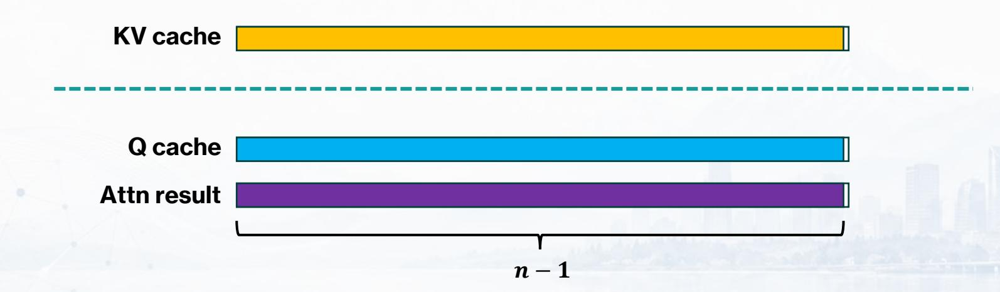

## **MAC-Attention –-- Match**

• When decoding a new token , we first find the most similar previous query in Q cache.

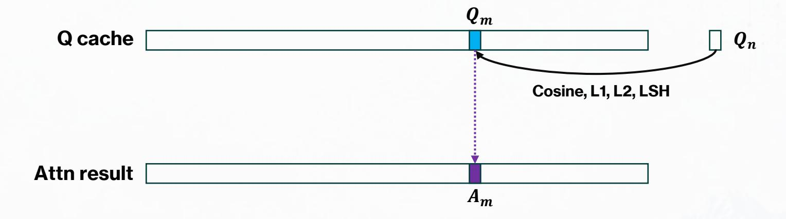

• Then we retrieve the attention result corresponding to .

#### **MAC-Attention --- Match**

•  $A_m$  stands for the attention result of  $Q_m$  attending to  $KV_{0\sim m}$ .

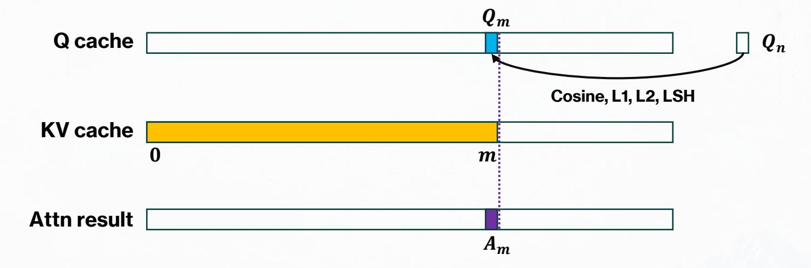

• 
$$A_m = Attn(Q_m, K_{0 \sim m}, V_{0 \sim m}) = softmax\left(\frac{Q_m K_{0 \sim m}^T}{\sqrt{d}}\right) V_{0 \sim m}$$

• How does  $A_m$  help us in decoding  $Q_n$ ?

#### **A Match-Amend-Complete Scheme for Fast and Accurate Attention Computation MAC-Attention**

**Match -> Complete -> Amend**

#### **MAC-Attention --- Complete**

• Now, for our new token  $Q_n$ , the vanilla full attention is:

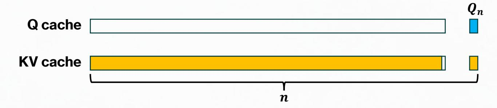

• 
$$A_n = Attn(Q_n, K_{0 \sim n}, V_{0 \sim n}) = softmax\left(\frac{Q_n K_{0 \sim n}^T}{\sqrt{d}}\right) V_{0 \sim n}$$

• However,  $A_n$  can also be written as:

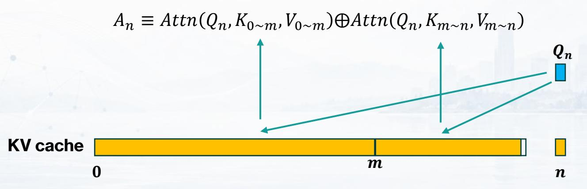

⊕ denotes online attention update

#### **MAC-Attention --- Complete**

• Now, recall that previously we have identified  $Q_m$  which is numerically similar to  $Q_n$ .

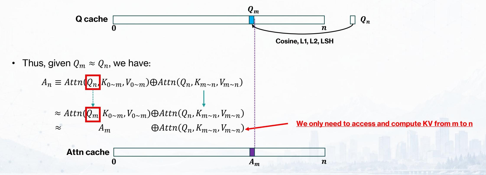

## **MAC-Attention –-- Complete**

• The two parts can run in parallel:

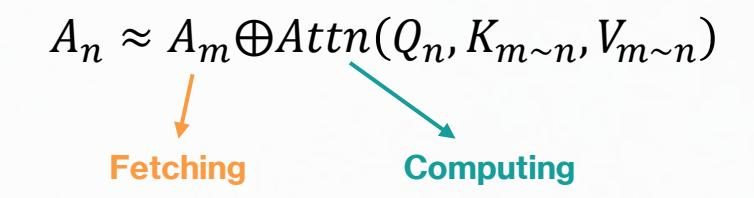

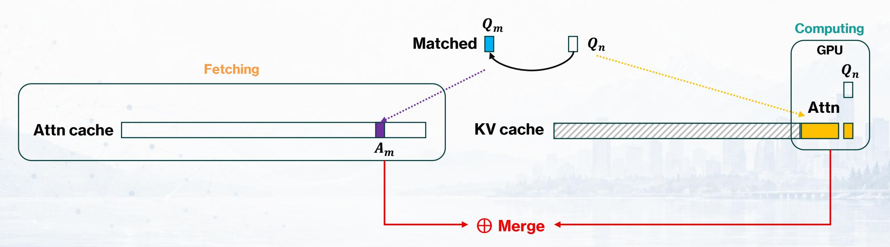

## **MAC-Attention**

• ≈ ⨁ ,~, ~

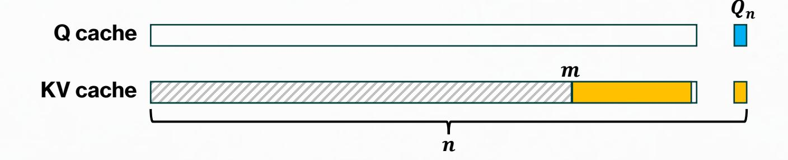

- Reduced ratio of FLOPs = KV skip ratio rskip = −
- Note, is independent of context length .

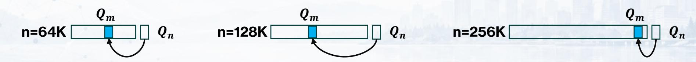

## **MAC-Attention**

• In practice, we found that it is often very easy to match a similar , where:

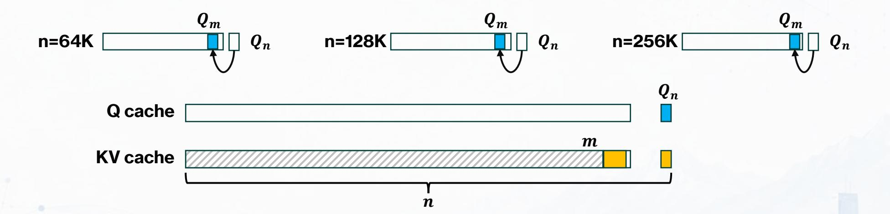

#### **Implementation Practice**

• We cannot physically cache query or attention results.

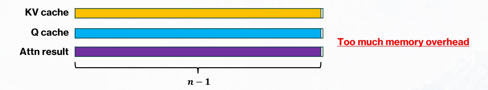

• Match operation is slow and more memory-bound than attention computation.

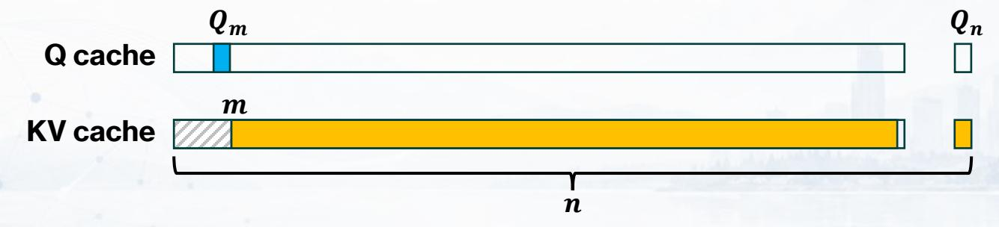

**Match to an early query won't save enough KV cache computation.**

## **MAC-Attention --- Match Window**

• We only cache the most recent tokens.

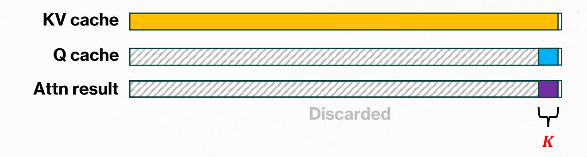

- Match and retrieve only happens within this window
  - = 512
- This also guarantees that attention always computes <= tokens.

| Model / Setting | $\tau$ | K    | r   | Overall Acc. | Hit (%) | Skip (%) |
|-----------------|--------|------|-----|--------------|---------|----------|
| Full attention  | _      |      | _   | 37.0         |         | _        |
| MAC-Attention   | 0.45   | 512  | 256 | 37.0         | → 99.5  | 98.9     |
| MAC-Attention   | 0.45   | 1024 | 256 | 36.6         | 99.6    | 99.0     |
| MAC-Attention   | 0.45   | 2048 | 256 | 37.6         | 99.6    | 98.8     |
| MAC-Attention   | 0.45   | 4096 | 256 | 36.6         | 99.7    | 98.6     |

Qwen3-30B-A3B-Instruct on LongBench v2

#### **A Match-Amend-Complete Scheme for Fast and Accurate Attention Computation**

**MAC-Attention**

**Match -> Complete -> Amend**

#### **MAC-Attention --- Amend**

There is a critical issue:

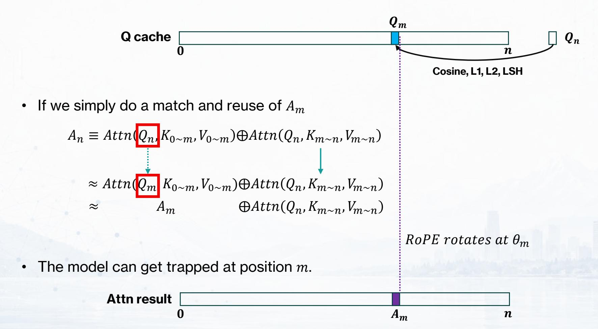

#### **MAC-Attention --- Amend**

• Assume that we want to rectify  $A_m$  from j, 0 < j < m.

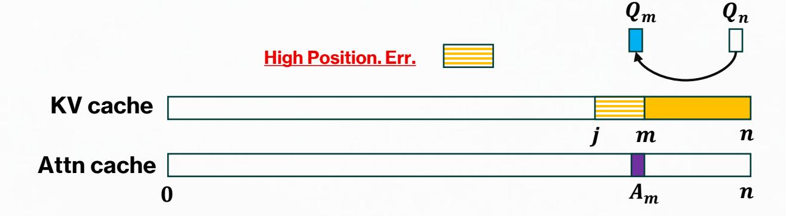

• We will remove  $Attn(Q_m, K_{j\sim m}, V_{j\sim m})$  from  $A_m$ , then add in  $Attn(Q_n, K_{j\sim n}, V_{j\sim n})$ .

Without Amend: 
$$A_n \approx A_m \oplus Attn\left(Q_n^{\theta_n}, K_{m \sim n}, V_{m \sim n}\right)$$

With Amend: 
$$A_n \approx A_m \ominus Attn(Q_m^{\theta_m}, K_{j \sim m}, V_{j \sim m}) \oplus Attn(Q_n^{\theta_n}, K_{j \sim n}, V_{j \sim n})$$

- ⊕ denotes online attention update

## **MAC-Attention –-- Amend**

• Amend is crucial for MAC-Attention position quality.

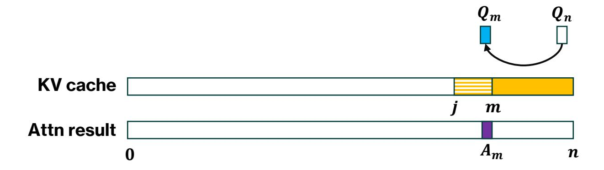

| Rectification distance | LongBench |             |               |  |  |
|------------------------|-----------|-------------|---------------|--|--|
| m-j                    | Qasper    | NarrativeQA | Multifield_en |  |  |
| Baseline               | 44.8      | 28.1        | 56.0          |  |  |
| 0                      | 36.8      | 24.2        | 51.0          |  |  |
| 16                     | 43.2      | 28.0        | 55.3          |  |  |
| 32                     | 43.4      | 27.7        | 55.7          |  |  |
| 64                     | 44.2      | 28.6        | 55.9          |  |  |

### **Experiments**

#### **MAC-Attention Speedup to FlashInfer**

- **The workflow is**
- 1. Matching (L2, per query head)
- 2. Load Balance Planning (each query head matches to different position)
- 3. Computation (fetch, attention, amend, and merge)
- 4. Cache Updating ( window)

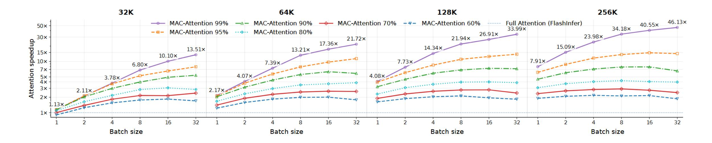

## **Experiments**

#### **Model Quality**

| KV % | Full Attn. | Quest | RocketKV | Multipole | MAC-Attn. |
|------|------------|-------|----------|-----------|-----------|
| 1    | 29.0       | 27.6  | 29.4     | 27.6      | 30.2      |
| 5    | 29.0       | 27.8  | 29.2     | 27.8      | 30.4      |
| 10   | 29.0       | 27.6  | 29.2     | 30.2      | 30.2      |
| 20   | 29.0       | 28.2  | 29.4     | 28.0      | 29.6      |

**Overall accuracy on LongBench v2**

| KV % | Full Attn. | Quest | RocketKV | Multipole | MAC-Attn. |
|------|------------|-------|----------|-----------|-----------|
| 1    | 234.2      | 581.2 | 822.8    | 192.4     | 62.9      |
| 5    | 234.2      | 594.7 | 844.7    | 210.8     | 64.0      |
| 10   | 234.2      | 608.5 | 1042.5   | 265.4     | 78.1      |
| 20   | 234.2      | 640.5 | 1855.6   | 324.6     | 103.8     |

**End-to-end Attention Latency (us) on 120K context**

# **MAC-Attention**

• Our paper with ACM AE Badge

• Clone latest SGLang, make zero modification, start serving…

• Contact

- Jinghan Yao
- yjhmitweb@gmail.com
- yao.877@osu.edu