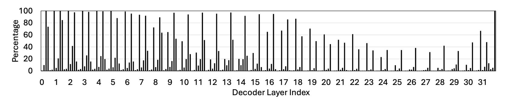
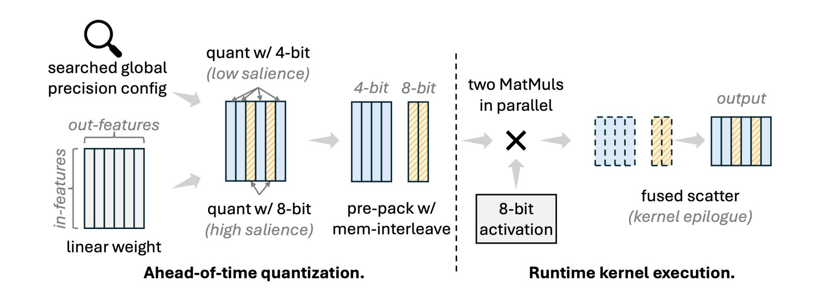
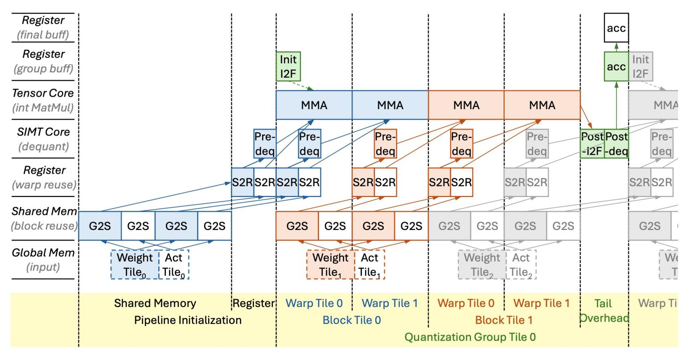
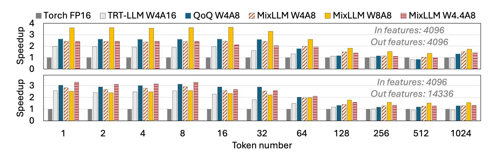

### *MixLLM***: LLM Quantization with Global Mixedprecision between Output-features and Highlyefficient System Design**

Zhen Zheng, Xiaonan Song, Chuanjie Liu @

*Presenter: Taosong Fang*

### The Memory Wall of LLM Inference

- **Large Memory Requirement**
  - ~100GB GPU memory v.s. ~1T parameters

**How to hold it?**

- **Large Memory Footprint**
  - Load ~1T parameters per decoding/single-token

**How to run it efficiently?**

### Quantization

- **Representing data with smaller bit-width**
  - Affine w/ round and clamp: ! = ( " #\$%&' + \_)
- **Bit-width means precision**
  - Data round to 2()\*+,)-\*. chunks
  - Larger bit-width → #chunks↑ → round-error↓ → precision↑

### What to Quantize?

#### • **Weight only** ✘

- ✔ Good for small-batch decoding
- ✘ Insufficient for large-batch decoding , e.g., offline inference
- ✘ Poor for prefill

### • **Both weight and activation** ✔

- ✔ Small-batch decoding
- ✔ Large-batch decoding
- ✔ Prefill-only

• …

**Let's quantize both weight and activation**

### What Bit-width?

- **8-bit**
  - Activation: good to preserve accuracy ✔
  - Weight: insufficient compression ✘
- **4-bit**
  - Activation: poor accuracy ✘
  - Weight: accuracy not good enough ✘

**Let's use 8-bit for activation. But how about weight?**

### Insight: Mixed Precision

- **Mostly 4-bit, with a small fraction of 8-bit**
  - E.g., 90% 4-bit + 10% 8-bit = 4.4-bit
- **The dimension to mix**
  - Layer-wise ✘
  - Channel-wise, a fixed per-layer fraction ✘
  - Channel-wise, global fraction rather than local fraction ✔

**Let's use channel-wise mix, with global fraction**

### Insight: Mixed Precision

• **Output channel-wise: simpler for system dev**

### How to Determine the Mix Config

- Insight: the channel leads to larger end-to-end loss after quantization should have larger bit-width
  - Turns the problem to how to determine the loss contribution of a channel's quantization

Metric: the diff of single channel's loss →

$$S_c = \left| l(c_q) - l(c_0) \right|$$

Taylor expansion approximation →

$$l(c) \approx l(c_0) + g^T(c_0) + \frac{1}{2}(c_0)^T H(c_0)$$

Fisher Information Matrix approximation →

$$H \approx F = \frac{1}{|D|} \sum_{d \in D} g_d g_d^T$$

The final equation →

$$S_c = \frac{1}{|D|} \sum_{d \in D} |g_d^T (c_q - c_0) + \frac{1}{2} (g_d^T (c_q - c_0))^2|$$

### More Decisions and the Challenge

#### • **Challenge of group-wise w/ zero-point quant**

- ! − ∗ , ∗ [! ∗ %] ✘
- ! − ∗ , becomes fp16/bf16, and cannot leverage int8 Tensor Core

#### • **Solution: two-step dequantization**

- Per-group − ∗ ∗ , ∗ %
- **Tensor Core** -> dtype cast -> multiplication
- ! − are uint4 sub, and result is within the range of int8, safe

### Int to Float Can Be Slow

- **Can represent the int-to-float with a single float sub!**
  - Please refer to our paper for the details

### The Software Pipeline

#### • **Multiple-level overlapping**

- Global memory
- Shared memory
- Register
- Tensor Core
- SIMT Core

# Good Accuracy

#### • **Nearly-lossless with W4.4A8**

|                  | BBH                               | GPQA                                                      | MMLU-Pro                                                  | MuSR                              | ARCc                              | HellaSwag                      |
|------------------|-----------------------------------|-----------------------------------------------------------|-----------------------------------------------------------|-----------------------------------|-----------------------------------|--------------------------------|
| float16          | <b>48.62</b> 46.52/54.09/45.25    | <b>30.86</b> 31.08/33.11/28.39                            | 35.52 32.91/43.86/29.80                                | <b>41.07</b> 37.99/44.51/40.72    | <b>52.24</b> 53.41/51.02/52.30    | <b>79.43</b> 78.92/78.94/80.43 |
| SmoothQuant W8A8 | <b>47.82</b> 46.37/52.57/44.52    | <b>30.90</b> 31.40/33.94/27.36                         | 35.04 32.61/42.98/29.52                                | <b>42.06</b> 39.05/46.39/40.73    | 51.74 53.33/50.00/51.88        | <b>79.20</b> 78.88/78.48/80.24 |
| QuaRot W4A4      | <b>41.10</b> 36.96/45.42/40.92    | 27.53 25.41/28.94/28.23                                | 27.60 22.99/34.40/25.42                                | <b>39.46</b> 37.92/40.68/39.77    | <b>45.99</b> 43.00/46.33/48.63 | <b>74.85</b> 72.87/73.54/78.14 |
| QuaRot W4A8      | <b>46.95</b> 44.95/52.98/42.92 | <b>30.28</b> 30.96/30.71/29.18                            | $\begin{array}{c} 33.60 \\ 29.95/42.45/28.41 \end{array}$ | <b>41.65</b> 39.05/45.58/40.32    | 51.39 50.00/52.30/51.88        | <b>78.55</b> 77.83/77.84/79.98 |
| QServe W4A8      | <b>45.78</b> 40.98/51.23/45.14 | $\frac{30.02}{28.99/32.50/28.56}$                         | <b>32.84</b> 28.16/41.72/28.63                            | <b>39.92</b> 37.60/41.59/40.57    | <b>50.54</b> 51.28/49.15/51.19    | $78.10 \\ 76.90/77.52/79.89$   |
| MixLLM W4A8      | <b>46.92</b> 43.44/44.75/52.59    | 29.90 29.58/28.26/31.87                                | 33.75 30.18/29.59/41.49                                | <b>41.70</b> 38.81/43.11/43.19    | 51.82 51.71/51.88/51.88        | <b>78.61</b> 77.94/79.71/78.17 |
| MixLLM W4.4A8    | <b>48.17</b> 46.27/52.58/45.66    | <b>30.09</b> 29.17/31.75/29.36                            | <b>34.53</b> 31.08/43.26/29.26                            | <b>41.74</b> 39.32/44.79/41.11    | <b>52.70</b> 53.67/51.96/52.47    | <b>79.00</b> 78.20/78.58/80.21 |
| MixLLM W8A8      | <b>48.84</b> 46.84/54.35/45.34 | $\begin{array}{c} 30.93 \\ 30.51/33.21/29.07 \end{array}$ | <b>35.54</b> 33.00/43.80/29.83                            | <b>40.94</b> 37.32/44.91/40.59 | <b>52.10</b> 53.24/50.94/52.13    | <b>79.42</b> 78.98/78.88/80.40 |

# Good Efficiency

#### • **SOTA kernel efficiency**

### THANKS

https://github.com/microsoft/MixLLM