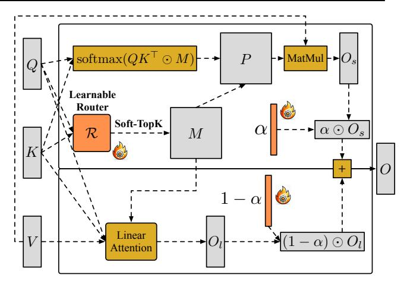
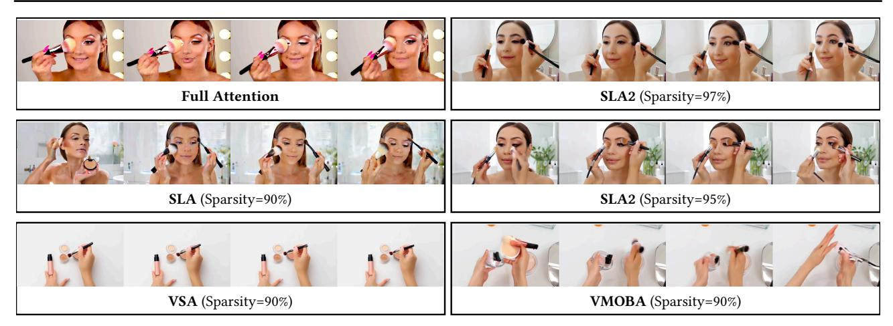
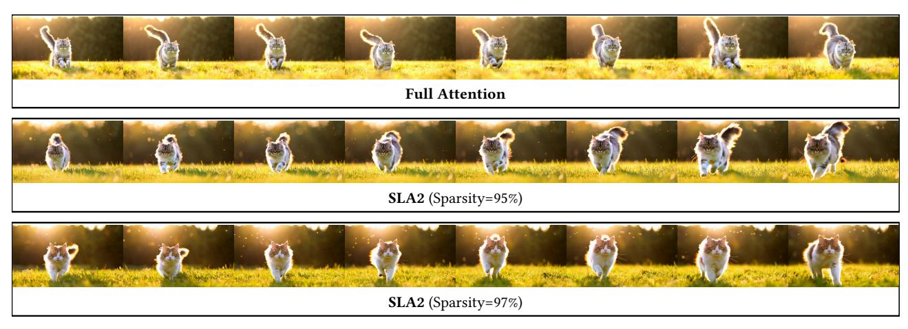
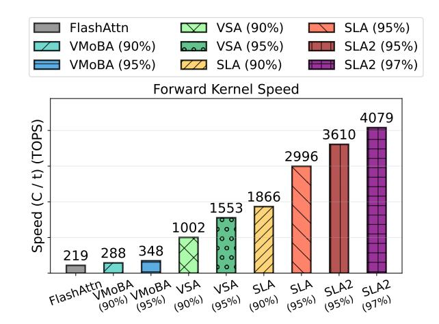
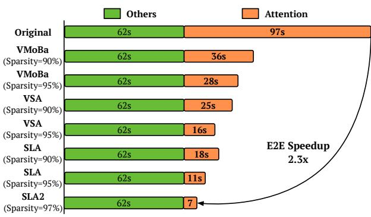
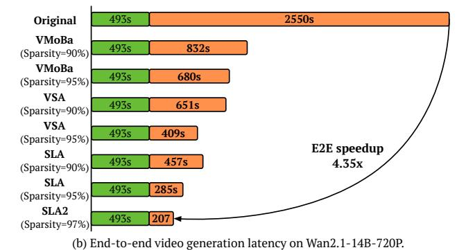

# SLA2: Sparse-Linear Attention with Learnable Routing and QAT

Jintao Zhang <sup>1</sup> Haoxu Wang <sup>1</sup> Kai Jiang <sup>1</sup> Kaiwen Zheng <sup>1</sup> Youhe Jiang <sup>1</sup> Ion Stoica <sup>2</sup> Jianfei Chen <sup>1</sup> Jun Zhu <sup>1</sup> Joseph E. Gonzalez <sup>2</sup>

## Abstract

Sparse-Linear Attention (SLA) combines sparse and linear attention to accelerate diffusion models and has shown strong performance in video generation. However, (i) SLA relies on a heuristic split that assigns computations to the sparse or linear branch based on attention-weight magnitude, which can be suboptimal. Additionally, (ii) after formally analyzing the attention error in SLA, we identify a mismatch between SLA and a direct decomposition into sparse and linear attention. We propose SLA2, which introduces (I) a learnable router that dynamically selects whether each attention computation should use sparse or linear attention, (II) a more faithful and direct sparselinear attention formulation that uses a learnable ratio to combine the sparse and linear attention branches, and (III) a sparse + low-bit attention design, where low-bit attention is introduced via quantization-aware fine-tuning to reduce quantization error. Experiments show that on video diffusion models, SLA2 can achieve 97% attention sparsity and deliver an 18.6× attention speedup while preserving generation quality.

# 1. Introduction

Trainable sparse attention methods [\(Zhang et al.,](#page-10-0) [2025c;](#page-10-0)[i;](#page-10-1) [Wu et al.,](#page-9-0) [2025;](#page-9-0) [Zhan et al.,](#page-10-2) [2025\)](#page-10-2) have shown strong performance in diffusion models. They often achieve higher attention sparsity than training-free sparse attention methods [\(Zhang et al.,](#page-10-3) [2025f;](#page-10-3) [Xi et al.,](#page-9-1) [2025;](#page-9-1) [Chen et al.,](#page-8-0) [2025a\)](#page-8-0). Among them, Sparse-Linear Attention (SLA) [\(Zhang et al.,](#page-10-0) [2025c\)](#page-10-0) is a promising approach that introduces a linearattention branch to compensate for the sparse-attention branch, improving overall sparsity. SLA has been validated on both image and video diffusion models, such as TurboDiffusion [\(Zhang et al.,](#page-10-4) [2025h\)](#page-10-4).

Motivation of SLA. SLA finds that, in diffusion models,

*Preprint.*

the attention map P could be decomposed into a high-sparse part P<sup>1</sup> and a low-rank part P2, and P = P<sup>1</sup> +P2. SLA can be formulated to P = P<sup>s</sup> + proj(Pl), where P<sup>s</sup> and P<sup>l</sup> are the attention maps of sparse and linear attention, and proj is a trainable projection.

Limitation of SLA and motivation of SLA2. (L1) *Mismatch between SLA output and the original sparse-linear decomposition.* After an analysis of the difference of the SLA formulation with the original SLA motivation, we find that the sparse attention map P<sup>s</sup> of SLA differs from the decomposed sparse attention map P<sup>1</sup> by a constant scaling factor. Specifically, we find P<sup>1</sup> = αPs, where α is a ratio vector. To compensate for the mismatch, SLA introduces and trains an additional linear attention projection, which may fail to fully address it. We therefore aim to propose a sparse-linear attention formulation that more directly matches the original motivation. (L2) *Heuristic routing for sparse and linear attention branches.* SLA does not optimally address the key design choice of how to split computation between the sparse and linear branches. In practice, SLA assigns attention associated with larger attention weights to the sparse branch and routes the remaining computation to the linear branch. This heuristic split is not optimal. For example, moving some weights from P<sup>1</sup> to P<sup>2</sup> via brute-force selection may not increase the rank of P2, while still improving the sparsity of P1. We therefore aim to design a more principled split, guided by a clear optimization objective. Finally, low-bit attention can be introduced to SLA to obtain an additional speedup. We thus aim to incorporate low-bit attention into SLA in a way that introduces as little quantization error as possible, enabling further attention speedup.

Our method. We propose SLA2, a sparse-linear attention method that reformulates sparse linear attention to (1) better match the original motivation, and (2) optimally route between the sparse and linear attention branches. To address (L1), we directly learn the ratio α to combine the sparse and linear attention branches. This formulation aligns exactly with the sparse and linear components decomposition of attention. To address (L2), we formulate the approximation error of combining sparse attention and linear attention relative to full attention, and build a learnable sparse-attention mask predictor R that supports gradient backpropagation.

<sup>1</sup>Tsinghua University <sup>2</sup>UC Berkeley.

We train this predictor by minimizing the formulated error. Furthermore, we build low-bit attention on top of sparse attention to achieve additional attention speedups. To reduce the error introduced by low-bit quantization, we integrate the quantization process into training in a quantization-aware manner, enabling the model to better adapt to low-bit quantization and thus improve the accuracy of low-bit attention at inference time.

**Result.** SLA2 achieves 97% attention sparsity and an  $18.6\times$  attention runtime speedup on both Wan2.1-1.3B and Wan2.1-14B. Please note that 97% sparsity corresponds to about 96.7% computation savings after accounting for the linear-attention branch in SLA2. In terms of video generation quality, even at 97% sparsity, SLA2 outperforms the baselines at 90% sparsity in end-to-end video quality, and it even exceeds full attention, which is 0% sparsity.

#### **Contribution.** Our contributions are as follows:

- (1) We carefully analyze the limitations of SLA and propose SLA2, a more reasonable sparse-linear attention method. SLA2 includes a learnable router that splits computation between the sparse and linear attention branches, along with a simple yet effective learnable combination for sparse and linear attention branches. For some insight on the design of SLA2, please see Sections 2.2 and 8.
- (2) We integrate quantization-aware training (QAT) into SLA2 to further accelerate attention without degrading end-to-end video generation quality, demonstrating the effectiveness of QAT for low-bit attention.
- (3) Experiments show that SLA2 achieves 97% attention sparsity and an  $18.6\times$  attention runtime speedup on video diffusion models while maintaining video quality, surpassing baseline methods.

### 2. Preliminaries

#### 2.1. Sparse-Linear Attention

SLA (Sparse-Linear Attention) (Zhang et al., 2025c) combines sparse softmax attention and linear attention using a heuristic sparse attention mask. Below, we describe the computation of SLA.

**Notation.** Let  $Q, K, V \in \mathbb{R}^{N \times d}$  be the query, key, and value matrices, where N is the sequence length and d is the head dimension. Let

$$S = QK^{\top}/\sqrt{d} \in \mathbb{R}^{N \times N}$$

be the attention score matrix. We use  $\operatorname{softmax}(\cdot)$  to denote row-wise softmax. We use  $\phi(\cdot)$  as the activation function for linear attention.

Mask construction. SLA first computes compressed atten-

tion weights using pooled queries and keys:

$$P_c = \operatorname{softmax}\left(\operatorname{pool}(Q)\operatorname{pool}(K)^{\top}/\sqrt{d}\right),$$
 (1)

where  $\operatorname{pool}(\cdot)$  applies mean pooling over the token dimension within each token block. For each row of  $P_c$ , SLA assigns the top  $k_h\%$  entries to sparse attention and the bottom  $k_l\%$  entries to skipping, with the remaining entries handled by linear attention. In practice,  $k_l$  is typically small and can be omitted. This procedure yields a binary mask  $M_c \in \{0,1\}^{N/b_q \times N/b_k}$ , where the top  $k_h\%$  entries in each row are set to 1 and the others to 0. Then, we obtain a  $M \in \{0,1\}^{N\times N}$  by expanding  $M_c$ .

**Sparse attention output.** Given M, SLA computes sparse softmax attention only on entries selected by the mask:

$$P = \operatorname{softmax}(S \odot M) \in \mathbb{R}^{N \times N}, O_s = PV \in \mathbb{R}^{N \times d}$$
 (2)

where  $\odot$  is element-wise multiplication.

**Linear attention output.** For the remaining entries (1-M), SLA applies linear attention:

$$O_l = \frac{\phi(Q) \left( \phi(K)^\top ((1-M)V) \right)}{\phi(Q) \left( \phi(K)^\top (1-M)\mathbf{1} \right)} \in \mathbb{R}^{N \times d}, \quad (3)$$

where  $\mathbf{1} \in \mathbb{R}^{N \times 1}$  is an all-ones vector, and the division is element-wise to perform row-wise normalization.

**Final output.** The final SLA output is

<span id="page-1-1"></span>
$$O = O_s + \operatorname{Proj}(O_l), \tag{4}$$

where  $\text{proj}(\cdot) \in \mathbb{R}^{d \times d}$  is a learnable linear projection.

#### <span id="page-1-0"></span>2.2. Rethinking Sparse-Linear Attention

Original motivation of Sparse-Linear Attention. Let

$$P = \operatorname{softmax}(S) \in \mathbb{R}^{N \times N}$$

be the full-attention probability matrix. Given a binary mask

$$M \in \{0, 1\}^{N \times N},$$

we decompose see full attention into two parts:

<span id="page-1-3"></span>
$$P = P_1 + P_2,$$
  $P_1 = P \odot M,$   $P_2 = P \odot (1 - M),$  (5)

where  $P_1$  corresponds to the mask-selected attention positions (computed by sparse softmax attention), and  $P_2$  corresponds to the remaining positions (approximated by linear attention). The motivation of SLA is to approximate  $P_1$  with a sparse-attention distribution and approximate  $P_2$  with a linear-attention distribution. With  $V \in \mathbb{R}^{N \times d}$ , the full-attention output is

<span id="page-1-2"></span>
$$O_f = PV = P_1V + P_2V \in \mathbb{R}^{N \times d}.$$
 (6)

Error of the sparse attention branch. Sparse attention does not directly produce  $P_1$ , because it renormalizes probabilities over the masked positions in each row. Let  $\alpha$  denote the probability sum on the masked positions for each query:

$$\alpha = P_1 \mathbf{1} \in \mathbb{R}^{N \times 1},\tag{7}$$

where  $\mathbf{1} \in \mathbb{R}^{N \times 1}$  is an all-one vector. The sparse-attention distribution is

 $P_s = \frac{P_1}{\alpha} \in \mathbb{R}^{N \times N},\tag{8}$ 

Therefore,  $P_s$  is not aligned with  $P_1$ ; it is obtained by rowwise normalizing  $P_1$  so that each row sums to 1. In terms of attention output, with  $O_s = P_s V \in \mathbb{R}^{N \times d}$ , the desired sparse attention output is

<span id="page-2-0"></span>
$$P_1 V = (\alpha \odot P_s) V = \alpha \odot O_s. \tag{9}$$

As a result, each row has a scale mismatch controlled by  $\alpha$ .

How SLA compensates for the mismatch. SLA output is shown in Equation 4. Comparing Equation 6 and using Equation 9, we can interpret  $proj(O_l)$  as jointly accounting for the linear component  $P_2V$  and the residual induced by the sparse attention branch mismatch:

$$\operatorname{proj}(O_l) \approx P_2 V + (\alpha - \mathbf{1}) \odot O_s.$$
 (10)

However, this correction is not directly aligned with the original decomposition motivation: the linear attention branch is also forced to offset the sparse attention branch's scaling error, making the compensation harder to learn.

**A more reasonable formulation.** A more faithful way to match the decomposition in Equation 5 is

$$P \approx \alpha \odot P_s + (1 - \alpha) \odot P_l, \tag{11}$$

where  $\alpha \in \mathbb{R}^{N \times 1}$ . Here,  $P_s, P_l \in \mathbb{R}^{N \times N}$  are the attention-weight matrices corresponding to the sparse attention and the linear attention branchs, and each is row-normalized so that every row sums to 1. The attention output is

<span id="page-2-1"></span>
$$O = \alpha \odot (P_s V) + (1 - \alpha) \odot (P_l V). \tag{12}$$

Here,  $\alpha \odot P_s$  better matches  $P_1$ , which removes the row-wise scaling mismatch in the sparse attention branch; therefore, an extra  $\operatorname{proj}(\cdot)$  on  $O_l$  for compensation is no longer needed. Moreover,  $(1-\alpha)$  ensures that  $\alpha \odot P_s + (1-\alpha) \odot P_l$  is row-normalized, avoiding magnitude drift of the output.

### 3. SLA2 Design

According to the analysis in Section 2.2 and Equation 12, we present the overall formulation of SLA2 as follows:

$$O = \alpha \odot O_s + (1 - \alpha) \odot O_l, \tag{13}$$



Figure 1. Attention computation pipeline of SLA2.

where  $\alpha \in \mathbb{R}^{N \times 1}$  is a learnable vector with values between 0 and 1, and

<span id="page-2-3"></span>
$$O_s = \operatorname{softmax}(QK^{\top}/\sqrt{d} \odot M)V,$$

$$O_l = \operatorname{norm}(\phi(Q)\phi(K)^{\top} \odot (1-M))V,$$

$$M = \mathcal{R}(Q, K),$$
(14)

where  $\mathcal{R}$  is a learnable module, which will be explained in Section 4.  $\phi(\cdot)$  is an activation function for linear attention, and we use the softmax function. norm normalizes the sum of rows in a matrix to 1.

Implementation of getting  $O_s$  and  $O_l$ . From Equation 14, it may appear that computing  $O_s$  and  $O_l$  requires full matmuls  $QK^{\top}$  and PV. In contrast, our implementation is highly efficient. For  $O_s$ , built on top of the FlashAttention Algorithm, we only perform the matmuls  $QK^{\top}$  and PV for the positions where M=1, and skip the other computations. For  $O_l$ , we also do not compute the matmul  $QK^{\top}$  directly, but first compute  $K^{\top}V$  according to the positions where M=0. Then we multiply Q with the result. See Algorithm 2 for more details.

### <span id="page-2-2"></span>4. Learnable Router

The learnable router  $\mathcal R$  aims to dynamically output a mask M to decide which probabilities in P should be computed by the sparse attention branch. Its decisions mainly depend on Q and K, and are independent of V. We therefore take Q and K as inputs to  $\mathcal R$ . However, the sequence length N can be large, making  $\mathcal R$  expensive. To reduce its computational cost, we leverage the fact that adjacent tokens in Q and K often exhibit similar distributions (Zhang et al., 2025f). Following (Jiang et al., 2024; Zhang et al., 2025f; Gao et al., 2024), we apply mean pooling over consecutive  $b_q$  and  $b_k$  tokens to compress Q and K:

$$\bar{Q} = \text{pool}(Q) \in \mathbb{R}^{N/b_q \times d}, \quad \bar{K} = \text{pool}(K) \in \mathbb{R}^{N/b_k \times d}.$$
(15)

To make  $\mathcal{R}$  learnable, we further introduce two linear projections  $\operatorname{proj}_q, \operatorname{proj}_k \in \mathbb{R}^{d \times d}$  for  $\bar{Q}$  and  $\bar{K}$ , respectively. To get M, we perform

$$P_c = \operatorname{proj}_q(\bar{Q}) \operatorname{proj}_k(\bar{K})^\top,$$

$$M_c = \operatorname{Top-k}(k\%, P_c) \in \mathbb{R}^{N/b_q \times N/b_k},$$
(16)

where Top-k is applied row-wise, setting the top k% positions to 1 and the others to 0. The compressed mask  $M_c$  can be expanded to an  $N\times N$  mask to support the computation in Equation 14. In practice, our forward and backward GPU kernels for SLA2 only require  $M_c$ , since we implement the method efficiently on top of a block-wise FlashAttentionstyle algorithm. We will elaborate on this in Section 7.

Finally, we note that Top-k avoids gradient propagation during training. We therefore replace Top-k with a learnable version during training. The details and the full training procedure are provided in Section 6.

## 5. Quantization-aware Training

Post-training quantization (PTQ) (Jacob et al., 2018) applies quantization after a model is fully trained. In contrast, quantization-aware training (QAT) (Nagel et al., 2022) incorporates quantization effects during training, allowing the model to adapt its parameters to the quantization error and thereby improving low-bit accuracy at inference time.

In SLA2, we further accelerate the sparse attention branch  $O_s$  computation using a low-bit attention in a QAT manner. Concretely, during training, we use low-bit attention *only in the forward pass*, while the backward pass remains fully in FP16. This design enables the attention speedup brought by low-bit attention while minimizing the end-to-end accuracy drop caused by low-bit quantization.

**Forward (low-bit attention).** Given  $Q, K, V \in \mathbb{R}^{N \times d}$ , we apply a low-bit quantized attention in the forward pass. We first quantize Q ( $\hat{Q}, s_Q = \operatorname{quant}(Q)$ ) and K ( $\hat{K}, s_K = \operatorname{quant}(K)$ ), then compute

$$S = \operatorname{dequant}(\hat{Q}\hat{K}^{\top}/\sqrt{d}, s_Q, s_K),$$
  
$$P = \operatorname{softmax}(S \odot M).$$

followed by quantizing  $P(\hat{P}, s_P = \text{quant}(P))$  and  $V(\hat{V}, s_V = \text{quant}(V))$  and computing

$$O_s = \text{dequant}(\hat{P}\hat{V}, s_P, s_V).$$

Here, quant(·) maps an FP16 tensor to a low-bit tensor (e.g., INT8 or FP8) along with its scale, and dequant(·) rescales the result back to FP16. We use  $\hat{Q}, \hat{K}, \hat{P}, \hat{V}$  to denote the quantized tensors and  $s_Q, s_K, s_P, s_V$  to denote their scales. Our quantization/dequantization scheme follows SageAttention2++ (Zhang et al., 2025g).

Note that the equations above describe the mathematical computation rather than the GPU kernel implementation. We build the actual efficient kernel on the FlashAttention algorithm to avoid computing the full score matrix S before applying mask M. Instead, we skip unnecessary computations. The detailed algorithm is provided in Sections 6 and 7.

<span id="page-3-1"></span>**Backward (FP16-only).** Let  $dO_s$  denote the gradient of  $O_s$ . In our QAT setting, the backward pass is computed entirely in FP16, using the original FP16 inputs (Q, K, V) and the forward output  $O_s$ . The gradient of Q, K, V from the sparse attention branch can be formulated as:

$$dQ, dK, dV = \text{backward}(dO_s, O_s, Q, K, V).$$

The detailed backward GPU kernel, along with the complete training pipeline, is provided in Section 6.

<span id="page-3-2"></span>**Algorithm 1** Fine-tuning a diffusion model using SLA2.

- 1: Stage 1: Initialize  $\mathcal R$  and  $\alpha$ :
- 2: Sample Q, K, V tensors as dataset D.
- 3:  $L = MSE(FullAttn(Q, K, V), SLA2(Q, K, V, k\%, \mathcal{R}, \alpha));$
- 4: Train  $\mathcal{R}$ ,  $\alpha$  under different k% according to the loss L;
- 5: Stage2: Fine-tune the diffusion model  $\Theta$  and  $\alpha$ :
- 6: Replace the attention in  $\Theta$  by SLA2;
- 7: Fine-tune  $\Theta$ ,  $\alpha$  using an end-to-end diffusion loss.

## <span id="page-3-0"></span>6. Training with SLA2

To fine-tune a diffusion model with SLA2, we adopt a two-stage training strategy.  $\blacksquare$  In the first stage, we seek a better initialization for  $\mathcal R$  and  $\alpha$  to ensure stable and effective subsequent fine-tuning of the diffusion model.  $\blacksquare$  In the second stage, we fine-tune the entire diffusion model end-to-end. In this stage, we directly optimize the diffusion loss over all model parameters  $\Theta$ , including  $\alpha$ , without  $\mathcal R$ , so that the model adapts to high-sparsity attention and can even achieve better performance under high sparsity.

Specifically, in the first stage, we use the Q, K, and V matrices from every attention layer at each diffusion timestep as training data. For each sparsity setting (i.e., different k%, we use 5%, 4%, and 3%), we train  $\mathcal{R}$  and  $\alpha$ . Note that Top-k is non-differentiable. Therefore, throughout the entire training process, we replace the Top-k operator in Equation 16 with a SoftTop-k operator (Ding et al., 2024):

SoftTop-k
$$(k\%, P_c)_{ij} = \sigma\left(\frac{(P_c)_{ij}}{\tau} + \lambda_i\right),$$
 (17)

where  $\sigma$  denotes the sigmoid function,  $\tau$  is a temperature parameter, and  $\lambda_i$  is solved via binary search to ensure that each row sums to  $k\% \times N/b_k$ . The gradient of

### <span id="page-4-1"></span>Algorithm 2 Forward pass of SLA2.

```
1: Input: Matrices Q, K, V \in \mathbb{R}^{N \times d}, b_q, b_k, k%, learnable \operatorname{proj}_q, \operatorname{proj}_k \in \mathbb{R}^{d \times d}, and \alpha \in \mathbb{R}^{N/b_q \times 1}.
  2: K = K - \text{colmean}(K); // smooth K of SageAttention
  3: Q^{\phi}, K^{\phi} = \phi(Q), \phi(K), \quad \bar{Q}, \bar{K} = \text{pool}(Q), \text{pool}(K);
 4: Divide Q, Q^{\phi} to T_m = \frac{N}{b_q} blocks \{\mathbf{Q}_i\} and \{\mathbf{Q}_i^{\phi}\};

5: Divide K, V, K^{\phi} to T_n = \frac{N}{b_k} blocks \{\mathbf{K}_i\}, \{\mathbf{V}_i\}, \{\mathbf{K}_i^{\phi}\}
  6: h = \{h_i\} = \{(\mathbf{K}_i^{\phi})^{\top} \mathbf{V}_i\};
  7: z = \{z_i\} = \{\text{rowsum}((\mathbf{K}_i^{\phi})^{\top})\}; M_c[:,:] = 0;
  8: P_c = \operatorname{softmax}(\operatorname{proj_q}(\bar{Q})\operatorname{proj_k}(K)^\top/\sqrt{d});
  9: M_c = \text{Top-k}(P_c, k\%); // SoftTop-k in stage1 training
10: for i = 1 to T_m do
              for j=1 to T_n do
11:
                   if M_c[i,j] = 1 then
12:
                        \mathbf{S}_{ij} = \operatorname{dequant}(\operatorname{quant}(\mathbf{Q}_i)\operatorname{quant}(\mathbf{K}_i)^{\top})/\sqrt{d};
13:
                        m_{ij} = \max(m_{i,j-1}, \operatorname{rowmax}(\mathbf{S}_{ij}));
14:
                        \mathbf{P}_{ij} = \exp(\mathbf{S}_{ij} - m_{ij});

l_{ij} = e^{m_{i,j-1} - m_{ij}} l_{i,j-1} + \text{rowsum}(\mathbf{P}_{ij});
15:
16:
                       O_{\text{tmp}} = \text{dequant}(\text{quant}(\mathbf{P}_{ij})\text{quant}(\mathbf{V}_j);

\mathbf{O}_{ij}^s = \text{diag}(e^{m_{i,j-1}-m_{ij}})\mathbf{O}_{i,j-1}^s + O_{\text{tmp}};
17:
18:
                   else if M_c[i,j] = 0 then
19:
                        \mathbf{H}_i \leftarrow \mathbf{H}_i + h_j; \quad \mathbf{Z}_i \leftarrow \mathbf{Z}_i + z_j;
20:
21:
                   end if
22:
              end for
              \mathbf{O}_i^s = \operatorname{diag}(l_i^{T_n})^{-1} \mathbf{O}_{i,T_n}^s;
23:
              \mathbf{O}_i^l = \mathbf{Q}_i^{\phi} \mathbf{H}_i / (\mathbf{Q}_i^{\phi} \mathbf{Z}_i); \quad \mathbf{L}_i = m_{i,T_n} + \log(l_{i,T_n});
24:
25: end for
26: O^s = \{\mathbf{O}_i^s\}, O^l = \{\mathbf{O}_i^l\};
27: return O = \alpha \odot O^s + (1 - \alpha) \odot O^l;
```

SoftTop-k is computed using the reparameterization trick (see Ding et al. (2024)), which enables gradient backpropagation. This operator retains key properties of Top-k, such as enforcing a row-wise sum of  $k\% \times N/b_k$ . The overall training algorithm is in Algorithms 1, where we use  $O = \text{SLA2}(Q, K, V, k\%, \mathcal{R}, \alpha)$  as SLA2 operator. The forward and backward procedures of SLA2, are provided in Algorithms 2, and 3, respectively.

### <span id="page-4-2"></span>7. Inference with SLA2

During inference, we simply replace the attention modules in the diffusion model with SLA2 and run the SLA2 forward pass described in Algorithm 2. Note that the Top-k operation uses the hard Top-k in Equation 16, rather than SoftTop-k.

#### <span id="page-4-0"></span>8. Insights

We summarize key insights on SLA design and training in a question-driven format.

(1) Why is the design of  $\mathcal{R}$  (Equation 4) reasonable? The

core motivation of sparse-linear attention is to decompose the attention weights as  $P=P_1+P_2$ , where  $P_1$  is handled by the sparse branch, and  $P_2$  is handled by the linear branch. It aims to route a low-rank portion of P to  $P_2$  and make  $P_1$  as sparse as possible without harming end-to-end quality. We explain the design choices of  $\mathcal R$  by answering three sub-questions:

(1.a) Why the input of  $\mathcal{R}$  are Q and K? For each attention layer, the attention weights are determined by the score matrix  $S = QK^{\top}/\sqrt{d}$  followed by a row-wise softmax, i.e.,  $P = \operatorname{Softmax}(S)$ . Therefore, deciding which positions of P should be assigned to the sparse branch is fundamentally a decision about which positions of S, i.e., the matrix multiplication between Q and K, are likely to contribute most after softmax. This makes (Q, K) the natural and sufficient signals for routing, while V does not affect the formation of P and is thus not needed for the routing decision.

(1.b) Why apply pooling to Q and K in  $\mathbb{R}$ ? A naive router that operates on the full  $QK^{\top}$  would incur  $\mathcal{O}(N^2)$  complexity, which is too expensive. To reduce this cost, we pool adjacent tokens in Q and K using mean pooling to obtain  $\bar{Q}$  and  $\bar{K}$ . This is still effective because nearby tokens in diffusion transformers often have similar distribution (Jiang et al., 2024; Zhang et al., 2025f; Gao et al., 2024), so the values in  $QK^{\top}$  vary smoothly across adjacent positions.

(1.c) Why using projections  $(\operatorname{proj_q} \operatorname{and} \operatorname{proj_k})$  in  $\mathcal{R}$ ? Using  $\overline{Q}\overline{K}^{\top}$  followed by softmax and  $\operatorname{Top-}k$  is a simple heuristic and may not yield an optimal split of P into a sparse part and a low-rank part. By introducing learnable projections  $\operatorname{proj}_q$  and  $\operatorname{proj}_k$ , the router can learn a task-adaptive representation in which  $\operatorname{Top-}k$  selection better matches the desired decomposition (making  $P_1$  much sparser while leaving a portion that is easier for the linear branch to approximate). In particular, this design generalizes the heuristic routing: setting  $\operatorname{proj}_q = \operatorname{proj}_k = I$  recovers the original form, while learning these projections under our training objective can produce a more suitable partition.

(2) Why does SLA2 needs two-stage training? We adopt a two-stage training strategy for both training stability and train—inference consistency. First, before end-to-end fine-tuning of the entire diffusion model,  $\mathcal{R}$  should be reasonably initialized. Otherwise, unstable and poor routing can make subsequent fine-tuning difficult. Second, the router used at inference relies on hard Top-k, which is non-differentiable and blocks gradient propagation. To train the projection parameters inside  $\mathcal{R}$ , we therefore use a differentiable SoftTop-k operator during Stage 1. After obtaining a good initialization, Stage 2 fine-tunes the full diffusion model while keeping the routing computation aligned with inference (i.e., using hard Top-k for routing), ensuring that the trained

<span id="page-5-0"></span>

| Model                            | Method         | Quality |       |       |       |       |         | Efficiency |            |
|----------------------------------|----------------|---------|-------|-------|-------|-------|---------|------------|------------|
|                                  |                | IQ ↑    | OC ↑  | AQ ↑  | MS ↑  | SC ↑  | VR ↑    | FLOPs ↓    | Sparsity ↑ |
| Wan2.1<br>-T2V<br>-1.3B<br>-480P | Full Attention | 63.67   | 20.27 | 64.41 | 98.95 | 95.40 | 0.1084  | 52.75T     | 0%         |
|                                  | VMoBA          | 65.31   | 20.82 | 64.14 | 97.80 | 86.69 | 0.0936  | 5.28T      | 90%        |
|                                  | VSA            | 59.57   | 19.27 | 50.60 | 97.44 | 87.98 | -0.0881 | 5.40T      |            |
|                                  | SLA            | 63.10   | 20.88 | 64.34 | 97.90 | 92.54 | 0.0872  | 5.40T      |            |
|                                  | SLA2           | 67.70   | 21.62 | 64.86 | 98.69 | 95.54 | 0.1093  | 5.51T      |            |
|                                  | VMoBA          | 63.08   | 21.07 | 61.96 | 97.68 | 79.83 | 0.0746  | 2.64T      | 95%        |
|                                  | VSA            | 55.50   | 14.95 | 42.13 | 96.19 | 88.34 | -0.1309 | 2.75T      |            |
|                                  | SLA            | 63.14   | 21.09 | 62.91 | 97.83 | 94.36 | 0.0881  | 2.75T      |            |
|                                  | SLA2           | 67.04   | 21.55 | 64.90 | 98.46 | 95.27 | 0.1023  | 2.87T      |            |
|                                  | SLA2           | 66.64   | 21.42 | 64.62 | 98.04 | 94.83 | 0.1039  | 1.82T      | 97%        |
| Wan2.1<br>-T2V<br>-14B<br>-720P  | Full Attention | 68.01   | 22.44 | 64.66 | 99.14 | 95.93 | 0.1238  | 292.6T     | 0%         |
|                                  | VMoBA          | 67.18   | 20.85 | 63.64 | 98.55 | 94.50 | 0.1117  | 29.26T     | 90%        |
|                                  | VSA            | 64.03   | 21.27 | 63.37 | 98.90 | 93.65 | 0.1074  | 20.92T     |            |
|                                  | SLA            | 67.58   | 21.62 | 63.80 | 98.78 | 95.74 | 0.1166  | 20.92T     |            |
|                                  | SLA2           | 69.63   | 20.68 | 66.41 | 98.84 | 95.74 | 0.1238  | 21.16T     |            |
|                                  | VMoBA          | 21.27   | 7.96  | 33.59 | 99.99 | 100   | -0.0965 | 14.63T     | 95%        |
|                                  | VSA            | 47.69   | 13.90 | 34.95 | 97.09 | 91.12 | -0.1822 | 14.87T     |            |
|                                  | SLA            | 64.43   | 20.89 | 61.89 | 98.86 | 94.41 | 0.1078  | 14.87T     |            |
|                                  | SLA2           | 69.02   | 21.11 | 65.55 | 98.89 | 95.53 | 0.1125  | 15.11T     |            |
|                                  | SLA2           | 66.93   | 21.12 | 65.14 | 98.71 | 94.42 | 0.1149  | 9.26T      | 97%        |

model matches the inference-time computation logic.

## 9. Experiments

## 9.1. Setup

Model and Baselines. We fine-tune SLA2 and baseline methods on the Wan2.1-1.3B-480P and Wan-2.1-14B-720P models [\(Wan et al.,](#page-9-2) [2025\)](#page-9-2). For the dataset, we use a private video dataset of 3,000 videos (about 5 seconds each) collected from public sources. To construct text–video pairs, we generate a caption for each video using Qwen3-VL-Flash and use these captions as text conditioning for both fine-tuning and evaluation. For baselines, we use Full Attention (without training) implemented with FlashAttn2. We also select several state-of-the-art video generation methods with sparse attention mechanism, including SLA [\(Zhang](#page-10-0) [et al.,](#page-10-0) [2025c\)](#page-10-0), VSA [\(Zhang et al.,](#page-10-1) [2025i\)](#page-10-1) and VMoBa [\(Wu](#page-9-0) [et al.,](#page-9-0) [2025\)](#page-9-0). All results are obtained using the official open-source implementations.

Metrics. Following [Zhang et al.](#page-10-6) [\(2024\)](#page-10-6); [Yang et al.](#page-9-3) [\(2025b\)](#page-9-3), we evaluate video quality using multiple dimensions from VBench [\(Zhang et al.,](#page-10-6) [2024\)](#page-10-6), including Imaging Quality (IQ), Overall Consistency (OC), Aesthetic Quality (AQ), Motion Smoothness (MS) and Subject Consistency (SC). In addition, we assess human preference using the Vision Reward metric (VR) [\(Xu et al.,](#page-9-4) [2024\)](#page-9-4). To quantify computational cost, we use FLOPs (floating-point operations). For

kernel-level efficiency, we report C/t, where C = 4N<sup>2</sup>d denotes the theoretical amount of computation and t is the execution latency. We also measure the end-to-end inference latency in seconds.

Hyper-parameters. We fine-tune each method for 500 steps. The batch size is set to 64 for the 1.3B model and 15 for the 14B model. We set the block sizes to b<sup>q</sup> = 128 and bkv = 64. We use k% of 5%, 4%, and 3% for SLA2. For the temperature parameter τ in SoftTop-k, we use τ = 0.1.

## 9.2. Effectiveness

Table [1](#page-5-0) compares the video generation quality and efficiency of SLA2 against baseline methods on the Wan2.1-T2V-1.3B-480P and Wan2.1-T2V-14B-720P models. At sparsity levels of 90% and 95%, SLA2 consistently outperforms all baselines across every video quality metric on both models. Even at a higher sparsity of 97%, SLA2 still surpasses all baseline methods at 90% sparsity, while achieving a 29× speedup over Full Attention. Interestingly, we observe that sparse attention methods can even outperform Full Attention on many metrics after fine-tuning. We attribute this to the higher quality of the fine-tuning dataset compared to the that used during pretraining.

Visible examples. Figure [2](#page-6-0) shows an example generated by different methods fine-tuned on Wan2.1-T2V-1.3B-480P. The videos produced by SLA2 exhibit the highest quality and maintain content similar to that generated by Full At-

<span id="page-6-0"></span>

Figure 2. Visible examples of SLA2 and baselines on Wan2.1-T2V-1.3B-480P model. The prompt used for generation is in Appendix B.

<span id="page-6-1"></span>

Figure 3. Visible examples of SLA2 and baselines on Wan2.1-T2V-14B-720P model. The prompt used for generation is in Appendix B.

tention. In contrast, videos from other methods either differ noticeably from Full Attention or show clear distortions. Figure 3 presents an example generated by Full Attention and SLA2 on Wan2.1-T2V-14B-720P model. SLA2 brings almost no degradation in video quality.

### 9.3. Efficiency

Figure 4 illustrates the forward kernel speed of SLA2 and the baseline methods on an RTX5090, measured in TOPS (trillion operations per second). At 97% sparsity, SLA2 achieves a  $18.7\times$  speedup over FlashAttn2, and is  $11.7\times$  and  $2.6\times$  faster than VMoBA and VSA at 95% sparsity, respectively. Note that SLA2 outperforms all baselines, even when SLA2 uses 97% sparsity and the baselines use 90% or 95% sparsity. Figure 5 presents the end-to-end video generation latencies for SLA2 and the baselines. On the Wan-1.3B-480P model, reducing attention latency from 97s to 7s  $(13.9\times$  speedup) enables SLA2 to achieve a  $2.30\times$  reduction in overall end-to-end latency. On the Wan-14B-720P model, SLA2 further reduces end-to-end latency by

<span id="page-6-2"></span>

Figure 4. Kernel speed of SLA2 and baselines with different sparsities.

**4.35**×. Since the Wan2.1-14B-720P model exceeds the VRAM capacity of a single RTX5090, we enable sequential CPU offloading during evaluation. The reported latency already excludes the offloading overhead.

<span id="page-7-0"></span>

(a) End-to-end video generation latency on Wan2.1-1.3B-480P.



*Figure 5.* End-to-end generation latency of SLA2 and baselines

*Table 2.* Ablation experiments results.

<span id="page-7-1"></span>with different sparsities.

| Method                                               | Quality                          |                                  |                                 |                                  |                                  |                                      |  |  |  |
|------------------------------------------------------|----------------------------------|----------------------------------|---------------------------------|----------------------------------|----------------------------------|--------------------------------------|--|--|--|
|                                                      | IQ ↑                             | OC ↑                             | AQ ↑                            | MS ↑                             | SC ↑                             | VR ↑                                 |  |  |  |
| Full Attention                                       | 63.67                            | 20.27                            | 64.41                           | 98.95                            | 95.40                            | 0.1084                               |  |  |  |
| w/o QAT<br>Topk-router<br>SLA2                       | 65.28<br>63.66<br>66.64          | 20.66<br>20.9<br>21.42           | 61.85<br>62.65<br>64.62         | 97.44<br>97.86<br>98.04          | 94.65<br>94.26<br>94.83          | 0.0850<br>0.0876<br>0.1039           |  |  |  |
| SLA2 (85%)<br>SLA2 (90%)<br>SLA2 (95%)<br>SLA2 (97%) | 67.97<br>67.70<br>67.04<br>66.64 | 21.98<br>21.62<br>21.55<br>21.42 | 64.79<br>64.86<br>64.9<br>64.62 | 98.75<br>98.69<br>98.46<br>98.04 | 95.79<br>95.54<br>95.27<br>94.83 | 0.1135<br>0.1093<br>0.1023<br>0.1039 |  |  |  |

## 9.4. Ablation Study

Quantization-aware training. To evaluate the impact of quantization-aware training (QAT), we fine-tune the same model without QAT and perform quantized inference. As shown in Table [2,](#page-7-1) the quality of generated videos drops when inference is performed without QAT, which confirms its effectiveness. For efficiency, we evaluate SLA2 both with and without quantization. Low-bit quantization provides an approximately 1.3x kernel speedup.

Learnable router. To evaluate the benefit of the learnable router, we compare it with the Top-k router used in SLA [\(Zhang et al.,](#page-10-0) [2025c\)](#page-10-0), which directly selects the largest scores in pool(Q)pool(K) <sup>⊤</sup>. As shown in Table [2,](#page-7-1) the

learnable router significantly outperforms the Top-k router.

Varying sparsity. We vary the sparsity from 85% to 97% and evaluate SLA2 under different sparsity levels. As summarized in Table [2,](#page-7-1) lower sparsity consistently leads to better performance. Notably, even with 97% sparsity, SLA2 already outperforms all baselines, as shown in Table [1.](#page-5-0)

## 10. Related Work

Sparse attention and linear attention are two main ways to speed up attention in Transformer-based models. Sparse attention methods can be grouped by whether they require training. Training-free approaches [\(Xiao et al.,](#page-9-5) [2024;](#page-9-5) [Jiang](#page-8-1) [et al.,](#page-8-1) [2024;](#page-8-1) [Gao et al.,](#page-8-2) [2024;](#page-8-2) [Xi et al.,](#page-9-1) [2025;](#page-9-1) [Zhang et al.,](#page-10-3) [2025f;](#page-10-3) [Ribar et al.,](#page-9-6) [2023;](#page-9-6) [Yang et al.,](#page-9-7) [2025a;](#page-9-7) [Li et al.,](#page-8-6) [2025;](#page-8-6) [Chen et al.,](#page-8-0) [2025a;](#page-8-0) [Lai et al.,](#page-8-7) [2025;](#page-8-7) [Zhang et al.,](#page-10-7) [2023;](#page-10-7) [Tang et al.,](#page-9-8) [2024;](#page-9-8) [Zhu et al.,](#page-10-8) [2025a;](#page-10-8) [Lin et al.,](#page-8-8) [2025;](#page-8-8) [Xu](#page-9-9) [et al.,](#page-9-9) [2025;](#page-9-9) [Xia et al.,](#page-9-10) [2025;](#page-9-10) [Chen et al.,](#page-8-9) [2025b;](#page-8-9) [Zhang](#page-10-9) [et al.,](#page-10-9) [2025j;](#page-10-9) [Yang et al.,](#page-9-11) [2024b\)](#page-9-11) reduce inference cost by masking attention patterns at test time, while trainable methods [\(Zhang et al.,](#page-10-1) [2025i;](#page-10-1) [Wu et al.,](#page-9-0) [2025;](#page-9-0) [Zhang et al.,](#page-10-0) [2025c;](#page-10-0) [Zhan et al.,](#page-10-2) [2025;](#page-10-2) [Zhou et al.,](#page-10-10) [2025;](#page-10-10) [Lu et al.,](#page-8-10) [2025;](#page-8-10) [Yuan](#page-10-11) [et al.,](#page-10-11) [2025;](#page-10-11) [Liu et al.,](#page-8-11) [2025a;](#page-8-11) [Zhang et al.,](#page-10-12) [2026;](#page-10-12) [Cai et al.,](#page-8-12) [2025;](#page-8-12) [Liu et al.,](#page-8-13) [2025b;](#page-8-13) [Sun et al.,](#page-9-12) [2025;](#page-9-12) [Tan et al.,](#page-9-13) [2025;](#page-9-13) [Ding et al.,](#page-8-14) [2023\)](#page-8-14) encourage sparsity during training and can support higher sparsity. Linear attention methods [\(Wang](#page-9-14) [et al.,](#page-9-14) [2020;](#page-9-14) [Choromanski et al.,](#page-8-15) [2020;](#page-8-15) [Katharopoulos et al.,](#page-8-16) [2020;](#page-8-16) [Qin et al.,](#page-9-15) [2024;](#page-9-15) [Yang et al.,](#page-9-16) [2024a;](#page-9-16) [Sun et al.,](#page-9-17) [2023\)](#page-9-17) are mainly studied in language models. In diffusion transformers, SANA [\(Xie et al.,](#page-9-18) [2024\)](#page-9-18) and Dig [\(Zhu et al.,](#page-10-13) [2025b\)](#page-10-13) show that linear attention can work for image-generation pre-training; however, for video generation, linear attention alone often cannot keep quality. In addition, hardwarefocused work [\(Dao et al.,](#page-8-17) [2022;](#page-8-17) [Dao,](#page-8-18) [2023;](#page-8-18) [Shah et al.,](#page-9-19) [2024;](#page-9-19) [Zhang et al.,](#page-10-14) [2025d](#page-10-14)[;a;](#page-10-15)[e\)](#page-10-16) speeds up attention by improving GPU execution through tiling, kernel fusion, and quantization.

## 11. Conclusion

We presented SLA2, an trainable sparse-linear attention method for diffusion models. It is motivated by two limitations of SLA: its heuristic routing based on the magnitude of attention weights and a mismatch with the decomposition of sparse and linear attention, revealed by our error analysis. SLA2 addresses these issues by introducing a learnable router and a decomposition-consistent mixing formulation. Moreover, SLA2 adopt a sparse + low-bit attention in a quantization-aware fine-tuning way for further acceleration. Experiments show that SLA2 achieves up to 97% attention sparsity and an 18.6× attention speedup, while preserving video generation quality. We hope SLA2 offers an effective and practical way for efficient attention in diffusion models.

## References

- <span id="page-8-12"></span>Cai, S., Yang, C., Zhang, L., Guo, Y., Xiao, J., Yang, Z., Xu, Y., Yang, Z., Yuille, A., Guibas, L., et al. Mixture of contexts for long video generation. *arXiv preprint arXiv:2508.21058*, 2025.
- <span id="page-8-0"></span>Chen, P., Zeng, X., Zhao, M., Ye, P., Shen, M., Cheng, W., Yu, G., and Chen, T. Sparse-vdit: Unleashing the power of sparse attention to accelerate video diffusion transformers. *arXiv preprint arXiv:2506.03065*, 2025a.
- <span id="page-8-9"></span>Chen, R., Mills, K. G., Jiang, L., Gao, C., and Niu, D. Re-ttention: Ultra sparse visual generation via attention statistical reshape. In *The Thirty-ninth Annual Conference on Neural Information Processing Systems*, 2025b.
- <span id="page-8-15"></span>Choromanski, K. M., Likhosherstov, V., Dohan, D., Song, X., Gane, A., Sarlos, T., Hawkins, P., Davis, J. Q., Mohiuddin, A., Kaiser, L., Belanger, D. B., Colwell, L. J., and Weller, A. Rethinking attention with performers. In *International Conference on Learning Representations*, 2020.
- <span id="page-8-18"></span>Dao, T. Flashattention-2: Faster attention with better parallelism and work partitioning. *arXiv preprint arXiv:2307.08691*, 2023.
- <span id="page-8-17"></span>Dao, T., Fu, D. Y., Ermon, S., Rudra, A., and Re, C. Flashattention: Fast and memory-efficient exact attention with IO-awareness. In Oh, A. H., Agarwal, A., Belgrave, D., and Cho, K. (eds.), *Advances in Neural Information Processing Systems*, 2022.
- <span id="page-8-5"></span>Ding, G., Ye, Z., Zhong, Z., Li, G., and Shao, D. Separate, dynamic and differentiable (smart) pruner for block/output channel pruning on computer vision tasks, 2024. URL [https://arxiv.org/abs/](https://arxiv.org/abs/2403.19969) [2403.19969](https://arxiv.org/abs/2403.19969).
- <span id="page-8-14"></span>Ding, J., Ma, S., Dong, L., Zhang, X., Huang, S., Wang, W., Zheng, N., and Wei, F. Longnet: Scaling transformers to 1,000,000,000 tokens. *arXiv preprint arXiv:2307.02486*, 2023.
- <span id="page-8-2"></span>Gao, Y., Zeng, Z., Du, D., Cao, S., Zhou, P., Qi, J., Lai, J., So, H. K.-H., Cao, T., Yang, F., et al. Seerattention: Learning intrinsic sparse attention in your llms. *arXiv preprint arXiv:2410.13276*, 2024.
- Hu, Y., Huang, W., Liang, Z., Chen, C., Zhang, J., Zhu, J., and Chen, J. Identifying sensitive weights via postquantization integral. *arXiv preprint arXiv:2503.01901*, 2025.
- Hu, Y., Singh, H., Maheswaran, M., Xi, H., Hooper, C., Zhang, J., Tomar, A., Mahoney, M. W., Min, S., Farajtabar, M., et al. Residual context diffusion language models. *arXiv preprint arXiv:2601.22954*, 2026.

- <span id="page-8-3"></span>Jacob, B., Kligys, S., Chen, B., Zhu, M., Tang, M., Howard, A., Adam, H., and Kalenichenko, D. Quantization and training of neural networks for efficient integerarithmetic-only inference. In *Proceedings of the IEEE conference on computer vision and pattern recognition*, pp. 2704–2713, 2018.
- <span id="page-8-1"></span>Jiang, H., Li, Y., Zhang, C., Wu, Q., Luo, X., Ahn, S., Han, Z., Abdi, A. H., Li, D., Lin, C.-Y., et al. Minference 1.0: Accelerating pre-filling for long-context llms via dynamic sparse attention. *Advances in Neural Information Processing Systems*, 37:52481–52515, 2024.
- Jiang, Y., Fu, F., Zhao, W., Rabanser, S., Lane, N. D., and Yuan, B. Cascadia: A cascade serving system for large language models. *arXiv preprint arXiv:2506.04203*, 2025.
- <span id="page-8-16"></span>Katharopoulos, A., Vyas, A., Pappas, N., and Fleuret, F. Transformers are rnns: Fast autoregressive transformers with linear attention. In *International conference on machine learning*, pp. 5156–5165. PMLR, 2020.
- <span id="page-8-7"></span>Lai, X., Lu, J., Luo, Y., Ma, Y., and Zhou, X. Flexprefill: A context-aware sparse attention mechanism for efficient long-sequence inference. *arXiv preprint arXiv:2502.20766*, 2025.
- <span id="page-8-6"></span>Li, X., Li, M., Cai, T., Xi, H., Yang, S., Lin, Y., Zhang, L., Yang, S., Hu, J., Peng, K., et al. Radial attention: O (nlog n) sparse attention with energy decay for long video generation. *arXiv preprint arXiv:2506.19852*, 2025.
- <span id="page-8-8"></span>Lin, C., Tang, J., Yang, S., Wang, H., Tang, T., Tian, B., Stoica, I., Han, S., and Gao, M. Twilight: Adaptive attention sparsity with hierarchical top-p pruning. *arXiv preprint arXiv:2502.02770*, 2025.
- <span id="page-8-11"></span>Liu, A., Mei, A., Lin, B., Xue, B., Wang, B., Xu, B., Wu, B., Zhang, B., Lin, C., Dong, C., et al. Deepseek-v3. 2: Pushing the frontier of open large language models. *arXiv preprint arXiv:2512.02556*, 2025a.
- <span id="page-8-13"></span>Liu, A., Zhang, Z., Li, Z., Bai, X., Han, Y., Tang, J., Xing, Y., Wu, J., Yang, M., Chen, W., et al. Fpsattention: Trainingaware fp8 and sparsity co-design for fast video diffusion. *arXiv preprint arXiv:2506.04648*, 2025b.
- <span id="page-8-10"></span>Lu, E., Jiang, Z., Liu, J., Du, Y., Jiang, T., Hong, C., Liu, S., He, W., Yuan, E., Wang, Y., et al. Moba: Mixture of block attention for long-context llms. *arXiv preprint arXiv:2502.13189*, 2025.
- <span id="page-8-4"></span>Nagel, M., Fournarakis, M., Bondarenko, Y., and Blankevoort, T. Overcoming oscillations in quantizationaware training. In *International Conference on Machine Learning*, pp. 16318–16330. PMLR, 2022.

- <span id="page-9-15"></span>Qin, Z., Sun, W., Li, D., Shen, X., Sun, W., and Zhong, Y. Lightning attention-2: A free lunch for handling unlimited sequence lengths in large language models. *arXiv preprint arXiv:2401.04658*, 2024.
- <span id="page-9-6"></span>Ribar, L., Chelombiev, I., Hudlass-Galley, L., Blake, C., Luschi, C., and Orr, D. Sparq attention: Bandwidthefficient llm inference. *arXiv preprint arXiv:2312.04985*, 2023.
- <span id="page-9-19"></span>Shah, J., Bikshandi, G., Zhang, Y., Thakkar, V., Ramani, P., and Dao, T. Flashattention-3: Fast and accurate attention with asynchrony and low-precision. In *The Thirty-eighth Annual Conference on Neural Information Processing Systems*, 2024.
- <span id="page-9-12"></span>Sun, W., Tu, R.-C., Ding, Y., Jin, Z., Liao, J., Liu, S., and Tao, D. Vorta: Efficient video diffusion via routing sparse attention. *arXiv preprint arXiv:2505.18809*, 2025.
- <span id="page-9-17"></span>Sun, Y., Dong, L., Huang, S., Ma, S., Xia, Y., Xue, J., Wang, J., and Wei, F. Retentive network: A successor to transformer for large language models. *arXiv preprint arXiv:2307.08621*, 2023.
- <span id="page-9-13"></span>Tan, X., Chen, Y., Jiang, Y., Chen, X., Yan, K., Duan, N., Zhu, Y., Jiang, D., and Xu, H. Dsv: Exploiting dynamic sparsity to accelerate large-scale video dit training. *arXiv preprint arXiv:2502.07590*, 2025.
- <span id="page-9-8"></span>Tang, J., Zhao, Y., Zhu, K., Xiao, G., Kasikci, B., and Han, S. Quest: Query-aware sparsity for efficient long-context llm inference. *arXiv preprint arXiv:2406.10774*, 2024.
- <span id="page-9-2"></span>Wan, T., Wang, A., Ai, B., Wen, B., Mao, C., Xie, C.-W., Chen, D., Yu, F., Zhao, H., Yang, J., Zeng, J., Wang, J., Zhang, J., Zhou, J., Wang, J., Chen, J., Zhu, K., Zhao, K., Yan, K., Huang, L., Feng, M., Zhang, N., Li, P., Wu, P., Chu, R., Feng, R., Zhang, S., Sun, S., Fang, T., Wang, T., Gui, T., Weng, T., Shen, T., Lin, W., Wang, W., Wang, W., Zhou, W., Wang, W., Shen, W., Yu, W., Shi, X., Huang, X., Xu, X., Kou, Y., Lv, Y., Li, Y., Liu, Y., Wang, Y., Zhang, Y., Huang, Y., Li, Y., Wu, Y., Liu, Y., Pan, Y., Zheng, Y., Hong, Y., Shi, Y., Feng, Y., Jiang, Z., Han, Z., Wu, Z.-F., and Liu, Z. Wan: Open and advanced large-scale video generative models. *arXiv preprint arXiv:2503.20314*, 2025.
- <span id="page-9-14"></span>Wang, S., Li, B. Z., Khabsa, M., Fang, H., and Ma, H. Linformer: Self-attention with linear complexity. *arXiv preprint arXiv:2006.04768*, 2020.
- <span id="page-9-0"></span>Wu, J., Hou, L., Yang, H., Tao, X., Tian, Y., Wan, P., Zhang, D., and Tong, Y. Vmoba: Mixture-of-block attention for video diffusion models. *arXiv preprint arXiv:2506.23858*, 2025.

- <span id="page-9-1"></span>Xi, H., Yang, S., Zhao, Y., Xu, C., Li, M., Li, X., Lin, Y., Cai, H., Zhang, J., Li, D., et al. Sparse videogen: Accelerating video diffusion transformers with spatial-temporal sparsity. *arXiv preprint arXiv:2502.01776*, 2025.
- Xi, H., Yang, S., Zhao, Y., Li, M., Cai, H., Li, X., Lin, Y., Zhang, Z., Zhang, J., Li, X., et al. Quant videogen: Auto-regressive long video generation via 2-bit kv-cache quantization. *arXiv preprint arXiv:2602.02958*, 2026.
- <span id="page-9-10"></span>Xia, Y., Ling, S., Fu, F., Wang, Y., Li, H., Xiao, X., and Cui, B. Training-free and adaptive sparse attention for efficient long video generation. *arXiv preprint arXiv:2502.21079*, 2025.
- Xiang, C., Liu, J., Zhang, J., Yang, X., Fang, Z., Wang, S., Wang, Z., Zou, Y., Su, H., and Zhu, J. Geometry-aware rotary position embedding for consistent video world model. 2026.
- <span id="page-9-5"></span>Xiao, G., Tian, Y., Chen, B., Han, S., and Lewis, M. Efficient streaming language models with attention sinks. In *The Twelfth International Conference on Learning Representations*, 2024.
- <span id="page-9-18"></span>Xie, E., Chen, J., Chen, J., Cai, H., Tang, H., Lin, Y., Zhang, Z., Li, M., Zhu, L., Lu, Y., et al. Sana: Efficient highresolution image synthesis with linear diffusion transformers. *arXiv preprint arXiv:2410.10629*, 2024.
- <span id="page-9-4"></span>Xu, J., Huang, Y., Cheng, J., Yang, Y., Xu, J., Wang, Y., Duan, W., Yang, S., Jin, Q., Li, S., et al. Visionreward: Fine-grained multi-dimensional human preference learning for image and video generation. *arXiv preprint arXiv:2412.21059*, 2024.
- <span id="page-9-9"></span>Xu, R., Xiao, G., Huang, H., Guo, J., and Han, S. Xattention: Block sparse attention with antidiagonal scoring. *arXiv preprint arXiv:2503.16428*, 2025.
- <span id="page-9-16"></span>Yang, S., Kautz, J., and Hatamizadeh, A. Gated delta networks: Improving mamba2 with delta rule. *arXiv preprint arXiv:2412.06464*, 2024a.
- <span id="page-9-11"></span>Yang, S., Sheng, Y., Gonzalez, J. E., Stoica, I., and Zheng, L. Post-training sparse attention with double sparsity. *arXiv preprint arXiv:2408.07092*, 2024b.
- <span id="page-9-7"></span>Yang, S., Xi, H., Zhao, Y., Li, M., Zhang, J., Cai, H., Lin, Y., Li, X., Xu, C., Peng, K., et al. Sparse videogen2: Accelerate video generation with sparse attention via semantic-aware permutation. *Advances in Neural Information Processing Systems (NeurIPS 2025)*, 2025a.
- <span id="page-9-3"></span>Yang, Z., Teng, J., Zheng, W., Ding, M., Huang, S., Xu, J., Yang, Y., Hong, W., Zhang, X., Feng, G., et al. Cogvideox: Text-to-video diffusion models with an expert transformer. In *The Thirteenth International Conference on Learning Representations*, 2025b.

- <span id="page-10-11"></span>Yuan, J., Gao, H., Dai, D., Luo, J., Zhao, L., Zhang, Z., Xie, Z., Wei, Y., Wang, L., Xiao, Z., et al. Native sparse attention: Hardware-aligned and natively trainable sparse attention. In *Proceedings of the 63rd Annual Meeting of the Association for Computational Linguistics (Volume 1: Long Papers)*, pp. 23078–23097, 2025.
- <span id="page-10-2"></span>Zhan, C., Li, W., Shen, C., Zhang, J., Wu, S., and Zhang, H. Bidirectional sparse attention for faster video diffusion training. *arXiv preprint arXiv:2509.01085*, 2025.
- <span id="page-10-6"></span>Zhang, F., Tian, S., Huang, Z., Qiao, Y., and Liu, Z. Evaluation agent: Efficient and promptable evaluation framework for visual generative models. *arXiv preprint arXiv:2412.09645*, 2024.
- Zhang, J., Su, R., Liu, C., Wei, J., Wang, Z., Wang, H., Zhang, P., Jiang, H., Huang, H., Xiang, C., et al. Efficient attention methods: Hardware-efficient, sparse, compact, and linear attention.
- <span id="page-10-15"></span>Zhang, J., Huang, H., Zhang, P., Wei, J., Zhu, J., and Chen, J. Sageattention2: Efficient attention with thorough outlier smoothing and per-thread int4 quantization. In *International Conference on Machine Learning (ICML 2025)*, 2025a.
- Zhang, J., Li, G., and Su, J. Sage: A framework of precise retrieval for rag. In *International Conference on Data Engineering (ICDE 2025)*, 2025b.
- <span id="page-10-0"></span>Zhang, J., Wang, H., Jiang, K., Yang, S., Zheng, K., Xi, H., Wang, Z., Zhu, H., Zhao, M., Stoica, I., et al. Sla: Beyond sparsity in diffusion transformers via fine-tunable sparse-linear attention. *arXiv preprint arXiv:2509.24006*, 2025c.
- <span id="page-10-14"></span>Zhang, J., Wei, J., Huang, H., Zhang, P., Zhu, J., and Chen, J. Sageattention: Accurate 8-bit attention for plug-and-play inference acceleration. In *International Conference on Learning Representations (ICLR 2025)*, 2025d.
- <span id="page-10-16"></span>Zhang, J., Wei, J., Zhang, P., Xu, X., Huang, H., Wang, H., Jiang, K., Zhu, J., and Chen, J. Sageattention3: Microscaling fp4 attention for inference and an exploration of 8-bit training. *Advances in Neural Information Processing Systems (NeurIPS 2025)*, 2025e.
- <span id="page-10-3"></span>Zhang, J., Xiang, C., Huang, H., Xi, H., Zhu, J., Chen, J., et al. Spargeattention: Accurate and training-free sparse attention accelerating any model inference. In *Fortysecond International Conference on Machine Learning*, 2025f.
- <span id="page-10-5"></span>Zhang, J., Xu, X., Wei, J., Huang, H., Zhang, P., Xiang, C., Zhu, J., and Chen, J. Sageattention2++: A more efficient implementation of sageattention2. *arXiv preprint arXiv:2505.21136*, 2025g.

- <span id="page-10-4"></span>Zhang, J., Zheng, K., Jiang, K., Wang, H., Stoica, I., Gonzalez, J. E., Chen, J., and Zhu, J. Turbodiffusion: Accelerating video diffusion models by 100-200 times. *arXiv preprint arXiv:2512.16093*, 2025h.
- <span id="page-10-12"></span>Zhang, J., Jiang, K., Xiang, C., Feng, W., Hu, Y., Xi, H., Chen, J., and Zhu, J. SpargeAttention2: Trainable Sparse Attention via Hybrid Top-k+Top-p Masking and Distillation Fine-Tuning. 2026.
- <span id="page-10-1"></span>Zhang, P., Chen, Y., Huang, H., Lin, W., Liu, Z., Stoica, I., Xing, E., and Zhang, H. Vsa: Faster video diffusion with trainable sparse attention. *arXiv preprint arXiv:2505.13389*, 2025i.
- <span id="page-10-9"></span>Zhang, P., Chen, Y., Su, R., Ding, H., Stoica, I., Liu, Z., and Zhang, H. Fast video generation with sliding tile attention. *arXiv preprint arXiv:2502.04507*, 2025j.
- Zhang, P., Wei, J., Zhang, J., Zhu, J., and Chen, J. Accurate int8 training through dynamic block-level fallback. *arXiv preprint arXiv:2503.08040*, 2025k.
- <span id="page-10-7"></span>Zhang, Z., Sheng, Y., Zhou, T., Chen, T., Zheng, L., Cai, R., Song, Z., Tian, Y., Re, C., Barrett, C., et al. H2o: ´ Heavy-hitter oracle for efficient generative inference of large language models. *Advances in Neural Information Processing Systems*, 36:34661–34710, 2023.
- Zhao, M., Yan, B., Yang, X., Zhu, H., Zhang, J., Liu, S., Li, C., and Zhu, J. Ultraimage: Rethinking resolution extrapolation in image diffusion transformers. *arXiv preprint arXiv:2512.04504*, 2025a.
- Zhao, M., Zhu, H., Wang, Y., Yan, B., Zhang, J., He, G., Yang, L., Li, C., and Zhu, J. Ultravico: Breaking extrapolation limits in video diffusion transformers. *arXiv preprint arXiv:2511.20123*, 2025b.
- Zheng, K., Wang, Y., Ma, Q., Chen, H., Zhang, J., Balaji, Y., Chen, J., Liu, M.-Y., Zhu, J., and Zhang, Q. Large scale diffusion distillation via score-regularized continuoustime consistency. *arXiv preprint arXiv:2510.08431*, 2025.
- <span id="page-10-10"></span>Zhou, Y., Xiao, Z., Wei, T., Yang, S., and Pan, X. Trainable log-linear sparse attention for efficient diffusion transformers. *arXiv preprint arXiv:2512.16615*, 2025.
- <span id="page-10-8"></span>Zhu, K., Tang, T., Xu, Q., Gu, Y., Zeng, Z., Kadekodi, R., Zhao, L., Li, A., Krishnamurthy, A., and Kasikci, B. Tactic: Adaptive sparse attention with clustering and distribution fitting for long-context llms. *arXiv preprint arXiv:2502.12216*, 2025a.
- <span id="page-10-13"></span>Zhu, L., Huang, Z., Liao, B., Liew, J. H., Yan, H., Feng, J., and Wang, X. Dig: Scalable and efficient diffusion models with gated linear attention. In *Proceedings of the Computer Vision and Pattern Recognition Conference*, pp. 7664–7674, 2025b.

### A. Backward Pass of SLA2

The backward pass of SLA2 is presented in Algorithm 3. Following SLA (Zhang et al., 2025c), we manually derive the gradients with respect to  $Q, K, V, Q^{\phi}$  and  $K^{\phi}$ , while all remaining gradients are computed via PyTorch's automatic differentiation. Note that  $d\mathbf{H}_i$  and  $d\mathbf{Z}_i$  are precomputed, such that the main procedure involves only a single matrix addition (Line 14), thereby improving computational efficiency.

### <span id="page-11-0"></span>Algorithm 3 Backward pass of SLA2.

```
1: Input: Q, K, V, Q^{\phi}, K^{\phi}, M_c, \{\mathbf{L}_i\}, \{\mathbf{H}_i\}, \{\mathbf{Z}_i\}, O^s, O^l from the forward, dO^s, dO^l \in \mathbb{R}^{N \times d}.
  2: D^s = \text{rowsum}(dO^s \odot O^s), D^l = \text{rowsum}(dO^l \odot O^l), \text{ divide } D^s, D^l \text{ into } T_m \text{ blocks } \{\mathbf{D}_i^s\}, \{\mathbf{D}_i^l\};
  3: for i = 1 to T_m do
             \mathbf{d}\mathbf{H}_i = (\mathbf{Q}_i^\phi/(\mathbf{Q}_i^\phi\mathbf{Z}_i))^\top \mathbf{d}\mathbf{O}_i^l; \ \mathbf{d}\mathbf{Z}_i = -(\mathbf{Q}_i^\phi/(\mathbf{Q}_i^\phi\mathbf{Z}_i))^\top D_i^l;
             \mathbf{dQ}_i^{\phi} = (\mathbf{dO}_i^l(\mathbf{H}_i)^{\top} - \mathbf{D}_i^l \mathbf{Z}_i^{\top}) / (\mathbf{Q}_i^{\phi} \mathbf{Z}_i) ;
  5:
  6: end for
  7: for j = 1 to T_n do
             Initialize d\mathbf{H} = 0, d\mathbf{Z} = 0;
             for i=1 to T_m do
 9:
10:
                   if M_c[i,j] = 1 then
                        \mathbf{S}_{ij} = \mathbf{Q}_i \mathbf{K}_i^\top / \sqrt{d} \; ; \; \; \mathbf{P}_{ij} = \exp(\mathbf{S}_{ij} - \mathbf{L}_i) \; ; \; \; \mathbf{d} \mathbf{V}_j \leftarrow \mathbf{d} \mathbf{V}_j + \mathbf{P}_{ij}^\top \mathbf{d} \mathbf{O}_i^s \; ; \; \; \mathbf{d} \mathbf{P}_{ij} = \mathbf{d} \mathbf{O}_{ij}^s \mathbf{V}_i^\top \; ;
11:
12:
                        \mathbf{dS}_{ij} = \mathbf{P}_{ij} \odot (\mathbf{dP}_{ij} - \mathbf{D}_i^s); \quad \mathbf{dQ}_i \leftarrow \mathbf{dQ}_i + \mathbf{dS}_{ij} \mathbf{K}_j; \quad \mathbf{dK}_j \leftarrow \mathbf{dK}_j + \mathbf{dS}_{ij}^{\top} \mathbf{Q}_i;
13:
                   else if M_c[i,j]=0 then
                                                                        d\mathbf{Z} \leftarrow d\mathbf{Z} + d\mathbf{Z}_i;
14:
                        d\mathbf{H} \leftarrow d\mathbf{H} + d\mathbf{H}_i;
15:
                   end if
16:
              end for
              d\mathbf{K}_{i}^{\phi} = \mathbf{V}_{i}(d\mathbf{H})^{\top} + (d\mathbf{Z})^{\top}; \quad d\mathbf{V}_{i} = \mathbf{K}_{i}^{\phi}d\mathbf{H};
17:
18: end for
19: return dQ = \{ \mathbf{dQ}_i \}, dK = \{ \mathbf{dK}_i \}, dV = \{ \mathbf{dV}_i \}, dQ^{\phi} = \{ \mathbf{dQ}_i^{\phi} \}, dK^{\phi} = \{ \mathbf{dK}_i^{\phi} \};
```

## <span id="page-11-1"></span>**B. Prompts Used**

The prompt we used for Figure 2 is: "A first-person perspective video of a morning makeup routine in a bright, minimalist bathroom. The hands apply moisturizer, followed by foundation, concealer, and setting powder using beauty sponges and brushes. Eyeshadow is blended in neutral tones, eyeliner drawn precisely, and mascara applied to define the lashes. The person dots on lip tint and blush for a natural glow. The camera captures close-up details of each step. Natural light floods the scene."

The prompt we used for Figure 3 is: "A fluffy domestic cat running joyfully across a sunlit meadow, its ears perked forward and tail held high with excitement. The cat's eyes are bright and focused, paws swiftly padding through the tall grass, creating natural motion blur. Golden afternoon light filters through the trees in the background, casting soft shadows. The scene radiates warmth and energy. Shot in smooth 4K slow-motion, low-angle close-up tracking shot following the cat's playful sprint."