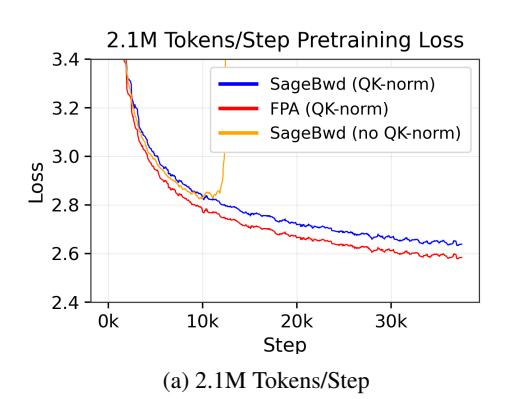
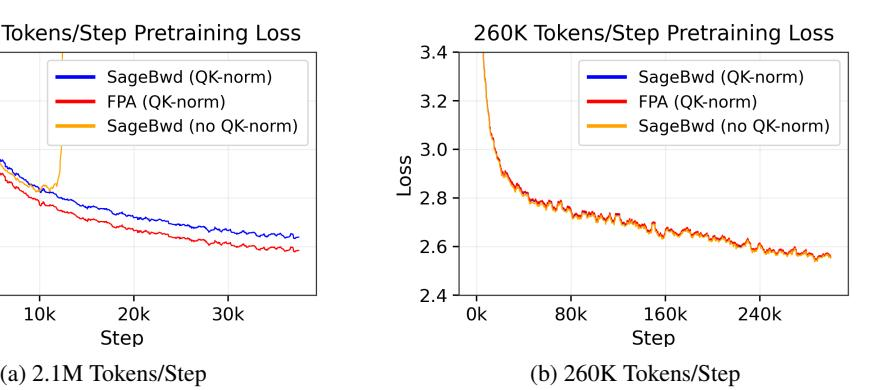
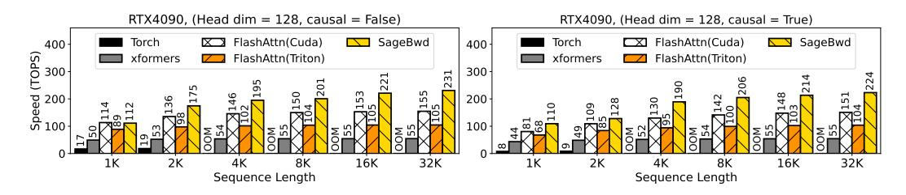
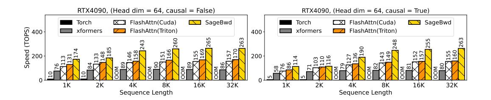
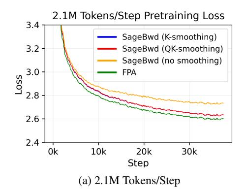
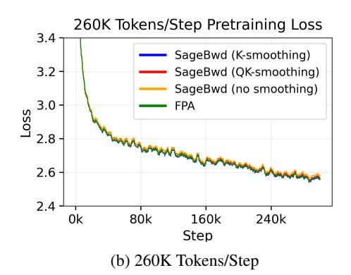
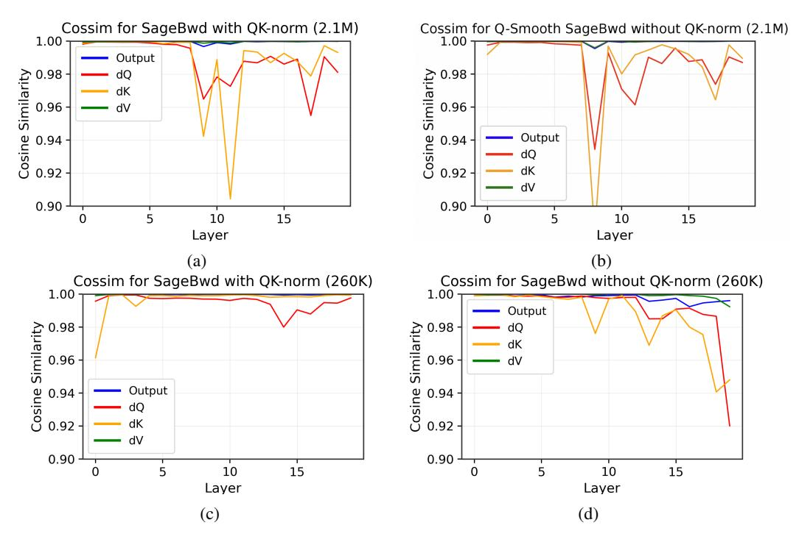
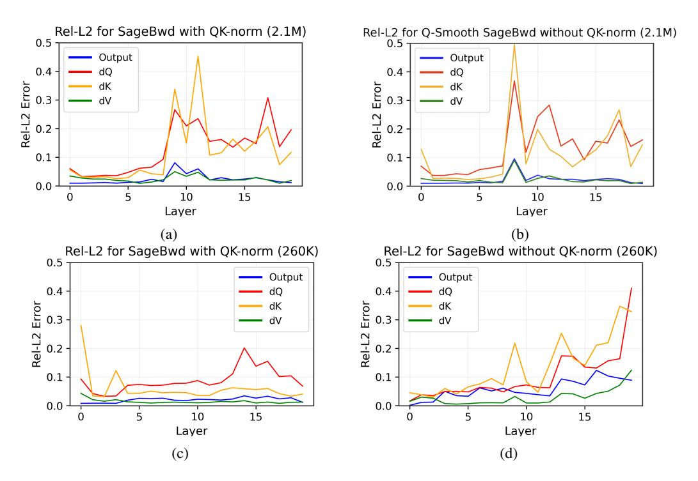

# SAGEBWD: A TRAINABLE LOW-BIT ATTENTION

Jintao Zhang\* Marco Chen\* Haoxu Wang\* Kai Jiang, Ion Stoica, Joseph E. Gonzalez, Jianfei Chen, Jun Zhu

Tsinghua University, UC Berkeley {zhang-jt24@mails., jianfeic@, dcszj@}tsinghua.edu.cn

#### **ABSTRACT**

Low-bit attention, such as SageAttention, has emerged as an effective approach for accelerating model inference, but its applicability to training remains poorly understood. In prior work, we introduced SageBwd, a trainable INT8 attention that quantizes six of seven attention matrix multiplications while preserving fine-tuning performance. However, SageBwd exhibited a persistent performance gap to full-precision attention (FPA) during pre-training. In this work, we investigate why this gap occurs and demonstrate that SageBwd matches full-precision attention during pretraining. Through experiments and theoretical analysis, we reach a few important insights and conclusions: (i) QK-norm is necessary for stable training at large tokens per step, (ii) quantization errors primarily arise from the backward-pass score gradient dS, (iii) reducing tokens per step enables SageBwd to match FPA performance in pre-training, and (iv) K-smoothing remains essential for training stability, while Q-smoothing provides limited benefit during pre-training.

## 1 Introduction

**Motivation.** The efficiency of attention (Vaswani, 2017) is critical for modern generative models, particularly as context lengths continue to grow and the quadratic complexity of scaled dot-product attention becomes a bottleneck (Vaswani, 2017; Jiang et al., 2024). Low-bit quantization offers a promising approach to reducing this cost by enabling the use of low-precision Tensor Cores on GPUs (Chen et al., 2020). Recent methods such as SageAttention (Zhang et al., 2025d;a;f) and FlashAttention3 (Shah et al., 2024) have shown that low-bit attention can be highly effective for inference; however, its applicability to training, particularly large-scale pre-training, remains less well understood.

**Challenge.** Designing a trainable low-bit attention mechanism is challenging because the backward pass is substantially more sensitive to quantization error than the forward pass. In particular, computing gradients involves products of small-magnitude tensors and repeated error propagation through the chain rule, which can amplify quantization errors. Moreover, quantization error in the forward output **O** propagates directly through the backward computation, inducing deviations even when the backward pass matrix multiplications (MatMuls) themselves are executed in higher precision.

Contributions and insights. In prior work (Zhang et al., 2025c), we introduced SageBwd, a trainable low-bit attention mechanism that quantizes six of the seven attention matrix multiplications to INT8 while preserving fine-tuning performance. However, during pre-training, SageBwd exhibited a persistent performance gap relative to full-precision attention (FPA). In this work, we provide theoretical analyses and make empirical observations regarding the sources of this gap and identify conditions under which SageBwd recovers FPA-level pre-training performance.

**Key findings.** First, we identify the dominant source of training deviation as the **dS** tensor in the backward pass, whose small magnitude makes it particularly vulnerable to upstream quantization error. Second, we show that QK-norm stabilizes pre-training by constraining query–key outliers. Third, we find that reducing the number of tokens per optimization step allows SageBwd to match FPA pre-training performance, suggesting that increased gradient noise can mitigate the impact of

<sup>\*</sup>Equal contribution.

quantization error. Finally, through targeted ablations, we show that K-smoothing remains necessary for stable training, while Q-smoothing provides limited benefit in the pre-training setting.

## 2 RELATED WORK

**Hardware-efficient attention.** A line of recent work accelerates attention by optimizing GPU kernel implementations. FlashAttention (Dao et al., 2022) reduces memory I/O by tiling attention computation to on-chip SRAM, achieving significant speedups over standard attention. FlashAttention2 (Dao, 2024) further improves parallelism and warp partitioning, while FlashAttention3 (Shah et al., 2024) targets kernel-level optimizations on Hopper GPUs. Similarly, xFormers (Lefaudeux et al., 2022) provides a collection of custom CUDA kernels for efficient attention variants.

Low-bit and quantized attention. Another line of work accelerates attention by leveraging low-precision tensor cores. SageAttention (Zhang et al., 2025d), SageAttention2 (Zhang et al., 2025a), and SageAttention2++ (Zhang et al., 2025f) combine INT8 quantization with outlier-smoothing techniques to enable efficient attention computation. FlashAttention3 (Shah et al., 2024) proposes an FP8 attention variant; however, it is not directly applicable to large generative models such as video diffusion in a plug-and-play manner (Zhang et al., 2025a). More broadly, these low-bit attention methods are primarily designed for inference and do not support training, limiting their applicability in pre-training and fine-tuning settings.

**Trainable low-bit attention.** SageAttention3 (Zhang et al., 2025c) introduces two complementary advances: (i) an extension of SageAttention2++ that improves inference-side low-bit attention, and (ii) SageBwd, a trainable low-bit attention mechanism that quantizes most attention matrix multiplications while preserving fine-tuning performance. This work builds on the SageBwd component of SageAttention3 by analyzing the sources of training instability in low-bit attention and characterizing the conditions under which full-precision attention performance can be recovered during pre-training.

#### 3 PRELIMINARIES

FlashAttention. Scaled dot-product attention computes  $\mathbf{S} = \mathbf{Q}\mathbf{K}^{\top}, \mathbf{P} = \operatorname{softmax}(\mathbf{S}), \mathbf{O} = \mathbf{P}\mathbf{V}$  where  $\mathbf{Q}, \mathbf{K}, \mathbf{V} \in \mathbb{R}^{N \times D}$  and  $\mathbf{P}, \mathbf{S} \in \mathbb{R}^{N \times N}$ , with N denoting the sequence length and D the head dimension. FlashAttention tiles the sequence dimension by chunking  $\mathbf{Q}, \mathbf{K}, \mathbf{V}$  into blocks  $\{\mathbf{Q}_i\}, \{\mathbf{K}_j\}, \{\mathbf{V}_j\}$ , where  $\mathbf{Q}_i \in \mathbb{R}^{B_q \times D}$  and  $\mathbf{K}_j, \mathbf{V}_j \in \mathbb{R}^{B_{kv} \times D}$ . It then avoids the quadratic IO overhead of materializing  $\mathbf{S}$  and  $\mathbf{P}$  in global memory by using an online softmax and fusing all operations into a single kernel:  $\mathbf{S}_{ij} = \mathbf{Q}_i \mathbf{K}_j^{\top}, \mathbf{P}_{ij} = \operatorname{OnlineSoftmax}(\mathbf{S}_{ij}), \mathbf{O}_i = \sum_j \mathbf{P}_{ij} \mathbf{V}_j$ .

**Quantization.** Quantization accelerates matrix multiplication by representing high-precision matrices with low-bit numeric formats and floating-point scale factors. Given a high-precision matrix  $\mathbf{X} \in \mathbb{R}^{m \times n}$ , its INT8 quantization  $\hat{\mathbf{X}}$  is defined as  $\hat{\mathbf{X}} := \operatorname{round}(\mathbf{X}/\delta_{\mathbf{X}})$ , where  $\delta_{\mathbf{X}} > 0$  is a scale factor, typically computed as  $\delta_{\mathbf{X}} = \max(|\mathbf{X}|)/127$ , and stored in FP32.

Subsequently, given two FP16 matrices **A** and **B**, their approximate matrix product under INT8 quantization is computed as

$$\mathbf{AB} \approx \delta_{\mathbf{A}} \delta_{\mathbf{B}} \cdot \hat{\mathbf{A}} \hat{\mathbf{B}},$$

where the integer matrix multiplication  $\hat{A}\hat{B}$  can be accelerated using INT8 tensor cores.

The *granularity* of quantization refers to the scope over which the scale factor  $\delta$  is computed. Common choices include per-tensor, per-channel, and per-block quantization. In *per-block* quantization, a single scale factor is shared by all elements within a block, e.g., a FlashAttention tile.

**Q** and **K** Smoothing in SageAttention. SageAttention (Zhang et al., 2025d;a;c) extends FlashAttention by quantizing **Q** and **K** to low precision for efficient inference. To mitigate the effect of channel-wise outliers prior to quantization, SageAttention introduced the preprocessing techniques of Q- and K-smoothing. Given query and key blocks  $\mathbf{Q}_i \in \mathbb{R}^{B \times d}$  and  $\mathbf{K}_j \in \mathbb{R}^{B \times d}$ , SageAttention computes a block-wise mean for queries and a global mean for keys:

$$\mu_{Q_i} = \text{mean}_{\text{row}}(\mathbf{Q}_i), \qquad \mu_K = \text{mean}_{\text{row}}(\mathbf{K}),$$

where  $\mu_{Q_i}, \mu_K \in \mathbb{R}^{1 \times d}$  and  $\mathbf{K}$  denotes the full key tensor. The smoothed tensors are defined as  $\mathbf{Q}_i^{\mathrm{sm}} = \mathbf{Q}_i - \mu_{Q_i}, \qquad \mathbf{K}_j^{\mathrm{sm}} = \mathbf{K}_j - \mu_K.$ 

$$\mathbf{Q}_i^{\mathrm{sm}} = \mathbf{Q}_i - \boldsymbol{\mu}_{O_i}, \qquad \mathbf{K}_i^{\mathrm{sm}} = \mathbf{K}_i - \boldsymbol{\mu}_{K_i}$$

The attention logits admit the decomposition

$$\mathbf{Q}_i \mathbf{K}_j^\top = \mathbf{Q}_i^{\mathrm{sm}} \mathbf{K}_j^{\mathrm{sm}} \top + \boldsymbol{\mu}_{Q_i} \mathbf{K}_j^{\mathrm{sm}} \top + \mathbf{Q}_i^{\mathrm{sm}} \boldsymbol{\mu}_K^\top + \boldsymbol{\mu}_{Q_i} \boldsymbol{\mu}_K^\top.$$

Since the softmax operation is invariant to adding a constant to each row, SageAttention applies low-bit quantization to the smoothed tensors  $\mathbf{Q}_i^{\mathrm{sm}}$  and  $\mathbf{K}_j^{\mathrm{sm}}$ , computes the dominant term  $\mathbf{Q}_i^{\mathrm{sm}}\mathbf{K}_j^{\mathrm{sm}}$ using low-bit tensor cores, and adds back the remaining low-rank bias term to recover the logits. When only K-smoothing is applied, the additive bias term vanishes.

SageBwd. SageAttention3 (Zhang et al., 2025c) proposes SageBwd, a trainable low-bit attention mechanism. In the forward pass, SageBwd applies K-smoothing prior to per-block INT8 quantization of  $\mathbf{Q}\mathbf{K}^{\mathsf{T}}$ , and uses a mixed per-token or per-block quantization scheme for the  $\mathbf{P}\mathbf{V}$  product.

In the backward pass, attention gradients involve the following matrix multiplications:

$$\mathbf{S} = \mathbf{Q}\mathbf{K}^{\mathsf{T}}, \quad \mathbf{d}\mathbf{V} = \mathbf{P}^{\mathsf{T}}\mathbf{d}\mathbf{O}, \quad \mathbf{d}\mathbf{P} = \mathbf{d}\mathbf{O}\mathbf{V}^{\mathsf{T}}, \quad \mathbf{d}\mathbf{Q} = \mathbf{d}\mathbf{S}\mathbf{K}, \quad \mathbf{d}\mathbf{K} = \mathbf{d}\mathbf{S}^{\mathsf{T}}\mathbf{Q},$$

where

$$d\mathbf{S} = \mathbf{P} \circ (d\mathbf{P} - \boldsymbol{\delta} \mathbf{1}^{\top}), \qquad \boldsymbol{\delta} = \text{rowsum}(d\mathbf{O} \circ \mathbf{O}).$$

SageBwd retains  $\mathbf{dP} = \mathbf{dOV}^{\top}$  in FP16 precision, while quantizing the remaining four matrix multiplications using per-block INT8. This design choice avoids error amplification through  $\mathbf{dS}$ , dQ, and dK that arises when dP is quantized. SageAttention3 demonstrates that this formulation preserves fine-tuning performance, while its behavior during full pre-training remains less well understood. A pseudocode description is provided in Appendix A.

#### ANALYSIS OF SAGEBWD IN PRETRAINING

In this section, we analyze which design choices in SageBwd are necessary to match full-precision attention (FPA) performance during pre-training. Our analysis focuses on four central aspects: (i) controlling query-key outliers via QK-norm, (ii) identifying the most sensitive tensor in the INT8 backward pass, (iii) understanding how tokens-per-step interacts with quantization noise, and (iv) characterizing the effect of the activation scale through controlled QK standard deviation experiments. Together, these analyses provide a mechanistic explanation for the observed behavior of SageBwd. In Section 5, we empirically validate the resulting conclusions via pre-training experiments.

## <span id="page-2-1"></span>4.1 STABILIZING OUTLIERS WITH QK-NORM

**QK-norm for logit stabilization.** In scaled dot-product attention, the logits  $S = \mathbf{Q} \mathbf{K}^{\top} / \sqrt{d}$  scale with the norms of Q and K. During pre-training, these norms tend to increase, leading to large logits that can saturate the softmax or trigger numerical instabilities, particularly under low-precision arithmetic (Anson & Aitchison, 2025; Dehghani et al., 2023). QK-norm (Henry et al., 2020) addresses this issue by applying RMS normalization to each token in Q and K, explicitly controlling their scale and keeping the logits within a numerically stable range throughout training.

**QK-norm for quantization.** Beyond stabilizing the softmax, QK-norm is also useful in improving the robustness of low-bit attention. Prior work, such as SageAttention, combines channel-wise smoothing of Q and K with fine-grained quantization to mitigate the effect of extreme outliers (Zhang et al., 2025d;a). QK-norm complements these techniques: by compressing the dynamic range of Q and K, it reduces the effective quantization step size under uniform INT8 quantization, pulling outliers closer to the rest of the distribution and improving quantization accuracy. As shown in Subsection 5.3, this effect is particularly important during pre-training with SageBwd.

#### <span id="page-2-0"></span>4.2 SENSITIVITY OF **dS** IN THE BACKWARD PASS

A central challenge in training low-bit attention is the accurate computation of the softmax-gradient tensor dS. Empirically, Table 2 shows that the discrepancy between SageBwd and FPA peaks at dS, with errors further propagating to dQ and dK. This behavior indicates that dS likely constitutes the primary numerical bottleneck in the INT8 backward pass.

Why dS is intrinsically fragile. The sensitivity of dS stems from its systematically small magnitude. Recall that

$$dS = P \circ (dP - \delta), \quad \delta = rowsum(dO \circ O),$$

where P is the softmax output. As shown in [Appendix B,](#page-12-0) the RMS of dS admits the upper bound

$$\operatorname{RMS}(\mathbf{dS}) \leq \frac{1}{\sqrt{N}} \max_{i} \|\mathbf{dP}_{i} - \boldsymbol{\delta}_{i} \mathbf{1}\|_{\infty},$$

where N is the sequence length. This 1/ √ N scaling implies that dS becomes increasingly small for long sequences, even when upstream gradients are well behaved.

Implications for INT8 quantization. INT8 quantization introduces approximately fixed absolute noise determined by the quantization step size [\(Jacob et al., 2018\)](#page-8-8). For tensors with large magnitude, this noise is often tolerable; however, when the signal itself is small, the same absolute error translates into a large relative error. As a result, dS exhibits a much poorer effective signal-to-noise ratio under INT8 quantization than other intermediate tensors. This issue is exacerbated by the multiplicative structure of dS = P ◦ (dP − δ), which combines quantization noise from both forward-pass tensors (P, O) and backward-pass tensors (dP, dO).

Empirical scale of dS. We empirically verify this analysis by measuring the RMS values of P, dP, and dS from a representative layer and head of a QK-normed SageBwd checkpoint that was trained over 78B tokens with 2.1M tokens per step and a sequence length of N = 4096:

$$RMS(\mathbf{P}) \approx 5 \times 10^{-3}$$
,  $RMS(\mathbf{dP}) \approx 5 \times 10^{-5}$ ,  $RMS(\mathbf{dS}) \approx 1 \times 10^{-7}$ .

While the theoretical bound suggests that dS should be at most 1/ √ 4096 ≈ 1/64 times the scale of dP, we observe a ratio closer to 500 in practice. Although the bound is loose, this discrepancy only further highlights how tightly constrained the magnitude of dS is in realistic training settings.

Propagation to dQ and dK. Finally, since dQ and dK are obtained through matrix multiplications with dS, quantization errors in dS propagate directly and are amplified by the norms of Q and K. This amplification becomes more pronounced at longer sequence lengths, consistent with observations in prior work [\(Zhang et al., 2025c\)](#page-9-5).

## <span id="page-3-0"></span>4.3 EFFECT OF TOKENS-PER-STEP

We define tokens-per-step (TPS) as the total number of tokens processed in a single optimizer update. In our experiments [\(Section 5\)](#page-4-0), we fix the sequence length and vary the global batch size, making TPS directly proportional to batch size. We observe that TPS has a significant impact on pre-training behavior: at a large TPS of 2.1M, SageBwd consistently underperforms FPA, whereas at a smaller TPS of 260K, SageBwd matches FPA within noise.

Gradient noise and quantization error. Under a fixed token budget, increasing TPS results in fewer, more deterministic gradient updates, while decreasing TPS yields more frequent updates with higher stochastic gradient noise [\(Smith et al., 2018\)](#page-9-6). Prior work has shown that large-batch training reduces gradient noise and can alter optimization dynamics [\(Keskar et al., 2017\)](#page-8-9). In the context of low-bit attention, we hypothesize that, at large TPS, the reduced gradient noise makes systematic quantization error in the backward pass—particularly along the sensitive dS path [\(Subsection 4.2\)](#page-2-0)—more salient to the optimizer. This persistent, biased error may then influence the optimization trajectory, leading to convergence toward a stable but suboptimal solution.

At smaller TPS, the inherent stochasticity of gradient updates is higher. In this regime, INT8 quantization error likely acts as a small perturbation relative to gradient noise and therefore may not significantly alter the training trajectory, allowing SageBwd to recover FPA-level pre-training performance. While this explanation provides a plausible mechanism linking TPS and quantization error, we do not rule out the influence of other batch-size–dependent optimization effects.

Sequence length as a potential factor. In this work, we vary TPS only through batch size while holding the sequence length fixed. However, since dQ and dK involve matrix multiplications over the sequence dimension N, longer sequences aggregate contributions from a larger number of dS entries. As a result, upstream errors may be further amplified at larger sequence lengths. A systematic study of how sequence length interacts with TPS and quantization error is left to future work.

### <span id="page-4-2"></span>4.4 EFFECT OF QK STANDARD DEVIATION ON QUANTIZATION ERROR

To isolate the effect of activation scale on quantization error, we evaluate SageBwd using synthetic Gaussian attention inputs in which the standard deviations of Q and K (σQ, σK) are varied, while holding σ<sup>V</sup> and σdO fixed at 1. This controlled setting removes optimizer dynamics and directly probes the sensitivity of quantized attention to activation scale, simulating the typical growth of query and key norms observed during pre-training.

As shown in Table [1,](#page-4-1) the accuracy of SageBwd degrades sharply as σ<sup>Q</sup> and σ<sup>K</sup> increase. While the output O and gradient dV remain relatively accurate, the gradients dQ and dK exhibit severe error, with cosine similarity dropping below 0.79 and relative ℓ<sup>2</sup> error exceeding 0.66 at σQ,K = 10.

<span id="page-4-1"></span>

| σQ, σK | Output |        | dQ     |        | dK     |        | dV     |        |
|--------|--------|--------|--------|--------|--------|--------|--------|--------|
|        | CosSim | Rel-ℓ2 | CosSim | Rel-ℓ2 | CosSim | Rel-ℓ2 | CosSim | Rel-ℓ2 |
| 1      | 0.9999 | 0.0160 | 0.9998 | 0.0184 | 0.9998 | 0.0220 | 0.9999 | 0.0159 |
| 3      | 0.9992 | 0.0389 | 0.9971 | 0.0758 | 0.9970 | 0.0777 | 0.9992 | 0.0387 |
| 5      | 0.9982 | 0.0603 | 0.9798 | 0.2014 | 0.9799 | 0.2007 | 0.9982 | 0.0605 |
| 8      | 0.9953 | 0.0972 | 0.8900 | 0.4666 | 0.8886 | 0.4699 | 0.9953 | 0.0973 |
| 10     | 0.9933 | 0.1161 | 0.7823 | 0.6648 | 0.7820 | 0.6684 | 0.9933 | 0.1157 |

Table 1: Sage vs. FPA across random QKV with varying σ<sup>Q</sup> and σ<sup>K</sup>

Intuitively, increasing σ<sup>Q</sup> and σ<sup>K</sup> inflates the dynamic range of tensors involved in quantized matrix multiplications, increasing the quantization step size under uniform INT8 quantization and thereby amplifying absolute quantization noise [\(Jacob et al., 2018\)](#page-8-8). These errors are especially harmful when they feed into the softmax gradient computation, since dS has comparatively small magnitude [\(Subsection 4.2\)](#page-2-0), resulting in a poor effective signal-to-noise ratio. Consequently, even moderate upstream absolute errors can translate into large relative errors in dS and propagate to dQ and dK.

This analysis also further clarifies the role of QK-norm in stabilizing pre-training, as mentioned in [Subsection 4.1.](#page-2-1) Evidently, by normalizing Q and K, QK-norm bounds their effective scale and reduces the dynamic range seen by INT8 quantization, yielding much higher quantization accuracy. However, since QK-norm includes a learned RMSNorm scale vector γ, which tends to increase gradually during pre-training [\(Xiao et al., 2023\)](#page-9-7), the effective σ<sup>Q</sup> and σ<sup>K</sup> may still grow over time. Once this growth surpasses a critical error threshold, the quantization noise along the dS path can become dominant, providing an explanation for the pre-training instability observed at large tokens-per-step in [Section 5,](#page-4-0) even when QK-norm is applied.

# <span id="page-4-0"></span>5 EXPERIMENTS

Core results. At 260K tokens-per-step (TPS), SageBwd pretrains with performance on par with full-precision attention (FPA), regardless of QK-norm. However, at 2.1M TPS, QK-norm is necessary to avoid loss explosion. In general, quantization error tends to spike at the intermediate tensor dS.

## 5.1 SETUP

We implement SageBwd using OpenAI Triton [\(Tillet et al., 2019\)](#page-9-8) and conduct pretraining experiments with a 325M Llama model [\(Dubey et al., 2024\)](#page-8-10)) over 78B tokens of the OpenWebText dataset [\(Gokaslan et al., 2019\)](#page-8-11). All runs use BF16 mixed precision and are trained on a single B200 or RTX4090 GPU node. Across all experiments, we use cosine learning rate scheduling, a context length of 4096, a hidden dimension of 3072, the GPT2 tokenizer, a norm epsilon of 1e-6, and a learning rate of 3e-5. By default, all experiments in this section apply K-smoothing but not Q-smoothing.

<span id="page-5-2"></span>



Figure 1: Pretraining loss over 78B tokens under a different number of tokens/step

<span id="page-5-1"></span>Table 2: Cosine similarity and relative ℓ<sup>2</sup> error for intermediate tensors in SageBwd (vs. FPA).

| Metric | δ      | P      | dP     | dS     | O      | dQ     | dK     | dV     |
|--------|--------|--------|--------|--------|--------|--------|--------|--------|
| CosSim | 0.9973 | 0.9917 | 1.0000 | 0.9789 | 0.9969 | 0.9664 | 0.9537 | 0.9985 |
| Rel-L2 | 0.0736 | 0.1293 | 0.0000 | 0.2045 | 0.0793 | 0.2579 | 0.3074 | 0.0540 |

## 5.2 EFFECT OF TPS ON SA G EBW D VS. FULL-PRECISION ATTENTION PRETRAINING

[Figure 1a](#page-5-2) and [Figure 1b](#page-5-2) compare the pre-training performance of SageBwd and FPA at 2.1M and 260K TPS, respectively. At the larger TPS of 2.1M, SageBwd exhibits a clear gap relative to FPA: after 37.5k training steps with a global batch size of 512 (including 1k warmup steps), SageBwd reaches a loss of 2.640, whereas FPA attains 2.586. In contrast, at the smaller TPS of 260K, where training is performed for 300k steps with a global batch size of 64 (including 7.5k warmup steps), SageBwd matches FPA within noise, achieving a loss of 2.561 compared to 2.563 for FPA.

## <span id="page-5-0"></span>5.3 QK-NORM IS NECESSARY AT HIGH TPS

As shown in [Figure 1a,](#page-5-2) at a large TPS of 2.1M, removing QK-norm leads to training instability and eventual divergence. This behavior is consistent with increased quantization error arising from unconstrained query and key magnitudes. In contrast, for the smaller-TPS runs in [Figure 1b,](#page-5-2) SageBwd matches FPA even without QK-norm.

Despite this apparent robustness at low TPS, intermediate-tensor analysis reveals a different picture. As reported in [Appendix C,](#page-13-0) the non-normed runs exhibit notably larger relative ℓ<sup>2</sup> error and lower cosine similarity than their QK-normed counterparts, even at 260K TPS. This observation aligns with our hypothesis in [Subsection 4.3](#page-3-0) that increased gradient noise at lower TPS can mask moderate quantization errors without eliminating them.

Combined with the controlled activation-scale analysis in [Subsection 4.4,](#page-4-2) these results indicate that QK-norm is a critical component for robust low-bit attention training at scale.

### 5.4 TRACING INTERMEDIATE TENSOR ERROR

In FlashAttention-style kernels, intermediate attention tensors such as P, S, dP, and dS are not explicitly materialized, making direct accuracy inspection difficult. To isolate quantization-induced error, we construct a pseudo-quantized FPA baseline: we extract full-precision Q, K, V, and dO from layer 11 of SageBwd with QK-norm in the 2.1M TPS run (the most error-prone layer identified in [Figure 5a](#page-13-1) and [Appendix C\)](#page-13-0). We then apply the SageBwd INT8 quantize–dequantize scheme before each relevant matrix multiplication in a PyTorch attention implementation and compare all intermediate tensors against full-precision FPA using cosine similarity and relative ℓ<sup>2</sup> error.

As shown in [Table 2,](#page-5-1) most intermediates, including O and dV, remain very close to FPA. In contrast, dS and its subsequent downstream gradients dQ and dK exhibit substantially larger deviations. This

provides direct evidence that the  $\mathbf{dS}$  computation constitutes the primary quantization bottleneck in the backward pass of SageBwd. In this analysis, the upstream gradient  $\mathbf{dO}$  is treated as error-free; hence,  $\mathbf{dP}$  appears perfectly accurate.

#### 5.5 Kernel Performance

Figure 2 and Figure 3 report the end-to-end forward and backward kernel throughput of SageBwd compared to baseline attention implementations on an RTX4090. Across head dimensions D=64 and D=128, SageBwd consistently outperforms FlashAttention2, achieving up to a  $\bf 1.67\times speedup$ , and exceeds the performance of Triton- and xFormers-based FlashAttention2 implementations, too.

We note that our current implementation prioritizes correctness and stability over aggressive kernel fusion, and further speed improvements are likely achievable with additional optimizations.

<span id="page-6-0"></span>

Figure 2: Speed comparison between SageBwd and Baselines (RTX4090, headim=128).

<span id="page-6-1"></span>

Figure 3: Speed comparison between SageBwd and Baselines (RTX4090, headim=64).

### 6 ABLATION STUDY

In the main experiments (Section 5), we apply K-smoothing by default. However, prior SageAttention work also employs Q-smoothing as a key technique for improving quantization accuracy (Zhang et al., 2025d;a). In this section, we ablate the effects of Q- and K-smoothing in SageBwd to clarify their respective roles during pre-training.

In Figure 4, we compare full-precision attention (FPA) with SageBwd under three settings: no smoothing, K-smoothing, and QK-smoothing, at both 2.1M and 260K tokens per step (TPS). Due to computational constraints, we do not evaluate Q-smoothing in isolation. All runs use QK-norm and identical training hyperparameters to those in Section 5.

Contrary to expectations from prior work, we find that while K-smoothing remains essential for stable pre-training, Q-smoothing provides no consistent benefit and can slightly degrade gradient accuracy.

**K-smoothing is necessary for stable training.** Consistent with prior work, Figure 4 shows that K-smoothing, a technique where the token-wise mean of **K** is subtracted prior to quantization, is critical for maintaining pre-training stability. Even in the more noise-tolerant 260K TPS regime, K-smoothing is required to achieve FPA-level performance.

From an implementation perspective, K-smoothing requires no modification to the backward pass. Smoothing can occur at kernel entry and the smoothed K can be used without additional bias terms.

<span id="page-7-0"></span>



Figure 4: Ablation of Q-smoothing and K-smoothing pretraining loss over 78B tokens under a different number of tokens/step

The gradient computation for  $\mathbf{dQ} = \mathbf{dSK}$  remains valid even after  $\mathbf{K}$  is smoothed because each row of  $\mathbf{dS}$  sums to 0, so  $\mathbf{dS}(\mathbf{1} \operatorname{mean}_{row}(\mathbf{K})^{\top}) = 0$  and  $\mathbf{dQ} = \mathbf{dSK} = \mathbf{dS}(\mathbf{K} - \mathbf{1} \operatorname{mean}_{row}(\mathbf{K})^{\top}) = \mathbf{dSK}^{sm}$  where  $\mathbf{K}^{sm}$  denotes the key matrix  $\mathbf{K}$  after smoothing.

**Q-smoothing shows limited benefit.** In contrast, we observe no consistent improvement in either pre-training loss or intermediate-tensor accuracy from applying Q-smoothing. In some cases, Q-smoothing slightly degrades gradient fidelity. As shown in our error analysis (Appendix C),  $d\mathbf{Q}$  and  $d\mathbf{K}$  exhibit marginally larger deviation from the FPA baseline when Q-smoothing is enabled.

One contributing factor is the gradient correction required by Q-smoothing. Rewriting the logits as

$$\mathbf{S} = (\mathbf{Q} - \mathbf{1} \mu_Q^\top) \mathbf{K}^\top + \mathbf{1} (\mu_Q \mathbf{K}^\top) \quad \text{with} \quad \mu_Q = \text{mean}(\mathbf{Q}).$$

preserves forward equivalence with  $\mathbf{Q}\mathbf{K}^{\top}$ . Therefore, the total gradient remains  $\mathbf{d}\mathbf{K} = \mathbf{d}\mathbf{S}^{\top}\mathbf{Q}$ . Consequently,  $\mathbf{d}\mathbf{K}$  cannot be computed from the centered branch only, i.e.,  $\mathbf{d}\mathbf{K} \neq \mathbf{d}\mathbf{K}_{\text{center}} = \mathbf{d}\mathbf{S}^{\top}\mathbf{Q}^{\text{sm}}$  with  $\mathbf{Q}^{\text{sm}} = \operatorname{smooth}(\mathbf{Q}) = \mathbf{Q} - \mathbf{1}\mu_{Q}^{\top}$ . We need to add an additional bias branch term,  $\mathbf{d}\mathbf{K}_{\text{bias}} = (\mathbf{d}\mathbf{S}^{\top}\mathbf{1})\,\mu_{Q}^{\top}$ , to recover the correct gradient:

$$\mathbf{dK} = \mathbf{dS}^{\top}\mathbf{Q} = \mathbf{dS}^{\top}(\mathbf{Q}^{\mathrm{sm}} + \mathbf{1}\mu_{Q}^{\top}) = \mathbf{dS}^{\top}\mathbf{Q}^{\mathrm{sm}} + \mathbf{dS}^{\top}\mathbf{1}\mu_{Q}^{\top} = \mathbf{dK}_{\mathrm{center}} + \mathbf{dK}_{\mathrm{bias}}.$$

This additional correction introduces another pathway for quantization noise, which may partially offset the benefits of reduced activation range. We leave a deeper investigation of when Q-smoothing benefits training-time quantization to future work.

#### 7 CONCLUSION AND FUTURE WORK

Conclusion. In this paper, we extend SageBwd, a trainable low-bit attention mechanism. We analyze when SageBwd can match full-precision scaled dot-product attention during pre-training and find two key factors: (i) controlling outliers in  $\mathbf{Q}$  and  $\mathbf{K}$  via QK-norm is necessary for stability at large tokens-per-step, and (ii) the dominant accuracy bottleneck is the low-magnitude softmax gradient  $\mathbf{dS}$ , which affects  $\mathbf{dQ}$  and  $\mathbf{dK}$ . Empirically, smaller tokens-per-step make training more tolerant to this noise, while larger tokens-per-step expose it and yield a stable but suboptimal gap.

Limitations and future work. While SageBwd achieves FPA-level performance under moderate tokens-per-step, its training stability degrades at very large batch sizes. A key direction for future work is therefore to develop methods that mitigate backward-pass quantization error, particularly along the dS path, without relying on reduced batch size or increased gradient noise. In addition, although SageBwd already delivers considerable speedups over existing baselines, further kernel-level optimizations remain an important avenue for future research.

## REFERENCES

- <span id="page-8-5"></span>Ben Anson and Laurence Aitchison. Controlling changes to attention logits, 2025. URL [https:](https://arxiv.org/abs/2511.21377) [//arxiv.org/abs/2511.21377](https://arxiv.org/abs/2511.21377).
- <span id="page-8-1"></span>Jianfei Chen, Yu Gai, Zhewei Yao, Michael W Mahoney, and Joseph E Gonzalez. A statistical framework for low-bitwidth training of deep neural networks. *Advances in neural information processing systems*, 33:883–894, 2020.
- <span id="page-8-3"></span>Tri Dao. Flashattention-2: Faster attention with better parallelism and work partitioning. In *The Twelfth International Conference on Learning Representations*, 2024.
- <span id="page-8-2"></span>Tri Dao, Dan Fu, Stefano Ermon, Atri Rudra, and Christopher Re. Flashattention: Fast and memory- ´ efficient exact attention with io-awareness. *Advances in Neural Information Processing Systems*, 35:16344–16359, 2022.
- <span id="page-8-6"></span>Mostafa Dehghani, Josip Djolonga, Basil Mustafa, Piotr Padlewski, Jonathan Heek, Justin Gilmer, Andreas Peter Steiner, Mathilde Caron, Robert Geirhos, Ibrahim Alabdulmohsin, et al. Scaling vision transformers to 22 billion parameters. In *International conference on machine learning*, pp. 7480–7512. PMLR, 2023.
- <span id="page-8-10"></span>Abhimanyu Dubey, Abhinav Jauhri, Abhinav Pandey, Abhishek Kadian, Ahmad Al-Dahle, Aiesha Letman, Akhil Mathur, Alan Schelten, Amy Yang, Angela Fan, et al. The llama 3 herd of models. *arXiv preprint arXiv:2407.21783*, 2024.
- <span id="page-8-11"></span>Aaron Gokaslan, Vanya Cohen, Ellie Pavlick, and Stefanie Tellex. Openwebtext corpus. [http:](http://Skylion007.github.io/OpenWebTextCorpus) [//Skylion007.github.io/OpenWebTextCorpus](http://Skylion007.github.io/OpenWebTextCorpus), 2019.
- <span id="page-8-7"></span>Alex Henry, Prudhvi Raj Dachapally, Shubham Pawar, and Yuxuan Chen. Query-key normalization for transformers, 2020. URL <https://arxiv.org/abs/2010.04245>.
- Yuezhou Hu, Weiyu Huang, Zichen Liang, Chang Chen, Jintao Zhang, Jun Zhu, and Jianfei Chen. Identifying sensitive weights via post-quantization integral. *arXiv preprint arXiv:2503.01901*, 2025.
- Yuezhou Hu, Harman Singh, Monishwaran Maheswaran, Haocheng Xi, Coleman Hooper, Jintao Zhang, Aditya Tomar, Michael W Mahoney, Sewon Min, Mehrdad Farajtabar, et al. Residual context diffusion language models. *arXiv preprint arXiv:2601.22954*, 2026.
- <span id="page-8-8"></span>Benoit Jacob, Skirmantas Kligys, Bo Chen, Menglong Zhu, Matthew Tang, Andrew Howard, Hartwig Adam, and Dmitry Kalenichenko. Quantization and training of neural networks for efficient integer-arithmetic-only inference. In *Proceedings of the IEEE conference on computer vision and pattern recognition*, pp. 2704–2713, 2018.
- <span id="page-8-0"></span>Huiqiang Jiang, YUCHENG LI, Chengruidong Zhang, Qianhui Wu, Xufang Luo, Surin Ahn, Zhenhua Han, Amir H. Abdi, Dongsheng Li, Chin-Yew Lin, Yuqing Yang, and Lili Qiu. MInference 1.0: Accelerating pre-filling for long-context LLMs via dynamic sparse attention. In *The Thirty-eighth Annual Conference on Neural Information Processing Systems*, 2024.
- Youhe Jiang, Fangcheng Fu, Wanru Zhao, Stephan Rabanser, Nicholas D Lane, and Binhang Yuan. Cascadia: A cascade serving system for large language models. *arXiv preprint arXiv:2506.04203*, 2025a.
- Youhe Jiang, Wenshuang Li, You Peng, Jintao Zhang, Ran Yan, Jianfei Chen, Xu Han, Fangcheng Fu, and Binhang Yuan. Hexgen-3: A fully disaggregated llm serving framework with fine-grained heterogeneous resource autoscaling. 2025b.
- <span id="page-8-9"></span>Nitish Shirish Keskar, Dheevatsa Mudigere, Jorge Nocedal, Mikhail Smelyanskiy, and Ping Tak Peter Tang. On large-batch training for deep learning: Generalization gap and sharp minima, 2017. URL <https://arxiv.org/abs/1609.04836>.
- <span id="page-8-4"></span>Benjamin Lefaudeux, Francisco Massa, Diana Liskovich, Wenhan Xiong, Vittorio Caggiano, Sean Naren, Min Xu, Jieru Hu, Marta Tintore, Susan Zhang, et al. xformers: A modular and hackable transformer modelling library, 2022.

- <span id="page-9-4"></span>Jay Shah, Ganesh Bikshandi, Ying Zhang, Vijay Thakkar, Pradeep Ramani, and Tri Dao. Flashattention-3: Fast and accurate attention with asynchrony and low-precision. In *The Thirtyeighth Annual Conference on Neural Information Processing Systems*, 2024.
- <span id="page-9-6"></span>Samuel L. Smith, Pieter-Jan Kindermans, Chris Ying, and Quoc V. Le. Don't decay the learning rate, increase the batch size, 2018. URL <https://arxiv.org/abs/1711.00489>.
- <span id="page-9-8"></span>Philippe Tillet, Hsiang-Tsung Kung, and David Cox. Triton: an intermediate language and compiler for tiled neural network computations. In *Proceedings of the 3rd ACM SIGPLAN International Workshop on Machine Learning and Programming Languages*, pp. 10–19, 2019.
- <span id="page-9-0"></span>A Vaswani. Attention is all you need. *Advances in Neural Information Processing Systems*, 2017.
- Haocheng Xi, Shuo Yang, Yilong Zhao, Muyang Li, Han Cai, Xingyang Li, Yujun Lin, Zhuoyang Zhang, Jintao Zhang, Xiuyu Li, et al. Quant videogen: Auto-regressive long video generation via 2-bit kv-cache quantization. *arXiv preprint arXiv:2602.02958*, 2026.
- Chendong Xiang, Jiajun Liu, Jintao Zhang, Xiao Yang, Zhengwei Fang, Shizun Wang, Zijun Wang, Yingtian Zou, Hang Su, and Jun Zhu. Geometry-aware rotary position embedding for consistent video world model. *arXiv preprint arXiv:2602.07854*, 2026.
- <span id="page-9-7"></span>Guangxuan Xiao, Ji Lin, Mickael Seznec, Hao Wu, Julien Demouth, and Song Han. Smoothquant: Accurate and efficient post-training quantization for large language models. In *International Conference on Machine Learning*, pp. 38087–38099. PMLR, 2023.
- Shuo Yang, Haocheng Xi, Yilong Zhao, Muyang Li, Jintao Zhang, Han Cai, Yujun Lin, Xiuyu Li, Chenfeng Xu, Kelly Peng, et al. Sparse videogen2: Accelerate video generation with sparse attention via semantic-aware permutation. *Advances in Neural Information Processing Systems (NeurIPS 2025)*, 2025.
- Jintao Zhang, Rundong Su, Chunyu Liu, Jia Wei, Ziteng Wang, Haoxu Wang, Pengle Zhang, Huiqiang Jiang, Haofeng Huang, Chendong Xiang, et al. Efficient attention methods: Hardware-efficient, sparse, compact, and linear attention.
- <span id="page-9-2"></span>Jintao Zhang, Haofeng Huang, Pengle Zhang, Jia Wei, Jun Zhu, and Jianfei Chen. Sageattention2: Efficient attention with thorough outlier smoothing and per-thread int4 quantization. In *International Conference on Machine Learning (ICML)*, 2025a.
- Jintao Zhang, Haoxu Wang, Kai Jiang, Shuo Yang, Kaiwen Zheng, Haocheng Xi, Ziteng Wang, Hongzhou Zhu, Min Zhao, Ion Stoica, et al. Sla: Beyond sparsity in diffusion transformers via fine-tunable sparse-linear attention. *arXiv preprint arXiv:2509.24006*, 2025b.
- <span id="page-9-5"></span>Jintao Zhang, Jia Wei, Pengle Zhang, Xiaoming Xu, Haofeng Huang, Haoxu Wang, Kai Jiang, Jun Zhu, and Jianfei Chen. Sageattention3: Microscaling fp4 attention for inference and an exploration of 8-bit training. *arXiv preprint arXiv:2505.11594*, 2025c.
- <span id="page-9-1"></span>Jintao Zhang, Jia Wei, Pengle Zhang, Jun Zhu, and Jianfei Chen. Sageattention: Accurate 8-bit attention for plug-and-play inference acceleration. In *International Conference on Learning Representations (ICLR)*, 2025d.
- Jintao Zhang, Chendong Xiang, Haofeng Huang, Haocheng Xi, Jun Zhu, Jianfei Chen, et al. Spargeattention: Accurate and training-free sparse attention accelerating any model inference. In *Fortysecond International Conference on Machine Learning*, 2025e.
- <span id="page-9-3"></span>Jintao Zhang, Xiaoming Xu, Jia Wei, Haofeng Huang, Pengle Zhang, Chendong Xiang, Jun Zhu, and Jianfei Chen. Sageattention2++: A more efficient implementation of sageattention2. *arXiv preprint arXiv:2505.21136*, 2025f.
- Jintao Zhang, Kaiwen Zheng, Kai Jiang, Haoxu Wang, Ion Stoica, Joseph E Gonzalez, Jianfei Chen, and Jun Zhu. Turbodiffusion: Accelerating video diffusion models by 100-200 times. *arXiv preprint arXiv:2512.16093*, 2025g.

- Jintao Zhang, Kai Jiang, Chendong Xiang, Weiqi Feng, Yuezhou Hu, Haocheng Xi, Jianfei Chen, and Jun Zhu. SpargeAttention2: Trainable Sparse Attention via Hybrid Top-k+Top-p Masking and Distillation Fine-Tuning. *arXiv preprint arXiv:2602.13515*, 2026a.
- Jintao Zhang, Haoxu Wang, Kai Jiang, Kaiwen Zheng, Youhe Jiang, Ion Stoica, Jianfei Chen, Jun Zhu, and Joseph E. Gonzalez. SLA2: Sparse-Linear Attention with Learnable Routing and QAT. *arXiv preprint arXiv:2602.12675*, 2026b.
- Pengle Zhang, Jia Wei, Jintao Zhang, Jun Zhu, and Jianfei Chen. Accurate int8 training through dynamic block-level fallback. *arXiv preprint arXiv:2503.08040*, 2025h.

#### <span id="page-11-0"></span>A SAGEBWD ALGORITHM

## A.1 FORWARD PASS

### **Algorithm 1:** Foward pass of the 8-bit attention.

```
1: Input: FP16 matrices Q, K, V \in \mathbb{R}^{N \times d}, and block size B_q, B_{kv}.
  2: Divide Q to T_m = N/B_q blocks \{\mathbf{Q}_i\}; divide K, and V to T_n = N/B_{kv} blocks \{\mathbf{K}_i\}, \{\mathbf{V}_i\};
  3: Quantization: \{\mathbf{s}_{\mathbf{Q}}, \hat{\mathbf{Q}}_i\} = \{\psi(\mathbf{Q}_i)\}, \{\mathbf{s}_{\mathbf{K}}, \hat{\mathbf{K}}_i\} = \{\psi(\mathbf{K}_i^\top)\}, \{\mathbf{s}_{\mathbf{V}}, \hat{\mathbf{V}}_i\} = \{\psi(\mathbf{V}_i)\}; // \text{ Per-block.}
 4: for i=1 to T_m do 5: \mathbf{O}_i \in \mathbb{R}^{B_q \times D} = (0), \ \mathbf{L}_i \in \mathbb{R}^{B_q} = (0), \ m_i \in \mathbb{R}^{B_{kv}} = (0);
 6:
            for j in [1, T_n] do
 7:
                  \mathbf{S}_{ij} = \text{MM}(\hat{\mathbf{Q}}_i, \hat{\mathbf{K}}_j) \times \mathbf{s}_{\mathbf{Q}} \times \mathbf{s}_{\mathbf{K}};
                  m_{ij} = \max(m_{i,j-1}, \operatorname{rowmax}(\mathbf{S}_{ij})), \widetilde{\mathbf{P}}_{ij} = \exp(\mathbf{S}_{ij} - m_{ij}), l_{ij} = e^{m_{i,j-1} - m_{ij}} + \operatorname{rowsum}(\widetilde{\mathbf{P}}_{ij});
  8:
                  \mathbf{s}_{\mathbf{P}} = \exp(\operatorname{rowmax}(\mathbf{S}_{ij}) - m_{ij})/127, \quad \hat{\mathbf{P}}_{ij} = \widetilde{\mathbf{P}}_{ij}/\mathbf{s}_{\mathbf{P}}; // \text{ Per-token quantization.}
 9:
                   \mathbf{O}_{ij} = \operatorname{diag}(e^{m_{i,j-1}-m_{ij}})^{-1}\mathbf{O}_{i,j-1} + \operatorname{MM}(\hat{\mathbf{P}}_{ij}, \hat{\mathbf{V}}_{j}) \times \mathbf{s}_{\mathbf{P}} \times \mathbf{s}_{\mathbf{V}}
10:
              end for
11:
12:
              \mathbf{O}_i = \operatorname{diag}(l_{i,T_n})^{-1} \mathbf{O}_{i,T_n} ;
13: \mathbf{L}_i = m_{i,T_n} + \log(l_{i,T_n});
14: end for
15: return O = \{ \mathbf{O}_i \}, L = \{ \mathbf{L}_i \} ;
```

#### A.2 BACKWARD PASS

#### **Algorithm 2:** Backward pass of the 8-bit attention.

```
1: Input: \{\mathbf{s}_{\mathbf{Q}}, \hat{\mathbf{Q}}_i\}, \{\mathbf{s}_{\mathbf{K}}, \hat{\mathbf{K}}_i\}, \{\mathbf{s}_{\mathbf{V}}, \hat{\mathbf{V}}_i\}, O, \{\mathbf{L}_i\} from the forward, dO \in \mathbb{R}^{N \times d}, and block size B_q, B_{kv};
  2: D = \text{rowsum}(dO \circ O), divide D to T_m = N/B_q blocks \{D_i\};
  3: for j = 1 to T_n do
             for i in [1, T_m] do
  5:
                    \mathbf{S}_{ij} = \text{MM}(\hat{\mathbf{Q}}_i, \hat{\mathbf{K}}_j) \times \mathbf{s}_{\mathbf{Q}} \times \mathbf{s}_{\mathbf{K}}; \quad \mathbf{P}_{ij} = \exp(\mathbf{S}_{ij} - \mathbf{L}_i);
  6:
                    \mathbf{s}_{\mathbf{P}}, \ddot{\mathbf{P}}_{ij} = \psi(\mathbf{P}_{ij}), \quad \mathbf{s}_{\mathbf{dO}}, \hat{\mathbf{dO}}_i = \psi(\mathbf{dO}_i); \text{ // INT8 per-block quantization.}
  7:
                    \mathbf{dV}_j \leftarrow \mathbf{dV}_j + \mathtt{MM}(\hat{\mathbf{P}}_{ij}^\top, \hat{\mathbf{dO}}_i) \times \mathbf{s}_{\mathbf{P}} \times \mathbf{s}_{\mathbf{dO}};
                    \mathbf{dP}_{ij} = \texttt{MM}(\mathbf{dO}, \mathbf{V}_j^{\top}) ; // Keep in FP16.
  8:
                    d\mathbf{S}_{ij} = \mathbf{P}_{ij} \circ (d\mathbf{P}_{ij} - \mathbf{D}_i); \quad \mathbf{s}_{d\mathbf{S}}, \hat{d\mathbf{S}}_{ij} = \psi(d\mathbf{S}_{ij}); \text{ // INT8 per-block quantization.}
 9:
10:
                    \mathbf{dQ}_i \leftarrow \mathbf{dQ}_i + \mathtt{MM}(\hat{\mathbf{dS}}_{ij}, \hat{\mathbf{K}}_j) \times \mathbf{s_{dS}} \times \mathbf{s_K};
                    \mathbf{dK}_{i} \leftarrow \mathbf{dK}_{i} + \mathrm{MM}(\hat{\mathbf{dS}}_{ij}^{\top}, \hat{\mathbf{Q}}_{i}) \times \mathbf{s}_{\mathbf{dS}} \times \mathbf{s}_{\mathbf{Q}};
11:
12:
               end for
13: end for
14: return dQ, dK, dV;
```

# <span id="page-12-0"></span>B DS MAGNITUDE

In this section, we prove a simple upper bound on the RMS of dS.

Proof. Recall that

$$\mathbf{dS} = \mathbf{P} \circ (\mathbf{dP} - \boldsymbol{\delta} \mathbf{1}^{\top}) \in \mathbb{R}^{N \times N}, \qquad \boldsymbol{\delta} = \operatorname{rowsum}(\mathbf{dO} \circ \mathbf{O}) \in \mathbb{R}^{N},$$

where ◦ denotes elementwise multiplication and 1 is the all-ones vector.

For row i of dS, we can write

$$\mathbf{dS}_i = \mathbf{P}_i \circ (\mathbf{dP}_i - \boldsymbol{\delta}_i \mathbf{1}),$$

where P<sup>i</sup> , dP<sup>i</sup> ∈ R <sup>N</sup> and δ<sup>i</sup> is the i-th entry of δ. Its root-mean-square (RMS) value is

$$RMS(\mathbf{dS}_i) = \sqrt{\frac{1}{N} \sum_{j=1}^{N} \mathbf{P}_{i,j}^2 (\mathbf{dP}_{i,j} - \boldsymbol{\delta}_i)^2}.$$

Using the infinity norm (∥x∥<sup>∞</sup> = max<sup>j</sup> |x<sup>j</sup> |), we have |dPi,j − δ<sup>i</sup> | ≤ ∥dP<sup>i</sup> − δi1∥∞. Therefore,

$$RMS(\mathbf{dS}_i)^2 \le \|\mathbf{dP}_i - \boldsymbol{\delta}_i \mathbf{1}\|_{\infty}^2 \cdot \frac{1}{N} \sum_{j=1}^N \mathbf{P}_{i,j}^2$$
 (1)

$$= \|\mathbf{dP}_i - \boldsymbol{\delta}_i \mathbf{1}\|_{\infty}^2 \text{ RMS}(\mathbf{P}_i)^2, \tag{2}$$

and hence

<span id="page-12-1"></span>
$$RMS(dS_i) \le RMS(P_i) \|dP_i - \delta_i \mathbf{1}\|_{\infty}.$$
 (3)

Because P is the output of a softmax operation, each row P<sup>i</sup> is a probability vector that sums to 1 and only has entries in the range [0, 1]. Thus

<span id="page-12-2"></span>
$$RMS(\mathbf{P}_i) = \sqrt{\frac{1}{N} \sum_{j=1}^{N} \mathbf{P}_{i,j}^2} \le \sqrt{\frac{1}{N} \max_{j} \mathbf{P}_{i,j} \sum_{j=1}^{N} \mathbf{P}_{i,j}} \le \frac{1}{\sqrt{N}}.$$
 (4)

Combining [\(3\)](#page-12-1) and [\(4\)](#page-12-2) yields, for each row i,

$$RMS(\mathbf{dS}_i) \leq \frac{1}{\sqrt{N}} \|\mathbf{dP}_i - \boldsymbol{\delta}_i \mathbf{1}\|_{\infty}.$$

Finally, the global RMS of dS satisfies

$$RMS(\mathbf{dS}) \le \frac{1}{\sqrt{N}} \max_{i} \|\mathbf{dP}_{i} - \boldsymbol{\delta}_{i}\mathbf{1}\|_{\infty}.$$
 (5)

This upper bound can be interpreted as follows: the average magnitude of dS is at most the largest per-row gradient magnitude in dP, scaled by a factor of 1/ √ N.

# <span id="page-13-0"></span>C COSINE SIMILARITY AND REL-L2 ERROR

[Figure 5](#page-13-1) and [Figure 6](#page-13-2) show the cosine similarity and relative ℓ2-error between SageBwd and FPA on inputs and gradients extracted from a single forward-backward pass of the pretrained 325M Llama model under various TPS and architectural settings.

<span id="page-13-1"></span>

Figure 5: Cosine similarity between SageBwd and SDPA over layers on different settings

<span id="page-13-2"></span>

Figure 6: Relative L2-Error between SageBwd and SDPA over layers on different settings