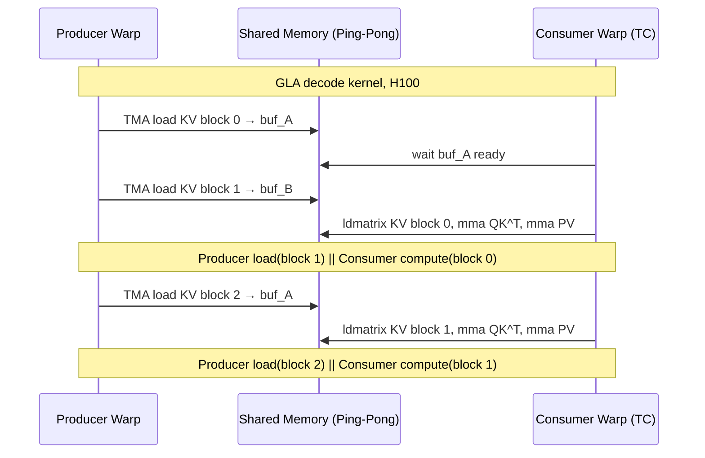

## FP8 MMA with FP16 Accumulator (mma.f16.f8.f8.f16)

术语是什么？回答尽量完整，回答逻辑链中每一步都解释出来。

FP8 MMA with FP16 Accumulator（PTX 指令 `mma.sync.aligned.m16n8k32.row.col.f16.f8.f8.f16`）是 NVIDIA Ada Lovelace (RTX 4090) 及更新架构 GPU 上的一种 Tensor Core 矩阵乘加指令变体。它将两个 FP8 E4M3 操作数矩阵相乘，在内积累加过程中使用 FP16（半精度浮点，表示范围 ±65504）作为累加器数据类型，而非默认的 FP32 累加器。该指令的 tile 形状为 M=16, N=8, K=32，即每条指令处理 16×32 的 A 矩阵与 32×8 的 B 矩阵的乘法，产生 16×8 的 FP16 累加结果。根据 NVIDIA Ada 架构白皮书，FP8 MMA with FP16 accumulator 相对 FP16 MMA 实现 4× 理论吞吐加速，而 FP8 MMA with FP32 accumulator（mma.f32.f8.f8.f32）仅实现 2× 加速。在 SageAttention2++ 中，该指令专门用于 attention 中 P×V（attention weight × value）矩阵乘法，替代 SageAttention2 中使用的 mma.f32.f8.f8.f32 指令。

从kernel调度角度拆解术语：

该指令在 attention kernel 的 P×V 阶段被调用，核心调度考虑是 FP16 累加器仅能安全表达 ±65504 范围内的值，而 FP8 MMA 的 mma.m16n8k32 指令在 K=32 维度上会累积 32 个 p×v 乘积项。为保证累加不溢出，需要满足约束：

$$|32 \times p_{\max} \times v_{\max}| \leq 65504$$

即 $p_{\max} \times v_{\max} \leq 2047$。

在 SageAttention2++ kernel 中，P 被量化为 FP8 范围为 [-224, 224]（$P_r=224$），V 被量化为 FP8 范围为 [-4.5, 4.5]（$V_r=4.5$），满足 $224 \times 4.5 = 1008 \leq 2047$。

Kernel 伪代码（P×V 部分）：
```
// 每个 SM 处理一个 P×V tile
δ_P = max(|P̃|) / 224        // 缩小的 per-block scale
δ_V = colmax(|V|) / 4.5     // 缩小的 per-channel scale

P̂ = cvt_fp8_e4m3(P̃ / δ_P)    // 量化 P 到 FP8, 范围 [-224,224]
V̂ = cvt_fp8_e4m3(V / δ_V)    // 量化 V 到 FP8, 范围 [-4.5, 4.5]

acc_fp16 = 0 (FP16)
for k_step in range(K_dim / 32):
    p_tile = load_fp8(P̂[k_step*16 : (k_step+1)*16][:])   // 16×32 FP8
    v_tile = load_fp8(V̂[k_step*32 : (k_step+1)*32][:])   // 32×8 FP8
    // PTX: mma.sync.aligned.m16n8k32.row.col.f16.f8.f8.f16
    acc_fp16 += mma_f16_f8_f8_f16(p_tile, v_tile)

// 反量化
O = cvt_fp16_to_fp32(acc_fp16) * δ_P * δ_V
```

Annotations:
- `δ_P, δ_V`：per-block/per-channel scale factors，约束乘积 ≤1023.5（含 delayed FP32 buffering 时）
- `acc_fp16`：FP16 累加器，32 次内积累加结果 ≤32256 < 65504
- `mma_f16_f8_f8_f16`：关键 PTX 指令，4× FP16 理论吞吐
- `K_dim/32`：沿 K 维度的 tile 循环次数，每步处理 32 个元素的内积
- 与 mma.f32.f8.f8.f32 的关键区别：累加器从 FP32 变为 FP16，理论吞吐翻倍，但要求量化范围更窄以保证数值安全

术语一般如何实现？如何使用？

该指令是 NVIDIA PTX ISA 的一部分，从 Ada Lovelace (SM 8.9) 架构开始支持，在 Blackwell (RTX 5090) 架构上同样可用。在 CUDA 中通过内联 PTX 汇编调用：

```cuda
// CUDA inline PTX
asm volatile(
    "mma.sync.aligned.m16n8k32.row.col.f16.f8.f8.f16 "
    "{%0, %1, %2, %3}, "
    "{%4, %5, %6, %7}, "
    "{%8, %9}, "
    "{%10, %11, %12, %13};"
    : "=r"(d0), "=r"(d1), "=r"(d2), "=r"(d3)
    : "r"(a0), "r"(a1), "r"(a2), "r"(a3),
      "r"(b0), "r"(b1),
      "r"(c0), "r"(c1), "r"(c2), "r"(c3)
);
```

在 CUTLASS 等模板库中，该指令被抽象为 `warp::mma` 操作，开发者通过指定 OperandA/OperandB/Accumulator 类型来间接选择指令变体。SageAttention2++ 直接在 CUDA kernel 中使用该指令实现 P×V 的量化 Matmul。

前置条件：使用该指令前必须确保量化后的 FP8 张量值在 FP16 累加可安全表达的范围内，即通过缩小量化范围（narrowing quantization range）来控制操作数上界。这与传统的"最大范围量化"（max range quantization，如 E4M3 的 [-448, 448]）形成对比。

涉及论文标题：
- SageAttention2++: A More Efficient Implementation of SageAttention2

## Delayed FP32 Buffering

术语是什么？回答尽量完整，回答逻辑链中每一步都解释出来。

Delayed FP32 Buffering 是 SageAttention2++ 提出的一种 CUDA kernel 微优化技术，用于减少 FP8 Tensor Core MMA 结果从 FP16 累加器到 FP32 最终输出的类型转换开销。在 mma.f16.f8.f8.f16 指令中，每次 MMA 调用产生 FP16 累加结果，而 attention 的最终输出需要 FP32 精度。若每次 MMA 后立即转换为 FP32（cvt.f32.f16 PTX 指令），则每条 MMA 需一次转换指令。Delayed FP32 Buffering 将连续两次 MMA 的结果先在 FP16 中累加，然后统一执行一次 FP32 转换，将转换指令数量减半。

从kernel调度角度拆解术语：

该技术是对 FP8 MMA 指令流水线中的数据转换步骤的调度优化。在 P×V Matmul kernel 的内部循环中：

无 Delayed FP32 Buffering（每次转换）：
```
for k in range(K/32):
    result = mma_f16_f8_f8_f16(p_tile, v_tile)  // 1 条 MMA 指令
    acc_fp32 += cvt_f16_to_f32(result)            // 1 条 cvt 指令
```
PTX 指令数：每条 MMA 配 1 条 cvt

有 Delayed FP32 Buffering（批量转换）：
```
acc_fp16 = 0
for k in range(K/32):
    result = mma_f16_f8_f8_f16(p_tile, v_tile)  // 1 条 MMA 指令
    acc_fp16 += result                            // FP16 累加
    if (k % 2 == 1):                               // 每两次 MMA
        acc_fp32 += cvt_f16_to_f32(acc_fp16)      // 1 条 cvt 指令
        acc_fp16 = 0
```
PTX 指令数：每 2 条 MMA 配 1 条 cvt，转换开销减半

增加约束：两次 MMA 后的 FP16 累加值需满足 $|2 \times 32 \times p_{\max} \times v_{\max}| \leq 65504$，即 $P_r \times V_r \leq 2047/2 \approx 1023.5$。SageAttention2++ 选择 $P_r=224, V_r=4.5$，满足 $224 \times 4.5 = 1008 \leq 1023.5$。

术语一般如何实现？如何使用？

该技术是 PTX/CUDA 级别的细粒度优化，实现方式为在内层循环中维护一个 FP16 局部累加器，通过循环展开或条件分支控制 FP32 转换时机。需要确保编译器不会将 FP16 累加器优化为 FP32（使用 `volatile` 或内联 PTX 避免编译器重排序）。

该技术适用于任何使用 mma.f16.f8.f8.f16 指令且需要 FP32 最终输出的 kernel，特别是 attention 的 P×V、FFN 的量化 Matmul 等场景。代价是需要更严格的量化范围约束，可能增加量化误差，需通过实验验证精度影响。

涉及论文标题：
- SageAttention2++: A More Efficient Implementation of SageAttention2

## Group-Centric Data Loading for Sparse Attention Kernels

术语是什么？回答尽量完整，回答逻辑链中每一步都解释出来。

Group-Centric Data Loading 是 NSA（Native Sparse Attention）提出的一种针对 GQA/MQA 架构的稀疏注意力 kernel 设计策略。传统 FlashAttention 的 tiling 策略是「按时间连续 query block 加载」——将时间上相邻的 query 加载到 SRAM，遍历 K/V tile 做 online softmax。但在稀疏注意力场景，不同 query position 的稀疏 KV block 索引 I_t 各不相同，导致 query block 内的多个 position 可能需要加载不相交的 KV block 集合，造成内存访问碎片化和冗余。

Group-Centric Data Loading 的核心创新是改变 query 的分组维度：不再按时间连续分组，而是**按 GQA group 分组**。对于每个 query 位置 t，将同一 GQA group 内所有 H 个 query head 的 Q ∈ R^{[H, d_k]} 一同加载到 SRAM。因为 GQA 架构下同一 group 的所有 query heads 共享完全相同的稀疏 KV block 索引 I_t，所以一次 KV block 加载即可服务所有 H 个 query heads，消除 H-1 倍的冗余 KV 传输。该设计将算术强度从接近 ~1 FLOP/byte（memory-bound）提升到 ~H × (2d_k+3d_v)/(d_k+d_v) ≈ 14 FLOP/byte（超过 A100 的 ~12.5 FLOP/byte critical arithmetic intensity），使 kernel 从 memory-bound 转为 compute-bound。

从kernel调度角度拆解术语，比如术语所在kernel调度的伪代码或具体计算过程，给出具体例子。

**NSA Selection Attention Kernel 伪代码**（Triton 实现）：

```
// Grid: 每个 program 处理一个 query 位置 t
// 假设 GQA group = 4, H = 16 heads per group
// 输入: Q_all ∈ R^{t×num_heads×d_k}, K/V_cache ∈ R^{t×num_kv_heads×d_k}
//       I_all ∈ R^{t×n} (每个 position 的 selected block indices)

@triton.jit
def nsa_selection_kernel(Q, K_cache, V_cache, I, Out, ...):
    t = tl.program_id(0)  // 当前 query 位置
    
    // ==== Group-Centric Loading ====
    // 加载同一 GQA group 内所有 H=16 heads 的 Q 到 SRAM
    q_heads = tl.load(Q + t * H * d_k)  // [H, d_k]
    
    // ==== 初始化 online softmax 状态 per head ====
    m = tl.zeros([H], dtype=tl.float32) - float('inf')
    l = tl.zeros([H], dtype=tl.float32)
    o = tl.zeros([H, d_v], dtype=tl.float32)
    
    // ==== Inner Loop: 遍历该 position 的 selected KV blocks ====
    for blk_idx in range(n):  // n=16 selected blocks
        blk_start = tl.load(I + t * n + blk_idx) * l'
        
        // Shared KV Fetching: 加载连续 KV block
        // 一次 HBM→SRAM 传输服务所有 H 个 heads
        for tile in range(0, l', B_k):  // B_k=128, l'=64
            K_blk = tl.load(K_cache + (blk_start+tile) * d_k)  // [B_k, d_k]
            V_blk = tl.load(V_cache + (blk_start+tile) * d_k)  // [B_k, d_v]
            
            // S = Q @ K^T: [H, d_k] @ [d_k, B_k] → [H, B_k]
            S = tl.dot(q_heads, tl.trans(K_blk)) / sqrt(d_k)
            
            // Online Softmax (per head)
            m_new = tl.maximum(m, tl.max(S, axis=1))  // [H]
            alpha = tl.exp(m - m_new)                  // [H]
            P = tl.exp(S - m_new[:, None])             // [H, B_k]
            l = alpha * l + tl.sum(P, axis=1)          // [H]
            o = alpha[:, None] * o + tl.dot(P, V_blk)  // [H, d_v]
            m = m_new
    
    // ==== 写出 ====
    o_final = o / l[:, None]  // [H, d_v]
    tl.store(Out + t * H * d_v, o_final)
```

**对比 FlashAttention 的 Tiling**：

| 维度 | FlashAttention | NSA Group-Centric |
|------|---------------|-------------------|
| Grid program 粒度 | 时间连续的 query block (Q tile) | 单个 query position + 其 GQA group |
| SRAM Q 内容 | [B_r, d_k]（时间连续） | [H, d_k]（同一 group 所有 heads） |
| KV block 索引 | 所有 position 相同（全量） | Per-position 不同（I_t） |
| KV 加载效率 | 每次服务 1 个 head | 每次服务 H=16 个 heads |
| 适用场景 | Dense attention | Sparse attention with GQA/MQA |

术语一般如何实现？如何使用？

Group-centric data loading 通过 Triton 的 grid scheduler 实现。关键实现要点：(1) Grid size = 总 query position 数，每个 block 处理一个 position，inner loop 长度几乎恒定（n × l'/B_k ≈ 8 iterations），确保 SM 间负载均衡；(2) 内循环按 I_t 升序加载 KV block，确保 HBM 读取连续；(3) 所有注意力计算在 SRAM 中完成（green blocks in Figure 3），Q 常驻 SRAM 供整个 inner loop 复用；(4) 与 FlashAttention 的 online softmax 融合在同一 kernel 中，避免写出中间 attention 矩阵。

使用场景：任何采用 GQA/MQA 架构且使用 query-aware sparse attention 的场景。不适用于 MHA（无 KV sharing）或固定稀疏模式（如 sliding window only）。该方法已被 DeepSeek V3.2-Exp 等生产模型采用。

涉及论文标题：
- Native Sparse Attention: Hardware-Aligned and Natively Trainable Sparse Attention

---

## Arithmetic Intensity (in GPU Kernel Optimization)

术语是什么？回答尽量完整，回答逻辑链中每一步都解释出来。

Arithmetic Intensity（算术强度）是 GPU kernel 优化的核心概念，定义为计算操作数（FLOPs）与内存访问量（bytes）的比值：AI = FLOPs / Bytes。在 Roofline 性能模型中，算术强度决定 kernel 是 compute-bound 还是 memory-bound。每个 GPU 有一个由硬件决定的 critical arithmetic intensity I* = Peak_FLOPS / Peak_Memory_Bandwidth。例如 NVIDIA A100（FP16 Tensor Core）：312 TFLOPS / 2.0 TB/s ≈ 156 FLOP/byte（实际 kernel 因 SRAM/cache hierarchy 约 12-15 FLOP/byte 即达 compute-bound 临界点，因为 kernel 的 effective bandwidth 远低于 peak HBM bandwidth）。

当 AI < I* 时 kernel 为 memory-bound（性能受限于 HBM 带宽→优化目标为减少内存访问）；当 AI > I* 时为 compute-bound（性能受限于 FLOPS→优化目标为减少计算量）。Full Attention 在 training/prefilling 阶段为 compute-bound（大 batch matmul），在 decoding 阶段为 memory-bound（每次只生成 1 个 token 却需加载全部 KV cache）。NSARR 通过减少 KV cache 加载量（memory-bound decoding 加速）和 group-centric 设计提升算术强度（compute-bound training 加速）实现双向优化。

从kernel调度角度拆解术语，比如术语所在kernel调度的伪代码或具体计算过程，给出具体例子。

**Roofline 分析示例：NSA vs Full Attention 在 A100 上**

```
// === Full Attention Decoding (per token, T=64k, d=128) ===
// 计算量: Q(1,d) @ K(T,d)^T + softmax + attn @ V
//  FLOPs ≈ 2×T×d + ... ≈ 2×65536×128 ≈ 16.8M FLOPs
// 内存: 加载 Q(128) + K(65536×128) + V(65536×128) ≈ 16.8M elements ≈ 33.6MB (BF16)
// Arithmetic Intensity = 16.8M FLOPs / 33.6 MB ≈ 0.5 FLOP/byte
// → 远低于 A100 critical ≈ 12.5 FLOP/byte → MEMORY-BOUND
// → 优化方向: 减少 KV cache 加载量

// === NSA Decoding (per token, T=64k, d=128) ===
// 压缩 KV: 4096 tokens; 选择 KV: 1024 tokens; 窗口 KV: 512 tokens
// 总等效 KV 访问: 5632 tokens
// 内存: Q(128) + KV(5632×128) ≈ 1.44M elements ≈ 2.88MB (BF16)
// FLOPs ≈ 2×5632×128 ≈ 1.44M FLOPs
// AI = 1.44M / 2.88MB ≈ 0.5 FLOP/byte (仍 memory-bound)
// 但内存访问量降 11.6× → 实际加速 ≈ 11.6×（因为 memory-bound）
// → 加速比 ≈ 内存访问量之比 = 65536/5632 ≈ 11.6×

// === NSA Training/Prefilling (T=64k, B=8, d=128, H=16) ===
// Group-centric kernel: 每个 inner loop iteration
//   计算: H × B_k × (2d_k + 3d_v) ≈ 16×64×(2×128+3×128) ≈ 655K FLOPs
//   内存: B_k × (d_k + d_v) ≈ 64×(128+128) ≈ 16K elements ≈ 32KB (BF16)
//   AI ≈ 655K / 32KB ≈ 20 FLOP/byte
// → 超过 A100 critical ≈ 12.5 → COMPUTE-BOUND
// → 对比 FA2 (query block连续加载导致碎片化内存访问)
//   FA2 AI ≈ 1×64×(2×128+3×128) / 32KB ≈ 1.25 FLOP/byte → MEMORY-BOUND
// → NSA kernel 将 sparse attention training 从 memory-bound 转为 compute-bound
```

**Critical Arithmetic Intensity 计算**（A100 80GB PCIe）：
| 指标 | 值 |
|------|-----|
| Peak FP16 Tensor Core FLOPS | 312 TFLOPS |
| Peak HBM2e Bandwidth | 2,039 GB/s |
| Critical AI (理论) | 312,000 / 2,039 ≈ 153 FLOP/byte |
| Critical AI (实测, kernel 级) | ~12-15 FLOP/byte (effective bandwidth < peak) |

术语一般如何实现？如何使用？

在实际 GPU kernel 优化中使用算术强度分析的典型流程：(1) 用 NVIDIA Nsight Compute 或手动计算 kernel 的 FLOPs 和 HBM traffic；(2) 在 Roofline 图上定位当前 kernel；(3) 若 memory-bound：减少 HBM 访问（shared memory tiling、kernel fusion、数据压缩）、提升访问模式效率（coalescing、bank conflict avoidance）；若 compute-bound：减少计算量（稀疏化、量化）、提升计算效率（Tensor Core 利用率、指令级并行）。

在 LLM 注意力优化中：Decoding 阶段优化 → memory-bound → 目标减少 KV cache 加载（GQA/MQA/KV cache compression/NSA-like sparse selection）；Training/Prefilling 阶段 → compute-bound → 目标减少总 FLOPs（FlashAttention 的 tiling+recomputation、NSA 的 blockwise sparse computation）。

涉及论文标题：
- Native Sparse Attention: Hardware-Aligned and Natively Trainable Sparse Attention

---

## PIT (Permutation Invariant Transformation, 排列不变变换)

术语是什么？回答尽量完整，回答逻辑链中每一步都解释出来。

PIT（Permutation Invariant Transformation，排列不变变换）是一种动态稀疏编译器技术，由 Zheng et al. (SOSP 2023) 提出，用于将稀疏数据高效加载到 GPU 的 dense compute blocks 中。核心思想是：在不改变计算结果的前提下，通过数学上可证明的排列不变变换，将多个空间上非连续的稀疏微 tile 重组为连续 dense tile，从而利用高效的 dense GEMM（Tensor Core）进行计算，避免稀疏格式的低效 irregular memory access。

"Permutation Invariant" 的含义：变换（对输入数据的行列重排）不改变最终计算结果，因为：(1) 加法的交换律保证重排不改变累加结果；(2) softmax 的归一化在重排后依然正确。

在 MInference 中，PIT 被用于 Vertical-Slash FlashAttention kernel 的 column part——当垂直线是非连续的 column indices 时（如 column [100, 5230, 8100, ...]），PIT 将这些非连续的 column data 加载到同一个 dense compute block 中，通过索引重映射实现正确的注意力计算。

从kernel调度角度拆解术语，比如术语所在kernel调度的伪代码或具体计算过程，给出具体例子。

**PIT 在 Vertical-Slash Attention 中的应用**：

```
# 问题：垂直线列的 K, V 是非连续的（如 cols = [100, 5230, 8100, 12000, ...]）
# PIT 解决方案：将 B 个非连续列的数据加载为一个 dense tile

# Step 1: 收集非连续列为一组（group by B=64）
for j ← 0 to c_col step B:
    cols = i_col[index, j:j+B]                    # [B] — B 个 column indices
    # cols 中元素不连续，不能直接作为 GEMM 输入

# Step 2: PIT 加载（通过 shared memory 重排）
    K_chip = Load_Scattered(K, cols)               # 从 HBM 加载 B 行非连续 K
    V_chip = Load_Scattered(V, cols)               # 从 HBM 加载 B 行非连续 V
    # K_chip, V_chip 现在在 shared memory 中，视为连续 dense tile [B, d_h]

# Step 3: Dense GEMM（利用 Tensor Core）
    S = τ × Q_chip @ K_chip^T                      # [B, B] — 标准 dense matmul
    S = causal_mask(S)                              # 应用 causal mask
    # softmax, exp, 累加 (标准 FlashAttention 流程)
    O_chip = α × O_chip + P @ V_chip                # 标准 dense matmul

# PIT 的正确性保证：
# 假设 cols = [a, b, c, ...], dense GEMM 计算的是:
#   S[i] = Q_row · K[a]^T  (对 cols[0])
#   S[i] = Q_row · K[b]^T  (对 cols[1])
#   这些恰好是我们想要的稀疏注意力值（仅仅是索引不连续）
#   因为加法交换律，最终 O = Σ P_i × V_i 的结果与按原始索引计算一致
```

术语一般如何实现？如何使用？

PIT 在 GPU 上的实现：
1. **Shared Memory 重排**：使用 warp-level 的 `__shfl_sync` 或 shared memory 的 coalesced load，将 scattered global memory data 重排为连续布局
2. **Index Remapping**：在计算 softmax 和 write back 时，需要将 PIT tile 的内部索引映射回原始 sequence 中的位置
3. **与 FlashAttention 集成**：PIT part 作为 FlashAttention kernel 的第二个循环（第一个循环处理 block-sparse 斜线部分），共享相同的 online softmax 状态（m, l 向量）

使用场景：适用于任何需要处理非连续内存访问的稀疏计算场景，如：
- MoE 中的 token-to-expert dispatch（多个 token 的 FFN 输入被 gather 到同一 expert）
- 稀疏 attention 中的 column-level sparse patterns
- 任何需要将 irregular sparse data 转换为 regular dense compute 的场景

PIT 的开源实现整合在 MInference 代码库中（https://aka.ms/MInference），原始 PIT 编译器（SOSP '23）地址论文未明确给出。

涉及论文标题：
- MInference 1.0: Accelerating Pre-filling for Long-Context LLMs via Dynamic Sparse Attention

## Dynamic Sparse Index Building (动态稀疏索引构建)

术语是什么？回答尽量完整，回答逻辑链中每一步都解释出来。

动态稀疏索引构建（Dynamic Sparse Index Building）是 MInference 推理 pipeline 的第二步，在模型推理时根据当前输入动态构建稀疏注意力掩码的索引结构。其目标是以最小的计算开销（$t_{\text{overhead}}$）估计出尽可能准确的稀疏分布，使得后续的稀疏注意力计算既快又准。

与静态稀疏（如 StreamingLLM 的固定掩码）不同，动态索引构建需要在每个 prompt 的 pre-filling 阶段实时执行。MInference 针对不同的 attention head 模式设计了两种低开销的在线估计方法：Vertical-Slash 的 query-tail 估计和 Block-Sparse 的 mean pooling 估计。

从kernel调度角度拆解术语，比如术语所在kernel调度的伪代码或具体计算过程，给出具体例子。

**Vertical-Slash Index Building Kernel**（Algorithm 4，简化）：

```
# GPU 并行：每行 block 独立计算索引
输入: i_v ∈ N^{k_v}, i_s ∈ N^{k_s}, block_size B=64

Parallel for row_idx i ← 1 to N (N = ceil(S/B)):
    # 排序索引
    Sort i_v ascending; Sort i_s descending

    # 找到第一条穿过当前行 i 的斜线
    j_s = biset_left(i_s, i × B)       # 二分查找

    # 计算斜线在当前行的范围
    r_start = (i-1) × B - i_s[j_s]
    r_end = i × B - i_s[j_s]

    # Point-range two-way merge
    j_v = 1
    blocks_i = []; columns_i = []
    while j_s ≤ k_s:
        if j_v ≤ k_v and i_v[j_v] < r_end:
            if i_v[j_v] < r_start:            # 垂直点在斜线范围外
                columns_i.append(i_v[j_v])    # → 记录为 column index
            j_v += 1
        else:
            j_s += 1
            if (i-1)×B - i_s[j_s] > r_end:    # 斜线不连续
                # 记录上一段斜线为 block index
                for s from r_start to r_end step B:
                    blocks_i.append(s)
                # 更新范围
                r_start = (i-1)×B - i_s[j_s]
                r_end = i × B - i_s[j_s]
            else:                              # 斜线连续
                r_end += B                     # 扩展范围

    输出: blocks_i (block indices), columns_i (column indices)

# 时间复杂度: O(k_v + k_s) per row
# GPU 并行: 2048 行 (128K/B=64) 同时执行
```

**Block-Sparse Index Building**：
```
# CPU/GPU: Mean pooling + block-level matmul
Q̂ = MeanPool(Q, 64)                         # [2048, d_h]   → 开销: S/B × d_h
K̂ = MeanPool(K, 64)                         # [2048, d_h]
 = softmax(Q̂ @ K̂^T / √d + m_causal)       # [2048, 2048]  → 开销: (S/B)² × d_h

# GPU 并行：每行取 top-k blocks
Parallel for row i ← 1 to 2048:
    i_b[i] = argtopk(Â[i], k_b=100)

# 索引构建后，转换为 sparse format 供 kernel 使用
```

术语一般如何实现？如何使用？

实现注意事项：
1. **开销权衡**：索引构建开销（VS: 5-15%, BS: ~25%）随 context 长度增长占比下降——因为稀疏计算节省的时间随 O(S²) 增长，而索引构建开销随 O(S)（VS）或 O((S/B)²)（BS）增长
2. **精度 vs 速度**：last_q 越大估计越准确但开销越大（MInference 默认 64，在精度和速度间取得平衡）
3. **Memory 管理**：索引需要存储在 GPU memory 中，1M context 下 <160MB

使用场景：仅适用于长上下文场景（>32K tokens）。对于短 context (<10K)，索引构建开销占比过高（可达 30%），可能抵消稀疏计算收益。

涉及论文标题：
- MInference 1.0: Accelerating Pre-filling for Long-Context LLMs via Dynamic Sparse Attention

## FLASHATTN (Flash Attention)

术语是什么？回答尽量完整，回答逻辑链中每一步都解释出来。

FLASHATTN (Dao et al., 2022/2024) 是一种硬件感知的精确注意力计算 kernel，通过矩阵分块（tiling）和 online softmax 将注意力计算在 GPU SRAM 中完成，避免将中间 N×N 注意力矩阵写入 HBM。核心思想：(1) 将 Q、K、V 分成多个 block，每次只将一个 Q block 和一个 K/V block 加载到 SRAM 中计算局部 softmax；(2) 用 online softmax（running max + running sum）增量更新最终结果，避免存储完整 attention matrix；(3) 通过 kernel fusion 将 softmax、masking、dropout 融合到单个 CUDA kernel 中。

FLASHATTN-2 (Dao, 2024) 进一步优化了 work partitioning：将 Q 沿 sequence length 维度并行化，减少 warp 间通信。FLASHATTN-3 (Shah et al., 2024) 利用 H100 的 FP8 和异步指令进一步提升性能。

在 APB 中，FLASHATTN 被修改为支持自定义 attention mask M'，以处理 [anchor block, passing block, local context block] 三部分联合注意力计算。

从kernel调度角度拆解术语。

**FLASHATTN 的 Tiling 计算流程（简化伪代码）**：

```
// 输入：Q[N, d], K[N, d], V[N, d] 在 HBM 中
// 输出：O[N, d] 在 HBM 中
// 分块大小：B_r 行 for Q/O, B_c 行 for K/V

// 外层循环：遍历 Q 的 block
for i in 0..ceil(N/B_r):
    Q_i = load_HBM_to_SRAM(Q[i*B_r : (i+1)*B_r])     // [B_r, d]
    O_i = zeros(B_r, d)
    l_i = zeros(B_r, 1)                               // running sum
    m_i = -inf * ones(B_r, 1)                         // running max

    // 内层循环：遍历 K, V 的 block
    for j in 0..ceil(N/B_c):
        K_j = load_HBM_to_SRAM(K[j*B_c : (j+1)*B_c])  // [B_c, d]
        V_j = load_HBM_to_SRAM(V[j*B_c : (j+1)*B_c])

        // Step 1: 计算局部 attention scores
        S_ij = Q_i @ K_j^T / sqrt(d)                  // [B_r, B_c]

        // Step 2: 应用 mask（causal 或自定义）
        S_ij = apply_mask(S_ij, mask[i*B_r:(i+1)*B_r, j*B_c:(j+1)*B_c])

        // Step 3: Online softmax 更新
        m_new = max(m_i, row_max(S_ij))
        P_ij = exp(S_ij - m_new)                      // [B_r, B_c]
        l_new = exp(m_i - m_new) * l_i + row_sum(P_ij)

        // Step 4: 增量更新输出
        O_i = diag(exp(m_i - m_new)) @ O_i + P_ij @ V_j

        m_i = m_new
        l_i = l_new

    // Step 5: 最终归一化
    O_i = diag(1/l_i) @ O_i

    // Step 6: 写回 HBM
    store_SRAM_to_HBM(O[i*B_r:(i+1)*B_r], O_i)
```

**APB 中 FLASHATTN 的修改**：
APB 仅修改 attention mask 部分（Step 2），将 M' 传入以支持 [A, P_h, B_h] 三部分间的因果/跨块遮罩。核心计算流程不变。

术语一般如何实现？如何使用？

FLASHATTN 是最广泛使用的 attention kernel，在 PyTorch/HuggingFace Transformers 中通过 `pip install flash-attn` 安装。APB 基于 FLASHATTN-2 修改 mask 逻辑，通过 Python/CUDA 扩展集成。开源：https://github.com/Dao-AILab/flash-attention。APB 定制版：https://github.com/thunlp/APB。

涉及论文标题：
- APB: Accelerating Distributed Long-Context Inference by Passing Compressed Context Blocks across GPUs

---

## RINGATTN / Ring Attention (环形注意力)

术语是什么？回答尽量完整，回答逻辑链中每一步都解释出来。

RINGATTN (Li et al., ACL 2023) 是一种基于 ring-style P2P 通信的序列并行方法，用于跨多个 GPU 分布式计算精确注意力。核心思想：将长序列按长度均分到 H 个 GPU，GPU 排列成逻辑环。每个 GPU 计算自己的 local Q 与传递来的 K/V 之间的 partial attention，计算完当前块后将 K/V 传给下一个 GPU。经过 H-1 轮传递，每个 GPU 积累了完整序列的 attention 结果。通信与计算可重叠：一个 GPU 在计算当前 K/V 的 attention 时，同时接收下一个 K/V block。

RINGATTN 保持精确注意力的计算语义不变（FULLATTN），但通过分布序列并行来减少单 GPU 的计算量和显存占用。主要设计用于训练场景的长序列处理，也适用于推理。

从kernel调度角度拆解术语。

**RINGATTN 的 Ring Communication 流程**：

```
// H 个 GPU，每个 GPU 持有 local K_i, V_i (i=0..H-1)
// GPU i 的 local Q 为 Q_i

// 初始化
O_i = zeros(n/H, d)        // 累积输出
lse_i = -inf                // log-sum-exp for online softmax

send_K = K_i, send_V = V_i  // 初始发送自己的 K, V

// Ring loop: H-1 轮
for step in 0..H-1:
    recv_K, recv_V = recv_from_prev()      // 从上一个 GPU 接收
    // 通信可与前一 step 计算重叠

    // 计算 Q_i 与接收到的 K, V 的局部 attention
    A_partial, lse_partial = flash_attn(Q_i, recv_K, recv_V)

    // Online softmax 合并
    lse_new = max(lse_i, lse_partial)
    O_i = exp(lse_i - lse_new) * O_i + exp(lse_partial - lse_new) * A_partial
    lse_i = lse_new

    // 将收到的 K, V 继续传给下一个 GPU
    send_to_next(recv_K, recv_V)

// 最终归一化
O_i = O_i / sum(exp(lse_i))
```

**Wall-time 分解（128K, Llama-3.1-8B, 8 GPUs, per block）**：
- QKV Projection: 3.21 ms
- Communication: 18.40 ms（P2P ring, ~9% total）
- Attention: 152.12 ms
- FFN: 24.40 ms
- Total: 205.19 ms/block

术语一般如何实现？如何使用？

RINGATTN 通过 PyTorch 的 NCCL P2P send/recv 原语实现 ring communication。在 HuggingFace Transformers 中，替换 Attention 层的 forward 为 ring-attention 版本。主要超参数：序列并行度 H、block/chunk size。开源参考实现：https://github.com/zhuzilin/ring-flash-attention。APB 论文中使用 RINGATTN 作为 baseline。

涉及论文标题：
- APB: Accelerating Distributed Long-Context Inference by Passing Compressed Context Blocks across GPUs

---

## ULYSSES Sequence Parallelism

术语是什么？回答尽量完整，回答逻辑链中每一步都解释出来。

ULYSSES (Jacobs et al., 2023, DeepSpeed) 是一种基于 All-to-All 通信的序列并行方法。与 RINGATTN 沿序列维度切分不同，ULYSSES 的核心思路是"在 attention 时将 sequence layout 转换为 head layout"：(1) attention 之前：输入按 sequence 维度切分到各 GPU，各 GPU 独立执行 MLP/LN（不同 token 间无依赖）；(2) attention 计算时：通过 All-to-All 通信将 sequence layout 转为 head layout——每个 GPU 持有完整序列的部分 attention heads；(3) attention 之后：再通过 All-to-All 转回 sequence layout。

ULYSSES 保持精确注意力的计算语义不变（FULLATTN），但受到模型 attention head 数量的限制——序列并行度 H 不能超过 head 数量（否则有些 GPU 分不到 head）。对于 GQA/MQA 模型（KV head 数远小于 Q head 数），ULYSSES 需要特殊处理（如 KV cache replication）。

从kernel调度角度拆解术语。

**ULYSSES 的 All-to-All 布局转换流程**：

```
// 假设 H 个 GPU, N 个 token, h 个 total heads
// 每 GPU 初始持有 N/H 个 token 的所有 heads

// Step 1: Attention 前（sequence layout → head layout）
// 输入：每 GPU [N/H, h/H, d]（自己的 tokens, 自己的 heads）
// 输出：每 GPU [N, h/H, d]（全部 tokens, 自己的 heads）
Q = AllToAll(Q, scatter_dim=0, gather_dim=1)
K = AllToAll(K, scatter_dim=0, gather_dim=1)
V = AllToAll(V, scatter_dim=0, gather_dim=1)

// Step 2: 每 GPU 独立计算 attention（完整序列的部分 heads）
A = flash_attn(Q, K, V)   // [N, h/H, d], 本地计算，无通信

// Step 3: Attention 后（head layout → sequence layout）
A = AllToAll(A, scatter_dim=1, gather_dim=0)
// 输出：每 GPU [N/H, h/H, d]（自己的 tokens, 自己的 heads）
// 继续 MLP/LN（不同 token 间独立）
```

**Wall-time 分解（128K, Llama-3.1-8B, 8 GPUs, per block）**：
- QKV Projection: 3.31 ms
- Communication: 3.90 ms（3× All-to-All, ~3% total）
- Attention: 84.53 ms
- FFN: 25.88 ms
- Total: 124.51 ms/block

**ULYSSES vs RINGATTN**：
| 维度 | ULYSSES | RINGATTN |
|------|---------|----------|
| 通信模式 | All-to-All (collective) | P2P ring |
| 通信量 | O(N×h/H) per All-to-All | O(N×h/H) per ring step |
| 通信轮数 | 3 (Q,K,V) + 1 (A) = 4 | H-1 |
| Head 限制 | H ≤ num_heads | 无 |
| 适用场景 | intra-node (高带宽) | cross-node (可 overlap) |

术语一般如何实现？如何使用？

ULYSSES 通过 NCCL All-to-All collective 实现。在 DeepSpeed Ulysses 中可以直接配置 `sequence_parallel_size` 参数。在 Shift Parallelism 中，通过 `--ulysses-sequence-parallel-size SP` 指定。APB 论文中使用 ULYSSES 作为 FULLATTN 的性能代表。开源：https://github.com/microsoft/DeepSpeed（Ulysses 实现）。

涉及论文标题：
- APB: Accelerating Distributed Long-Context Inference by Passing Compressed Context Blocks across GPUs

---

## AllGather in Distributed Attention

术语是什么？回答尽量完整，回答逻辑链中每一步都解释出来。

AllGather 是一种 collective communication 原语：每个进程贡献一个数据块，AllGather 将所有进程的块拼接后返回给每个进程。在 APB 中，AllGather 用于在每层 attention 计算前收集所有 host 的压缩 KV cache：每个 host 将自己的 K_h^C 和 V_h^C（l_p 个 token 的 KV）通过 AllGather 广播给所有其他 host，使每个 host 获得完整压缩 KV cache 视图以构造 passing block。

通信量：每层 2 × l_p × H × d_model × 2 (K+V) bytes。对于默认配置（H=8, l_p=2K, d=4096, FP16），通信量 = 2 × 2048 × 8 × 4096 × 2 = ~256 MB/layer。利用 NVLink 带宽（A800: 400 GB/s bidirectional），理论延迟 <1 ms。

从kernel调度角度拆解术语。

**APB 中 AllGather 的调度**：

```
// 每层每 host
// Step 1: 本地压缩
K_h^C, V_h^C = compress via retaining heads  // [l_p, d] each

// Step 2: AllGather（可与后续操作 pipeline）
K_all = AllGather(K_h^C)    // [H*l_p, d]，每 host 获得完整结果
V_all = AllGather(V_h^C)    // [H*l_p, d]

// Step 3: 构造 passing block（仅取前序 host）
K_p = K_all[0 : (h-1)*l_p]  // host 1: K_p = []
V_p = V_all[0 : (h-1)*l_p]

// Step 4: Attention
A = modified_flash_attn(Q, [K_a, K_p, K_h], [V_a, V_p, V_h])
```

**实测通信开销（Table 16, 128K, 8 hosts, per block）**：
- AllGather time: 0.62 ms（仅 ~0.8% of total 80.18 ms）
- 对比 RINGATTN P2P: 18.40 ms（~9% of 205.19 ms）
- 对比 ULYSSES All-to-All: 3.90 ms（~3% of 124.51 ms）

APB 的 AllGather 开销极小，因为压缩后的 KV cache 仅 l_p=2K（原始 l_b=16K 的 1/8）。

**LASP-2 中 AllGather 的使用**：

LASP-2 利用线性注意力的 right-product kernel trick，将 AllGather 应用于 memory state M_t ∈ R^{d×d}（而非 K_t, V_t）。由于 M_t 的大小与序列/chunk 长度无关，仅取决于 hidden dim d 和 head 数 H，通信量为 BHd²（常量）；

```
// LASP-2: AllGather on memory states
M_t = K_t^T @ V_t                    // [B, H, d, d] per device
[M_1, ..., M_T] = AllGather([M_1, ..., M_T])  // 通信量 = BHd²

// vs LASP-1: ring P2P, 2(W-1) steps, same per-step data but sequential
// LASP-2 reduces steps from 2(W-1) to 2 per iteration
```

LASP-2 在 Linear-Llama3-1B (B=16, H=16, d=2048) 上，每个 M_t 约 1.07B 参数（~2.14GB FP16），AllGather 通信量固定与序列长度无关。在 sequence length=2048K 时，计算量远大于通信量，通信开销被充分稀释。此外，LASP-2 的 AllGather 可与 intra-chunk left-product 计算在不同 CUDA stream 上 overlap。

术语一般如何实现？如何使用？

AllGather 通过 NCCL 的 `ncclAllGather` 或 PyTorch 的 `torch.distributed.all_gather` 实现。在 APB 中，通信在每个 Transformer 层的 attention 前同步进行。利用 CUDA stream 可与 retaining head 计算部分重叠。NCCL 自动选择最优算法（ring vs tree）基于消息大小和拓扑。

涉及论文标题：
- APB: Accelerating Distributed Long-Context Inference by Passing Compressed Context Blocks across GPUs
- LASP-2: Rethinking Sequence Parallelism for Linear Attention and Its Hybrid

## Block Masking (Sparsity-aware Block Scheduling for Sparse Attention Kernels)

术语是什么？回答尽量完整，回答逻辑链中每一步都解释出来。

Block Masking 是 AdaSplash 提出的 sparsity-aware kernel 调度技术，动态跳过不产生非零注意力权重的 Q-K block pair。在 α-entmax τ 求解的最后迭代中，检测每对 Q_i-K_j block 是否产生非零 P，构造 binary mask M ∈ {0,1}^{T_r×T_c}；基于 M 构造 pointer-increment lookup tables K_j = {i | M_{ij}=1} 和 Q_i = {j | M_{ij}=1}，使后续前向/反向 kernel 仅迭代有效 block 对。

从kernel调度角度拆解术语。

```
// Block Mask 生成（在 Halley-Bisection 最后迭代）
for i in 1..T_r:
    for j in 1..T_c:
        S_i^{(j)} = Q_i @ K_j^T                     // [B_r, B_c], on SRAM
        M[i][j] = any(S_i^{(j)} > τ_i)              // 1 bit per block

// 构造 lookup tables
K_j = {i | M[i][j] == 1}   // K_j block 需迭代的有效 Q_i 行
Q_i = {j | M[i][j] == 1}   // Q_i block 需迭代的有效 K_j 列

// 前向：仅迭代 j ∈ Q_i
for i in 1..T_r:
    for j in Q_i:  // skip null blocks!
        Load K_j, V_j; P = [(α-1)S-τ]_+^{1/(α-1)}; O += P@V

// 反向 dK/dV：仅迭代 i ∈ K_j
for j in 1..T_c:
    for i in K_j:  // skip null blocks!
        // gradient computation...
```

术语一般如何实现？如何使用？

Triton 实现：用 `torch.argwhere(M)` 在 GPU 上提取 (i,j) 索引对，构造 per-row/col 索引列表。Triton pointer-increment 语义使 kernel 循环自动跳过无效 block。内存开销：M 仅 T_r×T_c bits（如 n=8192, B_r=B_c=64 → M 仅 2KB），可跨 attention 层共享。当 α=1.5 产生 ~95% 稀疏时，block masking 可跳过大量 HBM 读写和 GEMM，使 ADASPLASH 超越 FlashAttention-2。

涉及论文标题：
- AdaSplash: Adaptive Sparse Flash Attention

## Hardware Instruction-Induced Low-Bit Layout for Tensor Cores (ldmatrix-based Layout Induction)

术语是什么？回答尽量完整，回答逻辑链中每一步都解释出来。

Layout Induction 是 BitDecoding 提出的利用 ldmatrix PTX 指令的 thread-to-register 映射自动为低比特（INT4/INT2）量化数据生成 Tensor Cores 兼容 packed layout 的方法。核心洞察：ldmatrix 从 shared memory 加载数据到 register 时，按 Tensor Cores fragment 的 interleaved pattern 分布到各线程。如果每个线程在其本地 registers 内完成 quantization + packing，那么写回的低比特 packed data 隐式保留了 FP16 interleaved layout——在解量化时无需全局 reshape，直接匹配 TC 寄存器期望。这避免了 Marlin（离线 layout transformation kernel）和 Ladder（迭代搜索）的大量预处理开销。

从kernel调度角度拆解术语。

```
// Residual Kernel: ldmatrix → compute → quantize → pack → store
// 输入: FP16 K/V tile，输出: packed INT16 K/V（layout-compatible）

Step 1: ldmatrix 加载 FP16 tile → registers（自动 interleaved layout）
  regs[0:7] = ldmatrix.sync.aligned.m16n8k16.shared.b16(K_tile_smem)
  // 每个线程持有 8 个 FP16 值，遵循 mma.m16n8k16 fragment mapping

Step 2: MMA computation（可选，如 QK^T 或 P V）
  accum = mma.sync.aligned.m16n8k16(Q_reg, K_reg, accum)

Step 3: 线程内量化（保持 interleaved layout）
  for each thread's 8 values:
      local_min = min(regs)
      local_max = max(regs)
  warp_min = __shfl_xor_sync(local_min)   // warp-level reduction
  warp_max = __shfl_xor_sync(local_max)
  scale = (warp_max - warp_min) / (2^β - 1)
  zero_point = round(-warp_min / scale)
  for each thread's values:
      q = clamp(round(fp16_val / scale) + zero_point, 0, 2^β-1)

Step 4: Pack to INT16（layout preserved）
  packed = pack R quantized values → INT16  // R = 16/β
  store packed to global memory (K_pack / V_pack)

// Packing Kernel: ldmatrix → dequant → mma（对称的逆过程）
// 使用相同 ldmatrix/mma 配置 → dequantized 值自动对齐 TC fragment
```

术语一般如何实现？如何使用？

实现在 BitDecoding 的 Residual Kernel 和 Packing Kernel 中（~300 行 CUDA PTX）。关键要求：Residual Kernel 和 Packing Kernel 必须使用相同的 ldmatrix variant、相同的 mma variant、相同的 warp tiling 配置。比 Marlin（离线预处理：prefill 58ms, decode 0.41ms）和 Ladder（4.79ms, 0.65ms）快 3 个数量级——BitDecoding 仅 0.06ms (prefill) 和 0.008ms (decode)。

涉及论文标题：
- BitDecoding: Unlocking Tensor Cores for Long-Context LLMs Decoding with Low-Bit KV Cache

---

## Cooperative Softmax with Cross-Warp Shared Memory Reduction

术语是什么？回答尽量完整，回答逻辑链中每一步都解释出来。

Cooperative Softmax 是 BitDecoding 提出的多 warp 协作 softmax 算法，解决多 warp 沿 N 维并行时 register-level softmax 不可行的问题。原始 FlashAttention 中单 warp 持有完整 attention row P 在 register，可直接做 row-wise softmax。当 W_n > 1 时，每个 warp 仅持有 P 的部分 tile，需跨 warp reduction 计算 row-wise max 和 sum。Cooperative Softmax 利用 shared memory 做中间桥梁：sTMP buffer 做跨 warp max reduction，sAcc buffer 暂存 P 并通过 ldmatrix 重载确保后续 MMA 的 layout 对齐。

从kernel调度角度拆解术语。

```
// Algorithm: Multi-warp Cooperative Softmax
// sTMP ∈ R^{W_n}, sAcc ∈ R^{T_m × T_n} in shared memory

for each K/V tile j in 0..ceil(L/T_n):
    // Step 1: MMA compute S_i = Q_i K_j^T
    S_i = mma(Q_i_reg, K_j_dequant_reg)    // [T_m, T_n], in registers

    // Step 2: Row-wise max (cross-warp reduction)
    local_max = row_max(S_i)                // intra-warp, in register
    sTMP[warp_id] = local_max               // store to shared memory
    __syncthreads()
    global_max = max(sTMP[0:W_n])           // inter-warp, via shared mem
    __syncthreads()

    // Step 3: Online softmax update
    m_new = max(m_old, global_max)
    P_i = exp(S_i - m_new)                  // [T_m, T_n], in registers
    sAcc[tile_of_warp] = P_i                // store to shared memory
    __syncthreads()

    // Step 4: Reload P via ldmatrix for MMA alignment
    P_aligned = ldmatrix(sAcc)              // ensures interleaved TC layout
    O_new = mma(P_aligned, V_j_dequant_reg) + exp(m_old - m_new) @ O_old
    m_old, O_old = m_new, O_new

// Hopper optimization: sAcc directly consumed by wgmma_SS (no s2r step)
```

术语一般如何实现？如何使用？

实现在 BitDecoding Packing Kernel 中（~200 行 CUDA PTX）。W_n 典型值 4 或 8。Trade-off：增加 W_n 提升 parallelism 但增加 O(log W_n) shared memory access 的 cross-warp reduction overhead。Paper 表 III 表明 W_n=4 在 A100 上接近最优：overhead 仅 0.5%（3.746ms→0.613ms），TC utilization 从 10.91% 提升到 19.66%。

涉及论文标题：
- BitDecoding: Unlocking Tensor Cores for Long-Context LLMs Decoding with Low-Bit KV Cache
- Hardware-Efficient_Attention_for_Fast_Decoding

**补充（来自 Hardware-Efficient Attention for Fast Decoding）**：GLA kernel 同样采用了多 warp 协作 softmax，在 GLA GEMV 解码场景中（W_m=1，W_n>1），sTMP buffer 做跨 warp row-max reduction，sAcc buffer 暂存 attention scores 并通过 ldmatrix 重载保证 Tensor Core MMA 的 interleaved layout 对齐。与 BitDecoding 的带 dequantization 变体相比，GLA kernel 的 softmax 路径更简单（无低比特解量化），但由于 GLA 使用 latent attention（K/V 从 latent 直接参与 attention 而非常规 K/V），每 head 的 attention 维度为 2d_h（而非 d_h），算术强度更高，多 warp 协作的收益更显著。

---

## Residual KV Cache Partitioning with Tensor Core Block Size Alignment (N_r = P_n × W_n × R)

术语是什么？回答尽量完整，回答逻辑链中每一步都解释出来。

Residual KV Cache Partitioning 是 BitDecoding 的 KV cache 管理策略：将 KV cache 分为 packed low-bit 区（X_pack）和 FP16 residual 区（X_res），以 Tensor Cores tiling 粒度 N_r 为基本对齐单元。Residual block size N_r = P_n × W_n × R，其中 P_n 为 mma tile 沿 N 的元素数（如 m16n8k16 → 8），W_n 为沿 N 维的 warp 数，R = 16/β 为 packing ratio。这种对齐确保：(1) 每个低比特 fragment 完全填充 TC tile，饱和 TC；(2) Quantization 以 N_r 为单位执行，与 TC 计算自然的批粒度对齐；(3) Residual buffer 很小（N_r < 256），开销可忽略。

从kernel调度角度拆解术语。

```
// KV Cache Partitioning 伪代码
// 输入：Prefill 后 FP16 KV cache X ∈ R^{L×d}, bit-width β
R = 16 / β                      // e.g., 4-bit → R=4, 2-bit → R=8
N_r = 8 × W_n × R               // P_n=8 (m16n8k16), e.g., W_n=4, β=4 → N_r=128
N_pack = L - (L mod N_r)        // 对齐 packed 部分
res_len = L mod N_r             // residual 部分 < N_r

X_pack = X[:N_pack]             // 量化+packed low-bit KV cache
X_res  = X[N_pack:]             // FP16 residual KV cache (< N_r tokens)

// Decode step: 每个新 token append 到 X_res
// 当 res_len == N_r → 触发 Residual Kernel: 量化+pack → 追加到 X_pack
// 清空 X_res → 循环

// 保证: 每个 packed tile 精确填充 TC fragment (无 padding / zero-padding waste)
```

术语一般如何实现？如何使用？

N_r 由 hardware instruction configuration 自动推导：根据 GPU 架构确定 mma variant → 得到 P_n → 根据 β 自动计算 R → 根据经验或 tuning 确定 W_n → 计算 N_r。Residual cache 存储为 pre-allocated FP16 buffer（size = N_r × d × 2 for K+V）。Residual overhead 极小（seq_len >> N_r），以 seq_len=32K, N_r=128 为例：overhead = 128/32000 = 0.4%。

涉及论文标题：
- BitDecoding: Unlocking Tensor Cores for Long-Context LLMs Decoding with Low-Bit KV Cache

---

## Warp Parallelism Strategy for Low-Precision Decoding (W_m=1, W_n↑)

术语是什么？回答尽量完整，回答逻辑链中每一步都解释出来。

Warp Parallelism Strategy 是 BitDecoding 为解决低比特 dequantization 导致 warp stall 而提出的 warp 分配策略。核心思想：在 decode 阶段 Q length=1（极小 M 维度），将 M 维度的 warp 数压缩到 W_m=1，将释放的 warp 资源重新分配到 N 维度（W_n↑）。多 warp 在 N 维度并行处理 K/V 的不同 segment，SM warp scheduler 自然 overlap 各 warp 的 dequantization（CUDA Cores）与 mma（Tensor Cores）。在 FlashAttention 原始 layout 下（W_n=1），单 warp 沿 N 串行处理所有 tile，dequant 每次都 stall 该 warp → TC utilization 仅 10.91%。BitDecoding 将 W_n 增至 4 后，TC utilization 提升到 19.66%（1.8×），latency 从 3.746ms 降至 0.613ms（6.1×）。

从kernel调度角度拆解术语。

```
// 原始 FlashAttention warp layout (decode, W_m>1, W_n=1)
// 多个 warp 沿 M (seq_len_q=1) → M 维极小 → 大部分 warp 闲置
// 单个 warp 沿 N 串行:
for k_tile in 0..ceil(L/T_n):
    K_pack = load(k_tile) → dequant → mma Q @ K^T → ...
    // dequant stall warp → TC idle during dequant

// BitDecoding warp layout (decode, W_m=1, W_n>1)
// W_n 个 warp 沿 N 并行处理 K/V 的不同 tile segment:
// Warp 0: dequant(tile_0) → mma(tile_0) → dequant(tile_Wn) → mma(tile_Wn) → ...
// Warp 1: dequant(tile_1) → mma(tile_1) → ...
// ...
// SM warp scheduler: when warp_0 doing mma (TC), warp_1 doing dequant (CUDA Cores)
// → CUDA Core dequant 与 TC mma 在 warp 粒度 overlap
```

术语一般如何实现？如何使用？

实现在 BitDecoding Packing Kernel 的 kernel launch configuration。W_n 典型值 4 或 8（受限于 shared memory size 和 SM 最大 warp 数）。需配合 Cooperative Softmax 保证 W_n>1 时计算正确性。适用前提：decode 阶段 Q length 小（1-16 tokens），M 维 warp 并行无收益。Prefill 阶段（Q length 大）仍沿用 FlashAttention 原有 warp layout。

涉及论文标题：
- BitDecoding: Unlocking Tensor Cores for Long-Context LLMs Decoding with Low-Bit KV Cache

---

## Asynchronous CUDA Core-Tensor Core Software Pipeline for Low-bit KV Cache

术语是什么？回答尽量完整，回答逻辑链中每一步都解释出来。

这是 BitDecoding Packing Kernel 的 register-level 异步流水线设计，使 CUDA Cores 的 dequantization 与 Tensor Cores 的 mma 重叠执行。Global→Shared Memory: cp.async 异步加载 Q tile、packed K/V tile、量化参数 tile，不同 caching strategy（cg for no-reuse、ca for byte-aligned fine-grained access）。Shared→Register: ldmatrix 加载 packed data 到 TC register layout + lop3 75316420 pattern remapping 做高效 dequantization。核心异步机制：第 i 个 tile 在 TC 上做 mma 的同时，第 i+1 个 tile 的 ldmatrix + dequant 在 CUDA Cores 上执行。Hopper 上利用 warp-specialized pipeline（部分 warp 负责 STSM + wgmma，部分负责 ldmatrix + dequant）。

从kernel调度角度拆解术语。

```
// 两级异步流水线 (Inter-tile + Intra-tile)
// Shared Memory Double Buffering: SMEM[0], SMEM[1]

// === Prologue: Prefetch tile 0 ===
cp.async.cg: Q_tile, K_pack[0], V_pack[0] → SMEM[0]
cp.async.ca: K_p[0], V_p[0] → SMEM[0]
cp.async.wait_group(0)  // 等待 tile 0 完成
__syncthreads()

// === Steady State: Pipeline iteration ===
for i in 0..C_n-1:  // C_n = num KV tiles
    // Stage 1: Prefetch tile i+1 (async, non-blocking)
    cp.async.cg: Q_tile, K_pack[i+1], V_pack[i+1] → SMEM[(i+1)%2]
    cp.async.ca: K_p[i+1], V_p[i+1] → SMEM[(i+1)%2]

    // Stage 2: Load + Dequant tile i (CUDA Cores)
    K_reg = ldmatrix(K_pack_smem[i%2])
    K_param = ldmatrix(K_p_smem[i%2])
    K_fp16 = lop3_75316420_remap(K_reg)  // INT4/INT2→FP16
    K_fp16 = K_fp16 * K_param.scale + K_param.zp

    // Stage 3: MMA tile i (Tensor Cores)
    // 与下一个 tile 的 Stage 1 cp.async 和 Stage 2 dequant 在 SM 内重叠
    S = mma(Q_reg, K_fp16)
    // ... cooperative softmax ...
    O = mma(P_aligned, V_fp16)

    cp.async.wait_group(0)  // 等待 tile i+1 load 完成
    __syncthreads()

// === Epilogue: 最后一个 tile ===
```

术语一般如何实现？如何使用？

实现在 BitDecoding Packing Kernel（~500 行 CUDA PTX）。Memory transaction 优化：Q/K_pack/V_pack 用 `cp.async.cg`（cache global only，无 L1 pollution）；K_p/V_p 用 `cp.async.ca`（支持 byte-aligned 小粒度）。Hopper 版用 TMA + warp specialization。Dequantization overhead 从 baseline ~50% 降至 <15%(4-bit) 和 <35%(2-bit)。

涉及论文标题：
- BitDecoding: Unlocking Tensor Cores for Long-Context LLMs Decoding with Low-Bit KV Cache

---

## Recomputation (in Fused Attention Kernels)

术语是什么？回答尽量完整，回答逻辑链中每一步都解释出来。

Recomputation 是 FlashAttention 系列的核心内存优化技术——反向传播时不存储前向的中间矩阵（S, P ∈ R^{n×n}），而是根据紧凑统计量重新计算它们。以额外 FLOPs 换取内存从 O(n²) 降至 O(n)。AdaSplash 继承这一策略，但需额外存储 O^(2) ∈ R^{n×d}（替代 softmax 存储 O）和 τ ∈ R^n。

从kernel调度角度拆解。

```
// 前向: 计算并存储 compact state (仅 O(n))
for each block:
    S = Q@K^T; P = [(α-1)S-τ]_+^{1/(α-1)}  // compute & discard
    O += P@V
Store: O, τ, O^(2)  // O^(2) = (ΣU·V)/||U||

// 反向: Recomputation from compact state
for each block:
    S = Q@K^T; P = [(α-1)S-τ]_+^{1/(α-1)}  // recompute!
    U = P^{2-α}                              // recompute!
    dS = U ⊙ (dP - δ)
    // accumulate dQ, dK, dV
```

术语一般如何实现？如何使用？

FlashAttention-1/2 在 CUDA 中存储 O + lse，反向 recompute S、P。AdaSplash 在 Triton 中存储 O + τ + O^(2)，反向 recompute S、P、U。核心权衡：2-3× 额外 GEMM FLOPs vs. n²→n 内存节省。GPU 上内存带宽常是 bottleneck，因此多做的 GEMM 往往比 HBM 写入更快。

涉及论文标题：
- AdaSplash: Adaptive Sparse Flash Attention

---

## Triton-based KV Cache Decode-Attention Fused Kernel (Triton KV Cache 解码-注意力融合 Kernel)

术语是什么？回答尽量完整，回答逻辑链中每一步都解释出来。

Triton-based KV Cache Decode-Attention Fused Kernel 是 CommVQ 中用于高效执行量化 KV Cache 解码与 self-attention 计算的 GPU kernel。该 kernel 通过 Triton 语言实现，利用 RoPE-可交换码本的数学特性将 Key cache 的解码操作从独立的预处理步骤融合进 attention score 计算。核心优化包括：(1) 预计算复用：$(qR_t)C_K^T$ 在每 decoding step 仅计算一次并跨所有缓存 token 共享；(2) 稀疏旋转解码：利用 RoPE 矩阵的 2x2 块对角稀疏性，每个 token 仅需轻量的 $R_i^T s_i^T$ 旋转操作；(3) Value 重排乘法：先计算 Softmax(A) × S_V（小矩阵乘）再乘 C_V，将复杂度从 $O(d N_c N + dN)$ 降至 $O(N_c N + d N_c)$。这些优化使整体解码复杂度从原始方案的 $O(2d N_c N)$（是 self-attention 的 $N_c$ 倍）降至近似 $(R+1)/2$ 倍 self-attention 开销。

从kernel调度角度拆解术语，比如术语所在kernel调度的伪代码或具体计算过程，给出具体例子。

**Triton fused kernel 的伪代码（per-layer, per-head decoding step）**：

```
// Kernel 1: Query Precomputation (Triton gemm)
q = tl.load(query_ptr)                  // [d]
q_rope = apply_rope_2d(q, position)     // 逐 2D 子空间旋转
q_precomp = tl.dot(q_rope, C_K^T)       // [d] @ [d, K_dim] -> [K_dim]
store(q_precomp_buf, q_precomp)

// Kernel 2: Fused Key Decode + Attention Score (Triton)
// grid: (num_blocks_N,), block: (BLOCK_N,)
pid = tl.program_id(0)
offs_n = pid * BLOCK_N + tl.arange(0, BLOCK_N)  // [BLOCK_N]

// 加载该 block 的量化 key cache
s_key = tl.load(S_K_ptr + offs_n * S_K_stride)   // [BLOCK_N, d/2, 2]

// 加载预计算结果（所有 block 共享）
q_pre = tl.load(q_precomp_buf)                     // [K_dim]

// 逐 2D 子空间累加 attention score
alpha = tl.zeros([BLOCK_N], dtype=tl.float32)
for j in range(d // 2):
    for n in range(BLOCK_N):
        s_val = s_key[n, j]                        // (idx_a, idx_b)
        alpha[n] += fused_rope_decode_dot(
            q_pre[j], s_val, positions[offs_n[n]]
        )

store(alpha_out + offs_n, alpha)

// Kernel 3: Value Decode Reordering (Triton)
temp = tl.dot(attn_weights, S_V)                   // [1, N_c]
output = tl.dot(temp, C_V)                          // [1, d]
store(O_ptr, output)
```

**复杂度对比**：
| 阶段 | Naive 实现 | Optimized (Triton fused) |
|------|-----------|-------------------------|
| Key 解码 | $O(2d N_c N)$ | $O(Rd N + d N_c + N_c N)$ |
| Value 解码 | $O(d N_c N + d N)$ | $O(N_c N + d N_c)$ |
| 128K ctx 延迟 | 36.6 ms/layer/token | 3.8 ms/layer/token |
| Speedup | 1x | 9.6x |

术语一般如何实现？如何使用？

使用 Triton 语言编写，利用 `tl.dot` 执行 Tensor Core 矩阵乘法，`tl.load`/`tl.store` 管理 HBM ↔ SRAM 数据传输。Kernel 在 LLaMA-3.1-8B 的每层每头上执行。Codebook 常驻 GPU 显存（仅 4.75-9.25 MB），kernel 通过指针传递引用。在 H100-80GB 上实现 1-bit 量化时 128K context 仅需约 20 GB（vs FP16 的约 60 GB），RTX 4090 上可运行 128K context。开源：https://github.com/UMass-Embodied-AGI/CommVQ。

涉及论文标题：
- CommVQ: Commutative Vector Quantization for KV Cache Compression

---

## Batch-Parallel Sparsification Inference (批量并行稀疏化推理)

术语是什么？回答尽量完整，回答逻辑链中每一步都解释出来。

Batch-Parallel Sparsification Inference 是 Dynamic-LLaVA 为实现 mini-batch 内变长 token 集合的 GPU 并行预测和计算而设计的优化策略。挑战：不同样本的 image/text token 数量不同（变长），且 predictor 的稀疏化使 token 集合长度进一步分化，传统 padding-to-max 方法会导致大量无效计算。Dynamic-LLaVA 通过 Left Padding（零填充在左侧）+ TopkArgmax（基于 predictor score 保留固定比例 token）实现批量并行。

从kernel调度角度拆解术语，比如术语所在kernel调度的伪代码或具体计算过程，给出具体例子。

**Batch-Parallel Prefill 流程（Eq. 11）**：

```
// 输入: B 个样本，image token 数量分别为 N_l^{I(1)}, N_l^{I(2)}, ..., N_l^{I(B)}
// max(N_l^I) = 最大图像 token 数

// Step 1: Left Padding 对齐
for b in 1..B:
    pad_len = max(N_l^I) - N_l^{I(b)}
    S_l^{I(b)}_padded = [zeros(pad_len, d); S_l^{I(b)}]  // 零填充在左侧
// S_l^I: [B, max(N_l^I), d] 连续 tensor, GPU 友好

// Step 2: 批量 predictor 推理
D^I = P^I(S_l^I)                                    // [B, max(N_l^I), 2]
scores = D^I[:, :, 1]                                // 第二维做 keep score

// Step 3: TopkArgmax——按比例保留（而非全局 max）
for b in 1..B:
    k_b = floor(r^I * N_l^{I(b)})                   // 每样本保留数量
    // 仅对非 padding 区域取 top-k
    valid_scores = scores[b, pad_len:]               // 去除 left padding
    topk_idx = TopkArgmax(valid_scores, k_b)         // 取分数最高的 k_b 个
    S_l^{I*(b)} = S_l^{I(b)}[topk_idx]              // 保留的 tokens

// Step 4: 再次 Left Padding 对齐缩减后的 token 集
max_len = max(|S_l^{I*(b)}| for b in 1..B)
S_l^{P*} = [LPadding(S_l^{I*(b)} ∪ S_l^{T(b)}) for b in 1..B]  // [B, max_len, d]

// Step 5: 后续层正常批量计算
for l in l+1..L:
    S_{l+1}^{P*} = TransformerLayer(S_l^{P*})       // 标准 batch forward
```

**Batch-Parallel Decoding w/ KV Cache 流程（Eq. 12）**：

```
// 每个 sample 的 KV cache 独立存储
KV_batch = {{S_l^{K(b)}, S_l^{V(b)}} | b=1..B}

// 对每个 batch 的当前 token
S_l^{OT} = LPadding([S_l^{OT(1)}, ..., S_l^{OT(B)}])  // [B, max(N^{OT}), d]
D^{OT} = P^{OT}(S_l^{OT})                              // [B, max(N^{OT}), 2]
M^{OT(b)} = argmax(D^{OT(b)})                          // 批量预测

// KV cache 更新: padded KV 用于 Attention
S_l^{K} = LPadding([S_l^{K(1)}, ..., S_l^{K(B)}])     // [B, max_K_len, d]
S_l^{V} = LPadding([S_l^{V(1)}, ..., S_l^{V(B)}])
O = Attention(Q, S_l^{K}, S_l^{V})                     // batch attention
```

术语一般如何实现？如何使用？

Left Padding vs Right Padding 的选择：Left Padding 确保实际 token 在张量右侧连续排列，便于去除 padding 后做 TopkArgmax（仅取有效区域的 score）。训练时通过约束正则项 R（Eq. 10）使每个样本的保留比例接近 r^I 和 r^OT，从而推理时 mini-batch 内各样本的实际 token 数量相差不大，减少 padding 浪费。实测 batch=8 的并行效率在 A100 80G 上可充分利用 GPU 并行度。

涉及论文标题：
- Dynamic-LLaVA: Efficient Multimodal Large Language Models via Dynamic Vision-language Context Sparsification

## Fused Hybrid Attention Kernel (via Block Sparse Attention) (融合混合注意力Kernel)

术语是什么？

Fused Hybrid Attention Kernel 是 Elastic Attention 中用于在同一 kernel launch 中同时计算 Full Attention (FA) heads 和 Sparse Attention (SA) heads 的 GPU kernel，基于 Block Sparse Attention (BSA) Kernel（Guo et al., 2024, mit-han-lab）。与传统 Serial Dispatch（先 split tensor → 两个独立 kernel → merge）不同，Fused Kernel 将 routing decisions 直接传入 kernel 作为 metadata，kernel 内部通过 thread-block level branching 判断每个 head 的类型并执行对应 attention logic。

从kernel调度角度拆解术语。

```
# Serial Dispatch (Baseline)
r = Router(x_K)
I_full = where(r == 0); I_sp = where(r == 1)
Q_full = Q[:, I_full]; Q_sp = Q[:, I_sp]
O_full = FlashAttn(Q_full, K, V)        # kernel launch 1
O_sp = SparseAttn(Q_sp, K, V)           # kernel launch 2
O[:, I_full] = O_full; O[:, I_sp] = O_sp  # merge

# Fused Kernel (Elastic Attention via BSA)
r = Router(x_K)
m = Map(r)  # {h: FULL|SPARSE} metadata
O = BSA_Kernel(Q, K, V, m)             # single kernel launch
# Inside kernel (grid: Batch × Heads × SeqBlocks):
#   par for h in range(H):
#     block_type = m[h]
#     if block_type == FULL:
#       O[h] = FullAttnTile(Q[h], K, V)
#     else:
#       sp_indices = {sink=128, recent=2048, selected}
#       O[h] = SparseAttnTile(Q[h], K[sp_indices], V[sp_indices])
```

术语一般如何实现？如何使用？

基于 Block Sparse Attention Kernel（https://github.com/mit-han-lab/Block-Sparse-Attention）。配置：block_size=64, chunk_size=16384, sink_size=128。相比 Serial Dispatch 消除两种 overhead：(1) Memory overhead——不再需要 allocate/copy 非连续 tensor fragment（Q_full/Q_sp split）；(2) Kernel Launch & Scheduling overhead——单次 launch 避免 workload fragmentation。Grid 完整性（Batch×Heads×SeqBlocks）允许 GPU scheduler 最优分布 sequence blocks。当序列长度足够大时，sequence-dim parallelism 主导，加速效果显著。Router 额外延迟仅 ~0.196ms（不随 seq_len 增长）。代码：https://github.com/LCM-Lab/Elastic-Attention。

涉及论文标题：
- Elastic Attention: Test-time Adaptive Sparsity Ratios for Efficient Transformers
- InfiniteHiP: Extending Language Model Context Up to 3 Million Tokens on a Single GPU (Triton-based BSA kernel with FlashAttention-style prefill + FlashDecoding-style decoding + PagedAttention block KV management, combined with per-stage mask caching to reduce decoding BSA to ~2.2% of total attention latency)

---

## Kernel Fusion for Hash Encoding (Attention中哈希编码的CUDA Kernel融合)

术语是什么？回答尽量完整，回答逻辑链中每一步都解释出来。

Kernel Fusion for Hash Encoding 是HATA中将hash编码阶段的连续GPU操作（MatMul→Sign→BitPack→Cache Update）融合为单个CUDA kernel的技术。在PyTorch原生实现中，这四个操作各自需要独立的GPU kernel launch——每个kernel在GPU上仅需数微秒，但CPU需要数十微秒来dispatch，导致GPU计算单元处于空闲等待（kernel launch overhead > kernel execution time）。通过kernel fusion，将四次CPU-GPU同步合并为一次，减少了端到端延迟。

在HATA中，该优化贡献了约7.6%的端到端延迟减少——是三项硬件优化中最小的一项，但对消除"death by a thousand cuts"式的微小kernel launch开销至关重要。

从kernel调度角度拆解术语：

```
# Before (PyTorch native, 4 kernel launches):
K_H_float = torch.matmul(K, W_H)         # Kernel 1: cuBLAS MatMul
K_H_sign  = torch.sign(K_H_float)         # Kernel 2: element-wise sign
K_H_packed = BitPack(K_H_sign)            # Kernel 3: bit packing
K_H_cache  = torch.cat([K_H_cache, K_H_packed])  # Kernel 4: cache append

# After (Fused CUDA kernel, 1 kernel launch):
# Single CUDA kernel:
# Grid: (num_heads, ceil(s/block_size))
# Each thread block:
K_H_fused = FusedHashEncode(K_tile, W_H, K_H_cache_ptr)
# Inside fused kernel:
#   1. Load K_tile[d] from global memory → shared memory
#   2. Load W_H[d, rbit] from global memory → registers
#   3. Compute K @ W_H via tiled matmul (in registers)
#   4. Apply sign() inline (register-level, no write-back)
#   5. BitPack 128 bits → 4 INT32 (register-level, using bit shifts)
#   6. Write packed result directly to K_H_cache global memory
#   7. No intermediate DRAM write-backs between steps
```

术语一般如何实现？如何使用？

HATA实现（https://github.com/gpzlx1/HATA）包含1470行C++/CUDA代码。Fused Hash Encode kernel定义为自定义CUDA kernel，集成到PyTorch via torch.utils.cpp_extension或custom op。与FlashInfer框架兼容——在FlashInfer的attention pipeline中替换标准KVCache update为fused hash encode + cache update。适用场景：任何需要在每decode step做hash encoding后更新code cache的长上下文LLM推理。

涉及论文标题：
- HATA__Trainable_and_Hardware-Efficient_Hash-Aware_Top-k_Attention_for_Scalable_Large_Model_Inference

---

## Hamming Score Operator (popc-based GPU Kernel for Hash Distance Computation)

术语是什么？回答尽量完整，回答逻辑链中每一步都解释出来。

Hamming Score Operator是HATA中用于高效计算query hash code与所有cached key hash codes之间Hamming距离的自定义GPU operator。核心是利用GPU的硬件级popc（population count）指令来统计bit mismatch数量，配合coalesced memory access pattern以最大化HBM带宽利用。

计算流程：(1) 将Q_H（[1, 4] INT32）broadcast到所有threads；(2) 以coalesced方式从HBM加载K_H_cache tile到SRAM；(3) 对每个INT32执行bitwise_xor操作（XOR结果中'1'=mismatch, '0'=match）；(4) 使用popc/popc11指令对XOR结果计数'1'的数量；(5) 通过高效reduction operator聚合各INT32的count得到最终Hamming score。复杂度O(s×4)而非逐bit比较的O(s×128)。

在HATA的消融实验中，该operator是贡献最大的单项优化——单独使用减少53.2%的attention模块总延迟。

从kernel调度角度拆解术语：

```
# CUDA Kernel: HammingScoreKernel
# Grid: (num_KV_heads, 1)
# Block: (256 threads)
# Input:  Q_H ∈ [1, 4] INT32, K_H_cache ∈ [s, 4] INT32
# Output: S ∈ [s] float (normalized Hamming distances)

__global__ void HammingScoreKernel(
    uint32_t* Q_H,        // [1, 4] query hash code
    uint32_t* K_H_cache,  // [s, 4] cached key hash codes
    float* S,             // [s] output scores
    int seq_len)
{
    int tid = threadIdx.x;
    int idx = blockIdx.x * blockDim.x + tid;
    
    // Step 1: Load Q_H into registers (broadcast across threads)
    uint4 q_reg = *reinterpret_cast<uint4*>(Q_H);  // 4 packed INT32
    
    if (idx < seq_len) {
        // Step 2: Coalesced load K_H_cache[idx] from HBM
        uint4 k_reg = *reinterpret_cast<uint4*>(K_H_cache + idx * 4);
        
        // Step 3: bitwise XOR (mismatches = 1's)
        uint32_t xor0 = q_reg.x ^ k_reg.x;
        uint32_t xor1 = q_reg.y ^ k_reg.y;
        uint32_t xor2 = q_reg.z ^ k_reg.z;
        uint32_t xor3 = q_reg.w ^ k_reg.w;
        
        // Step 4: Hardware popc (population count)
        int mismatch = __popc(xor0) + __popc(xor1) 
                     + __popc(xor2) + __popc(xor3);
        
        // Step 5: Normalize to [0, 1] (0 = identical, 1 = completely different)
        S[idx] = (float)mismatch / 128.0f;
    }
}
# Key instructions: __popc(uint32) — PTX popc instruction, 
# single-cycle on modern NVIDIA GPUs
# Coalesced access: consecutive threads access consecutive K_H_cache entries
```

术语一般如何实现？如何使用？

HATA实现（https://github.com/gpzlx1/HATA）包含此自定义CUDA kernel。使用PTX intrinsic `__popc`或`popcll`指令（NVIDIA GPU自Fermi架构起原生支持）。coalesced memory access模式确保HBM→SRAM的传输效率最大化（Warp-level：32 consecutive threads access 32 consecutive K_H_cache entries）。在GQA场景下，多个query head共享同一KV cache时，先聚合S scores再统一TopK选择。适用于任何基于Hamming距离的快速key检索场景。

涉及论文标题：
- HATA__Trainable_and_Hardware-Efficient_Hash-Aware_Top-k_Attention_for_Scalable_Large_Model_Inference

---

## Fused Gather with FlashAttention (融合Gather操作与FlashAttention Kernel)

术语是什么？回答尽量完整，回答逻辑链中每一步都解释出来。

Fused Gather with FlashAttention是HATA中将sparse attention的gather操作（根据indices从K/V cache中选择top-k entries）融合到FlashAttention kernel内部的技术。在非融合实现中，需要先将K_sparse=Gather(K_cache, Idx)和V_sparse=Gather(V_cache, Idx)的结果写入HBM，再由FlashAttention从HBM读回——导致冗余的HBM↔SRAM数据传输。通过kernel融合，FlashAttention在tiling过程中直接根据indices选择性加载所需的K/V tiles，消除了冗余的数据搬运。

在HATA的消融实验中，该优化单独贡献了23.8%的延迟减少。

从kernel调度角度拆解术语：

```
# Before (non-fused, 3 operations):
K_sparse = K_cache[Idx]              # Op 1: Gather K: HBM read → HBM write
V_sparse = V_cache[Idx]              # Op 2: Gather V: HBM read → HBM write
O = FlashAttention(Q, K_sparse, V_sparse)  # Op 3: HBM read → compute → HBM write
# Total HBM traffic: K_cache[s,d] + V_cache[s,d] (read) 
#                    + K_sparse[N,d] + V_sparse[N,d] (write then read)
#                    = 2*s*d + 4*N*d  bytes

# After (fused, 1 kernel):
O = FusedGatherFlashAttn(Q, K_cache, V_cache, Idx)
# Inside fused kernel (FlashAttention tiling):
# for each attention tile:
#     K_tile = GatherTile(K_cache, Idx[tile_start:tile_end])  # direct SRAM load
#     V_tile = GatherTile(V_cache, Idx[tile_start:tile_end])  # direct SRAM load
#     S_tile = Q_tile @ K_tile^T / sqrt(d)
#     P_tile = online_softmax(S_tile)
#     O += P_tile @ V_tile
# Total HBM traffic: K_cache[s,d] + V_cache[s,d] (selective reads only)
#                    = 2*N*d  bytes (only needed K/V tokens)
# Savings: eliminates K_sparse/V_sparse intermediate write + avoids loading 
#          irrelevant K/V tokens
```

术语一般如何实现？如何使用？

HATA实现（https://github.com/gpzlx1/HATA）将gather逻辑嵌入到FlashInfer的FlashAttention kernel中。基于FlashAttention-2的tiling框架，在每次tile迭代中根据indices计算实际需要加载的K/V全局内存地址，使用coalesced memory access模式按地址加载。对于GQA模型（多个query head共享KV），indices在共享KV head间共享，仅需计算一次gather地址。与FlashInfer框架完全兼容，用户可通过替换attention backend使用。

涉及论文标题：
- HATA__Trainable_and_Hardware-Efficient_Hash-Aware_Top-k_Attention_for_Scalable_Large_Model_Inference

## Distributed Offset Calculation for Paged KV Cache (分布式偏移量计算)

术语是什么？回答尽量完整，回答逻辑链中每一步都解释出来。

Distributed Offset Calculation（分布式偏移量计算）是一种 GPU kernel 优化技术，用于加速 Paged KV cache 场景下的注意力解码。PagedAttention（Kwon et al., 2023）将 KV cache 存储为非连续的 page，每次访问需通过 page table 间接寻址——从 page table 读取 page index，计算 global memory 地址，再加载 KV 数据。该地址计算使用 64-bit 整数索引（每条指令需多个 32-bit 整数乘法模拟），当 page size 小（如 page size = 1，RadixAttention prefix caching 所需）时，地址计算开销超过数据加载本身，使 kernel 性能严重退化。

该论文的核心洞察：将地址计算的负载分布到同一 warp 内多个线程——每个线程仅计算少量地址，通过 warp shuffle 在组内共享结果，大幅减少每线程的地址寄存器压力和指令数。使 page size 1 的 kernel 速度匹配 page size 64（1.2-1.5× speedup）。

从kernel调度角度拆解术语，给出伪代码。

```
# 128 threads 加载 128×128 block，page_size 任意（含 1）
# 分组：8 groups × 16 threads/group

for t in 0..127 (thread index in warp):
    g = floor(t / 16)                  # group ID: 0..7
    local_t = t % 16                   # within-group thread: 0..15

    # Step 1: 每线程读取其负责的 page table entry
    row = g + local_t * 8              # thread t 负责的 row
    page_idx = page_table[row]         # 从 page table 读 page index
    # 计算该 row 的 global memory 地址（64-bit 整数运算）
    addr = compute_global_addr(page_idx, row, head_dim)

    # Step 2: 通过 warp shuffle 共享地址
    # 对于分配给 group g 的 8 行（g, g+8, ..., g+120）
    for r in g, g+8, ..., g+120:
        # 找到负责该行的线程
        src_thread = g*16 + (r - g) / 8
        load_addr = __shfl_sync(0xFFFFFFFF, addr, src_thread)
        # 使用 cp.async 加载 KV 元素
        cp.async(shared_mem[r], load_addr)
```

关键优化点：
1. 每线程仅存储 **1 行**的地址（而非 16 行），降低寄存器压力
2. Warp shuffle（__shfl_sync）实现组内地址共享，延迟约 1 cycle
3. 8 组的 16 线程各自独立执行，无组间同步开销
4. 消除 page size 对速度的影响——page size 1 无减速

术语一般如何实现？如何使用？

实现在 GLA CUDA kernel 中（https://github.com/Dao-AILab/grouped-latent-attention），使用 PTX 内联汇编。评估结果（H100, GLA-2 kernel）：
- 无优化：page size 1 比 page size 64 慢 1.3×
- 启用优化：page size 1 匹配 page size 64 的速度（1.5× speedup for page size 1）
- 即使 page size 64 也获得 1.2× speedup

适用场景：使用 PagedAttention 且需小 page size 的场景（如 RadixAttention prefix caching 的 page size 1）。与 TMA 互补：TMA 用于 contiguous block（大 page），cp.async + distributed offset 用于非连续 paged access（小 page）。

涉及论文标题：
- Hardware-Efficient_Attention_for_Fast_Decoding

---

## Software Pipelining for GPU Attention Kernels (GPU注意力Kernel的软件流水线)

术语是什么？回答尽量完整，回答逻辑链中每一步都解释出来。

Software Pipelining（软件流水线）是一种经典的编译器优化技术（Lam, 1988），在 GPU attention kernel 中指将内存加载（HBM→SRAM）与 Tensor Core 计算（MMA）组织为流水线阶段，使第 i+1 个 KV block 的内存加载与第 i 个 block 的 Tensor Core 计算在时间上重叠。核心目标是隐藏 HBM 访存延迟，保持 Tensor Core 持续运行。

该论文中的软件流水线与 Warp Specialization 紧密结合：(1) **Producer warp**：使用 TMA 指令（contiguous block）或 cp.async 指令（paged block）从 HBM 异步加载下一个 KV tile 到 shared memory；(2) **Consumer warp**：对已加载的 KV tile 执行 ldmatrix→smem→mma（QK^T 和 PV）。Producer 的内存加载与 Consumer 的计算由 GPU warp scheduler 自动重叠，无需 explicit barrier（在 Hopper 上利用 WGMMA 异步特性）。

从kernel调度角度拆解，给出具体流程。



在标准解码（L_q=1）中，由于 Q 仅 1 token，内存加载占主导；软件流水线将计算隐藏在加载之后，使 kernel 接近 pure memory bandwidth bound。在推测解码（L_q=2）中，Q 维度更大→算术强度更高→流水线使 kernel 同时利用 memory 和 compute 子系统。

术语一般如何实现？如何使用？

现代 GPU attention kernel（FlashAttention-3, FlashMLA, GLA kernel）均使用软件流水线。在 CUDA 中通过 warp specialization + ping-pong shared memory buffer（2× tile_size）实现。关键参数：tile size 决定每次 pipelined transfer 的数据量——需足够大以摊销 TMA/cp.async 启动开销，但足够小以适合 shared memory（H100 每 SM 256KB）。

涉及论文标题：
- Hardware-Efficient_Attention_for_Fast_Decoding

---

## MoveCache Algorithm for Paged Block Eviction

术语是什么？回答尽量完整，回答逻辑链中每一步都解释出来。

MoveCache 是 KV-Compress 提出的在 paged KV cache 中执行 block-level eviction 后重排物理 cache 的算法。在 paged attention 中，KVs 以固定大小 block（b=16）为单位存储。当某些 block 被选中 eviction 时，block 内的 KVs 需要在物理 cache 中重新排列，使得被 evicted 的 KVs 在物理上连续，从而整块释放。

核心问题：在 variable-head-rate eviction 下，跨 head 选择的 eviction candidates 分散在不同 block 中。简单将每个 block 中部分 KVs 标记为 evicted 无法释放任何 block（因为每个 block 仍包含至少一个 non-evicted KV）。MoveCache 通过反序遍历 eviction range，将 range 内的 non-evicted KVs 与 range 外的 evicted KVs 交换，使 eviction range 内所有 KVs 均为 evicted，可整块释放。

从kernel调度角度拆解术语：

**MoveCache 算法（Algorithm 1 伪代码）**：
```
输入：K_u, V_u ∈ R^{N×b×d}（physical unified cache）
      M ∈ R^{N×b}（eviction metrics, same layout）
      P ∈ R^{N×b}（logical indices, initially = token position）
      W ∈ {0,1}^{N×b}（eviction mask, 1=evict, 0=keep）
      E_s（eviction block count for sequence s）
      b（block size）

1:  eviction_range_start = end - E_s * b  # eviction range: last E_s blocks
2:  i = end - 1    # pointer: scan from end of eviction range backwards
3:  j = end - 1    # pointer: scan from end of cache backwards
4:  while i >= eviction_range_start:
5:      while W[i] == 0 and i >= eviction_range_start:
6:          i -= 1  # skip: KV in eviction range but NOT evicted
7:      while W[j] == 1 and j >= 0:
8:          j -= 1  # skip: KV outside eviction range but evicted
9:      # swap non-evicted KV (at logical position P[i]) with evicted KV (at P[j])
10:     swap K_u[P[i]], K_u[P[j]]
11:     swap V_u[P[i]], V_u[P[j]]
12:     swap M[P[i]], M[P[j]]
13:     swap P[i], P[j]  # update logical indices
14:     i -= 1
15:     j -= 1
16: # After loop: all KVs in eviction_range_start..end are W=1
17: # Free blocks in eviction range
```

**执行trace 示例（2 heads, b=2, evict 2 blocks, 简化）**：
```
Initial state (shown as [head: KV_metric]):
  Block 0: [h0: 0.8] [h0: 0.3]  → KVs with metrics 0.8 and 0.3
  Block 1: [h1: 0.9] [h0: 0.1]  → mixed heads
  Block 2: [h0: 0.2] [h1: 0.5]
  Block 3: [h1: 0.7] [h0: 0.0]  → last 2 blocks = eviction range

Sort by metric → mark lowest 4 KVs (E_s=2 blocks, 4 KVs) for eviction:
  Evicted: h0:0.0, h0:0.1, h0:0.2, h1:0.5
  Kept:    h0:0.3, h1:0.7, h0:0.8, h1:0.9

After MoveCache reordering:
  Eviction range (last 2 blocks): contains ONLY evicted KVs
  Non-eviction range (first 2 blocks): contains ONLY kept KVs
  → Free last 2 blocks
```

术语一般如何实现？如何使用？

MoveCache 在 GPU 上运行，通过 PyTorch 的 scatter/gather 或自定义 CUDA kernel 实现。KV-Compress 使用 PyTorch sort 和 indexing 操作完成重排。主要开销是 sort（额外内存 ~8× 排序 tensor 大小，在 1.7e8 元素后 runtime 线性增长）。

MoveCache 仅在压缩 iteration 时执行（prefill 后 + preemption 即将发生时），不是每个 forward pass 都运行。与 GPU block manager 协调——MoveCache 释放的 blocks 通过 GPU block manager 标记为 free。

涉及论文标题：
- KV-Compress__Paged_KV-Cache_Compression_with_Variable_Compression_Rates_per_Attention_Head

---

## Softmax-Free Attention Importance Scoring (无 Softmax 的注意力重要性评分)

术语是什么？回答尽量完整，回答逻辑链中每一步都解释出来。

Softmax-Free Attention Importance Scoring 是 KVzip 附录 C.3 提出的优化变体，通过移除重要性评分中的 Softmax 归一化步骤，将评分嵌入 FlashAttention fused kernel 内部。标准 KVzip 评分需要：FlashAttention 前向（含 Softmax）→ 读取注意力矩阵 → 沿 query 维度取 max。Softmax-Free 变体直接使用未归一化的 QK^T logits 作为重要性得分，消除了读取 Softmax 后注意力矩阵的冗余步骤。

从kernel调度角度拆解术语，给出具体例子。

**标准 FlashAttention block-wise 计算与评分的冲突**：

标准 FlashAttention 的 online softmax 算法在 SRAM 中逐块计算 QK^T → rescale → Softmax → ×V，中间注意力矩阵不写回 HBM。KVzip 需要在 Softmax 之后沿 query 维度取 max，这与 online softmax 的逐块计算模式冲突——每个 block 的 softmax 依赖于全局 max 做 rescaling，而 KVzip 需要的 max 本身就是跨 query 的全局统计量。

**Softmax-Free 变体**：

```
// === Standard KVzip (requires post-Softmax attention) ===
for each flash block:
    S_ij = Q_i @ K_j^T                // on-chip
    m_ij = rowmax(S_ij)               // online softmax rescale
    P_ij = exp(S_ij - m_ij)           // Softmax
    O_i += P_ij @ V_j
    // KVzip 需要额外: max_score = max(max_score, max(P_ij, dim=query))
    // P_ij 需要额外读回 HBM 或重新计算 → 10% overhead

// === Softmax-Free KVzip ===
for each flash block:
    S_ij = Q_i @ K_j^T                // on-chip
    // 直接使用 logits 作为得分，无需 Softmax
    score_chunk = max(S_ij[:,:m], dim=query)  // H×m
    // 继续正常 FlashAttention:
    m_ij = rowmax(S_ij)
    P_ij = exp(S_ij - m_ij)
    O_i += P_ij @ V_j
// 10% forward overhead 消除
```

**Triton Custom CUDA Kernel 实现**：在 Triton 编写的 FlashAttention kernel 中，在 QK^T 计算后、Softmax 之前插入 score max 操作，利用 on-chip SRAM 中的中间结果，避免额外的 HBM 读写。Kernel 输出同时包含 attention output 和 importance scores。

术语一般如何实现？如何使用？

通过 Triton DSL 实现自定义 FlashAttention CUDA kernel，在 forward pass 内部完成评分。消除约 10% 的评分开销（原来占 forward 时间的 10%），但压缩比下降约 10%（Figure 15），因为未归一化的 logits 不能准确反映注意力权重分布——高 logit 值的 KV pair 不一定是 Softmax 归一化后的高注意力 pair。论文建议在延迟敏感场景使用，未明确说明开源仓库中是否独立提供该 kernel。

涉及论文标题：
- KVzip: Query-Agnostic KV Cache Compression with Context Reconstruction

## FlashInfer Attention Kernel（FlashInfer 注意力计算库）

术语是什么？回答尽量完整，回答逻辑链中每一步都解释出来。通过联网搜索让回答具体和精准。

FlashInfer（https://github.com/flashinfer-ai/flashinfer）是一个高性能的 LLM 注意力计算库，为 LLM serving 和 training 场景提供优化的 CUDA/HIP attention kernel。与 FlashAttention 相比，FlashInfer 针对 serving 场景做了额外优化：(1) 支持 variable-length sequences（decode 阶段各请求的 KV cache 长度不同）；(2) 高效的 KV cache attention（将 KV cache 作为 persistent 数据，减少重复加载）；(3) 支持 speculative decoding 的 tree attention pattern；(4) 优化的 page table attention（兼容 PagedAttention 格式）。

在 MagicDec 论文中，FlashInfer 被用作 self-implemented backend 的 attention 引擎——在 prefill 阶段执行完整 dense attention，在 decode 阶段的 verify phase 对完整 KV cache 做 attention。FlashInfer 的高效注意力实现使 verification cost 降低，直接提升了 SD 加速比。

从kernel调度角度拆解术语，比如术语所在kernel调度的伪代码或具体计算过程，给出具体例子。

```
# FlashInfer 在 MagicDec verify phase 的使用

# 标准 attention: Q @ K^T → Softmax → @ V
# FlashInfer 优化: tiled attention + shared KV cache

# Verify phase kernel 调度（单次 forward，验证 γ 个候选 token）
# 输入: Q [B, γ+1, d_head], K_full [B, S_full, d_head], V_full [B, S_full, d_head]
#       page_table [B, max_num_pages] (PagedAttention format)

# FlashInfer kernel 伪代码:
for each tile_Q in range(0, γ+1, TILE_Q):     # Q 按 tile 分块
    q_tile = load Q[blockIdx.x, tile_Q, :]     # coaleased load from HBM → SRAM
    o_tile = zeros(TILE_Q, d_head)              # 输出累加器
    m_tile = -inf                                # softmax 最大值（online softmax）
    l_tile = 0                                   # softmax 归一化分母
    
    for each tile_KV in range(0, S_full, TILE_KV):
        k_tile = load K_full from page_table[blockIdx.x, tile_KV]  # paged loading
        v_tile = load V_full from page_table[blockIdx.x, tile_KV]
        
        # Compute QK^T
        s = q_tile @ k_tile^T                  # [TILE_Q, TILE_KV]
        s = s / sqrt(d_head)
        
        # Online softmax
        m_new = max(m_tile, row_max(s))
        l_new = exp(m_tile - m_new) * l_tile + row_sum(exp(s - m_new))
        o_tile = exp(m_tile - m_new) * o_tile + exp(s - m_new) @ v_tile
        m_tile, l_tile = m_new, l_new
    
    o_tile = o_tile / l_tile                    # 最终归一化
    store o_tile → HBM
    
# GPU 线程组织:
# blockIdx.x: batch element (0..B-1)
# blockIdx.y: Q tile index
# threadIdx: 内部分工（Q*KV 矩阵乘法的 warp tile）
```

术语一般如何实现？如何使用？通过联网搜索让回答具体和精准。

FlashInfer 安装：`pip install flashinfer`（需要 CUDA 12.1+）。在 MagicDec 中使用方式——prefill: `flashinfer.prefill.single_prefill_with_kv_cache(q, k, v, ...)`；decode: `flashinfer.decode.single_decode_with_kv_cache(q, kv_cache, ...)`。在 SD verify phase 中，对 γ+1 个位置的 query 做 batch attention：`flashinfer.decode.batch_decode_with_kv_cache(q_all, kv_cache, ...)`。MagicDec 也使用了 FlashInfer 的 PagedAttention 接口处理 KV cache fragmentation。与 torch.compile 协同使用可进一步优化性能。

在 Quest 中，FlashInfer 被扩展了三个自定义 CUDA kernel：(a) Criticality estimation kernel——利用 per-page min/max Key metadata 与 Query 向量计算 upper-bound attention score；(b) Top-K filtering——调用 RAFT batched Top-K CUDA operator 选择关键 page；(c) Approximate attention——基于 PageAttention sparse page loading，仅对选中 page 执行 FlashAttention。RTX 4090 上 32K seq_len, 2048 token budget → 7.03× self-attention speedup vs FlashInfer full attention。

涉及论文标题：
- MagicDec: Breaking the Latency-Throughput Tradeoff for Long Context Generation with Speculative Decoding
- Quest: Query-Aware Sparsity for Efficient Long-Context LLM Inference
- XAttention: Block Sparse Attention with Antidiagonal Scoring

## CUDA Graphs for LLM Decode Loop（CUDA图优化LLM解码循环）

术语是什么？回答尽量完整，回答逻辑链中每一步都解释出来。通过联网搜索让回答具体和精准。

CUDA Graphs 是 NVIDIA 提供的 GPU kernel 执行优化机制，将一系列 CUDA kernel launches 预录制为一张"图"，后续通过单次 graph launch 执行整个图，消除 CPU-GPU kernel launch overhead。在 LLM 推理的 decode 阶段，每个 decode step 执行相同的算子序列（QKV projection → attention → FFN → LM head），只是输入数据变化。通过 CUDA Graphs 录制一次 decode step 的计算图，后续 step 仅需更新输入 buffers + graph replay，将数千次独立 kernel launch 减少为一次。

在 MagicDec 论文中，CUDA Graphs 被用于 self-implemented backend 消除 SD decode 循环中的 kernel launch overhead。对于 speculative decoding 场景，draft phase 和 verify phase 各需录制独立的 CUDA graph（因为它们计算模式不同：draft 用压缩 KV + 逐 token 生成，verify 用完整 KV + 并行验证 γ+1 个位置）。

从kernel调度角度拆解术语，比如术语所在kernel调度的伪代码或具体计算过程，给出具体例子。

```
# CUDA Graph 在 MagicDec SD 中的使用

# Step 1: Graph Capture（只执行一次）
graph_draft = cuda.graph()            # draft phase graph
graph_verify = cuda.graph()           # verify phase graph

# 录制 draft graph（γ 次迭代的循环展开）
with cuda.graph_capture(graph_draft):
    for i in range(gamma):
        # 所有 kernel calls 被录制而非真正执行
        q = linear_q(token)            # cuBLAS gemm kernel
        k, v = linear_kv(token)        # cuBLAS gemm kernel  
        o = flashinfer_attention(q, k_sparse, v_sparse)  # custom kernel
        h = layernorm(o)
        h = silu_gate_mlp(h)           # fused MLP kernel
        token = lm_head(h)             # gemm + argmax
        kv_sparse_append(k, v)         # memory copy kernel

# 录制 verify graph（γ+1 个位置的并行验证）
with cuda.graph_capture(graph_verify):
    q_all = linear_q(all_tokens)       # batched gemm
    # ... 完整 KV attention + FFN + LM head

# Step 2: Graph Replay（每个 decode loop iteration）
for iter in range(max_decode_steps):
    # 更新输入 buffers（无需重新录制 graph）
    cuda.memcpy(graph_draft_inputs, new_data)
    
    # 单次 graph launch 执行整个 draft phase
    graph_draft.replay()
    
    # 单次 graph launch 执行整个 verify phase
    graph_verify.replay()
    
    # 更新输出
    cuda.memcpy(outputs, graph_verify_outputs)
```

术语一般如何实现？如何使用？通过联网搜索让回答具体和精准。

PyTorch CUDA Graphs 实现：`torch.cuda.CUDAGraph`。使用方式：(1) 静态 shape warmup → `g = torch.cuda.CUDAGraph()` → `with torch.cuda.graph(g): output = model(input)` → `g.replay()` 重复执行。MagicDec 在 self-implemented backend 中对 draft 和 verify 各使用独立的 CUDA graph。关键限制：输入 tensor shapes 必须固定（要求 batch size 和 sequence length 不变），因此 CUDA graphs 更适合同质 batch（homogeneous batch）场景——这也是 MagicDec 关注同质 batch 的原因之一。torch.compile 可与 CUDA graphs 协同（torch.compile 编译模型为融合 kernel，CUDA graphs 消除 launch overhead）。

涉及论文标题：
- MagicDec: Breaking the Latency-Throughput Tradeoff for Long Context Generation with Speculative Decoding

## HashEncode (LSH GPU Random Projection Kernel)

术语是什么？回答尽量完整，回答逻辑链中每一步都解释出来。

HashEncode是MagicPIG在GPU上执行的LSH哈希码计算kernel：对于每个decode step产生的query向量q∈R^{1×d}，将其与共享随机投影矩阵W∈R^{d×(K×L)}相乘后取符号，得到K×L bit的哈希码q_code = Sign(q @ W)。该kernel是compute-bound的（不是memory-bound），因为W仅400KB~825KB，所有attention head共享。计算开销CO（random projection FLOPs / 原始模型线性投影FLOPs）仅1.8%~8.5%。

从kernel调度角度拆解术语，比如术语所在kernel调度的伪代码或具体计算过程，给出具体例子。

```
// HashEncode GPU Kernel (per query)
// Input: q ∈ R^{1×d}  (broadcast to all heads or per-head)
//        W ∈ R^{d×(K×L)}  (shared across all heads, fixed during decoding)
// Output: q_code ∈ {0,1}^{K×L}  (bits packed)

// Matrix multiply + sign extraction
q_code_float = q @ W  // Shape: [1, K*L], matmul on GPU
q_code = (q_code_float > 0).to(torch.int8)  // Sign → bit
// Pack K bits per byte for efficient storage/transmission

// 传输到CPU: q_code (K×L bits ≈ few KB)
```

**GPU kernel调度特点**：
- compute-bound kernel（小矩阵乘），GPU利用率高
- 所有head共享W → 仅需1次matmul（GQA下head数少的额外优势）
- 内存开销：W仅384KB (K=10,L=150,d=128) 到 825KB (K=11,L=300)
- 计算开销CO=3.8% (8B, K=10,L=150) 到 8.5% (8B, K=11,L=300)

术语一般如何实现？如何使用？

在PyTorch中实现为`q_code = (q @ W).sign()`，属于标准matmul kernel（cuBLAS）。由于LLM decoding是memory-bandwidth-bound的（主要时间花在加载参数/KV cache而非计算），3.8%~8.5%的额外compute-bound计算对wall-clock时间影响极小。bit packing后q_code通过PCIe以极低带宽传输到CPU。

涉及论文标题：
- MagicPIG: LSH Sampling for Efficient LLM Generation

---

## FBGEMM CPU Sparse Attention

术语是什么？回答尽量完整，回答逻辑链中每一步都解释出来。

FBGEMM (Facebook GEneral Matrix Multiply, Khudia et al., 2021) 是Meta开源的CPU端高性能低精度深度学习推理库。MagicPIG使用FBGEMM在CPU上以bfloat16精度执行稀疏注意力计算——仅对LSH采样得到的key集合S（通常为全量KV cache的2%~5%）执行qK_S^T内积和weighted V_S求和。FBGEMM针对x86 CPU的AVX512指令集优化，提供高效的bfloat16矩阵乘法。

从kernel调度角度拆解术语，比如术语所在kernel调度的伪代码或具体计算过程，给出具体例子。

```
// CPU端稀疏注意力 (FBGEMM bfloat16)
// Input: q ∈ R^{1×d} (bfloat16), K_S ∈ R^{|S|×d}, V_S ∈ R^{|S|×d}
//        u ∈ R^{1×|S|} (采样概率)
// Output: ō ∈ R^{1×d}

// Step 1: 计算q与采样key的内积 (FBGEMM GEMV)
w_S = FBGEMM_GEMV(K_S, q^T)  // shape: [|S|, 1], bfloat16

// Step 2: 带采样概率修正的softmax (CPU scalar ops)
For i in 1..|S|:
  w_adj[i] = exp(w_S[i]/sqrt(d) - log(u[i] + eps))

// Step 3: 加权V求和 (FBGEMM GEMV)
Z = sum(w_adj)
ō = FBGEMM_GEMV(V_S^T, w_adj) / Z
```

**CPU kernel调度特点**：
- |S|通常为n的2%~5% → 稀疏计算量远小于全注意力
- FBGEMM利用AVX512指令集并行处理16个bfloat16值
- 结果通过PCIe传回GPU，通过recursive attention与GPU侧结果合并
- Intel Platinum 8480+ (A100搭配) / Intel 8563C (L20搭配)

术语一般如何实现？如何使用？

FBGEMM需要CPU支持AVX512指令集以获得最佳性能。MagicPIG中CPU attention是单线程/少量线程执行的（因为|S|较小），主要瓶颈是CPU DRAM带宽（100-200GB/s）而非计算——从DRAM加载K_S和V_S是主要时延来源。论文实测带宽约为150GB/s（GQA size=4时）。未来方向包括利用AVX512_BF16新特性进一步提升CPU端计算效率。

涉及论文标题：
- MagicPIG: LSH Sampling for Efficient LLM Generation

## Online Softmax Combining (Tiling)

术语是什么？回答尽量完整，回答逻辑链中每一步都解释出来。

Online Softmax Combining 是一种将多个 partial attention 输出（各自计算了不同 KV subset 上的 softmax attention）合并为等价于完整 attention 输出的数值方法。核心原理：利用 online softmax 的 log-sum-exp (lse) 状态，对不同 attention 分片的 output 和 lse 进行 re-weight 和 re-scale 合并。

MoBA 中需要此技术的原因是：一个 query 可能同时关注当前 block（self-attention, causal=True）和多个历史 blocks（MoBA attention, causal=False），这两个 attention 计算分别在 FlashAttention varlen 中执行，产生两个 partial outputs O^s 和 O^m。需要通过 online softmax combining 将它们合并为数学上等价于对全部 (k+1)B 个 token 做一次统一 attention 的结果。

从kernel调度角度拆解术语：
```
输入：O^s, lse_s (self-attention output + log-sum-exp)
      O^m, lse_m (MoBA attention output + log-sum-exp)
输出：O (等价于 unified attention over all blocks)

# Step 1: Compute total lse
lse_total = max(lse_s, lse_m) + log(exp(lse_s - max) + exp(lse_m - max))

# Step 2: Re-weight and combine
w_s = exp(lse_s - lse_total)  # weight for self-attention
w_m = exp(lse_m - lse_total)  # weight for MoBA attention
O = w_s · O^s + w_m · O^m

# In practice: tiled implementation without explicit lse materialization
# Each tile computes partial lse, passes to next tile via online rescaling
```

与 FlashAttention 的 online softmax 关系：FlashAttention 在单个 kernel 内使用 online softmax 对不同 K/V tiles 进行累加；MoBA 将其扩展到跨 kernel 合并——self-attention kernel 和 MoBA attention kernel 各自返回 output + lse，然后在 combine kernel 中合并。

术语一般如何实现？如何使用？

在 MoBA 中实现为 `combine_with_online_softmax(O^s, O^m)` 函数，基于 Milakov et al. (2018) 和 Liu et al. (2023) 的 online normalizer calculation 方法。实现为一个轻量 CUDA kernel，接受两个 (output, lse) pairs，输出合并后的最终 attention output。该技术也广泛应用于 speculative decoding（合并 draft model 和 target model 的 attention output）和 sequence parallelism（合并不同 sequence chunk 的 partial attention）。

涉及论文标题：
- MoBA: Mixture of Block Attention for Long-Context LLMs

## FlashAttention Varlen (Variable-Length FlashAttention)

术语是什么？回答尽量完整，回答逻辑链中每一步都解释出来。

FlashAttention Varlen 是 FlashAttention 的变长序列版本，支持在一次 kernel call 中对不同长度的序列组分别计算 attention，避免 padding 带来的无效计算。输入使用 `cu_seqlens`（cumulative sequence lengths）指定各序列的边界，Q/K/V tensors 为 packed 形式（所有序列拼接为一个 tensor）。

在 MoBA 中，varlen 的作用至关重要：经过 top-k gating 后，不同 KV block 被分配的 query 数量不同——有些 block 被很多 queries 选中（热门 block），有些被很少选中（冷门 block）。FlashAttention varlen 允许对不同 (query_group, kv_block) 对分别使用适配其实际长度的 FlashAttention 计算，而非 padding 到相同长度。

从kernel调度角度拆解术语：
```
输入：
  Q^m ∈ R^{total_queries × h × d}  # packed queries
  K̃^m ∈ R^{total_keys × h × d}     # packed keys
  Ṽ^m ∈ R^{total_keys × h × d}     # packed values
  cu_seqlens_q = [0, n1, n1+n2, ..., total_queries]  # query segment boundaries
  cu_seqlens_k = [0, m1, m1+m2, ..., total_keys]      # key segment boundaries
  max_seqlen_q, max_seqlen_k

CUDA kernel:
  grid = (num_segments * num_heads, ceil(max_seqlen_q / 32), 1)
  for each thread block:
      seg_id = blockIdx.x / num_heads
      q_start, q_end = cu_seqlens_q[seg_id], cu_seqlens_q[seg_id+1]
      k_start, k_end = cu_seqlens_k[seg_id], cu_seqlens_k[seg_id+1]
      Q_tile = Q[q_start:q_end]  # variable-length segment
      K_tile = K[k_start:k_end]  # corresponding KV block
      V_tile = V[k_start:k_end]
      # Standard FlashAttention tiling on this segment
      O_seg = flash_attn_tiling(Q_tile, K_tile, V_tile, causal=False)
```
关键：每个 thread block 从 cu_seqlens 推导自己的 Q/K 范围，无需 padding。causal=False（因为 causal 约束已在 block-level routing 中保证）。

术语一般如何实现？如何使用？

FlashAttention-2 提供 `flash_attn_varlen_func(q, k, v, cu_seqlens_q, cu_seqlens_k, max_seqlen_q, max_seqlen_k, causal)` API。在 MoBA 中使用两个 varlen call：
- Self-attention: `causal=True`（当前 block 内需要 causal mask）
- MoBA attention: `causal=False`（历史 block routing 已保证因果性）

也广泛应用于 vLLM/PagedAttention 的 continuous batching、sequence packing 等长上下文推理场景。FlashAttention-3 在 H100 上对 varlen 做了进一步优化（dynamic split selection）。

涉及论文标题：
- MoBA: Mixture of Block Attention for Long-Context LLMs

## Query-to-Block Dispatch (MoE-style Token Dispatch for Attention)

术语是什么？回答尽量完整，回答逻辑链中每一步都解释出来。

Query-to-Block Dispatch 是 MoBA 中借鉴 MoE token dispatch 机制实现的 attention 计算调度技术。核心操作：根据 top-k gating 的结果（稀疏矩阵 G ∈ {0,1}^{N×h×n}），将 queries 按它们被分配到的 KV blocks 重新分组排列，使得同一 KV block 的 queries 被连续放置，便于后续 FlashAttention varlen 高效处理。

从kernel调度角度拆解术语：
```
输入：Q ∈ R^{N×h×d}, G ∈ {0,1}^{N×h×n}  # G[q, head, block] = 1 if selected
输出：Q^m (packed queries grouped by block), cu_seqlens (segment boundaries)

Algorithm (index_select_moba_attn_block):
  for each KV block i in 1..n:
      for each head:
          mask = G[:, head, i]  # [N], boolean
          selected_queries = Q[mask, head, :]  # variable count per block
          append selected_queries to Q^m
          record segment boundary in cu_seqlens

实际实现使用 scatter/gather + prefix sum:
  counts = sum(G, dim=0)  # [h, n] query counts per head per block
  offsets = cumsum(counts)  # prefix sum for packed layout
  for each (head, block) pair:
      scatter Q indices according to G into Q^m at offsets[head, block]
```
类似于 MoE 中 `token_dispatch` 将 tokens 路由到 experts，这里将 queries 路由到 KV blocks。

术语一般如何实现？如何使用？

在 MoBA 中实现为 `index_select_moba_attn_block(Q, K̃, Ṽ, G)` 函数。关键优化：
- 使用 PyTorch `nonzero()` + `index_select()` 或自定义 CUDA kernel 实现高效 gather
- cu_seqlens 直接从 counts 累加得到（O(n) 而非 O(N)）
- 当前 block attention 通过 `get_self_attn_block` 单独处理（不需要 dispatch，每个 query 固定属于自己所在的 block）
- 对于 GQA 模型，按 KV head 维度 dispatch（而非 query head），减少 dispatch groups

涉及论文标题：
- MoBA: Mixture of Block Attention for Long-Context LLMs

---

## Varlen Memory Routing (Triton Chunk-wise Kernel for Multi-Memory Models)

术语是什么？回答尽量完整，回答逻辑链中每一步都解释出来。

Varlen Memory Routing 是 MoM（Mixture-of-Memories）论文提出的一种硬件高效实现技术。核心思想：将 MoM 的多 memory 更新转化为 varlen（variable-length）Triton kernel 操作，通过 token reordering + varlen computation 避免 naive 实现的低效。

Naive 实现问题：如果逐 token 对每个 memory 执行 update，每个 token 需要 dispatch 到不同 memory 并 gather 结果，导致大量 GPU kernel launch overhead 和 memory access 不连续。

MoM 解决方案（Fig 2）六步流程：
1. Token 按 routing 结果分组到 memory bucket
2. 同 bucket tokens concat 为 varlen 序列
3. Triton kernel F_m 对每个 segment 独立计算
4. 输出返回各 bucket
5. 按原始 token 顺序拆分
6. Weighted sum 恢复最终输出

从kernel调度角度拆解术语。

**Varlen Memory Routing 的 Triton Kernel 实现**：

```
# 输入准备 (Step 1-2):
对于 batch b:
  for each memory m:
    I_{b,m} = {t : token t routed to memory m}  # 按路由分组
    L_{b,m} = |I_{b,m}|                          # 各 memory 的 token 数
    s_p = CumulativeSum(L)                       # varlen boundaries

# 展平序列:
X̃ = concat([X[I_{1,1}], ..., X[I_{B,M}]])       # [total_tokens, d]

# Triton kernel (Step 3):
grid = (B*M, )
for each block (b, m) in parallel:
    start, end = s_{p-1}, s_p
    X_seg = X̃[start:end]                         # 加载该 memory 的 token 段

    # QKV projection
    Q = X_seg @ W_Q                               # 共享 Q projection
    K = X_seg @ W_K^{(m)}                         # memory-specific K
    V = X_seg @ W_V^{(m)}                         # memory-specific V

    # Chunk-wise parallel scan (复用已有 linear model kernel):
    O_seg = chunk_parallel_scan(Q, K, V, update_fn=GatedDeltaNet)

    O[start:end] = O_seg

# 输出恢复 (Step 4-6):
对每个原始位置 t:
  # 从各 memory 的输出中 gather
  O_t = {o_t^m for m in activated_memories(t)}
  y_t = Σ g_t^{(m)} · o_t^m          # weighted sum
```

关键优化：
- Token reordering 按 memory 分组，将稀疏的路由模式转化为密集的连续内存访问
- Varlen 操作避免 padding，每个 (batch, memory) 组独立处理
- 可复用已有 linear model 的 Triton chunk-wise parallel scan kernel
- Q projection 在所有 memory 间共享（W_Q 不分离），K/V projection 各 memory 独立

术语一般如何实现？如何使用？

基于 Triton 实现，集成在 Linear-MoE 框架中。MoM 的实验使用 32×A800 GPU 训练。varlen kernel 的关键是正确管理 token reordering 的索引映射——前向时按 routing 分组，反向时按原始顺序恢复梯度。与 FlashAttention varlen 类似，使用 cu_seqlens 指定 segment boundaries。代码开源：https://github.com/OpenSparseLLMs/MoM。

涉及论文标题：
- MoM: Linear Sequence Modeling with Mixture-of-Memories

## Bitmap-based Sparse Format (基于位图的稀疏格式)

术语是什么？回答尽量完整，回答逻辑链中每一步都解释出来。

Bitmap-based Sparse Format 是一种用于表示和存储非结构化稀疏矩阵的紧凑格式，由 Coruscant [Joo et al., MICRO 2025] 首次提出，旨在解决传统稀疏格式（CSR、COO）在 30%-70% 中等稀疏度下 metadata overhead 过高的问题。核心设计：将矩阵按 tile（1×64 的列向量）分块，每个 tile 用 64-bit bitmap 标记非零元素位置（1=nonzero, 0=zero），tile offset 寻址起始位置，仅存储非零元素值。

格式结构：每 tile 包含三个组件：
- **tile_offset** (uint16)：指向该 tile 在 compressed nonzeros 数组中的起始位置
- **bitmap** (uint64)：64-bit 掩码，bit[j]=1 表示该 tile 内第 j 个元素非零
- **nonzeros** (fp16 array)：紧凑存储的非零元素值，长度为 popcount(bitmap)

内存开销分析：
- Dense tile (64 fp16): 128 bytes
- 50% sparse tile: 32 fp16 values (64B) + bitmap (8B) + offset (2B) = 74B → 57.8% of dense
- 70% sparse tile: 19.2 fp16 values avg (38.4B) + 8B + 2B = 48.4B → 37.8% of dense
- 实际 Mustafar 50% 稀疏度达 65% 压缩比（含 padding 到 8 的倍数对齐 coalesced memory access），70% 稀疏度达 45%

在 Mustafar 中，该格式被扩展用于 KV cache 的压缩存储和直接计算：Key cache column-tiling 沿 token 维度，Value cache column-tiling 沿 channel 维度（因乘法方向不同），channel-major traversal 支持新 token 尾部追加。

从kernel调度角度拆解术语，比如术语所在kernel调度的伪代码或具体计算过程，给出具体例子。

```
# Bitmap Compressed KV Cache 格式定义（per tile）
struct CompressedTile:
    tile_offset: uint16     # 该tile非零元素在compressed buffer中的起始偏移
    bitmap: uint64          # 64-bit非零位置掩码
    # nonzeros存储在单独的contiguous buffer中
    # nonzeros[tile_offset : tile_offset + popcount(bitmap)]

# Compressed Key Cache 布局（column-tiling沿token维度）
# Key cache ∈ R^{T×d}, tiling: 每1×64 tile
# 共 T × ceil(d/64) 个tile

# SpMV over bitmap-compressed Key cache (Custom CUDA kernel)
# 输入: Q ∈ R^{1×d}, K_compressed (bitmap format)
# 输出: S ∈ R^{1×T} (attention scores)

Kernel: bitmap_batch_spmv(Q, K_compressed)
    # Grid: (num_heads, ceil(T/64))
    for each warp in grid:
        warp_tile = K_compressed[warp_id]  # 64个连续token的tile
        
        # Pipeline Stage 1: gmem2reg (Load compressed)
        for thread in warp:  # 32 threads
            # 每thread处理2个thread-tile (2×64 elements = 128)
            for t in 0..1:
                tile_idx = thread * 2 + t
                compressed = load_compressed_tile(tile_offset[tile_idx], bitmap[tile_idx])
                # compressed: (bitmap, nonzeros[]) 加载到register
                
        # Pipeline Stage 2: extract (Decompress to shared memory)
        for thread in warp:
            for element in nonzeros:
                # 用bitmap确定dense 64×64 tile中的正确位置
                smem[dense_row][dense_col] = element
                
        # Pipeline Stage 3: smem2tc (Tensor Core dense GEMM)
        S_partial = Q @ K_smem^T   # Tensor Core MMA, [1×d] @ [d×64] → [1×64]
        
    return concat all warp S_partial
```

术语一般如何实现？如何使用？

实现要点：
1. **压缩**：Triton kernel 实现 GPU 并行压缩——每个 tile 独立执行 mask→bitmap+nonzeros 的 pack 操作。
2. **Padding 对齐**：nonzeros 长度 padding 到 8 的倍数，确保 GPU memory coalesced access（每 128B cache line 对齐）。
3. **KV cache 追加**：channel-major traversal——新 token 的压缩 KV 直接追加到 buffer 末尾，无需重新组织已有数据。
4. **FlashAttention 兼容**：prefill 使用 FlashAttention（dense 计算），prefill 后压缩；decode 用 SpMV kernel 直接处理压缩格式。开源实现：https://github.com/dhjoo98/mustafar。

涉及论文标题：
- Mustafar__Promoting_Unstructured_Sparsity_for_KV_Cache_Pruning_in_LLM_Inference

## Load-as-Compressed, Compute-as-Dense Pipeline (压缩加载-稠密计算流水线)

术语是什么？回答尽量完整，回答逻辑链中每一步都解释出来。

Load-as-Compressed, Compute-as-Dense 是一种 GPU kernel 设计范式，由 FlashLLM [Xia et al., VLDB 2023] 首次提出，用于加速非结构化稀疏矩阵的 GPU 计算。核心思想：稀疏矩阵以压缩格式从 GPU global memory (HBM) 加载到 SM 的 registers（减少 HBM 带宽消耗），在 shared memory 中解压为稠密 tile，再送入 Tensor Core 执行标准 dense GEMM（利用 Tensor Core 的高 FP16 throughput）。Mustafar 将该范式从 LLM weight projection 层适配到 KV cache attention 的 decode 阶段。

Pipeline 的三个阶段（以 SpMV 为例）：
1. **gmem2reg**：将 bitmap-compressed tile 从 HBM 加载到 SM registers（仅加载 bitmap + nonzeros，不及 dense 的 128B/tile 完整数据）
2. **extract**：根据 bitmap 将 nonzeros 放置到 shared memory 的正确 dense 位置，完成解压
3. **smem2tc**：从 shared memory 加载 dense tile 到 Tensor Core fragment，执行标准 MMA（matrix multiply-accumulate）

为什么对 decode attention 有效：Decode 阶段的 Q×K^T 和 AttnScore×V 是 batch of matrix-vector products (MVs)，在 GPU 上 severely memory-bound——计算量 O(Td) 远小于内存访问量 O(Td)（arithmetic intensity ~1 FLOP/byte）。Load-as-compressed 范式直接减少 HBM 数据搬移量，将 bottleneck 从 memory bandwidth 转移到 compute。

从kernel调度角度拆解术语，比如术语所在kernel调度的伪代码或具体计算过程，给出具体例子。

```
# Load-as-Compressed, Compute-as-Dense for KV Cache SpMV
# Mustafar custom CUDA kernel (decode stage)

Kernel: mustafar_spmv_attention(Q, K_bitmap_compressed, V_bitmap_compressed,
                                K_local_dense, V_local_dense)

# 常量: TILE_SIZE = 64, THREAD_TILES_PER_WARP = 2

# === Part 1: SpMV for compressed historical KV ===
for each warp (handles 64 tokens × 64-channel tile):
    # Stage: gmem2reg (Load as compressed)
    # 每个warp的32线程从HBM加载压缩数据到registers
    sync_warp()
    for thread in 0..31:
        for t in 0..THREAD_TILES_PER_WARP-1:
            tile_idx = thread * THREAD_TILES_PER_WARP + t
            # Load bitmap (8 bytes) + tile_offset (2 bytes) + nonzeros
            reg_bitmap = K_bitmap[tile_idx]
            reg_nonzeros = K_nonzeros[K_offset[tile_idx] : 
                                      K_offset[tile_idx] + popcount(reg_bitmap)]
    
    # Stage: extract (Decompress to shared memory)
    # 用bitmap将nonzeros散布到shared memory的dense tile
    sync_warp()
    K_smem[64][64] = {0}     # shared memory dense tile
    for thread in 0..31:
        for each nonzero in thread's nonzeros:
            # bitmap确定该nonzero在64x64 tile中的(row, col)位置
            (row, col) = decode_position(bitmap, nonzero_idx)
            K_smem[row][col] = nonzero_val
    
    # Stage: smem2tc (Compute as dense via Tensor Core)
    sync_warp()
    # Tensor Core mma: Q_fragment × K_smem^T
    S_partial = tc_mma(Q_reg, K_smem)   # [1×64] × [64×64] → [1×64]

# === Part 2: Dense MV for local window (W=32) ===
S_local = Q @ K_local^T       # [1×d] @ [d×32] → [1×32], standard cuBLAS

# === Part 3: Merge ===
S = concat(S_partial_all_warps, S_local)    # [1×T]
A = softmax(S / sqrt(d))
O = SpMV_on_V(A, V_bitmap_compressed) + A_local @ V_local
```

Pipeline 重叠优化（双缓冲）：Mustafar 支持在 gmem2reg 加载 tile i+1 的同时，extract+smem2tc 处理 tile i，利用 GPU warp scheduler 的异步特性实现内存加载与计算的重叠。在 FlashLLM 原始设计中这是 3 级 pipeline。

术语一般如何实现？如何使用？

实现要点：
1. **适用条件**：仅当计算是 memory-bound（低 arithmetic intensity）时才有效。Decode attention 满足；prefill attention (Q_len > 1) 是 compute-bound，使用 FlashAttention 而非 load-as-compressed。
2. **Tile 粒度**：1×64 thread-tile × 32 threads/warp = 64×64 warp-tile。Mustafar 中每 thread 解压 2 thread-tiles per stage，每 warp 处理 64×64 tile。
3. **Tensor Core 兼容**：解压后 dense tile 使用标准 FP16 Tensor Core MMA 指令（mma.sync.aligned.m16n8k16），无需特殊硬件支持。
4. **性能效果**：Mustafar 50% sparsity: SpMV 耗时 = 81.07% of cuBLAS (1.23× speedup)；70% sparsity: 61.87% of cuBLAS (1.62× speedup)。speedup 受 KV cache 压缩比决定——更高的稀疏度意味着更少的 HBM 数据搬移。
5. **Batch size 限制**：batch=1 时 SM underutilization（threadblock < SM count），需要 batch≥4 才能充分发挥 GPU 并行度。在 batch=8 (Llama-3) 时端到端 2.23× throughput。

涉及论文标题：
- Mustafar__Promoting_Unstructured_Sparsity_for_KV_Cache_Pruning_in_LLM_Inference

---

## Reduce Attention Scores with FlashAttention-2 (基于FlashAttention-2的注意力分数降维)

术语是什么？回答尽量完整，回答逻辑链中每一步都解释出来。

Reduce Attention Scores 是 NACL 实现的与 FlashAttention-2 兼容的 CUDA kernel，用于在 encoding 阶段高效计算 per-key 的累积 attention scores（column-wise reduced attention），作为 KV Cache 淘汰的 token 重要性评分依据。

FlashAttention-2 forward 为节省显存不将完整 attention matrix S ∈ R^{N_q×N_k} 写入 HBM，而是分 tile 在 SRAM 中计算。但 KV Cache 淘汰需要 per-key 累积 attention scores。该 kernel 利用 FlashAttention-2 forward 输出的 log-sum-exp (LSE) vector L ∈ R^{N_q}，按 backward pass 方式重算 attention matrix 并做 column-wise sum。

两种实现：(1) 完整重算——每个 (Q_i, K_j) tile 重算 S → P = exp(S-L) → column-wise reduce；(2) 小矩阵重算——仅对 proxy tokens（~10% of N_q）重算，开销可忽略。

从kernel调度角度拆解术语：

```
输入: Q∈R^{N_q×d}, K∈R^{N_k×d}, L∈R^{N_q}(FA2 LSE), B_c,B_r
输出: O∈R^{N_k}(per-key reduced scores)

Step 1: T_r=ceil(N_q/B_r), T_c=ceil(N_k/B_c), O=zeros(N_k)
Step 2: for j=1..T_c:
   Load K_j from HBM→SRAM, R_j=zeros(B_c)
   for i=1..T_r:
     Q_i,L_i from HBM→SRAM
     S_i^{(j)} = Q_i@K_j^T                       # on-chip
     P_i^{(j)} = exp(S_i^{(j)} - L_i)            # online rescale
     R_j += columnwise_sum(P_i^{(j)})            # reduce over query dim
   atomicAdd(O_j, R_j)
```

复杂度与 FA2 同阶 O(N_q·N_k·d)。小矩阵方式仅 O(|P|·N_k·d)，~10× 加速。

术语一般如何实现？如何使用？

基于 FlashAttention-2 的 CUDA tiling 实现。NACL 128K context 下 evict 20% 维持 ~15GB 稳定显存。小矩阵方式可纯 PyTorch 实现（仅对 proxy tokens 做 matmul + softmax + sum）。代码：https://github.com/PaddlePaddle/Research/tree/master/NLP/ACL2024-NACL。

涉及论文标题：
- NACL: A General and Effective KV Cache Eviction Framework for LLMs at Inference Time

---

## Triton Fused Attention Kernel with Low-Rank KV Cache

术语是什么？回答尽量完整，回答逻辑链中每一步都解释出来。

ReCalKV 使用 Triton 实现了自定义 fused attention kernel，将低秩压缩的 Key 路径（含 HSR 在线置换）和 Value 路径（含离线 Matrix Fusion）整合到单一 kernel 中。该 kernel 支持 rotary position embedding (RoPE) 和 causal attention。核心优化：(1) 将 HSR 的 head inverse reordering 作为 kernel 内在线 permutation 步骤执行；(2) 利用离线预融合的 W_o_fused 跳过 Value 重建步骤；(3) 所有中间计算结果保持在 SRAM 内，减少 HBM 往返。

从kernel调度角度拆解术语，比如术语所在kernel调度的伪代码或具体计算过程，给出具体例子。

```
// Triton Fused Low-Rank KV Cache Attention Kernel (per token, per layer)
// Grid: tid = token_position

@triton.jit
def recalkv_fused_attention(Q_w, L_k, R_k, L_v, W_o_fused,
                             K_cache, V_latent_cache, ...):
    pid = tl.program_id(0)  // token position

    // 1. Load current hidden state
    x = tl.load(hidden_states + pid * d_model)  // [1, d_model]

    // 2. Q projection (standard, no compression)
    q = tl.dot(x, Q_w)  // [1, h * d_k]

    // 3. Key path with HSR
    // 3a. Low-rank projection + reconstruction per group
    for g in range(num_groups):
        z_g = tl.dot(x, L_k[g])              // shared latent [1, r_k]
        k_g = tl.dot(z_g, R_k[g])            // [1, s * d_k]

    // 3b. Inverse reordering: restore original head order
    k_reordered = inverse_permute(k_all, hsr_permutation)

    // 3c. Apply RoPE
    k_rope = apply_rotary_pos_emb(k_reordered, position_ids)

    // 4. Value path (no reconstruction needed — Matrix Fusion)
    v_latent = tl.dot(x, L_v)  // [1, r_v], store to KV cache

    // 5. Attention computation
    // Load full K_cache from HBM, compute scores
    scores = tl.dot(q, tl.trans(k_all_cached)) / sqrt(d_k)  // [1, cached_len]
    scores = causal_mask(scores)  // upper triangle → -inf
    attn_w = softmax(scores)                            // [1, cached_len]

    // 6. Fused output (no Value reconstruction)
    o = tl.dot(attn_w, V_latent_cache)  // [1, r_v]
    output = tl.dot(o, W_o_fused)       // [1, d_model]  (R_v fused into W_o)

    return output
```

关键数据流对比：
- **标准 Attention**: X → W_k (d×h·d_k) → K 存 cache → RoPE → QK^T; X → W_v (d×h·d_k) → V 存 cache; Attn·V → output → W_o
- **ReCalKV fused**: X → L_k (d×r_k) → R_k (r_k×s·d_k) → inverse reorder → RoPE → QK^T; X → L_v (d×r_v) → V_latent 存 cache; Attn·V_latent → fused W_o (r_v×d)

术语一般如何实现？如何使用？

Triton 实现，基于 `@triton.jit` 装饰器定义 kernel。关键实现细节：
- HSR permutation 作为预计算的 index mapping 数组在 kernel 内通过 gather/scatter 实现
- W_o_fused 作为 static weight 嵌入 kernel，编译时确定
- 支持 batch 维度上的并行（每个 token 一个 program）
- 延迟测量在 A800 GPU 上进行，100 次运行取平均

性能结果：70% 压缩率下, 4K/16K/65K prompt 分别加速 1.22×/1.59×/1.80×。加速随 prompt 长度和压缩率增长而增大，因为低秩压缩减少的 HBM 访问量在长序列下更显著。

代码：https://github.com/XIANGLONGYAN/ReCalKV

涉及论文标题：
- ReCalKV: Low-Rank KV Cache Compression via Head Reordering and Offline Calibration

## Flash Decoding (Split-Execution Strategy)

术语是什么？回答尽量完整，回答逻辑链中每一步都解释出来。

Flash Decoding 是 FlashAttention 团队提出的长序列 decoding 优化 kernel，核心思想是将 attention 计算沿序列长度维度拆分（split）到多个 SM 上并行执行，最后通过 log-sum-exp reduction 合并各 SM 的 partial results。与 FlashAttention 的区别：FlashAttention 针对 training/prefill 场景的单 query 长序列优化（batch=1, long KV），而 Flash Decoding 针对 decoding 场景的单 KV 多 query 优化（batch>1, fixed KV cache）。

Split-Execution 的具体策略：将 KV cache 沿序列维度切成 num_splits 份，每个 SM 负责一份 KV 的 partial attention，独立计算 online softmax 的 (m_i, l_i, acc_i)，最后通过跨 SM 的 log-sum-exp reduction 合并出最终的 attention output。

从kernel调度角度拆解术语：

```
// Flash Decoding with block-sparse integration (ReSA Appendix A)
// Grid = (num_splits, num_kv_heads, batch_size)
for each (split_idx, kv_head_idx, batch_idx) in grid:
    // 1. Load query vectors
    q ← load_query(GQA_group)  // intra-GQA shared query
    
    // 2. Partition selected blocks across splits
    partial_blocks = partition(selected_block_indices, num_splits)[split_idx]
    
    // 3. Initialize online softmax accumulators
    mi ← -∞, li ← 1.0, acc ← 0
    
    // 4. Sparse attention over local blocks
    for block_id in partial_blocks:
        k ← load_keys(block_id)     // contiguous block: b tokens
        v ← load_values(block_id)
        qk ← (q @ k^T) × sm_scale
        qk[invalid_pos] ← -1e6
        // Online softmax update
        mi_new ← max(mi, row_max(qk))
        li_new ← li × exp(mi - mi_new) + row_sum(exp(qk - mi_new))
        acc ← acc × (li / li_new) × exp(mi - mi_new) + softmax(qk) @ v
        mi, li ← mi_new, li_new
    
    // 5. Store partial results
    out_partial[split_idx] ← acc
    logsum_partial[split_idx] ← mi + log(li)

// 6. Combine across splits (log-sum-exp reduction)
out = combine_logsumexp(out_partial, logsum_partial)  // cross-SM reduction
```

与标准 Flash Decoding 的区别：内层循环仅遍历 selected_block_indices 而非全部 KV blocks，这是 block-sparse attention 的关键性能来源。

术语一般如何实现？如何使用？

FlashAttention 官方库（https://github.com/Dao-AILab/flash-attention）提供 `flash_attn_with_kvcache` API。ReSA 在此基础上增加 block-sparse support：在 Flash Decoding 的 split-execution pipeline 中，partition 步骤按 block indices 而非连续 range 拆分。TileLang 实现该 variant，核心修改仅约 200 LOC（在 Flash Decoding 伪代码基础上增加 block_indices 的 partition 和 gather 逻辑）。

涉及论文标题：
- Rectified Sparse Attention

## Marlin Kernel (INT4 Matmul for LLM)

术语是什么？回答尽量完整，回答逻辑链中每一步都解释出来。

Marlin (Frantar et al., 2024, arXiv:2408.11743) 是一种针对 LLM 推理中 INT4 量化权重矩阵乘法的 GPU kernel，专门为 FP16×INT4 的混合精度矩阵乘法优化。与传统的 INT4 推理 kernel（如 GPTQ、AWQ 的 GEMM kernel）相比，Marlin 的核心优势是：(a) 使用 group-wise scaling（group size=128）平衡精度与性能；(b) 利用 GPU Tensor Core 的 mma.sp 指令加速 INT4 计算；(c) 优化的 warp 调度减少 bank conflict。

在 ReSA 中，Marlin 被用于 INT4 精度下的 end-to-end 推理评测（Section 3.5.2）——配合 ReSA 的 sparse attention kernel，256K context 下实现 2.44× end-to-end speedup（vs FP16 dense 的 2.28×）。

从kernel调度角度拆解术语：

```
// Marlin INT4 Matmul: Y = X (FP16) × W (INT4, group-wise scaled)
// X: [M, K] FP16, W: [K, N] INT4, scales: [K/group_size, N] FP16

// Kernel 执行流程:
for each tile (m_tile, n_tile) in output:
    acc[m_tile, n_tile] = 0  // FP32 accumulator
    for k in 0..K step group_size:
        // 1. Load INT4 weight tile + dequant via scale
        w_int4 ← load(W[k:k+group_size, n_tile])    // INT4
        scale ← load(scales[k/group_size, n_tile])   // FP16
        w_fp16 ← dequant(w_int4, scale)              // INT4 → FP16
        
        // 2. Load FP16 activation tile
        x_fp16 ← load(X[m_tile, k:k+group_size])
        
        // 3. Tensor Core mma (FP16 accumulation)
        acc += x_fp16 @ w_fp16  // via mma.sync on Tensor Cores
    
    Y[m_tile, n_tile] = acc  // FP16 output
```

术语一般如何实现？如何使用？

开源：https://github.com/IST-DASLab/marlin。API：`marlin::mul(X_fp16, W_int4, scales, ...)`，直接替代 PyTorch 的 F.linear。group_size=128 是常用配置（论文默认）。与 AWQ kernel 的关系：Marlin 在 AWQ 的 weight-only quantization 基础上做更激进的 warp-level 优化，通常比 AWQ kernel 快 20-30%。ReSA 使用 Marlin 评估 INT4 下的 end-to-end speedup。

涉及论文标题：
- Rectified Sparse Attention

## Block Key Cache (Block Descriptor)

术语是什么？回答尽量完整，回答逻辑链中每一步都解释出来。

Block Key Cache（或称 Block Descriptor）是 block-sparse attention 中用于快速近似匹配每个 KV block 与当前 query 相关性的元数据结构。每个 block 由一对向量 (k_block_min, k_block_max) ∈ R^{d×2} 描述——分别是该 block 内所有 token 的 key 向量的元素级最小值和最大值。这一设计基于 Quest 算法，核心思想是：用 min/max 界描述 block 内 key 分布，估计 query 与 block 的最大可能 attention score，从而在不加载完整 token-level KV 的情况下快速筛选相关 block。

Block key cache 的大小为 O(M·d)——M 个 block，每 block 2d 个值（min + max）。相比完整 KV cache O(n·d) （n = M·b），内存开销仅为 2/b ≈ 12.5%（b=16 时）。block key cache 的在线更新（新 token 追加后增量更新其所在 block 的 min/max）也是 O(d) per token。

从kernel调度角度拆解术语：

```
// Block Key Cache 的数据结构与在线更新
struct BlockDescriptor:
    k_min: float[d]  // element-wise minimum of all keys in this block
    k_max: float[d]  // element-wise maximum of all keys in this block

// 在线增量更新 (per decode step)
def update_block_key_cache(B, new_token_k, block_id):
    // new_token_k 加入 block block_id
    B[block_id].k_min = elementwise_min(B[block_id].k_min, new_token_k)
    B[block_id].k_max = elementwise_max(B[block_id].k_max, new_token_k)
    // O(d) per token, 无需求全部 block 内 token

// Block Selection 使用 Block Key Cache
def score_block(B[block_id], q):
    // upper-bound attention score estimation
    score = 0
    for dim j in 0..d:
        score += max(q[j] × B[block_id].k_max[j], q[j] × B[block_id].k_min[j])
    return score
    // O(d) per block, 而非 O(b·d) per block (if full token scan)
```

术语一般如何实现？如何使用？

在 GPU kernel 实现中，block key cache 通常存储在连续显存区域，与 KV cache 分离。Block selection 阶段每个 SM 加载全部 block descriptors（内存开销小：M·2d bytes），在 register 中计算 scores，然后对 scores 做 top-n（可用 warp-level reduction + shared memory sorting）。ReSA 的 Flash Decoding-based kernel 中，block key cache 的刷新与 KV cache rectification 同步进行——确保 rectify 后的 KV cache 变化反映在更新后的 block descriptors 中，否则新的 sparse decoding 阶段会基于过时的 descriptors 产生不准确的 block selection。

涉及论文标题：
- Rectified Sparse Attention

## FlashAttention (IO-Aware Exact Attention with Tiling and Online Softmax)

术语是什么？回答尽量完整，回答逻辑链中每一步都解释出来。

FlashAttention（Dao et al., 2022; Dao, 2024）是一种 IO-aware exact attention 算法，通过 tiling 和 online softmax 将注意力计算融合为单 pass 操作，避免将中间 attention matrix（$S = QK^T$，大小为 $O(L^2)$）写回 HBM。标准 attention 需要三次 HBM 往返，FlashAttention 将 Q、K、V 分 tile 加载到 on-chip SRAM，在 SRAM 内完成 $S$ 计算、online softmax 和输出累加，仅将最终输出写回 HBM。

从kernel调度角度拆解术语，比如术语所在kernel调度的伪代码或具体计算过程，给出具体例子。

**FlashAttention tiling + online softmax 伪代码**：
```
# Q[seqlen, d], K[seqlen, d], V[seqlen, d] 在 HBM
# tiles: Q按B_r切, KV按B_c切

for i in 0..T_r:                              # Q tiles
    Q_i = HBM→SRAM(Q[i*B_r : (i+1)*B_r])       # [B_r, d]
    O_i = zeros([B_r, d]); l_i = zeros([B_r])
    m_i = -inf * ones([B_r])

    for j in 0..T_c:                           # KV tiles
        K_j = HBM→SRAM(K[j*B_c : (j+1)*B_c])   # [B_c, d]
        V_j = HBM→SRAM(V[j*B_c : (j+1)*B_c])

        S_ij = Q_i @ K_j^T                      # [B_r, B_c], SRAM内
        m_new = max(m_i, rowmax(S_ij))          # online softmax
        l_new = exp(m_i - m_new)*l_i + rowsum(exp(S_ij - m_new))
        P_ij = exp(S_ij - m_new)
        O_i = diag(exp(m_i-m_new)) @ O_i + P_ij @ V_j
        m_i, l_i = m_new, l_new

    O_i = diag(1/l_i) @ O_i
    SRAM→HBM(O_i)                               # 仅一次HBM写
```

**Annotations**: $B_r, B_c$ 由 SRAM 大小决定（典型128 for A100 192KB/SM）。Online softmax 用 running max $m_i$ 保持数值稳定。关键事实：FlashAttention 不保存中间 $S = QK^T$——这正是 sparsity-based KV cache eviction（如 H2O）需要 $S$ 来计算 importance metric 的原因，因此二者天然不兼容。

术语一般如何实现？如何使用？

开源：https://github.com/Dao-AILab/flash-attention。`pip install flash-attn` 安装，调用 `flash_attn_func(q, k, v)`。论文 "Rethinking KV Cache Compression" 使用 FlashAttention v2.5.6 在 LMDeploy 中评估压缩算法，发现 FlashAttention 本身已大幅减少 KV cache memory access overhead，压缩算法的相对加速比在此框架下显著缩水。FlashAttention 的不保存 attention scores 特性与基于 attention scores 的 eviction policy 存在根本性冲突，需要额外 passes 重新计算 $S$。

LightTransfer 发现 FlashAttention 的 `return_lse=True` 参数可返回 log-sum-exp 值（即 softmax 分母），该值可作为"免费"的注意力分布代理。利用 LSE 值计算 lazy ratio（流式 attention score 的 logsumexp - LSE），仅需一次 O(w_last × (w_sink + w_recent)) 的小矩阵乘法，避免 $O(n^2)$ 完整 attention 矩阵重算。这使得在 prefilling 阶段实时分析每层注意力分布模式成为可能，额外开销在长序列下可忽略（相对吞吐仅下降 0.0014-0.0058×）。

涉及论文标题：
- Rethinking Key-Value Cache Compression Techniques for Large Language Model Serving
- LightTransfer: Your Long-Context LLM is Secretly a Hybrid Model with Effortless Adaptation

## Block Sparse Flash Decoding Kernel

术语是什么？回答尽量完整，回答逻辑链中每一步都解释出来。通过联网搜索让回答具体和精准。

Block Sparse Flash Decoding Kernel 是 SeerAttention-R 提出的专门用于块稀疏注意力 decode 阶段的 GPU kernel。它扩展了 FlashAttention 的 flash decoding 模式，支持动态块稀疏性：kernel 接收 AttnGate 预测的 selected block indices，在遍历 KV cache 时只访问被选中的 blocks，跳过无效 entries。这消除了稀疏解码中不必要的 HBM 访存和计算，使实际加速接近理论值（speedup ≈ 1/(1-sparsity)）。

关键设计选择：
1. **3D Grid Launch**：沿 (batch, heads_kv, num_splits) 三维 launch，支持多 query group 和 KV shard 的并发计算
2. **按 max_selected_blocks 划分 split**（而非 total_blocks）：确保 sparsity 不均匀时 SM 间负载均衡
3. **wgmma 指令**（H100）：padding query head groups 到 64 以利用 warp group MMA 指令
4. **双重实现**：TileLang（自动应用 tiling/warp specialization/pipelining）和 Triton（相同调度策略的手动实现）两个版本

从kernel调度角度拆解术语，比如术语所在kernel调度的伪代码或具体计算过程，给出具体例子。

```
// Block Sparse Flash Decoding Kernel (TileLang 伪代码)
// Grid: (batch, heads_kv, num_splits)，其中 num_splits = ceil(max_selected_blocks / BLOCKS_PER_SPLIT)

__global__ void block_sparse_flash_decode(
    float* Q,           // [batch, num_kv_heads, d_head] — 单 decode token
    float* K_cache,     // [seq_len, num_kv_heads, d_head]
    float* V_cache,     // [seq_len, num_kv_heads, d_head]
    int* block_indices, // [batch, num_kv_heads, max_selected_blocks]
    float* O,           // [batch, num_kv_heads, d_head]
    int max_selected_blocks, int block_size, float sm_scale
) {
    int bid = blockIdx.x, hid = blockIdx.y, sid = blockIdx.z;
    
    // 每个 split 处理 block_indices 的一个连续子集
    int blocks_per_split = ceil_div(max_selected_blocks, num_splits);
    int start_idx = sid * blocks_per_split;
    int end_idx = min(start_idx + blocks_per_split, max_selected_blocks);
    
    // 加载 Q 到 SRAM
    float Q_local[d_head] = load_tile(&Q[bid * num_kv_heads * d_head + hid * d_head]);
    
    // Online softmax 状态
    float O_local[d_head] = {0}, lse = -inf, m = -inf;
    
    for (int i = start_idx; i < end_idx; i++) {
        int block_id = block_indices[bid * num_kv_heads * max_selected_blocks 
                                      + hid * max_selected_blocks + i];
        if (block_id == INVALID) break;  // 提前终止
        
        // 仅加载被选中的 KV block
        float K_tile[block_size][d_head] = load_tile(
            &K_cache[block_id * block_size * num_kv_heads * d_head + hid * d_head]);
        float V_tile[block_size][d_head] = load_tile(
            &V_cache[block_id * block_size * num_kv_heads * d_head + hid * d_head]);
        
        // S = Q @ K^T * sm_scale (Tensor Core: wgmma on H100)
        float S_local[block_size];
        mma(S_local, Q_local, K_tile);  // [1, block_size]
        for (int j = 0; j < block_size; j++) S_local[j] *= sm_scale;
        
        // Online softmax update (FlashAttention 标准流程)
        float m_new = max(m, rowmax(S_local));
        float lse_new = m + log(exp(lse - m) + sum(exp(S_local - m)));
        float alpha = exp(m - m_new);
        float beta = 1.0 / exp(m_new - m);
        
        // O = alpha * O_prev + beta * exp(S - m_new) @ V
        for (int j = 0; j < d_head; j++) {
            O_local[j] *= alpha;
            float acc = 0;
            for (int k = 0; k < block_size; k++)
                acc += beta * exp(S_local[k] - m_new) * V_tile[k][j];
            O_local[j] += acc;
        }
        m = m_new; lse = lse_new;
    }
    
    // 写回 HBM（后续由 flash decoding 的 reduction kernel 合并各 split 的结果）
    store_tile(&O[bid * num_kv_heads * d_head + hid * d_head], O_local);
}
```

术语一般如何实现？如何使用？通过联网搜索让回答具体和精准。

TileLang 实现：利用 TileLang DSL 编写高层 tile 操作，TileLang 编译器自动应用以下优化：(1) Tiling — 自动确定最优 tile size；(2) Warp specialization — 将线程分为 Producer（TMA 异步加载）和 Consumer（Tensor Core 计算）两组，通过 mbarrier 同步实现计算与访存 overlap；(3) Pipelining — 将循环展开为 prologue/steady/epilogue 三段，使下一块的数据加载与当前块的计算并行；(4) Tensorization + rasterization + swizzling — 优化 HBM 访存模式和 bank conflict。Triton 实现：手动编写相同调度策略的 kernel，提供对比 baseline。

性能特点：由于 decode kernel 为 I/O-bound，加速效果在长序列和大 batch 时最显著。bs=16, seqlen=128k, 90% sparsity 时 TileLang kernel 达 8.6× vs FA3 (理论 10×)。TileLang 实现比 Triton 实现快 1.7×。

涉及论文标题：
- SeerAttention-R: Sparse Attention Adaptation for Long Reasoning

---

## Tensor Parallelism QK Gathering (tp_gather_qk)

术语是什么？回答尽量完整，回答逻辑链中每一步都解释出来。

tp_gather_qk 是 SPECPREFILL 在 vLLM + Tensor Parallelism 场景下实现的一个关键通信操作：在 speculator 完成 look-ahead decoding 后，由于各 TP rank 只持有 Query 和 Key 张量的一部分（按头数分片），需要跨 TP ranks 收集完整的 Q、K 张量以计算全局注意力矩阵，进而得到完整的 token 重要性分数。

从kernel调度角度拆解术语：

```
// TP=8 场景，每 rank 持有 H/8 个 head 的 Q,K
// Step 1: Speculator look-ahead (各 rank 独立)
for each rank r in TP_group:
    Q_r, K_r = speculator.forward(prompt_chunk)  // Q_r:[B, S, H/8, d]

// Step 2: tp_gather_qk
for each rank r:
    all_gather(Q_all, Q_r, group=TP_group)  // → [B, S, H, d]
    all_gather(K_all, K_r, group=TP_group)  // → [B, S, H, d]

// Step 3: Attention score computation (per-rank, full)
A_full = Q_all @ K_all^T  // [B, H, S, S] — 现在可以计算完整注意力
score = aggregate(A_full)  // max over H → [B, S]
```

术语一般如何实现？如何使用？

实现依赖 NCCL all_gather 在 TP group 内传输 Q、K 分片。由于仅在 speculator 完成 N 步 look-ahead 后调用一次，通信开销相对可控（Q、K 维度较小，speculator 为 8B 模型）。论文未给出具体 NCCL 调用细节，但概念上与标准 tensor parallelism 中的 all-reduce 操作类似，区别在于此处需要 gather（收集各 rank 分片）而非 reduce（求和）。

涉及论文标题：
- Speculative Prefill: Turbocharging TTFT with Lightweight and Training-Free Token Importance Estimation

## CUDA Multi-Stream Overlap of Key Cache Reconstruction and Value Cache Fetching (Key Cache重建与Value取回的多Stream重叠)

术语是什么？回答尽量完整，回答逻辑链中每一步都解释出来。

CUDA Multi-Stream Overlap 是 ShadowKV 系统中用于隐藏 PCIe 数据传输延迟的 kernel 调度策略。在 decoding 的每个 step，系统需要：(a) 从低秩投影重建选中的 sparse key cache（GPU 计算密集，Tensor Core GEMM），(b) 从 CPU pinned memory 取回对应的 value cache（PCIe H2D 传输，带宽受限）。由于 GPU 计算引擎和 PCIe DMA 引擎是独立的硬件单元，通过 CUDA multiple streams 将两者并行执行，使 net latency = max(T_compute, T_transfer) 而非 T_compute + T_transfer。

从kernel调度角度拆解术语——伪代码和具体计算过程：

```
// CUDA Multi-Stream Overlap 伪代码
cudaStream_t stream_compute, stream_transfer;
cudaStreamCreate(&stream_compute);
cudaStreamCreate(&stream_transfer);

// Step 1: 在 default stream 上计算 chunk selection
AttentionApproxKernel<<<grid, block>>>(Q, L, I_out, scores);
TopKKernel<<<grid, block>>>(scores, I);  // I: [b, h_kv, k]

// Step 2: 并行执行 key 重建和 value 取回
// Stream 1 (GPU compute): 低秩 key 重建
cudaMemcpyAsync(d_K_selected, d_A, gather_indices, 
                cudaMemcpyDeviceToDevice, stream_compute);
GEMMKernel<<<grid, block, 0, stream_compute>>>(
    d_A_selected, d_B, d_K_sparse);  // [k*c, d] = [k*c, r] x [r, d]
cudaEventRecord(event_compute_done, stream_compute);

// Stream 2 (PCIe H2D): value 取回
cudaMemcpyAsync(d_V_sparse, h_V_CPU + offset, k*c*d*sizeof(half),
                cudaMemcpyHostToDevice, stream_transfer);
cudaEventRecord(event_transfer_done, stream_transfer);

// Step 3: 同步两个 stream 后执行 attention
cudaStreamWaitEvent(default_stream, event_compute_done, 0);
cudaStreamWaitEvent(default_stream, event_transfer_done, 0);
FlashAttentionKernel<<<grid, block>>>(
    d_Q, d_K_combined, d_V_combined, d_O);
```

**时间线图**：

```
Time →
Default Stream:  [QxL Approx][TopK][── wait ──][FlashAttn on sparse KV]
Stream Compute:                       [Gather A][GEMM A_sel @ B = K_sparse]
Stream Transfer:                      [PCIe H2D: V_CPU → V_sparse on GPU]
                                      ├────────── 重叠执行 ──────────┤
Net latency = max(T_GEMM, T_PCIe) ≈ T_PCIe (1.84ms) for 48×64K
vs. Naive sequential: T_GEMM(1.25ms) + T_PCIe(1.84ms) = 3.09ms
```

术语一般如何实现？如何使用？

实现依赖 CUDA Runtime API 的 stream 管理和 event 同步机制。Key 点：(1) `cudaMemcpyAsync` 必须是 Host-to-Device 方向且源为 pinned memory（`cudaMallocHost` 分配），否则无法与 kernel 执行重叠；(2) 使用 `cudaEventRecord` + `cudaStreamWaitEvent` 实现跨 stream 同步，而非全局 `cudaDeviceSynchronize`；(3) 重叠效果受限于 GPU 的 copy engine 数量（A100 有 1 个 H2D copy engine），若多个 stream 同时做 H2D 则串行化。

ShadowKV 中该策略与 temporal locality cache 结合：仅对 cache miss 的 chunk 执行重建和取回（~40%），进一步减少重叠的总工作量。在 48×64K 配置下，Fetch V 延迟 1.84ms 为瓶颈，Recompute K 1.25ms 完全被掩盖。

涉及论文标题：
- ShadowKV: KV Cache in Shadows for High-Throughput Long-Context LLM Inference

---

## FP16×INT1 GEMV Kernel (FP16×INT1 矩阵乘向量核)

术语是什么？回答尽量完整，回答逻辑链中每一步都解释出来。

FP16×INT1 GEMV 是 TailorKV 中为 1-bit 量化 KV cache 设计的 CUDA kernel，执行 FP16 query 向量（q ∈ R^{d_h}）与 INT1 key/value 矩阵（K/V ∈ R^{n × d_h}，每个元素 1-bit）的矩阵乘向量运算。该 kernel 将 dequantization 和 attention score 计算融合在一个 kernel 内，避免先解量化到 FP16 再计算的两步开销。1-bit 量化将每个 FP16 值（16 bit）映射为单个 bit（0 或 1），提供理论 16× 压缩比。配合 group-wise 量化参数（group_size=64, zero-point z 和 scaler s 各占 FP16），有效 bit-width 约为 1 + 32/64 = 1.5 bit per element。

从kernel调度角度拆解术语，比如术语所在kernel调度的伪代码或具体计算过程，给出具体例子。

```
// FP16×INT1 GEMV: q ∈ R^{d_h}, K_1bit ∈ {0,1}^{d_h × n}
// 量化参数: scale ∈ R^{d_h}, zero ∈ R^{d_h} (per-channel key 量化)
// 或: scale ∈ R^n, zero ∈ R^n (per-token value 量化)

// === Kernel 伪代码 (per threadblock) ===
__global__ void fp16_int1_gemv_kernel(
    half* q,           // [d_h] FP16 query
    uint32_t* K_packed,// [ceil(d_h/32) * n] INT1 packed (32 elements per uint32)
    half* scale,       // [n] per-token 或 [d_h] per-channel scale
    half* zero,        // [n] per-token 或 [d_h] per-channel zero
    half* output,      // [n] attention scores
    int d_h, int n
) {
    int tid = blockIdx.x * blockDim.x + threadIdx.x;
    if (tid >= n) return;

    float acc = 0.0f;
    // 每个 warp 处理一个 token 的所有 channel
    for (int c = 0; c < d_h; c += 32) {
        // 1. 从 packed INT1 解包 32 个 channel
        uint32_t packed = K_packed[tid * ceil(d_h/32) + c/32];
        
        // 2. 逐 bit 解包 → 乘 query 值 → 累加（fused dequant+GEMM）
        #pragma unroll
        for (int b = 0; b < 32 && (c + b) < d_h; b++) {
            float k_bit = (float)((packed >> b) & 0x1);   // 0 或 1
            float k_val = k_bit * scale[tid] + zero[tid];  // dequantize
            acc += __half2float(q[c + b]) * k_val;         // FMA
        }
    }
    output[tid] = __float2half(acc);
}
```

与标准 FP16×FP16 GEMV 相比，FP16×INT1 的 FLOP 量减少（输入 operand 为 1-bit），主要收益在内存带宽：从 GPU DRAM 读取的 K 矩阵数据量仅为 FP16 的 1/16，使 memory-bound 的 decoding 阶段显著加速。

术语一般如何实现？如何使用？

实现建议：(1) 使用 CUDA C++ 编写，利用 `uint32_t` bit packing 存储 32 个 INT1 值；(2) Per-channel 量化用于 key cache（outlier 沿 channel 集中，per-channel 隔离 outlier channel），per-token 量化用于 value cache（无显著 outlier pattern）；(3) 与 FlashAttention 集成——在 quantization-friendly 层，先通过 FP16×INT1 GEMV 计算 attention scores，再将 dequantized V 与 scores 做矩阵乘（也可用 FP16×INT1 GEMV 模式）。

适用场景：极低精度（1-bit/2-bit）KV cache 量化的 decoding 阶段，特别是需要将压缩比推到极限（16× 以上）的长上下文场景。TailorKV 仅在 1-2 个 quantization-friendly 浅层使用此 kernel，其余层使用动态 token 检索策略。

涉及论文标题：
- TailorKV: A Hybrid Framework for Long-Context Inference via Tailored KV Cache Optimization

---

## Double Buffering for CPU-GPU KV Cache Transfer (CPU-GPU KV Cache 传输的双缓冲)

术语是什么？回答尽量完整，回答逻辑链中每一步都解释出来。

Double Buffering for CPU-GPU KV Cache Transfer 是 TailorKV 中用于隐藏 PCIe 数据传输延迟的系统技术。GPU 上维护两个相同大小的 key cache buffer（读 buffer + 写 buffer），在 decoding 阶段交替使用：layer l-1 计算时，异步将 layer l 的 critical key cache 从 CPU prefetch 到写 buffer；layer l 开始计算时，切换读写 buffer（读 buffer 变为下一层的写 buffer），从读 buffer 读取已预取完成的 data。该设计与异步 CUDA stream 配合，使 GPU 计算（layer l-1 的 attention/FFN）与 CPU→GPU 数据传输（layer l 的 critical key prefetch）完全重叠。

从kernel调度角度拆解术语，比如术语所在kernel调度的伪代码或具体计算过程，给出具体例子。

```
// Double Buffering 生命周期（两个相邻 layer）

// === 初始化 ===
Buffer A = cudaMalloc(critical_key_size)  // 读 buffer
Buffer B = cudaMalloc(critical_key_size)  // 写 buffer

// === Layer l-1 执行期间 ===
// Stream 0 (Compute):  layer l-1 attention + FFN
// Stream 1 (Transfer): cudaMemcpyAsync(B, CPU_K_critical[l], H2D, stream1)
// Wait: layer l-1 完成后 Stream0 等待 Stream1 完成（B 就绪）

// === Layer l 执行期间（B 已就绪，A 被释放）===
swap(A, B)                                   // A 变为写 buffer, B 变为读 buffer
// Stream 0 (Compute):  layer l attention, 从 B 读取 K_critical
// Stream 1 (Transfer): cudaMemcpyAsync(A, CPU_K_critical[l+1], H2D, stream1)
// ...

// Timeline（Figure 5 的时间线图示）:
// Layer l-1:  |── Compute ──|── Wait ──|
//                   ↕ overlap
// Prefetch l:      |── PCIe H2D ──|
// Layer l:                        |── Compute (use prefetched) ──|── Wait ──|
//                                        ↕ overlap
// Prefetch l+1:                          |── PCIe H2D ──|
```

术语一般如何实现？如何使用？

实现依赖：(1) `cudaMemcpyAsync` 配合 non-default CUDA stream 实现异步传输（源必须是 pinned memory / `cudaMallocHost` 分配）；(2) 两个 `cudaMalloc` 分配的 GPU buffer，通过简单的指针交换（`std::swap`）实现读/写角色切换；(3) `cudaEventRecord` + `cudaStreamWaitEvent` 用于跨 stream 同步——compute stream 在开始当前层 attention 前等待 transfer stream 完成。

TailorKV 中 double buffering 仅用于 critical key cache 传输（d_s 个 channel × n 个 token，数据量小），Top-K 完整 token 的 fetch 不使用 double buffering（因需要当前层 query 才能确定哪些 token 需要 fetch，无法提前 prefetch）。这个不可 overlap 的 Top-K fetch 是 TailorKV pipeline 中唯一的串行瓶颈（Figure 5）。

涉及论文标题：
- TailorKV: A Hybrid Framework for Long-Context Inference via Tailored KV Cache Optimization

## KV-Cache Buffer Partitioning for Sparse Attention（稀疏注意力的KV缓存分区）

术语是什么？回答尽量完整，回答逻辑链中每一步都解释出来。通过联网搜索让回答具体和精准。
KV-Cache Buffer Partitioning 是一种将 KV-cache 在 GPU 显存中组织为三个连续缓冲区的设计策略，用于支持稀疏注意力中的高效 token 选择：**Sink Buffer**（前 S 个 attention sink token，始终保留）、**Local Window Buffer**（循环队列存储最近 W 个 token，每步更新）、**Important Buffer**（由 token 重要性预测器动态填充的稀疏选中 token）。三个 buffer 在物理内存中连续排列，使得 attention kernel 可以一次性访问连续内存块，避免因 token 选择导致的碎片化内存 gather/scatter 操作。TokenButler 使用 S=128 sink tokens + W=256 local window tokens + B~8K important tokens 的配置。

从kernel调度角度拆解术语，比如术语所在kernel调度的伪代码或具体计算过程，给出具体例子。通过联网搜索让回答具体和精准。
GPU Kernel 视角的 buffer 组织和调度：

```
GPU Memory Layout:
  ┌─────────────────────────────────────────────────────────┐
  │ Sink Buffer  │ Important Buffer  │ Local Window Buffer  │
  │  (S tokens)  │    (B tokens)     │    (W tokens)        │
  │  contiguous  │    contiguous     │    circular           │
  └─────────────────────────────────────────────────────────┘
  Attention Kernel 输入：单个连续指针 → [S + B + W] tokens

Token Lifecycle in Buffers:
  Step t: 生成新 token → 写入 Local Window Buffer[t % W]
  Step t+N: token 从 window 驱逐 → 批量子投影 K_proj = K[N] @ W_K
            → predictor 评估重要性 → 可能进入 Important Buffer
  Important Buffer: 每 prediction_interval 步完全刷新

Kernel Pseudocode (Importance-Guided Gather):
  // 每 prediction_interval 步执行
  for each consumer_layer l:
      // 1. 计算所有候选 token 的重要性分数（低维）
      scores = Q_imp[slot] @ K_proj[l].T      // GEMM: [H, d'] × [d', L_kv]
      
      // 2. 构造 selection mask
      candidate_mask = ones(L_kv)               // 所有已投影 token
      candidate_mask[0:S] = 0                   // 排除 Sink（已隐式保留）
      candidate_mask[-W:] = 0                   // 排除 Window（已隐式保留）
      
      // 3. Top-B selection + neighbor expansion
      selected = topk(scores * candidate_mask, B)
      selected = cluster_aware_neighbor_expand(selected, B)  // → 2B
      
      // 4. Gather KV pairs → Important Buffer（连续写入）
      K_important[l] = gather(K_cache[l], selected)  // contiguous write
      V_important[l] = gather(V_cache[l], selected)

  // Attention Kernel（每步执行）
  K_dense = concat(K_sink, K_important, K_window)   // 连续内存
  V_dense = concat(V_sink, V_important, V_window)
  output = FlashAttention(Q, K_dense, V_dense)       // 标准 kernel
```

Timing Breakdown (Llama-3.1-8B, A6000, 128K context, budget=8K):
- Attention Kernel: ~恒定（因 budget 固定 = S+2B+W ≈ 8K+ tokens）
- Importance Score Computation: O(L_kv · d'), 随 context 增长但斜率低
- KV Gather: O(B), 与 sparse budget 成正比
- Query Prediction (MLP): ~恒定

术语一般如何实现？如何使用？通过联网搜索让回答具体和精准。
实现要点：
1. **连续内存分配**：三个 buffer 预分配为一块连续 GPU 内存，通过偏移量指针访问各段，避免运行时内存碎片。
2. **Important Buffer 刷新**：每 prediction_interval 步覆盖写入，无需保留旧 selection。使用 cudaMemcpy 或 custom gather kernel 将选中 KV pairs 复制到 Important Buffer。
3. **延迟 Key 投影**：token 在 Local Window 期间自然被 dense attention 覆盖，无需投影；仅在驱逐时批量投影（N 个 token × D 维 GEMM），利用 cuBLAS 批量 GEMM 的 HBM 带宽优势。投影结果追加到 K_proj 搜索空间。
4. **与 FlashAttention 兼容**：三 buffer 拼接后的连续内存可直接作为 FlashAttention 的 K/V 输入，无需修改 attention kernel。
5. **Sink Buffer 为静态**：prefill 后即固定，无需运行时更新。

涉及论文标题：
- TokenButler: Token Importance is Predictable

## Block-Level Mask Skip / Judge Mechanism (块级掩码跳过/判断机制)

术语是什么？回答尽量完整，回答逻辑链中每一步都解释出来。通过联网搜索让回答具体和精准。

Block-Level Mask Skip / Judge Mechanism 是 Dynamic Mask Attention (DMA) CUDA kernel 中的核心优化技术，在 FlashAttention 风格的 tiled 计算中通过 block 级别的 mask 预判来跳过不产生有效贡献的计算区域。核心思想：在 outer loop 加载每个 K/V block 之前，先加载对应的 mask block 并调用 Judge(M_j) 判断该 block 是否全为零（所有元素为 −∞），若是则直接 advance stream pointers 跳过整个 K/V block 的 HBM 加载和矩阵乘法，避免冗余内存访问和无效计算。

与 AdaSplash 的 Block Masking（基于 α-entmax τ 阈值构造 binary mask）不同，DMA 的 Judge 机制直接利用 DMA 生成的连续值 mask（−∞ / 有效分数），通过 block 级 all-zero 检测实现跳过。

从kernel调度角度拆解术语，比如术语所在kernel调度的伪代码或具体计算过程，给出具体例子。通过联网搜索让回答具体和精准。

**Forward Pass with Judge（Algorithm 1 in paper）**：
```
Require: Q, K, V ∈ R^{N×d_h}, M ∈ R^N in HBM. Block size B.
Divide Q into T_r blocks, K/V into T_c blocks, M into T_c blocks.
O ← 0, ℓ ← 0, m ← (−∞) in HBM.

for 1 ≤ j ≤ T_c:                          // outer loop over K/V blocks
    Load M_j from HBM to SRAM.
    active_j = Judge(M_j)                 // 检查 block 是否全零
    if active_j == 0:                     // 全零 → 跳过
        Advance stream pointers for K_j, V_j.
        continue                          // 不加载 K_j, V_j!
    
    Load K_j, V_j from HBM to SRAM.       // 仅在 active 时加载
    for 1 ≤ i ≤ T_r:                      // inner loop over Q blocks
        Load Q_i, O_i, ℓ_i, m_i from HBM.
        S_ij = Q_i @ K_j^T × d_h^{−0.5} + M_j   // [B×B]
        m̃_ij = rowmax(S_ij)
        P̃_ij = exp(S_ij − m̃_ij)
        ℓ̃_ij = rowsum(P̃_ij)
        m_i^new = max(m_i, m̃_ij)
        ℓ_i^new = exp(m_i − m_i^new)·ℓ_i + exp(m̃_ij − m_i^new)·ℓ̃_ij
        O_i ← diag(ℓ_i^new)^{−1}(diag(ℓ_i)·exp(m_i−m_i^new)·O_i + exp(m̃_ij−m_i^new)·P̃_ij·V_j)
        Write O_i, ℓ_i, m_i to HBM.
Return O
```

**Backward Pass with Judge**：与 forward 共享统一 skip logic。在加载 K_j/V_j 前同样执行 Judge(M_j)，active=0 则跳过。关键优化——dM = dS（mask 梯度等于 score 梯度），kernel 只需局部重算 S 而无需额外存储中间 mask 梯度张量。

**Judge 实现细节**（来自 GitHub issues）：
- 使用 warp ballot 或 reduce 检测 mask block 是否全部为 −∞
- 可 bitpack mask block（128 bit per tile）做常数时间 all-zero 检测
- 可选实现：Phase A 扫描所有 mask tiles 生成 active bitmap → Phase B 仅迭代 active tiles

术语一般如何实现？如何使用？通过联网搜索让回答具体和精准。

开源实现：https://github.com/HKUSTDial/flash-sparse-attention (kernel 实现在 `flash_fwd_kernel.h` / `flash_bwd_kernel.h`)，Triton 参考实现：`flash_dmattn_triton.py`。

核心文件结构：
- `mask.h`：动态 mask 计算逻辑（含 `apply_mask`）
- `utils.h`：稀疏 GEMM（`sparse_gemm`, `sparse_gemm_rs`）
- `flash_fwd_kernel.h`：前向 kernel（含 Judge + block skip）
- `flash_bwd_kernel.h`：反向 kernel（共享 skip logic）
- `flash_dmattn_triton.py`：Triton 参考实现

Judge 机制支持四种模式（via GitHub Issue #161）：
| Case | attn_mask | attn_bias | Behavior |
|------|-----------|-----------|----------|
| A | None | None | 全 dense 路径，无 block skip |
| B | Tensor | None | 用 mask 做 block skip |
| C | None | Tensor | 无 block skip（所有 block active） |
| D | Tensor | Tensor | mask skip + bias |

性能：在 A100-SXM4-80GB 上，DMA forward 相对 MHA (FlashAttention) 在 8192/16384/32768 token 长度分别提速约 26.1×/10.2×/21.5×；decode 在 65536/131072/262144 key 长度分别提速约 49.6×/92.7×/171.1×；backward 在 8192/16384/32768 分别提速约 2.5×/4.4×/7.9×。

优化技巧：shared memory aliasing（复用共享内存）、pipelined prefetching（预取下一个 block）、coalesced memory accesses（合并内存访问减少带宽压力）。

## FlashAttention Disjoint Decomposition (for Sparse Attention)

术语是什么？回答尽量完整，回答逻辑链中每一步都解释出来。通过联网搜索让回答具体和精准。
FlashAttention Disjoint Decomposition 是 Focus 论文提出的将分组稀疏注意力 mask 分解为两个不相交的 FlashAttention 调用的技术。核心思想：Focus 的注意力 mask M(i,j) = 1[j≤i] ∧ (1[g(i)=g(j)] ∨ 1[|i-j|≤w]) 天然可分解为两个互斥且完备的集合——A = {(i,j): j≤i ∧ g(i)=g(j)}（同组 causal 对）和 B = {(i,j): j≤i ∧ |i-j|≤w ∧ g(i)≠g(j)}（跨组 local 对）。由于 A∩B=∅（一个要求同组、另一个要求异组）且 A∪B=M（覆盖所有应关注的 pair），两路 FlashAttention 输出可通过 logsumexp merge 数学精确合并（cosine similarity 1.0000 vs O(n²) reference），消除 double-counting 问题和数值不稳定性（直接加减法在 logsumexp 空间中数值灾难性，cosine similarity 仅 0.79）。

从kernel调度角度拆解术语，比如术语所在kernel调度的伪代码或具体计算过程，给出具体例子。通过联网搜索让回答具体和精准。
分解的 kernel 调度流程（320 行 Python，仅调用 flash_attn_func）：

```
def focus_flash_attention(q, k, v, group_ids, w, K):
    """
    q, k, v: [batch, heads, T, d_head]
    group_ids: [T]  每个 token 的 group (0..K-1)
    w: local window size
    """
    # ===== Phase A: 同组 causal attention (O(T²/K)) =====
    # Step 1: Stable sort by group (保持 causal order)
    sorted_idx = torch.argsort(group_ids, stable=True)   # [T]
    reverse_idx = torch.argsort(sorted_idx)              # inverse map
    
    q_sorted = q[:, :, sorted_idx, :]
    k_sorted = k[:, :, sorted_idx, :]
    v_sorted = v[:, :, sorted_idx, :]
    
    # Step 2: 统计每组大小, reshape 为 K 个独立序列并 pad
    group_sizes = torch.bincount(group_ids, minlength=K)
    max_len = group_sizes.max()
    
    # Step 3: 对 K 个 group 分别调用 FlashAttention
    o_A_parts, lse_A_parts = [], []
    for k_idx in range(K):
        # flash_attn_func 内部: tiled QK^T → online softmax → V 加权
        # 每个 group 约 T/K 个 token, 单组复杂度 O((T/K)²)
        # K 组合计 O(K · (T/K)²) = O(T²/K)
        o_g, _, lse_g = flash_attn_func(
            q_sorted_padded[k_idx],
            k_sorted_padded[k_idx],
            v_sorted_padded[k_idx],
            causal=True
        )
        o_A_parts.append(o_g)
        lse_A_parts.append(lse_g)
    
    # Step 4: Unpad + unsort 还原原始顺序
    o_A = unsort(unpad(o_A_parts, group_sizes), reverse_idx)
    lse_A = unsort(unpad(lse_A_parts, group_sizes), reverse_idx)
    
    # ===== Phase B: 跨组 local attention (O(Tw)) =====
    # flash_attn_func 的 windowed attention
    # mask 跨组 pair 为 -inf, 同组 pair 在 Phase A 已处理
    o_B, _, lse_B = flash_attn_func(
        q, k, v,
        causal=True,
        window_size=(w, 0),        # 局部窗口
        # 附加自定义 mask: 同组 pair → -inf (避免与 Phase A 重复)
    )
    
    # ===== Merge: logsumexp 空间精确合并 =====
    # o[i] = (exp(lse_A[i]) * o_A[i] + exp(lse_B[i]) * o_B[i])
    #        / (exp(lse_A[i]) + exp(lse_B[i]))
    w_A = torch.exp(lse_A) / (torch.exp(lse_A) + torch.exp(lse_B))
    w_B = torch.exp(lse_B) / (torch.exp(lse_A) + torch.exp(lse_B))
    output = w_A * o_A + w_B * o_B
    
    return output
```

性能特征：
- Phase A: K 次 FlashAttention 调用, 每次处理约 T/K 个 token, 总 O(T²/K)
- Phase B: 单次 windowed FlashAttention, O(Tw)
- Sort + gather/scatter: O(T log T), ~12ms @ T=1M (vs 1.5s for full attention)
- Merge: O(T), negligible
- K=8, T=1M: 理论加速 8×, 实测 8.6× (FlashAttention 在短序列上效率更高带来额外收益)

术语一般如何实现？如何使用？通过联网搜索让回答具体和精准。
实现要点：
- 无需自定义 CUDA kernel / Triton / 编译——纯 Python + PyTorch + flash_attn_func
- stable sort 保证 causal order 不被打乱（关键约束：group 内 token 的顺序必须保持）
- Pad 策略：每组 pad 到 max_len，padding 部分 causal mask 自动忽略（FA 内置）
- 验证：所有配置下 cosine similarity 1.0000 vs O(n²) reference
- 限制：短序列 (≤4K) 下 sort 开销 12ms 占主导，不加速

与直接 FlashAttention 的关系：
- 不修改 FlashAttention kernel 本身（复用标准 flash_attn_func）
- 通过 token 重排（sort by group）将稀疏 mask 问题转化为标准密集 attention 问题
- 这是 "data reorganization + existing kernel" 策略而非 "custom kernel" 策略

涉及论文标题：
- Why Attend to Everything? Focus is the Key (Composing Sparse Attention via Learned Grouping)

涉及论文标题：
- Trainable_Dynamic_Mask_Sparse_Attention

## Threshold Block Selection (阈值块选择)

术语是什么？回答尽量完整，回答逻辑链中每一步都解释出来。

Threshold Block Selection（阈值块选择）是 XAttention 论文提出的动态 block 选择算法，用于基于反对角线评分的 block-sparse attention。与 Top-K（固定保留 K 个 block）和 Top-Ratio（固定保留比例）不同，Threshold Block Selection 通过累积 softmax 概率阈值 τ 来自适应地决定选中的 block 数量——公式为：

$$\text{find\_blocks}(A, \tau) = \arg\min_{\mathcal{B}} \left\{ |\mathcal{B}| \ \Big| \ \sum_{b \in \mathcal{B}} \sum_{(i,j) \in b} A_{i,j} \geq \tau \right\}$$

其中 A 是近似注意力矩阵（由 Antidiagonal Scoring 产生），$\mathcal{B}$ 是选中的 block 集合。

从kernel调度角度拆解术语：

```
# Threshold Block Selection Kernel 伪代码
Input: antidiagonal scores ∈ R^{N_B}（每 block 一个分数）
       threshold τ ∈ [0, 1]
Output: selected_blocks list

# Step 1: Softmax normalize scores to probability distribution
probs = softmax(scores)  # [N_B], sum = 1.0

# Step 2: Sort blocks by descending probability
sorted_blocks = argsort(probs, descending=True)

# Step 3: Greedy cumulative accumulation
cumsum = 0
selected = []
for b in sorted_blocks:
    cumsum += probs[b]
    selected.append(b)
    if cumsum >= τ:
        break

# Step 4: Build sparse mask from selected blocks
# M[query_block, key_block] = 1 if key_block in selected else 0
# Only compute attention for M=1 positions
```

关键优势：自适应稀疏度。短序列时注意力密集（需保留更多 block，如 4k 序列密度 ~52%），长序列自动提高稀疏度（128k 序列密度 ~6.89%）。

与 Top-K/Top-Ratio 的消融对比（Table 8）：Top-K 和 Top-Ratio 无法适应不同输入序列长度——固定 K 或 ratio 在短序列浪费计算、在长序列丢失关键 block。Threshold-based 方法按累积概率自适应决定，在所有序列长度上取得最优准确率-计算平衡。

术语一般如何实现？如何使用？

Threshold Block Selection 在 GPU 上实现为轻量级 kernel：(1) 对 N_B 个 block scores 执行 softmax（parallel reduction via warp-level shuffle）；(2) 使用 bitonic sort 或 radix sort 按分数降序排列 block indices；(3) 对排序后概率执行 prefix sum（parallel scan），找到第一个 cumsum ≥ τ 的位置，保留该位置及之前的所有 blocks。整体 kernel 开销极小，远低于 MInference 的 vertical-slash index search（实测快 24.9×）。

τ 的选择：论文推荐 τ=0.9 作为默认值。更低的 τ（如 0.8，通过 Minimum Threshold Prediction 自动搜索得出）可进一步降低密度同时保持或提升准确率。

涉及论文标题：
- XAttention: Block Sparse Attention with Antidiagonal Scoring

## Minimum Threshold Prediction (DP-based)（基于动态规划的最小阈值预测）

术语是什么？回答尽量完整，回答逻辑链中每一步都解释出来。

Minimum Threshold Prediction 是 XAttention 的第三个组件（可选），通过动态规划（Dynamic Programming）为每个注意力头离线搜索最优的稀疏阈值 τ_h。不同头有不同的稀疏度-准确率特性，统一阈值无法充分利用这种差异性。

问题建模：对 H 个注意力头，DP table D[h][m] 表示在前 h 个头中进行了 m 次阈值调整时的最佳性能。递推关系：$D[h][m] = \max(D[h-1][m], P(h, m))$，其中 P(h,m) 是将第 h 个头的阈值降低一步后的模型性能。

从kernel调度角度拆解术语：

```
# Minimum Threshold Prediction 动态规划
Input: H attention heads, max adjustments M, base τ_0 = 0.9
Output: per-head optimal thresholds τ*_h

# Step 1: Initialize
D = zeros(H+1, M+1)  # DP table
for h in 1..H:
    for m in 1..M:
        # Option 1: skip head h (keep current threshold)
        skip = D[h-1][m]
        # Option 2: adjust head h threshold down by 10%
        # t_h(m) = t_h(m-1) * 0.9
        adjust = evaluate_performance(h, threshold=t_h(m-1)*0.9)
        D[h][m] = max(skip, adjust)

# Step 2: Backtrack to get per-head thresholds
τ* = backtrack(D, H, M)

# Step 3: Runtime use
# 每个 head h 在推理时使用 τ*_h 而非统一 τ
# 推理过程不变——仅 τ 值不同
```

搜索结果：从 τ_0=0.9 开始，M=1000 步搜索后，平均阈值降至 0.8。该平均阈值在 RULER benchmark 上同时实现更低密度（S=4: 21.09% vs 23.06%）和更高准确率。

术语一般如何实现？如何使用？

这是离线（offline）优化过程，在模型部署前执行。实现方式：使用校准数据集（如 RULER 子集）迭代评估不同 τ 组合下的模型准确率，利用 DP 避免穷举搜索（M=1000 时穷举 H^{1000} 不可能，DP 将复杂度降至 O(H×M)）。搜索出的 per-head τ 值保存为配置文件，推理时直接加载使用。论文强调这是可选组件——不使用 DP 而使用固定 τ=0.9 也能取得良好效果。

涉及论文标题：
- XAttention: Block Sparse Attention with Antidiagonal Scoring

## concat_reorder Operator (dKV-Cache 的 KV 重排操作符)

术语是什么？回答尽量完整，回答逻辑链中每一步都解释出来。

concat_reorder 是 dKV-Cache 论文中为扩散语言模型 (DLM) 的 KV 缓存设计的底层操作符，用于高效实现非连续位置的 Key/Value gather 和 scatter 操作。在标准 KV Cache (AR) 中，缓存 token 是连续的（位置 1→t），只需简单的 concat 追加操作。但 DLM 中解码位置是任意的，缓存 token 分散在整个序列的非连续位置，导致每步需要多次 gather（收集缓存 token 的 K/V）和 scatter（将新 K/V 散播回原位置）——这些非连续内存访问在 GPU 上效率极低。

concat_reorder 的核心思想是将索引操作从 K/V 矩阵层级（形状 [B, L, D]，GPU 上昂贵的大矩阵 gather/scatter）**下移**到 token 层级（形状 [B, L]，更轻量的序列重排）。具体做法：每步将序列重新排列，使所有缓存 token 位于左侧连续排列、未缓存 token 位于右侧，从而用简单的 Concat 和 Slice 操作替代 gather/scatter。token 位置编码随重排同步调整（每步一次、跨层共享），额外开销可忽略。

从kernel调度角度拆解术语。

**concat_reorder 的运作流程**（伪代码）：

```
// 步 t-1 结束后：
// 缓存 token 位置集合：I \ M_{t-1} = [2, 4, 5, 7]（分散的）
// 掩码 token 位置集合：M_{t-1} = [0, 1, 3, 6]
// 总序列长度 L = 8

// 步 t 开始：
1: Gather:
   K_cache = K_{t-1}[I \ M_{t-1}]    // 从缓存 K 中索引取出 [B,4,D]
   V_cache = V_{t-1}[I \ M_{t-1}]    // 从缓存 V 中索引取出 [B,4,D]
   // 仅一次 gather，O(BLD)

2: Reorder sequence:
   x' = [x[2], x[4], x[5], x[7], x[0], x[1], x[3], x[6]]
   // 缓存 token 在左、掩码 token 在右

3: Reorder PE:
   PE' = [PE[2], PE[4], PE[5], PE[7], PE[0], PE[1], PE[3], PE[6]]
   // 仅一次，跨所有层共享

4: Transformer forward (仅掩码 token):
   K_new, V_new = Transformer(x'[4:])  // 仅计算 M_{t-1} 部分的 4 个 token
   
5: Concat (而非 gather/scatter):
   K_all = Concat([K_cache, K_new], dim=1)  // [B,8,D]，简单拼接！
   V_all = Concat([V_cache, V_new], dim=1)

6: Attention:
   Q_new = Q(x'[4:])  // 仅掩码 token 的 Query
   output = Attention(Q_new, K_all, V_all)  // 双向注意力

7: Update mapping and cache:
   // 步 t 结束后新的缓存集 M_t = [0, 1, 3]（又有 3 个 token 被解码）
   // I \ M_t = [2, 4, 5, 7, 0, 1, 3]（7 个缓存 token）
   // 新的重排映射: [0, 1, 2, 3, 6, 4, 5] (从当前 [2,4,5,7,0,1,3,6] 中索引)
   K_cache_next = Reorder(K_all, mapping)   // 提取 I\M_t 对应的行
   V_cache_next = Reorder(V_all, mapping)
```

**token 级 vs 矩阵级操作的开销对比**：

| 操作 | 原始方法 (矩阵级) | concat_reorder (token 级) |
|------|---------------------|---------------------------|
| Gather K cache | gather([B,L,D], index) → O(BLD) 随机读取 | gather([B,L], index) → O(BL) token 重排 |
| Scatter new KV | scatter([B,|M|,D], index) → O(B|M|D) 随机写入 | concat([B,|cache|,D], [B,|M|,D]) → 连续拼接 |
| 内存访问 | 大量非连续、小粒度的 HBM 事务 | 连续块操作，适合 DRAM burst |
| PE reorder | 论文未明确说明 | O(BL) 简单索引，一次跨层共享 |

术语一般如何实现？如何使用？

在 dKV-Cache 开源实现（https://github.com/horseee/dKV-Cache）中，concat_reorder 作为修改版模型 forward 函数的核心组件：

```python
# 概念实现（简化版）
def concat_reorder_step(x, pe, K_cache, V_cache, M_prev, M_curr):
    """
    x: [B, L] token IDs
    pe: [B, L, D] positional encodings
    M_prev: set of masked positions at step t-1
    M_curr: set of masked positions at step t (unknown until after forward)
    """
    # Step 1: Reorder sequence (cache left, masked right)
    cache_idx = sorted(set(range(L)) - M_prev)
    masked_idx = sorted(M_prev)
    reorder_idx = cache_idx + masked_idx
    x_reordered = x[:, reorder_idx]
    pe_reordered = pe[:, reorder_idx]
    
    # Step 2: Compute only masked tokens
    x_masked = x_reordered[:, len(cache_idx):]
    K_new, V_new = transformer_layers(x_masked, pe_reordered[:, len(cache_idx):])
    
    # Step 3: Concatenate cached with new (NO gather/scatter)
    K_full = torch.cat([K_cache, K_new], dim=1)  # simple concat!
    V_full = torch.cat([V_cache, V_new], dim=1)
    
    # Step 4: Attention with full K/V
    Q_new = compute_query(x_masked)
    output = scaled_dot_product_attention(Q_new, K_full, V_full)
    
    # Step 5: Update cache for next step
    # Determine new mapping from current order to next cache set
    new_cache_idx = sorted(set(range(L)) - M_curr)
    mapping = [reorder_idx.index(i) for i in new_cache_idx]
    K_cache_next = K_full[:, mapping, :]  # reorder to get next cache
    V_cache_next = V_full[:, mapping, :]
    
    # Step 6: Scatter output back to original positions
    output_full = scatter(output, M_prev, L)  # token-level scatter
    
    return output_full, K_cache_next, V_cache_next
```

实际部署考量：(1) 该方法引入额外但可接受的 overhead——位置编码重排跨层共享，仅每步一次；(2) batch size=1 时 gather/reorder 开销可能使缓存加速被 offset，但 batch size≥2 时加速显著；(3) 对于 Dream 模型，Un&Right-Shift 缓存策略与 concat_reorder 不兼容（因位置偏移逻辑冲突），需退化为 Un-Shift 策略；(4) concat_reorder 仍有优化空间——论文承认"仍引入一些 overhead"，未来可结合 CUDA kernel fusion 或 Triton 进一步优化索引操作。

涉及论文标题：
- dKV-Cache: The Cache for Diffusion Language Models

## Topology-Aware AllReduce for Attention

术语是什么？回答尽量完整，回答逻辑链中每一步都解释出来。
Topology-Aware AllReduce for Attention 是 Tree Attention 中利用 NCCL 集体通信库的拓扑感知 AllReduce 操作来实现跨 GPU 注意力归约的技术。现代 GPU 集群具有两层网络拓扑：(a) intra-node：NVLink 4.0（900 GBps, all-to-all 拓扑），同一节点内 GPU 间带宽极高；(b) inter-node：InfiniBand NDR（400 Gbps per link, ~50 GBps），跨节点带宽显著低于 intra-node。NCCL 的 AllReduce 自动检测此拓扑——intra-node 使用 ring reduce（利用 NVLink 高带宽），inter-node 使用 tree reduce（减少跨节点数据传输，仅传递部分归约结果）。

从kernel调度角度拆解术语。
Tree Attention 中 AllReduce 的执行流程（8 GPU, 1 DGX node, intra-node）：
```
# 8 H100 GPU 同节点，NVLink 4.0 (900 GBps) all-to-all topology

# === AllReduce Step 1: Reduce-Scatter (ring within node) ===
# NCCL 自动选择 ring reduce algorithm for intra-node
# 8 GPU 分成 2 组 (NVSwitch fully-connected 允许任意分组)
for step in 0..7:
    partial_max = max(local_max, received_max)
    send(partial_max) → next_GPU_in_ring

# === AllReduce Step 2: AllGather (from ring to all) ===
for step in 0..7:
    recv(reduced_chunk) ← prev_GPU_in_ring
    send(reduced_chunk) → next_GPU_in_ring

# 时间: ~1-2 μs per scalar AllReduce (intra-node NVLink)
# 对比: P2P send K,V chunk (80K×128×2 bytes ≈ 20MB) 需要 ~0.02ms
```

跨节点场景（16 nodes × 8 GPU, inter-node via InfiniBand）：
```
# NCCL uses hierarchical algorithm:
# Phase 1: intra-node ring reduce (NVLink, fast)
# Phase 2: inter-node tree reduce (InfiniBand, slow — but only scalar results)
# Phase 3: intra-node broadcast (NVLink, fast)

# 关键：只有部分归约结果（标量级）跨越 InfiniBand
# 避免像 Ring Attention 那样每个 K,V chunk 都跨节点传输
```

与 Ring Attention 的 kernel 级对比：
```
Ring Attention P2P communication:
  rank_send/recv(K_chunk[t, d_h], V_chunk[t, d_h])  # 2bt×d_h elements
  → 每个 P2P step 传输 20MB (for t=80K, d_h=128, BF16)
  → inter-node bandwidth (50 GBps) 下每步 ~0.4ms
  → p=8 个 step → ~3.2ms 纯通信（不可 overlap with decode compute ~10μs）

Tree Attention AllReduce communication:
  AllReduce(max, lse):          1 element   → ~1μs (intra-node)
  AllReduce(sum, n_local):      d_h elements → ~1μs (intra-node)
  AllReduce(sum, d_local):      1 element   → ~1μs (intra-node)
  → Total: ~3μs (intra-node) vs ~3.2ms (Ring intra-node P2P)
  → 通信量: ~130 elements vs ~20M elements (Tree vs Ring)
```

对于 AllReduce 的 `sum` reduction，使用 reduce-scatter + all-gather 算法（ring 变体）。对于 `max` reduction，使用 reduce + broadcast 算法（tree 变体）。NCCL 自动选择最优算法。

术语一般如何实现？如何使用？
实现：JAX 中通过 `lax.pmax` (max reduction) 和 `lax.psum` (sum reduction) 调用 NCCL。在 PyTorch 中等效为 `torch.distributed.all_reduce`。关键实现细节：Tree Attention 的 JAX 实现（Appendix D）使用 shard_map 在序列轴（'i'）上分片 K,V，然后调用 lax.pmax 和 lax.psum。

使用方式：被 Tree Attention 的 `tree_flash_decode` 函数替代 Ring Attention 的 P2P 通信模式。无需修改 NCCL 配置——NCCL 自动检测网络拓扑并选择最优算法。

涉及论文标题：
- Tree Attention: Topology-aware Decoding for Long-Context Attention on GPU clusters

## Flash Attention 2 as Per-GPU Kernel in Distributed Attention

术语是什么？回答尽量完整，回答逻辑链中每一步都解释出来。
在分布式注意力（如 Tree Attention 和 Ring Attention）中，Flash Attention 2（Dao, 2023）被用作每 GPU 的局部注意力计算 kernel。Flash Attention 2 通过 tiling（将 Q,K,V 分块加载到 GPU SRAM）和 online softmax rescaling 实现 IO-aware 的精确注意力计算，避免物化完整的 N×N 注意力矩阵（O(N²) memory → O(N)）。在分布式场景中，每 GPU 对其本地 K,V chunk（t = N/p tokens）调用 Flash Attention 2，计算局部注意力输出 o_i 和 logsumexp lse_i。

从kernel调度角度拆解术语。
Flash Attention 2 在 Tree Attention 每 GPU 上的执行流程：
```
# 输入每 GPU: q [1, d_h], K_i [t, d_h], V_i [t, d_h]
# Flash Attention 2 forward (简化):

Q_block_size = B_r, KV_block_size = B_c
num_kv_blocks = ceil(t / B_c)

# 初始化 online softmax 状态
o = zeros(1, d_h)    # 累加器
l = 0                # softmax 分母 (log space)
m = -inf             # running max

# 外层循环: Q blocks (解码时 Q 只有 1 个 token → 1 个 block)
for Q_block in Q_blocks:
    load Q_block to SRAM   # [B_r, d_h], B_r=1 for decode
    
    # 内层循环: KV blocks
    for j in 0..num_kv_blocks:
        load K_block, V_block to SRAM  # [B_c, d_h] each
        
        # Compute attention scores
        S = Q_block @ K_block^T / sqrt(d_h)  # [B_r, B_c]
        
        # Online softmax update
        m_new = max(m, rowmax(S))           # [B_r]
        P = exp(S - m_new)                   # [B_r, B_c]
        l_new = exp(m - m_new) * l + rowsum(P)  # [B_r]
        o_new = diag(exp(m - m_new)) @ o + P @ V_block  # [B_r, d_h]
        
        m = m_new; l = l_new; o = o_new
    
    # 归一化
    o = diag(1/l) @ o  # [B_r, d_h]

return o, log(l) + m  # (attention output, logsumexp)
```

Flash Attention 2 的关键特性使其成为分布式 attention 的理想 per-GPU kernel：
- **IO-aware**：KV 从 HBM 加载到 SRAM 的次数为 O(N²d²/M)，远低于 naive attention 的 O(N²)，M 为 SRAM 大小
- **Exact**：产出与 naive softmax attention 数值等价的结果（不是近似）
- **Work partitioning**：Flash Attention 2 改进了 thread block 的 work partitioning，减少 warp 间的同步和 shared memory 通信

术语一般如何实现？如何使用？
实现：通过 JAX binding（`flash_attn_jax.flash._flash_mha_vjp.fwd`）调用。在 Tree Attention 中，`_flash_mha_vjp.fwd` 返回 `(res, lse)` 元组，其中 `res` 是局部 attention 输出，`lse` 是局部 logsumexp——后者直接用于跨 GPU 的 AllReduce 归约。

解码场景的特殊性：解码时 Q 只有 1 个 token，Flash Attention 2 的 Q_blocks = 1，内层循环遍历所有 KV blocks。这时 attention 计算极快（~10μs for t=80K, d_h=128 on H100），远快于通信时间（~1ms for K,V P2P transfer），因此 Ring Attention 无法通过 overlap 隐藏通信。Tree Attention 通过仅传输标量级归约结果（而非完整 K,V chunks）解决此问题。

涉及论文标题：
- Tree Attention: Topology-aware Decoding for Long-Context Attention on GPU clusters
