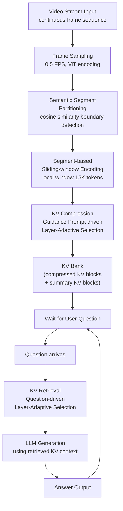
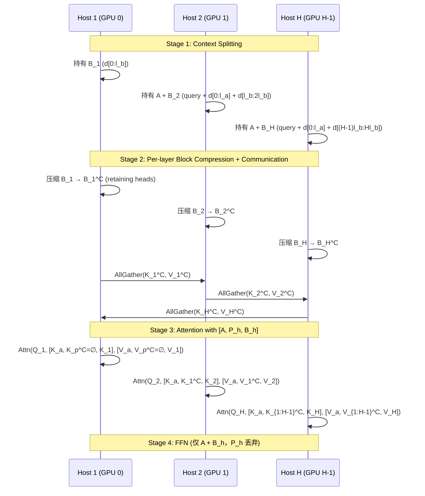
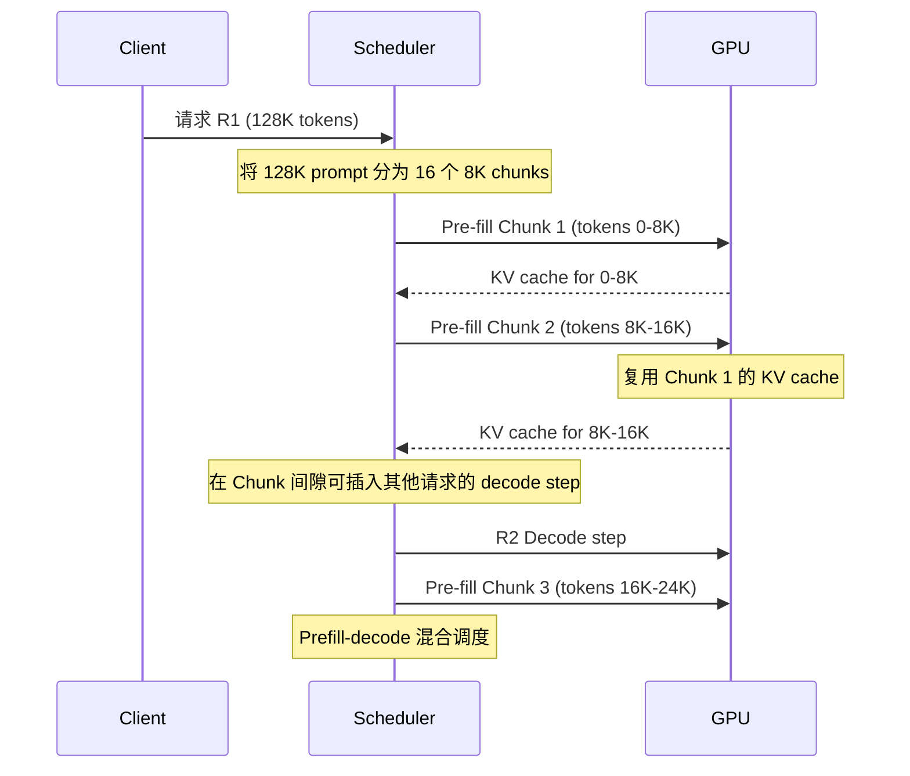
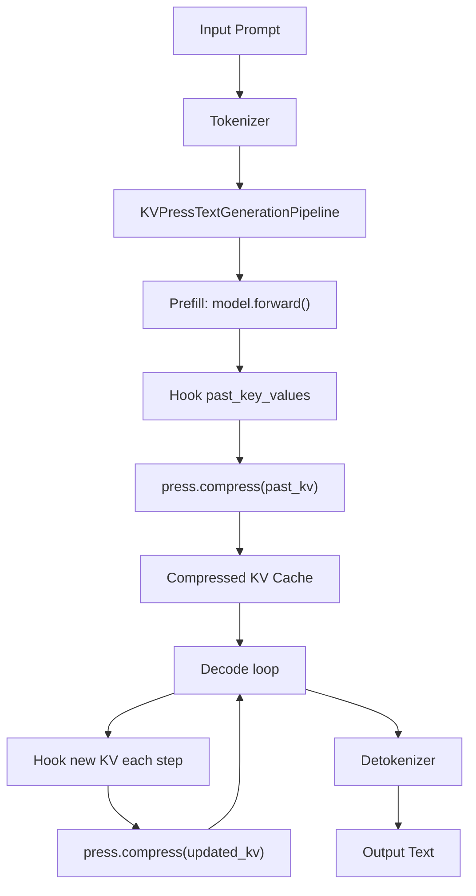
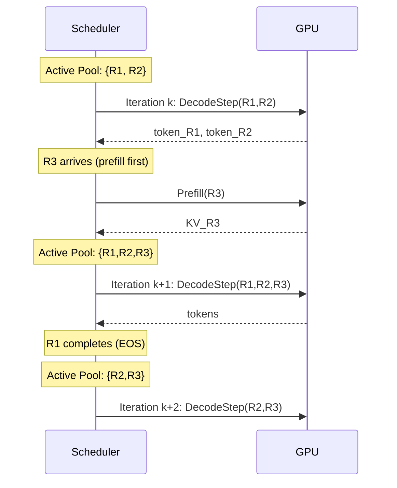

## Streaming Video Question Answering / Online Video-LLM（流式视频问答/在线视频大语言模型）

术语是什么？回答尽量完整，回答逻辑链中每一步都解释出来。

Streaming Video Question Answering (StreamingVQA) 是一种视频理解范式，要求 Video-LLM 持续处理实时视频流，并在任意时刻基于截至当前时间戳的所有历史视觉内容回答用户问题。与离线（offline）Video-LLM 一次性处理完整视频和所有问题不同，StreamingVQA 面临三个核心挑战：(1) 如何高效处理持续流入的视频帧（避免重复编码）；(2) 如何在保留历史视觉上下文与控制显存消耗之间取得平衡；(3) 如何在回答用户问题时快速准确地检索相关历史信息。Online Video-LLM 是支持 StreamingVQA 的模型范式，典型代表包括 VideoLLM-online（LIVE 框架）、Flash-VStream（memory-augmented 架构）、Dispider（解耦感知-决策-反应）、ReKV（KV cache 检索机制）和 StreamKV（语义分段+KV 压缩+检索）。

从系统架构角度拆解术语，比如术语如何在系统架构中发挥作用，给出术语在系统架构中运转流程的具体例子。

StreamingVQA 系统架构全流程（以 StreamKV 为例，NVIDIA H20 96GB，0.5 FPS，基座 LLaVA-OneVision-Qwen2-7B-OV）：



关键系统设计决策：
1. **增量式处理**：每段仅编码一次，压缩后存入 KV Bank，不会为每个问题重复编码历史视频。
2. **即时压缩**：段编码完成后立即压缩（非延迟压缩），确保 KV Bank 始终保持在目标显存预算内。
3. **显存-精度权衡**：压缩率 θ 从 0%（不压缩）到 90%（仅保留 10% KV），StreamKV 在 90% 压缩率下仍保持 56.7% Overall 准确率（vs 无压缩 ReKV 53.5%）。
4. **分离式位置编码**：Encoding 阶段 RoPE 仅应用于 local window（避免长序列远距离 attention 衰减）；QA 阶段基于 relative positions 应用 RoPE（将检索到的 KV blocks 视为连续序列）。

术语一般如何实现？如何使用？

实现方式：基座模型通常为 Video-LLM（如 LLaVA-OneVision），无需额外训练（training-free）。系统组件：(1) 视觉编码器（ViT）提取帧级特征；(2) 分段策略（语义/均匀）；(3) KV 编码模块（sliding-window attention）；(4) KV 压缩模块（可选）；(5) KV Bank 存储；(6) KV 检索模块；(7) LLM decoder 生成回答。评估基准：StreamingBench（18 个子任务，3 大类：Real-Time Visual Understanding、Omni-Source Understanding、Contextual Understanding）。硬件平台：NVIDIA H20/A100 GPU。适用场景：自动驾驶实时视频理解、具身智能（embodied AI）、AR 设备、监控视频分析、直播内容理解等需要持续处理视频流并响应查询的场景。限制：当前方法多基于 0.5 FPS 低帧率处理，实时性（如 30 FPS）仍需进一步优化；长视频（>1 小时）下即使压缩也可能面临 KV Bank 持续增长问题。

涉及论文标题：
- StreamKV: Streaming Video Question-Answering with Segment-based KV Cache Retrieval and Compression

## Sequence Parallelism (序列并行)

术语是什么？回答尽量完整，回答逻辑链中每一步都解释出来。

Sequence Parallelism (SP) 是一种将 Transformer 输入序列沿 token 维度切分到多个 GPU 的分布式并行策略。与 Tensor Parallelism（沿 model weight 维度切分）、Pipeline Parallelism（沿 layer 维度切分）和 Data Parallelism（沿 batch 维度切分）不同，SP 专门针对序列长度的扩展需求——当单 GPU 无法容纳长序列的 KV cache 或 attention 计算时，SP 将序列均分到多个 GPU 上并行处理。

两种主要 SP 范式：(1) RINGATTN-style：沿序列维度切分 + P2P ring 通信传递 K/V，每 GPU 计算 local Q 与所有 K/V 的 attention，经 H-1 轮完成全局 attention；(2) ULYSSES-style：沿序列维度切分 + All-to-All 通信在 sequence layout↔head layout 间转换，每 GPU 持有完整序列的部分 heads 进行独立 attention。

SP 的主要约束：(a) ULYSSES 受限于 attention head 数量（SP degree ≤ num_heads），GQA/MQA 模型需 KV cache replication；(b) RINGATTN 通信量随 SP degree 线性增长，跨节点场景下带宽成为瓶颈；(c) SP 的 scaling efficiency 是 sublinear 的（通信开销不可忽略）。

Sequence Parallelism 最初设计用于训练（长序列训练，减少 activation memory），近年来被改造用于推理（如 Shift Parallelism、APB 等）。

从系统架构角度拆解术语。

**SP 在长上下文推理中的运转流程（以 APB 为例）**：



**SP 与其他并行策略的对比**：

| 维度 | Sequence Parallelism | Tensor Parallelism | Pipeline Parallelism | Data Parallelism |
|------|---------------------|-------------------|---------------------|-----------------|
| 切分维度 | Sequence length (N) | Model weights (d) | Layers (L) | Batch size (B) |
| KV Cache | 每 GPU 持有 N/H | 每 GPU 持有完整 N | 每 GPU 持有 N | 每 GPU 持有完整 N |
| 通信 | All-to-All 或 P2P ring | AllReduce | P2P (send/recv) | AllReduce (gradients) |
| 适用场景 | 长序列 (>32K) | 大模型 (>10B) | 超深模型 | 大批量 |
| 推理适用性 | 高（prefill 加速） | 中（latency 敏感） | 低（latency 大） | 低（无 KV cache 共享） |

**APB 对 SP 的改进**：
传统 SP 保持 FULLATTN 计算语义不变（RINGATTN, ULYSSES），计算量未减少。APB 在 SP 基础上引入 approximate attention：通过局部 KV cache 压缩 + passing block 传递，在保持分布式加速的同时减少每个 host 的计算量（attention 从 O((n/H)^2) 降低至 O((n/H + (H-1)l_p)^2)）。

术语一般如何实现？如何使用？

SP 在 PyTorch 中通过 `torch.distributed` 和 NCCL backend 实现。在 DeepSpeed 中通过 `sequence_parallel_size` 配置。在 Shift Parallelism 中，通过 `--ulysses-sequence-parallel-size SP` 指定。APB 在 HuggingFace Transformers 基础上添加了自定义 SP-aware attention layer。开源：https://github.com/microsoft/DeepSpeed (Ulysses), https://github.com/thunlp/APB (APB SP)。

涉及论文标题：
- APB: Accelerating Distributed Long-Context Inference by Passing Compressed Context Blocks across GPUs
- Cache Me If You Can: How Many KVs Do You Need for Effective Long-Context LMs
- LASP-2: Rethinking Sequence Parallelism for Linear Attention and Its Hybrid

---

## Ring Attention

术语是什么？回答尽量完整，回答逻辑链中每一步都解释出来。

Ring Attention 是一种针对标准 softmax attention 的序列并行方法，通过 ring-style P2P 通信在设备间传递 KV blocks，使每个设备都能计算其 local Q 与全局 KV 的完整 attention。其核心思路：将序列沿 sequence 维度切分到 W 个设备，设备 i 持有 Q_i, K_i, V_i。在 forward 的 W-1 轮中，每轮设备 i 向其下一个邻居发送 K_i 和 V_i，同时从上一个邻居接收 K_{i-1} 和 V_{i-1}，用接收到的 KV 计算跨设备 attention。经过 W-1 轮后，所有设备都获得了完整上下文的 attention 输出。

Ring Attention 的通信步骤如下：Send(K_i, V_i) → rank (i+1), Recv(K_{i-1}, V_{i-1}) ← rank (i-1)，重复 W-1 次。共 2(W-1) 个通信步骤（单向 P2P）。通信量约 O(Nd)，随序列长度线性增长。

对于线性注意力（Linear Attention），Ring Attention 仍使用 ring-style 传递 KV blocks 进行左乘 attention 计算（外积 K^T V 物化为临时矩阵），未利用线性注意力的 right-product kernel trick 降低通信量。

从系统架构角度拆解术语。

**Ring Attention 在分布式训练中的运转流程**：

```
// W 个设备，序列长度 N，每设备持有 N/W 个 token
// 设备 i 初始化：Q_i, K_i, V_i = X_i @ W_Q, X_i @ W_K, X_i @ W_V

send_buf = (K_i, V_i)
for step = 1 to W-1:
    // 异步发送给下一个邻居，同时从上一个邻居接收
    recv_buf = Recv(from rank (i-1))
    Send(send_buf, to rank (i+1))
    Wait for Recv
    (K_recv, V_recv) = recv_buf
    // 用接收到的 KV 计算跨设备 attention
    O_i += Softmax(Q_i @ K_recv^T) @ V_recv
    send_buf = recv_buf       // 传递给下一轮
```

术语一般如何实现？如何使用？

Ring Attention 通过 NCCL 的 P2P send/recv 原语或 `torch.distributed.send/recv` 实现。Megatron-LM 和 DeepSpeed Ulysses 等框架集成了 Ring Attention。在实际部署中，通信可与计算 overlap（发送当前 KV block 的同时计算已接收 KV block 的 attention）。

**Star Attention 中的 Ring Attention 角色**：Star Attention 将 Ring Attention 作为主要分布式 baseline 进行对比。关键差异：Ring Attention 的 KV cache 需在 H 个 hosts 间循环传递 H 次（每层每步），导致 prefill 和 decode 阶段通信量均为 O(L·d) per layer。Star Attention 的阶段一 zero communication（embarrassingly parallel blockwise encoding），阶段二仅传递 O(d) per token，使长序列推理获得数量级加速。

涉及论文标题：
- LASP-2: Rethinking Sequence Parallelism for Linear Attention and Its Hybrid
- Star_Attention__Efficient_LLM_Inference_over_Long_Sequences

---

## Context Parallelism (CP)

术语是什么？回答尽量完整，回答逻辑链中每一步都解释出来。

Context Parallelism (CP) 是 Megatron-LM 中针对标准 softmax attention 的序列并行技术。CP 将网络输入沿 sequence 维度切分到多个设备，各设备独立计算 Q_t, K_t, V_t，然后通过通信同步完整 K/V 以完成全局 attention 计算。传统 Megatron-LM CP 使用 ring-style 通信重叠（与 Ring Attention 类似），但 LASP-2H 和 Llama3 实践采用 AllGather-based CP：将各设备的 K_t 和 V_t 通过 AllGather 汇聚到所有设备，然后各设备本地计算 Softmax(Q_t @ K^T / sqrt(d)) @ V。

AllGather-based CP 的优势：(1) 通信实现更简单——单次 AllGather vs 多次 P2P ring 传递；(2) 灵活处理各种 attention mask（如文档级 mask）；(3) GQA 下 K_t、V_t tensor 远小于 Q_t，AllGather 通信量可控。

从系统架构角度拆解术语。

**AllGather-based CP 运转流程**：

```
// W 个设备，序列切分为 [X_t]_1^T，T = W
// 并行计算
for t in 1..T in parallel:
    Q_t, K_t, V_t = X_t @ W_Q, X_t @ W_K, X_t @ W_V

// 通信：AllGather K, V
[K_1, ..., K_T] = AllGather([K_1, ..., K_T])  // 每设备获得完整 K
[V_1, ..., V_T] = AllGather([V_1, ..., V_T])

// 本地拼接 + 计算
K = Concat([K_1, ..., K_T])  // [N, d]
V = Concat([V_1, ..., V_T])
O_t = Softmax(Q_t @ K^T / sqrt(d)) @ V  // local Q 对 global K/V
```

术语一般如何实现？如何使用？

CP 在 Megatron-Core 中通过 `context_parallel_size` 参数配置。AllGather-based CP 在 Llama3 训练中被采用作为最佳实践（Dubey et al., 2024）。LASP-2H 将其与 linear attention SP 统一为相同的 AllGather 通信范式。

涉及论文标题：
- LASP-2: Rethinking Sequence Parallelism for Linear Attention and Its Hybrid

---

## Chunked Pre-filling (分块预填充)

术语是什么？回答尽量完整，回答逻辑链中每一步都解释出来。

Chunked Pre-filling 是将长输入序列分割为多个 chunk 并分多个 forward pass 处理的技术。在标准 pre-fill 中，整个输入序列在一次 forward pass 中处理——这导致长序列下的极高 peak GPU memory（需同时存储所有 hidden states 和中间激活）以及 GPU 计算时间过长。Chunked pre-filling 将序列分为若干固定大小的 chunk 依次处理，每次 forward 仅处理一个 chunk，显著降低 peak memory 并支持 prefill-decode 混合调度。SGLang 默认使用 8192 token pre-fill chunks。

DuoAttention（Xiao et al., 2025）进一步在 chunked pre-filling 中为 streaming heads 实现了 linear time + constant memory 的 pre-filling：每个 chunk 后 streaming heads 的 KV cache 立即 prune 仅保留 sink+recent tokens，下一 chunk 仅需 attend 到 O(K) 而非 O(L) tokens，pre-filling 复杂度从 O(L²) 降至 O(LK)，memory 从 O(L) 降至 O(K)。

从系统架构角度拆解术语。

**Chunked Pre-filling 调度流程**：


**Chunked vs Single-pass Pre-filling 对比**：

| 维度 | Single-pass Pre-fill | Chunked Pre-fill |
|------|---------------------|------------------|
| Peak memory | 高（所有 KV + hidden states 同时存在） | 低（每次仅 chunk 大小） |
| Pre-fill latency | 低（一次 forward） | 高（多次 forward） |
| KV Footprint（无 eviction） | 同 | 略高（KV 在 chunk 间保留） |
| 调度灵活性 | 低（独占 GPU） | 高（prefill-decode 混合） |
| 对 KV eviction 影响 | post-fill eviction 无问题 | 需 chunked eviction |

术语一般如何实现？如何使用？

SGLang（https://github.com/sgl-project/sglang）默认 chunked pre-filling（chunk=8192）。vLLM 同样支持 chunked pre-filling。实现：在模型 forward 时循环处理 chunk，每次 forward 仅计算一个 chunk 的 attention（使用完整 KV cache），然后只保留该 chunk 产生的 KV。PruLong 论文评估了 8K 和 32K 两种 chunk size：8K chunks 在 KV Footprint 上更优（evict 更频繁），但 32K chunks 在性能保持上更稳健（注意力模式更完整）。对 streaming attention heads（固定 KV cache），chunk size 不影响 memory。

涉及论文标题：
- DuoAttention: Efficient Long-Context LLM Inference with Retrieval and Streaming Heads
- Cache Me If You Can: How Many KVs Do You Need for Effective Long-Context LMs
- LOCRET: Enhancing Eviction in Long-Context LLM Inference with Trained Retaining Heads on Consumer-Grade Devices
- Rectified Sparse Attention

注：LOCRET 将 chunked prefill 与 KV cache eviction 深度整合——在每个 chunk forward pass 中，retaining head 预测 CIS 分数，chunk 处理后立即执行 TopK eviction 以维持固定 cache budget。关键设计包括：(a) Stabilizers——每个 chunk 最后 n_s 个 token 的 CIS 强制为 +∞，确保局部连续上下文；(b) 保留 pre-RoPE KV cache 并从起始位置重新分配连续 position embedding；(c) chunk 内 forward 使用 FlashAttention，retaining head 作为附加输出不增加显著延迟。Hyperparameters 见 LOCRET Table 4。推理速度：Phi-3-mini-128K 在 NVIDIA 4090 上 128K R.PassKey 达 5080 tok/s。

## Online KV Cache Compression (在线KV Cache压缩)

术语是什么？回答尽量完整，回答逻辑链中每一步都解释出来。

Online KV Cache Compression 是 Dynamic-LLaVA 在 decoding with KV cache 模式下实现的、基于当前 token 特征逐 token 决策是否将 KV activations 加入 cache 的方法。与传统 KV cache 压缩方法（如 H2O）的根本区别：H2O 从历史 KV cache 中基于 attention scores 淘汰旧 token，是"回顾性"压缩；Dynamic-LLaVA 对每个新生成的 token 通过 output predictor 做"是否保留"决策，决定其 KV 是否写入 cache，是"前瞻性"在线压缩。核心优势：不需要访问历史 KV cache 内容（无需额外 attention 计算），仅依赖当前 token 的 embedding 特征，因此额外开销极小（<1%）。

从系统架构角度拆解术语，比如术语如何在系统架构中发挥作用，给出术语在系统架构中运转流程的具体例子。

**Dynamic-LLaVA 在线 KV Cache 压缩流程（batch=8, 1×A100 80G）**：

```
// Mini-batch KV cache 集合
KV_batch = {{S_l^{K(b)}, S_l^{V(b)}} | b=1..B}

for each decoding step t:
    for each batch b in 1..B:
        // Step 1: 当前 token 的 embedding → predictor 决策
        token_emb = S_{l,N^{OT}}^{OT(b)}              // [d]
        D_b = P^{OT}(token_emb)                        // [2]
        M_b = argmax(D_b)                              // 0 或 1

        // Step 2: 标准 attention（始终包含当前 token）
        Q_b, K_new, V_new = W^{Q,K,V} · token_emb
        O_b = Attention(Q_b, S_l^{K(b)} ∪ K_new, S_l^{V(b)} ∪ V_new)

        // Step 3: 在线决策——是否持久化 KV
        if M_b == 1:
            S_l^{K(b)} ∪= K_new, S_l^{V(b)} ∪= V_new  // 保留
        else:
            // 不加入 KV cache（但仍参与当前 attention）
            // 后续层的 KV cache 大小相应减少

    // Batch-parallel: LeftPadding + TopkArgmax
    // padded_KV: [B, max_len, d] → 批量 Attention
```

术语一般如何实现？如何使用？

与 H2O 的对比：H2O 在每次 decoding 时计算当前 Q 与所有历史 KV 的 attention scores → 淘汰 score 最低的历史 token → 需要显式 attention scores（与 FlashAttention 等隐式计算 operator 不兼容）→ 额外开销大。Dynamic-LLaVA 的 output predictor 仅需当前 token 特征 → 与 FlashAttention 完全兼容 → 额外开销 <1%。

在 MLLM 场景下，H2O 的 attention-score-based 淘汰策略在混合模态（vision+language）下严重退化（SciQA -16.3%, MMBench 仅 1.4），因为 vision token 和 language token 的 attention 模式差异大。Dynamic-LLaVA 通过端到端训练学习模态感知的保留策略，MLLM 场景下 PPL=4.90 vs H2O 78.95。

涉及论文标题：
- Dynamic-LLaVA: Efficient Multimodal Large Language Models via Dynamic Vision-language Context Sparsification

## KV Cache Offloading with Sparse Top-k Retrieval (基于稀疏Top-k检索的KV Cache卸载)

术语是什么？回答尽量完整，回答逻辑链中每一步都解释出来。

KV Cache Offloading with Sparse Top-k Retrieval 是一种将完整 KV cache 存储在 CPU 内存中、每次 decoding step 仅将当前 query 最相关的 k 个 KV pair 传输到 GPU 的系统架构策略。与传统的 KV cache offloading（如 FlexGen）有本质区别：(1) 传统 offloading 每 step 将全部层的完整 KV cache 在 CPU↔GPU 间往返搬运（单层 1.6GB × L=32 ≈ 51GB for 8B model @ 100K context），数据搬运本身成为瓶颈；(2) Sparse Top-k Retrieval 利用 attention 的天然稀疏性，仅传输 k 个 value 向量（k ≪ N），数据搬运量从 O(N·D·L) 降至 O(k·D·L)，在 k=2% of N 时降低 50×。

从系统架构角度拆解术语，比如术语如何在系统架构中发挥作用，给出术语在系统架构中运转流程的具体例子。

**Top-k KV Cache Offloading 系统架构流程（Llama-3-8B, 1M context, 16GB commodity GPU）**：

```
┌──────────────────────────────────────────────────────────┐
│                    CPU (Host Memory)                      │
│  ┌─────────────────────────────────────────────────┐     │
│  │  Complete KV Cache: {K_ℓ, V_ℓ} for ℓ=1..32      │     │
│  │  Size: ~520 GB (BF16, 1M tokens, L=32, D=4096) │     │
│  └─────────────────────────────────────────────────┘     │
│  ┌─────────────────────────────────────────────────┐     │
│  │  Faiss ANN Indexes (per head, per layer)         │     │
│  │  - IndexFlatIP(d_k): exact inner product search  │     │
│  │  - Each query → top-k key indices + scores       │     │
│  └─────────────────────────────────────────────────┘     │
│                          │                               │
│         PCIe: only k×D values transferred                │
│         (vs full cache: N×D in traditional offloading)   │
│                          │                               │
└──────────────────────────┼───────────────────────────────┘
                           │
┌──────────────────────────┼───────────────────────────────┐
│              GPU (~16GB VRAM)                             │
│  ┌─────────────────────────────────────────────────┐     │
│  │  Model Weights (e.g., Llama-3-8B: ~16 GB)       │     │
│  └─────────────────────────────────────────────────┘     │
│  ┌─────────────────────────────────────────────────┐     │
│  │  GPU-side Window Cache (recent generated tokens) │     │
│  │  K_gen, V_gen: O(window_size) ~ constant        │     │
│  └─────────────────────────────────────────────────┘     │
│  ┌─────────────────────────────────────────────────┐     │
│  │  QKV Projection (cuBLAS matmul)                  │     │
│  │       ↓                                           │     │
│  │  q → CPU for ANN search                          │     │
│  │  V_sel[I], vals ← from CPU (k elements)          │     │
│  │       ↓                                           │     │
│  │  attention_out = softmax(vals/sqrt(d)) @ V_sel   │     │
│  │  + softmax(q@K_gen^T/sqrt(d)) @ V_gen            │     │
│  └─────────────────────────────────────────────────┘     │
└──────────────────────────────────────────────────────────┘
```

**与传统 KV Cache Offloading (FlexGen) 的对比**：

| 方面 | FlexGen | Top-k Sparse Offloading |
|------|---------|------------------------|
| 数据搬运量 | O(N·D·L) per step | O(k·D·L) per step |
| CPU-GPU 带宽瓶颈 | 严重（51GB×数百 step） | 大幅缓解（k=128 时 ~1-2MB） |
| CPU 计算 | 无/少量（仅做地址管理） | Faiss ANN search (O(log N) with HNSW) |
| GPU 显存 | 仅少量 KV cache 驻留 | 仅 window cache + model weights |
| Context 上限 | ~100K (带宽限) | 1M+ (CPU 内存限) |
| Attention 完整性 | 完整（但有搬运成本） | 近似（top-k sparse） |

术语一般如何实现？如何使用？

实现：(1) Prefill 阶段：在高算力 GPU (H100) 上使用 FlashAttention 一次性构建完整 KV cache 并存至 CPU memory；(2) Index 构建：使用 Faiss IndexFlatIP 或 IndexHNSWFlat 对每层每 head 的 key tensors 构建 ANN index；(3) Decoding 阶段：每 step 对每层执行 q→CPU ANN search→V[I] 搬回 GPU→attention 计算→合并 GPU 本地 window cache attention；(4) k 值选择：基于任务类型和 attention entropy 分析动态调整（NIAH 仅需 k=1，Word Counting 需 ~9% of context）。

适用场景：(a) "Rent cloud for prefill once, decode locally many times"——用户租用 H100 完成一次性 prefill，在本地 16GB GPU 上执行多次 query；(b) 文档分析场景——大量文档作为固定 context，用户反复提问；(c) 代码库 QA——大型代码库作为 context，开发者多次查询。不适用于 context 频繁变化或 streaming 输入场景（每次 context 更新需重新 prefill）。

**MOM-style Static KV Cache Offloading (Prefill-offload, Decode-reload)**：

MOM 采用更简单的 offloading 策略：prefill 阶段每层 attention 计算完后立即将 KV cache offload 到 CPU，全部 prefill 完成后 decode 阶段开始前将所有层 KV cache 统一 reload 回 GPU。与 FlexGen 的 quadratically-scheduled offloading 不同，MOM 的 offloading 不追求在 decode 中反复搬运，而是利用 Mini-sequence 大幅降低 MLP 中间激活后，offloading 进一步释放 KV cache 占用的 GPU 内存来容纳更长序列。因为 decode 阶段 KV cache 已全部回 GPU，decode 速度几乎不受影响（数据仅在 prefill→decode 转换时搬运一次）。

```
// MOM KV Cache Offloading 流程
// Prefill stage:
for layer in 1..L:
    A = Attention(X, causal_mask)
    KV_cache[layer] ← update(A)       // 存储 KV cache
    offload_to_CPU(KV_cache[layer])    // 立即 offload to CPU
    X = MiniSequence_MLP(A)            // Mini-sequence 处理（仅 MLP）

// Decode stage:
reload_all_KV_to_GPU()                 // 一次性全量 reload
for step in 1..max_new_tokens:         // 标准 autoregressive decode
    token = decode_step(KV_cache_on_GPU)
```

MOM 的 offloading 与 Mini-sequence 的协同效应：Mini-sequence 将 prefill 峰值内存从 O(S×I) 降至 O((S/M)×I)，此时 KV cache（O(S×d×L)）成为剩余内存中的最大占用者。Offloading KV cache 在 prefill 阶段到 CPU 能进一步释放 GPU 内存，使最大 context 从 155K 扩展到 455K（~3×）。Offloading alone（不加 Mini-sequence）收益有限，因为 MLP 中间激活仍是瓶颈。

涉及论文标题：
- Exploiting Sparsity for Long Context Inference: Million Token Contexts on Commodity GPUs
- GTA__Grouped-head_latenT_Attention
- HATA__Trainable_and_Hardware-Efficient_Hash-Aware_Top-k_Attention_for_Scalable_Large_Model_Inference
- InfiniteHiP: Extending Language Model Context Up to 3 Million Tokens on a Single GPU (UVM-based KV cache offloading with LRU eviction on GPU key bank; offloaded attention made graph-capturable to avoid CPU launch overhead; 3M tokens on L40S 48GB; maintains two separate GPU key banks for mask-selection and BSA processes)
- MOM: Memory-Efficient Offloaded Mini-Sequence Inference for Long Context Language Models
- TailorKV: A Hybrid Framework for Long-Context Inference via Tailored KV Cache Optimization (per-layer 分类：quantization-friendly 浅层保留 GPU 量化 KV，sparsity-friendly 深层 CPU offload + critical-channel 驱动的 Top-K 动态检索；仅 1-3% token 需 PCIe 传输；double buffering 重叠 communication 和 computation)

HATA-off是HATA的KVCache offloading扩展变体：使用PCIe 4.0 + 48 CPU threads，将KV cache存储在CPU memory，通过hash-based top-k retrieval仅传输选中的K/V到GPU。相比MagicPIG（LSH-based offloading），HATA-off通过128-bit learned hash codes替代MagicPIG的1500-bit LSH，在Llama2 (36K context)上实现prefill 6.04×、decode 2.54×加速，在Llama3.1 (72K context)上实现prefill 1.32×、decode 2.63×加速。核心优势：消除MagicPIG昂贵的LSH hashing开销，结合GPU优化的attention kernel和KV prefetching。

---

## LLM-Viewer

术语是什么？回答尽量完整，回答逻辑链中每一步都解释出来。

LLM-Viewer 是一个 LLM 推理性能分析工具，由 Zhihang Yuan 等人在 2024 年的论文 *LLM Inference Unveiled: Survey and Roofline Model Insights* (arXiv:2402.16363) 中提出。它基于 **roofline model** 方法，根据硬件规格（计算吞吐量、内存带宽）和模型配置（层数、hidden dimension、head 数、序列长度等）来模拟/预估 transformer 模型在不同硬件上的最优推理性能（预填充时延和解码时延），而无需实际部署运行。

其核心原理是：将 transformer 推理分解为一系列线性代数运算（矩阵乘法、attention、softmax、LayerNorm 等），对每个操作判断其是 compute-bound 还是 memory-bound（通过 operational intensity vs roofline 比值），然后计算在理想条件下的执行时间。对 attention 算子，分别计算 QK^T 的 compute-bound 部分和 softmax/attention output 的 memory-bound 部分。

LLM-Viewer 的输入包括：(a) 硬件规格：GPU 的峰值 FLOPS（如 H100 FP16: 989 TFLOPS）、内存带宽（如 H100 HBM: 3.35 TB/s）、SRAM 大小；(b) 模型配置：层数、hidden dim、FFN dim、head 数、head dim、vocab size；(c) 推理配置：序列长度、batch size、precision。

从系统架构角度拆解，给出 LLM-Viewer 运转流程的具体例子。

**LLM-Viewer 分析流程（以评估 GTA-1B vs GQA-1B 预填充时延为例）：**

```
输入:
  - Hardware: NVIDIA H100 80GB (989 TFLOPS FP16, 3.35 TB/s HBM bandwidth)
  - GTA-1B: 54 layers, H=1280, n_h=20, n_q=5, n_k=1, n_c=1, d_h=64, d_l=128
  - GQA-1B: 54 layers, H=1280, n_h=20, n_k=5, d_h=64
  - Seq len N=2048, batch=1

Step 1: 每层 prefill 操作分解
  GTA-1B per layer:
    - QKV Projection: Q=XW_Q (N×H × H×320), K=XW_K (N×H × H×64), C=XW_C (N×H × H×128)
    - Attention: S_g = Q_g @ K^T (5 groups × N×d_h × d_h×N),
      A_g = softmax(S_g) (5 × N×N),
      O_latent = A_g @ C (5 × N×N × N×d_l),
      Gate: sigmoid(x_t @ W_G) (N×H × H×64 × 20 heads)
    - Output project: O_i @ W_O (20 × N×64 × 64×H)

Step 2: 判断每个操作的计算强度（Operational Intensity = FLOPs / Bytes）
    - Matmul Q=XW_Q: O(N×H×320) FLOPs / O(H×320 + N×H) Bytes → Compute-bound (>roofline)
    - Attention QK^T: O(n_q × N×d_h×N) FLOPs / O(n_q×N×d_h + n_k×N×d_h) Bytes → typically Compute-bound
    - Softmax: O(n_q × N×N) FLOPs / O(n_q×N×N) Bytes → Memory-bound (<roofline)
    - Attention Output A_g@C: O(n_q × N×N×d_l) FLOPs / O(n_q×N×N + n_c×N×d_l) Bytes → Compute-bound

Step 3: 为 compute-bound ops 分配 FCC (FLOPS ceiling) 执行时间
      为 memory-bound ops 分配 bandwidth ceiling 执行时间
      Total time = sum(max(FLOPs/peak_FLOPS, Bytes/peak_BW) × utilization_factor)

Step 4: Output
    GTA-1B prefill @ 2048: ~50ms
    GQA-1B prefill @ 2048: ~100ms
    → GTA-1B 约 2× prefill 加速
```

术语一般如何实现？如何使用？

LLM-Viewer 开源工具的使用方式：

1. **配置输入**：在 YAML/JSON 中定义硬件规格和模型配置。硬件规格可从厂商 spec sheet 获取（NVIDIA whitepaper、Apple M2 文档等）；模型配置从模型 card 或训练配置获取。

2. **运行模拟**：工具自动将模型分解为逐层逐操作序列，应用 roofline model 计算每操作的 ideal time。支持 prefill 和 decode 两阶段的分离分析。

3. **输出**：预填充时延 vs 序列长度曲线、解码时延 vs 缓存长度曲线、各操作的 bound 类型标注。

4. **局限性**：(a) 仅给出理想条件下的性能上界（assumes perfect kernel implementation, no overhead from framework/Python）；(b) 不考虑 kernel launch overhead、PCIe 传输等系统级开销；(c) 不能替代实际推理测量。GTA 论文同时使用 LLM-Viewer 和 transformers 实际推理来提供互补证据。

5. **在 GTA 论文中的使用场景**：补充实际 transformers 推理结果，在更多硬件（A100 40GB/80GB、H100 PCIe）上预估 GTA 和 GQA 的性能差异，验证 roofline model 预测的效率增益与实际测量趋势一致。

涉及论文标题：
- GTA__Grouped-head_latenT_Attention

## KV Cache Duplication in Tensor Parallelism (TP中KV Cache的设备间复制问题)

术语是什么？回答尽量完整，回答逻辑链中每一步都解释出来。

KV Cache Duplication in Tensor Parallelism 是指在 Tensor Parallelism (TP) 分布式推理中，某些 attention 变体的 KV cache 结构导致每设备必须持有完整或部分复制的 KV cache，从而削弱了 TP 本应带来的 per-device 内存节省。

该问题的根本原因在于 TP 的切分方式与 attention head 结构的交互。TP 通常沿 attention head 维度切分 Q/K/V 投影权重和 up-projection 矩阵（列并行），每个 TP rank 负责部分 head 的计算。对于 GQA/MHA：每 rank 持有其负责的 KV head 的 cache，总 cache 随 TP degree 线性缩减。对于 MLA：由于 K/V 不是直接缓存而是从 latent c^{KV} 解压，而 up-projection 矩阵的列并行切分要求每 rank 都能访问完整 latent 以重建其负责的 head 的 K/V——因此 latent 必须在**所有 TP rank 上复制**。

MLA 的 TP=2 时每 device KV cache = 4d_h（与 unsharded 相同），TP=4 时仍为 4d_h——TP 完全无法减少 MLA 的 per-device KV cache。这是 MLA 设计的核心可扩展性缺陷。

从系统架构角度拆解术语。

**MLA vs GLA 的 TP 行为对比（h_q=16, d_h=128, d_c=4d_h=512 for MLA, h_c=2, d_c=2d_h=256 for GLA-2）：**

```
MLA (TP=2):
  Rank 0: 负责 head 0..7 → 需完整 c^{KV} (512 dims) 重建 K/V_0..7
  Rank 1: 负责 head 8..15 → 需完整 c^{KV} (512 dims) 重建 K/V_8..15
  Per-device: 512 dims/token × 2 bytes = 1024 bytes + d_R
  → TP 无节省，latent 被全复制

GLA-2 (TP=2):
  Rank 0: c_0^{KV} (256 dims), Q_0, W^{VO}_0 → 仅需 c_0^{KV}
  Rank 1: c_1^{KV} (256 dims), Q_1, W^{VO}_1 → 仅需 c_1^{KV}
  Per-device: 256 dims/token × 2 bytes = 512 bytes + d_R/2
  → TP=2 时 per-device cache 减半

MLA (TP=4): 仍 512 dims/device（latent 被 4× 复制）
GLA-4 (TP=4): 128 dims/device（每 rank 1 个 latent head）
```

**To mitigate MLA's duplication, prior systems fall back on hybrid TP+DP**——将 attention submodule 在不同 DP group 间复制，不同 batch 序列分配给不同 DP rank。但此方案引入严重的 straggler 问题：DP barrier 要求所有 rank 完成计算后同步，一个 DP rank 处理的长序列阻塞所有其他 rank。

术语一般如何实现？如何使用？

GLA 通过 multi-latent-head 设计从根本上解决此问题——latent head 沿 TP 分片而非复制。实现要点：(a) 每 latent head 有独立的 up-projection 矩阵，吸收进 Q/O 投影后直接对 latent 做 attention；(b) 每 rank 仅持有其 latent head + 对应 Q group + O projection slice；(c) 通过 AllReduce 聚合各 rank 的 partial output。

评估结果（DeepSeek-Coder-V2 236B, 8×H100）：MLA TP=2+DP=4 在 131K prefill 不均匀负载下 throughput 37 tok/s，GLA-8 TP=8 100 tok/s（+2.7×），pure TP 避免了 DP 的 straggler barrier。

涉及论文标题：
- Hardware-Efficient_Attention_for_Fast_Decoding

---

## Per-Head Per-Layer Paged KV Block

术语是什么？回答尽量完整，回答逻辑链中每一步都解释出来。

Per-Head Per-Layer Paged KV Block 是 KV-Compress 对 vLLM PagedAttention 的 block 布局重构。原 vLLM PagedAttention 中，每个物理 cache block 存储某个请求在所有 transformer layers × 所有 attention heads 上的 b 个连续 token 的 KVs（即一个 block 包含 l×H×b 个 key/value 向量）。所有 layer 和 head 共享同一套 block table 索引——通过一个 block index 即可定位某 token 在所有 layers 和 heads 上的 KVs。

KV-Compress 将 block 重构为 per-head per-layer 粒度：每个物理 block 仅存储单个 KV head 的 b 个 token 的 KVs（即一个 block 仅包含 b 个 d 维向量）。Block table 从 B × L_max/b 扩展为 B × l × H × L_max/b，每个 (layer, head) 对有独立的 block table。

物理 cache 从 l 个 per-layer tensor K^(m) ∈ R^{N×H×b×d} 改为单一 unified cache K_u ∈ R^{N×b×d}，物理块总数增加 l×H 倍。

该重构的核心动机是支持 variable-head-rate eviction：不同 head 可以有不同的 allocated block 数量（因为每个 head 独立分配/释放 blocks），被 evicted 的 blocks 可以直接释放物理内存而非仅增加碎片。

从系统架构角度拆解术语：

**Block Layout 变迁（以 Llama-3.1-8B 为例，l=32, H=8, b=16）**：

```
# Vanilla vLLM PagedAttention
physical K cache: K = [K^(0), K^(1), ..., K^(31)]  # 32 per-layer tensors
each K^(m): shape [N, 8, 16, d]  # N blocks, 8 heads, 16 tokens, d-dim
block table T: shape [B, L_max/16]  # 共享跨所有 layers 和 heads
# To get KVs for layer m, head h, sequence s, token position i:
block_n = T[s, i/16]
offset = i % 16
k = K^(m)[block_n, h, offset, :]  # all heads share block_n

# KV-Compress PagedAttention
unified K cache: K_u shape [N*total, 16, d]  # single unified tensor
# total = l*H = 32*8 = 256x more blocks
block table T: shape [B, 32, 8, L_max/16]  # per-layer per-head
# To get KVs for layer m, head h, sequence s, token position i:
block_n = T[s, m, h, i/16]
offset = i % 16
k = K_u[block_n, offset, :]  # per-head block lookup
```

**Variable-Head-Rate 内存释放在两种布局下的差异**：
```
# Vanilla layout: evict head h from layer m
# → block_n 仍被其他 heads 使用 → 无法释放 block
# 仅增加该 block 内该 head 位置的"空洞"

# KV-Compress layout: evict head h from layer m
# → 该 head 的所有 blocks 独立分配
# → 释放该 head 的 E blocks → block manager 回收物理内存
```

术语一般如何实现？如何使用？

实现涉及：(1) vLLM 的 block manager 修改——从 shared block index 改为 per-head per-layer block table；(2) physical cache 从 l 个 tensor 改为 single unified tensor；(3) PagedAttention kernel 需能通过 per-head block table 索引（而非统一的 shared index）。KV-Compress 在 vLLM v0.6.0 上实现（开源 https://github.com/IsaacRe/vllm-kvcompress）。

适用场景：需要 variable-head-rate KV eviction 的任何 paged-attention 框架。代价是 block table 大小增长 l×H 倍，以及 block 数量增加 l×H 倍——需配合 GPU 端 block 管理器以避免 CPU 调度瓶颈。

涉及论文标题：
- KV-Compress__Paged_KV-Cache_Compression_with_Variable_Compression_Rates_per_Attention_Head

---

## GPU On-Device Block Manager

术语是什么？回答尽量完整，回答逻辑链中每一步都解释出来。

GPU On-Device Block Manager 是 KV-Compress 提出的将 vLLM 的 KV cache block 管理（分配、释放、计数）从 CPU 端移至 GPU 端的优化。原 vLLM 的 block manager（scheduler 的一部分）在 CPU 上运行，每个 scheduling step 需遍历所有 sequences 计算所需 blocks、查询 free block list、执行分配——这些操作用 Python/C++ loop 完成，runtime 随 block 数量线性增长。

KV-Compress 的 per-head per-layer block 布局使得 total block 数量为 l×H 倍（Llama-3.1-8B: 256 倍），若仍用 CPU 端调度，"scheduling loop 在部分情况下耗时超过 model forward pass"。GPU 端方案将所有 block 管理移至 device memory——block tables、context lengths、free/allocated tracking 均存储为 GPU tensors，利用 GPU 的 SIMT parallelism 并行完成所有 sequences 的 block 分配和释放。

从系统架构角度拆解术语：

**GPU Block Manager 运转流程**：
```
# 数据结构（均在 GPU device memory）
free_blocks: bool tensor [N]  # 1=free, 0=allocated
context_lengths: int tensor [B, l, H]  # per-sequence per-head token count
block_tables: int tensor [B, l, H, L_max/b]  # per-sequence per-head block indices

# Prefill 分配（parallel on GPU）
required_blocks = ceil(prompt_length / b)  # 标量，所有 head 相同
# GPU parallel prefix scan 找出 first required_blocks free blocks
alloc_indices = cumsum_prefix_scan(free_blocks)  # parallel on GPU
for each (s, m, h) in parallel:  # GPU threads
    T[s, m, h, :required_blocks] = alloc_indices[offset_s_m_h: ...]

# Decoding 分配（parallel on GPU）
for each (s, m, h) in parallel:
    if C[s, m, h] % b == 0:  # 需要新 block
        new_block = find_next_free(free_blocks)
        T[s, m, h, C[s, m, h] // b] = new_block
        C[s, m, h] += 1

# Preemption 释放（parallel on GPU）
for each preempted s:
    for each (m, h) in parallel:
        num_blocks_s_m_h = ceil(C[s, m, h] / b)
        free_blocks[T[s, m, h, :num_blocks_s_m_h]] = 1
```

术语一般如何实现？如何使用？

实现为 GPU kernel 或 PyTorch tensor 操作（cumsum, scatter, gather）。KV-Compress 在 vLLM v0.6.0 中实现。Block tables 和 context lengths 在每次 forward pass 前从 GPU block manager 直接传给 model runner（在 GPU 上，避免 CPU↔GPU 拷贝）。

适用场景：任何 block 数量极大的 paged-attention 系统（per-head per-layer、大 batch size、长 context）。代价是增加了 GPU memory 中 block manager metadata 的占用，但远小于 KV cache 本身。

涉及论文标题：
- KV-Compress__Paged_KV-Cache_Compression_with_Variable_Compression_Rates_per_Attention_Head

---

## DeepSpeed Stage 2 (ZeRO-2)

术语是什么？回答尽量完整，回答逻辑链中每一步都解释出来。

DeepSpeed Stage 2 (ZeRO-2) 是 Microsoft DeepSpeed 框架的分布式训练优化级别，通过分片优化器状态和梯度来减少每个 GPU 显存占用。与 ZeRO-1 仅分片优化器状态（fp32 master params + momentum + variance = 12 bytes/param）不同，ZeRO-2 额外分片梯度（2 bytes/param in fp16），将梯度通信从 AllReduce 变为 Reduce-Scatter。ZeRO-2 不复制权重参数，前向后向仍需 AllGather 收集完整参数。通常可实现 8× 以上显存节省（8 GPU），使 7B-70B 模型可在适度 GPU 集群上训练。

从系统架构角度拆解术语。

KV-Distill 在 8× NVIDIA A100 80GB 集群上使用 DeepSpeed Stage 2 训练。由于仅训练 150M LoRA 参数（base model frozen），ZeRO-2 主要优化 optimizer states 和 gradients 的显存分配。训练配置：bf16、AdamW、batch 32。LLAMA-2/3 7B-8B、MISTRAL 7B、GEMMA-2 9B 3 天收敛，GEMMA-2 27B 4 天。

术语一般如何实现？如何使用？

配置文件：`{"zero_optimization": {"stage": 2}}`，`deepspeed.initialize()` 包装模型和优化器，或 HuggingFace `--deepspeed ds_config.json`。ZeRO-2 在 backward() 后 hook 梯度流做 Reduce-Scatter。

涉及论文标题：
- KV-Distill: Nearly Lossless Learnable Context Compression for LLMs

---

## KVPress (NVIDIA KV Cache Compression Framework)

术语是什么？回答尽量完整，回答逻辑链中每一步都解释出来。

KVPress 是 NVIDIA 开源的 KV Cache 压缩框架（https://github.com/NVIDIA/kvpress），提供标准化的 pipeline 接口，使各种 KV cache 压缩策略可以即插即用地集成到 HuggingFace Transformers 推理流程中。核心理念："KV cache compression made easy"——将压缩逻辑抽象为独立的 `press` 对象，通过 `KVPressTextGenerationPipeline` 在 `generate()` 调用期间自动 hook 每层的 `past_key_values` 应用压缩，无需修改模型代码。支持 question-agnostic 模式（压缩时不附加 query 信息），避免 attention-based 方法中的 instruction dependence bias。

从系统架构角度拆解术语，比如术语如何在系统架构中发挥作用，给出术语在系统架构中运转流程的具体例子。

**KVPress 在推理 pipeline 中的作用流程**：



```
# KVPress 使用示例（基于 LagKV 论文推断）
from kvpress import KVPressTextGenerationPipeline
from transformers import AutoModelForCausalLM, AutoTokenizer

model = AutoModelForCausalLM.from_pretrained("meta-llama/Llama-3.1-8B-Instruct")
tokenizer = AutoTokenizer.from_pretrained("meta-llama/Llama-3.1-8B-Instruct")

# 创建压缩 pipeline，传入自定义 press 策略
pipeline = KVPressTextGenerationPipeline(
    model=model, tokenizer=tokenizer,
    press=LagKVPress(lag_size=128, retention_ratio=0.5, sink_size=16)
)

# 标准 HuggingFace generate 接口，KV cache 自动压缩
output = pipeline("Long document text...", max_new_tokens=256)
```

**KVPress 支持 question-agnostic 模式**：通过在 prefill 时将 question 设为 None，避免 query 参与压缩阶段的 KV 重要性评分。在 LagKV 论文中，所有评估都使用此模式以确保公平比较（避免 SnapKV 等方法的 instruction dependence 优势）。

术语一般如何实现？如何使用？

KVPress 已集成 SnapKV、StreamingLLM 等主流方法的适配版本。用户在 KVPress 框架中实现新压缩策略时，只需继承 `BasePress` 类并重写 `compress(past_key_values)` 方法。LagKV 论文即通过 KVPress 的 `GreedyPress` 基类实现其递归分区压缩逻辑，并在 RULER 16K benchmark 上完成所有对比实验。框架与 HuggingFace Transformers `generate()` 完全兼容，支持 batch inference 和 `cache_position` 管理。开源地址：https://github.com/NVIDIA/kvpress。

涉及论文标题：
- LagKV: Lag-Relative Information of the KV Cache Tells Which Tokens Are Important

## MLC-LLM for Speculative Decoding（MLC-LLM 投机解码推理）

术语是什么？回答尽量完整，回答逻辑链中每一步都解释出来。通过联网搜索让回答具体和精准。

MLC-LLM（https://github.com/mlc-ai/mlc-llm）是一个通用的 LLM 推理和部署框架，支持多种硬件后端（CUDA、ROCm、Metal、Vulkan、WebGPU）和模型架构。其核心特色是基于 Apache TVM 的编译优化——通过机器学习编译技术将模型自动编译为针对目标硬件的优化代码。

在 MagicDec 论文中，MLC-LLM 被用作为 speculative decoding 的第二个 serving backend（与 self-implemented GPT-Fast backend 对比），用于验证 SD 方法的跨框架泛化性。MLC-LLM backend 实现了 SnapKV-based self-speculation，结果（Table 5）显示其 speedup 低于 self-implemented backend（主要因为 draft 和 verify 开销测量方式不同——MLC-LLM 的 verification time 包含一步 draft decode time），但 speedup 随 batch size 增大的 trend 一致。

从系统架构角度拆解术语，比如术语如何在系统架构中发挥作用，给出术语在系统架构中运转流程的具体例子。

```
# MLC-LLM + MagicDec SD 的推理流程
输入: 128 个 32K-token prompts
↓
[1] Model Compilation（Apache TVM）
    - 将 LLaMA-3.1-8B 编译为 TVM IR
    - 应用算子融合、内存规划、tensorization（tuning）
    - 生成 CUDA kernel 代码
↓
[2] Prefill Phase
    - Full attention（TVM-generated kernel）→ 完整 KV cache
    - SnapKV selection → 压缩 KV cache
↓
[3] Decode Loop (Speculative)
    Draft Phase (γ tokens):
      - 使用压缩 KV + TVM compiled draft forward → 候选 tokens
    Verify Phase:
      - 使用完整 KV + TVM compiled target forward → 验证
    Accept tokens（greedy matching）
↓
[4] Output tokens → responses
```

术语一般如何实现？如何使用？通过联网搜索让回答具体和精准。

MLC-LLM 使用方式：`mlc_llm chat HF://meta-llama/Llama-3.1-8B-Instruct`。MagicDec 中通过 MLC-LLM 的 Python API 嵌入 SD 逻辑：修改 decode 循环插入 draft/verify 阶段，管理双 KV cache（完整 + 压缩）。MLC-LLM backend 在 MagicDec 中的 speedup 结果（Table 5）：LLaMA-3.1-8B SnapKV self-spec, 8×H100, batch=64, S=32000 → throughput 4959 vs AR 3930 tok/s (1.26x)。趋势验证了 bottleneck shift 理论（speedup 随 batch 增大而提升），证实 MagicDec 方法不依赖特定 backend。

涉及论文标题：
- MagicDec: Breaking the Latency-Throughput Tradeoff for Long Context Generation with Speculative Decoding

## KV Cache Offloading with LSH-based Sparse Sampling (MagicPIG)

术语是什么？回答尽量完整，回答逻辑链中每一步都解释出来。

MagicPIG的KV Cache Offloading是将完整的KV cache从GPU HBM移至CPU DRAM，同时在CPU侧维护LSH哈希表（存储每个key的哈希码和索引），GPU仅保留sink tokens和local tokens的KV（on-device cache）。通过LSH采样实现5-10×稀疏性（仅2-5%的KV参与attention计算），弥补CPU DRAM带宽（100-200 GB/s）与GPU HBM带宽（~1 TB/s）的10-20%差距。CPU上的attention计算使用FBGEMM（bfloat16）执行。

从系统架构角度拆解术语，比如术语如何在系统架构中发挥作用，给出术语在系统架构中运转流程的具体例子。

**MagicPIG GPU-CPU异构系统架构流程**：

```
┌───────────────────────────────────────────────────────────┐
│                    CPU (DRAM)                              │
│  ┌──────────────────────────────────────────────────┐    │
│  │  Full KV Cache: {K_ℓ, V_ℓ} for all layers        │    │
│  │  Size: O(n × d × layers × heads)                 │    │
│  └──────────────────────────────────────────────────┘    │
│  ┌──────────────────────────────────────────────────┐    │
│  │  LSH Hash Tables (per KV head, L tables each)     │    │
│  │  Each entry: hash_code → [key_indices]            │    │
│  │  Size: e.g., 14GB for 8B model, 96K ctx (10,150) │    │
│  └──────────────────────────────────────────────────┘    │
│  ┌──────────────────────────────────────────────────┐    │
│  │  FBGEMM (bfloat16): Sparse Attention Computation  │    │
│  │  K_S = K[S], V_S = V[S]  →  ō_cpu = attn(q,K_S,V_S) │
│  └──────────────────────────────────────────────────┘    │
│                          │                                │
│         PCIe: q_code (K×L bits) + new KV → CPU            │
│                ō_cpu ← GPU (recursive attention merge)    │
│                          │                                │
└──────────────────────────┼────────────────────────────────┘
                           │
┌──────────────────────────┼────────────────────────────────┐
│              GPU (HBM)                                     │
│  ┌──────────────────────────────────────────────────┐    │
│  │  Model Weights + MLP + Linear Projections         │    │
│  └──────────────────────────────────────────────────┘    │
│  ┌──────────────────────────────────────────────────┐    │
│  │  HashEncode: q_code = Sign(q @ W)                │    │
│  │  W ∈ R^{d×(K×L)}, shared across all heads        │    │
│  │  Compute overhead: 1.8-8.5% of GPU linear proj   │    │
│  └──────────────────────────────────────────────────┘    │
│  ┌──────────────────────────────────────────────────┐    │
│  │  On-device Cache: sink tokens (first few) +       │    │
│  │  local tokens (recent 64/24) KV cache             │    │
│  └──────────────────────────────────────────────────┘    │
│  ┌──────────────────────────────────────────────────┐    │
│  │  Recursive Attention Merge: ō = merge(ō_cpu, ō_gpu)  │
│  └──────────────────────────────────────────────────┘    │
└───────────────────────────────────────────────────────────┘
```

执行顺序：GPU (1)线性投影 → (3)HashEncode → 数据传输到CPU → CPU (4)哈希查询+注意力 → 结果传回GPU → GPU (2)Recursive Attention Merge。

术语一般如何实现？如何使用？

MagicPIG的offloading使batch size可达GPU全注意力baseline的12×以上（因KV cache不占用GPU显存）。三种硬件场景验证：A100-80GB + CodeLlama-34B (16K): 1.5× throughput；L20-48GB + CodeLlama-13B (16K): 5.0× throughput；模拟RTX 4090-24GB + Llama-3.1-8B (96K): 3.3× throughput, 单请求54ms解码延迟。限制：(1) 需要足够的CPU DRAM存储哈希表+KV cache；(2) PCIe带宽需传输hash codes和新KV；(3) 尚未实现prefill阶段的offloading。

涉及论文标题：
- MagicPIG: LSH Sampling for Efficient LLM Generation

---

## PageAttention (PagedAttention, KV Cache 分页管理)

术语是什么？回答尽量完整，回答逻辑链中每一步都解释出来。通过联网搜索让回答具体和精准。

PageAttention（亦称 PagedAttention）是 vLLM（Kwon et al., SOSP 2023）提出的 KV cache 内存管理机制，将操作系统虚拟内存的分页思想应用于 LLM 推理的 KV cache 管理。核心思想：将每请求的 KV cache 划分为固定大小的 page（block，典型大小为 16 tokens），通过 page table 将逻辑 page 映射到非连续的物理 GPU 内存块。这消除了传统方案中因预分配连续内存导致的碎片化问题（内存利用率从 ~40% 提升至 90%+），并支持 memory sharing（通过 copy-on-write 在 beam search 和 parallel sampling 中共享相同 prefix 的 KV cache page）。

Quest 利用 PageAttention 作为其 query-aware sparse attention 的基础：(1) 以 page 为粒度维护 per-page min/max Key metadata；(2) criticality estimation 以 page 为单位打分（而非逐 token），大幅减少 metadata 量和 Top-K 选择开销；(3) approximate attention 通过 FlashInfer 的 PageAttention 接口实现 sparse page loading——传入 Top-K page indices 直接索引物理内存块。

从系统架构角度拆解术语，比如术语如何在系统架构中发挥作用，给出术语在系统架构中运转流程的具体例子。

**PageAttention 在 Quest 中的运转流程**：

```
// vLLM/FlashInfer 中的 PageAttention 数据结构
Page Table: 每个请求维护逻辑 page → 物理 block 的映射
  logical_page_0 → physical_block_17
  logical_page_1 → physical_block_3
  logical_page_2 → physical_block_42
  ...

// Quest 扩展：每 physical block 附加 metadata
Metadata[physical_block_id] = {
    M: [max(K[0][i], K[1][i], ..., K[15][i]) for i in 0..127]  // 128 values FP16
    m: [min(K[0][i], K[1][i], ..., K[15][i]) for i in 0..127]  // 128 values FP16
}

// Decode 阶段稀疏注意力:
// 1. Quest 遍历所有 valid pages (通过 page table)
// 2. 仅加载 metadata (256 FP16 per page)，计算 per-page criticality score
// 3. Top-K selection → K 个 page indices
// 4. FlashInfer PageAttention: 使用 page_table + selected page indices
//    仅加载选中 page 对应的 physical blocks 的 K,V
//    flashinfer.decode.page_attention(Q, K_cache, V_cache,
//                                     page_table, selected_page_indices)
```

术语一般如何实现？如何使用？通过联网搜索让回答具体和精准。

PageAttention 由 vLLM（https://github.com/vllm-project/vllm）和 FlashInfer（https://github.com/flashinfer-ai/flashinfer）实现。核心 API：(a) `append_kv_cache(page_table, new_K, new_V)`——将新 KV 写入下一个空闲 page；(b) `page_attention(Q, page_table, K_cache, V_cache)`——通过 page_table 间接索引加载 K、V 并执行 attention。Quest 在此基础上新增：(c) `update_page_metadata(page_id, K)`——更新 per-page min/max Key；(d) `estimate_criticality(Q, all_metadata)`——计算 per-page upper-bound score；(e) `page_attention_with_sparse_indices(Q, page_table, K_cache, V_cache, selected_pages)`——仅加载选中 page 的 sparse attention。开源：https://github.com/mit-han-lab/Quest。

涉及论文标题：
- Quest: Query-Aware Sparsity for Efficient Long-Context LLM Inference
- Efficient Memory Management for Large Language Model Serving with PagedAttention (vLLM, Kwon et al., SOSP 2023)

## Continuous Batching (连续批处理)

术语是什么？回答尽量完整，回答逻辑链中每一步都解释出来。

Continuous Batching（连续批处理，也称 iteration-level batching）是一种 LLM serving 系统的请求调度技术，由 Orca (OSDI 2022) 首次提出。与传统的 static batching（请求必须等前一批全部完成后才能开始）不同，continuous batching 在每次 decode iteration 粒度上动态决定哪些请求参与当前 batch——新请求可随时加入，已完成的请求可随时退出，从而大幅提升 GPU 利用率。

核心机制：调度器维护一个 active request pool，每次 decode iteration 前从 pool 中选取一批请求（受 GPU memory 约束），执行一次 forward pass 后立即检查各请求是否已完成（EOS token 或达到 max_length），已完成的从 pool 移除，新到达的请求在完成 prefill 后加入 pool。

在 ReSA 中（Section 2.2），Dense Rectification "naturally compatible with continuous batching"——因为 rectification 只需要周期性批量重编码最近 f 个 token，其操作本质上是一次 mini-prefill，可以在 continuous batching scheduler 中被当作一个独立的 forward pass 调度，不引入特殊同步屏障。

从系统架构角度拆解术语：



Continuous Batching 与 Chunked Prefill 的组合（SGLang/vLLM 默认配置）：prefill 被拆分为多个 chunk，在 chunk 间隙可插入其他请求的 decode step，避免长 prefill 阻塞所有 decode——这也是 ReSA 声称 rectification 兼容 continuous batching 的原因：rectification 的 dense forward 可作为"chunked mini-prefill"插入调度。

术语一般如何实现？如何使用？

主流实现：(a) vLLM 的 scheduler.py——维护 waiting/running/swapped 三个队列，每 iteration 检查是否可以加入新请求；(b) SGLang 的 RadixAttention scheduler——在 continuous batching 基础上增加 prefix-aware KV cache 复用；(c) ReSA 的 rectification 可在 continuous batching 框架下实现——rectification 作为额外的 forward pass 插入 scheduler 的 iteration 队列，无需独占 GPU。

涉及论文标题：
- Rectified Sparse Attention

## PagedAttention (Virtual Memory/Paging for KV Cache Management)

术语是什么？回答尽量完整，回答逻辑链中每一步都解释出来。

PagedAttention 是 vLLM（Kwon et al., 2023b）中引入的 KV cache 管理机制，灵感来源于操作系统中的虚拟内存和分页（paging）。它将 KV cache 划分为固定大小的 page blocks（而非为每个请求预分配连续的最大长度内存），动态按需分配小块 GPU 内存给 KV cache。当请求的生成长度增长时，可以分配新的 page 并链接到现有 page table，而非预先占用 `max_length` 的连续内存。这一设计解决了传统 KV cache 管理中的三个核心问题：(1) 内存碎片化——预分配方式导致大量未使用但被占用的内存（内部碎片）和无法分配大块连续内存（外部碎片）；(2) 内存超额分配——为最坏情况序列长度预留内存导致低 GPU 利用率；(3) KV cache 共享困难——prefix sharing 等优化在连续内存分配下难以实现。

从系统架构角度拆解术语，比如术语如何在系统架构中发挥作用，给出术语在系统架构中运转流程的具体例子。

**PagedAttention 在 LLM Serving 中的请求生命周期**：
```
1. 请求到达
   → Scheduler 分配初始 page blocks（e.g., 用于 prefill tokens）
   → Page table 记录 logical_token_pos → physical_page 的映射

2. Prefill 阶段
   → 所有 prompt tokens 的 KV cache 写入分配的 pages
   → 若 pages 不够，分配新 pages

3. Decode 阶段
   → 每生成一个新 token
   → 若当前 page 已满（page_size tokens 已写入）
       分配新 page → page table 更新
   → 新 token 的 K/V 写入当前 page 末尾

4. 请求完成（遇 EOS 或 max_tokens）
   → 释放所有 page blocks 回 free pool
```

**与 KV cache 压缩的不兼容点**：PagedAttention 假设同一 page 内所有 tensor 类型相同（均为 FP16），且 page size 固定。Window-based quantization（如 KIVI 保留最近 R token 为 FP16、其余为 INT4）需要同时管理两种 tensor 类型。Sparsity-based 方法（如 H2O）的 dynamic eviction 导致 KV cache length 不单调增长——与 page 只增不删假设冲突。

术语一般如何实现？如何使用？

实现于 vLLM（https://github.com/vllm-project/vllm）和 LMDeploy（https://github.com/InternLM/lmdeploy）。核心数据结构：block_table 映射 logical position → physical block index。Page size 通常为 16 或 32 tokens。论文 "Rethinking KV Cache Compression" 使用 LMDeploy v6.0.1 的 PagedAttention 评估压缩算法在真实 serving 框架上的吞吐，发现 PagedAttention+FlashAttention 下压缩算法的相对加速比大幅缩水。

涉及论文标题：
- Rethinking Key-Value Cache Compression Techniques for Large Language Model Serving

## LMDeploy (LLM Compression, Deployment, and Serving Toolkit)

术语是什么？回答尽量完整，回答逻辑链中每一步都解释出来。

LMDeploy 是由上海人工智能实验室（InternLM 团队）开发的开源 LLM 压缩、部署和 serving 工具包，原生支持 PagedAttention + FlashAttention，并提供高效的量化 kernel——4-bit KV cache 量化性能优于 vLLM（BentoML benchmark 验证）。其 TurboMind engine 是 C++ 实现的高性能推理后端，支持 continuous batching、tensor parallelism、weight-only 量化和 KV cache 量化。

从系统架构角度拆解术语，比如术语如何在系统架构中发挥作用，给出术语在系统架构中运转流程的具体例子。

**LMDeploy 推理全流程**：
```
[Client] → HTTP POST /v1/chat/completions (prompt)
  → [LMDeploy API Server]
     → Tokenizer: prompt → token IDs
     → [Request Router (可选)]
        → Throughput Predictor: profiled table → T_decode, T_prefill
        → Length Predictor: LongFormer → response_length_est
        → GPU选择: argmin(prefill_time + decode_time)
     → [TurboMind Engine on selected GPU]
        → Prefill: FlashAttention + PagedAttention
          → KV cache 写入 page blocks (FP16)
        → Decode loop:
          → 若压缩: quantize/dequantize KV (INT4) → FlashAttention
          → Attention output → lm_head → sample → next token
        → Response: detokenize → text
[Client] ← JSON response
```

术语一般如何实现？如何使用？

开源：https://github.com/InternLM/lmdeploy。论文使用 LMDeploy v6.0.1。安装 `pip install lmdeploy`，serving: `lmdeploy serve api_server <model>`。论文选择 LMDeploy 而非 vLLM 的原因：(1) 4-bit quantization kernel 更高效；(2) KV cache 压缩算法开发接口更友好；(3) 论文 Observation 2 之外的核心结论不依赖于特定 serving engine。

涉及论文标题：
- Rethinking Key-Value Cache Compression Techniques for Large Language Model Serving

## Throughput-Length Aware Request Router for KV Cache Compression

术语是什么？回答尽量完整，回答逻辑链中每一步都解释出来。

论文 "Rethinking KV Cache Compression" 提出的请求调度组件，用于混合部署环境（部分 GPU FP16 + 部分 GPU 压缩算法）中将请求路由到估计端到端延迟最小的 GPU。结合两个预测器：(1) Throughput Predictor——基于 Vidur 的 offline-profiled attention operator runtime table，查表预测每 GPU 的当前解码吞吐；(2) Length Predictor——LongFormer-based BERT classifier，预测 prompt 在目标压缩算法下的 response/prompt length ratio。路由决策 = min(prefill_time + L_response_est / T_decode)。

从系统架构角度拆解术语，比如术语如何在系统架构中发挥作用，给出术语在系统架构中运转流程的具体例子。

**请求路由器伪代码**：
```
function route_request(prompt):
    best = (None, inf)
    for gpu in all_gpus:
        T_prefill = throughput_table[gpu.algo]["prefill"][batch+1][prompt_len]
        T_decode = throughput_table[gpu.algo]["decode"][batch][max_kv_len]
        L_est = prompt_len * length_predictor.predict(prompt, gpu.algo)
        e2e = prompt_len / T_prefill + L_est / T_decode
        if e2e < best.e2e: best = (gpu, e2e)
    return best.gpu
```

**实验**（Table 8, 4×A6000, LLaMA-7B, ShareGPT 1000 req, Poisson RPS=10）：
- FP16 baseline avg E2E: 11.4s
- KIVI w/ Both (throughput+length router): 6.3s (1.80× speedup)
- KIVI w/ Throughput only: 7.7s (1.48× speedup)
- KIVI w/ Length only: 10.9s (0.96× — length predictor alone hurts!)
- Throughput Predictor accuracy: 85.8-88.5%, Length Predictor accuracy: 87.8-95.7%

术语一般如何实现？如何使用？

论文开源：https://github.com/LLMkvsys/rethink-kv-compression。生产部署建议：router 类似 API Gateway 层，持有 throughput lookup table（定期更新）和 length predictor model（轻量，CPU 可运行），为每个 incoming request 做 GPU 选择。关键 insight：throughput predictor 和 length predictor 必须配合使用——仅用 throughput predictor 可能路由到生成 verbose output 的 GPU，仅用 length predictor 则完全不考虑吞吐差异。

涉及论文标题：
- Rethinking Key-Value Cache Compression Techniques for Large Language Model Serving

---

## TTFT (Time-To-First-Token)

术语是什么？回答尽量完整，回答逻辑链中每一步都解释出来。

LLM 推理服务的核心延迟 SLO 指标，从请求发送到收到第一个 token 的时间，主要由 Prefill 阶段决定。重要性来自两方面：(1) 用户体验——直接影响响应感知；(2) 系统吞吐——最大支持 QPS ∝ 1/TTFT（在有限 timeout 下），TTFT 决定推理引擎能支持的最大并发请求数。

从系统架构角度拆解术语：

在 SPECPREFILL 的端到端 QPS 实验中（vLLM server + OpenAI API client），系统呈现三阶段模式：
```
Stage 1 (constant): QPS 低，请求在收到新请求前完成 → 延迟恒定
Stage 2 (linear):   TTFT 够小但 decode 来不及 → 延迟线性增长
Stage 3 (timeout):  连 prefill 都来不及 → 所有后续请求阻塞超时
```
最大支持 QPS 位于 Stage 2→3 转折点，约 1/TTFT。SPECPREFILL 通过 token dropping 将转折点推后。

术语一般如何实现？如何使用？

在 vLLM 等框架中通过 client-side 计时测量。SLO 目标以 P50/P95/P99 TTFT 表述（如 < 500ms）。优化方向：(1) 减少 prefill 计算量（token dropping、sparse attention）；(2) 提高硬件利用率（更大 batch、TP）；(3) 调度优化。SPECPREFILL 属方向 (1)，将 prefill FLOPs 降至 token 保持率比例。

涉及论文标题：
- Speculative Prefill: Turbocharging TTFT with Lightweight and Training-Free Token Importance Estimation

---

## Prefill Token Dropping for QPS Maximization

术语是什么？回答尽量完整，回答逻辑链中每一步都解释出来。

Prefill Token Dropping for QPS Maximization 是 SPECPREFILL 的核心 serving 优化策略：通过丢弃 prompt 中不重要 token 降低 prefill FLOPs → 降低 TTFT → 提升最大 QPS。核心关系：Max QPS ∝ 1/TTFT，TTFT ∝ FLOPs，FLOPs ∝ keep_rate。对 405B 模型 10% 保持率，实测 7× QPS 提升。

从系统架构角度拆解术语：

在 vLLM pipeline 中的流程：
```
1. Request arrival → vLLM scheduler
2. Speculator forward (8B, look-ahead N steps)
3. Attention aggregation → chunk Top-K selection
4. Token extraction + position ID mapping (non-contiguous)
5. Base model prefill (selected tokens only) → KV cache write
6. Decode (autoregressive on full KV)
7. Response return
```
开销：speculator FLOPs/base FLOPs = 14.24%（70B）或 2.96%（405B）。理论 speedup = 1/(keep_rate + FLOPs_ratio)，实测接近上限（7.66× vs 7.72×）。

术语一般如何实现？如何使用？

vLLM monkey patch 实现。适用长上下文、含冗余的 prompts；不适用短 prompts 或信息密集型任务。speculator 可与 speculative decoding 共享 draft model 摊销 overhead（形成 unified small-model-assisted inference pipeline）。

涉及论文标题：
- Speculative Prefill: Turbocharging TTFT with Lightweight and Training-Free Token Importance Estimation

## 补充：ShadowKV 的 Value-Only Offloading + Low-Rank Key GPU 策略

ShadowKV 为 KV Cache Offloading 增加了 Value-Only 卸载的新策略——与 InfiniGen（offload 完整 KV 对到 CPU，每次 decoding 取回稀疏 KV 对）不同，ShadowKV 仅将 value cache 卸载到 CPU，GPU 上保留低秩 key 投影（A, B）、compressed landmarks（L）和 outlier KV 对。

具体优势：
(1) 仅取回 value（非完整 KV 对），PCIe 数据传输减半；
(2) Key cache 通过低秩投影在 GPU 上重建（Tensor Core GEMM），与 value CPU→GPU 取回（cudaMemcpy H2D）通过 CUDA multi-stream 重叠执行，net latency = max(compute, transfer) 而非 sum；
(3) GPU 存储降至原始的 1/6-1/7，支持 6× 更大 batch size。

```
// ShadowKV 异构存储布局
GPU (HBM):
  - A, B: 低秩 key 投影 [s×r + h_kv×r×d]
  - L: landmarks [h_kv×s/c×d]
  - K_outlier, V_outlier: o 个 outlier chunk 的完整 KV
  - Model weights (resident)

CPU (Pinned Memory):
  - V_CPU: 全部 value cache [h_kv×s×d]（非 outlier 部分）

// 解码时数据传输
Stream 1 (GPU compute): K_sparse = Gather(A, I) @ B  // GPU Tensor Core
Stream 2 (PCIe H2D):   V_sparse = cudaMemcpy(V_CPU[I]) // PCIe 4.0 x16
// 两者通过 CUDA event 同步后拼接执行 FlashAttention
```

涉及论文标题：
- ShadowKV: KV Cache in Shadows for High-Throughput Long-Context LLM Inference

## Temporal Locality-Aware KV Cache Reuse (时序局部性感知 KV Cache 复用)

术语是什么？回答尽量完整，回答逻辑链中每一步都解释出来。

Temporal Locality of KV Cache 是 ShadowKV 发现并利用的解码阶段 KV cache 访问模式：相邻 decoding step 的 attention 分布高度相似，导致两个连续 step 选中的 top-k chunk 有 >60% 的重叠（hit rate）。基于这一观察，ShadowKV 维护一个 chunk index 环形缓冲区记录上一步的选中 chunk，解码时通过 index scan 跳过已缓存 chunk 的 key 重建和 value 取回。

从系统架构角度拆解术语：

```
// Temporal Locality Cache 机制
prev_indices: RingBuffer[size=k]  // 上一步选中的 chunk indices

// 每个 decoding step
I_new = ArgTopK(S_agg, k)         // 当前步选中的 chunk indices
I_hit = intersect(I_new, prev_indices)  // 命中的 chunk（无需重建）
I_miss = setdiff(I_new, prev_indices)   // 未命中的 chunk（需重建+取回）

// 仅对 I_miss 执行:
//   - Stream 1: K_miss = Gather(A, I_miss) @ B
//   - Stream 2: V_miss = cudaMemcpy(V_CPU[I_miss])
// I_hit 的 KV 对已在 GPU cache 中，直接使用

prev_indices = I_new  // 更新环形缓冲区
```

在 ShadowKV 配置下（chunk size=8, k=256, ~60% hit rate），该机制减少约 60% 的 key 重建 GEMM 和 value PCIe 取回，将等效带宽从 7.2 TB/s 理论值中减去 (1-α) 的 cache miss 开销后仍保持 3.6× A100 原生带宽。

术语一般如何实现？如何使用？

实现为 CUDA kernel 中的 index scan 操作，维护 fixed-size ring buffer。Temporal locality 的强弱取决于 chunk size 和 sparse budget：chunk 越小、budget 越大，相邻步 overlap 通常越高，但 chunk 过小会降低压缩效果。ShadowKV 的 chunk size=8 和 budget=1.56% 是权衡结果。该机制与所有基于 chunk-level sparse attention 的系统兼容。

涉及论文标题：
- ShadowKV: KV Cache in Shadows for High-Throughput Long-Context LLM Inference

## Distributed Softmax (分布式 Softmax 聚合)

术语是什么？回答尽量完整，回答逻辑链中每一步都解释出来。

Distributed Softmax 是 Star Attention 阶段二中使用的跨 host 全局注意力聚合机制。各 host 独立对本地 KV cache 计算 local attention A_h = softmax(QK_h^T/√d) V_h 和 softmax denominator s_h = Σ exp(QK_{h,k}^T/√d)，然后将 (A_h, s_h) 发送到 query-host 进行全局聚合。Query-host 通过 online softmax（log-sum-exp trick）计算全局归一化的注意力输出。关键优势：通信开销与 context 长度 L 无关——每 token 仅传输 O(H·d) 数据（vector A_h + scalar s_h per host），而传统的 KV cache 传输需要 O(L·d)。

从系统架构角度拆解术语。

**Star Attention 阶段二的 Distributed Softmax 运转流程**（per decoder layer, per decode token）：

```
// H 个 hosts，h_q 为 query-host
// Step 1: 各 host 本地计算 (parallel)
for each host h:
    Q_h = project_q(current_token)        // [1, d_head] × n_heads
    A_h = FlashAttention(Q_h, K_h, V_h)   // local softmax attention
    s_h = Σ exp(Q_h @ K_h^T / √d)         // softmax denominator (one scalar per head per token)

// Step 2: Gather 通信 → h_q
gather {A_1, ..., A_H} → h_q              // H × d 的数据量
gather {s_1, ..., s_H} → h_q              // H × 1 的数据量

// Step 3: Online softmax log-sum-exp 聚合
s_global = s_1
A_global = A_1
for h = 2 to H:
    max_s = max(s_global, s_h)
    s_global = max_s + log(exp(s_global - max_s) + exp(s_h - max_s))
    A_global = exp(s_global_prev - s_global) * A_global + exp(s_h - s_global) * A_h

// Step 4: 仅在 h_q 更新 KV cache
```

**与 Ring Attention 通信对比**：
| 维度 | Ring Attention | Star Distributed Softmax |
|------|---------------|-------------------------|
| Prefill 阶段通信 | O(L·d) per layer, H 轮 ring exchange | 0（阶段一无跨 host 通信） |
| Decode 阶段通信 | O(L·d) per layer per token | O(H·d) per layer per token |
| 通信模式 | P2P ring (H sequential steps) | Gather to one host (1 step) |
| 随 context 长度扩展 | 线性增长（瓶颈） | 与 context 长度无关 |

术语一般如何实现？如何使用？

使用 Flash Attention 在每 host 上计算 local attention（利用 blockwise tiling 避免完整 attention matrix 物化），通过 NCCL all-gather 或 send/recv 完成 (A_h, s_h) 的收集。Online softmax 需在 query-host 上维护 running statistics（s_global, A_global），使用 FP32 精度避免数值溢出。Star Attention 同时支持 HuggingFace Transformers 和 TRT-LLM。实际使用中，多 hosts 通过 NCCL 通信，query-host 被动态指定为某一 host。

涉及论文标题：
- Star_Attention__Efficient_LLM_Inference_over_Long_Sequences

## Prediction Interval with Neighbor Fetching（预测间隔与邻居获取）

术语解释
一种摊销稀疏注意力预测器开销的系统优化策略，通过周期性（而非每步）运行 token 重要性预测器并在选择结果上扩展空间邻居来补偿重要性漂移。

术语是什么？回答尽量完整，回答逻辑链中每一步都解释出来。通过联网搜索让回答具体和精准。
Prediction Interval with Neighbor Fetching 是 TokenButler 提出的双层开销摊销机制。第一层 **Prediction Interval**：预测器每 N 步（而非每步）运行一次完整的重要性评分 pipeline（importance query prediction → score computation → top-B selection → KV gather），中间 N-1 步直接复用上一轮的 stale selection。这使预测器调用次数从 T 降至约 T/N。第二层 **Neighbor Fetching**：为补偿 stale selection 导致的重要性漂移，对每个选中的 token 同时获取其空间邻居 token（利用 consecutive tokens 通常携带相关信息的特点，如多 token 实体或推理链）。使用 cluster-aware algorithm：连续选中的索引形成 cluster，每个 token 的 neighbor 放置在 cluster 边界之外以最大化覆盖。总选中位置数 = 2B（B 为原始 budget）。

从系统架构角度拆解术语，比如术语如何在系统架构中发挥作用，给出术语在系统架构中运转流程的具体例子。通过联网搜索让回答具体和精准。
在 LLM 推理系统中的执行流程：

```
Decode Loop (系统视角):
    for step t in generation:
        # Step 1: KV Cache 管理
        新 token 进入 Local Window Buffer (循环队列)
        if local_window_full:
            批量投影最近 N 个 token 的 keys → K_proj (deferred projection)
        
        # Step 2: 重要性评分（仅触发步）
        if t % N == 0:                          # Prediction Interval
            Q_imp = predictor(hidden_states)     # MLP forward
            for each consumer layer:
                scores = Q_imp @ K_proj_cache.T  # 低维评分
                # Neighbor Fetching
                selected_raw = topk(scores, B)
                selected_expanded = cluster_aware_neighbor_expand(selected_raw)
                # → 2B unique positions
            migrate_to_important_buffer(selected_expanded)
        
        # Step 3: Attention (每步执行)
        K_attn = [Sink(128) | Important(2B) | Local_Window(256)]
        attn_out = FlashAttention(Q, K_attn, V_attn)
        
        # Step 4: 生成下一个 token
        next_token = sample(attn_out @ W_out)
```

系统关键设计决策：
- N=16 时预测器调用减少 16×，RULER 精度仅下降 1.1% (89.93% → 88.80%)
- Sparse budget B 固定（如 8K tokens），Neighbor Fetching 后 = 2B，Important Buffer 需按 2B 分配
- Local Window Buffer 每步更新（不受 interval 影响），保证最新 token 始终可用
- 延迟投影：token 在 window 中停留的 N 步内无需投影 key，充分利用 Local Window 的 dense attention 覆盖

术语一般如何实现？如何使用？通过联网搜索让回答具体和精准。
实现要点：
1. Cluster-Aware Neighbor Expansion：扫描 sorted selected indices，连续相邻的归为一个 cluster；每个 token 的 neighbor 放置在 cluster 右边界之后（避免 cluster 内部重复），neighbor 本身也可能是连续索引从而形成新的扩展。
2. Stale Selection 复用：中间步直接跳过 predictor forward 和 score computation，仅更新 Local Window（O(1) 操作）。Important Buffer 内容保持静态直至下次预测步。
3. Deferred Key Projection：利用 token 在 local window 中自然被 dense attention 覆盖的 N 步窗口期，批量执行 key 投影 GEMM K[N, D] @ W_K[D, d'] → K_proj[N, d']，显著提升 GPU 利用率（从每步 1 个 token 的 projection 变为每 N 步 N 个 token 的批量 projection）。
4. 效果：on-GPU 场景，N=16 时 1.6× speedup over Dense Attention @ 128K context；CPU offloading 场景（>=256K），bottleneck 在数据传输而非预测器计算，N=1 已接近 Oracle，N 增大收益有限。

涉及论文标题：
- TokenButler: Token Importance is Predictable

## Topology-Aware Distributed Attention Communication

术语是什么？回答尽量完整，回答逻辑链中每一步都解释出来。
Topology-Aware Distributed Attention Communication 是 Tree Attention 中利用 GPU 集群两层网络拓扑（intra-node NVLink + inter-node InfiniBand）的层次化通信策略。核心洞察：现代 GPU 集群的 intra-node 带宽（NVLink 4.0, 900 GBps）远高于 inter-node 带宽（InfiniBand NDR, 50 GBps per link），两者相差约 18×。Ring Attention 的均匀 P2P ring 通信模式无法区分这两层——每个 step 的数据传输速率被最慢链路瓶颈限制。Tree Attention 通过使用 NCCL AllReduce（而非手写 P2P ring），将拓扑优化委托给 NCCL，后者自动在 intra-node 使用 ring reduce（利用高带宽）、在 inter-node 使用 tree reduce（减少跨节点数据量），通信量从 O(btd×p) 降至 O(bd×log p)，且与 chunk 大小 t 无关。

从系统架构角度拆解术语。
DGX H100 集群中 Tree Attention 通信的拓扑感知流程（16 nodes × 8 GPUs, 128 GPUs total, 5.12M context）：
```
# 数据分布: 128 GPU, 序列长度 5.12M
# 每 GPU: t = 5.12M / 128 = 40K tokens, d_h=128, BF16
# 本地 K,V chunk: 40K × 128 × 2 bytes ≈ 10MB per GPU

Node 0 (8×H100, NVLink 4.0 900GBps all-to-all):
  GPU_0..7: FlashAttn2(q, K_i, V_i) → (o_i, lse_i)
  
  # Intra-node AllReduce(max) — ring reduce on NVLink
  # 每个 GPU 传递 1 个 BF16 scalar，8 步完成
  # 耗时: ~1μs (ring over NVLink 900GBps)
  
  # Intra-node AllReduce(sum) for numerator:
  # 局部 n_i [1,128] → ring reduce → 每 GPU 获得 n_node_0 [1,128]
  # 耗时: ~1μs

Inter-node (InfiniBand NDR, 400Gbps per GPU):
  # 16 nodes, tree reduction across InfiniBand
  # 仅传递标量级数据 (lse: 1 elem, n: 128 elems, d: 1 elem)
  # Tree depth: log₂(16) = 4 levels
  # Per level: ~2μs (InfiniBand latency + tiny data)
  # Total inter-node: ~8μs

# Ring Attention (对比):
# 每个 step 传输 K,V chunk: 40K × 128 × 2 × 2 bytes ≈ 20MB
# Inter-node P2P transfer (50GBps): 20MB/50GBps ≈ 0.4ms per step
# 128 steps: 128 × 0.4ms ≈ 51ms 纯通信（vs Tree Attention ~10μs）
```

关键设计选择：
(1) **不移动 K,V chunks**：Tree Attention 每 GPU 仅计算本地 chunk 的 attention，通过 AllReduce 交换部分归约结果，K,V 不离开原 GPU。这消除了 Ring Attention 中最大的通信瓶颈（传输完整 K,V chunks）。
(2) **AllReduce vs P2P**：NCCL AllReduce 是 topology-aware 的——NCCL 根据消息大小和网络拓扑自动选择算法（small message: tree; large message: ring）。Tree Attention 的 AllReduce 消息极小（标量级），NCCL 自动使用 tree topology 跨节点。
(3) **解码场景的特殊性**：解码时计算极快（~10μs per GPU），Ring Attention 的通信（~ms 级）无法被 overlap；Tree Attention 的通信（~μs 级）与计算时间相当，无需 overlap。

术语一般如何实现？如何使用？
实现：NCCL 集体通信库内置拓扑检测——通过 NVML 检测 NVLink 拓扑，通过 IB verbs 检测 InfiniBand 拓扑。JAX 通过 XLA 编译器自动将 `lax.pmax`/`lax.psum` 翻译为 NCCL AllReduce 调用。PyTorch 通过 `torch.distributed.all_reduce` 等效调用。

硬件平台验证：论文在三种不同拓扑上验证 Tree Attention：(a) H100 DGX 集群（NVLink + InfiniBand），(b) AMD MI300X 集群（Infinity Fabric + RoCE），(c) RTX 4090（PCIe）。所有平台均获得加速，证明 topology-aware AllReduce 方法对通信协议和拓扑具有广泛适用性。

涉及论文标题：
- Tree Attention: Topology-aware Decoding for Long-Context Attention on GPU clusters
