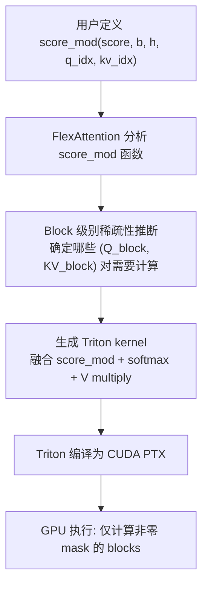

## Triton Language (GPU Kernel Programming)

术语是什么？回答尽量完整，回答逻辑链中每一步都解释出来。

Triton 是 OpenAI 于 2019 年发布的 GPU kernel 编程语言和编译器（Tillet et al., 2019, MAPL），旨在降低 GPU 编程门槛同时保持接近手写 CUDA 的性能。Triton 的核心理念是 **block-level programming**：开发者以 Python 语法编写 tile-level 运算（如加载 block、执行 GEMM、写入结果），Triton 编译器自动处理 thread-level 调度、memory coalescing 和 warp-level 优化。

与 CUDA 的对比：
- CUDA：开发者手动管理 thread/warp/block，显式控制 shared memory allocation 和 synchronization
- Triton：开发者仅指定 block 大小和数据访问模式，编译器自动生成 optimized PTX/LLVM IR

Triton kernel 使用 `@triton.jit` 装饰器，通过 `tl.program_id()` 获取 block index，`tl.load/tl.store` 进行 memory 操作，`tl.dot` 执行 tensor core 矩阵乘法。

从编译框架角度拆解术语。

**Triton 编译流程**：

```
Python Code (triton.jit)
    ↓
Triton IR (block-level intermediate representation)
  - Block-level tiling info (BLOCK_M, BLOCK_N, BLOCK_K)
  - Memory access patterns (load, store, atomic)
  - Arithmetic operations (dot, add, mul, etc.)
    ↓
Triton Compiler Backend
  - Thread/warp mapping optimization
  - Shared memory allocation
  - Memory coalescing analysis
  - Loop unrolling & instruction scheduling
    ↓
LLVM IR / PTX
    ↓
GPU Driver (CUDA) → Hardware Execution
```

**Triton kernel 示例（简化版 Attention）**：

```python
@triton.jit
def attention_kernel(Q, K, V, O, stride_q_n, stride_k_n, ...,
                     BLOCK_N: tl.constexpr, BLOCK_D: tl.constexpr):
    # Block index
    pid = tl.program_id(0)
    
    # Load Q block from HBM → SRAM
    q_ptrs = Q + pid * BLOCK_N * stride_q_n + ...
    q = tl.load(q_ptrs)  # [BLOCK_N, BLOCK_D]
    
    # Initialize running statistics (online softmax/entmax)
    m_i = tl.full([BLOCK_N], float('-inf'), dtype=tl.float32)
    l_i = tl.zeros([BLOCK_N], dtype=tl.float32)
    acc = tl.zeros([BLOCK_N, BLOCK_D], dtype=tl.float32)
    
    # Loop over K,V blocks
    for j in range(0, N, BLOCK_N):
        k = tl.load(k_ptrs + j * ...)  # [BLOCK_N, BLOCK_D]
        v = tl.load(v_ptrs + j * ...)
        
        # Compute scores on SRAM
        s = tl.dot(q, tl.trans(k))  # [BLOCK_N, BLOCK_N]
        
        # Sparse activation (α-entmax or softmax)
        p = sparse_activation(s, alpha, tau)  # block-wise
        
        # Accumulate output
        acc += tl.dot(p, v)
    
    # Write result back to HBM
    tl.store(o_ptrs, acc)
```

术语一般如何实现？如何使用？

1. **安装**：`pip install triton`
2. **基本用法**：定义 `@triton.jit` kernel 并调用 `kernel[(grid,)](args...)` 启动；grid 决定 block 并行度
3. **关键概念**：
   - **Program ID**：每个 block 的唯一标识，用于确定处理的数据范围
   - **tl.load/tl.store**：自动处理边界检查和 memory coalescing
   - **tl.dot**：触发 Tensor Core 进行快速矩阵乘法
   - **tl.constexpr**：编译时常量，用于 block 大小等形状参数
   - **Autotuning**：`@triton.autotune` 装饰器自动搜索最优配置
4. **在 AdaSplash 中的使用**：所有 attention kernel（前向 Halley-Bisection、前向 attention、反向 dQ/dK/dV）均用 Triton 实现，利用 Triton 的 block-level 编程模型精细控制 GPU memory hierarchy (HBM↔SRAM)
5. **生态**：Triton 被用于 vLLM、SGLang 等 serving 框架，以及 PyTorch `torch.compile` 的 Inductor backend

涉及论文标题：
- AdaSplash: Adaptive Sparse Flash Attention
- InfiniteHiP: Extending Language Model Context Up to 3 Million Tokens on a Single GPU (使用 Triton 实现参数化 Pruning Stage Kernel——单一 kernel 通过不同 (b_q, l_c, k) 参数支持所有 stage, key sequence dim 并行类似 FlashDecode split-KV；和 Block Sparse Attention Kernel——FlashAttention-style prefill + FlashDecoding-style decoding + PagedAttention block-based KV 管理)

## TileLang

术语是什么？回答尽量完整，回答逻辑链中每一步都解释出来。

TileLang (Wang et al., 2025) 是一种 composable tile-based GPU 编程模型，论文发表于 arXiv:2504.17577。TileLang 的设计目标是为 AI 系统提供比 Triton 更灵活、更具组合性的 kernel 编写方式——开发者以 tile 为基本单元组合计算，TileLang 编译器自动处理 tile 间的依赖、调度和代码生成。

与 Triton 的关键区别：Triton 的 block-level programming 将单 kernel 内的分块自动化，但 kernel 间的组合和调度仍需手动管理；TileLang 进一步将"tile 作为一等公民"，支持跨 kernel 的 tile 组合、pipeline 和自动优化。

在 HISA 论文中，TileLang 被用于实现：(1) DSA 原始 indexer kernel（参考实现：https://github.com/tile-ai/tilelang/tree/main/examples/deepseek_v32）；(2) HISA 的两阶段 kernel（block-level filtering + token-level refinement）。HISA kernel 利用 TileLang 的 tile 组合能力，将 block filtering kernel 的输出 tile 直接馈入 token refinement kernel，减少中间数据的 HBM 往返。

从编译框架角度拆解术语。

**TileLang 的 tile-based 组合编程模型**：

```
// TileLang 核心概念：tile 作为基本可组合单元
// 单个 tile 操作
@tilelang.kernel
def matmul_tile(A: Tile[BM, BK], B: Tile[BK, BN]) -> Tile[BM, BN]:
    return A @ B

// 组合多个 tile 操作
@tilelang.program
def fused_attention(Q: Tile, K: Tile, V: Tile):
    // Tile 1: QK^T
    S = matmul_tile(Q, K.T)
    // Tile 2: Softmax（在 tile 内完成）
    P = softmax_tile(S)
    // Tile 3: PV
    O = matmul_tile(P, V)
    return O

// HISA 的两阶段 tile 组合
@tilelang.program
def hisa_indexer(QI, KI_pooled, KI_token, w_gate, B, m, k):
    // Stage 1 Tile: Block filtering on pooled keys
    J = gated_relu_matmul(QI, KI_pooled, w_gate)   // [L, M]
    C = topk_tile(J, m)                              // selected block indices
    C = union(C, {0, M-1})                          // force first/last

    // Stage 2 Tile: Token refinement only on candidate blocks
    KI_cand = gather_tile(KI_token, C, B)            // selective load
    I = gated_relu_matmul(QI, KI_cand, w_gate)       // [L, mB]
    T = topk_tile(I, k)                              // final token indices
    return T
```

TileLang JIT 编译器将上述 tile 组合编译为优化后的 GPU kernel，自动处理 tile 间的 HBM↔SRAM 数据传输和 pipeline overlap。

术语一般如何实现？如何使用？

TileLang 通过 Python DSL + JIT compiler 实现：
1. 开发者用 Python 语法编写 tile-level 运算
2. TileLang 的 tile scheduler 自动决定 tile 的 GPU 映射（thread block/warp 分配）
3. JIT compiler 生成优化后的 CUDA/PTX 代码
4. 支持与 PyTorch 无缝集成（tilelang kernel 可作为 torch.autograd.Function 使用）

TileLang 特别适合需要多 kernel 组合的场景（如 HISA 的两阶段 indexer、DSA 的 warmup lightning indexer training operator），因为 tile 组合比手动 CUDA kernel fusion 更易维护和调试。

仓库：https://github.com/tile-ai/tilelang

涉及论文标题：
- HISA: Efficient Hierarchical Indexing for Fine-Grained Sparse Attention
- Rectified Sparse Attention
- SeerAttention-R: Sparse Attention Adaptation for Long Reasoning

## GPT-Fast + torch.compile for Speculative Decoding Backend（GPT-Fast编译优化的投机解码后端）

术语是什么？回答尽量完整，回答逻辑链中每一步都解释出来。通过联网搜索让回答具体和精准。

GPT-Fast（https://github.com/pytorch-labs/gpt-fast）是 PyTorch 团队提供的 LLM 推理优化示例项目，展示如何通过 torch.compile、Triton kernel 和量化技术加速 LLM 推理。torch.compile 是 PyTorch 2.0 引入的 JIT 编译器，通过将 PyTorch 模型计算图编译为融合的 Triton/CUDA kernel 来消除 Python overhead 和 kernel launch overhead。

在 MagicDec 论文中，GPT-Fast 被用作 self-implemented SDK backend 的基础框架。MagicDec 在 GPT-Fast 基础上集成了：(1) FlashInfer attention kernel 替换默认 SDPA；(2) Triton-based matrix multiplication 加速 MLP 层；(3) CUDA graphs 消除 decode loop 的 kernel launch overhead；(4) tensor parallelism for embedding layer 加速 draft phase。torch.compile 将整个模型编译为融合 kernel 图，避免了标准 PyTorch eager mode 的逐算子执行开销。

从编译框架角度拆解术语，比如术语如何在编译框架中发挥作用，给出术语在编译框架中运转流程的具体例子。

```
# torch.compile 在 MagicDec backend 中的编译流程

PyTorch Model (LLaMA-3.1-8B)
    ↓
[1] Dynamo Capture: 记录 Python bytecode 执行轨迹 → FX Graph
    QKV_proj → Attention → O_proj → LayerNorm → Gate/Up/Down_proj → SiLU → Elementwise_mul → Down_proj
    ↓
[2] Inductor Compiler (torch.compile backend):
    - 算子融合 (fusion):
        Q_proj + K_proj + V_proj → single fused GEMM
        Gate_proj + Up_proj → single fused GEMM  
        SiLU + elementwise_mul → fused kernel
    - Triton codegen: 为融合后的算子生成 Triton kernel
    - Memory planning: 分配 intermediate buffer，最小化内存分配
    ↓
[3] Compiled Graph:
    - 每个 decode step 调用 compiled forward → 执行 fused Triton kernels
    - 进一步包裹在 CUDA Graph 中消除 CPU launch overhead
    ↓
[4] Runtime Execution (GPU):
    fused_QKV_GEMM_kernel → FlashInfer_attention_kernel → fused_GateUp_GEMM_kernel → SiLU_mul_kernel → Down_GEMM_kernel
```

术语一般如何实现？如何使用？通过联网搜索让回答具体和精准。

Python 使用方式：`model = torch.compile(model, mode="max-autotune")`，或直接使用 GPT-Fast 的 `generate.py` 脚本。MagicDec 的 self-implemented backend（https://github.com/Infini-AI-Lab/MagicDec）将 GPT-Fast 的编译模型与 SD pipeline 集成：预编译 draft 和 verify 两条 forward 路径，每条路径独立做 torch.compile + CUDA graph capture。关键约束：因 torch.compile 要求 static shapes，需固定 batch size 和 sequence length（同质 batch），这解释了 MagicDec 对同质 batch 的假设。

涉及论文标题：
- MagicDec: Breaking the Latency-Throughput Tradeoff for Long Context Generation with Speculative Decoding

## Integer Programming for Mixed-Precision Bit-width Allocation（混合精度位宽分配的整数规划）

术语是什么？回答尽量完整，回答逻辑链中每一步都解释出来。

Integer Programming for Mixed-Precision Bit-width Allocation 是 PM-KVQ 用来为不同 Transformer block 的 KV Cache 分配最优位宽的数学优化方法。输入是每个 block 在各候选位宽下的量化敏感度 s_{i,b} 和内存预算 M，输出是每个 block 的最优位宽选择 x_{i,b}（one-hot 编码，每个 block 恰好选择一个位宽）。该问题被建模为带约束的 0-1 整数规划，使用开源求解器 CVXPY（Diamond & Boyd, 2016, JMLR）在几秒内完成求解。

从编译框架角度拆解术语：

**问题建模**（PM-KVQ Section 3.2, Equations 6-8）：

```
目标函数（最小化全局量化敏感度）：
min Σ_{i=1}^{N} Σ_{b∈B} x_{i,b} · s_{i,b}

约束条件：
1. 每个 block 恰好选择一个位宽：  Σ_{b∈B} x_{i,b} = 1,    ∀i ∈ [1,N]
2. 总内存不超过预算：
   Σ_{i=1}^{N} Σ_{b∈B} x_{i,b} · (Mem(Q_b(K_i)) + Mem(Q_b(V_i))) ≤ M
3. 0-1 变量约束： x_{i,b} ∈ {0,1},    b ∈ B
```

**变量与参数说明**：

| 符号 | 含义 | 示例 (DeepSeek-Qwen-7B) |
|------|------|--------------------------|
| N | Transformer block 数量 | 28 |
| B | 候选位宽集合 | {2, 4} |
| s_{i,b} | block i 在 b-bit 下的敏感度 | Eq.5: ∥G_Ki⊙(K_i-Q_b(K_i))∥₁ + ∥G_Vi⊙(V_i-Q_b(V_i))∥₁ |
| Mem(Q_b(K_i)) | block i 的 Key Cache 在 b-bit 下的内存占用 | 序列长度 × num_kv_heads × head_dim × b/8 bytes |
| M | KV Cache 总内存预算 | 由 target GPU memory 和 batch size 决定 |
| x_{i,b} | 0-1 选择变量 | x_{3,4}=1 表示 block 3 使用 4-bit |

**求解流程**（离线预处理阶段）：

```
// Step 1: Profiling——校准数据上一次前向传播
for each transformer_block i in 1..N:
    for each candidate_bitwidth b in B:
        K_i, V_i = forward_and_get_kv(block_i)
        K_i_q = asymmetric_group_quantize(K_i, bits=b, group_size=128)
        V_i_q = asymmetric_group_quantize(V_i, bits=b, group_size=128)
        s_{i,b} = taylor_sensitivity(K_i, K_i_q, V_i, V_i_q)

// Step 2: 求解
problem = cvxpy.Problem(
    objective = cvxpy.Minimize(sum(x[i,b] * s[i,b] for all i,b)),
    constraints = [
        sum(x[i,b] for b in B) == 1 for each i,       // 每个 block 一个位宽
        sum(x[i,b] * mem[i,b] for all i,b) <= M,       // 总内存约束
        x[i,b] in {0,1} for all i,b                    // 0-1 约束
    ]
)
problem.solve()  // CVXPY 调用底层 MILP 求解器（如 ECOS_BB, GLPK_MI）
result = {i: b for (i,b) where x[i,b] == 1}  // 每个block的Fbit
```

**求解器选择**：CVXPY 作为高层 Python 接口，底层可调用多种 MILP 求解器。由于该问题规模小（N×|B| 个变量，N+|B| 个线性约束；如 28×2=56 变量），CVXPY 的默认求解器即可在几秒内完成。PM-KVQ 论文在 8×A100-80G 服务器上完成 profiling + 求解全过程。

术语一般如何实现？如何使用？

实现关键：(1) CVXPY 作为 Python 嵌入式优化建模语言，使整数规划定义简洁（与论文公式一一对应）；(2) 一阶泰勒近似敏感度无需反向传播到模型参数，仅需 K/V 张量梯度——可在 PyTorch hook 中高效捕获；(3) 由于 profiling 在 FP16 下进行，敏感度值不受量化先验影响——该方法是通用的，可迁移到不同模型/量化方案。

适用场景：(1) 混合精度量化方案中的位宽分配（不仅限 KV Cache，也可用于 weight/activation 混合精度）；(2) 当存在多级可选精度配置和硬性内存约束时；(3) 该方法的替代方案包括贪心分配、启发式搜索和敏感度排序——整数规划在此问题中是最优解，且求解开销可忽略。

局限性：(1) 依赖校准数据代表性——校准数据与实际推理数据分布偏差可能导致次优分配；(2) B 集合大小被限制为 2 个候选值以保证搜索效率和避免过拟合；(3) 未考虑跨 block 的误差传播效应（即浅层 block 量化误差如何通过残差连接放大到深层）。

涉及论文标题：
- PM-KVQ: Progressive Mixed-precision KV Cache Quantization for Long-CoT LLMs

## FlexAttention (PyTorch Flexible Attention API)

术语是什么？回答尽量完整，回答逻辑链中每一步都解释出来。

FlexAttention 是 PyTorch 团队（Dong et al., 2024）提出的注意力编程模型和 kernel 生成系统，旨在统一多种注意力变体（sliding window、block-sparse、causal masking、document masking、soft-capping 等）到单一的 Python API 中。传统方法需要为每种注意力模式编写专用的融合 kernel（或使用 FlashAttention 的有限模板参数），FlexAttention 通过让用户用纯 PyTorch 张量操作在 Python 中定义 `score_mod`（attention score modifier）函数，自动编译为高效的融合 CUDA kernel。

核心设计：(1) `score_mod(score, b, h, q_idx, kv_idx)` 函数——用户定义如何修改注意力分数矩阵，框架负责高效的 kernel 生成；(2) 自动 block-sparse 编译——通过分析 mask 的稀疏模式自动跳过零值 block，实现与手写 block-sparse kernel 相当的硬件效率；(3) 支持反向传播——score_mod 中的所有操作为 PyTorch 可微操作，自动支持训练。

从编译框架角度拆解术语，比如术语如何在编译框架中发挥作用，给出术语在编译框架中运转流程的具体例子。

**FlexAttention 编译流程（用户到 GPU kernel）**：



**FlexAttention 的 score_mod 函数示例（PowerAttention）**：

```python
from torch.nn.attention.flex_attention import flex_attention, create_block_mask

def power_attention_score_mod(score, b, h, q_idx, kv_idx):
    """
    score: attention scores [B, H, M, N]
    q_idx, kv_idx: query 和 key 的 token 位置索引
    """
    block_size = 256
    # 转换为 block 索引
    blk_qk = (q_idx // block_size) - (kv_idx // block_size)
    
    # 滑动窗口（5 blocks）
    is_window = blk_qk < 5
    
    # PowerAttention: power-of-2 distances
    is_power = (blk_qk & (blk_qk - 1)) == 0
    
    # Sink tokens（第 0 block）
    is_sink = kv_idx < block_size
    
    # 因果性
    is_causal = q_idx >= kv_idx
    
    # 构造 mask: 将不需要的 score 设为 -inf
    if not (is_causal and (is_window | is_power | is_sink)):
        score = float('-inf')
    
    return score

# 预编译 block mask（首次调用时分析稀疏模式）
block_mask = create_block_mask(
    power_attention_score_mod, B=None, H=None, Q_LEN=32768, KV_LEN=32768
)

# 实际 attention 计算
output = flex_attention(query, key, value, block_mask=block_mask)
```

**FlexAttention 的编译技术细节**：

1. **稀疏性推断（Sparsity Inference）**：在编译时，FlexAttention 用符号化的 q_idx/kv_idx 值调用 score_mod，推断哪些 (query_block, kv_block) 对会产生非 -inf 的 score。这生成了一个 block-level 的稀疏模式（sparsity pattern）。

2. **Block-Sparse Kernel 生成**：基于推断的稀疏模式，FlexAttention 生成定制的 Triton kernel：
   ```
   for query_block in parallel (grid-level):
       load Q[query_block] to SRAM
       for kv_block in non_zero_blocks[query_block]:
           load K[kv_block], V[kv_block] to SRAM
           S = Q @ K^T / sqrt(d_k)
           S = score_mod(S)  # 应用用户定义的 score modifier
           O += softmax(S) @ V
       write O to HBM
   ```

3. **反向传播支持**：因为 score_mod 是 PyTorch 可微函数，backward pass 自动计算 score_mod 对 score 的梯度，无需手动编写 backward kernel。

术语一般如何实现？如何使用？

FlexAttention 是 `torch.nn.attention.flex_attention` 模块的一部分（PyTorch 2.5+）。使用方式：
1. 定义 `score_mod(score, b, h, q_idx, kv_idx)` 函数
2. 可选：调用 `create_block_mask(score_mod, B, H, Q_LEN, KV_LEN)` 预编译 block mask（提升重复调用性能）
3. 调用 `flex_attention(query, key, value, score_mod=score_mod)` 或 `flex_attention(query, key, value, block_mask=block_mask)`

PowerAttention 论文使用 FlexAttention 的所有 baseline 和 PowerAttention 模式的 mask 定义（见 Appendix D 中的 Algorithms 2-5）。对于序列并行训练，FlexAttention 结合的 Triton kernel 与 RingAttention 一起使用，实现跨 GPU 的序列维并行。

与手写 Triton kernel 相比，FlexAttention 的优势在于：(1) 所有注意力变体共享一个 API 和编译管线；(2) 自动 block-sparse 编译无需手动 tiling；(3) 支持训练（反向传播自动处理）；(4) 通过 score_mod 函数组合实现复杂掩码（如 power-of-2 + window + sink 的组合逻辑仅需几行 Python）。

涉及论文标题：
- PowerAttention: Exponentially Scaling of Receptive Fields for Effective Sparse Attention
- Scale-invariant Attention
