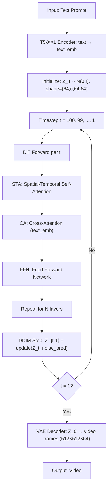

# 知识库_系统架构

## Sharded Data Parallelism (ShardedDP)（分片数据并行）

术语是什么？回答尽量完整，回答逻辑链中每一步都解释出来。通过联网搜索让回答具体和精准。
Sharded Data Parallelism (ShardedDP) 是一种分布式训练策略，将传统 Data Parallelism (DP) 中的优化器状态（optimizer states：模型参数、momentum、variance 等，通常为 FP32）在多个 GPU 间分片存储，每个 GPU 只持有 $1/P$ 的优化器状态，从而将每 GPU 的优化器状态内存开销降低 $P$ 倍（P 为 GPU 数量）。与 Naive DP（每 GPU 复制完整优化器状态）相比的核心区别在于通信模式的变化：(1) Forward pass 前需要 AllGather 完整模型权重（因为每个 GPU 只持有分片的 main weights）；(2) Backward pass 后需要 ReduceScatter 归约梯度（使每个 GPU 获得其分片对应的平均梯度后进行 optimizer step）。ShardedDP 在多个主流训练框架中以不同名称实现：Megatron-LM 的 Distributed Optimizer、DeepSpeed 的 ZeRO（ZeRO-1/2/3）、PyTorch 的 FSDP（Fully Sharded Data Parallelism）。关键差异在于权重释放策略：ZeRO-3 和 FSDP 在 forward/backward 后释放收集的权重（节省内存但 backward 需额外 all-gather weight）；ZeRO-2 和 Megatron-LM Distributed Optimizer 则保留收集的完整权重（无需 backward 再收集，但内存占用更高）。

从系统架构角度拆解术语，比如术语如何在系统架构中发挥作用，给出术语在系统架构中运转流程的具体例子。通过联网搜索让回答具体和精准。
Megatron-LM Distributed Optimizer (ShardedDP 模式) 每轮迭代的通信-计算流程：
```
# 初始状态: 每个 GPU p 持有:
#   w_main[p] : 1/P 的 FP32 main weights (optimizer states)
#   w_model   : 完整 BF16 model weights (Megatron-LM 保留)
#   g_model^p : 本地计算的梯度

# === Forward Pass ===
# AllGather BF16 weights from main shards
w_model[p][0:shard_size] = w_main[p].to(BF16)
w_model = AllGather({w_model[p] for p in 0..P-1})  # 通信: O(W) BF16
output = ForwardPass(w_model, input)

# === Backward Pass ===
g_model^p = BackwardPass(w_model, output, labels)

# === Gradient Synchronization (ReduceScatter) ===
g_main[p] = ReduceScatter(g_model^p)  # 通信: O(G) FP32, P-1 rounds

# === Optimizer Step (仅本地分片) ===
w_main[p] = AdamW(g_main[p], w_main[p])  # 无需通信
```

关键特性：(1) 通信量与 GPU 数量几乎无关（AllGather 通信量 = W × (P-1)/P ≈ W，ReduceScatter 同理），意味着更多 GPU 时通信开销占总时间比例更大；(2) 可以与 Tensor Parallelism (TP) 和 Pipeline Parallelism (PP) 组合使用（3D parallelism）；(3) 通信带宽瓶颈在 inter-node（NVLink intra-node 带宽 >> InfiniBand inter-node 带宽），这正是 SDP4Bit 等通信压缩技术的优化目标。

术语一般如何实现？如何使用？通过联网搜索让回答具体和精准。
Megatron-LM 的 Distributed Optimizer 通过 `--use-distributed-optimizer` 启用。关键实现细节：(1) 每个 GPU 维护一个 `param_shard_group`（由连续 GPU 组成），在此 group 内分片优化器状态；(2) DP group 通常跨所有节点，TP group 通常在一个节点内；(3) 数据并行通信（AllGather param / ReduceScatter grad）和数据并行参数分片在 `DistributedDataParallel` 类中协调。SDP4Bit 在此架构基础上插入量化步骤：AllGather 前量化权值差值（qWD），ReduceScatter 替换为两次 all-to-all 并各自量化（TLq-HS）。ZeRO-3/FSDP 则在每个 submodule 的 forward/backward 边界执行 all-gather/release 操作，实现内存和通信的更细粒度交换。

涉及论文标题：
- SDP4Bit: Toward 4-bit Communication Quantization in Sharded Data Parallelism for LLM Training
- ZeRO++: Extremely Efficient Collective Communication for Giant Model Training
- Megatron-LM: Training Multi-Billion Parameter Language Models Using Model Parallelism

---

## Megatron-LM Distributed Optimizer

术语是什么？回答尽量完整，回答逻辑链中每一步都解释出来。通过联网搜索让回答具体和精准。
Megatron-LM Distributed Optimizer 是 NVIDIA Megatron-LM 框架中实现的 ShardedDP 变体。与 ZeRO-3 的关键区别：在前向传播后保留收集到的完整 model weights（BF16）直到下次 AllGather，而非像 ZeRO-3 那样立即释放。这种"保留权重"的设计使 SDP4Bit 的 qWD 技术天然适配——可以复用 model weights buffer 计算权值差值，无需额外存储。Megatron-LM 还提供灵活的并行策略组合：(1) Tensor Parallelism (TP)：垂直切分模型层（每个 Transformer block 内的矩阵乘法被分布到 TP group），利用 NVLink 高带宽实现近零开销的 all-reduce；(2) Pipeline Parallelism (PP)：水平切分模型层序列，通过 micro-batch pipeline 隐藏通信延迟；(3) Data Parallelism (DP/ShardedDP)：数据并行训练且优化器状态分片。

从系统架构角度拆解术语，比如术语如何在系统架构中发挥作用，给出术语在系统架构中运转流程的具体例子。通过联网搜索让回答具体和精准。
Megatron-LM + SDP4Bit 的完整 3D 并行训练流程（GPT-18B, TP=4, PP=2, DP=16 on 128 GPUs）：
```
GPU (tp=0, pp=0, dp=0):
  # TP 通信: AllReduce within TP group (NVLink intra-node)
  # PP 通信: P2P send/recv activations/grads across PP stages
  # DP 通信: ShardedDP all-gather/reduce-scatter across all DP workers

  每个 micro-batch iteration:
  1. [DP] AllGather quantized weight diffs (qWD, INT4)
  2. [TP] Forward: matmul f w/ all-reduce within TP group (FP16)
  3. [PP] Forward: send activations to next PP stage
  4. [PP] Backward: receive grad from next PP stage; [TP] all-reduce grads
  5. [DP] TLq-HS gradient sync: intra-node INT8 all-to-all + inter-node INT4 all-to-all
  6. [DP] Optimizer step on local shard
  7. [DP] Compute weight differences for next iteration
```
Megatron-LM 的 global batch size 计算：`global_batch = micro_batch_size × accumulation_steps × DP_size`。当 accumulation_steps=1 时，DP 通信在每次 optimizer step 都执行，通信开销最显著。

术语一般如何实现？如何使用？通过联网搜索让回答具体和精准。
Megatron-LM 通过 `pretrain_gpt.py` 脚本启动训练，关键配置参数：`--tensor-model-parallel-size`、`--pipeline-model-parallel-size`、`--use-distributed-optimizer`、`--micro-batch-size`、`--global-batch-size`。SDP4Bit 在此基础上增加 `--quantized-weights`、`--quantized-gradients`、`--hadamard-transform` 等量化参数。训练脚本通常由 `torchrun` 或 MPI 启动：`torchrun --nproc_per_node=8 --nnodes=16 pretrain_gpt.py <args>`。Distributed Optimizer 通过 NCCL 的 AllGather/ReduceScatter 原语实现通信。

涉及论文标题：
- SDP4Bit: Toward 4-bit Communication Quantization in Sharded Data Parallelism for LLM Training

## TinyChat

术语是什么？回答尽量完整，回答逻辑链中每一步都解释出来。通过联网搜索让回答具体和精准。
TinyChat 是 MIT HAN Lab 为 AWQ 量化 LLM 设计的轻量级端侧推理系统。它是一个 PyTorch 前端 + 设备特定后端（CUDA/PTX、ARM NEON、x86 AVX）的推理框架，专为 W4A16 weight-only 量化场景优化。核心设计：(1) On-the-fly dequantization——INT4→FP16 反量化融合进 GEMM/GEMV kernel 主循环，避免将反量化权重写回 DRAM；(2) SIMD-aware weight packing——针对 ARM NEON 128-bit 和 x86 AVX 做交错排布以高效利用 SIMD 解包；(3) Kernel fusion——将 LayerNorm 的所有操作、QKV 三个投影、attention 计算与 KV cache 更新融合为极少 kernel launch。与 llama.cpp/exllama 等只能支持 LLaMA 系列的系统不同，TinyChat 通过 PyTorch 前端复用同一套 forward pass 代码支持 Llama-2、OPT、Falcon、MPT、Mistral、StarCoder、StableCode、VILA 等多种模型架构。

从系统架构角度拆解术语，比如术语如何在系统架构中发挥作用，给出术语在系统架构中运转流程的具体例子。通过联网搜索让回答具体和精准。
TinyChat 在 RTX 4090 上运行 Llama-2-7B W4A16 的一次 decode token 生成全过程：
```
输入: 1 token → Embedding Lookup (FP16)

┌── TinyChat Decoder Layer (32 层) ─────────────────────────────────┐
│                                                                    │
│  [Kernel 1: Fused RMSNorm]                                        │
│  hidden_state → RMSNorm kernel (fused multiply/division/sqrt)     │
│  输出: normed_hidden [4096] FP16                                   │
│                                                                    │
│  [Kernel 2: Fused QKV Projection + RoPE]                          │
│  packed W_Q [4096×4096 INT4] + scales → on-the-fly dequant (GEMV)│
│  packed W_K [4096×4096 INT4] + scales → GEMV                      │
│  packed W_V [4096×4096 INT4] + scales → GEMV                      │
│  → Q [128×32] FP16, K [128×32] FP16, V [128×32] FP16             │
│  → RoPE applied on-the-fly (fused into kernel)                    │
│                                                                    │
│  [Kernel 3: Fused Attention + KV Cache Update]                    │
│  Q @ K_cache^T → scores → softmax → scores @ V_cache              │
│  → new K, V 写入预分配 KV cache → attention output [4096] FP16   │
│                                                                    │
│  [Kernel 4: Fused Output Projection (GEMV)]                       │
│  packed W_O [4096×4096 INT4] + scale → on-the-fly dequant GEMV   │
│  → residual add → hidden_state [4096] FP16                        │
│                                                                    │
│  [Kernel 5: Fused RMSNorm + Gated MLP]                            │
│  RMSNorm → packed W_gate + W_up + W_down (3 组 INT4 权重)         │
│  → gate: SiLU ⊙ up → W_down GEMV                                  │
│  → residual add → layer output [4096] FP16                        │
└────────────────────────────────────────────────────────────────────┘

→ LM Head (FP16 Linear) → Sampling → 输出 token
```

关键架构决策：
- 每个 Transformer Block 仅 ~5 次 kernel launch（vs HuggingFace PyTorch 的数十次，每次 launch overhead ~0.01ms on 4090）
- INT4 权重读取量为 FP16 的 1/4，decode 阶段 arithmetic intensity 从 ≈1 → ≈4 FLOPs/Byte
- KV cache 直接预分配为连续 GPU memory，更新在 attention kernel 内完成（无额外 memory copy）

术语一般如何实现？如何使用？通过联网搜索让回答具体和精准。
TinyChat 开源：https://github.com/mit-han-lab/llm-awq/tree/main/tinychat。使用方式：
```python
from tinychat.models import LlamaForCausalLM
model = LlamaForCausalLM.from_pretrained("path/to/awq_quantized_llama2_7b")
output = model.generate("Hello, world!", max_new_tokens=200)
```
支持平台与加速比（vs HuggingFace FP16）：
- RTX 4090 (桌面): 3.2-3.9× (Llama-2-7B: 194 vs 52 tokens/s)
- RTX 4070 (笔记本 8GB): 可运行 Llama-2-13B @ 33 tokens/s (FP16 下 7B 都无法装入)
- Jetson Orin (移动 64GB): 3.5× (可运行 Llama-2-70B)
- Raspberry Pi 4B: Llama-7B @ 0.7 tokens/s (极边缘设备)

对比其他系统（Jetson Orin）：TinyChat 比 llama.cpp 快 1.7×，比 AutoGPTQ 快 2.6-3.0×。TinyChat 的设计原则是"最小化 kernel 数量 + 最大化 memory bandwidth 利用率"，后端仅实现 attention、layer norm、linear projection 三类 kernel，保持代码简洁（vs FasterTransformer 的完整重写）。已被 Apache TVM 社区的 MLC-LLM 项目借鉴（同期工作）。

涉及论文标题：
- AWQ: Activation-aware Weight Quantization for On-Device LLM Compression and Acceleration

术语是什么？回答尽量完整，回答逻辑链中每一步都解释出来。通过联网搜索让回答具体和精准。
FasterTransformer 是 NVIDIA 开发的高性能 Transformer 推理框架，提供针对 GPU 高度优化的 Transformer 层前向实现。它不是一个完整的 Serving 系统，而是一个推理后端/库，提供了 Transformer 各组件（Attention、FFN、LayerNorm、Beam Search 等）的 fused CUDA kernel 实现。FasterTransformer 后被整合到 NVIDIA TensorRT-LLM 中（2023 年）。AFPQ 论文使用 FasterTransformer 作为推理系统的后端，在其上实现了 NF4-asym 的自定义 dequantization kernel，以评估非对称 FP 量化对推理延迟的实际影响。

从系统架构角度拆解术语，比如术语如何在系统架构中发挥作用，给出术语在系统架构中运转流程的具体例子。通过联网搜索让回答具体和精准。
AFPQ 基于 FasterTransformer 的推理系统流程（W4A16 NF4-asym）：
```
输入请求 → Tokenizer → Embedding Lookup (FP16)
  │
  ▼
┌─────────────────────────────────────────┐
│ FasterTransformer Decoder Stack (N 层)  │
│ ┌─────────────────────────────────────┐ │
│ │ 1. FP16 Activation 输入              │ │
│ │ 2. LayerNorm (FP16 fused kernel)    │ │
│ │ 3. Q/K/V 投影:                      │ │
│ │    - packaged NF4 weights → LUT     │ │
│ │    - scale_pos/scale_neg dequant    │ │
│ │    - FP16 GEMM with activation      │ │
│ │ 4. Attention (fused MHA kernel)     │ │
│ │ 5. O 投影 (同步骤 3 的 dequant+GEMM)│ │
│ │ 6. Residual + LayerNorm             │ │
│ │ 7. FFN (FC1+FC2, 同 dequant+GEMM)   │ │
│ │ 8. Residual                         │ │
│ └─────────────────────────────────────┘ │
└─────────────────────────────────────────┘
  │
  ▼
LM Head (FP16 Linear) → Logits → Sampling → 输出 Token
```
AFPQ 修改的部分：在 FasterTransformer 中新增了 NF4-asym dequantization kernel，替换了原有的 INT4 dequant kernel。修改发生在每个 Linear 层（Q/K/V/O/FC1/FC2）的权重加载后、GEMM 执行前。

术语一般如何实现？如何使用？通过联网搜索让回答具体和精准。
FasterTransformer GitHub：https://github.com/NVIDIA/FasterTransformer（已于 2024 年归档，被 TensorRT-LLM 取代）。使用方式：C++ API 或 Python 绑定，通过配置文件指定模型结构、精度和并行策略。在 AFPQ 论文中的使用：(1) 加载 FP16 模型基线；(2) 将量化后的 NF4-asym 权重和 scale 参数加载到 GPU 显存；(3) 注册自定义 dequantize kernel；(4) 运行推理测量延迟。AFPQ 报告的延迟（A6000 GPU, batch=1, input_len=128, output_len=20）：LLaMA2-7B NF4-asym 265.54ms（FP16 415.06ms, 1.56x speedup），LLaMA2-13B NF4-asym 485.42ms（FP16 788.01ms, 1.62x speedup）。

涉及论文标题：
- AFPQ Asymmetric Floating Point Quantization for LLMs

---

## Prefill / Decode Stages (LLM Inference)

术语是什么？回答尽量完整，回答逻辑链中每一步都解释出来。通过联网搜索让回答具体和精准。
自回归 LLM 推理分为两个阶段：(1) **Prefill stage（预填充阶段）**：处理输入 prompt 所有 token，一次性并行计算所有 token 的 KV cache 并存储于 GPU 显存。此阶段为 compute-bound——所有 token 并行处理，计算需求远超内存带宽限制；(2) **Decode stage（解码阶段）**：生成输出 token 一个接一个。每步仅计算一个 token，但需从显存加载全部先前 token 的 KV cache（用于 self-attention）和模型参数。此阶段为 memory-bound——仅处理单个 token，内存 IO（参数+KV cache）成为主要瓶颈。生产系统中通常使用 batching 摊薄参数 IO，但在充足上下文长度下 KV cache IO 成为主导瓶颈（因 batch 增大后 KV cache 总量也增大）。Block Transformer 通过在 Token Decoder 中跳过 prefill（除最后一个 block）和在 Block Decoder 中降低 decode KV cache IO 来系统性缓解两个阶段的开销。

从系统架构角度拆解术语，比如术语如何在系统架构中发挥作用，给出术语在系统架构中运转流程的具体例子。通过联网搜索让回答具体和精准。
以 vanilla Pythia 302M, L=2048, B=16 为例的推理阶段：
```
Prefill stage (compute-bound):
  prompt: "Hello, how are" (2048 tokens padded)
  → 24层 transformer, 每层:
    Q,K,V = Linear(input)             # [B, L, D] → [B, L, D]
    attn = Softmax(Q·K^T / √d) · V   # [B, L, D], 所有token并行
    cache K, V → GPU memory           # 24层 × 2048 × 2(KV) × 1024 dim × ... 
  → 输出第一个token: "you"
  Latency dominated by compute (FLOPs)

Decode stage (memory-bound):
  生成: "you" → "doing" → "today" → ...
  → 每层: Q = Linear(1 new token)
          K, V = Load full KV cache from memory (L tokens)
          attn = softmax(Q · K^T / √d) · V
          append new K,V → KV cache extends
  → 每token需读: 604MB params + up to 3.2GB KV cache (B=16)
  Latency dominated by HBM bandwidth
  MFU typically ~1% (most of the time waiting for memory)
```

术语一般如何实现？如何使用？通过联网搜索让回答具体和精准。
现代 LLM serving 系统（vLLM、SGLang、TensorRT-LLM）通过 PagedAttention 和 continuous batching 优化这两个阶段。Block Transformer 从架构层面而非系统层面解决瓶颈：Token Decoder 跳过 prefill（无需预填充 prompt KV 即可开始生成）, Block Decoder 降低 decode KV cache IO。FlashAttention/FlashDecoding 作为 kernel 优化也可应用到两者的 attention 计算中（Block Transformer 验证了 FlashDecoding 兼容性）。

涉及论文标题：
- Block Transformer Global-to-Local Language Modeling for Fast Inference (NeurIPS 2024)

---

## KV Cache IO Bottleneck

术语是什么？回答尽量完整，回答逻辑链中每一步都解释出来。通过联网搜索让回答具体和精准。
KV Cache IO Bottleneck 是自回归 LLM decode 阶段的核心性能限制：每步 decode 生成一个 token 时，需从 HBM 加载所有先前 token 的 key/value 状态用于 self-attention。KV cache 总量 = $2 \times n_{layers} \times L \times B \times D_{head} \times n_{heads}$（字节），随序列长度 L 线性增长。decode 阶段的 arithmetic intensity（计算量/内存访问量）极低（约 1 FLOP/Byte），导致 GPU 的 HBM 带宽成为瓶颈，计算单元利用率（MFU）通常仅 ~1%。Block Transformer 论文通过分析 (Llama 7B, 2048 tokens, batch=16, KV cache=16GB) 量化了该问题：HBM 带宽达参数量级，但 compute throughput (FLOP/s) 是 HBM 带宽的 2-3 个数量级，且差距呈指数扩大（"memory wall"）。Block Transformer 通过两个机制缓解：(1) Block Decoder 减少 block 数 → KV cache 大小 ↓LB 倍；(2) Token Decoder 仅用 local KV cache (LB tokens) → KV cache IO ↓L/LB 倍，最终将 KV cache IO 从 $O(L^2)$ 降至 $O(L \cdot L_B)$。

从系统架构角度拆解术语，比如术语如何在系统架构中发挥作用，给出术语在系统架构中运转流程的具体例子。通过联网搜索让回答具体和精准。
Vanilla vs Block Transformer KV cache IO 对比 (L=2048, LB=4, D=1024, FP16)：
```
Vanilla Transformer:
  每层 KV cache = 2048 tokens × 2(KV) × 1024 dim = 4MB per layer
  32 layers: 128MB KV cache total
  Per decode step IO: 128MB KV + 604MB params = 732MB
  KV cache IO per full decode (L tokens): L × L × ... = O(L²)
  B=16: KV cache = 16GB, often exceeds GPU memory → batch constrained

Block Transformer:
  Block Decoder: 512 blocks × 2(KV) × 1024 dim = 1MB/layer (↓4×)
  Token Decoder: 6 tokens × 2(KV) × 1024 dim = 12KB/layer (↓341×)
  KV cache total = 512 × (block decoder layers) + 6 × (token decoder layers)
  Token Decoder prefill: 0 (completely skipped)
  Decode KV cache IO: O(L · LB) instead of O(L²)
```

术语一般如何实现？如何使用？通过联网搜索让回答具体和精准。
缓解 KV cache IO 瓶颈的方法分为两类：(1) 系统层面——PagedAttention（vLLM）、prefix caching（SGLang）、KV cache offloading（FlexGen）、KV cache quantization；(2) 架构层面——Multi-Query Attention (MQA)、Grouped-Query Attention (GQA)、Multi-head Latent Attention (MLA)、Sliding Window Attention (SWA)、Block Transformer 的 global-to-local 架构。Block Transformer 可与 FlashAttention 兼容，后者进一步减少 attention 计算的内存访问次数。YOCO 通过 decoder-decoder 架构将 KV cache 从 O(L×N×D) 降至 O(N×D)（共享单层全局 KV cache），从架构层面根本性地减少缓存总量。

涉及论文标题：
- Block Transformer Global-to-Local Language Modeling for Fast Inference (NeurIPS 2024)
- Efficient implementations for emerging model architectures (YOCO: You Only Cache Once)

---

## Memory-bound vs Compute-bound Inference

术语是什么？回答尽量完整，回答逻辑链中每一步都解释出来。通过联网搜索让回答具体和精准。
LLM 推理的工作负载特征分为 memory-bound（内存受限）和 compute-bound（计算受限）：(1) **Memory-bound**：瓶颈在于 HBM 内存带宽而非计算能力，典型场景为 decode stage（batch=1, 每步仅计算 1 token）。此时 arithmetic intensity（FLOPs per byte loaded）极低，GPU 的 FLOPS 利用率 <1%；(2) **Compute-bound**：瓶颈在于计算能力，典型场景为 prefill stage（所有 prompt tokens 并行处理）或大 batch decode。Block Transformer 论文将此分类应用到推理优化设计：Token Decoder 的 decode 是 memory-bound → 可安全增加 prefix length 或模型容量（更多 FLOPs）而几乎不增加延迟，因为瓶颈在内存而非计算。Block Decoder 的 prefill 是 compute-bound → 减少输入 block 数直接降低计算量和延迟。

从系统架构角度拆解术语，比如术语如何在系统架构中发挥作用，给出术语在系统架构中运转流程的具体例子。通过联网搜索让回答具体和精准。
```
Arithmetic intensity = FLOPs / Bytes_loaded_from_HBM

Prefill stage (compute-bound):
  FLOPs: O(L² × D) attention + O(L × D²) FFN ≈ 14 GFLOPs/token × L tokens
  Bytes: O(L × D) KV cache write + O(D²) params ≈ 604MB params + 3GB KV
  Intensity: high → GPU compute units fully utilized → MFU ~50-70%

Decode stage (memory-bound, B=1):
  FLOPs: ~14 GFLOPs (single token)  
  Bytes: ~604MB params + L × 2 × D_heads × ... ≈ 604MB + KV cache
  Intensity: ~14e9 / 600e6 ≈ 23 FLOPs/Byte → MFU <1%
  → Adding more FLOPs (larger model, longer prefix) has minimal latency impact
```

术语一般如何实现？如何使用？通过联网搜索让回答具体和精准。
Block Transformer 利用了这个特性：通过将 Token Decoder 的 KV cache 从 L 降至 LB（~4），大幅降低 decode 阶段的内存访问，使更多 HBM 带宽可用于参数读取。由于参数 IO 可通过 batching 摊薄，Block Transformer 的高 batch 能力转化为大幅吞吐量提升（10-25×）。理解 memory-bound vs compute-bound 的转换点是设计 efficient inference 架构的核心。

涉及论文标题：
- Block Transformer Global-to-Local Language Modeling for Fast Inference (NeurIPS 2024)

## Cross-Layer KV Sharing (跨层KV共享)

术语是什么？回答尽量完整，回答逻辑链中每一步都解释出来。通过联网搜索让回答具体和精准。
Cross-Layer KV Sharing 是一种 KV cache 压缩技术。核心观察：相邻 Transformer 层的 KV cache 具有高度相似性（Brandon et al., 2024），因此让多个连续层共享同一组 K/V cache 可显著减少内存占用。Hymba 的具体实现：每 2 个连续层共享同一 KV cache（第 2i 和 2i+1 层共用），减少的参数量被重分配到其他模型组件，综合效果：缓存总量下降且模型质量提升（commonsense accuracy +0.60%）。配合 SWA 和 GQA，Hymba 将 8K cache 从 414.7MB 降至 39.4MB（10.5× reduction）。

从系统架构角度拆解术语，比如术语如何在系统架构中发挥作用，给出术语在系统架构中运转流程的具体例子。通过联网搜索让回答具体和精准。

Hymba 中的 cross-layer KV sharing 缓存布局：

```
# 标准 Transformer: 每层独立 KV cache
Total cache = L x N x 2 x d_head x h_kv x 2bytes (FP16)

# Hymba + Cross-layer KV Sharing + SWA + GQA
# - 每 2 层共享（L/2 组）
# - 仅 3 层 global attention 存完整序列
# - 其余 29 层 SWA 仅缓存窗口 C=1024
# - GQA 减少 KV heads (h_kv < h_q)

# Hymba-1.5B 实例：
# 32 layers, 25 attn heads, 5 GQA groups
# 共享后约 16 组 KV cache
# 3 组 global: 3 x N x 2 x 64 x 5 x 2bytes
# 13 组 SWA: 13 x 1024 x 2 x 64 x 5 x 2bytes
# Total at N=8K: ≈ 79MB (vs Llama3-3B 918MB)
```

交互流程：推理时，layer 2i 写入 KV cache 共享 buffer → layer 2i+1 直接读取同一 buffer 执行 attention → 无需额外的 cache 副本或传输。Kernel 层面通过 shared memory pointer 实现零拷贝访问。

术语一般如何实现？如何使用？通过联网搜索让回答具体和精准。
实现要点：(1) 共享粒度——Hymba 采用 2 层一组；Brandon et al. (2024) 研究了更多变体 (2/3/4 层共享)；(2) 适用条件——recall 和 commonsense accuracy 影响小甚至正面（节省参数可重分配到其他组件）；(3) 与其他技术互补——Hymba 组合 SWA + cross-layer KV sharing + GQA 达到最佳 cache 效率；(4) 架构约束——共享层需要相同 head 数和 head dim，需在设计初期规划。局限：仅在 attention heads 存在时生效（纯 SSM 模型无 KV cache）；共享后特定层的 attention 灵活性可能降低。

涉及论文标题：
- Hymba: A Hybrid-head Architecture for Small Language Models

## GGUF (GPT-Generated Unified Format)

术语解释
GGUF 是 llama.cpp 项目定义的一种二进制模型文件格式，用于高效存储和加载量化后的 LLM/SLM 权重，支持在 CPU 和边缘设备上进行低内存推理。GGUF 是 GGML 格式的后继者，支持多种量化精度（2-bit 至 8-bit）和多种模型架构。

术语是什么？回答尽量完整，回答逻辑链中每一步都解释出来。通过联网搜索让回答具体和精准。
GGUF 格式设计用于 llama.cpp 推理引擎的核心场景：在消费级硬件（CPU、Apple Silicon、手机）上以最少的内存运行 LLM。文件结构包含：
1. **Header**：魔数（GGUF）、版本号、tensor 数量、metadata 键值对数量。
2. **Metadata 键值对**：模型架构名（如 "llama"）、上下文长度、hidden size、层数、attention heads 数、词汇量、tokenizer 信息、量化格式等。
3. **Tensor 信息**：每个 tensor 的名称、维度、offset、量化类型。
4. **Tensor 数据**：实际的量化权重矩阵，按 offset 顺序排列。

支持的量化类型：Q2_K, Q3_K_S/M/L, Q4_0, Q4_K_S/M, Q5_0, Q5_K_S/M, Q6_K, Q8_0, F16, F32 等。其中 K-quant（k-量化）是对各层按重要性分配不同精度的混合精度量化方案。

从系统架构角度拆解术语，给出在系统架构中运转流程的具体例子。
MobiLlama 使用 GGUF 格式部署到边缘设备的流程：
```
# 1. 模型转换（离线）
MobiLlama PyTorch checkpoint (FP16)
  → convert.py (llama.cpp 工具)
  → MobiLlama-0.5B-Q4_K_M.gguf (4-bit 量化, ~400MB)

# 2. 边缘设备部署（i7 CPU 示例）
llama.cpp 加载 GGUF 文件:
  1. 解析 header → 获取模型架构参数 (hidden=2048, layers=22, heads=32)
  2. 解析 metadata → 获取量化格式 (Q4_K_M), tokenizer (32000 vocab)
  3. 读取 tensor infos → 分配内存 buffer (约 799MB 总内存)
  4. mmap() 映射 GGUF 文件 → 零拷贝加载权重
  5. 推理循环:
     - 读取输入 token
     - 按层顺序:
       a. 从 mmapped 内存读取量化权重 block
       b. Dequantize (Q4_K_M → FP16/F32)
       c. 执行 MatMul (CPU SIMD 加速，如 AVX2/NEON)
       d. 释放 dequantized buffer
     - 采样输出 token → 重复

# 3. 关键指标 (MobiLlama 0.5B Q4_K_M, i7 CPU)
Avg Tokens/Sec: 36.32
Avg Memory: 799 MB
Battery: 4.86 mAH/1k tokens
CPU Utilization: 24.64%
```

术语一般如何实现？如何使用？通过联网搜索让回答具体和精准。
转换流程：使用 llama.cpp 提供的 `convert_hf_to_gguf.py` 将 HuggingFace 格式的模型权重转换为 GGUF 格式。支持的量化工具：`llama-quantize`（将 FP16 GGUF 量化为 Q4/Q5/Q8 等格式）。

部署优势：(1) 单文件分发——模型架构、权重、tokenizer 全部打包；(2) mmap 零拷贝——加载速度极快；(3) 混合精度 K-quant——自动按层重要性分配精度；(4) CPU 优化——利用 AVX2/AVX512/NEON SIMD 指令集。

在 MobiLlama 中的使用：论文展示 GGUF 4-bit 格式在 i7 CPU（36.32 tok/s）和 Snapdragon-685 手机（7.02 tok/s）上的性能。GGUF 的混合精度量化使 0.5B 模型可在仅有 770MB RAM 的智能手机上运行。

涉及论文标题：
- MobiLlama Small Language Model tailored for edge devices

---

## Inverted File Index (IVF)（倒排索引）

术语是什么？回答尽量完整，回答逻辑链中每一步都解释出来。通过联网搜索让回答具体和精准。
Inverted File Index (IVF) 是 ANN 搜索中最广泛使用的分区索引方法之一。核心思想：索引阶段将 N 个数据向量通过 KMeans 聚类划分为 L 个聚类（如 4,096 个），查询阶段只需扫描与查询向量最近的 nprobe 个聚类中的向量（而非全部 N 个），从而大幅减少搜索空间。IVF 的优势：(1) 索引体积极小（仅需存储聚类质心和聚类分配）；(2) 顺序内存访问模式——聚类内向量连续存储，对 SIMD 批量计算和 cache 友好；(3) 与各种量化方法（SQ/LVQ/PQ/RaBitQ）无缝结合——量化在聚类级别应用，使用本地质心中心化以减小量化误差。在 Extended RaBitQ 论文中，IVF 是 ANN 查询的主索引结构。

从系统架构角度拆解术语，比如术语如何在系统架构中发挥作用，给出术语在系统架构中运转流程的具体例子。通过联网搜索让回答具体和精准。
```
# IVF + Extended RaBitQ 系统架构

# === Index 阶段 ===
# 1. 全局聚类
centroids = KMeans(data, L=4096)  # L 个聚类中心
for i = 1..N:
    cluster_id[i] = argmin_j ||data[i] - centroids[j]||

# 2. 每聚类独立量化
for each cluster c:
    local_c = mean(cluster_vectors[c])  # 本地质心
    for each v in cluster_vectors[c]:
        v' = v - local_c  # 本地中心化
        code = Extended_RaBitQ_encode(v', P, B)  # Algorithm 1
        # 拆分存储: code = 2^{B-1}·ȳ₀ + ȳ_last
        store_in_cluster(c, ȳ₀, ȳ_last, ||v'||, ⟨ō,o⟩)

# === Query 阶段 ===
q → 计算到 L 个质心的距离 → 选 top-nprobe 最近聚类
for each c in top_nprobe:
    q_local = (q - local_c[c]) / ||q - local_c[c]||
    q' = P^{-1} q_local, s = Σ q'[i]
    # 批量扫描聚类 c 中的所有向量
    batch = load_cluster_codes(c, ȳ₀)  # Stage 1: 仅加载 MSB
    ⟨ȳ₀,q'⟩_batch = FastScan_SIMD(batch, q')  # 批量 SIMD 计算
    for each vector in batch:
        if lower_bound(dist_rough) > best_dist: continue
        # Stage 2: 增量加载剩余位
        ȳ_last = load_remaining_bits(c, id)
        ⟨ȳ_u,q'⟩ = 2^{B-1}·⟨ȳ₀,q'⟩ + ⟨ȳ_last,q'⟩
        dist_est = compute_full_distance(...)
        update best if better
return best_match
```

关键参数：L（聚类数，影响精度的上限和扫描粒度）、nprobe（扫描聚类数，越大精度↑速度↓）。Extended RaBitQ 中 L=4,096（百万级）/ L=262,144（亿级 MSMARCO）。

术语一般如何实现？如何使用？通过联网搜索让回答具体和精准。
IVF 是 Faiss (`IndexIVFFlat`, `IndexIVFPQ`, `IndexIVFScalarQuantizer`) 和 Milvus 的核心索引结构。实现要点：(1) KMeans 使用 Faiss 提供的 GPU/多线程加速；(2) 聚类内向量按 ID 连续存储以达到顺序内存访问；(3) nprobe 是运行时参数，可动态调节精度-速度权衡；(4) 与 SQ/LVQ/PQ 结合时，量化在每聚类内独立进行以减少 local variance。IVF 的局限：对高维数据聚类效果可能下降；对极大规模数据（>10B）需要分层 IVF 或与图索引结合。

涉及论文标题：
- RaBitQ: Quantizing High-Dimensional Vectors with a Theoretical Error Bound
- Practical and Asymptotically Optimal Quantization of High-Dimensional Vectors in Euclidean Space for Approximate Nearest Neighbor Search

---

## FastScan（SIMD 批量距离计算）

术语是什么？回答尽量完整，回答逻辑链中每一步都解释出来。通过联网搜索让回答具体和精准。
FastScan 是一种基于 SIMD 指令集的批量距离计算方法，由 André et al. 在 VLDB 2016 提出（"Cache Locality is Not Enough"）。核心思想：将查表式距离计算转换为 SIMD 寄存器内批量计算。对于量化码与查询向量之间的内积，FastScan 将多个量化码打包到 SIMD 寄存器中（通常 32 个 8-bit 码或 16 个 16-bit 码），执行单指令多数据（SIMD）乘加操作一次处理多个向量。相比传统 PQ 的 RAM 查表（L1 cache latency ~4 cycles），SIMD 寄存器操作仅需 1 cycle，且并行处理多个向量，获得 4-6× 加速。在 Extended RaBitQ 中，FastScan 用于批量计算 ⟨ȳ₀,q'⟩（ȳ₀ 为 1-bit 二进制码），利用 AVX512 指令集。

从系统架构角度拆解术语，比如术语如何在系统架构中发挥作用，给出术语在系统架构中运转流程的具体例子。通过联网搜索让回答具体和精准。
```
# FastScan 在 Extended RaBitQ 两阶段距离比较中的角色

# Stage 1: FastScan 批量计算 MSB 距离（剪枝阶段）
# ȳ₀ ∈ {0,1}^D, 32 个向量的 MSB 打包到一个 256-bit SIMD 寄存器
# 使用 AVX512: _mm512_dpbusd_epi32（点积指令）

def fastscan_compute(vectors_msb[32][D], q'[D]):
    # 将 32 个 D-bit 二进制码按 bit 维度重组
    # 每个 32-bit word 包含 32 个向量同一维度的 MSB
    for chunk in 0..D/32:
        v = load_32vectors_msb_at_chunk(chunk)
        r = _mm512_maddubs_epi16(v, q'_chunk)  # SIMD 乘加
        # 累加到结果寄存器
    return dist_estimates[32]

# 剪枝逻辑
for each 32-vector batch:
    dists = fastscan_compute(batch, q')
    for i in 0..31:
        if dists[i] + error_bound < best_dist:
            mark_for_stage2(batch_idx * 32 + i)

# Stage 2: 仅对未剪枝的候选计算完整距离
# ȳ_last 为 (B-1)-bit 整数，复用 SQ 的 SIMD 实现
```

在 Extended RaBitQ 中，FastScan 的关键作用：(1) MSB (ȳ₀) 恰好是 RaBitQ 二进制码，可直接用 FastScan 批量计算；(2) 粗估距离配合理论误差界可安全剪枝；(3) 只有少数候选需要访问 ȳ_last 做精确计算。

术语一般如何实现？如何使用？通过联网搜索让回答具体和精准。
FastScan 的实现：(1) PQ Fast Scan（VLDB 2016）——将查表替换为 SIMD 寄存器内查找；(2) Quicker ADC（TPAMI 2019）——进一步优化量化码布局以适配 SIMD 宽度；(3) Faiss 中的 `IndexIVFFastScan` 和 `IndexIVFAdditiveQuantizerFastScan`——原生支持 4-bit PQ 的 FastScan；(4) SymphonyQG (SIGMOD 2025)——将 FastScan 与 RaBitQ 和 SOTA 图索引结合。实现要求：(a) 批量大小对齐 SIMD 寄存器宽度（如 32 个 8-bit 值）；(b) 向量维度补齐到 SIMD 宽度倍数；(c) 使用特定 SIMD 指令（SSE4/AVX2/AVX512/NEON）。对本论文场景，FastScan 使 Extended RaBitQ 在同样 recall 下比 LVQ 显著更高效。

涉及论文标题：
- RaBitQ: Quantizing High-Dimensional Vectors with a Theoretical Error Bound
- Practical and Asymptotically Optimal Quantization of High-Dimensional Vectors in Euclidean Space for Approximate Nearest Neighbor Search

## DomainBed

术语是什么？回答尽量完整，回答逻辑链中每一步都解释出来。通过联网搜索让回答具体和精准。
DomainBed 是 Gulrajani & Lopez-Paz (ICLR 2021) 提出的域泛化（Domain Generalization）标准评测框架和基准测试套件。它是一个 PyTorch 测试床（testbed），统一了 DG 方法的实现、训练协议和评估流程，解决了此前 DG 研究评估标准不一致（不同论文使用不同超参、数据划分、模型选择协议）的问题。DomainBed 的关键贡献：(1) 标准化 leave-one-domain-out 评估协议——每个域轮流作为目标域测试，其余为源域，源域中 20% 随机划分作为验证集用于模型选择；(2) 统一下游实现——所有方法使用相同的 ResNet-50 ImageNet 预训练骨干、Adam optimizer (lr=5e-5, no weight decay)、batch_size=32 per-domain；(3) 包含 ERM、IRM、GroupDRO、Mixup、MLDG、CORAL、MMD、DANN、CDANN、MTL、SagNet、ARM、VREx、RSC 等 14 种 DG 算法的统一实现；(4) 覆盖 PACS、VLCS、OfficeHome、TerraIncognita、DomainNet 五个图像分类数据集。

从系统架构角度拆解术语，比如术语如何在系统架构中发挥作用，给出术语在系统架构中运转流程的具体例子。通过联网搜索让回答具体和精准。
DomainBed 作为 DG 评测系统架构的设计：
```
训练框架：
  算法注册表 (algorithms.py) → 统一接口: def update(alg, minibatches, device)
  数据加载器 (datasets.py) → 按域加载 + 20% 验证集划分
  训练循环 (train.py) → 
    for step in range(total_steps):
        minibatches = sample from each source domain
        step_vals = alg.update(minibatches, device)
        if step % checkpoint_freq == 0:
            val_acc = evaluate(alg, val_loader)
            记录结果
  结果收集 (collect_results.py) → 多 trial 平均 + 标准误
```
QT-DoG 完全遵循 DomainBed 协议：使用 DomainBed 默认超参和训练循环，仅在 ERM 算法中嵌入 QAT（LSQ 量化模块），训练步数与其他方法对齐（5000 步大部分数据集，15000 步 DomainNet），量化在 2000/8000 步启动。

术语一般如何实现？如何使用？通过联网搜索让回答具体和精准。
DomainBed 的使用：(1) 安装：`pip install domainbed` 或从 GitHub（facebookresearch/DomainBed）clone；(2) 训练：`python -m domainbed.scripts.train --algorithm ERM --dataset PACS --test_env 0`；(3) 结果收集：`python -m domainbed.scripts.collect_results --input_dir results/`；(4) 新算法集成：在 algorithms.py 中实现 `class Algorithm(torch.nn.Module)`，覆盖 `update()` 和 `predict()` 方法。DomainBed 的局限：(a) 仅支持图像分类任务；(b) 默认仅 ResNet-50 骨干；(c) 模型选择协议（训练域验证）与实际场景（无目标域标签）对齐但偏乐观。

涉及论文标题：
- QT-DoG Quantization-Aware Training for Domain Generalization

## Open-Sora (DiT-based Video Generation Framework)

术语是什么？回答尽量完整，回答逻辑链中每一步都解释出来。通过联网搜索让回答具体和精准。
Open-Sora 是 HPC-AI Tech 开源的大规模视频生成项目（https://github.com/hpcaitech/Open-Sora），基于 Diffusion Transformer (DiT) 架构实现文本到视频（text-to-video）生成。其架构包含三个核心模块：(1) **VAE (Variational Autoencoder)**：将视频帧从像素空间压缩到 latent space（空间压缩比 8×8，时序压缩比 4×），减少 DiT 处理的 token 数量；(2) **T5-XXL Text Encoder**：将文本 prompt 编码为条件嵌入，注入 DiT 的 cross-attention 层；(3) **DiT Backbone**：基于 PixArt-α 架构，包含交替的 Spatial-Temporal Attention (STA)、Cross-Attention (CA) 和 Feed-Forward Network (FFN) 层，通过 100-step DDIM 采样逐步去噪生成 latent 表示，最后经 VAE decoder 还原为视频帧。Open-Sora 1.2 可生成最高 512×512 分辨率、64 帧视频。在 NVIDIA A800-80GB 上生成一个视频典型耗时约 130 秒（FP16，无优化），是 DiT 视频生成推理效率研究的常用 baseline。

从系统架构角度拆解术语，比如术语如何在系统架构中发挥作用，给出术语在系统架构中运转流程的具体例子。通过联网搜索让回答具体和精准。
Open-Sora 在一次推理请求中的完整系统流程：

关键系统特性：(1) 多帧 latent 被 flatten 为 s×t 个 token 并行处理，每步 DiT 前向的 self-attention 复杂度 O((s×t)²)；(2) 无 KV cache（因每步从头计算而非自回归），而是通过 100 次完整前向迭代；(3) CFG (Classifier-Free Guidance) 标准取值 4.0-7.0，每步需 2 次前向（conditional + unconditional），总计算量为 2×100×N_layers 次 Transformer block 执行。

术语一般如何实现？如何使用？通过联网搜索让回答具体和精准。
Open-Sora 基于 PyTorch 实现，模型权重以 FP16 存储。部署方式：(1) 单 GPU 推理（如 A800-80GB、H100），通过 `torch.compile` 或自定义 CUDA kernels 加速；(2) 使用 DDIM scheduler（100 steps）或 DPM-Solver（更少步数）；(3) 量化加速：ViDiT-Q (W8A8, 1.71× speedup)、QuantCache (W4A6 + HLC + SRAP, 6.72× speedup) 等方法在 Open-Sora 上验证；(4) 缓存加速：AdaCache、Δ-DiT 等方法通过 feature caching 减少中间计算。Open-Sora 是 DiT 推理优化研究的标准 benchmark，广泛应用于视频 DiT 量化、缓存、剪枝、并行等方法的评估。开源地址：https://github.com/hpcaitech/Open-Sora。QuantCache 以 Open-Sora 1.2 为 baseline，通过联合 HLC + AIGQ + SRAP 实现 6.72× end-to-end speedup on A800-80GB（130s → ~19.3s）。

涉及论文标题：
- QuantCache Adaptive Importance-Guided Quantization with Hierarchical Latent and Layer Caching for Video Generation

## Memory Wall in LLM Inference

术语是什么？回答尽量完整，回答逻辑链中每一步都解释出来。通过联网搜索让回答具体和精准。
Memory Wall 是计算机架构中长期存在的问题，指内存带宽（memory bandwidth）的增长速度远落后于计算吞吐量（compute throughput）的增长速度，导致计算单元因等待数据而"饥饿"。在 LLM 推理中，Memory Wall 尤为严重——单 batch 生成式推理几乎完全是 matrix-vector operations（GEMV），每个权重加载后仅参与一次乘加运算（无法跨 token 分摊复用），导致 arithmetic intensity（FLOP/byte）极低。SqueezeLLM Sec. 3 量化了此问题：A5000 GPU 的 peak compute 为 222 TFLOPS，但 peak memory bandwidth 仅 768 GB/s（差距 290x）。对于 batch_size=1 的 LLM 推理，roofline model 分析确认整个推理过程位于 memory-bound 区域——降低权重精度（减少内存读取量）直接带来成比例的延迟降低（Fig. 2: bitwidth 线性关联 latency），证明内存带宽是瓶颈而非计算能力。

从系统架构角度拆解术语，比如术语如何在系统架构中发挥作用，给出术语在系统架构中运转流程的具体例子。通过联网搜索让回答具体和精准。
LLM 单 batch 推理中的 Memory Wall 流程：
```
每个 autoregressive 解码 step:
  1. 从 GPU DRAM 加载所有权重 (如 LLaMA-7B: ~13GB FP16)
     ↓ 瓶颈: 内存带宽限制 (A6000: 768 GB/s)
  2. 加载 KV Cache、input activation (相对很小)
     ↓ 
  3. 计算 GEMV: output[i] = Σ_j W[i,j] × input[j]
     ↓ 计算时间 << 内存加载时间 (memory-bound)
  4. 生成一个 token
     → 总延迟 ≈ 权重加载时间 / 内存带宽
```

Memory Wall 对量化策略的直接启示：(1) 无需对 activation 量化（它们不是瓶颈），只量化权重即可获得接近压缩比的加速；(2) 非均匀量化虽增加少量 dequant 计算开销（LUT lookup），但这些额外计算被内存带宽瓶颈完全掩盖；(3) 不必追求整数算术加速（如 INT4 Tensor Core），因为 compute 不是瓶颈——SqueezeLLM 选择非均匀量化正是因为这个原因。

SqueezeLLM Fig. 2 Roofline 分析（A5000, LLaMA-7B）：
- 16-bit: latency = baseline
- 8-bit: latency ≈ 0.5 × baseline（2x 加速）
- 4-bit: latency ≈ 0.25 × baseline（4x 加速）
- 延迟 ∝ bitwidth（线性关系）→ 确认 memory-bound

术语一般如何实现？如何使用？通过联网搜索让回答具体和精准。
Memory Wall 在 LLM 推理中的应对策略：(1) Weight-only quantization：降低 weight 精度以减少内存读取量（GPTQ, AWQ, SqueezeLLM）；(2) KV Cache 压缩：量化或稀疏化 KV cache（如 KIVI, PQCache）；(3) 投机解码（speculative decoding）：用 draft model 生成多个 token 以摊销权重加载（batch 增大→arithmetic intensity 升高）；(4) Prefill-decode 分离（disaggregation）：将 compute-bound prefill 和 memory-bound decode 解耦到不同硬件。SqueezeLLM 的关键贡献是明确以 Memory Wall 为出发点设计量化方案——与许多 prior work 不同（它们仍假设 uniform/integer 量化的计算加速有意义），SqueezeLLM 选择非均匀量化因为 memory bandwidth 是唯一瓶颈。

涉及论文标题：
- SqueezeLLM Dense-and-Sparse Quantization

## Arithmetic Intensity and Roofline Model for LLM Inference

术语是什么？回答尽量完整，回答逻辑链中每一步都解释出来。通过联网搜索让回答具体和精准。
Arithmetic Intensity 定义为计算操作数（FLOP）与内存操作数（bytes transferred）的比值（FLOP/byte），用于判断 workload 是 compute-bound（高 arithmetic intensity）还是 memory-bound（低 arithmetic intensity）。Roofline Model 是性能分析工具：以 arithmetic intensity 为 x 轴，attainable performance (FLOP/s) 为 y 轴，绘制由 peak compute throughput 和 peak memory bandwidth 构成的"屋顶"曲线。SqueezeLLM 用 roofline model 分析 LLM 推理：单 batch 生成时每个权重 2 FLOP（乘+加）对应 2 bytes 加载（FP16）→ arithmetic intensity = 1 FLOP/byte，远低于 GPU 的"ridge point"（如 A5000: 222 TFLOPS / 768 GB/s ≈ 289 FLOP/byte），确认推理在 memory-bound 区域。

从系统架构角度拆解术语，比如术语如何在系统架构中发挥作用，给出术语在系统架构中运转流程的具体例子。通过联网搜索让回答具体和精准。
```
Roofline Model for LLaMA-7B on A5000 GPU:

Peak Compute:  222 TFLOPS
Peak Memory BW: 768 GB/s
Ridge Point:    222/0.768 ≈ 289 FLOP/byte

LLM GEMV (batch=1):
  Work: 2 × d_model × d_ff FLOP (per FFN layer)
  Bytes: 2 × d_model × d_ff bytes (FP16 weights) + d_model bytes (activation)
  Arithmetic Intensity ≈ 1 FLOP/byte << 289 ridge point
  → Deep in memory-bound region
  → Performance bounded by: peak_memory_BW × arithmetic_intensity

量化改进:
  3-bit weights: Bytes reduced ~5.3x → effective arithmetic intensity ↑
  → 向上沿 memory-bound slope 移动 → 性能提升 ∝ 压缩比
  (但仍在 ridge point 以下 → 仍是 memory-bound)
```

术语一般如何实现？如何使用？通过联网搜索让回答具体和精准。
Roofline analysis 的实现方法：(1) 测量或查询 GPU 的 peak compute (TFLOPS) 和 peak memory bandwidth (GB/s)；(2) 计算 target kernel/workload 的 arithmetic intensity；(3) 判断在 roofline 的哪个区域。SqueezeLLM 使用简化版 roofline model（Fig. 2）：固定 batch=1 推理的 arithmetic intensity，仅变化 weight bitwidth，观测延迟→确认线性关系→验证 memory-bound。这对量化设计的指导意义重大：在 memory-bound 区域，压缩比是唯一可改善性能的杠杆（不依赖更快的 compute），因此应优先考虑能最大化压缩比的方法（非均匀量化可优于均匀量化），而非追求整数算术的效率（均匀量化的主要优势在此场景下无意义）。

涉及论文标题：
- SqueezeLLM Dense-and-Sparse Quantization
