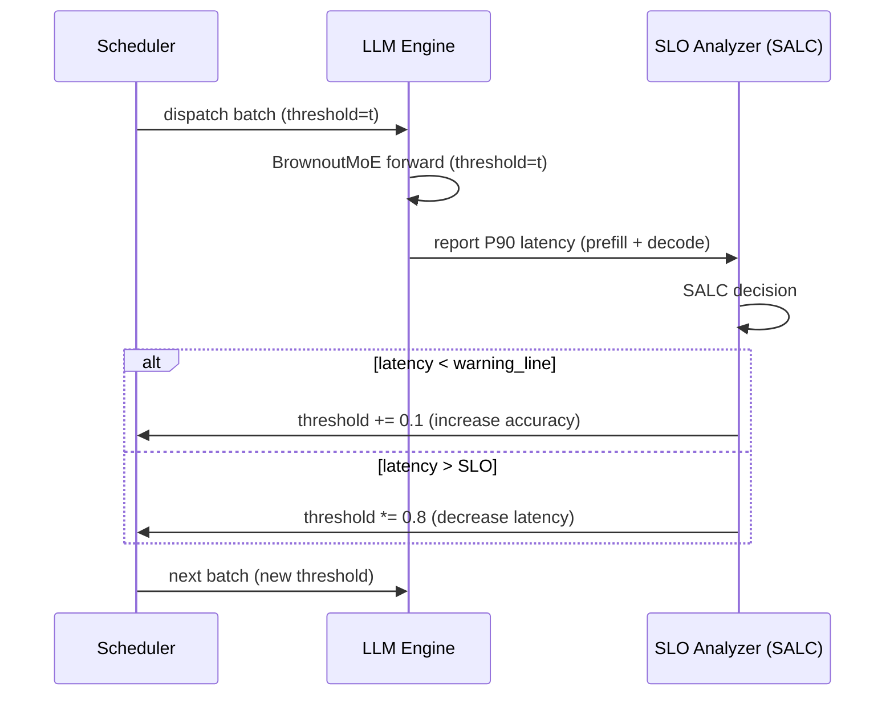
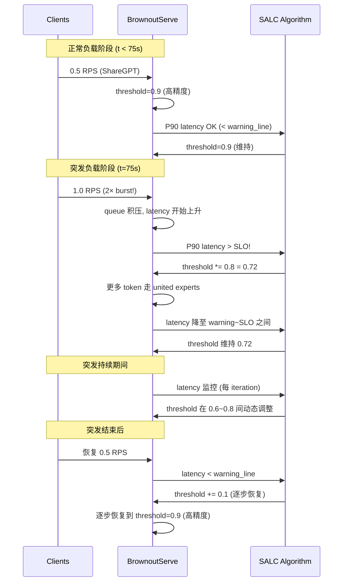

# 知识库_系统架构

## Sequence Migration (序列迁移)

术语解释
Sequence Migration 是 LUFFY 分布式 MoE 训练系统中提出的通信优化技术：在 MoE 的 combine phase 中，不再将 token 全部拉回原 GPU 重构序列，而是将整个序列迁移到其大部分 token 被 expert 处理所在的目标 GPU 上重构，从而将跨 GPU 的 token 拉取路径隐藏为 intra-GPU 路径。

术语是什么？
在标准 Expert Parallelism 的 MoE 训练中，每个 GPU 处理本地序列的 attention，然后将 token 通过 all-to-all dispatch 发送到持有对应 expert 的 GPU，expert 计算后再通过 all-to-all combine 将所有 token 拉回原 GPU 重构序列。Sequence Migration 的核心观察是：由于 biased expert activation（每个序列通常只激活少数几个 expert），序列的大部分 token 往往集中在少数 GPU 上被处理。与其将所有 token 拉回原 GPU，不如将序列迁移到 token 最集中的 GPU 上重构。

从系统架构角度拆解术语：
Sequence Migration 在 LUFFY 系统架构中的执行流程：

```
=== Sequence Migration 在两轮 MoE Block 之间的调度 ===

Block b:
  GPU 0: Attention(seq_0, seq_1) → tokens → Dispatch → Expert 0,1
  GPU 1: Attention(seq_2, seq_3) → tokens → Dispatch → Expert 2,3
  GPU 2: Attention(seq_4, seq_5) → tokens → Dispatch → Expert 0,1
  GPU 3: Attention(seq_6, seq_7) → tokens → Dispatch → Expert 2,3

  All-to-All Dispatch: tokens routed to target experts
  Expert FFN Computation (各 GPU 并行)

Combine Phase 决策:

Step 1 - Controller 收集分布信息:
    token_to_gpu[t] = GPU where token t was processed
    token_to_sequence[t] = which sequence token t belongs to
    
Step 2 - 对每个 sequence i，估算迁移到各 GPU 的 combine 流量:
    for GPU j in all_GPUs:
        # 计算 sequence i 中在 GPU j 以外被处理的 token 数
        f_{i,j} = count({t in seq_i | token_to_gpu[t] != j})
    
Step 3 - 选择 top-q 候选 GPU (最小 combine 流量):
    H^i = {j_1, j_2, ..., j_q} where f_{i,j} is minimized

Step 4 - Attention Cost Model 评估候选:
    for GPU j in H^i:
        B_{j←i} = current_batch[j] ∪ {seq_i}
        L_{j←i} = max(len(s) for s in B_{j←i})
        # Cost model: T_att(B, L) = (3BLd² + 2BL²d) / P
        ΔT = T_att(B_{j←i}, L_{j←i}) - T_att(B_j, L_j)
    
    j* = argmin(ΔT)  # 选择 attention 成本增长最小的 GPU

Step 5 - 迁移执行:
    sequence_to_gpu[i] = j*  # 更新哈希表
    # Combine 阶段按新映射路由 token

Block b+1:
  GPU 0: Attention(seq_0, seq_3, seq_5) ← 新增 seq_3, seq_5
  GPU 1: Attention(seq_2, seq_7)        ← 新增 seq_7
  ...
  # 相似长度的 sequences 聚集 → padding zeros 减少
```

术语一般如何实现？如何使用？
- 需要一个集中式 Controller 节点收集分布信息并执行迁移算法
- 三张哈希表管理路由状态：token_to_sequence、token_to_gpu、sequence_to_gpu
- 通过 `torch.distributed.rpc` API 指导 GPU 间的 token 交换
- Cost model 参数 P（GPU 速度）通过 profiling attention 层多次获得，平均估计误差 ~5%
- 候选数 q 的权衡：大 q→更多 flexibility 用于 attention batch 优化；小 q→更侧重最小化 combine 流量
- 与 Expert Transfer 的关键区别：不移动 expert 参数（保持最大 expert parallelism），而是改变序列的物理位置
- 适用于 MoE 训练场景，因 gate routing 使每个序列的 token 分布有偏向性

涉及论文标题：
- Communication-Efficient Sparsely-Activated Model Training via Sequence Migration and Token Condensation

---

## Expert Parallelism (专家并行)

术语解释
Expert Parallelism (EP) 是专为 Mixture-of-Experts 模型设计的分布式训练/推理并行策略：将 MoE 层中的多个 expert 分布到不同 GPU 上，而 self-attention 层等非 expert 组件在所有 GPU 上复制。每个 token 经过 gate network 路由后，通过 all-to-all 通信发送到持有对应 expert 的 GPU 执行 FFN 计算。

术语是什么？
Expert Parallelism 由 GShard (Lepikhin et al., 2020) 和 Switch Transformer (Fedus et al., 2022) 提出，是当前分布式 MoE 训练的主流并行方案（被 DeepSpeed-MoE、Tutel、FastMoE 等框架采用）。与 Data Parallelism（每 GPU 持有完整模型副本）和 Model Parallelism（切分单个层的参数）不同，Expert Parallelism 利用 MoE 的稀疏激活特性：每个 token 仅激活少数 expert，因此可以将所有 expert 分布到多 GPU 上，每次仅需传输 token 而非整个模型参数。

核心通信模式：
- **Dispatch Phase**: 每个 GPU 上的 token 经过 gate 后，通过 all-to-all 发送到持有对应 expert 的 GPU
- **Combine Phase**: expert 计算完成后，通过 all-to-all 将 token 输出拉回原 GPU 重构序列

从系统架构角度拆解术语：
Expert Parallelism 在一次 MoE Layer Forward Pass 中的完整流程：

```
=== 4 GPU, 4 Experts (每 GPU 1 个 expert), Top-2 Gating ===

初始化:
  GPU 0: Expert 0 + Attention params (复制)
  GPU 1: Expert 1 + Attention params (复制)
  GPU 2: Expert 2 + Attention params (复制)
  GPU 3: Expert 3 + Attention params (复制)

Step 1 - Local Attention (各 GPU 并行):
  GPU 0: x_0 = Attention(seq_0_tokens)  # 本地序列
  GPU 1: x_1 = Attention(seq_1_tokens)
  ...

Step 2 - Gate Routing (各 GPU 并行):
  GPU 0: gate_logits = x_0 @ W_gate → Top-2 → expert assignments
  # 结果: tokens of seq_0 需要 Expert 0,1,2,3 (分散)

Step 3 - All-to-All Dispatch:
  GPU 0 → GPU 0: tokens for Expert 0
  GPU 0 → GPU 1: tokens for Expert 1
  GPU 0 → GPU 2: tokens for Expert 2
  GPU 0 → GPU 3: tokens for Expert 3
  # 同时 GPU 1,2,3 也发送 tokens
  # 通信量: 2 × top_k × (EP-1)/EP × B × S × d

Step 4 - Expert FFN (各 GPU 并行):
  GPU 0: Expert_0_FFN(received_tokens_from_all)
  GPU 1: Expert_1_FFN(received_tokens_from_all)
  ...

Step 5 - All-to-All Combine:
  GPU 0 拉回 seq_0 的 tokens (来自 GPU 1,2,3)
  GPU 1 拉回 seq_1 的 tokens
  ...

Step 6 - Next Block Attention:
  GPU 0: Attention(seq_0)  # 序列在原 GPU 上继续
```

术语一般如何实现？如何使用？
- 主流实现：DeepSpeed-MoE、Tutel（Microsoft）、FastMoE、Megatron-LM
- 通信后端：NCCL all-to-all（GPU）、Gloo（CPU）
- 负载均衡：通过 auxiliary load balancing loss 和 capacity factor 限制每 expert 最大 token 数
- 主要瓶颈：all-to-all 通信时间占 training iteration 的 18.1%-47.5%（LUFFY 论文测量）
- 变体：
  - Hierarchical All-to-All (DeepSpeed-MoE): 节点内+节点间分层通信
  - Expert Tensor Sharding (MoEShard): 按 tensor 维度切分 expert 而非按 expert 分配 GPU
  - Hybrid Parallelism: 结合 Data/Model/Expert/Pipeline Parallelism
  - Context-Coherent Expert Parallelism (ExFlow): 通过 AllGather 使所有 GPU 持有全部 context，将每层 2 次 Alltoall 减为 1 次 + 1 次 iteration-end AllGather，消除 token gather Alltoall
	  - EPS-MoE 的并行选择：Attention 用 DP/TP（按注意力类型区分），MoE 用 EP，利用 EP 通信量天然小于 TP 的特性

涉及论文标题：
- EPS-MoE: Expert Pipeline Scheduler for Cost-Efficient MoE Inference
- Communication-Efficient Sparsely-Activated Model Training via Sequence Migration and Token Condensation
- Efficient MoE Serving in the Memory-Bound Regime Balance Activated Experts, Not Tokens
- DeepSeek-V2: A Strong, Economical, and Efficient Mixture-of-Experts Language Model（8-way EP with Device-Limited Routing M=3, 16-way ZB-Pipeline, ZeRO-1 DP, shared expert computation overlapped with EP all-to-all communication）

**METRO paper补充**: 在 memory-bound 的 decode 阶段，GPU runtime 不由处理的 token 数量决定，而由 "activated expert replicas" 数量决定。传统 EP 的 all-to-all dispatch 每个 GPU 只有本地 top-k 信息；METRO 提出将 all-to-all dispatch 替换为 all-gather，让每个 GPU 获得全局 token 集合后再执行 top-k 和 token routing。all-gather 在 memory-bound 小 batch 下的通信量虽有增加（256KB→2MB per GPU on 8 GPUs fp16），但带宽开销（~3μs on 600 GB/s NVLink）远低于 NCCL collective launch 固定开销（~100μs）。

---

## EPLB (Expert Parallelism Load Balancer)

术语解释
EPLB 是 DeepSeek 提出的 Expert Parallelism 负载均衡器，通过 expert replication 和 placement 策略平衡各 GPU 上的 token 负载。论文 METRO 将其 token routing 策略（均匀分配 tokens 到 replicas 上）作为对比 baseline。

术语是什么？
EPLB 由 DeepSeek 实现并开源（https://github.com/deepseek-ai/EPLB），是当前 MoE 推理系统中广泛采用的 EP 负载均衡方案（被 vLLM、SGLang 等框架集成）。EPLB 在两个步骤中平衡负载：(1) **Expert Replication**: 按上一时间窗口各 expert 处理 token 数的比例创建 replicas——热门 expert 获得更多 replicas，冷门 expert 保持单 replica；(2) **Expert Placement**: 将 replicas 放置在 GPU 上，目标是平衡各 GPU 期望处理的 token 数量。Placement 算法假设后续的 token routing 策略会均匀分配每个 expert 的 token 到其所有 replicas 上。EPLB 的 token routing（第三步）默认将每个 expert 的 token 均匀分配到其所有 replicas。

从系统架构角度拆解术语：
EPLB 在 MoE serving 系统中的执行流程：

```
=== EPLB 三步骤工作流（每时间窗口触发一次）===

Step 1 - Expert Replication:
Input: 上一窗口各 expert 处理的 token 数 stats[1..N], 总 GPU 内存容量
Output: 每个 expert 的 replica 数 R[1..N]
Algorithm:
  total_capacity = G * mem_per_gpu / sizeof(expert)
  for each expert i:
    R[i] = max(1, floor(stats[i] / sum(stats) * total_capacity))
  # 确保 sum(R[i]) <= total_capacity

Step 2 - Expert Placement:
Input: R[1..N], G 个 GPU
Output: placement matrix A[N][G]（expert i 的 replica 放在哪些 GPU）
Algorithm:
  贪心放置：将各 expert 的 replicas 分配到当前 token 负载最低的 GPU 上
  目标: 平衡各 GPU 的期望 token 数

Step 3 - Token Routing (EPLB default):
Input: 当前 batch 中每个 expert i 的 token 数 T[i], placement A
Output: 每个 token 路由到哪个 replica
Algorithm:
  for each expert i:
    evenly distribute T[i] tokens across its R[i] replicas
  # 这使得每个 GPU 上处理的 token 数尽量均衡
```

术语一般如何实现？如何使用？
- EPLB 被 vLLM 和 SGLang 等框架集成，用于 MoE 模型的 EP 部署
- 负载统计基于滑动时间窗口，周期性更新 replicas/placement
- EPLB 的核心假设是 "GPU runtime ∝ 处理 token 数"（compute-bound），但在 memory-bound decode 阶段不成立——METRO 论文实验显示 EPLB routing 在 1.5x replication 下使 activated experts 增加 ~30%，导致 decode latency 退化 14%
- 替代方案（如 METRO）：保留 EPLB 的 replication/placement 策略，但将 token routing 目标从"平衡 token 数"改为"最小化 activated experts 数"
- GitHub: https://github.com/deepseek-ai/EPLB

涉及论文标题：
- Efficient MoE Serving in the Memory-Bound Regime Balance Activated Experts, Not Tokens

---

## Token Routing in MoE Expert Parallelism

术语解释
Token Routing 是 Expert Parallelism 中的第三阶段（在 expert replication 和 placement 之后），负责将每个 GPU 上的 token 按 top-k gating 结果路由到对应 expert 的具体 replica 上。它决定每个 expert replica 是否被激活来处理 token。

术语是什么？
在 EP MoE 推理中，token routing 解决的问题是：对于每个 token，经过 router 选出 top-k experts 后，若某个 expert 有多个 replicas（分布在多个 GPU 上），应将 token 发送到哪个 replica？传统方法（EPLB default）将每个 expert 的 token 均匀分配到所有 replicas 以平衡各 GPU 的 token 数。METRO 提出 counter-intuitive 的方法：在 memory-bound 的 decode 阶段，应将每个 expert 的所有 token 集中路由到单个 replica 以最小化 activated experts 数量，从而减少 HBM → Tensor Core 的 weight 加载内存流量。

从系统架构角度拆解术语：
Token routing 在 EP inference pipeline 中的位置：

```
=== MoE Layer Forward Pass with Expert Replication ===

1. Gate/Router: x → W_g → TopK → selected experts {e1, e2}
2. Token Routing (本术语): 
   对于选中的每个 expert e，token 应发到 e 的哪个 replica？
   
   EPLB routing (token-balancing):
     e1 有 3 replicas (GPU 0,3,5)，9 tokens 选中 e1
     → 每个 replica 收到 3 tokens（均匀分配）
     → 3 个 replicas 全部激活，各自计算 3 个 token
     
   METRO routing (expert-minimizing):
     e1 有 3 replicas (GPU 0,3,5)，9 tokens 选中 e1
     → 查 L[0..2] = 当前各 GPU activated expert 计数
     → 选 L 最小的 GPU（如 GPU 5, L[5]=0）
     → 所有 9 tokens 路由到 GPU 5 的 e1 replica
     → 仅 1 个 replica 被激活
     
3. All-to-all/All-gather Dispatch: 实际数据传输
4. Expert FFN: 在激活的 replica 上计算
5. All-to-all Combine: 结果返回原 GPU
```

术语一般如何实现？如何使用？
- Token routing 通常与 expert placement 协调——placement 决定 replicas 的 GPU 位置，routing 决定运行时 token 流向
- 实现方式：(a) **Token-balancing**（EPLB, Tutel, FasterMoE 等）：均匀分配 tokens；适合 compute-bound prefill 阶段；(b) **Expert-minimizing**（METRO）：最小化 activated experts；适合 memory-bound decode 阶段
- METRO 的路由决策在单 SM 的 CUDA kernel 中完成，使用 test-and-set lock 和 SM shared memory 计数器
- 路由质量衡量：max activated experts per GPU per decode batch

涉及论文标题：
- Efficient MoE Serving in the Memory-Bound Regime Balance Activated Experts, Not Tokens

---

## Expert Replication (in MoE Serving)

术语解释
Expert Replication 是在 Expert Parallelism 部署中为热门 expert 创建多个副本（replicas）的策略。通过将同一 expert 的多个副本放置在不同 GPU 上，避免热门 expert 所在 GPU 成为瓶颈，实现 token 负载的分散。

术语是什么？
在 MoE 推理中，不同 expert 被选中的频率差异很大——少数"热门 expert"（如 shared expert 或通用专家）处理了大部分 token。当 EP 将每个 expert 完整放在单一 GPU 上时，持有热门 expert 的 GPU 会因处理过多 token 而成为瓶颈。Expert Replication 通过创建热门 expert 的额外副本并分布到负载较轻的 GPU 上来缓解这一问题。EPLB 按比例复制：expert 处理的 token 越多，获得越多的 replicas。Replication 因子（如 1.5x）表示总 replicas 数 / 总 experts 数。

从系统架构角度拆解术语：
Expert replication 在 workload 下的效果：

```
=== No Replication (1.0x): 8 GPUs, 128 experts ===
每个 expert 仅在一个 GPU 上
问题: Expert 0 处理 30% tokens → GPU 持有 Expert 0 处理 token 数远超其他 GPU
→ EP load imbalance → 快 GPU 等待慢 GPU

=== 1.5x Replication: 8 GPUs, 192 replicas ===
热门 experts 有 2-3 个 replicas，冷门保持 1 个
热门 Expert 0 有 3 replicas → 分布到 GPU 0, 3, 5
token routing 将 Expert 0 的 tokens 分配到 3 个 replicas 上
→ compute-bound prefill 性能提升（-17% TTFT at 1.5x）

但副作用（METRO 揭示）:
→ memory-bound decode 下 activated experts 增加 ~30% at 1.5x
→ HBM → Tensor Core weight 加载量增加
→ decode latency 退化 +14% at 1.5x
```

术语一般如何实现？如何使用？
- EPLB 实现：根据滑动窗口内各 expert 的 token 计数确定 replica 数，容量约束为总 GPU 内存可容纳的总 expert 数
- 在 memory-bound decode 阶段，高 replication 因子反而有害（METRO 发现），需要在 prefill（受益于 replication）和 decode（受损害于 replication）之间权衡
- METRO 的策略：保持 replication 以优化 prefill，但通过 expert-minimizing token routing 消除 replication 对 decode 的副作用
- Replication 也增加内存压力——每个 replica 占用额外 GPU 内存，限制了可为 prefill 分配的 KV cache 空间

涉及论文标题：
- Efficient MoE Serving in the Memory-Bound Regime Balance Activated Experts, Not Tokens

---

## Expert Transfer (MoE Training Paradigm) (专家迁移)

术语解释
Expert Transfer 是分布式 MoE 训练中与 Expert Parallelism 竞争的一种通信优化范式：不通过 all-to-all 传输 token，而是将需要的 expert 参数复制到本地 GPU。代表性工作包括 Janus (SIGCOMM 2023) 和 FasterMoE (PPoPP 2022)。

术语是什么？
在标准 Expert Parallelism 中，token 通过 all-to-all 在 GPU 间移动。Expert Transfer 反其道而行：当某个 GPU 上的 token 需要访问远程 expert 时，将远程 expert 的权重参数复制到本地 GPU，在本地执行 FFN 计算。这种方法的动机是：在某些场景下 expert 参数大小可能小于需要传输的 token 总大小。

从系统架构角度拆解术语：
Expert Transfer 的执行流程：

```
=== 3 GPU, 3 Experts, Top-2 Gating ===

策略: 当 GPU 0 上的 token 需要 Expert 1,2 时:

Option A: Expert Parallelism (传 token)
  GPU 0 → GPU 1: send tokens → GPU 1 runs Expert 1 → send back results
  GPU 0 → GPU 2: send tokens → GPU 2 runs Expert 2 → send back results
  通信: all-to-all (2 × all-to-all per MoE layer)

Option B: Expert Transfer (传 expert 权重)
  GPU 0: 从 GPU 1 拉取 Expert 1 权重 → 本地执行
  GPU 0: 从 GPU 2 拉取 Expert 2 权重 → 本地执行
  通信: P2P expert weight transfer (仅传输 expert 参数)

Expert Transfer 导致的问题:
  GPU 0 现在有 3 个 experts (本地 Expert 0 + 远程 Expert 1,2)
  → Expert computation time 增长 (MoE-BERT-Large: 3 experts → 1.88×)
  → GPU 显存竞争
  → Expert parallelism 度降低
```

术语一般如何实现？如何使用？
- Janus (SIGCOMM 2023): 设计算法决定何时以何种方式获取远程 expert，采用 data-centric 范式
- FasterMoE (PPoPP 2022): 动态 shadowing 策略，仅传输 popular expert
- 适用条件：expert 参数大小 < 需要传输的 token 总大小时有效
- 局限：随 expert 增大（如 Mixtral 8×7B 每个 expert ~300MB），expert 传输成本增加；多 expert 共享 GPU 导致资源竞争和并行度下降
- LUFFY 的立场：完全禁止 expert 移动，通过 Sequence Migration + Token Condensation 替代

涉及论文标题：
- Communication-Efficient Sparsely-Activated Model Training via Sequence Migration and Token Condensation

---

## Dispatch/Combine Phase (MoE All-to-All Communication)

术语解释
Dispatch Phase 和 Combine Phase 是 Expert Parallelism 中两次 all-to-all 通信的阶段名称：Dispatch 阶段将 token 从 gate 所在 GPU 发送到 expert 所在 GPU；Combine 阶段将 expert 输出从 expert 所在 GPU 拉回原 GPU 重构序列。

术语是什么？
在 MoE 的 Expert Parallelism 中，每个 MoE layer 需要两次 all-to-all 通信：
- **Dispatch Phase**: gate network 输出每个 token 的目标 expert 后，token 通过 all-to-all scatter 发送到持有对应 expert 的 GPU。通信模式是全对全的——每个 GPU 可能向每个其他 GPU 发送 token。
- **Combine Phase**: expert FFN 计算完成后，每个 GPU 上的 token 输出需要通过 all-to-all gather 拉回其原始 GPU，以便重构序列并继续执行下一 block 的 attention 层。

从系统架构角度拆解术语：
一次 MoE Layer 中 Dispatch 和 Combine 的完整时序：

```
Timeline (4 GPU, 8 sequences):

GPU 0: |-- Attention --|-- Gate --|====== Dispatch All-to-All ======|
GPU 1: |-- Attention --|-- Gate --|====== Dispatch All-to-All ======|
GPU 2: |-- Attention --|-- Gate --|====== Dispatch All-to-All ======|
GPU 3: |-- Attention --|-- Gate --|====== Dispatch All-to-All ======|

GPU 0: |== Expert 0 FFN ==|====== Combine All-to-All ======|
GPU 1: |== Expert 1 FFN ==|====== Combine All-to-All ======|
GPU 2: |== Expert 2 FFN ==|====== Combine All-to-All ======|
GPU 3: |== Expert 3 FFN ==|====== Combine All-to-All ======|

GPU 0: |-- Next Attention (序列已重构) --|
GPU 1: |-- Next Attention (序列已重构) --|
...

通信瓶颈:
  Dispatch + Combine 占 training iteration time 的 18.1%-47.5%
  (取决于 model, batch size, expert 数量)
```

术语一般如何实现？如何使用？
- 底层通信原语：NCCL all-to-all（GPU）、PyTorch distributed
- 优化方向：
  - LUFFY Sequence Migration: 改变 Combine 的目标 GPU，减少跨 GPU 拉取
  - LUFFY Token Condensation: 减少 Dispatch 的 token 数量
  - Lina: all-to-all 与 allreduce 的优先级调度 + micro-op pipelining
  - DeepSpeed-MoE: Hierarchical All-to-All（节点内+节点间分层）
  - Tutel: 自适应并行度 + all-to-all overlap
  - ExFlow: 通过共享 context 将两次 all-to-all 减少为一次

涉及论文标题：
- Communication-Efficient Sparsely-Activated Model Training via Sequence Migration and Token Condensation

---

## Brownout Approach for LLM Serving (LLM 推理服务的 Brownout 降级策略)

术语解释
Brownout Approach 是借鉴电力系统"降压限电"概念的一种服务降级策略：在计算资源紧张或突发流量时，通过动态降低部分请求的处理质量来保证整体服务的 SLO。BrownoutServe 将其应用于 MoE LLM 推理：用 united expert 替代部分原始 expert 处理 token，以精度换延迟。

术语是什么？
Brownout 在云计算的原始定义（Xu et al. 2016-2021）：在负载高峰期，根据 dimmer 值（0-1）概率性地停用非必需的应用组件，以维持核心服务的可用性和响应时间。BrownoutServe 将此概念迁移到 LLM 推理领域：

- **电力系统 Brownout**: 电压降低 → 非必要设施断电 → 保障关键基础设施
- **LLM 推理 Brownout**: threshold 降低 → 部分 token 走 united expert（精度略降）→ 保障 SLO

核心量化关系：threshold ∈ [0,1] 决定多少比例 token 由原始 experts 处理。threshold=1 为零降级（最高精度），threshold=0 为全降级（最低延迟）。SALC 算法动态调节 threshold。

从系统架构角度拆解术语：
Brownout approach 在 BrownoutServe 系统架构中的运转流程：

```
请求流 → Scheduler (FCFS + ContinuousBatching)
           │
           ├──→ LLM Engine Forward Pass
           │      │
           │      ├── Attention (FlashAttention + PagedAttention)
           │      │
           │      └── BrownoutMoE ← threshold 参数
           │            │
           │            ├── Gate routing (标准)
           │            ├── Token 统计 & Expert 排序
           │            ├── threshold 划分 S1 vs S2
           │            ├── S1 → 原 experts FFN
           │            └── S2 → United experts FFN
           │
           └──→ SLO Analyzer (每 iteration)
                  │
                  ├── get P90 latency (TTFT/TPOT)
                  ├── if latency < warning_line → threshold↑ (提升精度)
                  ├── if latency > SLO → threshold×shrink_ratio (降延迟)
                  └── else → threshold 维持
```

三种 brownout 策略：
1. **Zero-Brownout**: threshold=1，所有 token 走原 experts，等价于标准 MoE 推理
2. **Full-Brownout**: threshold<1 且 use_full_brownout=true，S2 tokens 被直接跳过不处理
3. **Partial-Brownout**: threshold<1 且 use_full_brownout=false，S2 tokens 走 united experts

术语一般如何实现？如何使用？
- 实现依赖 united experts 的预训练（离线知识蒸馏）
- SALC 算法参数：warning_factor（如 0.8）、increment（如 0.1）、shrink_ratio（如 0.8）
- 适用场景：Bursty workloads 下的 chatbot、实时推荐、API 服务等延迟敏感应用
- 与水平扩展的互补性：水平扩展需 1-2 分钟冷启动，Brownout 在秒级内响应突发流量；两者可级联使用

涉及论文标题：
- BrownoutServe: SLO-Aware Inference Serving under Bursty Workloads for MoE-based LLMs

## SLO-Aware Latency Control (SALC) Algorithm (SLO 感知延迟控制算法)

术语解释
SALC 是 BrownoutServe 中动态调节 brownout threshold 的反馈控制算法。它基于实时 P90 latency 监控，在 SLO warning line 和 SLO 之间维持推理延迟，同时最大化 threshold（即最大化精度）。

术语是什么？
SALC 解决的核心优化问题（Eq. 9）：

$$\text{maximize} \quad \frac{1}{n} \sum_{i=1}^{n} \text{Accuracy}^{i}(\text{threshold}, k)$$
$$\text{subject to} \quad \text{Latency}^{i}_{j}(\text{threshold}, k) \leq \text{SLO}, \quad \forall i, \forall j$$

其中 way=k 变化频率低（涉及 united expert 重新加载），threshold 可每 iteration 调整（zero overhead）。Accuracy 是 threshold 的单调递增函数，因此优化目标等价于：在不违反 SLO 约束的前提下最大化 threshold。

从系统架构角度拆解术语：
```
Algorithm SALC (per iteration):
Input: current threshold, SLO, warning_factor, time_window tw,
       increment, shrink_ratio

1. warning_line = SLO * warning_factor     # e.g. 0.25s * 0.8 = 0.20s
2. latency = get_recent_P90_latency(threshold, tw)
3. if latency < warning_line:
       threshold = threshold + increment   # 线性增加 → 提升精度
   elif latency > SLO:
       threshold = threshold * shrink_ratio # 乘性缩减 → 快速降延迟
   # else: 在 warning_line 和 SLO 之间 → 维持不变
4. return threshold
```

SALC 在 BrownoutServe 中的集成位置：



术语一般如何实现？如何使用？
- **参数选择**：warning_factor=0.8（常见配置），increment=0.1（线性步长），shrink_ratio=0.8（乘性因子，快速反应）
- **关键设计选择**：乘性缩减 vs 线性增加的**非对称性**——突发时快速降低 threshold 保 SLO，恢复时缓慢提升 threshold 保精度
- **时间复杂度**：O(n log n)，n 为 time window 内 token 数（需排序求 P90）
- **与相关方法的区别**：不同于 AdaServe 的 SLO-customized token tree（基于 budget 约束的静态分配），SALC 是闭环反馈控制；不同于 MuxWise 的 SM partitioning（基于硬件资源分配），SALC 是算法级降级

涉及论文标题：
- BrownoutServe: SLO-Aware Inference Serving under Bursty Workloads for MoE-based LLMs

## Bursty Workload Handling in MoE LLM Serving (MoE LLM 推理中的突发负载处理)

术语解释
Bursty workload 指请求到达率在短时间内急剧增加的负载模式（如 chatbot 高峰期、热点事件触发），MoE 模型因参数规模大而对此尤为敏感。BrownoutServe 通过 brownout 降级而非水平扩展来处理突发负载。

术语是什么？
突发负载在 LLM 推理服务中的特征：
- **到达模式**：短时间窗口内请求率翻倍或更多（论文中 0.5→1.0 RPS, 1.0→2.0 RPS 翻倍场景）
- **传统方案与问题**：水平扩展（Kubernetes HPA、新 GPU 实例）→ 30-60s 实例初始化 + 30-90s MoE 模型加载 → 总延迟 1-2 分钟 → 突发结束后资源闲置
- **Brownout 方案**：不增加硬件资源，通过降级部分 token 的处理质量（threshold↓）降低 per-token latency → 同硬件吞吐量提升 1.07×-2.07× → 突发响应延迟在秒级

从系统架构角度拆解术语：
突发负载处理在 BrownoutServe 中的时序：



术语一般如何实现？如何使用？
- **适用场景**: chatbot/实时对话（用户高峰期）、推荐系统（热点事件）、API 网关（突发调用）
- **与水平扩展的级联**：Brownout 作为第一道防线（秒级响应），水平扩展作为第二道防线（分钟级，处理持续高负载）
- **关键指标**: SLO violation rate reduction（BrownoutServe 减少 90.28%），accuracy loss（~5%）

涉及论文标题：
- BrownoutServe: SLO-Aware Inference Serving under Bursty Workloads for MoE-based LLMs


## Expert Parallelism

术语解释
Expert Parallelism（EP）是MoE模型特有的分布式并行策略，将不同的expert分布到不同设备上，利用MoE稀疏激活特性使每个token仅访问部分设备上的expert，从而实现模型并行。

术语是什么？
Expert Parallelism的核心机制：
- 每个设备持有部分expert（可能1个或多个）+ 全部非expert参数（attention、layer norm等）
- 执行MoE层时，先在各设备本地完成attention和router计算
- 通过All-to-All通信将token重新分发到持有对应expert的设备
- 各设备计算其expert，再通过All-to-All通信将结果传回原始设备
- 执行时间主要由计算和通信两个阶段主导

EP通常与其他并行策略（Data Parallelism、Tensor Parallelism、Pipeline Parallelism）结合使用：
- 3D混合并行（Data + Tensor + Expert）：DeepSpeed-TED
- Intra-operator + Inter-operator重新分类：Alpa
- MoDa（MoE Parallism + Data Parallelism）：BaGuaLu

从系统架构角度拆解术语。
以Tutel的自适应并行策略为例，一个MoE层的端到端执行：
1. **输入准备**：batch tokens分布在各GPU上，每GPU持有全部非expert参数
2. **本地计算**：每GPU对本地token执行Attention + Router → 得到每个token的expert选择
3. **All-to-All Dispatch**：Router输出决定token的目标GPU → NCCL All-to-All通信重分发token
4. **Expert计算**：GPU收到token后对本地expert执行FFN
5. **All-to-All Combine**：将expert输出传回原始GPU
6. **输出聚合**：加权合并各expert输出

系统优化方向：
- 分层All-to-All（intra-node + inter-node分离）
- Expert放置优化（Prophet的贪心搜索、FlexMoE的细粒度复制）
- 负载均衡（Lazarus的expert副本分配、Brainstorm的历史分配数据）
- 通信与计算重叠（ScMoE的shortcut架构、EPS-MoE的动态kernel选择）
- 减少通信操作数（ExFlow将两次All-to-All减少为一次）

术语一般如何实现？如何使用？
- 基于DeepSpeed-MoE、Tutel、FasterMoE等分布式MoE训练/推理框架
- 基于NCCL或专用通信库（如DeepEP）的GPU间通信
- 关键配置参数：expert并行度（EP size）、expert副本数、容量因子（token buffer大小）
- 推理场景下，EP通常与vLLM等serving框架结合

涉及论文标题：
- A Survey on Inference Optimization Techniques for Mixture of Experts Models
- A Survey on Mixture of Experts in Large Language Models
- Accelerating Distributed MoE Training and Inference with Lina
- Accelerating MoE Model Inference with Expert Sharding
- Beyond Distillation Task-level Mixture-of-Experts for Efficient Inference
- Capacity-Aware Inference Mitigating the Straggler Effect in Mixture of Experts
- Aria An Open Multimodal Native Mixture-of-Experts Model（ARIA 训练使用 expert parallelism + ZeRO-1 data parallelism 组合，未使用 tensor parallelism 以减少通信开销；基于修改版 Megatron 框架，66 experts 分布在多个 GPU 上，attention 参数和 shared experts 在所有 GPU 上复制，routed expert FFN 参数通过 EP 分片；训练时 visual encoder 参数在所有 GPU 上复制（data parallel））
- Comet Fine-grained Computation-communication Overlapping for Mixture-of-Experts（Comet 在 Megatron-LM 的 EP 基础上用 NVSHMEM 替代 NCCL all-to-all 进行 token 级通信，通过 shared tensor dependency resolving + thread block specialization 实现 kernel 内通信-计算重叠，hide 86.5% 通信延迟。EP 配置下每 GPU 持有 1 至多个 expert，token 通过 NVSHMEM fine-grained get/put 而非 NCCL all-to-all 在 GPU 间路由）

**Comet 对 Expert Parallelism 的优化**：
Comet 不改动 EP 的 expert-to-device 映射关系，而是在通信机制层面将 NCCL all-to-all（coarse-grained, 完整大 tensor）替换为 NVSHMEM（fine-grained, token 级 intra-kernel I/O）。这使得：(1) 每个 token 到达后立即可被计算消费，不再等待整批 all-to-all 完成；(2) 通信和计算融合在单一 GPU kernel 中，消除 CPU 端 kernel launch/scheduling overhead；(3) 不同 EP/TP 组合下通过 adaptive thread block assignment 自动选择最优 SM 资源分配。在 H800 (NVLink) 上 1.96× 单层加速、1.71× 端到端加速；在 L20 (PCIe 25 GB/s) 上 1.19-1.46× 加速。

**Lina 对 Expert Parallelism 的扩展**：
Lina 在标准 Expert Parallelism（1 device = 1 expert）基础上引入两种动态调整机制：
1. **Expert Packing (Training)**: 当 FFN micro-op time << All-to-All micro-op time 时，动态 pack 多个 experts 到同一 device（2^n 递增），使 FFN 总时间对齐 All-to-All time，消除 pipeline bubble。Packing factor 调整频率: 每 10 steps。使用 DRAM-offloading 处理 GPU memory 不足。
2. **Dynamic Expert-Device Mapping (Inference)**: 不再固定 1:1 mapping。基于 expert popularity estimation，将 popular experts 复制到多 device，unpopular experts 打包到少 device。使用 first-fit-decreasing heuristic 最小化总 device 数。Scheduling 在每 MoE 层执行（two-phase）。

**MoEShard 对 Expert Parallelism 的替代**：
MoEShard 从根本上放弃了 Expert Parallelism（完整 expert 放置到不同 GPU），转而使用 Expert Sharding（将每个 expert 的矩阵沿 tensor 维度切分到所有 GPU）。区别：
- EP: GPU_i 持有完整 expert E_i, E_{i+1}, ... → 通过 all-to-all scatter/gather 路由 token → load imbalance 由 routing skew 决定
- MoEShard: 每个 GPU 持有所有 expert 的 1/|G| shard → 所有 token 全复制到所有 GPU → 每 GPU 计算全部 token 的 partial output → perfect load balancing，无需 all-to-all scatter/gather

**Task-MoE 对 Expert Parallelism 的消除（Kudugunta et al., EMNLP 2021）**：
Task-MoE 通过 task-level routing 从根本上消除了解码时的 Expert Parallelism 需求。因为同一 task 的所有 token 路由到相同的 experts，每个 task 仅需将 K=2 个 experts 加载到单加速器，无需跨设备 all-to-all 通信。Token-MoE 解码时 26.9%-36% step time 用于跨设备通信，Task-MoE 仅 0.0%-0.2%。不同 task 可在不同设备上独立并行解码，实现天然的多 task 并行。

涉及论文标题：
- Beyond Distillation Task-level Mixture-of-Experts for Efficient Inference
- Capacity-Aware Inference Mitigating the Straggler Effect in Mixture of Experts

**Capacity-Aware Inference 对 Expert Parallelism 的优化**：
Capacity-Aware Inference 识别了 EP 推理中的 Straggler Effect：MoE 层延迟 L ∝ max({N_i})，由最高负载 expert 决定。EP 下每 GPU 托管 n_l 个 expert，straggler expert 延迟通过 All-to-All barrier 传播到所有 GPU。Capacity-Aware Token Drop 和 Expanded Drop 在 All-to-All 通信前施加容量约束 C=γN̄，减少 straggler expert 负载。效果与 per-GPU expert 数负相关：Mixtral (1-2E/GPU) 获 1.85-1.87× 加速，OLMoE (8E/GPU) 加速显著降低。论文建议分配更多 GPU 做 EP 以增强容量约束效果。

---

## GShard

术语解释
GShard 是 Google 提出的一个将条件计算（MoE）与自动分片结合的模块，用于将巨型 Transformer 模型扩展到 600B+ 参数。由 Lepikhin et al. (2020, ICLR 2021) 提出，这篇论文的 Task-MoE 基于 GShard 框架实现。

术语是什么？
GShard 由两部分组成：
1. **轻量级标注 API**：`replicate()`, `split()`, `shard()` 等原语，用户标注关键 tensor 的分区策略
2. **XLA 编译器扩展**：SPMD (Single Program Multiple Data) 变换，自动将标注传播为全图并行化
核心技术：sparsely-gated MoE layers with top-2 gating + expert capacity limits + local group dispatching + auxiliary load balancing loss。在 2048 TPU v3 上 4 天训练 600B 参数 MNMT 模型。关键发现：模型规模增大 16x（37.5B→600B），计算仅增长 3.6x（6→22 TPU v3 core-years），实现次线性扩展。

从系统架构角度拆解术语。
GShard 的 SPMD 分区方式：
- 非 expert 参数（attention, layer norm）：replicated across all devices
- Expert 参数：partitioned across devices（每个 device 持有部分 expert）
- Token routing：top-2 gating + expert capacity limit（超限 token drop）
- 通信：All-to-All dispatch + combine per MoE layer

Task-MoE (Kudugunta et al., 2021) 基于 GShard 但修改了 routing：将 per-token GATE(x_s) 改为 per-task GATE(task_id)，使得 decoder 不需要 GShard 的 expert 分区——每 task 只需 2 个 experts 在单设备。

术语一般如何实现？如何使用？
- Google 内部 TensorFlow/Lingvo 框架，未开源
- 后续衍生：GSPMD (Xu et al., 2021) 泛化为通用 ML 图自动并行化；GLaM (Du et al., 2022) 进一步扩展为语言模型
- Cloud TPU v3/v4 为 GShard 的主要目标硬件

涉及论文标题：
- Beyond Distillation Task-level Mixture-of-Experts for Efficient Inference

---

术语是什么？
Expert Offloading的核心理念：
- GPU显存中保留所有非expert权重 + 部分关键expert（称为Expert Cache）
- 不常用的expert卸载到CPU内存或SSD（称为next-level memory）
- 推理时，当需要GPU cache中缺失的expert时，从下级存储加载并替换cache中的expert
- 利用跨层预测来预取即将需要的expert（基于残差结构的跨层隐藏状态相似性，预测准确率约90%）

从系统架构角度拆解术语。
以HOBBIT的三层架构为例：
**Layer级 - 自适应预取**：
```
# 当前层l计算时，用当前gate输入预测第l+1层需要的expert
def prefetch_next_layer_experts(current_gate_input):
    next_gate_output = router_l+1(current_gate_input)  # 预计算
    next_experts = TopK(next_gate_output, K)
    for e in next_experts:
        if e not in gpu_cache:
            async_load_from_cpu(e)  # 异步预取，与当前计算重叠
```

**Token级 - 动态精度加载**：
```
def load_expert_with_adaptive_precision(expert_id, gate_score):
    importance = compute_importance(gate_score)
    if importance < threshold:
        return load_low_precision(expert_id)  # INT4, 加载快
    else:
        return load_high_precision(expert_id) # FP16, 精度高
```

**Sequence级 - 多维缓存策略**：
- LRU（Least Recently Used）：最近使用的expert更可能再次使用
- LFU（Least Frequently Used）：使用频率高的expert应保留在cache中
- LHU（Least High Precision Used）：高精度expert加载代价大，优先保留在cache中（HOBBIT特有）

术语一般如何实现？如何使用？
- GPU显存划分：非expert参数常驻 + Expert Cache（如20-30%显存用于cache）
- 预测机制：基于残差结构（x_{l+1} ≈ x_l + residual），使用当前gate输入预测下层expert
- CPU-GPU数据传输通过PCIe，加载延迟远高于GPU计算（约占总推理时间的80%+）
- 也支持CPU辅助计算（Fiddler将激活值拷贝到CPU计算expert再拷回，比加载expert到GPU更快）
- APTMoE 将 CPU 的角色扩展为**计算参与者**：低热度 expert 在 CPU 就地执行（权重已在 host memory，无需数据传输），仅高热度 expert 加载到 GPU。相比传统 expert offloading（CPU 仅作存储），APTMoE 同时减少数据搬移量并利用 CPU 计算资源，在带宽受限环境下实现最高 33% 吞吐提升
- 适用于：单GPU环境（Jetson Orin等边缘设备）、内存受限环境、带宽受限的 MoE 微调场景
- **训练时 Expert Offloading 优化（CoSMoEs 视角）**：与上述所有推理时优化正交，CoSMoEs 通过 Block-wise Expert Selection (BlES) 训练损失从源头减少 expert 切换频率——在训练阶段鼓励模型在连续 token 上选择相同的 expert 集合。标准 MoE 的 Expert Replacement Ratio 为 43.82%（约每 2-3 token 切换一次），BlES 训练后降至 6.55%（6.7× reduction），生成速度从 15.02 提升至 23.10 tok/s（1.54×）。该方法无需额外推理时预测组件，但需在训练时调整损失函数。可与推理时预取/缓存方法叠加使用

涉及论文标题：
- A Survey on Inference Optimization Techniques for Mixture of Experts Models
- A Survey on Mixture of Experts in Large Language Models
- APTMoE Affinity-Aware Pipeline Tuning for MoE Models on Bandwidth-Constrained GPU Nodes
- CoSMoEs Compact Sparse Mixture of Experts
- Accelerating Mixture-of-Experts Inference by Hiding Offloading Latency with Speculative Decoding

---

## Expert Cache / Expert Prefetching

术语解释
Expert Cache是GPU显存中保留高频使用expert子集的缓存区域。Expert Prefetching是提前预测并异步加载即将需要的expert到GPU cache中的技术，以隐藏加载延迟。

术语是什么？
Expert Cache管理策略：
- **LRU策略**（Mixtral-Offloading、EdgeMoE等）：基于"最近使用的expert更可能再次被使用"的假设。在Mixtral-8x7B中，第i个token选中的expert有>10%的概率在第i+1个token仍被选中。
- **LFU策略**（MoE-Infinity）：基于请求级使用频率追踪，使用频率高的expert优先级高
- **静态重要性配置**（Fiddler）：使用静态数据集profile expert的活跃次数作为重要性度量
- **动态缓存更新**（SwapMoE）：基于定义的expert重要性分数动态更新缓存
- **自适应缓存大小**（AdapMoE）：不同层使用不同缓存大小（激活expert多的层分配更大cache）
- **混合精度缓存**（HOBBIT）：结合LRU + LFU + LHU（高精度优先）三维策略
- **Cache-aware Routing**（CacheMoE）：调整router logits使已缓存expert更可能被选中

Expert Prefetching策略：
- **跨层预测**：基于残差结构，用当前gate输入预测下层expert（准确率约90%）
- **预测表**（EdgeMoE）：校准数据集构建层间expert激活的统计相关表
- **学习型预测器**（ProMoE）：两层MLP预测器，滑窗预取（可预测第i+k层，k为窗口大小）
- **一次性全序列预测**（ExpertFlow/SiDA）：transformer/LSTM预测器一次性预测整个forward pass所需所有expert

从系统架构角度拆解术语。
以ProMoE的Expert Prefetching为例：
```
# 离线阶段：训练预测器
for iteration in range(num_iterations):
    # 正常MoE推理，收集训练数据
    for layer l:
        x_l = layer_input[l]
        experts_l = router(x_l).TopK(K)
        # 记录 (x_l, experts_{l+k}) 作为训练对
        training_data.append((x_l, experts_{l+k}))

# 训练预测器（两层MLP）
predictor = MLP([d_model, d_hidden, N_experts])
predictor.train(training_data)  # classification: predict expert active/idle

# 在线阶段：使用预测器
for layer l:
    # 预取第l+k层的expert
    predicted_experts = predictor(layer_input[l])
    async_prefetch(predicted_experts)  # 与当前层计算重叠
    # 正常计算第l层
    output_l = moe_layer[l](layer_input[l])
```

术语一般如何实现？如何使用？
- GPU显存中划分dedicated expert cache区域
- 异步预取需要非阻塞I/O支持（CUDA streams + CPU线程）
- 预测准确率直接影响端到端延迟（错误预测触发同步加载，成为瓶颈）
- 滑窗大小k需平衡预取提前量和预测准确率

**ExpertFlow的Routing Path Predictor (RPP)** 将预测提升到全局一次性层面：
- 使用T5-style encoder-decoder架构，在单次前向传播中预测所有token在所有MoE层的expert激活，输出形状 (B, S, L, E) 的概率矩阵
- 训练：离线收集30,000个(input, output, routing_path)三元组，使用binary cross-entropy多标签分类（loss: `(1/LE) Σ [r*log(p) + (1-r)*log(1-p)]`）
- 模型仅7.21 MB（FFN dim=2048, hidden size=32），跨域泛化仅下降5-10%准确率
- 与ProMoE逐层预测对比：RPP提前暴露完整routing plan，支持早期prefetch和全局调度

**ExpertFlow的Predictive Locality-aware Expert Caching (PLEC)** 将预测驱动自适应槽位分配引入缓存：
- 基于RPP预测自适应分配各层cache slot（如layer_1需求3 experts、layer_2需求2 experts、总容量4 → 分配3:1）
- 预取预测的最可能expert集合
- Runtime slot复用：early-layer expert完成后释放slot供后续层加载
- Real-time Correction：miss的expert通过异步加载与正在运行的expert compute重叠
- 在Switch-32上PLEC hit ratio 91.90%（CS=16, BS=4），比LRU高15-36%，在大batch下优势更大（CS=8, BS=16: PLEC 71.89% vs LRU 36.22%）

涉及论文标题：
- A Survey on Inference Optimization Techniques for Mixture of Experts Models
- A Survey on Mixture of Experts in Large Language Models
- ExpertFlow: Optimized Expert Activation and Token Allocation for Efficient Mixture-of-Experts Inference

---

## Load Balancing in MoE

术语解释
MoE负载均衡是确保分布式MoE推理中所有设备的工作负载均匀分布的技术，防止某些设备的expert因接收过多token而成为瓶颈，导致其他设备闲置。

术语是什么？
负载不均衡的根源：Router可能倾向于将大量token路由到少数"热门"expert，使得持有这些expert的设备过载。
- **辅助损失**：训练时添加负载均衡损失项（如Switch Transformer的auxiliary loss），使router均匀分配token
- **Hash-based路由**：使用特殊哈希函数替代学习型router，天然保证负载均衡
- **Expert放置优化**：Prophet构建负载均衡性能模型 + 贪心搜索最优expert放置；MoE-Prediction使用经典预测算法预测expert负载比例
- **Expert复制**：Lazarus为热门expert分配更多副本到不同设备；FlexMoE细粒度复制特定heavy expert并动态调整expert-to-device映射
- **Token重分配**：BaseLayers将token-to-expert分配形式化为线性分配问题保证公平分配；MoE-ECR让expert选择top-k token而非token选择expert
- **动态batch**：Lynx在batch推理中减少激活expert数量

从系统架构角度拆解术语。
以Prophet的负载均衡为例：
```
# 阶段1：性能建模
for each expert placement configuration:
    # 估计每个设备的执行时间
    for device d:
        T_d = T_compute(experts_on_d, tokens_to_d) + 
              T_communication(tokens_cross_device)

# 阶段2：贪心搜索最优放置
best_placement = None
best_max_time = INF
for each candidate placement:
    max_device_time = max(T_d for d in devices)
    if max_device_time < best_max_time:
        best_placement = candidate
        best_max_time = max_device_time

# 结果：1.75x-12.06x负载均衡改善（vs FasterMoE）
```

术语一般如何实现？如何使用？
- 训练时：辅助损失 + capacity factor限制 = 确保训练稳定性
- 推理时：静态度量（profile-based）+ 动态调整（runtime rebalancing）
- 与expert并行度紧密耦合——更大的EP度数意味着对负载不均衡更敏感
- 关键指标：expert利用率方差、设备空闲时间占比

涉及论文标题：
- A Survey on Inference Optimization Techniques for Mixture of Experts Models
- A Survey on Mixture of Experts in Large Language Models
- Accelerating MoE Model Inference with Expert Sharding
- Capacity-Aware Inference Mitigating the Straggler Effect in Mixture of Experts

**MoEShard 的 Perfect Load Balancing 方法**：
MoEShard 通过 expert tensor sharding 实现 perfect load balancing——所有 GPU 处理完全相同数量的计算（全部 token × 全部 expert 的 1/|G| shard），无论 routing 分布如何倾斜。与现有方法的根本区别：
- 辅助损失/CF：训练时约束 routing，推理时可能丢 token
- Expert 复制（Lazarus/Prophet）：需要 profiling + 额外 GPU 内存
- Token 重分配（EC routing）：改变 routing 机制
- **MoEShard**：不改 routing 机制，不丢 token，不复制 expert，通过"计算全均匀化"实现负载均衡——将不可控的 routing skew 问题转化为可控的均匀张量计算问题
- **Capacity-Aware Inference**：在推理时通过 Expert Capacity 约束 max(N_i) ≤ γN̄ 来限制 straggler expert 负载；用 Expanded Drop 提升低负载 expert 利用率。属于 token 重分配类方案，但不改 router 训练——仅在推理时通过容量约束和候选扩展做 token-to-expert 重调度。本质是将 routing skew 转化为可控的延迟上限

---

## Task Scheduling (Compute-Communication Overlap in MoE)

术语解释
MoE任务调度是将MoE推理中的计算任务（expert FFN、attention）和通信任务（All-to-All）进行流水线化或重叠调度，以隐藏通信延迟，减少端到端延迟。

术语是什么？
MoE层的执行天然包含两个阶段：计算和通信。通信延迟（All-to-All）往往是主要瓶颈。任务调度的核心是将计算和通信重叠执行：
- **ScMoE**：使用shortcut-connected MoE架构——来自前一层的top-1 MoE（shortcut）+ 当前层的shared expert，解耦通信顺序，实现通信与计算100%重叠
- **HiDup**：将每台设备的输入数据拆分为两个无依赖microbatch，一个microbatch的计算与另一个microbatch的通信并行
- **MoESys**：弹性MoE训练策略，2D预取 + 分层存储上的融合通信，计算与参数就绪状态重叠
- **ScheMoE**：模块化计算任务（数据压缩、expert计算）和通信任务（集合通信），设计自适应最优调度算法流水线化这些模块化操作
- **PipeMoE**：性能模型预测计算和通信成本 → 最优多项式时间解决方案pipeline任务以隐藏通信延迟
- **EPS-MoE**：动态选择最优kernel实现，自适应重叠FFN计算与All-to-All通信

从系统架构角度拆解术语。
以PipeMoE的任务调度为例：
```
# 阶段1：性能建模
T_comp[l] = estimate_expert_compute_time(experts_on_device, tokens)
T_comm[l] = estimate_alltoall_time(tokens_cross_device, bandwidth)

# 阶段2：最优调度
# 目标：min端到端时间 → pipeline通信与计算
# PipeMoE的多项式时间解：
schedule = []
for each microbatch:
    # 通信开始 → 计算开始的时间偏移
    Δ[l] = optimal_overlap(T_comp[l], T_comm[l], 
                           dependency_graph)
    launch_async_comm(microbatch, offset=0)
    launch_async_compute(microbatch, offset=Δ[l])
```

术语一般如何实现？如何使用？
- 需要异步执行能力（CUDA streams、多线程）
- 关键挑战：正确建模通信和计算时间以确定最优偏移量
- 适用场景：分布式MoE训练/推理（多GPU场景）
- 效果：训练加速1.25x-1.69x，推理加速2.2x（ExFlow）

涉及论文标题：
- A Survey on Inference Optimization Techniques for Mixture of Experts Models
- A Survey on Mixture of Experts in Large Language Models

---

## Expert Loading Optimization

术语解释
Expert加载优化是减少expert offloading场景中从CPU内存/SSD加载expert到GPU的延迟的技术，因为expert loading通常占总推理时间的80%以上。

术语是什么？
加载优化策略：
- **低精度加载**（EdgeMoE、HOBBIT）：用低精度expert替代高精度expert来减少加载时间。低精度版本的字节数更少，PCIe传输时间更短
- **自适应精度选择**（HOBBIT）：动态决定加载精度——基于gating输出的重要性分数，低于阈值加载低精度版本，高于阈值加载高精度版本
- **重要性跳过**（AdapMoE）：使用Fisher信息矩阵计算每个expert的重要性，完全跳过不重要的expert（不激活也不加载）
- **CPU辅助计算**（Fiddler、HOBBIT）：将激活值拷贝到CPU后在CPU上执行expert计算，结果拷回GPU。相比通过PCIe加载expert权重到GPU再计算，拷贝激活值的开销更小
- **CPU-GPU-I/O流水线**（MoE-Lightning）：同时利用CPU、GPU和I/O资源的三级流水线

从系统架构角度拆解术语。
以Fiddler的CPU辅助计算为例：
```
# 传统方式（加载expert到GPU）
latency_traditional = PCIe_read(expert_weights) + GPU_compute(weights, x)
# expert weights 很大 → PCIe latency高

# Fiddler方式（激活值到CPU）
latency_fiddler = PCIe_write(activations_to_CPU) + CPU_compute(weights_in_CPU, x) + PCIe_read(results_to_GPU)
# 激活值 << expert权重 → 总延迟更低
```
结论：expert在GPU miss时，使用CPU计算比加载expert到GPU更快，前提是CPU计算资源充足。

术语一般如何实现？如何使用？
- 混合精度expert存储（FP16高精度 + INT4低精度两份副本）
- 异步加载（CUDA streams + CPU线程）
- 权衡：精度损失 vs 加载延迟减少
- 适用平台：有充足CPU资源的场景（PC、服务器），不适合共享内存设备（Jetson Orin）

涉及论文标题：
- A Survey on Inference Optimization Techniques for Mixture of Experts Models
- A Survey on Mixture of Experts in Large Language Models

## Affinity-Aware Pipeline Offloading (亲和感知流水线卸载)

术语解释
Affinity-Aware Pipeline Offloading 是 APTMoE 提出的在带宽受限 GPU 节点上微调 MoE 模型的系统技术。它在传统流水线并行 + offloading（如 Mobius）基础上，引入基于 expert 热度和计算亲和性的 CPU-GPU 异构协同计算，通过将低热度 expert 的计算分配到 CPU 就地执行（而非全部加载到 GPU），减少 PCIe 数据搬移量并提升计算效率。

术语是什么？
APTMoE 的流水线并行采用与 Mobius 相同的 stage 分配策略：模型被划分为多于 GPU 数量的 stage，相邻 stage 映射到不同 GPU。但 APTMoE 的 offloading 与 Mobius 的关键区别在于：
- Mobius：每个 stage 的全部参数（包括所有 expert）在需要时从 host memory 完整加载到 GPU
- APTMoE：仅加载高热度 expert 到 GPU，低热度 expert 留在 host memory 由 CPU 计算

这使得每个 iteration 的 PCIe 数据搬移量显著减少（仅传输高热度 expert 参数），同时利用了通常闲置的 CPU 计算资源。

从系统架构角度拆解术语。
APTMoE 系统由 Static 和 Runtime 两部分组成：

**Static 部分（离线）**：
1. Profiler 在 CPU 和 GPU 上分别执行单层 MoE layer 的 fine-tuning
2. 记录每个 expert 在不同 token 数量下的执行时间（GPU time, CPU time）和数据移动时间
3. 记录每层的内存占用（memory footprint）用于 stage-to-layer mapping
4. 生成 execution time lookup table 和 layer-to-stage mapping

**Runtime 部分（在线）**：
```
# 每个 pipeline stage 的执行流程
class APTMoE_PipelineStage:
    def __init__(self):
        self.comp_stream = torch.cuda.Stream()           # 计算流
        self.load_stream = torch.cuda.Stream()           # 加载流
        self.interstage_queue = PriorityQueue(low)       # inter-stage 队列
        self.interlayer_queue = PriorityQueue(medium)    # inter-layer 队列
        self.interexpert_queue = PriorityQueue(high)     # inter-expert 队列
    
    def forward(self, micro_batches):
        # Phase 1: Inter-stage loading (stage 切换时)
        for mb in micro_batches:
            # 加载 MHA + Gate（必须，处理所有 token）
            schedule_load(MHA_blocks + Gate_ops, self.interstage_queue)
            # 加载历史高热度 expert
            for expert in historical_top_experts:
                schedule_load(expert, self.interstage_queue)
        
        for layer in self.layers:
            # Phase 2: Inter-layer loading (当前层计算时预加载下一层)
            pred_probs = predictor[layer+1](hidden_states)
            for expert in sort_by_pred(pred_probs):
                if affinity_check(expert) == GPU:
                    schedule_load(expert, self.interlayer_queue)
                else:
                    cpu_execute_queue.append(expert)  # 留在 CPU
            
            # Phase 3: Inter-expert loading (gate 执行后)
            real_probs = gate(hidden_states)
            for expert in topk(real_probs):
                if expert.affinity == GPU and expert not in GPU_memory:
                    schedule_load(expert, self.interexpert_queue)
            
            # 同步：comp_stream 等待 load_stream 完成对应 block 的数据移动
            synchronize_and_execute()
```

术语一般如何实现？如何使用？
- 基于 PyTorch 的自定义 pipeline 框架（APTMoE/Runtime/PipelineRuntime/pipeline_runtime.py）
- 使用 `torch.cuda.Stream` 管理双流重叠
- 使用 `torch.cuda.Event` 管理 inter-stream dependency
- 使用 `psutil.Process().cpu_affinity()` 绑定 CPU 核心
- 支持三种设备拓扑：C1+G4 (7核/进程), C1+G2 (14核/进程), C1+G1 (28核/进程)
- 执行命令：`CUDA_VISIBLE_DEVICES=0,1,2,3 torchrun --nproc_per_node 4 ./main.py --pipeline=APTMoE`

涉及论文标题：
- APTMoE Affinity-Aware Pipeline Tuning for MoE Models on Bandwidth-Constrained GPU Nodes

## Bandwidth-Constrained Fine-Tuning (带宽受限微调)

术语解释
Bandwidth-Constrained Fine-Tuning 是指在 GPU 间仅有低带宽互联（如 PCIe Switch，无 NVLink/InfiniBand）且 GPU 数量有限的"经济型"集群上对大模型进行微调的场景。这种硬件配置下，GPU 间通信和 host-to-GPU 数据搬移成为主要瓶颈，传统的数据并行或张量并行因频繁的 collective communication 而效率低下。

术语是什么？
带宽受限 GPU 节点的典型特征：
- GPU 数量少（4-8 卡/节点）
- GPU 间通过 PCIe Switch 互联（带宽 ~32 GB/s，远低于 NVLink 的 900 GB/s）
- 无跨节点高速互联（或仅有基础 Ethernet）
- 每 GPU 显存有限（如 A800 40GB）
- 追求高性价比（低成本硬件 + 大模型能力）

APTMoE 针对此场景选择 Pipeline Parallelism 而非 Tensor/Expert Parallelism 的原因：Pipeline Parallelism 仅需异步 P2P 通信（点对点传输 activations/gradients），通信量远小于 All-to-All（EP）或 All-Reduce（DP），更适合低带宽环境。

从系统架构角度拆解术语。
```
# 带宽受限环境下的并行策略选择
# Tensor Parallelism: 每层都需要 All-Reduce → 通信量大 → 不适合 PCIe
# Expert Parallelism: 每层需要 All-to-All Dispatch+Combine → 通信量大 → 不适合 PCIe
# Data Parallelism: 每 step 需要 All-Reduce 梯度 → 通信量大 → 不适合 PCIe
# Pipeline Parallelism: 仅 P2P 传输 activations → 通信量小 → 适合 PCIe ✓

# APTMoE 的总数据搬移量对比
Mobius:     每个 stage 全量 expert 参数 + MHA + Gate → Host↔GPU
APTMoE:     仅高热度 expert 参数 + MHA + Gate → Host↔GPU
            低热度 expert → 在 CPU 就地计算（0 数据搬移）
```

术语一般如何实现？如何使用？
- 硬件典型配置：4-8 GPU 同节点 PCIe Switch、多节点通过 InfiniBand HDR 100Gbps 互联
- 软件栈：Ubuntu + PyTorch + NCCL（限制在 PCIe 带宽内）
- Pipeline stage 数 > GPU 数，相邻 stage 映射到不同 GPU（cross-mapping 减少 contention）
- Micro-batch 数 = GPU 数（平衡流水线气泡和内存）
- CPU 参与计算可额外提升吞吐 15%-33%（取决于 expert 规模和热度偏斜程度）

涉及论文标题：
- APTMoE Affinity-Aware Pipeline Tuning for MoE Models on Bandwidth-Constrained GPU Nodes

---

## Expert Packing (专家打包)

术语解释
Expert Packing 是 Lina 提出的 Training 端优化：当单个 expert 的 FFN 计算时间远小于 All-to-All micro-op 通信时间时，将多个 experts 打包到同一 GPU device 上运行。通过增加每 device 的计算量使 FFN time 对齐 All-to-All time，消除 pipeline bubble，最大化通信-计算重叠效率。

术语是什么？
在 Tensor Partitioning + Pipelining 场景下，FFN micro-op 处理 token subset 的时间往往远小于单次 All-to-All micro-op 的时间（例如 FFN: 0.5ms vs All-to-All: 2.0ms），导致计算流在 All-to-All 期间大量空闲。Expert Packing 通过 2^n 递增每 device expert 数（1→2→4→...），使 FFN total time 接近 All-to-All micro-op time。若 GPU memory 不足则使用 DRAM-offloading 暂存非活跃 expert。

从系统架构角度拆解术语。
```
# Expert Packing 决策流程
def packing_controller(ffn_time, alltoall_time, current_experts_per_device):
    """每10步检查一次"""
    if ffn_time < alltoall_time:
        # FFN too short → increase experts per device
        new_n = min(current_experts_per_device * 2, max_experts_per_device)
        # Init new process groups
        new_pg = create_process_groups(new_experts_per_device=new_n)
        # One-time sync all-to-all to swap expert parameters
        sync_alltoall_exchange_expert_params(new_pg)
        # Multi-stream parallel execution for forward+backward
        enable_multi_stream(new_n)
        return new_n
    return current_experts_per_device

# Pipelining efficiency 对比
# Without packing:  FFN=0.5ms << A2A=2.0ms → efficiency 33%
# With packing (4 experts/dev): FFN total=2.0ms ≈ A2A=2.0ms → efficiency 86%
```

配置规则：
- 起始: 1 expert/device
- 递增: 2^n (2, 4, 8, ...)
- 停止: FFN micro-op time >= All-to-All micro-op time 或 GPU memory 满
- 16-expert models: 通常 2 experts/device 最优（8 devices total），Transformer-XL 使用 4 experts/device
- 调整频率: 每 10 training steps → 稳定后每 4 steps

术语一般如何实现？如何使用？
- Expert Packing Coordinator: MoE 模型中嵌入单线程 controller
- LibTorch 多 stream 并行执行（多 expert forward/backward 在不同 stream）
- DRAM-offloading: ZeRO-Offload 风格，将非活跃 expert param 移至 CPU host memory
- One-time synchronous all-to-all 交换 expert 参数（插入下一次 iteration）
- 效果: Pipeline efficiency 从 33%→86%（Transformer-XL 16-expert）, GPU utilization +17.6%

涉及论文标题：
- Accelerating Distributed MoE Training and Inference with Lina

---

## Two-Phase Resource Scheduling (两阶段资源调度)

术语解释
Two-Phase Resource Scheduling 是 Lina 提出的 Inference 端动态 expert-device 调度策略。Phase 1 基于 token-level expert selection pattern 的估算预先分配 expert-device 映射（overlap with computation），Phase 2 在 gate routing 结果与估算偏差较大时做微调（blocking but rare, ~23% cases）。

术语是什么？
Lina 的 Two-Phase Scheduling 解决 inference 中 expert popularity 倾斜且无法提前获知的问题：
- **Phase 1 (Pre-scheduling)**: 在 gate 执行前，利用 profiled expert selection patterns 和当前 batch 的 token sample paths 估算下一层 expert popularity → 按比例分配设备 → piggyback 在 all-to-all 上通信（无额外 latency）
- **Phase 2 (Fine-tuning)**: gate 执行后对比实际 routing vs 估算 → 若 top-2k expert 列表不一致 → Scheduler 重算 mapping → broadcast 新映射 → 模型 blocked 直到收到命令

从系统架构角度拆解术语。
```
# Two-Phase Scheduling Flow per MoE Layer
def two_phase_schedule(batch_tokens, current_layer, profiled_patterns):
    # Phase 1: Pre-scheduling (overlapped with computation)
    sample_paths = get_sample_paths(batch_tokens, current_layer - l, current_layer)
    estimated_popularity = estimate_from_patterns(sample_paths, profiled_patterns)
    # n_e = N * sum_t P(e) / N_t
    mapping = first_fit_decreasing(estimated_popularity)
    # Piggyback on current layer's all-to-all for communication
    piggyback_on_alltoall(mapping)  # async, no extra latency
    
    # Wait for gate execution
    actual_routing = execute_gate(batch_tokens)
    
    # Phase 2: Fine-tuning (only when estimation deviates)
    if top_2k(estimated_popularity) != top_2k(actual_routing):
        # Recompute mapping with actual popularity
        actual_mapping = first_fit_decreasing(actual_routing)
        broadcast(actual_mapping)  # blocks model computation
        # Overhead: ~6.2ms (occurs in ~23% cases)
    else:
        broadcast(resume_signal)  # overhead: ~1.45ms
```

关键参数：
- Path length l=3 (accuracy/computation tradeoff: l=1→accuracy 31.6%, l=3→60.4%, l=6→71.4%)
- Phase 2 triggering rate: ~23% (Transformer-XL), ~27-32% (BERT-Large)
- Phase 1 scheduling overhead: ~6.2ms (piggybacked on all-to-all → largely hidden)
- Phase 2 re-scheduling overhead: ~6.2ms (blocking, but infrequent)

术语一般如何实现？如何使用？
- Scheduler 在 device 0 上运行独立线程
- Phase 1 通信 piggyback: 在第一次 all-to-all 中附加 popularity 估算 → 在第二次 all-to-all 中返回 mapping
- Phase 2 通信: 独立 NCCL send/recv（tiny transfer size）
- Expert swap: 各 device 从 host DRAM 加载新 expert 权重（GPU memory 紧张时逐层加载）
- 使用 unequal split all-to-all 避免多次 process group 初始化

涉及论文标题：
- Accelerating Distributed MoE Training and Inference with Lina

---

## ZeRO (Zero Redundancy Optimizer / 零冗余优化器)

术语解释
ZeRO 是 DeepSpeed 提出的内存优化技术系列（ZeRO-1/2/3），通过将 optimizer state、gradients 和 model parameters 分片（shard）到 data parallel group 的各个 GPU 上，消除数据并行中的内存冗余，使数百B参数级模型训练成为可能。

术语是什么？
在标准数据并行中，每个 GPU 持有完整的 optimizer state、gradients 和 parameters 副本，导致严重的内存冗余（N 个 GPU 各有完整副本 = N× 内存）。ZeRO 分三个阶段消除冗余：
- **ZeRO-1 (Pos)**: optimizer state 分片（如 Adam fp32 param + momentum + variance = 12B/param），每 GPU 仅持有 1/N
- **ZeRO-2 (Pos+g)**: optimizer state + gradients 分片
- **ZeRO-3 (Pos+g+p)**: optimizer state + gradients + parameters 分片

在 MoE 训练中，ZeRO-1 通常应用于 expert 的 optimizer state：每个 expert 的 optimizer 在持有该 expert replica 的 EDP group 内均匀分片。

从系统架构角度拆解术语：
SYMI 对 ZeRO-1 的 MoE 应用做了关键修改：
```
# 传统 DeepSpeed ZeRO-1 for MoE:
# Expert e_i 的 optimizer state 仅分片在持有 e_i 实例的 r 个节点上
optimizer_partition[e_i] = shard(optimizer[e_i], r_ways)  # r = replicas per expert

# SYMI 修改后的 ZeRO-1:
# Expert e_i 的 optimizer state 均匀分片到 ALL N 个节点
optimizer_partition[e_i] = shard(optimizer[e_i], N_ways)  # N = total nodes
```
两种分片方式的总内存占用量相同（M = E×O），但 SYMI 的分片使 optimizer placement 完全独立于 expert placement，支持无开销的 expert rebalancing。

术语一般如何实现？如何使用？
- ZeRO 通过 PyTorch FSDP 或 DeepSpeed 引擎实现，训练脚本中配置 ZeRO stage
- 在 MoE 场景，DeepSpeed-MoE 默认对 expert components 使用 ZeRO-1
- SYMI 的关键修改：将 optimizer 分片域从 EDP group（r 个节点）扩展到全体节点（N 个节点），配合 batch point-to-point 通信替代原有 collective
- ZeRO-Offload 进一步将 optimizer state 卸载到 CPU host memory，SYMI 也采用此策略以物理隔离静态/动态组件

涉及论文标题：
- Accelerating Mixture-of-Experts Training with Adaptive Expert Replication (SYMI)
- Aria An Open Multimodal Native Mixture-of-Experts Model（ARIA 使用 ZeRO-1 将 MoE decoder 的 optimizer states 分片到 data parallel group；与 expert parallelism 组合后无需 tensor parallelism 即可高效训练 24.9B 模型）
- Continual Pre-training of MoEs How robust is your router（CPT 实验使用 64×A100 GPU + data parallelism + ZeRO-1。未使用 tensor/pipeline/expert parallelism，仅使用纯数据并行 + ZeRO-1 分片 optimizer states。MoE 模型（2B total）的 optimizer step 约 100ms，dense 模型（570M）约 39ms——MoE 因更多参数导致 optimizer 开销更大）

---

## Expert Placement Scheduler (专家放置调度器)

术语解释
Expert Placement Scheduler 是 SYMI 中负责每 iteration 计算 expert-to-GPU-slot 映射的核心组件。它接收 global expert popularity（来自 forward pass 的 router 聚合），输出下一 iteration 的 expert placement 方案，决定每个 GPU slot 被分配哪个 expert class。

术语是什么？
Scheduler 运行在每个 rank 本地（deterministic algorithm），唯一需要跨 rank 协调的是输入 popularity 的 all-reduce。核心算法：
1. 归一化 popularity → 按比例分配 instance counts
2. 下限保护：每个 expert 至少 1 个 instance（保证可达性）
3. Rounding correction：floor 后调整使 sum = total_slots
4. Contiguous assignment：相同 expert class 的 instance 相邻放置（优先同 rank）

从系统架构角度拆解术语：
调度流程在一轮 training iteration 中的位置：
```
Forward Pass:
  Router → aggregate per-expert token counts → all-reduce popularity
  → Layer Metadata Store.set(popularity)     # 存储供 scheduler 使用

Optimizer Step:
  popularity[t] = Layer Metadata Store.get()  # 读取当前 iteration 的 popularity
  placement[t+1] = Scheduler.compute(popularity[t])  # 计算下轮 placement
  → Sync placement to router, runtime engine, SYMI Optimizer
  → SYMI Optimizer 按 placement[t+1] 分发 updated weights
```

术语一般如何实现？如何使用？
- 论文使用最简单的策略：placement 直接 mimic previous iteration popularity（有效且 overhead 极低）
- 调度器设计为可扩展：可接入预测模型、历史统计、或基于数据集的 static schedule
- 调度器 overhead 仅占 iteration time 的 <0.1%（纯本地计算，无通信）
- 与 NCCL communication group 预注册配合：contiguous assignment 保证 groups 可复用

涉及论文标题：
- Accelerating Mixture-of-Experts Training with Adaptive Expert Replication (SYMI)

---

## Token-level Expert Gating / Context Switching

术语解释
Token-level Expert Gating 是 BTS 中 Stitch Layer 门控机制实现的推理行为：每个 token 处理时，softmax/sigmoid gate 根据当前 Hub hidden state 重新计算各 Expert 的贡献权重，使得模型能在同一序列内动态切换不同 Expert 的主导地位。这与 Expert Routing baseline（整个 prompt 选一个模型处理全部 token）形成对比。

术语是什么？
BTS 的 token-level gating 机制：
- Gate 计算基于 Hub 的当前 hidden state $h_0$（每个 token 不同）：$g = \text{softmax/sigmoid}(\text{dropout}(w_{\text{gate}}(h_0)))$
- Expert 贡献随 token 变化 → 同一 prompt 内，不同任务段自动激活不同 Expert
- Gate 值可视化验证：
  - Math 任务（GSM8K）：Math Expert gate → 1，其他 Expert gate → 0
  - Translation 任务（Flores）：Multilingual Expert + Seed 交替主导，gate 值在 prompt 和 generation 阶段动态变化
  - Context-switching 场景（Flores→GSM8K→TriviaQA 拼接）：Multilingual Expert gate 在 Flores 段高 → Math Expert gate 在 GSM8K 段接管 → Seed gate 在 TriviaQA 段最高

从系统架构角度拆解术语。
```
# BTS Token-level Gating 推理流程
for each token t in sequence:
    h_hub[t] = HubModel.forward(x[t])
    h_experts[t] = [Expert_i.forward(x[t]) for i in 1..n]
    
    # Stitch layer gate (每 token 独立计算)
    g[t] = softmax/sigmoid(w_gate(h_hub[t]))
    
    if merge_into_hub:
        h_hub[t] = weighted_merge(h_hub[t], h_experts[t], g[t])
    else:
        h_experts[t] = [gated_update(h_experts[t][i], h_hub[t], g[t][i])]
```

对比 Expert Routing baseline（序列级决策）：
```
# Expert Routing: 整个序列固定使用同一模型
prompt_embed = mean([Embed(token) for token in prompt])
model_idx = argmax(Router(prompt_embed))  # 一次性决策
for token in sequence:
    output[token] = models[model_idx].forward(token)  # 全序列固定模型
```

术语一般如何实现？如何使用？
- BTS 中自动实现：每个 token 经过 Stitch Layer 时重新计算 gate，无需显式设计 context-switching 逻辑
- 可视化分析：提取最终 Experts-into-Hub Stitch Layer 的 gate values，按 token 位置作图
- 优势：无需 prompt 级别路由决策，支持混合任务输入；Gate 值提供模型决策的可解释性
- 局限：所有 Expert 均需全程参与前向传播（与 MoE 的稀疏激活不同），推理计算量等于所有 Expert 之和

涉及论文标题：
- BTS Harmonizing Specialized Experts into a Generalist LLM

---

## llama.cpp

术语解释
llama.cpp 是一个开源的高性能 LLM 推理框架，使用 C/C++ 编写，支持 CPU 和 GPU（CUDA/Metal/Vulkan）后端，以 GGUF 量化格式高效部署 LLM 和 MoE 模型。BuddyMoE 以及多个 MoE offloading 系统（MoE-APEX、Mixtral-Offloading）均基于 llama.cpp 构建。

术语是什么？
llama.cpp (https://github.com/ggerganov/llama.cpp) 由 Georgi Gerganov 创建，核心特性包括：(1) 纯 C/C++ 实现，无需 Python 依赖；(2) 支持多种量化格式（GGUF: Q4_0, Q4_K_M, Q8_0 等）；(3) CUDA/Metal/Vulkan GPU 后端加速；(4) 内置 KV cache 管理和 continuous batching；(5) 对 MoE 模型提供基础支持（含 expert offloading 和 server 模式）。在 MoE 推理中，llama.cpp 提供原生 CPU offloading 机制允许 large expert 参数从 GPU 卸载到 CPU memory，以及 CUDA backend 执行 GPU-resident expert 的 FFN GEMM kernel。

从系统架构角度拆解术语：
在 BuddyMoE 中，llama.cpp 作为底层推理引擎，其 MoE pipeline 为：token → Attention (CUDA) → Router (CUDA) → Expert residence check → if GPU: FFN GEMM (CUDA) else if BuddyMoE: Buddy substitution (CUDA kernel) → Weighted combine。BuddyMoE 在 llama.cpp 的 router 和 expert execution 之间插入 buddy replacement runtime 层，不修改原始 router 和 expert 权重。

术语一般如何实现？如何使用？
- 代码：C/C++ 核心 + CUDA kernels + Python bindings (llama-cpp-python)
- MoE 使用场景：使用 `--num-experts` 和 `--expert-offloading` 标志控制，GGUF 格式存储 MoE 模型权重
- BuddyMoE 修改：在 llama.cpp 推理 pipeline 中插入 buddy replacement CUDA kernel，利用 atomic CAS 实现并行替换
- 相关 MoE 系统：MoE-APEX（基于 llama.cpp + adaptive precision + expert prefetching）、Mixtral-Offloading（基于 llama.cpp + LRU expert caching）

涉及论文标题：
- BuddyMoE Exploiting Expert Redundancy to Accelerate Memory-Constrained Mixture-of-Experts Inference

---

## Expert Distribution Gate (专家分布门控)

术语解释
Expert Distribution Gate（δ, 专家分布门控）是 BuddyMoE 的第二个 safety gate，在 batch 级别评估 CPU-resident expert 的比例，防止在过多 expert 同时 offload 时进行广泛替换造成级联误差。

术语是什么？
对于 micro-batch B 在 layer ℓ：δ_ℓ(B) = |{i∈R_ℓ(B) : loc_ℓ(i)=CPU}| / |R_ℓ(B)|。给定阈值 β∈[0,1]，当 δ_ℓ(B) ≥ β 时 bypass replacement（禁止所有替换），当 δ_ℓ(B) < β 时允许 targeted replacement。设计直觉：当许多 requested experts 在 CPU 时，broad replacement 会同时影响许多 tokens，可能 compounding errors；当只有少数在 CPU 时，targeted replacement 可避免 bursty CPU→GPU traffic 且 limited accuracy exposure。

从系统架构角度拆解术语：
Distribution gate 在 system-level batch processing 中的位置：每个 micro-batch进入 MoE layer → Router 计算所有 token 的 expert assignment → 统计 batch-level CPU residency ratio δ → if δ ≥ β: 跳过 buddy replacement，使用 original on-demand loading → else: 逐个 token 执行 TAE gate + buddy selection。β 可关联传输预算 B_PCIe：选择 β 使 n̂_cpu(ℓ) · w̄ ≤ B_PCIe（n̂_cpu 为无替换时的 CPU-only invocation 估计，w̄ 为平均 bytes/expert），使系统保持在 PCIe bandwidth budget 内。在 tensor/pipeline parallel 设置中，δ_ℓ per partition 独立计算并局部应用。

术语一般如何实现？如何使用？
- 固定 β per deployment tier 足够（如 β=0.5），adaptive β based on running bandwidth meter 是 drop-in extension
- 是三个 safety gate 中的第二个（在 TAE gate 之后执行），batch-level 决策（非 per-token）
- 论文未明确指定具体 β 值，建议按 deployment tier 配置

涉及论文标题：
- BuddyMoE Exploiting Expert Redundancy to Accelerate Memory-Constrained Mixture-of-Experts Inference

## Device-Level Capacity-Aware Inference

术语解释
将 expert 容量约束从 per-expert 粒度（N_i ≤ γN̄）放宽到 per-device 粒度（ΣN_i ≤ n_l·γN̄），允许同设备内 expert 间容量共享，减少因单个 expert 超限导致的过度 token 丢弃。是 Capacity-Aware Inference 的进阶变体。

术语是什么？
Expert-Level 约束严格限制每个 expert 的 token 数，即使同设备其他 expert 有大量剩余容量，单个超限 expert 的 token 仍被丢弃。Device-Level 约束只限制设备总 token 数——只要 ΣN_i ≤ n_l·γN̄，即使某 expert 超限也不丢弃 token。在 EP 下每 GPU 托管多个 expert 时（如 OLMoE 8E/GPU），Device-Level 更灵活，丢弃率更低。

从系统架构角度拆解术语：
以 Qwen3-MoE (8E/GPU EP), γ=1.0 Device-Level vs γ=1.5 Expert-Level 对比：
```
Expert-Level (γ=1.5):  N_i ≤ 1.5N̄, ∀i
  expert_3 收到 1.8N̄ → 丢弃 0.3N̄ token (即使其他 7 expert 总容量充足)
  → 过度丢弃

Device-Level (γ=1.0):  ΣN_i ≤ 8·1.0N̄ = 8N̄
  expert_3 收到 1.8N̄, 总计 7.2N̄ < 8N̄ → 全部保留
  → 灵活容量共享
```
效果：Qwen3-MoE Device-Level γ=1.0 speedup 1.31× (vs Expert-Level γ=1.5 speedup 1.23×)，MoE 层 speedup 1.51× vs 1.40×，性能 Avg 74.8 vs 73.9（Table 3）。

术语一般如何实现？如何使用？
实现时将 per-expert topk 改为 device 级 aggregate：统计 device 总 token 数 → 若 ≤ n_l·γN̄ 不丢弃 → 若超过则在 device 内跨所有 expert 按 gating score 全局排序丢弃最低分 token。适用于 EP 下每 GPU 托管多个 expert 的场景。

涉及论文标题：
- Capacity-Aware Inference Mitigating the Straggler Effect in Mixture of Experts

---

## veRL Framework (Volcano Engine Reinforcement Learning, 火山引擎强化学习框架)

术语解释
veRL (Volcano Engine Reinforcement Learning) 是字节跳动/火山引擎开源的大规模 LLM 强化学习训练框架（https://github.com/volcengine/verl），支持 PPO、GRPO、DPO 等 RLHF 算法。其 Fully-Sharded Data Parallel (FSDP) Trainer 被 CoE 论文用于模型训练，并扩展支持 multi-round expert execution 和 fine-grained token-level logging。

术语是什么？
veRL 是一个灵活的 RLHF 训练框架，基于 Ray 实现分布式训练，支持混合并行策略（Data Parallelism + Tensor Parallelism + Pipeline Parallelism）。核心组件包括：
- **FSDP Trainer**：使用 PyTorch FSDP 进行分片训练，支持 ZeRO 优化
- **HybridFlow**：灵活的计算-通信编排，支持将不同 RL 阶段（rollout、training、reward）分配到不同硬件资源
- **vLLM Integration**：支持 vLLM 进行 rollout 阶段的快速推理

CoE 论文使用 veRL 的 FSDP Trainer 作为基础训练框架，并扩展以支持：(1) CoE layer 内多次 expert 前向（multi-round expert execution）；(2) 每步 Router 的独立参数管理和梯度更新；(3) 细粒度的 token-level routing 日志。

从系统架构角度拆解术语：
veRL 的 FSDP Trainer 训练流程：
1. 数据加载：从 dataset 加载 batch → 分发到各 GPU rank
2. FSDP Sharding：模型参数按 FSDP unit 分片到各 GPU
3. Forward：各 GPU 执行本地 shard 的前向计算 → all-gather 需要的参数 → MoE layer 执行 all-to-all dispatch/combine
4. Backward：梯度计算 → reduce-scatter 梯度
5. Optimizer Step：各 GPU 更新本地参数 shard

CoE 的修改：在 FSDP Trainer 的 forward 函数中，将单次 MoE forward 替换为 C 次迭代的 MoE forward（CoE forward），每步执行独立的 Router → TopK → Expert FFN → Residual Add。

术语一般如何实现？如何使用？
- 安装：pip install verl 或从源码编译（https://github.com/volcengine/verl）
- 训练脚本：使用 YAML 配置文件指定模型架构、并行策略、训练超参数
- 适用场景：LLM 的 RLHF/RL 训练（PPO、GRPO、DPO），也可作为通用分布式训练框架（如 CoE 的 SFT 训练）
- 关键特性：支持 FSDP、TP、PP 混合并行，与 vLLM 集成，灵活的资源分配

涉及论文标题：
- Chain-of-Experts: Unlocking the Communication Power of Mixture-of-Experts Models

## CoE Expert Dependency (CoE 专家依赖)

术语解释
CoE Expert Dependency 是 Collaboration-of-Experts 推理系统中独有的属性——专家之间存在两类依赖关系：(1) 请求间依赖：多个请求可能依赖同一 expert，但它们在队列中的位置可能被不相关请求分隔；(2) 专家间依赖（preliminary→subsequent）：后续 expert 的推理依赖前置 expert 的输出结果。

术语是什么？
在 CoE 推理中，expert 依赖关系是 **可预知的**——因为 CoE 的路由规则由用户预定义或独立训练的路由模块确定，不像 MoE 的 router 输出仅在推理时动态产生。这使得 CoE 系统可以：
1. 提前计算每个 expert 的使用概率（而非依赖 LRU 等历史统计）
2. 识别 expert 之间的 preliminary→subsequent 依赖链
3. 基于已知依赖关系优化请求调度和 expert 管理

从系统架构角度拆解术语：
Expert Dependency 在 CoServe 系统中的两种利用方式：

**请求间依赖（用于请求调度）**：
```
Request queue: [R1(Expert1), R2(Expert2), R3(Expert1)]
FCFS (Samba-CoE):
  Expert1 load → R1 → Expert2 load → R2 → Expert1 reload → R3
  (Expert1 被 R2 淘汰后又需重新加载 → 不必要 switching)

Dependency-aware (CoServe):
  识别 R1 和 R3 依赖同一 Expert1 → 重排为 [R1, R3, R2]
  Expert1 load → R1+R3 (batch) → Expert2 load → R2
  (Expert1 仅加载一次 → 减少 switching)
```

**专家间依赖（用于 expert 管理）**：
```
Expert chain: E1(preliminary) → E2(subsequent)
若 E1 尚未加载，则 E2 即使已在 GPU 中也无法执行
→ CoServe 优先淘汰 E2（无前置依赖的后续 expert）
→ 保留 E1 或当前有前置依赖已满足的 expert
```

术语一般如何实现？如何使用？
- CoServe 中通过 Dependency-aware Request Arranging 将依赖同 expert 的请求在队列中成组排列
- CoServe 中通过 Dependency-aware Expert Management 在 eviction 时优先淘汰无前置依赖的后续 expert
- 与 MoE 的 LRU/LFU 淘汰策略互补——CoE 独有的先验信息使淘汰比纯历史统计更准确
- 使用前提：CoE 系统的路由规则可离线分析

涉及论文标题：
- CoServe: Efficient Collaboration-of-Experts (CoE) Model Inference with Limited Memory

## Dependency-aware Request Scheduling (依赖感知请求调度)

术语解释
Dependency-aware Request Scheduling 是 CoServe 提出的 CoE 推理请求调度策略，利用 CoE 系统中 expert 依赖关系（多请求依赖同 expert + expert 间依赖链）来减少不必要的 expert switching，从而在有限内存设备上提升 CoE 推理吞吐量。

术语是什么？
该调度包含三个子机制：
1. **Prediction（延迟预测）**：预测新请求加入各 executor 队列后的额外推理延迟 = 执行延迟 + 专家切换延迟。执行延迟建模为 K × batch_requests + B（K 和 B 通过 offline profiling 获得），切换延迟在 expert 已在 model pool 或队列中已有同 expert 请求时为零。
2. **Assigning（请求分配）**：选择使当前各队列最大总推理时间最小化的 executor；平局时选择额外延迟最小的队列。
3. **Arranging（请求排列）**：将新请求排在队列中同 expert 请求之后，实现同 expert 请求成组，确保一次加载服务多个请求。
4. **Splitting（请求拆分）**：根据当前可用内存和最大 batch size 将同 expert 请求组拆分为多个 batch。

从系统架构角度拆解术语：
CoServe 中 Dependency-aware Request Scheduling 的运转流程：
```
新请求 R (需要 Expert_E):
1. For each executor queue Q_i:
     if Expert_E in Q_i's model pool 或 Q_i 中已有 Expert_E 请求:
       switching_latency = 0
     else:
       switching_latency = Expert_E loading time
     exec_latency = K × (Q_i.current_batch_size + 1) + B
     additional_latency_i = switching_latency + exec_latency

2. Assigning: 选择使 max(Q.total_time) 最小化的 executor
   平局时选 min(additional_latency) 的 executor

3. Arranging: 将 R 排在 Q 中最后一个 Expert_E 请求之后

4. Splitting: 若连续 Expert_E 请求数 > max_batch:
    拆分为 ceil(N/max_batch) 个 batch
```

术语一般如何实现？如何使用？
- 实现于 CoServe 的 Request Scheduler 模块，CPU 执行（与 GPU 推理并行）
- 依赖 Offline Profiler 提供的 K、B 参数和 expert 加载延迟
- 适用于 CoE 系统（路由规则预定义，expert 依赖可提前获知），不适用于 MoE（路由动态不确定）
- 效果：请求调度延迟 < 推理延迟，调度开销 < 3%

涉及论文标题：
- CoServe: Efficient Collaboration-of-Experts (CoE) Model Inference with Limited Memory

## Dependency-aware Expert Management (依赖感知专家管理)

术语解释
Dependency-aware Expert Management 是 CoServe 提出的 CoE 专家淘汰策略，当 GPU 内存不足需为所需 expert 腾出空间时，利用专家依赖关系和使用概率做出更优的淘汰决策。

术语是什么？
该策略包含两阶段淘汰：
1. **Stage 1 — 依赖感知淘汰**：优先淘汰无前置依赖（preliminary dependency）的后续 expert。因为这些 expert 在前置 expert 加载完毕前无法执行，留在 GPU 中造成内存浪费。按显存占用降序逐一淘汰，直至满足新 expert 的内存需求。
2. **Stage 2 — 使用概率淘汰**：若 Stage 1 淘汰所有符合条件的 expert 后仍不够，按预评估的使用概率升序淘汰（概率最低的优先淘汰）。

与 MoE 中 LRU 淘汰的区别：LRU 仅依赖历史访问时间，在 CoE 中不够准确；CoE 可从路由规则直接计算使用概率，比历史统计更精确。

从系统架构角度拆解术语：
CoServe 中 Expert Management 运转流程：
```
需要加载 Expert_new (memory_footprint = M_new):
available = GPU_free_memory
if available >= M_new: load directly

// Stage 1: Dependency-aware eviction
for expert in model_pool (sorted by dependency_chain):
  if expert 无前置依赖 or 前置依赖 expert 不在 model_pool:
    candidates.append(expert)
sort candidates by memory_footprint desc
while available < M_new and candidates:
  evict candidates[0]
  available += candidates[0].memory
  candidates = candidates[1:]

// Stage 2: Probability-based eviction
if available < M_new:
  sort remaining experts by usage_probability asc
  while available < M_new:
    evict experts[0]
    available += experts[0].memory
```

术语一般如何实现？如何使用？
- 实现于 CoServe 的 Expert Manager 模块
- 使用概率来自 Offline Profiler 阶段（从路由规则或小样本数据集计算）
- 使用前提：CoE 系统路由规则可离线分析
- 管理开销 < 0.2% 总任务时间

涉及论文标题：
- CoServe: Efficient Collaboration-of-Experts (CoE) Model Inference with Limited Memory

## CoE Offline Profiler (CoE 离线性能分析器)

术语解释
CoE Offline Profiler 是 CoServe 在系统初始化前执行的离线性能分析工具，通过运行 microbenchmarks 自动确定最优系统配置——包括最优内存分配（加载多少 expert 到 GPU）和最优 executor 数量。

术语是什么？
Offline Profiler 在部署前对每个设备执行一次，生成三类配置信息：
1. **Expert Performance Metrics**：通过 microbenchmarks 测量最大 batch size（平均延迟 plateaus 时的 batch）、执行延迟参数 K/B、加载延迟、显存占用（normalized to memory score）。同架构 expert 仅 profile 一次（计算复杂度相同）。
2. **Expert Information**：路由规则（用户提供）+ 专家使用概率（从路由规则推算或从小样本数据统计）。
3. **Memory Allocation**：通过 sliding decay window 方法在 GPU 上搜索最优加载专家数量，平衡 expert loading vs batch 推理的内存使用。

从系统架构角度拆解术语：
Sliding Decay Window 搜索最优专家数量的流程：
```
1. 构建 Expert Usage CDF: 按使用概率降序排列专家 → 累积曲线
2. 初始化窗口：[lower=0, upper=initial_window_size]
3. decay_factor = 1 - initial_window_size / 100
4. Repeat:
     window_size *= decay_factor
     load N = upper_bound experts
     用小样本数据运行推理 → 测量 throughput
     若 throughput 开始下降（实际偏离线性预测超过 error_margin）:
       break
     否则: 继续滑动窗口
5. 在停止窗口内随机选 N 作为最优 expert 数量
6. 剩余内存分配给 batch 推理的中间结果
```

术语一般如何实现？如何使用？
- 每个设备（GPU 和 CPU 独立）执行一次，生成配置后供 online 阶段使用
- 用户也可通过 memory scores 和 executor 数量手动配置
- 实现于 PyTorch，运行小样本数据集上的 microbenchmarks
- 结果直接影响 Expert Manager 的淘汰决策（依赖使用概率）和 Request Scheduler 的延迟预测（依赖 K/B 参数）

涉及论文标题：
- CoServe: Efficient Collaboration-of-Experts (CoE) Model Inference with Limited Memory

## Hyperparameter Optimizer for MoE Offloading Systems（MoE Offloading 系统的超参数优化器）

术语解释
Hyperparameter Optimizer 是 SpecMoEOff 中自动搜索最优 offloading + speculative decoding 超参数的组件。它将超参数优化形成为最大化 throughput 的搜索问题，采用 convex optimization（凸优化预决定部分参数）+ profiling-based estimator（基于 DAG 模拟的吞吐量估计）的混合方法。

术语是什么？
优化目标函数（Eq. 1）：
给定硬件 H、模型 M、请求特征 R，找到 P* = argmax_{P=(b,m,k,S)} T(H, M, R, P)，其中 b=batch size, m=micro-batch size, k=draft token 数量, S=memory+execution strategies。

三阶段求解流程：
1. **Convex Optimization 预决定**：b = max batch fitting in CPU memory；S_memory = maximize GPU cache for draft model（多余 GPU HBM 给 target KV cache）
2. **Profiling-based Estimator**：micro-benchmark 收集 GPU MoE/GPU Attention/CPU Chunked Attention/HtoD Transfer 性能数据 → linear model fitting → DAG simulator（节点=event，边=dependency，topological sort 估计 execution time）→ k → accepted tokens 映射
3. **Grid Search for k**：k 的范围有限，逐个评估 → 选 max throughput

从系统架构角度拆解术语：
```
# Hyperparameter Optimizer 工作流程
Offline Phase:
  1. 收集硬件配置 H（peak TFLOPS, bandwidth, memory size）
  2. 收集模型规格 M（expert count, hidden dim, layer count）
  3. 运行 micro-benchmarks 收集各算子的 performance profile
  4. 建立 acceptance rate mapping: k → a(k)（通过离线数据集评估）

Online Phase（部署前执行一次）:
  1. Convex optimization: 预决定 b, m, S_memory, S_execution
  2. For k in 1..K_max:
       DAG = build_execution_graph(b, m, k, profiled_ops)
       exec_time = topological_sort(DAG)
       n_tokens = acceptance_lookup(k)
       throughput[k] = n_tokens / exec_time
  3. k_opt = argmax(throughput)
  4. 生成 execution plan

Runtime: 动态调整 k（随 sequence length 变化）
  - Generation early: k high（prefix 短, KV cache 小 → more GPU mem）
  - Generation later: k reduced（seqlen 长, KV cache 大）
  - Request completion: k increased（free up GPU mem from finished reqs）
```

术语一般如何实现？如何使用？
SpecMoEOff 在 SGLang 基础上实现，profile-based estimator 的 error 在 10% 以内（Table 3: iteration time estimation error 9.7%）。动态调整 k 在输出长度相对于输入较短时 gain 有限（~2%），但在长输出场景下更显著。适用场景：需要自动适应不同硬件（A30/4090D）、不同模型（Mixtral）、不同 workload（APPS/CNN-DailyMail）的 MoE offloading 部署。

涉及论文标题：
- Accelerating Mixture-of-Experts Inference by Hiding Offloading Latency with Speculative Decoding

## Memory-Conscious Draft Model Execution（内存感知的 Draft 模型执行）

术语解释
Memory-Conscious Draft Model Execution 是 SpecMoEOff 针对 speculative decoding 中 draft model KV cache 也需要 offloading 的问题提出的解决方案。在 throughput-oriented MoE offloading 场景下（large batch + long sequence），draft model 虽然参数量小（<2GB），但其 KV cache 随 batch size 和 sequence length 线性增长，可能超过 GPU HBM 容量（如 142GB target KV cache + 17.75GB draft KV cache > 24GB GPU）。

术语是什么？
核心策略：按 batch 维度将 draft model 执行分离为两个并行部分：
- **GPU Part**: KV cache 完全在 GPU HBM → attention + FFN 均在 GPU 执行
- **CPU Part**: KV cache 在 CPU DRAM → attention 在 CPU 执行（类似 target model）→ hidden states 传回 GPU 做 FFN

优先级原则：draft model 的数据应优先使用 GPU HBM（因为 draft model 在每 iteration 中被调用 k 次，而 target model 仅调用 1 次——相同数据放在 GPU 对 draft model 有 k 倍的 arithmetic intensity 提升）。

从系统架构角度拆解术语：
```
# Dynamic Separate Ratio Mechanism
初始阶段（generation 开始）:
  GPU Part: more requests（seqlen 短, KV cache 小, GPU 内存充足）
  CPU Part: fewer requests

随着 generation 进行:
  seqlen 增长 → GPU memory 不足以容纳全部 draft KV cache
  → 部分 requests 的 draft KV cache 从 GPU 迁移到 CPU
  → CPU Part 增大, GPU Part 减小

请求完成时:
  GPU memory 释放 → 将 CPU Part 中 requests 的 draft KV cache 
  → 动态加载回 GPU → 提升后续 iteration 性能
```

术语一般如何实现？如何使用？
- Partition 维度选择：batch 维度（vs head/sequence）——避免 head 维度的 synchronization 开销和 sequence 维度的 partial score 组合开销
- 两部分并行执行：GPU Part 和 CPU Part 的 attention 同时执行，FFN 统一在 GPU（利用 GPU 闲置计算资源）
- 动态调整：与 Hyperparameter Optimizer 协作，per-iteration 调整 GPU/CPU 分离比例

涉及论文标题：
- Accelerating Mixture-of-Experts Inference by Hiding Offloading Latency with Speculative Decoding

## Megatron-LM (NVIDIA 分布式训练框架)

术语解释
Megatron-LM 是 NVIDIA 开发的大规模 Transformer 模型分布式训练框架，支持 tensor parallelism (TP)、pipeline parallelism (PP)、data parallelism (DP) 和 expert parallelism (EP) 的组合使用。BigMac 论文使用 Megatron 作为主要训练评估平台。

术语是什么？
Megatron-LM 的核心是将模型参数和计算按多种并行策略分配到多 GPU/多节点：

- **Tensor Parallelism (TP)**：将单个 Transformer 层的权重矩阵按列/行切分，每个 GPU 计算部分结果后聚合。需要 All-Reduce 或 All-Gather + Reduce-Scatter 通信。
- **Expert Parallelism (EP)**：将 MoE 层的各 expert 分配到不同 GPU，token 通过 All-to-All 路由到对应 expert 设备。
- **Data Parallelism (DP)**：每 GPU 有完整模型副本，处理不同 micro-batch，梯度通过 All-Reduce 同步。
- **Pipeline Parallelism (PP)**：将模型按层切分为多个 stage，不同 GPU 负责不同 stage，batch 拆分为 micro-batches 流式处理。

BigMac 使用 Megatron 评估训练延迟（step time breakdown），配置 EP=1~32, TP=1~8 (ep×tp=32)。在纯 EP (ep=32, tp=1) 设置下，BigMac 端到端训练加速 2.37× (Top4) 和 2.95× (Top8)。

从系统架构角度拆解术语：
Megatron 在 MoE 层的训练流程（pre-training BigMac）：

```
# Megatron MoE layer training step
for each micro-batch:
    # Forward pass
    x = attention(x)                             # TP: All-Reduce after attention
    x_low = x @ W'_down                          # BigMac: descend
    x_routed = alltoall_scatter(x_low, gate_idx)  # EP: All-to-All dispatch
    for each expert on this GPU:
        out += expert_ffn(x_routed)
    x_combined = alltoall_gather(out)             # EP: All-to-All combine
    x = x_combined @ W'_up                        # BigMac: ascend

    # TP-SP communication in MoE layer:
    # All-to-All + All-Gather + Reduce-Scatter within each TP group
    # BigMac reduces all these communications to low dimension

    # Backward pass (compute gradients)
    # DP: gradient All-Reduce across data-parallel group
    # TP: gradient Reduce-Scatter / All-Gather within tensor-parallel group
```

术语一般如何实现？如何使用？
- 开源：https://github.com/NVIDIA/Megatron-LM
- 支持 GPT、BERT、T5 等模型的分布式训练
- 通过 mp_size（TP）、pp_size（PP）、dp_size（DP）参数配置
- BigMac 在 Megatron 上验证了 DCCA 策略与 TP-SP 通信的兼容性（TP-SP 通信也因低维化而减少 1.42-2.34×）

涉及论文标题：
- BigMac A Communication-Efficient Mixture-of-Experts Model Structure for Fast Training and Inference

---

## Tutel (Adaptive Mixture-of-Experts at Scale)

术语解释
Tutel 是 Microsoft 开发的高性能 MoE 系统框架，专门优化 All-to-All 通信和 expert 调度。BigMac 论文使用 Tutel 验证 BigMac 结构在已优化 All-to-All 的系统上仍有显著加速。

术语是什么？
Tutel 的核心优化技术：

1. **2DH All-to-All**：二维层次化 All-to-All——将 intra-node（NVLink，高带宽）和 inter-node（IB/RoCE，低带宽）通信分层处理，减少跨节点数据量。
2. **Overlap**：将 All-to-All 通信与 expert FFN 计算重叠（通过将输入 token 拆分为多个 chunks，chunk 发送完即开始计算，不等待全部 token 传输完成）。BigMac 实验中设置 overlap degree=4。
3. **Adaptive Parallelism**：根据 load 动态调整 expert parallelism 和 data parallelism 的混合配置。
4. **Dynamic Capacity Factor Adaption (f=∞)**：自动调整 expert capacity，避免 token dropping 的同时减少 token padding。
5. **Fast Encode/Decode**：优化 gating 和 token dispatch/combine 的 kernel 效率。

BigMac 在 Tutel 上的实验结果：即使 Tutel 已优化 All-to-All（2DH + overlap），BigMac 仍获得 1.71-3.09× 训练加速。这说明 BigMac 的算法级通信缩减（DCCA）与 Tutel 的系统级优化是正交叠加的。

从系统架构角度拆解术语：
Tutel 在 BigMac 训练中的运转流程：

```
Tutel MoE Layer (with BigMac DCCA):

# Tutel 配置: 2DH All-to-All + overlap degree=4 + dynamic capacity

# 1. Token partition into 4 chunks (overlap degree)
chunks = partition(tokens, 4)

# 2. Pipeline: communication overlapped with computation
for chunk in chunks:
    # Descend (BigMac)
    chunk_low = chunk @ W'_down
    # All-to-All dispatch (2DH: intra-node then inter-node)
    async alltoall_scatter(chunk_low)  # 2DH hierarchical
    # While waiting for chunk_i dispatch, compute chunk_{i-1} expert FFN
    compute_expert_ffn(previous_chunk)
    sync()
```

术语一般如何实现？如何使用？
- 开源：https://github.com/microsoft/tutel
- 与 Megatron-LM、DeepSpeed 等框架集成
- 安装：`pip install tutel`，替换 MoE 层的前向实现
- 通过 2DH 通信、overlap degree、capacity factor 等参数调优

涉及论文标题：
- BigMac A Communication-Efficient Mixture-of-Experts Model Structure for Fast Training and Inference

---

## DeepSpeed-Inference (Microsoft 推理优化框架)

术语解释
DeepSpeed-Inference 是 Microsoft DeepSpeed 的推理优化组件，提供 KV cache 管理、kernel fusion、量化推理等功能。BigMac 论文在 DeepSpeed-Inference 上验证了 BigMac 结构的推理吞吐提升。

术语是什么？
DeepSpeed-Inference 核心特性：

1. **KV Cache Management**：为自回归解码管理 key-value cache，避免重复计算。
2. **Kernel Fusion**：将多个小 kernel（如 LayerNorm + Attention projection + FFN）融合为单个大 kernel，减少 kernel launch overhead。
3. **Inference-Adapted Parallelism**：为推理场景优化 tensor/pipeline/expert parallelism 配置（batch 通常更小）。
4. **Weight Quantization**：支持 INT8/FP16 混合精度推理。

BigMac 在 DeepSpeed-Inference 上的推理吞吐评估（GPT3-Medium + ep=16）：
- Top8, generation length=1: 3.11× speedup
- Top8, generation length=10: 1.99× speedup
- 随 generation length 增大 speedup 衰减——因为更长的序列意味着更多解码步骤，其中 attention 占比上升，MoE/All-to-All 占比相对下降。

从系统架构角度拆解术语：
DeepSpeed-Inference 在 BigMac 自回归解码中的流程：

```
# DeepSpeed-Inference Autoregressive Decoding (with BigMac)

# Init: load model with KV cache allocation
model = deepspeed.init_inference(
    model_provider,
    mp_size=1,           # no tensor parallelism
    replace_with_kernel_inject=True  # fuse kernels
)

# Generation loop
for step in range(max_new_tokens):
    # 1. Attention with KV cache (fused kernel)
    attn_out = fused_attention(x, kv_cache[step])

    # 2. BigMac MoE layer (DCCA)
    x_low = attn_out @ W'_down           # descend (r·h dim)
    tokens = expert_parallel_alltoall(x_low)  # EP communication
    expert_out = compute_experts(tokens)      # BigMac expert FFN
    combined = alltoall_gather(expert_out)
    y = combined @ W'_up                 # ascend (restore h dim)

    # 3. LM head
    logits = y @ lm_head
    token = sample(logits)
    kv_cache.append(x, layer_states)     # update KV cache
```

术语一般如何实现？如何使用？
- 开源：https://www.deepspeed.ai/inference/
- 通过 deepspeed.init_inference() API，指定模型和并行配置
- 支持 HuggingFace Transformers 模型的直接加载
- 推理优化包括 kernel injection、KV cache、量化等

涉及论文标题：
- BigMac A Communication-Efficient Mixture-of-Experts Model Structure for Fast Training and Inference
- DeepSpeed-MoE: Advancing Mixture-of-Experts Inference and Training to Power Next-Generation AI Scale


## Communication-Computation Overlap in MoE

术语解释
MoE 通信-计算重叠是在分布式 MoE 执行中将 expert 间的 all-to-all 通信与 expert FFN 的 GEMM 计算在时间上交叠执行的技术。由于 MoE 通信占端到端执行时间可达 47%（H800 Megatron-LM），有效重叠是 MoE 系统优化的核心方向。

术语是什么？
现有重叠方案按粒度分为三级：
1. **Coarse-Grained (Pipeline Degree = 2)**：FasterMoE 将 expert 计算拆分为 2 个 chunk 交替执行。初始和最后的通信阶段无计算可重叠，产生 bubble。仅 hide 29.2% 通信。
2. **Medium-Grained (Kernel-Level Scheduling)**：Tutel 通过自适应并行 + 2D 分层 all-to-all + 多 chunk pipeline。hide 68.6% 通信，但 expert 多时 CPU scheduling overhead 增大。
3. **Fine-Grained (Token/Tile Level)**：Comet 通过 shared tensor dependency resolving + fused kernel thread block specialization，将重叠粒度下沉到 token/tile 级。hide 86.5% 通信，消除 CPU scheduling overhead。

从系统架构角度拆解术语：

以 Comet 的一个 MoE layer 端到端重叠为例：
1. **Layer0 (Communication→Computation Pipeline)**：通信 TB（NVSHMEM 逐 token pull）与计算 TB（GroupGEMM tile-local 优先）在同一 fused kernel 内交织执行。Local token tile 零等待启动，remote token tile 在数据到达后立即消费。
2. **Layer1 (Computation→Communication Pipeline)**：计算 TB 按列 block 执行 column-wise GroupGEMM → 首列 block 完成后通信 TB 立即启动 top-K reduce + NVSHMEM write → 后续列 GEMM 与 reduce/通信重叠。

传统方案（FasterMoE/Tutel）在 kernel 边界做重叠（通信和计算分属不同 CUDA streams），Comet 在 kernel 内部做重叠（通信 TB 和计算 TB 共存于一 kernel，由 SM hardware scheduler 管理）。kernel 内重叠优势：(1) 消除多次 kernel launch 的 CPU↔GPU 往返，(2) 实现 token/列级精准重叠，(3) 避免 CUDA stream 同步开销。

术语一般如何实现？如何使用？
- 通信库：NCCL（coarse/medium-grained 方案）、NVSHMEM（fine-grained intra-kernel 方案）
- 实现模式：multi-CUDA-stream pipeline（FasterMoE/Tutel）、single fused kernel（Comet）
- 关键挑战：通信-计算粒度不匹配（token vs tile）、动态负载（M/EP/TP 变化）、I/O 对计算 kernel 效率的干扰
- 硬件要求：高带宽互联（NVLink/NVSwitch），fine-grained 方案对通信延迟更敏感
- 正交优化：expert packing（Lina，对齐通信和计算时间）、communication compression（ScheMoE，减少通信量）

涉及论文标题：
- Comet Fine-grained Computation-communication Overlapping for Mixture-of-Experts
- Accelerating Distributed MoE Training and Inference with Lina

## Expert Offloading in MoE Inference (MoE 推理中的 Expert 卸载)

术语解释
Expert Offloading 是指将 MoE 模型中不在 GPU 显存活跃使用的 expert 参数存储到 CPU 主存（或更慢的存储层级），然后在推理需要时通过 PCIe 总线按需传输到 GPU 显存的技术。用于在 GPU 内存受限场景下部署大型 MoE 模型。

术语是什么？
Expert offloading 管理两个内存层级：CPU 主存（存储全部 expert 参数和 KV cache states）和 GPU 显存（用于计算和快速数据访问）。当 GPU 需要的 expert 参数不在 resident store 中时，计算 stall 直到 PCIe 传输完成。典型架构组件：
- **GPU Resident Store**：持久驻留在 GPU 显存中的常访问 expert 和 KV cache
- **GPU Staging Buffer**：用于预取动态数据的 GPU 缓冲区
- **CPU Main Memory**：存储全部 expert 参数（包括非活跃 expert）
- **Prefetching**：提前预测并加载即将需要的 expert，与计算重叠以减少 stall

关键性能约束（Compression Error Sensitivity 论文）：
- Mixtral-8x7B FP16 需 ~94 GB VRAM，仅 ~27.5 GB 被活跃使用，~66.6 GB 被非激活 expert 浪费
- PCIe 4.0 带宽 32 GB/s vs GPU 内部带宽 ~300 GB/s —— bottleneck 从 memory-bound 转向 I/O-bound
- 压缩是缓解 offloading I/O 瓶颈的关键：压缩非激活 expert 以减少 PCIe 传输数据量

从系统架构角度拆解术语：
MoE inference with expert offloading 的请求处理流程：
```
输入: batch of tokens
for each MoE layer l:
    # Step 1: Router 计算
    router_weights, expert_ids = Router(token_embeddings)
    
    # Step 2: Expert 加载决策
    for each expert_id in expert_ids:
        if expert_id in GPU_Resident_Store:
            # 命中，直接使用
            expert_weights = GPU_Resident_Store[expert_id]
        else:
            # 未命中，从 CPU 主存加载
            if expert_id in Prefetch_Buffer:
                expert_weights = Prefetch_Buffer[expert_id]
            else:
                # Stall: 等待 PCIe 传输（主要延迟来源）
                expert_weights = PCIe_Transfer(CPU_Memory[expert_id])
                # 可选：压缩传输以减少延迟
                # expert_weights = Decompress(PCIe_Transfer(Compress(CPU_Memory[expert_id])))
    
    # Step 3: Expert FFN 计算
    output = Σ router_weights[i] * Expert_FFN(token, expert_weights_i)
    
    # Step 4: Prefetch 下一层可能需要的 expert（与当前层计算重叠）
    Prefetch_Buffer = Predict_Next_Experts(layer l+1, current_tokens)
```

术语一般如何实现？如何使用？
- 代表性系统：MoE-Infinity（offloading-efficient MoE serving）、Pre-gated MoE（algorithm-system co-design）、SwapMoE（tunable memory budget）、HOBBIT（mixed precision offloading）、FloE（on-the-fly compression offloading）、Klotski（expert-aware multi-batch pipeline）、ExpertFlow（predictive expert caching + token scheduling + routing path predictor）
- 优化方向：
  - (1) Prefetching：预测 expert 激活模式，提前加载
  - (2) Compression：量化（INT4/INT2）或 error-bounded lossy compression 减少传输量
  - (3) Caching：GPU resident store 内存放最热 expert（~15-20% expert 处理 ~80% token）
  - (4) Pipelining：压缩/解压/传输/计算 overlap
  - (5) Hybrid execution：冷 expert 直接在 CPU 执行，避免传输
- 论文（Compression Error Sensitivity Analysis）从压缩误差敏感性角度，为 offloading 中的压缩策略提供了分层指导：浅层 expert 可承受较大 error bound（高压缩比），中层 expert 需保守压缩（小 error bound），深层 expert 可利用噪声增益（中等 error bound）

涉及论文标题：
- Compression Error Sensitivity Analysis for Different Experts in MoE Model Inference
- ExpertFlow: Optimized Expert Activation and Token Allocation for Efficient Mixture-of-Experts Inference
- eMoE: Task-aware Memory Efficient Mixture-of-Experts-Based (MoE) Model Inference

**eMoE 的 Expert Offloading 方法**：
eMoE 提出了一种与 Per-prompt Prefetching（Pre-gatedMoE/MoEInfinity）不同的 offloading 策略：**周期性预测 + 复用**。核心差异：
1. **Expert Prediction**：使用 BERT-XLNet（0.108B）预测 future expert 序列（而非基于当前 layer 的 gate 输出预取下一层）。预测基于两个 correlation：(a) consecutive layer 间 expert 选择的 cross-correlation 约 0.50，(b) consecutive prompt 间 expert 选择的 cross-correlation 0.75-0.95（Mixtral）或 0.4-0.6（OpenMoE）。
2. **Periodic Invocation**：每 p=40 prompts 调用一次 predictor 并加载新 expert，中间 prompts 复用已加载 expert。Experiment 显示 perplexity 在 ≤60 prompts 复用下基本不变。
3. **Conditioned Loading**：当前 MoE 层的 expert 加载以前一层加载完成为条件（CUDA event sync），防止多路并发 DMA 饱和 PCIe 带宽。
4. **Async Transfer**：`torch.Tensor.copy_(non_blocking=True)` 使 expert 加载与 non-expert layer（self-attention）计算重叠。
5. **Task-aware Filtering**：Task-aware Expert Loading 仅对 routing-sensitive 任务加载预测 expert，insensitive 任务跳过预测以降低加载开销。

Memory 节省 20%-80%，accuracy 保持 93.7%-99.8%。与 baseline Pre-gatedMoE（2.4×-3.5× slower than eMoE）和 MoEInfinity（1.25×-1.5× slower）相比，eMoE 避免了 per-layer continuous prefetching 的 CPU-GPU 带宽争抢。

## Expert Prediction for MoE Inference (MoE 推理中的 Expert 预测)

术语解释
Expert Prediction for MoE Inference 是一种使用机器学习模型（特别是序列预测模型）在推理前预测即将需要的 expert 集合，从而仅将预测的 expert 加载到 GPU 显存中的技术。与基于当前层 gate 输出的 per-layer prefetching 不同，expert prediction 在 prompt 处理前一次性预测全部 MoE 层的 expert 序列，属于 proactive prediction 而非 reactive prefetching。

术语是什么？
eMoE 提出的 Expert Prediction 将 MoE expert 选择建模为序列预测任务：给定过去 prompt/层的 expert 路由历史，预测未来 prompt/层的 expert 分布。核心要素：

1. **Expert 序列表示**：MoE 模型有 m 层，每层选 top-k expert。Expert 序列表示为 `[e_1, e_2, ..., e_m]`，其中 `e_i = [k 个 expert index]`。
2. **预测模式**：
   - **eMoE-A（All-layer）**：`f([e_1^{r1}, ..., e_m^{r1}]) → [e_1^{r2}, ..., e_m^{r2}]`，用前一条 prompt 的完整 expert 序列预测当前 prompt 的全部 expert。
   - **eMoE-L（Layer-by-layer）**：`f(e_{i-1}^{r1}) → e_i^{r1}`，用上一层的 expert 预测当前层的 expert。
3. **预测器选择**：BERT-XLNet（0.108B params），优于 GPT-2（50%-51% accuracy）和 BERT-base（13%-16%）。XLNet 通过 permutation language modeling 学习双向上下文，捕获序列元素间更复杂的关系。最终 accuracy：~71%（Mixtral）、~70%（OpenMoE）。
4. **Memory 开销**：predictor 仅占 MoE model 的 0.24%-1.3% memory。
5. **Fallback**：预测错误的 expert 未在 GPU 上时，token 被路由到已加载的 next top-k expert。

预测的基础观察（eMoE §2.2.1, §3.2.2）：
- Consecutive layer 间 expert 选择有 ~0.50 cross-correlation（gate network 使用类似 basic features）
- Consecutive prompt 间 correlation 0.75-0.95（Mixtral），因 shared context/vocabulary

从系统架构角度拆解术语：
Expert Prediction 在 eMoE 推理系统中的工作流程：

```
=== Expert Prediction Pipeline ===

Input: request stream (prompts), expert routing history

Phase 1 — Data Collection:
  For each processed prompt:
    Record: router gate top-k expert selection per layer
    Store: expert_index_sequence = [(l1: e_a, e_b), (l2: e_c, e_d), ..., (lm: e_x, e_y)]

Phase 2 — Training (offline):
  Training data: 80% expert routing traces from target MoE model on task dataset
  Test data: 20%
  Labels: expert indices (numerical digits)
  Model: BERT-XLNet (HuggingFace pretrained, 0.108B params)
  Task: sequence prediction — predict next element(s) given past elements

Phase 3 — Online Prediction (每 p prompts 调用一次):
  eMoE-A:
    Input: previous prompt's expert sequence [e_1^{prev}, ..., e_m^{prev}]
    Forward: XLNet.forward(input_sequence)
    Output: predicted expert sequence [e_1^{curr}, ..., e_m^{curr}]
    Each e_i = distribution over experts → argmax → top-k

  eMoE-L:
    For layer i in 1..m:
      Input: expert indices from layer i-1
      Forward: XLNet.forward(layer_{i-1}_experts)
      Output: predicted experts for layer i

Phase 4 — Expert Loading Decision:
  Compare: predicted experts vs currently loaded experts on GPU
  New = predicted ∖ currently_loaded   → copy to GPU (async)
  Evict = currently_loaded ∖ predicted → move to CPU
  Budget: pick top L experts per layer (L set by memory budget),
          sorted by expected token count N_i = (ΣW_j + T·W_o) · s · f_i

Phase 5 — Fallback at Inference:
  Router gate: top-k expert selection
  For each selected expert:
    if expert in GPU: use it
    else: use next top-k expert on GPU
```

术语一般如何实现？如何使用？
- 实现框架：PyTorch（预测器模型），HuggingFace Transformers（XLNet pretrained weights）
- 运行位置：GPU 上的独立进程（与 inference engine 并行）
- 预测器选择标准：accuracy vs latency trade-off。eMoE-A 时间开销 ~0.334s-0.381s per call，eMoE-L ~1.387s-4.211s per call
- Interaction with inference engine：Python multiprocessing lock per MoE layer + CUDA event 同步 expert 加载与计算
- 适用场景：长 running MoE inference serving with stable task distribution
- 关键限制：预测 accuracy ~70-71%，fallback routing 可能使 token 被路由到次优 expert

涉及论文标题：
- eMoE: Task-aware Memory Efficient Mixture-of-Experts-Based (MoE) Model Inference

## Periodic Expert Invocation in MoE (MoE 推理中的周期性 Expert 调用)

术语解释
Periodic Expert Invocation 是一种策略，在此策略下 expert 预测器不是每个推理请求都调用，而是每隔固定数量的 prompts（如 p=40）才调用一次。在两次调用之间，所有推理请求复用当前已加载在 GPU 上的 expert 集合。该策略在维持模型输出质量（perplexity）的同时大幅 amortize expert 预测和加载的开销。

术语是什么？
eMoE 发现 consecutive prompts 间存在高相关性（cross-correlation 0.48-0.55），且在 ≤60 prompts 内复用同一组 expert 对 perplexity 影响极小。基于此观察，Periodic Expert Invocation 设定一个 periodic interval p（实验确定为 40），仅在每第 p 个 prompt 时：

1. 调用 Expert Predictor（BERT-XLNet）预测新的 expert 集合
2. 比较预测结果与当前 GPU 上的 expert，加载新 expert、卸载未命中 expert
3. 对中间 p-1 个 prompts，直接复用已加载 expert 进行推理

从系统架构角度拆解术语：

```
=== Periodic Expert Invocation Flow ===

System State:
  request_index = 0, 1, 2, ... (global counter)
  p = 40 (period, determined empirically from perplexity experiment)
  gpu_experts = {} (currently loaded experts per layer)

For each incoming request (request_index i):
  
  if i == 0 (first request):
    Load ALL experts to GPU (cold start)
    Process request → generate output
    request_index++
  
  elif i % p == 0:
    ===== Predictor Invocation =====
    1. Call Expert Predictor:
       future_experts = predict(expert_history)
    2. For each MoE layer:
       new_experts = future_experts[layer] ∖ gpu_experts[layer]
       evict_experts = gpu_experts[layer] ∖ future_experts[layer]
       async_load(new_experts)      # CPU→GPU PCIe
       async_evict(evict_experts)   # GPU→CPU
    3. Update gpu_experts = future_experts
    ===============================
    Process request with updated gpu_experts
    request_index++
  
  else:
    # Reuse: no predictor call, no expert loading
    Process request with current gpu_experts
    request_index++

Time Overhead (amortized over p prompts):
  eMoE-A: predictor call ~0.334s (Mixtral) / ~0.381s (OpenMoE)
          → 0.24%-0.47% of average inference time per request
  eMoE-L: predictor call ~4.211s (Mixtral) / ~1.387s (OpenMoE)
          → 1.69%-3.11% of average inference time per request
```

术语一般如何实现？如何使用？
- 周期 p 的选择需要 empirical tuning：balanced between accuracy degradation（p 过大 → perplexity 上升）和 latency overhead（p 过小 → 频繁预测/加载）
- eMoE 实验中 p=40 基于 perplexity-vs-reuse 实验（Fig 10）：perplexity 在 20-40 prompts 保持平稳，60+ prompts 开始上升
- 适合具有 temporal coherence 的 workload（如对话、系列相关问题），对完全随机/独立请求效果可能变差
- 可与 task-aware expert loading 结合：在 periodic invocation 时，对 routing-insensitive 任务仍然跳过 expert loading

涉及论文标题：
- eMoE: Task-aware Memory Efficient Mixture-of-Experts-Based (MoE) Model Inference

## Task-aware Expert Loading in MoE (MoE 中的任务感知 Expert 加载)

术语解释
Task-aware Expert Loading 是一种根据任务类型对 token-to-expert routing accuracy 的敏感度来选择性加载 expert 的优化策略。发现某些任务（如 semantic classification / comparison）即使使用 inaccurate expert routing 仍保持 >90% 输出相似度，因此在 expert loading 时仅对 routing-sensitive 任务加载精确预测的 expert，对 insensitive 任务跳过预测加载以降低总体 expert loading latency。

术语是什么？
核心观察（eMoE §2.2.3）：不同 NLP 任务对 MoE 层 routing accuracy 的容忍度差异巨大。从靠近 output 的层开始 progressively apply inaccurate routing 的实验结果：
- Classification / Comparison 任务：即使全部层 routing 不准确，similarity 仍 >90%（高度 tolerant）
- Conversation / Summarization 任务：75% 层准确时 similarity 已 <80%（高度 sensitive）
- QA 任务：50% 层准确时 similarity >80%（中等敏感）

基于此，定义 per-task per-layer 的 binary sensitivity flag `s ∈ {0,1}`：
- 离线 profiling：对每个 task type，progressively apply random routing 从 input 侧开始，记录 accuracy drop。accuracy 高于 threshold（如 85%）的层标记为 insensitive（s=0）。
- 在线使用：在 expert loading 决策中，仅 sensitive 任务的预测 f_i 参与 `N_i` 的计算。

从系统架构角度拆解术语：

```
=== Task-aware Expert Loading Decision Flow ===

输入: scheduled requests with task types, expert prediction frequencies

Step 1 — Offline Profiling (per task type, per MoE layer):
  For each task type T:
    For each MoE layer L (from input → output):
      Apply random token-to-expert routing for layers [0..L]
      Measure output similarity with ground truth
      If similarity > threshold (85%):
        Mark task T as "insensitive" to layer L's routing accuracy (s=0)
      Else:
        Mark task T as "sensitive" to layer L's routing accuracy (s=1)

Step 2 — Online Expert Loading (每次 batch scheduling 时):
  For each MoE layer:
    For each task type T:
      s = sensitivity[T][layer]  # from profiling
      if s == 0: continue  # SKIP: 不参与 expert loading 计算
    
    For each expert i:
      # Eq. 2 from eMoE paper
      N_i[T] = (Σ_{j=0}^{T-1} W_j + T_current · W_o) · s · f_i[T]
      # where W_j = input tokens in running request j
      #       W_o = expected output tokens
      #       f_i = predicted routing frequency for expert i
      #       s   = binary sensitivity flag
    
    # Aggregate across all task types
    N_i = Σ_T N_i[T]
    
    # Sort experts by expected token count, pick top L
    sorted_experts = sort_descending(N_i)
    load_experts = sorted_experts[:L]  # L = memory budget
    
    # Load & evict
    new = load_experts ∖ currently_on_gpu
    evict = currently_on_gpu ∖ load_experts
    async_load(new); async_evict(evict)
```

术语一般如何实现？如何使用？
- Sensitivity profiling 是一次性离线操作，结果存储为 per-task per-layer sensitivity matrix
- 实现中 task type 通过关键词匹配识别（CPU 上运行，不干扰推理 pipeline）
- 与 Task-agnostic loading 对比：对 classification/comparison tasks accuracy 基本持平，但对 conversation/QA/summarization tasks accuracy 显著更高
- 适用场景：multi-task MoE serving with diverse task characteristics
- 与 Periodic Expert Invocation 正交：两者可叠加使用

涉及论文标题：
- eMoE: Task-aware Memory Efficient Mixture-of-Experts-Based (MoE) Model Inference

## Task-aware Request Scheduling for MoE (MoE 的任务感知请求调度)

术语解释
Task-aware Request Scheduling 是一种针对 MoE 推理的请求调度算法，它在调度决策中联合考虑三个因素：(1) 用户施加的 latency SLO，(2) profiled 任务特定 token 生成长度，(3) expert loading latency（∆E）。与现有调度器（vLLM、Orca、Sarathi-Serve）仅考虑 token 计数或 SLO 不同，该调度器显式建模 expert loading 引入的额外延迟，并利用任务间 output length 差异做出更优调度决策。

术语是什么？
eMoE 的 Task-aware Request Scheduler 采用贪心迭代算法（Algorithm 1）：

1. **SLO Stringiness 排序**：按 first-token 生成 deadline 的紧迫程度排序等待请求
2. **Token Budget 检查**：确保调度后总 token 数不超过推理引擎处理上限 Tmax
3. **延迟预估**：对每个已调度请求计算 expected latency `t_i = ΔE + (W + n_i · G_i) · c + r_i`：
   - ΔE：profiled expert loading latency（取决于 load set 大小）
   - W：新请求的 input tokens
   - n_i：在新请求的 tokens 生成完之前会完成的 running requests 数
   - G_i：请求 i 所属 task 的 profiled 平均 output length（运行时递减）
   - c：per-token 平均 expert computation + communication latency
   - r_i：请求 i 已运行时间
4. **SLO 约束**：仅当 `t_i < SLO_i, ∀i ∈ scheduled` 时才调度新请求
5. **G_i 递减与 Reset**：每轮 token generation 后 G_i 递减 1；若 G_i=0 但请求未完成，reset 为 initial value 的 5%

从系统架构角度拆解术语：

```
=== Task-aware Request Scheduling Algorithm ===
见论文 Algorithm 1：

Input: Waiting queue Qw, Scheduled queue Qs, Max tokens Tmax
1  T ← Qs.length  # total input tokens of scheduled requests
2  Qw ← Sort Qw by SLO stringiness  # 升序：最紧迫的优先
3  for R ∈ Qw do
4      if R.inputTokens + T < Tmax then
5          # 预估：调度 R 后所有已调度请求的新延迟
6          expected_ok = True
7          for each S ∈ Qs:
8              t_S = ΔE + (R.inputTokens + n_S · G_S) · c + r_S
9              if t_S ≥ S.SLO:
10                 expected_ok = False; break
11         if expected_ok:
12             Qs ← Qs ∪ {R}
13             T ← T + R.inputTokens
14 return Qs

Notation:
  ΔE: profiled expert loading latency (changes when new experts loaded)
  n_S: # of requests that will complete before S
  G_S: profiled output length (task-specific, decrements per generation step)
  c: per-token latency constant
  r_S: request S's current runtime

Scheduler 触发条件：
  - 新请求到达
  - 运行中请求完成 token generation
```

术语一般如何实现？如何使用？
- Scheduler 运行在 CPU 上，不产生额外 GPU 开销
- Task-specific G_i 通过 offline profiling 获得：对每个 task type 收集 output token 分布，取平均值或分位数
- Expert loading latency ∆E 也通过 profiling 获得
- 贪心策略的局限：局部最优可能非全局最优（但 overhead 低，适合在线调度）
- 与 Task-aware Expert Loading 协同：scheduler 优先调度 routing-sensitive 任务 → expert loader 集中为 sensitive tasks 精确加载 expert

涉及论文标题：
- eMoE: Task-aware Memory Efficient Mixture-of-Experts-Based (MoE) Model Inference

## Context-Aware Expert Placement (上下文感知专家放置)

术语解释
Context-Aware Expert Placement 是一种基于 prefill 阶段激活统计的 per-sequence 动态 expert 放置策略，用于 GPU-NDP 异构 MoE 推理系统。与传统的 context-agnostic 静态/on-demand 放置不同，它利用 prefill 统计作为 decoding 行为的早期指标，在 prefill 后一次性地将 hot experts 迁移至 GPU（FP16）、cold experts 保留在 NDP（量化），decoding 期间零迁移。

术语是什么？
Context-Aware Expert Placement 解决的核心问题：MoE expert 激活是高度 context-dependent 的——同一 expert 在不同输入序列、不同 decoding step 上的"热度"不同。静态放置（基于全局频率）无法捕捉这种变化，on-demand 放置（每次需要时迁移）又引入频繁的 PCIe 带宽争用。

关键机制：
1. Prefill 统计收集：在 prefill 阶段累加每 expert 的激活计数 P_{l,e} 和路由评分 W_{l,e}
2. 重要性计算：S_{l,e} = α·P̃_{l,e} + (1-α)·W̃_{l,e}
3. Hot/Cold 分类：per-layer 按 S 排序，top-K → GPU (FP16)，其余 → NDP
4. Once-per-sequence migration：prefill 后一次性完成 expert 迁移，decoding 期间不变

从系统架构角度拆解术语：
Context-Aware Placement 在 GPU-NDP 系统推理全流程中的调度：

```
Sequence 到达:
  ┌─────────────────────────────────────────────────────┐
  │ Prefill Stage (GPU only)                            │
  │  tokens → Attention → Router → Expert FFN           │
  │  └→ 收集 (P_{l,e}, W_{l,e})   # 轻量计数器累加     │
  └─────────────────────────────────────────────────────┘
                          ↓
  ┌─────────────────────────────────────────────────────┐
  │ Placement Decision (prefill 后, 一次)                │
  │  S_{l,e} = αP̃_{l,e} + (1-α)W̃_{l,e}                │
  │  H_l = TopK(S_l, K)       # GPU: FP16 hot experts   │
  │  C_l = rest               # NDP: quantized cold     │
  └─────────────────────────────────────────────────────┘
                          ↓
  ┌─────────────────────────────────────────────────────┐
  │ Single Expert Migration (一次性)                     │
  │  H_l 中不在 GPU 的 experts → PCIe → GPU HBM (FP16) │
  │  C_l 中不在 NDP 的 experts → PCIe → NDP DDR (量化)  │
  └─────────────────────────────────────────────────────┘
                          ↓
  ┌─────────────────────────────────────────────────────┐
  │ Decoding Stage (固定 placement, GPU-NDP 重叠)       │
  │  for each token:                                    │
  │    Router → top-2 experts                           │
  │    if both in GPU: GPU FFN (FP16)                   │
  │    if GPU+NDP: GPU FFN || NDP FFN (quantized)       │
  │    if both in NDP: NDP FFN × 2 (sequential)         │
  │  → 零 expert migration during decoding               │
  └─────────────────────────────────────────────────────┘
```

对比 baseline (MoNDE context-agnostic):
```
MoNDE (on-demand):
  Decoding step t: Router → need expert e
    → if e in GPU: OK
    → if e in NDP: [expert weight ~170MB NDP→GPU via PCIe] OR
                   [activation ~8KB GPU→NDP, FP16 NDP compute]
    → 频繁迁移 + NDP FP16 瓶颈

本论文 (context-aware):
  Prefill → Placement once → Zero migration during decoding
  → per-token: activation ~8KB if NDP expert selected
  → 无 weight migration, NDP 量化执行
```

术语一般如何实现？如何使用？
- 统计收集：per-layer per-expert 计数器（2 metrics × E experts × L layers，可忽略的内存开销）
- K 选择：由 GPU HBM 容量决定——Mixtral-8×7B: K=4 (80GB HBM 可容纳)，Mixtral-8×22B: K=2
- α 参数：控制 frequency vs routing score 的权重，论文使用 α=0.5
- 核心假设：prefill-decode activation similarity ~0.89 (cosine sim) —— prefill 统计可靠预测 decoding 行为
- 适用条件：prefill 阶段的 expert 激活分布与 decoding 阶段相似 → MoE 推理（非 training）
- 局限性：对极短 prompt（prefill tokens 少）统计可能不稳定；仅适用于 encoder-decoder 的 decoder 阶段或 decoder-only 模型

涉及论文标题：
- Context-Aware Mixture-of-Experts Inference on CXL-Enabled GPU-NDP Systems

## Hot/Cold Expert Classification for MoE (MoE 热/冷专家分类)

术语解释
Hot/Cold Expert Classification 是根据 expert 在推理时的激活频率或重要性将其分为"热"（频繁使用）和"冷"（偶尔使用）两类的策略，用于指导 GPU-NDP 系统中的 expert 放置——hot experts 在 GPU HBM 全精度执行，cold experts 在 NDP 设备量化执行。

术语是什么？
Hot/Cold 分类源于 MoE 推理中的一个关键观察：expert 激活高度倾斜——少数 experts 处理大部分 token，多数 experts 很少被使用。Mixtral-8×7B 在 WikiText-2 上的 expert 激活分布展示了这种长尾模式。

分类策略的演进：
1. **Global Frequency (MoNDE)**：基于全局历史统计，激活次数多的 → hot, 少的 → cold。缺点：忽略 context dependence（同一 expert 对不同输入热度不同）
2. **Per-Sequence Prefill Statistics (本论文)**：基于当前序列 prefill 阶段的 (P_{l,e}, W_{l,e}) → 重要性分数 S_{l,e} → top-K hot, rest cold。优点：捕捉 context-dependent 激活模式，prefill-decode 相似度 0.89 保证可靠性
3. **Hybrid**：全局 + per-sequence → 全局先验初始化为 hot set，per-sequence 微调

从系统架构角度拆解术语：
Hot/Cold 分类在 GPU-NDP 调度中的决策树：

```
每层 l 的 expert e:
  ┌─ S_{l,e} 计算 ─┐
  │  P_{l,e}: 激活次数         │
  │  W_{l,e}: 路由评分总和      │
  │  S_{l,e} = 0.5P̃ + 0.5W̃    │
  └─────────────────┘
           ↓
  ┌─ 排序 ──────────┐
  │ argsort(S, desc)          │
  └─────────────────┘
           ↓
  ┌─ Hot/Cold 分类 ────────┐
  │ Top-K → HOT (GPU, FP16)       │
  │  - 高激活频率 + 高路由评分    │
  │  - 全精度保证关键 expert 质量  │
  │  - K 由 GPU HBM 容量限制      │
  │                              │
  │ Rest → COLD (NDP, 1-4 bit)    │
  │  - 低激活频率 或 低路由评分   │
  │  - 量化降低 NDP 计算压力      │
  │  - bitwidth 按重要性分配      │
  └──────────────────────────────┘
```

GPU/NDP expert 比例示例：
- Mixtral-8×7B (8 experts/layer, 80GB HBM): K=4 → 4 hot (GPU FP16) + 4 cold (NDP 1-4 bit)
- Mixtral-8×22B (8 experts/layer): K=2 → 2 hot (GPU FP16) + 6 cold (NDP 1-4 bit)

术语一般如何实现？如何使用？
- 分类粒度：per-layer（不同层的 expert 激活模式不同）
- 分类频率：per-sequence（once after prefill）
- K 选择：GPU 可用 HBM / expert FP16 size → 如 Mixtral-8×7B 每 expert ~5.6GB FP16, 80GB HBM 除 attention+KV cache 后约可容纳 4 experts
- 适用场景：GPU-NDP 异构系统、expert offloading、混合精度推理
- 关键权衡：K 越大 → 精度越接近 FP16 baseline，但 NDP 执行 expert 越少 → NDP 利用率越低

涉及论文标题：
- Context-Aware Mixture-of-Experts Inference on CXL-Enabled GPU-NDP Systems

## Prefill-Decode Disaggregation for MoE Serving (MoE推理的预填-解码分离部署)

术语解释
Prefill-Decode Disaggregation 是一种 MoE 大模型推理部署策略，将 prefill 阶段（处理 prompt，compute-bound）和 decode 阶段（逐 token 生成，memory-bound）部署到不同 GPU 集群上，分别针对各自的瓶颈进行独立优化。DeepSeek-V3 是首个在 MoE 模型上系统描述 prefill-decode 分离部署生产实践的工作。

术语是什么？
DeepSeek-V3 的部署策略：(1) **Prefill 集群**：最小部署单元 4 nodes × 8 H800 = 32 GPUs。Attention 部分使用 TP4（Tensor Parallelism 4）+ SP（Sequence Parallelism）+ DP8（Data Parallelism 8）；MoE 部分使用 EP32（Expert Parallelism 32）。冗余专家：32 个额外的 expert 副本。(2) **Decode 集群**：最小部署单元 40 nodes × 8 H800 = 320 GPUs。Attention 部分使用 TP4+SP+DP80；MoE 部分使用 EP320，每个 GPU 仅承载 1 个 expert，64 个 GPU 专门承载冗余专家和共享专家。All-to-all 通信通过 direct point-to-point IB 传输（IBGDA 降低延迟）。(3) **Micro-batch 双流水线**：Prefill 重叠 attention+MoE of batch-A 与 dispatch+combine of batch-B；Decode 重叠 attention of batch-A 与 dispatch+MoE+combine of batch-B（decode 阶段 attention 占主导）。

从系统架构角度拆解术语：
```
=== DeepSeek-V3 Prefill-Decode 分离部署流程 ===

┌─────────────────────────────────────────────────────────┐
│                    Prefill Cluster (32 GPUs)              │
│  TP4+SP+DP8 (Attention) + EP32 (MoE)                    │
├─────────────────────────────────────────────────────────┤
│  Input: User prompt tokens [t1, ..., tn]                 │
│                                                          │
│  // Micro-batch double pipeline                         │
│  Batch-A: [Attn layers]  [Dispatch][MoE layers][Combine] │
│  Batch-B:                [Attn layers]  [Dispatch]...    │
│           ↑ overlap ↑                                    │
│                                                          │
│  Redundant experts: 32 extra replicas of hot experts     │
│  Routing: K_r=8, node-limited M=4                        │
│                                                          │
│  Output: KV cache (c^{KV} + k^R, FP8/E5M6)              │
└──────────────────────┬──────────────────────────────────┘
                       │ IB transfer KV cache
                       ▼
┌─────────────────────────────────────────────────────────┐
│                    Decode Cluster (320 GPUs)              │
│  TP4+SP+DP80 (Attention) + EP320 (MoE)                  │
├─────────────────────────────────────────────────────────┤
│  // Autoregressive generation loop                       │
│  for step in 1..max_tokens:                             │
│      // Micro-batch overlapping                         │
│      Batch-A: [Attention (dominant)]                     │
│      Batch-B: [Dispatch][MoE][Combine] (fewer SMs)       │
│      // Shared expert → treated as always-selected       │
│      // 9 experts total activated per token              │
│      // All-to-all via direct P2P IB (IBGDA)             │
│                                                          │
│  MTP speculative decoding (optional):                   │
│      Accept rate: 85-90% → 1.8× TPS                      │
└─────────────────────────────────────────────────────────┘
```

术语一般如何实现？如何使用？
Redundant expert 检测周期：每 10 分钟基于 online deployment statistics 更新。Prefill: 32 redundant experts，每个 GPU 除 8 个 original experts 外额外承载 1 个 redundant expert。Decode: 64 GPUs 专用于 redundant+shared experts。正在探索 dynamic redundancy：每 GPU 承载 16 experts 但仅动态激活 9 个，all-to-all 前实时计算全局最优路由。Decode 阶段 batch size per expert 较小（≤256 tokens），bottleneck 在 memory access 而非 computation，因此可分配较少 SMs 给 MoE 部分。

涉及论文标题：
- DeepSeek-V3 Technical Report

## Redundant Expert Deployment (冗余专家部署)

术语解释
Redundant Expert Deployment 是 DeepSeek-V3 针对 MoE 推理负载不均衡提出的部署策略：定期检测高负载 expert，将其复制多份部署到不同 GPU 上，通过增加 expert 副本来分散负载，避免某些 GPU 因承载热门 expert 而过载。该策略是 auxiliary-loss-free load balancing 在推理阶段的补充——训练时 batch-wise balancing 允许 expert 特化，推理时通过冗余部署消除 domain-shift 导致的负载不均衡。

术语是什么？
核心机制：(1) **Hot Expert Detection**：基于 online serving statistics 周期性（每 10 分钟）统计每个 expert 的 token 处理量，识别超过负载阈值的 expert；(2) **Redundant Copy Deployment**：将高负载 expert 的权重复制到多个 GPU 上，prefill 阶段 32 个冗余副本，decode 阶段 64 GPU 承载冗余+共享 expert；(3) **Intra-node Expert Rearrangement**：在 prefill 阶段根据观测负载在节点内重新排列 expert 分布，尽量在 GPU 间均衡负载而不增加跨节点通信开销；(4) **Dynamic Redundancy（探索中）**：每 GPU 承载 16 experts（原 8+冗余 8），推理时仅动态选择激活 9 个，在 all-to-all 前实时计算全局最优路由。

从系统架构角度拆解术语：
```
=== Redundant Expert Deployment 工作流程 ===

// Periodic Update (every 10 minutes)
for each expert i:
    load_i = total_tokens_processed_by_expert_i / time_window
    if load_i > threshold:
        mark_as_hot(expert_i)

// Deployment Adjustment
if prefill_stage:
    redeploy_hot_experts_across_gpus_within_nodes()
    // 32 redundant experts, each GPU: 8 original + 1 redundant
elif decode_stage:
    add_redundant_experts_to_dedicated_gpus()
    // 64 GPUs dedicated to redundant + shared experts
    // Each GPU: 1 expert (no rearrangement needed)

// Online Inference
for each token:
    selected = TopK(s_{i,t} + b_i, K_r=8)
    // Gate selects among original + redundant copies
    // Load distributed across replicas naturally
```

术语一般如何实现？如何使用？
冗余 expert 的权重直接从原始 expert 复制，无需额外训练。prefill 阶段 expert rearrangement 需考虑节点内 GPU 间通信开销（NVLink 160 GB/s，远高于跨节点 IB 50 GB/s）。Dynamic redundancy 需要更高效的全局最优路由算法（all-to-all 前计算）+ 与 dispatch kernel 的融合，以降低 overhead。冗余策略的 trade-off：增加 GPU 显存使用（额外副本）换取负载均衡和吞吐量提升。

涉及论文标题：
- DeepSeek-V3 Technical Report

## Parallelism-Coordinated Communication (并行协同通信优化)

术语解释
Parallelism-Coordinated Communication 是 DeepSpeed-MoE 推理系统提出的通信优化策略，当 Expert Parallelism 与 Tensor-Slicing 同时使用时，利用 Tensor-Slicing 的 all-reduce 造成的数据复制效应，将 Expert Parallelism 的 all-to-all 通信限定在同 tensor-slicing rank 的设备子集内，显著降低通信延迟。

术语是什么？
在 DeepSpeed-MoE 推理中，non-expert 参数使用 tensor-slicing（节点内），expert 参数使用 expert parallelism（跨节点）。两种并行各自需要通信：tensor-slicing 的 all-reduce 在 tensor parallel group 内复制数据，expert parallelism 的 all-to-all 在 expert parallel group 内交换 token。Naive 实现将它们独立处理导致通信开销叠加。

核心洞察：tensor-slicing 的 all-reduce 使得同一 tensor-slicing rank 的所有 GPU 持有相同数据副本。因此，expert parallel 的 all-to-all 不需要在所有 p 个设备间进行——仅需在共享同 tensor-slicing rank 的 p/L 个设备间进行（L = tensor-slicing degree）。

从系统架构角度拆解术语：
```
# 配置: 128 GPUs, TP=8 (tensor-slicing degree), EP=128 (expert parallelism)
# 每 8 GPU 为一组 tensor-slicing group

# Naive 方法（独立处理）
# Step 1: Tensor-slicing all-reduce（在每个 TP group 内）
for tp_group in tensor_parallel_groups:    # 16 个 TP group
    all_reduce(data, tp_group)              # 仅限 TP group 内
# Step 2: Expert parallel all-to-all（全 128 GPU）
all_to_all(tokens, all_128_gpus)           # O(128) communication hops

# Parallelism-Coordinated 方法
# Step 1: Tensor-slicing all-reduce（同上）
for tp_group in tensor_parallel_groups:
    all_reduce(data, tp_group)
# Step 2: Expert parallel all-to-all（仅在同 TP rank 的 GPU 间）
# 所有 TP rank=0 的 GPU 间 all-to-all（16 GPUs）
# 所有 TP rank=1 的 GPU 间 all-to-all（16 GPUs）
# ...
# 每个 all-to-all 仅涉及 128/8 = 16 GPUs → O(16) hops vs O(128)
for tp_rank in 0..7:
    subset = GPUs_with_tp_rank(tp_rank)    # 16 GPUs
    all_to_all(tokens, subset)             # 仅限同 rank 子集

# 延迟改进: O(p) → O(p/L) + O(L)
# 对于 128 GPUs, TP=8: 128C1 + C2 → 16C1 + C2
```

通信调度细节：
- Expert Params → Tensor-Slicing (EP before TP): all-to-all 在同 TP rank 子集内完成后，加入 all-gather 在 TP group 内复制数据（因 TP 需要全部数据）
- Tensor-Slicing → Expert Params (TP before EP): 数据已在 TP group 内复制，all-to-all 仅限同 TP rank 子集

术语一般如何实现？如何使用？
- 实现于 DeepSpeed-MoE 推理引擎（开源：https://github.com/microsoft/DeepSpeed）
- 基于 NCCL P2P 操作 + Microsoft SCCL 优化通信后端
- 需要推理系统感知并行拓扑并自动协调通信调度
- 扩展到 128+ GPUs 时特别有效（8-way tensor-slicing 提供额外 8x 通信 hops 减少）

涉及论文标题：
- DeepSpeed-MoE: Advancing Mixture-of-Experts Inference and Training to Power Next-Generation AI Scale

---

## DeepSpeed-MoE: Multi-dimensional Parallelism for Inference (DeepSpeed-MoE 推理多维并行)

术语解释
DeepSpeed-MoE 推理系统是 MoE 推理的多 GPU 并行方案，组合 Expert Parallelism、Expert-Slicing、Tensor-Slicing 和 Data Parallelism 四种并行维度，针对 MoE 模型不同组成部分（expert vs non-expert ）使用不同策略，最小化每设备的 critical data path。

术语是什么？
DeepSpeed-MoE 推理的核心设计目标：将 MoE 推理性能推向"最佳情况"——每个 token 仅激活单个 expert，等效 base dense 模型参数远小于总参数量。

四种并行维度和作用：
1. **Expert Parallelism**：将不同 expert 分布到不同 GPU，token 按 gating 结果路由。EP=E（=expert 数）时，每 GPU 仅 1 expert，每 token critical path = base dense size。
2. **Expert-Slicing**：对单个 expert 内部参数进行 tensor-slicing 切分（行/列切分），当可用 GPU 数超过 expert 数时，可进一步减少每 GPU 负载。
3. **Tensor-Slicing**（节点内）：对 non-expert 参数（Attention, Embedding，固定 MLP in PR-MoE）进行模型并行，利用节点内 NVLink 高带宽。
4. **Data Parallelism**（跨节点）：对 non-expert 参数创建多副本处理不同 batch，跨节点无通信开销。

从系统架构角度拆解术语：
```
# DeepSpeed-MoE 推理：单 MoE Transformer 层（1.3B+MoE-128, 128 GPUs, EP=128, TP=8）

=== Non-expert Partition (Attention + LayerNorm) ===
# TP=8 切分，仅限节点内（8 GPUs per node）
# 每 GPU: Attention params / 8
Q_i, K_i, V_i = linear_projections(x_i)    # sharded QKV
All-Reduce(Q_i, K_i, V_i)                  # 仅限 TP group 内
attn_out = Attention(Q, K, V)              # FlashAttention

=== Expert Partition (MoE) ===
# EP=128 分布，1 expert per GPU
# Gating（在持有 token 的 GPU 执行）:
expert_id[t] = argmax(gate_logits[t])       # Top-1 expert
# All-to-All dispatch (Parallelism-Coordinated):
alltoall_subset(tokens, same_tp_rank_GPUs)  # 仅限同 TP rank 的 16 GPUs
# Expert computation:
expert_out = expert_ffn(tokens)             # 单个 expert FFN
# All-to-All combine:
alltoall_subset(expert_out, same_tp_rank_GPUs)
# AllGather within TP group (TP gpus need full data):
allgather(expert_out, tp_group)

# Critical data path per GPU: 
# Non-expert: base_params / TP = 1.3B / 8 = 0.16B params loaded per GPU
# Expert: 1 expert params (EP=128) ≈ (52B-1.3B) / 128 ≈ 0.4B params
# Much smaller than quality-equivalent 6.7B dense model loaded on 1 GPU
```

术语一般如何实现？如何使用？
- 开源：https://github.com/microsoft/DeepSpeed
- 通过 DeepSpeed InferenceEngine API 调用，自动选择最优并行配置
- Expert-Slicing 作为额外维度：W_i 列切分 + W_o 行切分（与 MoEShard 的切分策略类似但目的不同）

涉及论文标题：
- DeepSpeed-MoE: Advancing Mixture-of-Experts Inference and Training to Power Next-Generation AI Scale

## Adaptive Expert Skipping for MoE Inference

术语解释
Adaptive Expert Skipping 是一种在 MoE 推理时动态跳过冗余专家计算以加速推理的技术。不同于永久剪枝（permanent pruning），skipping 在每 token 级别按需决定是否跳过某些已激活专家。DiEP 论文提出基于 routing weight ratio 和 CKA similarity 的自适应跳过机制：对于 Top-2 routing 选择的专家 e₀（高权重）和 e₁（低权重），若 w_e1 < γ·w_e0，则跳过 e₁ 的 FFN 计算。γ = γ₁ × γ₂，其中 γ₁ 为 calibration data 中 ratio w_e1/w_e0 的中位数（per-layer），γ₂ 为两专家输出 CKA 相似度与层平均 CKA 相似度的比值。

术语是什么？
MoE 推理中每个 token 需要经过 top-k 个专家的 FFN 计算，但并非所有被激活的专家对最终输出的贡献均等。NAEE（Lu et al. 2024）发现许多 token 的次要专家贡献很小。Adaptive Expert Skipping 利用这一观察，在推理时动态做出 per-token 的 skip 决策：

1. Router 产生 routing weights w = {w_e0, w_e1}（假设 k=2）
2. 若 w_e1 < γ·w_e0，跳过 expert e1，仅用 e0 的输出
3. γ 分解为两部分：
   - γ₁ = median(w_e1/w_e0) over calibration data（per-layer），捕获 layer-specific routing 分布特性
   - γ₂ = ρ(y_e0, y_e1) / mean(ρ(y_ei, y_ej))（per-layer），捕获两个特定专家的输出相似度
4. γ 为 per-layer 常量（推理时不变），仅 skip 决策是动态的

DiEP 结果：Mixtral 8×7B 50% pruning + skipping: 1.28× speedup, 48% GPU memory reduction, 保留 ~92% 性能。

从系统架构角度拆解术语：
```
# Adaptive Expert Skipping in MoE Inference

# Pre-computation (calibration phase, done once per layer)
for layer l in MoE layers:
    samples = []
    for token in calibration_data:
        w0, w1 = top2(routing_weights[l][token])
        samples.append(w1 / w0)
    γ1[l] = median(samples)
    
    # CKA similarity
    cka_matrix[l] = compute_expert_pairwise_cka(layer l, calibration_data)
    for each expert pair (e0, e1):
        γ2[l][e0][e1] = cka_matrix[l][e0][e1] / mean(cka_matrix[l])
    
    γ[l] = γ1[l] × γ2[l]  # stored per-layer

# Inference (per token)
def moe_layer_forward(x, layer l):
    w = router[l](x)  # routing weights for all experts
    e0, e1 = top2_indices(w)
    w0, w1 = w[e0], w[e1]
    
    if w1 < γ[l] * w0:  # adaptive skip condition
        # Skip e1, only use e0
        output = w0 * FFN_e0(x)
    else:
        # Use both experts (standard MoE)
        output = w0 * FFN_e0(x) + w1 * FFN_e1(x)
    
    return output
```

关键设计选择：
- γ 是 per-layer 而非 per-expert-pair（简化实现）
- 论文描述 γ₂ 为 "ratio of CKA similarity ρ(y_e0,y_e1) to mean CKA similarity across all data samples in layer l"
- Skipping 仅影响 FFN 计算，不改变 router 行为

术语一般如何实现？如何使用？
- 无需训练：γ 参数在 calibration data 上一次性计算，推理时直接使用
- 与 pruning 正交：DiEP 中 pruning（permanent removal）+ skipping（dynamic）可叠加，50% pruning + skipping 获得 1.28× speedup（vs 1.26× pruning-only）
- 兼容性：可与量化、merging 等其他压缩方法组合
- 实现简单：在标准 MoE layer forward 中添加条件判断即可，无需 custom kernel 或框架修改
- 局限性：(1) speedup 受限于 skipping rate（主要节省次要专家的 FFN 计算）；(2) 对 top-1 routing 的 MoE 不适用；(3) per-token 条件分支可能影响 GPU 的 SIMT 效率

涉及论文标题：
- DiEP: Adaptive Mixture-of-Experts Compression through Differentiable Expert Pruning

## Soft Expert-Tensor Parallelism (S-ETP)

术语解释
Soft Expert-Tensor Parallelism (S-ETP) 是通过算法层面的 expert partition（partial transformation）实现 TP-like 效果的并行策略，替代传统系统层面的 Expert-Tensor Parallelism (ETP)。S-ETP 将 ETP 中多轮通信（"AlltoAll+AllGather" 或 "ReduceScatter+AlltoAll"）简化为单次 AlltoAll，减少 kernel launch 和同步开销。

术语是什么？
传统 ETP 在 EP 基础上叠加 TP 对 expert weight 做跨 GPU 分片，通信模式为两阶段 AlltoAll + AllGather（或 ReduceScatter + AlltoAll）。S-ETP 从算法层面将每个 original expert 用 partial transformation 分为 P 个 sub-experts，配合 EP 实现等价 TP 效果：weight 分片由分片后的 sub-expert 自然实现（而非系统层面切分 weight 参数）。通信仅需一次 AlltoAll 做 token dispatch + result gather，消除了 AllGather/ReduceScatter 的额外 round-trip、kernel launch 和 synchronization barrier。

从系统架构角度拆解术语：
```
=== ETP (Traditional Expert-Tensor Parallelism) ===
Configuration: EP=4, TP=2, 8 GPUs
Communication per layer:
  Step 1: AlltoAll — dispatch tokens to expert-owning GPUs
  Step 2: AllGather or ReduceScatter — share/reduce within TP groups
  Step 3: FFN computation on sliced weights
  Step 4: AllGather or ReduceScatter — reconstruct full outputs
  Step 5: AlltoAll — return results to token-originating GPUs
  Total: 3+ collective operations

=== S-ETP (Soft Expert-Tensor Parallelism, DualSparse-MoE) ===
Configuration: EP=8 (4 original experts × P=2 partition), 8 GPUs
Communication per layer:
  Step 1: AlltoAll — dispatch tokens (single operation!)
  Step 2: FFN computation on partitioned experts (no TP slicing needed)
  Step 3: AlltoAll — return results (single operation!)
  Total: 2 collective operations

Bandwidth improvement (real H20, EP=4 TP=2): 3.0-29.9%
Bandwidth improvement (simulated NVL72, EP=9 TP=8): 10.2-80.4%
```

术语一般如何实现？如何使用？
- Partial Transformation as foundation：将每个原 expert 均分为 P 个 sub-experts，保持 gating network 不变，仅重映射 expert indices
- 通信优化：S-ETP 仅需 AlltoAll（vs ETP 的 "AlltoAll+AllGather" 双阶段），减少 collective ops 和 barrier sync
- 适用场景：(a) 原使用 ETP (EP+TP) 的部署场景直接受益；(b) 需要 scale up EP 的场景——partition 产生更多 experts 可分布到更多 EP devices；(c) 全互联高带宽系统（NVL72、CloudMatrix384）受益最大（因消除了 inter-node bandwidth bottleneck）
- 实现位置：SGLang framework 的 EP 通信模块 + expert partition 预处理
- 局限性：(a) 需要 partial transformation 作为前置步骤；(b) gating scores 重复处理增加 trivial overhead；(c) 过细 partition (P>>2) 的 communication benefit 递减

涉及论文标题：
- DualSparse-MoE: Coordinating Tensor/Neuron-Level Sparsity with Expert Partition and Reconstruction

## Load-Aware Thresholding in Expert Parallelism (EP 负载感知阈值调整)

术语解释
Load-Aware Thresholding 是在 MoE 分布式推理的 EP 场景下，根据各 device 实际负载动态调整 token-expert computation dropping 阈值的调度策略。Overloaded device 使用更高阈值激进丢弃更多计算，underloaded device 使用更低阈值保守保留更多计算，以最小化 accuracy loss 实现负载均衡和整体加速。

术语是什么？
标准 EP 推理的负载不均问题：因 expert 选择在 batch 内不均衡，不同 device 上分布的 token/expert 计算量差异大，总体推理时间由最繁忙 device 决定。均匀阈值丢弃策略对所有 device 应用相同 drop rate，导致：(a) underloaded device 上不必要的 accuracy loss；(b) overloaded device 上不够激进的 dropping。Load-Aware Thresholding 对每 device 计算 actual_load / ideal_balanced_load 比值：ratio > 1 → 使用预定义 T_max（高阈值强丢弃）；ratio < 1 → 按比例降低阈值 T_eff = T_base × ratio，仅丢弃够平衡负载的最少量计算。

从系统架构角度拆解术语：
```
=== Load-Aware Thresholding in EP ===
N_EP devices, token batch distributed by gating

For each MoE layer:
  # Step 1: Collect per-device load
  load[d] = Σ_{token} count_experts_routed_to_device(d)
  load_ideal = Σ_d load[d] / N_EP
  ratio[d] = load[d] / load_ideal

  # Step 2: Adjust per-device threshold
  For device d in 1..N_EP:
    if ratio[d] > 1:  # overloaded → aggressive dropping
      T_eff_major[d] = T_max_major
      T_eff_minor[d] = T_max_minor
    else:              # underloaded → proportional dropping
      T_eff_major[d] = T_base_major * ratio[d]
      T_eff_minor[d] = T_base_minor * ratio[d]

  # Step 3: Apply 2T-Drop with device-specific thresholds
  For each token-expert pair (t, e_j) on device d:
    s_norm = normalized gating score
    if s_norm < T_eff_major[d]: skip
    elif s_norm < T_eff_minor[d]: compute major sub-expert
    else: compute full expert

  # Step 4: AlltoAll to return results
```
最终效果：overloaded device 通过激进 dropping 将负载降至 balanced 水平，underloaded device 因低阈值几乎不丢弃计算保留更多 accuracy。DeepSeek-V2-Lite-Chat on 8×H20 EP=8: 2T-Drop + load-aware → 1.41× MoE module speedup, 1.13× end-to-end, 仅 0.5% avg accuracy loss。

术语一般如何实现？如何使用？
- 实现：SGLang EP scheduler 中添加 inter-device load 聚合步骤（gather per-device token counts），每 device 本地计算 ratio 并调整 threshold
- 控制开销：仅需在每层 gather 1 个 scalar per device (N_EP-1 communication)，开销可忽略
- Threshold mapping：因 drop rate 与 threshold 非线性（图 12），需 per-model calibration 建立 threshold→drop rate 映射 → 给定 target max drop rate 倒推 T_max
- S-ETP 协同：S-ETP 简化 communication pattern，使 load-aware scheduling 的实现更简洁（无需处理 TP 分片的额外同步）
- 局限：(a) 需要 per-model per-hardware calibration；(b) 对 batch size 变化敏感的推理场景需动态调整 T_max；(c) 与 S-ETP 耦合使用效果最佳

涉及论文标题：
- DualSparse-MoE: Coordinating Tensor/Neuron-Level Sparsity with Expert Partition and Reconstruction

## Expert-Tensor Parallelism (ETP)

术语解释
Expert-Tensor Parallelism (ETP) 是在 MoE 分布式部署中同时使用 Expert Parallelism (EP) 和 Tensor Parallelism (TP) 的并行策略，将 expert 权重沿 TP 维度切分以缓解单 GPU 内存压力。ETP 的通信为两阶段 "AlltoAll + AllGather" 或 "ReduceScatter + AlltoAll"，多轮 collective 增加 kernel launch 和 sync overhead。DualSparse-MoE 提出 S-ETP 从算法层面替代 ETP，将通信简化为单 AlltoAll。

术语是什么？
在大规模 MoE 推理中，单个 expert 参数量可能超出单 GPU 内存。ETP 结合 EP (expert-wise 分布) 和 TP (weight-wise 切分)：例如 EP=4, TP=2 on 8 GPUs → 4 EP groups × 2 TP each。通信流程：AlltoAll (EP token dispatch) → AllGather 或 ReduceScatter (TP partial results) → FFN on TP-sliced weights → AllGather/ReduceScatter (reverse TP) → AlltoAll (result return)。共 3+ collectives。vs S-ETP (2×AlltoAll only)：real H20 bandwidth 提升 3.0-29.9%，NVL72 模拟提升 10.2-80.4%。

从系统架构角度拆解术语：
```
=== ETP Communication (EP=4, TP=2, 8 GPUs) ===
Layer execution:
  AlltoAll → dispatch tokens to 4 EP groups
  AllGather → within TP group (GPU0↔GPU1)
  FFN on TP-sliced weights → local computation
  ReduceScatter → reduce within TP group
  AlltoAll → return results

Total: 2×AlltoAll + AllGather + ReduceScatter
S-ETP: 2×AlltoAll only (algorithmic partition replaces TP slicing)
```

术语一般如何实现？如何使用？
- Megatron-Core/SGLang: moe_ep_size + moe_tp_size config；TP 切分对 attention + expert weights 均支持
- 适用场景：大 expert (d_ffn≥14336, Mixtral-8×7B) 需 TP 满足 GPU memory；全互联高带宽系统 (NVL72) 通信负担轻
- DualSparse-MoE 替代方案：Partial transformation expert partition 实现等价 TP 效果 → S-ETP (single AlltoAll)
- 与 load-aware thresholding 协同：EP load balance 涉及 EP + TP 双维度调度

涉及论文标题：
- DualSparse-MoE: Coordinating Tensor/Neuron-Level Sparsity with Expert Partition and Reconstruction
- EPS-MoE: Expert Pipeline Scheduler for Cost-Efficient MoE Inference


## Expert Pipeline Scheduler (EPS, 专家流水线调度器)

术语解释
Expert Pipeline Scheduler (EPS) 是一种针对 MoE 推理的细粒度流水线调度策略。通过在 kernel 级别将 MoE FFN（Gate/Up/Down GEMM）的自适应 GEMM 计算与 all-to-all 通信进行流水线重叠，并引入 SM 控制、GEMM 类型动态切换和输入水平切分，显著提升 MoE 模型 prefill 吞吐量。

术语是什么？
EPS-MoE 由三部分组成：
1. **并行策略**：对 Attention 使用 TP 或 DP（取决于注意力机制类型），对 MoE 块使用 EP。MLA Attention 使用 DP+EP（避免 TP 引入额外通信），MHA/GQA/MQA Attention 使用 TP+EP。
2. **Expert Pipeline Scheduler**：水平切分输入（按行）+ 权重按专家切分，将专家分 N 组顺序提交计算。
3. **计算-通信重叠**：通过 SM 控制实现 GEMM 与 all-to-all 在 kernel 级别的 pipeline 并行。

从系统架构角度拆解术语：
EPS-MoE 在一个 MoE 层中的完整调度流程：

```
=== EPS-MoE 调度流程 (MoE layer, DP+EP, 2 GPUs, 6 experts, PN=2) ===

初始化:
  GPU 0: Expert 0,1,2 (EP) + Attention params (DP复制)
  GPU 1: Expert 3,4,5 (EP) + Attention params (DP复制)

Step 1 - Local Attention (DP, 各GPU并行):
  GPU 0: Attention(seq_A_tokens) → x_A
  GPU 1: Attention(seq_B_tokens) → x_B

Step 2 - Gate Routing:
  GPU 0: Router(x_A) → token→expert映射
  GPU 1: Router(x_B) → token→expert映射

Step 3 - Dispatch: ReduceScatter + all2all (分设备发token)

Step 4 - Expert Pipeline (PN=2):
  # GPU 0上的 Expert Pipeline
  Stage A: [all2all E0-tokens] ══16 SM══╗
           [GEMM for E0]        ══116 SM╝  ← 并行
  Stage B: [all2all E1,E2-tokens] ══16 SM══╗
           [GEMM for E1,E2]      ══116 SM╝  ← 并行
  # GPU 1对称执行

Step 5 - Combine: all2all + AllGather 聚合

Step 6 → 下一层
```

并行策略选择：
```
if attention_type == "MLA":        # DeepSeekV2
    strategy = DP + EP             # 避免MLA额外TP通信
elif attention_type in ["MHA","GQA","MQA"]:  # Mixtral/DBRX
    strategy = TP + EP             # TP减少显存、提高计算效率
```

术语一般如何实现？如何使用？
- 集成到 vLLM 框架，替换 MoE FFN 的执行和通信调度路径
- PN 自动选择：argmax_N [min(T_comm/N, T_comp/N) × (N-1) - (kN+b)]，k为线性overhead系数
- 适用场景：prefill（m>1700）效果显著，decode 阶段（m小）效果有限
- 硬件：8xH800-80GB SXM NVLink，最佳PN通过profiling确定
- 与FP8通信协同使用效果更佳
- 局限性：token数过小（m<1700）时pipeline overhead超过收益

涉及论文标题：
- EPS-MoE: Expert Pipeline Scheduler for Cost-Efficient MoE Inference

## Multi-LoRA Dynamic Switch for MoE Serving

术语解释
Multi-LoRA Dynamic Switch 是 MELD（KDD '24）提出的一种基于 Punica + vLLM 的多 expert 推理服务方案。通过在单个 base LLM 上动态加载和切换多个 LoRA adapter（每个 adapter 对应一个 expert），实现在 consumer GPU 上的低延迟 MoE 推理，避免传统 MoE 模型需要的大显存多 GPU 部署。

术语是什么？
MELD 的推理系统将 MoE 的 "expert = 子网络参数" 映射为 "expert = LoRA adapter"。每个 expert 是一个独立训练的 LoRA 权重（约 10-50MB），而非完整模型的参数子集。三个关键优势：
1. **存储效率**：n 个 expert = n 个 LoRA adapter + 1 个 base model
2. **动态切换**：Punica 支持单 GPU 同时 serving 1 base model + 最多 200 LoRA weights
3. **无 Merge 开销**：避免 LoRA merge 到 base model，仅 concatenation + forward pass 按需应用。Model process time 比 JellyFish 快 10×，比 Mixtral 快 30×

从系统架构角度拆解术语。
Serving 流程（query → GPU 输出）：
```
1. Query 到达 → Serializer 统一 dict 格式
2. M_RAG 编码 → emb_q
3. Router N(emb_q) → top-k expert IDs (k=3)
4. Punica Scheduler:
   - 检查 expert LoRA 是否在 GPU VRAM
   - 不在则从 CPU RAM 加载 (~10-50MB, <1ms)
   - 相似 query 聚合到同 GPU (load balancing)
5. vLLM 执行:
   - Prefill: batch tokens → Base Mistral-7B forward
   - 激活 k 个 LoRA adapter，各 expert 独立推理
   - 加权融合: y = Σ g_i * (W_0·x + B_i·A_i·x)
   - Decode: PagedAttention KV cache, autoregressive 生成
6. 返回结果
```

关键性能：4×3090 吞吐 = 3.7× JellyFish(13B), 5.6× Mixtral(56B)；1×3090 MELD full precision 运行，Mixtral 无法部署（OOM）。

术语一般如何实现？如何使用？
- 基于 Punica + vLLM: PagedAttention + continuous batching + multi-LoRA
- Expert 训练: LLaMA-Factory + LoRA PEFT
- Base model: Mistral-7B (14GB FP16), 每 expert LoRA ~10-50MB
- 单 3090 (24GB): base + 200× LoRA = 14GB + 2-10GB
- 开源: https://github.com/authurlord/MELD

涉及论文标题：
- Efficient Mixture of Experts based on Large Language Models for Low-Resource Data Preprocessing

## Agent Dependency-Aware Prefill-Decode Overlap (Agent 依赖感知 Prefill-Decode 重叠)

术语是什么？
一种针对 MoA serving 的系统优化技术，利用 agent 间的数据依赖关系将前驱 agent 的解码阶段与后继 agent 的 prefilling 阶段重叠执行，隐藏后继 agent 的预填延迟。核心思路：将依赖 agent 的输入 prompt 按前驱 agent 的输出槽分割为独立前缀段 + 依赖段。前缀段无数据依赖，可立即 prefill 并缓存 KV blocks；依赖段随着前驱 agent 解码出的 token chunk 流式到来，利用已驻留 HBM 的 prefix KV 做增量 prefilling（仅计算新增 token 的 KV），实现 decode-prefill 时间重叠。

从系统架构角度拆解：
以 agent 3 依赖 agent 1、agent 2 的输出为例，全流程：

```
Step 1: 依赖识别
  Shell Router 解析 agent 3 的 prompt
  → 发现两个前驱输出槽: slot_1 (agent 1), slot_2 (agent 2)
  → Prompt 分割: [prefix][slot_1][slot_2]

Step 2: 前缀立即 Prefill (无需等待)
  /prefill_only(prefix) → PE 计算 prefix KV
  → KV blocks 驻留 HBM (不传输到 DE，因为尚未解码)
  → 此阶段与 agent 1, agent 2 的解码并行

Step 3: 增量 Prefill Loop (与解码重叠)
  while slot_1 未完成:
    chunk = APC.fetch(agent_1)       // 轮询 Agent Prompt Cache
    if chunk:
      append(chunk, after prefix)     // 追加到已 prefilled 段之后
      /prefill_only(new_tokens_only)  // 仅计算新 token KV
      // prefix KV 从 HBM 复用 → ~100% KV cache hit rate
  // agent 1 解码完成 = slot_1 prefill 完成 (重叠)

Step 4: 重复增量 Prefill for slot_2
  while slot_2 未完成:
    chunk = APC.fetch(agent_2)
    if chunk:
      append(chunk, after slot_1_kv)
      /prefill_only(new_tokens_only)

Step 5: 所有 slot 完成
  agent 3 的完整输入已在重叠中被 prefilled
  → 转发 /generate 到 native PD router → 标准自回归解码
```

关键优势：在 vanilla MoA 中，agent 3 必须等 agent 1 和 agent 2 全部解码完成后才开始 prefill（串行瓶颈）；在 Faster-MoA 中，agent 3 的 prefill 被 agent 1/2 的 decode 时间大部分隐藏。

术语一般如何实现？如何使用？
- 依赖两个 API entrypoint：标准 /generate 和轻量 /prefill_only（仅计算并缓存 KV，不触发 PE→DE 传输）
- 需要 Agent Prompt Cache (APC) 存储部分解码文本/token，支持轮询式增量 prefilling
- chunk size 需权衡：小 chunk → 更多增量 prefill 请求（PE 初始化开销）；大 chunk → 更多暴露延迟
- 使用同模型家族（共享 tokenizer）时 APC 存 tokens 而非 text，避免 tokenize-detokenize 开销
- 基于 SGLang v0.5.3 实现，通过 Shell Router 编排

涉及论文标题：
- Efficient Mixture-of-Agents Serving via Tree-Structured Routing, Adaptive Pruning, and Dependency-Aware Prefill-Decode Overlap

## Shell Router for MoA Orchestration (MoA 编排的 Shell 路由器)

术语是什么？
Faster-MoA 在 SGLang 标准 PD router + PE/DE 引擎之外实现的外层编排路由器。所有 agent 请求先到达 Shell Router，由其根据 agent 依赖关系进行分发和编排。Shell Router 执行四步：(1) Dependency identification——独立 agent 请求直接转发 native PD router；(2) Dependent requests handling——将依赖 agent 的 prompt 按前驱输出槽分割，立即启动前缀 prefill，并监控第一个依赖 agent 的 APC；(3) Incremental prefilling loop——周期性从 APC fetch chunk → append → /prefill_only update（基于 KV cache 复用）；(4) Forward prefill-done requests——所有槽填满后转发 /generate 请求。

从系统架构角度拆解：
Shell Router 的内部状态机和数据流：

```
Shell Router State per-dependent-request:

State: PREFIX_PREFILL
  → 发出 /prefill_only(prefix_segment)
  → 等待 PE 确认 prefix KV cached
  → 过渡到 FIRST_SLOT_WAITING

State: FIRST_SLOT_WAITING (slot k)
  → 周期性 poll APC of dependent agent k
  → 收到 chunk 时:
    → 发出 /prefill_only(chunk, base_offset=prev_end)
    → 检查 slot k 是否完整 (agent k decode 完成)
  → slot 完成 → k++ → 若 k <= total_slots: 回到 FIRST_SLOT_WAITING
  → 若 k > total_slots → 过渡到 READY

State: READY
  → 所有 slots prefilled
  → 转发 /generate 到 native PD router
  → 清理状态
```

Shell Router 不参与标准 PD pipeline 的 KV block 管理或 decode——它只负责在正确的时机发出正确的 /prefill_only 请求，其余由 SGLang 原生机制处理。

术语一般如何实现？如何使用？
- 作为独立线程/进程运行，与 SGLang native router 通过 API 通信
- 维护依赖图（从树拓扑配置计算）和 APC 引用
- 无状态：每个依赖请求创建临时状态，完成后释放
- 适用于任何有 agent 间数据依赖的多 agent 推理系统

涉及论文标题：
- Efficient Mixture-of-Agents Serving via Tree-Structured Routing, Adaptive Pruning, and Dependency-Aware Prefill-Decode Overlap

## Agent Prompt Cache (APC, Agent 提示缓存)

术语是什么？
Faster-MoA 中用于桥接前驱 agent 解码输出和后继 agent prefilling 输入的中间存储组件。每个 agent 拥有一个独立的 APC，存储其解码过程中流式产出的部分 text/token chunks。后继 agent 的 Shell Router 周期性 poll 依赖 agent 的 APC，将获取的 chunk 追加到已 prefilled 前缀后，发出增量 /prefill_only 更新。APC 实现了 agent 间数据流的异步解耦：前驱写 → APC → 后继读，使得 decode 和 prefill 的时间重叠成为可能。

从系统架构角度拆解：
APC 数据流：
```
Agent 1 (前驱) 解码:
  while decoding:
    next_token = decode_step()
    output_text += token
    // 写入 APC
    APC(agent_1).append_chunk(token)
    // 支持可配置 chunk size (如每 16 tokens 写一次)

Agent 3 (后继) Shell Router 轮询:
  while slot_1_incomplete:
    chunk = APC(agent_1).poll(offset=consumed)
    if chunk:
      // 追加到 PE 中已有 prefix 之后
      prefill_only(chunk, append_to_existing_kv=True)
      consumed += len(chunk)
    else:
      sleep(poll_interval)  // 前驱尚未产出新 chunk
```

APC 设计要点：
- 同模型家族共享 tokenizer → APC 存 tokens 而非 text，免去 tokenize/detokenize 开销
- chunk size 权衡：太小→过多 /prefill_only 请求（PE 初始化开销）；太大→更多暴露延迟（后继等 chunk 期间无 prefill 进展）
- APC 可以用内存中的 deque/buffer 实现，读写通过轻量锁保护
- 每个 agent 的生命周期内 APC 即建即销

术语一般如何实现？如何使用？
- 内存中的 thread-safe FIFO buffer，支持 append 和 offset-based poll
- 与 Shell Router 紧密耦合：Shell Router 持有所有相关 agent 的 APC 引用
- 也作为完整解码输出的中间存储，在 agent 不再需要增量 prefilling 后仍可读取

涉及论文标题：
- Efficient Mixture-of-Agents Serving via Tree-Structured Routing, Adaptive Pruning, and Dependency-Aware Prefill-Decode Overlap

## Disaggregated Expert Parallelism (DEP)

术语解释
Disaggregated Expert Parallelism (DEP)，也称为 Attention-FFN Disaggregation (AFD)，是一种专为 MoE 大模型高吞吐推理设计的并行策略：将 attention 层和 expert 层物理分离到两组不同的 GPU 上独立扩展。

术语是什么？
DEP 将多 GPU 系统划分为两个专用功能组：Attention Group (AG) 存储并处理所有 Transformer 的标准组件（Self-Attention 层和 Shared Expert），Expert Group (EG) 存储所有 sparse MoE experts。AG 内参数全复制（无 group 内通信），EG 内每个 expert 的 token 路由天然限制在单 GPU 上（无 expert 间通信）。跨 group 通信仅发生在两个方向：Attention-to-Expert (A2E) 和 Expert-to-Attention (E2A)。这种解耦使得 AG 和 EG 可以独立扩展资源，克服了单体并行方案中 attention 和 expert 无法分别优化的局限。

从系统架构角度拆解：
在一次 MoE model forward pass 中，DEP 的执行流程为：
1. AG 接收输入 tokens，每个 AG GPU 上本地计算 attention 层（MLA/MHA）和 shared expert（如存在）
2. A2E 阶段：AG 将处理后的 tokens 按 gating 结果路由到持有对应 expert 的 EG GPU
3. EG 接收 tokens 后，每个 GPU 对其持有的 E/eg 个 expert 分别执行 Feed-Forward Network 计算
4. E2A 阶段：EG 将 expert 输出收集并返回给 AG，AG 继续下一层的 attention 计算
核心时序问题：数据依赖导致 AG 计算→A2E 通信→EG 计算→E2A 通信→AG 计算形成串行链，不优化时 GPU 空转严重。MegaScale-Infer 的 PP-Pipe 通过 micro-batch pipelining 缓解此问题。FinDEP 进一步通过 fine-grained partitioning (r1 × r2 两级流水线) 最大化 AG、EG、A2E、E2A 四类任务的重叠。

术语一般如何实现？如何使用？
DEP 的实现依赖：(1) GPU 分组——通过进程组 (NCCL communicator) 将 P 个 GPU 划分为 ag 个 AG 设备 + eg 个 EG 设备；(2) 参数放置——attention 参数和 shared expert 参数全复制到所有 AG 设备，E 个 routed experts 分布到 eg 个 EG 设备；(3) 通信原语——A2E 使用 NCCL send/recv 或 all-to-all 将 token 从 AG 路由到 EG，E2A 反向收集结果；(4) 调度——需配合 pipelining（如 PP-Pipe 的 micro-batch 调度或 FinDEP 的 r1×r2 fine-grained 调度）隐藏通信延迟。典型配置：DeepSeek-V2 使用 (ag=3, eg=5) 或 (ag=8, eg=24)；Qwen3-MoE 使用 (ag=4, eg=4)。

涉及论文标题：
- Efficient MoE Inference with Fine-Grained Scheduling of Disaggregated Expert Parallelism

---

## Ping-Pong Pipeline Parallelism (PP-Pipe)

术语解释
Ping-Pong Pipeline Parallelism (PP-Pipe) 是 MegaScale-Infer 提出的 DEP 架构下的 micro-batch 调度算法，通过将输入 mini-batch 划分为多个 micro-batch 实现 AG 和 EG 的并发执行。

术语是什么？
PP-Pipe 的核心思想是将 DEP 中 AG 和 EG 的串行依赖关系转化为流水线并行：将 mini-batch 沿 batch 维度切分为 r1 个 micro-batch，每个 micro-batch 在 AG 处理后通过 A2E 发送给 EG，同时 AG 开始处理下一个 micro-batch。这样 AG 处理 micro-batch i+1 时，EG 正在处理 micro-batch i，形成 "ping-pong" 交替执行模式。PP-Pipe 不处理 Shared Expert（假设其不存在或与 Attention 串行），且每个 micro-batch 内的 A2E/E2A 通信与 EG 计算串行，仅在 micro-batch 之间有重叠。

从系统架构角度拆解：
PP-Pipe 在两 GPU group 间建立流水线：
- AG 端：处理 micro-batch i → A2E(micro-batch i) → 处理 micro-batch i+1 → A2E(micro-batch i+1) → ...
- EG 端：等待 A2E(micro-batch 0) → 计算 expert(micro-batch 0) → E2A(micro-batch 0) → 等待 A2E(micro-batch 1) → ...
关键约束是 r1=1 时退化为 Naive DEP（完全串行），r1 增大使流水线更深但增加 kernel launch 开销。PP-Pipe 的局限：(1) 不支持 shared expert 与 A2E 的并行；(2) micro-batch 内通信无法与 expert 计算重叠；(3) 粗粒度调度下通信仍是瓶颈（如表征为 DeepSeek-V2 S=4096 的 528.94ms 非重叠通信时间）。

术语一般如何实现？如何使用？
PP-Pipe 在 MegaScale-Infer 中实现，需要：(1) 将 mini-batch 按 batch 维度均分为 r1 个 micro-batch；(2) 为每个 micro-batch 建立 CUDA stream 或独立的 kernel launch 序列；(3) 使用 NCCL 的异步通信 API（ncclSend/ncclRecv + cudaStream）实现通信与计算的 overlap。PP-Pipe 是 FinDEP 的 baseline，FinDEP 在此基础上通过 r2 fine-grained 维度和 shared expert 感知调度实现了 1.02-1.61× 提速。

涉及论文标题：
- Efficient MoE Inference with Fine-Grained Scheduling of Disaggregated Expert Parallelism

---

## Attention Group / Expert Group (AG/EG)

术语解释
Attention Group (AG) 和 Expert Group (EG) 是 Disaggregated Expert Parallelism 中 GPU 资源的两个专用分区。

术语是什么？
AG 负责存储和处理 Transformer block 中需要所有 tokens 参与计算的标准组件：Self-Attention layers（MLA 或 MHA）和 Shared Expert（如有）。AG 内参数全复制到每个 GPU，每个 AG 设备独立处理其分配的 micro-batch tokens，无需 group 内 collective 通信。EG 负责存储和处理 sparse MoE routed experts，E 个 experts 分布到 eg 个设备上（每个设备持有 E/eg 个 experts）。由于 token-to-expert routing 的稀疏性，每个 token 仅访问 top-k 个 expert，这些 expert 天然位于单一设备上（每个 expert 不跨设备切分），因此 EG 内也无需通信。

从系统架构角度拆解：
AG/EG 的大小分配直接影响推理吞吐：(1) ag 越大，attention 计算越快（更多 GPU 并行），但留给 EG 的设备越少，每个 EG 设备持有更多 experts；(2) eg 越大，expert 计算越快，但 AG 资源减少。最优 ag:eg 比值取决于模型的 attention-to-expert 计算比和硬件特性。DeepSeek-V2（shared expert 模型）推荐 (ag=3, eg=5) 或 (ag=8, eg=24)；Qwen3-MoE（无 shared expert）推荐 (ag=4, eg=4)。AG 内复制 attention+shared expert 参数的显存开销需满足 GPU memory 约束。

术语一般如何实现？如何使用？
实现方式：(1) 使用 PyTorch Distributed 的进程组 API 创建两个独立的 NCCL communicator group——AG communicator（ag 个 rank）和 EG communicator（eg 个 rank）；(2) 模型加载时，所有 AG rank 加载完整的 attention+shared expert 参数，每个 EG rank 仅加载其分配的 E/eg 个 expert 参数；(3) A2E/E2A 通信跨越两个 communicator group，使用 inter-group NCCL P2P 操作。

涉及论文标题：
- Efficient MoE Inference with Fine-Grained Scheduling of Disaggregated Expert Parallelism

---

## A2E / E2A Communication

术语解释
A2E (Attention-to-Expert) 和 E2A (Expert-to-Attention) 是 DEP 中两个 GPU group 之间的双向通信阶段：A2E 将 token 从 AG 路由到 EG，E2A 将 expert 输出从 EG 返回 AG。

术语是什么？
在 DEP 的每个 MoE layer 处理中，A2E 负责将 AG 处理后的 token hidden states 根据 gating/routing 结果发送到持有对应 expert 的 EG 设备。通信量 z = E/eg × me × M 字节（me 为每个 expert 处理的 token 数，M 为 hidden size）。E2A 是反向通信，将 expert 的 FFN 输出从 EG 收集回 AG。由于 DEP 的双向通信拓扑（如 PCIe 或 NVLink 支持 full-duplex），A2E 和 E2A 的时间通常相等，即 t_a2e(me) = t_e2a(me)。

从系统架构角度拆解：
A2E/E2A 通信是 DEP 的性能瓶颈之一：每个 MoE layer 需要一次 A2E 和一次 E2A，无优化时大量时间消耗在 GPU 等待通信完成上。FinDEP 论文给出定量数据：Naive DEP 在 DeepSeek-V2 S=4096 下非重叠通信时间为 905.49ms（每 iteration）。优化方向：(1) 与计算重叠——PP-Pipe 在 micro-batch 间重叠，FinDEP 进一步在 fine-grained token 段间重叠；(2) 减小通信量——通过量化（如 4-bit/8-bit 通信）减少 z。

术语一般如何实现？如何使用？
A2E/E2A 使用 NCCL 的 P2P send/recv 操作实现：(1) AG 端对每个 EG rank 执行 ncclSend（A2E），传输 shape=[me, M] 的 token tensor；(2) EG 端执行 ncclRecv（A2E）接收；(3) EG 计算完成后执行 ncclSend（E2A）；(4) AG 端执行 ncclRecv（E2A）接收。通信时间建模为线性函数 t_c(z) = α_c + β_c·z，其中 α_c 为网络启动延迟，β_c 为带宽倒数（如 β_a2e ≈ 9.61×10^{-7} 对应 eg=7,ag=1 配置）。

涉及论文标题：
- Efficient MoE Inference with Fine-Grained Scheduling of Disaggregated Expert Parallelism

---

## Alpha-Beta (α-β) Performance Model

术语解释
α-β（alpha-beta）性能模型是分布式系统中一种简单且有效的线性执行时间预测模型，用于建模 GPU kernel（GEMM/Attention）和通信（NCCL send/recv）的执行时间随输入规模的变化关系。

术语是什么？
模型形式为 t(x) = α + β·x，其中 α 为固定启动开销（intercept，包括 kernel launch、memory management 等），β 为单位工作量的执行时间系数（slope），x 为 workload 规模（如 GEMM 的 FLOPs 数或通信的 bytes 数）。α 捕捉不随输入变化的开销，β 捕捉随输入线性增长的开销。此模型在 FSMoE、PipeMoE、MegaScale-Infer 等多个 MoE 系统中被验证有效，R² 通常 > 0.99。

从系统架构角度拆解：
在 FinDEP 中，α-β 模型用于三个关键组件的性能预测：
- GEMM: t_gm(x) = α_gm + β_gm·x（x 为 FLOPs，实测 α_gm=0.17ms, β_gm=8.59×10^{-11}）
- Attention: t_attn(y) = α_attn + β_attn·y（y 为 attention FLOPs，实测 α_attn=0.15ms, β_attn=1.54×10^{-11}）
- Communication: t_c(z) = α_c + β_c·z（z 为 bytes，实测 (ag=1,eg=7): α_a2e=0.10ms, β_a2e=9.61×10^{-7}）
通过这些线性模型的参数代入到分层的 timing constraints 中，FinDEP 能够快速预测任意 (ma, r1, me, r2, order) 配置的端到端推理时间，从而在 <1s 内搜索近似最优配置。

术语一般如何实现？如何使用？
采集方式：在目标硬件上运行 micro-benchmark——对 GEMM 测试 MLA 中所有矩阵大小配置，对 Attention 测试不同 seq_len 和 batch_size 的 attention 计算，对 Communication 测试不同 (ag, eg) 组合下的 NCCL send/recv 延迟。30 次运行（10 warm-up + 20 统计），全过程 <2 分钟。使用线性回归拟合 α 和 β，验证 R² > 0.99。在线阶段直接代入公式预测，无需重新测量。

涉及论文标题：
- Efficient MoE Inference with Fine-Grained Scheduling of Disaggregated Expert Parallelism

---

## Fine-Grained Task Scheduling (FinDEP)

术语解释
FinDEP 是一种针对 DEP 的细粒度任务调度框架，通过两级 tensor 切分（r1 micro-batch + r2 fine-grained token）最大化 AG、EG、A2E、E2A 四类任务的重叠，提升 MoE 推理吞吐。

术语是什么？
FinDEP 在 PP-Pipe 的 micro-batch 级流水线基础上增加了：(1) r2 fine-grained pipeline：将每个 micro-batch 内的 token 进一步切分为 r2 个 segment，使 A2E/E2A 通信可与 expert GEMM 计算在更细粒度上重叠；(2) Shared Expert 感知调度：支持两种任务顺序——AASS（All Attention then All Shared）和 ASAS（Alternating Attention-Shared），根据 Shared Expert 开销自适应选择；(3) 数学优化框架：将调度参数形式化为优化问题，利用单调性（Theorem 1-3）和凸性（Theorem 4）约束搜索空间，Algorithm 1 在 O(√M) 时间内求解。

从系统架构角度拆解：
FinDEP 将一个 MoE layer 的执行展开为 r1 × r2 个可以流水线的子任务：
- AG 端：r1 个 pipeline stage，每个 stage 包含 Attention(ma) + Shared Expert(ma) + r2 次 A2E(me)
- EG 端：r1 × r2 个 fine-grained stage，每个包含 expert GEMM(E/eg × me) + E2A(me)
- 调度约束：τ_s 和 τ_a2e 可并行（无数据依赖）；τ_e 和 τ_e2a 可部分重叠；所有任务需满足资源互斥约束（同一设备不同时执行两个操作）
吞吐提升的关键在于：r2 增大使通信和计算在更小粒度上交替，隐藏更多通信延迟；但 r2 过度增大会因 kernel launch 开销反噬性能（α 项累积），需通过优化求解平衡点。

术语一般如何实现？如何使用？
FinDEP 通过 Algorithm 1 实现：(1) 对每个允许的 (ma, r1) 组合（满足 GPU memory 约束），分别评估 ASAS 和 AASS 两种顺序；(2) 对每种顺序，求解关于 1/r2 的凸优化问题（min Eq.17），获得最优 r2 和对应的 me；(3) 选择吞吐最高的配置。算法复杂度 O(C·√M)，求解时间 <1s，使 FinDEP 可在线自适应变长提示词。在 32×H20 DeepSeek-V2 S=4096 上 FinDEP 比最优配置的 PP-Pipe 快 1.24×。

涉及论文标题：
- Efficient MoE Inference with Fine-Grained Scheduling of Disaggregated Expert Parallelism

## Elastic Vertical Scaling with Zero-Downtime for MoE Inference (弹性零停机垂直缩放)

术语是什么？

Elastic Vertical Scaling with Zero-Downtime 是 ElasticMoE 提出的 MoE LLM 推理实例增量式垂直缩放框架，支持在不中断服务的前提下以 2 个 NPU 为粒度增减推理实例资源。区别于 Horizontal Scaling（启动完整推理实例副本，粒度粗至 32-320 NPU，延迟数十秒至分钟级）和 Naive Vertical Scaling（需要销毁旧实例再冷启动新实例，引入 downtime），ElasticMoE 通过三个机制实现零停机垂直缩放：(1) **HBM 管理与推理执行解耦**：HMM（HBM Management Module）以持久守护进程独立管理模型权重和 KV cache，权重仅从磁盘加载一次，推理实例通过 zero-copy IPC 引用句柄附加权重；(2) **Scale-while-serve 模型**：旧推理实例持续服务 in-flight 请求，新实例在后台准备（pre-initialized 或通过 HCCL P2P 传输权重），准备完成后 Coordinator 无缝切换流量；(3) **固定 TP 仅调 DP/EP**：保持 Tensor Parallelism 度不变使共享 NPU 上的 attention 权重和 KV cache 布局不变，可直接 zero-copy 复用，避免每步缩放的权重全量重分配。ElasticMoE 推理实例基于 vLLM，Coordinator/IMM/HMM 三级模块通过 ZMQ/UNIX domain socket IPC 通信。

从系统架构角度拆解术语：

Scale-up 操作流程（4→6 NPU, DP2→DP3, EP4→EP6）：
```
Step 1: SLO-Aware Load Estimator 检测 SLO < 90% → 触发 scale-up
Step 2: HMM 分析 current vs target config → 生成最小代价再分配计划
Step 3: Attention 权重: NPU 0-3 zero-copy 复用; NPU 4-5 HCCL P2P 传输
Step 4: KV Cache: NPU 0-3 zero-copy 复用; NPU 4-5 新分配
Step 5: Expert 权重: 全局 remap → p2p-copy 迁移 → vpage-remap 更新映射
Step 6: IMM pre-initialized 实例 zero-copy attach → ready
Step 7: Coordinator 停止旧实例新请求 → 等待 in-flight → 流量切换
```
Scale-down 是反向简化操作：仅需要 EP 重配置（expert 迁移到保留 NPU），attention 和 KV cache 在保留 NPU 上 zero-copy 复用。

术语一般如何实现？如何使用？

ElasticMoE 在 Huawei CloudMatrix384 (Ascend 910C NPU) 上实现：Coordinator (Python/ZMQ, TCP API), HMM (Python/Ray 控制面 + C++/CANN 数据面 + PyBind11), IMM (vLLM + ascend-vLLM)。支持 DeepSeekV2 Lite、Qwen3-30B-A3B、DeepSeek V3 等 MoE 模型。论文也给出了 CUDA 生态扩展方案：CUDA IPC (cudaIpcGetMemHandle/cudaIpcOpenMemHandle) 替代 Ascend IPC，CUDA virtual memory API (cuMemAddressReserve/cuMemMap) 替代 CANN vpage-remap，vLLM CUDA backend 替代 ascend-vLLM。关键性能：scale-up latency ~2.43s (DP3→DP4, DeepSeek V2 Lite)，为最佳 baseline 的 ~0.11×，0 downtime，peak memory 仅比 Cold Restart 高 2-3%。

涉及论文标题：
- ElasticMoE: An Efficient Auto Scaling Method for Mixture-of-Experts Models

## HBM Management Module (HMM)

术语是什么？

HBM Management Module (HMM) 是 ElasticMoE 的核心组件，负责将 NPU HBM 上的模型权重和 KV cache 管理与推理执行解耦。HMM 以持久守护进程运行，加载权重一次后跨多个推理实例复用，推理实例不直接执行磁盘 I/O 而是通过 zero-copy IPC 获取 HMM 管理的内存引用。HMM 分两层：(1) **全局控制面**（Python + Ray 分布式 runtime）：维护集群范围状态，track 资源使用，分发 zero-copy 引用给活跃推理实例，协调缩放时机和工作流；(2) **每设备 worker**（C++，绑定具体 NPU）：执行数据面操作——管理 Ascend IPC 跨进程内存句柄、通过 HCCL 执行 P2P 权重传输、在 EP 重配置时通过 vpage-remap 重映射 expert 权重、通过 disk-copy 选择性从磁盘加载张量。

从系统架构角度拆解术语：

HMM 在 scale-up 中的操作：
```
HMM 控制面:
1. 接收 scale-up trigger → 分析 current_config vs target_config
2. 生成 scaling_plan = {
     zero_copy_keep: [NPU 0-3 attention_weights, KV_cache]  // TP 固定不变
     p2p_transfer: [(NPU0→NPU4, attn_shard), (NPU1→NPU5, attn_shard)]
     expert_migration: [(expert_E1: NPU0→NPU4), (expert_E2: NPU2→NPU5), ...]
     expert_remap: [vpage 更新映射, 无 buffer 重分配]
   }
3. 协调 per-device workers 执行计划

HMM per-device worker:
4. export_handle(tensor) → IPC 句柄 → 发送给 IMM via UNIX socket
5. p2p_copy(src_NPU, dst_NPU, tensor_slice) → HCCL async transfer
6. vpage_remap(expert, new_physical_pages) → 更新虚拟映射
7. 信号 ready → Coordinator → 流量切换
```

术语一般如何实现？如何使用？

控制面 Python + Ray Core (Actor 模型管理 worker 生命周期，分布式 object store 传递引用)，数据面 C++ + CANN API，PyBind11 桥接。通信层：HMM ↔ IMM 通过 ZMQ UNIX domain socket IPC。支持 vLLM model loader backend，可集成任意 vLLM 兼容 MoE 模型。CUDA 扩展方案中控制面逻辑不变，仅替换底层 API（CAN→CUDA IPC, HCCL→NCCL, CANN vpage→CUDA virtual memory）。

涉及论文标题：
- ElasticMoE: An Efficient Auto Scaling Method for Mixture-of-Experts Models

## SLO-Aware Load Estimator for Autoscaling

术语是什么？

SLO-Aware Load Estimator 是 ElasticMoE Coordinator 中的负载监测与缩放决策组件。它持续跟踪推理实例的 SLO 达标率（TTFT < α 且 TPOT < β 的请求比例），当 SLO 持续低于阈值（如 90%）时触发 scale-up，当 SLO 持续高于阈值且利用率低时触发 scale-down 回收资源。与 utilization-based autoscaling（基于 GPU utilization 等硬件指标间接反映负载，存在滞后）不同，SLO-aware 直接以端到端用户体验指标为决策依据，反应更快。

从系统架构角度拆解术语：

```
监控循环（每 T_monitor 窗口）:
  total = 窗口内完成的请求总数
  met = TTFT < α AND TPOT < β 的请求数
  slo_rate = met / total

判定逻辑:
  if slo_rate < 90% for N_consecutive_windows → trigger scale-up(DP+1, EP+(DP_increment))
  elif slo_rate > 99% and util < 50% for M_windows → trigger scale-down
  after scaling → cooldown_period → resume monitoring
```

术语一般如何实现？如何使用？

Coordinator (Python/ZMQ) 中实现，通过 vLLM request-level metrics 计算 SLO。论文中 SLO 阈值为 TTFT ≤ 1000ms + TPOT ≤ 1000ms，ElasticMoE 可维持 SLO≥90% 到 ~8.7 RPS（DeepSeek V2 Lite），显著优于 Vertical Cold Restart 和 Colocated baselines。

涉及论文标题：
- ElasticMoE: An Efficient Auto Scaling Method for Mixture-of-Experts Models

---

## Flood（离线推理框架）

术语解释
Flood 是蚂蚁集团 Ling 团队开发的高效离线推理框架（开源 https://github.com/alipay/PainlessInferenceAcceleration），采用全流水线并行架构和 Segment Cache 机制，专为缺少 NVLINK 等高速互连的低规格硬件设计。

术语是什么？
Flood 的核心设计是放弃 Tensor Parallelism (TP)，纯用 Pipeline Parallelism (PP) 进行推理。传统框架（vLLM）依赖 TP 在节点间切分张量需 NVLINK 高带宽互联；无 NVLINK 时 TP 通信开销可占总时间 50% 以上。Flood 通过 PP 避免张量切分和 AllReduce 通信。两个关键设计：(1) 多对一进程映射——单加速器部署多进程各自绑定独立 CUDA stream，零 CPU 开销；(2) Segment Cache——替代 PageAttention，连续内存分配 KV cache 使用更大 block 提升计算效率。

从系统架构角度拆解术语：
```
=== 初始化（8 加速器） ===
启动 9 进程 (>GPU 数以消除空闲)
stage_0→Acc0, ..., stage_7→Acc7，各绑独立 stream

=== Token 生成 ===
for each batch:
    hidden = stage_i(hidden)     # 仅 PP，无 TP AllReduce
    kv_cache[pos] = (k, v)       # Segment Cache 连续写入
```

实验：Ling-Plus(FP8) 8×Device E: Flood 6569 vs vLLM 2742 tokens/s (2.40×)。

术语一般如何实现？如何使用？
- 开源：github.com/alipay/PainlessInferenceAcceleration
- 适合低互联带宽异构硬件
- 支持 FP8 和 prefix caching

涉及论文标题：
- Every FLOP Counts: Scaling a 300B Mixture-of-Experts LING LLM without Premium GPUs

---

## Segment Cache

术语解释
Flood 框架的 KV Cache 管理机制，替代 vLLM 的 PageAttention。在连续内存中分配 `[max_token_num, num_head, head_dim]` 形状的大 block，避免小 block 的计算效率损失。

术语是什么？
vLLM PageAttention 使用小 block（如 16）减少碎片但降低 GPU 计算效率。Segment Cache 为每个请求预分配连续 segment 获得更高效率。超长输出策略：(1) extend——扩展相邻空闲 segment；(2) append——追加新 segment；(3) wait——无可扩展时进入等待队列。原生支持 prefix caching。

术语一般如何实现？如何使用？
- 初始分配保守 size，按需扩展
- 适合 max_output_len 相对小的场景

涉及论文标题：
- Every FLOP Counts: Scaling a 300B Mixture-of-Experts LING LLM without Premium GPUs

---

## Token Scheduler (TS) for MoE Inference (MoE 推理中的Token调度器)

术语解释
Token Scheduler 是一种基于 routing path 相似度的 token 重新分组机制，用于提高 MoE 推理中 expert 的计算利用率。在 decoding 阶段，token 分布到各 expert 可能极度不均衡（部分 expert 仅收到单 token），导致 expert kernel 在少量 token 下处于 memory-bound 区域（roofline 模型），计算效率低下。TS 通过将具有相似 routing path 的 token 聚集到同一 batch，减少每 batch 激活的 expert 数量并增加 per-expert token 负载。

术语是什么？
ExpertFlow 提出的 TS 核心机制：
- **输入**：两个相邻 batch 的 2T 个 token，每个 token 有 routing path $r_i \in \{0,1\}^{L \times E}$
- **目标**：最小化 batch 级 expert 激活总数 $\min_{\mathcal{T}_1, \mathcal{T}_2} \sum_{l=1}^{L} \sum_{e=1}^{E} (R_1^{l,e} + R_2^{l,e})$，其中 $R_k = \bigvee_{i \in \mathcal{T}_k} r_i$（batch 级 OR 操作）
- **方法**：K-means 风格聚类，构建 Hamming distance 相似度矩阵 $S_{ij} = 1 - d_{ij}/(LE)$，迭代分配 token 到最近的 cluster centroid 并更新 centroid
- **开销**：CPU 上 <10ms，通过 Dual-Batch Pipeline 与 GPU 计算重叠隐藏
- **KV-Cache 管理**：Merge（按全局 token 顺序重建 KV cache）+ Reindex（更新 token 索引到新布局）

从系统架构角度拆解术语：
TS 与 RPP、ECE 协同工作的 Dual-Batch Pipeline 流程：
```
=== Dual-Batch Inference Pipeline ===
每个 scheduling unit 包含两个 batch: batch_k, batch_{k+1}

Step 1 [CPU, 与上一 unit 的 MoE 执行并行]:
  RPP(batch_k_inputs, batch_{k+1}_inputs) → routing_paths  # shape: (2B, S, L, E)

Step 2 [CPU, <10ms]:
  tokens = concat(batch_k, batch_{k+1})  # 2T tokens
  S[i][j] = 1 - Hamming(r_i, r_j) / (L*E)  # 相似度矩阵
  while not converged:
    分配每个 token 到最近的 cluster centroid
    更新 centroids 为 intra-cluster 平均相似度最高的 token
  yield (T1, T2)  # 两个等大小新 batch
  
  # KV-Cache 维护确保 attention 语义正确
  Merge(T1_kv, T2_kv) → new_kv_cache
  Reindex(token_indices)

Step 3 [GPU]:
  按新 batch 组织执行 MoE 推理
  for batch in [T1, T2]:
    for layer in moe_layers:
      ECE.prefetch(predicted_experts[batch])
      expert_ffn(tokens, experts)
```

术语一般如何实现？如何使用？
- 适用于 expert 数量大的 MoE 模型（Switch-128 受益最大，TS 提升 1.17× throughput）
- token 越多、expert 越多，聚类收益越大（Switch-32: 1.03×, Switch-64: 1.15×, Switch-128: 1.17×）
- KV-Cache Merge + Reindex 是正确性的关键保证，需与底层 attention 实现协同
- 论文未开源，实现细节（聚类初始化策略、收敛条件、centroid 更新算法）需参考论文描述

涉及论文标题：
- ExpertFlow: Optimized Expert Activation and Token Allocation for Efficient Mixture-of-Experts Inference

## Context-Coherent Expert Parallelism (上下文一致的专家并行)

术语解释
Context-Coherent Expert Parallelism 是 ExFlow 论文提出的一种 Expert Parallelism 变体：通过 AllGather 操作使所有 GPU 持有全部 token 的 context（包括初始 prompt 和每轮生成的新 token），消除传统 expert parallelism 中"token 必须回到原 GPU 执行 attention"的约束，从而将每个 MoE 层的 2 次 Alltoall（dispatch + combine）减少为 1 次 Alltoall（仅 dispatch），在 iteration 结束时补 1 次轻量 AllGather。

术语是什么？
传统 Expert Parallelism（如 DeepSpeed-MoE）结合了 Data Parallelism 和 Model Parallelism：DP 保证每个 GPU 的 token 和 context 是隔离的（互不可见），MP 保证每个 GPU 独占特定 expert。这导致 token 被 dispatch 到 expert GPU 后，必须在 MoE 层结束时通过 Alltoall combine 返回原 GPU，因为下一层的 attention 需要 token 与其 context 交互（context 仅在原 GPU 上）。

Context-Coherent Expert Parallelism 的核心洞察：GPT 推理是 auto-regressive 的——已生成的 token 是 immutable 的，仅作为 context 使用。因此，如果在推理开始和每轮迭代结束时将 context 同步到所有 GPU，token 就可以在任何 GPU 上原地执行 attention，无需返回原 GPU。

从系统架构角度拆解术语：
Context-Coherent Expert Parallelism 的执行流程：

```
=== 推理开始 ===
AllGather(all_contexts):
  GPU 0 广播自己的 g_0 个 context → 所有 GPU
  GPU 1 广播自己的 g_1 个 context → 所有 GPU
  ...
  GPU N-1 广播自己的 g_{N-1} 个 context → 所有 GPU
  # 结果: 每个 GPU 持有 sum(g_i) 个 context
  # 但每个 GPU 仍然只为自己的请求生成新 token

=== 逐层 Forward Pass ===
For each MoE layer j:
  [1] Attention (各 GPU 原地并行):
      token 在本地 GPU 用本地 context 执行 self-attention
      # 无需通信——context 已 coherent

  [2] Gating (各 GPU 并行, 共享参数):
      expert_idx = Top1_Gating(token_embedding)
      target_gpu = expert_placement[expert_idx][layer_j]

  [3] Single Alltoall Dispatch (仅 1 次):
      tokens 从当前 GPU 发送到持有 target expert 的 GPU
      # 关键差异: 无 Alltoall Combine

  [4] Expert FFN (目标 GPU 上原地):
      output = Expert_FFN(token)

=== Iteration 结束 ===
AllGather(new_tokens):
  每个 GPU 广播自己新生成的 token
  → 所有 GPU 更新 context 以保持 coherence
```

通信量对比（Table I）：
- baseline (DeepSpeed-MoE): Top-1 gating 下每层 2·G·N·L·p（dispatch + combine Alltoall）
- ExFlow (context-coherent): G·N·(L·p* + G)（dispatch Alltoall + iteration-end AllGather）
- 当 L（层数）较大时，iteration-end AllGather 开销被摊薄

术语一般如何实现？如何使用？
- **适用场景**：GPT-style auto-regressive 模型推理（decoder-only），token 生成后不再修改
- **不适用于 training**：training 时激活和梯度需要双向流动，context coherence 不适用
- **开销分析**：引入的 AllGather 开销 < 消除的 Alltoall Combine 开销，因为 AllGather 仅发生在 iteration 级别（每生成一个 token 一次），而非 per-layer 级别
- **与 affinity placement 协同**：context coherence 消除 50% Alltoall（combine），affinity placement 减少剩余 dispatch 的跨 GPU 比例

涉及论文标题：
- Exploiting Inter-Layer Expert Affinity for Accelerating Mixture-of-Experts Model Inference

## Bit-Width-Aware I/O-Compute Pipeline (位宽感知 I/O-计算流水线)

术语是什么？回答尽量完整，回答逻辑链中每一步都解释出来。通过联网搜索让回答具体和精准。
Bit-Width-Aware I/O-Compute Pipeline 是 D2MoE 提出的端侧 MoE 推理流水线范式，在细粒度 bit-width 级别重新组织 expert 权重的 I/O 加载和计算执行顺序，以最小化 I/O 等待造成的计算空闲气泡（idle bubble）。

核心创新：传统的 I/O-Compute 按 expert ID 顺序依次加载和计算（某个 expert 计算时后续 expert 的 I/O 尚未开始，形成 bubble）。D2MoE 利用 MWQ 的嵌套特性——高 bit-width 权重包含低 bit-width——在 bit-width 级别重组队列。例如 3 个 request 选 Expert 2（1 个选 INT2、2 个选 INT3），传统方式需加载 1 份独立 INT2 + 2 份独立 INT3；MWQ 方式仅加载 1 份 shared INT2 base + 2 份 1-bit INT3 residual，且 INT2 base 加载时其它 residual I/O 可与 computation 重叠。

从系统架构角度拆解术语，比如术语如何在系统架构中发挥作用，给出术语在系统架构中运转流程的具体例子。通过联网搜索让回答具体和精准。
以 Environment 1 (RTX 3060, 6GB), LLaMA-MoE-3.5B, M=1600MB, 32 requests 为例：

```
=== Bit-Width-Aware Pipeline 执行流程 ===

Phase 1: 离线 Profiling（安装时执行一次）
    for each bitwidth b_k in {b_1, ..., b_K}:
        T_io(b_k)  = measure disk→GPU transfer latency (平均)
        T_comp(b_k) = measure dequantization + GEMM latency (平均)
    
Phase 2: 在线推理（每 layer 每 token）
    Input: 当前 layer 各 expert 的 bit-width 选择矩阵 B[j][k]
           (B[j][k] = 第 j 个 expert 的第 k 种 bit-width 被选中的次数)
    
    1. Memory Budget Scheduler (Algorithm 2):
       if current_layer_memory > M:
           优先释放高 bit-width residual weights（保留 base 低 bit-width）
           if still > M: 释放低 bit-width base weights
    
    2. HEBF 调度:
       for each expert j:
           Q_j = [b_1, b_2, ..., b_K]  (按 bit-width 升序排列)
       while Q is not empty:
           pop 所有 expert queue 的 head element 中 B[j][k] 最大的
           enqueue to I/O Queue: 加载该 bit-width expert weight
   
    3. Parallel Execution:
       I/O Stream:      cudaMemcpyAsync(disk→GPU Global Memory)
       Compute Stream:  反量化 (CUDA cores) → GEMM (Tensor cores)
       
       Timeline (以 Expert 2 为例, 1×INT2 + 2×INT3):
       I/O:    |-- INT2 Load --|--- 2×INT3 Residual Load --|
       Comp:                   |-- INT2 Deq+GEMM -----|-- 2×INT3 Deq+GEMM --|
       Bubble: # (几乎消除)
```

术语一般如何实现？如何使用？通过联网搜索让回答具体和精准。
D2MoE 使用 PyTorch + Triton 实现 I/O-Compute 并行，CUDA kernel 基于 Ampere/Ada Lovelace 架构。使用独立的 CUDA stream 管理 I/O (cudaMemcpyAsync) 和 Computation (dequantization + GEMM)，通过 Triton 协调 pipeline 执行。目标是使得不等式 ∥L(s+1, j, k) ≤ C(s, j, k)∥（加载完成后才开始计算）和 ∥L(s, j, k) ≤ L(s, j, k+1)∥（按 bit-width 升序加载以最大化低 bit-width 复用）同时满足。

对比四种 pipeline 范式：
- (a) 传统：按 expert ID + bit-width 升序，无 nesting，大 bubble
- (b) MWQ without reorder：嵌套存储但保持顺序执行，减少 I/O 量但 bubble 仍显著
- (c) Fine-grained reorder：bit-width 级重排但无最优调度，bubble 减小
- (d) D2MoE (HEBF)：bit-width 级重排 + 频率优先，几乎消除 bubble

涉及论文标题：
- D2MoE: Dual Routing and Dynamic Scheduling for Efficient On-Device MoE-based LLM Serving

## HEBF (Hottest Expert Bit First / 最热专家位优先调度)

术语是什么？回答尽量完整，回答逻辑链中每一步都解释出来。通过联网搜索让回答具体和精准。
HEBF (Hottest Expert Bit First) 是 D2MoE 提出的启发式在线调度算法，用于最小化 Bit-Width-Aware I/O-Compute Pipeline 中的并行气泡。HEBF 的核心思想：激活频率越高的 expert + bit-width 组合应优先加载到 I/O 队列中，因为其计算时间更长，可以在其计算期间重叠更多后续 expert 的 I/O 加载。

HEBF 的关键约束：
- Constraint (6a): 计算必须在加载完成后开始：L(s+1, j, k) ≤ C(s, j, k)
- Constraint (6b): 每个 expert 按 bit-width 升序加载以最大化低 bit-width 复用：L(s, j, k) ≤ L(s, j, k+1)
- Constraint (6c): 最小化 wait time = C(s, j, k) - C(s-1, j, k) - B_{j,k}·T_comp(k)

从系统架构角度拆解术语，比如术语如何在系统架构中发挥作用，给出术语在系统架构中运转流程的具体例子。通过联网搜索让回答具体和精准。

```
=== HEBF Algorithm ===
输入: B[j][k] (expert j 的 bit-width k 被选择次数), 
      K (候选 bit-width 数量), N (expert 数量)

Step 1: 为每个 expert 构建按 bit-width 升序排列的队列
    for each expert j:
        Q_j = []  # sorted queue of (bitwidth_k, count=B[j][k])
        for k = 0 to K-1:
            if B[j][k] > 0:
                Q_j.append((k, B[j][k]))  # 默认 bit-width 升序

Step 2: Pop + Enqueue 到 I/O Queue
    I/O_Queue = []
    while any Q_j is not empty:
        # 从所有 expert queue 的 head 中选 count 最大的
        best_expert, best_bitwidth = argmax(head of each Q_j)
        I/O_Queue.append((best_expert, best_bitwidth))
        pop head of Q_{best_expert}

Step 3: 按 I/O_Queue 顺序执行
    for each (expert_j, bitwidth_k) in I/O_Queue:
        Load expert_j bitwidth_k from disk → GPU
        # loading 期间 HEBF 自动重叠：
        # 当前 expert 加载时 → 前一 expert 正在计算
        # 当前 expert 计算时 → 下一 expert 正在加载

输出: 最小化 bubble 的 I/O-Compute 执行 schedule
```

**关键直觉**：如果 Expert A 的 INT2 被 10 个 request 选中而 Expert B 的 INT2 被 2 个选中，HEBF 优先加载 Expert A。原因是 A 的计算时间（10× 次 GEMM）远长于 B，在 A 计算期间可以完成更多 I/O。

术语一般如何实现？如何使用？通过联网搜索让回答具体和精准。
D2MoE 在每次 MoE gating + bit-width routing 完成后实时运行 HEBF。论文分析显示，虽然 HEBF overhead 随 request 数量线性增长，但其在总推理时间中的占比实际下降（因为需要调度加载的 expert 数量随 request 增加更快）。HEBF 在 ablation study 中贡献了 1.11×-1.21× 的吞吐提升（on top of "+MWQ"）。

HEBF 也可以使用整数线性规划 (ILP) 或动态规划 (DP) 求精确解，但这些方法在线执行 overhead 过大（每 token、每 layer 都要重新求解），不适合实时推理场景。HEBF 是轻量化的启发式近似解。

涉及论文标题：
- D2MoE: Dual Routing and Dynamic Scheduling for Efficient On-Device MoE-based LLM Serving

## Memory Budget Scheduler (内存预算调度器)

术语是什么？回答尽量完整，回答逻辑链中每一步都解释出来。通过联网搜索让回答具体和精准。
Memory Budget Scheduler 是 D2MoE 中管理端侧 MoE 推理 GPU 内存的运行时调度策略。它维护一个可配置的内存预算参数 M（表示 GPU 内存中可分配给 expert 权重的上限），动态决定哪些 expert 权重保留在 GPU 内存中、哪些应释放。

核心策略：
- 当加载新 layer 的 expert 权重时，检查 current_memory_usage > M
- 若超预算，优先释放**高 bit-width residual weights**（因为它们体积大且复用频率低）
- 若仍超预算，释放**低 bit-width base weights**（以复用率为代价）
- 低 bit-width 常驻权重（被高频率激活）倾向于保留在 GPU 内存中，避免重复加载

从系统架构角度拆解术语，比如术语如何在系统架构中发挥作用，给出术语在系统架构中运转流程的具体例子。通过联网搜索让回答具体和精准。

```
=== Memory Budget Scheduler (Algorithm 2 from D2MoE) ===
输入: 生成步数 n, layer 数 L, bit-width 种数 K, 内存预算 M

for i = 1 to n:           # 逐 token 生成
    for j = 1 to L:       # 逐 layer
        current_layer_mem = compute_memory(layer[j])
        
        if current_layer_mem > M:
            # Phase 1: 释放高 bit-width residual weights
            for k = K-1 down to 1:
                if layer[j-1] has bitwidth_k weights:
                    Free(layer[j-1][k])  # 释放上一 layer 的高 bit-width
                    Update(M)             # 回收内存
        
        if current_layer_mem > M:
            # Phase 2: 若仍不足，释放低 bit-width base weights
            Free(layer[j-1][0])  # 释放 INT2 base
        
        # Phase 3: 加载当前 layer
        Load_and_Store(layer[j])
        Update(M)
        
        # Phase 4: 执行 I/O-Compute Pipeline
        Execute_Bitwidth_Aware_Pipeline(layer[j])
```

**内存预算 M 的配置效果**（实验 Figure 10）：
- M=200MB：最低吞吐，频繁加载/释放 → 适合极端内存受限场景
- M=1600MB：接近 Hold-in-Memory-AWQ 的吞吐（89 vs 94 tokens/s）
- M 越大，更多低 bit-width 常驻权重 → 吞吐更高但内存占用更大

术语一般如何实现？如何使用？通过联网搜索让回答具体和精准。
M 由用户根据可用 GPU 内存配置（如 RTX 3060 的 6GB）。D2MoE 框架的 Memory Budget Scheduler 运行在 PyTorch 层面，通过 Python-level 的内存管理跟踪 expert 权重在 GPU 内存中的布局。释放操作释放对应的 PyTorch tensor。在实际部署中，M 可动态调整以响应其他应用的内存需求（如多进程或多模型场景）。

Ablation study 显示 "+Budget" 贡献了 1.06×-1.21× 的额外吞吐提升（在 +Router +MWQ +HEBF 之上），因为它减少了因内存不足而频繁重新加载低 bit-width 权重的开销。

涉及论文标题：
- D2MoE: Dual Routing and Dynamic Scheduling for Efficient On-Device MoE-based LLM Serving
