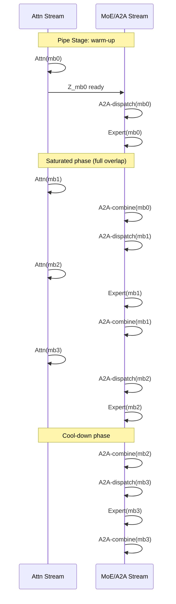
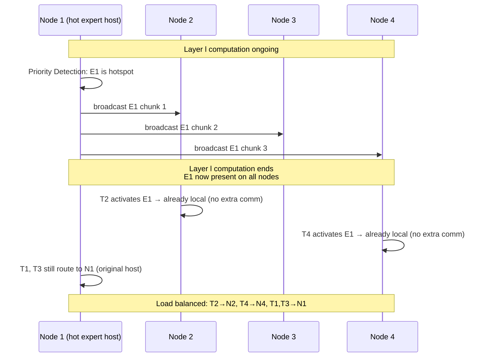
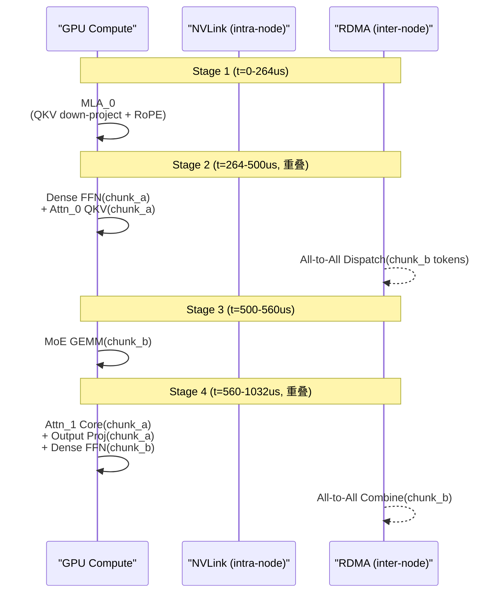
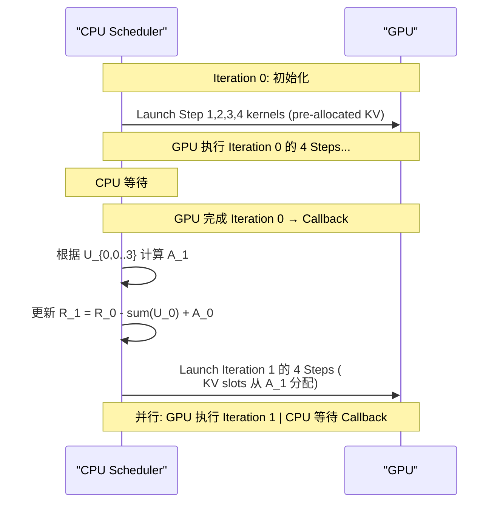

## EP+TP Hybrid Parallelism for MoE Inference

术语是什么？回答尽量完整，回答逻辑链中每一步都解释出来。通过联网搜索让回答具体和精准。

EP+TP Hybrid Parallelism 是 IFMoE 提出的针对 fine-grained MoE 推理的混合并行策略。核心思想：在传统 Expert Parallelism (EP) 的基础上，对共享参数（Attention 权重、LayerNorm、Shared Expert）使用 Tensor Parallelism (TP) 切分，而非 EP 的每卡全量复制。Expert 参数保持 EP 分布不变。

设计动机：(1) 传统 EP 推理时每台 machine 复制完整的共享参数，多卡时大量显存被冗余的 Attention/Norm 参数浪费；(2) 推理场景下通信通常在节点内（NVLink/PCIe），带宽充足，TP 引入的 AllReduce 通信开销可接受；(3) Fine-grained MoE 的单个 expert 尺寸较小，EP 的 expert 负载均衡通常良好。

从系统架构角度拆解术语，比如术语如何在系统架构中发挥作用，给出术语在系统架构中运转流程的具体例子。通过联网搜索让回答具体和精准。

IFMoE EP+TP Hybrid 推理流程（以 Qwen2 在 4× A6000 上为例）：

```
# 4 GPUs, EP+TP Hybrid:
# - Attention/Norm/Shared Expert params: TP 切分到 4 卡 (每卡 1/4)
# - Routed Expert params: EP 分布 (每卡持有 64/4=16 experts)
# - 所有 GPUs 处理相同的输入 tokens (Same Tokens, ST)

For each layer:
    # 1. Attention (TP): 每卡持有 1/4 Attention 权重
    GPU_i: Q_i,K_i,V_i = W_Q_i @ X, W_K_i @ X, W_V_i @ X
    # AllReduce 收集完整 attention output
    
    # 2. Router (local): 每卡独立计算 routing
    gate_scores = Router(norm_hidden)        # [B, 64]
    topk_indices = TopK(gate_scores, k=6)    # 选 6 experts
    
    # 3. Expert Computation (EP): double All-Gather
    # All-Gather 1: 收集各 GPU 的 routed tokens per expert
    # All-Gather 2: 收集各 GPU 的 expert outputs
    # 替代传统 All-to-All dispatch/combine
    
    # 4. Shared Expert (TP): 同 Attention，TP 切分
    shared_out_i = SharedExpert_i(norm_hidden)
    shared_out = AllReduce(shared_out_i)
    
    output = attn_out + routed_out + shared_out
```

术语一般如何实现？如何使用？通过联网搜索让回答具体和精准。

IFMoE 的 EP+TP Hybrid 内存节省：
- Deepseek-Lite (64 experts, 2 machines): 节省 4.6GB per machine
- Qwen2-57B-A14B (64 experts, 4 machines): 节省 10GB per machine
- Deepseek-v2 (160 experts, 8 machines): 节省 23GB per machine

通信变更：传统 EP 使用 All-to-All dispatch + combine，IFMoE 改用 double All-Gather。因为在节点内推理场景下 All-Gather 的通信量与 All-to-All 相当（令牌数量相同，每令牌传输 d_model 维数据），但配合 EP+TP 混合并行后内存效率更高。

涉及论文标题：
- IFMoE: An Inference Framework Design for Fine-grained MoE

## Expert Rearrangement (in MoE Training)

术语是什么？回答尽量完整，回答逻辑链中每一步都解释出来。通过联网搜索让回答具体和精准。

Expert Rearrangement 是 MoE 训练系统中用于缓解 Expert Parallelism (EP) straggler 效应的动态 expert placement 调整技术。在 EP 中，experts 被均匀分配到各 device，但因 MoE gate 训练的动态性，expert load（token 分布）频繁波动和不平衡，导致最重载 device 成为整个 MoE layer 的计算和通信瓶颈（straggler effect）。Expert rearrangement 系统通过在训练过程中动态修改 expert placement（哪些 expert 在哪些 device 上有副本/被迁移）来适应 load imbalance。

三类主要 rearrangement 策略：
1. **FasterMoE (PPoPP'22)**：选择性将最热门 expert 复制到所有 device（shadow expert），粗粒度管理（expert 要么在 1 个 GPU 要么在所有 GPU）。
2. **SmartMoE (USENIX ATC'23)**：通过交换 experts 在 devices 间的 position 来平衡 device loads（如将最多和最少 token 的 expert 放在同一 device），要求每 device 能容纳多个 expert。
3. **FlexMoE (SIGMOD'23)**：最全面的 rearrangement，通过 vExpert 抽象支持三种操作——Expand（为 overloaded expert 创建 replica）、Shrink（释放 underutilized replica）、Migrate（在 GPU 间交换 replica 以减少同步成本），使用 cost-model driven search 决定最优修改。

Hecate 揭示了 rearrangement 系统的两个核心挑战：(C1) Memory Challenge——更 balance 的 placement 需要更多内存来容纳 replica experts 及其 optimizer states（Adam mixed precision 下 optimizer states 至少 6× 参数量），预留内存不足会限制 placement 优化空间（FlexMoE 实验 4× 内存仅换 2.65× speedup）；(C2) Timeliness Challenge——rearrangement 频率的 trade-off（高频 → placement timely 但通信开销大，低频 → placement 过时），最优频率因训练场景而异无法统一确定（SmartMoE 每 10 steps vs 25 steps：non-rearrangement iteration 快 2.9% 但整体慢 10.2%）。

从系统架构角度拆解术语，比如术语如何在系统架构中发挥作用，给出术语在系统架构中运转流程的具体例子。通过联网搜索让回答具体和精准。

Expert Rearrangement 在 FlexMoE 系统架构中的运转流程：

```
┌── FlexMoE Rearrangement Workflow ──────────────────────────┐
│                                                              │
│  1. Monitoring: Scheduler 实时监控各 device 的 expert load  │
│     - 统计每个 expert 的 token count                         │
│     - 计算 balance ratio = max_load / avg_load              │
│                                                              │
│  2. Trigger: 当 balance ratio 超过阈值 (β > threshold)      │
│     → Policy Maker 启动 rearrangement                       │
│                                                              │
│  3. Cost-Model Search:                                      │
│     - 枚举可能的 vExpert 操作 (Expand/Shrink/Migrate)       │
│     - 评估每个操作的 cost (通信时间 + 计算时间)              │
│     - 选择 cost-benefit 最优的操作组合                       │
│                                                              │
│  4. Execution (ON CRITICAL PATH):                           │
│     - Expert 参数 + Optimizer States 的 P2P 传输             │
│       (optimizer states 可达到 6× 参数量, Adam + mixed FP)  │
│     - 更新 placement map (expert → device 映射)              │
│     - 后续 iterations 使用新 placement                       │
│                                                              │
│  5. Gradient Sync (每 iteration 结束):                      │
│     - 对有 replica 的 expert, AllReduce 同步 gradients      │
│     - 通信量: Σ_i 2(|D_i|-1)/|D_i| · S/|C| ≈ O(2λS)        │
│                                                              │
│  问题:                                                       │
│  - 迁移 optimizer states 造成巨大通信开销                    │
│  - Rearrangement 在 critical path → 限制了频率               │
│  - 预留内存限制 placement 灵活性                             │
└──────────────────────────────────────────────────────────────┘
```

Hecate 的 FSSDP 范式从根本上重新设计了这一流程：不再在 iteration 间迁移 expert 状态，而是每次 iteration 从全局唯一的 MoE shards 用 SparseAllGather 从零构建临时 placement，用 SparseReduceScatter 同步 gradients。FSSDP 的通信量 O(2λS) 与 rearrangement 的 AllReduce 等价，但消除了迁移开销（timeliness challenge），且全局仅保留一份 optimizer states（memory challenge 解决）。

术语一般如何实现？如何使用？通过联网搜索让回答具体和精准。

- Rearrangement 系统通常基于 PyTorch + Megatron-LM 等框架实现，在 MoE layer 的 training loop 中插入 rearrangement manager。
- FlexMoE 的 vExpert 抽象将 expert 视为可独立调度的最小单元，通过 expand/shrink/migrate 三个原语操作 vExpert → physical GPU 的映射。
- SmartMoE 的两阶段方法：offline 构建执行计划池（基于 workload-aware performance model），online 用贪心/混合 DP 算法每 ~10 iteration 选择和 refinement 计划（切换开销 ~20ms）。
- Rearrangement 频率是关键超参数，需要在 load timeliness 和通信 overhead 之间 trade-off，且最优值因 training scenario 而异。

涉及论文标题：
- FasterMoE: modeling and optimizing training of large-scale dynamic pre-trained models
- SmartMoE: Efficiently Training Sparsely-Activated Models through Combining Offline and Online Parallelization
- FlexMoE: Scaling Large-scale Sparse Pre-trained Model Training via Dynamic Device Placement
- Hecate: Unlocking Efficient Sparse Model Training via Fully Sharded Sparse Data Parallelism

## FSDP (Fully Sharded Data Parallelism)

术语是什么？回答尽量完整，回答逻辑链中每一步都解释出来。通过联网搜索让回答具体和精准。

FSDP (Fully Sharded Data Parallelism) 是 PyTorch 分布式训练中的一种 Data Parallelism 变体（源自 ZeRO-3 的思想），其核心是将模型参数、梯度和优化器状态完全分片（shard）到所有 data parallel device 上，而非每个 device 持有完整副本。训练时，参数按需通过 AllGather 物化（materialize），用后立即释放；梯度通过 ReduceScatter reduce 后各 device 更新其 shard；优化器状态也仅维护 shard 部分。FSDP 显著减少了每 device 的内存占用（参数量/DP_degree），使得训练超大 dense 模型成为可能。

然而，当直接应用于 MoE layer 时，FSDP 变得极低效：一个包含 |ℰ| 个 expert 的 MoE layer 会产生 |ℰ|× 的通信开销（因为每个 expert 都需要 AllGather），难以与计算重叠。Hecate 的 FSSDP 受 FSDP 启发，但以不同粒度分片 MoE layer（以 expert 而非参数矩阵为分片单位），并用稀疏通信原语 (SparseAllGather/SparseReduceScatter) 替代 AllGather/ReduceScatter，使通信量降为 O(λS)（λ << 1 时远小于 FSDP 的 O(S)）。

从系统架构角度拆解术语，比如术语如何在系统架构中发挥作用，给出术语在系统架构中运转流程的具体例子。通过联网搜索让回答具体和精准。

FSDP 在 dense model 单层中的执行流程：

```
FSDP Forward Pass (single dense layer):
  AllGather(layer_params)   // 从所有 DP ranks 收集参数分片
                             // 通信量: O(S) (S = 总参数大小)
  y = layer(x)              // 前向计算
  discard(layer_params)     // 立即释放非本 rank 的参数分片

FSDP Backward Pass:
  AllGather(layer_params)   // 重新物化参数 (backward 需要)
                             // 通信量: O(S)
  grad = layer.backward(y)  // 反向计算
  discard(layer_params)
  ReduceScatter(grad)       // 将梯度 reduce 并 scatter 到各 rank
                             // 通信量: O(S)

总通信量: 3 × O(S) per layer
重叠策略: AllGather/ReduceScatter 可与前一层的计算重叠
```

FSDP 在 MoE layer 上的问题：
- MoE layer 有 |ℰ| 个 expert × 3 FFN matrices (W_gate, W_up, W_down)
- FSDP 将每个 expert 视为独立参数块 → |ℰ|× 通信开销 vs 1 个 dense FFN
- 通信量过大，难以与 computation 重叠

FSSDP 的解决方案：
- 以 expert（非参数矩阵）为 sharding 单位
- SparseAllGather 仅物化当前 placement 需要的 expert 子集 → O(λS)，λ << 1
- 通信可与 Attention computation 重叠（不在 MoE 层内）

术语一般如何实现？如何使用？通过联网搜索让回答具体和精准。

- PyTorch FSDP 官方实现：`torch.distributed.fsdp` 模块，通过 `FullyShardedDataParallel` wrapper 包裹模型。
- 支持 mixed precision、activation checkpointing、CPU offloading 等优化。
- 在 Hecate 中，FSDP 的思想被创新性应用于 MoE training，通过 FSSDP 实现类似的内存节省效果（全局仅一份 optimizer states）但避免了 FSDP 在 MoE layer 上的通信爆炸问题。

涉及论文标题：
- Hecate: Unlocking Efficient Sparse Model Training via Fully Sharded Sparse Data Parallelism
- PyTorch FSDP: Experiences on Scaling Fully Sharded Data Parallel (Zhao et al., VLDB 2023)

## Re-materialization (in MoE Training)

术语是什么？回答尽量完整，回答逻辑链中每一步都解释出来。通过联网搜索让回答具体和精准。

Re-materialization 是 Hecate 中的内存优化技术，用于减少 sparse materialization 引入的额外参数内存。在 FSSDP 的基本模式下，sparse materialization 物化的 expert 参数在整个 forward-backward 过程中保留在 device memory 中。Re-materialization 则在 forward pass 完成后立即释放物化的 expert 参数，待 backward pass 需要时通过额外的 SparseAllGather 重新物化。这形成 "forward 物化 → release → backward 重新物化" 的流水线。

效果：Hecate-RM 将 materialized parameters 的额外内存占用降低 90.2%（因为只需为当前 MoE layer 的 placement 保留内存，而非所有 layer）。代价：backward 需要额外的 spAG 通信（sparse collectives 通信增加 3.6×），但 Hecate-RM 仍优于 baseline 1.4×。

从系统架构角度拆解术语，比如术语如何在系统架构中发挥作用，给出术语在系统架构中运转流程的具体例子。通过联网搜索让回答具体和精准。

```
Hecate Re-materialization Memory Lifecycle:

Without Re-materialization (Hecate):
  Layer 1 Fwd: spAG(P,P') → 物化 expert 参数 [KEEP]
  Layer 2 Fwd: spAG(P,P') → 物化 expert 参数 [KEEP]
  ...
  Layer L Fwd: spAG(P,P') → 物化 expert 参数 [KEEP]
  所有 L 层的 materialized parameters 同时在内存中
  Peak memory: L × materialized_params_per_layer + baseline

  Layer L Bwd: 使用已保留的参数
  ...
  Layer 1 Bwd: 使用已保留的参数
  spRS 梯度 reduce 后释放

With Re-materialization (Hecate-RM):
  Layer 1 Fwd: spAG(P,P') → 物化 [用后 RELEASE]
  Layer 2 Fwd: spAG(P,P') → 物化 [用后 RELEASE]
  ...  仅为当前层保留 materialized 参数
  Layer L Fwd: spAG(P,P') → 物化 [用后 RELEASE]

  Layer L Bwd: spAG(P,P') 重新物化 L → 计算 → spRS → RELEASE
  Layer L-1 Bwd: spAG(P,P') 重新物化 L-1 → 计算 → spRS → RELEASE
  ...
  Peak memory: 1 × materialized_params_per_layer + baseline
  参数内存减少: 90.2%
  额外通信: backward 每层多一次 spAG (= 3.6× sparse collectives)
```

术语一般如何实现？如何使用？通过联网搜索让回答具体和精准。

- Hecate-RM 在 Executor 中实现：forward 后显式调用 `release_materialized_params()` 释放 CUDA memory，backward 前调用 `rematerialize()` 触发 spAG。
- 适用于内存受限场景（如 batch size 需要 scale up 但 GPU 内存不足），Hecate-RM 是唯一能在 batch_size=6 时仍保持性能优势的策略（图 14）。
- Re-materialization 本质是用通信换内存：增加 backward 通信开销（3.6× sparse collectives）但大幅降低内存占用（90.2% materialized params），在 batch size 灵活的 training 场景中提供可调的 trade-off。

涉及论文标题：
- Hecate: Unlocking Efficient Sparse Model Training via Fully Sharded Sparse Data Parallelism

## Mixed Precision Expert Offloading

术语是什么？回答尽量完整，回答逻辑链中每一步都解释出来。通过联网搜索让回答具体和精准。

Mixed Precision Expert Offloading 是一种 MoE 推理加速技术，在传统 Expert Offloading（将 non-expert 权重 + 部分 hot expert 缓存于 GPU，其余 expert 卸载到 CPU/SSD）的基础上，为不同 expert 维护多个精度版本（如 FP16 + INT4 或 INT8 + INT2），运行时根据 expert 重要性动态选择加载精度。核心思想：MoE 中不同 expert 对输出贡献不同，不重要的 cache-miss expert 可用低精度版本替代，大幅减少 PCIe/SSD 传输量（FP16→INT4 减少 4×），同时保持模型精度（精度下降 <1%）。该技术由 HOBBIT (Tang et al., 2024) 首次系统化提出，后续 MoE-APEX 等系统沿用并扩展。

从系统架构角度拆解术语，比如术语如何在系统架构中发挥作用，给出术语在系统架构中运转流程的具体例子。通过联网搜索让回答具体和精准。

HOBBIT 中 Mixed Precision Expert Offloading 的系统架构流程（以 Mixtral-8x7B + RTX 4090 为例）：

1. **权重分布**：所有 non-expert 权重（Attention + LayerNorm 等，约 4% 参数）常驻 GPU memory。Expert 权重存储于 CPU memory 或 SSD，每个 expert 维护两个精度版本（FP16 高精度 + INT4 低精度）。GPU memory 中维护两个分离的 expert cache：High-Precision Cache（较大）和 Low-Precision Cache（较小）。
2. **运行时精度决策**：每 token 的 MoE 层 gating 计算完成后，对所有 top-K experts 按 ||G(x)|| 降序排列，计算 unimportance degree score s_{e_i} = Σ_{j=0}^{i-1} ||G(x)_{e_j}||（已归一化）。双阈值 T1/T2 决定精度：
   - s ≤ T1 → 高精度加载（FP16，~10.5MB/expert）
   - T1 < s ≤ T2 → 低精度加载（INT4，~2.6MB/expert）
   - s > T2 → 跳过该 expert
3. **异步多精度加载**：Dynamic Expert Loader 的 Expert Scheduler 通过 read() 系统调用从 CPU memory 异步加载对应精度 expert 权重到 GPU cache。由于传输量减少，PCIe 带宽利用率提升，总加载延迟降低。
4. **混合精度缓存管理**：Multidimensional Cache Manager 使用 LHU + LRU + LFU + FLD 加权策略管理高/低精度分离 cache，优先保留高精度高频使用的 expert。

配置示例（Mixtral-8x7B, T1=0.6, T2=0.9）：67% expert 加载为高精度，30% 加载为低精度，3% 跳过。top-1 expert 始终得分 0（保持高精度），所有 top-2 experts 的分布满足精度保持要求。

术语一般如何实现？如何使用？通过联网搜索让回答具体和精准。

- 实现基础：基于 Llama.cpp（C++/C），HOBBIT 增加 8000 行代码。将原始的 per-layer 权重加载改为 per-expert 多精度加载。
- 低精度 expert 的生成：使用标准后训练量化（如 GPTQ 或 RTN round-to-nearest），对每个 expert 独立量化为 INT4/INT2 并存储于 CPU memory。
- 运行时切换：无需修改模型架构，仅需在加载路径中添加精度选择逻辑。Expert Loader 维护 Task Queue，按优先级异步加载。
- 阈值选择：通过 profiling 一次推理的 ||G(x)|| 分布确定 T1/T2（如 Mixtral-8x7B 的 T1=0.6, T2=0.9），跨模型和硬件可复用。
- 效果：RTX 4090 上 vs MoE-Offloading decoding speedup 3.21× (Mixtral) / 3.29× (Phi-MoE)，vs MoE-Infinity speedup 2.30× / 3.92×。Jetson Orin 上 vs Llama.cpp speedup 13.0× / 18.9×。

涉及论文标题：
- HOBBIT: A Mixed Precision Expert Offloading System for Fast MoE Inference
- MoE-APEX: An Efficient MoE Inference System with Adaptive Precision Expert Offloading

## LHU (Least High Precision Frequently Used) and Multidimensional Expert Caching

术语是什么？回答尽量完整，回答逻辑链中每一步都解释出来。通过联网搜索让回答具体和精准。

LHU（Least High Precision Frequently Used）是 HOBBIT 提出的面向混合精度 Expert Cache 的缓存淘汰策略。与标准 LFU（追踪每个 expert 的总使用频次 F_t）不同，LHU 单独追踪高精度版本的使用频次 H_t，因为高精度 expert 的 cache miss 代价是低精度的 4×（以 FP16 vs INT4 计）。Multidimensional Expert Caching 是将 LHU 与 LRU、LFU、FLD 四种策略通过加权线性组合实现的多维缓存管理方案：p_t = w_lru·(R_t/T) + w_lfu·(F_t/T) + w_lhu·(H_t/T) + w_fld·(1-|l_t-l_i|/l_n)，权重通过校准数据集最小化 miss penalty 确定。

从系统架构角度拆解术语，比如术语如何在系统架构中发挥作用，给出术语在系统架构中运转流程的具体例子。通过联网搜索让回答具体和精准。

HOBBIT Multidimensional Cache Manager 的工作流程：

```
# 高/低精度 cache 分离管理
HighPrecisionCache: [expert_0, expert_3, ...]  # 较大容量
LowPrecisionCache:  [expert_1, ...]            # 较小容量

# Policy Performer 记录（per-sequence）
Records:
  LR[t]: last_used_token_id     # LRU 记录
  F[t]:  total_use_count        # LFU 记录
  H[t]:  high_precision_count   # LHU 记录
  layer[t]: expert_layer_id     # FLD 记录

# On cache miss for expert e_i (high precision):
1. 加载 e_i 的高精度权重到 GPU
2. 更新 LR[e_i], F[e_i], H[e_i]
3. for each cached expert e_j in HighPrecisionCache:
     p_j = w_lru*(LR[e_j]/T) + w_lfu*(F[e_j]/T)
         + w_lhu*(H[e_j]/T) + w_fld*(1 - layer_dist(e_j, e_i)/l_n)
4. evict e_j* = argmin(p_j)，replace with e_i
5. 若 evicted expert 有低精度版本 → 可选降级到 LowPrecisionCache

# On cache miss for expert e_x (low precision):
1. 加载 e_x 的低精度权重
2. 更新 LR[e_x], F[e_x]（不更新 H，因为低精度）
3. 在 LowPrecisionCache 中按优先级 evict + replace

# New sequence start:
1. 重置所有 LR, F, H 记录
2. Expert cache 内容保留（warm cache）
```

关键设计点：
- 高/低精度 cache 分离避免低精度 expert 挤占高精度 expert 空间
- 序列级 LFU/LHU（per-sequence 统计）vs 模型级（全局统计）：序列级 LFU 带来 4.5% hit ratio 提升
- LHU 相比 LFU 的 cache miss penalty 降低约 15%（因优先保留高精度高频 expert）

术语一般如何实现？如何使用？通过联网搜索让回答具体和精准。

- 四种权重 w_lru, w_lfu, w_lhu, w_fld 为超参数，通过在 calibration dataset 上最小化 total miss penalty 搜索（网格搜索或贝叶斯优化）
- 高精度 cache 建议容量 ≥ 低精度 cache 的 2-3 倍（因高精度 expert 更多且 miss 代价更高）
- 与 Adaptive Expert Prefetching 配合：预取的 expert 被 mask 保护不被 evict
- HOBBIT 实验：Multidimensional policy 相比 LRU 降低 4.69%-8.68% miss penalty，相比 LFU 降低 2.13%-4.19%
- 变体：MoE-APEX 提出 LCU (Least Costly Used) = H_t + (B_l/B_h)·L_t，将高低精度使用频次统一为 cost 值，结合 FR (forward reuse) 和 layer distance，公式更简洁

涉及论文标题：
- HOBBIT: A Mixed Precision Expert Offloading System for Fast MoE Inference
- MoE-APEX: An Efficient MoE Inference System with Adaptive Precision Expert Offloading

## Dynamic Parallelism Transition Strategy (with INT4 Quantized Weight Backup)

术语是什么？回答尽量完整，回答逻辑链中每一步都解释出来。通过联网搜索让回答具体和精准。

Dynamic Parallelism Transition Strategy 是 HAP 提出的在 MoE 推理中从 prefill 阶段到 decode 阶段切换 Expert 模块并行策略时，最小化切换开销的方法。当 HAP 的 ILP 求解器为 prefill（通信瓶颈，选 EP/DP）和 decode（计算瓶颈，选 TP）分配不同策略时，Expert 模块权重（约占 90% 总参数）需要重新分布。直接通过集合通信（AllGather/AllToAll）重分布权重的开销可能抵消策略切换带来的收益。HAP 提出两种过渡方式并动态选择更优方案：(1) 通过集合通信重分布权重（T_reshard）；(2) 从 CPU memory 中维护的 INT4 per-group 量化权重备份异步上传到 GPU 并反量化（T_upload + T_dequant）。决策公式：C_ij = min(T_reshard, max(0, T_upload + T_dequant - (T_attn + T_experts + T_comm)))，即上传+反量化可与当前层计算重叠时，过渡开销可被完全隐藏。

从系统架构角度拆解术语，比如术语如何在系统架构中发挥作用，给出术语在系统架构中运转流程的具体例子。通过联网搜索让回答具体和精准。

```
┌──────────────────────────────────────────────────────────────┐
│ HAP 动态策略切换系统架构 (Mixtral-8x7B, 4×A6000)              │
│                                                              │
│ Phase 1: Prefill (Expert=EP, Attn=DP)                        │
│   GPU0: experts 0,1    GPU1: experts 2,3                      │
│   GPU2: experts 4,5    GPU3: experts 6,7                      │
│   ┌─ Attention (DP, no comm) ─┐                               │
│   │  各GPU独立计算 batch/4     │                               │
│   └───────────────────────────┘                               │
│   ┌─ Expert (EP, A2A dispatch/combine) ────────────────────┐ │
│   │  All-to-All dispatch: tokens路由到expert所在GPU          │ │
│   │  各GPU计算本地expert FFN                                 │ │
│   │  All-to-All combine: 结果返回                            │ │
│   └─────────────────────────────────────────────────────────┘ │
│                          ↓                                    │
│ Phase 2: 策略切换决策                                          │
│   T_reshard = estimate_reshard_time(all_expert_weights)      │
│   T_upload = estimate_upload_time(int4_weights)               │
│   T_dequant = lookup_dequant_dict(V_dequant)                  │
│   overlap = T_attn + T_experts + T_comm                      │
│   if T_reshard < max(0, T_upload + T_dequant - overlap):     │
│       method = "reshard"  # 直接AllGather重分布               │
│   else:                                                       │
│       method = "quantized_upload"  # CPU→GPU异步上传+反量化    │
│                          ↓                                    │
│ Phase 3: CPU→GPU 量化权重上传 (method = "quantized_upload")    │
│   ┌─ CPU Memory (pinned) ──────────────────────────────────┐ │
│   │  INT4 weight backup: per-group quantized, ~1/4 FP16     │ │
│   │  Multi-stream async upload:                              │ │
│   │    stream0: experts 0,1 → GPU0                           │ │
│   │    stream1: experts 2,3 → GPU1                           │ │
│   │    stream2: experts 4,5 → GPU2                           │ │
│   │    stream3: experts 6,7 → GPU3                           │ │
│   └─────────────────────────────────────────────────────────┘ │
│   ┌─ GPU Dequant Kernel ───────────────────────────────────┐ │
│   │  各GPU收到INT4权重后:                                     │ │
│   │    per-group dequant: BF16 = INT4 × group_scale         │ │
│   │    (group_size=128, scale per-group in BF16)            │ │
│   │  Dequant与第32层prefill计算重叠执行                       │ │
│   └─────────────────────────────────────────────────────────┘ │
│                          ↓                                    │
│ Phase 4: Decode (Expert=TP, Attn=DP)                          │
│   GPU0-3: 各持有完整expert的1/4中间维度                        │
│   ┌─ Expert (TP, AllReduce) ───────────────────────────────┐ │
│   │  各GPU计算部分FFN → AllReduce聚合                        │ │
│   │  单token通信量小，TP负载均衡优势明显                       │ │
│   └─────────────────────────────────────────────────────────┘ │
└──────────────────────────────────────────────────────────────┘
```

INT4 per-group 量化方案选择（Table I）：per-tensor 量化 GSM8K 从 58.3→55.6%（降 4.6%），per-group 量化 GSM8K 仅降至 58.0%（降 0.5%），MMLU 保持 67.7%。Per-group 量化以 128 元素为组，每组独立 scale factor，在精度保持和压缩率之间取得最优平衡。

术语一般如何实现？如何使用？通过联网搜索让回答具体和精准。

HAP 使用 bitsandbytes (https://github.com/bitsandbytes-foundation/bitsandbytes) 实现 INT4 per-group 量化。CPU 侧维护量化备份于 pinned memory（支持快速 PCIe DMA 传输）。T_dequant 字典在初始化阶段通过 microbenchmark 构建：key = V_dequant（需反量化的参数量），value = 实测反量化时间。运行时根据实际 Expert 模块策略切换涉及的参数量查表。多 stream 异步上传使用 CUDA cudaMemcpyAsync，GPU 反量化 kernel 在独立 stream 上执行，与 prefill 最后几层的 attention/expert 计算重叠。该方案的额外内存开销为 ~1/4 FP16 expert 权重 + scale factors（约 5% 额外开销），但避免了 T_reshard（全部 expert 权重经 PCIe/NVLink 重分布）的高通信开销。

涉及论文标题：
- HAP: Hybrid Adaptive Parallelism for Efficient Mixture-of-Experts Inference

## CPU-GPU Heterogeneous MoE Inference Orchestration

术语是什么？回答尽量完整，回答逻辑链中每一步都解释出来。通过联网搜索让回答具体和精准。

CPU-GPU Heterogeneous MoE Inference Orchestration 是一种面向资源受限环境的 MoE 推理策略，将 MoE 模型的 expert 计算动态分配到 CPU 和 GPU 两种异构计算设备上执行。核心思想是：当 GPU 显存不足以容纳全部 expert 参数时，不采用单一的"全部 CPU 计算"或"全部 GPU offloading"策略，而是根据每个 expert 在每个推理步骤的实际输入量 s，在三种策略中动态选择最优方案：(a) 若 expert 权重已在 GPU，直接在 GPU 执行；(b) 若输入量 s 较大，将 expert 权重从 CPU 经 PCIe 拷贝到 GPU，在 GPU 执行；(c) 若输入量 s 较小，将 activation 从 GPU 拷贝到 CPU，在 CPU 执行后传回。决策基于 latency model：GPU 延迟近乎恒定（受限于内存带宽），CPU 延迟随输入量线性增长（受限于计算能力），PCIe 传输延迟恒定。

从系统架构角度拆解术语，比如术语如何在系统架构中发挥作用，给出术语在系统架构中运转流程的具体例子。通过联网搜索让回答具体和精准。

以 Mixtral-8x7B 16-bit 在 Quadro RTX 6000 24GB 上 single-batch decode 为例的系统架构执行流程：

```
┌──────────────────────────────────────────────────────────────┐
│ 初始化阶段                                                     │
│   Non-expert 层 (Attention/Embedding/Norm, ~2B params): GPU    │
│   Expert 层 (32 layers × 8 experts = 256, ~45B params):        │
│     - Offline 热门度 profiling (ShareGPT calibration)          │
│     - Top-56 热门 expert → GPU memory                          │
│     - 其余 200 expert → CPU pinned memory                      │
│   Latency model 校准: cpu_lat(s), gpu_lat(s), trans_lat()     │
├──────────────────────────────────────────────────────────────┤
│ 推理执行阶段 (per-layer, per-token)                            │
│   1. Attention: GPU 直接执行（权重常驻 GPU）                    │
│   2. MoE Gate: GPU 直接执行 → top-2 expert index + inp_size[] │
│   3. Fiddler Algorithm 1 (per-expert 决策):                    │
│      for each expert j in top-2:                              │
│        s = inp_size[j]                                        │
│        if is_at_gpu(l, j):                                    │
│          → Strategy (a): GPU 直接计算 (无 PCIe 传输)            │
│        elif cpu_lat(s) > gpu_lat(s) + trans_lat():            │
│          → Strategy (b): PCIe copy weight → GPU 计算           │
│        else:                                                   │
│          → Strategy (c): PCIe copy activation → CPU AVX512    │
│            → PCIe copy output back to GPU                      │
│   4. Aggregation: Σ gate_weight * expert_output               │
└──────────────────────────────────────────────────────────────┘
```

Strategy (b) vs (c) 的权衡分析：
- Strategy (b) 传输量：~300MB/expert（3个 4096×14336 矩阵 at 16-bit），恒定
- Strategy (c) 传输量：s × 4096 × 2 bytes（activation），随 s 线性增长
- 对于 s=1（decode）：activation = 8KB << 300MB weight → (c) 更优
- 对于 s=1024（prefill）：activation ≈ 8MB，但 CPU 计算 s× 开销 >> PCIe 传输 → (b) 更优

术语一般如何实现？如何使用？通过联网搜索让回答具体和精准。

Fiddler 基于 PyTorch 实现（开源在 https://github.com/efeslab/fiddler）：
- **Expert 权重管理**：CPU 侧使用 pinned memory（连续分配），支持 cudaMemcpyAsync 异步传输
- **CPU 计算 kernel**：自实现 AVX512_BF16 expert FFN kernel（替代 PyTorch 默认 CPU GEMM）
- **Latency model**：初始化阶段运行 microbenchmark 测量 cpu_lat(s)、gpu_lat(s)、trans_lat() 三个函数所需的常数参数（32 层平均），>99% R² 拟合
- **适用场景**：GPU 显存不足以容纳全量 expert 参数的 resource-constrained 场景；Single-batch decode、long-context prefill、beam search 均适用
- **通用性**：已在 Mixtral-8x7B 和 Phi-3.5-MoE 上验证，论文声明方法适用于 MoE 模型家族

涉及论文标题：
- Fiddler: CPU-GPU Orchestration for Fast Inference of Mixture-of-Experts Models

## Dynamic Per-Expert Execution Strategy for MoE

术语是什么？回答尽量完整，回答逻辑链中每一步都解释出来。通过联网搜索让回答具体和精准。

Dynamic Per-Expert Execution Strategy 是 Fiddler 论文提出的 MoE 推理运行时调度算法（Algorithm 1）。每个 MoE 层的每个 expert 在运行时根据其接收到的输入 token 数量 s 独立决定执行后端（CPU 还是 GPU）。决策基于三个 latency model 函数：(1) `cpu_lat(s)` — CPU 执行 expert FFN 的延迟，随 s 线性增长；(2) `gpu_lat(s)` — GPU 执行 expert FFN 的延迟，近乎恒定（不依赖 s）；(3) `trans_lat()` — PCIe 传输一个 expert 权重的延迟，恒定。

决策逻辑：
```
if is_at_gpu(layer, expert):
    execute_on_gpu_directly()                    // Strategy (a)
elif cpu_lat(s) > gpu_lat(s) + trans_lat():
    copy_weight_to_gpu(); execute_on_gpu()       // Strategy (b)
else:
    copy_activation_to_cpu(); execute_on_cpu();  // Strategy (c)
    copy_output_to_gpu()
```

核心洞察：当 s 较小时，cpu_lat(s) < gpu_lat(0) + trans_lat()，CPU 执行（strategy c）更优——因为 activation 拷贝量（s × d_model）远小于 weight 拷贝量（d_model × d_intermediate × 3 matrices）；当 s 较大时，CPU 计算时间主导，GPU+transfer（strategy b）更优。

从系统架构角度拆解术语，比如术语如何在系统架构中发挥作用，给出术语在系统架构中运转流程的具体例子。通过联网搜索让回答具体和精准。

Fiddler Algorithm 1 在每个 MoE 层的执行流程：

```
Input: layer i, inp_size[0..ne-1]  // 每个 expert 的输入 token 数

for j = 0 to ne-1:
    s = inp_size[j]
    if s == 0: continue             // 无 token 路由到此 expert
    
    if is_at_gpu(i, j):
        // Strategy (a): GPU hit — 零额外开销
        out += GPU_FFN(activation_gpu, W_gpu[i][j])
    
    elif cpu_lat(s) > gpu_lat(0) + trans_lat():
        // Strategy (b): GPU miss, large s — 传权重
        // Latency = trans_lat + gpu_const
        W_gpu = cudaMemcpyAsync(W_cpu[i][j] → GPU_buf, PCIe)
        out += GPU_FFN(activation_gpu, W_gpu)
    
    else:
        // Strategy (c): GPU miss, small s — 传 activation
        // Latency = cpu_slope × s (activation copy <1%)
        act_cpu = cudaMemcpyAsync(activation_gpu → CPU_buf, PCIe)
        out_cpu = CPU_AVX512_FFN(act_cpu, W_cpu[i][j])
        out += cudaMemcpyAsync(out_cpu → GPU, PCIe)
```

三种策略在不同场景下的主导地位：
| Scenario | s typical | Dominant Strategy | Reason |
|----------|-----------|-------------------|--------|
| Single-batch decode | 1 | (a) or (c) | GPU hit or small-s CPU avoid weight transfer |
| Long prefill | 512-4096 | (a) or (b) | Large s makes CPU computation prohibitive |
| Beam search (width=16) | 16 | (b) | Moderate s × beam width, CPU linear cost dominates |

术语一般如何实现？如何使用？通过联网搜索让回答具体和精准。

- 在 PyTorch forward path 中插入 decision logic，每个 expert 独立调用对应后端
- Latency model 参数在初始化阶段通过 microbenchmark 一次性校准（32 层 × 多次 input size 平均）
- GPU latency 建模为常数（实测 batch=1 时因 PyTorch 单 batch 不同实现有 ~10% 差异，但在含 weight transfer 的总延迟中可忽略）
- CPU latency 建模为 linear(s)（实测 R² > 0.99），activation copy 占总延迟 <1% 可忽略
- 阈值条件 `cpu_lat(s) > gpu_lat(s) + trans_lat()` 即 `cpu_slope × s > gpu_const + trans_lat`，可解出切换点 s_threshold

涉及论文标题：
- Fiddler: CPU-GPU Orchestration for Fast Inference of Mixture-of-Experts Models

## Expert Popularity-based GPU Placement

术语是什么？回答尽量完整，回答逻辑链中每一步都解释出来。通过联网搜索让回答具体和精准。

Expert Popularity-based GPU Placement 是一种 MoE 推理的 GPU 显存分配优化策略：在模型加载（initialization）阶段，使用 calibration data 对各 expert 的激活频率进行离线 profiling，然后按热门度降序将尽可能多的 expert 放入 GPU memory（不超过显存容量），其余 expert 放在 CPU memory。目标是最大化 GPU expert cache 的 hit rate——即推理时所需 expert 已在 GPU 显存中的概率。

Fiddler 在 Mixtral-8x7B (256 experts) 上的 profiling 数据显示：expert 热门度分布相对均衡（mean=0.71, std=0.08, 25th percentile=0.67, 75th percentile=0.76），但仍有足够差异使得热门度导向放置比随机放置提升 hit rate 3-5 个百分点（Env1: 25.2% vs 21.9% random, Env2: 53.0% vs 48.8% random）。

从系统架构角度拆解术语，比如术语如何在系统架构中发挥作用，给出术语在系统架构中运转流程的具体例子。通过联网搜索让回答具体和精准。

Fiddler 中的 Expert Popularity-based GPU Placement 流程：

```
┌─────────────────────────────────────────────────────────┐
│ Offline Profiling (一次性)                                │
│   1. 加载 Mixtral-8x7B + ShareGPT calibration data       │
│   2. 前向推理 calibration 样本，记录各 expert 的激活次数   │
│   3. 输出: popularity[layer][expert] ∈ [0, 1]           │
│      (value = 激活次数 / 最热门 expert 激活次数)           │
│   4. 全局排序: 所有 256 experts 按 popularity 降序排列     │
├─────────────────────────────────────────────────────────┤
│ Initialization (每次加载模型)                              │
│   1. 计算 GPU 可容纳的 expert 数:                         │
│      N_gpu = floor((VRAM - non_expert_size) / expert_size)│
│   2. 选择 top-N_gpu 热门 expert 放入 GPU memory           │
│   3. 其余 256 - N_gpu expert 放入 CPU pinned memory       │
├─────────────────────────────────────────────────────────┤
│ Runtime (每次推理)                                        │
│   is_at_gpu(layer, expert) = expert in top-N_gpu         │
│   → Strategy (a) 概率 = hit rate                         │
│   → Strategy (b)/(c) 概率 = 1 - hit rate                 │
└─────────────────────────────────────────────────────────┘
```

与随机放置的 hit rate 对比（256 experts total）：
| Environment | GPU experts | Random hit rate | Popularity hit rate | Gain |
|-------------|-----------|-----------------|---------------------|------|
| Env1 (24GB) | 56/256 | 21.9% | 25.2% | +3.3pp |
| Env2 (48GB) | 125/256 | 48.8% | 53.0% | +4.2pp |

术语一般如何实现？如何使用？通过联网搜索让回答具体和精准。

- **Calibration data**：论文使用 ShareGPT 对话数据集做 expert 热门度 profiling（Appendix C）
- **Robustness**：论文在 LMSYS-Chat-1M 不同数据集上验证了方法的鲁棒性（Fiddler 仍比 llama.cpp 快 1.56×）
- **Assumption**：expert 选择基于 token 特征，expert 热门度在不同输入领域间近乎通用（引用自 Mixtral 和 OpenMoE 论文），因此 offline profiling 数据可在不同下游任务间复用
- **对比其他方法**：
  - llama.cpp 按层分配 GPU/CPU（前 ngl 层全 GPU），不区分 expert 热门度
  - Mixtral-Offloading 使用 LRU cache（runtime 动态），Fiddler 使用 static popularity（init-time 固定）——两者正交互补
- **与 Algorithm 1 的关系**：Popularity placement 提高 is_at_gpu() 返回 true 的概率（即 Strategy (a) 的使用频率），减少进入 Strategy (b)/(c) 的需要

涉及论文标题：
- Fiddler: CPU-GPU Orchestration for Fast Inference of Mixture-of-Experts Models

## Per-Expert Offloading (vs Per-Layer Offloading)

术语是什么？回答尽量完整，回答逻辑链中每一步都解释出来。通过联网搜索让回答具体和精准。

Per-Expert Offloading 是一种 MoE 专用的参数卸载策略，以单个 expert 为粒度进行 GPU/host 内存管理，而非以整个 Transformer 层为粒度。传统 per-layer offloading（如 HuggingFace accelerate 的 `device_map="auto"`）将每层所有参数（含全部 expert）作为一个整体加载/卸载——对于 Mixtral-8x7B，这意味着每次加载 8 个 expert（每个约 5.6B 参数在 FP16）但只使用 top-2，浪费 75% 的 PCIe 带宽。Per-expert offloading 仅加载 gate 选中的 top-k expert，大幅减少 host-to-device 传输量。

从系统架构角度拆解术语，比如术语如何在系统架构中发挥作用，给出术语在系统架构中运转流程的具体例子。通过联网搜索让回答具体和精准。

Mixtral-8x7B 16GB GPU + per-expert offloading 的内存布局：

```
┌────────────────────────────────────────────────────┐
│ GPU VRAM (16GB, fixed resident):                    │
│   - Embedding & LM head (FP16)                      │
│   - 32 × Attention blocks (4-bit quantized)         │
│   - 32 × MoE gates (FP16)                          │
│   - 32 × k cached experts (2/3-bit quantized)       │
│   - b=4 shared device buffers (expert-sized)        │
│   - KV Cache (inference activations)                │
├────────────────────────────────────────────────────┤
│ Host RAM (pinned):                                  │
│   - 32 × 8 experts (2/3-bit quantized)              │
│   - Contiguous per-expert buffers                   │
├────────────────────────────────────────────────────┤
│ Per-token execution flow:                           │
│   1. Gate selects top-2 experts                     │
│   2. Check per-layer LRU cache for each expert      │
│   3a. Hit → use directly from GPU buffer            │
│   3b. Miss → load from pinned RAM via PCIe DMA      │
│   4. Async prefetch next layer's predicted experts  │
│   5. Expert FFN computation                        │
└────────────────────────────────────────────────────┘
```

对比 per-layer offloading（如 accelerate）:
- Per-layer: 加载 8 experts × d_model² 字节 = 浪费 6/8 带宽
- Per-expert: 加载 0-2 experts × d_model² 字节 = 带宽利用率高
- Per-expert 需维护 per-layer cache 状态（LRU 队列），但 overhead 可忽略

术语一般如何实现？如何使用？通过联网搜索让回答具体和精准。

- Expert 参数在 pinned memory 连续分配（`tensor.pin_memory()`），单次 `cudaMemcpyAsync` 完成传输
- GPU 侧分配 b=4 个临时 expert 大小 buffer，所有层共享（非 k×32 个），显著减少 GPU memory footprint
- 当 host RAM 不足时（如 Colab），expert 在 host RAM 和磁盘间换入换出，GPU cache 淘汰的 expert 写回 host RAM
- 代码开源：https://github.com/dvmazur/mixtral-offloading

涉及论文标题：
- Fast Inference of Mixture-of-Experts Language Models with Offloading
- FloE: On-the-Fly MoE Inference on Memory-constrained GPU
- HOBBIT: A Mixed Precision Expert Offloading System for Fast MoE Inference

HOBBIT/MoE-APEX 对 Per-Expert Offloading 的扩展（Mixed Precision Expert Cache）：
- **多精度 Expert Cache**：GPU memory 中维护两个分离 cache——High-Precision Cache（较大，存放 FP16/INT8 expert）和 Low-Precision Cache（较小，存放 INT4/INT2 expert）。分离管理避免低精度 expert 挤占高精度空间。
- **动态精度选择**：cache miss 时，基于 ||G(x)|| 的 unimportance degree score 决定加载精度：s≤T1→高精度, T1<s≤T2→低精度, s>T2→跳过。Expert Loader 通过 read() 系统调用从 CPU memory 加载对应精度版本。
- **多维缓存策略**：LHU + LRU + LFU + FLD 加权组合替代单一 LRU/LFU，高精度 miss 代价为 1，低精度为 B_l/B_h（如 1/4），策略目标是最小化加权 miss penalty 而非单纯 hit ratio。
- **序列级统计**：缓存统计（LRU/LFU/LHU 记录）在新 sequence 开始时重置，因为不同 sequence 的 expert 偏好分布不同（序列级 LFU 比模型级 LFU hit ratio 提升 4.5%）。
- 硬件配置示例（RTX 4090 24GB）：non-expert ~4GB，expert cache ~15GB（高精度 ~12GB + 低精度 ~3GB），KV cache ~3GB，余量 ~2GB。

## Pinned Memory for GPU Offloading

术语是什么？回答尽量完整，回答逻辑链中每一步都解释出来。通过联网搜索让回答具体和精准。

Pinned Memory（页锁定内存，也称 page-locked memory）是 CUDA 编程中的一种 host 内存分配类型。与普通可分页（pageable）host 内存不同，pinned memory 被操作系统锁定在物理内存中不可被换出（swap out），使 GPU 的 DMA 引擎可直接通过 PCIe 访问而无需 CPU 介入逐页拷贝。在 PyTorch 中通过 `tensor.pin_memory()` 创建。对于 offloading 场景，pinned memory 的 host-to-device 带宽可达 PCIe 理论带宽的 80-90%，而 pageable memory 仅约 50-60%（因需 staging buffer）。

从系统架构角度拆解术语，比如术语如何在系统架构中发挥作用，给出术语在系统架构中运转流程的具体例子。通过联网搜索让回答具体和精准。

Mixtral offloading 中 pinned memory 的利用方式：

```
# 初始化: 为所有 expert 分配 pinned memory 缓冲区
for layer in 0..31:
    for expert in 0..7:
        # contiguous pinned allocation (一次 pin 而非逐 expert)
        host_expert_buf[layer][expert] = torch.empty(
            expert_size, dtype=torch.int8, pin_memory=True
        )
        # 量化后的 expert 权重直接写入 pinned buffer
        host_expert_buf[layer][expert].copy_(quantized_expert_weights)

# 推理时: 直接从 pinned memory 异步拷贝
def load_expert(layer, expert_id, gpu_buf):
    # cudaMemcpyAsync: CPU 不参与数据搬运
    # GPU DMA engine 通过 PCIe 直接从 pinned buffer 读取
    stream = get_io_stream()
    with torch.cuda.stream(stream):
        gpu_buf.copy_(host_expert_buf[layer][expert_id], non_blocking=True)
    return stream  # 调用方可等待或重叠其他计算

# Pageable vs Pinned 对比:
# Pageable: CPU 先拷贝到 staging buffer → DMA 从 staging buffer 读 (2次拷贝)
# Pinned:   DMA 直接从 pinned buffer 读 (1次拷贝, 无 CPU 中转)
```

术语一般如何实现？如何使用？通过联网搜索让回答具体和精准。

- PyTorch API: `t.tensor.pin_memory()` 或 `tensor.to('cuda', non_blocking=True)` 时自动使用
- 限制：pinned memory 过多会抢占 OS 可分页物理内存，可能影响系统稳定性——论文通过仅 pin expert 部分（attention 常驻 GPU）平衡此问题
- 对于 16GB host RAM 机器（如 Colab free-tier），需仔细管理 pinned memory 总量以免 OOM
- 论文的 contiguous expert buffer 设计允许单次 `cudaMemcpyAsync` 传输完整 expert（避免多次小传输的 PCIe 事务开销）
- 与 `non_blocking=True` 配合时，CPU 继续执行而 GPU DMA 在后台搬运，是实现 overlapping 的关键前提

涉及论文标题：
- Fast Inference of Mixture-of-Experts Language Models with Offloading

## Token-Level Overlapping / Token-Level Pipelining

术语是什么？回答尽量完整，回答逻辑链中每一步都解释出来。通过联网搜索让回答具体和精准。

Token-Level Overlapping（Token级重叠）是一种在 MoE 训练中隐藏 all-to-all (A2A) 通信延迟的技术。将输入 MoE 层的 token 序列沿 sequence 维度切分为多个微批次（micro-batches），在分离的 CUDA stream 上分别执行专家计算（compute stream）和 A2A 通信（communication stream），使不同微批次的通信和计算在时间上重叠。与 sequence-level overlapping（在 batch 维度切分，需要较大的 batch size）相比，token-level overlapping 在长序列训练中优势明显——长序列下 batch size 被内存限制得极小（甚至为 1），但 sequence 维度始终有足够 token 用于微批次划分。

从系统架构角度拆解术语，比如术语如何在系统架构中发挥作用，给出术语在系统架构中运转流程的具体例子。通过联网搜索让回答具体和精准。

在 MoE-only token-level overlapping（如 Tutel）中，流水线仅覆盖 MoE 层内的 3 个阶段：

```
Stream 0 (Compute):  Expert(mb_0)  |  Expert(mb_1)  |  Expert(mb_2)  |  Expert(mb_3)
Stream 1 (Comm):     A2A(mb_0)     |  A2A(mb_1)     |  A2A(mb_2)     |  A2A(mb_3)
```

核心约束：A2A 通信的高斜率（带宽限制）和 expert 计算的低计算量（MoE layer 仅为轻量 FFN）导致通信无法被完全隐藏。32K seqlen 下 expert 仅占 21% 执行时间。

FOLDMOE 将 overlapping 扩展到整个 Transformer block，增加 attention 计算作为 overlap 的计算源：

```
Stream 0 (Compute):  Attn(mb_0) | Attn(mb_1) | Expert(mb_0) | Attn(mb_2) | Expert(mb_1) | Attn(mb_3) | Expert(mb_2) | Expert(mb_3)
Stream 1 (Comm):      idle       | A2A(mb_0)  | A2A(mb_0)   | A2A(mb_1)  | A2A(mb_1)   | A2A(mb_2)  | A2A(mb_2)   | A2A(mb_3)
```

术语一般如何实现？如何使用？通过联网搜索让回答具体和精准。

Token-Level Overlapping 的实现通常涉及：
1. 修改训练框架（如 Megatron-LM）的 layer forward 逻辑，在 token 维度做 micro-batch 循环
2. 使用 PyTorch CUDA stream 分离通信和计算：`torch.cuda.Stream()` 创建独立 stream
3. NCCL 通信在此 stream 上异步执行，与 CUDA kernel 重叠
4. Overlap degree d 的 tuning：FOLDMOE 和 Tutel 都通过搜索 d=2/4/8/16 找最优值——d 越大 bubble 越小但 kernel launch overhead 越大

涉及论文标题：
- FOLDMOE: Efficient Long Sequence MoE Training via Attention-MoE Pipelining

## 1A1M Schedule (1-Attention-1-MoE)

术语是什么？回答尽量完整，回答逻辑链中每一步都解释出来。通过联网搜索让回答具体和精准。

1A1M（1-Attention-1-MoE）是 FOLDMOE 提出的 attention-MoE 流水线调度策略，用于替代朴素的 aAaM（all-Attention-all-MoE）调度。aAaM 先将所有微批次的 attention 全部算完，再执行所有微批次的 MoE（A2A+expert），造成流水线尾部出现巨大气泡——最后阶段的 A2A combine 只能与短暂的 expert computation 重叠。

1A1M 通过交错执行 attention 和 MoE 阶段来减少气泡：在完成第 i 个微批次的 attention 后，立即启动该微批次的 A2A dispatch + expert computation，同时在第 i+1 个微批次上继续 attention 计算。这使得 A2A combine 阶段能被提前到流水线饱和阶段，与 attention 计算重叠。

从系统架构角度拆解术语，比如术语如何在系统架构中发挥作用，给出术语在系统架构中运转流程的具体例子。通过联网搜索让回答具体和精准。

1A1M 的调度时间线（d=4 微批次）：



对比 aAaM：aAaM 在完成所有 attention 后才开始任何 A2A，导致 A2A combine 只能与 expert computation 重叠，而 1A1M 的 A2A combine 在饱和阶段可与 attention 重叠。

术语一般如何实现？如何使用？通过联网搜索让回答具体和精准。

1A1M 作为 FOLDMOE 的调度策略，实现在 Megatron-LM 框架的 Transformer block forward 函数中。核心是修改 micro-batch 循环的控制流：
- 在 aAaM 中：两个嵌套循环（先全 attention，再全 MoE）
- 在 1A1M 中：一个 unified 循环，每轮执行一个 attention micro-batch + 立即跟随其 MoE stages
- 当 d=2 时，1A1M 退化为 aAaM（微批次太少无法交错）
- 配置：overlap degree d 通过 runtime profiling 确定

涉及论文标题：
- FOLDMOE: Efficient Long Sequence MoE Training via Attention-MoE Pipelining

## Time-Uniform Micro-Batching / Token Buffer

术语是什么？回答尽量完整，回答逻辑链中每一步都解释出来。通过联网搜索让回答具体和精准。

Time-Uniform Micro-Batching（时间均匀微批次划分）是 FOLDMOE 解决 causal attention 微批次计算不均衡问题的策略。传统的 token-uniform 切分（每个 micro-batch 包含相同数量的 token）在 causal attention 场景下导致后序微批次计算量更大（因为它们需要 attend 到更长的前缀 KV cache），造成 pipeline 中 attention 阶段的计算时间不均衡。

FOLDMOE 通过两部分解决：
1. **Token Buffer**：在 attention 层和 MoE 层之间插入 FIFO 缓冲区，解耦二者的微批次划分——attention 可以按时间均匀切片（不按 token 数均匀），MoE 层仍按 token 数量均匀切片
2. **Quick-Start Time-Uniform Slicing Algorithm**：基于 attention FLOPs 模型确定切片方案

$$FLOPs(l, c) = (4H + 3h) \cdot l \cdot c + 8H^2 \cdot l$$

其中 l 是微批次 token 数，c 是累积上下文长度，H 是 d_model，h 是注意力头数。算法先分配 minimal quick-start slice（ceil(L/d)），然后迭代确定后续切片边界使每个微批次的 FLOPs 接近理想值 t̂。

从系统架构角度拆解术语，比如术语如何在系统架构中发挥作用，给出术语在系统架构中运转流程的具体例子。通过联网搜索让回答具体和精准。

以 8-token 序列、d=4 为例：

```
Token-uniform (问题):    attention 时间 [2, 3, 4, 5] ms → pipeline 不均衡
Time-uniform (FOLDMOE): attention 时间 [4, 4, 4, 4] ms → 饱和阶段完美 overlap

切片方案: S = {4, 2, 1, 1} (early slices 更多 token，later slices 更少 token)
Token Buffer 操作:
  Attn 产出 Z_{1:4} → Buffer: [Z1,Z2,Z3,Z4] → emit Z_{1:2} to MoE (size=2)
  Attn 产出 Z_{5:6} → Buffer: [Z3,Z4,Z5,Z6] → emit Z_{3:4} to MoE (size=2)
  Attn 产出 Z_{7:7} → Buffer: [Z5,Z6,Z7]    → not enough, wait
  Attn 产出 Z_{8:8} → Buffer: [Z5,Z6,Z7,Z8] → emit Z_{5:6} to MoE (size=2)
  Buffer: [Z7,Z8] → emit Z_{7:8} to MoE (size=2)
```

术语一般如何实现？如何使用？通过联网搜索让回答具体和精准。

- Token Buffer 是 FOLDMOE 框架内部的软件数据结构（FIFO queue），位于 attention 层输出和 A2A dispatch 之间
- 切片算法（Algorithm 1）在训练开始前根据 seqlen、模型配置、overlap degree 预先计算切片方案，时间复杂度 O(L)
- 算法约束确保 token buffer 始终有足够 token 满足 MoE 侧的最小微批次需求：∑_{i=1}^j l_i ≥ (j/d)·L

涉及论文标题：
- FOLDMOE: Efficient Long Sequence MoE Training via Attention-MoE Pipelining

## Communication-Computation Overlapping

术语是什么？回答尽量完整，回答逻辑链中每一步都解释出来。通过联网搜索让回答具体和精准。

Communication-Computation Overlapping（通信-计算重叠）是分布式训练中的核心技术——通过在 GPU 的不同 CUDA stream 上并发执行通信（如 NCCL all-reduce、all-to-all）和计算（如矩阵乘法、attention），将通信延迟隐藏在计算时间中，减少 GPU 空闲等待。在 MoE 训练中特指将 A2A 通信（all-to-all dispatch/combine）与 expert 计算重叠。

从系统架构角度拆解术语，比如术语如何在系统架构中发挥作用，给出术语在系统架构中运转流程的具体例子。通过联网搜索让回答具体和精准。

在 MoE 训练中的两种 overlapping 粒度：

1. **Sequence-Level Overlapping**（粗粒度）：在 batch 维度切分，不同 sequence 的 A2A 和计算重叠。需要足够大的 batch size，长序列下因内存限制不可行（batch size 可能为 1）。

2. **Token-Level Overlapping**（细粒度）：在 token 维度切分，同一 sequence 内的不同 micro-batch 的 A2A 和计算重叠。不受 batch size 限制，但受限于计算量与通信量的比例。

FOLDMOE 定位的关键问题：

```
MoE-only overlapping (Tutel):  Expert_comp_time / A2A_time → 太小 (21% at 32K)
FOLDMOE solution:             (Attn + Expert)_time / A2A_time → 足够大 (接近或超过 100%)
```

通过将 attention 计算（O(n²)）纳入 overlap 的计算源，随着 seqlen 增长，可用于隐藏通信的计算量也相应增长。

术语一般如何实现？如何使用？通过联网搜索让回答具体和精准。

PyTorch 中的实现模式：
```python
comm_stream = torch.cuda.Stream()
# Main stream: 计算 micro-batch i
with torch.cuda.stream(compute_stream):
    Z_i = attention(X_i, K_cache, V_cache)
# Comm stream:  A2A micro-batch i-1
with torch.cuda.stream(comm_stream):
    Y_i_1 = a2a_dispatch_then_expert_then_combine(Z_i_1)
torch.cuda.synchronize()  # 必要时同步
```
FOLDMOE 在 Megatron-LM 基础上实现此模式，与 FlashAttention、TP、SP 兼容。

涉及论文标题：
- FOLDMOE: Efficient Long Sequence MoE Training via Attention-MoE Pipelining
- FasterMoE modeling and optimizing training of large-scale dynamic pre-trained models

FasterMoE（PPoPP'22）实现了更细粒度的通信-计算重叠：将 all-to-all 拆分为 group-based pairwise exchange 操作序列（S/C/R），在独立的 CUDA comm stream 和 comp stream 上交错执行。与 FOLDMOE 在 sequence 维度切分不同，FasterMoE 在 worker group 维度切分——n 个 group 形成环结构，每 step j 执行 S（send tokens）、C（compute on received tokens）、R（receive results）三个操作，通过将最快操作放在首尾最小化 overhead。当 comp stream 占主导时优化效果最佳（DDL-Roofline 指导）。实测单用 smart scheduling 加速 1.40×。

## Pipeline Bubble

术语是什么？回答尽量完整，回答逻辑链中每一步都解释出来。通过联网搜索让回答具体和精准。

Pipeline Bubble（流水线气泡）是流水线并行系统中的空闲时间——当流水线的不同阶段处理时间不均衡或存在依赖约束延迟了某些阶段的启动时，部分计算资源处于等待状态而无法被利用。气泡大小直接影响流水线效率：

$$\text{效率} = \frac{\text{总计算时间}}{\text{总计算时间} + \text{总气泡时间}}$$

FOLDMOE 识别出 attention-MoE pipeline 中的两类气泡来源：
1. **阶段不平衡（Stage Imbalance）**：attention computation 和 expert computation 耗时不同，aAaM 调度导致 A2A combine 只能与较短的 expert comp 重叠
2. **微批次不平衡（Micro-batch Imbalance）**：token-uniform 切片下，causal attention 的后序微批次计算量更大

从系统架构角度拆解术语，比如术语如何在系统架构中发挥作用，给出术语在系统架构中运转流程的具体例子。通过联网搜索让回答具体和精准。

FOLDMOE 中不同类型调度产生的气泡对比：

```
aAaM (大 bubble):
Attn:  [======mb0======][======mb1======][======mb2======][======mb3======]
                                                                          |
MoE:                                                [A2A-d0][Exp0][A2A-c0][A2A-d1][Exp1][A2A-c1]...
                                                      ↑ 大 bubble: A2A-combine 阶段只能与 Exp 重叠

1A1M (小 bubble):
Attn:  [==mb0==][=====mb1=====][======mb2======][=======mb3=======]
                                                                  |
MoE:      [A2A-d0][Exp0][A2A-c0][A2A-d1][Exp1][A2A-c1][A2A-d2]...
              ↑ A2A-combine 可与 attention 重叠，bubble 大幅减小

1A1M + time-uniform (最小 bubble):
Attn:  [====mb0====][====mb1====][====mb2====][====mb3====]  ← 时间均匀
                                                              |
MoE:      [A2A-d0][Exp0][A2A-c0][A2A-d1][Exp1][A2A-c1]...  ← 完美 overlap
```

术语一般如何实现？如何使用？通过联网搜索让回答具体和精准。

减少 pipeline bubble 的通用策略：
1. **增加微批次数量**：更多微批次 → bubble 时间占比更小（但 kernel launch overhead 增大）
2. **均衡阶段耗时**：如 FOLDMOE 的时间均匀切片和 1A1M 调度
3. **异步流水线**：如 PipeDream 的 1F1B（1 forward 1 backward）调度
4. FOLDMOE 的可调参数 d (overlap degree) 控制 bubble 大小和 kernel launch overhead 的 trade-off

涉及论文标题：
- FOLDMOE: Efficient Long Sequence MoE Training via Attention-MoE Pipelining

FarSkip-Collective 将 overlapping 概念从系统层面提升到算法-系统协同设计：不依赖 token-level micro-batching 或 operator decomposition，而是修改模型架构连接性来消除计算图层面的阻塞依赖。这种方法不改变模型参数形状，使用 PyTorch API 层面（async_op + CUDA Stream）的显式实现，支持训练（forward + backward）和推理（prefill + decode）。训练侧在 Megatron-LM 中实现，推理侧在 vLLM/SGLang 中实现。关键是重叠窗口的完整性——仅 routed experts 和 gating 的计算不可重叠（Eq. 9），其余所有计算都可与通信重叠。

涉及论文标题：
- FarSkip-Collective: Unhobbling Blocking Communication in Mixture of Experts Models

## Megatron-LM / Megatron-MoE

术语是什么？回答尽量完整，回答逻辑链中每一步都解释出来。通过联网搜索让回答具体和精准。

Megatron-LM（Shoeybi et al., 2019）是 NVIDIA 开发的大规模语言模型分布式训练框架，核心贡献是提出了高效的模型并行策略——Tensor Parallelism (TP) 将单层 Transformer 的算子切分到多 GPU。后续版本扩展支持 Pipeline Parallelism (PP)、Data Parallelism (DP)、Sequence Parallelism (SP) 和 Expert Parallelism (EP)。Megatron-MoE 是 Megatron-LM 的 MoE 扩展版本，支持将 MoE 层的专家分布到多 GPU 进行专家并行训练。

从系统架构角度拆解术语，比如术语如何在系统架构中发挥作用，给出术语在系统架构中运转流程的具体例子。通过联网搜索让回答具体和精准。

FOLDMOE 使用 Megatron-MoE (core_r0.9.0) 作为 baseline（无 overlapping 的 vanilla 实现）和底层训练框架：

```
Megatron-LM 并行策略组合 (FOLDMOE 使用):
┌─────────────────────────────────────────────────┐
│ Attention Layer: DP=2 × TP/SP=8                 │
│ MoE Layer:       EP=16 (每 GPU 1 expert)       │
│ Framework:       Megatron-LM + FOLDMOE mods     │
│ Communication:   NCCL 2.21.5 (A2A, all-reduce) │
│ Attention:       FlashAttention (fused kernel)  │
└─────────────────────────────────────────────────┘
```

术语一般如何实现？如何使用？通过联网搜索让回答具体和精准。

Megatron-LM 是工业界广泛使用的 LLM 训练框架：
- GitHub: https://github.com/NVIDIA/Megatron-LM
- 提供完整的 GPT、BERT、T5 等模型实现及混合并行策略
- 支持 FP16/BF16 混合精度训练
- 在 FOLDMOE 评估中，Megatron-MoE (core_r0.9.0) 作为 non-overlapping baseline（不做通信-计算重叠），FOLDMOE 在其基础上修改 Transformer block 的 forward 逻辑

涉及论文标题：
- FOLDMOE: Efficient Long Sequence MoE Training via Attention-MoE Pipelining
- FarSkip-Collective: Unhobbling Blocking Communication in Mixture of Experts Models
- FasterMoE modeling and optimizing training of large-scale dynamic pre-trained models

FasterMoE 基于 Megatron-LM 作为 baseline——修改其 MLP 模块用于 MoE 训练（替换 dense FC 层为 MoE MLP 层），并在其上集成 FastMoE 的 expert parallelism 实现。

FarSkip-Collective 在 Megatron-LM 中做了两项关键修改以支持异步通信重叠：(1) 使用 `torch.dist.all_to_all(async_op=True)` 替代同步 A2A，配合 CUDA Stream 分离通信与计算；(2) 实现 Stateful Async All-to-All Autograd Function——在 forward 和 backward 均使用 async_op，通过 backward hook 和 PyTorch autograd Sequence Number hijacking 实现反向传播的通信重叠。在 MI325X 8GPU 单节点上实现 88.4% A2A 重叠率（DeepSeek-V2 Lite）和 88.9%（DeepSeek-V3 L=6），端到端训练加速 1.11x 和 1.04x。

术语是什么？回答尽量完整，回答逻辑链中每一步都解释出来。通过联网搜索让回答具体和精准。

Tutel（Hwang et al., 2022）是 Microsoft 开发的 Adaptive Mixture-of-Experts 训练系统，发表在 PPoPP '22。核心特性包括：(1) MoE-only token-level overlapping——在 MoE 层内将 token 微批次的 A2A 通信与 expert 计算重叠；(2) 自适应 expert capacity 和 load balancing；(3) 与 Megatron-LM 兼容。Tutel 是 FOLDMOE 的主要对比 baseline，代表 SOTA token-level overlapping 方法。

从系统架构角度拆解术语，比如术语如何在系统架构中发挥作用，给出术语在系统架构中运转流程的具体例子。通过联网搜索让回答具体和精准。

Tutel 的 token-level overlapping（FOLDMOE 与其对比）：

```
Tutel 流水线 (MoE-only):
Stream 0: [Expert(b0)] [Expert(b1)] [Expert(b2)] [Expert(b3)]
Stream 1: [A2A-d(b0)] [A2A-c(b0)] [A2A-d(b1)] [A2A-c(b1)] ...
           ↑ 仅 MoE 层内的 overlapping

FOLDMOE 流水线 (Attention-MoE):
Stream 0: [Attn(b0)] [Attn(b1)] [Exp(b0)] [Attn(b2)] [Exp(b1)] [Attn(b3)] [Exp(b2)] [Exp(b3)]
Stream 1:            [A2A(b0) ..............] [A2A(b1) ..............] [A2A(b2) ...] [A2A(b3)]
           ↑ 整个 Transformer block 的 overlapping

关键差异: FOLDMOE 的 Stream 0 计算量大得多 (attention O(n²) + expert)，能更充分掩盖 Stream 1 的 A2A 通信
```

术语一般如何实现？如何使用？通过联网搜索让回答具体和精准。

Tutel GitHub: https://github.com/microsoft/tutel
- FOLDMOE 使用 Tutel v0.3.2 作为对比 baseline
- 实验设置中 Tutel 的 overlap degree d 从 {2,4,8,16} 搜索最优值
- Tutel 的 overlapping 受限于 expert computation 太小（32K seqlen 下仅占 21%），FOLDMOE 在 32K seqlen 上取得 1.17x 加速（GPT-MoE-M）
- FSMoE 对比 Tutel (w/ PipeMoE) 在 1458 配置 MoE 层上获得 1.18×–1.22× 加速，在真实模型（GPT2-XL MoE, Mixtral-7B, Mixtral-22B）上获得 1.19×–3.01× 加速。FSMoE 通过模块化支持 4 种路由函数，灵活的调度器支持 DP+MP+EP+ESP 混合并行下的全场景优化。

涉及论文标题：
- FOLDMOE: Efficient Long Sequence MoE Training via Attention-MoE Pipelining
- FSMoE: A Flexible and Scalable Training System for Sparse Mixture-of-Experts Models

## Pipeline Degree Optimization (Adaptive Pipelining)

术语是什么？回答尽量完整，回答逻辑链中每一步都解释出来。通过联网搜索让回答具体和精准。

Pipeline Degree Optimization 是 FSMoE 的核心调度技术——将 MoE 训练中的通信和计算任务按 pipeline degree r 切分为 r 个等大数据块，在流水线中重叠执行。FSMoE 将调度场景按瓶颈来源分为 4 种 Case，通过线性性能模型和 SLSQP 求解器分别优化前向（r_fwd）和反向（r_bwd）的最优度。实验发现 912/1458 配置下前反向最优度不同。

从系统架构角度拆解术语，比如术语如何在系统架构中发挥作用，给出术语在系统架构中运转流程的具体例子。通过联网搜索让回答具体和精准。

FSMoE 的 4 种 Case 分类和优化目标：

```
Case 1 (节点间通信主导): t_1 = 2r·t_a2a + t_gar
  → min f_1(r) = 2r·α_a2a + 2n_a2a·β_a2a + t_gar

Case 2 (专家计算主导): t_2 = 2t_a2a + t_ag + t_rs + r·t_exp
  → min f_2(r) = 2α_a2a+2n_a2a·β_a2a/r + α_ag+n_ag·β_ag/r
                  + α_rs+n_rs·β_rs/r + r·α_exp+n_exp·β_exp

Case 3 (AlltoAll 通信主导): t_3 = 2r·t_a2a + t_ag + t_rs
  → min f_3(r) = 2r·α_a2a+2n_a2a·β_a2a + α_ag+n_ag·β_ag/r + α_rs+n_rs·β_rs/r

Case 4 (节点内通信主导): t_4 = 2t_a2a + r·t_ag + r·t_rs
  → min f_4(r) = 2α_a2a+2n_a2a·β_a2a/r + r·α_ag+n_ag·β_ag + r·α_rs+n_rs·β_rs
```

Algorithm 1: SLSQP 求解 4 个 Case，选 min(t_1,t_2,t_3,t_4) 对应的 r。前向 t_gar=0，反向 t_gar 由自适应梯度分区确定。

术语一般如何实现？如何使用？通过联网搜索让回答具体和精准。

FSMoE 训练前通过微基准（nccl-tests + torch.matmul）测量 α/β 参数，最小二乘拟合 <10ms，SLSQP 求解平均 193ms per config，训练前执行一次。换集群时仅需重新 profiling。对比 Tutel（前反向统一 r），FSMoE 分别调度在 912/1458 配置下获得更优解。

涉及论文标题：
- FSMoE: A Flexible and Scalable Training System for Sparse Mixture-of-Experts Models

## Co-scheduling Intra-node and Inter-node Communications

术语是什么？回答尽量完整，回答逻辑链中每一步都解释出来。通过联网搜索让回答具体和精准。

Co-scheduling Intra-node and Inter-node Communications 是 FSMoE 的核心系统创新——将节点内通信（ESP-AllGather/ESP-ReduceScatter，NVLink）和节点间通信（AlltoAll，InfiniBand）在流水线中协同调度。利用两者物理网络隔离（NVLink 900GB/s vs InfiniBand 100GB/s on DGX H100），在不同数据 chunk 上并行执行。当 MP 和 ESP group 对齐节点内 GPU 数时，此优化自动生效。

从系统架构角度拆解术语，比如术语如何在系统架构中发挥作用，给出术语在系统架构中运转流程的具体例子。通过联网搜索让回答具体和精准。

协同调度流水线（backward, r=4）：
```
Chunk 0: AG→A2A→RS→Exp
Chunk 1:    AG→A2A→RS→Exp    (C1.AG 与 C0.A2A 重叠)
Chunk 2:       AG→A2A→RS→Exp (C2.AG 与 C1.A2A 重叠)
Chunk 3:          AG→A2A→RS→Exp→GAR
```

Table 2 显示通信占总训练时间 >50%，FSMoE vs FSMoE-No-IIO 额外加速约 5-6%。

术语一般如何实现？如何使用？通过联网搜索让回答具体和精准。

依赖 NCCL CUDA stream 机制——不同 chunk 的节点内/节点间通信在不同 stream 异步执行，GPU 调度器自动并行。限制：MP/ESP group 必须对齐节点内 GPU 数。在 Testbed-A（N_MP=N_ESP=8）和 Testbed-B（N_MP=N_ESP=4）上验证，对 Mixtral-8x7B 等大模型训练尤其有效。

涉及论文标题：
- FSMoE: A Flexible and Scalable Training System for Sparse Mixture-of-Experts Models

## Adaptive Gradient Partitioning

术语是什么？回答尽量完整，回答逻辑链中每一步都解释出来。通过联网搜索让回答具体和精准。

Adaptive Gradient Partitioning 是 FSMoE 的反向传播梯度同步优化技术。Gradient-AllReduce 和 AlltoAll 均为节点间通信，无法直接重叠。FSMoE 两阶段算法将梯度自适应分配到各 MoE 层的 overlappable parts：Phase 1 贪心分配梯度到空闲时间段，Phase 2 差分进化优化剩余梯度跨层分配。

从系统架构角度拆解术语，比如术语如何在系统架构中发挥作用，给出术语在系统架构中运转流程的具体例子。通过联网搜索让回答具体和精准。

```
Phase 1: for each layer i (last→first):
    r_i = Algorithm1(t_gar=0)               # 先以无GAR优化
    t_olp_i = overlappable_time(r_i)         # MoE+dense空闲时间
    n_grad_i = g_grad_inv(min(t_grad(n_rem), t_olp_i))

Phase 2: if n_rem > 0:
    minimize Σ f_moe^i(t_grad(x_g^i))       # 差分进化求解
    # f_moe^i = Algorithm1(t_gar=t_grad(x_g^i))
```

Overlappable parts 的三种形态：Case2: r·t_exp+t_ag+t_rs-2(r-1)t_a2a; Case3: t_ag+t_rs; Case4: r·t_ag+r·t_rs-2(r-1)t_a2a。

术语一般如何实现？如何使用？通过联网搜索让回答具体和精准。

FSMoE 使用 scipy 的 differential_evolution 算法。优化训练前执行一次。对比 PipeMoE+Lina（固定 30MB chunk），FSMoE 自适应分区在多变配置下均更优（加速 1.14× vs PipeMoE+Lina）。

涉及论文标题：
- FSMoE: A Flexible and Scalable Training System for Sparse Mixture-of-Experts Models

## MoE Modularization / Unified Abstraction

术语是什么？回答尽量完整，回答逻辑链中每一步都解释出来。通过联网搜索让回答具体和精准。

MoE Modularization 是 FSMoE 的系统架构核心设计——将 MoE 层分解为 Gate/Order/I-Order/Dispatch/Combine/Expert 六个独立可替换子模块，通过抽象基类（GateBase, OrderBase, ExpertBase 等）定义接口，Hook 机制（BeforeMoeStartHook 等 6 种 hook）支持非侵入式扩展。前端 API 定义与后端任务调度完全隔离——调度器通过 online profiler 自动适配任意子模块组合。

从系统架构角度拆解术语，比如术语如何在系统架构中发挥作用，给出术语在系统架构中运转流程的具体例子。通过联网搜索让回答具体和精准。

```
┌─────────────────────────────────────────┐
│        FSMoE Scheduler (Back-end)        │
│  Profiler(α-β) → SLSQP/DE Optimizer     │
│              → Task Orchestrator         │
└──────────────────┬──────────────────────┘
                   │ schedule
┌──────────────────▼──────────────────────┐
│      MoE Layer (Front-end)               │
│  Gate → Order → Dispatch → Expert        │
│    → I-Order → Combine                   │
│  All via abstract base classes           │
│  + 6 hooks for non-invasive extension    │
└──────────────────────────────────────────┘
```

术语一般如何实现？如何使用？通过联网搜索让回答具体和精准。

FSMoE 基于 PyTorch + C/C++/CUDA 扩展（https://github.com/xpan413/FSMoE）。预实现 4 种 Gate（GShard/Sigmoid/X-MoE/EC）、2 种 Order、4 种 AlltoAll 算法。新增路由仅需继承 GateBase 并实现 forward()，调度器无需修改。

涉及论文标题：
- FSMoE: A Flexible and Scalable Training System for Sparse Mixture-of-Experts Models

## Hierarchical Routing for MoE Communication

术语是什么？回答尽量完整，回答逻辑链中每一步都解释出来。通过联网搜索让回答具体和精准。

Hierarchical Routing 是 FUSCO 中 Communication Planner 的核心机制，通过将跨设备数据传输分解为拓扑对齐的两层跳转（topology-aligned hops），利用 GPU 集群的层次化带宽结构（intra-node NVLink 480 GB/s >> inter-node RoCE 50 GB/s）来消除冗余跨节点通信。具体地，对每个 destination node，发送端指定一个 forwarder GPU 作为该节点的唯一跨节点接收端点。如果一个 token 被路由到同一节点的多个 expert，发送端仅通过 inter-node 网络发送一份拷贝给 forwarder，forwarder 再利用 intra-node 高带宽链路分发给各 expert GPU。

从系统架构角度拆解术语，比如术语如何在系统架构中发挥作用，给出术语在系统架构中运转流程的具体例子。通过联网搜索让回答具体和精准。

```
# 传统 NCCL A2A: 每个 token 对每个 expert 独立发送
# Token t₀ routed to E₁(on GPU₂, Node₀) and E₃(on GPU₃, Node₀)
# → 两次跨 Node₀ 传输 (通过 RoCE)，完全相同的数据发两次

# FUSCO Hierarchical Routing (两级 descriptor):
# Level 1 - Node-Level Forwarding:
#   sender_a(Node₁) → forwarder_b(Node₀): 仅发送一份 t₀ 拷贝
#   descriptor: {send: t₀.addr → recv: forwarder_b.buf[t₀.offset]}
#
# Level 2 - Expert-Level Distribution:
#   forwarder_b → GPU₂(E₁): NVLink P2P copy
#   forwarder_b → GPU₃(E₃): NVLink P2P copy
#   descriptor: {send: forwarder_b.buf[t₀.offset] → recv: expert_activations[E₁][t₀.pos]}
```

关键洞察：intra-node NVLink 带宽（480 GB/s）远大于 inter-node RoCE 带宽（50 GB/s），将 top-k fan-out 导致的重复跨节点传输（k 倍）替换为一次跨节点 + k 次节点内传输，极大减少 inter-node 链路竞争。

术语一般如何实现？如何使用？通过联网搜索让回答具体和精准。

- Communication Planner 根据 token-node 矩阵 B（从 token-expert 矩阵 A 和 expert placement 导出）构建 Node-Level descriptor：对 B[t] 中的每个唯一 node n，仅分配一个 send descriptor → 自动 deduplication
- 基于 token-expert 矩阵 A 构建 Expert-Level descriptor：将 forwarder 上的 token local address 映射到 expert GPU 上 expert activation tensor 的精确偏移
- Forwarder 由 Online Load Balancer 选定（贪心 circular-shift 分组）
- 在 single-node routed 场景（所有 expert 在同一节点），deduplication 效果最显著：FUSCO 比 DeepEP 快 1.95-2.01×

涉及论文标题：
- FUSCO: High-Performance Distributed Data Shuffling via Transformation-Communication Fusion
- HierMoE: Accelerating MoE Training with Hierarchical Token Deduplication and Expert Swap

HierMoE 的 HierD-AlltoAll 将 FUSCO 的两级分层路由思想推广到 D 维（D≤4），并在每层执行 token 去重。与 FUSCO 需要指定 forwarder GPU 不同，HierD-AlltoAll 利用 NCCL AlltoAll collective 的固有 group 结构（Inter-level-i AlltoAll 自然将 experts 划分为 U[i] 组），无需手动管理 forwarder。此外，HierD-ES 在去重后进一步通过 expert swap 平衡各 group 的负载，解决了 "去重后负载可能更不均衡" 的问题——而 FUSCO 依赖独立的 Online Load Balancer 处理负载均衡。

## Online Load Balancer / Communication Group (FUSCO)

术语是什么？回答尽量完整，回答逻辑链中每一步都解释出来。通过联网搜索让回答具体和精准。

FUSCO 的 Online Load Balancer 通过构建 Communication Group 来解决专家级负载不均衡导致的跨节点通信热点问题。Communication Group 是每节点选一个 GPU 组成的组，组内 GPU 互为 forwarding endpoints。Balancer 的目标是在给定各节点各 GPU 的跨节点流量负载 L 的情况下，通过分区 GPU 使各组的最大 load 最小化（combinatorial max-min optimization），从而避免某个 GPU 因承担过多 forwarder 角色而成为网络瓶颈。

从系统架构角度拆解术语，比如术语如何在系统架构中发挥作用，给出术语在系统架构中运转流程的具体例子。通过联网搜索让回答具体和精准。

```
# Algorithm 1: Greedy Group-Balanced Assignment
# Input: 每 GPU 的跨节点流量 load L[n][g] (n: node index, g: GPU index)
# Output: 分组 assignments G

for each node n:
    P[n] = sort_local_gpus_by_descending_load(L[n])  # O(M*log(M))
for each node n:
    S[n] = circular_shift(P[n], shift=n)  # 按 node index 循环移位
for group_id = 0 to M-1:                   # M = GPUs_per_node
    for each node n:
        G[group_id].add(S[n][group_id])    # 每节点取一位

# 效果：每节点最高负载的 GPU 因不同移位落到不同 group
#   高负载 GPU 分布到不同 group，利用独立物理 channel 并行执行
```

例如 4 节点 × 4 GPU：
- Node₀ 负载: [G₀:0.9, G₁:0.6, G₂:0.3, G₃:0.1] (desc)
- Shift₀: [G₀, G₁, G₂, G₃]; Shift₁: [G₁, G₂, G₃, G₀]; Shift₂: [G₂, G₃, G₀, G₁]; Shift₃: [G₃, G₀, G₁, G₂]
- Group₀: {Node₀:G₀(0.9), Node₁:G₁(0.6), Node₂:G₂(0.3), Node₃:G₃(0.1)} → 负载分散

术语一般如何实现？如何使用？通过联网搜索让回答具体和精准。

- 算法复杂度：O(M log M)（局部排序）+ O(N × M)（group construction）——M 通常为 4-8，极快
- 每个节点独立执行，无跨节点协调，无 centralized bottleneck
- 由于时间约束，当前实现仅平衡发送端负载（sender-side only），使用 greedy heuristic 而非 optimal solution（exhaustive search 为 O((M!)^N)，不可行）
- 消融实验显示 Balancer 贡献 3.2%（single-node routed）至 16.6%（load-imbalanced）的性能提升

涉及论文标题：
- FUSCO: High-Performance Distributed Data Shuffling via Transformation-Communication Fusion

## Communication Planner (FUSCO)

术语是什么？回答尽量完整，回答逻辑链中每一步都解释出来。通过联网搜索让回答具体和精准。

FUSCO 的 Communication Planner 是连接 MoE Router 的 token-level routing decisions 与 dComm 引擎的 descriptor-driven execution 的桥梁。它读取 MoE Router 产生的 token-expert 分配结果，结合集群物理通信拓扑，构建两级 descriptor plan（Node-Level + Expert-Level），供 dComm 直接执行。Planner 的关键作用是发现和利用 routing 中的 locality，消除跨节点冗余传输。

从系统架构角度拆解术语，比如术语如何在系统架构中发挥作用，给出术语在系统架构中运转流程的具体例子。通过联网搜索让回答具体和精准。

```
# Planner 输入：
#   A[T × K]: token-expert matrix (router 输出)
#   expert_placement: expert_id → (node_id, gpu_id) mapping
#   token_addrs: 每个 token 在 sender tensor 中的地址和大小

# Planner 处理流程：
B = derive_token_node_matrix(A, expert_placement)  # T × N

# Step 1: Node-Level Forwarding Descriptors
for each token t:
    for each unique node n in B[t]:  # dedup: 每个 node 最多一份
        if token t not yet sent to node n:
            send_desc[t].node[n] = {addr: token_addrs[t], size: token_size}
            fwd_gpu = balancer.get_forwarder(n)  # 从 Load Balancer 获取
            recv_desc[t].node[n] = {gpu: fwd_gpu, offset: next_free_offset}

# Step 2: Expert-Level Distribution Descriptors
for each (token t, expert e) pair in A:
    node_n, gpu_g = expert_placement[e]
    local_addr = forwarder_receive_buffer[t][node_n].offset  # 在 forwarder 上的位置
    expert_offset = expert_activation_tensor[gpu_g][e].next_slot
    send_desc[t][e] = {addr: local_addr, size: token_size}
    recv_desc[t][e] = {gpu: gpu_g, offset: expert_offset}
```

术语一般如何实现？如何使用？通过联网搜索让回答具体和精准。

- 约 1000 行 Python，使用 PyTorch GPU operators（sum, argsort, gather, scatter）高效构建所有 metadata
- 产出 deterministic communication descriptors for each MoE layer
- 消融实验：禁用 Planner（回退到 per-token 独立通信）导致 30.2%（real-world）至 67.3%（single-node routed）的性能退化——后者因失去 token deduplication 导致跨节点通信量暴增
- Planner 在 millisecond-scale MoE communication 约束下运行，overhead 极小

涉及论文标题：
- FUSCO: High-Performance Distributed Data Shuffling via Transformation-Communication Fusion

术语是什么？回答尽量完整，回答逻辑链中每一步都解释出来。通过联网搜索让回答具体和精准。

SLSQP (Sequential Least Squares Programming) 是 FSMoE 用于求解最优 pipeline degree r 的数值优化算法。FSMoE 将流水线度优化建模为 4 个带约束的单变量非线性优化问题，SLSQP 在每个 Case 中求解使耗时最小的整数 r。SLSQP 是梯度-based 的顺序二次规划方法，具有二次收敛速度。

从系统架构角度拆解术语，比如术语如何在系统架构中发挥作用，给出术语在系统架构中运转流程的具体例子。通过联网搜索让回答具体和精准。

```
for c in {1,2,3,4}:
    r_c, t_c = SLSQP(minimize f_c(r), bounds=[1,inf],
                     constraints=Case_constraints)
r_opt = candidates[argmin(t_1,t_2,t_3,t_4)]
```

SLSQP 求解耗时平均 193ms（1458 配置），训练前执行一次。O(1) 额外复杂度。

术语一般如何实现？如何使用？通过联网搜索让回答具体和精准。

FSMoE 使用 `scipy.optimize.minimize(method='SLSQP')`。SLSQP 源自 Nocedal & Wright "Numerical Optimization"，在 FSMoE 的单变量、行为良好的有理函数（α+β/r 或 α·r+β）场景下快速收敛。

涉及论文标题：
- FSMoE: A Flexible and Scalable Training System for Sparse Mixture-of-Experts Models

## Dynamic Load Imbalance in MoE Training

术语是什么？回答尽量完整，回答逻辑链中每一步都解释出来。通过联网搜索让回答具体和精准。

Dynamic Load Imbalance 是 MoE 分布式训练的核心挑战之一。由于训练数据自然服从偏斜分布，某些 expert 会接收到远超平均数量的 token（"热门 expert"），而其他 expert 接收的 token 极少。在 expert parallelism 下，热门 expert 所在的 worker 计算负载（GeMM batch size B_w）远大于其他 worker，导致部分 worker 计算时间主导整体延迟而其他 worker 空闲。FasterMoE（PPoPP'22）观测到：在 16 expert 的 MoE 模型中，4/16 expert 处理约 20% 的所有 tokens（3.2× 平均值），且此热度分布随 training iteration 动态变化（快速变化的不均匀分布和少量稳定但长期不受欢迎的 expert）。

从系统架构角度拆解术语，比如术语如何在系统架构中发挥作用，给出术语在系统架构中运转流程的具体例子。通过联网搜索让回答具体和精准。

```
# Expert parallelism 中的负载不均衡示例 (16 experts, 16 GPUs)
# Forward pass of one MoE layer:

# Gate 路由结果 (某 iteration):
# Expert 0: 500 tokens → GPU 0 重载
# Expert 1: 30 tokens  → GPU 1 轻载
# Expert 2: 25 tokens  → GPU 2 轻载
# ... (其余 experts 各 5-20 tokens)

# All-to-all dispatch 后各 GPU 的 batch size:
# B = [500, 30, 25, 15, 10, 8, 12, 8, 12, 10, 7, 5, 8, 6, 5, 10]

# 端到端延迟 (同步模式):
# Lat_e2e = max_w{Lat_comp(B_w)} + max_w{Lat_comm(B_w)}
# = Lat_comp(500) + Lat_comm(500)  ← GPU 0 主导

# GPU 1-15 在 GPU 0 完成前空闲:
# idle_time = Lat_comp(500) - Lat_comp(B_w)  (w=1..15)
```

术语一般如何实现？如何使用？通过联网搜索让回答具体和精准。

解决方案包括：(1) FasterMoE 的 Dynamic Shadowing——将热门 expert 参数复制到所有 worker 避免 token 传输；(2) GShard 的 auxiliary load balancing loss——在训练 loss 中加入 expert 均衡项；(3) BASE Layer 的 matching 算法——将 tokens 均匀分配到 experts；(4) Tutel 的自适应 expert capacity——动态调整每个 expert 的处理容量。

HarMoEny 将此概念从 training 扩展到 **inference** 场景，并提出根本不同的解决思路：
- **Inference-specific 特征**：Inference 中 expert popularity skew 具有 "batch-to-batch 动态性"——因输入 domain 变化（medical vs programming）导致。HarMoEny 实验表明连续 batch 间 throughput 可下降 37.6%，使得 profiling-based 方案（ExFlow integer programming，8.5-45min）完全不可行。
- **实证发现**：在 GPUs 间负载完全均衡时，all-to-all synchronization 仅占 execution time 的 2%（Section 3），推翻了 "all-to-all 通信是主要瓶颈" 的假设，将问题根源指向 load imbalance。
- **HarMoEny 方案**：通过 online token rebalancing（per-batch, 无需 profiling）+ async expert prefetching 实现 near-perfect 负载均衡，GPU idle time 从 82.6% 降至 2.6%，scheduler 开销仅为 20-31% of layer latency。

涉及论文标题：
- FasterMoE modeling and optimizing training of large-scale dynamic pre-trained models
- HarMoEny: Efficient Multi-GPU Inference of MoE Models

术语是什么？回答尽量完整，回答逻辑链中每一步都解释出来。通过联网搜索让回答具体和精准。

ZeRO（Zero Redundancy Optimizer, Rajbhandari et al., 2020）是 Microsoft DeepSpeed 中的内存优化技术，通过将 optimizer states、gradients 和 parameters 沿 data parallel 维度切分到不同 worker 来消除数据并行中的内存冗余。分三个阶段：(1) ZeRO-1 仅切分 optimizer states；(2) ZeRO-2 额外切分 gradients；(3) ZeRO-3 切分 optimizer states、gradients 和 parameters 全部三部分，使每 worker 仅持有模型参数的 1/N 分片。FasterMoE 使用 ZeRO-3 作为数据并行 baseline——纯数据并行无法容纳超出单 GPU 内存的大模型，而 ZeRO-3 虽能容纳但引入了大量通信开销（梯度 all-reduce、参数 broadcast/gather），导致 DDL-Roofline 中 R_CC 极低。

从系统架构角度拆解术语，比如术语如何在系统架构中发挥作用，给出术语在系统架构中运转流程的具体例子。通过联网搜索让回答具体和精准。

```
# ZeRO Stage 3 in an MoE training forward pass:
# 非 MoE 层 → 数据并行 (ZeRO-3)
# MoE 层 → expert parallelism (FastMoE)

# ZeRO-3 每 iteration 的通信 (非 MoE 层):
# Forward: all-gather parameters → compute → (discard params)
# Backward: all-gather parameters → compute gradients → reduce-scatter gradients
# Optimizer step: each worker updates its own partition

# 通信量对比 (MoE MLP 层, N workers):
# ZeRO-3 (data parallel): all-reduce gradients 2N·α·H²
# Expert parallelism: 4× all-to-all, total B·H per all-to-all
```

术语一般如何实现？如何使用？通过联网搜索让回答具体和精准。

DeepSpeed GitHub: https://github.com/microsoft/DeepSpeed。FasterMoE 使用 DeepSpeed v0.4.4 的 ZeRO 实现，在 MoE 模型上 ZeRO-3 将模型复制到所有 worker 后进行数据并行训练。FastMoE 的 single-worker 版本与 DeepSpeed ZeRO 集成。实验显示（MoE-GPT 3.42B, 16 GPU）：FasterMoE vs ZeRO-3 加速 6.63× (johnny) / 17.87× (trevor)。

涉及论文标题：
- FasterMoE modeling and optimizing training of large-scale dynamic pre-trained models

## FastMoE (System)

术语是什么？回答尽量完整，回答逻辑链中每一步都解释出来。通过联网搜索让回答具体和精准。

FastMoE（He et al., 2021）是清华大学 PACMAN 团队开发的 MoE 分布式训练系统，提供了基于 PyTorch 的灵活 expert parallelism 实现。FastMoE 将 MoE 层的关键操作（gate、dispatch、combine、expert compute）模块化，支持自定义 expert 数量和每 token 激活 expert 数。FasterMoE 基于 FastMoE 构建，在其上添加了 dynamic shadowing、smart scheduling 和 topology-aware gate 三项优化。FasterMoE 默认所有优化关闭时行为等同于 FastMoE。

从系统架构角度拆解术语，比如术语如何在系统架构中发挥作用，给出术语在系统架构中运转流程的具体例子。通过联网搜索让回答具体和精准。

```
# FastMoE 的 MoE layer 执行流程 (baseline expert parallelism):
# 输入: tokens [B, H] on each worker

# 1. Gate (本地计算):
scores = W_gate @ tokens               # [B, E]
selected = topk(scores, k=2)           # [B, 2] expert indices

# 2. All-to-all Dispatch (跨 worker 通信):
send tokens to target expert workers via NCCL all-to-all

# 3. Expert Compute (本地):
for each expert on this worker:
    output += expert_ffn(received_tokens)

# 4. All-to-all Combine (跨 worker 通信):
return results to origin workers via NCCL all-to-all
```

术语一般如何实现？如何使用？通过联网搜索让回答具体和精准。

GitHub: https://github.com/laekov/fastmoe。FasterMoE 的优化通过环境变量控制开关（默认关闭 = FastMoE 行为）。FastMoE 支持 custom gate 机制，FasterMoE 的 topology-aware gate 即作为 custom gate 实现。也提供 single-worker 模式用于集成 DeepSpeed ZeRO。

涉及论文标题：
- FasterMoE modeling and optimizing training of large-scale dynamic pre-trained models

## GShard (System)

术语是什么？回答尽量完整，回答逻辑链中每一步都解释出来。通过联网搜索让回答具体和精准。

GShard（Lepikhin et al., 2020）是 Google 提出的 MoE 分布式训练系统，首次提出 expert parallelism 概念。基于 Mesh TensorFlow 实现，支持将 MoE 模型的 expert 分布到数千 TPU 上进行训练（最大 600B 参数，2048 TPUs）。GShard 使用 top-2 gate 选择 expert，并通过 auxiliary load balancing loss 来均衡各 expert 的 token 分配。FasterMoE 将其作为修改 expert selection 的对比 baseline——GShard 每次 iteration 延迟最低（1000ms），但因 load balancing 机制改变 expert 选择，需要更多 iteration 才能收敛。

从系统架构角度拆解术语，比如术语如何在系统架构中发挥作用，给出术语在系统架构中运转流程的具体例子。通过联网搜索让回答具体和精准。

```
# GShard 的关键设计:
# 1. Auxiliary Loss for Load Balancing:
#    L_aux = α · Σ_e (f_e · P_e)
#    其中 f_e = expert e 接收的 token 比例
#         P_e = gate 分配给 expert e 的平均概率
#    α: 平衡系数

# 2. Expert Capacity:
#    capacity = (tokens_per_batch / num_experts) × capacity_factor
#    超出的 tokens 被丢弃 ("token overflowing")

# 3. Top-2 Gating with Random Routing:
#    gate_output = softmax(W_gate · x + noise)
#    top-2 experts selected, output = weighted sum
```

术语一般如何实现？如何使用？通过联网搜索让回答具体和精准。

GShard 在 FasterMoE 中的复现：基于 FastMoE 的 custom gate 机制实现 GShard 的 load balancing policy。FasterMoE 对比实验（MoE-GPT, johnny 集群）：GShard 每次 iteration 仅 1000ms（最快），但需 30.9k iterations 达到 LM-loss=4.0，而 FasterMoE w/ topology-aware gate 仅需 15.3k iterations（1471ms/iter），总收敛时间快 1.37×。

涉及论文标题：
- FasterMoE modeling and optimizing training of large-scale dynamic pre-trained models

## Topology-Aware Routing with Locality Preference for Distributed MoE

术语是什么？回答尽量完整，回答逻辑链中每一步都解释出来。通过联网搜索让回答具体和精准。

Topology-Aware Routing with Locality Preference (TAR) 是 GRACE-MoE 的在线路由策略，用于在多副本 distributed expert 场景下为每个 token 选择最优 expert 实例。在分布式集群中通信开销 hierarchy：intra-GPU < intra-node NVLink < cross-node Ethernet。TAR 三级优先：(i) 同 GPU 副本（零跨设备通信）；(ii) 同节点内其他 GPU 副本（NVLink）；(iii) 跨节点 fallback（Ethernet）。每级内使用 Weighted Round-Robin with Load Prediction——weights ∝ 1/W'（post-replication predicted GPU load）。TAR 相比纯 WRR 减少 All-to-All time 9.47%（OLMoE）、cross-node traffic 12.12%，GPU idle 仅增加 2.58%（trade-off 可接受）。

从系统架构角度拆解：

```
Algorithm 4 (Topology-Aware Routing):
  local_gpu_replicas = {g in replica_gpus | g == token_gpu}
  local_node_replicas = {g in replica_gpus | Node(g) == Node(token)}
  if local_gpu_replicas: → token_gpu (no comm)
  elif local_node_replicas: → WRR(local_node_replicas, predicted_loads)
  else: → WRR(all_replica_gpus, predicted_loads)
# per-tier WRR: ChooseByPollingWeight(local_weights)
# prevents all tokens going to same nearest replica (new hotspot)
```

需配合 Hierarchical Sparse Communication (HSC)：TAR 决定"去哪"，HSC 决定"怎么传"。需维护 per-layer per-expert replica map 和 GPU-node topology map。

涉及论文标题：
- GRACE-MoE: Grouping and Replication with Locality-Aware Routing for Efficient Distributed MoE Inference

## Hierarchical Sparse Communication (HSC) for Multi-Node MoE

术语是什么？回答尽量完整，回答逻辑链中每一步都解释出来。通过联网搜索让回答具体和精准。

Hierarchical Sparse Communication (HSC) 是 GRACE-MoE 替代 flat global All-to-All 的多节点通信方案。HSC 分两阶段：Stage 1 跨节点路由——所有 GPU 在单一 global communication group 中通过 zero-padded sparse P2P transfers 交换数据，利用 global collective 的 implicit barrier 实现 soft synchronization；Stage 2 节点内重分发——通过 NVLink P2P 将 tokens 分发到 expert-hosting GPU。关键优化：(a) token deduplication——同一 destination node 的多 token 聚合为单次跨节点发送；(b) fine-grained pipelining——跨节点通信与节点内 routing computation 重叠。HSC 单独降低 All-to-All time 35.19%、cross-node traffic 35.64%、GPU idle 49.88%（vs Occult baseline）。

从系统架构角度拆解：

```
Stage 1: Cross-node (global group, logically sparse)
  Each GPU aggregates tokens by dest node → single zero-padded send
  Non-destination ranks receive zero-padded (participate but no payload)
  Implicit barrier: all ranks sync at collective completion
Stage 2: Intra-node redistribution (NVLink, overlapped)
  GPU-to-GPU P2P via NVLink (50 GB/s × 12 links)
  Overlapped w/ Stage 1 routing computation (fine-grained pipelining)

vs Flat All-to-All: deduplication eliminates cross-node duplicate sends
```

HSC 的 deduplication 效果取决于 expert affinity grouping 质量——grouping 越好，同 node 内多 expert 命中越高，dedup 节省越大。

涉及论文标题：
- GRACE-MoE: Grouping and Replication with Locality-Aware Routing for Efficient Distributed MoE Inference

## Dynamic Expert Pre-broadcast for MoE on 3D NMP

术语解释
Dynamic Expert Pre-broadcast 是 HD-MoE 在线调度阶段的核心机制：在每层 MoE 推理执行期间，利用上一层推理的空闲 NoC 带宽，将预测的高负载 expert 提前广播到所有计算节点，使得下一层的 token dispatch 可以将 token 路由到更多候选节点，从而在不引入额外通信的前提下实现负载均衡。

术语是什么？
Dynamic Expert Pre-broadcast 是一种预取式（prefetching）专家放置策略。与静态 expert placement（offline 确定 P_ic 后固定不变）不同，动态策略在运行时根据实际 expert activation pattern 自适应调整。其核心思想源自两个观察：(1) MoE 相邻层之间的 expert 激活具有高时间局部性（residual connections 导致 gating 输出相似），可高精度预测下一层热点 expert；(2) expert 计算期间 NoC 链路大部分空闲（compute-bound phase），可利用这些空闲带宽进行 expert 权重的预广播。

从系统架构角度拆解术语
HD-MoE Dynamic Expert Pre-broadcast 的运行时执行流程：
```
每层 MoE 推理（Layer l）：

# Phase 1: Priority Detection
for each node c:
    for each expert i with P_ic > 0:
        # 预测下一层 expert i 的激活频率 f̂_i
        # 基于当前层 l 的实际 gating 输出 + temporal locality model
        prio_ic = 2 · P_ic · f̂_i · IS / comp  # 预估计算负载

# Phase 2: Expert Selection & Broadcast
bottleneck_node = argmax_c(Σ_i prio_ic)          # 负载最重节点
hot_expert = argmax_i(prio_i, bottleneck_node)    # 热点 expert
# 利用 α-β 模型计算最优 chunk size c*
# 在上一层推理进行时启动 NoC broadcast
broadcast_chunked(hot_expert, chunk_size=c*, timeout=prev_layer_latency)
# 重复 up to k 次（k 由时间窗口决定）

# Phase 3: Communication-Efficient Dispatch
for each token t in batch:
    activated_experts = gate(t)  # 假设可预测
    for each expert e_i in activated_experts:
        # 候选节点 = 所有持有 e_i 副本的节点（包括预广播的）
        candidates = {c | e_i present on c}
        # 贪心选择当前负载最低的候选节点
        target = argmin_c(compute_load[c]) for c in candidates
        dispatch(t.hidden_state, target)
```
时序图（Mermaid sequenceDiagram）：


术语一般如何实现？如何使用？
预广播策略适用于 batch size 较大时（HD-MoE 使用 batch=512），此时单层推理时间足够广播 2-5 个完整 expert。在 batch=1 的 edge inference 场景下，单层推理延迟太短，预广播可能不适用。HD-MoE 的动态策略在 math/coding 问题（gating pattern 与 reasoning 差异大）上加速达 1.25×（5 experts pre-broadcast），说明预广播能有效适应不同推理场景的 expert activation 分布偏移。

涉及论文标题：
- HD-MoE: Hybrid and Dynamic Parallelism for Mixture-of-Expert LLMs with 3D Near-Memory Processing

## Expert Activation Priority Detection in MoE

术语解释
Priority Detection 是 HD-MoE 动态调度中的预测组件，利用 MoE 相邻层之间 expert 激活的时间局部性（temporal locality），为每个节点上的每个 expert 计算优先级分数 prio_ic = 2·P_ic·f̂_i·IS/comp，识别将成为下一层计算瓶颈的热点 expert。

术语是什么？
Expert Activation Priority Detection 是一种基于预测的运行时负载估计机制。其核心假设是 MoE 模型中相邻 transformer layers 的 gating 输出具有高度相似性——这是由于 residual connections（skip connections）使得相邻层的 hidden state 差异较小，gate 网络在这些相似输入上的输出也相似。HD-MoE 论文（Figure 3d）展示了后续层的 gate 函数对当前层 expert activation 的高预测精度，验证了这一假设。Priority score 综合考虑了三个因素：(1) expert 在节点上的分配比例 P_ic，(2) 预测的激活频率 f̂_i，(3) expert 的计算量 IS/comp。

从系统架构角度拆解术语
Priority Detection 的执行流程：
```
# 在 Layer l 的 expert computation 期间执行
# 利用 Layer l 的实际 gating 输出预测 Layer l+1 的热点

for each node c in parallel:
    # 从 Layer l 的 gate 输出获取实际 expert activation
    actual_gate_l = gate_output[l]  # shape: (B, E)
    
    # 预测 Layer l+1 的 expert activation
    # 利用 temporal locality: gate_{l+1}(x_{l+1}) ≈ gate_{l+1}(x_l)
    # 其中 x_{l+1} = x_l + FFN(x_l) + Attn(x_l)，residual connection 保证相似性
    predicted_activation_lplus1 = predict_next_layer(actual_gate_l)
    
    for each expert i with P_ic > 0:
        f̂_i = predicted_activation_lplus1[i] / B  # 归一化激活频率
        prio_ic = 2 · P_ic · f̂_i · IS / comp       # 预估该 expert 的计算时间

# 全局选择最热点 expert
bottleneck_node = argmax_c(Σ_i prio_ic)
hot_experts = top_k({prio_i,bottleneck_node}, k=available_broadcast_slots)
```

术语一般如何实现？如何使用？
预测模型可以使用简单的 "last-value" 预测（即 f̂_i[l+1] = f_i[l]，假设相邻层完全相同）或更复杂的滑动平均/指数平滑。HD-MoE 论文（Figure 3d）的实际预测精度已经足够高，说明 "last-value" 或简单移动平均即可满足需求。更复杂的实现可使用小型神经网络预测器，但 overhead 可能抵消收益。该技术也可推广到 GPU 集群上的 MoE serving——预测热点 expert 并提前加载到 GPU memory 或执行 expert replication。

涉及论文标题：
- HD-MoE: Hybrid and Dynamic Parallelism for Mixture-of-Expert LLMs with 3D Near-Memory Processing

## Data-Centric vs Model-Centric Parallel Configuration for MoE Training

术语是什么？回答尽量完整，回答逻辑链中每一步都解释出来。通过联网搜索让回答具体和精准。

Data-Centric 和 Model-Centric 是 HEXA-MoE 为不同 workload 规模提出的两种 MoE 分布式训练并行配置模式。核心区别在于通信的内容：Data-Centric 下各设备 all gather 完整 MoE 参数后本地计算（模型参数"移动"），适用于大规模 workload（batch size 大，参数通信开销被大计算量摊销）；Model-Centric 下各设备 all gather 数据批次后用本地参数 chunk 计算（数据"移动"），适用于小规模 workload（数据通信量小于参数通信量）。两种模式均使用 tensor parallelism（沿 FFN intermediate size 切分）替代 expert parallelism 的 all-to-all 通信。

从系统架构角度拆解术语，比如术语如何在系统架构中发挥作用，给出术语在系统架构中运转流程的具体例子。通过联网搜索让回答具体和精准。

```
┌── Data-Centric vs Model-Centric 对比 ─────────────────────┐
│                                                              │
│ Data-Centric (适用: B×seq×top_k >> E×D_i×D_mid):            │
│   Forward:                                                   │
│     all_gather(W_shards) → 各设备持有完整 MoE 参数           │
│     ESMM(x, W_full, R(x)) → 本地完整计算                    │
│   通信: E×D_i×D_mid × 2 (W1+W2)                             │
│   计算: B×seq×top_k×D_i×D_mid (全部)                        │
│                                                              │
│ Model-Centric (适用: B×seq×top_k < E×D_i×D_mid):            │
│   Forward:                                                   │
│     all_gather(x) → 各设备持有完整数据                       │
│     ESMM(x_full, W_local, R(x)) → 各设备 1/N 输出           │
│     all_reduce(y_partial, SUM) → 聚合                       │
│   通信: B×seq×D_i (all_gather×2 + reduce×2)                 │
│   计算: B×seq×top_k×D_i×D_mid/N (每设备)                    │
│                                                              │
│ 关键特性:                                                    │
│ - 两种模式均为完全静态: workload 由 batch size 或            │
│   sub-dimension 精确决定                                     │
│ - 均使用 tensor parallelism (无 all-to-all)                  │
│ - 异构设备调度: B_i ∝ 1/t_i (data-centric) 或                │
│   h_i ∝ 1/t_i (model-centric)                               │
└──────────────────────────────────────────────────────────────┘
```

实验验证（Figure 7）：batch size 较小时 model-centric 延迟更低，batch size 较大时 data-centric 延迟更低。HEXA-MoE 配合 Pipeline-Shared Cache 解决 data-centric 的 backward 内存膨胀问题。

术语一般如何实现？如何使用？通过联网搜索让回答具体和精准。

通过 `data_centric` 参数切换。两种模式共享相同的 ESMM/ESS/ESTMM kernel 实现，差异仅在通信原语（all_gather vs all_reduce）和每设备的 workload 分配方式。开源实现：https://github.com/UNITES-Lab/HEXA-MoE。

涉及论文标题：
- HEXA-MoE: Efficient and Heterogeneous-aware MoE Acceleration with ZERO Computation Redundancy

## Heterogeneous-Aware Expert Allocation

术语是什么？回答尽量完整，回答逻辑链中每一步都解释出来。通过联网搜索让回答具体和精准。

Heterogeneous-Aware Expert Allocation 是 HEXA-MoE 提出的在异构 GPU 设备间按计算能力比例分配 MoE 训练 workload 的方法。传统 expert parallelism 依赖同构硬件假设，无法利用异构设备的差异化计算能力。HEXA-MoE 用 tensor parallelism 替代 expert parallelism，使各设备 workload 由 batch size（data-centric）或 FFN intermediate sub-dimension（model-centric）精确决定，将异构调度转化为确定性的比例分配问题：先通过 proxy benchmark 测量各设备计算能力（t_i），再按 1/t_i 的反比分配 workload。

从系统架构角度拆解术语，比如术语如何在系统架构中发挥作用，给出术语在系统架构中运转流程的具体例子。通过联网搜索让回答具体和精准。

```
┌── Heterogeneous-Aware Allocation 流程 ────────────────────┐
│                                                              │
│ Step 1: Benchmark 计算能力                                   │
│   proxy task: 1024 次 size=2048 的 torch.matmul             │
│   记录各设备延迟 t_i → 能力 ∝ 1/t_i                         │
│                                                              │
│ Step 2: 按比例分配 workload                                 │
│   Data-Centric:                                             │
│     B_i = (1/t_i) / Σ_j(1/t_j) · B_global                  │
│   Model-Centric:                                            │
│     h_i = (1/t_i) / Σ_j(1/t_j) · H                         │
│   取整保证 Σ B_i = B_global, Σ h_i = H                      │
│                                                              │
│ 实验结果 (TITAN RTX + RTX 2080 Ti):                         │
│   Data-Centric: optimal vs uniform                          │
│     100W/300W: -13.2% latency                               │
│     300W/100W: -25.3% latency                               │
│   Model-Centric: optimal vs uniform                         │
│     100W/300W: -6.3% latency                                │
│     300W/100W: -11.9% latency                               │
│   等能力 (300W/300W): optimal = uniform (验证公式正确性)     │
└──────────────────────────────────────────────────────────────┘
```

术语一般如何实现？如何使用？通过联网搜索让回答具体和精准。

训练前使用 proxy task 测量各设备 t_i，按公式分配 B_i 或 h_i，取整后微调保证求和约束。在 DataLoader 中为各设备构造不同大小的 mini-batch（data-centric）或在模型初始化时分配不同的 intermediate sub-dimension（model-centric）。完全静态，零运行时开销。可通过 `nvidia-smi -pl` 调整功率限制模拟不同计算能力的设备。开源实现：https://github.com/UNITES-Lab/HEXA-MoE。

涉及论文标题：
- HEXA-MoE: Efficient and Heterogeneous-aware MoE Acceleration with ZERO Computation Redundancy

## Load-Aware Token Rebalancing (HarMoEny Token Scheduler)

术语是什么？回答尽量完整，回答逻辑链中每一步都解释出来。通过联网搜索让回答具体和精准。

Load-Aware Token Rebalancing 是 HarMoEny 中用于解决 MoE 多 GPU 推理中动态负载均衡问题的 online scheduling 算法（Algorithm 2）。在传统 expert parallelism 中，token 被 all-to-all dispatch 到持有指定 expert 的 GPU——若某些 expert 更热门（接收更多 token），其所在 GPU 计算负载远超其他 GPU，导致 GPU idle time 高达 82-86%。HarMoEny 的 rebalancing 在每个 batch 中动态将 token 从过载 GPU 重路由到欠载 GPU，目标是最小化各 GPU 的 token 处理量差异。

从系统架构角度拆解术语：

```
# HarMoEny Algorithm 2: Token Rebalancing (per MoE layer)
# Input: S_initial[g_from, expert, g_to] — naive token-to-GPU schedule
# Output: S — rebalanced schedule

REBALANCE(S_initial):
    S = S_initial
    t_avg = floor(S.sum() / |G|)  # target balanced tokens per GPU
    t_g = S.sum(dim=(0,1))        # current tokens per GPU

    while any(t_g > t_avg):
        g_max = Argmax(t_g)                          # most overloaded GPU
        g_from = Argmax(sum(S[:,:,g_max], dim=1))    # GPU sending most to g_max
        e_max = Argmax(S[g_from, :, g_max])          # expert sending most
        t_move = S[g_from, e_max, g_max]             # tokens available to move

        if t_move < q:                                # q = token threshold
            return S  # insufficient tokens to amortize expert transfer

        g_min = Argmin(t_g)                           # least loaded GPU
        if g_min == g_max or t_g[g_min] + q > t_avg:
            return S  # no feasible transfer

        t_s = min(t_move, t_avg - t_g[g_min])        # actual tokens to transfer
        S[g_from, e_max, g_max] -= t_s
        S[g_from, e_max, g_min] += t_s               # re-route to g_min
        t_g[g_max] -= t_s
        t_g[g_min] += t_s

    return S
```

关键设计：
- **Deterministic**: 所有 GPU 在 metadata exchange（Step 2）后拥有相同的 m_all → REBALANCE 输入相同 → 输出 schedule S 相同 → 无需额外同步
- **Overhead**: Scheduler overhead 为 30.8%（Switch128, 128 experts）/ 20.3%（Qwen, 60 experts）of layer latency
- **效果**: GPU idle time 从 82.6% → 2.6%（Switch128, 90% skew），total layer latency 从 289ms → 149.5ms（-48.3%）

术语一般如何实现？如何使用？通过联网搜索让回答具体和精准。

HarMoEny 用 1115 行 PyTorch 代码实现。S 为 3D tensor（可视为 numpy array），rebalancing 是纯 CPU 侧的整数算术操作。Algorithm 2 的贪心复杂度 O(|G|²·|E|)，因 |G|≤8 和 |E|≤128，overhead 仅 20-31% of latency 且被整体延迟降低所补偿。token threshold q 由硬件规格静态确定（q > φ·d_type/(2β)，Section 4.4），无需 per-model tuning。

涉及论文标题：
- HarMoEny: Efficient Multi-GPU Inference of MoE Models

## Metadata Exchange for MoE Scheduling

术语是什么？回答尽量完整，回答逻辑链中每一步都解释出来。通过联网搜索让回答具体和精准。

Metadata Exchange 是 HarMoEny 在 all-to-all token dispatch 之前插入的轻量级全局信息同步步骤（Algorithm 1, Step 2）。每 GPU 将其本地 token-to-expert assignment（m_expert，整数 tensor）广播给所有其他 GPU，使所有 GPU 获得全局一致的 token 分布视图（m_all）。这使所有 GPU 能 deterministic 地独立并行计算相同的 rebalanced token-to-GPU schedule S，无需额外同步。

从系统架构角度拆解术语：

```
# HarMoEny Algorithm 1, Steps 2-3
Step 2: SENDMETADATATOGPUs(m_expert)
  # m_expert[i]: [num_local_tokens] int tensor, values ∈ [0, num_experts)
  # Total metadata ≈ |G| × num_local_tokens × sizeof(int)
  # On 8×V100, ~512 tokens/GPU → ~4KB total
  # Communication: torch.distributed.all_gather → m_all

Step 3: S_initial = INITIALASSIGN(m_all)
  # S_initial[g_from, e, g_to]: token count tensor
  S = REBALANCE(S_initial)
  # All GPUs compute S independently — deterministic because m_all is identical
```

关键性质：
- **Size**: ~4KB per batch， vs all-to-all token communication（MBs of hidden state embeddings）
- **时效性**: Per-batch execution，替代 profiling-based 方案的分钟级优化
- **Enables determinism**: m_all 全局一致保证 REBALANCE 的 greedy algorithm 在相同输入产生相同输出

术语一般如何实现？如何使用？通过联网搜索让回答具体和精准。

使用 PyTorch 的 `torch.distributed.all_gather` 同步所有 GPU 的 m_expert。前提：expert placement 在所有 GPU 已知一致（round-robin initialization），各 GPU 可从 m_all 直接推导 S_initial。HarMoEny 开源实现中集成在自定义 MoE Layer 的 forward pass 内。

涉及论文标题：
- HarMoEny: Efficient Multi-GPU Inference of MoE Models

## Token Threshold q (HarMoEny)

术语是什么？回答尽量完整，回答逻辑链中每一步都解释出来。通过联网搜索让回答具体和精准。

Token Threshold q 是 HarMoEny token rebalancing 算法中的唯一超参数（Algorithm 2, Line 11）。当某 expert e_max 的待转移 token 数 t_move < q 时，rebalancing 停止——因为转移过少 token 无法使 expert computation time 超过 expert loading time（从 system memory 到 GPU memory），prefetching 无法被计算掩盖。

从系统架构角度拆解术语：

q 的数学推导（Section 4.4, Appendix B）：要求 expert computation time > expert loading time

$$\frac{|O|}{\phi} > \frac{|E|}{\beta}$$

对于 2-layer MLP expert（m×p → p×m），简化后得：

$$q > \frac{\phi \cdot d_{type}}{2\beta}$$

- φ: GPU FLOPS, d_type: 精度字节数, β: PCIe bandwidth
- **示例** (V100 FP16): q > 14×10¹² × 2 / (2 × 32×10⁹) ≈ 438 tokens
- **关键性质**: q 仅依赖硬件规格（φ, β, d_type），与 workload 的 dynamic properties 无关；HarMoEny 实验表明对 q 不敏感，下界提供可靠近似

术语一般如何实现？如何使用？通过联网搜索让回答具体和精准。

在 HarMoEny 初始化时根据硬件规格计算一次（static），无需 per-model 或 per-workload 调参。系统设计者根据实际 GPU FLOPS 和 PCIe 带宽调整即可。

涉及论文标题：
- HarMoEny: Efficient Multi-GPU Inference of MoE Models

## Attention-Expert Disaggregation for MoE Training on Heterogeneous GPUs

术语是什么？回答尽量完整，回答逻辑链中每一步都解释出来。通过联网搜索让回答具体和精准。

Attention-Expert Disaggregation 是 HeterMoE 的核心系统设计原则：将 MoE transformer layer 的 attention blocks 和 expert blocks 分配到不同代 GPU 上——新 GPU（A40/L40S）仅执行 attention + gate，旧 GPU（V100/T4）仅执行 expert FFN。该设计的动机源于关键观察：旧 GPU 在 expert 计算上仍高效（V100 ≈ 80% A40 expert 性能，因 expert 主要是 GEMM，CUDA core 高度优化），但在 attention 上性能严重退化（V100 不支持 FlashAttention，64K 序列时仅 A40 attention 的 27%）。

关键不变量：由于 MoE 训练本就使用 EP 的 all-to-all 在不同 GPU 间交换 token，将 attention 和 expert 分离到不同 GPU 不引入额外通信——dispatch/combine 的数据总量不变，仅通信方向从 "attention GPU↔attention GPU" 变为 "attention GPU↔expert GPU"。此外，将 bulky expert 权重 offload 到旧 GPU，缓解了新 GPU 的稀缺内存压力。

从系统架构角度拆解术语，比如术语如何在系统架构中发挥作用，给出术语在系统架构中运转流程的具体例子。通过联网搜索让回答具体和精准。

```
┌── Heterogeneous GPU Cluster Configuration ──────────────────┐
│ Attention GPUs (newer gen, e.g. A40 48GB):                   │
│   - 复制: attention blocks, MoE gate, embedding              │
│   - 可选通过 Asym-EA: 持有部分 experts                       │
│   - 使用 FlashAttention v2/v3 加速 attention                  │
│                                                              │
│ Expert GPUs (older gen, e.g. V100 16GB):                    │
│   - 分布: expert FFN 模块（gate_proj, up_proj, down_proj）  │
│   - 仅需执行 GEMM（无需 FlashAttention 支持）                │
│                                                              │
│ ZP group = M attention GPUs + N expert GPUs                  │
│ 例: O1 setup = 6×A40 + 6×V100                                │
└──────────────────────────────────────────────────────────────┘

┌── Communication Pattern (Bipartite) ────────────────────────┐
│ Forward dispatch: M attention GPUs → N expert GPUs           │
│ Forward combine:  N expert GPUs    → M attention GPUs        │
│ Backward: reverse direction                                   │
│                                                              │
│ 与标准 EP 对比:                                              │
│   EP:  M+N GPUs 互相 dispatch/combine（full all-to-all）     │
│   ZP:  M ⇄ N bipartite dispatch/combine                     │
│   总通信数据量相同（相同的 global batch × seqlen × d_model） │
└──────────────────────────────────────────────────────────────┘
```

实验结果：HeterMoE 使用 2×A40+2×V100 达到 4×A40（全量新 GPU）平均 95% 的 throughput；序列越长效果越显著——32K 时比 EP 快 1.89× on average。

术语一般如何实现？如何使用？通过联网搜索让回答具体和精准。

- 基于 PyTorch v2.2 + DeepSpeed v0.14 实现
- ZP engine 在初始化时将模型在 ZP group 内 split
- 所有 GPU 共享 ZP group，创建分离的 NCCL dispatch/combine group
- 可选择性地与 data parallelism 组合
- 当旧 GPU 内存不足时必须通过 Asym-EA 将部分 experts 迁回 attention GPU（下限 n_min）；当 attention GPU 内存不足时 offload 上限为 n_max

涉及论文标题：
- HeterMoE: Efficient Training of Mixture-of-Experts Models on Heterogeneous GPUs

## Hierarchical Expert Swap (HierD-ES)

术语是什么？回答尽量完整，回答逻辑链中每一步都解释出来。通过联网搜索让回答具体和精准。

Hierarchical Expert Swap (HierD-ES) 是 HierMoE 提出的分层 expert 交换策略，专门为 HierD-AlltoAll 设计。通过交换两个 expert 在 GPU 间的位置来平衡各 hierarchical group 的通信负载，从而进一步减少 AlltoAll 通信时间。与 SmartMoE 等传统 expert placement 方法不同，HierD-ES 在交换 expert 时统计去重后的 token 分布变化（而非原始 token 数），并根据分层拓扑的带宽差异评估交换对总通信时间的影响。直接计算所有 expert pair 的交换效果需要 O(D·T·K·E²)，通过增量更新方法（四种 case 分析，图 8）降至 O(D·T·K·E)。

从系统架构角度拆解术语，比如术语如何在系统架构中发挥作用，给出术语在系统架构中运转流程的具体例子。通过联网搜索让回答具体和精准。

```
Input: d* (optimal dimension), routing mask I_route, expert placement P
Output: expert pair (r*, c*) to swap

1. Initialize Z ∈ R^{E×E×U[d*]} ← no-swap dedup token counts per group
   Z_intra ∈ R^{E×E×G} ← no-swap dedup token counts per GPU group

2. For each token t with its K selected experts:
   For each expert pair (A, B) where A is selected, B is not:
     Case analysis (Figure 8 in HierMoE paper):
     - Case 1/2: B's group has no other selected expert
       → B's group token count +1
       - Case 1: A's group has >=2 selected experts → A's group unchanged
       - Case 2: A is the ONLY selected expert in its group → A's group -1
     - Case 3/4: B's group has other selected experts → B's group unchanged
       - Case 3: A's group has >=2 selected experts → A's group unchanged
       - Case 4: A is the ONLY selected expert → A's group -1
   // Incremental update: only adjust affected groups

3. Build estimated time matrix Q_d*[r,c]:
   For each expert pair (r,c):
     n_inter_k ← (U[k]/U[k-1]) · max(Z[r,c,:]) · M · v
     n_intra ← (G/U[d*-1]) · max(Z_intra[r,c,:]) · M · v
     Q_d*[r,c] ← Σ_{i=1}^{d*-1} (n_inter_i · β_inter(i) + α_inter(i))
                  + n_intra · β_intra(d*-1) + α_intra(d*-1)

4. Apply smooth-max (γ=10): smooth_max(x) = max(x) · (Σ (x[i]/max(x))^γ)^(1/γ)

5. (r*, c*) ← argmin Q_d*[r,c]

6. Swap experts r* and c* via NCCL P2P (parameter + optimizer state transfer)
   ≈1% of end-to-end time per swap
```

术语一般如何实现？如何使用？通过联网搜索让回答具体和精准。

- 在 Megatron-LM 的 expert placement 管理层实现
- 每 iteration（或每 N iterations）执行一次 swap 决策
- HierD-ES 更新频率：每 1 iteration 1.17× speedup vs HD-MoE, 每 8 iterations 1.13×
- 在 DeepSeek-V3 (K=8, E=256) 上：HierD-ES 额外带来 1.13×-1.17× AlltoAll 加速
- smooth-max 参数 γ=10 对性能不敏感（γ∈[5,19] 间加速比 1.16×-1.17×）
- 关键约束：交换后必须重新评估 Z 矩阵（增量更新不保留跨 iteration 状态）

涉及论文标题：
- HierMoE: Accelerating MoE Training with Hierarchical Token Deduplication and Expert Swap

## Load Rebalancing After Expert Dropping

术语是什么？回答尽量完整，回答逻辑链中每一步都解释出来。通过联网搜索让回答具体和精准。

Expert dropping 后 router gating 函数被直接修改（W_G^{d×n} → W_G^{d×(n-r)}），删除的 expert 在 router 中的入口消失，但剩余 expert 的 router weights 未重新归一化或重训练，导致 token 分配严重偏斜——某些 retained expert 被过度路由（高 load），另一些则路由不足。Jaiswal et al. (2025) 的 Figure 6 直观展示了 Mixtral-8×7B 在 50% expert sparsity 下 expert load distribution 的偏斜问题（红色虚线），及其通过 task-agnostic finetuning 的显著恢复（绿色实线）。

从系统架构角度拆解：MoE 推理中每个 expert 的计算负载直接决定 GPU memory utilization 和 pipeline 效率。如果某些 expert 被过度路由而另一些闲置，会导致：(1) 热点 expert 处理延迟高 → 整体推理延迟上升；(2) 闲置 expert 的 GPU memory 浪费 → effective speedup 小于理论值；(3) 分布式设置下的负载不均导致部分 GPU 空闲等待。因此 expert dropping 后的 load rebalancing 对实际推理加速至关重要。

```
# Post-Dropping Load Imbalance Measurement
def measure_expert_load_imbalance(M_dropped, X_test):
    """
    M_dropped: expert-dropped SMoE
    X_test: evaluation tokens
    """
    for l in M_dropped.moe_layers:
        load = zeros(n_remaining[l])  # load per expert
        for token in X_test:
            topk = topk(softmax(h @ W_G), k=2)
            for e in topk: load[e] += 1
        
        # Imbalance metric: CV of load distribution
        cv = std(load) / mean(load)  # coefficient of variation
        # 0 = perfectly balanced, higher = more skewed
        
        imbalance_score[l] = cv
    return imbalance_score
```

**Task-agnostic finetuning 对 load balancing 的校正机制**：Finetuning 使用 next-token prediction objective (C4) 更新所有参数（含 router W_G），使 router 自适应学习如何在新 expert 数量下分配 token。Figure 6 显示 finetuning 后的负载分布（绿色实线）显著接近均匀分布，相比 directly dropped（红色虚线）大幅改善。

术语一般如何实现？如何使用？通过联网搜索让回答具体和精准。

- 在 MoE Lottery Subnetworks 中，每轮 pruning 后的 task-agnostic finetuning 自动实现 load rebalancing
- ~1M training tokens 即可饱和 load rebalancing 效果（Table 5, Mixtral @ 75% sparsity）
- 训练配置：AdamW, lr=1e-6, batch=8, 8×A100, cosine LR scheduler
- 无需专门的 load balance loss（如 Switch Transformer 的 auxiliary loss），next-token prediction 本身即可驱动 router 自适应
- 评估指标：C4 perplexity（language modeling）和 downstream accuracy（zero-shot/k-shot/SFT）
- 与 GRACE-MoE 的 Dynamic Expert Replication 不同——后者处理 placement-based 负载不均（expert placement 在不同 GPU 上），而此处是 routing-based 负载不均（token 分配偏斜）

涉及论文标题：
- Finding Fantastic Experts in MoEs: A Unified Study for Expert Dropping Strategies and Observations

## Expert Domain (专家域)

术语是什么？回答尽量完整，回答逻辑链中每一步都解释出来。通过联网搜索让回答具体和精准。

Expert Domain（专家域）是 HybridEP 提出的用于在跨数据中心 MoE 训练中分离和管理混合通信模式的核心抽象。一个 Expert Domain 定义为一组仅在其内部使用 All-Gather (AG) 通信的 DC（或 GPU）集合，遵循"域内 AG、域间 A2A"的通信规则。Expert Domain 的大小 $S_{ED}$ 定义为域内包含的 worker 数量（worker 可以是 DC、node 或 GPU）。Domain 的核心作用是：(1) 将混合通信（A2A 用于 token data，AG 用于 expert parameter）在空间上分离，避免通信模式冲突；(2) 通过扩展 Domain 大小（即减少 A2A 比例 p）来降低跨 DC 低带宽链路上的通信量；(3) 兼容多层级硬件架构——在 Multilevel Description 中，每个层级都有独立的 domain 大小 $S_{ED}^l$，通过 Location Renumbering 和 Topology Construction 映射到 GPU 级通信拓扑。

从系统架构角度拆解术语，比如术语如何在系统架构中发挥作用，给出术语在系统架构中运转流程的具体例子。通过联网搜索让回答具体和精准。

在 HybridEP 的 Domain-Based Partition 中，Expert Domain 的系统运转流程：

```
# Expert Domain 系统架构流程（2 levels: inter-DC + intra-DC, 4 DCs × 8 GPUs）
# Level 0 (inter-DC): SF^0=4, S_ED^0=2  → 4 DCs 分 2 个 domain, 每 domain 2 DCs
# Level 1 (intra-DC): SF^1=8, S_ED^1=4  → 每 DC 内 8 GPUs 分 2 个 domain

Step 1: Multilevel Description
  抽象环境为 L=2 层: [Level 0: DC, Level 1: GPU]
  SF = [4, 8], S_ED = [2, 4]

Step 2: Location Renumbering (Eq.13)
  GPU 全局索引 m → (x_0, x_1)
  x_0 = m / 8  (DC编号)
  x_1 = m % 8  (DC内GPU编号)
  
Step 3: Domain Assignment
  GPU m 的 Level 0 domain = x_0 / 2   (DC属于哪个inter-DC domain)
  GPU m 的 Level 1 domain = x_1 / 4   (GPU属于哪个intra-DC domain)

Step 4: Topology Construction (Algorithm 1)
  对每对 GPU (m, n):
    For Level 0 (inter-DC):
        if domain_m == domain_n:
            → AG (域内, 跨DC通过AG交换expert)
        else:
            → A2A (域间, 通过A2A交换token)
    For Level 1 (intra-DC):
        if domain_m == domain_n:
            → AG (域内, 同DC内AG交换expert)
        else:
            → A2A (域间, 同DC内跨domain的A2A)

效果: 跨DC的A2A通信仅在不同domain的DC间发生
     同domain内的DC间通过AG（可压缩expert传输）替代A2A（不可压缩token传输）
```

Expert Domain 的扩展逻辑：$p = 1 - S_{ED}/G$，即域越大，A2A 比例越低（更多通信转为 AG）。极端情况 $S_{ED}=G$ 时 p=0（纯 AG，无 A2A），$S_{ED}=1$ 时 p=1（标准 EP，纯 A2A）。

术语一般如何实现？如何使用？通过联网搜索让回答具体和精准。

- HybridEP 通过 Stream-Based Modeling 在训练前根据集群配置（G, B, P_E, D）自动确定最优 $S_{ED}$ 值（由最优 p 推导），无需手动调整。
- Domain 的粒度和层次与物理拓扑绑定——Level 0 对应 inter-DC 链路，Level 1 对应 intra-DC 链路，每层的 domain 大小独立设定以匹配该层的带宽特性（低带宽层用大 domain 减少 A2A，高带宽层可用小 domain）。
- Domain-Based Partition 的扩展性限制：固定 $S_{ED}$ 下，DC 数增加会导致 p 增大（$p \approx 1 - S_{ED}/G$），加速效果递减。HybridEP 在 1000 DC 仿真中，固定 $S_{ED}$ 的加速比从低 DC 数的 ~3.76× 降至 1000 DC 时的 1.45×。

涉及论文标题：
- HybridEP: Scaling Expert Parallelism to Cross-Datacenter Scenario via Hybrid ExpertData Transmission

## Domain-Based Partition

术语是什么？回答尽量完整，回答逻辑链中每一步都解释出来。通过联网搜索让回答具体和精准。

Domain-Based Partition 是 HybridEP 中将由 Stream-Based Modeling 确定的最优混合通信比例（p 值）映射到 GPU 级通信拓扑的三步构建过程。它解决了从抽象模型参数到实际可执行通信模式的转换问题：即使已知应使用多少比例的 A2A 和 AG，通信的最小粒度是 GPU（而非 DC），需要在 GPU 级别确定每对 GPU 间的具体通信方式。三步构建流程为：(1) Multilevel Description——将集群的层级硬件架构（DC→Node→GPU）抽象为多层 worker 树，用 scaling factor $SF^i$ 描述层间扩展关系；(2) Location Renumbering——按 PyTorch 全局索引方式将 GPU 编号重映射为多层级位置坐标 $(x_0, x_1, ..., x_{L-1})$；(3) Topology Construction (Algorithm 1)——对每对 GPU，逐层根据 Expert Domain 规则判断通信类型（AG/A2A/None）。

从系统架构角度拆解术语，比如术语如何在系统架构中发挥作用，给出术语在系统架构中运转流程的具体例子。通过联网搜索让回答具体和精准。

Algorithm 1 的 Topology Construction 伪代码（决定 GPU m 和 GPU n 间是否需要通信及通信类型）：

```
def topology_construction(m, n, l, SF, S_ED):
    # m, n: GPU global indices
    # l: current level
    # SF: scaling factor list
    # S_ED: expert domain sizes per level
    
    # Step 1: Multilevel location
    Loc_m = f(m)  # Eq.13: global index → (x_0, x_1, ..., x_{L-1})
    Loc_n = f(n)
    
    # Step 2: Get level-l worker and domain
    W_m, W_n = Loc_m[l], Loc_n[l]
    ED_m, off_m = W_m // S_ED[l], W_m % S_ED[l]
    ED_n, off_n = W_n // S_ED[l], W_n % S_ED[l]
    
    # Step 3: Communication scope check
    # Only communicate if higher-level locations match
    if Loc_m[l+1:] != Loc_n[l+1:]:
        return None  # 不在同一高层分组，不直接通信
    
    # Step 4: Domain-based decision
    if ED_m == ED_n and off_m != off_n:
        return AG  # 同域内：All-Gather expert parameters
    if ED_m != ED_n and off_m == off_n:
        return A2A  # 跨域：All-to-All token data
    
    return None  # 非同行/非同位，不需要直接通信
```

关键设计：(1) 限制通信范围——仅在高层位置一致的 GPU 间通信（`Loc_m[l+1:] == Loc_n[l+1:]`），避免跨层级通信混乱；(2) 同域同 offset 的 GPU 通过 AG 交换 expert，跨域同 offset 的 GPU 通过 A2A 交换 token；(3) 分层决策确保与物理拓扑的层级一致性——inter-DC 层决定跨 DC 通信模式，intra-DC 层决定节点内通信模式。

术语一般如何实现？如何使用？通过联网搜索让回答具体和精准。

- HybridEP 基于 Tutel + PyTorch v1.12.1 实现，代码未公开开源。
- Topology Construction 的输出是静态的通信拓扑（在训练开始前根据环境配置一次性计算），并非每 iteration 动态调整。拓扑固定后，每个 GPU 在每个 MoE layer 的前向和反向中使用相同的通信对（AG 或 A2A）。
- Domain-Based Partition 的关键优势是与现有层级硬件架构的兼容性——不假设扁平网络，而是显式建模和利用多层带宽差异（如 PCIe vs Ethernet），使高层（低带宽层）使用大 domain（少 A2A，多 AG），低层（高带宽层）使用小 domain。
- 与其他 EP 拓扑优化（如 Tutel-2DH、HierMoE 的 HierD-AlltoAll）的区别：Domain-Based Partition 通过引入 AG 改变通信本质（从 token data 转为 expert parameter），而不仅是优化 A2A 的层级分布。

涉及论文标题：
- HybridEP: Scaling Expert Parallelism to Cross-Datacenter Scenario via Hybrid ExpertData Transmission

## Stream-Based Modeling for MoE Training

术语是什么？回答尽量完整，回答逻辑链中每一步都解释出来。通过联网搜索让回答具体和精准。

Stream-Based Modeling 是 HybridEP 提出的用于在跨 DC 带宽受限环境下决定 MoE 训练中最优数据-专家混合传输比例的解析性能模型。它采用分治策略：(1) 将 MoE 训练解耦为计算流（GeMM modeling）和通信流（A2A + AG modeling）；(2) 分析两流之间的重叠关系（pre-expert 与 AG、expert 与 AG、expert 与 A2A）；(3) 联合计算、通信和重叠，构建以最小化训练延迟为目标的优化问题，求解最优的 A2A 数据比例 p。p=1 时退化为标准 EP（纯 A2A），p=0 时仅使用 AG。该建模的关键洞察是 A2A 与 AG 间存在 trade-off：减少 A2A 的 $\frac{D}{G}$ 流量换取 AG 的 $P_E$ 流量——当 expert 参数 $P_E$ 足够小或可充分压缩时（使 $2D \ge G \cdot P_E$），应完全使用 AG 替代 A2A。

从系统架构角度拆解术语，比如术语如何在系统架构中发挥作用，给出术语在系统架构中运转流程的具体例子。通过联网搜索让回答具体和精准。

Modeling 的四阶段流程：

```
Phase A: Computation Modeling
  Lat_comp = (m+1)*Lat_comp^Att + m*Lat_comp^FFN + n*Lat_comp^Ep
  Lat_comp^PE = (m+1)*Lat_comp^Att + m*Lat_comp^FFN  (pre-expert)
  其中 Lat_comp^GeMM = LMH / C  (C: GPU comp throughput)

Phase B: Communication Modeling
  V^A2A = D*(|G^A2A|-1) / |G^A2A|  → Lat_comm^A2A = V^A2A / B
  V^AG = P_E * (|G^AG|-1)          → Lat_comm^AG = V^AG / B
  Lat_comm = Lat_comm^AG + 2*Lat_comm^A2A

Phase C: Overlap Modeling
  Lat_ovlp = min(Lat_comp^PE, Lat_comm^AG) + n*Lat_comp^Ep
  (专家计算与 AG+A2A 完全重叠; pre-expert 仅与 AG 部分重叠)

Phase D: Problem Solution (Eq.10-12)
  min Lat_final(p) = Lat_comp + Lat_comm - Lat_ovlp
  3 cases based on 2D - G*P_E  sign:
    Case 1 (2D < G*P_E, Lat_comp^PE >= Lat_comm^AG):
      → 最小 p = 1 - B*Lat_comp^PE / (P_E*(G-1))  (混合 A2A+AG)
    Case 2.1 (2D < G*P_E, Lat_comp^PE < Lat_comm^AG):
      → 最大 p (接近 1)  (偏重 A2A)
    Case 2.2 (2D >= G*P_E):
      → p = 0  (纯 AG, 完全消除 A2A)
```

术语一般如何实现？如何使用？通过联网搜索让回答具体和精准。

- 训练前一次性计算：在训练开始时，Modeling 根据集群配置（GPU 数 G、带宽 B、expert 大小 P_E、数据大小 D、pre-expert 延迟 Lat_comp^PE）计算最优 p 值，指导 Domain-Based Partition 设定 Expert Domain 大小。
- 模型验证：HybridEP 实际测量了 computation、A2A 和 AG 的延迟并与模型估计对比（Figure 11），误差源于共享集群的网络波动但不影响模型决策有效性。
- 模型局限性：(1) 假设 gate network 均匀激活 expert；(2) 假设各 GPU 的 p 相同；(3) 初始假设每 DC 仅 1 GPU（用于对齐通信粒度）。论文声称这些简化不影响模型准确性，且模型可扩展到多 GPU per DC 场景。
- 类似的 modeling 工作：FasterMoE 使用线性模型建模 MoE 训练延迟进行 degree 优化；FSMoE 使用 α-β 通信模型 + SLSQP 求解器优化 pipeline degree；HybridEP 的独特之处是将 A2A→AG 转换作为新的优化维度引入。

涉及论文标题：
- HybridEP: Scaling Expert Parallelism to Cross-Datacenter Scenario via Hybrid ExpertData Transmission

## Parameter-Efficient Migration

术语是什么？回答尽量完整，回答逻辑链中每一步都解释出来。通过联网搜索让回答具体和精准。

Parameter-Efficient Migration 是 HybridEP 中用于使 expert 传输更轻量级、从而支持更大 Expert Domain 和更好通信效率的优化技术组合。它由两部分组成：(1) SR-Based Expert Compression——将 expert 参数分解为 shared expert（所有 GPU 共享的公共知识）+ residual（每个 expert 特有的差异），仅传输压缩后的 residual（Top-k 稀疏格式），压缩比最高 50× 不损失精度；(2) Asynchronous Communicator——两阶段异步通信机制（Initialization 阶段：SREncode 与上一 iteration 的 optimizer step 融合；Asyn-comm 阶段：AG 通信与 pre-expert computation 重叠）。核心效果是减少 $P_E$ 的有效大小，使更多训练配置从 $2D < G \cdot P_E$（需混合 A2A+AG）转换为 $2D \ge G \cdot P_E$（纯 AG），从而扩大 Expert Domain 并实现更好的加速。

从系统架构角度拆解术语，比如术语如何在系统架构中发挥作用，给出术语在系统架构中运转流程的具体例子。通过联网搜索让回答具体和精准。

Asynchronous Communicator 的两阶段调度流程（以模型 = [(pre-expert, expert) pairs × N layers] 建模）：

```
┌── Initialization Stage (与 optimizer.step 融合) ──────────────┐
│  时间点: 上一 iteration 结束, optimizer 更新参数后              │
│                                                                │
│  for each MoE layer l (sequentially):                          │
│      for each expert in layer l:                               │
│          residual = expert - shared_expert                     │
│          compressed = TopK(residual, k = P_E/CR)  # SREncode  │
│          send_queue.push(compressed)                           │
│  注意: SREncode 与 optimizer.step() 融合, overhead 减少 ~30%   │
└────────────────────────────────────────────────────────────────┘

┌── Asyn-comm Stage (与 pre-expert computation 重叠) ────────────┐
│  时间点: 当前 iteration 的 forward pass 开始                    │
│                                                                │
│  stream_comm (与 stream_compute 并行):                          │
│      for each MoE layer l:                                     │
│          for each compressed_expert in send_queue[l]:           │
│              NCCL_AllGather(compressed_expert, domain_group)    │
│              recv_queue[l].push(all_compressed_experts)         │
│                                                                │
│  stream_compute (同时执行):                                     │
│      for each transformer block:                               │
│          if block is non-MoE:                                  │
│              attention + FFN (pre-expert computation)           │
│          if block is MoE:                                      │
│              # 同步: 等待 AG 完成                                │
│              experts = [SRDecode(c, shared) for c in recv_q]   │
│              tokens → gate → experts (no cross-DC A2A!)         │
│                                                                │
│  注意: SRDecode 与 expert FFN 融合, overhead 减少 ~45%          │
└────────────────────────────────────────────────────────────────┘
```

关键设计权衡：(1) Migration 不是免费的——编码/解码有计算开销（SREncode overhead < 专家大小相关，SRDecode overhead 见图 15），但通过融合可大幅降低；(2) 压缩比的 trade-off——50× CR 下 loss 不受影响（Figure 14），但更高压缩可能损害精度；(3) 存储开销——compressed residual 占用少，shared expert 需额外 GPU memory，可通过 CPU offloading 解决（ZeRO-Offload 兼容）。

术语一般如何实现？如何使用？通过联网搜索让回答具体和精准。

- Expert compression 的核心机制是 residual decomposition——shared_expert = mean(all experts)，每个 expert 的 residual = expert - shared_expert。Residual 的分布更集中（Figure 9a "res" suffix），因为 expert 间的主要差异仅集中在少数参数上，这被 DeepSeekMoE 等 prior work 证实。
- Top-k 压缩保留 |residual| 最大的 k 个元素（含符号），以 value-index 稀疏格式传输。解码时通过 scatter(indices, values) 恢复残差，与 shared_expert 相加得到完整 expert。
- 异步通信器的 Send Queue/Recv Queue 类似于 pipeline buffer，管理压缩 expert 的流式传输。Send Queue 在优化器步骤后预先填充（Initialization），Recv Queue 在通信完成后填充（Asyn-comm）。
- 与其他 expert 传输优化：Janus 的 expert prefetching 仅优化 A2A 内的 expert 预取；HybridEP 的 AG-based expert migration 通过改变通信本质（AG 替代 A2A）+ 压缩 + 异步三管齐下实现更高效的 expert 传输。

涉及论文标题：
- HybridEP: Scaling Expert Parallelism to Cross-Datacenter Scenario via Hybrid ExpertData Transmission

## MoE Disaggregated Inference (Attention-MoE Disaggregation)

术语是什么？回答尽量完整，回答逻辑链中每一步都解释出来。通过联网搜索让回答具体和精准。

MoE Disaggregated Inference 将 MoE 模型的 Attention 层和 MoE (FFN Expert) 层部署到独立的 GPU 子集群上，使每种层类型可以独立配置并行度（tensor parallelism degree、data parallelism degree）和资源规模（GPU 数量）。这与 monolithic deployment（所有层共享同一并行配置和 GPU pool）形成对比。

JANUS 论文的核心论点：Attention 层和 MoE 层在不同 batch size 和并行度下表现出截然不同的 scaling 行为——Attention 层在小到中等 batch size（B=16, B=64）下增加并行度几乎不降低延迟；而 MoE 层在所有 batch size 下都从更大并行度中持续受益（虽然 speedup 仍 sublinear）。强制两者使用相同并行度要么导致 Attention 资源浪费，要么 MoE 资源不足。

从系统架构角度拆解术语，比如术语如何在系统架构中发挥作用，给出术语在系统架构中运转流程的具体例子。通过联网搜索让回答具体和精准。

解耦架构的全栈执行流程（以 JANUS 1A6E 配置为例）：

```
Cluster Layout:
  Attention Sub-Cluster: n_a=1 GPU (持有完整 Attention 权重 + Shared Expert)
  MoE Sub-Cluster:       n_e=6 GPU (持有 Expert 权重子集, 每GPU ≤ C experts)

Execution Flow (每 decode step, 单 MoE layer):
  1. Attention GPU 执行 Attention (MLA) + Shared Expert FFN
     (Shared Expert 计算与跨子集群通信 overlap)
  2. Attention GPU → NVSHMEM one-sided put → MoE GPU E0..E5
     发送完整 activation (非 per-expert packed)
  3. MoE GPU 本地执行 Gating (softmax top-K routing)
  4. AEBS GPU kernel: 将逻辑 expert IDs 映射为物理 replica IDs
  5. MoE GPU 本地执行 Expert FFN (仅计算本地持有的 experts)
  6. MoE GPU → NVSHMEM put → Attention GPU 返回结果
  7. Attention GPU: residual add → next layer

Key Configuration Space:
  n_a ∈ [1, n_max]: attention 实例数（每 GPU 一个实例）
  n_e ∈ [⌈E/C⌉, n_max]: MoE 实例数（E=总 expert 数, C=每 GPU capacity）
  Expert Placement: 哪些 expert replicas 放在哪些 MoE GPU 上
```

对比 Monolithic Deployment (SGLang, vLLM):
```
  所有 GPU 持有: Attention 权重 + 部分 Expert 权重 + KV Cache
  所有层使用相同的 TP/EP degree
  Scaling unit = 完整模型副本（如 DeepSeek-V3: 最小 16 H100）
```

术语一般如何实现？如何使用？通过联网搜索让回答具体和精准。

实现要点（基于 JANUS ~4K 行 Python + ~300 行 CUDA/C++ on SGLang）：
1. **Attention Side**: 复用 SGLang 的 continuous batching、request dispatching、RadixAttention KV-cache 管理
2. **MoE Side**: 每个 MoE instance 运行 AEBS GPU kernel + 本地 expert FFN
3. **Communication**: NVSHMEM one-sided putmem_signal/signal_wait + NCCL intra-node collectives
4. **Gating Location**: 放在 MoE 侧以减少 attention 侧 per-expert tensor packing 开销
5. **Controller**: Attention Controller (请求分发) + MoE Controller (expert placement + scaling 决策)

其他解耦式 MoE 推理系统对比：
- MegaScale-Infer: 解耦但 attention 侧 gating + 粗粒度 scaling
- xDeepServe: NPU superpod 解耦 + EPLB 调度 + 无 scaling policy
- EaaS: 弹性通信通道重构 + 无 scaling 优化

涉及论文标题：
- JANUS: Disaggregating Attention and Experts for Scalable MoE Inference

## Adaptive Two-Phase Communication

术语是什么？回答尽量完整，回答逻辑链中每一步都解释出来。通过联网搜索让回答具体和精准。

Adaptive Two-Phase Communication 是 JANUS 针对解耦式 MoE 推理中 attention-MoE 跨子集群通信设计的通信机制。其核心思想是用少量的大块数据传输替代大量的小消息传输，通过两阶段聚合适配非对称通信模式（attention 实例数 m ≠ MoE 实例数 n）。

Phase 1 (Intra-Node Aggregation): 同一物理节点上的多个 attention/MoE 实例通过 NVLink collectives (NCCL) 聚合中间激活/结果为更大的 payload。
Phase 2 (Inter-Node Transfer): 聚合后的 payload 通过 GPUDirect RDMA (NVSHMEM one-sided put) 传输到目标节点。

根据资源配置和流量负载自适应选择两种传输模式：
- Case-1 (直接传输): 每个 attention 节点需要向少量 MoE 节点发送数据时，聚合后直接 RDMA 到目标节点
- Case-2 (中继传输): 目标数多或数据量大时，每个 attention 节点发送到指定 MoE relay 节点，relay 节点通过 NVLink multicast 分发给本地 MoE 实例

从系统架构角度拆解术语，比如术语如何在系统架构中发挥作用，给出术语在系统架构中运转流程的具体例子。通过联网搜索让回答具体和精准。

```
Strawman (O(m×n) pairwise):
  Attention GPU i → MoE GPU j (for all i,j)
  Total transfers: m × n per direction per layer
  Problem: 大量小消息在 critical path 上串行化

JANUS 2PC (O(m + n) bulk transfers):

Case-1 (Direct, 目标数少):
  Attention Node 0 (3 attn instances):
    Phase 1: [A0, A1, A2] --NCCL AllGather--> aggregated payload P0
    Phase 2: P0 --NVSHMEM put--> MoE Node 0, MoE Node 1
  Result: 3×(small) intra-node + 2 (large) inter-node transfers

Case-2 (Relay, 目标数多/数据量大):
  Attention Node 0:
    Phase 1: [A0, A1, A2] --NCCL AllGather--> P0
    Phase 2: P0 --NVSHMEM put--> MoE Relay GPU R0
              R0 --NVLink multicast--> [E0, E1, E2, E3] (local)
  Result: 最少的 inter-node transfers (1 per attention node)

Reverse direction (MoE → Attention):
  Phase 1: MoE instances intra-node NCCL all-reduce → aggregated result
  Phase 2: Aggregated result --NVSHMEM put--> attention nodes
```

通信优化要点：
- Gating 放在 MoE 侧：发送完整 activation（而非 per-expert packed tensors），避免 attention 侧 packing 开销、routing metadata 传输
- NVSHMEM putmem_signal: 打包 layer index + token count 到 64-bit signal value，CPU 侧仅首层 unpack
- Shared Expert 放 attention 侧，在等待 MoE 结果期间计算以 overlap

术语一般如何实现？如何使用？通过联网搜索让回答具体和精准。

实现依赖：
- NVSHMEM one-sided putmem_signal/signal_wait (跨节点 GPUDirect RDMA)
- NCCL AllGather/AllReduce (节点内 NVLink collectives)
- NVSHMEM 参数调优: IBGDA transport、request-batching threshold、per-peer RC queue count

适用场景：任何需要非对称、弹性跨 GPU pool 通信的解耦式推理系统。

涉及论文标题：
- JANUS: Disaggregating Attention and Experts for Scalable MoE Inference

## Fine-Grained SLO-Aware Resource Scaling

术语是什么？回答尽量完整，回答逻辑链中每一步都解释出来。通过联网搜索让回答具体和精准。

Fine-Grained SLO-Aware Resource Scaling 是 JANUS 提出的解耦式 MoE 推理资源自动缩放机制。与 monolithic 系统的 coarse-grained scaling（最小缩放单位 = 完整模型副本）不同，JANUS 将 scaling 定义为一个二维优化问题：联合选择 attention 实例数 n_a 和 MoE 实例数 n_e，在满足 token-level TPOT SLO 的前提下最小化总 GPU 数 n_a + n_e。

核心公式：
$$
\min_{n_a, n_e, B^*} \quad n_a + n_e \quad \text{s.t.} \quad \text{TPOT}(B^*, n_a, n_e, S_{\text{ctx}}) \leq \text{SLO}
$$

其中 TPOT 通过 layer-wise latency model (Eq. 1) 建模，包括 attention latency (Roofline model)、MoE latency (β·a_max + c_e)、communication latency。Steady-state batch size B* 通过 Little's Law 求解: B* = λ · TPOT(B*)。

从系统架构角度拆解术语，比如术语如何在系统架构中发挥作用，给出术语在系统架构中运转流程的具体例子。通过联网搜索让回答具体和精准。

Scaling 决策流程（Algorithm 2, 15min 间隔）：

```
1. 收集近期 activation statistics (per-layer expert activation trace)
2. 构建 Monte Carlo â_max lookup table:
   For each candidate (n_e, B):
     从 trace 采样 B tokens → 应用 AEBS 策略 → 记录 â_max^(ℓ)(n_e, B)
3. Enumerate (n_a, n_e) search space {1..n_max} × {⌈E/C⌉..n_max}:
   a. 通过 binary search 求解 B* = λ·TPOT(B*, n_a, n_e, S_ctx)
      residual f(B) = B - λ·TPOT(B)
      边界: f(1) ≥ 0 → B*=1 (太轻载), f(B_max) < 0 → discard (无法满足)
   b. 查 â_max lookup table 计算 T_moe
   c. 检查 SLO (TPOT ≤ target) + memory feasibility
   d. 记录 min(n_a + n_e) 配置
4. Apply incrementally: 添加/移除 attention & MoE instances
5. 更新 expert placement (Algorithm 3: activation-aware co-activation minimization)
```

配置示例 (DeepSeek-V2, different SLO/workload):
- 轻载 (B=64): 1A6E (7 GPUs), ~99 tok/s/GPU
- 中载 (B=256, relaxed SLO): 2A6E (8 GPUs), ~240 tok/s/GPU
- 重载 (B=512, tight SLO): 4A6E (10 GPUs)

对比 Coarse-Grained Scaling:
- SGLang monolithic: 仅能 snap 到 8/16/32/64 GPU 整数副本
- MegaScale-Infer: 限制为 balance attention/MoE 执行时间的配置子集
- xDeepServe: 以 4 GPU 为单位 scale

术语一般如何实现？如何使用？通过联网搜索让回答具体和精准。

- 依赖一次性 offline profiling 获取 hardware-dependent coefficients (α, β, c_a, c_kv, c_e)
- Monte Carlo lookup table 周期性重建 (15min) 以跟踪 workload changes
- 搜索空间 bounded by cluster size (n_max ≤ total GPUs)
- 24h production trace 评估: 节省 GPU-hour 39% vs SGLang, 16% vs MegaScale-Infer

涉及论文标题：
- JANUS: Disaggregating Attention and Experts for Scalable MoE Inference

## Expert Activation-Aware Placement (Co-activation Minimization)

术语是什么？回答尽量完整，回答逻辑链中每一步都解释出来。通过联网搜索让回答具体和精准。

Expert Activation-Aware Placement 是 JANUS 提出的 expert replica 放置策略，目标是 minimize MoE layer latency。核心观察：当两个 expert 经常被同一 batch 的 tokens 同时激活（即 co-activated），将它们放在同一 MoE GPU 上会增加该 GPU 的 distinct activated expert 计数 a_max，从而增加 MoE 执行延迟（因为 MoE latency ∝ a_max）。

JANUS 将 placement 形式化为 min-max 优化问题 (Eq. 7, Appendix B)：
$$
\min_{\{x_{e,g}\}} \max_{g} I(g) = \min_{\{x_{e,g}\}} \max_{g} \sum_{e,e' \in P(g)} a(e,e')
$$
其中 a(e,e') 是从 recent traces 估计的 expert e 和 e' 之间的 co-activation 频率。

从系统架构角度拆解术语，比如术语如何在系统架构中发挥作用，给出术语在系统架构中运转流程的具体例子。通过联网搜索让回答具体和精准。

Placement 流程 (Algorithm 3, Greedy Heuristic with Bounded Swap):

```
1. 确定 replica counts:
   - S = n_e · C total expert slots
   - 先给每个 logical expert 分配 1 个 replica (S 个 slots)
   - 剩余 S-E slots 按 per-replica activation load l(e) = c(e)/R(e) 降序分配
     (hot experts get more replicas, cold experts stay singleton)

2. Greedy placement:
   - 按 load 降序遍历 replicas
   - 对每个 replica i (expert e_i):
     a. 找到有 free slots 且不持有 expert e_i 的实例集合 G_i
     b. 若 G_i ≠ ∅: 选择 instance g* 使 incremental co-activation penalty minimal
        g* = argmin_{g∈G_i} Σ_{j∈P(g)} a(i,j)
     c. 若 G_i = ∅ (所有有 free slots 的实例已经持有该 expert):
        Bounded swap: 找到最优的 (g, j, h) 交换以最小化 co-activation load 增量
        从 instance g 移出 expert j → 放入 instance h
        instance g 接收 replica i
```

Replica Count 分配示例:
```
E=160 experts, n_e=8 instances, C=27 slots/instance
S = 8×27 = 216 total slots
每个 expert 1 个 base replica: 160 slots
剩余 216-160 = 56 slots 作为冗余
56 slots → 分配给 activation frequency 最高的 56 个 expert (各 +1 replica)
```

术语一般如何实现？如何使用？通过联网搜索让回答具体和精准。

- 从 recent activation traces (e.g., sliding window) 估计 co-activation 频率 a(e,e')
- Placement 在 scaling 决策后触发 (15min 间隔)，不在 per-layer critical path 上
- Greedy heuristic 近似 min-max NP-hard 问题 (等价于 unrelated-machines scheduling)
- 与 AEBS 互补：placement 决定静态 replica 布局，AEBS 在运行时动态选择 replicas

涉及论文标题：
- JANUS: Disaggregating Attention and Experts for Scalable MoE Inference

## Adaptive Expert Allocation in MoE Training

术语是什么？回答尽量完整，回答逻辑链中每一步都解释出来。通过联网搜索让回答具体和精准。

Adaptive Expert Allocation 是 Lazarus 提出的 MoE 训练系统策略：根据 expert 的运行时负载分布（gate network routing 历史），动态为每个 expert 分配不同数量的 replicas (GPUs)，而非传统 EP 的均等分配。核心公式（Eq. 1）：r_e = max{⌊t_e / Σ_{e'=e}^{E} t_{e'} × (N·c - Σ_{e'=1}^{e-1} r_{e'})⌋, f}，其中 t_e 为 routed to expert e 的 token 数，N 为节点数，c 为每节点 replica 槽位数（受 GPU memory 限制），f 为容错阈值。

该策略保证：(a) Σ_e r_e = N·c —— 所有 GPU 槽位被利用；(b) r_e ≥ f —— 每个 expert 至少有 f 个 replicas，支持 <f 个节点故障时 100% 恢复；(c) r_e/r_{e'} ≈ t_e/t_{e'} —— popular experts 获得更多 replicas 和计算资源。由于 expert load distribution 在不同层和训练阶段变化，Lazarus 每 200 steps 根据 agent 周期性收集的 routing history 重新平衡（rebalance）allocation。

从系统架构角度拆解术语，比如术语如何在系统架构中发挥作用，给出术语在系统架构中运转流程的具体例子。通过联网搜索让回答具体和精准。

Lazarus 的 Adaptive Expert Allocation 运转流程：

```
┌── Monitoring Phase (continuous) ──────────────────────┐
│ Agent (per GPU node) → periodically collect routing   │
│   history (gate network decisions) from Lazarus runtime│
│ → send to Load Monitor on Controller (CPU node)       │
└───────────────────────────────────────────────────────┘
                          ↓
┌── Allocation Phase (every 200 steps or on failure) ───┐
│ Load Monitor → compute t_e for each expert from       │
│   aggregated routing history across all layers        │
│                                                       │
│ Scheduler → apply Eq. 1:                              │
│   Sort experts by t_e ascending                       │
│   For e = 1 to E:                                     │
│     remaining_slots = N·c - sum of allocated slots    │
│     remaining_tokens = sum of t_{e'} for e' ≥ e       │
│     r_e = max(floor(t_e/remaining_tokens ×             │
│             remaining_slots), f)                      │
│                                                       │
│ Result: r_e for each expert, Σ r_e = N·c, r_e ≥ f     │
└───────────────────────────────────────────────────────┘
                          ↓
┌── Placement Phase ───────────────────────────────────┐
│ MRO algorithm: compute placement plan from r_e        │
│   → maximize recovery probability                    │
│   → compute per-layer independently (load varies)    │
└───────────────────────────────────────────────────────┘
                          ↓
┌── Deployment Phase ──────────────────────────────────┐
│ Controller → send placement plan to each Agent        │
│ Agent → relay to Lazarus runtime on worker process    │
│ Runtime → fill MoE layers with assigned expert       │
│   replicas according to plan                          │
└───────────────────────────────────────────────────────┘
```

术语一般如何实现？如何使用？通过联网搜索让回答具体和精准。

Lazarus 用 Python 实现 allocation 逻辑（在 Controller 上运行，<100ms 计算时间）。Controller 维护每个 worker 的 expert routing history 滑动窗口。Per-layer 独立计算（因为 expert load distribution 在不同层之间不同）。容错阈值 f 在 Lazarus 中设为 2（常见单节点故障场景），当剩余节点不足以维护 f 个 replicas 时自动放宽约束。与 MRO placement 和 flexible token dispatcher 协同工作，共同实现弹性+容错+高性能的目标。

相关概念：Expert Replication 在 FasterMoE 和 FlexMoE 中用于加速 MoE 训练，但仅针对固定集群大小；Lazarus 是首个在弹性环境（changing GPU membership）下进行 adaptive expert replication 的系统。

涉及论文标题：
- Lazarus: Resilient and Elastic Training of Mixture-of-Experts Models with Adaptive Expert Placement

## Maximum Rank Overlap (MRO) Expert Placement

术语是什么？回答尽量完整，回答逻辑链中每一步都解释出来。通过联网搜索让回答具体和精准。

Maximum Rank Overlap (MRO) Expert Placement 是 Lazarus 提出的可证明最优的 expert placement 算法，在给定的 expert replica allocation（r_e）下最大化均匀随机节点故障后的恢复概率。MRO 的核心原则是将 experts 分为 ⌈E/c⌉ 组（每组最多 c 个 experts，c 为每节点 replica slot 数），每组内最大化 experts 的跨节点重叠度：S_{lo} ⊂ S_{lo+1} ⊂ ... ⊂ S_{hi}（从最不流行到最流行的 expert）。

直觉解释："把所有鸡蛋放在一个篮子里"——通过让多个 experts 共享相同的故障节点集合，减少总体的 failure patterns 数量。每个 non-representative expert 的故障组合集是其 representative expert 故障组合集的子集，从而最小化"导致无法恢复的节点故障组合"的总数。

从系统架构角度拆解术语，比如术语如何在系统架构中发挥作用，给出术语在系统架构中运转流程的具体例子。通过联网搜索让回答具体和精准。

MRO 算法流程（E > c 的困难情况）：

```
Input: E experts, r_e replicas per expert, N nodes, c slots/node
  Experts sorted by popularity (ascending)

Step 1: Partition experts into ⌈E/c⌉ groups
  Group 1: experts {1, ..., c}        (least popular)
  Group 2: experts {c+1, ..., 2c}
  ...
  Group ⌈E/c⌉: experts {c*(⌈E/c⌉-1)+1, ..., E}  (most popular)

Step 2: Partition nodes
  Group 1: r_1 nodes (representative expert=1)
  Group 2: r_{c+1} nodes (representative expert=c+1)
  ...
  Group ⌈E/c⌉: min(N - sum of previous, r_{representative}) nodes

Step 3: For each group i, each node in its node group gets
  one replica of each expert in the group:
  Node j in group i:
    Col_j = {c*(i-1)+1, c*(i-1)+2, ..., min(c*i, E)}
  
  Result: S_{c*(i-1)+1} ⊂ S_{c*(i-1)+2} ⊂ ... ⊂ S_{min(c*i, E)}
  (subset relationship within each group)

Step 4: Fill vacant slots uniformly with remaining replicas
```

**示例**（4 experts, c=2, N=5, r=[2,2,3,3]）：
- Group 1: experts {1,2} → r_1=2 nodes → nodes 1,2 各有 {1,2}
- Group 2: experts {3,4} → r_3=3 nodes → nodes 3,4,5 各有 {3,4}
- Recovery needs: ≥1 node alive from {1,2} AND ≥1 node alive from {3,4,5}

术语一般如何实现？如何使用？通过联网搜索让回答具体和精准。

MRO 在 Lazarus Controller 上以 Python 实现，placement plan 计算 <100ms（对 1K GPU 规模 <1s）。由于 expert load distribution 在不同层之间不同，MRO 为每层独立计算 placement（每层有独立的 r_e 和 placement plan）。当故障发生时，Controller 仅用剩余 alive nodes 重新计算 MRO plan。当新节点加入时，Controller 将新节点纳入计算。

MRO 的 theoretical guarantee (Theorem 1) 证明：对于任意给定的 replica 分配 r_e 和均匀随机节点故障，MRO plan 最大化 Pr(∪_{a∈A} Col_a = [E])，即所有 experts 能被恢复的概率。在 GPT-L (16 experts) 上，4 节点故障时 MRO 恢复概率为 41%，而 spread placement（round-robin）仅 12%。

涉及论文标题：
- Lazarus: Resilient and Elastic Training of Mixture-of-Experts Models with Adaptive Expert Placement

## Elastic Training for Distributed Deep Learning

术语是什么？回答尽量完整，回答逻辑链中每一步都解释出来。通过联网搜索让回答具体和精准。

Elastic Training 是指分布式训练系统能够在节点数量动态变化（节点故障、preemption、或新增）的情况下继续训练，并充分利用所有当前可用节点的能力，而不是僵化地要求固定数量的节点或等待替换节点。弹性训练的核心要求是：(1) 节点减少时自动降级——利用剩余节点继续训练而无需等待替换；(2) 节点增加时自动扩展——将新节点纳入训练并提升吞吐；(3) 不损失训练正确性。

从系统架构角度拆解术语，比如术语如何在系统架构中发挥作用，给出术语在系统架构中运转流程的具体例子。通过联网搜索让回答具体和精准。

Lazarus 的弹性训练架构：

```
┌── Cluster State Management ───────────────────────────┐
│ Controller (CPU-only persistent node):                 │
│   - Maintains global view of alive nodes               │
│   - Agents send periodic heartbeats (TCP)              │
│   - Heartbeat timeout → mark node as failed            │
│   - New agent registration → mark node as available    │
└───────────────────────────────────────────────────────┘
                          ↓ (node membership change)
┌── Elastic Reconfiguration ───────────────────────────┐
│ Controller recomputes:                                 │
│   1. Expert allocation (Eq. 1) using all N' alive nodes│
│   2. MRO placement plan for N' nodes                   │
│   3. Greedy node mapping to minimize state migration   │
│                                                        │
│ Key: All N' nodes are fully utilized                    │
│   (no EP size × integer constraint)                    │
└───────────────────────────────────────────────────────┘
                          ↓
┌── State Migration ───────────────────────────────────┐
│ Batched NCCL send/recv:                                │
│   - Each node fetches missing expert states from       │
│     nodes that own them                                │
│   - Distributed among all owning nodes to balance load │
│                                                        │
│ Scale-up: Lazy reconfiguration (after current step)    │
│ Scale-down: Immediate reconfiguration (NCCL timeout)   │
└───────────────────────────────────────────────────────┘
                          ↓
┌── Training Resumes ──────────────────────────────────┐
│ All N' alive GPUs fully utilized                       │
│ Throughput ∝ number of alive nodes                     │
│ (No GPU idle, no wasted capacity)                      │
└───────────────────────────────────────────────────────┘
```

术语一般如何实现？如何使用？通过联网搜索让回答具体和精准。

早期弹性训练系统（TorchElastic）仅支持 data parallelism 的小模型。对于大模型，基于 pipeline parallelism 的系统（Oobleck, Bamboo, Parcae）利用 pipeline stage-device mapping 的灵活性实现弹性，但无法应用于使用 expert parallelism 的 MoE 模型。Lazarus 是首个专为 MoE 模型设计的弹性训练系统，通过 adaptive expert allocation（保证每个 expert 至少有 f 个 replicas）+ MRO placement（最大化恢复概率）+ efficient reconfiguration（最小化状态迁移）实现。Elastic training 的典型应用场景：spot/preemptible instances（cost savings up to 90%，preemption every 5-10 min）、大规模集群（Meta 报告 128K GPU 集群 MTTF 仅 14 分钟）。

涉及论文标题：
- Lazarus: Resilient and Elastic Training of Mixture-of-Experts Models with Adaptive Expert Placement

## Least-Loaded Assignment (LLA)

术语是什么？回答尽量完整，回答逻辑链中每一步都解释出来。通过联网搜索让回答具体和精准。

Least-Loaded Assignment (LLA) 是 LLEP 论文提出的贪心负载均衡算法，用于在 Expert Parallelism (EP) 框架下，根据全局 per-expert token 负载，预先计算一个"超载 GPU → 欠载 GPU"的 token 和 expert 权重分配计划。LLA 按 expert 负载降序处理（先分配最大负载的 expert），对每个 expert 判断其原生 GPU 是否有足够容量容纳所有 token。若容量不足，则通过 LLAS（Least-Loaded Assignment Spill）子程序将多余 token 溢出到当前负载最轻的 GPU。同时输出权重传输计划 W（将 expert 权重从原生 GPU P2P 传输到计算 GPU）。

LLA 是"精确 MoE 计算"（exact computation）算法 —— 不改变模型的 gating 输出或 FFN 数学计算，仅在系统层面改变 token-to-GPU 的物理分配。关键参数：(1) 容量因子 α 控制每 GPU token 容量 m_α = α × Σl_i / P；(2) 最小 GEMM token 数 m（低于 m 的溢出量强制本地计算以避免低效微小 GEMM）；(3) 自适应阈值 λ（当 max(l)/mean(l) < λ 时回退到标准 EP）。

从系统架构角度拆解术语：

LLA 在 EP dispatch 前于 CPU 侧执行（纯 Python），核心流程（Alg. 2-3）：

```
Input: expert loads l[], M experts/GPU, α, m
m_α = α × Σl/P;  g_a = [0]*P;  g_p = per-GPU native loads
for each expert e (descending load):
    ng = native GPU;  na = m_α - g_a[ng] - g_p[ng]
    if na >= e:  all to ng                      // Case 1
    elif na > 0:  na to ng, LLAS spill r=e-na   // Case 2
    else:  LLAS spill r=e                        // Case 3

LLAS(r): while r > 0:
    sort other GPUs by g_a+g_p ascending → pick least-loaded
    c = min(r, remaining capacity); if c ≥ m: assign; r -= c
Output: A (per-expert token-to-GPU assignment), W (weight transfer plan)
```

设计要点：优先原生 GPU 计算最小化权重传输（W 传输 D×H 远大于 token 传输）；容量硬限制预防 OOM；m 约束摊销权重传输开销。

术语一般如何实现？如何使用？

GPU 数为 P 时，为纯 Python CPU 模块，N≤256 下计算开销微秒级。产生的 A 和 W 用于构建 All-to-All buffer 和 NCCL P2P 权重传输。不同于 EPLB（expert 复制方案增加显存）——LLA 运行时动态迁移 token+权重不增显存。不同于 Load Balance Loss（Switch Transformer，修改模型行为）——LLA 是纯系统级方案。

涉及论文标题：
- Least-Loaded Expert Parallelism: Load Balancing An Imbalanced Mixture-of-Experts

## Dispatch-Combine Pattern (MoE Expert Parallelism)

术语是什么？回答尽量完整，回答逻辑链中每一步都解释出来。通过联网搜索让回答具体和精准。

Dispatch-Combine 是 Expert Parallelism (EP) 中 MoE 层 forward 的标准两阶段通信模式。由于 experts 分布在不同 GPU 上，tokens 需通过 All-to-All 发送到持有目标 expert 的 GPU（dispatch），计算完成后输出通过 All-to-All reverse 传回原始 GPU（combine）。EP size = P 时，每 GPU 持有 M=N/P 个 experts。

标准流程（Alg. 1, LLEP）：sort routing indices → index_select reorder tokens → All-to-All dispatch → native expert Grouped-GEMM → All-to-All combine → reverse_sort → reshape → sum over K。

LLEP 扩展（Alg. 4）：(a) λ 阈值判断：max(l)/mean(l) < λ 时回退标准 EP；(b) dispatch 目标扩展为 native ∪ foreign experts；(c) 新增 P2P 权重传输；(d) backward: foreign expert 梯度 P2P 回传原生 GPU 累加。

从系统架构角度：**Dispatch**: GPU p sends {B_i} tokens → receives {B̂_i} from all GPUs. **Combine**: GPU p sends expert outputs {Ĥ_i} back → receives output for its original tokens. 通信量 = 2×total_tokens×d_model×sizeof(dtype)。sort/index_select 为 memory-intensive 操作。

术语一般如何实现？如何使用？

标准实现依赖 NCCL All-to-All collective。高效变体：DeepEP (NVSHMEM kernel)、Triton-Distributed (compiler 层融合通信计算)、FUSCO (融合 permute+通信消除显式重排)。vLLM/SGLang 推理变体用 all-reduce 替代 all-to-all（activaion 全复制, expert 权重按 EP 分布）。

涉及论文标题：
- Least-Loaded Expert Parallelism: Load Balancing An Imbalanced Mixture-of-Experts

## Online Upcycling

术语是什么？回答尽量完整，回答逻辑链中每一步都解释出来。通过联网搜索让回答具体和精准。

Online Upcycling 是 NVIDIA NeMo 框架中实现的分布式 Sparse Upcycling 机制，允许用户在训练启动时直接指定 dense checkpoint 路径和并行训练配置，框架自动完成 dense→MoE 的权重转换和分布式初始化，无需手动预处理或离线脚本。传统 upcycling 的挑战在于：dense checkpoint 可能包含数十亿参数，upcycling 后总参数量激增（如 8B→34.4B），单节点无法承载完整模型。Online Upcycling 通过以下设计解决：(1) 先按并行训练配置分片 dense checkpoint，(2) 各设备独立对本地分片进行 upcycling（复制 FFN 权重、初始化 router），(3) 消除跨设备权重复制，避免额外通信开销。

从系统架构角度拆解术语，比如术语如何在系统架构中发挥作用，给出术语在系统架构中运转流程的具体例子。通过联网搜索让回答具体和精准。

Online Upcycling 的分布式执行流程：

```
1. 用户提供: dense checkpoint 路径 + 并行配置 (TP, EP, PP, CP, DP)

2. NeMo 训练启动:
   ┌─────────────────────────────────────────────────────────┐
   │ Step 1: Shard dense checkpoint                         │
   │   按 PP 切分层 → 按 TP 切分张量 → 按 EP 分配 expert   │
   │   每个 GPU 仅加载其本地所需部分                         │
   │                                                        │
   │ Step 2: Per-device Upcycling                           │
   │   GPU_i 对本地 MoE layer:                              │
   │     - 复制本地 FFN 权重 N 次 → N 个 expert 的本地参数  │
   │     - 随机初始化 router 的本地分片                      │
   │   GPU_i 对本地 non-MoE layer:                          │
   │     - 直接复制 attention/norm/embedding 权重            │
   │                                                        │
   │ Step 3: 开始训练                                       │
   │   All-to-All dispatch → Expert compute → Combine       │
   │   无需额外跨设备权重复制                                │
   └─────────────────────────────────────────────────────────┘
```

关键设计优势：
- 内存高效：每个设备仅处理本地分片，总内存需求 = 单设备 MoE 模型大小，而非完整 MoE checkpoint
- 通信高效：无跨设备权重复制步骤，upcycling 在数据并行域内独立完成
- 用户友好：用户仅需提供 dense checkpoint 路径，框架自动并行化处理

术语一般如何实现？如何使用？通过联网搜索让回答具体和精准。

实现于 NVIDIA NeMo (https://github.com/NVIDIA/NeMo)，基于 Megatron-Core 分布式训练后端：
- 作为 NeMo 训练脚本的启动参数：`--upcycle-from-checkpoint /path/to/dense/checkpoint`
- 配合并行配置：`--tensor-model-parallel-size 2 --expert-model-parallel-size 8 --pipeline-model-parallel-size 4`
- 支持任意 dense LLM checkpoint（需与目标 MoE 架构兼容）
- 适用框架 PyTorch + Megatron-Core + NCCL 通信后端

涉及论文标题：
- Llama 3 Meets MoE: Efficient Upcycling

## Group-wise All-to-All Communication

术语是什么？回答尽量完整，回答逻辑链中每一步都解释出来。通过联网搜索让回答具体和精准。

Group-wise All-to-All 是 MindSpore 框架内置的一种分层集合通信算法，专为 MoE 的 All-to-All 通信优化设计。核心思想是将全量 All-to-All 通信拆分为多个维度并行执行：在 EP (Expert Parallel) 域进行实际 token 交换 → 在 TP (Tensor Parallel) 域通过 All-Gather 同步 token 数据。由于 TP 域通常在同一节点内（利用 HCCS 256GB/s 高带宽），而 EP 域可能跨节点（RoCE 低带宽），这种拆分将部分通信量从低带宽路径转移到高带宽路径。

从系统架构角度拆解术语，比如术语如何在系统架构中发挥作用，给出术语在系统架构中运转流程的具体例子。通过联网搜索让回答具体和精准。

在 LocMoE 的 PanGu-Σ 128 Ascend 910A NPU 训练中（EP=16, TP=8）：

```
# 标准 All-to-All:
# 所有 128 个 device 之间全量交换 token
# 问题：跨节点传输小数据块，带宽利用率低
All_to_All(all_devices_128, tokens)

# Group-wise All-to-All:
# Step 1: 在 TP domain 内 (8 devices per group)
# 将 token 数据按 EP domain 拆分
for ep_rank in range(EP_SIZE=16):
    # 每个 device 只负责其 EP rank 对应部分的 All-to-All
    local_send = prepare_tokens_for_ep(ep_rank)

# Step 2: HCCL All-to-All 在 EP domain (16 devices, 可能跨节点)
# 实际 token 交换仅发生在 EP domain
HCCL_all_to_all(ep_group, local_send)

# Step 3: HCCL All-Gather 在 TP domain (8 devices, 节点内 HCCS)
# 在 TP 域同步完整的 token 数据，利用 HCCS 高带宽
HCCL_all_gather(tp_group, ep_received_data)
```

这种分层设计的优势：
- EP 域通信量减少（仅传输必要部分）
- TP 域通信利用节点内 HCCS 高带宽
- 可与 FFN 计算切片重叠（slice-and-overlap）：通信启动后立即开始 FFN 计算，通过流水线 mask 延迟

术语一般如何实现？如何使用？通过联网搜索让回答具体和精准。

Group-wise All-to-All 是 MindSpore 框架内置的 group-wise exchange 算法实现。用户通过框架的并行策略配置（如设置 TP=8, EP=16）间接启用，无需手动调用。在 LocMoE 中，该方法配合通信-计算重叠进一步减少 All-to-All 通信开销。All-to-All 通信时间占总训练时间的 18.10%（128N）和 28.74%（256N），经过 Group-wise + overlap 优化后降低 5.13%。

涉及论文标题：
- LocMoE: A Low-overhead MoE for Large Language Model Training

## Single Batch Overlap (SBO / 单 Batch 重叠调度)

术语是什么？回答尽量完整，回答逻辑链中每一步都解释出来。通过联网搜索让回答具体和精准。

Single Batch Overlap (SBO) 是 LongCat-Flash 提出的 MoE 推理调度策略。核心思想：利用 ScMoE 架构的 shortcut 连接，在单个 batch 内实现四阶段 computation-communication overlap，将 all-to-all 通信隐藏于 Dense FFN 和 Attention 计算中。SBO 区别于 DeepSeek-V3 的 TBO (Two Batch Overlap)——TBO 需要两个不同 batch 交错执行来实现重叠，而 SBO 在单 batch 内完成。

SBO 的四阶段 Pipeline：
- Stage 1: MLA_0 独立执行（输出作为后续阶段输入）
- Stage 2 (并行): Dense FFN(chunk_a) + Attn_0 QKV Projection(chunk_a) || All-to-All Dispatch(chunk_b tokens)
- Stage 3: MoE GEMM(chunk_b) 独立执行
- Stage 4 (并行): Attn_1 Core Attention + Output Projection(chunk_a) + Dense FFN(chunk_b) || All-to-All Combine(chunk_b)

SBO 的关键创新在于 module-level overlap——不同模块的计算与通信交叉执行。ScMoE 的 shortcut 连接是使 SBO 可行的关键：它将 Dense FFN 置于 MoE 之前，使 Dense FFN 的计算时间（约 264us/layer, intermediate dim=12288）可以覆盖 all-to-all 通信（约 708us dispatch+combine 总计）。

从系统架构角度拆解术语，比如术语如何在系统架构中发挥作用，给出术语在系统架构中运转流程的具体例子。通过联网搜索让回答具体和精准。

SBO 调度流程（Mermaid 时序图）：



LongCat-Flash 的理论分析（Table 7）：
- Attention (MLA): 264us/layer
- All-to-All Dispatch: 236us/layer
- MoE GEMM: 60us/layer
- All-to-All Combine: 472us/layer
- SBO 理论 TPOT: 16ms（28 layers）
- DeepSeek-V3 TBO 理论 TPOT: 30ms（61 layers）

SBO 使 non-overlapping communication 占比从 25.3% 降至 8.4%，TPOT 降低近 50%。

术语一般如何实现？如何使用？通过联网搜索让回答具体和精准。

实现要点：
1. **依赖 ScMoE 架构**：SBO 的 module-level overlap 需要 Dense FFN 在 MoE 之前执行（ScMoE shortcut 连接），传统 interleaved MoE+Dense FFN 架构无法直接使用 SBO。
2. **Token Chunking**：将 token batch 分两个 chunk（chunk_a 和 chunk_b），交替执行。Chunk_a 先过 Dense FFN+attention，与 chunk_b 的 all-to-all dispatch 并行，然后 chunk_b 的 MoE GEMM，最后 chunk_a 的 attention core 与 chunk_b 的 all-to-all combine 并行。
3. **Wide EP**：SBO 配合 wide EP deployment（128 EP）降低 MoE GEMM 延迟（>60us），使每层时间由 MLA 而非 MoE 主导。
4. **与 TBO 对比**：TBO 需维护双 batch pipeline state → 需额外的 KV cache management → 对单用户请求不友好。SBO 单 batch → 状态管理简单 → 所有请求均受益。
5. **Multi-step scheduler 配合**：SBO 的每层时间约 1032us，28 层约 29ms/step。Multi-step overlapped scheduler 批量预 launch 4 step 的 kernel 减少 CPU overhead。

涉及论文标题：
- LongCat-Flash Technical Report

## Multi-Step Overlapped Scheduler (多步重叠调度器)

术语是什么？回答尽量完整，回答逻辑链中每一步都解释出来。通过联网搜索让回答具体和精准。

Multi-Step Overlapped Scheduler 是 LongCat-Flash 推理系统中消除 CPU 端 kernel launch bottleneck 的调度技术。在 LLM decoding 阶段（特别是 speculative decoding），单个 forward step 的 GPU 执行时间可能短于 CPU 端的 kernel launch + synchronization overhead，导致 GPU 空转（launch-bound）。

LongCat-Flash 的解决方案：单次 schedule iteration 预启动 n 个 forward step 的 CUDA kernel，在 GPU 执行当前 step 的同时，CPU 准备并 launch 未来 step 的 kernel。TVD fusing (Target forward + Verification + Draft forward 融合为单个 CUDA Graph) 作为前置优化减少单 step 的 launch 事件数。

关键挑战：多步预启动需要动态预分配 KV cache slots，但 speculative decoding 的每步 accept length 事先未知。LongCat-Flash 通过数学归纳法证明了 KV cache 分配的收敛性：

设 $R_i$ 为 GPU 第 i 次 iteration forward pass 时的可用 KV entries，$U_{i,s} \in [1, 2]$ 为第 i 次 iteration 第 s step 的 accept length（MTP depth=1），预启动步数 n=4，初始 $R_0 = (MTP+1) \times n = 2n$：

$$A_i = \sum_{s=0}^{n-1} U_{i-1,s}, \quad R_i = R_{i-1} - \sum_{s=0}^{n-1} U_{i-1,s} + A_{i-1}$$

通过归纳法得闭式解：$$R_i = 4n - \sum_{s=0}^{n-1} U_{i-1,s} \in [2n, 3n], \quad i \ge 1$$

证明了 KV cache 分配在有界范围内自适应波动，不会发散也不会溢出。

从系统架构角度拆解术语，比如术语如何在系统架构中发挥作用，给出术语在系统架构中运转流程的具体例子。通过联网搜索让回答具体和精准。

Multi-step scheduler 执行流程：



术语一般如何实现？如何使用？通过联网搜索让回答具体和精准。

实现要点：
1. **TVD fusing 前置**：先通过 CUDA Graph 将 Target forward + Verification + Draft forward 融合，减少单 step launch 事件数。LongCat-Flash 的 MTP head 为 single dense layer，forward 时间极短，TVD fusion 尤为重要。
2. **Callback-driven**：GPU 完成一批 step 后通过 callback 通知 CPU，CPU 计算下一批 step 的 KV cache 分配并 launch。
3. **n 的选择**：n=4 在 LongCat-Flash 中使用。过大增加 KV cache 预留量（浪费显存），过小不足以隐藏 CPU overhead。
4. **KV Cache 预分配策略**：基于上一 iteration 的 accept length 保守估计下一 iteration 的需求。induction proof 保证即使预估值有偏差（如上一 iteration 全接受但本次全部被拒绝），KV cache 仍在 [2n, 3n] 的有界范围内，不会溢出。
5. **适用范围**：对 forward pass 极快的模型（如 LongCat-Flash 28 layers, ~29ms/step, ~100 TPS）最为有效；对更深/更慢的模型 CPU overhead 占比小，收益递减。

涉及论文标题：
- LongCat-Flash Technical Report

## Expert-wise Model Parallelism

术语是什么？回答尽量完整，回答逻辑链中每一步都解释出来。通过联网搜索让回答具体和精准。

Expert-wise Model Parallelism 是 Lory 论文（Section 6）提出的一种用于扩展 Fully Differentiable MoE 模型至 100B+ 参数的并行策略。与传统稀疏 MoE 使用的 Expert Parallelism（每个设备持有不同专家的完整参数，通过 all-to-all 通信 dispatch/combine tokens）不同，Expert-wise Model Parallelism 按 hidden dimension 对所有专家进行分片：每个设备持有所有专家在 hidden dim 上的一个分片，即设备 d 持有 expert 0 的 hidden dim shard_d、expert 1 的 hidden dim shard_d、...、expert E-1 的 hidden dim shard_d。

核心优势：在软路由（soft routing）MoE 中，每个 token 需要所有专家的参数参与合并（计算加权平均 θ̄ = Σ e_i · θ_i）。若使用传统的 Expert Parallelism（每个设备持有部分专家完整参数），合并操作需要 all-gather 所有专家参数，通信量随专家数 E 线性增长。Expert-wise Model Parallelism 下，每个设备本地计算其 hidden dim 分片上的合并参数，通信仅需传递合并后的 hidden activations（不随 E 增长）。

从系统架构角度拆解术语，比如术语如何在系统架构中发挥作用，给出术语在系统架构中运转流程的具体例子。通过联网搜索让回答具体和精准。

Expert-wise Model Parallelism 的训练并行策略（图 7）：

```
=== Expert-wise Model Parallelism (Partition along hidden dim) ===
设备分配（以 4 devices, 8 experts, hidden dim d_ffn=4096 为例）:
  Device 0: expert[0:8].W_gate[:, 0:1024], W_up[:, 0:1024], W_down[:, 0:1024]
  Device 1: expert[0:8].W_gate[:, 1024:2048], W_up[:, 1024:2048], W_down[:, 1024:2048]
  Device 2: expert[0:8].W_gate[:, 2048:3072], W_up[:, 2048:3072], W_down[:, 2048:3072]
  Device 3: expert[0:8].W_gate[:, 3072:4096], W_up[:, 3072:4096], W_down[:, 3072:4096]

前向传播（一个 MoE layer）:
1. Router 计算 (all devices, no communication):
   e = softmax(R(h_bar))  # (E-dim) routing weights
2. 各 device 本地合并其分片上的专家参数:
   Device i: merged_W_gate_i = Σ_j e_j * expert_j.W_gate[:, i*1024:(i+1)*1024]
   Device i: merged_W_up_i   = Σ_j e_j * expert_j.W_up[:, i*1024:(i+1)*1024]
   Device i: merged_W_down_i = Σ_j e_j * expert_j.W_down[:, i*1024:(i+1)*1024]
3. 分发输入 token 到各 device (non-MoE 部分用 data parallel):
   各 device 已有完整 token hidden state h (data parallel copy)
4. 各 device 计算其分片的 FFN 输出:
   Device i: gate_i = SiLU(h @ merged_W_gate_i.T) (shape: T, 1024)
   Device i: up_i   = h @ merged_W_up_i.T
   Device i: out_i  = (gate_i ⊙ up_i) @ merged_W_down_i.T
5. All-gather 各 device 的 output shard (沿 hidden dim 拼接):
   output = concat(out_0, out_1, out_2, out_3)  # (T, d)
```

混合并行策略（图 7 right）：
- **非 MoE 组件**（Attention、LayerNorm）：Data Parallelism——每个 DP group 中的设备处理不同 batch data，无需通信（或仅 all-reduce gradients）
- **MoE 层**：Expert-wise Model Parallelism——按 hidden dim 分片，每 group 内设备 all-gather hidden activations（不随 E 增长）
- 这种分层策略避免了传统 Expert Parallelism 中 all-to-all 通信随 E 增长的瓶颈

与 Expert Parallelism 的对比：
- **Expert Parallelism** (传统稀疏 MoE)：all-to-all dispatch/combine tokens，通信量 ∝ K·T·d（K 为激活专家数）。适用于只有 k 个专家被激活的场景（稀疏）
- **Expert-wise Model Parallelism** (Lory)：all-gather hidden activations，通信量 ∝ T·d_ffn（hidden dim 分片大小）。不依赖专家数 E——因为本地已有所有专家的对应分片，合并操作零额外通信

术语一般如何实现？如何使用？通过联网搜索让回答具体和精准。

实现要点：
- **适用场景**：当模型参数超过 100B，数据并行 + ZeRO 的参数通信成为瓶颈时（每个 device 需维护所有专家完整副本或通过 ZeRO 同步）
- **通信效率**：hidden activation 的通信量不随专家数 E 增长（仅与 hidden dim 和 token 数相关），而 Expert Parallelism 的 token dispatch 通信量随 E 增加（更多 target expert groups）
- **与 ZeRO 的关系**：Lory 实验中使用的 ZeRO 数据并行可视为 Expert-wise Model Parallelism 的前置步骤——当专家数少时（E≤32），ZeRO 已足够；E 和模型规模更大时，才需切换至 Expert-wise Model Parallelism
- **未被论文实验验证**：Lory 论文仅在 Section 6 讨论了该策略的设计思路，未实现和实验验证。论文将此列为未来工作。
- **相关方法**：MoEShard (2025) 实现了专家矩阵的 tensor sharding 用于推理（row- 和 column-wise 分解），与 Lory 的 hidden-dim sharding 思路类似但面向推理。Learn to Shard (2025) 使用 RL 自动搜索最优 sharding 维度组合。

涉及论文标题：
- Lory: Fully Differentiable Mixture-of-Experts for Autoregressive Language Model Pre-training

## Batch-Aware Expert Selection / Expert Remapping in MoE Serving

术语是什么？回答尽量完整，回答逻辑链中每一步都解释出来。通过联网搜索让回答具体和精准。

Batch-Aware Expert Selection 是 LYNX 提出的 MoE 推理优化方法，在 batch 级别（而非 per-token 级别）动态减少活跃专家数量。核心思想：在每次 decode iteration 中，不同 token 的 top-k expert 选择存在重叠和冗余——由训练时 load-balancing loss 强制的 "forced diversification" 导致许多 token 被分配到 confidence 较低的 expert。LYNX 通过识别低置信度 token-expert assignment 并将其重映射到 batch 中已被其他 token 激活的高置信度 expert 上，减少 batch 级别活跃专家的并集大小，直接降低从 HBM 加载的 expert 权重数据量。

与已有方法的区别：
- **静态 expert pruning/merging**：永久修改模型，需离线校准，不灵活
- **Per-token dynamic k reduction**：减少每个 token 的 expert 数，但 batch 级 expert 利用率仍随 batch size 增长
- **LYNX**：保持 per-token k 不变，通过 batch 内 remapping 减少并集大小。不修改模型，不需校准数据

从系统架构角度拆解术语，比如术语如何在系统架构中发挥作用，给出术语在系统架构中运转流程的具体例子。通过联网搜索让回答具体和精准。

LYNX Expert Remapping 在 vLLM serving 系统中的集成流程：

```
┌── LYNX Batch-Aware Expert Selection Pipeline ──────────────┐
│  (per decode iteration, per MoE layer)                      │
│                                                              │
│  1. [vLLM Scheduler]                                        │
│     Continuous batching → 组装 batch B                       │
│     Phase-Aware Optimizer: 检查是否为 memory-bound decode   │
│     → 若是: flag=ENABLE_LYNX                                │
│                                                              │
│  2. [MoE Router (标准)]                                     │
│     z = W_gate @ h            # [B, N] logits               │
│     p = softmax(z)            # router probabilities         │
│     topk_idx, topk_prob = topk(p, k)                         │
│                                                              │
│  3. [LYNX Confidence Analyzer]  ← Kernel 1 (Triton)        │
│     对每个 token: log_ratio = z[e] - z[top1] for e in top-k │
│     AffinityBinning: bin[e] = clamp(floor(log_ratio*α),-β,0)│
│                                                              │
│  4. [LYNX Adaptive Expert Scorer] ← Kernel 2-3 (Triton)    │
│     对每个 expert e:                                         │
│       score[e] = Σ_t B^{bin[t][e]}  (batch_size 指数加权)   │
│     动态确定 active expert set (基于 score distribution)     │
│                                                              │
│  5. [LYNX Expert Remapper] ← Kernel 4 (Triton)             │
│     对 low-confidence token:                                 │
│       lower-ranked experts → remap 到 active expert set 内替代│
│     对 high-confidence token:                                │
│       保留 top-1 expert 不变                                  │
│     Compaction: 重排 token-to-expert 映射为连续索引          │
│     Renormalize: 重新计算 softmax → 最终 dispatch weights    │
│                                                              │
│  6. [Expert Computation (vLLM fused MoE kernel)]            │
│     以 reduced active expert set 启动 grouped GEMM           │
│     从 HBM 加载更少的 expert 权重                             │
│     → decode latency 降低                                     │
└──────────────────────────────────────────────────────────────┘
```

术语一般如何实现？如何使用？通过联网搜索让回答具体和精准。

LYNX 实现为 vLLM v0.10.1 插件，通过 CLI flag 启用。4 个 fused Triton kernel（confidence analyzer, adaptive scorer x2, remapper）嵌入在每层 MoE router 和 expert computation kernel 之间。Kernel overhead <4% 总延迟，远小于 expert weight 加载减少带来的收益（median TPOT 降低 1.09-1.30x）。LYNX 的 batch-size-adaptive 指数加权方案确保 scoring 自然适应不同 batch composition——batch 越大，竞争越激烈，expert 保留阈值越高。

涉及论文标题：
- LYNX: Enabling Efficient MoE Inference Through Dynamic Batch-Aware Expert Selection

## Phase-Aware Optimizer for MoE Inference

术语是什么？回答尽量完整，回答逻辑链中每一步都解释出来。通过联网搜索让回答具体和精准。

Phase-Aware Optimizer 是 LYNX 系统中负责判断当前 inference iteration 是否应启用 expert remapping 的组件。其核心功能是区分 compute-bound iteration（如 prefill）和 memory-bandwidth-bound iteration（如 decode），仅在后一种情况下启用 LYNX 的 full pipeline，避免在 compute-bound 阶段引入不必要的 routing overhead。

Phase-Aware Optimizer 的设计基于 LYNX 的核心观察：MoE 的 expert remapping 减少的是 memory bandwidth 消耗（HBM 加载 expert 权重），而非 computation。因此它仅在 memory-bandwidth-bound 的 decode iteration 中有用。此外，Prefill 和 decode 对 expert fidelity 的敏感度也存在根本性不对称——prefill 需要严格的 expert fidelity，decode 则高度容错。

从系统架构角度拆解术语，比如术语如何在系统架构中发挥作用，给出术语在系统架构中运转流程的具体例子。通过联网搜索让回答具体和精准。

Phase-Aware Optimizer 在三种 serving 部署模式下的行为：

```
┌── Phase-Aware Optimizer ────────────────────────────────────┐
│                                                              │
│  模式 1: Co-located Prefill/Decode                           │
│  ┌──────────────────────────────────────────────────────┐   │
│  │ Scheduler 接收 mixed prefill+decode requests          │   │
│  │ → 分析 batch composition:                              │   │
│  │   - 若 batch 含 prefill tokens → compute-bound        │   │
│  │     → flag=SKIP, 绕过 LYNX, 直接标准 MoE forward      │   │
│  │   - 若 batch 仅含 decode tokens → memory-bound        │   │
│  │     → flag=ENABLE, 启用 LYNX pipeline                 │   │
│  └──────────────────────────────────────────────────────┘   │
│                                                              │
│  模式 2: Disaggregated Prefill/Decode                        │
│  ┌──────────────────────────────────────────────────────┐   │
│  │ Prefill 节点和 Decode 节点物理分离                      │   │
│  │ → Decode 节点仅处理 decode tokens                       │   │
│  │   → 始终 memory-bound                                   │   │
│  │   → flag=ENABLE (constant), 无需 per-batch 判断        │   │
│  └──────────────────────────────────────────────────────┘   │
│                                                              │
│  模式 3: Chunked Prefill                                     │
│  ┌──────────────────────────────────────────────────────┐   │
│  │ Batch 可能同时包含 prefill chunks 和 decode tokens     │   │
│  │ → - 仅含 decode tokens → flag=ENABLE                   │   │
│  │   - 含 prefill chunk (即使 small) → flag=SKIP         │   │
│  │     (edge case: small prefill chunk 也可能 memory-bound │   │
│  │      但 remapping 可能影响 TTFT，留给 future work)     │   │
│  └──────────────────────────────────────────────────────┘   │
└──────────────────────────────────────────────────────────────┘
```

术语一般如何实现？如何使用？通过联网搜索让回答具体和精准。

Phase-Aware Optimizer 在 vLLM batch scheduler 内实现，作为一个轻量级 pre-dispatch check。对于 decode-only iterations，设置一个 boolean flag 传递给下游 LYNX 组件。该 flag 在 CUDA Graph 捕获时被 bake 进静态执行图（compute-bound path 直接跳过 LYNX kernels）。Optimizer 本身的计算开销可忽略不计——仅需检查 batch 中是否存在 prefill tokens。

涉及论文标题：
- LYNX: Enabling Efficient MoE Inference Through Dynamic Batch-Aware Expert Selection

## Memory-Bandwidth-Bound Decode in MoE

术语是什么？回答尽量完整，回答逻辑链中每一步都解释出来。通过联网搜索让回答具体和精准。

Memory-Bandwidth-Bound Decode 是 LYNX 识别并解决的 MoE 推理核心瓶颈。在 auto-regressive decode 阶段，每个 iteration 每个请求仅生成 1 个 token，导致 expert computation 的 arithmetic intensity（计算量/内存访问量之比）极低。对于 Qwen2-57B (k=8, N=64)，batch B=16 时 arithmetic intensity = B×k/N = 16×8/64 = 2 FLOPs/byte，远低于 H200 GPU 的计算能力（~67 TFLOPS BF16 vs ~3.35 TB/s HBM bandwidth，ratio ≈ 20 FLOPs/byte）。因此 decode 阶段 latency 由 HBM 带宽而非 GPU 计算能力决定，latency 与 active expert 数量成正比。

LYNX 通过实验量化了该瓶颈的严重程度：在 25ms TPOT SLO 下，median decode iteration 的 42% 时间花在从 HBM 获取 expert 权重上。随着 GPU compute 增速持续超过 memory bandwidth 增速（H200 的 compute/bandwidth ratio 远高于 A100），该瓶颈将日益严重。

从系统架构角度拆解术语，比如术语如何在系统架构中发挥作用，给出术语在系统架构中运转流程的具体例子。通过联网搜索让回答具体和精准。

```
┌── MoE Decode Memory Bandwidth Analysis ────────────────────┐
│                                                              │
│  Decode iteration 时间分解（Qwen2-57B, B=16, H200）:        │
│                                                              │
│  ┌─────────────────────────────────────────────────────┐    │
│  │  Component             │ Time (ms) │ % of Total      │    │
│  ├─────────────────────────────────────────────────────┤    │
│  │  Attention (FlashAttn) │   3.2     │     19%         │    │
│  │  Expert Weight Load    │   7.1     │     42%  ← 瓶颈  │    │
│  │  Expert Computation    │   4.5     │     27%         │    │
│  │  Other (norm, router)  │   2.0     │     12%         │    │
│  ├─────────────────────────────────────────────────────┤    │
│  │  Total                 │  16.8     │    100%         │    │
│  └─────────────────────────────────────────────────────┘    │
│                                                              │
│  Arithmetic Intensity 分析：                                  │
│  - Expert computation FLOPs ≈ B×k×2×d_model×d_ff            │
│  - Expert weight bytes = active_experts×2×d_model×d_ff×2B   │
│  - AI = FLOPs/bytes ≈ B×k/(active_experts×2)  (BF16)        │
│  - 当 AI < GPU compute/bandwidth ratio → memory-bound       │
│                                                              │
│  LYNX 的解决方案: 减少 active_experts:                       │
│  - Baseline: 55-60 active experts → AI ≈ 0.27                │
│  - LYNX: ~15 active experts → AI ≈ 1.07                     │
│  - 虽然仍 memory-bound，但 HBM 数据搬运量减少 ~73%           │
│  - Net latency 降低 1.09-1.30x                               │
└──────────────────────────────────────────────────────────────┘
```

术语一般如何实现？如何使用？通过联网搜索让回答具体和精准。

解决 memory-bandwidth-bound decode 的现有方法分为三类：(1) 减少 expert 大小——pruning, quantization（LYNX 与此互补，在 INT4 量化上额外提供 7-10% speedup）；(2) 减少加载的 expert 数——per-token k reduction, expert clustering（但不在 batch 级别操作）；(3) 使用更快的内存——HBM3e, 更大的 on-chip cache。LYNX 提出的 batch-level dynamic expert reduction 是第四种方法，与 (1)(3) 正交。

涉及论文标题：
- LYNX: Enabling Efficient MoE Inference Through Dynamic Batch-Aware Expert Selection

## Fine-Grained Expert Offloading（细粒度专家卸载）

术语是什么？回答尽量完整，回答逻辑链中每一步都解释出来。通过联网搜索让回答具体和精准。
Fine-Grained Expert Offloading 是 FineMoE 提出的 MoE serving 优化范式，与 Coarse-Grained Expert Offloading 相对。核心区别在于 expert pattern 追踪和预测的粒度：Fine-grained 在 **iteration-level**（每个 auto-regressive step）追踪每层 gate network 对每个 expert 的完整概率分布 P_l^{(i)} ∈ R^J，而 Coarse-grained 仅在 **request-level** 聚合 expert activation count（binary hit count）。Shannon entropy 分析表明 fine-grained iteration-level pattern 的 entropy 显著低于 coarse-grained request-level 聚合（图 3b），意味着 fine-grained 保留了更多专家选择的可预测性信息。Entropy 随 iteration 累积逐渐升高并 plateau（约 10 iterations 后，图 3c），因为随着 decode 推进更多 expert 被访问，request-level 聚合使 pattern 逐渐模糊化。FineMoE 通过 Expert Map Store（CPU memory）、Expert Map Searcher（semantic + trajectory similarity search）、异步 Publisher-Subscriber 架构实现细粒度 offloading。

从系统架构角度拆解术语，比如术语如何在系统架构中发挥作用，给出术语在系统架构中运转流程的具体例子。通过联网搜索让回答具体和精准。
```
Fine-Grained Expert Offloading 在 FineMoE 中运转流程（以 Mixtral-8×7B, LMSYS-Chat-1M 为例）：

Step 1 — Inference Context Collection
  每次 auto-regressive iteration 开始前：
  - 提取 semantic embedding: token_ids → Embedding Layer → sem_new ∈ R^{B×4096}
  - 收集前序 trajectory: [P_1, ..., P_{l-d}] from 前 (l-d) 层 gate network

Step 2 — Expert Map Search (异步，不阻塞 forward)
  ┌─ Semantic-based (前 d 层): cos_sim(sem_new, sem_old[1..C]) → 选最高分 iteration y
  └─ Trajectory-based (d 层之后): cos_sim(traj_new, map_old[1..C, :(l-d), :]) → 选最高分 iteration y
  → 从 Expert Map Store (CPU, ≤1K maps, <200MB) 检索最相似 historical expert map

Step 3 — Similarity-Aware Expert Selection
  δ_l = clip(1 - similarity_score, 0, 1)
  从 searched map 中按概率从高到低选取 experts，直到 Σp ≥ δ_l 且 count ≥ K (=2 for Mixtral)
  → high similarity → low δ → 选少量 expert (省 GPU memory)
  → low similarity → high δ → 选更多 expert (防 miss)

Step 4 — Asynchronous Expert Prefetching (异步)
  Prefetch priority = p_{l,j} / (l - l_now)
  GPU task pool 按 priority 调度：cudaMemcpyAsync(host→device) via PCIe 4.0 32GB/s
  → Expert Cache (GPU) hash map 更新: expert_id → GPU memory location

Step 5 — Expert Serving
  Gate network 选 top-K experts → 查 Expert Cache:
  - Hit: CUDA GEMM kernel 直接用 GPU 上 weights 计算
  - Miss: 暂停所有 prefetch → 立即 cudaMemcpy on-demand load → 恢复 prefetch

Step 6 — Expert Eviction
  Expert Cache 超 GPU memory budget 时:
  Eviction priority = 1 / (p_{l,j} × freq_{l,j})
  驱逐最低 eviction priority (最不重要) experts 到 CPU

Step 7 — Expert Map Update
  新 iteration 的 expert map 写入 Store → 超容量时计算 redundancy score:
  RDY = (d/L) × score_sem + ((L-d)/L) × score_traj
  剔除冗余 maps 维持多样性
```

术语一般如何实现？如何使用？通过联网搜索让回答具体和精准。
FineMoE 基于 MoE-Infinity 代码库（https://github.com/TorchMoE/MoE-Infinity）在 HuggingFace Transformers 上构建。Expert Map Store 用 Python/PyTorch/NumPy ndarray 实现，Expert Cache 用 C++ CUDA Runtime API 管理 GPU memory。Multi-GPU deployment 使用 Expert Parallelism（EP）with round-robin expert distribution + hash map expert-to-GPU mapping。整体 latency overhead（context collection + non-async operations）< 50ms (< 1% iteration time)。实验用 6× RTX 3090 24GB + A100 80GB，三个 MoE 模型（Mixtral-8×7B, Qwen1.5-MoE, Phi-3.5-MoE），两个数据集（LMSYS-Chat-1M, ShareGPT）。FineMoE 相比 MoE-Infinity、ProMoE、Mixtral-Offloading、DeepSpeed-Inference 平均降低 TTFT 53-74%、TPOT 22-46%、提升 expert hit rate 14-68%。

涉及论文标题：
- Taming Latency-Memory Trade-Off in MoE-Based LLM Serving via Fine-Grained Expert Offloading

## Publisher-Subscriber Architecture for MoE Expert Offloading（异步发布-订阅专家预取）

术语是什么？回答尽量完整，回答逻辑链中每一步都解释出来。通过联网搜索让回答具体和精准。
Publisher-Subscriber Architecture 是 FineMoE 用于解耦 expert map searching / expert prefetching 与 inference forward pass 的异步通信架构。Inference process 作为 Publisher 持续将 context 数据（semantic embeddings + expert probability distributions）写入 Expert Map Store（作为 Message Broker），Expert Map Searcher 作为 Subscriber 订阅这些 context 数据并异步执行 similarity search 和 expert prefetching。这种设计避免了 MoE-Infinity synchronous prefetching 中"每层 forward 前必须等待 expert prediction + prefetch 完成"的 blocking 瓶颈。

从系统架构角度拆解术语，比如术语如何在系统架构中发挥作用，给出术语在系统架构中运转流程的具体例子。通过联网搜索让回答具体和精准。
```
Publisher-Subscriber 消息流（FineMoE 一次 iteration）：

[Inference Process — Publisher]
   │ 每层 forward: attention → gate → expert computation
   │ 同时写入 context 到 Expert Map Store (Broker):
   │   - semantic_embedding[tokens] → tensor write
   │   - expert_trajectory[layer] → tensor write
   ▼
[Expert Map Store — Message Broker]
   │ CPU memory 中的 ndarray 存储
   │ 持续接收新 context，发送通知到 Subscriber
   ▼
[Expert Map Searcher — Subscriber]
   │ 异步接收 context → cosine similarity search
   │ 返回最高分 historical expert map
   │ 发出 prefetch 指令到 GPU task pool
   ▼
[GPU Task Pool]
   │ CUDA stream async copy queue
   │ cudaMemcpyAsync(host→device, expert_weights)
   │ 不阻塞 inference process 的 CUDA stream
   ▼
[Expert Cache — GPU Memory]
   │ 接收 prefetched experts → hash map 更新
   │ Forward pass 查 cache → hit: 直接用; miss: on-demand load
```

关键优势：
- Map searching + prefetching overhead 不进入 inference critical path
- GPU task pool 异步线程调度 prefetch/on-demand loading
- Expert miss 时暂停所有 pending prefetch → 立即 on-demand load → 恢复 prefetch
- Overhead < 1% iteration latency (< 50ms for all non-async ops)

术语一般如何实现？如何使用？通过联网搜索让回答具体和精准。
FineMoE 中 Expert Map Store 用 PyTorch/NumPy ndarray 实现 broker 功能。异步执行通过 CUDA streams 分离：main inference stream 执行 forward pass，prefetch stream 执行 CPU→GPU memory copy。GPU task pool 使用 C++ threads 调度，on-demand loading 拥有最高优先级（可抢占 pending prefetch tasks）。此设计使 FineMoE 即使 prefetch distance 较小（d=3 for Mixtral）也能有效隐藏 prefetch latency。

涉及论文标题：
- Taming Latency-Memory Trade-Off in MoE-Based LLM Serving via Fine-Grained Expert Offloading

## Expert Prefetch Distance（专家预取距离）

术语是什么？回答尽量完整，回答逻辑链中每一步都解释出来。通过联网搜索让回答具体和精准。
Expert Prefetch Distance 指在 MoE expert offloading 中，从当前正在计算的 layer l_now 提前 d 层发出 expert prefetch 指令，目标是使 l_now + d 层的 expert weights 在该层开始 forward 时已经到达 GPU memory。类似于 CPU memory prefetching 中的 prefetch distance 概念。理想 d 应恰好使 prefetch overhead（prediction + CPU-to-GPU PCIe transfer）与前 d 层 computation time 完全重叠。

从系统架构角度拆解术语，比如术语如何在系统架构中发挥作用，给出术语在系统架构中运转流程的具体例子。通过联网搜索让回答具体和精准。
```
Prefetch Distance 对 FineMoE 双搜索策略的影响：

d 的决定因素：
  1. Hardware: PCIe bandwidth (32GB/s on 3090) + per-expert weight size
  2. Computation: 每层的 attention + gate + expert computation time
  3. Search method: 
     - Layers [1, d]: 仅 semantic-based search (无 trajectory history)
     - Layers [d+1, L]: trajectory-based search (前 d 层已积累 trajectory)

d 的调优 trade-off：
  d 太小 → prefetch 来不及完成 → expert miss 增加 + on-demand loading latency
  d 太大 → 初始层只能用 semantic (无 trajectory) → hit rate 下降 (图 4)
  FineMoE per-model profiled optimal d：
    Mixtral-8×7B: d=3   (32 layers, 8 experts/layer)
    Qwen1.5-MoE:  d=6   (24 layers, 60 experts/layer) — 更多 experts 需要更大 d 来保障覆盖
    Phi-3.5-MoE:  d=4   (32 layers, 16 experts/layer)
```

语义搜索弥补了大 d 的缺陷：初始 d 层虽然没有 trajectory history，但 semantic embedding 仍能提供有效的 expert map 检索（Pearson correlation 验证 semantic similarity 与 expert hit rate 正相关）。大 d 对 Qwen1.5-MoE（60 experts/layer，搜索空间大）尤为关键。

术语一般如何实现？如何使用？通过联网搜索让回答具体和精准。
在 FineMoE 中 d 通过 profiling 确定：测量不同 d 值下 TTFT 和 TPOT（图 15），选择使 inference latency 最小的 d。MoE-Infinity 固定 d=0（synchronous prefetch），ProMoE 和 Mixtral-Offloading 用较小 d（受限于 trajectory-based prediction 的有效范围）。FineMoE 的双搜索策略使 d 可以更大，从而更好隐藏 PCIe transfer latency。

涉及论文标题：
- Taming Latency-Memory Trade-Off in MoE-Based LLM Serving via Fine-Grained Expert Offloading


## vLLM Inference Framework (for MoE)

术语是什么？回答尽量完整，回答逻辑链中每一步都解释出来。通过联网搜索让回答具体和精准。

vLLM 是高性能 LLM 推理服务框架（UC Berkeley, Kwon et al. SOSP 2023），核心创新包括 PagedAttention（将 KV cache 按 page 管理以减少显存碎片）和 continuous batching（动态批处理提升 GPU 利用率）。对 MoE 模型的支持通过 FusedMoE（融合 expert routing + computation kernel）和 Tensor Parallelism/Expert Parallelism 实现。vLLM 支持 HuggingFace 模型直接加载，提供 OpenAI-compatible API server。

从系统架构角度拆解术语，比如术语如何在系统架构中发挥作用，给出术语在系统架构中运转流程的具体例子。通过联网搜索让回答具体和精准。

LExI 使用 vLLM 进行 MoE 推理的完整请求流程：

```
1. 模型加载与优化
   vLLM LLM(model="Mixtral-8x7B-Instruct", tensor_parallel_size=4)
   → 加载权重到 4×H100 (TP切分Attention/Norm, Expert分布)
   → LExI 离线优化: k* = LExI_optimize(model, B)
   → 修改每层 top-k: model.moe_layers[j].topk = k_j

2. 请求到达
   Client → POST /v1/completions {"prompt": "...", "max_tokens": 256}

3. Scheduler (Continuous Batching)
   - 将到达的 requests 加入 waiting queue
   - 每个 step: 从 waiting queue 选可调度的 requests
   - Prefill: 新 requests 的 prompt tokens 批量处理
   - Decode: running requests 各生成 1 token
   - Swap: KV cache 不足时 swap 到 CPU memory

4. PagedAttention (KV Cache 管理)
   - 每个 request 的 KV cache 分配为固定大小 page blocks
   - Block table 映射 logical→physical blocks
   - 无需预分配 max_context_length 连续显存
   - Copy-on-write 支持 beam search / parallel sampling

5. MoE Layer Forward (per model layer)
   for each token:
       # FusedMoE kernel
       gate_scores = Router(hidden_state)
       topk_idx, topk_w = TopK(gate_scores, k_j)  // layer-specific k
       # Triton grouped GEMM
       for e in topk_idx:
           expert_out = ExpertFFN[e](hidden_state)
       output = weighted_sum(expert_outputs, topk_w)

6. 响应返回
   vLLM → 流式返回生成的 tokens → Client
```

术语一般如何实现？如何使用？通过联网搜索让回答具体和精准。

vLLM 使用 Python/C++/CUDA 实现，核心在 `vllm/core/scheduler.py`（调度器）和 `vllm/worker/model_runner.py`（模型执行）。MoE 支持在 `vllm/model_executor/layers/fused_moe/`。部署命令：`vllm serve <model_name> --tensor-parallel-size 4`。支持多种量化（AWQ/GPTQ/FP8）和分布式推理。LExI 论文中使用 vLLM 的 FusedMoE + Tensor Parallelism 进行 4×H100 上的批量推理（batch_size=16），通过修改每层 top-k 参数实现 layer-adaptive expert allocation。LExI 不修改 vLLM 的调度逻辑、内存管理或 kernel 实现。

涉及论文标题：
- LExI: Layer-Adaptive Active Experts for Efficient MoE Model Inference
