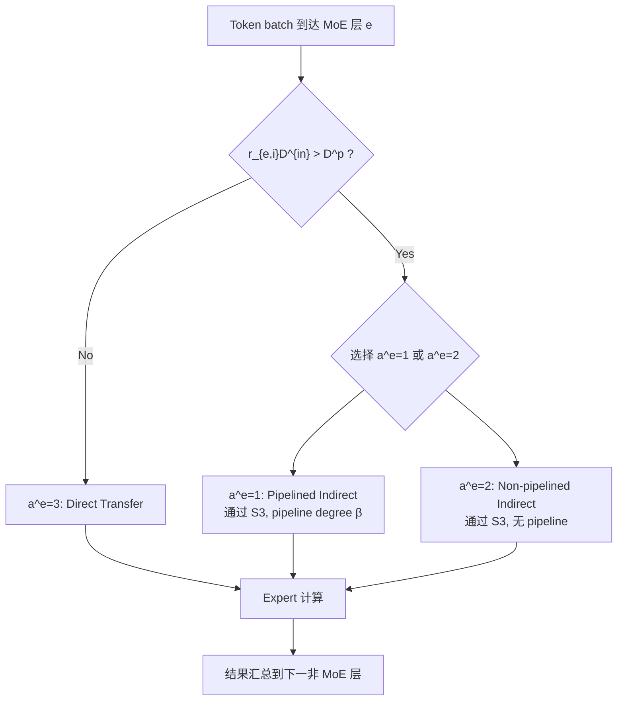
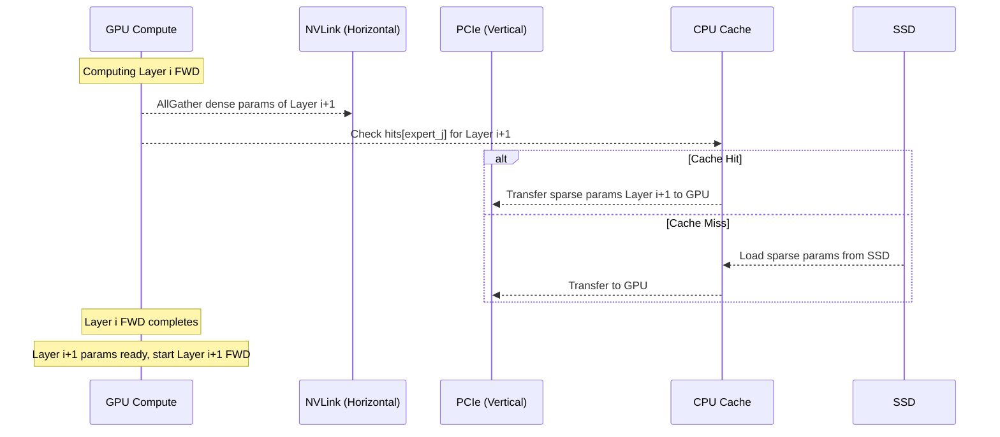
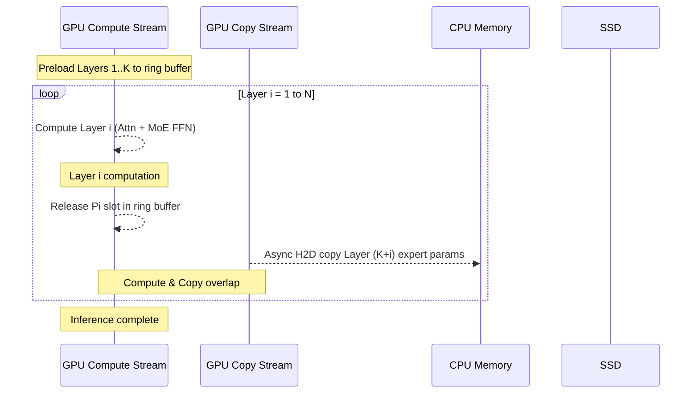
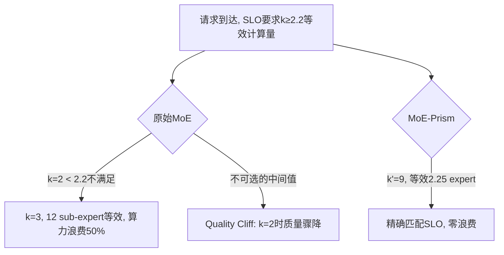
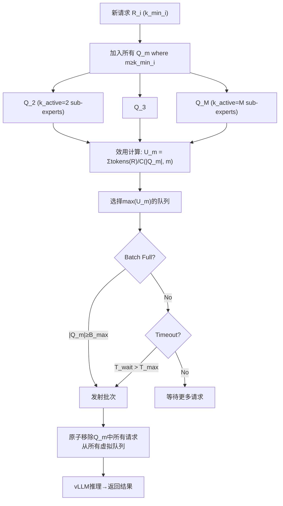
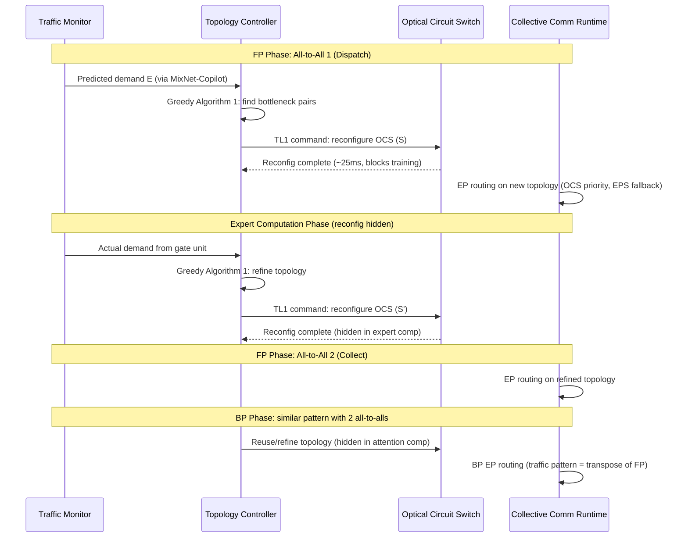
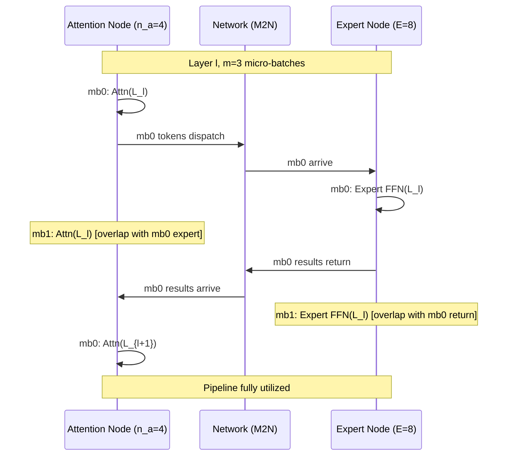
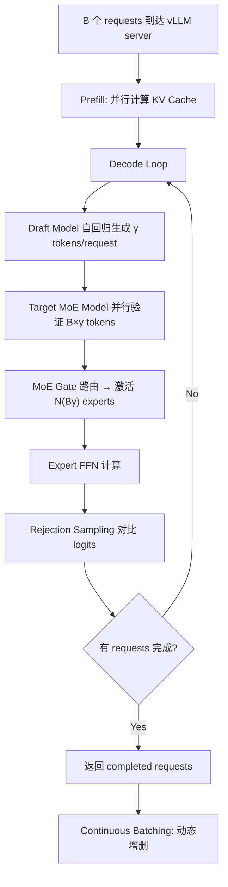
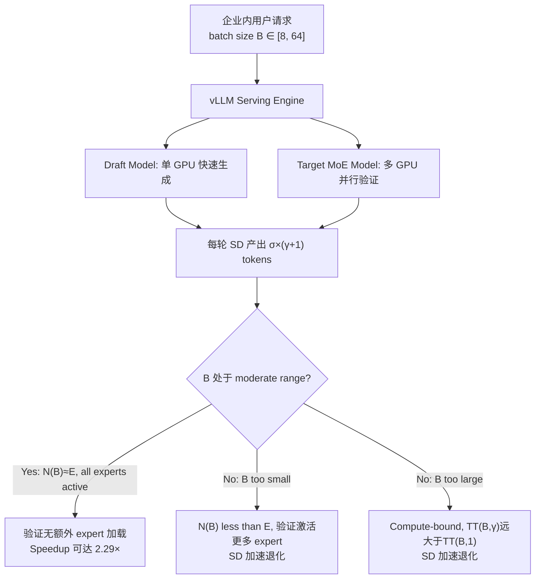
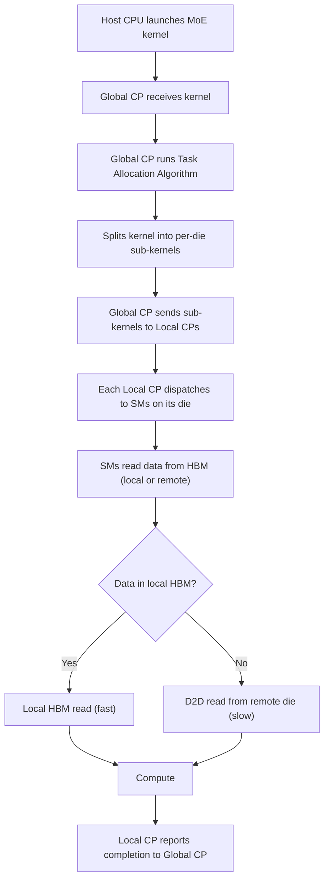

## DualPipe Pipeline Schedule

术语是什么？

DualPipe 是 DeepSeek-V3 (Liu et al., 2024b) 提出的双向流水线并行调度算法，用于大规模模型训练中重叠计算和通信。核心特点是从 pipeline 两端同时注入 micro-batch（forward 和 backward），使前向和后向计算在时间上交错，最大化计算和通信的重叠率。

标准 1F1B（One-Forward-One-Backward）流水线并行存在 bubble（空闲等待时间），而 DualPipe 通过双向调度将 bubble 填充为反向计算或通信操作。DualPipe 与 DeepSeek-V3 的整体训练架构紧密集成，包括 expert parallelism 的 all-to-all 通信和 ZeRO-1 数据并行的梯度通信。

在 mHC 中，DualPipe 被扩展以处理 n-stream 残差引入的额外 pipeline stage 边界通信（n 倍于标准残差连接的通信量）和重计算开销。

从系统架构角度拆解：

DualPipe 在 mHC 中的扩展调度：
```
Timeline (simplified):
Stage 0 | F_A0 F_M0 | comm | B_M0 B_A0 | W | ...
Stage 1 |   | F_A1 F_M1 | comm | B_M1 B_A1 | W | ...
Stage 2 |     | F_A2 F_M2 | comm | B_M2 B_A2 | W | ...

Key extensions for mHC:
1. MLP (FFN) F_post,res kernel on dedicated high-priority compute stream
   → allows preemption by communication, reducing stalls
2. No persistent kernels in attention layers
   → prevents long-running ops from blocking scheduling
3. Recompute blocks aligned with pipeline stage boundaries
   → x_{l_0} (first layer input) already locally cached, no extra communication
4. Communication (nC elements per boundary) overlapped with compute
```

术语一般如何实现？如何使用？

DualPipe 要求 pipeline stage 数量可被 2 整除，且需要细粒度的 GPU stream 管理（通信 stream + 高优先级 compute stream）。在 mHC 中通过 CUDA stream 优先级实现 preemption——MLP 的 $\mathcal{F}_{post,res}$ kernel 放入高优先级 stream，能在通信到达时被抢占，确保通信不阻塞。Attention 层避免 persistent kernel 以防止长时间占用 SM 导致调度僵化。

涉及论文标题：
- mHC Manifold-Constrained Hyper-Connections

---

## Pipeline Stage Boundary Communication-Computation Overlap for mHC

术语是什么？

在 mHC 的流水线并行中，pipeline stage 边界需要传输 n-stream 残差状态（nC 元素，n 倍于标准残差连接）。为消除这一额外通信延迟，mHC 扩展 DualPipe schedule 实现了细粒度的通信-计算重叠机制。

两个关键技术：(1) MLP 层（FFN）的 $\mathcal{F}_{post,res}$ kernel 在专用高优先级 CUDA stream 上执行，能在通信到达时被抢占，避免了传统 persistent kernel 长时间阻塞 SM 的问题；(2) Attention 层避免使用 persistent kernel，防止长时间运行操作阻塞调度器。重计算过程与 pipeline 通信解耦，因为每 stage 的首层输入 $\mathbf{x}_{l_0}$ 在本地已有缓存。

从系统架构角度拆解：

```
Pipeline Stage Boundary Timeline:
... | F_M_{L-1} | {F_post,res + comm overlap} | comm (nC) | ...
                     |                              |
                     v                              v
          F_post,res on HP stream          x_{l_0} already cached
          (preemptible by comm)            (no extra recv needed)

Traditional DualPipe without mHC extension:
... | F_M_{L-1} | wait_comm | comm (C) | F_post,res | ...

mHC extension benefit:
- HP stream: F_post,res yields to communication → no stall
- Recompute decoupled: no dependency on recv'd data
```

术语一般如何实现？如何使用？

CUDA stream 优先级管理通过 `cudaStreamCreateWithPriority` 实现。高优先级 stream 上的 kernel 能在低优先级 stream 的 kernel 执行间隙被调度。mHC 限制 persistent kernel 的使用范围（如仅用于 attention 计算的特定阶段），使得 GPU 调度器有充足机会插入通信 kernel。重计算因 $\mathbf{x}_{l_0}$ 本地缓存而完全免除 pipeline 通信依赖。

涉及论文标题：
- mHC Manifold-Constrained Hyper-Connections

## Serverless Computing for MoE Model Inference（基于Serverless的MoE模型推理）

术语是什么？回答尽量完整，回答逻辑链中每一步都解释出来。通过联网搜索让回答具体和精准。
Serverless Computing（无服务器计算）是一种云计算范式，由云提供商（AWS Lambda、Google Cloud Functions、Azure Functions、Alibaba Cloud Functions）自动管理服务器、容器和资源的分配与伸缩。用户仅需上传代码（封装为 Docker 镜像或函数），由平台按需分配计算资源并执行。在 MoE 模型推理中，每个 expert 被部署为一个独立的 serverless function；gating network 作为单独的调度函数将 token 路由到各 expert 函数；非 MoE 层也分别部署为独立函数。Serverless 平台的核心计费模式是基于内存使用量 × 执行时间（GB-second / GBs），无请求时零计费，适合处理 MoE 推理中 expert 负载高度倾斜（热门 expert 持续被调用，冷门 expert 可能长时间空闲）的场景。

从系统架构角度拆解术语：
Serverless MoE 推理的全链路工作流（基于 AWS Lambda + S3）：
1. **模型分区**：MoE 层采用 expert parallelism（每个 expert → 1 个 Lambda function），非 MoE 层采用 model parallelism（每层 → 1 个 function）。
2. **Docker 镜像构建**：每个模型分区封装为 Docker 镜像，推送到 ECR（Docker image manager）。模型参数存储于 S3（external storage）。
3. **函数部署**：通过 Step Functions（serverless function deployment manager）将各 Docker 镜像分配到 Lambda function 并部署。部署前需预先配置内存大小（如 128MB~3072MB），决定 vCPU 数量和计费单价。
4. **推理请求处理**：推理请求从 S3 被 Lambda function 读取 → 各 function 从 S3 加载模型参数到内存 → 执行计算 → 中间结果写回 S3 供下游 function 读取。
5. **通信模式**：函数间通信有两种方式：
   - Direct invocation：函数直接调用另一函数传输数据（受 payload size 限制，如 AWS Lambda ≤6MB）
   - Indirect transfer via external storage (S3)：通过 S3 中继数据，突破 payload 限制，但增加延迟和 S3 读写成本。
6. **计费**：每个 function 按使用的内存大小（GB）× 运行时间（秒）计费。冷启动（cold start）期间同样计费。

术语一般如何实现？如何使用？通过联网搜索让回答具体和精准。
- 实现方式：Python 3.8 + PyTorch + Transformers 构建模型代码 → Dockerfile 定义环境 → AWS Lambda function 配置内存 [128, 3072] MB → 通过 boto3 SDK 或 Step Functions 编排函数间调用。
- Serverless MoE 的核心优势：按 GBs 粒度计费（vs. CPU cluster 按月/小时），无空闲资源成本。该论文实验中 serverless MoE 推理的 billed cost 比 CPU cluster 降低至少 75.67%。
- Serverless MoE 的核心挑战：(1) 函数部署和冷启动需要数分钟，无法在推理过程中动态调整内存配置，必须提前预测 expert popularity；(2) 函数是 stateless 的，直接调用时每次重新触发需重新加载模型参数，pipeline 通信难以设计；(3) payload size 限制直接通信的数据量。
- AWS Lambda 默认内存与 vCPU 成正比：更大内存配置 = 更多 vCPU = 更快计算，但也意味着更高的 GBs 单价。
- 开源参考项目：LambdaML (https://github.com/DS3Lab/LambdaML) 是 serverless ML 的基准框架，对每个 function 使用最大内存配置（3008MB）。

涉及论文标题：
- Optimizing Distributed Deployment of Mixture-of-Experts Model Inference in Serverless Computing

## Serverless Scatter-Gather Communication Design for MoE（Serverless MoE 的 Scatter-Gather 通信设计）

术语是什么？回答尽量完整，回答逻辑链中每一步都解释出来。通过联网搜索让回答具体和精准。
在 MoE 推理中，scatter 通信指 gating network 将 token 路由（派发）到各 expert 的过程，gather 通信指各 expert 处理结果汇总到下一非 MoE 层的过程。在 serverless 平台上，由于函数间无直接持久连接（stateless）、payload size 限制（如 6MB）、以及需要通过 external storage（如 S3）中继大数据，scatter-gather 通信无法直接复用 GPU/CPU 集群上的 all-to-all pipelining 方案。该论文为 serverless 平台设计了三种 scatter-gather 通信方法：

1. **Pipelined Indirect Transfer (a^e=1)**：gating network 将 token 数据按 minibatch（pipeline degree β）分片写入 S3 → expert function 从 S3 下载 minibatch_i 并计算，同时上传 minibatch_{i-1} 的结果到 S3（pipeline overlap）→ 所有结果写回 S3 → 下一非 MoE 层从 S3 下载所有结果。
2. **Non-pipelined Indirect Transfer (a^e=2)**：gating network 将所有 expert 输入一次性写入 S3 → 各 expert 从 S3 下载、计算、结果写回 S3 → 下一层从 S3 下载。无 pipeline overlap。
3. **Direct Transfer (a^e=3)**：gating 函数直接调用 expert 函数传输数据 → expert 计算后直接传结果给下一层。要求 r_{e,i} × D^{in} ≤ D^p（payload size）。无 S3 延迟，但受 payload 限制。

从系统架构角度拆解术语：
通信方法选择的工作流程：


Pipelined indirect transfer 的时间模型：
- Block time: t^{blk}_{1,e,i} = T^{dl} + β·max{D^{in}/B^s + t^{cal}_{e,i}, D^o/B^s}
- Non-block time: t^{nblk}_{1,e,i} = T^{dl} + ⌈r_{e,i}/β⌉·(D^o/B^s)
- Head time: T^{h,E}_{e,i} = P_{e,i}/B^s + T^{dl} + T^{str}
- 总 replica 执行时间: t^{rep}_{1,e,i} = T^{h,E}_{e,i} + t^{nblk}_{e,i} + β·t^{blk}_{e,i}

术语一般如何实现？如何使用？通过联网搜索让回答具体和精准。
- 小 batch（~256 tokens）时 direct transfer 最优（无 S3 开销）；大 batch（~2560 tokens）时 pipelined indirect 最优（突破 payload 限制 + pipeline 掩盖 S3 延迟）。
- ODS 算法（Optimal Deployment Selection）逐层选择最优通信方法，并允许不同 MoE 层使用不同方法。
- 实现依赖：AWS Lambda direct invocation API（payload ≤6MB）+ S3 put/get object API（pipeline overlap）。
- 论文实验表明：最优通信方法的选择随 token 数量变化——256 tokens 时 direct transfer 胜出，2560 tokens 时 pipelined indirect 胜出。

涉及论文标题：
- Optimizing Distributed Deployment of Mixture-of-Experts Model Inference in Serverless Computing

## Hierarchical Storage for MoE Training (分级存储 / 异构存储管理)

术语是什么？回答尽量完整，回答逻辑链中每一步都解释出来。通过联网搜索让回答具体和精准。
Hierarchical Storage for MoE Training 是 MoESys 提出的 MoE 模型分布式训练的异构存储管理策略。其核心思想是将 MoE 模型参数按激活特性分为两类——dense 参数（multi-head attention 层，始终激活，参数总量 D）和 sparse 参数（expert FFN 层，选择性激活，参数总量 S）——并分别存储在不同的存储介质上：dense 参数常驻 GPU HBM（避免频繁数据搬运），sparse 参数存于 SSD/CPU 内存（因其规模远超 GPU 容量，且仅在按 α 概率激活时需要）。引入 Intel Optane Persistent Memory (AppDirect + DAX) 替代传统 SSD，以解决 SSD 擦除寿命和 PCIe 延迟问题。MoESys 给出 GPU-Node、CPU-Node、SSD-Node 三层存储的容量约束公式（以 ADAM optimizer 为例：每个参数需 fp16 param + fp16 grad + fp32 master + fp32 momentum + fp32 variance = 16 bytes），其中 α 为 sparse 参数激活概率（0<α<1），L 为 MoE 层数，N 为设备数：GPU-Node 存储 16D+4αS/L ≤ M_GPU·N；CPU-Node 缓存 16αS ≤ M_CPU·N；SSD-Node 全量 12S ≤ M_SSD·N。

从系统架构角度拆解术语：
Hierarchical Storage 在 MoESys 的训练全流程中扮演存储引擎角色：
1. **参数分类阶段**：训练开始时，按 MoE layer 结构将模型参数分为 dense 组和 sparse 组。
2. **存储分配阶段**：dense 参数（含 optimizer states）加载到 GPU HBM 并常驻。sparse 参数（expert FFN 权重）的全部 optimizer states 写入 Optane PMem (SSD-Node)，仅训练中按 expert 选择结果按需加载到 GPU。
3. **训练循环中的存储交互**：每个 training step，Gate 网络决定哪些 expert 被激活 → CPU cache (LFU 机制) 查询所需 sparse 参数 → cache hit 则从 CPU→GPU 传输，cache miss 则 SSD→CPU→GPU 传输 → 计算完成后 sparse 参数梯度回传。
4. **Cache 管理**：CPU memory 作为 sparse 参数的热数据缓存，使用 hash table 记录每个 sparse 参数的历史命中次数 (hits)，按照 LFU 策略（淘汰最低命中频率且超过 threshold 的参数）管理缓存换入换出，每 K step 对 hits 做 moving average 衰减。

术语一般如何实现？如何使用？通过联网搜索让回答具体和精准。
- 实现依赖多级存储硬件的带宽层次：GPU HBM (2TB/s, 80GB per A100) → NVLink (900GB/s) → CPU DRAM (DDR4 ~200GB/s) → PCIe (32GB/s per direction) → Optane PMem / SSD。
- MoESys 使用 Intel Optane PMem 的 AppDirect 模式（而非 Memory 模式），设置 namespace 为 FSDAX，利用 Ext4 DAX 特性实现绕过 page cache 和 kernel 的直接 load/store 操作，避免中断和上下文切换开销。
- 与传统 ZeRO-Infinity（将所有参数统一 prefetch，不区分 sparse/dense）相比，Hierarchical Storage 的核心改进是认识到 MoE 中 sparse 参数和 dense 参数的异构访问模式——dense 参数每次 step 都需要、sparse 参数仅 α 概率被访问——因此对两者采取不同的存储和预取策略。
- 该策略使得 MoESys 在 104.1B MoE model (64 A100 GPUs) 训练中 GPU memory 消耗从 DeepSpeed 的 66.3GB 降至 54.4GB（降低约 12GB per GPU）。

涉及论文标题：
- MoESys: A Distributed and Efficient Mixture-of-Experts Training and Inference System for Internet Services

## 2D Prefetch Scheduling (二维预取调度)

术语是什么？回答尽量完整，回答逻辑链中每一步都解释出来。通过联网搜索让回答具体和精准。
2D Prefetch Scheduling 是 MoESys 针对 Hierarchical Storage 提出的参数预取调度策略，通过在两个维度上并行预取 MoE 模型的不同类型参数，并与当前层的计算重叠，消除异构存储间的数据搬运延迟。两个维度分别是：(1) **水平维度**（NVLink）——通过 AllGather 在 GPU 间预取下一层的 dense 参数（基于 ZeRO-3 的分片策略）；(2) **垂直维度**（PCIe）——从 CPU cache 或 SSD 预取下一层需要激活的 sparse expert 参数。两个维度的预取与当前第 i 层的 forward/backward 计算重叠，当前层计算完成时，第 (i+1) 层的参数已就绪。

从系统架构角度拆解术语：
2D Prefetch 在 MoESys 训练循环中的调度时序：


Dense 参数预取（Algorithm 1）：利用 NVLink 高带宽（900GB/s），在当前层 i 计算时通过 AllGather 收集所有 GPU shard 的 dense 参数切片 d'_i，拼合为完整参数 d_i 供下一层使用。

Sparse 参数预取（Algorithm 2）：维护 hash table hits 记录每个 sparse 参数的访问频率。CPU cache 满时，淘汰 hits 最低且超过 threshold 的参数（回写 SSD 更新状态），然后加载新的 sparse 参数。每 K 步对所有 hits × β 做 moving average 衰减，防止历史数据偏向。

术语一般如何实现？如何使用？通过联网搜索让回答具体和精准。
- 实现的关键是利用 dense 和 sparse 参数的非干扰特性——dense 参数走 NVLink（GPU-to-GPU），sparse 参数走 PCIe（CPU/SSD-to-GPU），两条数据通路互不冲突，可完全并行。
- CPU cache 的 hash table 维护在 GPU Node 上（因每个 node 仅存部分 sparse 参数，空间开销可分摊），利用 AlltoAll 通信的既有结果（Gate 网络的 expert 选择结果）触发 prefetch 决策，不引入额外通信开销。
- hash table 查找/插入/删除的 O(1) 时间复杂度保证 prefetch 决策本身不成为瓶颈。
- 该策略对比 DeepSpeed 的单一 prefetch 通道，额外利用了 NVLink 带宽，将 dense 参数的预取从 PCIe 通道中解放出来。

涉及论文标题：
- MoESys: A Distributed and Efficient Mixture-of-Experts Training and Inference System for Internet Services

## Elastic MoE Training (弹性MoE训练)

术语是什么？回答尽量完整，回答逻辑链中每一步都解释出来。通过联网搜索让回答具体和精准。
Elastic MoE Training 是 MoESys 针对 multi-task MoE 训练中负载不均衡问题提出的动态节点扩展/收缩策略。在 multi-task MoE 训练（如 UFO 模型含多个不同 batch size 的 task）中，不同 task 的输入数据量差异导致各 GPU 的计算时间不均——重 task 节点处理时间长，轻 task 节点完成后空闲等待（称为"木桶效应"或 "bubble"），整体 FLOPS 利用率低。Elastic MoE Training 根据各 task 的 workload 估算，动态调整训练节点分配：轻量 task 合并到更少节点（combine nodes），重量 task 增加节点并通过 data parallelism 分割数据（add nodes + partition）。策略分为 upscaling（增加设备提升整体 throughput）和 downscaling（减少设备控制成本），两者均有效减少 bubble 时间、提升 FLOPS 利用率。

从系统架构角度拆解术语：
Elastic MoE Training 的决策流程：
1. **Workload 评估**：Gate 网络 AlltoAll 收集各 task 的 expert 选择结果 → 估算各 task 的计算量。
2. **节点重分配**：轻量 task（如 batch=128 的 task 3 和 task 4）合并到 2 GPU → 2 task per GPU。重量 task（如 batch=512 的 task 1）拆分到 4 GPU → data parallelism partition → 每 GPU batch=128。
3. **训练执行**：各 GPU 按新分配的 task 和 data shard 执行训练，forward/backward 后通过 AlltoAll 同步 sparse 参数梯度、AllReduce 同步 dense 参数梯度。
4. **成本感知**：upscale 优先吞吐，downscale 优先成本，根据实际需求二选一。

术语一般如何实现？如何使用？通过联网搜索让回答具体和精准。
- 在 UFO 模型（4 tasks, batch sizes 512/256/128/128）的实验中：load imbalanced 配置（4 GPU, 1/1/1/1 per task）per-GPU throughput = 62.6 samples/s；load balanced (8 GPU, 4/2/1/1 per task) per-GPU throughput = 74.0 samples/s（+18.2%）。
- 在 VIMER-UFO 2.0 (32× A100) 上对比 PyTorch v1.10：throughput 从 425 images/s 提升至 697 images/s (+64%)，memory 从 55GB 降至 45GB per GPU (-18%)。
- 该策略的关键挑战是避免因节点数变化导致的参数同步开销大于 bubble 消除收益——论文通过资源感知的成本模型判断 upscale/downscale 的利弊。

涉及论文标题：
- MoESys: A Distributed and Efficient Mixture-of-Experts Training and Inference System for Internet Services

## Ring Memory Offloading (环形内存卸载)

术语是什么？回答尽量完整，回答逻辑链中每一步都解释出来。通过联网搜索让回答具体和精准。
Ring Memory Offloading 是 MoESys 提出的 MoE 模型单机推理时的 CPU-GPU 协同内存管理策略。当 MoE 模型参数量超过单 GPU 显存时，将 CPU 和 GPU 内存组织为环形缓冲区（ring buffer）：每个 decoder layer 的 expert 参数在 CPU 内存中存储 N 份副本（N = decoder 层数），GPU 内存中维护一个容量为 K 份 expert 参数的 ring buffer。推理时，GPU 计算第 i 层 → 释放第 i 层的 expert 参数 slot → 异步从 CPU 加载第 (K+i) 层的 expert 参数到刚释放的 slot → 形成"计算-释放-加载"的流水线。关键在于计算与数据搬运的 overlap：使用独立 CUDA stream 做 H2D copy，与 compute stream 并行执行。

从系统架构角度拆解术语：
Ring Memory Offloading 的推理时序（N decoder layers, GPU ring buffer 容量 K）：


每个 decoder layer 的结构（类似 Switch Transformer）具有层间参数独立性——第 i 层完成后其 expert 参数 Pi 可立即释放，不需要等待后续层。当 K 足够大且 N 足够多时，GPU 的 copy engine 完全隐藏在 compute 之后，推理性能几乎不受 offloading 影响。

术语一般如何实现？如何使用？通过联网搜索让回答具体和精准。
- 实现依赖 CUDA Pinned Memory（cudaHostAlloc）避免 pageable memory 的额外 copy，使用 cudaMemcpyAsync 在 non-default CUDA stream 上做异步传输。
- Ring buffer 的 slot 管理维护固定大小的 GPU memory pool，避免频繁 cudaMalloc/cudaFree 导致的内存碎片。
- 实验中 58.2B 参数 MoE model (32 experts) 在 16× A100(40G) 上：GPU memory 消耗降低 ≥30%，overlap offloading 的 compute time 与无 offloading 几乎相同（图 12）。
- 类似技术在其他系统中也有应用：DeepSpeed-Inference 的 layer-wise offloading、MoE-Infinity 的 expert-aware prefetching、Klotski 的 expert-aware multi-batch pipeline。

涉及论文标题：
- MoESys: A Distributed and Efficient Mixture-of-Experts Training and Inference System for Internet Services

## Expert Parallelism (专家并行)

术语是什么？回答尽量完整，回答逻辑链中每一步都解释出来。通过联网搜索让回答具体和精准。
Expert Parallelism (EP) 是 MoE 模型分布式训练和推理的核心并行策略之一。与 Data Parallelism（每个 GPU 持有完整模型副本、处理不同数据）和 Tensor/Pipeline Parallelism（切分单个层的计算）不同，Expert Parallelism 将 MoE 模型的不同 expert 分配到不同的 GPU 上。对于每个输入 token，Gate 网络计算路由结果决定该 token 被派发到哪些 expert → 通过 AlltoAll 通信将 token hidden states 发送到对应 expert 所在的 GPU → 目标 GPU 执行 expert FFN 计算 → 结果通过 AlltoAll 通信返回原始 GPU。EP 的核心特征是不需要所有 GPU 存储所有 expert 参数（节省显存），但引入了跨 GPU 的 AlltoAll 通信开销。

从系统架构角度拆解术语：
Expert Parallelism 在 MoESys 中的训练流程（结合 Data Parallelism）：
1. **Dense 部分**（Attention 层）：使用 Data Parallelism——各 GPU 处理不同 batch 数据，backward 后通过 AllReduce 同步 dense 参数梯度。
2. **Sparse 部分**（MoE FFN 层）：使用 Expert Parallelism——Expert 1..8 分配到 GPU 0，Expert 9..16 分配到 GPU 1，以此类推。
3. **Forward pass**：每个 GPU 的 tokens 通过 Gate 网络选择 top-K experts → AlltoAll 派发 tokens 到目标 expert 的 GPU → 每个 GPU 对收到的 tokens 执行本地 expert FFN → AlltoAll 返回结果。
4. **Backward pass**：同理通过 AlltoAll 交换 expert 参数的梯度。
5. MoESys 在 EP 通信中引入 Hierarchical AlltoAll（利用 NVSwitch + 同 rank NIC 分组），优化了通信效率。

术语一般如何实现？如何使用？通过联网搜索让回答具体和精准。
- EP 通常与 Data Parallelism 混合使用：dense 参数用 DP（减少通信量，因 dense 参数少），sparse 参数用 EP（减少显存压力，因 sparse 参数多）。
- AlltoAll 是 EP 的核心通信原语，每层 MoE 需 2 次 AlltoAll（forward）和 2 次 AlltoAll（backward），共 4 次。例如 Switch Transformer 的设计。
- EP 的负载均衡问题是关键挑战：某些 expert 被频繁选中（hot expert），某些很少被选中（cold expert），导致 GPU 计算负载不均。解决方案包括 auxiliary loss（GShard）、随机 routing（Switch Transformer）、capacity factor 限制等。
- 在 MoESys 实验中，EP 结合 Hierarchical AlltoAll 在 80.7B model / 4 nodes 32 GPUs 下通信阶段加速 15.5%，端到端训练加速 10.3%。

涉及论文标题：
- Outrageously Large Neural Networks: The Sparsely-Gated Mixture-of-Experts Layer
- MoESys: A Distributed and Efficient Mixture-of-Experts Training and Inference System for Internet Services
- MoETuner: Optimized Mixture of Expert Serving with Balanced Expert Placement and Token Routing
- NetMoE: Accelerating MoE Training through Dynamic Sample Placement
- Optimizing Distributed Deployment of Mixture-of-Experts Model Inference in Serverless Computing

### Shazeer et al. (2017) 的先驱性贡献

Shazeer et al. (2017) 首次提出了混合数据并行与模型并行（Mixed Data and Model Parallelism）的 MoE 分布式训练方案（第三节），这是 Expert Parallelism 的雏形：

- **核心思想**：同一组设备同时充当数据并行副本（处理标准层和 Gate 网络）和模型并行分片（各托管一部分 expert）。标准层在每个设备上全复制（DP），每个 expert 只在集群中保留一份共享副本（MP）。
- **组合 batch**：所有数据并行输入 batch 中的相关样本合并后送给每个 expert → expert batch size 约等于 kb·d/n（b=每设备 batch, d=设备数, n=expert 数），即 batch size 放大 d 倍，解决 shrinking batch problem。
- **卷积加速**：在 language model 中，等前一层所有时间步完成后再将 MoE 应用于所有时间步 → 将 seq_len 折叠进 batch → 进一步放大 expert batch。
- **Hierarchical MoE 与设备的协同设计**：第一级 Gate 的 branching factor = GPU 数量 → 主 Gate 选择 GPU (group) → 次级 Gate 在 GPU 本地选 expert → 次级 expert 间无跨设备通信。
- **与后续 EP 的关系**：该方法奠定了 Expert Parallelism 的基本设计原则——dense 部分用 DP，sparse 部分用 MP/EP。该论文尚未使用 AlltoAll 通信（因 Hierarchical MoE 避免了次级通信），后续 GShard (Lepikhin et al. 2020) 在 flat MoE 中引入 AlltoAll 通信，成为现代 EP 的标准通信原语。

涉及论文标题：
- Outrageously Large Neural Networks: The Sparsely-Gated Mixture-of-Experts Layer
- MoESys: A Distributed and Efficient Mixture-of-Experts Training and Inference System for Internet Services

### Serverless MoE 的补充
该论文在 **serverless（AWS Lambda）平台**上采用 expert parallelism：每个 expert 部署为一个独立的 Lambda function（而非 GPU），通过三种 scatter-gather 通信方法（pipelined indirect via S3 / non-pipelined indirect / direct invocation）替代 GPU 集群上的 all-to-all 通信。Serverless 上的 EP 特点：
- 内存配置差异化：热门 expert 分配大内存（最高 3008MB，更多 vCPU），冷门 expert 分配小内存（最低 128MB），按 GBs 粒度计费。
- 专家副本（replication）：热门 expert 可部署多个 function 副本（最多 8），每个副本处理 1/g 的 token，解决单函数内存上限约束和 payload size 限制。
- 无 all-to-all 通信原语：serverless 平台不支持 GPU 集群的 NCCL all-to-all，因此通过 S3 中继或函数间直接调用实现 scatter-gather。
- 预测驱动：由于函数部署需要数分钟（cold start），必须在使用前预测 expert 负载，无法在推理中动态调整。

### MoETuner 的补充

MoETuner 通过 ILP 优化 Expert Parallelism 中的 expert-to-GPU 映射，解决默认 contiguous block placement 的两个缺陷：(1) Token 处理负载不均衡——高频/低频 expert 混合分配到同一 GPU cluster；(2) 跨 GPU 通信倾斜——利用跨层 expert 路由亲和性将频繁交互的 expert 对放在同一 GPU。ILP 1（Load-Balanced Expert Clustering）按层将 expert 聚类，min Σ|T_{c,l} - T̄_l|；ILP 2（Cluster-to-GPU Assignment）分配 cluster 到 GPU，min Σ max(C_{c_1,c_2,l} / B_{g_1,g_2})。在 Megatron-LM 上修改 all-to-all 通信和 expert placement 模块实现自定义 mapping，Mixtral-8x7B 单节点（8×H100, 4EP-2TP）加速 9.3%，多节点（16×H200, 4EP-4TP）加速 17.5%。

### Orders in Chaos 补充

本论文从两个新角度扩展了 EP 的理解：
- **Wafer-scale single-GPU-like EP**：在 wafer-scale multi-chiplet GPU 上，EP 意味着 expert 分布在 wafer 的不同 die 上（而非不同 GPU 节点）。由于 single-GPU-like programming model 不暴露 die-level 控制，论文通过硬件架构扩展（Global/Local CP + ATU/PDU + Task Allocation Algorithm）在硬件层实现 expert-placement-aware 的任务分配。关键挑战：local vs remote HBM access 延迟差距达 10-15×，但传统 GPU CP 无视 dielocation 做 uniform 任务分配。
- **Prefill-guided EP placement**：利用 prefill 和 decode 阶段 expert selection 的高度相关性（Spearman's ρ ≥ 0.7 for most layers, top-5 prefill experts cover ~60% of top-5 decode experts），在 decode 开始前用 prefill traces 优化 expert placement。提出两种算法：(1) Remap-based——保持 expert 数不变重新分配；(2) Duplication-based——预留额外槽位复制热门 expert。在 Qwen3-235B / EP8 / 8×H100 上分别实现 15.5% 和 12.5% MoE computation 加速。在更大 EP scale 下预期效果更显著（EP8 下默认布局已相对均衡，max/min ratio ≈ 1.3×）。

## Quality Cliff in MoE (MoE质量悬崖)

术语是什么？回答尽量完整，回答逻辑链中每一步都解释出来。通过联网搜索让回答具体和精准。
Quality Cliff 是 MoE-Prism 定义的概念，描述当前 MoE 模型在 serving 时面临的"成本-质量"权衡困境。MoE 模型只提供粗粒度的少数离散操作点（如 Mixtral-8x7B 仅有 k=1 或 k=2 两种激活配置），使得系统在降低计算成本时被迫经历不成比例的质量大幅下降。这是因为 monolithic expert 内部虽然存在冗余（大部分 neuron 对特定 token 贡献极小），但标准 top-k routing 只能以整个 expert 为单位做激活选择——哪怕只需 expert 内 25% 的 neuron，也必须激活 100% 的 expert 或 0%。Quality Cliff 导致系统只能在高计算/高质量和低计算/低质量之间做二选一，缺少中间梯度。MoE-Prism 通过 Sub-Expert Decomposition 将 expert 拆分为 N=4 个子 expert 后，k_active 的操作空间从整数 {1,2,...,k_max} 拓展为 {4,5,...,N×k_max}，将"悬崖"转化为平滑的权衡曲线。

从系统架构角度拆解术语：

对 cloud serving 的影响：批次调度时，若批次内各请求 SLO 不同，只能用批次内最高 k_min（最坏情况分配），导致大量请求被"过度服务"浪费算力。对 offloading 的影响：SLO 需求 4.2 expert → 必须加载 5 个完整 expert → PCIe 传输超额 19%。

术语一般如何实现？如何使用？通过联网搜索让回答具体和精准。
- Quality Cliff 的根本原因是训练约束：理论上可通过更多 expert 增加可配置性，但大规模 MoE 训练成本高且不稳定（如 KIMI K2 虽 1T 参数但仅 9 experts）。
- 解决 Quality Cliff 需要在 post-training 层面引入细粒度控制，而非从训练阶段增大 expert 数量。MoE-Prism 通过 offline refactoring（分解每个 expert 为 4 个子 expert）提供 4 倍操作点密度。
- 类似概念在 MoE 研究中也有体现：DualSparse-MoE (2025) 通过 tensor/neuron 双重稀疏性实现更细粒度的计算控制；Dynamic MoE (2024) 通过 adaptive expert 选择动态调整每 token 的激活 expert 数。

涉及论文标题：
- MoE-Prism: Disentangling Monolithic Experts for Elastic MoE Services via Model-System Co-Designs

---

## Quality-Constrained Throughput Scheduler (质量约束吞吐调度器)

术语是什么？回答尽量完整，回答逻辑链中每一步都解释出来。通过联网搜索让回答具体和精准。
Quality-Constrained Throughput Scheduler 是 MoE-Prism Online Scheduling Engine 中面向云端部署的调度策略，目标是在满足每个请求的质量约束（最小激活 sub-expert 数 k_min）下最大化系统吞吐。核心创新是打破"批次组成依赖 k_active，k_active 选择又依赖批次组成"的循环依赖：维护 M 个虚拟队列（M=可能的 k_active 数量），每个请求到达时加入所有满足其 k_min 的虚拟队列，调度器对 M 个潜在批次并行计算效用函数 U_m = Σ tokens(R_i) / C(|Q_m|, m)，选择效用最高的批次发射。两个硬触发器防饥饿：Batch Full Trigger（队列达到最大批次 B_max 时发射）和 Timeout Trigger（请求等待超 T_max 时发射）。

从系统架构角度拆解术语：

关键行为：请求"升级"机制——低 k_min 请求可能被高 k_active 批次携带执行（如 k_min_A=2 的请求可能与 k_min_B=8 的请求一起在 Q_8 中被发射），因为运行大 batch 的硬件效率增益可能超过质量升级成本。这等价于在效用函数中隐式编码了 batch size 与 k_active 的 trade-off。

术语一般如何实现？如何使用？通过联网搜索让回答具体和精准。
- MoE-Prism 基于修改版 vLLM 0.9.1 实现。部署前执行一次性 benchmark 构建性能模型 C(k_active)，映射 sub-expert 数到延迟和内存。
- 对比基线：FullBatch（静态等到 B_max 才发射，最大化硬件利用但延迟高）和 FIFO（动态非阻塞，先到先服务批次）。
- 高负载下：MoE-Prism 在 Deepseek 上提升 19.9% 吞吐（13→15.59 req/s），在 OLMoE 上提升 14.9%（15.57→17.89 req/s），同时降低 TTFT 和 TPOT。
- 相关系统：AMoE (2025) 的 μ-queuing 动态重批处理，D²MoE (2025) 的 HEBF 调度（hottest-expert-bit-first），QoS-Efficient Serving (ICML 2025) 的 similarity-based expert consolidation。

涉及论文标题：
- MoE-Prism: Disentangling Monolithic Experts for Elastic MoE Services via Model-System Co-Designs

---

## Virtual Queue Scheduling for MoE (MoE虚拟队列调度)

术语是什么？回答尽量完整，回答逻辑链中每一步都解释出来。通过联网搜索让回答具体和精准。
Virtual Queue Scheduling 是 MoE-Prism 的 Quality-Constrained Throughput Scheduler 使用的核心调度数据结构：维护 M 个虚拟队列（M = 可能的 k_active 值数量，如 9,10,...,32），每个请求 R_i 不是放入单一队列，而是加入所有满足其质量约束的虚拟队列（所有 m ≥ k_min_i）。调度器并行评估所有 M 个虚拟队列的效用 U_m = Σ tokens(R_i) / C(|Q_m|, m)，选择最高效用的队列发射。发射时，批次内请求被从所有虚拟队列中原子移除。这使调度器能够同时考虑 M 种不同的 (k_active, batch_composition) 组合，打破传统的"先组批再定配置"或"先定配置再组批"的循环依赖。

从系统架构角度拆解术语：
```
Virtual Queues state (example with M=4, k_active ∈ {1,2,3,4}):

Requests pending: R_A(k_min=1,tokens=100), R_B(k_min=2,tokens=50), R_C(k_min=3,tokens=200)

Q_1 = [R_A]                          # only R_A qualifies
Q_2 = [R_A, R_B]                     # R_A+R_B qualify
Q_3 = [R_A, R_B, R_C]                # all qualify
Q_4 = [R_A, R_B, R_C]                # all qualify

Utilities (假设C(n,k) = (n*k)*单位延迟):
U_1 = 100/C(1,1) = simple throughput
U_2 = 150/C(2,2) = batch of 2, k=2
U_3 = 350/C(3,3) = batch of 3, k=3  ← likely highest utility
U_4 = 350/C(3,4) = batch of 3, k=4  ← more quality, same batch, higher cost

选择 Q_3 → 所有3个请求一起发射(k_active=3) → 原子移除R_A,R_B,R_C from all Q_1..Q_4
```
关键性质：(1) 非独立调度——同一个请求可出现在多个候选批次中；(2) 原子性——发射后所有虚拟队列状态一致更新；(3) 等价于在每个调度周期枚举指数级组合空间的一个高效近似。

术语一般如何实现？如何使用？通过联网搜索让回答具体和精准。
- MoE-Prism 中 M 与 refactored model 的 sub-expert 配置空间大小相同（如 Deepseek 的 k 范围 8→24，M=17）。性能模型 C(k_active) 通过一次性 offline benchmark 构建为 lookup table。
- 对比传统单队列调度：FIFO 对所有请求用同个队列+批次内最高 k_min → 粗粒度 QoS；FullBatch 等满 B_max → 无 QoS 概念。虚拟队列方法提供 fine-grained per-configuration utility comparison。
- 概念上类似 networking 中的 Virtual Output Queuing (VOQ) 和 multi-queue weighted fair queuing，但用于 MoE LLM serving 的异构质量约束场景。

涉及论文标题：
- MoE-Prism: Disentangling Monolithic Experts for Elastic MoE Services via Model-System Co-Designs

---

## Module-Based Batching（模块级批处理）

术语是什么？回答尽量完整，回答逻辑链中每一步都解释出来。通过联网搜索让回答具体和精准。
Module-Based Batching 是 MoE-GEN 提出的 MoE 推理批处理策略，核心思想是将 MoE 模型的 attention 和 expert 两类计算密集型模块**解耦**，分别为其分配不同的 micro-batch size（$b_a$ 和 $b_e$），通过多轮 attention 小批次累计 token，最终在 expert 模块形成大 batch 一次性执行。这与传统的 model-based batching（整个 forward pass 使用统一 batch size）形成对比：model-based batching 下 batch size 受 attention 模块的 peak memory 限制（如 DeepSeek-V2 仅为 8），导致每个 expert 在解码阶段仅处理 <10 个 token，GPU FLOPs 利用率低至 0.1%。Module-based batching 将 attention 和 expert 的 memory 需求解耦：attention 以 $b_a$（如 75）为微批次循环多次（约 $B/b_a$ 轮），累计所有 micro-batch 的输出 token 后，在 expert 阶段以 $B$（如 3640）的大 batch 一次性执行所有 experts。图 2 直观展示了两种策略的区别：model-based batching 的 batch 在穿过整个模型时大小不变；module-based batching 则在 attention 和 expert 模块之间增量构建 batch。

从系统架构角度拆解术语，比如术语如何在系统架构中发挥作用，给出术语在系统架构中运转流程的具体例子。通过联网搜索让回答具体和精准。
MoE-GEN 的 system architecture 围绕 module-based batching 组织为一个两阶段引擎（以解码阶段的单层为例）：

```
阶段1: Attention 积累 (Micro-batch = b_a)
  for i in 1..(B/b_a):   // 如 49 轮
    1a. Pre-Attention: QKV projection on GPU（batch = b_a）
    1b. Self-Attention: 按 split ratio ω 分流
        - CPU path (ω·b_a tokens): AVX kernel 直接读 host KV-cache
        - GPU path ((1-ω)·b_a tokens): HtoD copy KV-cache → GPU 计算
    1c. Post-Attention: output projection（concat CPU+GPU results）
    1d. HtoD engine: 预取下一轮 attention weights
    每个 attention micro-batch 的结果累积到 host memory

阶段2: Expert 批处理 (Accumulated Batch = B)
  2a. Router: 所有 B 个 token 统一通过 gating
  2b. for each expert j in 1..E:
        HtoD engine: prefetch expert_j weights → S_Expert GPU buffer
        GPU: compute expert_j on its assigned tokens
        （大 batch 下 token 均匀分配，每个 expert 收到 ~B·k/E tokens）
```

关键系统组件：Batching Scheduler（搜索最优 B, b_a, b_e, ω 配置）→ 分配 GPU memory buffers（KV-cache buffer, expert buffer, dense buffer）→ MoE-GEN Engine 执行 module-based batching loop → HtoD/DtoH engines 异步执行 memory copy。

术语一般如何实现？如何使用？通过联网搜索让回答具体和精准。
Module-based batching 在 MoE-GEN 中通过以下方式实现：
- **实现语言**：约 3000 行 C++ 和 2000 行 Python，集成 HuggingFace generation pipeline。
- **Batch size 搜索**：offline profiling 各模块在不同 batch size 和 sequence length 下的 latency 和 peak memory，然后在搜索空间（B, b_a, b_e, ω, S_Expert, S_Params）中枚举，通过 DAG+DP 估算 critical path 选择吞吐最优配置。
- **适用场景**：offline high-throughput inference（benchmarking、data wrangling、feature extraction），不适合 interactive/latency-sensitive 场景（首 token 延迟高）。需要足够的 host memory 存储完整模型 + KV-cache（如 DeepSeek-V2 236B 约需 >400GB host memory）。
- **局限性**：batch size 受 host memory 容量约束（长 context 下 B 减小）。小 batch (≤32) 下优势减弱，因为 MoE-GEN 为预留大 batch 空间而 aggressively offload，在小模型/小 batch 场景下额外 offloading overhead 可能抵消收益。

涉及论文标题：
- MoE-Gen: High-Throughput MoE Inference on a Single GPU with Module-Based Batching

## MoE Offloading for Single-GPU Inference（单GPU MoE模型卸载推理）

术语是什么？回答尽量完整，回答逻辑链中每一步都解释出来。通过联网搜索让回答具体和精准。
MoE Offloading 是一种在单 GPU 上运行超大 MoE 模型（远超 GPU 显存容量）的内存管理技术。核心设计是将完整的模型参数和 KV-cache 存储在容量更大、成本更低的 host memory（CPU DRAM）中，仅当 GPU 需要计算时，才将所需的参数和 KV-cache 传输到 GPU 显存。MoE 模型的天然稀疏性（每个 token 仅激活 k 个 expert）使 offloading 特别适合：无需将所有 expert 参数同时驻留在 GPU 中，只需按需加载被激活的 expert。MoE offloading 系统通常管理两级内存：GPU memory（用于计算和快速数据访问，包含 resident store 和 staging buffer）和 CPU memory（存储完整模型权重和 KV-cache）。当 GPU 计算需要尚未在 resident store 中的 weight/KV-cache 时，要么提前预取（overlap with computation），要么 on-demand fetch（GPU stall 等待传输）。在 offloading 场景下，PCIe HtoD 带宽（如 PCIe 4.0 ×16 约 32 GB/s）成为关键瓶颈，因此系统设计需最大化 computation-memory copy overlap。

从系统架构角度拆解术语，比如术语如何在系统架构中发挥作用，给出术语在系统架构中运转流程的具体例子。通过联网搜索让回答具体和精准。
MoE offloading 系统的典型执行流程（以 MoE-GEN 为例）：

```
单层 MoE offloading 推理（解码阶段）:
┌─────────────────────────────────────────────────────────┐
│ Host Memory (CPU DRAM)                                   │
│  - 完整 model weights (all experts, attention)           │
│  - 完整 KV-cache (所有 layers, 所有 tokens)              │
│  - 中间 activation states                                │
└──────────────┬──────────────────────────────────────────┘
               │ PCIe 4.0 (32 GB/s HtoD, ~32 GB/s DtoH)
┌──────────────▼──────────────────────────────────────────┐
│ GPU Memory (24-48GB)                                     │
│  - S_Dense buffer: 预取当前 dense module weights         │
│  - S_Expert buffer: 预取下一个 expert weights            │
│  - S_Params: 缓存的常驻模型参数（可选）                  │
│  - KV-cache buffer: 当前 attention batch 的 KV-cache     │
│  - S_IS: intermediate states (QKV projections 等)        │
│  GPU 计算: attention micro-batches → expert 大 batch     │
└─────────────────────────────────────────────────────────┘
```

关键设计权衡：
- **Partial vs Full KV-cache offloading**：部分卸载（保留部分 KV-cache 在 GPU）可减少 KV-cache HtoD copy，但挤压 expert batch size。MoE-GEN 选择 full offloading，在大型 dataset 上节省最高 20× 的 expert weight fetching 流量。
- **CPU computation offloading**：将 attention 计算分流到 CPU，不仅利用 CPU 算力，更重要的是减少 KV-cache HtoD copy 对 PCIe 带宽的竞争，将带宽让给 expert weight 预取。
- **Overlap 策略**：HtoD engine 在 GPU 计算当前 module 时异步预取下一个 module 的 weights；DtoH engine 异步将新生成的 KV-cache 写回 host memory。

术语一般如何实现？如何使用？通过联网搜索让回答具体和精准。
实现 MoE offloading 的主要系统和方案：
1. **FlexGen**：以 GPU memory 为约束，通过线性规划搜索最优的 offloading 和 recomputation 策略，按轮次重用已加载的权重进行多次 forward pass。不支持 MoE 特殊优化。
2. **DeepSpeed-Inference**：将 MoE layer 视为 dense MLP 处理，支持 ZeRO-Inference 的 layer-wise weight offloading。
3. **MoE-Lightning**：在 FlexGen 基础上优化 GPU-CPU-I/O overlap，使用 profiling 预先规划 memory movement schedule，但保留 model-based batching。
4. **llama.cpp (Ollama)**：支持 `--n-gpu-layers` 和 `--n-cpu-moe` 参数，将 expert tensors 按 pattern（如 `.ffn_.*_exps.`）识别并 offload 到 CPU，attention layers 保留在 GPU。
5. **KTransformers**：AMX-optimized CPU kernels（21.3 TFLOPS/socket），专家延迟执行（Expert Deferral）使 CPU expert compute 与 GPU attention 重叠，集成到 SGLang。
6. **MoE-GEN**：module-based batching + full KV-cache offloading + CPU attention + DAG-based batch size search，针对 offline high-throughput 场景。

涉及论文标题：
- MoE-Gen: High-Throughput MoE Inference on a Single GPU with Module-Based Batching

## KV-Cache Full Offloading（KV-Cache 完全卸载）

术语是什么？回答尽量完整，回答逻辑链中每一步都解释出来。通过联网搜索让回答具体和精准。
KV-Cache Full Offloading 是将 LLM 推理过程中生成的所有 Key-Value Cache 全部存储在 host memory（CPU DRAM）而非 GPU 显存中的策略。在自回归解码中，每生成一个新 token，其对应的 K/V 投影需要追加到 KV-cache 中供后续 token 的 self-attention 使用。随着 context length 增长，KV-cache 内存占用线性增长：$KV_{MB} = 2 \times L \times H \times D \times C \times B / 1024^2$（L=层数，H=KV head 数，D=head dim，C=context len，B=bytes per element）。对于长 context 大模型，KV-cache 可轻易超过 GPU 显存。Full offloading 将 KV-cache 全部放在 host memory，每个 attention micro-batch 执行前通过 HtoD copy 将所需 token 的 KV-cache 传输到 GPU，执行后将新的 K/V 通过 DtoH copy 写回。

从系统架构角度拆解术语，比如术语如何在系统架构中发挥作用，给出术语在系统架构中运转流程的具体例子。通过联网搜索让回答具体和精准。
MoE-GEN 中 KV-cache full offloading 的运转流程：

```
解码阶段，处理 batch b_a 个 token（第 l 层 attention 的 self-attention 阶段）:
1. CPU 端: b_a 个 token 对应的历史 KV-cache 在 host memory 中
2. HtoD Engine: 将 b_a 个 token 所需的历史 KV-cache slice 
   copy 到 GPU KV-cache buffer（异步）
3. GPU 端: 等待 KV-cache copy 完成后，执行 self-attention:
   Q[b_a, D] @ K^T[D, C_history + b_a] → attention scores
   softmax(scores) @ V[C_history + b_a, D] → attention output
4. DtoH Engine: 将新生成的 K/V（b_a 个 token）异步写回 host memory
   追加到该 layer 的 KV-cache 尾部
```

Full vs Partial offloading 的权衡：
- **Partial offloading (vLLM)**：GPU 保留部分 KV-cache（如最近窗口），减少 HtoD copy 量，但 GPU memory 被 KV-cache 占用，降低 batch size 上限。
- **Full offloading (MoE-GEN)**：GPU memory 完全释放给 compute（更大的 batch、更大的 S_Expert buffer），代价是每个 attention micro-batch 都需要 HtoD KV-cache copy。MoE-GEN 的分析表明（图 4），大型 dataset 下 full offloading 可节省最高 20× 的 expert weight fetching 流量，因为更大的 batch size 使 expert weight 只需加载一次即可处理大量 token。

术语一般如何实现？如何使用？通过联网搜索让回答具体和精准。
实现 KV-cache offloading 的常见方法：
- **PagedAttention (vLLM)**：将 KV-cache 分块管理，block 可在 GPU/CPU 间 swap，类似 OS 虚拟内存的 page 管理。支持 partial offloading。
- **FlexGen**：将 KV-cache 作为可 offload 的 tensor 之一，通过线性规划决定在 GPU/CPU/disk 三级存储中的放置。
- **MoE-GEN**：KV-cache 在 host memory 中以连续 buffer 组织（按 layer、按 sequence 布局），CPU attention kernel 可直接访问 host memory 中的 KV-cache（无需 copy），GPU attention 通过 staging buffer 按需 copy 所需 slice。
- **适用条件**：host memory 需足够大以容纳完整 KV-cache + 模型参数。对于短 context 或小 dataset（GPU memory 足以容纳 KV-cache），partial offloading 可能更优。

涉及论文标题：
- MoE-Gen: High-Throughput MoE Inference on a Single GPU with Module-Based Batching

术语是什么？回答尽量完整，回答逻辑链中每一步都解释出来。通过联网搜索让回答具体和精准。
Expert Residency Aware Selection (ERAS) 是 MoE-ERAS 提出的在 MoE 推理时根据 expert 当前物理驻留位置（GPU HBM 还是 CPU DRAM）动态调整 gating 决策的调度策略。传统 Top-K gating 仅基于 router logits 选择 expert，完全无视 expert 的物理位置——若选中的 expert 在 CPU DRAM 中，解码阶段需等待 PCIe 传输完成（CPU read time 比 GPU read time 高数个数量级）。ERAS 在 gating 输出后、Top-K 选择前，根据 residency table（每层每个 expert 的 HBM/CPU 状态）修正 logits 或 probabilities，使路由器倾向选择已驻留 HBM 的 expert。核心权衡：牺牲少量 routing quality（选择"足够好"的 on-chip expert 而非"最优"的 off-chip expert），换取显著减少的 CPU↔GPU expert swap 和解码延迟。

从系统架构角度拆解术语：
ERAS 在 MoE serving 系统中的运转流程（以 Mixtral-8x7B, 3 experts offloaded/layer, batch_size=1 为例）：
1. **Profiling 阶段**：在代表性数据上运行模型，收集每层每个 expert 的激活频率 freq(E_i)（normalized activation frequency）。存储为 expert activation profile。
2. **Residency Table 维护**：serving 开始时，所有 expert 参数在 CPU DRAM。随解码进行，LRU caching 将部分 expert 加载到 HBM。每次 expert swap 后更新 residency table：`residency[layer][expert] ∈ {HBM, CPU}`。
3. **Per-layer Routing（解码每步）**：
   - Gating network 输出 Logits = H_i @ W_exp
   - Residency-Aware Adjustment：
     - Thresholding: Weights = Softmax(Logits); 对 HBM 中的 expert 加 α
     - Biasing: 对 CPU 中的 expert 减 β(1-freq(E_i))，然后 Softmax
   - Top-K selection from adjusted scores
   - 若选中 off-chip expert → 触发 CPU→GPU 传输 → 可能触发 LRU eviction
4. **效果**：α=0.15 时减少 10-13% 解码延迟；offload 越多、α 越大，效果越显著（最大 21.2%）。与 quantization、LRU caching、prefetching 正交，可叠加使用。

术语一般如何实现？如何使用？通过联网搜索让回答具体和精准。
- 实现方式：在 `dvmazur/mixtral-offloading`（开源 MoE offloading 框架）的 gating→TopK 之间插入 residency-aware adjustment 模块。维护一个 `residency_table[layer][expert]` 布尔数组，每次 expert swap 后更新。
- 超参数选择：α=0.05~0.25（thresholding），β=1.0（biasing）。用户根据所需 speedup-quality trade-off 选择——α 越大 speedup 越大但 quality 下降越多。
- 适用场景：资源受限的 MoE 推理（batch_size=1），如边缘设备、消费级 GPU。硬件不对称性（GPU HBM bandwidth >> PCIe bandwidth）越大，ERAS 价值越大。
- 局限性：当前仅实现于 Mixtral-8x7B；inference-time routing 改动可能将 token 导向训练时较少见的 expert，增加幻觉风险。

涉及论文标题：
- MoE-ERAS: Expert Residency Aware Selection

---

## Expert Offloading (专家卸载)

术语是什么？回答尽量完整，回答逻辑链中每一步都解释出来。通过联网搜索让回答具体和精准。
Expert Offloading 是将 MoE 模型中部分 expert 参数从 GPU HBM 卸载到更慢但更廉价的存储介质（CPU DRAM 或 SSD）的技术，使大模型能在内存受限的 GPU 上运行。MoE 模型的稀疏激活特性（每个 token 仅激活 k 个 expert）使 offloading 天然适用——大部分 expert 在大部分时间内不被使用，可以驻留在慢速存储中。典型方案：将全部非-expert 权重（attention、LayerNorm 等）保持在 GPU，仅 offload expert FFN 权重；使用 LRU caching 保留最近使用的 expert 在 HBM；按需从 CPU/SSD 加载被激活的 off-chip expert。

从系统架构角度拆解术语：
Expert Offloading 在 MoE serving 中的执行流程（以 Mixtral-8x7B on Tesla T4 16GB 为例，基于 dvmazur/mixtral-offloading）：
1. **初始化**：模型总参数 ~87GB。Attention + LayerNorm 等非-expert 权重保持在 GPU（~2GB）。所有 8×32 = 256 个 expert 权重压缩（quantization）后存储在 CPU DRAM。GPU HBM 中缓存 k_keep 个 expert per layer。
2. **Prefill 阶段**：prompt tokens 流经各层。每层 gating network 输出 Top-K experts → 检查 residency table → 若缺失则 CPU→GPU 传输 expert 权重（PCIe 瓶颈，图 2 显示 CPU read >> GPU read）→ expert 计算 → 更新 LRU cache（可能 evict 最久未用的 expert 回 CPU）。
3. **Decode 阶段**：逐 token 解码，每步重复上述过程。Expert swap 成为 memory-bound 解码的主要延迟来源。
4. **优化技术**：量化压缩（减少传输量）、LRU caching（保留热 expert）、prefetching（预测下一层 expert 提前加载）、residency-aware routing（ERAS，倾向选择已驻留 expert）。

术语一般如何实现？如何使用？通过联网搜索让回答具体和精准。
- 开源实现：`dvmazur/mixtral-offloading`（https://github.com/dvmazur/mixtral-offloading）——支持 Mixtral-8x7B 在 Tesla T4 16GB 上运行，使用 quantization + LRU caching + speculative prefetching。
- 其他系统：MoE-Infinity（activation-aware prefetching + caching，支持 CPU DRAM + SSD 分层 offloading，核心创新为 Sparsity-Aware Expert Cache：利用 batch_size=1 时的请求级 expert 激活稀疏性和偏斜重用模式，通过 EAMC（Expert Activation Matrix Collection）追踪历史请求的 request-level EAM 并用余弦距离匹配，PredictEAM 预测未来 expert 激活概率，指导 GPU expert cache 的淘汰和预取）、DeepSpeed-Inference（layer-wise offloading，非 expert-aware）、FineMoE（fine-grained expert offloading with probability-aware cache management）。
- 关键 trade-off：内存节省 vs 延迟增加。Offload 越多，GPU memory 需求越低，但 CPU→GPU 传输延迟越高。

**LUT Offloading (MoLE 范式)**：与 expert offloading 互补的替代方案。MoLE 将 expert 重参数化为 Lookup Table（LUT = 所有 vocabulary token × 所有 expert 的预计算输出），LUT 整体 offload 到 CPU/disk。推理时仅加载当前 input_ids 对应的 lookup results（每 token dN 参数，如 1B MoLE-4E: d=2048, N=4 → 8KB），而非完整 expert 权重。对比：MoE expert offloading 每 step 加载 2dkD_r（~537MB for 1B MoE-10E），MoLE 的 LUT offloading 仅加载 dN（~8KB），通信量降低 ~60000×。代价：LUT 存储开销大（dN|V|，如 MoLE-16E 160M 时 LUT=7.4B 参数），但存储设备可扩展且随模型增大 LUT/Expert 比例下降。

- **Sub-Expert Offloading (MoE-Prism 范式)**：MoE-Prism 将 monolithic expert 分解为细粒度 sub-expert 后，offloading 从粗粒度整块加载变为精准按需传输。关键改进：(1) VRAM Cache Manager 将 GPU VRAM 作为 sub-expert 缓存（LRU 策略），CPU RAM 持所有 sub-expert。细粒度使内存碎片利用更高效——无法容纳一个完整 monolithic expert 的内存碎片可容纳多个子 expert，cache hit ratio 从 0.4375(28/64) 提升到 0.4453((28×4+2)/(64×4))（16GB 配置）。(2) Generation Step Orchestrator 每 token 步：router 确定 S_req(t) → 查询 cache 得 miss set S_miss(t) → 异步传输 S_miss(t) → 计算。每步延迟 L(t) = Latency_IO(S_miss) + Latency_compute(S_req)。(3) 细粒度消除粗粒度"量化误差"：原模型若 SLO 要求等效 4.2 个 expert 的计算量，必须加载 5 个完整 expert；MoE-Prism 仅加载 17 个 sub-expert (等效 4.25 expert)，减少 PCIe 传输量。

涉及论文标题：
- MoE-ERAS: Expert Residency Aware Selection
- Mixture of Lookup Experts
- MoE-Infinity Activation-Aware Expert Offloading for Efficient MoE Serving
- MoE-Prism: Disentangling Monolithic Experts for Elastic MoE Services via Model-System Co-Designs
- MoE-SpeQ: Speculative Quantized Decoding with Proactive Expert Prefetching and Offloading for Mixture-of-Experts
- Not All Models Suit Expert Offloading: On Local Routing Consistency of Mixture-of-Expert Models
- Oracle-MoE: Locality-preserving Routing in the Oracle Space for Memory-constrained Large Language Model Inference

**模型级 Expert Offloading 适合度评估** (来自 "Not All Models Suit Expert Offloading", ICLR 2026)：论文提出并非所有 MoE 模型都同等适合 expert offloading——模型的路由行为（局部路由一致性）直接影响专家缓存的命中率。关键量化指标：(1) SRP (Segment Routing Best Performance)——expert 在 segment 内持续激活程度的固有度量；(2) SCH (Segment Cache Best Hit Rate)——在给定 cache size 下 oracle cache 的理论命中率上界，与 LRU/LFU 实际 hit rate 高度相关 (m=16 时 Pearson r > 90%)。部署建议：选择 SRP/SCH 高的模型（Group 1: LLaMA-MoE-v2, OLMoE, Qwen3, etc.）→ 简单的 LRU cache 即可获高命中率；Cache size ≈ 2× active experts 为大多数模型的最佳性价比点（SCH-ρ 曲线拐点）。论文补充发现 decoding 阶段 overhead 与局部路由一致性负相关 (r≈−0.3)，但 prefilling 阶段正相关 (r≈0.2)——因 prefilling 瓶颈在 expert-level 的 load balance。代码：https://github.com/ljcleo/moe-lrc。

**MoE-SpeQ 中对 Expert Offloading 瓶颈的量化**：在 A100-40G 上以 HuggingFace Transformers device_map offloading 运行 MoE 模型，PCIe 传输主导端到端时间——Mixtral-8x7B 中 Memory 占 98.9%（图 4），GPU compute < 15%。MoE-SpeQ 通过 speculative decoding 将 I/O latency 转化为 productive computation（draft 生成与 I/O overlap），首次将 speculative execution 与 expert offloading 协同设计。三阶段预取策略（Phase I cache priming → Phase II adaptive prefetch → Phase III cache saturation）使 cache 命中率达 96-99.85%（远超 LRU 的 29.2-76.56%）。

**Oracle-MoE 对 Expert Swapping 延迟的分析与缓解**：Oracle-MoE (ICML 2025) 从算法层面分析了 expert swapping 延迟的根因——token-level MoE routing 的 inter-token expert activation inconsistency（每 2 个连续 token 几乎都激活不同专家），导致频繁的 expert swapping 需求。在 Jetson Xavier NX (8GiB GPU) 上实测：memory-constrained inference 延迟是 full-model 的 15-30 倍，其中 50%-85% 来自 I/O swapping overhead。传统策略（FIFO、LRU、SwapMoE）采用工程化的经验性方法（优先保留高频/最近使用的 expert）无法从根本上解决激活不一致性问题。Oracle-MoE 通过 Oracle-Space-Based Routing（基于语义组的 routing）从源头减少 expert activation variation，使连续数百 token 不需切换专家，从而在 25% 内存预算下仅增加 3s 延迟（vs Switch Transformer 增加 2000%）。Oracle-MoE 同时提出 Expert Prediction Optimization：用第一层 embedding 预测深层 expert 激活（准确率 85%-95%），预加载 expert 以隐藏 I/O 延迟，进一步减少 10%-15% latency。

---

## In-Training Topology Reconfiguration

术语是什么？回答尽量完整，回答逻辑链中每一步都解释出来。通过联网搜索让回答具体和精准。
In-Training Topology Reconfiguration（训练中拓扑重配置）是 MixNet 提出的在 MoE 分布式训练过程中动态调整 GPU 互连网络拓扑的技术。传统 GPU 互连（Fat-tree/Rail-optimized）在整个训练过程中保持静态拓扑，无法适应 MoE 的 EP 通信中 per-iteration 变化的非均匀 all-to-all traffic 模式。TopoOpt 和 Google Lightwave Fabrics 虽然使用 OCS，但仅在训练前做一次性（one-shot）拓扑重配置，无法响应训练过程中的 traffic 动态。MixNet 首次提出在训练 iteration 内多次重配置 OCS 拓扑：每 MoE layer 重配置 2 次（FP 一次 + BP 一次），使拓扑实时跟踪 traffic pattern 变化。

从系统架构角度拆解术语，比如术语如何在系统架构中发挥作用，给出术语在系统架构中运转流程的具体例子。通过联网搜索让回答具体和精准。
MixNet 的训练中拓扑重配置完整流程（以一个 MoE layer 为例）：



重配置时机的选择（§5.1）：
- **FP 第一个 all-to-all（dispatch）**：阻塞训练等待 OCS 重配置（~25ms），因 gate unit 的 output 在此之前不可得。使用 MixNet-Copilot 预测算法提前估计 traffic demand，配合前次训练的 topology warm-start 来提高初始拓扑的准确性。
- **FP 第二个 all-to-all（collect）**：重配置隐藏在 expert computation 期间（expert 计算 >100ms >> 重配置 25ms）。
- **BP 两个 all-to-all**：重配置隐藏在 attention computation 或 expert computation 期间（BP computation 比 FP 更耗时）。

术语一般如何实现？如何使用？通过联网搜索让回答具体和精准。
- 实现组件：(a) Traffic Monitor：运行时收集 gate unit output（token routing probabilities），预测后续 all-to-all 的 expert load distribution（MixNet-Copilot using SLSQP optimization of conditional probability transition matrix P）；(b) Topology Controller：去中心化——每个 OCS region 独立运行，执行 Algorithm 1 的 greedy bottleneck allocation；(c) OCS Control：通过 TL1 commands over Ethernet 向 OCS 发送重配置指令。重配置延迟实测：1 pair ~41ms, 4 pairs ~42ms, 16 pairs ~47ms, 99th percentile <70ms。
- NIC activation 延迟问题：当前 commodity transceiver/NIC 的 NIC 从 OCS 重配置完成到变为 active 平均需要 ~5.67s（99th percentile ~6.33s），这是因为 commercial transceiver 未针对快速 OCS 重配置做 CDR 锁定优化。论文排除此时间计算实际训练时间，并指出 burst-mode transceiver + fast-locking CDR 是工程问题而非架构障碍。
- 重配置敏感性（§D.7）：当 reconfig latency >1000ms 时，性能显著退化（无法隐藏在计算中）；当 reconfig latency <25ms 时，进一步减少收益边际（因为 25ms 已可完全隐藏在计算中）。MixNet 的 millisecond-scale OCS 处于 sweet spot。
- 与 TopoOpt 的区别：TopoOpt 为静态 one-shot 重配置（假设 traffic 在训练全程不变）→ MixNet 为动态 in-training 重配置（每 iteration 调整）。仿真结果：MixNet 比 TopoOpt 快 1.3×-2.5×。

涉及论文标题：
- MixNet: A Runtime Reconfigurable Optical-Electrical Fabric for Distributed Mixture-of-Experts Training

## Decoupled Attention-Expert Deployment

术语是什么？回答尽量完整，回答逻辑链中每一步都解释出来。通过联网搜索让回答具体和精准。
Decoupled Attention-Expert Deployment（解耦 Attention-Expert 部署）是一种 MoE 推理的部署范式，将 transformer 的 attention 模块和 expert/FFN 模块部署在**不同的 GPU worker 集合**上。Attention Workers (AWs) 处理 self-attention 计算并维护 per-request KV cache；Expert Workers (EWs) 处理 expert FFN 前向计算（stateless）。AW 和 EW 之间通过高性能网络（RDMA/NCCL all-to-all）交换 token embeddings。这一范式由 MegaScale-Infer（字节跳动/PKU, SIGCOMM 2025）率先在大规模生产环境中验证，核心动机是：attention 是 memory-bound 而 expert/FFN 是 compute-bound，分离部署可实现独立扩缩容——AWs 按 data parallelism 扩展以增加请求容量，EWs 按 expert parallelism 扩展以增加 expert 吞吐量。Tarragon 在此范式基础上增加了故障恢复能力。

从系统架构角度拆解术语，比如术语如何在系统架构中发挥作用，给出术语在系统架构中运转流程的具体例子。通过联网搜索让回答具体和精准。
以 Mixtral-8×7B 在 Tarragon 中的执行为例：
1. **AW 侧**：用户请求到达 cluster gateway，round-robin 分发到某 AW。AW（基于 vLLM compute engine）对 layer ℓ 执行 attention 计算，更新 KV cache，产生 token embeddings。
2. **Gating + 分发**：Router G(t) 选 top-k expert。AW 通过 REFE（见该术语）将 token embeddings + metadata 通过 RDMA data-plane QP 发送到对应 EW。
3. **EW 侧**：EW 从多个 AW 收集同 layer ℓ、同 expert 的 tokens，聚合成 batch，执行 expert FFN（libtorch），将输出通过 RDMA 返回 AW。
4. **AW 聚合**：AW 用 gating weights 加权求和 expert 输出，进入 layer ℓ+1。
关键架构特征：(a) AW-EW 通信是 many-to-many 非对称模式，不同于标准 NCCL collective（如 all-reduce）；(b) 每层存在同步屏障——AW 必须等所有选中 expert 返回后才进入下一层；(c) AW scalable by data parallelism（每个 AW 服务不相交的请求子集），EW scalable by expert parallelism。

术语一般如何实现？如何使用？通过联网搜索让回答具体和精准。
- MegaScale-Infer 使用 Ping-Pong Pipeline：将 batch 分为 micro-batch 在 AW 和 EW 间交替传输以重叠计算和通信。实现了最高 1.90× per-GPU throughput vs vLLM/TensorRT-LLM。
- Tarragon 在 MegaScale-Infer 基础上增加：REFE（C++ 扩展 + Python shim）、双 QP RDMA 设计（control-plane + data-plane）、ERT 动态路由、自愈机制。
- 已在 vLLM 社区以 "Attention-FFN Disaggregation (AFD)" 名称讨论集成（GitHub Issue #22799）。
- 核心 trade-off：解耦带来灵活扩缩容和更高 GPU 利用率，但引入跨节点通信延迟（vs 单体部署中 NVLink 通信）。

MegaScale-Infer uses this paradigm with key innovations:
- **Ping-Pong Pipeline Parallelism**: Splits a request batch into m micro-batches that shuttle between attention nodes and expert nodes, keeping both sides busy and hiding communication overhead. Optimal number of micro-batches: m ≥ 2(1 + T_c/T_f), where T_f = max(T_a, T_e). With m=2, idle time is eliminated; with m≥3, communication is fully overlapped with computation.
- **Deployment Plan Search**: An optimization algorithm (Algorithm 1) that enumerates tp_a, tp_e, n_a, m combinations and uses a performance model (profiling-based linear models for GEMM time + network bandwidth utilization profiles) to binary search the maximum batch size satisfying SLO constraints. Objective: maximize throughput per unit cost.
- **Heterogeneous Deployment**: Attention nodes use GPUs with high per-cost memory bandwidth/capacity (e.g., H20: 51.9 GB/$, 2214.1 GB/s/$); expert nodes use GPUs with high per-cost compute (e.g., L40S: 335.2 TFLOPS/$). Achieves 1.86× per-cost throughput vs TensorRT-LLM.
- **M2N Communication Library**: A custom high-performance communication library (~4900 lines C/C++ + ~5000 lines Python) using GPUDirect + RDMA write with immediate + CUDA stream blocking (cuStreamWaitValue32) + GDRCopy flush, eliminating NCCL's GPU-to-CPU copies, group initialization overhead, and GPU synchronization instability. Achieves 4.2× higher throughput and 68.2% lower latency vs NCCL.
- **Production impact**: Deployed at ByteDance on ~10,000 GPUs, reducing serving costs by 1.5–2.0×.

涉及论文标题：
- Making MoE-based LLM Inference Resilient with Tarragon
- MegaScale-Infer: Serving Mixture-of-Experts at Scale with Disaggregated Expert Parallelism

---

## Ping-Pong Pipeline Parallelism for MoE Inference

术语是什么？回答尽量完整，回答逻辑链中每一步都解释出来。通过联网搜索让回答具体和精准。
Ping-Pong Pipeline Parallelism（乒乓流水线并行）是 MegaScale-Infer 在解耦式 attention-expert 部署中提出的 micro-batch 流水线调度策略。核心思想：将请求 batch B 拆分为 m 个 micro-batch（大小 b_a = B/m），使这些 micro-batch 在 attention node（执行 self-attention + KV cache 访问）和 expert node（执行 expert FFN 计算）之间交替"乒乓"传递。在 Layer ℓ 中，micro-batch 0 在 attention 计算期间，micro-batch 1 在 expert 计算，micro-batch 2 在通信——三者流水线重叠，消除 idle time 并隐藏通信。这类似于 GPipe 的 micro-batch pipeline，但应用于 attention-expert 跨模块场景而非跨层场景。

从系统架构角度拆解术语，比如术语如何在系统架构中发挥作用，给出术语在系统架构中运转流程的具体例子。通过联网搜索让回答具体和精准。
以 Mixtral 8×22B, tp_a=2, tp_e=1, n_a=4, m=3 为例的 Ping-Pong Pipeline 时间线：



Pipeline 约束条件（Eq. 1-3）：
- $$T_a \approx T_e$$：attention 与 expert 计算时间需平衡（通过调节 n_a 实现）
- $$T_c < T_f = \max(T_a, T_e)$$：单次通信时间必须小于单 stage 计算时间
- $$m \times T_f \ge 2 \times (T_f + T_c)$$：micro-batch 数量需足够覆盖通信

最少 micro-batch 数：$$m \ge 2(1 + \frac{T_c}{T_f})$$。快速网络（T_c < T_f/2）需 m≥3；较慢网络需 m≥4。

术语一般如何实现？如何使用？通过联网搜索让回答具体和精准。
- 实现要点：(a) micro-batch 沿 batch 维度切分，每个 micro-batch 独立执行 attention→dispatch→expert→collect 循环；(b) attention node 和 expert node 各维护 m 个 in-flight micro-batch 的状态；(c) 需要 M2N 通信库支持多路并发传输（多个 micro-batch 的 token 同时在不同 QP 上传输）；(d) 每层 L 层共 mL 个 pipeline stage。
- 总 iteration latency（Eq. 5）：$$T_{total} = (T_a + T_e + 2T_c) + T_f(mL - 1)$$，其中第一项为首个 micro-batch 的冷启动延迟（cold start），第二项为流水线稳态时间。
- Ablation 结果（Figure 14）：m=1（无 pipeline）→ m=2（消除 idle）→ 1.9× throughput；m=2→m=3（覆盖通信）→额外 1.10×–1.38× gains。m>3 收益边际递减（网络带宽充足时）。
- 与 GPipe 的区别：GPipe 沿 layer 维度切分（不同 layer 在不同 device），Ping-Pong 沿 batch 维度切分（同 layer 内 attention 和 expert 交替）——前者跨层流水线，后者跨模块流水线。
- 局限性：(a) 需要 T_a ≈ T_e 平衡，否则一端 idle；(b) 增加 per-token latency（需 m≥3 保证利用率，单个 micro-batch 的等待时间增加）；(c) micro-batch 过多（m>4）降低 GEMM efficiency（batch size 过小）。

涉及论文标题：
- MegaScale-Infer: Serving Mixture-of-Experts at Scale with Disaggregated Expert Parallelism

---

## Heterogeneous Deployment for MoE LLM Serving

术语是什么？回答尽量完整，回答逻辑链中每一步都解释出来。通过联网搜索让回答具体和精准。
Heterogeneous Deployment for MoE LLM Serving（MoE 大模型推理的异构部署）是一种利用不同类型 GPU 分别部署 MoE 模型的 attention 模块和 expert/FFN 模块以最大化性价比的部署策略。核心原理：attention 是 memory-intensive（需频繁访问 KV cache）且需要大 GPU 内存（存储 KV cache），应使用 per-cost 内存带宽和容量更高的 GPU（如 NVIDIA H20：51.9 GB/$, 2214.1 GB/s/$）；expert/FFN 是 compute-intensive（batch GEMM），应使用 per-cost 计算能力更高的 GPU（如 NVIDIA L40S：335.2 TFLOPS/$）。这一策略是 MegaScale-Infer 的 Disaggregated Expert Parallelism 的自然延伸——因为 attention 和 expert 已物理分离，可独立选择硬件。

从系统架构角度拆解术语，比如术语如何在系统架构中发挥作用，给出术语在系统架构中运转流程的具体例子。通过联网搜索让回答具体和精准。
MegaScale-Infer 中的异构部署硬件选择和性能：
| GPU | Price (norm) | Memory (GB) | BW (GB/s) | Compute (TFLOPS) | Per-$ GB | Per-$ GB/s | Per-$ TFLOPS |
|-----|-------------|-------------|-----------|-------------------|----------|------------|--------------|
| H20 | 1.85 | 96 | 4096 | 148 | 51.9 | 2214.1 | 80.0 |
| L40S | 1.08 | 48 | 864 | 362 | 44.4 | 800.0 | 335.2 |
| A800 | 2.26 | 80 | 2039 | 312 | 35.4 | 902.2 | 138.1 |
| H800 | 5.28 | 80 | 3430.4 | 989 | 15.2 | 649.7 | 187.3 |
| L20 | 1.00 | 48 | 864 | 119.5 | 48 | 864 | 119.5 |

部署策略：attention node → H20（最高 per-$ memory bandwidth）；expert node → L40S（最高 per-$ compute）。H20 节点 900 GB/s NVLink + 4×400 Gbps NICs；L40S 节点 PCIe intra-node + 2×400 Gbps NICs。

性能结果（Figure 9）：
- Decoding throughput per unit cost：最高 3.24× vs vLLM on H20，1.86× vs TensorRT-LLM on H20
- End-to-end throughput per unit cost（含 prefill）：最高 1.66× vs baselines
- Throughput per unit power：1.80× (decoding), 1.72× (end-to-end) vs baselines（H20 500W vs L40S 350W）

术语一般如何实现？如何使用？通过联网搜索让回答具体和精准。
- Deployment plan search 自动枚举 GPU 类型组合（attention GPU type × expert GPU type）与 parallelism configs，选最优 throughput per unit cost。
- 关键实现挑战：(a) 异构 GPU 间的通信性能不对称（L40S 仅 2 NICs vs H20 4 NICs），需在 M2N 通信中做好拥塞控制和流量调度；(b) attention 和 expert 的计算时间需在异构硬件下重新平衡（T_a ≈ T_e 约束）；(c) 异构部署的 GPU 内存容量不对称影响 batch size 上限（attention KV cache → H20 96GB 优势）。
- 生产部署：MegaScale-Infer 已在 ByteDance ~10,000 GPU 集群上异构部署，降低 serving cost 1.5–2.0×。
- 扩展：异构不仅限于 attention vs expert——也可在 expert node 内部使用不同 GPU（如热门 expert 放在高带宽 GPU，冷门 expert 放在低成本 GPU），论文未实现但提及此为 future work。

涉及论文标题：
- MegaScale-Infer: Serving Mixture-of-Experts at Scale with Disaggregated Expert Parallelism

---

## Deployment Plan Search for Disaggregated MoE Inference

术语是什么？回答尽量完整，回答逻辑链中每一步都解释出来。通过联网搜索让回答具体和精准。
Deployment Plan Search（部署计划搜索）是 MegaScale-Infer 中自动确定最优 disaggreated expert parallelism 配置的优化算法（Algorithm 1）。给定 MoE 模型、硬件约束（C_a, C_e, M_a, M_e）和 SLO（TBT latency requirement），搜索目标为最大化 throughput per unit cost。搜索空间包含：(1) attention tensor parallelism size (tp_a)；(2) expert tensor parallelism size (tp_e)；(3) attention node 数量 (n_a)；(4) micro-batch 数量 (m)；(5) global batch size (B)。这是一个约束优化问题，包含 GPU memory capacity constraint、computation balance constraint (T_a ≈ T_e)、communication hiding constraints (T_c < T_f, m ≥ 2(1+T_c/T_f)) 和 SLO constraint (T_iter ≤ SLO)。

从系统架构角度拆解术语，比如术语如何在系统架构中发挥作用，给出术语在系统架构中运转流程的具体例子。通过联网搜索让回答具体和精准。
Algorithm 1 伪代码：
```
Input: MoE model G, C_a, C_e, N_m, M_a, M_e
Output: optimal deployment plan plan*

plan* ← ∅
for tp_e ∈ {1, 2, ..., M_e}:
    for tp_a ∈ {1, 2, ..., M_a}:
        if tp_a × C_a > P_a and tp_e × C_e > P_e:  // Memory check
            n_a ← BALANCE(G, tp_a, tp_e)           // Eq. T_a ≈ T_e
            for m ∈ {3, 4, ..., N_m}:
                plan ← {(tp_e, E), (tp_a, n_a), m}
                B, tpuc ← SIMULATE(G, plan, SLO)  // Binary search max B
                plan ← plan ∪ {B, tpuc}
                if plan*.tpuc < plan.tpuc:
                    plan* ← plan
return plan*
```

SIMULATE 函数核心——性能模型：
- T_a 建模（memory-intensive attention）：T_a = k_1·b_a + k_2，其中 k_1 涵盖 KV cache 访问时间和 GEMM 时间，k_2 涵盖 TP synchronization 时间。k_i 通过 profiling + interpolation 获得。
- T_e 建模（compute-intensive expert FFN）：T_e = k_3·b_e + k_4，类比，通过 profiling GEMM 在不同 batch size 下的延迟获得。
- BALANCE 函数：由 T_a ≈ T_e 推导 n_a = (b_e·E)/(b_a·K) = (k_1·E)/(k_3·K)。
- T_c 建模（M2N 通信）：T_c = max{b_a·h·K/(tp_a·W_a·Util(.)), b_e·h/(tp_e·W_e·Util(.))}，network bandwidth utilization 函数 Util(msg_size) 通过 profiling 获得。
- T_iter ≤ SLO 检查和 binary search B 的最大值。
- Objective：tpuc = (B/T_total) / (tp_a·n_a·Cost_a + tp_e·E·Cost_e)

复杂度：O(M²·N_m)，M 为 GPU per server 上限（通常 4: {1,2,4,8}），N_m 为 max micro-batches（通常设 4），因此搜索空间很小（≤ 64 次 SIMULATE）。

术语一般如何实现？如何使用？通过联网搜索让回答具体和精准。
- 搜索在 deployment 前离线执行一次（或硬件/模型变更时重新执行），推理时不引入 overhead。
- BALANCE 函数假设 T_a 和 T_e 的 linear model coefficients 在 batch size 范围内稳定（通过 profiling 验证）。若 profiling 显示非线性（如 batch size 跨越 GPU utilization knee point），可用 piecewise linear model。
- 效果验证（Figure 15 with DBRX）：DP degree 过低（n_a=1-4）→ attention 瓶颈；DP=8 → 平衡 → peak throughput；DP=16 → expert 瓶颈 → throughput 下降。仅特定 deploy plan 能最小化 idle 并最大化 GPU 利用率。
- 扩展：论文提到可扩展至考虑异构 GPU 类型选型（在枚举中增加 hardware type dimension），但未在 Algorithm 1 中显式实现。

涉及论文标题：
- MegaScale-Infer: Serving Mixture-of-Experts at Scale with Disaggregated Expert Parallelism

---

## Reconfigurable Forwarding Engine (REFE)

术语是什么？回答尽量完整，回答逻辑链中每一步都解释出来。通过联网搜索让回答具体和精准。
Reconfigurable Forwarding Engine (REFE) 是 Tarragon 中 AW 侧的运行时组件（C++ 扩展 + Python shim，约 16K 行 C++），负责 AW-EW 之间的所有通信协调和故障恢复。对外暴露简单的 `expert_io(expert_id, layer_id, token_embeddings)` API，内部运行非阻塞、事件驱动的执行循环。REFE 的核心职责：(1) 查询 ERT 将 logical expert ID 解析为物理 EW；(2) 通过双 QP（control-plane QP for liveness probe + data-plane QP for token embeddings via GPUDirect RDMA）与 EW 通信；(3) 管理 EW 响应的接收和超时检测；(4) 在检测到 EW 故障时执行 AW 侧自愈（重路由到健康 EW/shadow expert）。

从系统架构角度拆解术语，比如术语如何在系统架构中发挥作用，给出术语在系统架构中运转流程的具体例子。通过联网搜索让回答具体和精准。
REFE 在 decoding 阶段的执行流程：
1. vLLM compute engine 完成 layer ℓ 的 attention 计算 → 调用 `expert_io(expert_id, ℓ, token_embeddings)`
2. REFE 查询本地 ERT：`physical_ew = ERT[expert_id]`
3. REFE 通过 data-plane QP（GPUDirect RDMA write）将 token embeddings 直接写入目标 EW 的 GPU 显存
4. REFE 通过 control-plane QP 发送 metadata（layer_id, expert_id, request_id, token_position）
5. REFE 进入等待状态（超时窗口内），监听 data-plane QP 的响应
6. 若超时无响应：REFE 通过 control-plane QP 发 explicit probe → 确认 failure → 查询 ERT 找替代 EW → 重播请求（带优先级标记）

术语一般如何实现？如何使用？通过联网搜索让回答具体和精准。
- 实现：C++ 扩展嵌入 vLLM Python 进程，使用 libibverbs（RDMA verbs API）管理 QP 和 RDMA 操作。
- 关键实现细节：(a) 非阻塞事件循环基于 epoll/RDMA completion queue (CQ) 轮询；(b) 双 QP 隔离控制流和数据流，避免 liveness probe 被大数据传输阻塞；(c) 使用 GPUDirect RDMA 实现 zero-copy GPU-to-GPU 数据传输，无需 CPU 中转。
- 超时配置：默认 probing interval 10ms，连续 3 次超时判定为 fail-stop。

涉及论文标题：
- Making MoE-based LLM Inference Resilient with Tarragon

---

## Expert Routing Table (ERT)

术语是什么？回答尽量完整，回答逻辑链中每一步都解释出来。通过联网搜索让回答具体和精准。
Expert Routing Table (ERT) 是 Tarragon 中将 logical expert identity 与 physical expert location（EW/GPU）解耦的关键数据结构。每个 AW 独立维护一份 ERT，由 Orchestrator 动态更新。ERT 映射为：`expert_id → [primary_ew, shadow_ew, ...]`，即每个 logical expert 可对应多个候选物理位置。这使得路由调整变成一个本地化的重映射操作（更新表项），而非系统级的全局恢复。这一设计打破了 MegaScale-Infer 等系统中 expert 与 GPU 的静态绑定，是 Tarragon 实现 worker 级故障域隔离的基础。

从系统架构角度拆解术语，比如术语如何在系统架构中发挥作用，给出术语在系统架构中运转流程的具体例子。通过联网搜索让回答具体和精准。
ERT 的生命周期：
1. **初始化**：Orchestrator 根据 expert placement 策略生成初始 ERT，广播给所有 AW
2. **正常推理**：AW 的 REFE 查询 `ERT[expert_id]` 获取 primary_ew，发起 token embedding 传输
3. **EW 故障**：AW 探测到 EW 故障 → 从 ERT 获取 `shadow_ew` → 激活 shadow expert → 重路由。同时通知 Orchestrator
4. **Orchestrator 响应**：后台 provisioning 新 EW，新 EW 就绪后 Orchestrator 更新所有 AW 的 ERT（添加新 EW 作为新的 primary 或 shadow）
5. **新 AW 加入**：新 AW 从 Orchestrator 获取当前 ERT，建立到所有 EW 的 datapath

ERT 的设计使路由更新与推理 pipeline 完全解耦：路由表更新是 control-plane 操作（无需停止数据流），请求继续由 REFE 根据最新 ERT 转发。

术语一般如何实现？如何使用？通过联网搜索让回答具体和精准。
- 实现：内存中的 hash table（expert_id → vector of EW endpoints），由 Orchestrator 通过 HTTP/gRPC 推送更新。
- 一致性模型：最终一致性——各 AW 的 ERT 更新存在短暂的时间窗口差异，但在 AW 侧自愈（超时重试 + 重新查询 ERT）的配合下不影响正确性。
- 扩展场景：ERT 也可用于非故障的 elastic scaling——当新增 EWs 就绪时，更新 ERT 即可将后续请求路由到新 EW，无需推理中断。

涉及论文标题：
- Making MoE-based LLM Inference Resilient with Tarragon

---

## Self-Healing in MoE Inference

术语是什么？回答尽量完整，回答逻辑链中每一步都解释出来。通过联网搜索让回答具体和精准。
Self-Healing（自愈）是 Tarragon 在 MoE 推理系统中引入的故障恢复策略，核心思想是：当 worker 故障时，在**故障域内部本地响应**，令受影响请求快速转移到健康 worker，而不阻塞整个推理 pipeline。Tarragon 设计了双向自愈：
- **AW 侧自愈（容忍 EW 故障）**：AW 端的 REFE 检测到 EW 无响应 → 立即查询 ERT 找替代 EW → 重播 token embeddings + metadata（因 expert 计算是 stateless deterministic 的，重播产生相同结果）。重播请求被标记为高优先级以避免恢复 AW 成为 straggler。
- **EW 侧自愈（容忍 AW 故障）**：EW 不再等待所有 AW 的输入。当收到"足够子集"的健康 AW 的 tokens（或 batch 达到配置的最小大小）时，即开始 expert 计算，将未响应 AW 的 slots 略过。这打破了"每层 EW 必须等所有 AW"的全局同步屏障。

从系统架构角度拆解术语，比如术语如何在系统架构中发挥作用，给出术语在系统架构中运转流程的具体例子。通过联网搜索让回答具体和精准。
以 AW 侧自愈（EW 故障）为例：
1. AW 的 REFE 向 EW_j 发送 token embeddings 后进入等待
2. 超时（默认 probing interval 10ms + 3 次连续超时）→ REFE 判定 EW_j fail-stop
3. REFE 查询 ERT：`alt_ew = ERT[expert_id].get_shadow()` 或 `ERT[expert_id].get_other_primary()`
4. REFE 向 alt_ew 发送相同的 token embeddings（标记 priority flag）
5. alt_ew 将重播请求插入 batch 队首（优先处理）
6. AW 收到 alt_ew 的响应 → 正常继续到 layer ℓ+1
7. 其他未向 EW_j 发请求的 AWs 完全不受影响，继续正常推理

术语一般如何实现？如何使用？通过联网搜索让回答具体和精准。
- AW 侧实现：依赖 REFE 的超时检测 + ERT 动态查询 + RDMA 重传。关键设计是"不等 Orchestrator"——自愈是 AW 本地的即时反应，Orchestrator 仅被告知用于后台 recovery。
- EW 侧实现：EW 维护每个 (layer, expert) 的 token buffer + health AW list。当 `len(received_tokens) >= min(batch_threshold, len(healthy_aws))` 时即触发 expert kernel。batch_threshold 参考 expert kernel 的效率拐点（NVIDIA A100 上约 256-512 tokens 达到 throughput knee point）。
- 效果：EW 故障 stall 从 ~64s（MegaScale-Infer）降至 0.3s；AW 故障 stall 降至 0.4s。

涉及论文标题：
- Making MoE-based LLM Inference Resilient with Tarragon

---

## Shadow Expert

术语是什么？回答尽量完整，回答逻辑链中每一步都解释出来。通过联网搜索让回答具体和精准。
Shadow Expert（影子专家）是 Tarragon 在 EW GPU 显存中预加载但保持**inactive**的 expert 权重副本。Shadow expert 包含与 primary expert 相同的模型权重和计算 kernel，在 primary expert 所在 EW 故障时可以被立即激活，无需从存储重新加载权重（典型耗时数百毫秒到秒级）。在无故障时，shadow expert 仅占用 GPU 显存（不消耗 compute/SM 资源），因此不引入 kernel-level interference（单 expert 执行延迟与 "shadow loaded + primary active" 配置下相同）。

从系统架构角度拆解术语，比如术语如何在系统架构中发挥作用，给出术语在系统架构中运转流程的具体例子。通过联网搜索让回答具体和精准。
Shadow expert 的工作流程：
1. **初始化**：在 EW GPU 显存中分配 shadow expert 权重空间，从 checkpoint/存储预加载权重。Shadow expert 的 CUDA kernel 和 metadata 就绪但不被任何 CUDA stream 调度。
2. **故障发生**：Orchestrator/REFE 检测到 primary EW 故障。
3. **激活**：Orchestrator 通知持有该 expert shadow 副本的 EW → 将 shadow expert 标记为 active → ERT 更新（该 expert ID 现在指向 shadow host EW）。
4. **接管**：AW 后续对该 expert 的请求被 REFE 路由到 shadow host EW。Shadow 已就绪，无需等待权重加载。
5. **后台恢复**：Orchestrator 在后台 provision 新 EW，加载完整 expert set 后，该 expert 从 shadow 切回新 primary（通过 ERT 更新）。

术语一般如何实现？如何使用？通过联网搜索让回答具体和精准。
- GPU 显存开销：单个 DeepSeek-R1 expert 约 2.5 GB（141B 参数 / 约 56 MoE layers），对于 A100 (40-80 GB) 或 H200 (141 GB) 可轻松容纳多个 active + shadow experts。
- 控制：shadow expert 的 inactive 状态通过不将其 CUDA kernel 提交到任何 stream 实现（或通过 CUDA MPS 的 resource limiting）。GPU 显存分配使用 `cudaMalloc` 但 CUDA kernel 不 launch。
- 激活延迟：~microseconds（仅需更新 ERT 和设置 expert active flag），vs 从 SSD 加载权重的秒级延迟。
- 局限：仅提供容量冗余而非算力冗余——shadow expert 激活后 share host GPU 的 compute resource，若 shadow host 原本已满负荷可能产生排队延迟。

涉及论文标题：
- Making MoE-based LLM Inference Resilient with Tarragon

---

## Attention Worker (AW) / Expert Worker (EW)

术语是什么？回答尽量完整，回答逻辑链中每一步都解释出来。通过联网搜索让回答具体和精准。
Attention Worker (AW) 和 Expert Worker (EW) 是 decoupled attention-expert deployment 中两类功能不同的 GPU worker 进程。AW 托管 transformer 的 attention 模块（self-attention, KV cache 管理, gating network），负责与用户请求交互和维护 per-request 状态。EW 托管 expert FFN 模块（MoE 层中的 sparse expert 计算），是 stateless 的纯函数计算单元。AW 通常按 data parallelism 扩展（每个 AW 服务不相交的请求子集），EW 按 expert parallelism 扩展（partition experts across GPUs）。AW 是 stateful（持有 KV cache，prefill 初始化 + decode 增量更新），EW 是 stateless（无 per-request 持久状态，仅依赖当前输入 token embeddings 和固定权重）。

从系统架构角度拆解术语，比如术语如何在系统架构中发挥作用，给出术语在系统架构中运转流程的具体例子。通过联网搜索让回答具体和精准。
AW 和 EW 在 Tarragon 中的交互（以 Mixtral-8×7B, 8 AWs + 8 EWs 为例）：
1. **AW 角色**：接收用户请求 → prefill 阶段处理 prompt 构建 KV cache → decode 阶段逐 token 生成 → 每层 attention 后通过 gating network 选 top-k experts → 将 token embeddings 发往对应 EWs → 收集 expert outputs 加权求和 → 预测 next token。
2. **EW 角色**：接收来自多个 AW 的 tokens → 按 (layer, expert_id) 聚合为 batch → 执行 expert FFN 前向 → 将结果返回各 AW。
3. **故障域分离**：AW 故障只影响该 AW 上的请求（可通过 KV cache checkpointing 恢复），EW 故障只影响 expert 容量（可通过 shadow expert 接管）。

术语一般如何实现？如何使用？通过联网搜索让回答具体和精准。
- AW 实现：基于 vLLM compute engine（Python/C++），处理 attention + KV cache + scheduling。Tarragon 增加 REFE C++ 扩展。
- EW 实现：Tarragon 中从零用 C++ 编写（libtorch + libibverbs），专注于高性能 expert FFN 执行和 RDMA 通信。
- 通信模式：many-to-many——每个 AW 可能与多个 EW 通信（取决于 gating 选择），不同于标准 NCCL all-to-all 的对称模式。Tarragon 使用点对点 RDMA RC (Reliable Connection) 双 QP。

涉及论文标题：
- Making MoE-based LLM Inference Resilient with Tarragon

---

## Asynchronous Incremental KV Cache Checkpointing

术语是什么？回答尽量完整，回答逻辑链中每一步都解释出来。通过联网搜索让回答具体和精准。
Asynchronous Incremental KV Cache Checkpointing（异步增量 KV Cache 检查点）是 Tarragon 为 AW 故障恢复设计的轻量级状态持久化机制。核心思想：(1) 增量：每 token 每层仅 checkpoint 新产生的 KV segment（而非整个 KV cache），segment 大小 C = 2 × H_kv × (N_hidden_size / H_attn) × S_elem，对于 GQA/MQA 模型显著小于 expert 通信量（Mixtral-8×7B 中仅 ~12.5% of expert traffic）；(2) 异步：使用 one-sided RDMA write 直接写入 checkpoint store，不涉及 receiver CPU；(3) 时机：利用 AW-EW 通信间隙（attention 计算期间 link idle）进行 opportunistic interleaving，不干扰正常推理流量。

从系统架构角度拆解术语，比如术语如何在系统架构中发挥作用，给出术语在系统架构中运转流程的具体例子。通过联网搜索让回答具体和精准。
Checkpointing 完整流程：
1. **初始化**：AW 启动时分配连续 GPU KV cache region → 通过 RDMA 注册该 region → 建立与 checkpoint store 的 RDMA 连接 → checkpoint store 分配对应 bucket → 交换 base address。
2. **增量更新**：每层 attention 完成后，新 KV segment 写入 GPU KV cache → compute engine 调用 `async_update(segment_addr, segment_size)` → REFE 等待 AW-EW link idle → issue one-sided RDMA write（携带单调递增的 work request ID 作为 sequence number）→ 将 segment 写入 checkpoint store 对应偏移 → 写入 commit record。
3. **顺序保证**：采用 "async log + commit record" 设计（类似 RDMA-backed write-ahead logging），利用 RDMA work request ID 的单调性保证 segment 顺序。
4. **开销**：利用 AW-EW 通信的 bursty 特性（AW-EW link 在 attention 计算期间大量空闲），异步 checkpointing 对推理吞吐的影响 < 0.1%（1148 vs 1147 tokens/s）。

术语一般如何实现？如何使用？通过联网搜索让回答具体和精准。
- 实现：checkpoint store 为独立 C++ 服务（使用 libibverbs），AW 侧 REFE 负责发起 RDMA write。两端均分配固定连续 buffer，通过 base address + offset 计算远程写入地址。
- 与传统 pause-checkpoint-resume 对比：传统方案每次 checkpoint 需暂停整个 pipeline，在 8-token 间隔下吞吐量下降 2.15×。Tarragon 的增量方案无需任何暂停。
- 适用范围：对 attention 采用 GQA/MQA 的模型特别友好（H_kv << H_attn 使 checkpoint traffic 极小）。

涉及论文标题：
- Making MoE-based LLM Inference Resilient with Tarragon

---

## Per-Request KV Cache Restoration

术语是什么？回答尽量完整，回答逻辑链中每一步都解释出来。通过联网搜索让回答具体和精准。
Per-Request KV Cache Restoration（逐请求 KV Cache 恢复）是 Tarragon 在 AW 故障后恢复受影响请求的机制，与"全局重放"形成对比。当 AW 故障时，Orchestrator 识别该 AW 上的所有活跃请求及其最后 committed token，将每个请求分发到健康的替代 AW。对于每个请求，checkpoint store 通过 GPUDirect one-sided RDMA write 将完整的 KV cache segments 直接注入替代 AW 的 GPU 显存，替代 AW 从 committed token+1 继续 decoding。与重放 prefill+decoding 相比，恢复延迟降低最高 1800×，传输流量降低 8×，GPU 重计算消除。

从系统架构角度拆解术语，比如术语如何在系统架构中发挥作用，给出术语在系统架构中运转流程的具体例子。通过联网搜索让回答具体和精准。
完整恢复流程：
1. **故障检测**：Orchestrator 检测到 AW_i 故障（或 REFE 上报）
2. **请求识别**：Orchestrator 查询 checkpoint store，获取 AW_i 上所有活跃请求的 `{request_id → latest_committed_token}` 映射
3. **请求重分配**：Orchestrator 将请求 round-robin 分发到健康 AWs
4. **逐请求恢复**（每个请求并行执行）：
   a. Checkpoint store → 替代 AW：committed_token_id, kv_state_size
   b. 替代 AW 分配 KV cache region → 返回 offset
   c. Checkpoint store 通过 GPUDirect RDMA write 逐层逐 segment 注入 KV cache
   d. Checkpoint store → 替代 AW：HTTP restore_complete 确认
5. **恢复完成**：替代 AW 从 committed_token+1 开始 decoding，对外表现为短暂的 token 间隔（~0.4s）

术语一般如何实现？如何使用？通过联网搜索让回答具体和精准。
- isolation：每个请求在 AW 上拥有独立的 KV cache region，恢复可完全并行，不干扰 AW 上其他活跃请求。
- 与 Mooncake 等分布式 KV cache store 的关系：正交——Tarragon 的 checkpoint store 可与 Mooncake 结合，利用其 multi-tier caching (VRAM/DRAM/NVMe) 提升 checkpoint 容量。
- 对比 Sequential Replay：恢复时间从 O(i·L) 降至 O(1)（i 为已解码 token 数，L 为层数）。

涉及论文标题：
- Making MoE-based LLM Inference Resilient with Tarragon

---

## Token Scheduling for MoE Load Balancing

术语是什么？回答尽量完整，回答逻辑链中每一步都解释出来。通过联网搜索让回答具体和精准。
Token Scheduling for MoE Load Balancing 是 FineMoE 提出的一种系统性 MoE 负载均衡方法，通过在每个 micro-batch 中动态调度 token 到 expert replica 的映射来实现细粒度 GPU 负载均衡。核心思想：利用 Expert Data Parallelism（同一 expert 的多个 replica 分布在多个 GPU 上），将 token 调度建模为线性规划问题（LPP），目标 min(max GPU load)，约束为每个 expert 总 load 分配到其 replicas。相比 expert scheduling（FlexMoE/SmartMoE 以 expert replica 为调度单元），token scheduling 的调度粒度从 expert 细化为单个 token，实现近乎连续的调度空间。调度在 per-micro-batch 级别完成，持续适应动态 load 波动。与 algorithmic solutions（load-balancing loss、token dropping）不同，token scheduling 不修改模型 routing 逻辑，不损害模型精度。

从系统架构角度拆解术语：
以 FineMoE (GPT 32×1.3B, DP=8, EP=4, d=2) 单 micro-batch 为例：
1. Gate + Load Collection: 各 GPU 执行 gate network（top-2 routing）→ all-gather 收集全局 `input_e^g`（~32×8 integers, 数 μs）。
2. LP Solving（CPU，与 GPU token permutation 重叠）: HiGHs 求解 min max_g Σ_e x_e^g s.t. Σ_g x_e^g = load_e → `{x_e^g}`。
3. Locality-Aware Routing（Algorithm 1）: 优先将 GPU g token 发给 local replica（无通信），剩余发给 remote replica。
4. All-to-All Dispatch: 8 GPU FineEP group 内 all-to-all → expert FFN → all-to-all combine。
5. Adaptive Replacement（周期性）: 后台监控 load → 预测 → Equation 3 评估 → 必要时生成新 placement。

术语一般如何实现？如何使用？
- 依赖 HiGHs LP solver（单 CPU thread ~100 μs），warm-start 复用上次求解状态。
- 开销：~100 μs（最小）到 <1 ms（64 GPU + 256 experts）。
- 效果：s<1 skewness 下完美均衡；端到端加速最多 47.6% vs Megatron-LM。
- 适用：DP_degree > EP_degree（需多 EP groups 提供 N>1 replicas per expert）。

涉及论文标题：
- FineMoE: Fine-grained Load Balancing for Mixture-of-Experts with Token Scheduling

---

## FineEP (Fine-grained Expert Parallelism)

术语是什么？回答尽量完整，回答逻辑链中每一步都解释出来。通过联网搜索让回答具体和精准。
FineEP 是 FineMoE 提出的新型 Expert Parallelism 策略，通过合并 EP groups + shuffle expert placement + LP-based token scheduling 三步实现 per-micro-batch 细粒度负载均衡。参数 d（1 < d ≤ DP_degree/EP_degree）控制 FineEP group 大小：d 越大调度空间越大但通信组越大。FineEP 将传统 EP 的"token-GPU mapping 由 gate 固定"转变为"token 可在多个 GPU replica 间选择"。

从系统架构角度拆解术语：
FineEP 三步转换（图 3a→3b→3c）：
- 图 3a（vanilla EP）: expert 0 在 GPU {0,2}，无调度空间。
- 图 3b（合并 EP groups）: 利用 EDP 使 token 可在 EDP group 内多 replica 间选择，但仅实现 EDP group 内均衡。
- 图 3c（shuffle placement + token scheduling）: shuffle 使 expert 0 EDP={0,2}, expert 1 EDP={0,1}（交叉），LP token scheduling 实现全局 GPU 均衡。

术语一般如何实现？如何使用？
- 基于 Megatron-LM：Placement Manager（GPU 0）生成 placement → broadcast → Token Dispatcher（C++ LP + routing）。
- 与 FlexMoE 核心区别：FlexMoE 调度 unit=expert replica（粗粒度），FineEP 调度 unit=token（细粒度）。
- DeepSeek-V3 的 LPLB 采用类似 LP-based token scheduling 但缺少 FineEP 的 graph-theoretic placement theory。

涉及论文标题：
- FineMoE: Fine-grained Load Balancing for Mixture-of-Experts with Token Scheduling

---

## Straggler Problem in Expert Parallelism

术语是什么？回答尽量完整，回答逻辑链中每一步都解释出来。通过联网搜索让回答具体和精准。
Straggler Problem 是 MoE 训练中因 expert load 不均衡导致的 GPU 利用率下降：all-to-all 通信前后的同步要求所有 GPU 等待最重负载 GPU（straggler）完成 FFN 计算。每个 GPU 的 FFN 时间约与其收到的 token 数成正比。Expert load 分布高度动态且偏斜（training 初期严重），straggler 效应发生在**每个 micro-batch**。端到端训练吞吐由 max_gpu_load 决定而非 avg_gpu_load。

从系统架构角度拆解术语：
以 EP=4 为例：expert 0 为 hot expert（100 tokens），expert 1-3 各 50 tokens → expert 0 GPU FFN 时间 ~100·T_ffn，其他 ~50·T_ffn → 3 GPU idle ~50·T_ffn 等待 straggler → all-to-all combine 延迟。

术语一般如何实现？如何使用？
- 三种解决路径：(a) Algorithmic（load-balancing loss, token dropping）——可能损害精度；(b) Expert scheduling（FlexMoE/SmartMoE）——粒度粗、动态性差；(c) Token scheduling（FineMoE/LPLB）——细粒度 per-micro-batch 决策。
- FineMoE 将 straggler LP 化为 min max_gpu_load，s<1 时完全消除。

涉及论文标题：
- FineMoE: Fine-grained Load Balancing for Mixture-of-Experts with Token Scheduling

---

## Locality-Aware Token Routing

术语是什么？回答尽量完整，回答逻辑链中每一步都解释出来。通过联网搜索让回答具体和精准。
Locality-Aware Token Routing 是 FineEP Algorithm 1 的通信优化策略：LP 求解得到各 replica 目标负载后，路由 token 时优先选择同 GPU 上的 local replica（无网络传输），仅 local replica 满载后才路由到 remote replica。两阶段：(A) 对每个 expert e，遍历 EDP group 中各 GPU g，最多将 min(input_e^g, x_e^g) tokens 分配给 local replica；(B) 剩余 token 分配给 remote replica。

从系统架构角度拆解术语：
以 expert e 在 GPU {0,2} 有 replica, input_e^0=10, x_e^0=8, x_e^2=7 为例：
- Phase A: GPU 0 local 分配 min(10,8)=8 tokens（无通信）；GPU 2 local 分配 min(5,7)=5 tokens。
- Phase B: GPU 0 剩余 2 tokens → 路由到 GPU 2（需通信）；GPU 2 replica 缺 2 tokens 由 GPU 0 补足。

术语一般如何实现？如何使用？
- Algorithm 1 Lines 4-9（Phase A）+ Lines 10-16（Phase B）。
- 效果：使用 NCCL 时 FineEP dispatch 时间低于 EP（因 locality 减少通信量）。
- 扩展：Communication-Aware Scheduling（Appendix A.1）将通信纳入 LP 目标 `min comp + α·comm`。

涉及论文标题：
- FineMoE: Fine-grained Load Balancing for Mixture-of-Experts with Token Scheduling

---

## Adaptive Replacement for MoE Expert Placement

术语是什么？回答尽量完整，回答逻辑链中每一步都解释出来。通过联网搜索让回答具体和精准。
Adaptive Replacement (AR) 是 FineMoE 中与 per-micro-batch token scheduling 互补的长期 placement 调整机制。Token scheduling 处理 transient fine-grained 不均衡，AR 处理 long-term coarse-grained 不均衡。流程：(1) 训练初期用 symmetric placement（Cayley graphs）；(2) 后台监控 expert load；(3) 每 ~50 iterations 用 moving averages 预测未来 load → Equation 3 评估当前 placement 性能；(4) 性能下降则生成新 asymmetric placement（greedy replica count + Monte Carlo sampling），reinitialize 模型状态。

从系统架构角度拆解术语：
AR 与 expert scheduling 的关键区别：
- 设计目标：Expert scheduling 中 placement 调整是唯一手段 → FineMoE 中 token scheduling 为主、AR 为辅。
- 算法基础：Expert scheduling 假设 replica loads 均匀 → FineMoE replica loads 由 LP 决定（可不均匀），需 graph theory（Equation 3）指导。
- Equation 3: m = max_{G_max} (1/|G_max| · Σ_{e:EDP^e ⊆ G_max} load_e)，最优 placement 使 max induced subgraph density 最小。

术语一般如何实现？如何使用？
- Placement Manager（GPU 0 Python）负责整个 AR 流程。
- 迁移开销 ~数百 ms，通过调间隔频率控制（50 iter → <1% overhead）。
- 适用高 skewness（s>1）或 training 初期 load 剧烈波动场景。

涉及论文标题：
- FineMoE: Fine-grained Load Balancing for Mixture-of-Experts with Token Scheduling

---

## Hybrid TP-EP Parallelism for MoE Serving

术语是什么？
Hybrid TP-EP Parallelism 是 MixServe 提出的混合并行策略：将 MoE 模型的 Attention block 按 intra-node Tensor Parallelism (TP) + inter-node Data Parallelism (DP) 切分，MoE block 按 intra-node TP + inter-node Expert Parallelism (EP) 切分。关键创新在于解耦 AR（All-Reduce）为 RS（Reduce-Scatter）+ AG（All-Gather），并将 EP 的 A2A（All-to-All）重组为 RS→A2A→AG 三段式通信流程。TP group 严格限制在 intra-node（利用 NVLink/HCCS 高带宽），EP group 限制在 inter-node（利用 InfiniBand/RoCE），使并行度与硬件带宽层次精确对齐。与纯 EP 策略相比，hybrid TP-EP 降低了 A2A 通信的每轮通信量和通信规模。

从系统架构角度拆解术语：
以 2 节点、每节点 4 NPU、TP=4 + DP=2、TP=4 + EP=2 为例的推理流程：

```
Offline: Automatic Analyzer 输入模型超参数 + 集群配置，输出最优 (d_TP, d_EP, d_DP)
Online Weight Loading:
  - Attention: 按 [TP=4, DP=2] 切分 → intra-node 4-way TP, inter-node 2-way DP
  - MoE: 按 [TP=4, EP=2] 切分 → intra-node 4-way TP, inter-node 2-way EP

Per-Layer Forward (MoE block):
  1. Hidden states 在 TP group 内分片
  2. Intra-node RS: 各 NPU reduce-scatter 交换 partial hidden states
  3. Inter-node A2A: Pairwise 交换 expert tokens
     步骤2和3异步重叠 (Fused RS-Combine)
  4. Expert FFN: 各 expert 独立前向计算
  5. Intra-node AG + Inter-node Dispatch: 结果汇总并路由回原节点
     步骤5的两个子操作异步重叠 (Fused AG-Dispatch)
```

DP 和 EP degree 的三种关系：
- d_DP = d_EP：最平衡，DP rank 与 EP rank 一一对应
- d_DP > d_EP：expert weights 冗余复制，增加内存换更高吞吐
- d_DP < d_EP：hidden states 冗余，但通过 effective dropping 降低通信开销

术语一般如何实现？如何使用？
- MixServe 基于 vLLM（Ascend 910B）和 Tutel（H20）实现。
- Automatic Analyzer 在 offline 阶段枚举所有满足 n_proc × n_node = d_TP × d_EP 的 (d_TP, d_EP, d_DP) 组合。
- 消融实验显示最优 DP-EP 配置因硬件平台而异：Ascend 910B 上 d_DP = d_EP 最优，H20 上 d_DP < d_EP 最优。
- 对比纯 EP：hybrid TP-EP 将 inter-node A2A 通信量从 2×A2A(bshk, n_node·n_proc) 降至 2×A2A(bshk/n_proc, n_node)。

涉及论文标题：
- MixServe: An Automatic Distributed Serving System for MoE Models with Hybrid Parallelism Based on Fused Communication Algorithm

---

## Automatic Parallel Strategy Analyzer (for MoE Serving)

术语是什么？
Automatic Parallel Strategy Analyzer 是 MixServe 的 offline 阶段核心模块，用于自动推导 MoE 模型推理的最优 (d_TP, d_EP, d_DP) 并行策略。它以模型超参数（hidden dim, num_layers, num_experts, top-k）和网络硬件配置（intra-node/inter-node 带宽和拓扑、计算能力和内存）为输入，通过 calibrated theoretical model（计算延迟 τ、通信延迟 λ、排队延迟 Wq 的理论公式）和 profiling data 的联合分析，在满足 NPU 内存约束的前提下，自动选择最小化服务延迟或最大化吞吐量的并行策略。

从系统架构角度拆解术语：
Analyzer 的核心公式和流程：

```
Input:
  - Model: Ψ (weights), h (hidden dim), l (layers), K (top-k)
  - Cluster: n_node, n_proc, BW_intra, BW_inter, M (memory per NPU)
  - Profiling data at various (b, s, d) combos

Computational Latency (式4):
  τ = Ψ / (d_TP · d_EP) · b/d_DP · s · h

Communication Latency (式5):
  λ = 2 × AR(b/d_DP · s·h, d_TP) + 2 × A2A(b/d_DP · s·h·k, d_EP)
  当 d_DP < d_EP 时修正为 A2A(b/d_EP · s·h·k, d_DP)

Service Latency per Token (式6):
  Δt_svc = l[τ + λ] + (d_PP-1) · P2P(b/d_DP · s·h)

Queuing Delay (式7, M/M/1):
  Wq = λ_a / (μ(μ-λ_a)), μ = 1/Δt_svc

Performance Indicators (式9-11):
  TTFT = Wq + Δt_svc|_{s=Lin}
  ITL = Δt_svc|_{s=1}
  Throughput = (Lin+Lout) / (Wq + TTFT + Lout·ITL)

Memory Constraint (式8):
  Ψ_Attn/d_TP + Ψ_MoE/(d_EP·d_TP) + 2·b·s·h · l/d_PP < M
```

枚举满足 n_proc × n_node = d_TP × d_EP 的所有组合 → 在内存约束下选 min TTFT 或 max Throughput。

术语一般如何实现？如何使用？
- MixServe 中 Analyzer 在 offline 运行一次，输出策略供 online Weight Loader + Partitioner 使用。
- 当集群配置变化时重新运行 Analyzer 自动输出新策略。
- 消融实验（Fig. 11）验证了不同硬件平台下 Analyzer 会选择不同的最优配置。

涉及论文标题：
- MixServe: An Automatic Distributed Serving System for MoE Models with Hybrid Parallelism Based on Fused Communication Algorithm

---

## GShard

术语是什么？回答尽量完整，回答逻辑链中每一步都解释出来。通过联网搜索让回答具体和精准。
GShard (Lepikhin et al., 2020, ICLR 2021) 是 Google 提出的大规模 MoE 分布式训练系统，首次将 MoE 扩展到 600B+ 参数。核心设计：(a) 将标准 Transformer 每隔一层的 FFN 替换为 MoE 层（被后续 Switch Transformer、Expert Choice 等工作沿用）；(b) Top-2 gating：每个 token 选择 top-2 scoring experts，第二个 expert 通过概率性路由（noise-based）改善负载均衡；(c) Expert Parallelism：将不同 experts 分布到不同 TPU devices，MoE 层使用 All-to-All collective 进行 token dispatch/combine，非 MoE 层使用标准 DP + AllReduce；(d) Expert Capacity = (tokens_per_device / num_experts) × capacity_factor，超容量 token 通过 residual connection 旁路 MoE 层（token dropping）；(e) Auxiliary load balancing loss = (1/E) × Σ_e (c_e/S) × m_e 鼓励均匀分配。

从系统架构角度拆解术语，比如术语如何在系统架构中发挥作用，给出术语在系统架构中运转流程的具体例子。通过联网搜索让回答具体和精准。
GShard 的分布式 MoE 训练执行流程（16 devices, EP=4, EP_DP=4）：
```
EP groups (All-to-All):           EP-DP groups (AllReduce):
  [g0,g1,g2,g3]   expert shard      [g0,g4,g8,g12]  same experts
  [g4,g5,g6,g7]   expert shard      [g1,g5,g9,g13]  same experts

Forward pass per micro-batch:
1. Non-MoE layers: 标准 DP forward (AllReduce not needed per layer)
2. MoE layer:
   a. Router: 计算每个 token 的 top-2 expert assignment
   b. All-to-All dispatch: 将 token 发送到 assigned expert 所在 GPU
   c. Expert FFN: 每个 GPU 在其 expert shard 上批量计算
   d. All-to-All combine: 结果返回原始 GPU
   e. Gate-weighted sum: 合并 top-2 expert outputs
3. Backward: MoE gradients → AllReduce within EP-DP groups
              Non-MoE gradients → standard AllReduce
```
关键系统权衡：All-to-All 通信量 ∝ tokens × hidden_dim，与 expert 总数成对数关系；small batch 时通信成为瓶颈（Expert Choice 论文对比显示 EC-CF2 每步 latency 比 GShard top-2 快 20%，因消除负载不均导致的 straggler）。

术语一般如何实现？如何使用？通过联网搜索让回答具体和精准。
- 基于 XLA 编译器 + GSPMD 自动并行化。使用 `mesh_split` API 标注 tensor sharding，XLA 自动插入 All-to-All/AllReduce collectives。
- 后续影响：Switch Transformer 简化为 Top-1 gating；GLaM 扩展到 1.2T 参数；DeepSpeed-MoE 提供 PyTorch 实现；DeepSeek-V3 使用 fine-grained expert allocation + shared experts。
- Expert Choice Routing 直接以 GShard top-2 为 baseline 对比：相同计算量下 EC-CF2 训练收敛快 2×+，下游 GLUE/SuperGLUE 平均 accuracy 提升 2%+。

涉及论文标题：
- Mixture-of-Experts with Expert Choice Routing

## S-MBU (Sparse Memory Bandwidth Utilization)

术语是什么？
S-MBU（稀疏内存带宽利用率）是MoE-CAP提出的专用于稀疏MoE系统的内存带宽利用率度量指标。传统MBU = B_achieved / B_peak = ((S_model + S_KV) / TPOT) / B_peak，其中S_model使用全部模型参数量，在MoE场景下会严重高估实际内存访问量。S-MBU将S_model替换为S_activated = n_layer × S_attn + Σ_{l=1}^{n_layer} Σ_{i=1}^{n_expert} 𝟙[l,i] × S_expert，其中𝟙[l,i]是布尔变量，表示第l层第i个expert是否被当前batch的token激活。S-MBU仅统计实际激活expert的参数内存访问，精度与profiler实测值误差<1%（Mixtral-8x7B验证）。dense模型（n_expert=1, ∀i 𝟙[l,i]=1）自动兼容为S-MBU=MBU。动态batching场景下，S-MBU = Σ_forward (S_activated + S_KV) / Σ_forward Latency，逐次forward累加实际激活参数。

从系统架构角度拆解术语：
S-MBU在MoE系统评测中作为性能维度的核心指标，直接影响硬件选型决策。流程：(1) 在SGLang/HuggingFace Transformers的每个MoE layer路由器后植入probe，记录forward pass中的𝟙[l,i]值；(2) 从模型配置获取S_attn（attention层参数量）和S_expert（单个expert参数量）；(3) 根据当前batch的token路由结果计算S_activated；(4) 结合实测TPOT（Time-Per-Output-Token）或Latency计算B_achieved；(5) S-MBU = B_achieved / B_peak。通过S-MBU可计算Practical Bandwidth = Theoretical Bandwidth / S-MBU，用于确定满足给定延迟SLO所需的最低硬件带宽。例如DeepSeek-R1在batch size=1时S-MBU揭示实际带宽需求仅1040 GB/s，远低于full activation的18901 GB/s，证明RTX 4090等消费级GPU配合offloading即可部署。

术语一般如何实现？
MoE-CAP在SGLang和HuggingFace Transformers中实现轻量级expert activation profiler：在每个MoE layer的router forward后插入probe tensor操作记录top-k选择结果，兼容CUDA graph编译以确保overhead < 2.7%。Profiler输出activation sheet持久化存储，后续评测复用。多节点场景验证：2节点×8 H20 GPU, 400 GB/s InfiniBand, 运行DeepSeek-R1在LongBench上，计算S-MBU与torch.profiler实测值对比，delta < 1%。

涉及论文标题：
- MoE-CAP: Cost-Accuracy-Performance Benchmarking for Mixture-of-Experts Systems

## S-MFU (Sparse Model FLOPS Utilization)

术语是什么？
S-MFU（稀疏模型FLOPS利用率）是MoE-CAP提出的专用于稀疏MoE系统的计算利用率度量指标。传统MFU = (T_token × F_token) / F_peak，其中F_token假设所有参数参与计算。S-MFU修正为S-MFU = (T_token × S-F_token) / F_peak，其中S-F_token = F_attn + 2N_router + 2k_expert × N_expert。F_attn为attention模块所需FLOPs，N_router为router参数量，k_expert为实际激活expert数（含shared experts），N_expert为单个expert参数量。k_expert从模型配置直接获取无需运行时追踪。由于每个矩阵乘法的FLOPs固定且确定，S-MFU精度极高：与profiler实测值误差<0.05%（Mixtral-8x7B和DeepSeek-V2-Lite验证，batch size 1-32）。

从系统架构角度拆解术语：
S-MFU衡量MoE系统在给定硬件上实际的计算效率，用于识别compute-bound vs memory-bound瓶颈。流程：(1) 从模型config获取n_layer, n_expert, k_expert, shared_expert数, attention配置；(2) 根据模型结构解析F_attn（attention FLOPs = 4 × d_model² + 2 × seq_len × d_model，简化估算）、N_router（router参数量）、N_expert（单个FFN expert的参数量）；(3) 计算S-F_token = F_attn + 2 × N_router + 2 × k_expert × N_expert；(4) S-MFU = (实测T_token × S-F_token) / F_peak。通过S-MFU可计算Practical OPS = Theoretical OPS / S-MFU，用于确定满足吞吐要求的硬件算力。S-MFU揭示MoE模型的实际算力需求远低于dense假设：batch size=1时Mixtral-8x7B仅需0.06-0.08% MFU（A100）。

术语一般如何实现？
S-MFU为纯分析性指标，基于模型配置和token吞吐计算，无需profiler介入。MoE-CAP在自动化流水线中集成S-MFU计算模块：从HuggingFace model config自动解析F_attn/N_router/N_expert参数，结合benchmark实测T_token计算。S-MFU随batch size增大而上升（更多expert被激活），但不线性增长（token间共享expert激活）。

涉及论文标题：
- MoE-CAP: Cost-Accuracy-Performance Benchmarking for Mixture-of-Experts Systems

## CAP Radar Diagram

术语是什么？
CAP雷达图（CAP Radar Diagram）是MoE-CAP提出的三维可视化工具，用于在同一图中对比不同MoE系统方案在Cost（成本）、Accuracy（准确率）、Performance（性能）三个维度的权衡。三个维度分别归一化后绘制在雷达图的三个轴上：Cost轴综合硬件购买成本和能耗成本（C_token = (C_hardware + C_energy × $/kWh) / (T_token × R)），Accuracy轴使用下游任务指标（exact match/F1/win rate），Performance轴根据部署场景可选TPOT（在线推理）或吞吐（离线批处理）。CAP雷达图基于观察"MoE系统通常仅优化CAP三维中的两个、牺牲第三个"，将系统分为三类：PA型（Performance-Accuracy，如SGLang/vLLM）、PC型（Performance-Cost，如K-Transformers量化）、CA型（Cost-Accuracy，如MoE-Infinity offloading）。

从系统架构角度拆解术语：
CAP雷达图的使用流程：(1) 选择目标MoE模型和硬件平台；(2) 对每个候选系统方案运行MoE-CAP自动化评测（加载模型→运行benchmark→采集profiling数据）；(3) 从profiling数据计算Cost维度（C_hardware公式覆盖GPU/CPU/Motherboard/DRAM/SSD全部异构资源 + C_energy公式覆盖GPU/CPU/PCIe/NVLink/C2M通信功耗）、Accuracy维度（在MMLU/GSM8K/MATH/Arena-Hard/LongBench上的得分）、Performance维度（TPOT或吞吐或S-MBU/S-MFU）；(4) 三个维度分别min-max归一化到[0,1]；(5) 在三角雷达图上绘制，面积/形状直观反映系统偏向。最终结合多约束决策矩阵（表7），根据hardware tier、batch size、primary/secondary constraint直接推荐系统。

术语一般如何实现？
MoE-CAP提供Docker镜像+FastAPI服务实现CAP雷达图：POST /cap-profiler在每次forward pass采集数据，GET /cap-results生成最终报告含雷达图。支持6种serving框架+8+模型+5种benchmark的自动化组合评测。CAP雷达图不仅对比系统，还对比方法（如量化vs offloading：SGLang-FP8 vs SGLang-AWQ vs MoE-Infinity在Qwen3-235B-A22B上的功耗-吞吐-准确率权衡）。

涉及论文标题：
- MoE-CAP: Cost-Accuracy-Performance Benchmarking for Mixture-of-Experts Systems

## MoE Heterogeneous Cost Model (MoE异构成本模型)

术语是什么？
MoE-CAP提出的覆盖全部异构资源的MoE系统成本模型，不同于现有benchmark仅按GPU使用计费。成本分为硬件购买成本和能耗成本两部分。硬件成本 C_hardware = C_GPU + C_CPU + C_Motherboard + C_DRAM + C_SSD，其中选择GPU变体隐含了HBM大小(C_HBM)、NVLink带宽(C_NVLink)和芯片内互联(C_C2M)的选择；选择CPU变体也限制了C_C2M；选择主板变体覆盖了PCIe成本。能耗成本 C_energy = [(P_GPU + P_CPU) + (P_C2M + P_PCIe + P_NVLink)] × R，其中R为服务器运行时长，覆盖计算功耗（GPU+CPU）、通信功耗（芯片内互联+PCIe+NVLink）。最终per-token成本 C_token = (C_hardware + C_energy × $/kWh) / (T_token × R)。

从系统架构角度拆解术语：
成本模型在CAP评测流水线中的计算流程：(1) 硬件购买成本从硬件规格和市场价格获取，GPU-only部署下云厂商通常配套4× DRAM容量（如8×A100-80GB配2TB DDR5）和最新CPU（如AMD 9004系列），约$176,000/服务器；若选用低配CPU和减配内存可在GPU-only场景节省约$20,000/服务器；(2) 对MoE offloading系统需额外计算CPU能耗——AMD 777X峰值280W与A6000 Ada 300W可比，忽略CPU能耗会严重低估总成本；(3) 通信功耗覆盖CPU-to-DRAM、PCIe（GPU-CPU-SSD）和NVLink（GPU-GPU）；(4) per-token成本根据部署周期R分摊硬件成本+能耗成本。该模型揭示：CA型系统（如MoE-Infinity offloading）虽然硬件成本低（仅需消费级GPU+大容量DRAM），但以更高延迟换取低成本和高精度。

术语一般如何实现？
MoE-CAP的FastAPI服务在评测过程中自动采集硬件规格和功耗数据，计算C_hardware和C_energy，合成C_token。CAP雷达图的Cost轴即基于此模型的归一化值。未来工作包括在serverless端点[18]、弹性基础设施[43,45,34]和spot-instance定价[35,36,42]等真实云部署场景下验证。

涉及论文标题：
- MoE-CAP: Cost-Accuracy-Performance Benchmarking for Mixture-of-Experts Systems

## Expert Activation Profiler

术语是什么？
Expert Activation Profiler是MoE-CAP实现的轻量级运行时profiling组件，用于追踪MoE推理过程中每层每个expert的激活状态。核心机制：在SGLang和HuggingFace Transformers的每个MoE layer的路由器（router/gate network）输出后植入probe tensor操作，记录当前forward pass中哪些expert被激活（布尔变量𝟙[l,i]），以及每个token被路由到哪些expert。Profiler兼容CUDA graph编译以最小化性能干扰——benchmark实测最大overhead仅2.7%（TTFT +8ms, TPOT +4ms）。Profiling数据持久化为activation sheet，后续评测可直接复用避免重复运行。

从系统架构角度拆解术语：
Expert Activation Profiler在CAP评测流水线中的角色：(1) 部署：在目标serving框架（SGLang/HuggingFace Transformers）的每个MoE block中，router.forward()之后插入hook记录top-k expert索引；(2) 数据采集：每次forward pass记录{batch_size, layer_idx, activated_experts[], token_to_expert_mapping[]}，prefill和decode阶段均采集；(3) 统计收敛：模型在代表性数据上运行至activation分布稳定；(4) 持久化：activation sheet存储每层每个batch size下的expert激活分布，支持后续S-MBU/S-MFU计算无需重跑模型；(5) 动态batching适配：逐次forward累加S_activated和KV cache size，按Σ_forward计算S-MBU。

术语一般如何实现？
使用轻量级tensor操作实现，兼容CUDA graph（不破坏graph capture）。支持vLLM和SGLang等主流框架。MoE-CAP开源实现：https://github.com/Auto-CAP/MoE-CAP。统计指标（S-MBU/S-MFU标准差）在各项实验中始终很低，不影响核心分析结论。

涉及论文标题：
- MoE-CAP: Cost-Accuracy-Performance Benchmarking for Mixture-of-Experts Systems

## MoE System CAP Classification (PA/PC/CA)

术语是什么？
MoE-CAP根据MoE系统在Cost-Accuracy-Performance三维度中的优化倾向，将所有MoE系统分为三种类型：(1) PA型（Performance-Accuracy优化）：优先保证低延迟和高准确率，以高成本为代价，典型如SGLang/vLLM使用高端GPU（H200 NVL 141GB, MI300X 192GB）和Expert/Tensor/Pipeline Parallelism扩展内存容量和计算；(2) PC型（Performance-Cost优化）：通过量化（FP8/INT4等低精度）或稀疏注意力压缩模型以提升吞吐和降低成本，但以精度损失为代价，典型如K-Transformers、SGLang-FP8/AWQ；(3) CA型（Cost-Accuracy优化）：在有限硬件预算下通过expert offloading（MoE-Infinity将冷expert卸载到CPU DRAM/SSD）或CPU辅助GPU（Fiddler用CPU处理低负载expert）保持精度，但以更高延迟为代价。

从系统架构角度拆解术语：
CAP三维分类指导实际部署的系统选型：
- PA型（高成本高性能高精度）：适合延迟敏感的在线推理（如Chain-of-Thought推理），batch size > 8，硬件为数据中心GPU（H100/H200）。技术路径：多GPU TP+EP+PP并行，NVLink/NVSwitch/InfiniBand互联。CAP雷达图示例：SGLang在Qwen3-30B-A3B上解码延迟0.058s/token + 91.1% exact match，但购买成本最高。
- PC型（低成本高性能可接受精度损失）：适合高吞吐批处理（如文档摘要、embedding提取），batch size > 16，硬件为数据中心GPU（H20）。技术路径：FP8/INT4量化 + 优化kernel（Marlin, Ladder）。CAP雷达图示例：SGLang-FP8在Qwen3-235B-A22B上吞吐>75× vs MoE-Infinity, 92.2% accuracy, 2.7× power cost。
- CA型（低成本高精度可接受延迟）：适合单用户/小batch精度敏感场景（如模型评测），batch size 1-8，硬件为工作站/消费级GPU（A5000/A6000/RTX 4090）。技术路径：expert offloading到CPU DRAM/SSD + on-demand loading。CAP雷达图示例：MoE-Infinity在Qwen3-30B-A3B上91.1% accuracy, 60% cost saving, 2.6× latency vs SGLang。

术语一般如何实现？
MoE-CAP通过CAP雷达图和多约束决策矩阵（表7）形式化这一分类：根据Hardware Tier（Workstation GPU/Datacentre GPU）、Batch Size、Primary Constraint（Performance/Cost/Accuracy）和Secondary Constraint，映射到推荐的MoE System（SGLang/vLLM/K-Transformers/MoE-Infinity）和配置（FP16/FP8/AWQ/Expert Offloading）。压力测试显示PA型系统（SGLang连续batching）在batch-size骤增时S-MBU峰值54.5%但饱和后因token eviction急剧下降，CA型系统（MoE-Infinity固定batch）利用更稳定但较低（16.7%）。

涉及论文标题：
- MoE-CAP: Cost-Accuracy-Performance Benchmarking for Mixture-of-Experts Systems

## Holistic Scheduling for MoE Layer Training（MoE 层训练的全局调度）

术语是什么？
Holistic Scheduling for MoE Layer Training 是 MegaScale-MoE 提出的一种系统级调度策略，将每个 MoE Transformer 层的 attention 和 FFN 模块分解为独立的 GPU kernel 算子（而非依赖 torch.autograd 的 monolithic 自动微分），在一个统一的 macro module 中手动编排前向和反向传播的所有计算与通信算子的执行顺序。相比于 Megatron-LM 依赖 PyTorch 自动微分系统（torch.autograd）进行反向传播，Holistic Scheduling 可以实现：
(1) 通信算子与无依赖的计算算子在独立的 CUDA stream 上异步并发执行（inter-operator overlap）；
(2) 反向传播中将 activation recomputation 与 gradient communication 交织调度，使重计算延迟被通信完全掩盖；
(3) Selective activation rematerialization：仅保留计算密集的中间激活（如 GroupedGEMM 的输出），丢弃可由通信或轻量计算重新获得的激活（如 fc2_in 通过 recompute SiLU + fc3_out 获得），节省约 50% 的激活内存，且不增加训练时间。

从系统架构角度拆解术语：
MegaScale-MoE 的 Holistic Scheduling 以一个 MoE 层为例的完整流程（基于论文 §4.1 和 Figure 8）：

**前向传播算子链**：
1. hidden [b, s/n, h] → RMSNorm → ln1_out
2. QKV Projection (GEMM+A2A fused kernel) → qkv [b, s, h(1+2/m)/n]
3. SelfAttention (FlashAttention) → attn [b, s, h/n]
4. Output Projection (A2A+GEMM fused kernel) → attn_out [b, s/n, h]
5. Residual Add → ln2_in → RMSNorm → ln2_out
6. Expert dispatch: All-Gather → Scatter → ffn_in [b*s*k/n, h]
7. SwiGLU FFN (fused kernel): fc1_out, fc3_out → SiLU gating → fc2_out
8. Expert combine: Gather → Reduce-Scatter → ffn_out [b, s/n, h]
9. Residual Add → hidden(next)

**反向传播调度（含 Selective Activation Rematerialization）**：
- 仅保留 highlighted 激活（论文 Figure 9）：hidden, ln1_out, qkv, q_rope, k_rope, qkv_a2a, attn, ln2_out, ln2_out_ag, fc2_in, fc2_out
- 丢弃的激活在 backward 时重计算并与通信重叠：
  - fc2_in：通过 re-performing SiLU(fc1_out, fc3_out) 重新获得，与 gradient all-gather (Δffn_out) 并发
  - ffn_in：通过 re-performing RMSNorm(ln2_in) + all-gather 重新获得，隐藏在 FC2 GroupedGEMM 内
- 将 ffn_out 的加权求和提前到 SwiGLU 激活函数后立即执行（避免跨非线性边界），消除存储 ffn_out 的需求
- 激活内存从 (2n + 2k + 3kf + 12 + 5/m)bsh/n 降至 (2kf + 4 + 2/m)bsh/n，约 50% 降低

**资源协调**：
- 统一的 macro module 从 caller 视角管理整个 layer，扩大调度灵活性
- Runtime 协调并发通信任务：决定每个通信算子的 SM 分配数量，避免资源冲突和阻塞
- 多 CUDA stream 异步执行，通过 CUDA event 同步

术语一般如何实现？
- 基于 Megatron-LM（开源 github.com/NVIDIA/Megatron-LM）构建，将其 MoE layer 中依赖 torch.autograd 的 monolithic 执行替换为手动分解的算子序列
- 使用多个 CUDA stream：主计算 stream + 通信 stream(s)，通过 cudaEventRecord/cudaStreamWaitEvent 同步
- Selective activation rematerialization 的保留/丢弃决策原则：保留 GEMM 类算子（计算密集）输出，丢弃 RMSNorm/通信类算子（memory-bound）输出
- 论文的 Holistic Scheduling 是目前手动 hand-tailored 的，作者明确指出未来工作方向是自动化搜索最优调度（Holistic vs. Automatic, §7）
- 实际部署于 ByteDance 生产环境训练千亿参数 MoE 模型，单训练任务可扩展至 10,000+ GPU 持续数月
- 论文未公开源代码（为 ByteDance 内部生产系统）

涉及论文标题：
- MegaScale-MoE: Large-Scale Communication-Efficient Training of Mixture-of-Experts Models in Production

## Expert-Pair Allocation Strategy (专家对分配策略)

术语是什么？回答尽量完整，回答逻辑链中每一步都解释出来。通过联网搜索让回答具体和精准。
Expert-Pair Allocation Strategy 是 MoDSE（Mixture of Diverse Size Experts）论文提出的 GPU 负载均衡策略。在 MoDSE 中，同一 MoE layer 内的 expert 具有不同的 hidden dimension（大专家参数量大、计算量大，小专家参数量小、计算量小），直接部署到 GPU 会导致 GPU 间负载不均——分配到大专家的 GPU 计算负载显著高于分配到小专家的 GPU。Expert-Pair Allocation 将 expert 按对分组 $(E_{i_k^1}, E_{i_k^2})$，每对满足参数量之和相等（$\hat{h}_{i_k^1} + \hat{h}_{i_k^2} = 2h$），并将每对 expert 放置在同一 GPU 上。这样每个 GPU 上的总参数量和总计算量完全一致，实现 GPU 间负载均衡。

从系统架构角度拆解术语，比如术语如何在系统架构中发挥作用，给出术语在系统架构中运转流程的具体例子。通过联网搜索让回答具体和精准。
以 300M×8 MoDSE 模型（8 expert, 4 GPU）为例的 expert-pair allocation 流程：
```
# Expert 配置（8 experts, 4 pairs）
# Pair 0: E_0(h=6912, 4.5×), E_1(h=768, 0.5×)  -> GPU 0
# Pair 1: E_2(h=6144, 4.0×), E_3(h=1536, 1.0×) -> GPU 1
# Pair 2: E_4(h=4608, 3.0×), E_5(h=3072, 2.0×) -> GPU 2
# Pair 3: E_6(h=3840, 2.5×), E_7(h=3840, 2.5×) -> GPU 3
# 每对参数量: 2*dim*(h_i1+h_i2) = 2*dim*7680, 所有 GPU 相等

# 每个 MoE Layer 的 forward pass:
# Step 1: All-to-All dispatch (token routing)
# Router 决定每个 token 的 top-2 experts
# Token 通过 all-to-all 发送到对应 expert 所在的 GPU

# Step 2: Expert computation (各 GPU 独立)
# GPU 0: 计算 E_0 (大expert, 高计算量) 和 E_1 (小expert, 低计算量)
# GPU 1: 计算 E_2 (大expert) 和 E_3 (小expert)
# GPU 2: 计算 E_4 (中expert) 和 E_5 (中expert)
# GPU 3: 计算 E_6 和 E_7 (两中等 expert)
# 由于每对 expert 的总参数量相同 + 负载均衡损失保证 token 均匀分配
# → 每个 GPU 上的总计算量基本一致

# Step 3: All-to-All combine
# Expert 输出通过 all-to-all 发送回原始 token 所在的 GPU
# Weighted sum 得到最终 MoE layer output
```

关键设计：
- 依赖于负载均衡辅助损失（Switch Transformer 式 L_aux = α·N·Σ f_i·P_i）确保每个 expert 被路由的频率相近
- 即使单个 expert 尺寸不同，每个 GPU 上分配的 expert 对的总参数量保持一致
- 推理时同理：expert-pair allocation 使得 MoDSE 的推理速度与 baseline 几乎相同（论文 Table 4 验证）

术语一般如何实现？如何使用？
- 实现：在模型初始化和分布式部署时，将 expert 对映射到 GPU rank。在 PyTorch DDP/FSDP 或 Megatron-LM 等分布式框架中，通过自定义 expert placement 逻辑将 Expert 对绑定到同一 device。
- 需要与 all-to-all 通信配合：MoE 的 token dispatch 通常使用 all-to-all 将 token 发送到 expert 所在 GPU，expert-pair allocation 确保 all-to-all 后每个 GPU 的计算负载均衡。
- 该策略的前提是 expert 数量为偶数（可成对分组），每对 expert 内一大一小互补，且负载均衡损失收敛良好（训练后期 max/min token ratio 从 >3.0 降至 <3.0）。
- 局限性：论文仅在小规模 MoE（300M×8, 700M×8）上验证，大规模 MoE 的 expert-pair allocation 在更多 GPU 下的通信模式和负载均衡性质未知。

涉及论文标题：
- Mixture of Diverse Size Experts

## TTFT (Time to First Token) / ITL (Inter-Token Latency)（首 Token 时间 / Token 间延迟）

术语是什么？回答尽量完整，回答逻辑链中每一步都解释出来。通过联网搜索让回答具体和精准。
TTFT（Time to First Token）和 ITL（Inter-Token Latency）是 LLM 推理性能评估的两个核心延迟指标，分别衡量推理 pipeline 的不同阶段：(a) **TTFT（首 Token 时间）**：从接收到完整输入 prompt 到生成第一个输出 token 之间的时间，反映 prefill 阶段的效率（包括 prompt tokenization、全部 prompt token 的并行编码、KV-cache 初始化和第一个 token 的自回归生成）。TTFT 决定了用户感知的响应速度（"how fast does the model start responding"），是衡量 LLM serving 交互体验的关键指标。(b) **ITL（Token 间延迟）**：相邻两个输出 token 生成之间的平均时间间隔，反映 decode 阶段的每 token 生成速度。ITL 决定了流式输出的流畅度（"how fast do words appear on screen"）。MoE-Inference-Bench 的 ITL 计算公式为：$ITL = \frac{\text{End-to-End Latency} - \text{TTFT}}{\text{BatchSize} \times \text{OutputTokens} - 1}$。两者的物理含义不同：TTFT 主要由计算量（prefill 对所有 prompt token 做并行 attention）决定，compute-bound 且与 input length 强相关；ITL 主要由显存带宽（decode 每次只处理 1 个新 token，受限于 KV-cache 读取和 expert 参数访问）决定，memory-bound 且与 batch size、model size（活跃参数数量）相关。

从系统架构角度拆解术语，比如术语如何在系统架构中发挥作用，给出术语在系统架构中运转流程的具体例子。通过联网搜索让回答具体和精准。
MoE 推理中 TTFT 和 ITL 的测量流程（以 vLLM + Mixtral-8x7B on H100，batch_size=64, input_len=2048, output_len=2048 为例）：

```
Timeline of a single request through vLLM serving pipeline:

[Time 0ms]   Client sends POST /v1/completions with prompt (2048 tokens)
             → vLLM API server receives and queues request
             → Scheduler assigns KV-cache blocks (PagedAttention allocation)

[Time 0-T1]  Tokenization + Prefill Phase (TTFT window):
             ├─ Tokenizer: prompt → 2048 token IDs
             ├─ Layer 0..31 (prefill, all 2048 tokens processed in parallel):
             │  ├─ Self-Attention: QKV projection → flash attention (parallel) → O proj
             │  ├─ MoE Router: gate_logits → softmax → topk(expert_1, expert_2)
             │  ├─ Expert FFN: token dispatch → expert GEMM → weighted sum
             │  └─ Store KV-cache for all 2048 positions
             └─ LM Head: hidden_state[last_position] → vocab logits → sample → first_token

[Time T1]    TTFT measured: timestamp(T1) - timestamp(0)
             e.g., TTFT = 450ms for Mixtral-8x7B, BS=64, input=output=2048

[Time T1-T2] Decode Phase (ITL window × output_tokens-1 times):
             For i in 2..2048:  // generate token 2 to 2048
             ├─ Layer 0..31 (decode, single new token only):
             │  ├─ Self-Attention: QKV(new_token) → attend to 2048+i cached K,V
             │  │  (memory-bound: KV-cache read dominates)
             │  ├─ MoE Router + Expert FFN: single token routing + expert compute
             │  │  (memory-bound: loading expert weights dominates)
             │  └─ Append new KV entry for position 2048+i
             └─ LM Head → sample → next_token
             Each iteration: ~8-12ms ITL

[Time T2]    End-to-End Latency = timestamp(T2) - timestamp(0)
             ITL = (End-to-End - TTFT) / (64 × 2048 - 1)
             Throughput = BatchSize × (Input+Output) / End-to-End
                        = 64 × 4096 / (T2 - 0)
```

MoE-Inference-Bench 中 TTFT 和 ITL 的关键测量方法（Section 3.4）：(a) TTFT 通过 `max_output_tokens=1` 限制输出为单 token，记录总生成时间得到 TTFT；(b) ITL 通过完整生成（如 2048 output tokens）的 end-to-end latency 反算（因为 ITL 通常在 decode 阶段保持稳定）。Section 4.1 的关键发现（Figure 3-4）：OLMoE-1B-7B 的 TTFT 比 DeepSeek-V2-Lite 快约 70%；VLM 的延迟差距远大于 LLM（DeepSeek-VL2-Tiny 比 DeepSeek-VL2 的 TTFT 快约 30%，ITL 差距达 240%，end-to-end 差距超 260%），因为视觉编码器的额外计算负载。

术语一般如何实现？如何使用？通过联网搜索让回答具体和精准。
- **测量实现**：在推理框架（vLLM、TensorRT-LLM 等）中通过 hook/callback 在以下关键节点打时间戳：(a) 请求到达时刻；(b) prefill 完成、第一个 token 生成时刻（TTFT 终点）；(c) 每个 decode step 的 token 生成时刻（ITL 样本点）；(d) 最后一个 token 生成时刻（end-to-end latency 终点）。MoE-Inference-Bench 通过 vLLM 的 Python API 进行测量。
- **性能优化关联**：(a) 降低 TTFT——prefill 阶段增大 batch size 可摊薄 kernel launch 开销，TP（Tensor Parallelism）可并行化 attention 和 FFN 计算（MoE-Inference-Bench 证明 TP 比 PP/EP 更有效）；FP8 量化可加速 prefill 中的 GEMM。(b) 降低 ITL——Fused MoE（减少 kernel launch 和 HBM 往返，Section 7.2 显示 12-18% ITL 改善）；expert pruning（减少每步需加载的参数量）；speculative decoding（单步生成多个 draft token 摊薄验证开销，Section 6.3）。
- **SLO 关联**：TTFT 通常对应于 latency SLO（如 <500ms for interactive chat）；ITL 对应于 throughput 或 streaming speed SLO（如 >20 tokens/sec for smooth reading experience）。MoE-Inference-Bench 在 accuracy-throughput-latency 三维空间中定位各模型（Figure 17-18），帮助选择满足特定 SLO 的最优模型。
- 局限：(a) TTFT 和 ITL 高度依赖于硬件和 batch size（同一模型的 TTFT 在 batch=1 和 batch=64 下可能差数十倍），因此 benchmark 需控制变量（MoE-Inference-Bench 固定 batch size 和 input/output length 进行跨模型比较）；(b) ITL 的简单平均值可能掩盖 decode 过程中的延迟抖动（如某些 expert 被频繁激活导致其所在的 GPU/计算单元成为瓶颈）。

涉及论文标题：
- MoE-Inference-Bench: Performance Evaluation of Mixture of Expert Large Language and Vision Models

---

## Expert Activation Matrix (EAM / 专家激活矩阵)

术语是什么？回答尽量完整，回答逻辑链中每一步都解释出来。通过联网搜索让回答具体和精准。
Expert Activation Matrix (EAM) 是 MoE-Infinity 提出的用于追踪 MoE 模型中 expert 激活情况的核心数据结构。对于一个有 $L$ 层 MoE 层、每层 $E$ 个 expert 的模型，EAM 是一个 $L \times E$ 矩阵，其中 $M[i][j] \in \mathbb{Z}$ 表示被路由到第 $i$ 层第 $j$ 个 expert 的 token 数量。EAM 分为两个粒度：(1) Iteration-level EAM (iEAM)：每次 forward pass 中 per-layer 更新的即时 trace，prefill 阶段 $n$ 等于 sequence length，decode 阶段 $n=1$；(2) Request-level EAM (rEAM)：从请求开始累积所有 iteration 的 iEAM，记录整个请求生命周期中每个 expert 的累计使用次数。rEAM 在 prefill 和 decode 阶段分别追踪。

从系统架构角度拆解术语，比如术语如何在系统架构中发挥作用，给出术语在系统架构中运转流程的具体例子。通过联网搜索让回答具体和精准。
EAM 在 MoE-Infinity offloading 系统中的完整生命周期（以 DeepSeek-V2-Lite 64×2.4B 处理一个 prompt 为例）：

```
# EAM 构建与使用流程
# 每个 MoE 层 l 执行后更新 iEAM，请求结束后 EAM 写入 EAMC

初始化:
  iEAM = zeros(L, E)     # iteration-level，每次 forward 清零
  rEAM = zeros(L, E)     # request-level，整个请求累积

Prefill Phase (prompt 128 tokens):
  for token t in 1..128:
    for layer l in 1..L:
      Router(t) → activated experts [e1, e2, ..., ek]
      for e in [e1, ..., ek]:
        iEAM[l][e] += 1         # 当前 iteration 计数
        rEAM[l][e] += 1         # 累积到 request-level
    # Prefill 完成：所有 128 tokens 流经各层
    # iEAM 每行之和 = 128（每层处理全部 128 tokens）
    # rEAM 每行之和 = 128

Decode Phase (逐 token 迭代):
  for iteration in 1..output_len:
    iEAM = zeros(L, E)          # 每 iteration 重置
    for layer l in 1..L:
      Router(token) → activated experts [e_i1, ..., e_ik]
      for e in [e_i1, ..., e_ik]:
        iEAM[l][e] += 1
        rEAM[l][e] += 1
    # 当前 iEAM 用于实时 PredictEAM(iEAM, EAMC) → pEAM
    # pEAM 指导下一层的 prefetch 和 cache eviction

请求结束:
  rEAM 归一化后写入 EAMC（用于未来请求的激活模式匹配）
  EAMC 容量满时：新 rEAM 替换与之余弦距离最小的已有 rEAM
```

EAM 的关键约束：$\sum_j M[i][j] = n \ \forall i$（每层处理的 token 总数相等），$M[i][j] \in \{0,\ldots,n\}$。

术语一般如何实现？如何使用？通过联网搜索让回答具体和精准。
- **实现**：在 MoE-Infinity 中用 PyTorch tensor 存储 $L \times E$ 矩阵，CPU 侧维护和更新（匹配 cost 21μs/query @1K EAMs，226μs @10K EAMs，小于推理延迟的 1%）。iEAM 在每次 forward 中 per-layer 更新；rEAM 在 GPU 执行 MoE forward 后从 iEAM 累积。EAM 之间的匹配使用展平向量的余弦距离（cosine distance），因为：(i) 序列长度不同导致绝对计数不可比，余弦距离归一化后关注相对频率；(ii) 稀疏向量在高频 expert 上匹配收益更大。
- **使用**：EAM 的核心用途是作为 PredictEAM 的输入——当前 iEAM 与 EAMC 中历史 rEAM 做余弦匹配 → 找到最相似的 rEAM → 聚合归一化 → pEAM → 指导 cache eviction priority 和 prefetch target。
- **局限**：FineMoE 指出 request-level rEAM 的粗粒度聚合会冲淡 iteration-level 的清晰模式（entropy 分析显示 coarse-grained patterns 比 fine-grained 更难预测），因此 FineMoE 改用 per-iteration per-layer 的 Expert Map Store 替代 rEAM。

涉及论文标题：
- MoE-Infinity Activation-Aware Expert Offloading for Efficient MoE Serving

---

## Expert Activation Matrix Collection (EAMC / 专家激活矩阵集合)

术语是什么？回答尽量完整，回答逻辑链中每一步都解释出来。通过联网搜索让回答具体和精准。
Expert Activation Matrix Collection (EAMC) 是 MoE-Infinity 中用于在线保存历史请求的 request-level EAM (rEAM) 的数据结构集合，充当激活模式匹配的"记忆库"。EAMC 具有固定容量（实验中 120 个 EAM 即覆盖 290 个 LLM 任务的大部分激活模式，仅占请求总数的 3%）。当新请求完成时，其 rEAM 被写入 EAMC；若 EAMC 已满，则替换与当前 rEAM 余弦距离最小的已有 EAM（维持多样性，优先保留差异大的模式）。EAMC 的容量由球覆盖理论（Sphere Covering）给出上界：75% 余弦相似度需 $2LE$ 个 EAM，98% 需 $\frac{1}{2}LE \ln(LE)$ 个 EAM。对于 $E=8\sim128$、$L=24\sim64$ 的主流 MoE 模型，最多约 40K EAM（160MB 内存）。

从系统架构角度拆解术语，比如术语如何在系统架构中发挥作用，给出术语在系统架构中运转流程的具体例子。通过联网搜索让回答具体和精准。
EAMC 在 MoE-Infinity 中的完整运转流程：

```
# EAMC 生命周期

[请求到达] → Prefill 完成 → rEAM_prefill 累积
           → Decode 每次迭代:
               iEAM_current → PredictEAM(iEAM_current, EAMC):
                 1. 将 iEAM_current 展平为向量
                 2. 与 EAMC 中所有历史 rEAM 计算 cosine distance
                 3. 返回距离最小的 top-N 个匹配 rEAM
                 4. 聚合匹配 rEAM → 行归一化 → pEAM
                 5. 施加 layer proximity decay: p[i][j] *= (1-(i-l)/L)
               → pEAM 用于 cache eviction + prefetching

[请求结束] → rEAM_final 归一化
           → if |EAMC| < capacity:
               EAMC.append(rEAM_final)
             else:
               # 替换策略: 替换与 rEAM_final 最相似的已有 EAM
               # 目的: 保持 EAMC 中激活模式的多样性
               most_similar = argmin(cosine_distance(rEAM_final, e) for e in EAMC)
               EAMC[most_similar] = rEAM_final

[故障恢复] → EAMC 可与 MoE checkpoint 一起 checkpoint
           → 重启后重新加载 EAMC，恢复 prefetching/caching 性能
```

EAMC 设计的两个关键洞察（来自论文 trace study）：
1. **请求内分组**：K-means 聚类显示 rEAM 可聚为 10-30 个组，组内 EAM 欧氏距离接近，意味着一个 EAM 可代表组内其他 EAM 的激活模式。
2. **跨请求转移不可预测**：组间 Markov 转移概率 <0.3（最高 ~0.3，大多 <0.12），因此基于学习的跨请求预测不可行，应通过匹配而非学习来做预测。

术语一般如何实现？如何使用？通过联网搜索让回答具体和精准。
- **实现**：MoE-Infinity 在 CPU 侧用 Python 列表存储 EAMC，每个 EAM 被展平为 $L \times E$ 维向量。匹配使用 FAISS 类库的矩阵乘法（Douze et al., 2024），测量 cost 为 21μs/query @1K EAMs、226μs/query @10K EAMs。EAMC 容量固定（默认从数百到数千），根据球覆盖理论，对于 $E=128$、$L=64$ 的模型，98% 余弦相似度需约 40K EAM（160MB）。
- **使用场景**：适用于 batch_size=1 的个人机器 MoE serving 场景。对于多请求批处理（cloud serving），由于 expert 激活趋于均匀分布，EAMC 匹配的有效性会下降。对于 workload shift（如从 MMLU 切换到 BIGBench），EAMC 平均在 30 个请求内恢复低延迟（<0.1% of dataset），因为相似任务共享激活模式。
- **局限**：论文指出聚类算法（如 K-means on EAMs）可进一步优化 EAMC 的组织和检索效率，但面对 Arctic-128x4B + FLAN 数据集（超 100 万 EAM，每个 4480 维向量），现有聚类库（包括 FAISS）无法高效处理，留作 future work。

涉及论文标题：
- MoE-Infinity Activation-Aware Expert Offloading for Efficient MoE Serving

---

## Sparsity-Aware Expert Cache (稀疏感知专家缓存)

术语是什么？回答尽量完整，回答逻辑链中每一步都解释出来。通过联网搜索让回答具体和精准。
Sparsity-Aware Expert Cache 是 MoE-Infinity 提出的面向个人机器 MoE 推理的专家缓存设计范式。核心理念是：在 batch_size=1 的个人部署场景下，MoE 模型 expert 激活呈现高度稀疏性和请求内偏斜重用模式，缓存策略应利用这些稀疏激活特征（而非忽略它们）来指导 expert 的预取（prefetching）和淘汰（eviction）。Sparsity-Aware 体现在三个层面：(1) 请求级稀疏追踪——EAMC 按请求粒度记录 expert 激活模式，捕获分组激活 (Grouped) 和稀疏性 (Sparsity)；(2) 激活感知预测——PredictEAM 通过余弦匹配历史模式预测未来 expert 使用概率，捕获重用 (Reuse)；(3) 概率感知淘汰——eviction priority 综合考虑 expert 的预测概率、历史频率和层位置。

从系统架构角度拆解术语，比如术语如何在系统架构中发挥作用，给出术语在系统架构中运转流程的具体例子。通过联网搜索让回答具体和精准。
Sparsity-Aware Expert Cache 的完整运行时流程（对比 LRU 和 Statistical Count 两种传统方法）：

```
场景: MoE 模型有 4 层，每层 2 个 expert。当前处理第 2 层，
      token 被路由到 E[2,1]。GPU cache 容量 = 2 experts。
      Layer 3 将激活 E[3,2]（未来信息，cache 策略不可见）。

传统 LRU Cache（vLLM, DeepSpeed, Llama.cpp）:
  Cache = [E[1,1], E[2,1]]
  进入 Layer 3: 预取 E[3,1] (依赖关系) → evict E[1,1]
  Router 选择 E[3,2] → Cache MISS → FetchOnDemand E[3,2]
  问题: 基于执行顺序预取，不感知哪些 expert 会实际被激活，
        evict 了未来可能需要的 expert (E[1,1] 或 E[2,2])

传统 Statistical Count（BrainStorm, DeepUM）:
  Cache = [E[1,1], E[2,1]]
  全局频率: 各 expert 使用接近均匀 → 无法区分优先级
  预取 E[3,1] 或 E[3,2]: 无法确定 → 可能预取错误的 expert
  问题: 跨请求的均匀分布冲淡了请求内的偏斜模式

Sparsity-Aware Expert Cache（MoE-Infinity）:
  iEAM = [[1,0], [0,1], [0,0], [0,0]]  (前 2 层已执行)
  PredictEAM(iEAM, EAMC):
    → 匹配到历史 rEAM = [[1,2], [0,3], [0,3], [0,3]]
    → 聚合归一化 → pEAM 显示 E[2,2] 在 layer 2 高概率
                  E[3,2] 在 layer 3 高概率
  Cache 决策:
    保留 E[2,2]（pEAM 显示将被重用）→ 不 evict
    预取 E[3,2]（pEAM 显示 layer 3 将激活）→ 提前加载
  进入 Layer 3: Router 选 E[3,2] → Cache HIT ✓
```

Eviction Priority 公式（Algorithm 1）:
```
p = n_token / ((pEAM[e.layer_idx] + ε) × (1 - e.layer_idx/L))
```
三个因子：(1) n_token = expert 在匹配的历史模式中的 token 数，代表重用频率；(2) pEAM[e.layer_idx] + ε = 该 expert 在当前预测中的概率，ε 防零；(3) (1 - e.layer_idx/L) = 层衰减——浅层 expert 获得更高缓存优先级（因为浅层预取预测不够准确）。

术语一般如何实现？如何使用？通过联网搜索让回答具体和精准。
- **实现**：MoE-Infinity 基于 PyTorch 自建推理运行时，GPU 侧维护固定大小的 expert cache（由 GPU 显存减去 attention/KV-cache 后的剩余空间决定）。CPU 侧维护 EAMC 和执行 PredictEAM。GPU-CPU 数据传输使用 pinned memory + DMA（每个 GPU 一个独立 I/O 线程，PCIe 4.0 单线程可打满 32GB/s）。支持 PyTorch 和 HuggingFace checkpoint 格式，集成 FlashAttention。
- **实验效果**（A5000 24GB GPU, PCIe 4.0）：
  - Mixtral-8x7B: 836ms TPOT，比 DeepSpeed-Inference/Ollama/vLLM 提升 1.4×
  - DeepSeek-V2-Lite: 155ms TPOT，比 vLLM (485ms) 提升 3.1×，比 Ollama (2590ms) 提升 16.7×
  - Arctic-128x4B (900GB): 唯一可在单 GPU 上提供可竞争推理性能的系统
  - Long context (2^12→2^17 tokens): 在 2^16 token 前保持低延迟，之后因 KV-cache 挤占 cache 空间而降级为 on-demand fetching（增量延迟 137ms，仍低于 vLLM 和 Mixtral-Offloading）
- **局限性**：(1) 假设 batch_size=1 的个人机器场景，高 batch 下 expert 激活趋于均匀分布，Sparsity-Aware 的收益递减；(2) EAMC 需要 warm-up 阶段（约 50 个请求恢复最优延迟 after workload shift）；(3) 对 expert 数量少但单个 expert 大的模型（如 Mixtral-8x7B，仅 8 experts/layer），稀疏性有限，收益相对较小（1.4× vs 3.1–16.7×）。

涉及论文标题：
- MoE-Infinity Activation-Aware Expert Offloading for Efficient MoE Serving

## PME (Parallelism-Memory Efficiency / 并行-内存效率)

术语是什么？回答尽量完整，回答逻辑链中每一步都解释出来。通过联网搜索让回答具体和精准。
PME（Parallelism-Memory Efficiency）是 MoE-Lens 提出的量化指标，衡量一个推理序列将 CPU memory capacity 转化为 GPU 端并行计算 token 数的效率。核心洞察：prefill 阶段所有 prompt tokens 可同时处理（高并行），decode 阶段每次仅生成一个 token（低并行），且 KV cache 随 decode 步数增长。PME 定义为：

$$PME = \frac{\sum_{\text{gen. steps}} \text{Parallel Tokens}}{\sum_{\text{gen. steps}} \text{Sequence KV Cache Size}} = \frac{p+g}{\sum_{j=0}^{g} (p+j)} = \frac{2(p+g)}{(2p+g)g}$$

其中 p = prompt length, g = generation length。分子是所有 generation step 中可并行处理的 token 总数（prefill p + 每 decode step 1 × g steps）。分母是序列在其整个生命周期中占用的累积 KV cache memory。PME 直接代入 Stage 1 throughput 上界：$T_{max} = \min(\frac{PME \cdot M}{\delta}, T_{GPU})$（M = KV cache 总容量，δ = model weight transfer 时间，$T_{GPU}$ = GPU max throughput）。

从系统架构角度拆解术语，比如术语如何在系统架构中发挥作用，给出术语在系统架构中运转流程的具体例子。通过联网搜索让回答具体和精准。
PME 在 MoE-Lens 调度决策中的作用（以 MTBench p=98, g=32 为例）：

1. PME = 2(98+32)/((2×98+32)×32) ≈ 0.056
2. 70GB KV cache (~280K tokens) → $T_{max} ≈ 0.056 × 280K / 4.8s ≈ 3267 tok/s$
3. $T_{GPU}$ ≈ 3600 tok/s → 3267 < 3600 → system is memory-capacity bound
4. Scheduler 据此确保 max parallel tokens = q(p+g) from Equation 8
5. 若 g=256, PME ≈ 0.015 → $T_{max}$ 更低 → memory bottleneck 更严重

PME 随 p/g ratio 变化：prompt 比例越高（如 RAG 数据集 p=926, g=128），PME 越高，GPU utilization 越高。Prefill-decode overlapping 通过 Equation 7 放大有效 KV cache 容量，等效提升 PME。

术语一般如何实现？如何使用？通过联网搜索让回答具体和精准。
- **使用方式**：在部署前用 PME 估算给定 hardware + workload 下的 theoretical max throughput，判断 memory-bound vs GPU-bound，指导 KV cache size 配置。
- **局限性**：PME 假设 uniform prompt/generation length，实际 variance 由 Stage 2 Model 修正。

涉及论文标题：
- MoE-Lens: Towards the Hardware Limit of High-Throughput MoE LLM Serving Under Resource Constraints

## Prefill-Decode Overlapping for Resource-Constrained MoE

术语是什么？回答尽量完整，回答逻辑链中每一步都解释出来。通过联网搜索让回答具体和精准。
Prefill-Decode Overlapping 是 MoE-Lens 提出的调度策略：在 CPU-GPU 混合 MoE 推理中，将 prefill 和 decode 阶段的序列交错调度，使 GPU GEMM、CPU attention 和 weight transfer 三者并行。与 MoE-Lightning 的分离调度（先完成所有 prefill 再 decode）不同，MoE-Lens 允许 decode 在部分 prefill 完成后即开始，prefill 和 decode 在同一 pipeline iteration 中混合执行。Equation 7 量化了 overlapping 对 KV cache 容量的放大：$C_{KV,eff} = \frac{p+g}{p+g/2}C_{KV}$。例如 p=98, g=256 → 有效容量放大 1.57×（等效于不增加物理内存的前提下支持更多并行序列）。

从系统架构角度拆解术语，比如术语如何在系统架构中发挥作用，给出术语在系统架构中运转流程的具体例子。通过联网搜索让回答具体和精准。
MoE-Lens 的 Resource-Aware Scheduler 通过 Normal Inference Mode 实现 overlapping：
1. Decode Scheduler 先调度所有 active decode sequences
2. Prefill Scheduler 根据 $n_{real}$（GPU 饱和 token 阈值，Pipeline Profiler 实测）计算可额外调度的 prefill tokens
3. VSLPipe 将 prefill 和 decode tokens 分成 α/β 两组，每组 CPU attention 与另一组 GPU GEMM 重叠（每个 stage 分 CPU-only phase + GPU-only phase）
4. 当 KV cache 不足时切换到 Preemption Mode——抢占部分 decode sequences，利用 overlapping 隐藏 re-prefill 的重计算开销

术语一般如何实现？如何使用？通过联网搜索让回答具体和精准。
- **实现**：Resource-Aware Scheduler（GPU-resident）、VSLPipe execution engine（§6.4）、Contiguous Data Mover（独立线程 weight transfer）。
- **与 continuous batching 的区别**：Continuous batching 面向 online serving 的 TTFT 优化（GPU-only），MoE-Lens overlapping 面向资源受限环境的 throughput 优化，需协调 CPU attention + GPU GEMM + weight transfer 三者并行。
- **效果**：70GB KV cache, g=32 时 GPU utilization ~90%；MoE-Lightning 的分离调度仅 16.5%。

涉及论文标题：
- MoE-Lens: Towards the Hardware Limit of High-Throughput MoE LLM Serving Under Resource Constraints

## VSLPipe (Versatile Pipeline / 通用流水线)

术语是什么？回答尽量完整，回答逻辑链中每一步都解释出来。通过联网搜索让回答具体和精准。
VSLPipe 是 MoE-Lens 的执行引擎核心，一种为 CPU-GPU 混合 MoE 推理设计的 software pipeline。两层创新：(1) Compute Graph Division——将 MoE transformer layer 重组为 GA (QKV proj + GPU Flash Attn) → C (CPU Decode Attn + KV Cache Store) → GB (O proj + MoE layer)，跨 layer 合并为 execution stage（每 stage = CPU-only phase + GPU-only phase）；(2) Dual-phase Pipeline——α/β 两组 token 交替执行，CPU attention 与 GPU GEMM 完全重叠。Pipeline 结构：prologue + N-1 main stages + epilogue，总 iterations 由 Equation 12 计算。

从系统架构角度拆解术语，比如术语如何在系统架构中发挥作用，给出术语在系统架构中运转流程的具体例子。通过联网搜索让回答具体和精准。
VSLPipe 单 stage 执行流程：
- Phase 1: CPU 执行 α 组 decode attention ‖ GPU 执行 β 组 prefill GA (QKV + Flash Attn)
- D2H/H2D sync: offload KV values to CPU, load attention results to GPU
- Phase 2: GPU 执行 α 组 GA + GB (O proj + MoE) ‖ CPU 执行 β 组 decode attention
- 每个 stage 开始时 Contiguous Data Mover 预取下一 stage weights（独立线程，100MB packet 粒度）
- D2H/H2D per-stage data bounded by $2n(d + \frac{2d}{s})$，n=18500 时约 200MB

术语一般如何实现？如何使用？通过联网搜索让回答具体和精准。
- **PyTorch + CUDA 实现**，手写 AVX512 CPU attention kernel（§6.6），CPU/GPU 之间通过 D2H/H2D transfer 交换 attention 结果和 KV cache 数据。
- **与其他 pipeline 的区别**：MoE-Lightning 分离 prefill/decode 为两阶段；MoE-GEN 的 ping-pong pipeline 在 module level 做 overlap；VSLPipe 跨 layer 重组 compute graph 实现 CPU-GPU 完全重叠。

涉及论文标题：
- MoE-Lens: Towards the Hardware Limit of High-Throughput MoE LLM Serving Under Resource Constraints

## Sequence Preemption for MoE Inference (MoE推理中的序列抢占)

术语是什么？回答尽量完整，回答逻辑链中每一步都解释出来。通过联网搜索让回答具体和精准。
Sequence Preemption 是 MoE-Lens Resource-Aware Scheduler 的 Preemption Mode 机制：当 KV cache capacity 不足以容纳所有 active decode sequences 时，选择部分 sequences 暂停执行，回收其 KV cache blocks，分配给剩余 sequences；被抢占的 sequences 重新注入 Prefill Scheduler 队列，需 re-prefill 其 KV cache。利用 prefill/decode overlapping 隐藏 re-prefill 的重计算开销（re-prefill 与正常 decode 并行）。与 vLLM 的 swap-based preemption 不同：MoE-Lens 丢弃 KV cache 并 recompute（因 CPU memory 已满，无法存储额外 preempted KV cache）。

从系统架构角度拆解术语，比如术语如何在系统架构中发挥作用，给出术语在系统架构中运转流程的具体例子。通过联网搜索让回答具体和精准。
触发流程：Decode Scheduler 每次 inference pass 后估算下一 pass 所需 KV cache blocks → 若需求 > 可用 → Preemption Mode → select subset for preemption → reclaim KV cache → 抢占 sequences 作为新 prefill 重新注入 pipeline。Preemption 频率与 KV cache 容量成反比：70GB KV cache + g=64 时约一半时间在 preemption，throughput 波动显著；210GB + g=64 时极少 preemption，throughput 平滑（图 13）。

术语一般如何实现？如何使用？通过联网搜索让回答具体和精准。
- 在 GPU memory 中维护 scheduling state，实时 track 每 sequence 的 KV cache block 使用。
- 适用场景：resource-constrained batch processing，KV cache 容量不足以支持所有 sequences 同时 decode。

涉及论文标题：
- MoE-Lens: Towards the Hardware Limit of High-Throughput MoE LLM Serving Under Resource Constraints

## Two-Stage Holistic Performance Model for MoE Inference (MoE推理的两阶段全局性能模型)

术语是什么？回答尽量完整，回答逻辑链中每一步都解释出来。通过联网搜索让回答具体和精准。
Two-Stage Holistic Performance Model 是 MoE-Lens 的核心理论贡献。Stage 1（§5.1-5.4）从 fundamental system components 推导理论上界：CPU memory capacity → Equation 2（饱和 GPU 的 token 数）→ PME（Equation 3）→ $T_{max}$（Equation 4）→ CPU resource requirements（Equations 5-6）→ prefill-decode overlapping benefit（Equation 7）；Stage 2（§5.5）引入真实执行因素：bounded batch size K、paged KV cache（block size b）、prefill/decode overlapping 调度 → Equations 8-14 预测真实 throughput（94% accuracy）。Stage 2 当 K → ∞ 且 b → 1 时收敛到 Stage 1。

从系统架构角度拆解术语，比如术语如何在系统架构中发挥作用，给出术语在系统架构中运转流程的具体例子。通过联网搜索让回答具体和精准。
Model 在 MoE-Lens 系统设计中的三个作用：(1) Pre-deployment: Stage 1 判断给定 HW + model 的 theoretical bound；(2) Configuration: Stage 2 为给定 workload 预测 throughput，选择最优 KV cache size；(3) Online guidance: Stage 2 输出的 q（per-iteration prefill sequences）和 $n_{real}$（GPU saturation threshold）直接输入 Resource-Aware Scheduler 作为调度约束。

术语一般如何实现？如何使用？通过联网搜索让回答具体和精准。
- Python analytical model（非 simulation），输入 HW/model/workload 参数，输出 predicted throughput 和 GPU utilization。
- 相比 MoE-Lightning HRM 的改进：HRM 仅建模 arithmetic intensity vs IO bandwidth（忽略 CPU memory capacity、workload characteristics、prefill/decode overlapping、paged KV cache fragmentation），导致 MoE-Lightning GPU utilization 仅 16.5%；MoE-Lens two-stage model 覆盖这些维度 → GPU utilization ~90%。

涉及论文标题：
- MoE-Lens: Towards the Hardware Limit of High-Throughput MoE LLM Serving Under Resource Constraints

## Hierarchical Roofline Model (HRM) for MoE Inference (MoE推理的层次Roofline模型)

术语是什么？回答尽量完整，回答逻辑链中每一步都解释出来。通过联网搜索让回答具体和精准。
Hierarchical Roofline Model (HRM) 是 MoE-Lightning 提出的 CPU-GPU 混合系统性能模型，扩展自经典 Roofline Model [Williams et al. 2009]。核心公式为式 (7)：$P_x^i = \min(P_{peak}^i, B_{peak}^i \times I_x^i, B_{peak}^{j,i} \times I_x^j)$，其中 level j 为 CPU、level i 为 GPU。即某计算任务 x 在 GPU 上的峰值性能受限于三者的最小值：(1) GPU 计算峰值 $P_{peak}^i$，(2) GPU HBM bandwidth roof $B_{peak}^i \times I_x^i$，(3) PCIe bandwidth roof $B_{peak}^{j,i} \times I_x^j$。对于就地计算无需跨层数据传输的场景，简化为式 (8)：$P_x^i = \min(P_{peak}^i, B_{peak}^i \times I_x^i)$，即经典 Roofline Model。

HRM 引入两个 Turning Points 和一个 Balance Point：(1) $P_1$ (Eq. 9)——当 $I_x^j$ 低于 $P_1$ 的 critical intensity 时，不值得将数据从 CPU 传输到 GPU 计算，应就地计算（例如 decode attention 在 CPU 执行）；(2) $P_2$ (Eq. 10)——低于此 intensity 时系统受限于 PCIe 带宽，需增大 batch size 或静态放置部分 weights；(3) Balance Point (Eq. 11)——$B_{peak}^i \times I_x^i = B_{peak}^{j,i} \times I_x^j$，GPU BW 与 PCIe BW 达到平衡，资源利用最大化。

例如：Mixtral 8x7B decode attention 的 operational intensity 极低（GEMV, < 1 FLOP/Byte），低于 $P_1$ → 不值得 KV cache H2D 到 GPU 做 attention → 在 CPU 执行。MoE FFN 的 operational intensity 随 batch size N 增大而增大，最终在 Balance Point 达到峰值。

从系统架构角度拆解术语，比如术语如何在系统架构中发挥作用，给出术语在系统架构中运转流程的具体例子。通过联网搜索让回答具体和精准。
HRM 分析流程（以 Mixtral 8x7B on L4 为例）：(1) 对每个算子根据模型配置 M 计算理论 FLOPs 和内存访问字节数 → 计算 $I_x^{GPU}$（regarding GPU data）和 $I_x^{CPU}$（regarding CPU data）；(2) 绘制 HRM 图（Fig. 4 为 attention block，Fig. 5 为 MoE FFN block）——水平线 = compute roofs (GPU/CPU peak FLOPS)，斜线 = memory roofs (GPU BW, CPU BW, PCIe BW)；垂直虚线 = 不同配置下的 operational intensity；(3) 比较当前 intensity 与 turning points 位置判断 bottleneck (memory-bound / PCIe-bound / compute-bound)；(4) 若受限于 PCIe bandwidth，增大 N（需要更多 CPU memory）或放置部分 weights 在 GPU（需要更多 GPU memory）；(5) 若受限于 GPU memory capacity → 系统 throughput 上界由 GPU memory 决定 → TP 增加 GPU 数量可 linear/super-linear 提升上限。

MoE-Lightning 基于 HRM 构建 per-layer decode latency 模型 $T = \max(comm^{cpu\_to\_gpu}, T_{cpu}, T_{gpu})$，其中 $T_{gpu} = T_{attn}^g + T_{ffn}^g$，每个 $T_x = \max(comm_x, comp_x)$。MILP optimizer 在 CPU/GPU memory 约束下搜索最优 6 元组策略。

**已知局限**（来自 MoE-Lens 分析）：仅建模 operator-level arithmetic intensity vs bandwidth，(a) 不建模 CPU memory capacity 对 batch size 的硬限制，(b) 不建模 prompt/generation length 对 memory efficiency 的影响，(c) 不建模 prefill/decode overlapping，(d) 不建模 paged KV cache fragmentation。

术语一般如何实现？如何使用？通过联网搜索让回答具体和精准。
- MoE-Lightning 使用理论 FLOPs/bytes 计算 + 硬件峰值参数 profiling，MILP 搜索时间 < 1 分钟（无需 FlexGen 的数小时 data fitting）。
- HRM 为通用模型——可扩展至任意多层内存层次（Disk→CPU→GPU 或 HBM→L2→SMEM）。论文仅建模 CPU-GPU 两层。
- MoE-Lens 用更全面的 Two-Stage Holistic Model 替代 HRM，将 CPU memory capacity utilization 从 35-56% 提升到 ~100%。

涉及论文标题：
- MoE-Lightning: High-Throughput MoE Inference on Memory-constrained GPUs
- MoE-Lens: Towards the Hardware Limit of High-Throughput MoE LLM Serving Under Resource Constraints

## CGOPipe (GPU-CPU-I/O Pipeline Schedule for MoE Inference)

术语是什么？回答尽量完整，回答逻辑链中每一步都解释出来。通过联网搜索让回答具体和精准。
CGOPipe 是 MoE-Lightning 提出的 GPU-CPU-I/O 细粒度流水线调度策略，专为 GPU 内存受限场景下 MoE 模型的 decode 阶段设计。名称代表 Computation-GPU-CPU-I/O Pipeline，核心思想是将 transformer layer 内的计算拆分为 GPU 计算（QKV projection + O projection + MoE FFN）、CPU 计算（attention softmax）和四种 I/O 事件（D1: QKV DtoH、D2: Hidden H2D、D3: Weights H2D、D4: KV Cache H2D），通过精确的时间交错实现高效重叠。关键机制：(1) CPU Attention——基于 HRM 分析将 attention 放在 CPU 执行（比 KV cache H2D 到 GPU 快 3-4×），仅传 hidden states H2D；(2) Weights Paging——将每层 weights 分 n 页（n = 微批次数），在微批次间交错传输 hidden states 和 next-layer weight pages；(3) 两步超前（Two-step ahead）——PreAttn(i, j+2) 和 CPUAttn(i, j+2) 比当前 PostAttn(i, j) 提前两个微批次执行，确保 GPU 不会 idle 等待 CPU attention 结果。CGOPipe 的伪代码见 Algorithm 1。

从系统架构角度拆解术语，比如术语如何在系统架构中发挥作用，给出术语在系统架构中运转流程的具体例子。通过联网搜索让回答具体和精准。
CGOPipe 的执行流程（Algorithm 1，以 Mixtral 8x7B on T4 为例）：
1. **Prologue (j=1,2)**：对 layer i=1，GPU 执行 PreAttn(1,j) = LayerNorm + QKV projection [μ, h1] × W_qkv → Offload QKV DtoH → CPU Attention(1,j) via MKL GQA kernel → Hidden states H2D → GPU PostAttn(1,j) = O projection + MoE FFN (gate routing + Top-2 expert GEMM via page-table lookup)。同时后台 W_CPUtoPIN(2,j)（将 layer 2 weights 从 CPU 拷贝到 pinned memory）。
2. **Main Pipeline (i=2..32, j=1..14)**：对 layer i 和 micro-batch j，并行执行四条路径：
   - GPU: LoadH(i,j) (H2D hidden states from CPU attention) → W_PINtoGPU(i+1,j) (pinned→GPU copy of weight page j) → PostAttn(i,j) (O proj + MoE FFN) → PreAttn(i, j+2) (QKV proj 提前两步)
   - CPU: CPUAttn(i, j+2) (MKL GQA attention for batch j+2) + W_CPUtoPIN(i+1, j+2)
   - I/O directions: D1(QKV DtoH) 与 D2+D3+D4(H2D) 方向相反可并行；D2/D3/D4 同向通过 paging 交错执行
3. **资源利用**：CGOPipe 使 GPU SM (GEMM via Tensor Cores)、CPU cores (MKL attention)、PCIe bus (weight H2D)、CPU mem controller (KV cache R/W + weight CPU→pinned) 四路并行。

术语一般如何实现？如何使用？通过联网搜索让回答具体和精准。
- 实现：基于 vLLM/SGLang，新增 PyTorch + C++ 模块。(1) Pipeline Scheduler（Algorithm 1 的 C++ 实现，所有任务异步执行，通过 synchronization primitives 维护数据依赖）；(2) 双缓冲 weight buffer 大小 = 2 × sizeof(per-layer-weights-on-CPU)；(3) Paged weight transfer：CPU→pinned (memcpy) || pinned→GPU (cudaMemcpyAsync) 两阶段流水线；(4) CPU GQA kernel 基于 Intel MKL SGEMM。
- 使用：CGOPipe 仅在 decode 阶段启用（prefill 为 compute-bound，全 GPU 执行）。通过 HRM policy optimizer 在离线阶段搜索最优超参数 (N, μ, A_g=0, F_g=1, r_w, r_c)。
- 性能：CGOPipe + HRM 使 MoE-Lightning 在 Mixtral 8x7B on T4 上达到 30.12 tokens/s（vs FlexGen 9.5 tokens/s，3.17× 提升），且 batch size 减半（504 vs 1112）。

涉及论文标题：
- MoE-Lightning: High-Throughput MoE Inference on Memory-constrained GPUs

## Zigzag Computation Order (Zigzag Offloading Strategy / Zigzag计算顺序)

术语是什么？回答尽量完整，回答逻辑链中每一步都解释出来。通过联网搜索让回答具体和精准。
Zigzag Computation Order 是 FlexGen [Sheng et al., ICML 2023] 提出的面向 GPU 内存受限场景的 LLM 批量推理计算顺序。核心思想是将模型逐层处理：对每个 transformer layer，先将该层所有需要的 weights 从 CPU 加载到 GPU，然后对所有微批次执行该层的 attention + FFN 计算，最后卸载中间结果并处理下一层。这种方式通过在同一层内处理更多 token（大 batch）来 amortize weight transfer 的 I/O overhead。Zigzag 与传统的逐 batch 处理（先完成一个 batch 的所有层再处理下一个 batch）不同——它交换了 batch 维度和 layer 维度的遍历顺序：外层循环是 layer，内层循环是 batch。

从系统架构角度拆解术语，比如术语如何在系统架构中发挥作用，给出术语在系统架构中运转流程的具体例子。通过联网搜索让回答具体和精准。
Zigzag 执行流程（以 FlexGen on Mixtral 8x7B 为例）：
```
for i = 1 to num_layers:           // 外层：逐层
    Load weights of layer i CPU→GPU  // 一次性加载所有 expert weights
    for j = 1 to num_micro_batches: // 内层：逐微批次
        GPU Attention(QKV proj + softmax)  // S4 scheme: KV cache H2D
        GPU MoE FFN(gate + Top-2 expert GEMM)
    Offload intermediate results GPU→CPU
```
关键特征：(1) 所有微批次共享同一轮 weights 加载（amortize I/O cost）；(2) 逐层串行，无跨层 I/O 重叠；(3) 在 S4 模式下，KV cache H2D 与 weight transfer 竞争同向 PCIe 带宽。

术语一般如何实现？如何使用？通过联网搜索让回答具体和精准。
- FlexGen 中实现为 Python 调度循环，PyTorch 执行。用户指定 batch size N 和 micro-batch size μ。
- MoE-Lightning 采用相同的 zigzag 遍历顺序作为基础框架（外层逐层），但在每层内部用 CGOPipe 替换了简单的串行执行，实现了 GPU/CPU/I/O 的细粒度重叠。
- 局限性：(1) 无跨层 pipeline——每层 weights 传输时 GPU idle；(2) weight transfer 与 KV cache transfer 竞争 PCIe 带宽；(3) 在 FlexGen 中需 padding 所有请求到最大 prompt length。

涉及论文标题：
- MoE-Lightning: High-Throughput MoE Inference on Memory-constrained GPUs

## Weights Paging for MoE Offloading (MoE卸载中的权重分页)

术语是什么？回答尽量完整，回答逻辑链中每一步都解释出来。通过联网搜索让回答具体和精准。
Weights Paging 是 MoE-Lightning 提出的一种细粒度权重传输机制，将每层 MoE experts 的 FFN weights 从 CPU memory 传输到 GPU 时分页进行。类比操作系统中的内存分页（memory paging），weight paging 将整层所有 experts weights（例如 Mixtral 8x7B 每层 8 experts × 2 layers × 4096×14336 ≈ 1.8GB）切分为 n 个 page（n = 微批次数量），每个 page 大小 = total_layer_weights / n。GPU expert FFN kernel 通过 page table 查找对应 weight pages 的 GPU 地址来访问。分页的目的：在整层 weights 传输之间交错插入 hidden states H2D 传输（这些 hidden states 是下一个微批次 GPU PostAttn 计算的必要输入），避免整层 weights 一次性传输造成的长时间 H2D 阻塞。

从系统架构角度拆解术语，比如术语如何在系统架构中发挥作用，给出术语在系统架构中运转流程的具体例子。通过联网搜索让回答具体和精准。
Paged Weight Transfer 流程（CGOPipe 中）：
1. **分配**：GPU 上分配 weight buffer 大小 = 2 × sizeof(per-layer-weights-on-CPU)，支持双缓冲（当前层使用 + 下一层预取）。
2. **分页**：将每层 experts weights 在 CPU memory 中按 expert 和层内维度切分为 n_pages。每页大小适配一次 cudaMemcpyAsync 调用的最优粒度。
3. **两阶段流水线传输**：
   - Stage 1: Page k 从 CPU DRAM 通过 memcpy 拷贝到 CPU pinned memory
   - Stage 2: Page k 从 CPU pinned memory 通过 cudaMemcpyAsync 异步传输到 GPU
   - Stage 1 和 Stage 2 在不同 pages 间重叠（Page k 的 Stage 2 与 Page k+1 的 Stage 1 并行）
4. **交错执行**：在 PostAttn(i, j) 执行前，仅传输 layer i 的 weight page j 到 GPU（不传输整层），随后立即执行该微批次 PostAttn。在两个微批次之间交错插入 hidden states H2D (D2)。

术语一般如何实现？如何使用？通过联网搜索让回答具体和精准。
- 实现：MoE-Lightning 的 Memory Manager 模块（Appendix A.1），C++ 实现。(1) 维护 page table（映射 expert_id × page_id → GPU buffer offset）；(2) CUDA streams 管理异步传输；(3) 使用 CUDA events 进行 synchronization。
- 优点：消除 FlexGen 方案中整层 weights 一次性传输导致的后续微批次 H2D 阻塞，使 GPU 利用率更高。
- 局限：(1) 增加 page table lookup 开销（通常可忽略）；(2) 分页粒度需要在 I/O 效率与 kernel launch overhead 之间权衡。

涉及论文标题：
- MoE-Lightning: High-Throughput MoE Inference on Memory-constrained GPUs

## Micro-Batch in Offloaded LLM Inference (卸载式LLM推理中的微批次)

术语是什么？回答尽量完整，回答逻辑链中每一步都解释出来。通过联网搜索让回答具体和精准。
在 GPU 内存受限的 LLM 卸载推理场景中，Micro-Batch（微批次）指一次 GPU kernel 执行所处理的 token 子集大小，记为 μ。由于 GPU memory 不足以容纳整批所有 token 的中间激活，batch size N 被拆分为多个微批次（N/μ 个），每个微批次逐次在 GPU 上执行。Micro-batch 的大小直接影响：(1) GPU peak memory 占用（μ 越大 → 激活内存越大 → 可用于 weight buffer 的空间越小）；(2) operational intensity（μ 越大 → FFN GEMM 的 I 越高 → GPU 利用率越高）；(3) weight transfer amortization（μ 越大 → 单次 weight 加载摊销到更多 token → I/O overhead 占比越小）。

从系统架构角度拆解术语，比如术语如何在系统架构中发挥作用，给出术语在系统架构中运转流程的具体例子。通过联网搜索让回答具体和精准。
在 MoE-Lightning 中，μ 是 HRM policy optimizer 搜索的 6 元组策略的核心参数。搜索目标：在 GPU memory 约束下最大化 per-layer throughput。μ 的选择权衡：
- 更大的 μ → 更高的 GPU GEMM 利用率（MoE FFN 为 memory-bound，μ ↑ 增加 arithmetic intensity）→ 更高 compute efficiency
- 更大的 μ → 更高的 GPU peak memory → 更少的 weight buffer 空间 → 可能需要降低 r_w（GPU static weights ratio）
- 更大的 μ → 更少的微批次数 n_ub → 更少的 pipeline stages → 更多 pipeline bubbles

例如：Mixtral 8x7B on T4 16GB，HRM 搜索策略为 μ=36, N=504, n_ub=14——即在 16GB GPU HBM 中，每微批次 36 个 token 的激活 + 2 页 weights 的 buffer 刚好不超限。

术语一般如何实现？如何使用？通过联网搜索让回答具体和精准。
- FlexGen 通过 offline search 确定 μ（基于 data fitting）；MoE-Lightning 通过 MILP-based HRM 确定 μ（基于 analytical model）。
- 实践中 μ 受 GPU HBM capacity、model hidden dim、prompt length、data type 等因素影响。
- 在线推理时，通过 Algorithm 2（Request Batching）将变长请求按 descending input length 贪婪分配到各微批次，使每微批次 token 数接近目标 μ。

涉及论文标题：
- MoE-Lightning: High-Throughput MoE Inference on Memory-constrained GPUs

## Turning Point and Balance Point in HRM (HRM中的转折点与平衡点)

术语是什么？回答尽量完整，回答逻辑链中每一步都解释出来。通过联网搜索让回答具体和精准。
在 Hierarchical Roofline Model (HRM) 中，Turning Point 和 Balance Point 是分析异构系统性能瓶颈的关键概念。Turning Point P1 (Eq. 9)：当算子 x 在 CPU 上的性能 P_x^j ≥ B_peak^{j,i} × I_x^j 时，表示将数据从 CPU (level j) 传输到 GPU (level i) 进行计算的收益阈值——当 operational intensity I_x^j 低于此阈值时，不值得做跨层传输，应就地计算。Turning Point P2 (Eq. 10)：当 B_peak^{j,i} × I_x^j ≤ min(P_peak^i, B_peak^i × I_x^i) 时，表示系统吞吐受限于 CPU→GPU 带宽。Balance Point (Eq. 11)：B_peak^i × I_x^i = B_peak^{j,i} × I_x^j，此时 GPU 带宽与 PCIe 带宽达到平衡——进一步增加 batch size 不会提升吞吐。MoE-Lightning 的 policy optimizer 目标就是找到给定硬件约束下的最大 Balance Point。

从系统架构角度拆解术语，比如术语如何在系统架构中发挥作用，给出术语在系统架构中运转流程的具体例子。通过联网搜索让回答具体和精准。
以 Mixtral 8x7B MoE FFN on L4 为例（Fig. 5）：(1) 当 batch size 对应的 I（operational intensity regarding CPU data）< P1 的 I 时 → 不值得把数据从 CPU 传到 GPU 做 FFN → 应选 CPU 计算（对应 latency-oriented 场景的静态权重放置策略）；(2) 当 P1 ≤ I < P2 时 → 计算受限于 PCIe 带宽 → 需要增大 batch 或部分 weights 常驻 GPU（两者都增加 operational intensity）；(3) 当 I = P2 时 → 达到 peak performance（受限于 GPU kernel 的 micro-batch size μ）；(4) 当达到 Balance Point 时 → GPU BW × I_gpu = PCIe BW × I_cpu → 无需继续增大 N（资源最大化利用）。

术语一般如何实现？如何使用？通过联网搜索让回答具体和精准。
- HRM 的 turning points 和 balance point 通过分析式推导（不需要 profiling），仅需硬件峰值参数（peak FLOPS, peak BW）和算子理论 FLOPs/bytes。
- MILP optimizer 以式 12 (T = max(comm, T_cpu, T_gpu)) 为优化目标，在满足 CPU/GPU memory 约束下搜索达到 Balance Point 的 (N, μ) 组合。
- 实践中，MoE-Lightning 在各 setting 下都能达到 GPU memory capacity 决定的 throughput 上限（即为 Balance Point 的特殊情况）。

涉及论文标题：
- MoE-Lightning: High-Throughput MoE Inference on Memory-constrained GPUs

## Expert Lookahead Buffer (ELB)

术语是什么？回答尽量完整，回答逻辑链中每一步都解释出来。通过联网搜索让回答具体和精准。
Expert Lookahead Buffer (ELB) 是 MoE-SpeQ 中 Expert Scheduler 的核心数据结构，用于捕获 speculative draft model 产生的多步 expert 需求预测。对 draft length=k 和 L 层 MoE layers，ELB 是一个 k×L 结构，每个条目 ELB[i][j] = (expert_id, confidence_score)。expert_id 来自量化 draft model 的 router top-k selection；confidence_score 来自 gating network logits（未量化，因 router 保持 FP16），度量 draft model 对该预测的确信度。ELB 在 CPU 端以 non-blocking 方式构建——每个 draft token 生成后，GPU 传回 router logits → CPU 解析并追加 ELB 条目，与 GPU 并行的 draft 计算不产生额外延迟。

从系统架构角度拆解术语：
```
Cycle Start:
    ELB = []  # k x L 空矩阵
    for i in 1..k:  # 草稿生成
        t_i = draft_model.forward(prev_token)
        logits_cpu = gpu_to_cpu_async(draft_router_logits)
        # GPU 同时继续下一 token draft
        
        for layer j in 1..L:
            expert_id = argmax(softmax(logits_cpu[layer_j]))
            score = max(softmax(logits_cpu[layer_j]))
            ELB[i][j] = (expert_id, score)
    
    # Phase I: Cache Priming — ELB 前部条目本地命中
    # Phase II: Adaptive Prefetch — ELB 中部高 confidence 条目预取
    # Phase III: Cache Saturation — ELB 尾部全部缺失 experts 预取

    # Verify: ELB 用于 computation reordering
    reordered = group_by(ELB_all_tokens, expert_id)
```

术语一般如何实现？如何使用？通过联网搜索让回答具体和精准。
- 实现：CPU 端维护 ELB 数据结构（Python list of lists/numpy array），非阻塞 GPU→CPU 解析。confidence_score 当前以 expert_id 为主（论文指出 score-based risk-aware prefetching 为未来方向）。
- 关键设计要点：(1) 构建 non-blocking（与 draft GPU 计算并行）；(2) 必须在 verify 前完整（否则 cache miss 触发同步 I/O）；(3) 支持按 expert_id 查询所有 token 索引（用于 computation reordering）。

涉及论文标题：
- MoE-SpeQ: Speculative Quantized Decoding with Proactive Expert Prefetching and Offloading for Mixture-of-Experts

## Amortization Roofline Model

术语是什么？回答尽量完整，回答逻辑链中每一步都解释出来。通过联网搜索让回答具体和精准。
Amortization Roofline Model 是 MoE-SpeQ 提出的专用性能模型，扩展经典 Roofline Model 以适应 speculative offloading 的 trade-off。两轴：(1) X 轴 Amortization Intensity I_amort(k) = E[Accepted Tokens] / E[Synchronous I/O Bytes]，量化每字节同步 I/O 产生多少有用工作；(2) Y 轴 Effective Throughput Θ(k) = k_accept(k)/T_cycle(k) tokens/sec。两 Roof：Compute Roof（水平线，I/O 完美隐藏时的最大吞吐）和 I/O Roof（斜线斜率=B_PCIe，I/O stall 主导时的吞吐上限）。在线解 argmax_k Θ(k) 确定最优 draft length。

从系统架构角度拆解术语：
```
for k in [k_min, k_SLO]:
    k_accept = sum(prod(p_1..p_i))  # EMA 更新接受概率
    T_cycle = max(T_draft(k), T_pcie_init) + T_pcie_new(k) + T_verify(k+1)
    Θ(k) = k_accept / T_cycle
k* = argmax(Θ(k))
```
T_pcie_new(k) 通过分析 ELB vs current cache state 实时计算 |E_new(k)|，T_pcie_new = overhead + |E_new| × S_expert / B_PCIe。离线 SLO profiling 确定 k_max（TTFT budget 约束），在线搜索约束在 [k_min, k_SLO] 内。

术语一般如何实现？如何使用？通过联网搜索让回答具体和精准。
- 离线 profiled：T_draft(k) 线性拟合、T_pcie_init 常数、T_verify(k+1) 插值。在线 EMA 更新 p_i 跟踪 generation context 变化。
- 与 HRM 区别：HRM 指导 CPU/GPU operator placement；Amortization Roofline 指导 speculative draft length。两者互补。

涉及论文标题：
- MoE-SpeQ: Speculative Quantized Decoding with Proactive Expert Prefetching and Offloading for Mixture-of-Experts

## Three-Phase Hierarchical Expert Prefetching（三阶段分层专家预取）

术语是什么？回答尽量完整，回答逻辑链中每一步都解释出来。通过联网搜索让回答具体和精准。
Three-Phase Hierarchical Expert Prefetching 是 MoE-SpeQ Expert Scheduler 的缓存管理策略，利用 ELB 多步 lookahead 将 VRAM 从反应式 LRU cache 转为 proactive staging area。三阶段递进利用 ELB 不同时间跨度的预测：Phase I 利用近期高确定性（ELB 前部）、Phase II 利用中期高置信度（ELB 中部）选择性预取、Phase III 饱和 VRAM（ELB 尾部全部缺失 experts）。结果：cache hit ratio 96.25-99.85%（vs LRU 29.2-76.56%）。

从系统架构角度拆解术语：
```
# Phase I: Cache Priming — 利用时序局部性，不发起 PCIe transfer
serve_from_cache(ELB[0:2])

# Phase II: Adaptive Prefetch — 高 confidence 条目选择性预取
async_prefetch(ELB[2:k-2] where confidence > threshold)

# Phase III: Cache Saturation — 全部缺失 experts 高优先级预取
high_priority_prefetch(ELB[k-2:k])
```
Phase 边界随 draft progress 动态调整，prefetch 使用独立 CUDA H2D stream。lookahead-aware eviction 优先淘汰 ELB 中无后续需求的 cached experts。

术语一般如何实现？如何使用？通过联网搜索让回答具体和精准。
依赖 CUDA multi-stream（prefetch H2D stream 与 compute stream 并行）+ CUDA events 同步。效果（DeepSeekV2-Lite, 16/24/32GB cache）：speculative 96-99% hit rate 远超 LRU、LRU(scaled) 和 Single Prefetch。论文未开源。

涉及论文标题：
- MoE-SpeQ: Speculative Quantized Decoding with Proactive Expert Prefetching and Offloading for Mixture-of-Experts

## KV Cache Sharing in MoE Speculative Decoding

术语是什么？回答尽量完整，回答逻辑链中每一步都解释出来。通过联网搜索让回答具体和精准。
KV Cache Sharing in MoE Speculative Decoding 是 MoE-SpeQ 的核心内存优化：draft (INT4) 和 target (FP16) 共享同一 KV cache。target verify 后将高精度（FP16）KV 写回 shared buffer；draft 在此高精度 KV 上推理，提供更准确上下文。效果：(1) VRAM 节省 43%（Qwen1.5-MoE 12K: 13.40→7.68GB）；(2) acceptance rate >90%（高于 Eagle 的 ~80%），因 draft 基于 target 的高精度 KV 而非独立维护的低精度 KV。

从系统架构角度拆解术语：
```
# 每 decode cycle
draft_output = draft_model.forward(kv_cache=shared_kv)  # 读 target 高精度 KV
target_output = target_model.forward(kv_cache=shared_kv)
shared_kv = target_model.kv_cache  # target 高精度 KV 覆写，draft KV 丢弃
```
需共享相同 hidden_dim/num_heads，draft 的 KV write 与 verify 阶段互斥。与 Parameter Sharing（共享 non-expert weights/embeddings/norms）协同实现完整 VRAM 节省。

术语一般如何实现？如何使用？通过联网搜索让回答具体和精准。
仅保留 target KV（FP16 高精度），draft INT4 推理产生的 KV 在 verify 后丢弃。论文未开源。

涉及论文标题：
- MoE-SpeQ: Speculative Quantized Decoding with Proactive Expert Prefetching and Offloading for Mixture-of-Experts

## vLLM (LLM Serving Framework)

术语是什么？回答尽量完整，回答逻辑链中每一步都解释出来。通过联网搜索让回答具体和精准。
vLLM 是 UC Berkeley 开发的 LLM 推理服务框架（Kwon et al., SOSP 2023），核心创新是 PagedAttention——将 KV Cache 划分为固定大小的 "blocks"（类似 OS 虚拟内存分页），消除碎片化并支持内存共享。vLLM 支持 continuous batching（动态增删请求）、cudagraph optimization（捕获并重放 CUDA graph 以减少 kernel launch overhead）、batched speculative decoding（支持多请求并行 draft→verify→reject 的 SD pipeline），并报告详细 timing 分解（T_D, T_T, T_reject, σ 等）。MoESD 利用 vLLM 的这些能力验证 SD 对 MoE 的加速效果，无需修改 vLLM 源码——仅通过修改模型 config.json 的 `num_experts_per_token` 控制 MoE sparsity。

从系统架构角度拆解术语：
vLLM 在 SD 场景下的请求处理流程（基于 MoESD 的使用方式）：



Annotations: D 阶段每个 request 独立 draft；E 阶段所有 requests 的 draft tokens 拼接为 batch 做一次 forward；vLLM cudagraph 优化减少 E-F-G 的 kernel launch overhead；vLLM 报告 T_D(B,1), T_T(B,γ), T_reject, σ 用于 MoESD 的 target efficiency 计算。

术语一般如何实现？如何使用？通过联网搜索让回答具体和精准。
- 开源：https://github.com/vllm-project/vllm（Apache 2.0 license）。
- MoESD 利用的主要 vLLM 功能：(a) batched speculative decoding——支持在 continuous batching 下同时处理多个 requests 的 SD pipeline；(b) 详细 timing report——自动记录各阶段耗时，使 target efficiency 等分析成为可能；(c) cudagraph——捕获一次计算图后重复执行，消除 Python overhead 和 kernel launch 延迟。
- vLLM 的 PagedAttention 使 KV Cache 内存利用率接近 100%（对比传统方式仅 20-40%），但 MoESD 的主要关注点不在 KV Cache 而在 expert 参数加载和计算时间。

涉及论文标题：
- MoESD: Unveil Speculative Decoding's Potential for Accelerating Sparse MoE

## Private Serving（LLM 私有化部署推理）

术语是什么？回答尽量完整，回答逻辑链中每一步都解释出来。通过联网搜索让回答具体和精准。
Private Serving 是指企业在自有基础设施（on-premises 或私有云）上部署 LLM 推理服务，而非使用第三方 API 服务（如 OpenAI API）。典型场景包括企业内联网 chatbot、内部代码助手、金融/医疗/法律等合规要求严格行业的文档处理。Private Serving 的关键特征：(1) 数据和模型不出企业边界（数据安全/隐私合规）；(2) 推理请求量中等——企业内用户数远小于公共 API 用户，典型的并发请求数在数十至数百量级；(3) batch size 通常为中等规模（MoESD 分析的 "moderate batch size" 范围），既非单请求也非数千请求的大规模 serving。MoESD 指出其发现对 private serving 特别有价值——中等 batch size 恰好是 SD 对 MoE 加速效果最佳的区间，而此前 MoE 加速研究（expert prefetching/caching、offloading 等）在中等 batch 下效率下降。

从系统架构角度拆解术语：
Private Serving 的推理系统架构（MoESD 关注点）：



Annotations: Private serving 的 B 通常在 moderate range，因为 (a) 企业用户量有限；(b) latency SLO 要求（TTFT, TPOT）限制 batch 不能过大。MoESD 发现 MoE 的 "efficiency gap"——中等 batch 下所有参数必须加载但 GPU FLOPs 未充分利用——恰好通过 SD 填补。

术语一般如何实现？如何使用？通过联网搜索让回答具体和精准。
- 部署方案：vLLM/SGLang on-premises + 企业内网；Kubernetes 集群 + GPU 节点；私有云（AWS Outposts, Azure Stack）。无需外部 API 调用。
- MoESD 的适用性：(a) 中等 batch 下 SD speedup 最优，天然匹配 private serving 场景；(b) MoE offloading 场景被 NVLink→PCIe 带宽降级后系统更 memory-bound → SD 效果更强；(c) Latency-critical 场景（严格 SLO 限制 batch 大小）同样受益。
- 对比：此前 MoE 推理加速方案（如 MoE-Infinity 的 expert prefetching, ExpertFlow 的 expert caching）在中等 batch 下效率退化（几乎所有 expert 都被激活 → prefetching/caching 失去选择性卸载的优势），MoESD 的 SD 方案在此场景下优势互补。

涉及论文标题：
- MoESD: Unveil Speculative Decoding's Potential for Accelerating Sparse MoE

## Clean Cache (清洁缓存 / 共享 KV-Cache for Batched Inference)

术语解释
RoE 提出的一种 KV-cache 优化策略，在 batched multi-sample forward 中，仅第一个样本使用确定性路由（τ=0）产生"清洁"KV-cache，其余所有样本共享该缓存，从而将多路径推理的 KV-cache 内存开销压缩到与单样本相同。

术语是什么？回答尽量完整，回答逻辑链中每一步都解释出来。通过联网搜索让回答具体和精准。
Clean Cache 的核心洞察：在 RoE 的 batched inference 中，n 个样本（每个样本有独立的路由随机性）的 attention hidden state 虽然因 MoE 层的不同 expert 选择而发散，但**仅当前 token 的 expert 选择需要随机性即可产生输出多样性**。所有样本可以共享同一份"清洁"的 KV-cache 历史（由确定性路由产生），从而避免维护 n 份 KV-cache。

KV-cache 在 autoregressive decoding 中的标准内存公式为：
$$M_{\text{kv}} = 2 \times L \times H \times S \times \text{precision}$$

其中 L=层数, H=hidden_size, S=序列长度。在 naive RoE 实现中需乘 n（n 个样本各维护一份），Clean Cache 将此因子消除为 1。

从系统架构角度拆解术语，比如术语如何在系统架构中发挥作用，给出术语在系统架构中运转流程的具体例子。通过联网搜索让回答具体和精准。
Clean Cache 在 RoE 推理系统架构中的运转流程：

```
Token Step t:
┌─────────────────────────────────────────────────────┐
│  Batch Input: [h₀, h₁, h₂, ..., h_{n-1}]  (n×d)   │
└────────────────────┬────────────────────────────────┘
                     │
  ┌──────────────────▼────────────────────────────────────┐
  │  Layer l: Attention                                   │
  │                                                       │
  │  Sample 0 (Clean Path):                               │
  │    Q₀, K₀, V₀ = proj(h₀)                             │
  │    attn₀ = Softmax(Q₀·K_past^T/√d)·V_past  ← 共享    │
  │    K_past ← concat(K_past, K₀)  ← 仅更新一次!         │
  │    V_past ← concat(V_past, V₀)                        │
  │                                                       │
  │  Samples 1..n-1 (Diverse Paths):                      │
  │    Q_i, K_i, V_i = proj(h_i)                          │
  │    attn_i = Softmax(Q_i·K_past^T/√d)·V_past  ← 复用! │
  │    # K_i, V_i 不追加到 KV-cache (减少内存)             │
  └──────────────────┬────────────────────────────────────┘
                     │
  ┌──────────────────▼────────────────────────────────────┐
  │  Layer l: MoE FFN                                    │
  │                                                       │
  │  Sample 0: τ=0 (deterministic Top-K)                  │
  │  Samples 1..n-1: τ=τ_l (Gumbel-Top-K stochastic)      │
  │  → 不同 expert 组合 → hidden state 开始发散           │
  └──────────────────────────────────────────────────────┘
```

内存对比：
- Naive: n × (KV-cache per sample) → O(n·L·H·S)
- Clean Cache: 1 × (KV-cache) + n × (current hidden states) → O(L·H·S + n·d)
- 节省：>90% KV-cache 内存（n 较大时）

术语一般如何实现？如何使用？通过联网搜索让回答具体和精准。
实现要点：
1. **Sample 0 角色**：batch 中固定第一个位置为 clean path，使用 τ=0 确定性路由。Sample 0 的 attention K/V 追加到共享 KV-cache。
2. **其余 sample**：共用 sample 0 维护的 KV-cache，仅对当前 token 做 attention lookup，不更新 KV-cache。
3. **残留发散容忍**：虽然 sample 1..n-1 的历史 hidden state 与 sample 0 有差异（因 expert 选择不同），论文的实证结果表明仅当前 token 的多样化路由已能产生足够的输出多样性，因为早期层的路由随机性在后续层会持续传播。
4. **与标准 cache 切换**：论文中 OLMoE 使用 Clean Cache，其余模型（Mixtral、GPT-OSS）使用标准 cache（每 sample 独立 KV-cache）。选择取决于模型对 KV-cache 偏离的敏感度。

涉及论文标题：
- MoEs Are Stronger than You Think: Hyper-Parallel Inference Scaling with RoE


## All-to-All Communication in MoE Training

术语是什么？回答尽量完整，回答逻辑链中每一步都解释出来。通过联网搜索让回答具体和精准。
All-to-All 通信是 MoE 分布式训练中 expert parallelism 的核心通信原语。在 MoE 层中，每个 GPU 上的 tokens 经过 gating network 路由后，需要被发送到存有所选 expert 参数的 GPU 上进行计算。由于 expert 分布在所有 GPU 上，任意 GPU 都可能需要向任意其他 GPU 发送 tokens，形成 All-to-All 通信模式。具体分为两个阶段：（1）**All-to-All Scatter**：各 GPU 将 tokens 按 routing 结果分发到对应 expert 所在 GPU；（2）**All-to-All Gather**：各 GPU 将 expert 计算结果返回给 token 原所属 GPU。考虑到前向和反向传播，每层 MoE 需要 4 次 All-to-All 通信（forward scatter + forward gather + backward scatter + backward gather），通信时间可占训练总时间的 40-80%（NetMoE 论文引用 Hwang et al. 2023, Liu et al. 2023, He et al. 2022, Li et al. 2023, Yu et al. 2024）。

从系统架构角度拆解术语，比如术语如何在系统架构中发挥作用，给出术语在系统架构中运转流程的具体例子。通过联网搜索让回答具体和精准。
在 NetMoE 的 4 节点 × 8 A800 GPU 集群中，All-to-All 通信的运转流程：
1. **输入**：每个 GPU 持有 I/J 个 training samples，每个 sample 包含 L 个 tokens（序列长度 S=1024）。经过 gating network 后，每个 token 被路由到 K=2 个 expert。
2. **通信量计算**：统计 `num_{i,e}`——第 i 个 sample 需要发给第 e 个 expert 的 token 数。通信量按通道分类：`s_intra = Σ_{(i,e)∈S_intra} num_{i,e}`（同 node 不同 GPU 间），`s_inter = Σ_{(i,e)∈S_inter} num_{i,e}`（跨 node 间）。
3. **通信时间建模**（α-β 模型）：`t = max(t_intra, t_inter)`，其中 `t_intra = α_intra + s_intra/v_intra`，`t_inter = α_inter + s_inter/v_inter`。在 NetMoE 的 A800 集群中：`v_intra = 400 GB/s`（NVLink），`v_inter = 100 GB/s`（InfiniBand）。由于 `v_intra > v_inter`，inter-node 通信通常是瓶颈。
4. **执行**：通过 NCCL All-to-All 集体通信原语在 NVLink（节点内）和 InfiniBand（节点间）上同时进行。NetMoE 的优化在 All-to-All Gather 阶段改变 token 返回的目标 GPU（按优化后的 SmpDev），将本需跨节点传输的 tokens 转为节点内传输。
5. NetMoE 实验显示：在 2 nodes/16 GPUs 配置下，MoE-GPT-S 的 inter-node 通信量从 191.07 MB 降至 116.37 MB（↓39.10%）。

术语一般如何实现？如何使用？通过联网搜索让回答具体和精准。
- 在 PyTorch 分布式训练中，All-to-All 通常通过 `torch.distributed.all_to_all` 或 NCCL 的 `ncclAllToAll` 实现。
- FastMoE/FasterMoE 等框架在 MoE 层中通过自定义 CUDA kernel 实现高效的 token dispatch 和 combine 操作（而非简单的 all_to_all），以处理不同 GPU 间 tokens 数量不均衡的问题。
- NetMoE 在 All-to-All Gather 阶段注入优化的 sample placement（SmpDev），将 gather 与 placement 调整融合为一次通信操作，实现零额外通信开销。
- 关键性能挑战：All-to-All 的通信时间取决于通信量最大的 GPU pair（瓶颈链路），即使整体通信量不大也可能因不均衡而导致延迟。NetMoE 的 KM 算法通过最小化 `max(t_intra, t_inter)` 中的瓶颈项来解决此问题。

涉及论文标题：
- NetMoE: Accelerating MoE Training through Dynamic Sample Placement
- Optimizing Mixture-of-Experts Inference Time Combining Model Deployment and Communication Scheduling

### Aurora 论文对 MoE Inference 中 All-to-All 的补充

Aurora 从 MoE **推理**角度分析了 All-to-All 通信：

**推理与训练的差异**：MoE 推理只需 forward pass，每层涉及两次 All-to-All 通信（dispatch + combine），且这两次通信是**反向的**（数据流方向相反，数据量相同）。与训练的最大区别在于：推理中的 All-to-All 是**同步的**——所有 GPU 必须完成通信后才能开始计算（FFN 和 Aggregation），这导致 GPU 计算资源大量空闲。

**Aurora 的关键洞察**：最小 All-to-All 通信时间可通过**避免接收端带宽竞争**来实现。Theorem 4.2 证明：如果 token 传输顺序能保证任何时刻每个 GPU 只从单一源接收数据，则通信时间可压缩至由 bottleneck GPU（最大发送或接收流量的 GPU）决定的理论下界 b_max = max(Σd_ij, Σd_ij) / B。该理论通过将原始 traffic matrix D 加上非负人工 traffic matrix X 转化为规整矩阵 D'（每行/列和均为 b_max），再用 Farkas' Lemma 证明 X 的存在性来验证。

**在异构环境**：Theorem 5.2 将结果扩展到异构带宽场景，最小通信时间 b_max = max(Σd_ij/B_i, Σd_ij/B_i)，即由"发送或接收时间最长"的 GPU 决定。传输顺序与同构场景相同。

**Colocating 场景的聚合通信**：当两个 MoE 模型共置在同一 GPU 集群时，两个模型的 All-to-All 通信可在时间域上重叠——`|N^a + N^b|`（聚合通信时间）小于 `|N^a| + |N^b|`（简单相加）。Aurora 通过 bottleneck matching 找到最优的跨模型 expert 配对，最小化聚合通信时间的最大列/行和。

## Expert Colocation for MoE Inference (MoE推理专家共置)

术语是什么？回答尽量完整，回答逻辑链中每一步都解释出来。通过联网搜索让回答具体和精准。
Expert Colocation（专家共置）是将多个 MoE expert 放置在同一个 GPU 上的部署策略，目的是提高 GPU 利用率。Aurora 区分了两种共置模式：(1) **同模型共置**：将同一 MoE 模型的多个 expert 放在同一 GPU（如 Lina 将最热和最冷 expert 配对）；(2) **跨模型共置**：将来自**不同 MoE 模型**的 expert 放在同一 GPU（Aurora 的创新）。

同模型共置的缺陷在于：因同步 all-to-all 通信约束，同一模型的所有 expert 必须等待通信完成后才能开始 FFN 计算，即使用一 GPU 上有多个 expert，也无法交错利用计算和通信资源。跨模型共置则打破了此限制——两个不同模型的 expert 不共享同步 barrier，可以交替使用 GPU：Model a 做 FFN 计算时 Model b 进行 all-to-all 通信，反之亦然，实现计算和通信的完全交错。

从系统架构角度拆解术语，比如术语如何在系统架构中发挥作用，给出术语在系统架构中运转流程的具体例子。通过联网搜索让回答具体和精准。
以 Aurora Colocating+Heterogeneous 场景为例（2 个 MoE 模型 a 和 b，各 8 expert，异构 GPU 集群）：

1. **Expert 配对决策（离线）**：基于历史 traffic matrix D_N^a 和 D_N^b，构建二分图——左侧为 Model a 的 expert，右侧为 Model b 的 expert，边权重为 max(a_i+b_j, a_{n+i}+b_{n+j})（即共置后的最大发送/接收流量）。求解 bottleneck matching problem 找到最小化最大边权重的完美匹配。
2. **GPU 分配**：配对后的 expert 对按 token 负载降序分配给性能降序的 GPU（Theorem 5.1）。
3. **推理执行**：在每层 MoE 中，两个模型交替使用资源：
   - t=0: Model a 开始 Gate + 第一个 All-to-All dispatch (N^a)，Model b 开始 Gate (G^b)
   - t=|G^b|: Model b Gate 完成，开始第一个 All-to-All dispatch (N^b)，此时 Model a 的 N^a 可能还在进行 — 两者在网络上重叠
   - t=max(G^b, N^a): Model a 开始 FFN (F^a)，使用 GPU 计算资源
   - Model b 的 N^b 继续利用网络，与 Model a 的 F^a 并行
   - 后续以此类推，两个模型的计算和通信完全交错

术语一般如何实现？如何使用？通过联网搜索让回答具体和精准。
- Aurora 通过 bottleneck matching 算法（二分搜索 + Hopcroft-Karp，复杂度 O(n²√n log n)）找到最优 expert 配对。Case I（每 GPU 发送=接收流量）有更简单的解法：交替选择热门和冷门 expert（Theorem 6.2）。
- Colocating 场景中每 GPU 最多放 2 个 expert（来自不同模型）。超过 2 个会导致资源竞争——至少一个模型被迫等待。
- Aurora 评估显示：跨模型共置比 Lina 的同模型共置 GPU 利用率提升 1.28×-1.50×，推理时间加速 2.38×（同构）和 3.54×（异构）。
- 共置决策依赖历史 traffic 统计。Aurora 对输入噪声鲁棒：75% 不精确输入仅导致 15.8% 性能退化。

涉及论文标题：
- Optimizing Mixture-of-Experts Inference Time Combining Model Deployment and Communication Scheduling

## Communication Scheduling for MoE All-to-All (MoE All-to-All通信调度)

术语是什么？回答尽量完整，回答逻辑链中每一步都解释出来。通过联网搜索让回答具体和精准。
Communication Scheduling for MoE All-to-All 是 Aurora 提出的通过确定 token 在 all-to-all 通信中的传输顺序来最小化通信时间的技术。核心思想：在 all-to-all 通信中，不同 GPU 向同一目标 GPU 同时发送 token 会导致带宽竞争（bandwidth contention），延长通信时间。通过合理安排传输顺序，确保任何时刻每个 GPU 只从单一源接收数据，可将通信时间压缩至理论下界。

Aurora 证明（Theorem 4.2）：最小通信时间 b_max = max(Σ_j d_ij, Σ_i d_ij) / B，由 bottleneck GPU（最大发送或接收流量的 GPU）决定。这与直觉相符：通信时间不可能少于最大负载 GPU 发送或接收所有数据所需的时间。

从系统架构角度拆解术语，比如术语如何在系统架构中发挥作用，给出术语在系统架构中运转流程的具体例子。通过联网搜索让回答具体和精准。
Aurora 的通信调度算法（Alg. 1）流程：

**输入**：All-to-All traffic matrix D（n×n，d_ij 表示 GPU i 发往 GPU j 的 token 量）
**输出**：每个 GPU 的 token 传输顺序 O

```
1. 找到 bottleneck GPU（总流量最大的 GPU）
2. 为 bottleneck GPU 随机确定传输顺序，加入 O
3. 从 D 中移除 bottleneck GPU 的流量
4. while D 非空:
5.   按剩余流量降序排列 GPU
6.   for 每个 GPU i:
7.     安排 token 传输顺序，避免与 O 中已有顺序冲突
        （确保不与其他 GPU 同时向同一目标发送）
8.     将 GPU i 的新顺序加入 O
9.     从 D 中移除 GPU i 的流量
```

**执行原理**：通过添加非负人工 traffic X 将原始 D 转化为每行/列和均为 b_max 的 D'，用 Farkas' Lemma 证明 X 存在 → 在 D' 中每个 GPU 可持续无间断地发送和接收 → 通信时间 = b_max → 因 D ≤ D'，D 的通信时间也不超过 b_max。

**实例**：假设 3 GPUs，GPU 1 向 GPU 2 发 2 units、向 GPU 3 发 1 unit，GPU 2 向 GPU 1 发 1 unit、向 GPU 3 发 1 unit。随机顺序（GPU 1: [2→3, 1→2] 重叠）→ 3 time units。Aurora 优化（GPU 2: [3, 1]，错开接收端）→ 2 time units。

术语一般如何实现？如何使用？通过联网搜索让回答具体和精准。
- 在实际系统中，通信调度可通过在计算操作的 buffer 层调用 NCCL 集体通信库按指定顺序执行来实现。
- Aurora 的传输顺序优化针对的是**同步 all-to-all**场景（所有 GPU 等通信完成后才开始计算）。在 Exclusive+Homogeneous 场景中，SJF（最短作业优先）调度效果与随机调度相当，因为单纯优先发送小流量无法减少带宽竞争。
- Aurora 的通信调度在 Exclusive+Homogeneous 场景下实现 1.38× 加速（vs. SJF），且调度决策只需 traffic matrix 作为输入。

涉及论文标题：
- Optimizing Mixture-of-Experts Inference Time Combining Model Deployment and Communication Scheduling

## Dynamic Sample Placement（动态样本放置）

术语是什么？回答尽量完整，回答逻辑链中每一步都解释出来。通过联网搜索让回答具体和精准。
Dynamic Sample Placement 是 NetMoE 提出的核心优化技术：在 MoE 分布式训练的每个 MoE 层中，根据 gating network 的 routing 结果，动态调整训练样本在各 GPU 上的放置位置（SmpDev），使更多 tokens 的 All-to-All 通信走高速 intra-node 通道（NVLink, 400 GB/s）而非低速 inter-node 通道（InfiniBand, 100 GB/s）。与 Dynamic Expert Placement（调整 expert 参数在不同 GPU 上的分布）不同，动态样本放置的调整不涉及模型参数传输——样本位置调整与 All-to-All Gather 操作融合，零额外通信开销。其理论依据是 data locality：同一 training sample 中的 tokens 倾向于路由到相同 expert（Xue et al. 2024; Jiang et al. 2024），因此样本级别的重放置可以有效减少跨节点通信。

从系统架构角度拆解术语，比如术语如何在系统架构中发挥作用，给出术语在系统架构中运转流程的具体例子。通过联网搜索让回答具体和精准。
NetMoE 中 Dynamic Sample Placement 的系统流程（Algorithm 1）：
1. **Gating**：每个 GPU 上的 tokens 经过 gating network，得到 routing 结果 `route ∈ N^{I×L×K}`。
2. **计算通信矩阵**：统计 `num_{i,e}`（sample i 发往 expert e 的 token 数），在 GPU 上计算后传至 CPU。
3. **Stage 1（跨节点优化）**：CPU 后台线程将"sample 到 node 的分配"建模为二分图最小权完美匹配——左侧 I 个 samples，右侧 N 个 nodes（每 node 容纳 I/N samples，通过复制 B=I/N 次实现）。边权重为 sample i 放在 node n 时的跨节点通信量（gather + 下一层 scatter）。KM 算法 O(I³) 求解，得到每个 sample 的目标 node。
4. **Stage 2（节点内优化）**：每个 node 独立求解第二个二分图匹配——将分配到该 node 的 I/N 个 samples 分配到 J/N 个 GPUs，最小化 intra-node 通信量。
5. **All-to-All Gather with optimized SmpDev**：tokens 不再返回原 GPU，而是按 Step 3-4 求解的新 SmpDev 发送到目标 GPU，完成 sample 放置调整。
6. **Expert Residual Inlining**：确保计算正确性（残差在 scatter 后、gather 前执行）。
7. **关键时序**：KM 求解在 CPU 后台线程执行，与 All-to-All scatter + expert computation 重叠，Table 4 显示 I/J=4 时 KM 求解 0.48ms << scatter+computation 7.13ms，零额外开销。

术语一般如何实现？如何使用？通过联网搜索让回答具体和精准。
- NetMoE 在 PyTorch 上实现，自定义操作用 C++/CUDA 编写。
- 核心数据结构：`num_{i,e}` 矩阵（I×E）、通信代价矩阵 `c_{i,n}` 和 `c'_{i,j}`（通过 Eq. 8 计算）、优化后的 `SmpDev` 向量。
- KM 算法实现于 CPU（因 GPU 不擅长不规则的二分图匹配算法），通过后台线程与 GPU 计算/通信重叠。
- 兼容性：NetMoE 的 solver 接受 `ExpDev(·)`（expert placement）作为输入，因此可以与 Dynamic Expert Placement 技术叠加使用——先调整 expert placement，再基于新的 expert placement 求解最优 sample placement。
- 局限性：KM 算法 O(I³) 时间复杂度，I 受限于 gradient accumulation 下的 effective batch size（通常可接受范围内）。论文 I/J 最大测试到 24。

涉及论文标题：
- NetMoE: Accelerating MoE Training through Dynamic Sample Placement

## α-β Communication Model（Alpha-Beta 通信模型）

术语是什么？回答尽量完整，回答逻辑链中每一步都解释出来。通过联网搜索让回答具体和精准。
α-β 模型（也称 postal model）是并行计算中最基础的通信成本模型，将发送大小为 s 字节的消息所需时间建模为 `T(s) = α + β·s`。其中 α 是延迟项（latency，单位秒），表示每次通信的固定开销（启动延迟、协议握手等）；β 是带宽项的倒数（`β = 1/bandwidth`，单位秒/字节），表示每字节传输时间。NetMoE 将 All-to-All 通信中的三类通道（intra-device 内存拷贝、intra-node NVLink、inter-node InfiniBand）分别用 α-β 模型建模，由于 intra-device 带宽极高（~2 TB/s），其通信时间被忽略。最终通信时间取两类通道的最大值：`t = max(t_intra, t_inter) = max(α_intra + β_intra·s_intra, α_inter + β_inter·s_inter)`。

从系统架构角度拆解术语，比如术语如何在系统架构中发挥作用，给出术语在系统架构中运转流程的具体例子。通过联网搜索让回答具体和精准。
在 NetMoE 的系统架构中，α-β 模型用于：
1. **Profiling 阶段**：训练前对硬件环境进行 profiling，获取各通道的 α（latency）和 v=1/β（bandwidth）。论文使用 A800 集群：`v_intra = 400 GB/s`（NVLink），`v_inter = 100 GB/s`（InfiniBand）。
2. **优化目标**：由于 `α_{inter}` 和 `α_{intra}` 是常数，优化目标简化为最小化通信量——通过 KM 算法求解的边权重仅依赖通信量 `c_{i,n}` 和 `c'_{i,j}`（以 token 数为单位），而非带宽。这是因为在 α-β 模型下，给定 profiled 带宽，最小化通信时间等价于最小化瓶颈通道的通信量。
3. **两层建模**：Stage 1 优化仅针对 `s_inter`（跨节点通信量），因为 `v_intra >> v_inter` 意味着 inter-node 几乎总是瓶颈。Stage 2 对每个 node 内优化 `s_intra`，不改变 Stage 1 的 inter-node 分配。
4. **局限性**：α-β 模型假设理想通信（无路由冲突、无拥塞），NetMoE 的实测加速略低于理论值（论文 Fig. 7 显示实际加速 < 理论加速），因为实际硬件中存在 NCCL 内部的路由冲突和协议开销未被建模。

术语一般如何实现？如何使用？通过联网搜索让回答具体和精准。
- 在分布式训练中，α-β 模型通常通过 ping-pong 测试（两个 GPU 间发送不同大小的消息，线性拟合得到 α 和 β）来 profiling。
- NCCL 的实际性能偏离简单 α-β 模型的原因：消息大小阈值切换不同的传输协议（eager vs rendezvous）、NVLink 和 InfiniBand 的多通道并行、以及 ring/chunked 算法对带宽利用率的影响。
- 更精确的通信模型包括 LogP、LogGP、LogGPS 等，它们额外建模了 CPU overhead（o）、gap（g）等参数，但在 MoE 训练场景中，简单的 α-β 模型已足够指导优化方向。
- NetMoE 利用 α-β 模型的线性性质将通信时间最小化转化为简单的通信量最小化（加权二分图匹配），显著降低了优化问题的复杂度。

涉及论文标题：
- NetMoE: Accelerating MoE Training through Dynamic Sample Placement

## Memory-Bound Regime in MoE Decode (MoE Decode 阶段的 Memory-Bound 特性)

术语是什么？回答尽量完整，回答逻辑链中每一步都解释出来。通过联网搜索让回答具体和精准。
在 MoE 模型的 decode 阶段，由于每 token 仅激活 k/N 比例的 expert（如 Qwen3 的 k=8, N=128，稀疏因子 16×），平均每 expert 负载（cnt^i）随 batch size B 仅以 k/N 速率增长。根据 Roofline 模型，decode 的算术强度（Arithmetic Intensity）约为 100-200 FLOPs/Byte，而稀疏因子 N/k 导致进入 compute-bound 所需 batch size 约为 N/k × ridge_point ≈ 1600（以 Qwen3 为例）。因此在中等到较大的 batch size（如 B=16、32、64）下，即使各 token 激活了 k 个 expert，MoE 层仍处于 memory-bound 状态——延迟由从 HBM 加载 expert 权重到 SRAM 的时间（b·T 项）主导，而非计算时间（a·Bk 项）。其中 T 为 batch 内唯一激活 expert 数，期望值 T = N(1-(1-k/N)^B)，B 增大时 T 快速逼近 N。

从系统架构角度拆解术语：
OEA 论文的延迟模型刻画了这一现象：
```
总延迟 = Σ_i f(cnt^i) = b · T + a · B · k
其中:
  f(0) = 0, f(n) = a·n + b (n > 0)
  cnt^i = routed到expert E_i 的 token 数
  T = |{i : cnt^i > 0}|  (唯一激活 expert 数)
  b = 从HBM加载一个expert权重的固定延迟
  a = 处理一个token的计算延迟
```
当 expert 处于 memory-bound 时（cnt^i 很小，b >> a·cnt^i），b 主导延迟。因此 T 越大延迟越高。实际在 H100 上验证：MoE 层平均延迟与 T 呈严格线性关系（R² > 0.99）。

术语一般如何实现？如何使用？
- 判断方法：profile decode 阶段的 DRAM read bytes 和 FLOPs，计算算术强度，与 GPU ridge point 比较。NVIDIA Nsight Compute 可直接提供 Roofline 分析。
- 优化方向：在 memory-bound 下应减少 T（减少加载的 expert 数），而非减少 Bk（总计算量）。这就是 OEA 的核心动机——通过 batch-aware routing 减少 T。
- 与 dense 模型的区别：dense FFN 权重固定（T=1 恒成立），B 增大不改变 memory fetch 次数。MoE 的 T 随 B 快速增大，在 B=16 时 T≈48（Qwen3），是 B=1 时 T=8 的 6 倍。

涉及论文标题：
- Opportunistic Expert Activation: Batch-Aware Expert Routing for Faster Decode Without Retraining

## Batch-Aware Expert Routing (批次感知的专家路由)

术语是什么？回答尽量完整，回答逻辑链中每一步都解释出来。通过联网搜索让回答具体和精准。
Batch-Aware Expert Routing 是一类在 MoE 模型推理阶段根据整个 batch 的 token 分布动态调整每个 token 的 expert 选择的路由策略。与传统的 token-centric top-k routing（每个 token 独立选择 k 个 expert，不考虑其他 token 的选择）不同，batch-aware routing 利用 batch 内 token 间的 expert 重叠性来减少需要加载的唯一 expert 总数 T，从而在 memory-bound decode 阶段降低延迟。关键洞察：若某 expert 已被 batch 中至少一个 token 确认为关键（需加载其权重到 SRAM），则其他 token 可以"免费"使用该 expert，因为其权重已在 SRAM 中。

从系统架构角度拆解术语：
OEA 的 batch-aware routing 两阶段流程：
```
Phase 1 - Baseline Selection:
  对每个token i:
    选择其top-k0个最关键expert → S_i_base
  得到S_base = ∪_i S_i_base  (所有必须加载的expert)

Phase 2 - Piggybacking:
  对每个token i:
    对每个低优先级expert e_{i,j} (j > k0):
      若 e_{i,j} ∈ S_base (已在SRAM中):
        将e_{i,j}附加到token i (免费)
      直到 |S_i| = k (token i达到expert容量上限)
  
最终: T = |S_base| (仅Phase 1决定T大小)
     每个token仍激活≈k个expert (质量保持)
```

术语一般如何实现？如何使用？
- 实现：在 serving 框架（如 SGLang）的 MoE layer forward 中插入 batch-aware routing 逻辑。在 router 计算完所有 token 的 scores 后、实际 dispatch 前执行。
- 适用条件：batch size 中等（8-64），decode 阶段 memory-bound。prefill 阶段因有效 token 数大（prompt length × batch）已接近 compute-bound，不需此优化。
- 相关方法对比：Lynx (Gupta et al., 2024) 采用"减法"策略（先取所有 expert 的 union，再删除最不流行的），但可能误删对单个 token 关键的 expert。OEA 采用"加法"策略（先保证 baseline，再追加共享 expert），更安全。

涉及论文标题：
- Opportunistic Expert Activation: Batch-Aware Expert Routing for Faster Decode Without Retraining

## Expert Piggybacking / Opportunistic Piggybacking (专家搭便车 / 机会式共享)

术语是什么？回答尽量完整，回答逻辑链中每一步都解释出来。通过联网搜索让回答具体和精准。
Expert Piggybacking 是 OEA 框架的 Phase 2 核心机制。在 Phase 1 确定了 batch 中所有 token 的关键 expert 集合 S_base 后（这些 expert 的权重必须从 HBM 加载到 SRAM），Piggybacking 允许每个 token 将自己的次要 expert 选择（top-k0 之后排名较低的 expert）重新指向 S_base 中已存在的 expert——即"搭便车"使用已被其他 token 激活的 expert。这在不增加 T（唯一激活 expert 数）的前提下恢复了因 Phase 1 只使用 k0 < k 个 expert 而损失的模型质量。其本质是将"加载 expert 权重"的固定成本（b 项）在 batch 内 token 间摊销，但通过路由而非计算层面实现。

从系统架构角度拆解术语：
Piggybacking 的工作流程（以 Qwen3，k0=5，k=8，B=16 为例）：
```
Phase 1 后: S_base 约含35个expert (16个token各贡献5个，部分重叠)
Token i 的top-5: [e3, e17, e42, e88, e105]
Token i 的6-8位: [e22, e7, e91]

Piggybacking检查:
  e22 ∈ S_base? 是 → 附加到token i (免费, 不增加T)
  e7  ∈ S_base? 是 → 附加到token i (免费, 不增加T)
  e91 ∈ S_base? 否 → 跳过 (会增加T, 不附加)
  |S_i|已达7, 继续遍历token i的9位expert

最终token i激活: [e3, e17, e42, e88, e105, e22, e7]
T仍为 |S_base| = 35 (vanilla为48)
延迟从175.7μs降至136.0μs (k0=5时降低23%)
```

术语一般如何实现？如何使用？
- 关键约束（来自消融实验）：(1) k_max = k（piggybacking 不超过原始 expert 配额，超过 k 反而因过度分散而有害）；(2) maxP = N（不限制可 piggyback 的 expert 排名范围——即使是排名靠后、"out-of-policy"的 expert 也可能有用）；(3) 仅在 decode 阶段使用（prefill 已有足够的 token 数使 MoE 层 compute-bound）。
- 与 expert 并行扩展：在 expert parallelism 下，延迟由每台机器上最大 T 决定。可在每台机器独立做 piggybacking。
- 局限性：当 batch 内 token 来自相似分布时（如相同 benchmark prompt），S_base 较小 → piggybacking 可恢复的质量有限；当 token 分布多样化时（如 cross-entropy 的随机文本），S_base 较大 → piggybacking 恢复效果更好。

涉及论文标题：
- Opportunistic Expert Activation: Batch-Aware Expert Routing for Faster Decode Without Retraining

## Profile-Guided Model Placement for Dynamic NNs (基于运行时Profile的动态网络模型放置优化)

术语是什么？回答尽量完整，回答逻辑链中每一步都解释出来。通过联网搜索让回答具体和精准。
Profile-Guided Model Placement 是 Brainstorm 提出的多 GPU 场景下的动态优化，通过分析 Router JIT profile 中跨层 Cell 的 co-activation 统计模式，重新排列 MoE expert 在不同 GPU 上的物理放置，以最小化 inter-GPU 通信量。其核心洞察来源于脑科学的"功能区组织"类比——大脑皮层中同一功能的神经元聚集在相邻区域。在动态 MoE 网络中，跨层的 expert 之间存在强统计相关性（如 TaskMoE 中同 task 的 expert 在相邻层中大概率同时被激活，图 2c 显示相关性高达 87%），将相关 expert co-locate 在同一 GPU 上可大幅减少 all-to-all 通信。

从系统架构角度拆解术语，比如术语如何在系统架构中发挥作用，给出术语在系统架构中运转流程的具体例子。通过联网搜索让回答具体和精准。
全流程（以 TaskMoE, 16 experts/layer, 8 GPUs 为例）：
1. **静态分析约束**：Ahead-of-time 符号执行发现 Self-Attention 层是 Cross-Cell mixing 类型——每个 token 的输出依赖同一 sentence 的所有 token。这产生硬约束：同一 sentence 的所有 token 必须在 Self-Attention 前聚合到同一 GPU。
2. **动态 Profile 收集**：Router 的 JIT Profiler 记录每层每个 expert 被哪些 token 激活，构建跨层 expert co-activation 矩阵 M[i][j] = Pr(Expert-i at Layer-L 和 Expert-j at Layer-L+1 被相同 token 激活)
3. **Placement 求解**：以 M 为输入，在静态约束下（Self-Attention 聚合约束）求解最小化 Σ M[i][j] × distance(gpu_of_expert_i, gpu_of_expert_j) 的分配方案。使用启发式贪心算法（论文未详细说明具体算法）。
4. **部署执行**：Router 感知 placement 映射，将 router_fn 输出的原始 branch ID 翻译为目标 GPU ID。Cell 通过 sparse point-to-point 通信传输，仅传实际跨 GPU 的 Cell，无 all-to-all padding。

术语一般如何实现？如何使用？通过联网搜索让回答具体和精准。
Brainstorm 离线执行 placement 优化（非在线调整），在部署前分析 profile 并生成 placement 方案。Paper 显示可减少 42~87% inter-GPU 通信。TaskMoE 在 8 GPU 上加速 1.34×（on top of sparse communication）。SwinV2-MoE 的收益较小（marginal improvement），因为其 communication 时间占比仅 35%。但单层实验显示 best vs worst placement 差距达 1.26×，预示在大规模 MoE 模型中潜力更大。

涉及论文标题：
- Optimizing Dynamic Neural Networks with Brainstorm

## Speculative Weight Preloading for Dynamic NNs (动态网络的投机权重复载)

术语是什么？回答尽量完整，回答逻辑链中每一步都解释出来。通过联网搜索让回答具体和精准。
Speculative Weight Preloading 是 Brainstorm 提出的 GPU 内存优化，针对动态网络中 branch 激活顺序不确定导致的 weight swapping 困难。传统 LLM 推理内存优化（如 SwapAdvisor, Capuchin）依赖静态执行顺序来 pipeline 预加载权重，但动态网络的 branch 激活在运行时才确定。Brainstorm 通过分析 Router profile 中 branch 的激活概率分布，投机性地预加载最可能被激活的 branch 权重到 GPU，预测成功则隐藏 weight loading 延迟；预测失败则 fallback 到 on-demand loading（开销与默认执行相当）。

从系统架构角度拆解术语，比如术语如何在系统架构中发挥作用，给出术语在系统架构中运转流程的具体例子。通过联网搜索让回答具体和精准。
全流程（以 DynamicRouting 为例，单 batch image inference）：
1. **Profile 分析**：从 Router profile 统计每个 Router 的 branch 选择概率。选择概率最高的 branch 标记为 speculative target。
2. **Memory 规划**：仅将 speculative target branch 的权重提前加载到 GPU（而非全部 branch），其余 branch 权重保持在 CPU/SSD。GPU memory 从 ~604.5MB（全加载）降至 ~340MB（speculative）或 ~298MB（on-demand）。
3. **执行流程**：
   - 前一层执行期间：异步 DMA 将 speculative target 权重从 CPU 传到 GPU
   - Router 执行：router_fn 决定实际 branch
   - 若命中：权重已在 GPU，直接计算（weight loading 延迟被隐藏）
   - 若未命中：从 CPU on-demand 加载正确 branch 权重（开销与 baseline 相同）
4. **GPU memory 效果**：Paper 报告 DynamicRouting GPU memory 减少 43.5%（vs 全加载的 604.5MB），同时加速推理 up to 1.97×。

术语一般如何实现？如何使用？通过联网搜索让回答具体和精准。
Brainstorm 通过 torch.fx 自动插入 weight preload/unload 算子到数据流图中。开发者无需手动管理 memory。适用条件：(1) Router 的 branch 选择有显著偏向性；(2) GPU memory 受限需要 weight swapping；(3) 单个 branch 的权重大小在可投机加载范围内。限制：分布漂移时预测准确率下降，需持续监控 profile。

涉及论文标题：
- Optimizing Dynamic Neural Networks with Brainstorm

## Prefill-Guided Expert Placement (预填充引导的专家放置)

术语是什么？回答尽量完整，回答逻辑链中每一步都解释出来。通过联网搜索让回答具体和精准。
Prefill-Guided Expert Placement 是利用 MoE 模型 prefill 阶段收集的 expert selection 信息，在 decode 阶段开始前预测并优化 expert 在各 GPU 上的放置布局的策略。其核心依据是论文发现的 Insight 1（Ob3）：prefill 和 decode 阶段的 expert selection 模式高度相似——cross-layer/cross-token heatmap 的 Spearman's ρ ≥ 0.7，top-5 prefill experts 覆盖 ~60% 的 top-5 decode experts（top-20 覆盖 ~90%）。传统 expert placement 方法（如 EPLB）依赖周期性收集的 decode 阶段 profiling data（每 3000+ steps 触发调整），在初始 ~1000 decode tokens 期间没有 profiling data 可用，无法优化 placement，对于短输出请求（fewer than 3000 tokens）整个生命周期都无法触发调整。

从系统架构角度拆解术语：
论文提出两种 placement 算法（Algorithm 2），均在 serving 初始化时执行：

**Remap-based Placement**（保持 expert 总数不变，重新分配）：
```
Input: prefill traces D, GPU count G
Output: per-layer expert-to-GPU assignment {S_q}

for each layer l:
    从 prefill traces 计算每个 expert e 的频率 f_{l,e}
    Sort experts by decreasing roofline cost(f_{l,e})
    初始化所有 GPU 负载 L_g = 0
    for each expert e in sorted order:
        找到负载最小的 GPU g* 且 |S_{g*}| < E/G
        分配 expert e 到 GPU g*
        L_{g*} += cost(f_{l,e})
```

**Duplication-based Placement**（额外槽位，复制热门 expert）：
```
Input: prefill traces D, GPU count G, extra slots per GPU R
Output: per-layer expert-to-GPU assignment (含复制)

for each layer l:
    计算频率 f_{l,e}，生成默认连续布局 S_q (experts 0-15 on GPU 0, etc.)
    每 GPU 预留 R 个额外槽位: r_g = R, total = E + R*G experts per layer
    计算初始 L_g = Σ cost(f_{l,e}) for e in S_g
    for i = 1 to R*G:  # 每次加入一个复制
        (e*, g*) = argmin_{e,g: r_g>0, g not in hosts(e)} δ_{e,g}
        # δ_{e,g} = max_g' L_g' 的变化（减少 bottleneck load 最大的变体）
        将 expert e* 复制到 GPU g*; r_{g*} -= 1; 更新 L_g
    # 复制 expert 的 tokens 均匀分配到所有副本
```

术语一般如何实现？如何使用？通过联网搜索让回答具体和精准。
- 实现于 SGLang serving framework：(1) 通过 `init_expert_location` 接口设置 custom expert placement；(2) 使用 DeepEP 作为 MoE backend，`ep_dispatch_algorithm="dynamic"` 使 tokens 均匀分配到复制 expert 的各副本；(3) 通过 inserted CUDA event timers 独立测量每个 GPU 上各操作的时间。
- 在 Qwen3-235B / 8×H100 上的实验：Remap 和 Dup 分别实现 15.5% 和 12.5% 的 MoE 计算加速（vs default contiguous placement），均在 oracle Best 的 10% 以内。在 EP8 下（每 GPU 16 experts），默认布局的 max/min execution-time ratio 仅 ~1.3×（较小），预期在更大 EP scale 下效果更显著。
- 开源：https://github.com/zhongkaiyu/moe_exp_placement, DOI: 10.5281/zenodo.19617695。
- 特别适用场景：(1) PD-disaggregated serving（prefill 和 decode 在不同机器上执行，prefill 机可将 traces 传给 decode 机）；(2) 短输出请求（<3000 tokens, EPLB 无法积累足够 profiling data）；(3) 大规模 EP（EP16+, 负载不均更显著）。

涉及论文标题：
- Orders in Chaos: Enhancing Large-Scale MoE LLM Serving with Data Movement Forecasting

---

## Single-GPU-like Programming Model for Multi-Die GPU (多Die GPU的统一编程模型)

术语是什么？回答尽量完整，回答逻辑链中每一步都解释出来。通过联网搜索让回答具体和精准。
Single-GPU-like Programming Model 是将整个 multi-chiplet/wafer-scale GPU（含多个 compute die）暴露为统一单 GPU 的编程模型，完全从软件层面抽象 multi-die topology 和 data placement，使编程体验与 monolithic GPU 相同。与之对应的是 Multi-GPU-like Programming Model（如 WSC-LLM、MoEntwine），将 wafer 暴露为多 GPU 系统，允许程序员精细控制每个 die，但需要通过 NCCL/NVSHMEM 等库管理显式的跨 die 通信。Single-GPU-like 模型与当前商业 multi-chiplet GPU（Blackwell 2-die, Rubin 4-die）的编程方式一致——NVIDIA 不暴露 die-level 控制 toolchain，即使 MIG 模式也会禁用高速 D2D 链路。

从系统架构角度拆解术语：
Single-GPU-like 模型下的执行流程（以 MoE kernel launch 为例）：


核心trade-off：编程简单性 vs 性能。Single-GPU-like 消除了显式跨 die 通信管理，但将优化负担完全转移到硬件——local vs remote data access 延迟差距可达 15×，而软件无法控制 cross-die data movement。论文通过硬件架构扩展（Global/Local CP + ATU/PDU）在硬件层自动优化 data placement，弥补这一差距。

术语一般如何实现？如何使用？通过联网搜索让回答具体和精准。
- 论文采用的 Single-GPU-like 模型在实践中意味着：(1) 所有 die 的 SMs 由统一的 Command Processor 管理（论文改进为两级 CP）；(2) 所有 die 共享统一的虚拟地址空间（论文通过 ATU 实现 local/remote 地址翻译）；(3) 应用程序无需显式管理跨 die 数据搬移（论文通过 PDU 实现 hardware-managed caching）。
- 商业实现：NVIDIA Blackwell (2-die) 和 Rubin (4-die) 均采用 Single-GPU-like 模型，CUDA 程序无需修改即可运行在多 die GPU 上。HDPAT (HPCA 2026) 和 Hecton 也采用此模型。
- 替代方案：Multi-GPU-like 模型（WSC-LLM, MoEntwine）提供 die-level 控制但需要大量架构改动并偏离行业趋势。

涉及论文标题：
- Orders in Chaos: Enhancing Large-Scale MoE LLM Serving with Data Movement Forecasting
