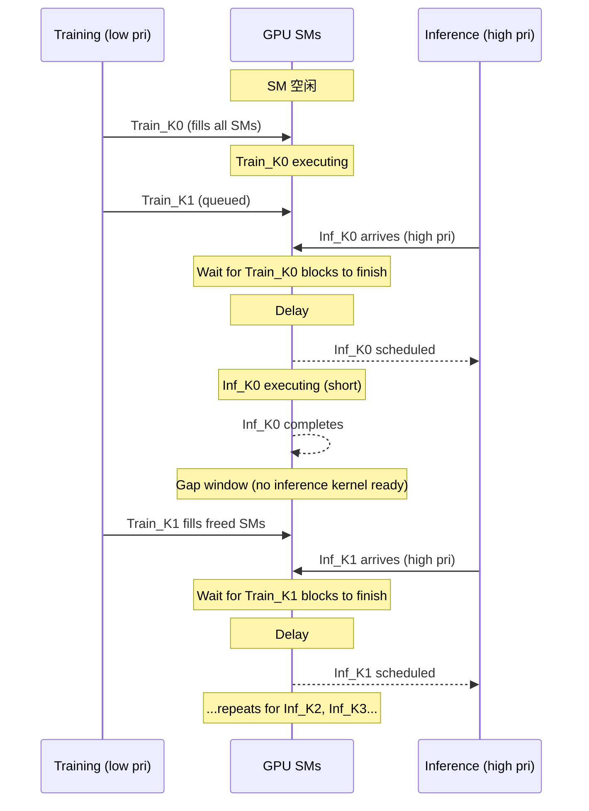

## Fused Critical KV Estimation Kernel (MM + Top-K Fusion)

术语是什么？回答尽量完整，回答逻辑链中每一步都解释出来。通过联网搜索让回答具体和精准。

Fused Critical KV Estimation Kernel是DSV中实现低秩矩阵乘法（Q_lr·K_lr^T）与top-K选择融合的CUDA kernel，避免在GPU内存中物化完整的[S, S]大小的attention score矩阵。问题背景：标准的两步流程——(1) 计算完整attention score矩阵 [H, S, S]（H=16, S=300K时需~288GB@BF16），(2) 对每个query执行top-K选择——是memory-bound且内存不可行的。融合策略：将矩阵乘法的部分积直接流入增量top-K更新，每个query仅保留top-K scores在寄存器中，空间复杂度从O(S²)降至O(SK)。在CUDA cores上（非Tensor cores）执行，因为slim形矩阵乘法（低秩维度d_lr ≪ S）是memory-bound特性，CUDA cores更适合。

从kernel调度角度拆解，kernel的两阶段执行流程：
```
// Fused MM + Top-K Estimation Kernel (DSV)
// 输入: Q_lr [H, S, d_lr], K_lr [H, S, d_lr], K_per_query

// Stage 1: Per-SM computation with online top-K
for each SM assigned rows [r_start, r_end]:
    for query in [r_start, r_end]:     // 每个SM处理多个完整query行
        scores = []                     // 寄存器中保留top-K (score, index) pairs
        for each tile of K_lr rows:
            // CUDA core matmul: q_tile [1, d_lr] @ K_lr_tile^T [tile_size, d_lr]
            partial_scores = dot_product(q_tile, K_lr_tile_rows)
            // Bitonic Select: 在线合并当前top-K与新partial
            scores = BitonicMerge(scores, partial_scores, K_per_query)
        // scores = [(score_1, idx_1), ..., (score_K, idx_K)]

    // Stage 2: Threshold-based index selection
    // 当K_per_query很大时（如20K at 90% sparsity with S=200K），
    // 直接保留K个indices会超出shared memory限制
    // 方案：先确定每个query的top-K阈值，再二次扫描选择indices
    if K_per_query > shared_mem_threshold:
        threshold = scores[K_per_query].score
        // 重新遍历，仅记录score > threshold的indices
```

设计要点：(1) 使用CUDA cores而非Tensor cores——slim矩阵（d_lr=16 vs S=200K）无法有效利用Tensor core的MMA指令；(2) Bitonic Select用于在线top-K合并（避免sorting完整partial results）；(3) 两阶段split应对超大K场景（避免shared memory溢出）；(4) kernel设计为memory-coalesced——相邻query共享K_lr tile，最大化L2 cache hit。

术语一般如何实现？如何使用？通过联网搜索让回答具体和精准。

DSV中使用自定义CUDA kernel实现。输入shape：[H, S, d_lr]，d_lr ≪ d_k（如16 vs 128）。必须在线执行（per-step），因为Q_lr, K_lr随每步输入变化。在Stage 2训练中每个forward pass调用。替代方案：直接用Triton来实现类似的fused kernel（减少开发成本但性能可能略低）。性能数据：forward pass overhead相对可控，backward无额外overhead（索引可在backward中复用）。

涉及论文标题：
- DSV: Exploiting Dynamic Sparsity to Accelerate Large-Scale Video DiT Training

## Query Grouping for Sparse Attention

术语是什么？回答尽量完整，回答逻辑链中每一步都解释出来。通过联网搜索让回答具体和精准。

Query Grouping是DSV中优化sparse attention计算效率的技术，利用相邻tokens的critical KV pairs高度重叠的特性（Observation 5: 2×2×2 3D cube内重叠率>92.4%），将相邻queries按3D voxel分组共享critical KV indices。核心收益：(1) 减少critical KV estimation的开销（无需为每个query单独预测，只需一个proxy query）；(2) 改善memory access coalescing（同组queries访问相同KV set，增加data reuse）；(3) 提升tensor core利用率（gathered KV可以更大batch处理）。自适应grouping机制根据输入video scene动态调整group size，保证overlap ratio >80%。

从kernel调度角度拆解：
```
# Query Grouping for Sparse Attention (DSV)
# 输入: Q [H, S, d_k], K [H, S, d_k], V [H, S, d_k]
#       crit_indices_all [H, S, K_per_query]  # per-query critical KV indices

# Step 1: Determine optimal group size
for each attention head:
    # 从3D latent space构造voxel groups
    group_size = AdaptiveGroupSize(video_latent_shape, overlap_threshold=0.8)
    # group_size options: 1x1x1 (no grouping), 2x2x2, 2x4x4, etc.

# Step 2: Select proxy query per group
for each voxel_group g of size [g_F, g_H, g_W]:
    proxy_query_idx = center_of(g)  # 或随机采样
    proxy_crit_indices = crit_indices_all[head, proxy_query_idx]
    # 同组所有queries共享此critical KV set

# Step 3: Sparse attention with shared KV
for each voxel_group g:
    K_gathered = gather(K, proxy_crit_indices)  # [K_shared, d_k]
    V_gathered = gather(V, proxy_crit_indices)  # [K_shared, d_k]
    Q_group = Q[g.queries]                      # [group_size, d_k]
    O[g] = softmax(Q_group @ K_gathered^T / sqrt(d_k)) @ V_gathered
```

关键设计决策：(1) group内共享同一critical KV set（而非每个query独立gather），显著减少gather操作次数；(2) proxy query选择center token（因其critical KV最representative）；(3) group size自适应——高overlap场景用大group（如2×4×4=32 queries共享），低overlap用小group；(4) grouping仅在sparse training stage（Stage 2）使用。

术语一般如何实现？如何使用？通过联网搜索让回答具体和精准。

DSV中使用Triton kernel实现query-grouped sparse attention。Grouping策略在CPU或lightweight GPU kernel上完成（仅需overlap ratio profiling）。邻接性基于3D latent space（frames × H × W），而非1D token线性顺序。adaptive机制profiling输入video scene的critical KV overlap ratio后选择group size。限制：(1) 仅当overlap ratio >80%时有效，稀疏度极高时grouping收益可能下降；(2) group内的query可能有略微不同的optimal critical KV set，需trade-off accuracy vs efficiency。

涉及论文标题：
- DSV: Exploiting Dynamic Sparsity to Accelerate Large-Scale Video DiT Training

## Bitonic Select (GPU Online Top-K)

术语是什么？回答尽量完整，回答逻辑链中每一步都解释出来。通过联网搜索让回答具体和精准。

Bitonic Select是一种基于bitonic sequence（双调序列）的在线top-K选择算法，DSV在fused critical KV estimation kernel中使用它进行per-query的在线top-K合并。Bitonic sequence是指先单调递增后单调递减（或其循环移位）的序列。Bitonic Sort/Merge利用这一性质，通过比较-交换（compare-and-swap）操作在log²N步内完成排序或合并。DSV使用Bitonic Select（而非完整的Bitonic Sort），因为只需保留K个最大元素，不需要完全排序。在线特性：每处理一个新的partial score tile，将当前top-K与新partial合并为大小为K+tile_size的bitonic sequence，然后通过bitonic merge保留最大K个。

从kernel调度角度拆解，Bitonic Select在GPU上的实现：
```
// Bitonic Select for online top-K merge (DSV kernel)
// 输入: current_topK [(score, idx)], size=K (已排序，descending)
//       new_scores [tile_size] (unsorted partial results)
// 输出: merged_topK [(score, idx)], size=K

// Step 1: 构建bitonic sequence
//   current_topK (descending) + sort(new_scores, descending) = bitonic
sorted_new = BitonicSort(new_scores)        // 局部排序tile_size个元素
bitonic = concat(current_topK, sorted_new)  // [K + tile_size] bitonic

// Step 2: Bitonic merge - 仅保留最大K个
// 使用compare-and-swap网络：
n = K + tile_size
for step in range(log2(n)):
    stride = 2^step
    for i in range(0, n, 2*stride):
        for j in range(stride):
            if stride >= K and j >= K - max(0, i+stride-K):
                continue  // 跳过已知不在top-K中的比较
            if bitonic[i+j] < bitonic[i+j+stride]:
                swap(bitonic[i+j], bitonic[i+j+stride])

merged_topK = bitonic[:K]
```

Bitonic Select的GPU优势：(1) compare-and-swap操作天然适合SIMD/SIMT架构（所有比较可parallel）；(2) 固定比较-交换网络（无分支），GPU warp内无divergence；(3) 可在寄存器中完成（K较小时），避免shared memory往返；(4) 在线特性使kernel可以在矩阵乘法累加过程中逐步合并，无需等待完整partial。

术语一般如何实现？如何使用？通过联网搜索让回答具体和精准。

DSV在CUDA kernel中实现Bitonic Select（CUDA cores上）。Bitonic Sort/Merge是经典并行排序算法（Batcher, 1968），在GPU编程中广泛使用。在DSV中的特殊用法：(1) 用于在线合并（而非完整排序）；(2) 利用已知sorted前缀（current_topK已降序）简化bitonic sequence构建；(3) K较小时（<512）完全在寄存器中完成，K较大时split为两阶段（先阈值后选择）。替代实现：Radix Select（更快但需要integer key）、Quick Select（有分支不适合GPU）、heap-based topK（sequential）。

涉及论文标题：
- DSV: Exploiting Dynamic Sparsity to Accelerate Large-Scale Video DiT Training

## GPU Timeslicing（NVIDIA GPU 硬件时间片轮转调度）

术语是什么？回答尽量完整，回答逻辑链中每一步都解释出来。通过联网搜索让回答具体和精准。

GPU Timeslicing 是 NVIDIA GPU 硬件调度器（Host Interface）在 runlist 级别实现的时间片轮转（round-robin）调度机制。当多个 task（CUDA context/TSG）共享同一个 runlist 并使用同一个 engine 时，GPU HW scheduler 以固定时间片交替激活各个 TSG，使得多个 task 看似"同时"使用 GPU，但实际上在任何给定时刻只有一个 TSG 的 channel 正在被 dispatch。Timeslicing 在以下两种场景下发生：(i) 多 task 共享单 runlist 的同一 engine（R4 实验，Fig.6 compute task 互斥执行，约 2ms 时间片）；(ii) 单 runlist 上不同 engine 类型的 task 之间的干扰（R5 实验，Fig.9 Jetson TX2 上 copy task 被 compute timeslicing 以 1024µs 间隔中断）。

从kernel调度角度拆解术语，比如术语所在kernel调度的伪代码或具体计算过程，给出具体例子。通过联网搜索让回答具体和精准。

基于 Bakita & Anderson 实验测量的 Timeslicing 行为（microseconds 精度）：

```
GPU HW Scheduler Timeslicing (Runlist级别):

参数:
  - compute_timeslice ≈ 2ms (exec_logger实测)
  - copy_timeslice ≈ 1ms (copy_monitor实测)
  - 切换开销: ~145µs (time-slicing context switch, 来自prior work[8])

实际观测流程 (Fig.6, 两个exec_logger任务在GTX 1060 3GB单runlist上):

时间轴 (ms):  |--Logger1--|--Logger2--|--Logger1--|--Logger2--|...
持续时间:      |  ~2ms    |  ~2ms    |  ~2ms    |  ~2ms    |

切换频率: 右侧 ~20 timeslices / 80ms → 每任务约4ms周期内获得一个2ms时间片

单runlist跨引擎干扰 (Fig.9, Jetson TX2, exec_logger + copy_monitor):
  copy engine中断间隔 = 1024µs (compute timeslice, 而非copy timeslice 1049µs)
  → PBDMA在runlist的每个runqueue上独立round-robin
  → compute channel关联copy runqueue即使不执行copy也触发copy engine短暂中断
```

Timeslice 测量方法：
1. exec_logger: 持续执行compute kernel → 通过CUDA event记录每次kernel开始/结束时间戳 → 检测execution gap → gap pattern = timeslice切换
2. copy_monitor: 持续执行copy操作 → 记录每单位数据的copy完成时间 → 绘制progress-over-time曲线 → 拐点 = timeslice切换

术语一般如何实现？如何使用？通过联网搜索让回答具体和精准。

Timeslicing 由 GPU HW scheduler 全自动管理（无需软件干预），基于 TSG 的 scale 和 timeout 参数控制。在 NVIDIA Multi-Process Service (MPS) 启用时 timeslicing 行为不同——自 Volta 架构起，MPS 将各应用作为 subcontext 运行在 MPS-created context 内，Bakita & Anderson 指出其规则在 MPS 下可能仍适用（将所有 MPS-using task 视为一个 task），但未验证。实时系统开发者需注意：timeslicing 的间隔（compute ~2ms, copy ~1ms）决定了 GPU 任务的最大不可抢占执行窗口——这对实时响应时间分析有直接影响。在 Jetson 等单 runlist 平台上，timeslicing 的跨 engine 干扰效应可能严重延迟 copy 操作。

涉及论文标题：
- Demystifying NVIDIA GPU Internals to Enable Reliable GPU Management

## CUDA Stream

术语是什么？回答尽量完整，回答逻辑链中每一步都解释出来。通过联网搜索让回答具体和精准。

CUDA Stream 是 NVIDIA CUDA 编程模型中用于管理 GPU 操作异步执行和排序的软件抽象。一个 stream 内部保证 FIFO 顺序——按发射顺序依次执行 kernel launch 和 memory copy 等操作。不同 stream 之间的操作理论上可以并行执行（取决于硬件资源），但 Bakita & Anderson 的 R2 规则揭示了关键限制：当使用的 stream 数量超过可用 GPU channel 数时，额外 stream 之间产生 false dependency——head-of-stream kernel 需等待其他 stream 的 channel 释放后才能开始 dispatch。

从kernel调度角度拆解术语，比如术语所在kernel调度的伪代码或具体计算过程，给出具体例子。通过联网搜索让回答具体和精准。

CUDA Stream 到 GPU 硬件执行的映射流程：

```
CUDA API 层面:
  stream1: cudaLaunchKernel(k1) → cudaLaunchKernel(k2) → cudaMemcpyAsync(c1)
  stream2: cudaLaunchKernel(k3) → cudaMemcpyAsync(c2)

↓ CUDA Userspace Library (无syscall) ↓

Pushbuffer 层面:
  stream1 → channel1 → pushbuffer1: [k1_cmd][k2_cmd][c1_cmd]
  stream2 → channel2 → pushbuffer2: [k3_cmd][c2_cmd]

↓ GPU HW Scheduler (host interface) ↓

Channel限制问题 (R2, Fig.5):
  当stream数(9) > channel数(8):
    Stream 1-8: channel1-channel8 → 立即被HW scheduler扫描和dispatch
    Stream 9:   无可用channel → head-of-stream kernel依赖false dependency:
                需等待Stream 1-8中某个channel释放
                且释放后非FIFO分配(Corollary 2):
                  Stream 9不一定比Stream 10先获得channel
```

Stream 执行的关键行为规则（Bakita & Anderson 整合prior work和自身发现）：
- **Stream 内 FIFO**：同一 stream 内的操作严格按序执行（CUDA 保证）
- **Stream 间独立性**：仅在使用 ≤ channel 数目的 stream 时保证；超过则产生 false dependency
- **默认 channel 数**：x86_64 上 CUDA 12.2 默认 8 个 compute channel；Jetson 嵌入式仅 2-4 个
- **增加 channel**：通过 CUDA_DEVICE_MAX_CONNECTIONS 环境变量

术语一般如何实现？如何使用？通过联网搜索让回答具体和精准。

Stream 由 CUDA runtime API 管理：cudaStreamCreate() 创建新 stream，kernel launch 通过 <<<grid, block, sharedMem, stream>>> 语法指定目标 stream。Stream 在底层映射到 pushbuffer（位于 user-writable CPU 内存中，命令 enqueue 不需要 syscall），pushbuffer 被 channel 封装后由 GPU HW scheduler 扫描和 dispatch。实时系统开发者使用 stream 时需注意：(i) 避免 stream 数超过 GPU 默认 channel 数；(ii) 不同 stream 的优先级设置（priority stream 机制，将高优先级 stream 的 thread block 优先分配给 SM）；(iii) 默认 stream（stream 0）是隐式同步点——所有显式 stream 的操作都会与默认 stream 同步。

涉及论文标题：
- Demystifying NVIDIA GPU Internals to Enable Reliable GPU Management

## CUDA Context

术语是什么？回答尽量完整，回答逻辑链中每一步都解释出来。通过联网搜索让回答具体和精准。

CUDA Context 是 NVIDIA CUDA 编程模型中每个 GPU-using task 的虚拟地址空间容器，类似于 CPU 进程的地址空间概念。一个 context 封装了该 task 在 GPU 上的所有资源：GPU 内存分配（device memory）、CUDA module（编译后的 GPU 代码）、stream 和 event 等。Context 的创建是开销较大的操作（Bakita & Anderson 实验显示 context 初始化产生约 100ms 的 compute engine 干扰，Fig.6），因此通常每个 task 创建一个 context 并在整个 task 生命周期内复用。Context 在 GPU 硬件调度管线中映射为一个 TSG（Time-Slice Group），TSG 内的所有 channel 共享该 context 的虚拟地址空间。

从kernel调度角度拆解术语，比如术语所在kernel调度的伪代码或具体计算过程，给出具体例子。通过联网搜索让回答具体和精准。

Context 在 GPU 调度中的角色：

```
CPU进程/Task → CUDA Context (per-task, per-GPU) → TSG
  ├── GPU Memory Allocations (cudaMalloc)
  ├── Streams (cudaStreamCreate)
  │   └── Kernel Launches + Memory Copies
  ├── Events (cudaEventCreate)
  └── Modules (loaded GPU code)

GPU HW调度视角:
  Context = TSG on runlist → Round-robin timeslicing between contexts
  Context内的所有streams → 共享TSG的channel pool
  Context初始化 → 产生compute engine干扰(~100ms, Fig.6)
                  → 影响co-running task的实时性
```

关键约束和特性（Bakita & Anderson 发现）：
- **One-to-one task-to-context mapping**：标准使用模式，多 context per task 可能但 discouraged
- **Context 初始化干扰**：创建 CUDA context 会产生约 100ms 的 compute engine 干扰（Fig.6），影响 co-running 实时 task
- **MPS 特例**：NVIDIA Multi-Process Service (MPS) 使多应用共享一个 MPS-created context 作为 subcontext，自 Volta 架构起改变 context 语义

术语一般如何实现？如何使用？通过联网搜索让回答具体和精准。

Context 通过 CUDA runtime API 隐式创建（首次调用任何 CUDA API 时自动创建 primary context）或显式通过 CUDA Driver API 的 cuCtxCreate() 创建。在实时系统中，推荐在 task 初始化阶段创建 context（而非运行时临界路径），以避免 context 初始化对 co-running task 的干扰。MPS 在 GPU serving 场景中广泛使用（多 client 共享 GPU），但其 context/subcontext 架构改变了 Bakita & Anderson 规则的适用方式。

涉及论文标题：
- Demystifying NVIDIA GPU Internals to Enable Reliable GPU Management

## FlashAttention（IO-Aware精确注意力融合Kernel）

术语是什么？回答尽量完整，回答逻辑链中每一步都解释出来。通过联网搜索让回答具体和精准。

FlashAttention 是 Dao et al.（2022, NeurIPS）提出的 IO-aware 精确注意力 CUDA kernel，通过 tiling 和 recomputation 技术避免将完整的 $N \times N$ 注意力中间矩阵（softmax 的输入和输出）写入 GPU HBM，将 HBM 访问量从 $O(N^2)$ 降至 $O(N)$。核心洞察：GPU 的 SRAM 带宽（~20TB/s on A100）远高于 HBM 带宽（~2TB/s），attention 的性能瓶颈在 HBM 访存而非计算——FlashAttention 将 Q/K/V 分块加载到 SRAM 中计算 softmax（online softmax with rescaling），直接输出 O 矩阵，再通过 backward 时 recompute S 和 P（不存储中间值）。结果：2-4× 加速，10-20× 内存节省，且输出与标准 attention 数值等价（非近似）。

从kernel调度角度拆解术语，比如术语所在kernel调度的伪代码或具体计算过程，给出具体例子。通过联网搜索让回答具体和精准。

```
# FlashAttention: IO-Aware Tiled Attention (forward pass)
# Q, K, V: [N, d]; output O: [N, d]
# B_r, B_c: tile sizes for Q/O and K/V blocks

for j in range(0, N, B_c):           # iterate over K, V blocks
    load K_j = K[j:j+B_c] to SRAM    # [B_c, d]
    load V_j = V[j:j+B_c] to SRAM
    
    for i in range(0, N, B_r):       # iterate over Q, O blocks
        load Q_i = Q[i:i+B_r] to SRAM          # [B_r, d]
        load O_i = O[i:i+B_r] from HBM          # [B_r, d]
        load l_i, m_i (previous running stats)
        
        # On-chip computation (in SRAM)
        S_ij = Q_i @ K_j^T           # [B_r, B_c]
        m_ij = rowmax(S_ij)          # local max per row
        P_ij = exp(S_ij - m_ij)      # safe softmax numerator
        l_ij = rowsum(P_ij)          # local denominator
        
        # Online softmax rescaling (Algorithm 1)
        m_new = max(m_i, m_ij)
        l_new = exp(m_i - m_new) * l_i + exp(m_ij - m_new) * l_ij
        # Rescale existing O_i and add new contribution
        O_i = diag(exp(m_i - m_new)) * O_i + exp(m_ij - m_new) * (P_ij @ V_j)
        
        m_i, l_i = m_new, l_new
        store O_i, l_i, m_i to HBM   # write back

# Final: O_i = diag(1/l_i) * O_i (normalize by softmax denominator)
```

关键 IO 分析：标准 attention 每 forward pass 需读写 $O(N^2)$ 字节的 S+P 矩阵；FlashAttention 仅需读写 Q/K/V/O 块 $O(Nd)$ 字节 × 分块数。A100 HBM bandwidth 2TB/s, SRAM bandwidth 19.5TB/s → tiling 将 95% 的访存放至 SRAM。

FlashAttention-2 (2023)：改进 work partitioning（沿 seqlen 维度而非 batch/head 维度并行），减少非 MatMul FLOPs，增加 occupancy（更少的 register 使用），比 v1 再加速 2×。FlashAttention-3 (2024, H100)：利用 Hopper 的 WGMMA 异步指令和 TMA 实现 warp-specialized 双流水线（producer-consumer overlap 数据搬运与计算），H100 上达到 740 TFLOPS（75% 峰值利用率）。

术语一般如何实现？如何使用？通过联网搜索让回答具体和精准。

开源实现：flash-attn 库（https://github.com/Dao-AILab/flash-attention），提供 PyTorch 接口（`flash_attn_func(q, k, v)`）。被 PyTorch 2.0+ 原生集成（`torch.nn.functional.scaled_dot_product_attention` 中自动 dispatch）。vLLM、HuggingFace Transformers、xFormers 等框架广泛使用。Flash-Decoding 针对 decoding phase（小 seqlen 大 batch）在 seqlen 维度额外并行化。FlashDecoding++ 进一步优化 softmax 和 flat GEMM 操作，并提供 AMD GPU 支持。对于长序列 >512，FlashAttention 具有显著的时延和内存优势。

涉及论文标题：
- A Survey of Resource-efficient LLM and Multimodal Foundation Models

## PipeFlash (Fine-grained Pipelined FlashAttention Dataflow)

术语是什么？回答尽量完整，回答逻辑链中每一步都解释出来。通过联网搜索让回答具体和精准。

PipeFlash 是 HLX 论文提出的细粒度流水线 FlashAttention-2 数据流。其核心创新是将 FA-2 的块级同步计算改为**更细粒度的行级流水线执行**——每次处理 Q block 中的两行而非整个 block，使 attention 的四个步骤（$QK^T$、local softmax、PV、update O）以流水线方式并发执行。关键效果：(i) 非 MatMul 操作（softmax, update O）的延迟被 MatMul 操作（$QK^T$, PV）的计算时间完全隐藏；(ii) 中间数据量大幅减少——score 矩阵从 FA-2 的 128KB（全 block 尺寸）降至 1KB（仅 2 行 Q），probability 矩阵同理，总计减少 $4.8\times$。PipeFlash 的 compute utilization 达到 97.5%@128K seqlen，而 FA-2 在 A100 仅约 61%，FA-3 on H100 也仅约 61%。

从kernel调度角度拆解术语，比如术语所在kernel调度的伪代码或具体计算过程，给出具体例子。通过联网搜索让回答具体和精准。

PipeFlash 的数据流伪代码：

```
# PipeFlash: Fine-grained pipelined FA-2
# 每次流水线级处理 2 rows of Q (row granularity)
for K_block in K_V_blocks:          # iterate over KV tiles
    load K_block, V_block into GS
    for Q_block in Q_blocks:
        load Q_block
        # Pipeline: 4 stages running concurrently
        for i in range(0, block_size, 2):  # 2 rows at a time
            STAGE0 (DPE#0): Q[i:i+2] @ K_block^T  → score_2row
            STAGE1 (RVPE):  local_softmax(score_2row_prev)  → prob_2row, rescale
            STAGE2 (DPE#1): prob_2row @ V_block  → PV_2row
            STAGE3 (UpE):   rescale(O_prev) + PV_2row  → O_updated
        # After all rows processed for this Q_block
        final_rescale(O_final) → write to DRAM
```

数据流映射到硬件引擎：DPE#0 执行 $QK^T$ → 结果转发至 RVPE 执行 local softmax → 结果转发至 DPE#1 执行 PV → 结果转发至 UpE 执行 update O。四个引擎形成四级流水线，每个 cycle 同时处理不同行。与 FA-2 的关键区别：FA-2 对整个 Q block 先完成全部 QK^T，再 softmax，再 PV，再 update O——四步骤串行，非 MatMul 延迟无法隐藏。

流水线阶段平衡策略（来自 HLX Fig. 13）：当 $QK^T$ 和 PV 的 FLOPs 相同时，第一阶段（DPE#0，QK^T）和第三阶段（DPE#1，PV）的行数比例由 $\lceil block_{size} / d_{head} \rceil$ 决定。DPU 计算周期公式：$\lceil d_{reduction} / DPU_{size} \rceil \times \lceil (d_{in} \times d_{out}) / DPE_{size} \rceil$。

术语一般如何实现？如何使用？通过联网搜索让回答具体和精准。

PipeFlash 当前仅在 HLX 自研 cycle-level simulator 中实现（论文未开源，2026年5月检索无公开仓库）。其硬件依赖 URSC 的四个引擎间直接数据转发（DPE#0→RVPE→DPE#1→UpE via NoC），无需经过 DRAM 或大容量 SRAM 中转。GPU 上难以实现 PipeFlash 的原因：(i) FA-2 已为 block 级融合，要进一步细粒度流水线需要在不同 warp 间协调异构操作；(ii) GPU 的 SIMT 执行模型假设统一 warp 执行，warp-specialized pipeline 的异构性导致调度开销；(iii) H100 TMA 适合粗粒度 tile 移动，对 PipeFlash 的细粒度 streaming/gather 访问模式支持不足。因此 PipeFlash 天然适合专用硬件加速器实现。

涉及论文标题：
- HLX: A Unified Pipelined Architecture for Optimized Performance of Hybrid Transformer-Mamba Language Models

## PipeSSD (Fused Pipelined SSD Dataflow)

术语是什么？回答尽量完整，回答逻辑链中每一步都解释出来。通过联网搜索让回答具体和精准。

PipeSSD 是 HLX 论文提出的首个融合流水线 SSD（State-Space Duality）数据流。它在两个层面创新：(1) **块级融合（fused SSD）**——将 GPU 上 5 个分离的 SSD kernel（chunk cumsum, chunk state, state passing, BMM chunk, chunk scan）融合为单一 kernel 的 6 个操作组（dA pre-processing、$Y_{Diag}$、$Y_{Off}$、$Y_{Final}$、$states_N$、update states），类似 FA-2 的融合思想，消除中间数据的 DRAM 访存；(2) **三阶段细粒度流水线**——将融合后的操作按依赖关系分为三个阶段流水线执行，并利用 Y_Off 与 states_N 计算间的独立性实现并行。关键效果：DRAM 访问减少 $6.8\times$，中间数据量从 642KB 降至 58.5KB（$11\times$），compute utilization 从 GPU 的 26.9%（A100）/38%（H100）提升至 78.4%。

从kernel调度角度拆解术语，比如术语所在kernel调度的伪代码或具体计算过程，给出具体例子。通过联网搜索让回答具体和精准。

Fused SSD 的 6 个操作（单 block 内 for loop），伪代码：

```
# Fused SSD (before pipelining)
for chunk_i in range(c):  # c chunks, linear complexity O(c)
    # 1. Pre-processing (related to dA)
    sdt = softplus(dt + dt_bias)            # [b,n,cl]
    dA_CS = cumsum(sdt × A)                  # cumulative decay
    
    # 2. Y_Diag computation (diagonal block)
    CB_T = C @ B^T                           # [b, cl, cl]
    CB_TLdt = CB_T × L × dt                 # element-wise
    Y_Diag = CB_TLdt @ x                     # [b, h, cl]
    
    # 3. Y_Off computation (off-diagonal)
    dC_Off = C × exp(dA_CS)                  # decayed C
    Y_Off = dC_Off @ states_int              # [b, h, cl]
    
    # 4. Y_Final combination
    Y_Final = Y_Diag + Y_Off
    
    # 5. states_N (new states for current block)
    dBdt_T = (B × dt)^T     # [b, s, cl]
    states_N = dBdt_T @ x   # [b, s, h]
    
    # 6. Update states (row-wise dependency from previous chunk)
    states_int = exp(dA_CS[-1]) × states_int_prev + states_N
```

PipeSSD 的三阶段流水线映射：

```
Stage 1 (RVPE): dA pre-processing (sdt, dA_CS computation)
    ↓
Stage 2 (DPE#0 → RVPE → DPE#1): CB^T → CB_TLdt → Y_Diag
    ↓ (Y_Diag stored in GS)
Stage 3 (RVPE → DPE#0 ∥ DPE#1 → UpE): 
    RVPE: dC_Off and dBdt^T (via mux/demux direction switch)
    DPE#0: Y_Off = dC_Off @ states_(i-1)
    DPE#1: states_N = dBdt^T @ x           (∥ concurrent)
    UpE: Y_Final = Y_Diag + Y_Off      (∥ concurrent)
         update states = states_(i-1) × exp(dA_CS[-1]) + states_N
```

注意：与 PipeFlash 不同，PipeSSD 的 for loop 为 linear（单方向沿 chunk 维迭代），且存在 column-wise dependency（states 从前一 chunk 传递到后一 chunk）和 row-wise dependency（$Y_{Diag}$ 与 $Y_{Off}$ 需累加，$states_{int}$ 与 $states_N$ 需累加）。

术语一般如何实现？如何使用？通过联网搜索让回答具体和精准。

PipeSSD 仅在 HLX 自研 cycle-level simulator 中实现。Fused SSD 在 GPU 上不可行的原因：即使消除了 DRAM 访问，融合后中间数据 642KB/block 远超 GPU SM 的寄存器+共享内存容量（导致 register spilling），且列向依赖消除了 sequence length 维度的并行性。PipeSSD 的 11× 中间数据压缩（642KB→58.5KB）使之可在专用硬件的片上 SRAM 中完整存放。RVPE 中的 mux/demux 方向切换机制支持 Stage 3 中 dC_Off 和 dBdt^T 的并发计算及数据流向控制。Y_Diag 在 Stage 2 计算后暂存于 GS（Global Scratchpad），Stage 3 中从 GS 读回用于 Y_Final 加和。

涉及论文标题：
- HLX: A Unified Pipelined Architecture for Optimized Performance of Hybrid Transformer-Mamba Language Models

## Fine-grained Pipelined Dataflow

术语是什么？回答尽量完整，回答逻辑链中每一步都解释出来。通过联网搜索让回答具体和精准。

Fine-grained Pipelined Dataflow（细粒度流水线数据流）是 HLX 论文提出的核心设计理念。与传统 GPU 上 block-level 同步计算（如 FA-2 的 block-level fusion 和 FA-3 的 2-stage warp-specialized pipeline）不同，细粒度流水线将计算分解为更小的粒度（如 PipeFlash 的 2 行 Q 而非整个 block），形成多级流水线（4 级 for PipeFlash, 3 级 for PipeSSD），使非 MatMul 操作的计算延迟被 MatMul 操作完全隐藏。同时，小粒度意味着更少的中间数据（PipeFlash 的 score/probability 矩阵从 128KB 降为 1KB），从而有效避免 GPU 上的 register spilling 问题。

从kernel调度角度拆解术语，比如术语所在kernel调度的伪代码或具体计算过程，给出具体例子。通过联网搜索让回答具体和精准。

细粒度流水线的核心机制——流水线阶段平衡（Pipeline Stage Balancing）：

以 PipeFlash 为例，4 级流水线阶段及其资源需求：

| Stage | Engine | Operation | Compute Pattern | Cycles/Row |
|-------|--------|-----------|-----------------|------------|
| 0 | DPE#0 | $QK^T$ | MatMul (compute-bound) | $\lceil d_{head}/DPU_{size}\rceil \times \lceil (d_{head} \times block_{size})/DPE_{size}\rceil$ |
| 1 | RVPE | Local Softmax | Element-wise + exp (light) | O(1) per element |
| 2 | DPE#1 | PV | MatMul (compute-bound) | same as Stage 0 (when $d_{head}=block_{size}$) |
| 3 | UpE | Update O | Element-wise mul+add (light) | O(1) per element |

平衡策略：以 bottleneck（DPE MatMul）为准，通过控制每级处理的行数实现平衡。当 $block_{size}=d_{head}$ 时，Stage 0 和 Stage 2 的计算量相等，每行处理时间相同，pipeline 达近 100% utilization。当 $block_{size} \neq d_{head}$ 时，通过调整每级处理行数比例（如 Stage 0 处理 1 行时 Stage 2 处理 $\lceil block_{size}/d_{head}\rceil$ 行）最小化 inefficiency，utilisation 变化 <2%。

与 GPU warp-specialized pipeline（如 FA-3）的对比：

```
# FA-3: 2-stage pipeline (Hopper warp specialization)
# Stage 0 (producer warps): TMA load Q,K,V tiles
# Stage 1 (consumer warps): MatMul + Softmax
# Issue: register pressure (2x intermediate data), SIMT constraints

# HLX: N-stage fine-grained pipeline
# Stages: DPE#0 → RVPE → DPE#1 → UpE
# Issue: dedicated engines, no register sharing, direct forwarding
```

FA-3 的 2-stage pipeline 因每个阶段需要独立 warp 的完整寄存器（256KB per SM）导致双倍中间数据，恶化 register pressure。HLX 的细粒度流水线使用专用引擎（每个引擎有固定资源），数据通过 NoC 直接转发而非通过寄存器文件中转，消除了这一瓶颈。

术语一般如何实现？如何使用？通过联网搜索让回答具体和精准。

实现细粒度流水线数据流的关键硬件要求：(1) 异构专用引擎（而非统一 SIMT/SIMD 单元），每个引擎针对特定操作优化（MatMul、向量、SFU、更新）；(2) 引擎间直接数据转发路径（NoC 或专用总线），避免经过全局内存中转；(3) 灵活的流水线控制逻辑，支持根据操作维度（$d_{head}$, $block_{size}$, $d_{state}$）动态调整各阶段处理行数。GPU 因 SIMT 执行模型、有限寄存器资源和 TMA 的粗粒度特性，难以高效支持细粒度流水线。HLX 通过 URSC 的 DPE→RVPE→DPE→UpE 四级流水线和 mux/demux 数据路由实现了该数据流。

涉及论文标题：
- HLX: A Unified Pipelined Architecture for Optimized Performance of Hybrid Transformer-Mamba Language Models

## BlockMask（Attention Block-Sparsity 数据结构）

术语是什么？回答尽量完整，回答逻辑链中每一步都解释出来。通过联网搜索让回答具体和精准。
BlockMask 是 FlexAttention 中用于编码 attention score 矩阵 block 级稀疏性的紧凑数据结构。它将 score 矩阵 $S \in \mathbb{R}^{B \times H \times Q\_LEN \times KV\_LEN}$ 按固定 block size（默认 128）划分为 $\lceil Q\_LEN/BS \rceil \times \lceil KV\_LEN/BS \rceil$ 个 block，然后通过两个张量编码哪些 block 包含至少一个未被 mask 的 score 元素：
- `kv_num_blocks [B, H, Num_Row]`：每行的非 oblivious block 数量
- `kv_indices [B, H, Num_Row, Num_Col]`：每行非 oblivious block 的列索引

内存开销为 $O(\lceil Q\_LEN/BS \rceil \times \lceil KV\_LEN/BS \rceil)$，远小于完整 score 矩阵的 $O(Q\_LEN \times KV\_LEN)$ 或 itemized mask 的 $O(N^2)$。BlockMask 在编译时通过 `create_block_mask()` 利用 `torch.vmap` 对用户定义的 mask_mod 进行批量评估生成。

从kernel调度角度拆解术语，比如术语所在kernel调度的伪代码或具体计算过程，给出具体例子。通过联网搜索让回答具体和精准。
BlockMask 在 kernel 调度中作为间接内存访问的索引结构：

```
# BlockMask-guided kernel scheduling (per SM, per Q tile)
num_rows = Q_LEN / Q_BLOCK_SIZE
num_cols = KV_LEN / KV_BLOCK_SIZE

for row in range(num_rows):
    nz_blocks = kv_num_blocks[b, h, row]  # 该行非 oblivious block 数
    for i in range(nz_blocks):
        col = kv_indices[b, h, row, i]     # 下一个 block 的列索引
        
        # 预取下一个 KV tile（HBM -> SRAM）
        if i + 1 < nz_blocks:
            next_col = kv_indices[b, h, row, i + 1]
            prefetch(K_tile[next_col], V_tile[next_col])
        
        # 加载当前 KV tile
        K_tile = load_K(col * KV_BLOCK_SIZE)
        V_tile = load_V(col * KV_BLOCK_SIZE)
        
        # 计算 score tile
        S_tile = Q_tile @ K_tile^T
        
        # 根据 block 类型选择性应用 mask_mod
        if is_partial_block(row, col):
            S_tile = apply_mask_mod(S_tile, row, col)
        
        # 所有 block 应用 score_mod
        S_tile = apply_score_mod(S_tile, row, col)
        
        # 在线 softmax + PV GEMM
        update_online_softmax(O, l, m, S_tile, V_tile)
```

BlockMask 将 attention 变体的稀疏模式与 kernel 调度解耦——同一 kernel 代码可通过不同的 BlockMask 支持 causal、sliding window、document mask 等多种稀疏模式，无需修改 kernel。

术语一般如何实现？如何使用？通过联网搜索让回答具体和精准。
BlockMask 通过 `create_block_mask()` 生成：
```python
from torch.nn.attention.flex_attention import create_block_mask

def causal_mask(b, h, q_idx, kv_idx):
    return q_idx >= kv_idx

block_mask = create_block_mask(causal_mask, B=1, H=1, Q_LEN=8192, KV_LEN=8192)
# block_mask.kv_num_blocks: [1, 1, 64]  (8192/128 = 64 rows)
# block_mask.kv_indices: [1, 1, 64, 64]
```

BlockMask 的内部实现使用 `torch.vmap` 向量化评估 mask_mod 对所有 (q_block, kv_block) 组合的结果，将 block size 内所有元素的 mask_mod 结果聚合（AND reduction）判断 block 是否为 oblivious（全部 False）。

涉及论文标题：
- Flex Attention: A Programming Model for Generating Optimized Attention Kernels

## Full/Partial Block Optimization（Attention Block 分类优化）

术语是什么？回答尽量完整，回答逻辑链中每一步都解释出来。通过联网搜索让回答具体和精准。
Full/Partial Block Optimization 是 FlexAttention 的 BlockMask 中的一种性能优化策略，将 score 矩阵的 block 分为三类以最小化运行时的 mask_mod 开销：
1. **Full Blocks**：block 内所有 score 均未被 mask（全部可见），运行时**跳过 mask_mod**，仅执行 score_mod。这是最常见的类型（如 causal mask 中严格上三角的 block）。
2. **Partial Blocks**：block 内部分 score 被 mask（部分设为 -inf），需运行时逐元素执行 mask_mod。这是对角线上的 block（如 causal mask 中同时包含可见和不可见 score 的对角 block）。
3. **Oblivious Blocks**：block 内所有 score 被 mask（全部 -inf），**完全跳过计算**。通过 kv_indices 自动排除。

从kernel调度角度拆解术语，比如术语所在kernel调度的伪代码或具体计算过程，给出具体例子。通过联网搜索让回答具体和精准。
因果 mask（50% sparsity）的具体例子：
- Q_LEN=KV_LEN=16384, BS=128, 128×128 blocks
- Full blocks: 对角线上方约 50%（8128 个），跳过 mask_mod，仅执行 score_mod + softmax + PV GEMM
- Partial blocks: 对角线约 0.8%（128 个），需逐元素执行 mask_mod（对 q_idx < kv_idx 的位置设为 -inf）
- Oblivious blocks: 对角线下方约 50%，完全跳过计算

性能收益：对 causal mask 等常见模式，Full Block Optimization 带来约 15% 的额外性能提升。原因是 mask_mod 虽然是 element-wise 操作，但在每个 block 的 inner loop 中对所有 (q, kv) pair 逐元素执行仍带来可观的开销，而对角线上方的大多数 block 根本不需要任何 masking。

术语一般如何实现？如何使用？通过联网搜索让回答具体和精准。
分类在 `create_block_mask` 编译时完成：对每个 block，用 mask_mod 检查 block 的四个角是否全部 True（full）或全部 False（oblivious）或混合（partial）。结果编码在 BlockMask 中，运行时 GPU kernel 根据 block 类型自动选择执行路径。用户无需手动区分 block 类型。

涉及论文标题：
- Flex Attention: A Programming Model for Generating Optimized Attention Kernels

## Fused Indirect Memory Access（融合间接内存访问）

术语是什么？回答尽量完整，回答逻辑链中每一步都解释出来。通过联网搜索让回答具体和精准。
Fused Indirect Memory Access 是 FlexAttention 中将 BlockMask 的稀疏跳过（sparsity skip）与 PagedAttention 的 page table 映射合并为一次间接内存访问的技术。核心思路是：BlockMask 已经通过 kv_indices 实现了一层间接内存访问（跳过 oblivious block），而 PagedAttention 的 page table 也引入了一层间接访问（逻辑 KV index → 物理 KV index）。FlexAttention 将两层间接访问融合——在编译时将 page table 的逻辑-物理映射应用到 kv_indices 上，使 kv_indices 直接指向物理 KV cache 中的 block 位置，从而实现单层间接访问，无需修改 attention kernel。

从kernel调度角度拆解术语，比如术语所在kernel调度的伪代码或具体计算过程，给出具体例子。通过联网搜索让回答具体和精准。
传统方法（vLLM）：手写 CUDA kernel，在 attention kernel 内部先查 page table 获取物理地址，再执行注意力计算。这增加了 20-26% kernel overhead，且每种 attention 变体需要独立的手写支持。

FlexAttention 方法：
```
# 编译时：将 page table 映射融入 kv_indices
for row in range(num_rows):
    for i in range(kv_num_blocks[row]):
        logical_block = kv_indices_original[row, i]
        physical_block = page_table[batch, logical_block]
        kv_indices_fused[row, i] = physical_block

# 运行时：单层间接访问
for i in range(kv_num_blocks[row]):
    phys_col = kv_indices_fused[row, i]
    K_tile = load_K_physical(phys_col * BS)  # 直接从物理 KV cache 加载
    V_tile = load_V_physical(phys_col * BS)
    # ... 标准 attention 计算 ...
```

同时，mask_mod 和 score_mod 也通过 `converted_mask_mod` 和 `converted_score_mod` 自动适应：维护一个物理 block → 逻辑 block 的映射向量（O(1) overhead），在调用用户定义的 mask_mod/score_mod 前将物理 KV index 转换回逻辑 KV index。

术语一般如何实现？如何使用？通过联网搜索让回答具体和精准。
FlexAttention 的 paged attention 支持无需用户修改 mask_mod/score_mod 定义，仅需在调用 `flex_attention` 时传入 page table 信息。系统自动完成 BlockMask 的物理-逻辑转换。实测开销 <1%（远低于 vLLM 的 20-26% overhead），原因是不引入任何 kernel 代码修改，仅依赖 fused indirect memory access。

涉及论文标题：
- Flex Attention: A Programming Model for Generating Optimized Attention Kernels

## Block-Sparse Row (BSR) Attention Kernel

术语是什么？回答尽量完整，回答逻辑链中每一步都解释出来。通过联网搜索让回答具体和精准。

Block-Sparse Row (BSR) Attention Kernel 是 FlashInfer 提出的基于 BSR 稀疏矩阵格式的 attention CUDA kernel。BSR (Block Compressed Sparse Row) 是一种硬件友好的稀疏矩阵存储格式，将非零元素组织为大小为 $(B_r, B_c)$ 的连续 dense block，而非 CSR (Compressed Sparse Row) 格式中的单个元素散布。在 FlashInfer 中，BSR 用作 KV-cache 的统一存储抽象：KV-cache pages (如 vLLM PagedAttention 或 SGLang RadixAttention) 被映射为 BSR 矩阵的 non-zero blocks，page table / radix tree 结构被映射为 BSR 的 indices arrays (`kv_indptr` 行指针 + `kv_indices` 列索引)。FlashInfer BSR attention kernel 支持任意 block sizes $(B_r, B_c)$，其中 $B_r$ 与 query tile size $T_q$ 对齐（控制 SMEM 中 KV tile 的复用粒度），$B_c$ 由 KV-cache 管理算法指定（如 page size = 1 for token-level management）。

BSR 相比 CSR 的优势：(1) 在 GPU 上 BSR 提升 register reuse efficiency——block 内元素在 shared memory 中 contiguous 排列，适合 tensor core MMA 指令的 dense 操作；(2) 可跳过整个零 block 减少计算；(3) 当 block size 对齐硬件 MMA 指令维度（如 NVIDIA mma 最小 16×16）时，可直接利用 dense tensor core 路径。FlashInfer 的 BSR attention 支持更小的 block size（如 (1,1) vector sparsity），通过先将分散的 global memory tiles gather 到 contiguous shared memory 再用 dense tensor core 处理——这基于 Chen et al. (2021) 和 Li et al. (2022) 的 vector-sparse 技术。

从kernel调度角度拆解术语，比如术语所在kernel调度的伪代码或具体计算过程，给出具体例子。通过联网搜索让回答具体和精准。

BSR Attention Kernel 的 GPU 执行伪代码（以 FlashInfer decode kernel, H100, B_r=T_q=1, B_c=1 per-page sparsity 为例）：

```
// ===== 输入 =====
// Q: ragged tensor, shape [total_tokens, nheads, head_dim]
// KV_cache: BSR matrix, shape [num_blocks, B_r, nheads_kv, head_dim]
// kv_indptr: [num_rows + 1], row pointers for BSR
// kv_indices: [nnz], column indices of non-zero blocks

// ===== Kernel Launch =====
// Grid: num_CTAs (persistent, fixed for CUDAGraph)
// Each CTA: processes assigned work chunks from scheduler plan

// ===== Per-CTA Persistent Loop =====
for each (query_row, kv_chunk_start, kv_chunk_len) in CTA_work_queue:
    // Step 1: Load Q tile from ragged tensor
    q_tile = ldgsts_128B(Q[query_row : query_row + T_q])  // → SMEM
    __syncthreads()
    
    // Step 2: Initialize online softmax state
    O_acc = zeros(T_q, head_dim)
    l_acc = zeros(T_q, 1)
    m_acc = -inf * ones(T_q, 1)
    
    // Step 3: Iterate over KV chunks
    for kv_offset in range(kv_chunk_start, kv_chunk_start + kv_chunk_len, T_kv):
        // Step 3a: Load sparse KV tile from BSR
        // Compute global memory addresses from BSR metadata
        block_row = query_row / B_r
        nnz_start = kv_indptr[block_row]
        nnz_end = kv_indptr[block_row + 1]
        for j in range(nnz_start, nnz_end, num_blocks_per_tile):
            block_col = kv_indices[j]
            // cp.async gather: scattered GMEM → contiguous SMEM
            k_tile_smem = cp_async_ldgsts_128B(
                KV_cache[block_col : block_col + T_kv/pages_per_block])
            v_tile_smem = cp_async_ldgsts_128B(
                V_cache[block_col : block_col + T_kv/pages_per_block])
        cp_async_commit()
        cp_async_wait()
        __syncthreads()
        
        // Step 3b: S = Q × K^T (Tensor Core WGMMA)
        S = WGMMA(q_tile_smem, k_tile_smem)  // [T_q, T_kv]
        
        // Step 3c: Online softmax update
        m_new = rowmax(S, dim=1)  // CUDA core REDUX
        m_new = max(m_acc, m_new)
        P = exp(S - m_new)  // MUFU.EX2
        l_new = rowsum(P, dim=1)  // CUDA core REDUX
        // Rescale previous accumulator
        O_acc = O_acc * exp(m_acc - m_new)
        l_acc = l_acc * exp(m_acc - m_new) + l_new
        m_acc = m_new
        
        // Step 3d: O += P × V (Tensor Core WGMMA)
        O_acc += WGMMA(P, v_tile_smem)  // [T_q, head_dim]
    
    // Step 4: Write partial attention state
    // AttentionState = (O_acc / l_acc, log(l_acc) + m_acc)
    partial_O[chunk_idx] = O_acc / l_acc
    partial_LSE[chunk_idx] = log(l_acc) + m_acc

// ===== Contraction Kernel =====
// Merge all partial attention states using ⊕ operator
O_final = zeros(...)
LSE_final = -inf
for each (O_partial, LSE_partial) assigned to this CTA:
    O_final = (exp(LSE_final) * O_final + exp(LSE_partial) * O_partial) 
            / (exp(LSE_final) + exp(LSE_partial))
    LSE_final = log(exp(LSE_final) + exp(LSE_partial))
```

关键 BSR 特有步骤：
- **Global→Shared Memory Data Movement**：BSR indices arrays (`kv_indptr`, `kv_indices`) 计算 non-contiguous KV-cache 地址 → `cp.async` (LDGSTS, 128B width) 从分散的 HBM 地址 gather 到 contiguous SMEM → SMEM 中数据变为 dense tile → Tensor Core WGMMA/HMMA 处理。这与普通 dense attention 的 affine address transform 不同——BSR 的地址计算需要读取 sparse indices 间接寻址。Head dimension 保持 contiguous（size = d, 常见 128 或 256），维持 coalesced memory access。
- **TMA 使用限制**：H100 TMA (Tensor Memory Accelerator) 不支持 non-affine memory access patterns（即 BSR 的间接寻址），因此 FlashInfer 仅在 dense contiguous KV-cache 上使用 TMA，sparse BSR 路径回退为 Ampere-style `cp.async` LDGSTS。两种加载路径在 shared memory 之后汇合，后续 dense MMA 路径完全相同。

术语一般如何实现？如何使用？通过联网搜索让回答具体和精准。

FlashInfer 的 BSR attention kernel 实现：
- 基于 CUDA/CUTLASS 模板，实现 FA2 算法（Turing/Ampere/Ada, sm75-sm89）和 FA3 算法（Hopper, sm90a）
- JIT 编译生成：attention variant specification (CUDA functors) + task info (BSR block sizes, tile sizes) → template population → PyTorch JIT compiler → 编译为 custom operator
- 集成入 vLLM、SGLang、MLC-Engine：上层框架的 page table / radix tree → 直接映射为 BSR `kv_indptr`/`kv_indices` → 传入 FlashInfer kernel，无需中间展平转换
- 支持任意 $(B_r, B_c)$：$B_r=1$ 对应 per-token page size（vector sparsity），大 $B_r$ 对应 batch-level grouping（配合 composable formats）
- GitHub: https://github.com/flashinfer-ai/flashinfer (Apache-2.0)

涉及论文标题：
- FlashInfer Efficient and Customizable Attention Engine for LLM Inference Serving

## Composable Formats for KV-Cache

术语是什么？回答尽量完整，回答逻辑链中每一步都解释出来。通过联网搜索让回答具体和精准。

Composable Formats 是 FlashInfer 提出的多 BSR 矩阵分解 KV-cache 优化策略，受 SparseTIR (Ye et al., 2023) 启发。核心思想：不再用单一 BSR 矩阵（统一 block size）存储整个 KV-cache，而是利用 prior knowledge（如哪些 requests 共享 prefix）将 KV-cache 稀疏矩阵分解为多个不同 $(B_r, B_c)$ 的 BSR sub-matrices。各 sub-matrix 用不同的 AttentionWrapper（不同 tile sizes + block sizes → 编译为不同 CUDAGraphs），runtime 根据 KV-cache 配置选择最优组合。

动机：单一 block size 的 BSR 有内在 trade-off——大 $B_r$ 允许同 block 内 queries 共享 SMEM 中的 KV tile（high-bandwidth reuse），但增加 fragmentation（不在同一 block 的 requests 无法彼此访问 SMEM）；小 $B_r$ 减少 fragmentation 但失去 SMEM 复用。Composable formats 打破这一 trade-off：shared prefix 密集子矩阵用大 $B_r$ 存储和计算（高 SMEM 复用），unique suffix 稀疏子矩阵用小 $B_r$（per-query 独立访问，tolerate L2/global latency）。

从kernel调度角度拆解术语，比如术语所在kernel调度的伪代码或具体计算过程，给出具体例子。通过联网搜索让回答具体和精准。

以 parallel generation (n=4, Llama 3.1 8B) 为例：4 条 parallel generation 回复共享输入 prompt prefix 的 KV-cache，后续 suffix 各自不同。

```
// ===== Composable Format Decomposition =====
// Full KV-cache sparse matrix:
//   rows 0-3:  shared prefix (4 queries share same KV)
//   rows 4-7:  unique suffix query 0
//   rows 8-11: unique suffix query 1  ...

// Sub-matrix 1: Shared Prefix
//   B_r=3, B_c=1 (3 queries share KV page in SMEM)
//   对应 shared prefix 的 KV-cache pages
//   kv_indptr_1 = [0, num_prefix_pages, num_prefix_pages, ...]
//   kv_indices_1 = [page_0, page_1, ..., page_prefix-1] (重复)

// Sub-matrix 2: Unique Suffixes
//   B_r=1, B_c=1 (per-query processing)
//   对应各 unique suffix 的 KV-cache pages
//   kv_indptr_2 = [0, num_suffix_pages, 2*num_suffix_pages, ...]
//   kv_indices_2 = [per-query unique pages]

// ===== Compile-time =====
// 创建两个 AttentionWrapper（不同 CUDAGraph）
wrapper_prefix = AttentionWrapper(
    attn_spec, 
    task_info(B_r=3, T_q=3, ...),  // 大 block → SMEM 复用
    workspace
)
wrapper_suffix = AttentionWrapper(
    attn_spec, 
    task_info(B_r=1, T_q=1, ...),  // 小 block → per-query
    workspace
)

// ===== Runtime =====
// Shared prefix attention: 3 queries × same K/V tile in SMEM
//   → tensor core GEMM: Q(3, d) × K(l_prefix, d)^T
//   → 3× fewer global memory loads vs per-query processing
O_prefix, LSE_prefix = wrapper_prefix.run(Q_shared, KV_prefix)

// Unique suffix attention: per-query, via L2/global memory
for i in range(4):
    O_suffix[i], LSE_suffix[i] = wrapper_suffix.run(
        Q_suffix[i], KV_suffix[i])

// Merge: O_final = (O_prefix, LSE_prefix) ⊕ (O_suffix, LSE_suffix)
```

关键实现要点：
- **无数据移动**：KV-cache 数据不移动，仅需计算不同 sub-matrix 的 `kv_indptr` / `kv_indices` arrays（metadata-level 操作）。
- **多 CUDAGraph**：每种 composable format 配置编译为独立 CUDAGraph，runtime 根据 KV-cache 结构 select best graph。
- **性能提升来源**：shared prefix 部分 O(queries×prefix_len×d) 的 attention 计算从 per-query GEMV (CUDA core, low compute intensity) 升级为 batched GEMM (Tensor Core, high compute intensity)，同时减少 global memory traffic（3 queries 共享 1 份 KV load）。

术语一般如何实现？如何使用？通过联网搜索让回答具体和精准。

FlashInfer composable formats 的实现：
- 在 FlashInfer Python API 层面，用户创建多个 `AttentionWrapper` 实例，分别指定不同 `task_info`（含 B_r 配置）
- 每个 wrapper 编译为独立 CUDAGraph（含对应的 JIT-compiled kernel + plan info）
- 集成入 MLC-Engine prefix-caching：framework 识别 shared prefix → 创建 composable format wrappers → 选择最优 CUDAGraph
- 论文实验显示：parallel generation (n=4-32) 下 ITL 降低 13-17%，TTFT 降低 16-23%（peak at n=4）

与相关工作的区别：RelayAttention、Hydragen、ChunkAttention 等也探索 shared prefix decoding，但需要分离的 KV-cache management for prefixes and suffixes。FlashInfer composable formats 支持 unified page table 管理下的 multi-level、multiple-prefix decoding，无需修改 serving framework 的 memory management 模块。

涉及论文标题：
- FlashInfer Efficient and Customizable Attention Engine for LLM Inference Serving

## Load-Balanced Attention Scheduling (Algorithm 1)

术语是什么？回答尽量完整，回答逻辑链中每一步都解释出来。通过联网搜索让回答具体和精准。

Load-Balanced Attention Scheduling 是 FlashInfer 提出的动态调度框架，用于解决 LLM serving 中 variable-length 序列 batch 的 attention 计算负载不均问题（wave quantization：处理短 KV 的 CTA 完成后 idle，等待处理长 KV 的 CTA）。调度器受 Stream-K (Osama et al., 2023) 启发，但设计为 deterministic（避免 atomic aggregation 引入非确定性输出，以满足 LLM serving 的 reproducibility 要求）。

核心思想：将 attention 计算的调度从 kernel 内部解耦到 runtime——compile-time 选择 tile sizes，runtime 根据实际 sequence length 信息动态分配 CTA workload。采用 persistent kernel 设计：kernel 以固定 grid size 启动（兼容 CUDAGraph），各 CTA 从 CPU 生成的 work queue 中消费 KV chunks。长 KV sequences 被 split 为多个 chunks，短 KV sequences 的 chunks 填充调度空隙，实现 SM 间负载均衡。

从kernel调度角度拆解术语，比如术语所在kernel调度的伪代码或具体计算过程，给出具体例子。通过联网搜索让回答具体和精准。

Algorithm 1: FlashInfer's Balanced Scheduling

```
// ===== Input =====
// {l_qo(i), l_kv(i)} for i = 1..batch_size  // query/KV lengths
// T_q: query tile size (compile-time selected)

// ===== Cost Function =====
// cost(l_q, l_kv) = α·l_q + β·l_kv  // α, β hyperparameters (default=1)

// Step 1: Compute max KV chunk size L_kv
// total_work = Σ_i ⌈l_qo(i)/T_q⌉ · l_kv(i)
// L_kv = total_work / #CTA  // target workload per CTA

// Step 2: Split query tiles into KV chunks
W = []  // work queue: list of (chunk_id, kv_length)
for i in range(batch_size):
    num_q_tiles = ceil(l_qo(i) / T_q)
    for each q_tile in range(num_q_tiles):
        // Split this query tile's KV into chunks ≤ L_kv
        remaining = l_kv(i)
        kv_start = 0
        while remaining > 0:
            chunk_len = min(L_kv, remaining)
            W.append((chunk_id, chunk_len))
            remaining -= chunk_len
            kv_start += chunk_len

// Step 3: Sort work chunks descending by length
W.sort(key=lambda x: x[1], reverse=True)

// Step 4: Greedy min-cost assignment
Q = MinPriorityQueue()  // (cta_id, current_cost)
for cta_id in range(num_CTA):
    Q.push((cta_id, 0))

for (chunk_id, kv_len) in W:
    cta_id, current_cost = Q.pop_min()
    new_cost = current_cost + cost(T_q, kv_len)
    assign chunk_id to CTA cta_id
    Q.push((cta_id, new_cost))

// ===== Output =====
// Plan info:
//   - CTA work queues: [(chunk_id, query_range, kv_range), ...] per CTA
//   - Partial→Final mapping: which partial outputs merge to which final positions
```

Plan info 的 life cycle：
1. **CPU planning**（`attn.plan(seqlen_info)`）：每 generation step 在 CPU 上运行 Algorithm 1，生成 plan info（CTA work queues + index mapping）
2. **Async copy to GPU**：plan info 通过 `cudaMemcpyAsync` 拷贝到 GPU workspace buffer 的固定 offset 区域
3. **GPU persistent kernel**（`g.replay()` via CUDAGraph）：各 CTA 读取自己的 work queue section → 处理分配的 KV chunks → 输出 partial attention states → contraction kernel 合并 partial states
4. **Reuse across layers**：同一 generation step 内所有 decode attention layers 可复用相同 plan info（sequence lengths 相同）

CUDAGraph 兼容性保证：
- Persistent kernel grid size 编译时固定（不变）✓
- Workspace buffer 各 section (partial O, plan info) 分配在固定 offset，指针不变 ✓
- Plan info **内容**（chunk assignments）每 step 变化，但指针不变 —— CUDAGraph 仅 capture kernel launch parameters，不 capture data ✓
- Plan function 在 CPU 上执行，不在 CUDAGraph 内 ✓

术语一般如何实现？如何使用？通过联网搜索让回答具体和精准。

FlashInfer 的 load-balanced scheduler 实现：
- CPU 端用 C++ 实现 Algorithm 1（轻量级，overhead < 1ms per step，被 decoding loop 摊销）
- GPU 端 CUDA persistent kernel 从 workspace buffer 读取 plan info → 根据分配处理 KV chunks → 输出 partial AttentionState (O_partial, LSE_partial)
- Contraction kernel（可合并入同一 persistent kernel）执行 ⊕ composition 合并 partial states
- 与 Stream-K 的区别：FlashInfer 用 deterministic greedy assignment（保证 reproducibility），而非 atomic aggregation（Stream-K 的非确定性行为不适合 LLM serving 的确定性输出要求）
- 效果：uniform 和 skewed (Zipf) sequence length 分布下，FlashInfer decode/prefill kernel 的 bandwidth/FLOPs utilization 显著高于 FlashAttention（使用 static tile allocation）——Figure 8

涉及论文标题：
- FlashInfer Efficient and Customizable Attention Engine for LLM Inference Serving

## Persistent Kernel with CUDAGraph Compatibility

术语是什么？回答尽量完整，回答逻辑链中每一步都解释出来。通过联网搜索让回答具体和精准。

Persistent Kernel 是一种 GPU kernel 设计模式：kernel 以固定 grid size 启动后持续运行（而非 one-shot launch-complete），各 CTA 通过循环从 work queue 中消费 task items 直到所有 work 完成。在 FlashInfer 中，persistent kernel 用于解决 CUDAGraph 兼容性问题——CUDAGraph 要求所有 kernel launch parameters（grid size、pointers）在 capture 时确定且不变。标准的 dynamic grid size kernel（如根据不同 batch size 调整 grid）无法被 CUDAGraph capture。

FlashInfer persistent kernel 包含两个 merged stages：(1) attention stage——各 CTA 根据 plan info 处理分配的 KV chunks，输出 partial attention states (O_partial, LSE_partial)；(2) contraction stage——各 CTA 用 ⊕ operator compose 多个 partial states 为 final output。两阶段合并入单一 persistent kernel 消除 inter-kernel overhead。

从kernel调度角度拆解术语，比如术语所在kernel调度的伪代码或具体计算过程，给出具体例子。通过联网搜索让回答具体和精准。

CUDAGraph-compatible persistent kernel 执行流程：

```
// ===== CUDAGraph Capture Phase =====
// (done once at init time)

// Step 1: 编译 kernel with fixed grid size
grid_size = compute_max_grid_size(device_SM_count, occupancy)
// grid_size 编译后固定，所有后续 generation steps 使用相同值

// Step 2: Allocate workspace buffer with fixed offsets
workspace = torch.empty(total_workspace_size, device='cuda')
partial_O_offset = 0
partial_LSE_offset = partial_O_size
plan_info_offset = partial_LSE_offset + partial_LSE_size
// offsets 固定，所有 generation steps 使用相同 offsets

// Step 3: Dummy plan (生成 sample plan info, 填充 workspace)
attn.plan(dummy_seqlen_info)
// → plan info written to workspace[plan_info_offset:]

// Step 4: Capture CUDAGraph
g = torch.cuda.CUDAGraph()
with torch.cuda.graph(g):
    for layer in layers:
        attn.run(Q[layer], KV_cache[layer], ...)
        // run() 内部: persistent kernel launch
        // grid_size, workspace pointer → both constant → CUDAGraph OK

// ===== Runtime Generation Loop =====
while not finished:
    seqlen_info.update()             // 读取当前 batch sequence lengths
    attn.plan(seqlen_info)           // CPU: 重新计算 plan info → 写入 workspace
    g.replay()                       // GPU: 重放 CUDAGraph (persistent kernel 执行)

// ===== Persistent Kernel 内部 =====
__global__ void persistent_attention_kernel(
    Q, KV_cache, workspace,  // pointers to fixed offsets
    ...
) {
    // CTA 从 workspace 中读取自己的 work queue
    cta_id = blockIdx.x;
    num_chunks = workspace.plan_info[cta_id].num_chunks;
    
    // Persistent loop: 处理所有分配的 chunks
    for (chunk_idx = 0; chunk_idx < num_chunks; chunk_idx++) {
        chunk = workspace.plan_info[cta_id].chunks[chunk_idx];
        
        // Attention computation for this chunk
        O_partial, LSE_partial = compute_attention_chunk(
            Q, KV_cache, chunk.query_range, chunk.kv_range);
        
        // Write partial output to fixed-offset workspace region
        workspace.partial_O[cta_id][chunk_idx] = O_partial;
        workspace.partial_LSE[cta_id][chunk_idx] = LSE_partial;
    }
    
    // Contraction: merge partial states via ⊕ operator
    O_final = 0; LSE_final = -inf;
    for (chunk_idx = 0; chunk_idx < num_chunks; chunk_idx++) {
        (O_final, LSE_final) = (O_final, LSE_final) ⊕ 
            (workspace.partial_O[cta_id][chunk_idx],
             workspace.partial_LSE[cta_id][chunk_idx]);
    }
    
    // Write final output (CUDAGraph captures this pointer)
    output[cta_output_range] = O_final;
}
```

CUDAGraph 兼容性的关键约束与 FlashInfer 的解决方案：
| CUDAGraph 约束 | FlashInfer 方案 |
|---|---|
| Grid size 必须固定 | Persistent kernel: 固定 grid size = max occupancy, 循环消费 work queue |
| Kernel arguments (pointers) 必须固定 | Workspace buffer 分配 fixed offsets; partial O, plan info 区域用 absolute offsets |
| 不能有 dynamic memory allocation | 所有内存预分配在 workspace buffer 中 |
| 不能有 CPU-GPU sync | Plan function 在 CUDAGraph capture 外执行; kernel 内仅 device-side 操作 |

术语一般如何实现？如何使用？通过联网搜索让回答具体和精准。

FlashInfer persistent kernel 实现：
- Inspector-Executor (IE) model：plan phase (CPU inspector) 分析 workload → execute phase (GPU executor) persistent kernel 按 plan 执行。这是并行计算中处理 irregular workload 的经典模式 (Mirchandaney et al., 1988)。
- CUTLASS persistent kernel 参考实现：CUTLASS 3.x 使用 `cutlass::PersistentKernel` 包装，FlashInfer 类似设计但加入了 attention-specific plan info passing。
- 合并 attention + contraction 为单一 persistent kernel 消除 kernel launch overhead between stages（H100 上每个 kernel launch ~5-10 μs，合并后节省此开销 per layer per step）。
- Plan info 可跨层复用：同一 generation step 内所有 decode attention layers 的 sequence lengths 相同 → 同一 plan info 可复用 → plan overhead 被所有 layers 摊销（all layers × multi-step decoding）。

涉及论文标题：
- FlashInfer Efficient and Customizable Attention Engine for LLM Inference Serving

## Ragged Tensor (Jagged Array)

术语是什么？回答尽量完整，回答逻辑链中每一步都解释出来。通过联网搜索让回答具体和精准。

Ragged Tensor（也称 Jagged Array 或 Variable-Length Tensor）是一种存储变长序列的紧凑数据结构。与 padded tensor（将所有序列 pad 到 max length，浪费存储和计算）不同，ragged tensor 将所有序列的 elements concatenate 为一个 flat 1D tensor（`values`），用额外的 `offsets`（或 `indptr`）数组记录每个序列的起始位置。在 FlashInfer 中，query 和 output 矩阵使用 ragged tensor 存储：不同请求的 tokens 数不同（prefill 阶段 prompt length 可变，decode 阶段各请求开始/结束时间不同），将这些变长 tokens 打包为单个 tensor 消除 padding，提升 memory 和 compute efficiency。

典型 ragged tensor 表示：`values = [token_0_req0, token_1_req0, token_0_req1, token_1_req1, token_2_req1, ...]`，`indptr = [0, 2, 5, ...]`（cumulative lengths）。FlashInfer kernel 通过 `indptr` 定位各请求 boundaries。

从kernel调度角度拆解术语，比如术语所在kernel调度的伪代码或具体计算过程，给出具体例子。通过联网搜索让回答具体和精准。

FlashInfer 中 ragged tensor 用于表示可变长度 batch 的 Q / O：

```
// ===== Ragged Tensor 表示 =====
// 3 requests: req_0 (2 tokens), req_1 (3 tokens), req_2 (1 token)
// Padded representation (wasteful):
//   Q_padded = [[q0_0, q0_1, PAD, PAD],     // shape [3, 3, d]
//               [q1_0, q1_1, q1_2, PAD],
//               [q2_0, PAD,  PAD,  PAD]]
// Ragged representation (compact):
//   Q_values = [q0_0, q0_1, q1_0, q1_1, q1_2, q2_0]  // flat, [total_tokens, d]
//   Q_indptr = [0, 2, 5, 6]  // cumulative token counts

// ===== FlashInfer Kernel 使用 ragged tensor =====
__global__ void ragged_attention_kernel(
    float* Q_values,     // [total_tokens, nheads, head_dim]
    int* Q_indptr,       // [batch_size + 1]
    float* KV_cache,     // BSR formatted
    int* kv_indptr,      // BSR row pointers
    int* kv_indices,     // BSR column indices
    float* O_values      // output, same ragged layout as Q
) {
    // CTA 处理某个请求的某个 query tile
    // 通过 Q_indptr 将 flat token index 映射到 request index
    token_start = Q_indptr[request_id];
    token_end = Q_indptr[request_id + 1];
    num_tokens = token_end - token_start;
    
    // 从 Q_values 的 flat layout 中读取该 request 的 Q tile
    q_tile = load_ragged_tile(Q_values, token_start, num_tokens);
    
    // ... attention computation ...
    
    // 写入 O_values 对应位置 (相同 ragged layout)
    store_ragged_tile(O_values, token_start, num_tokens, O_result);
}
```

Ragged tensor 的关键特性：
- **No padding waste**：total memory = Σ actual tokens（而非 batch × max_len padded）
- **Compact compute**：kernel 仅处理实际 tokens（而非 padded zeros），无 wasted FLOPs
- **Indirection overhead**：每次访问需要 `indptr` lookup，但 cost 远低于 padding waste
- FlashInfer 同时支持 ragged Q + BSR KV-cache：Q ragged tensor → per-request boundaries → BSR row mapping → sparse KV-cache access

术语一般如何实现？如何使用？通过联网搜索让回答具体和精准。

Ragged tensor 的实现和使用：
- TensorFlow 原生支持 `tf.RaggedTensor` (2018)
- PyTorch 通过 `torch.nested` 或 `nestedtensor` 支持 nested tensor（PyTorch 1.11+）
- FlashInfer 在 CUDA kernel 层面直接使用 `indptr` + `values` 数组，不依赖高层框架抽象——这是为了 kernel 层面最大性能
- LLM serving 中广泛使用：vLLM、SGLang 等框架在 batch prefill/decode 时自然产生 variable-length Q/O（不同请求到达时间、prompt length 不同）→ ragged tensor 是最优表示

涉及论文标题：
- FlashInfer Efficient and Customizable Attention Engine for LLM Inference Serving

## Vector Sparsity / Fine-Grained Block Sparsity

术语是什么？回答尽量完整，回答逻辑链中每一步都解释出来。通过联网搜索让回答具体和精准。

Vector Sparsity 是一种细粒度 block sparse 格式，block size 为 $(1, B_c)$ 或 $(B_r, 1)$，即 block 在某一个维度上 size=1（"vector"）。传统的 block-sparse 格式通常要求 block sizes 是 tensor core MMA 指令维度的倍数（如 NVIDIA mma 最小维度 16），导致 block sizes 至少为 (16, 16) 或更大——这对 fine-grained sparsity patterns（如 token-level KV-cache page sparsity in Quest，或 speculative decoding tree attention）不够灵活。

FlashInfer 支持 vector sparsity（$B_c=1$ for page-level KV-cache sparsity）的关键技术来自 Chen et al. (2021) 和 Li et al. (2022)：先通过 gather/scatter 将分散的 global memory elements 搬运到 contiguous shared memory，然后在 dense shared memory 数据上使用 tensor core 进行计算。核心 trade-off：接受 gather/scatter overhead（比 direct dense access 慢）来换取避免处理零 block 的节省（特别是在高稀疏度 scenarios）。

从kernel调度角度拆解术语，比如术语所在kernel调度的伪代码或具体计算过程，给出具体例子。通过联网搜索让回答具体和精准。

Vector sparsity (B_c=1) 的 FlashInfer kernel 数据流动：

```
// ===== BSR with B_c=1 (per-page sparsity) =====
// 每个 KV-cache page = 1 token → 1 BSR block = (B_r, 1) × head_dim elements
// B_r = T_q (query tile size, e.g. 16 for FA2, 64 for FA3)
// B_c = 1 (single page per block)

// 传统 dense 方法：加载所有 pages（含大量不需要的）
// Vector-sparse 方法：仅加载 non-zero pages

// ===== Global → Shared Memory Data Movement =====
// 对于 B_c=1，每个 non-zero block 在 K dimension 上只有 1 page
// 需要 gather 多个 pages 到一个 SMEM tile 才能形成 dense tensor core 输入

__global__ void vector_sparse_attention(
    Q, KV_cache_pages, kv_indptr, kv_indices, ...
) {
    // Step 1: 确定哪些 pages 是非零的
    nnz_start = kv_indptr[block_row];
    nnz_end = kv_indptr[block_row + 1];
    num_pages = nnz_end - nnz_start;
    
    // Step 2: 将多个分散的 pages gather 到 contiguous SMEM
    // K tile: 需要 T_kv 个 pages 组成一个 dense tensor core tile
    for (tile_start = nnz_start; tile_start < nnz_end; tile_start += T_kv) {
        num_pages_in_tile = min(T_kv, nnz_end - tile_start);
        
        // Gather: LDGSTS from scattered HBM to contiguous SMEM
        for (p = 0; p < num_pages_in_tile; p++) {
            page_idx = kv_indices[tile_start + p];
            // 每个 page 在 HBM 中可能不相邻
            k_smem[p * head_dim : (p+1) * head_dim] = 
                cp_async_ldgsts(KV_cache_pages[page_idx]);  // [head_dim]
        }
        
        // Step 3: 在 SMEM 中的 dense tile 上使用 tensor core
        // 此时 K tile 在 SMEM 中是 contiguous dense 的
        S = WGMMA(q_smem, k_smem);  // [T_q, T_kv], tensor core
        // ... online softmax, PV ...
    }
}

// 对比：若使用 dense FA2 模板（假设不可跳过 pages）
// for all pages in range(max_pages):
//     load dense page (may be zero/irrelevant)
//     compute (waste on zeros)
```

Vector sparsity 的效率取决于 sparsity ratio 和 gather overhead 的 trade-off：
- 高 sparsity（大量 KV-cache pages 被 skip，如 Quest token importance sparsity > 90%）：vector sparsity 优势巨大——避免 ~90% 的 unnecessary page loads
- 低 sparsity（大部分 pages 都被使用）：gather overhead > skip savings，退化为 dense 更优
- FlashInfer 的 heuristic：对于已知 sparse patterns（如 Quest mask、tree attention mask），优先使用 vector-sparse kernel

术语一般如何实现？如何使用？通过联网搜索让回答具体和精准。

Vector sparsity 的实现：
- 基于 Chen et al. (2021) "Efficient tensor core-based GPU kernels for structured sparsity" 和 Magicube (Li et al., 2022) 的 vector-sparse GEMM 技术
- FlashInfer 将其扩展到 FlashAttention context：gather scatter KV-cache pages → dense MMA for QK^T and PV → online softmax
- 在 FlashInfer 中通过 BSR format 的参数化支持：任意 $(B_r, B_c)$ 值，$B_c=1$ 即 vector-sparse
- 关键 CUDA 实现：使用 `cp.async` (LDGSTS) 指令进行 gather——每个 page 一次 LDGSTS transaction (128B width) → commit group → wait → SMEM 中形成 dense tile
- TMA 不支持 vector sparsity（TMA 仅支持 affine/regular access patterns）→ vector-sparse kernel 回退 Ampere-style `cp.async` 路径

涉及论文标题：
- FlashInfer Efficient and Customizable Attention Engine for LLM Inference Serving

## SRAMFFN / I/O-Aware FFN Fused Kernel (FlashMHF)

术语是什么？回答尽量完整，回答逻辑链中每一步都解释出来。通过联网搜索让回答具体和精准。

SRAMFFN 是 FlashMHF 论文提出的 I/O-aware fused kernel，用于高效计算 Multi-Head FFN forward/backward pass。其设计理念直接类比 FlashAttention 的 I/O-aware online softmax：将大中间激活 tensor (SiLU(QK^T) ⊙ (QU^T)) ∈ R^{L×d_ff} 的计算沿 d_ff 维度分块（blockwise），每 block 的计算结果直接累加到 SRAM-resident output accumulator，避免在 HBM 中 materialize 完整的中间 tensor。核心公式：O ← 0; for m=1..M: O += (SiLU(Q·K_m^T) ⊙ (Q·U_m^T)) · V_m。其中 K_m, U_m, V_m ∈ R^{b×d_h} 是第 m 个参数的 block（b = BLOCK_INTER），M = d_ff / b。每 block 的中间结果 (SiLU(·)⊙(·)) ∈ R^{L×b} 在 SRAM 中计算后立即与 V_m 相乘并累加到 O_acc（也在 SRAM 中），从不写入 HBM。最终仅 output O ∈ R^{L×d_h} 写回 HBM。由于 FlashMHF 的 narrow head design（d_h 小，如 128），每 block 的 SRAM footprint 可完全装进 on-chip memory。

从kernel调度角度拆解术语，比如术语所在kernel调度的伪代码或具体计算过程，给出具体例子。通过联网搜索让回答具体和精准。

```
# === SRAMFFN Forward: Blockwise Fused Computation (Algorithm 1 简版) ===
# 输入: Q ∈ R^{L×d_h}, K/U/V ∈ R^{d_ff×d_h}, R ∈ R^{L×E} (router weights)
# 输出: O ∈ R^{L×d_h}
# 参数: BLOCK_SEQ (Q tiling), BLOCK_INTER (K/U/V tiling along d_ff)

def sramffn_forward(Q, K, U, V, R):
    # 三层并行: grid(seq_block, head, batch)
    # 每个 thread block 处理一段 sequence tokens + 一个 head
    
    for seq_start in range(0, L, BLOCK_SEQ):
        Q_blk = Q[seq_start:seq_start+BLOCK_SEQ, :]   # [BLOCK_SEQ, d_h]
        O_acc = zeros([BLOCK_SEQ, d_h])                # SRAM resident
        
        for e in range(E):                             # 遍历 sub-networks
            R_rows = R[seq_start:seq_start+BLOCK_SEQ, e]  # [BLOCK_SEQ]
            
            for m in range(0, d_e, BLOCK_INTER):        # 沿 d_e 分块
                # === Load K/U/V tiles from HBM to SRAM ===
                K_tile = K[e, m:m+BLOCK_INTER, :].T    # [d_h, BLOCK_INTER]
                U_tile = U[e, m:m+BLOCK_INTER, :]      # [BLOCK_INTER, d_h]
                V_tile = V[e, m:m+BLOCK_INTER, :]      # [BLOCK_INTER, d_h]
                
                # === Compute on SRAM (intermediate NEVER leaves SRAM) ===
                M = Q_blk @ K_tile                      # [BLOCK_SEQ, BLOCK_INTER]
                N = Q_blk @ U_tile                      # [BLOCK_SEQ, BLOCK_INTER]
                A = SiLU(M) * N                         # element-wise
                A = A * R_rows[:, None]                 # apply router weight
                
                # === Accumulate to output (SRAM-resident) ===
                O_acc += A @ V_tile                     # [BLOCK_SEQ, d_h]
        
        # === Write final output to HBM (only once per sequence block) ===
        O[seq_start:seq_start+BLOCK_SEQ, :] = O_acc
    
    return O
    # Total HBM traffic: Q/R/K/U/V loads + O write = O(d_model·L)
    # vs naive: add intermediate A ∈ R^{L×d_ff} write+read = O(d_ff·L)
    # Memory reduction: d_ff/d_model = (8/3)X for SwiGLU, larger for MH-FFN
```

```
# === SRAMFFN Hopper 实现: Warp-Group Specialization (Algorithm 4) ===
# 关键: 利用 Hopper 的 async TMA + warp-group concurrency

# 配置:
# CON_WARPGRPS ≥ 2 消费者 warpgroups
# PROD_WARPGRPS = 1 生产者 warpgroup
# NUM_STAGES ring buffer for K/U/V tiles

# Producer warpgroup (异步预取):
for inter_tile in range(NUM_STAGES, total_tiles):
    # Wait consumer finishes processing current stage
    wait_for_consumer_stage_release(current_stage)
    # Async prefetch next (K, U, V) tile via TMA
    tma_prefetch(K_tile[next], U_tile[next], V_tile[next], to=stage_buf[current_stage])
    # If new sub-network, also prefetch router R
    if is_new_subnet_boundary(inter_tile):
        tma_prefetch(R_rows, to=router_buf)

# Each Consumer warpgroup c (独立并行, 不同 x-block):
Q_blk = load_Q_for_my_xblock()       # 每个consumer负责不同的seq partition
O_acc = zeros([BLOCK_SEQ, d_h])      # accumulator in SRAM

for inter_tile in range(total_tiles):
    # Wait producer has data ready for this stage
    wait_stage_ready(current_stage)
    # Compute on loaded K/U/V (identical logic for all consumers)
    M = Q_blk @ K_tile.T; N = Q_blk @ U_tile.T
    S = SiLU(M) * N
    S = S * r  # apply router
    O_acc += S @ V_tile
    # Signal producer: this stage can be reused
    signal_stage_done(current_stage)

store_to_global(O_acc)  # write final output
```

术语一般如何实现？如何使用？通过联网搜索让回答具体和精准。

SRAMFFN 的实现分两个版本：
1. **Triton 版本**（Algorithm 1-3）：适用于 consumer GPU（RTX3090）和开发环境。使用 Triton 的 grid/block 编程模型，forward 单 kernel，backward 分两个 kernel（DQ/DR kernel + DK/DU/DV kernel）。Grid 维度三维：(seq_block, head, batch)。优点是易编写、可移植；缺点是 Hopper 上新特性（TMA、warp-group specialization）无法直接利用，cuBLAS GEMM 已高度优化的 baseline 对比下 latency speedup 较小。
2. **ThunderKittens 版本**（Algorithm 4-5）：针对 Hopper 架构（H100）优化。利用 TMA 异步预取、warp-group specialization、stage ring buffer。一个 producer warpgroup 负责所有 consumer 的数据预取，多个 consumer warpgroups 并行处理不同的 sequence partition。这允许 TMA 的 memory latency 被 consumer 的 computation 完全隐藏。

实际使用：(1) FlashMHF module 的 forward/backward 中直接替换 tri-GEMM + elementwise op 调用为 SRAMFFN kernel；(2) kernel 内部自动处理 multi-head 的 batch/head 并行化——grid 中 y=H, z=B 两个维度覆盖所有 (batch, head) pair；(3) router weights R 作为额外输入（类似 attention 的 causal mask），在 sub-network boundary 处通过 producer 预取同步。限制：当前 d_h 需整除 BLOCK_INTER 等对齐约束，d_h=128 天然满足。

涉及论文标题：
- Flash Multi-Head Feed-Forward Network
- FlashAttention (Dao et al., 2022) — I/O-aware 设计范式的源头

## Blockwise FFN Computation

术语是什么？回答尽量完整，回答逻辑链中每一步都解释出来。通过联网搜索让回答具体和精准。

Blockwise FFN Computation 是 SRAMFFN kernel 中沿 d_ff 维度分块迭代计算的核心技术。与标准 FFN 的 monolithic 计算（先完整计算 gate/up 中间 tensor，再完整计算 down projection）不同，blockwise 策略将 FFN 参数矩阵 K/U/V 沿 d_ff 维度切分为 M 个 block，每个 block 单独完成 (SiLU(QK_m^T)⊙(QU_m^T))·V_m 计算并将结果累加到 output accumulator。关键数学等价性：(Σ_m SiLU(QK_m^T)⊙(QU_m^T))·V_m 正好等于对完整参数的 FFÑ 输出，因为 FNÑ 对 d_ff 维是线性的（通过累加）。FNÑ(Q;K,U,V) 在 d_ff 维度上的分离性质使得无需完整中间 tensor 即可累积出正确结果，这与 attention 中 online softmax 的 running statistics 维护性质本质相同。

从kernel调度角度拆解术语，比如术语所在kernel调度的伪代码或具体计算过程，给出具体例子。通过联网搜索让回答具体和精准。

```
# Blockwise FFN 的正确性证明（为什么可以在不知道全局中间结果的情况下累积）:

# 原始计算（完整 materialize）:
# gate_full = SiLU(Q @ K_full.T)       # [L, d_ff]
# up_full   = Q @ U_full.T             # [L, d_ff]
# out = (gate_full * up_full) @ V_full # [L, d_h]

# 分块证明:
# 将 K/U/V 沿 d_ff 均分: K = [K_1; K_2; ...; K_M], 每块 b 行
# Q @ K.T = [Q@K_1.T, Q@K_2.T, ..., Q@K_M.T]  # concat along last dim
# 同理 Q @ U.T = [Q@U_1.T, ..., Q@U_M.T]
#
# SiLU(Q@K.T) * Q@U.T =
#   [SiLU(Q@K_1.T), ..., SiLU(Q@K_M.T)] * [Q@U_1.T, ..., Q@U_M.T]  # blocked concat
#   = [SiLU(Q@K_1.T)*Q@U_1.T, ..., SiLU(Q@K_M.T)*Q@U_M.T]
# 令 A_m = SiLU(Q@K_m.T) * Q@U_m.T ∈ R^{L×b}
#
# (SiLU(QK.T)*QU.T) @ V =
#   [A_1, A_2, ..., A_M] @ [V_1; V_2; ...; V_M]    # blocked matmul
#   = Σ_m A_m @ V_m                                   # accumulate!
#
# Q.E.D.: 分块的输出累加 = 全量的输出

# 每个 block m 的计算（forward fused kernel inner loop）:
for m in range(M):
    # Load {K_m, U_m, V_m} from HBM → SRAM (b × d_h each)
    # Compute A_m in SRAM: [BLOCK_SEQ, b]
    # Accumulate: O_acc += A_m @ V_m  → [BLOCK_SEQ, d_h]
    # A_m 用完即丢弃（不写回 HBM）

# 内存分析 (370M FlashMHF: d_h=128, d_e=342, BLOCK_INTER=64):
# 单 block SRAM footprint:
#   Q_blk:  BLOCK_SEQ × d_h × 2B            = 8K × 128 × 2  ≈ 2MB
#   K_tile: d_h × BLOCK_INTER × 2B          = 128 × 64 × 2  ≈ 16KB
#   U_tile: BLOCK_INTER × d_h × 2B          = 64 × 128 × 2  ≈ 16KB
#   V_tile: BLOCK_INTER × d_h × 2B          = 64 × 128 × 2  ≈ 16KB
#   O_acc:  BLOCK_SEQ × d_h × 2B            ≈ 2MB
#   A:      BLOCK_SEQ × BLOCK_INTER × 2B    = 8K × 64 × 2   ≈ 1MB
#   Total per SM: ≈ 5MB (可装进 H100 228KB SMEM with tiling)
#   实际需更细粒度 tiling: BLOCK_SEQ 可能需缩小至~1K
```

术语一般如何实现？如何使用？通过联网搜索让回答具体和精准。

Blockwise FFN Computation 的实现依赖于几个关键技术保障：
1. **Tile size selection**：沿 d_ff 的 BLOCK_INTER 应使得 K_tile·d_h·2B + U_tile·d_h·2B + V_tile·d_h·2B 较小（~50-100KB），而沿 sequence 的 BLOCK_SEQ 应尽可能大（提高 arithmetic intensity）但不超过 SMEM 限制。FlashMHF 论文未具体给出 BLOCK_SEQ/BLOCK_INTER 的数值。
2. **Backward pass 的 blockwise 策略**：backward 需要 saved Q 和 saved K/U/V（forward 中间结果），但不需要 saved A（完整中间激活）——因为 backward 可以 re-derive A_m 从 saved Q and K_m/U_m（recomputation 而非 storage）。这呼应了 FlashAttention backward 的 recompute 策略。
3. **Sub-network 循环嵌入**：blockwise 的内层循环（over d_ff blocks of size b）嵌套在外层循环（over E sub-networks）内。当 block boundary 与 sub-network boundary 对齐时（d_e mod BLOCK_INTER = 0），无需特殊处理。Router R 在 sub-network 切换时通过 producer prefecth 更新。
4. **与其他 blockwise 技术的对比**：FlashAttention 的 blockwise 沿 sequence dim（L）分块以消除 O(L²) 的 QK^T tensor；SRAMFFN 的 blockwise 沿 parameter dim（d_ff）分块以消除 O(L·d_ff) 的 intermediate activation。本质相同——将大中间 tensor 的计算拆成小块在 SRAM 中逐一处理。

涉及论文标题：
- Flash Multi-Head Feed-Forward Network

## Warp-Group Specialization (Hopper GPU)

术语是什么？回答尽量完整，回答逻辑链中每一步都解释出来。通过联网搜索让回答具体和精准。

Warp-Group Specialization 是 NVIDIA Hopper 架构 (SM90+) 引入的 CUDA 编程特性，允许单个 thread block 内的 warps 按功能分组为多个 warp group，每个 group 独立执行不同任务（producer/consumer pattern），并通过异步 barrier（mbarrier）进行 fine-grained 同步。Hopper SM 支持在一个 cycle 内调度不同 warp group 的指令——producer warp-group 发出 TMA（Tensor Memory Access）异步加载指令后立即 yield，consumer warp-group 在同一 cycle 执行计算指令。这使得 memory latency 可被完全隐藏。在 FlashMHF 的 ThunderKittens kernel 中：1 个 producer warpgroup 通过 TMA 异步预取 K/U/V tiles 到 stage buffer（ring buffer of NUM_STAGES），2+ 个 consumer warpgroups 各自绑定不同的 x-block（sequence partition），在各自的 stage 上并行执行 M/N/S/O 计算。

从kernel调度角度拆解术语，比如术语所在kernel调度的伪代码或具体计算过程，给出具体例子。通过联网搜索让回答具体和精准。

```
# FlashMHF Hopper Kernel 的 Warp-Group 分工 (Algorithm 4):
# CUDA Kernel Block: 包含 1 producer + CON_WARPGRPS consumer warpgroups

# === Producer (1 warpgroup, 4 warps): ===
# 职责: TMA async prefetch Q, R, K, U, V into SRAM stage buffers
# 同步: 通过 mbarrier 与每个 consumer 协调

stage_ready = [mbarrier_for_stage_0, ..., mbarrier_for_stage_N-1]
stage_done  = [mbarrier_for_stage_0, ..., mbarrier_for_stage_N-1]

def producer():
    # Warmup: prefetch Q for all consumers, first R, first N stages of K/U/V
    for c in range(CON_WARPGRPS):
        tma_prefetch(Q[c], to=q_buffer[c])
    tma_prefetch(R[subnet=0], to=r_buffer)
    for s in range(NUM_STAGES):
        tma_prefetch(K[s], U[s], V[s], to=stage_buffer[s])
    arrive(stage_ready[0..NUM_STAGES-1])   # signal ready
    
    # Main loop
    for tile_idx in range(NUM_STAGES, total_tiles):
        stage = tile_idx % NUM_STAGES
        wait(stage_done[stage])                 # consumer 处理完此 stage
        
        # Prefetch next tile
        if is_new_subnet(tile_idx):
            tma_prefetch(R[next_subnet], to=r_buffer)
        tma_prefetch(K_next, U_next, V_next, to=stage_buffer[stage])
        arrive(stage_ready[stage])              # signal consumer

# === Consumer c (独立 warpgroups, 2+ 个并行): ===
def consumer(c):
    Q_blk = q_buffer[c]  # 此 consumer 的固定 Q partition
    O_acc = 0
    
    for tile_idx in range(total_tiles):
        stage = tile_idx % NUM_STAGES
        wait(stage_ready[stage])                # wait producer
        
        if is_new_subnet(tile_idx):
            r = r_buffer                        # load router weights
        
        # Compute on current stage's K/U/V tiles:
        M = Q_blk @ K[stage].T                  # Tensor core MMA
        N = Q_blk @ U[stage].T                  # Tensor core MMA
        S = SiLU(M) * N * r                     # CUDA core element-wise
        O_acc += S @ V[stage]                   # Tensor core MMA
        
        arrive(stage_done[stage])               # signal producer

# Timeline (2 consumers, 3 stages, 4 tiles):
# Producer:  |P0 P1 P2|       |P3     |       |       |  (prefetch)
# Consumer0: |   |C0_t0|C0_t1 |C0_t2| |C0_t3| |       |
# Consumer1: |   |C1_t0|C1_t1 |C1_t2| |C1_t3| |       |
#                 ↑ overlap: producer P3 与 C0_t2+C1_t2 并发
```

术语一般如何实现？如何使用？通过联网搜索让回答具体和精准。

Warp-Group Specialization 在 FlashMHF 外的主要实现/应用：
1. **FlashAttention-3 (Hopper)**：使用 2 个 warpgroups——1 个负责 softmax（CUDA core），1 个负责 MMA（tensor core），通过 warpgroup-level 异步 barrier 实现 producer-consumer overlap。这是 FlashMHF 设计范式的直接来源。
2. **CUTLASS 3.x Hopper kernels**：支持 warp-group specialization 的 GEMM kernel，producer warpgroup 通过 TMA load global→shared，consumer warpgroups 执行 MMA 计算。
3. **ThunderKittens 框架**：提供 warp-group 级别抽象，允许用户用 C++ template 编写包含多个 warpgroup 的 kernel（而非手写 inline PTX）。
4. **约束和注意事项**：(a) warpgroups 必须是 4 warps 的整数倍（Hopper warp scheduler 粒度）；(b) 需要显式 mbarrier 管理同步（不能用 __syncthreads——它同步 block 内所有 warps）；(c) register/shared memory 在 warpgroups 间需显式分区（通过 cudaGetMemPool/cudaMallocAsync 或编译期静态划分）。

涉及论文标题：
- Flash Multi-Head Feed-Forward Network
- FlashAttention-3: Fast and Accurate Attention with Asynchrony and Low-Precision (Shah et al., 2024)

术语是什么？回答尽量完整，回答逻辑链中每一步都解释出来。通过联网搜索让回答具体和精准。

Running Maximum-Based Block Skipping是BLASST在FlashAttention kernel中实现的动态block跳过机制。FlashAttention的online softmax在遍历KV block时需维护running maximum m_i^{(j)}（每行attention score的当前最大值），用于safe softmax的数值稳定。BLASST复用这一已有统计量：每个KV block计算完QK^T后求block local maximum m̃_i^{(j)}，与running maximum比较——若 m̃_i^{(j)} - m_i^{(j)} < ln(λ)，则该block中所有score的softmax后值均小于λ（因每个score ≤ block max，而exp分数的"有效尺度"由running max决定），对最终输出的贡献可忽略，因此跳过后续所有操作。

从kernel调度角度拆解术语，比如术语所在kernel调度的伪代码或具体计算过程，给出具体例子。通过联网搜索让回答具体和精准。

BLASST skip decision的CUDA kernel级实现（伪代码，映射到warp/warpgroup）：

```
# Prefill kernel - 每个mainloop iteration中的skip check:
# Thread/warp布局: MMA warp做BMM1/BMM2, softmax warpgroup做softmax

# === Step 1: BMM1 (所有warp参与，tensor core) ===
S_block = wgmma(Q_tile, K_tile)        # QK^T, tensor core MMA

# === Step 2: Local max (softmax warpgroup, CUDA core) ===
m_local = warp_reduce_max(S_block)      # intra-warp shuffle reduction
# 每个thread lane持有S_block中部分elements

# === Step 3: Running max update ===
m_running = max(m_prev, m_local)        # 在线更新，本来就有

# === Step 4: Skip check (BLASST新增，3条指令) ===
pred = (m_local - m_running < ln_lambda)  # per-thread predicate
all_skip = __all_sync(pred)               # VOTE instruction - warp内统一
if (lane_id == 0):
    atomic_or(&shared_skip_flag, all_skip) # ATOMIC to shared memory
    # 一个warp的一票即可决定整block跳过

__syncthreads()                           # 等待所有warp投票

# === Step 5: Conditional execution ===
if (shared_skip_flag):
    continue                              # 跳过softmax和BMM2 - 直接进入下一轮
else:
    # ... 正常softmax: exp(S - m_running), rowsum, rescale
    # ... 正常BMM2: P_tilde × V (tensor core MMA)
```

Skip decision仅增加的指令：(1) predicate基于已有registers（m_local和m_running本来就计算好了），(2) VOTE指令（~1 cycle in warp），(3) ATOMIC to shared memory（~30 cycles with latency hiding）。在0% sparsity时overhead为0.96-1.00× baseline——证明这些指令被pipeline完全隐藏于BMM1的tensor core计算之后。

术语一般如何实现？如何使用？通过联网搜索让回答具体和精准。

Skip check在prefill和decode kernel中的实现差异：(1) prefill kernel：softmax warpgroup执行skip check，因prefill compute-bound，跳过的是CUDA core的EXP计算和tensor core的BMM2 MMA，HBM load的V仍然照常prefetch（利用可预测的memory access pattern）；(2) decode kernel：改为batched load scheduling——连续执行多个K^TQ的BMM1，收集skip pattern后再批量加载需要的V blocks，因decode memory-bound，跳过V的HBM load是关键。BLASST已集成到TensorRT-LLM和FlashInfer。

涉及论文标题：
- BLASST: Dynamic BLocked Attention Sparsity via Softmax Thresholding

## Batched Load Scheduling for Memory-Bound Decode Kernel

术语是什么？回答尽量完整，回答逻辑链中每一步都解释出来。通过联网搜索让回答具体和精准。

Batched Load Scheduling是BLASST为decode kernel设计的load调度优化，解决naive sequential pipeline中V load与skip check之间的scoreboard dependency导致的pipeline bubble问题。在decode阶段（query length=1），attention是memory-bound的，瓶颈在于HBM中KV cache的加载。BLASST的目标是根据skip check结果仅加载需要的V blocks来减少HBM traffic，但naive实现中：必须先完成BMM1(QK^T) → 才能做skip check → 才能决定加载哪些V → 导致连续的K load和V load之间出现依赖stall（pipeline bubble）。

从kernel调度角度拆解术语，比如术语所在kernel调度的伪代码或具体计算过程，给出具体例子。通过联网搜索让回答具体和精准。

Batched Load Scheduling的执行流程：

```
# Decode kernel with Batched Load Scheduling
# 预取Batch大小: B (如B=4)

# === Phase 1: Back-to-back BMM1s ===
for b in 0..B-1:
    S_b = Q × K_{j+b}^T          # BMM1 batch: 连续发射QK^T
    store S_b to smem_buf[b]     # 存入共享内存buffer（query len=1, 很小）

# === Phase 2: Batch skip check ===
skip_mask = 0
for b in 0..B-1:
    m_local = max(S_b)           # 单query token, max即scalar
    m_running = max(m_running, m_local)
    if m_local - m_running < ln(λ):
        skip_mask |= (1 << b)     # 标记跳过

# === Phase 3: Conditional V loads ===
for b in 0..B-1:
    if (skip_mask & (1 << b)) == 0:
        V_{j+b} = load_from_hbm(KV_cache_addr + (j+b)*V_stride)  # 仅加载需要的V
        O = O * rescale + softmax(S_b) × V_{j+b}                  # BMM2
    # else: 跳过V load和BMM2，省HBM bandwidth

# Tradeoff: 需要B份S_b的shared memory buffer
# 但query len=1, B_r=1, 每个S_b仅B_c × sizeof(fp16) ≈ 128B
```

对比FlashAttention decode的sequential pipeline：V_j load → BMM1(QK_1^T) → BMM2 → V_{j+1} load → ...，每个iteration中V load必须在BMM1完成后才能发起（需V地址）。BLASST的batched方案：先批量做B个BMM1积累skip knowledge，再仅发射通过检查的V loads，消除了scoreboard stall。Figure 4a vs 4b: 38 vs 31 time units完成全部V loads。

术语一般如何实现？如何使用？通过联网搜索让回答具体和精准。

Batched Load Scheduling在BLASST的decode kernel（target sm90a/sm100）中实现。适用条件：decode phase的query length=1（或很小），使多个S_b buffer的shared memory开销可忽略（128 bytes × B / buffer）。当query length较大时（如prefill），S_block的shared memory开销增大，batched策略不再适用。对于compute-bound的MLA decode，BLASST额外跳过softmax计算（不仅仅是V load），提供进一步speedup。

涉及论文标题：
- BLASST: Dynamic BLocked Attention Sparsity via Softmax Thresholding

## NKIBench (NKI Kernel Optimization Benchmark)

术语是什么？
NKIBench 是由 AccelOpt 论文构建的 NKI kernel 优化 benchmark suite，是第一个针对 Amazon Trainium 加速器的 NKI kernel 优化基准。它包含 14 个从真实 LLM workload 中提取的代表性 NKI kernel（来自 Qwen3 0.6B/1.7B/32B、DeepSeek-V2.5/V3/MoE-16B、Falcon-40B 等模型），涵盖从单算子（Matmul、BatchMatmul）到多算子链（Matmul+Add+RMSNorm、BatchMatmul+Softmax）和更大 building block（Group Query Attention、Mamba block）的广泛范围，涉及 inference 和 training kernel。区别于传统 kernel benchmark（仅测量相对 speedup），NKIBench 的关键创新是为每个 kernel 提供基于 Roofline 模型的 Peak Throughput Percentage 指标（= 理论最优时延 T / 实测时延 t），提供绝对性能坐标系。

从kernel调度角度拆解术语：
NKIBench 的 14 个任务及其配置和性能瓶颈：

| Name                   | Source Workload   | Config                          | Latency (ms) | Bottleneck |
|------------------------|-------------------|---------------------------------|--------------|------------|
| AdamW                  | DeepSeek-MoE-16B  | M=10944, N=2048                 | 2.00         | Memory BW  |
| Add+RMSNorm+Matmul     | Qwen3 0.6B        | K=1024, M=4096, N=2048          | 1.22         | Tensor Eng |
| BatchMatmul            | Falcon-40B        | B=16, K=64, M=4096, N=4096      | 4.61         | Tensor Eng |
| BatchMatmul+Softmax    | Falcon-40B        | K=64, M=4096, N=4096            | 12.02        | Vector Eng |
| Group Query Attention  | Qwen3 0.6B/1.7B   | B=1, D=128, KH=8, N=4096, QH=16 | 19.12        | Tensor Eng |
| LoRA                   | DeepSeek-V2.5     | K=5120, M=4096, N=12288, R=128  | 30.17        | Tensor Eng |
| Mamba block            | Synthesized       | C=256, M=7168, S=16             | 2.89         | Vector Eng |
| Matmul+Add+RMSNorm     | Qwen3 1.7B        | K=2048, M=4096, N=2048          | 2.67         | Tensor Eng |
| Matmul                 | DeepSeek-V2.5     | K=5120, M=4096, N=12288         | 35.27        | Tensor Eng |
| RMSNorm+Matmul         | Qwen3 0.6B        | K=1024, M=4096, N=2048          | 1.06         | Tensor Eng |
| RoPE                   | Qwen3 32B         | B=1, D=128, H=64, N=4096        | 4.33         | Memory BW  |
| SiLU                   | DeepSeek-V3 671B  | M=4096, N=7168                  | 1.33         | Memory BW  |
| SwiGLU                 | Qwen3 0.6B        | K=1024, M=4096, N=3072          | 4.22         | Tensor Eng |
| Transpose+Matmul       | DeepSeek-MoE-16B  | K=2048, M=4096, N=10944         | 9.61         | Tensor Eng |

Baseline kernel 由 Neuron Compiler 自动生成（10/14）或基于 NKI 官方 example 人工编写（4/14），初始性能差异大（从 ~9% 到 ~83% peak throughput）。

术语一般如何实现？如何使用？
NKIBench 由两部分组成：(1) 结构化 kernel 存储——每个 kernel 关联 operator config、baseline 源码、profiling 数据和 peak throughput 计算；(2) 分布式 profiling service——利用 Trainium core-level 和 machine-level 并行度批量测评 kernel，通过共享网络文件系统和 centralized manager 调度。Correctness check: `||output - cpuref|| < tol × ||cpuref||`（不同 kernel 独立设定 tol），performance measurement: warmup + 多轮平均取最小差异轮。机器的 cores 定期轮换以缓解性能波动。NKIBench 是持续的社区项目，将继续扩充 benchmark 内容。

涉及论文标题：
- AccelOpt: A Self-Improving LLM Agentic System for AI Accelerator Kernel Optimization

## Peak Throughput Percentage (Roofline-based)

术语是什么？
Peak Throughput Percentage（峰值吞吐百分比）是 AccelOpt/NKIBench 使用的 kernel 性能评估指标，定义为 `T / t × 100%`，其中 `t` 是实测 kernel 执行时间（不含编译时间），`T` 是基于 Roofline 模型（Williams et al., 2009）计算的理论最短执行时间。对于 Trainium 加速器，`T = max(Traffic_Min / Bandwidth, FLOPs_MM / Peak_MM, FLOPs_Vec / Peak_Vec)`，分别对应 memory bandwidth bound、tensor engine compute bound、vector engine compute bound 三种硬件瓶颈场景下的理论下限。该指标解决了传统 kernel benchmark 仅衡量相对 speedup 的局限——相对 speedup 的绝对数值取决于 baseline 选择（不同 baseline 得到不同 speedup），而 peak throughput percentage 提供与硬件理论极限比较的绝对性能坐标系。

从kernel调度角度拆解术语：
Peak Throughput Percentage 的计算流程：

```
输入: Kernel 实测 latency t, Input/Output tensor shapes, 硬件峰值参数

Step 1: 计算 Traffic_Min
  Traffic_Min = Σ(size of each input tensor) + Σ(size of each output tensor)
  // 单位为 bytes，仅计算必须的 I/O 数据量
  // 不含 spill、同地址读写等非必须数据搬移

Step 2: 计算 FLOPs_MM (Tensor Engine matmul FLOPs)
  遍历 kernel 中所有 nc_matmul 调用:
    For each nc_matmul(stationary[M×K], moving[K×N]):
        FLOPs_MM += 2 × M × N × K  // 每次乘加算 2 FLOPs

Step 3: 计算 FLOPs_Vec (Vector + Scalar Engine FLOPs)
  遍历 kernel 中所有非 matmul 操作:
    element-wise, activation, transpose, copy 等
    FLOPs_Vec = Σ(每个操作的 FLOPs)
    // Trainium 上 vector engine 和 scalar engine 可并发执行
    // Peak_Vec = Peak_Vector + Peak_Scalar (best case)

Step 4: 计算 Roofline 理论最短时延 T
  T_mem  = Traffic_Min / PeakBW      // memory bound 下限
  T_mm   = FLOPs_MM / Peak_MM        // tensor engine bound 下限
  T_vec  = FLOPs_Vec / Peak_Vec      // vector engine bound 下限
  T = max(T_mem, T_mm, T_vec)        // 三者的 bottleneck

Step 5: 计算 Peak Throughput Percentage
  percentage = T / t × 100%
  // 100% 意味着 kernel 达到硬件理论上限
```

关键设计：峰值假设最优情况——(1) 所有 engine 完全并发、(2) 无 spilling、(3) 无 pipeline bubbles、(4) matmul tile 恰好匹配 optimal configuration（128×128 + 128×512）。因此 >80% 已非常接近实际硬件极限。

术语一般如何实现？如何使用？
在 AccelOpt 中，该指标仅用于评估和 benchmark，未直接注入 agent prompt（论文建议作为 future work）。Roofline 模型的参数从硬件文档获取（Trainium 1: PeakBW=440.2 GB/s, PeakMM=23.75 TFLOPS, PeakVec=286.8 GFLOPS; Trainium 2: PeakBW=640.0 GB/s, PeakMM=19.75 TFLOPS, PeakVec=550.0 GFLOPS）。Traffic_Min 的计算假设理想 cache 命中（所有复用数据均在片上），实际 traffic 可能因 spilling 和 redundant load 而远大于 Traffic_Min。该指标在 NKIBench 的每个 task 中作为 reference value 提供。

涉及论文标题：
- AccelOpt: A Self-Improving LLM Agentic System for AI Accelerator Kernel Optimization

## Memory Spilling (NKI Kernel / Trainium)

术语是什么？
Memory Spilling 在 NKI kernel 上下文中指：当 kernel 在 SBUF（State Buffer）中分配的 tile 总大小超过 SBUF 物理容量时，Neuron Compiler 自动将超出部分暂存到 HBM（High Bandwidth Memory），在需要时再加载回来。具体表现为：中间计算结果 tensor 无法全部驻留在 SBUF 中，编译器插入 spill_save（SBUF → HBM）和 spill_reload（HBM → SBUF）操作。Neuron Profile 中的指标 `spill_save_bytes` 和 `spill_reload_bytes` 直接量化 spill 的严重程度。Spilling 严重影响性能——因为 HBM 访问带宽远低于 SBUF，且 spill 引入额外的 DMA 延迟，可能导致原本 compute-bound 的 kernel 变成 memory-bound。

从kernel调度角度拆解术语：
Memory Spilling 的成因和优化伪代码：

```
// 示例: Spilling 的成因 (AccelOpt 图 8 scenario)
// Problem: tile v 和 p 需要跨越 i1 和 i2 两个嵌套循环存活
//         但 SBUF 容量不足以同时容纳两个循环的所有 tile

// Baseline kernel (有 spilling):
for i1 in affine_range(256):
    v = load(input[i1])          // v tile 在 i1 循环开始分配
    for i2 in affine_range(128):
        p = compute(v, weight[i2]) // p tile 在 i2 循环内分配
        // v 和 p 同时存活 → SBUF 不够 → v 被 spill 到 HBM
        for i2_inner in affine_range(64):
            result = matmul(p, other[i2, i2_inner])
            // 仅当 i2_inner 需要 v 时 reload → spill_reload
        store(result)
    // 若 p 需要跨 i2 迭代存活也可能 spill

// 优化后 kernel (消除 spilling via recomputation):
for i1 in affine_range(256):
    for i2 in affine_range(128):
        v_prime = load_and_recompute(input[i1], weight[i2])
        // v_prime 仅在本 i2 迭代存活 → 无需 spill
        // v' 不再需要跨循环存活
        for i2_inner in affine_range(64):
            result = matmul(v_prime, other[i2, i2_inner])
        store(result)
```

优化策略优先级：(1) 调整 tile size 减少存活张量数 → 若硬件 optimal tile (128×128+128×512) 本身已经最小化 spill，则 (2) 重组 loop ordering 改变数据生命周期（如 AccelOpt 的 Loop Invariant Code Motion），(3) recomputation trade-off（用额外计算换取 spilling 消除，需要判断计算开销是否 < spill 内存开销）。

术语一般如何实现？如何使用？
Spilling 由 Neuron Compiler 自动管理，开发者通过查看 Neuron Profile 中的 `spill_save_bytes` 和 `spill_reload_bytes` 得知 spill 情况。Spilling 触发条件是编译器判断 SBUF allocation 超出硬件限制（每 partition 192KB），此时编译器自动插入 spill 操作（无需开发者手工处理）。优化的关键在于 kernel 源码层面控制 tile 的生命周期和分配顺序——这是 AccelOpt agent 通过分析 profile 数据（spill bytes + HFU + memory write bytes）识别 spill 瓶颈并提出优化的依据。实验观察到 spilling 消除可将 kernel 性能显著提升（如 BatchMatmul+Softmax 案例中，通过先 recompute 消除 spill 再进一步优化 loop ordering）。

涉及论文标题：
- AccelOpt: A Self-Improving LLM Agentic System for AI Accelerator Kernel Optimization

## Out-of-Order Kernel Scheduling (GPU Runtime)

术语是什么？
Out-of-Order Kernel Scheduling（GPU 运行时乱序 kernel 调度）是 ACS 提出的核心机制，在 GPU 运行时对顺序发射的 kernel 进行乱序并发调度。与 CPU 乱序指令调度类似，ACS 在固定大小的调度窗口内对已发射但尚未执行的 kernel 进行运行时依赖检查——若一个 kernel 不依赖任何未完成的 kernel，则立即将其发射执行，而非等待排在它前面的所有 kernel 完成。这种机制使原本在单 CUDA stream 中串行的小 kernel 能够并发执行，从而提高 GPU 利用率。与 CPU 乱序执行的关键区别在于：GPU 的瓶颈不是依赖检查延迟（依赖检查仅需 410ns~1640ns），而是 kernel launch/synchronization 的延迟（5-20μs），因此 ACS 通过硬件加速消除后者。

从kernel调度角度拆解术语：
ACS 运行时乱序 kernel 调度的伪代码逻辑：
```
// ACS 运行时调度窗口 (大小 N=32)
SchedulingWindow SW[N];  // 每个slot: kernel_id, upstream_list[N-1], status
InputFIFO input_queue;   // 用户发射的kernel及RW-segments metadata

// === Window Module (CPU线程) ===
while (not_stop):
    // 1. 从输入队列取kernel移入调度窗口
    if SW.has_vacancy() and input_queue.not_empty():
        kernel = input_queue.pop()
        
        // 依赖检查: 比较新kernel的write_segments与窗口中所有kernel的read+write_segments
        upstream = []
        for each k in SW:
            for seg1 in kernel.write_segments:
                for seg2 in (k.read_segments ∪ k.write_segments):
                    if overlap(seg1, seg2):  // 地址范围重叠检测
                        upstream.add(k.id)
        SW.insert(kernel, upstream)  // status = PENDING | READY(if upstream empty)
    
    // 2. 当kernel完成时，更新窗口中所有kernel的upstream列表
    on_kernel_complete(completed_id):
        for each k in SW:
            k.upstream.remove(completed_id)
            if k.upstream.empty():
                k.status = READY         // 所有依赖已满足

// === Scheduler Module (多个CPU线程, 每个绑定1个CUDA stream) ===
while (not_stop):
    if SW.has_ready():
        kernel = SW.pop_ready()
        cudaLaunchKernel(kernel, stream_id)      // 发射到独立stream
        cudaStreamSynchronize(stream_id)          // 等待完成 (ACS-SW)
        SW.notify_complete(kernel.id)             // 通知window module

// ACS-HW变体: 调度窗口在GPU硬件中
// GPU Command Processor中的硬件模块:
// - Scheduling Window SRAM (1KB for N=32)
// - Upstream Load Module: 修正CPU端可能stale的upstream list
// - 硬件自动dispatch ready kernel到kernel dispatch unit
```

在 Deep RL Brax Ant 环境下（RTX 3060, 28 SM），该机制将 GPU 达到的 occupancy 从约 34%（单 stream 串行）提升至接近满载，加速比最高 2.19×（ACS-HW）和 1.87×（ACS-SW）。

术语一般如何实现？如何使用？
ACS-SW 以用户态运行时系统实现：应用通过 `ACS_wrapper` 为每个 kernel 标注 `__read_segments__` 和 `__write_segments__`（起始虚拟地址+大小列表），以及 `get_addresses()` 函数在 kernel launch 前解析虚拟地址。Window module 和 scheduler module 各为独立 CPU 线程，通过共享内存中的调度窗口数据结构通信。ACS-HW 将调度窗口实现为 GPU 命令处理器中的 1KB SRAM（N=32 时），每个 slot 含 8-bit kernel ID + (N-1) 个 8-bit upstream kernel ID（全关联存储）+ 2-bit 状态。论文声明将开源 ACS-SW，当前未找到公开代码仓库。依赖检查算法为 O(segments²) 遍历检查地址范围重叠。

涉及论文标题：
- ACS Concurrent Kernel Execution on Irregular, Input-Dependent Computational Graphs

## Scheduling Window (GPU Kernel)

术语是什么？
Scheduling Window（调度窗口）是 ACS 框架的核心数据结构，是一个固定大小（N=32）的滑动窗口，包含当前正在被评估依赖关系和调度状态的 GPU kernel。类似于 CPU 乱序执行中的指令窗口（instruction window / reservation station），调度窗口限定了同时被跟踪的 kernel 数量。窗口中的每个 kernel 维护三种状态：READY（所有依赖已满足，可随时发射）、PENDING（仍有未完成的 upstream kernel）、EXECUTING（正在 GPU 上执行）。窗口大小 N 的关键权衡：大窗口暴露更多 kernel 间并行性（Deep RL 仿真 N=32 比 N=16 性能高 4.5%），但增加依赖检查延迟（N=16, 6 segments: 410ns → N=32, 10 segments: 1640ns）和硬件面积（N=32: 1KB SRAM）。

从kernel调度角度拆解术语：
调度窗口的状态转移流程：
```
        ┌──────────────────────────────────────┐
        │            Scheduling Window          │
        │  ┌──────┐ ┌──────┐ ┌──────┐         │
        │  │k0 RDY│ │k1 PND│ │k2 PND│ ... k31 │ (N=32)
        │  │up:[] │ │up:[0]│ │up:[1]│         │
        │  └──┬───┘ └──┬───┘ └──┬───┘         │
        │     │launch   │        │              │
        └─────┼─────────┼────────┼──────────────┘
              │         │        │
              ▼         │        │
         GPU SM[0..27]  │        │
         (executing)    │        │
              │         │        │
         完成时通知 ◄────┘        │
         remove k0 from          │
         upstream of k1,k2,...   │
         k1→READY                │
         k2→PENDING (仍有upstream│
                   未完成)        │

状态转移规则:
- 插入窗口: up[]为空?→READY : →PENDING
- upstream kernel完成: 从所有slot的up[]中移除该ID
  - up[]变为空: PENDING→READY
- 被scheduler发射: READY→EXECUTING
- 执行完成: EXECUTING→移除出窗口, 新kernel从InputFIFO补入
```

术语一般如何实现？如何使用？
ACS-SW 中调度窗口由 CPU 端的 window module 线程维护（C++ 数据结构 + 互斥锁保护）。ACS-HW 中调度窗口由 GPU 命令处理器中的 SRAM 模块实现（全关联存储，每个 slot 一个 SRAM bank）。程序员通过 ACS 框架自动使用调度窗口，无需直接操作。论文通过实验确定 N=32 为合理的默认窗口大小（在并行性暴露和开销之间平衡）。窗口满时，后续 kernel 在输入 FIFO 中等待。

涉及论文标题：
- ACS Concurrent Kernel Execution on Irregular, Input-Dependent Computational Graphs

## Inter-Kernel Dependency Detection via Read/Write Segments

术语是什么？
Inter-Kernel Dependency Detection via Read/Write Segments（通过读写段进行核间依赖检测）是 ACS 框架用于在运行时自动发现 GPU kernel 间数据依赖关系的机制。通过为每个 kernel 标注其读写的内存地址范围（read_segments 和 write_segments），ACS 在 kernel 插入调度窗口时比较这些地址范围的重叠：若 kernel A 的 write_segments 与 kernel B 的 read_segments 或 write_segments 有地址重叠（RAW / WAW 冲突），则 A 是 B 的 upstream kernel。这种基于地址范围的检测方法比追踪具体内存访问模式更轻量，适合运行时使用。

从kernel调度角度拆解术语：
```
// 依赖检测算法 (Algorithm 1 from ACS paper)
Input: kernel_in (新kernel的write_segments)
       window_kernels (调度窗口中已有kernel的read+write segments)
Output: upstream_list (新kernel依赖的kernel ID列表)

upstream_list = []
rwslist_new = kernel_in.read_segments ∪ kernel_in.write_segments

for each existing_kernel in window_kernels:
    is_dependent = false
    for each seg_1 in rwslist_new:
        for each ws_2 in existing_kernel.write_segments:
            start_1 = seg_1.start_addr
            end_1   = seg_1.start_addr + seg_1.size
            start_2 = ws_2.start_addr
            end_2   = ws_2.start_addr + ws_2.size
            
            if start_1 < end_2 AND end_1 > start_2:  // 地址范围重叠
                is_dependent = true
    if is_dependent:
        upstream_list.add(existing_kernel.id)
```

RW-segments 的定义通过 `ACS_wrapper` 实现：程序员或库开发者实现 `get_addresses()` 函数（在 kernel launch 前调用），将 kernel 的指针参数解析为起始虚拟地址和大小。对于矩阵乘法等常见 kernel，segments 从函数原型直接可得（如 `matmul(input1[M×N], input2[N×K], output[M×K])` → 3 个 segment）。对于间接内存访问的 kernel，保守地标记为访问全部 GPU memory。segments 也可通过 GPUOcelot 等二进制分析工具自动提取。

术语一般如何实现？如何使用？
程序员通过 `ACS_wrapper` 结构体标注 kernel：`__read_segments__` 和 `__write_segments__` 列表（起始地址+大小的 pair），以及 `get_addresses(dim3 blocks, dim3 threads, ...)` 函数。解析后的虚拟地址范围存储在 48-bit 的 segment 描述符中（起始地址+大小）。依赖检查延迟取决于 segments 数量和窗口大小：N=16, 6 segments: 410ns; N=32, 10 segments: 1640ns。对于无法确定访问范围的 kernel（如间接内存访问），ACS 将该 kernel 的 write_segments 设为整个 GPU memory 范围，在依赖检查中保守对待。

涉及论文标题：
- ACS Concurrent Kernel Execution on Irregular, Input-Dependent Computational Graphs

## CUDA Dynamic Parallelism (CDP)

术语是什么？
CUDA Dynamic Parallelism（CDP，CUDA 动态并行）是 NVIDIA 自 Kepler 架构（SM 3.5+）起支持的 GPU 硬件特性，允许 GPU kernel 在设备端动态发射子 kernel，无需 CPU 参与。父 kernel（parent kernel）可以通过 `cudaLaunchDevice` 或直接调用 `kernel<<<grid, block, smem, stream>>>(args)` 发射子 kernel。CDP 天然支持父 kernel 与多个子 kernel 之间的数据依赖（子 kernel 在父 kernel 发射后执行，父 kernel 可等待子 kernel 完成），但不支持一个 kernel 依赖多个父 kernel 的向无环图（DAG）依赖模式——这在 Deep RL 仿真和动态 DNN 中很常见。

从kernel调度角度拆解术语：
```
// CDP的基本使用模式
__global__ void parent_kernel(float* data, int N) {
    // ... 计算第一阶段 ...
    
    // 动态发射子kernel (无需CPU参与)
    child_kernel<<<grid, block, 0, 0>>>(data, N);
    // 子kernel在父kernel的stream中执行，默认串行
    
    cudaDeviceSynchronize();  // 等待所有子kernel完成
    
    // ... 使用子kernel的结果继续计算 ...
}

// CDP的限制:
// 1. 仅支持父子依赖 (1 parent → N children)
// 2. 不支持: child需要等待多个parent kernel
//    (这在Dynamic DNN和物理仿真中很常见)
// 3. 嵌套深度受限于设备runtime堆大小
```

CDP 的典型应用：(1) 基于运行时数据决定是否/如何发射子 kernel（如根据数据稀疏性跳过计算）；(2) 递归算法（如快速排序、八叉树遍历）；(3) 减少 GPU-CPU 往返（父 kernel 不返回 CPU 即发射子 kernel）。但在 ACS 的目标 workload（Deep RL 仿真、动态 DNN）中，kernel 间的依赖是多对多的——一个 kernel 可能依赖多个 upstream kernel，CDP 无法表达此类依赖关系。ACS 通过调度窗口的依赖管理解决了这一限制。

术语一般如何实现？如何使用？
CDP 需要：(1) GPU compute capability ≥ 3.5；(2) 编译时链接 `cudadevrt` 库（`nvcc -rdc=true -lcudadevrt`）；(3) 设置设备 runtime 堆大小（`cudaDeviceSetLimit(cudaLimitMallocHeapSize, size)`）。CDP 的开销包括子 kernel launch 延迟（几百 ns 到几 μs）和额外的设备端内存使用（runtime 堆、pending launch buffer）。ACS 论文评估了 CDP 在目标 workload 上的适用性，结论为不适用于有多对多依赖关系的不规则计算图。

涉及论文标题：
- ACS Concurrent Kernel Execution on Irregular, Input-Dependent Computational Graphs

## Persistent Threads (GPU)

术语是什么？
Persistent Threads（PT，持久线程）是 GPU 编程中的一种范式，其中单个 kernel 持续驻留在 GPU 上，其线程不断从工作队列中拉取 task 执行，而非传统的"一个 kernel 完成后退出的 fire-and-forget"模式。PT 通过消除反复的 kernel launch 开销（5-20μs/次）和 CPU-GPU 同步来提升性能，特别适合由大量短小、动态生成的 task 组成的 workload。PT 的核心设计是在 kernel 中使用 while 循环持续轮询 task queue，取到 task 后根据 task 描述符执行相应计算。但 PT 的根本限制是**同质性假设**——所有 task 必须在同一个 kernel 内执行，共享相同的寄存器/共享内存配置，如果 task 之间的资源需求差异大（异构 task），则 PT kernel 必须按最大需求配置，导致资源浪费。

从kernel调度角度拆解术语：
Persistent Threads 的伪代码逻辑：
```
// Persistent Thread kernel
__global__ void persistent_kernel(TaskQueue* queue) {
    while (true) {
        // 1. 从全局工作队列取task (atomic操作)
        Task t = queue->dequeue();
        if (t.type == TASK_TERMINATE) return;  // 终止信号
        
        // 2. 根据task类型执行
        switch (t.type):
            case TASK_COLLISION_DETECT:
                // 需要 64 registers, 8KB shared memory
                detect_collisions(t.data, t.params);
            case TASK_CONTACT_FORCE:
                // 需要 128 registers, 16KB shared memory  
                compute_contact_forces(t.data, t.params);
            case TASK_JOINT_CONSTRAINT:
                // 需要 48 registers, 4KB shared memory
                solve_joint_constraints(t.data, t.params);
        
        // 3. 完成task后继续轮询
    }
}

// 问题: PT kernel必须按最"重"的task配置
// launch配置: 128 registers/thread (max across tasks)
//             16KB shared memory/block (max across tasks)
// 结果: 轻量task (48 reg, 4KB shmem) 浪费大量资源
//       SM occupancy被最重task限制 → 并行度低
```

在 ACS 论文的实验中，使用 Juggler 的 PT 框架处理异构 kernel 时比 baseline 慢 1.35×，原因正是轻量 kernel（如碰撞检测）被迫使用为重量 kernel（如接触力计算）配置的 register/shared memory 资源，降低了 SM 层面的线程并行度（occupancy）。

术语一般如何实现？如何使用？
PT 实现方式：(1) 手动 while 循环 + 原子操作管理 task queue（如 Juggler、Whippletree）；(2) CUDA device runtime 的 persistent launch（CUDA 12.x+）。PT 适合的场景：(1) 同构 task（如 raytracing 中遍历 BVH 树，所有 ray 执行相同计算）；(2) task 数量极大且动态生成（每个 task 执行时间短于 launch 开销）。不适合的场景：(1) 异构 task（ACS 论文中指出的问题）；(2) 需要不同 kernel 参数配置的 task（不同 register 需求）。ACS 通过 CUDA stream + 调度窗口方案避免了 PT 的同质性限制——每个 kernel 保持其原生配置，仅通过 stream 并行实现并发，无需合并到单个 kernel。

涉及论文标题：
- ACS Concurrent Kernel Execution on Irregular, Input-Dependent Computational Graphs

## Fine-Grained GPU Kernel Synchronization

术语是什么？
Fine-Grained GPU Kernel Synchronization（GPU kernel 细粒度同步）是一种将多个有依赖关系的 CUDA kernel 之间的同步粒度从 kernel 级下推到 tile 级的技术。传统方法（CUDA Stream Synchronization）要求 consumer kernel 的所有 thread block 必须等待 producer kernel 的**所有** thread block 完成后才能开始执行。细粒度同步则仅同步依赖的 tile（thread block），允许两个 kernel 的 independent tiles 在同一 wave 中并发执行。cuSync 框架通过四个机制实现：(i) 在独立 stream 上发射依赖 kernel 消除 stream 同步；(ii) wait-kernel 确保 producer kernel 先被调度；(iii) 自定义 tile 处理顺序（如 RowMajor）最小化 consumer 等待时间；(iv) 使用 global memory semaphore + memory fence 实现 tile 级的 post/wait 同步。

从kernel调度角度拆解术语：
cuSync 的细粒度同步通过以下伪代码逻辑实现：
```
// Producer Kernel
gemm<<<grid1, tb1, prod.stream()>>>(A, B, C, K, prod_stage):
    prod_stage.start()                    // 设置semaphore通知wait-kernel
    (row, col) = prod_stage.tile()        // 从atomic counter获取自定义顺序的tile索引
    for tk in 0..K step TileK:
        prod_stage.wait(A, row, tk)       // 等待依赖tile(对producer为no-op)
        LoadTileToShMem(Ash, A, row, tk)
        prod_stage.wait(B, col, tk)
        LoadTileToShMem(Bsh, B, col, tk)
        MultiplyAccumulate(C, Ash, Bsh, row, col, tk)
    prod_stage.post(row, col)             // __threadfence_system + atomicAdd(sem, 1)

// Consumer Kernel (不同stream)
cons.waitKernel()                         // 单线程busy-wait确保producer先获得SM
gemm<<<grid2, tb2, cons.stream()>>>(C, D, E, K, cons_stage):
    // 仅等待依赖的producer tile，可与其他producer tile并发
    cons_stage.wait(C, row, tk)
```
在 GPU 硬件上：Producer kernel 的 thread block 计算完其 tile 后，通过 `__threadfence_system()` 确保写入对全局可见，然后 `atomicAdd` 递增 semaphore。Consumer kernel 的 thread block 在加载输入 tile 前，第一个线程在 global memory semaphore 上 busy-wait (`while(*sem != expected)`) 直到 semaphore 达到预期值，其余线程被 `__syncthreads` 阻塞。这种设计使 consumer thread block 可以不必等待所有 producer thread block 完成，仅需等待其直接依赖的 producer tile(s)。

术语一般如何实现？如何使用？
cuSync 以 header-only CUDA 库形式提供（开源：github.com/microsoft/cusync）。使用流程：(1) 用 cuSyncGen DSL 描述 kernel 间 tile 依赖；(2) cuSyncGen 生成 policy 类（sem/value 方法）和 tile 处理顺序函数；(3) 用户修改 CUDA kernel，在 tile 加载前添加 wait() 调用，在 tile 计算后添加 post() 调用；(4) 主函数创建 CuStage 对象、声明依赖、在不同 stream 上发射 kernel。修改量极小（CUTLASS GeMM 约 25 行/0.5%，Conv2D 约 22 行/0.6%）。适用于所有 tile-based kernel（GeMM、Conv2D、Dropout、Softmax）。

涉及论文标题：
- A Framework for Fine-Grained Synchronization of Dependent GPU Kernels

## CUDA Stream Synchronization

术语是什么？
CUDA Stream Synchronization 是 CUDA 编程模型中的一种重量级同步机制。一个 CUDA stream 是 GPU 操作的序列，同一 stream 上的操作严格按照发射顺序执行。当两个有依赖关系的 CUDA kernel 发射到同一 stream 时，CUDA runtime 保证 consumer kernel 的任何 thread block 都不会在 producer kernel 的所有 thread block 完成之前开始执行。这种同步是隐式的——两个 kernel 之间的 kernel launch boundary 充当了全局 barrier。本文将此称为 stream synchronization。

从kernel调度角度拆解术语：
Stream synchronization 的 kernel 调度伪代码：
```
cudaStream_t stream;
// Both kernels on same stream
producer_kernel<<<grid1, block1, 0, stream>>>(...);  // 所有thread block完成前
consumer_kernel<<<grid2, block2, 0, stream>>>(...);  // 不能开始任何thread block

// GPU SM调度时序（假设80 SM, producer有192 TB, consumer有192 TB）:
// Wave 1: SM[0..79] 执行 producer TB[0..79]    → 80 SM busy
// Wave 2: SM[0..79] 执行 producer TB[80..159]  → 80 SM busy
// Wave 3: SM[0..31] 执行 producer TB[160..191] → 48 SM idle (60% utilization)
// --- stream barrier: consumer不能在此之前开始 ---
// Wave 4: SM[0..79] 执行 consumer TB[0..79]    → 80 SM busy
// Wave 5: SM[0..79] 执行 consumer TB[80..159]  → 80 SM busy
// Wave 6: SM[0..31] 执行 consumer TB[160..191] → 48 SM idle (60% utilization)
// 总计: 6 waves, 平均利用率 = (3*80+3*32)/(6*80) = 70%
```
关键问题：当 thread block 数量不是 SM 数×occupancy 的整数倍时，每个 kernel 的最后一波（partial wave）会产生 SM 空闲。stream synchronization 将这个问题放大——两个依赖 kernel 的 partial wave 串行执行，空闲 SM 无法被另一个 kernel 利用。

术语一般如何实现？如何使用？
CUDA stream synchronization 是 CUDA runtime 的内置行为，无需额外实现。程序员通过将 kernel 发射到同一 stream（默认 stream 0 或显式创建的 stream）来使用。涉及 API：`cudaStreamCreate`、`cudaStreamSynchronize`、`cudaDeviceSynchronize`。典型使用场景：前后有数据依赖的 kernel（如 MLP 的两个 GeMM），PyTorch 等框架默认将同一模型的操作发射到默认 stream。

涉及论文标题：
- A Framework for Fine-Grained Synchronization of Dependent GPU Kernels

## Thread Block Wave Execution

术语是什么？
Thread Block Wave Execution 是 GPU 上 CUDA kernel 中 thread block 的调度执行模式。当一个 kernel 发射的 thread block 数量超过 GPU 可同时执行的数量（SM 数 × occupancy）时，thread block 会分批执行，每一批称为一个 wave。Wave 数 = ceil(Thread Blocks / (Number_of_SMs × occupancy))。前几波是 full wave（所有 SM 都被占用），最后一波可能是 partial wave（只有部分 SM 被占用）。NVIDIA 未公开 CUDA 调度 thread block 到 SM 的具体机制。

从kernel调度角度拆解术语：
Wave 调度在 GPU 上的执行流程：
```
给定: 80 SM, occupancy = 1 TB/SM, grid = [1, 48, 4] → 192 thread blocks
- Waves = ceil(192 / (80 × 1)) = 3
- Full waves: 2 waves × 80 TB = 160 TB (SM util: 100%)
- Partial wave: 192 - 160 = 32 TB → 32 SM busy, 48 idle (40% utilization)
- 平均利用率 = (2 × 100% + 1 × 40%) / 3 = 80%

当两个依赖kernel串行执行时，利用率问题叠加:
Producer: 3 waves (80, 80, 32), Consumer: 3 waves (80, 80, 32)
总waves: 6, 平均利用率: (80+80+32+80+80+32)/(6×80) = 384/480 = 80%

cqSync减少总waves: Producer和Consumer的independent TB可在同一wave混合执行
→ 从各自3+3=6 waves 降为约4.8 waves → 利用率提升
```

术语一般如何实现？如何使用？
Wave 执行是 GPU 硬件调度器的固件行为，程序员无法直接控制。但可以通过以下方式间接影响：(1) 调整 grid size（thread block 数量）；(2) 调整 occupancy（通过寄存器使用、共享内存分配）；(3) 使用 CUDA MPS（Multi-Process Service）让多个 kernel 的 thread block 混合调度；(4) cuSync 通过细粒度同步使不同 kernel 的 independent thread block 在同一 wave 中混合执行。理解 wave 行为对性能优化至关重要——当 grid size 刚好是 SM 数×occupancy 的整数倍时，不存在 partial wave，GPU 利用率最高。

涉及论文标题：
- A Framework for Fine-Grained Synchronization of Dependent GPU Kernels
- Efficient and Adaptable Overlapping for Computation and Communication via Signaling and Reordering

FlashOverlap 利用 GEMM 的 wave pattern 实现 computation-communication overlap。每个 wave 内的所有 tile 几乎同时完成（完成时间差 < 5% wave duration），因此以 wave 为粒度（而非 tile 为粒度）触发通信，可在不损失 overlapping opportunity 的前提下获得更好的带宽利用率。Wave 数 T = tile_num / (SM_num - comm_SM_num)，其中 comm_SM_num 为 NCCL 通信占用的 SM 数。Wave group 将连续多个 wave 合并为一个通信单元以进一步优化带宽利用。

## Wait Kernel Mechanism (cuSync)

术语是什么？
Wait Kernel 是 cuSync 框架中的一个轻量级机制，用于确保在细粒度同步场景下，producer kernel 的 thread block 先于 consumer kernel 被调度到 SM 上。它是一个包含单个线程的特殊 CUDA kernel，在 consumer stream 上发射。该线程在 global memory semaphore 上 busy-wait（`while(*sem != expected)`），直到 producer kernel 的第一个 thread block 调用 `stage.start()` 设置该 semaphore。Wait kernel 退出后，CUDA runtime 才会在该 stream 上发射后续的 consumer kernel。

从kernel调度角度拆解术语：
```
// cuSync的wait-kernel确保producer先获得SM
cudaStream_t prod_stream, cons_stream;  // 不同stream

// Producer先发射（高优先级stream或先发射顺序）
gemm<<<grid1, tb1, prod_stream>>>(..., prod_stage);

// Consumer stream: 先发射wait-kernel，再发射consumer kernel
cons_stage.waitKernel();  // 在cons_stream上发射单线程kernel
                          // 该线程busy-wait直到prod_stage.start()设置semaphore
gemm<<<grid2, tb2, cons_stream>>>(..., cons_stage);

// 调度时序:
// T1: Wait-kernel的1个线程占用1个SM，busy-wait
// T2: Producer kernel获得SM，stage.start()设置semaphore
// T3: Wait-kernel退出，释放其SM
// T4: Consumer kernel获得SM

// 优化：如果producer和consumer都能在≤2 waves内完成，可省略wait-kernel
```

术语一般如何实现？如何使用？
Wait kernel 在 cuSync 的 `CuStage` 类中实现，用户通过 `cons_stage.waitKernel()` 调用。其内部实现为：在 consumer stream 上发射一个单线程 kernel（grid=(1,1,1), block=(1,1,1)），该线程在 global memory semaphore 上执行 `while(atomicLoad(sem) == 0);`。当 producer 调用 `stage.start()` 时，其第一个 thread block 的第一个线程执行 `atomicExch(sem, 1)` 并将 `__threadfence_system()` 确保可见性，wait kernel 随即退出。前提假设：CUDA 按 kernel 发射顺序调度 thread block（论文验证 CUDA 11/12 + Volta/Ampere 满足此假设）。cuSyncGen 可自动判断是否能省略 wait kernel（当两个 kernel 的总 thread block 数 ≤ 2×SM 数时）。

涉及论文标题：
- A Framework for Fine-Grained Synchronization of Dependent GPU Kernels

## CUDA CUTLASS

术语是什么？
CUTLASS（CUDA Templates for Linear Algebra Subroutines and Solvers）是 NVIDIA 开发的开源 header-only CUDA C++ 模板库，用于实现高性能矩阵乘法（GeMM）及相关线性代数计算。它将 GeMM 计算分解为层次化的 tile-based 计算结构，从线程级到 warp 级（32 线程）到 thread block 级（CTA）到 kernel 级再到 device 级。CUTLASS 3.x 引入 CuTe 库用于定义和操作多维线程与数据布局，支持 Tensor Core（Volta 到 Blackwell）、混合精度（FP64/FP32/TF32/FP16/BF16/FP8/INT8/INT4 等）以及 warp specialization 等高级特性。本论文使用 CUTLASS 3.1 的 GeMM 和 Conv2D kernel 作为实验基础。

从kernel调度角度拆解术语：
CUTLASS GeMM kernel 的 tile-based 执行流程：
```
// CUTLASS中分块GeMM的典型执行（简化版）
// 输入: A[M×K], B[K×N] → 输出: C[M×N]
// TileA: M_tile×K_tile, TileB: K_tile×N_tile
// Thread Block Grid: (M/M_tile, N/N_tile)

__global__ void cutlass_gemm(A, B, C, M, N, K) {
    // 1. 从global memory加载A tile到shared memory
    //    threadIdx映射到A tile的不同元素，协作加载
    LoadTileToShMem(Ash, A, blockIdx.y * M_tile, K_start, M_tile, K_tile);
    // 2. 加载B tile到shared memory  
    LoadTileToShMem(Bsh, B, K_start, blockIdx.x * N_tile, K_tile, N_tile);
    __syncthreads();
    // 3. 从shared memory加载到寄存器
    // 4. 使用Tensor Core (wmma或mma指令) 执行矩阵乘加
    // 5. 沿K维度迭代，重复1-4
    for k_tile in 0..K step K_tile:
        // pipeline: 在计算当前tile的同时异步加载下一tile
    // 6. 写回C tile到global memory
    StoreTileToGlobal(C, Csh, blockIdx.y * M_tile, blockIdx.x * N_tile);
}
```
cuSync 在 CUTLASS kernel 的 tile 加载和计算之间插入 wait/post 同步点，仅需修改约 25 行代码（0.5%）。

术语一般如何实现？如何使用？
开源地址：github.com/NVIDIA/cutlass。使用方式：include 头文件，定义矩阵类型和 GEMM 配置（ElementA/B/C、Layout、ThreadblockShape、WarpShape、InstructionShape），调用 `cutlass::gemm::device::Gemm` 或直接使用 kernel。CUTLASS profiler 可用于性能调优。cuSync 将 `CuStage` 对象传入 CUTLASS kernel，kernel 内部通过 `stage.tile()` 获取 tile 索引、`stage.wait()`/`stage.post()` 执行同步。CUTLASS 也支持 Implicit GEMM Convolution（将 Conv2D 映射为 GEMM）。

涉及论文标题：
- A Framework for Fine-Grained Synchronization of Dependent GPU Kernels
- FlashAttention-2 Faster Attention with Better Parallelism and Work Partitioning

FlashAttention-2基于CUTLASS 3.x构建其forward和backward attention kernel，利用CUTLASS的TileIterator和Collective抽象实现tiled GEMM（QK^T和PV），结合手写的online softmax（CUDA core: rowmax + MUFU.EX2 + rowsum + rescale）和warp-level work partitioning（split Q across warps而非split-K）。CUTLASS 3.x的CuTe库提供的多维线程/数据布局抽象使得FlashAttention-2能够在不同head dimensions（64/128）和block sizes（{64,128}×{64,128}）间手动tune并生成高效kernel变体。

FlashMoE 在 persistent kernel 内使用 CUTLASS 的 device-side API 实现 in-kernel GEMM——通过 fused `__device__` function 将 GEMM0 (A×W1→GELU→+bias) 和 GEMM1 (C1×W2→identity epilogue) 合并为单一 device-side 调用。这不同于传统的 host-launched cuBLAS kernel：FlashMoE 的 Processor actor 在 persistent kernel loop 内直接调用 CUTLASS device-side GEMM，无需退出 kernel 或 CPU 参与。CUTLASS tile-based MMA 与 FlashMoE 的 (128,64) tile 维度对齐——tile 的 M=128 和 N=64 直接映射为 CUTLASS threadblock tile shape，Tensor Core MMA 指令在 processor thread block 内执行。

涉及论文标题：
- A Framework for Fine-Grained Synchronization of Dependent GPU Kernels
- FlashAttention-2 Faster Attention with Better Parallelism and Work Partitioning
- FlashMoE: Fast Distributed MoE in a Single Kernel
- Efficient and Adaptable Overlapping for Computation and Communication via Signaling and Reordering

FlashOverlap 基于 CUTLASS 模板 GEMM 实现，利用 CUTLASS EVT (Epilogue Visitor Tree) 在 GEMM epilogue 中插入 pre-communication reordering。Main loop 完整保留 CUTLASS profiler 最优配置不变。EVT 通过将 epilogue 的 write address 从线性地址改为间接寻址（`base + mapping_table[tile_idx] * tile_size`），实现 execution-order-aware 的 scattering 操作——开销仅 0.07-0.68% GEMM latency。CUTLASS 的 tile scheduler（含 block swizzling）保持不变，pre-communication reordering 在 epilogue 中解决 swizzling 导致的地址不连续问题。

## TileSync Policy

术语是什么？
TileSync 是 cuSync 框架中最细粒度的同步策略（synchronization policy）。它为 producer kernel 的每个 tile 分配一个独立的 global memory semaphore，实现 tile 到 semaphore 的一对一映射。Consumer kernel 的每个 thread block 需要通过 busy-wait 等待其依赖的具体 producer tile(s) 的 semaphore 达到预期值后才能开始计算。在 MLP 场景中，consumer tile E(x,y) 依赖同一行的所有 producer tiles C(x,0), C(x,1), ..., C(x,N-1)，TileSync 要求 consumer 依次等待每个 producer tile 的独立 semaphore。此策略同步次数最多，但提供最大的并发机会，在小 grid size 时表现最优。

从kernel调度角度拆解术语：
```
// TileSync policy: 每个tile一个独立semaphore
class TileSync {
    int sem(dim2 tile, dim2 grid) {
        return tile.x * grid.y + tile.y;  // 行优先线性索引
    }
    int value(dim2 tile, dim2 grid) {
        return 1;  // semaphore=1表示该tile已计算完成
    }
};
// MLP示例: producer grid=[H/TileN, B], consumer grid=[H/TileN, B]
// Consumer E(i,j)依次等待所有同行producer tile:
//   for k in 0..(H/TileN)-1:
//       while(sems[i * (H/TileN) + k] != 1);  // busy-wait
//   __syncthreads();
//   // 所有依赖tile就绪，开始加载和计算
```
TileSync 在 B×S=1~256 的 GPT-3 MLP 时表现最好——此时 grid x 维度只有 1 个 thread block，同步次数少。在 B×S=256 时，TileSync+WRT 比 StreamSync 减少 1 个 wave，提升 16%。但在大 grid size 时，过多的 global memory semaphore 访问成为瓶颈。

术语一般如何实现？如何使用？
TileSync 通过 cuSync 的 policy 模板接口实现（`sem()` 和 `value()` 方法）。cuSyncGen 从 DSL 依赖描述自动生成 TileSync 代码。用户通过 `CuStage<RowMajor, TileSync> stage(grid, tileSize)` 使用。cuSync 内部分配 semaphore 数组：`int* sems = cudaMalloc(grid.x * grid.y * sizeof(int))`。优化变体 TileSync+WRT 额外避免 wait-kernel (W)、重排 tile load (R)、和避免自定义 tile order (T)。

涉及论文标题：
- A Framework for Fine-Grained Synchronization of Dependent GPU Kernels

## RowSync Policy

术语是什么？
RowSync 是 cuSync 中平衡同步粒度与开销的策略。它将同一行的所有 producer tile 映射到**同一个** global memory semaphore，semaphore 值表示该行已完成 tile 的数量。Consumer tile 等待其依赖行的 semaphore 达到该行 tile 总数（grid.x）后才开始计算。相比 TileSync（每 tile 一个 semaphore），RowSync 将同步次数从 O(grid.x×grid.y) 降至 O(grid.y)，但 consumer 必须等整行完成而非单个 tile，降低了并发粒度。在大 grid size 的 GeMM 和 Conv2D implicit GEMM 中，RowSync 的全局内存访问减少带来的收益超过并发降低的损失。

从kernel调度角度拆解术语：
```
// RowSync policy: 同行tile共享semaphore
class RowSync {
    int sem(dim2 tile, dim2 grid) {
        return tile.y;  // 仅按行索引，同行所有列tile共享
    }
    int value(dim2 tile, dim2 grid) {
        return grid.x;  // semaphore达到grid.x表示整行完成
    }
};
// MLP示例: producer grid=[H/TileN, B], 2D grid
// Producer tile C(i,j) post: atomicAdd(sems[i], 1)
// Consumer tile E(i,j) wait: while(sems[i] != H/TileN);
// 同步次数: 仅B次(vs TileSync的B×H/TileN次)

// 在B×S=512 GPT-3 MLP中 RowSync减少waves从6到4.8(↓20% time)
```
RowSync 在 B×S≥512 时最优（更多行→更多overlap机会），提升从 4% (B×S=256)到 20% (B×S=512)。对 Conv2D implicit GEMM，RowSync 沿输出 channel 维度同步，效果类似。

术语一般如何实现？如何使用？
提供 `sem()` 返回 `tile.y`，`value()` 返回 `grid.x`。cuSyncGen 自动为每个依赖同时生成 TileSync 和 RowSync，用户实验选择最优策略。RowSync+WRT 变体添加避免 wait-kernel、重排 tile load、避免自定义 tile order 三项优化。cuSync 也支持 StridedSync（用于 Attention 的 strided dependency）和 Conv2DTileSync（Conv2D 专用 per-tile sync）等变体。

涉及论文标题：
- A Framework for Fine-Grained Synchronization of Dependent GPU Kernels

## Global Memory Semaphore Synchronization (post/wait)

术语是什么？
Global Memory Semaphore Synchronization 是 cuSync 的核心跨 kernel 同步原语。在 GPU global memory（DRAM/HBM）中分配整数 semaphore 数组，producer thread block 通过 `atomicAdd` 递增 semaphore（post），consumer thread block 通过 busy-wait（`while(*sem != expected)`）等待 semaphore（wait）。关键设计：(1) 仅 thread block 的第一个线程执行 busy-wait，其余线程被 `__syncthreads` 阻塞；(2) post 操作前调用 `__threadfence_system()` 确保 global memory 写入对其他 kernel 可见；(3) policy 类决定 semaphore-to-tile 映射。与 CUDA `__syncthreads`（仅限同 block 内）、`cudaDeviceSynchronize`（全局 barrier）不同，这是唯一实现跨 kernel 但非全局的 tile 级同步的方法。

从kernel调度角度拆解术语：
```
// Global Memory Semaphore的post/wait实现
__device__ void post(int* sems, dim2 tile, dim2 grid, Policy p) {
    __syncthreads();                          // block内所有线程完成计算
    if (threadIdx == (0,0,0)) {               // 仅第一个线程操作semaphore
        __threadfence_system();               // 确保global memory写入跨kernel可见
        int idx = p.sem(tile, grid);          // policy决定semaphore索引
        atomicAdd(&sems[idx], 1);             // 原子递增
    }
}

__device__ void wait(int* sems, dim2 tile, dim2 grid, Policy p) {
    if (threadIdx == (0,0,0)) {
        int idx = p.sem(tile, grid);
        int expected = p.value(tile, grid);
        while (atomicLoad(&sems[idx]) != expected);  // busy-wait
    }
    __syncthreads();  // 等待线程完成同步后，所有线程继续
}

// 同步开销上界（论文V-D节）:
// 最坏场景: 2 kernel×1280 TB, 最小计算量(memcpy)
// → overhead 2-3% over StreamSync
```

术语一般如何实现？如何使用？
cuSync 通过 `cudaMalloc` 在 global memory 分配 semaphore 数组，类型为 `int*`。`__threadfence_system()` 是系统级内存屏障（比 `__threadfence()` 强），保证写入对 device 和 host 均可见，是跨 kernel/跨 stream 同步的关键。CUDA 不提供内置的 cross-kernel semaphore，硬件层面的替代包括 GLocks（基于 message passing）和 HQL（L1/L2 cache 队列锁），但 cuSync 选择纯软件方案以保证可移植性。

涉及论文标题：
- A Framework for Fine-Grained Synchronization of Dependent GPU Kernels

## MLIR Polyhedral Loop Fusion for Distributed Task Kernels

术语是什么？回答尽量完整，回答逻辑链中每一步都解释出来。通过联网搜索让回答具体和精准。

MLIR Polyhedral Loop Fusion for Distributed Task Kernels 是 Diffuse 在分布式 task fusion 后对 fused task 的 task body 进行的编译优化。核心流程：(1) 库开发者为每个操作注册 MLIR generator function（使用 memref + affine + arith dialect），返回描述该 task 计算的 MLIR fragment；(2) 按程序顺序组合 fused task 中所有子 task 的 MLIR fragment；(3) 应用 polyhedral optimization passes 进行循环融合、临时分配消除、循环并行化；(4) 将优化后的 MLIR lowered 为 CUDA kernel launch 或 OpenMP parallel region。与直接在 distributed context 中做 loop optimization 的难点不同，Diffuse 将分布式推理与 kernel 优化分离——分布式分析在 Diffuse IR 层完成，kernel 优化在 MLIR 层完成。

从kernel调度角度拆解术语，比如术语所在kernel调度的伪代码或具体计算过程，给出具体例子。通过联网搜索让回答具体和精准。

MLIR Kernel Fusion 的编译 pipeline（以 Black-Scholes 67 个 element-wise 操作融合为例）：

```
输入: 67 个 MLIR fragment (每个一个 element-wise kernel)
  例: ADD kernel:
    affine.for %i = 0 to %dim {
      %0 = affine.load %a[%i]
      %1 = affine.load %b[%i]
      %2 = arith.addf %0, %1
      affine.store %2, %c[%i]
    }

Step 1: Sequential Composition → 67 个独立 affine.for 循环
Step 2: Temporary Store Elimination → 中间 store 降级为 task-local memref.alloca
Step 3: Polyhedral Loop Fusion → 67 个循环融合为 1 个:
    affine.par %i = 0 to %dim {
      %0 = affine.load %a[%i]
      %1 = affine.load %b[%i]
      %2 = arith.addf %0, %1
      %3 = affine.load %d[%i]
      %4 = arith.subf %2, %3
      // ... 继续 63 个操作
      affine.store %result, %out[%i]
    }
Step 4: GPU Lowering → CUDA kernel launch (via MLIR GPU dialect)
```

执行语义：每个 GPU thread 对应一个 element index，在单一 kernel invocation 中完成全部 67 个操作。中间结果保持在 register 中，无需 HBM round-trip。Black-Scholes: 67 kernel → 1 kernel, 67 HBM pass → 1 HBM pass → 10.7× speedup (128 GPUs)。

术语一般如何实现？如何使用？通过联网搜索让回答具体和精准。

Diffuse 使用 MLIR 的 memref dialect (比 raw pointer 更强的 aliasing 保证)、affine dialect (polyhedral compilation target)、arith dialect (算术操作)。Polyhedral passes 通过 MLIR 的 affine dialect optimization pipeline 执行。每个库操作需注册 MLIR generator function (50–100 行 C++ 代码)，仅库开发者需编写。优化后 kernel 通过 MLIR GPU lowering passes 生成 CUDA binary，或在 CPU backend 生成 OpenMP code。Compilation 结果通过 memoization（基于 canonical De-Bruijn index）缓存，在循环中的重复 task stream pattern 直接命中 cache。Compilation overhead 需要 25–119 次迭代 amortize（Figure 13）。

涉及论文标题：
- Composing Distributed Computations Through Task and Kernel Fusion

## Most-Room Policy (Thread Block Placement)

术语是什么？回答尽量完整，回答逻辑链中每一步都解释出来。通过联网搜索让回答具体和精准。

Most-Room Policy 是 NVIDIA GPU thread block scheduler 在并发 kernel workload 下将 thread block 分配到 SM 的实际调度策略，由 Gilman et al. 通过实证测量真实硬件（Pascal/Volta/Turing）发现。该 policy 定义：scheduler 选择**当前能容纳该 kernel 最多 block 数量**的 SM 来放置下一个 block，每次仅分配一个 block 到该 SM，并在有多个 SM 平票时按 device-specific fixed ordering 打破平票。容纳能力计算基于各 SM 当前的资源可用性（剩余 threads、shared memory、registers、blocks/SM 上限、warps/SM 上限），但**不考虑**与已 resident block 之间的资源竞争（如 L1 cache contention、functional unit contention）。

从kernel调度角度拆解术语，比如术语所在kernel调度的伪代码或具体计算过程，给出具体例子。通过联网搜索让回答具体和精准。

Most-Room Policy 的决策逻辑（伪代码）：

```
# 每个 thread block 被调度时的决策:
function schedule_block(kernel_K, next_block_B):
    best_sms = []   # 能容纳最多 K block 的 SM 列表
    max_blocks = 0  # 当前最大容纳数

    for each SM s in all_SMs:
        # 计算 SM s 当前可容纳的 K block 数量
        room_threads = floor((s.max_threads - s.used_threads) / B.threads_per_block)
        room_shmem   = floor((s.max_shmem - s.used_shmem) / B.shmem_per_block)
        room_regs    = floor((s.max_regs - s.used_regs) / B.regs_per_block)
        room_blocks  = s.max_blocks - s.current_blocks
        room_warps   = s.max_warps - s.current_warps

        blocks_fit = min(room_threads, room_shmem, room_regs, room_blocks, room_warps)
        # blocks_fit 中最小的一项即为 Limiting Resource

        if blocks_fit > max_blocks:
            max_blocks = blocks_fit
            best_sms = [s]
        elif blocks_fit == max_blocks:
            best_sms.append(s)

    # Tie-breaking: 按 per-device fixed ordering 选第一个
    chosen_sm = min(best_sms, key=tie_breaking_order)
    assign B to chosen_sm
    update chosen_sm.used_resources
```

具体例子（Figure 2, Pascal GPU, 5 SMs）：
- Kernel X: 5 blocks × 256 threads，已占满 5 SM 各一个 block
- SM0 先完成 → 空（2048 free threads）
- Kernel Y: 3 blocks × 160 threads 此时发射
- SM0: floor(2048/160)=12 blocks of Y, SM1-4: floor(1792/160)=11 blocks → Y0→SM0
- SM0 更新: floor(1888/160)=11 → 与 SM1-4 平票 → tie-breaking (SM0=first) → Y1→SM0
- SM0 再更新: floor(1728/160)=10 < SM1-4 的 11 → Y2→SM1
- 结果: SM0 有 2 个 Y block，SM1 有 1 个 Y block（非 round-robin）

在单 kernel 场景中，由于所有 block 尺寸相同且行为相似，各 SM 资源可用性基本相同，most-room 与 round-robin 无法区分（Section 4.4）。

术语一般如何实现？如何使用？通过联网搜索让回答具体和精准。

这是 NVIDIA GPU 硬件实现的闭源调度行为，非用户可编程 API。论文通过 `smid` 寄存器（读取 SM id）+ `globaltimer` 寄存器（控制 block 执行时间）+ `blockIdx`（识别 block）从真实硬件行为中推导得出。GPU 模拟器（GPGPU-Sim、Accel-Sim）可使用此 policy 改进 concurrent kernel workload 的模拟精度。已知的 limiting resource 包括 threads、shared memory、blocks/SM、warps/SM——但论文声明可能存在其他未识别的因素。Tie-breaking ordering: Pascal=ascending (0,1,2,3,4); Turing=even-then-odds (0,2,4,...,66,1,3,...,67)，可能与 TPC/GPC 组织和负载均衡有关。

涉及论文标题：
- Demystifying the Placement Policies of the NVIDIA GPU Thread Block Scheduler for Concurrent Kernels
- Characterizing Concurrency Mechanisms for NVIDIA GPUs under Deep Learning Workloads

## Thread Block Scheduler (NVIDIA GPU)

术语是什么？回答尽量完整，回答逻辑链中每一步都解释出来。通过联网搜索让回答具体和精准。

Thread Block Scheduler 是 NVIDIA GPU 硬件中负责将 thread block 分配到 SM 进行执行的调度器。当一个 kernel 被发射到 GPU 时，其 thread block 不直接执行——它们首先进入调度队列，由 thread block scheduler 在资源可用时逐个分配到 SM。Scheduler 使用两个 policy：(i) Leftover Policy 决定**when/which** block 被调度（只有队列头 kernel 的 block 可被调度，不可抢占）；(ii) Most-Room Policy 决定**where** 放置该 block（选能容纳最多 block 的 SM）。一旦 block 被分配到 SM，SM 内部的 warp scheduler 负责将 warp（32-thread group）调度到执行核心。

从kernel调度角度拆解术语，比如术语所在kernel调度的伪代码或具体计算过程，给出具体例子。通过联网搜索让回答具体和精准。

Thread Block Scheduler 在 GPU kernel 执行流程中的位置：

```
CUDA Application (CPU)
    │
    │  cudaLaunchKernel(grid, block, stream)
    ▼
CUDA Runtime (CPU → GPU via MMIO)
    │
    │  将 kernel launch packet 写入 command queue
    ▼
GPU Command Processor
    │
    │  解码 packet, 将 kernel 放入执行队列
    ▼
Thread Block Scheduler ───────────────────────────────────┐
    │                                                      │
    │  While (queue not empty):                            │
    │    1. Leftover Policy: 只看队头 kernel              │
    │       - 队头 kernel 的所有 block 调度完之前          │
    │       - 其他 kernel 的 block 不被调度               │
    │    2. Most-Room Policy: 选择 SM                      │
    │       - 基于各 SM 当前资源可用性                     │
    │       - 选能容纳当前 kernel 最多 block 的 SM         │
    │       - 每次分配 1 个 block                          │
    │    3. Assign block → SM, update SM resource state   │
    ▼                                                      │
SM[0..N-1]                                                │
    │                                                      │
    │  Warp Scheduler (per SM):                            │
    │  - 将 block 的 warp 调度到执行核心                   │
    │  - Warp 间交错执行以隐藏延迟                         │
    ▼                                                      │
Execution Cores (CUDA cores, Tensor cores, etc.)
```

关键约束：Scheduler 不能抢占 kernel（block 不可被中途暂停），无跨 kernel 的依赖感知（不关心 kernel 间数据依赖关系）。Leftover policy 意味着并发主要发生在多个小 kernel（所有 block 能一次全部调度）之间——大 kernel（block 数超过 SM 可容纳数）会独占 GPU。

术语一般如何实现？如何使用？通过联网搜索让回答具体和精准。

Thread block scheduler 是 NVIDIA GPU 固件（GPU System Processor / GSP firmware）的闭源实现，用户不可编程控制。唯一的影响方式是间接的：(i) 调整 block 的 resource requirement（threads/block、shared memory/block）来改变 limiting resource 和调度结果；(ii) 利用 CUDA MPS（Multi-Process Service）进行 SM 级分区；(iii) 使用 libsmctrl 等底层库修改 stream SM mask。论文使用 `smid` 和 `globaltimer` 从外部观察行为，未逆向工程 scheduler 固件本身。

涉及论文标题：
- Demystifying the Placement Policies of the NVIDIA GPU Thread Block Scheduler for Concurrent Kernels
- Characterizing Concurrency Mechanisms for NVIDIA GPUs under Deep Learning Workloads

## Leftover Policy (GPU Thread Block Scheduling)

术语是什么？回答尽量完整，回答逻辑链中每一步都解释出来。通过联网搜索让回答具体和精准。

Leftover Policy 是 NVIDIA GPU thread block scheduler 决定**when/which** thread block 被调度的策略。该 policy 规定：只有**当前执行队列头部 kernel**的 thread block 可以被调度到 SM 执行；在队头 kernel 的所有 block 都被调度完之前，队列中其他 kernel 的 block 不会被考虑。这个 policy 被称为 "leftover" 是因为它总是先清空（finish off）当前 kernel 的剩余 block，再处理下一个 kernel。Leftover policy 由先前工作（Naghibijouybari et al. [11]、Amert et al. [2]、Li et al. [10] 等）首次观察到，本论文验证 Pascal/Volta/Turing 均采用此策略。

从kernel调度角度拆解术语，比如术语所在kernel调度的伪代码或具体计算过程，给出具体例子。通过联网搜索让回答具体和精准。

Leftover Policy 与 Most-Room Policy 的协作逻辑：

```
GPU Execution Queue:
  [Kernel A: 100 blocks] [Kernel B: 50 blocks] [Kernel C: 30 blocks]
    ▲队头

Thread Block Scheduler 执行流程:
  Step 1: Kernel A 是队头
    - 调度 A.block_0, A.block_1, ..., A.block_99
    - B 和 C 的 block 均不被调度，即使 SM 有空闲资源

  Step 2: Kernel A 所有 block 调度完毕
    - 移除 A 出队列
    - Kernel B 成为新队头
    - 开始调度 B.block_0, B.block_1, ...

  Step 3: B 的 block 可能被 colocated 到已有 A block 的 SM
    - Most-Room Policy 决定具体放置
    - 如果 B 的 block 数量小（所有 block 可一次全部调度），
      则 A 和 B 的 block 会在 SM 上共存 → 真正的并发执行
```

Leftover policy 的关键影响：
- **小 kernel 并发**：如果 workload 由多个小 kernel 组成（每个 kernel 的 block 数 ≤ SM 总容量），leftover 允许队头 kernel 的 block 全部被调度后，下一个 kernel 的 block 立即开始与前一 kernel 的末尾 block 并发执行
- **大 kernel 独占**：如果队头 kernel 是大 kernel（block 数超过 SM 总容量），其 block 分批(wave)调度，但队列中后续 kernel 始终没有机会——直到该大 kernel 全部完成，GPU 被独占
- **不可抢占**：Leftover + 不可抢占意味着一旦大 kernel 获得 SM 资源，小 kernel 无法插入

术语一般如何实现？如何使用？通过联网搜索让回答具体和精准。

这是 NVIDIA GPU 硬件调度器的固有行为，非用户可配置。应用开发者通过以下方式间接管理：(i) 控制 kernel launch 顺序（先发射小 kernel vs 先发射大 kernel）；(ii) 使用 CUDA MPS 创建独立的 GPU 分区；(iii) 使用 CUDA stream priority hints（`cudaStreamCreateWithPriority`）。论文建议 GPU 模拟器在调度模型中加入 leftover policy 以提高模拟精度。

涉及论文标题：
- Demystifying the Placement Policies of the NVIDIA GPU Thread Block Scheduler for Concurrent Kernels
- Characterizing Concurrency Mechanisms for NVIDIA GPUs under Deep Learning Workloads

## Tree-Structured Attention Kernel (FastTree)

术语是什么？回答尽量完整，回答逻辑链中每一步都解释出来。通过联网搜索让回答具体和精准。

Tree-Structured Attention Kernel 是 FastTree 提出的 GPU attention kernel，专门为 radix tree 组织的 KV cache 设计。其核心思想是：利用 radix tree 的 KV cache 共享结构，将共享同一 context prefix 的 queries 聚合为 context-queries groups，在单个 kernel launch 中并行处理所有 groups，替代传统 per-query 分离计算的 attention kernel。Kernel 以 FlashAttention 的 tiled online softmax 风格执行：Q tile 沿 query dimension 并行化（跨 GPU thread blocks），KV tile 在 context dimension 串行迭代（block 内循环）。关键优化：(1) query aggregation 使 Q 从 vector 变为 matrix，GEMV→GEMM 使能 tensor core；(2) shared memory 内的 KV tile 被同一 group 内所有 queries 复用，消除 HBM 重复加载；(3) 单 kernel 处理所有 groups，消除 per-query kernel launch overhead。

从kernel调度角度拆解术语，比如术语所在kernel调度的伪代码或具体计算过程，给出具体例子。通过联网搜索让回答具体和精准。

FastTree attention kernel 的执行流程（以 Triton 实现为基础，3-level tree, H100 GPU）：

```
// === Step 0: Input ===
Input: grouping_plan = [(ctx_1, {q_1,...,q_m}), (ctx_2, {q_m+1,...,q_n}), ...]
       // 每个 group = (shared context prefix, aggregated queries)

// === Step 1: Single kernel launch, process all groups ===
for each group g = (ctx_g, Q_g) in parallel (across block sets):
    // Q_g: queries aggregated for this context
    // ctx_g: shared KV cache context for this group

    // Tile Q matrix along query dim for parallelization
    Q_tiles = tile(Q_g, dim=query, tile_size=T_q)

    for each Q_tile in parallel (across thread blocks):
        // Initialize online softmax state
        O_partial = zeros(T_q, d)       // partial output
        L_partial = zeros(T_q, 1)       // LogSumExp accumulator
        m_partial = -inf * ones(T_q, 1) // running max

        // Iterate KV tiles along context dim (sequential within block)
        KV_tiles = tile(ctx_g, dim=context, tile_size=T_c)
        for K_tile, V_tile in KV_tiles:
            // Load from HBM → shared memory
            Q_smem = load(Q_tile)         // from HBM
            K_smem = load(K_tile)         // from HBM (once per group!)

            // BMM1 on tensor core: S = Q @ K^T
            S = matmul(Q_smem, K_smem^T) / sqrt(d)   // GEMM, not GEMV!

            // Online softmax update
            m_new = rowmax(S)
            m_updated = max(m_partial, m_new)
            L_new = exp(m_partial - m_updated) * L_partial
                  + rowsum(exp(S - m_updated))
            O_partial = exp(m_partial - m_updated) * O_partial

            // BMM2 on tensor core: P @ V
            P = exp(S - m_updated)
            V_smem = load(V_tile)         // once per group
            O_partial += matmul(P, V_smem)

            m_partial = m_updated
            L_partial = L_new

        // Write partial results to HBM
        store(O_partial, L_partial)

// === Step 2: Lightweight reduce kernel ===
for each query q:
    O_final[q] = 0
    L_total = 0
    for each group g where q participates:
        O_final[q] += O_partial[q][g] * L_partial[q][g]
        L_total += L_partial[q][g]
    O_final[q] /= L_total
```

与 baseline（per-query FlashAttention）的关键差异：
```
FlashAttention decode (per-query):
  for each query q:           ← N kernel launches (or N blocks, separate)
      for KV tile in ctx_q:   ← ctx_q loaded from HBM for EACH query
          GEMV: Q·K^T         ← Q is vector (1×d), matrix-vector
          softmax
          GEMV: P·V           ← P is vector (1×T_c)

FastTree (grouped):
  for each group g:           ← fewer kernel launches
      for KV tile in ctx_g:   ← ctx_g loaded from HBM ONCE per group
          GEMM: Q·K^T         ← Q is matrix (T_q×d), matrix-matrix, tensor core
          softmax
          GEMM: P·V           ← P is matrix (T_q×T_c), tensor core
```

术语一般如何实现？如何使用？通过联网搜索让回答具体和精准。

FastTree 的 attention kernel 使用 Triton 实现（Python DSL, version 3.0.0），不依赖 Hopper 特有特性（如 TMA），具有较好的跨 GPU 可移植性。Kernel 集成到 SGLang v0.2.13 的 attention backend，decode 阶段使用 FastTree kernel，prefill 阶段沿用 FlashInfer。Multi-phase tiling 通过编译多个 tile size 的 kernel 变体实现——在 tree 不同层级（root 聚合 query 多 → 大 tile；leaf query 少 → 小 tile）动态选择。Reduce kernel 融合 LogSumExp rescaling（标准 FlashAttention reduction pattern）。开源地址：https://github.com/PanZaifeng/FastTree-Artifact（Apache-2.0）。在 H100 上 kernel benchmark 显示平均 5.1× over FlashAttention, 4.2× over FlashInfer, 10.6× over DeFT。

涉及论文标题：
- FastTree Optimizing Attention Kernel and Runtime for Tree-Structured LLM Inference

## Multi-Phase Tiling for Heterogeneous Tree Attention

术语是什么？回答尽量完整，回答逻辑链中每一步都解释出来。通过联网搜索让回答具体和精准。

Multi-Phase Tiling 是 FastTree 中根据 radix tree 不同层级节点特征自适应选择 attention kernel tile size 的优化技术。核心观察：靠近 root 的节点聚合大量 queries（因许多请求共享相同 system prompt 等长前缀），适合大 tile size 以最大化 shared memory 内的 KV 复用和 tensor core 利用；靠近 leaf 的节点 query 少（仅少数请求共享），大 tile size 导致 shared memory 浪费并降低 SM occupancy（因 block 资源需求大），适合小 tile size 以提升 warp-level parallelism 和 instruction latency hiding。Multi-phase tiling 将 tree 按层级分区（phases），每个 phase 使用不同 tile size 的 kernel 变体，仅在 block-level parallelism 足够大时启用（确保各 phase 均能填满 GPU SM）。

从kernel调度角度拆解术语，比如术语所在kernel调度的伪代码或具体计算过程，给出具体例子。通过联网搜索让回答具体和精准。

Multi-phase tiling 的分区策略和 tile size 选择：

```
Input: Radix tree T with levels L1, L2, ..., Lk
       Each level Li has Ni nodes, each node has Qi queries avg

Algorithm:
  phases = []
  for level i in 1..k:
      if avg(Qi) > threshold_large:
          tile_size = 64          // Large tile: max KV reuse
      elif avg(Qi) > threshold_medium:
          tile_size = 32          // Medium tile
      else:
          tile_size = 16          // Small tile: min shared memory waste

      // Check block parallelism sufficiency
      total_blocks = sum over nodes in level i:
          ceil(Q_node / tile_size)
      if total_blocks >= SM_count * max_blocks_per_SM:
          phases.append((level_i_nodes, tile_size))
      // else: merge with adjacent level

  // Launch separate kernel per phase with its tile size
  for each (nodes, tile_sz) in phases:
      launch_kernel(nodes, tile_size=tile_sz)
```

Effect on SM occupancy:
```
Tile size=64: 每 block 需 (64×128 + 64×128 + 64×128)×2 bytes ≈ 48KB shared mem
              → max 2 blocks/SM (H100, 228KB shared mem/SM)
              → 适合 root level，但 occupancy 低（2×32 warps = 64 warps/SM）
Tile size=16: 每 block 需 (16×128 + 64×128 + 16×128)×2 ≈ 24KB shared mem
              → max 4 blocks/SM
              → 适合 leaf level，occupancy 高（4×16 warps = 64 warps/SM）
```

对比 DeFT（concurrent work）使用 fixed tile size，在 GQA ratio=16 时导致大量 shared memory waste，FastTree 的 multi-phase 设计在此配置下优势明显。

术语一般如何实现？如何使用？通过联网搜索让回答具体和精准。

FastTree 的 multi-phase tiling 通过编译多个 tile size 的 Triton kernel 变体实现（如 tile_16, tile_32, tile_64），tree structure-adaptive runtime 在生成 grouping plan 后决定每个 phase 使用的 kernel 变体。分区策略当前实现为简单的水平切分（按 tree level），未来可扩展为更细粒度的 per-node 决策。使用条件：仅当各 phase 的 block parallelism 足够大时启用（否则所有 nodes 使用同一 kernel 变体以最大化 parallelism）。该优化在 tree structure 复杂且 query 分布不均匀时最有效（如 near-root 很多 queries、near-leaf 很少 queries 的场景）。

涉及论文标题：
- FastTree Optimizing Attention Kernel and Runtime for Tree-Structured LLM Inference

## Long Context Splitting for GPU SM Occupancy

术语是什么？回答尽量完整，回答逻辑链中每一步都解释出来。通过联网搜索让回答具体和精准。

Long Context Splitting 是 FastTree 中解决 GPU SM 欠饱和问题的 runtime 优化技术。在 tree-structured attention kernel 执行中，可能出现两种 GPU 利用率不足的情况：(1) group 级并行度不足——context-queries groups 数量少于 GPU 可容纳的 block 数，部分 SM 空闲；(2) tail effect——部分 node 的 context length 极长（如 root node），对应 block 的执行时间远长于其他 block，最后几波执行中仅少数 block 活跃。Long context splitting 通过将超长 context node 沿 context dimension 切分为多个子 context，增加 group 数量和 block parallelism，使 GPU SM 充分填充。虽然 context splitting 会引入 intermediate result reduction overhead（与 FlashAttention 的 split-KV 模式类似），但实验证明当 GPU SM 欠饱和时，occupancy 改善带来的加速完全覆盖 reduction overhead。

从kernel调度角度拆解术语，比如术语所在kernel调度的伪代码或具体计算过程，给出具体例子。通过联网搜索让回答具体和精准。

Long context splitting 的决策与执行流程：

```
// === Problem Detection ===
Input: grouping_plan, GPU_SM_count, max_blocks_per_SM

total_blocks = 0
max_context_len = 0
for each group g in grouping_plan:
    total_blocks += ceil(g.nQ / T_q)      // blocks per group
    max_context_len = max(max_context_len, len(g.ctx))

max_concurrent_blocks = SM_count * max_blocks_per_SM

// Case 1: Insufficient group-level parallelism
if total_blocks < max_concurrent_blocks:
    need_split = true

// Case 2: Tail effect (long context dominates)
if max_context_len > threshold_long:
    // 少数 blocks 处理极长 context → tail waves 中仅少数 blocks 活跃
    need_split = true

// === Splitting Execution ===
if need_split:
    for each group g with len(g.ctx) > threshold:
        // Split context along context dimension
        n_splits = ceil(len(g.ctx) / max_context_per_split)
        for i in 0..n_splits:
            ctx_i = g.ctx[i*max: (i+1)*max]
            // Each split becomes separate group with same queries
            new_groups.append((ctx_i, g.queries))

    // Re-launch attention kernel with more groups
    // → More blocks → higher SM occupancy
    // → Reduction kernel combines results from splits
```

Timeline diagram (Mermaid Gantt) — before vs after splitting:

```
Before splitting (N=[1,10], C=[4000,400]):
  SM0:  [==================  Group 0 (ctx 4000) ===============]
  SM1:  [== G1 ==]
  SM2:  [== G2 ==]
  ...   (SMs 3-131 idle)
  SM132:[== G10 ==]
  → Tail effect: last waves only 1 block active

After splitting context 4000 into 4×1000:
  SM0:  [==== G0a(1000) ====][==== G0c(1000) ====]
  SM1:  [==== G0b(1000) ====][==== G0d(1000) ====]
  SM2:  [== G1 ==]
  ...
  → All SMs utilized across all waves
  → Reduction overhead << occupancy improvement
```

术语一般如何实现？如何使用？通过联网搜索让回答具体和精准。

FastTree 在 runtime 阶段执行 long context splitting——在 greedy heuristic 生成 grouping plan 后，检查 total_blocks 和 max_context_len，若触发 split 条件则修改 grouping plan 后重新 launch kernel。Split 阈值通过 profiling 确定（与 GPU 特定的 SM count、shared memory size 和 max blocks/SM 相关）。在 N=[1,10], C=[4000,400] 等配置下，splitting 带来 up to 1.9× speedup。该技术是 FlashAttention split-KV 思想的 tree-aware 泛化——FlashAttention 中 split-KV 用于处理超长 single sequence，FastTree 将其扩展为处理 tree 中个别超长 node。

涉及论文标题：
- FastTree Optimizing Attention Kernel and Runtime for Tree-Structured LLM Inference

## Concurrent Kernel Execution (CKE)

术语是什么？回答尽量完整，回答逻辑链中每一步都解释出来。通过联网搜索让回答具体和精准。

Concurrent Kernel Execution (CKE, 并发 Kernel 执行) 是指来自不同 CUDA stream 的多个 kernel 在同一 GPU 上的同一时刻并行执行。由于 GPU thread block scheduler 使用 leftover policy + most-room policy 决定 block 的调度时机和放置位置，CKE 的实际发生条件为：队头 kernel 的所有 block 已被调度到 SM 但仍有空闲资源 → 队列中下一个 kernel 的 block 开始被调度并与前一 kernel 的 block 在同一时间执行。CKE 被广泛认为是提升 GPU 利用率的关键手段——通过同时运行计算密集型和内存密集型 kernel 来填满 GPU 的 compute 和 memory bandwidth 资源。CUDA stream（每个 stream 是命令序列）和 MPS（Multi-Process Service）是 CKE 的主要用户接口。

从kernel调度角度拆解术语，比如术语所在kernel调度的伪代码或具体计算过程，给出具体例子。通过联网搜索让回答具体和精准。

CKE 在 most-room policy 影响下的两种关键场景：

```
场景1: Concurrent-Isolated (两个 kernel 的 block 在不同 SM 上)
  SM0: [A_0][A_0][...]  ← 仅 Kernel A
  SM1: [A_1][A_1][...]
  ...
  SM66: [A_66][A_66][...]
  SM67: [B_0][B_1]...[B_7]  ← 仅 Kernel B

  条件: B 的 limiting resource 使空 SM 能容纳最多 B block
        → Most-room 将全部 B block 分配到空 SM
  效果: 两 kernel 各自独占 L1 cache 和 functional units
        性能与串行执行相同（无竞争）

场景2: Concurrent-Colocated (两个 kernel 的 block 在同一 SM 上)
  SM0:  [A_0][B_0]  ← 混合执行
  SM2:  [A_2][B_1]
  SM4:  [A_4][B_2]
  ...
  SM67: [B_7]

  条件: B 的 limiting resource 变化 → Most-room 将 B block
        分散到已有 A block 的 SM 上
  效果: L1 cache contention, functional unit contention
        性能退化从 1.24X 到 96.1X（取决于 kernel 类型）
```

关键发现：Most-room policy 不区分 isolated vs colocated 对性能的影响——它仅看"能容纳多少 block"而不考虑 colocation 导致的资源竞争。这使得 CKE 的性能难以预测。

术语一般如何实现？如何使用？通过联网搜索让回答具体和精准。

在 CUDA 中实现 CKE 的标准方式：(1) 创建多个 CUDA stream；(2) 将不同 kernel 发射到不同 stream；(3) `cudaStreamSynchronize` 或 `cudaDeviceSynchronize` 等待完成。更高级控制：(i) CUDA MPS 分配独立 SM partition；(ii) libsmctrl 设置 stream SM mask 精确控制 kernel 在哪些 SM 上执行；(iii) CUDA stream priority 提供 hint 但非硬性保证。论文指出 CKE 的性能预测困难——取决于 most-room policy placement、资源竞争类型（L1/functional unit/memory BW/PCIe）、以及 kernel launch timing 等外部因素。

涉及论文标题：
- Demystifying the Placement Policies of the NVIDIA GPU Thread Block Scheduler for Concurrent Kernels
- Characterizing Concurrency Mechanisms for NVIDIA GPUs under Deep Learning Workloads

## Vector Interval / Vector Interval Bottleneck

术语是什么？回答尽量完整，回答逻辑链中每一步都解释出来。通过联网搜索让回答具体和精准。

Vector Interval（向量间隔）是FlashAttention-T (PPoPP'26) 命名并量化的GPU fused attention kernel中的性能瓶颈。在fused attention kernel的一个iteration中，warpgroup先执行QK^T GEMM（Tensor Core MMA指令），随后执行softmax（vector unit / CUDA Core），最后执行PV GEMM（Tensor Core MMA）。在softmax执行期间，由于当前实现中softmax完全依赖vector unit（CUDA Core），高吞吐的tensor unit（Tensor Core）处于idle状态，等待vector unit完成softmax后才能继续执行PV GEMM——这段tensor unit空转等待的时间窗口称为vector interval。Vector Interval Ratio定义为t_vec/t_iter，其中t_vec是vector interval的周期数，t_iter是整个iteration的周期数。

关键量化数据（FlashAttention-T Table 1, h=128, s=4096）：
- FlashAttention-2 on A100 (FP16-FP32): t_vec=924 cycles, t_iter=3100 cycles, ratio=29.8%
- FlashAttention-3 on H100 (FP8-FP32): t_vec=1126 cycles, t_iter=3106 cycles, ratio=36.3%

显示问题随硬件升级恶化——H100的FP8 GEMM吞吐是A100 FP16的4×（~989 vs ~312 TFLOPS），但vector unit吞吐提升有限，导致c/k比（tensor/vector throughput ratio）增大。Head dim=64（如gpt-oss）时ratio可达42%。

从kernel调度角度拆解术语：

Vector interval的成因与GPU fused attention kernel的调度结构直接相关。以FlashAttention-2的sequential scheduling为例（Ampere, per warpgroup）：
```
// Iteration j 的timeline（图3a）:
// |<------------------------- t_iter = 3100 cycles ------------------------->|
// |<-- QK^T GEMM -->|<---- softmax (t_vec = 924 cycles) ---->|<-- PV GEMM -->|
// Tensor Unit: BUSY |              IDLE (vector interval)    |    BUSY      |
// Vector Unit: IDLE |              BUSY (softmax primitives) |    IDLE      |
```
Softmax原语包括：② rowmax (vector REDUX)，③ FMA (exp rescale with new max)，④ mul (scale old accumulators)，② add (accumulate row sums)，⑤ exp (MUFU.EX2)。这些全部在vector unit执行（有效吞吐约16 elements/cycle via FMA+FADD instruction pairing）。

FlashAttention-3的pipelined scheduling（图3b）通过异步WGMMA实现了部分overlap——warpgroup 1的vector softmax与warpgroup 2的WGMMA GEMM并行。但仍有t_vec=1126 cycles的non-overlapped softmax部分，因为exp和rowmax等操作无法被WGMMA完全覆盖。

FlashAttention-T解决vector interval的核心思路：**将softmax中可tensorize的操作（scaling, FMA, row-sum reduction）offload到tensor unit，仅保留不可tensorize的操作（exp, rowmax）在vector unit，然后通过ILP（Ampere）或TLP（Hopper）并行执行tensorized和vectorized部分**。结果表明：
- ILP on Ampere: vector interval ratio 1.17-2.18× lower than baseline
- TLP on Hopper: vector interval ratio reduced to 2.7%

术语一般如何实现？如何使用？通过联网搜索让回答具体和精准。

Vector interval的测量方法：(1) 使用NVIDIA cycle-counting routines（clock64()指令）在kernel关键路径前后插入cycle counter采样；(2) 在Ampere ILP调度中，由于tensor和vector指令交错，直接测量困难——FlashAttention-T使用公式估计：t'_vec = t'_softmax - (t_vec - t'_softmax)，其中t'_softmax是FA-T的softmax时间，t_vec是baseline的vector interval时间，差值(t_vec - t'_softmax)代表被tensor unit利用的cycles；(3) 在Hopper TLP调度中，t'_vec可直接测量因为tensorized row-sum和vectorized rescaling在不同warpgroup上独立执行。

Vector interval概念不仅适用于attention kernel，也可推广到任何存在异构执行单元（tensor unit + vector unit）且workload被耦合调度限制的场景，如FFN中的activation function（GELU/SiLU在vector unit但linear projection在tensor unit）。

涉及论文标题：
- FlashAttention-T: Towards Fully Tensorized Attention by Exploiting Tensor-Vector Parallelism
- FlashAttention-3: Fast and Accurate Attention with Asynchrony and Low-precision

## Repurposed Tensor MMA Instructions (for Softmax Primitives)

术语是什么？回答尽量完整，回答逻辑链中每一步都解释出来。通过联网搜索让回答具体和精准。

Repurposed Tensor MMA Instructions是FlashAttention-T提出的核心技术：通过特殊的operand value assignment方法，将原本专用于GEMM（矩阵乘加D=AB+C）的tensor MMA指令（如HMMA.1688.F32.TF32 / HGMMA.64x8x8.F32.TF32）重新定向（repurpose）以执行软最大（softmax）计算中的关键原语——element-wise scaling、fused multiply-add（FMA）和row-sum reduction。这使得这些操作可以在tensor unit（Tensor Core）上执行，而非原本的vector unit（CUDA Core）。

核心理念：tensor MMA指令计算D(v,t) = Σ_k A(v,k)·B(k,t) + C(v,t)。通过精心设计fragment B的赋值（全部设为0/α/1组合），可以利用MMA指令的accumulation逻辑实现非GEMM操作：
- **Element-wise scaling (D=α·A)**：设置C=0，B包含α值的pattern，使D(v,t) = α·A(σ(v),t)（带一个permutation σ）
- **Fused multiply-add (D=α·A+C)**：同上B赋值 + 设置C fragment为offset值，利用tensor unit accumulator
- **Row-sum reduction**：设置A=D（待求和矩阵），B=全1 pattern，C=0，利用MMA内建的多线程累加来跨thread求和

从kernel调度角度拆解术语：

以Ampere HMMA.1688.F32.TF32为例（|A|=|D|=4 elements per thread），repurposed element-wise scaling的fragment级操作：

```
// 目标: 对input fragment A的4个元素做scaling α，输出D
// Fragment layout (HMMA.1688): A[0..3], B[0..3], C[0..3], D[0..3] per thread

// 1. 赋值fragment B以实现scaling（图5a, σ=(1 2), d_C(σ)=1）
B(0,t) = α;  B(1,t) = 0;   B(2,t) = 0;   B(3,t) = 0;
C(0..3,t) = 0;  // accumulator清零

// 2. 执行HMMA.1688.F32.TF32:
// D = A * B + C → D(v,t) = Σ_k A(σ(v),k) * B(k,t)
// 结果: D(0,t)=α·A(0,t), D(1,t)=α·A(2,t), D(2,t)=α·A(1,t), D(3,t)=α·A(3,t)
//      ↑ permutation σ = (1 2) swaps elements 1 and 2

// 3. 恢复non-permuted输出（1次swap per thread, Cayley distance = 1）
swap(D(1,t), D(2,t));  // → D = [α·A(0), α·A(1), α·A(2), α·A(3)]

// Row-sum reduction（图5b）:
// A(v,t) = D(v,t) [input matrix fragment], B全1 pattern, C=0
// D'(0,t) = Σ_{t∈κ_i} D(0,t) + D(2,t)   [sum of row 0 elements across quad-pair κ_i]
// D'(1,t) = Σ_{t∈κ_i} D(3,t) + D(1,t)
// intra-thread: s(0,t) = D'(0,t) + D'(2,t), s(1,t) = D'(1,t) + D'(3,t)
// → 与标准的intra+inter-thread summation等价，但消除了显式thread同步和all-reduce
```

关键设计要素：
- **Cayley distance minimization**：permutation σ引入swap overhead，通过求解constrained optimization problem（minimizing d_C(σ) subject to MMA mapping constraints）找到最优B赋值
- **Zero copy overhead**：repurposed MMA直接操作GEMM输出fragments（同一register space），不需要额外数据搬运
- **Algorithmic constraint**：scaling/FMA repurposing要求scaling factor α在tensor MMA指令的所有行上uniform（对应X-row tile，X=16 for HMMA, X=64 for HGMMA）
- **Architecture support**：支持所有现代NVIDIA GPU架构的同步HMMA（Ampere, Hopper），也支持Hopper异步WGMMA（B fragment必须在shared memory中）

术语一般如何实现？如何使用？通过联网搜索让回答具体和精准。

Repurposed tensor MMA的实现需要：(1) 理解目标架构的MMA fragment layout（通过microbenchmarking或查阅PTX ISA文档获取μ mapping）；(2) 求解最优B赋值（可empirical或使用SAT/Z3 solver）；(3) 预先生成通用B fragments并复用（降低生成overhead和register bank conflict）。在FlashAttention-T中，Ampere ILP使用HMMA.1688.F32.TF32，Hopper TLP使用HGMMA.64x8x8.F32.TF32（仅row-sum reduction repurposing）。repurposed MMA的effective throughput与原始vector throughput相当（~16 elements/cycle on A100）——这也是FlashAttention-T采用tensor-vector parallelism（而非all-tensorized）的原因：当前硬件上repurposed MMA不提供额外吞吐，但允许tensor和vector并行执行来缩短总wall-clock time。当未来tensor unit吞吐继续提升（如Blackwell doubled FP16 throughput），repurposed MMA将提供更大的绝对加速。

涉及论文标题：
- FlashAttention-T: Towards Fully Tensorized Attention by Exploiting Tensor-Vector Parallelism

## Tensor-Vector Parallelism Scheduling (ILP/TLP for Softmax)

术语是什么？回答尽量完整，回答逻辑链中每一步都解释出来。通过联网搜索让回答具体和精准。

Tensor-Vector Parallelism是FlashAttention-T提出的调度范式：在fused attention kernel中，将softmax计算拆分为tensorized部分（executed on Tensor Core via repurposed MMA）和vectorized部分（executed on CUDA Core），并通过架构特定的调度技术使两部分并行执行，充分利用GPU异构计算资源。与FlashAttention-3的GEMM-Softmax pipeline（仅overlap GEMM和softmax，softmax全在vector unit）和Pingpong scheduling（两个warpgroup的GEMM和全vector softmax交替）不同，FlashAttention-T的tensor-vector parallelism在同一softmax计算内部实现了tensor unit和vector unit的并行。

两种架构特定实现：

**Ampere ILP (Instruction-Level Parallelism) Scheduling**：
- Split策略：Horizontal split（同一tile内按行分割tensorized/vectorized部分，ratio≈1:1）或Vertical split（跨tile分割，ratio固定1:1，因warp register capacity限2 tiles）
- ILP interleaving：在warp内均匀交叉repurposed tensor MMA指令和vector指令，使vector指令在tensor MMA的issue bubble中执行
- 效果：t'_softmax < t_vec（baseline全vector softmax时间），t'_vec = t'_softmax - (t_vec - t'_softmax)

**Hopper TLP (Thread-Level Parallelism) Scheduling**：
- Split策略：仅tensorize P̃ row-summation（leaf-stage nature最小化跨stage register dependency，避免WGMMA serialization）
- TLP overlap：将repurposed WGMMA row-sum加入下一iteration的QK^T+PV WGMMA batch，与另一warpgroup的vector S/O rescaling并行
- 效果：vector interval ratio降至2.7%，远优于ILP（因WGMMA允许更灵活的dynamic tensor-vector overlap，不受static instruction ordering约束）

从kernel调度角度拆解术语：

Ampere ILP scheduling的timeline（图7a, per warp）：
```
// 原FlashAttention-2 iteration:
| QK^T MMA |---- vector softmax (t_vec) ----| PV MMA |
           | max | exp | mul | add | rowsum |         ← 全部vector unit

// FlashAttention-T ILP iteration:
| QK^T MMA |--- t'_softmax (tensor+vector interleaved) ---| PV MMA |
           | tensorized: scaling, FMA, rowsum (repurposed MMA) |
           | vectorized: max (REDUX), exp (MUFU.EX2)           |
           | ← ILP overlap → |
Vector interval: t'_vec = t'_softmax - (t_vec - t'_softmax)
```

Hopper TLP scheduling的timeline（图7b, 2 warpgroups, per iteration）:
```
WG1 Iter(i):   | QK^T WGMMA | PV WGMMA + rowsum WGMMA | signal WG2 → Vec(S/O rescale) |
WG2 Iter(i-1): | Vec(S/O rescale) | ← signal | QK^T WGMMA | PV WGMMA + rowsum WGMMA | ...
Tensor Unit:   |████ WG1 ████|████ WG2 ████|████ WG1 ████|
Vector Unit:   |████ WG2 ████|████ WG1 ████|████ WG2 ████|
Vector interval: t'_vec ≈ 2.7% of t'_iter
```

术语一般如何实现？如何使用？通过联网搜索让回答具体和精准。

Tensor-vector parallelism的实现需要：(1) 分析目标架构的tensor unit和vector unit的指令吞吐和issue constraints；(2) 确定split策略——搜索最优的tensorized/vectorized比例（Hopper上受nvcc compiler约束，仅tensorize leaf stages）；(3) 对于Ampere ILP：手写CUDA PTX inline assembly实现exact instruction interleaving pattern，预生成通用B fragments复用；(4) 对于Hopper TLP：使用wgmma.commit_group/wgmma.wait_group管理异步WGMMA的commit和sync，利用bar.sync协调warpgroup间的pipeline order。此概念可推广到其他具有异构计算单元的加速器：任何存在高吞吐专用单元（如tensor engine、matrix engine）和通用单元（vector ALU）且workload可被拆分的场景。

涉及论文标题：
- FlashAttention-T: Towards Fully Tensorized Attention by Exploiting Tensor-Vector Parallelism

## Fused Attention Kernel / Kernel Fusion for Attention

术语是什么？回答尽量完整，回答逻辑链中每一步都解释出来。通过联网搜索让回答具体和精准。

Fused Attention Kernel是指将attention计算的所有子操作（QK^T矩阵乘 → softmax含masking和dropout → PV矩阵乘）融合为单个GPU kernel的技术。标准attention实现将这些操作拆分为多个独立的CUDA kernel（例如cuBLAS GEMM for QK^T → element-wise kernel for softmax → cuBLAS GEMM for PV），每个kernel的中间结果必须写入HBM再由下一个kernel读取，产生大量HBM traffic。Fused attention kernel将所有操作合并到一个kernel中，中间tensor仅在on-chip SRAM中驻留和传递，消除了kernel间的HBM round-trip。FlashAttention首次实现了exact attention的完全融合kernel：tiling + online softmax使得attention可以在block粒度上streaming计算，每block pair的中间S_ij和P_ij在SRAM中产生、消费并丢弃。Kernel fusion直接提升了arithmetic intensity——原本每个element需要多次HBM访问（读S、写S、读S、写P、读P），融合后仅需一次加载和一次写出。FlashAttention的fused kernel实测将HBM R/W从35.3GB降至4.4GB（8× reduction），即使总FLOPs从66.6增至75.2 GFLOPs（因backward recomputation），wall-clock time仍从35.1ms降至11.7ms（3× faster）。

从kernel调度角度拆解术语，比如术语所在kernel调度的伪代码或具体计算过程，给出具体例子。通过联网搜索让回答具体和精准。

FlashAttention fused kernel的CUDA kernel内部调度（以A100, N=1024, d=64, B_c=384, B_r=64为例）：
```
// 单次kernel launch替代3+个独立kernel
__global__ void flash_attn_fwd_kernel(Q, K, V, O, m, l, N, d, B_r, B_c) {
    // Grid: (T_r, batch*heads)  每个CUDA block处理一个Q block
    // Shared memory（per CUDA block）:
    __shared__ half Q_s[B_r][d];      // 64x64x2B = 8KB
    __shared__ half K_s[B_c][d];      // 384x64x2B = 49KB
    __shared__ half V_s[B_c][d];      // 384x64x2B = 49KB
    __shared__ half S_s[B_r][B_c];    // 64x384x2B = 49KB（可与P_s复用）
    // Total SRAM: 8+49+49+49 = 155KB, fits in 192KB
    
    int i = blockIdx.x;  // Q block index
    load Q_s from HBM (Q_i);          // HBM → SRAM (8KB)
    
    half O_acc[B_r][d] = {0};         // 累加器在寄存器中
    float m_acc[B_r] = {-inf};        // running max per query row
    float l_acc[B_r] = {0};           // running exp-sum per query row
    
    for (int j = 0; j < T_c; j++) {   // 外循环: KV blocks (串行, T_c=3)
        load K_s, V_s from HBM;       // HBM → SRAM (49KB+49KB)
        __syncthreads();
        
        // BMM1: S = Q_s @ K_s^T (Tensor core WMMA/MMA)
        compute S_s = Q_s @ K_s.T;    // S_s in SRAM, 64x384
        
        // Online softmax (CUDA core: MUFU.EX2, FADD, FMUL)
        for (int r = 0; r < B_r; r++) {
            float m_ij = rowmax(S_s[r]);  // block local max
            float m_new = fmaxf(m_acc[r], m_ij);
            float rescale = exp2f((m_acc[r]-m_new) * LOG2E);
            // Rescale old accumulations
            l_acc[r] = l_acc[r] * rescale;
            for (int d_=0; d_<d; d_++) O_acc[r][d_] *= rescale;
            // Compute new block contributions
            float l_ij = 0;
            for (int c=0; c<B_c; c++) {
                S_s[r][c] = exp2f((S_s[r][c]-m_new)*LOG2E);  // P_ij (in-place)
                l_ij += S_s[r][c];
            }
            l_acc[r] += l_ij;
            // BMM2: O_acc += P_ij @ V_j (Tensor core MMA)
            accumulate O_acc[r] += S_s[r] @ V_s;  // SRAM GEMM
            m_acc[r] = m_new;
        }
        __syncthreads();
    }
    // Final normalization + write to HBM
    for (int r=0; r<B_r; r++) O_acc[r] /= l_acc[r];
    store O_acc → HBM (O_i: 64x64x2B=8KB);
    store m_acc, l_acc → HBM (64*4B*2 = 512B per Q block);
}
```
关键调度设计：外循环（KV blocks, T_c=3）串行执行因softmax跨KV block耦合；内循环（Q blocks, T_r=16）跨16个CUDA blocks并行，每个block独立处理一个Q_i。BMM1/BMM2使用Tensor core，softmax使用CUDA core，在warp级交错以实现计算与数据加载overlap。

术语一般如何实现？如何使用？通过联网搜索让回答具体和精准。

FlashAttention CUDA kernel已开源：https://github.com/HazyResearch/flash-attention（BSD许可）。PyTorch接口：`from flash_attn import flash_attn_func; output = flash_attn_func(q, k, v, causal=False, dropout_p=0.0)`。后续演进：FlashAttention-2（改善parallelism，减少non-matmul FLOPs，优化work partitioning across thread blocks），FlashAttention-3（Hopper架构利用TMA异步拷贝 + warp-group specialization producer-consumer pattern），FlashAttention-4（Blackwell架构pipeline优化）。kernel fusion理念已从attention扩展到FFN（SRAMFFN）、通信重叠（FlashOverlap）等场景。实现核心挑战：(1) 正确性——online softmax跨block的数值精度需与标准实现一致；(2) block size调优——需balance SRAM capacity、SM occupancy和HBM pass数。FlashInfer、xFormers等库也提供类似的fused attention kernel。

涉及论文标题：
- FlashAttention Fast and Memory-Efficient Exact Attention with IO-Awareness
- FlashAttention-T: Towards Fully Tensorized Attention by Exploiting Tensor-Vector Parallelism
- Flex Attention: A Programming Model for Generating Optimized Attention Kernels

## Recomputation / Selective Gradient Checkpointing for Attention Backward

术语是什么？回答尽量完整，回答逻辑链中每一步都解释出来。通过联网搜索让回答具体和精准。

Recomputation（重计算/选择性梯度检查点）是一种用计算换取内存的技术：前向pass不保存某类中间激活值（或仅保存其压缩表示），反向pass需要时重新计算这些值。标准gradient checkpointing（Chen et al., 2016）在深度学习中被用于减少训练峰值内存，但通常以牺牲速度为代价（recompute FLOPs > saved HBM reads）。FlashAttention的创新在于反向recomputation反而加速了训练：前向仅保存$O(N)$的softmax统计量（output O、running max m、running sum l），而非标准的$O(N^2)$ attention矩阵S和P。反向pass中，从HBM加载Q/K/V块到SRAM，利用保存的LogSumExp $L_i = m_i + \ln(\ell_i)$（每query row一个scalar）恢复softmax概率：$P_{ij} = \exp(S_{ij} - L_i)$，进而计算dQ/dK/dV。关键洞见：因为HBM带宽是真正的瓶颈（而非FLOPs），虽然重计算增加了FLOPs（GFLOPs从66.6→75.2，+13%），但消除了$O(N^2)$量的HBM读取（矩阵P, 2GB per 16 heads for N=1024），总wall-clock time反而从35.1ms降至11.7ms（3× faster）——与标准checkpointing的"speed-for-memory trade-off"完全相反（FlashAttention's recomputation is both faster AND more memory-efficient）。

从kernel调度角度拆解术语，比如术语所在kernel调度的伪代码或具体计算过程，给出具体例子。通过联网搜索让回答具体和精准。

FlashAttention backward pass的recomputation流程：
```
// BWD kernel利用前向保存的O, m, l重计算P_ij（在SRAM中）
__global__ void flash_attn_bwd_kernel(Q, K, V, O, dO, m, l, dQ, dK, dV, ...) {
    // Step 1: 从保存的统计量恢复softmax概率（no HBM read for P!）
    for each (i,j) block pair in the backward traversal:
        S_ij = Q_i @ K_j.T              // Recompute scores in SRAM (Tensor core)
        L_i = m_i + logf(l_i);          // Retrieve LogSumExp (1 float per row, from HBM, O(N) total)
        P_ij = exp(S_ij - L_i)          // Recover softmax probs in SRAM (NO O(N²) HBM read!)
        
        // Step 2: 标准attention backward（所有中间值在SRAM中）
        dV_j += P_ij.T @ dO_i           // (B_c x B_r) @ (B_r x d) → (B_c x d)
        dP_ij = dO_i @ V_j.T            // (B_r x d) @ (d x B_c) → (B_r x B_c)
        dS_ij = P_ij * (dP_ij - rowsum(dP_ij * P_ij))  // Softmax backward: diag(p)-pp^T
        dQ_i += dS_ij @ K_j             // (B_r x B_c) @ (B_c x d) → (B_r x d)
        dK_j += dS_ij.T @ Q_i           // (B_c x B_r) @ (B_r x d) → (B_c x d)
}

// 对比标准attention backward:
//   需要从HBM读取整个P矩阵(N×N=2GB)来计算dS_ij = dP_ij ⊙ P - P ⊙ rowsum(dP_ij ⊙ P)
//   FlashAttention用~6KB的L_i (N floats = 4KB) + Q/K/V tile loads替代了2GB的HBM read
```
Memory对比：standard backward需要存储S（N×N, 2GB）+ P（N×N, 2GB）用于梯度计算；FlashAttention仅需存储O（Nd, 128KB）+ m（N, 4KB）+ l（N, 4KB）。Memory减少约500×。

术语一般如何实现？如何使用？通过联网搜索让回答具体和精准。

通用gradient checkpointing：PyTorch的`torch.utils.checkpoint.checkpoint`标记不保存中间tensor的函数，反向时重新执行该函数。FlashAttention的recomputation将这一机制内化到单个CUDA kernel中，比框架级checkpointing更高效：(a) 仅需保存compressed stats而非重新执行整个forward；(b) recomputation与backward计算融合在同一kernel中，消除额外kernel launch和HBM IO。此技术启发了一系列工作：FlashInfer、xFormers的memory-efficient attention、以及FlashAttention-2/3/4中改进的backward pass。用户使用透明：`flash_attn_func`自动使用此机制。

涉及论文标题：
- FlashAttention Fast and Memory-Efficient Exact Attention with IO-Awareness

## Tiling in GPU Attention Kernel

术语是什么？回答尽量完整，回答逻辑链中每一步都解释出来。通过联网搜索让回答具体和精准。

Tiling（分块/tile化）在GPU kernel设计中指将大型矩阵/张量计算分解为较小tile（通常fit在on-chip SRAM/shared memory中）的技术。每个tile从HBM加载到SRAM，在SRAM中计算，累加中间结果，然后移到下一个tile。FlashAttention将tiling应用于attention计算——Q/K/V沿sequence length维度分块，双loop结构（outer: KV blocks加载到SRAM一次，inner: Q blocks迭代），每个(i,j) block pair的中间结果在SRAM中产生、消费并立即丢弃。核心权衡是block size选择：更大的block减少HBM passes（更好IO efficiency）但需要更多SRAM（可能降低SM occupancy）。FlashAttention的block size公式：$B_c = \lceil\frac{M}{4d}\rceil$，$B_r = \min(B_c, d)$。对A100（M=192KB SRAM, d=64, FP16）：B_c≈384, B_r=64（被d bound）。Block size消融（Figure 2 middle）验证了IO-aware设计的核心假设——随着B_c从64增至256，HBM accesses减少，runtime持续下降；B_c≥256后进入compute-bound regime。

从kernel调度角度拆解术语，比如术语所在kernel调度的伪代码或具体计算过程，给出具体例子。通过联网搜索让回答具体和精准。

FlashAttention的tiling scheme与每block pair的SRAM budget分析（A100, B_c=384, B_r=64, d=64, FP16）：
```
每block pair（i,j）的SRAM分配:
  K_j tile: B_c × d × 2B = 384 × 64 × 2 = 49,152 B ≈ 49KB
  V_j tile: B_c × d × 2B = 384 × 64 × 2 = 49,152 B ≈ 49KB
  Q_i tile: B_r × d × 2B = 64 × 64 × 2  =  8,192 B ≈  8KB
  S_ij / P_ij: B_r × B_c × 2B = 64 × 384 × 2 = 49,152 B ≈ 49KB
  Total: 49+49+8+49 = 155KB ≤ 192KB SRAM ✓

Tiling参数:
  T_r = ceil(N / B_r) = ceil(1024 / 64)  = 16 Q blocks
  T_c = ceil(N / B_c) = ceil(1024 / 384) = 3  KV blocks

HBM访问量（forward only）:
  - Q加载: N*d = 1024*64*2B = 128KB (分16次, 8KB/次)
  - K加载: T_r * (N*d) = 16 * 128KB = 2MB (每个Q block遍历所有K)
    实际更少——K_j在outer loop加载一次，被inner loop所有Q_i复用
    K加载 = T_c * (B_c*d) = 3 * 384*64*2B = 144KB
  - V加载: 同K = 144KB
  - O写入: N*d = 128KB
  - m/l写入: 2*N*4B = 8KB
  Total forward HBM traffic ≈ 144+144+128+128+8 KB ≈ 552KB
  vs standard: Q加载(128KB) + K加载(128KB) + S写(2MB) + S读(2MB) + P写(2MB) 
               + P读(2MB) + V加载(128KB) + O写(128KB) ≈ 8.5MB
  FlashAttention reduces HBM traffic by ~15× in forward pass
```

术语一般如何实现？如何使用？通过联网搜索让回答具体和精准。

Tiling的通用实现方式：(1) CUDA kernel中使用`__shared__` memory声明tile buffer，通过`__syncthreads()`协调tile加载和计算；(2) Triton的`tl.arange`和block pointer提供声明式tiling；(3) 编译器自动tiling（如TVM的split+reorder schedule primitives）。在FlashAttention中，tiling的block size选择通过sweep确定最优值（Figure 2 middle），需balance：(a) SRAM容量——总tile size ≤ M；(b) SM occupancy——更大的block占用更多SRAM per thread block，可能减少同时resident的block数；(c) HBM pass数——更大的block减少外循环迭代次数。实际使用中block size以power-of-2值（64/128/256）为佳，对齐GPU memory transaction sizes。

涉及论文标题：
- FlashAttention Fast and Memory-Efficient Exact Attention with IO-Awareness

## Split-K Scheme (and its avoidance)

术语是什么？回答尽量完整，回答逻辑链中每一步都解释出来。通过联网搜索让回答具体和精准。

Split-K Scheme是一种GPU kernel内部warp级工作划分策略：将K矩阵沿某个维度拆分（split）到不同warp，每个warp计算其K分片对应的部分结果，最后通过shared memory通信将各部分结果累加（reduce）得到完整输出。在FlashAttention v1的forward pass中采用split-K：K和V被拆分到4个warp，Q对所有warp可见。每个warp独立计算`S_warp = Q @ K_warp^T`得到partial QK^T，然后需要将partial softmax结果写入shared memory，所有warp同步后累加partial outputs。FlashAttention-2识别出这是效率瓶颈——warp间shared memory通信和同步开销大——改为"avoid split-K"：**split Q across warps**，K和V对所有warp共享。每个warp计算其Q slice的完整output，无需warp间通信。这一改变消除了shared memory的read/write和barrier synchronization开销。

从kernel调度角度拆解术语，比如术语所在kernel调度的伪代码或具体计算过程，给出具体例子。通过联网搜索让回答具体和精准。

**Split-K (FlashAttention v1) 伪代码（4 warps per thread block）：**
```
// Thread block处理一个attention head的forward
// Q: [B_r, d] 所有warp可见（shared memory）
// K, V分4片：K[0:3]各[B_c/4, d], V[0:3]各[B_c/4, d]

// 每个warp (w=0..3):
S_w = Q @ K[w].T              // [B_r, B_c/4] matmul
P_w = softmax_local(S_w, m, ℓ) // 局部softmax（需要全局max/ℓ信息）
// 每个warp将P_w和partial O_w写入shared memory
shared_P[w] = P_w
shared_O_partial[w] = P_w @ V[w]  // [B_r, d]
__syncthreads()                // barrier! 等待所有warp写完

// 只有warp 0做reduce（或其他warp协作reduce）：
O = shared_O_partial[0] + shared_O_partial[1] + shared_O_partial[2] + shared_O_partial[3]
// 额外的shared memory读写！
```

**Avoid Split-K (FlashAttention-2) 伪代码（4 warps per thread block）：**
```
// Thread block处理一个row block的forward
// K: [B_c, d], V: [B_c, d] 所有warp可见（shared memory）
// Q分4片：Q[0:3]各[B_r/4, d]（registers per warp）

// 每个warp (w=0..3) 独立执行：
S_w = Q[w] @ K.T              // [B_r/4, B_c] matmul
m_w_new = max(m_w, rowmax(S_w))
P_w = exp(S_w - m_w_new)       // [B_r/4, B_c]
ℓ_w_new = exp(m_w - m_w_new)*ℓ_w + rowsum(P_w)
O_w = diag(exp(m_w - m_w_new))*O_w + P_w @ V  // [B_r/4, d]
// 无需warp间通信！每个warp独立产出其output slice
// m_w, ℓ_w, O_w在寄存器中，P_w可驻留寄存器
```

关键差异：split-K每次迭代需要O(shared_memory_writes) + barrier + O(reduce)，而avoid split-K无需任何warp间通信。

术语一般如何实现？如何使用？通过联网搜索让回答具体和精准。

FlashAttention-2的CUDA kernel实现中，通过CUTLASS 3.x的TiledMMA和thread block tile迭代器配置warp-level partitioning。在kernel launch配置中，每个thread block使用4或8个warp（128或256 threads）。Q的行在warp间均匀分配——warp 0处理rows 0-31, warp 1处理rows 32-63, etc. (当B_r=128, 4 warps)。K和V通过shared memory对所有warp可见（使用`__shared__`声明或CUTLASS的SharedStorage）。这种方案在A100上使FlashAttention-2 forward达到~210 TFLOPs/s（vs FlashAttention v1 split-K的~105 TFLOPs/s），提升约2×。

涉及论文标题：
- FlashAttention-2 Faster Attention with Better Parallelism and Work Partitioning

## Non-matmul FLOPs

术语是什么？回答尽量完整，回答逻辑链中每一步都解释出来。通过联网搜索让回答具体和精准。

Non-matmul FLOPs（非矩阵乘浮点运算）指GPU kernel中不被Tensor Core（或等效矩阵乘专用硬件单元）加速的浮点运算。在NVIDIA GPU上，Tensor Cores专门加速矩阵乘加（MMA）操作（如FP16/BF16 matmul可达312 TFLOPs/s on A100），而elementwise操作（加法、乘法、指数、比较、reduction等）由CUDA Cores执行，吞吐远低于matmul。A100上FP32 non-matmul峰值仅19.5 TFLOPs/s，与matmul峰值312 TFLOPs/s之比为1:16——即每个non-matmul FLOP实质比matmul FLOP"贵"16倍。因此，要维持高总体吞吐（如>50%峰值），需尽量减少non-matmul FLOPs的比例，让GPU尽可能多地执行matmul操作。

从kernel调度角度拆解术语，比如术语所在kernel调度的伪代码或具体计算过程，给出具体例子。通过联网搜索让回答具体和精准。

FlashAttention v1 forward每次内迭代涉及的non-matmul操作及FlashAttention-2的优化：

```
# FlashAttention v1 每次内迭代的non-matmul FLOPs（per row block, B_r行）:
m_new = max(m_old, rowmax(S))            # B_r次compare (non-matmul)
m_rescale = exp(m_old - m_new)            # B_r次exp, B_r次sub (non-matmul)
ℓ_rescale = exp(m_old - m_new) * ℓ_old    # B_r次mul (non-matmul)
P = exp(S - m_new)                        # B_r×B_c次exp, 同量sub (non-matmul)
ℓ_new = ℓ_rescale + rowsum(P)             # B_r×B_c次add (reduction), B_r次add (non-matmul)
# FlashAttention v1额外: diag(ℓ)^{-1} rescale on O_old
O = diag(ℓ_new)^{-1} @ (diag(m_rescale) @ (diag(ℓ_old) @ O_old) + P @ V)
# 其中 ℓ_old/ℓ_new rescale: B_r×d次multiply (non-matmul)
# 以及 1/ℓ_new rescale on P: B_r×B_c次multiply (non-matmul)

# FlashAttention-2 每次内迭代（减少的non-matmul）:
# 1. 去掉O_old的ℓ-based rescale（省B_r×d次mul per iteration）
# 2. 去掉P的1/ℓ rescale（省B_r×B_c次mul per iteration）
# 仅保留:
m_rescale = exp(m_old - m_new)            # B_r次exp+sub
P_tilde = exp(S - m_new)                  # B_r×B_c次exp+sub
ℓ_new = m_rescale * ℓ_old + rowsum(P)     # B_r次mul + reduction
O_tilde = diag(m_rescale) @ O_tilde + P_tilde @ V  # B_r×d次mul (non-matmul)
# 最终一次性rescale: O = diag(ℓ)^{-1} @ O_tilde  # B_r×d次mul（仅1次/row block）
```

总计：FlashAttention-2 per iteration省去约`B_r×d + B_r×B_c`次non-matmul multiply，对典型block sizes (B_r=128, B_c=128, d=128)约省`128×128 + 128×128 = 32768`次non-matmul op/iteration。T_c=64时省约2M non-matmul ops/row block。

术语一般如何实现？如何使用？通过联网搜索让回答具体和精准。

减少non-matmul FLOPs的通用策略（从FlashAttention-2推广）：(1) 推迟归一化/缩放操作到所有累加完成后，而非每次迭代都做；(2) 使用fused multiply-add（FMA）将multiply和add合并为单一指令（但仍受CUDA core吞吐限制）；(3) 将scalar rescale因子（如diag(m_rescale)）与后续matmul合并——例如`O_tilde * m_rescale`可表达为`diag(m_rescale) @ O_tilde`，但无法完全纳入Tensor Core MMA；(4) 利用硬件特殊功能单元（MUFU.EX2 for exp2, MUFU.RSQ for 1/sqrt等）加速特定non-matmul操作。FlashAttention-2通过第(1)条策略将ℓ-based rescale从per-iteration推迟到final，显著减少non-matmul FLOPs。

涉及论文标题：
- FlashAttention-2 Faster Attention with Better Parallelism and Work Partitioning

## Warp-level Work Partitioning

术语是什么？回答尽量完整，回答逻辑链中每一步都解释出来。通过联网搜索让回答具体和精准。

Warp-level Work Partitioning（Warp级工作划分）是GPU kernel设计中决定thread block内各warp（32线程组）如何分配计算任务的策略。NVIDIA GPU的thread block由多个warp组成（通常4或8个warp，即128或256线程），warp是SIMT执行的最小调度单元。Warp间可通过shared memory通信（需`__syncthreads()` barrier）或shuffle指令通信（同一warp内线程间，warp shuffle不跨warp）。工作划分直接影响：(1) shared memory使用量——不当划分导致warp间需大量shared memory通信；(2) 寄存器压力——各warp持有不同数据片，需在寄存器容量（255 registers/thread on A100）和spilling间平衡；(3) 计算效率——划分需保证各warp计算量均衡，避免load imbalance。

从kernel调度角度拆解术语，比如术语所在kernel调度的伪代码或具体计算过程，给出具体例子。通过联网搜索让回答具体和精准。

FlashAttention-2 forward pass的warp划分（4 warps per thread block, B_r=128, B_c=128, d=128为例）：

```
Thread Block配置: 4 warps × 32 threads = 128 threads

Shared Memory布局（per thread block）:
  K_tile: [B_c=128, d=128] FP16 = 32KB
  V_tile: [B_c=128, d=128] FP16 = 32KB
  总计: ~64KB shared memory (fit 192KB A100 SM SRAM)

Register布局（per warp）:
  Warp 0: Q[0:31, 128]    = 32×128×2B = 8KB (in registers, 32 rows of Q)
  Warp 1: Q[32:63, 128]   = 8KB
  Warp 2: Q[64:95, 128]   = 8KB
  Warp 3: Q[96:127, 128]  = 8KB
  Each warp also holds: O_tilde[32,128], m[32], ℓ[32], S[32,128], P[32,128]

Per-warp execution (warp w, 完全独立, 无warp间通信):
  for j in 0..T_c-1:                          # 遍历所有KV blocks
      // 从shared memory读取K_j, V_j（所有warp同时读，无bank conflict）
      S = Q_w @ K_j.T                          # [32, 128] Tensor Core MMA
      m_new = max(m, rowmax(S, dim=1))         # CUDA core: 32×128 reduction
      m_rescale = exp2(m - m_new)              # MUFU.EX2, 32 values
      P = exp2(S - m_new[:, None])             # MUFU.EX2, 32×128 values
      ℓ_new = m_rescale * ℓ + rowsum(P, dim=1) # CUDA core: reduction + FMA
      O_w = diag(m_rescale) * O_w + P @ V_j    # Tensor Core MMA + elementwise
      m = m_new; ℓ = ℓ_new
  // 最终rescale:
  O_w = O_w / ℓ[:, None]                       # CUDA core: 32×128 divisions
  // Write O_w (32 rows) to HBM output
```

关键优势：相比FlashAttention v1的split-K，warp间零通信；(1) 无`__syncthreads()` barrier；(2) 无shared memory用于partial results交换；(3) 每个warp的work完全embarrassingly parallel。Shared memory仅用于存储K_j、V_j tile（所有warp只读共享）。

术语一般如何实现？如何使用？通过联网搜索让回答具体和精准。

FlashAttention-2在CUTLASS 3.x中通过`TiledMMA`和自定义`Collective`实现warp划分。具体地：(1) 使用`cutlass::gemm::GemmShape<128,128,128>`定义MMA tile size；(2) CuTe的`Layout`和`Tile`抽象定义各warp持有的Q slice映射（`make_tile(Layout<Shape<_32,_128>>)`）；(3) `TiledCopy`将Q从global memory分片加载到各warp的寄存器；(4) K/V通过`TiledCopy`加载到shared memory后，所有warp通过CuTe的thread-to-data映射访问。Block size和warp数量手动tune：head_dim=64时用{B_r=128, B_c=128}；head_dim=128时也适用{B_r=64, B_c=64}或{B_r=128, B_c=128}，取决于shared memory和register限制。

涉及论文标题：
- FlashAttention-2 Faster Attention with Better Parallelism and Work Partitioning

## Sequence Length Parallelism in Attention

术语是什么？回答尽量完整，回答逻辑链中每一步都解释出来。通过联网搜索让回答具体和精准。

Sequence Length Parallelism in Attention（注意力中的序列长度并行）是FlashAttention-2提出的一种GPU线程块级并行策略：除batch和head维度外，额外沿sequence length维度并行化attention计算。FlashAttention v1仅将不同(head, batch)组合分配给不同thread block（即1 thread block per attention head），在长序列场景（batch size小、head数少）下thread block总数远低于GPU SM数量，导致occupancy不足。FlashAttention-2观察到forward pass的外循环（over KV column blocks）对不同row block是embarrassingly parallel（各row block独立计算其output chunk），因此将不同row block分配给不同thread block并行处理，thread block数从batch×heads增至batch×heads×T_r（row block数）。例如N=8192, B_r=128时T_r=64, 若batch=2, heads=32, 则thread blocks从64增至4096 >> A100的108 SMs, occupancy大幅提升。

从kernel调度角度拆解术语，比如术语所在kernel调度的伪代码或具体计算过程，给出具体例子。通过联网搜索让回答具体和精准。

**Forward pass 序列长度并行调度（thread block视角）：**
```
// FlashAttention v1: 仅batch×heads并行
grid_dim = (batch_size, num_heads)  // 例如 (2, 32) = 64 thread blocks
每个thread block处理: 1个attention head的完整forward（所有row blocks串行内循环）

// FlashAttention-2: batch×heads×sequence_length并行
grid_dim = (batch_size * num_heads, T_r)  // 例如 (64, 64) = 4096 thread blocks
每个thread block处理: 1个(row_block_i, head)组合
  // Thread block (head_h, row_i):
  load Q_i from HBM                  // Q的第i个row block [B_r, d]
  for j = 1..T_c:                    // 遍历所有KV column blocks
      load K_j, V_j from HBM
      compute O_i partial update     // online softmax + matmul
  write O_i, L_i to HBM output
  // 无需与其他thread block通信！
```

**Backward pass 序列长度并行调度（thread block视角）：**
```
// FlashAttention-2 backward: 列并行
grid_dim = (batch_size * num_heads, T_c)  // 沿column blocks并行
每个thread block处理: 1个(column_block_j, head)组合
  // Thread block (head_h, col_j):
  load K_j, V_j from HBM
  for i = 1..T_r:                    // 遍历所有row blocks
      load Q_i, O_i, dO_i, L_i, D_i from HBM
      recompute S_ij = Q_i @ K_j.T   // 在SRAM中重计算
      recompute P_ij = exp(S_ij - L_i)
      accumulate dV_j += P_ij.T @ dO_i
      accumulate dK_j += dS_ij.T @ Q_i
      dQ_i += dS_ij @ K_j            // atomicAdd to HBM! (跨thread block通信)
  write dK_j, dV_j to HBM
```
注意反向dQ需要跨thread block的atomicAdd，因为多个column blocks (j)的thread blocks同时更新同一个dQ_i。

术语一般如何实现？如何使用？通过联网搜索让回答具体和精准。

FlashAttention-2通过CUDA kernel launch configuration实现：(1) 前向用2D grid `dim3(batch*heads, T_r)`，每个block的blockIdx.y标识row block；(2) 后向用2D grid `dim3(batch*heads, T_c)`，每个block的blockIdx.y标识column block。K/V block加载在单个thread block内串行（前向row parallel）或Q/O/dO block加载在单个thread block内串行（后向column parallel）。解码阶段采用不同策略：由于query length=1，bottleneck变为KV cache加载速度，因此将KV cache分片到不同thread block并行加载（split KV cache loading across thread blocks）以saturate HBM bandwidth，中间结果写入HBM后通过separate reduce kernel合并。

涉及论文标题：
- FlashAttention-2 Faster Attention with Better Parallelism and Work Partitioning

## GEMM-Softmax Pipelining（矩阵乘-Softmax流水线重叠）

术语是什么？回答尽量完整，回答逻辑链中每一步都解释出来。通过联网搜索让回答具体和精准。
GEMM-Softmax Pipelining 是 FlashAttention-3 提出的 intra-warpgroup 级别的异步流水线技术。在 tiled attention 的 inner loop 中，每个迭代天然存在串行依赖：WGMMA(QK^T) → softmax → WGMMA(PV)，但由于 Hopper WGMMA 是异步指令（发射后立即返回），可以通过跨迭代缓冲打破依赖。核心思想（2-stage）：将第 j+1 次迭代的 QK^T WGMMA 与第 j 次迭代的 softmax 重叠执行，同时将第 j 次迭代的 PV WGMMA 与第 j+1 次迭代的 softmax 重叠执行。具体地，在 iteration j 中：(1) 发射 WGMMA(QK^T) of iter j+1（存于寄存器 $\mathbf{S}_{\text{next}}$，commit but no wait）；(2) 发射 WGMMA(PV) of iter j（使用 $\tilde{\mathbf{P}}_{\text{cur}}$，commit but no wait）；(3) 等待 WGMMA(QK^T) 完成 → softmax on $\mathbf{S}_{\text{next}}$ → 生成 $\tilde{\mathbf{P}}_{\text{next}}$；(4) 等待 WGMMA(PV) 完成 → rescale $\mathbf{O}_i$。关键：步骤 (3) 的 softmax（CUDA core执行，仅3.9 TFLOPS）与步骤 (2) 的 WGMMA(PV)（Tensor Core异步执行，989 TFLOPS）在时间上重叠——Tensor Core 执行 PV 乘法的同时，CUDA Core 执行下一迭代的 exponential 和 rowmax。

从kernel调度角度拆解术语，比如术语所在kernel调度的伪代码或具体计算过程，给出具体例子。
FlashAttention-3 2-stage GEMM-Softmax Pipelining 的 consumer warpgroup 伪代码（Algorithm 2）：
```
// Prologue (j=0): no overlap, initialize pipeline
Wait for Q_i, K_0 in SMEM
S_cur = WGMMA(Q_i, K_0^T)             // SS-WGMMA, commit + wait
Release K stage 0
softmax_on(S_cur) → m_i, P̃_cur, ℓ_i    // standard softmax
rescale O_i

// Mainloop (j = 1..T_c-1): 2-stage overlap
for j in 1..T_c-1:
    Wait for K_j in SMEM
    S_next = WGMMA(Q_i, K_j^T)         // commit, NO WAIT — fires asynchronously
    Wait for V_{j-1} in SMEM
    O_i += P̃_cur × V_{j-1}              // RS-WGMMA, commit, NO WAIT
    Wait for S_next WGMMA completion    // barrier: sync on QK^T
    softmax_on(S_next) → m_i, P̃_next, ℓ_i  // overlaps with PV WGMMA above
    Wait for PV WGMMA completion        // barrier: sync on PV
    rescale O_i based on m_i
    release K/V stages
    Copy: S_cur ← S_next, P̃_cur ← P̃_next

// Epilogue (j = T_c-1): finish last iteration
Wait for V_{T_c-1} in SMEM
O_i += P̃_last × V_{T_c-1}               // final PV, commit + wait
O_i = O_i / ℓ_i, L_i = m_i + log(ℓ_i)
write O_i, L_i to HBM
```

SASS分析验证（Paper §B.2）：compiler将softmax指令（FMNMX, MUFU.EX2, FADD）重排到第二个WGMMA之前，第一个WGMMA（QK^T split为8个HGMMA）的前7个与FP32→FP16转换和softmax的rowsum交错发射，验证了compiler正确实现了overlap。

术语一般如何实现？如何使用？通过联网搜索让回答具体和精准。
GEMM-Softmax pipelining 需要：(1) Hopper WGMMA 异步指令支持（通过 wgmma.commit_group + wgmma.wait_group 管理异步执行）；(2) 额外寄存器缓冲存储 S_next（大小为 $B_r \times B_c \times$ sizeof(float) per threadblock），增加register pressure——需与block size trade-off；(3) 编译器协同——NVCC可能重新排列指令顺序，需要验证SASS确保overlap确实发生。FlashAttention-3中该技术将FP16 forward从570 TFLOPS提升至620-640 TFLOPS（~12% gain）。3-stage变体（更多重叠但更大register压力）实测不如2-stage，因为register spilling抵消了overlap收益。

涉及论文标题：
- FlashAttention-3 Fast and Accurate Attention with Asynchrony and Low-precision
- FlashAttention-T: Towards Fully Tensorized Attention by Exploiting Tensor-Vector Parallelism

## Pingpong Scheduling（乒乓调度）

术语是什么？回答尽量完整，回答逻辑链中每一步都解释出来。通过联网搜索让回答具体和精准。
Pingpong Scheduling 是 FlashAttention-3 中利用 warp-specialization 实现 inter-warpgroup 级别的 GEMM 和 softmax 重叠技术。CTA 内有两个 consumer warpgroups（各2 warps），通过 bar.sync 强制 warpgroup 1 的 GEMMs（WGMMA QK^T of iter j + WGMMA PV of iter j-1）在 warpgroup 2 的 GEMMs 之前调度。即：当 warpgroup 1 执行 softmax 时，warpgroup 2 的 Tensor Core 正在执行 GEMM；然后角色互换——warpgroup 2 执行 softmax 时，warpgroup 1 的 Tensor Core 执行 GEMM。Tensor Core 在 pingpong 交替中始终被占用。该技术解决了 attention forward pass 中的关键瓶颈：FP16 head_dim=128 时 matmul FLOPs:exponential FLOPs = 512:1，但 exponential throughput 仅 ~1/256 of matmul throughput，导致 exponential 占用 ~50% cycle time。Pingpong 将 softmax（包含 exponential）完全重叠到另一个 warpgroup 的 GEMM 执行期间。

从kernel调度角度拆解术语：
Pingpong timeline（Gantt chart 形式，每个 warpgroup 2 warps，time →）：
```
Warpgroup 1: | QK^T(j) | PV(j-1) | softmax(j) | QK^T(j+1) | PV(j) | softmax(j+1) |
Warpgroup 2: | softmax(j-1) | QK^T(j) | PV(j-1) | softmax(j) | QK^T(j+1) | PV(j) |
Tensor Core: |████ WG1 ████|████ WG2 ████|████ WG1 ████|████ WG2 ████|
CUDA Core:   |████ WG2 ████|████ WG1 ████|████ WG2 ████|████ WG1 ████|
```
关键同步：bar.sync 保证 warpgroup 2 的 WGMMA 在 warpgroup 1 的 WGMMA 之后发射，从而 warpgroup 1 的 softmax 自动与 warpgroup 2 的 GEMM 在时间上对齐（NVCC compiler 在 warp 级别独立调度各 warpgroup 的指令流）。

术语一般如何实现？如何使用？通过联网搜索让回答具体和精准。
Pingpong scheduling 需要：(1) CTA 内至少 2 个 consumer warpgroups（各2 warps），加上 1 个 producer warpgroup（1 warp for TMA），总共 5 warps per CTA（Hopper支持max 8 warps/CTA）；(2) bar.sync 指令显式同步 warpgroup 间的发射顺序；(3) 每个 warpgroup 独立等待自己的 pipeline barriers（K/V TMA load completion）。FlashAttention-3 中 pingpong scheduling 将 FP16 forward 从570 TFLOPS提升至620-640 TFLOPS（~12% gain）。该技术也可用于其他存在 non-matmul bottleneck 的 fused kernel（如 normalization + GEMM）。

涉及论文标题：
- FlashAttention-3 Fast and Accurate Attention with Asynchrony and Low-precision

## setmaxnreg（动态寄存器重分配）

术语是什么？回答尽量完整，回答逻辑链中每一步都解释出来。通过联网搜索让回答具体和精准。
setmaxnreg 是 NVIDIA Hopper 架构引入的 PTX 指令（§9.7.17.1），允许在同一个 CTA 内动态重新分配不同 warpgroup 的寄存器数量。传统 GPU 架构中，CTA 内所有 warps 均分 register file（如 H100 每 SM 256KB = 65536 个 32-bit registers，若 CTA 含 4 warps 则每 warp 分配 16384 regs / warp size 32 = 最多 512 regs/thread）。setmaxnreg 打破了这一限制——允许 programmer 指定某些 warps 持有更多 register（如 consumer warp 需要大量 register 存储 WGMMA accumulator和 S/P tiles），而其他 warps 释放 register（如 producer warp 仅需1个thread发射 TMA，register 需求极低）。FlashAttention-3 中 producer warpgroup 使用 setmaxnreg.dealloc 释放 register 给 consumer warpgroups 使用，consumer 使用 setmaxnreg.alloc 获取更多 register 以支持更大的 tile size 和更深 pipeline。

从kernel调度角度拆解术语：
FlashAttention-3 中 setmaxnreg 使用流程：
```
// CTA内有5个warps: 1 producer warp + 4 consumer warps (2 warpgroups)
if (warpgroup == PRODUCER):
    setmaxnreg.dealloc(32)   // 释放大量register（TMA只需1 thread, ~32 regs足够）
    // 执行 TMA load pipeline...
else if (warpgroup == CONSUMER_0 or CONSUMER_1):
    setmaxnreg.alloc(255)    // 申请更多register用于WGMMA + S/P tile缓冲
    // 执行 GEMM-softmax pipeline...
```
效果：Consumer warpgroups 可获得接近255 registers/thread（Hopper上限），从而支持更大的 $B_r \times B_c$ tile 和 2-stage pipeline 所需的额外 $\mathbf{S}_{\text{next}}$ 缓冲。

术语一般如何实现？如何使用？通过联网搜索让回答具体和精准。
setmaxnreg 通过 CUDA PTX 内联汇编或 CUTLASS 3.x 的 warp-specialized pipeline abstractions 使用。需注意：(1) dealloc 必须在 warp 执行任何使用寄存器之前调用，alloc 必须在实际使用额外寄存器之前调用；(2) 总寄存器使用量不能超过SM的物理register file（256KB/SM on H100）；(3) 过度 dealloc 可能导致 producer warp 寄存器不足而 spill 到 local memory（L1 cache），造成性能损失。CUTLASS 3.x 的 Pipeline 抽象自动管理 setmaxnreg 调用。

涉及论文标题：
- FlashAttention-3 Fast and Accurate Attention with Asynchrony and Low-precision

## dsm_comm Primitive（DSM通信原语）

术语是什么？回答尽量完整，回答逻辑链中每一步都解释出来。通过联网搜索让回答具体和精准。
dsm_comm primitive 是 FlashFuser 提出的高层 DSM 通信抽象，用于在 fused GEMM kernel 中描述 cluster 内 SM 之间的数据交换。它将 H100 Thread Block Cluster 的 SM 划分、数据流方向和通信模式统一编码为四种可组合的基本操作：(1) dsm_all_exchange——cluster 内沿 K 维 AllReduce（标准 FFN）或 Mul（Gated FFN）聚合 partial sum 产生完整中间 tile；(2) dsm_shuffle——Shuffle Group 内 ring communication 交换中间 tensor 切片；(3) dsm_reduce_scatter——cluster 内 scatter-reduce 聚合 partial output；(4) inter_cluster_reduce——基于 TMA cp.reduce.async.bulk 的跨 cluster 原子归约。原语的核心参数由 cluster size (clsm, clsn, clsk, clsl) 派生：clsshuffle = clsl/clsk（参与 shuffle 的 block 数），clsreduce = clsn/clsshuffle（参与 reduce 的 shuffle group 数）。

从kernel调度角度拆解术语，以标准 FFN (A×B=C, C×D=E) 的 cluster size (2,4,2,4) 为例：

```
// GEMM0 Phase: K-dim spatial partition → partial C
// clsk=2 → 2 blocks 并行沿 K 维 compute
Block(0,0): C_0,0(0) = Σ(A_0,i × B_i,0) for i=0..K/2
Block(0,1): C_0,0(1) = Σ(A_0,i × B_i,0) for i=K/2..K

// dsm_all_exchange: intra-cluster AllReduce along K-dim
dsm_all_exchange(group=[Block(0,0), Block(0,1)], op=Add)
  → C_0,0 = C_0,0(0) + C_0,0(1)  // 完整 C tile 驻留 DSM

// GEMM1 Phase: dsm_shuffle in Shuffle Group
clsshuffle = clsl/clsk = 4/2 = 2 blocks per shuffle group
dsm_shuffle(group=ShuffleGroup_0, pattern=ring_communication)
  Block(0,0): 接收 C_0,0 → 计算 E_0,0 = C_0,0 × D_0,0
  Block(0,1): 接收 C_0,0 → 计算 E_0,1 = C_0,0 × D_0,1

// Store Phase: dsm_reduce_scatter + inter_cluster_reduce
dsm_reduce_scatter(group=ReduceGroup, op=Add)
  → Block(0,0): responsible for E_0,0
  → Block(0,1): responsible for E_0,1
inter_cluster_reduce(E_tile, op=Add)  // via TMA
```

Gated FFN 变体：(1) spatial partitioning (clsk=2, 两 GEMM branch 分配到不同 block group) 最大化并行度；(2) sequential execution within single Block 最小化 DSM 通信开销。dsm_all_exchange 从 Add 变为 Mul 操作完成 SiLU 分支产出与另一 GEMM 分支的 element-wise multiply。

术语一般如何实现？如何使用？通过联网搜索让回答具体和精准。
实现基于：(1) TMA `shared::cluster` 地址空间进行 SM-to-SM 数据搬移；(2) mbarrier many-to-many sync——每个 dsm_comm 操作仅同步参与操作的 CTA 子集，而非全部 cluster；(3) CUTLASS kernel 模板的三阶段插入——prologue 中初始化 DSM semaphore/mbarrier，mainloop 中注入 dsm_all_exchange + dsm_shuffle，epilogue 中执行 dsm_reduce_scatter + inter_cluster_reduce；(4) ring communication 实现 shuffle——CTA i 发送 C tile slice 给 CTA i+1，同时从 CTA i-1 接收需要的 slice。

涉及论文标题：
- FlashFuser: Expanding the Scale of Kernel Fusion for Compute-Intensive Operators via Inter-Core Connection

## mbarrier (CUDA Asynchronous Memory Barrier)

术语是什么？回答尽量完整，回答逻辑链中每一步都解释出来。通过联网搜索让回答具体和精准。
mbarrier (asynchronous memory barrier) 是 NVIDIA Hopper (CC 9.0+) 引入的 CUDA 同步原语，是一种基于 shared memory 的硬件 barrier 用于在 thread block cluster 内协调多个 CTA 之间的同步。关键能力包括：(1) transaction tracking——barrier 追踪 expected transaction bytes，直到所有 TMA 数据到达才释放；(2) scope_cluster——同步范围可扩展到整个 cluster 内所有 CTA（vs __syncthreads 仅 block 内，cooperative_groups::grid_group 需 global memory）；(3) many-to-many synchronization——仅需参与同步的 CTA 子集 arrive/wait，不需全 cluster 同步（vs CUTLASS 默认 all-to-one cluster-sync）；(4) phase parity——通过 parity-based wait 实现高效的多次复用。

从kernel调度角度拆解术语：
FlashFuser 中 mbarrier 用于控制 dsm_comm 原语的同步：

```
// Prologue: 初始化 mbarrier
__shared__ uint64_t mbar_shuffle[NUM_GROUPS];
if (is_leader) {
  for g in 0..NUM_GROUPS:
    mbarrier.init.shared.b64(&mbar_shuffle[g], expected_arrivals[g]);
}

// GEMM1 mainloop: dsm_shuffle with mbarrier
// Producer CTA: send C tile slice to consumer
producer:
  write C_slice to consumer's SMEM via TMA shared::cluster;
  mbarrier.arrive.expect_tx(&mbar_shuffle[group_id], tx_bytes);
  // arrive + signal expected transaction bytes

// Consumer CTA: receive C tile slice from producer
consumer:
  mbarrier.try_wait.parity.shared::cta.b64(&mbar_shuffle[group_id], phase);
  // wait until all producers arrived AND all TMA data written
  read C_slice from SMEM;
  // compute E partial with received C tile
```

区别于 CUTLASS 默认的 all-to-one cluster-sync（需要所有 CTA 都到达才能继续），mbarrier 的 many-to-many 模式允许 FlashFuser 在同一 cluster 内独立同步不同的 shuffle group 和 reduce group。

术语一般如何实现？如何使用？通过联网搜索让回答具体和精准。
CUDA API：(1) `cuda::ptx::mbarrier_init` 初始化 barrier；(2) `cuda::ptx::mbarrier_arrive` 非阻塞 arrive；(3) `cuda::ptx::mbarrier_arrive_expect_tx` arrive 并声明期望的 TMA 传输字节数；(4) `cuda::ptx::mbarrier_try_wait_parity` parity-based wait 直到所有 arrive 完成。使用限制：(1) H100+ only；(2) 需要显式管理 phase parity 以避免 ABA 问题；(3) shared memory 128B 对齐。

涉及论文标题：
- FlashFuser: Expanding the Scale of Kernel Fusion for Compute-Intensive Operators via Inter-Core Connection

## Loop Schedule (Spatial/Temporal Partitioning for GEMM Chain Fusion)

术语是什么？回答尽量完整，回答逻辑链中每一步都解释出来。通过联网搜索让回答具体和精准。
Loop Schedule 是 FlashFuser 中定义 fused GEMM chain kernel 的 loop 执行顺序和维度划分的策略。给定算子链的统一 loop 维度集合 X = {M, N, K, L}，Loop Schedule 将其分为 Spatial dimensions (S, 多个 SM 并行计算) 和 Temporal dimensions (T, 单 SM 串行计算)，并定义 permutation 确定 nesting order。共 41 种可能组合（|S|=1: 24种, |S|=2: 12种, |S|=3: 4种, |S|=4: 1种）。不同的 loop schedule 影响中间 tensor 的缓存需求和 data movement volume。

从kernel调度角度拆解术语：
```
// 相同 GEMM chain 在不同 loop schedule 下的差异:

// MLNK order (K,L outer→inner):
// 需要存储完整 C [blk_m × blk_n] tile 在片上
for m in M_tiles:
  for l in L_tiles:
    for n in N_tiles:
      for k in K_tiles:
        C_local[m,n] += A[m,k] × B[k,n]
    // C_local 完整 → 需 spilling to DSM if > SMEM
    for k in K_tiles:
      E_local[m,l] += C_local[m,:] × D[:,l]

// MNLK order (K inner, L before K):
// 每次 LK iteration 产生 partial E, 更高效的 register accumulation
for m in M_tiles:
  for n in N_tiles:
    for l in L_tiles:
      for k in K_tiles:
        // interleaved: compute C partial → immediately consume for E
        C_partial[m,n] += A[m,k] × B[k,n]
        E_partial[m,l] += C_partial[m,:] × D[n,l]
```

术语一般如何实现？如何使用？通过联网搜索让回答具体和精准。
FlashFuser 的 Dataflow Analyzer (Algorithm 1) 接受 LoopSchedule s 作为输入，对每个 candidate 分析：(1) Spatial dims 不串行遍历——其 effective size 设为 tile size（由 cluster-level tile 处理）；(2) Temporal dims 通过反序遍历确定各 tensor 跨 tile 的重复访问次数；(3) 联合 tile size 和 resource mapping 生成具体 spill plan。Search Engine 枚举 41 种 LoopSchedule 候选用 cost model 选 minmax data movement 的最优配置。

涉及论文标题：
- FlashFuser: Expanding the Scale of Kernel Fusion for Compute-Intensive Operators via Inter-Core Connection

## NVSHMEM / PGAS / Device-Initiated One-Sided Communication

术语是什么？回答尽量完整，回答逻辑链中每一步都解释出来。通过联网搜索让回答具体和精准。

NVSHMEM (NVIDIA Shared Memory) 是 NVIDIA 基于 OpenSHMEM 标准实现的 GPU 集群并行编程接口。它提供 Partitioned Global Address Space (PGAS) 编程模型——所有 GPU 的显存被抽象为一个全局地址空间，每个 GPU 可以直接通过 put/get/atomic 操作访问远端 GPU 显存，无需远端 CPU 参与。核心特征是 device-initiated communication：GPU kernel 内部（CUDA thread/warp/block）可直接调用 `nvshmem_put()`、`nvshmem_get()` 等 API 发起跨 GPU 数据传输，替代传统的 CPU 发起 NCCL collective（如 AlltoAll）。NVSHMEM 3.x 支持 NVLink（intra-node）、InfiniBand/RoCE RDMA（inter-node）、UCX transport，支持 Hopper TMA、threadgroup communication、collective kernel launch。One-sided semantics 指通信仅需发起方参与，target GPU 无需显式调用 recv——数据直接写入远端地址空间。Weak ordering 下需显式 fence/quiet 保证 ordering，signal/wait 原语用于 point-to-point 同步。

从kernel调度角度拆解术语，比如术语所在kernel调度的伪代码或具体计算过程，给出具体例子。通过联网搜索让回答具体和精准。

FlashMoE 使用 NVSHMEM 替代 NCCL AlltoAll 执行 token dispatch。Processor thread block 在 kernel 内直接调用 `nvshmem_putmem(dst_ptr, src_ptr, tile_size)` 将 token tile 从本地 GPU HBM 写入远端 GPU 的 Symmetric Tensor Layout L。完成后通过 `nvshmem_uint64_p(flag_ptr, 1, target_gpu)` 写 signal flag 通知远端 Subscriber。远端 Subscriber warp poll flag → memory fence → 从 L 读取 tile → 解码为 task。关键：传统 NCCL AlltoAll 是同步 pull-model collective（所有 GPU barrier 等待），NVSHMEM 使 FlashMoE 实现异步 push-model——每个 GPU 独立 push token 到目标，无需等待目标 GPU 也完成同一轮 push，消除 straggler delay。

术语一般如何实现？如何使用？通过联网搜索让回答具体和精准。

开源: https://github.com/NVIDIA/nvshmem (v3.4.5)。使用: (1) `nvshmem_init()` 初始化 + `nvshmem_team_split_strided()` 建立 GPU team；(2) `nvshmem_malloc()` 在各 GPU 分配等量 symmetric heap → 建立全局地址空间；(3) Kernel 内通过 `nvshmemx_*_block()` (block-level) 或 `nvshmemx_*_warp()` (warp-level) API 发起 put/get/atomic → `nvshmem_fence()`/`nvshmem_quiet()` ordering。Intra-node NVLink 带宽可达 395 GB/s (1GB put, vs NCCL P2P 336 GB/s)。FlashMoE 的 symmetric tensor layout L 利用 PGAS 全局地址空间: L 第一维索引 p = source GPU rank，保证不同 source GPU 写入不同目标位置 (write-write conflict-free)。

涉及论文标题：
- FlashMoE: Fast Distributed MoE in a Single Kernel

## Megakernel / Fused Persistent Kernel for Distributed MoE

术语是什么？回答尽量完整，回答逻辑链中每一步都解释出来。通过联网搜索让回答具体和精准。

Megakernel（Fused Persistent Kernel）是将原本由多个独立 kernel 和 CPU-coordinated collective 组成的复杂分布式计算融合为单个 CUDA kernel 的设计范式。该 kernel 以 persistent 方式运行——一次 launch 后持续执行，在 kernel 内完成全部计算和通信，直到所有工作完成才返回。与传统的 "CPU launch kernel → GPU execute → return → CPU launch next kernel → ..." 模式相比，megakernel 将 CPU 从 control plane 移除，所有调度、同步、通信在 kernel 内由 GPU thread/warp 自主完成。FlashMoE 的 megakernel 融合 MoE layer 全部操作: Gate → Dispatch → Expert FFN (GEMM0+GELU+GEMM1) → Combine → 跨 GPU 通信，仅 1 次 kernel launch vs baseline 33–550 次 (Table 1)。类似工作: Mirage Persistent Kernel (MPK, Dec 2025) 自动将多 GPU 模型推理编译为单一 megakernel。

从kernel调度角度拆解术语，比如术语所在kernel调度的伪代码或具体计算过程，给出具体例子。通过联网搜索让回答具体和精准。

FlashMoE megakernel 执行: `__global__ void flashmoe_megakernel(A, X, O, L, N)` —— Grid=N blocks/GPU。Phase 1: 所有 block 执行 FusedGate(A) → 得 routing table T_φ 和 affinity scores G_φ。Phase 2: blockId < N-1 → Processor role (while(!interrupt) loop 等待 Scheduler 分配 task)，blockId == N-1 (OS block) 中 warp 0 → Scheduler, warp 1-3 → Subscriber。Processor 内 switch(task.type): GEMM0 (CUTLASS device-side fused GEMM + GELU) → notify → GEMM1 → NVSHMEM put to remote combine buffer。Subscriber poll flags → decode tile → enqueue task → doorbell Scheduler。Scheduler sweep doorbells → WarpInclusiveSum → assign ready tasks to idle Processors。全 done 后 interrupt → kernel return。1 kernel launch vs Megatron-LM+DeepEP 的 432 次。

术语一般如何实现？如何使用？通过联网搜索让回答具体和精准。

实现关键: (1) 轻量级依赖管理——用 shared memory doorbell 和 global memory flag 替代 CPU-GPU sync；(2) SM occupancy——tile=(128,64), block_size=128, registers=255/thread, max 2 blocks/SM, 0 spill；(3) Device-side BLAS——CUTLASS device-side API 在 persistent kernel 内执行 GEMM；(4) Device-side communication——NVSHMEM kernel 内 API。FlashMoE: 6820 行 CUDA/C++, kernel stack 0B, SMEM 46KB/block, binary 29MB。

涉及论文标题：
- FlashMoE: Fast Distributed MoE in a Single Kernel

## Actor-Based Warp Specialization for In-Kernel Scheduling

术语是什么？回答尽量完整，回答逻辑链中每一步都解释出来。通过联网搜索让回答具体和精准。

Actor-Based Warp Specialization 是 FlashMoE 提出的 GPU kernel 内并发编程模型：将 thread block 内的 warp 按功能角色 (actor) 特化——每个 actor 独立异步执行特定职责，通过 shared memory/global memory signal (doorbell/flag) 进行 loose coupling 的 event-driven 通信。不同于 Hopper 硬件 warp-group specialization (producer/consumer + TMA + mbarrier)，FlashMoE 是纯软件 actor 模型，可在 SM70+ GPU 运行。三种角色: Processor (N-1 blocks, 执行 GEMM + combine + dispatch), Subscriber (OS block 内 3 warps, 解码远端 tile packet → task descriptor → enqueue), Scheduler (OS block 内 1 warp, 多线程 work-conserving 调度)。

从kernel调度角度拆解术语，比如术语所在kernel调度的伪代码或具体计算过程，给出具体例子。通过联网搜索让回答具体和精准。

Actor 交互: Subscriber poll NVSHMEM flag → atomic retrieve → memory fence → 从 L 读 tile → 解码为 GEMM0 task → write task queue (GMEM circular buffer) → atomicAdd doorbell (SMEM) notify Scheduler。Scheduler sweep all doorbells → WarpInclusiveSum → 从 ready queue 取 idle Processor → signal Processor (GMEM)。Processor await_scheduler_signal → warp broadcast task → switch(type): GEMM0 (fGET fused CUTLASS GEMM+GELU) → notify completion → schedule next GEMM1 → GEMM1 (fGET + NVSHMEM put result) → combine (Hadamard + accumulate)。各 actor 无 barrier——通过 poll + signal pattern 实现 event-driven。

术语一般如何实现？如何使用？通过联网搜索让回答具体和精准。

实现: (1) CUDA SIMT 模型自然支持同一 block 内不同 warp 执行不同代码路径 (通过 warpId 分支)，无需 __syncthreads() 全局同步；(2) Non-blocking communication——所有角色通过 memory-based signal 通信，不 block 等待；(3) 资源分配——N-1 blocks (~97% SM) 用于 Processor 最大化计算吞吐，仅 1 block 做 administrative tasks。对比 Hopper 硬件 warp-group spec: producer/consumer 基于 TMA+mbarrier 强耦合，FlashMoE actor model 纯软件 loose coupling，更灵活但需更精细 memory ordering。

涉及论文标题：
- FlashMoE: Fast Distributed MoE in a Single Kernel

## Expert Parallelism with AlltoAll in MoE

术语是什么？回答尽量完整，回答逻辑链中每一步都解释出来。通过联网搜索让回答具体和精准。

Expert Parallelism (EP) 是分布式 MoE 的核心并行策略：将 MoE layer 中多个 expert FFN 分布到不同 GPU 上，每 GPU 持有部分 experts。每个 token 通过 gating 动态路由到 top-k expert，需通过 AlltoAll collective 将 token 送到目标 expert 所在 GPU。AlltoAll 分两轮: (1) Dispatch AlltoAll——将 token 从原始序列顺序重排为按目标 expert 排列；(2) Combine AlltoAll——将 expert 输出从按 expert 排列恢复为原始序列顺序。AlltoAll 为同步 barrier-based collective——所有 GPU 必须同时参与，最慢 GPU 卡住全体 (straggler)。expert capacity C = (S×k×cf)/E 限制每 expert 最多处理 C 个 token，超出的 token 丢弃（capacity factor cf 控制，通常 1.0-1.25）。通信可占 MoE layer 运行时间的 68%。

从kernel调度角度拆解术语，比如术语所在kernel调度的伪代码或具体计算过程，给出具体例子。通过联网搜索让回答具体和精准。

传统 NCCL AlltoAll: `ncclGroupStart()` + 多对 `ncclSend`/`ncclRecv` + `ncclGroupEnd()`。各 GPU 向所有其他 GPU 发送不同数量 token。同步 barrier: 若 GPU 3 的 gate kernel 启动慢 (straggler) → 所有 GPU idle 等待。FlashMoE 替代方案: 消除 AlltoAll，Processor 通过 NVSHMEM put 直接写远端 symmetric tensor L (push-model): `nvshmem_putmem(remote_L[target][DISPATCH][INCOMING][tile], local_tile, size)` → signal flag → Subscriber 异步消费。Combine 同理: GEMM1 输出直接 put 到远端 combine buffer。无 collective barrier，每 GPU 独立 push。

术语一般如何实现？如何使用？通过联网搜索让回答具体和精准。

AlltoAll 常见实现: NCCL (GPU collective lib, NVLink/NVSwitch), DeepEP (混合 NCCL+NVSHMEM 优化), Tutel (自适应算法选择), FlashMoE (用 device-initiated one-sided DMA 替代)。Expert capacity: C = (S×k×cf)/E。Auxiliary loss 鼓励 balanced routing 以最小化 overflow。

涉及论文标题：
- FlashMoE: Fast Distributed MoE in a Single Kernel

## Symmetric Tensor Layout for Conflict-Free GPU Communication

术语是什么？回答尽量完整，回答逻辑链中每一步都解释出来。通过联网搜索让回答具体和精准。

Symmetric Tensor Layout (L ∈ R^{P×R×B×E×C×H}) 是 FlashMoE 提出的多维张量布局，实现 PGAS 模型中 write-write conflict-free 的跨 GPU one-sided 通信。各维度: P=world_size, R=通信轮次 (DISPATCH/COMBINE, 共 2), B=staging buffer (OUTGOING/INCOMING, 每 round 2 个), E=local experts, C=upscaled expert capacity, H=embedding dim。核心 insight: 将 source GPU rank p_s 嵌入 L 第一维索引，使不同 source GPU 的 one-sided write 天然写入不同内存位置 (L[p_s1,...] ≠ L[p_s2,...]) → 无需锁同步。Temporal buffering (每 round 独立 buffer) 隔离 dispatch 和 combine 并发访问，实现 fully non-blocking memory access。

从kernel调度角度拆解术语，比如术语所在kernel调度的伪代码或具体计算过程，给出具体例子。通过联网搜索让回答具体和精准。

Theorem 3.1 证明 (sketch): 任两 write w1(ps1,pt1,i1), w2(ps2,pt2,i2) 若冲突 → pt1=pt2 且 i1=i2。i1=(p1=ps1,r1,b1=1,e1,c1), i2=(p2=ps2,r2,b2=1,e2,c2)。若 i1=i2 则 p1=p2 → ps1=ps2，但冲突定义要求 ps1≠ps2 → 矛盾 ✓。实际: GPU 0 Processor dispatch expert 3 tile to GPU 2 → 写 L[0][DISPATCH][INCOMING][2][3][15]。GPU 1 Processor dispatch → 写 L[1][DISPATCH][INCOMING][2][x][y]。第一维 p 不同 → 无冲突。Size(L) ≈ 4×Size(T) (2R×2B), 实际 overhead ≤2% of inference memory。

术语一般如何实现？如何使用？通过联网搜索让回答具体和精准。

实现: (1) 每 GPU 用 `nvshmem_malloc()` 分配等量 L，建立对称地址映射；(2) Expert capacity C 对齐到 tile height bM=128 倍数；(3) Temporal buffering: B=2 double-buffering 隔离 dispatch output 和 combine input；(4) Memory overhead 实测: Mixtral 8x7B 2.15%, DeepSeek-V3 0.11%。

涉及论文标题：
- FlashMoE: Fast Distributed MoE in a Single Kernel

## Payload-Efficient Communication via In-Place Padding

术语是什么？回答尽量完整，回答逻辑链中每一步都解释出来。通过联网搜索让回答具体和精准。

Payload-Efficient Communication 是 FlashMoE 提出的通信优化：消除 MoE token dispatch 中因 expert capacity padding 导致的冗余网络传输。传统 MoE (DeepSpeed) 中 AlltoAll 的 buffer 大小必须预先约定 (C×H)，当某 expert 接收 token 少于 C 时，不足 slot 零填充——这些零值占用通信带宽并可能触发无意义计算。FlashMoE 改为在本地 symmetric tensor buffer 内完成 padding (in-place padding)，仅将包含实际 token 的 tile 通过网络传输。

从kernel调度角度拆解术语，比如术语所在kernel调度的伪代码或具体计算过程，给出具体例子。通过联网搜索让回答具体和精准。

对比: DeepSpeed sendbuf[j] 预分配 C×H×sizeof(fp16) = 1MB，实际 100 tokens → 61% null payload。FlashMoE: actual_tiles = ceil(actual_tokens/128), 每 tile 本地补齐后仅传输实际 tile → nvshmem_putmem(remote_L, tile_data, TILE_SIZE)。通信量 ∝ ceil(actual_tokens/128)×H 而非 ceil(C/128)×H。expert 分布不均匀时收益最大。

术语一般如何实现？如何使用？通过联网搜索让回答具体和精准。

实现: (1) C 对齐到 bM=128 倍数；(2) 本地 padding: token 写入 L OUTGOING slot 前补零至 128 rows (纯 local write)；(3) Network 仅传输含有效 token 的 tile。Size(L) worst-case (S/E < bM): 4×(bM×E/S)×Size(T)。

涉及论文标题：
- FlashMoE: Fast Distributed MoE in a Single Kernel

## Work-Conserving In-Kernel GPU Scheduler

术语是什么？回答尽量完整，回答逻辑链中每一步都解释出来。通过联网搜索让回答具体和精准。

Work-Conserving In-Kernel GPU Scheduler 是 FlashMoE 在 persistent kernel 内实现的多线程动态任务调度器 (Algorithm 3)。"Work-conserving" 源自 OS 调度理论——只要有 task 就绪且有 Processor 空闲，立即分配，不延迟等 batch。由 1 个 warp (32 threads) 在 OS block 内运行，通过并行 sweep doorbells + warp-level inclusive sum 实现高吞吐调度。

从kernel调度角度拆解术语，比如术语所在kernel调度的伪代码或具体计算过程，给出具体例子。通过联网搜索让回答具体和精准。

Algorithm: while (scheduled < task_bound) { do_in_parallel { sweep doorbells → tqState → lt }; qS, task_tally = WarpInclusiveSum(lt); while (task_tally > 0) { repopulate ready_queue; do_in_parallel { signal processor ready_queue[qS[t]] }; } task_bound = AtomicLoad(global_task_bound); }。InterruptSubscribers(); InterruptProcessors()。Work-conserving: readiness-based 非静态顺序，no batching，continuous polling，dynamic task_bound。

术语一般如何实现？如何使用？通过联网搜索让回答具体和精准。

CPU-based 调度是 non-work-conserving (须等 kernel 返回才 launch 下一个)；FlashMoE in-kernel Scheduler 有全局 visibility (所有 Processor 和 queue 在同一 kernel)，可 work-conserving。

涉及论文标题：
- FlashMoE: Fast Distributed MoE in a Single Kernel

## Wave Quantization

Wave Quantization（波量化问题）是 GPU 上执行 GEMM 等分块计算时出现的负载均衡问题。GPU 将 output tensor 划分为多个均匀 tile，每个 tile 分配给一个 SM。所有 tile 分组为 wave，每个 wave 包含 N_SM 个 tile 在 N_SM 个 SM 上并发执行。当总 tile 数不能被 N_SM 整除时，最后一个 wave（partial wave）中仅部分 SM 有工作，其余 SM 空闲——造成硬件利用率下降和性能陡降（performance cliff）。HyTiS 在 H100 上实测：M 维度微增（640→704 或 1664→1728）时 cuBLAS 性能骤降 36% 和 21%，即 wave quantization 导致的 partial wave SM 利用率不足。

从kernel调度角度拆解：给定 GEMM M×N×K 和 tile size bM×bN，total_tiles = ceil(M/bM) × ceil(N/bN)；full_waves = total_tiles / N_SM（整数除）；partial_tiles = total_tiles % N_SM。Homogeneous tile scheduling（cuBLAS）中所有 SM 用相同 micro-kernel，partial wave 仅 partial_tiles 个 SM 忙碌，其余 N_SM - partial_tiles 闲置。缓解策略：(1) 减小 tile size——增加 total_tiles 降低 partial ratio，但 full wave 中 compute-to-memory ratio 下降；(2) Split-K——沿 K 维拆分 tile 到更多 SM，引入 reduction sync；(3) Stream-K——skewed workload partition + fixup ops，额外 workspace 开销（比 cuBLAS 多 70%+ device memory）；(4) HyTiS——两级 tile scheduling，TO kernel 处理 full waves，LO kernel 处理 partial wave，零同步开销。

伪代码（HyTiS 解决 wave quantization 的搜索）：
```
for K1 in S_TO:
    total_tiles = ceil(M/K1.bM) * ceil(N/K1.bN)
    full_waves = total_tiles / N_SM
    partial_tiles = total_tiles % N_SM
    for K2 in S_LO:
        if partial_tiles == 0: plan = (K1, null)
        elif partial_tiles <= N_SM: plan = (K1, K2)
        else: invalid
return argmin(execution_latency(plan))
```

术语一般实现方式：混合 tile size 调度（HyTiS）、K 维拆分（Split-K/Stream-K）、kernel fusion 并发执行小 kernel（POD-Attention, HFuse）、wave-aware auto-tuning search。HyTiS 在 H100 上量化显著区 speedup 1.10-1.19× over cuBLAS/Inductor-Triton。

涉及论文标题：
- HyTiS: Hybrid Tile Scheduling for GPU GEMM with Enhanced Wave Utilization and Cache Locality

## Hybrid Tile Scheduling / Two-Level Tile Scheduling

Hybrid Tile Scheduling（混合 tile 调度，亦称 Two-Level Tile Scheduling）是 HyTiS 的核心调度策略。核心思想：GPU GEMM 中不同 wave 有不同优化目标——full waves 硬件资源充足应最大化吞吐量，partial wave 硬件资源富余但 workload 不足应最小化延迟。因此采用两级不同 micro-kernel：Level-1 用 Throughput-Oriented (TO) large-tile micro-kernel 处理 full waves，Level-2 用 Latency-Oriented (LO) fine-grained micro-kernel 处理 partial wave。

从kernel调度角度拆解，HyTiS Algorithm 1 伪代码：
```
function HyTiS_GEMM(a, b, c, K1, K2, n1_wave, n2_tiles):
    pid = blockIdx.x
    k_tiles = ceil(K / K1.bK)
    // Level-1: full waves (TO)
    for i = 0 to k_tiles * n1_wave:
        ki = i % k_tiles; tid = pid
        if ki == 0:
            offs_m, offs_n = l1_offset_fn(tid)
            ta, tb = Load(a, offs_m), Load(b, offs_n)
        tc += K1.compute(ta, tb, tc)
        if ki == k_tiles - 1:
            store(tc, offs_m, offs_n); tid += N_SM
    // Level-2: partial wave (LO)
    if pid >= n2_tiles: return
    for i = 0 to ceil(K / K2.bK):
        offs_m, offs_n = l2_offset_fn(tid)
        ta, tb = Load(a, offs_m), Load(b, offs_n)
        tc = K2.compute(ta, tb)
        store(tc, offs_m, offs_n)
```
特殊 case：(1) TO-only——无可行 LO 候选，partial wave 也用 TO kernel；(2) LO-only——问题太小无 full wave，全用 LO kernel。搜索空间从 O(10^4) 降为 O(10^1)（offline profiling 构建 S_TO 和 S_LO 候选集，每个~10 个）。对比 greedy（直接选最优 TO+最优 LO）：hierarchical scheduling 考虑全局最优配对。

术语一般实现：在 Triton 3.2.0 上实现，Hopper 用 persistent kernel + TMA 消 CTA launch 开销，Ampere 用 data-parallel launch（TMA 不支持 + persistent kernel register 压力大）。与 Split-K/Stream-K 的区别：HyTiS 不沿 K 维拆分，零 reduction sync + 零额外 workspace。

涉及论文标题：
- HyTiS: Hybrid Tile Scheduling for GPU GEMM with Enhanced Wave Utilization and Cache Locality

## Tile Layout (Group-M / Group-N)

Tile Layout 是 GPU GEMM 中 output tile 的空间排列顺序，决定 SM 执行 tile 的顺序以及相邻 SM 访问数据在 L2 cache 中的复用程度。四种基本 layout：Column-Major（按列排 tile）、Row-Major（按行排）、Group-M（以 group size s 将 M 维 tile 编组后排成列）、Group-N（以 group size s 将 N 维 tile 编组后排成行）。Column-Major = (GM, ceil(M/bM))，Row-Major = (GN, ceil(N/bN))。

从kernel调度角度拆解：Tile layout 影响同一 wave 内相邻 SM 的 L2 cache 数据复用——相邻 tile 沿 M 维需要相同 A 行，沿 N 维需要相同 B 列，良好 layout 使这些数据在 L2 中被相邻 SM 共享。HyTiS 分析模型：
- 第一 wave 的 DRAM→L2 流量 V_1 最关键（L2 初始为空）
- Group-M 最优 s：s_opt_GM = min(ceil(sqrt(N_SM · bN/bM)), ceil(M/bM))
- Group-N 类似对称推导
- 最终选择 V_tol = ΣV_i 较小的 layout

计算公式：
```
s_opt_gm = min(ceil(sqrt(N_SM * bN / bM)), ceil(M / bM))
s_opt_gn = min(ceil(sqrt(N_SM * bM / bN)), ceil(N / bN))
// Pick (GM, s_opt_gm) if V_tol_gm <= V_tol_gn else (GN, s_opt_gn)
```

实验：H100 上不同 layout 的 DRAM read 量差异最高 64%，最小 V 的 layout 与最佳性能强相关。HyTiS vs fixed group-M (s=8)：low DRAM read 区 46%→20%，high 区 15%→28%。

术语一般实现：CUTLASS 支持 column-major/row-major 可配置，Triton 用 group-M with fixed s=8，PyTorch Inductor 固定 layout。HyTiS 在 Level-1 自适应选择；Level-2 单 wave 时固定 column-major（单 wave 下 layout 无影响）。layout selection 仅涉及简单数学运算，runtime overhead 可忽略。

涉及论文标题：
- HyTiS: Hybrid Tile Scheduling for GPU GEMM with Enhanced Wave Utilization and Cache Locality

## Throughput-Oriented / Latency-Oriented Micro-kernel

Throughput-Oriented (TO) 和 Latency-Oriented (LO) Micro-kernel 是 HyTiS 中两类优化目标不同的 GEMM tile 计算单元。TO micro-kernel 用 large tile size（高 compute-to-memory ratio），目标在 full wave 中最大化 SM 吞吐量；LO micro-kernel 用 small tile size（低 per-wave latency），目标在 partial wave 中最小化执行时间。两者通过 offline profiling + constraint filtering 构建候选集。

从kernel调度角度拆解，offline profiling + selection 流程：
```
// Profiling: representative GEMM P(Ki) = (bM*4) x (N_SM*n0/4) x 1024
T(Ki) = (M_i * N_i) / (n0 * t(Ki))  // throughput metric

// TO selection (3 constraints):
// 1) SMEM(Ki) <= SMEM_0, REG_spill(Ki) == 0
// 2) not exists K' with larger dims and valid SMEM (SMEM utilization)
// 3) ISA constraints (H100: bM%64==0 for wgmma)
K_opt_TO = argmax(T(Ki))
S_TO = {Ki | diff(T(Ki), T(K_opt_TO)) < l1}

// LO selection:
t_wave(Ki) = t(Ki) / n0  // per-wave latency
K_opt_LO = argmin(t_wave(Ki))
S_LO = {Ki | diff(t_wave(Ki), t_wave(K_opt_LO)) < l2}
```

H100 上 wgmma 要求 bM%64==0 显著缩小搜索空间（平均 ~14 vs Inductor-Triton 固定 19）。l1 与 problem size 相关：vtiles（output tiles / 64×64）增大→l1→1。分段函数：vtiles<2500→l1=1.2，2500-5000→l1=1.1，>5000→l1=1.05。l2 固定 1.3。

术语一般实现：Triton 上定义 bM/bN/bK + thread block layout，复用 Triton intra-tile 优化（memory coalescing, swizzling, SMEM alloc, MMA）。Offline profiling 每 GPU + data layout 一次（H100 ~19 min, A100 ~36 min），结果跨 problem shapes 可复用（SM 架构独立性保证 micro-kernel 性能特征稳定性）。

涉及论文标题：
- HyTiS: Hybrid Tile Scheduling for GPU GEMM with Enhanced Wave Utilization and Cache Locality

## IntermediateTensor-based Scheduling

术语是什么？回答尽量完整，回答逻辑链中每一步都解释出来。通过联网搜索让回答具体和精准。

IntermediateTensor 是 MetaAttention 提出的 attention kernel 调度抽象，将 attention 计算过程中所有中间张量（Q/K/V tiles、scores、weights、output 及 customizable function 内部中间结果）统一建模为带可配置属性的 IntermediateTensor 对象，作为 scheduling space 的基本单元。每个 IntermediateTensor 携带三个属性：(1) **TileShape（tile）**——tensor 的 tile 尺寸，沿 computation graph 传播约束确保相邻 tensors 共享对应维度；(2) **MemoryLocation（mem）**——tensor 在 GPU memory hierarchy 中的位置（Register/Shared Memory/Global Memory），逐级权衡访问延迟与容量；(3) **PipelineStage（pipelineStage）**——tensor 参与的 pipeline 阶段数，如 data copy（TMA async load）和 computation（wgmma MMA）的并发阶段数，决定 buffer 需求和调度灵活性。

该设计的核心洞察：fused attention 融合了多个 operator（matmul + normalization + matmul + elementwise ops），生成大量中间 tensors——其 placement（哪个 memory tier）和 access pattern（何时 load/store、何时可丢弃）直接决定 on-chip memory 利用率和计算延迟。IntermediateTensor 系统化地将这些不直观的调度决策暴露为可枚举、可约束、可优化的离散属性。

从kernel调度角度拆解术语，比如术语所在kernel调度的伪代码或具体计算过程，给出具体例子。通过联网搜索让回答具体和精准。

IntermediateTensor 在 scheduling 中的使用流程：
```
// Step 1: 构建 attention computation graph 的 IntermediateTensor 列表
g = ComputationGraph(attention_template)
tensor_list = [
    IntermediateTensor("Q_tile",       tile=?, mem=?, stage=?),
    IntermediateTensor("K_tile",       tile=?, mem=?, stage=?),
    IntermediateTensor("scores_tile",  tile=?, mem=?, stage=?),
    IntermediateTensor("weights_tile", tile=?, mem=?, stage=?),
    IntermediateTensor("V_tile",       tile=?, mem=?, stage=?),
    IntermediateTensor("output_tile",  tile=?, mem=?, stage=?),
    // + customizable function 内部中间 tensors
]

// Step 2: Tile Config Scheduling（外层）——确定所有 tile sizes
tiles_candidates = EnumerateTiles(g.output_shape, D.basetile)
tile_graphs = PropagateTileGraphs(g, tiles_candidates)  // 沿依赖边传播约束

// Step 3: Tile Resource Scheduling（内层）——确定 memory + pipeline
for tile_graph in tile_graphs:
    SetTile(tensor_list, tile_graph.tiles)     // 填充 TileShape
    SetMem(tensor_list, "Register")            // 初始全放最高 tier
    sorted = sort(tensor_list, key=(use_count, size))
    for t in sorted:
        plans = EnumerateUnsetAttributes(t)     // 枚举 pipelineStage
        plans = filter(plans, MeetMemoryConstraint)
        if plans: return plans
        LowerMemLocation(t.mem)                 // Register→SMEM→Global 降级
```

以 Diff-Transformer-3B Softmax Attention (dimqk=128≠dimv=256) 为例：tile propagation 自然地允许 Q_tile[B_r, 128] 和 V_tile[B_c, 256] 的 tile size 不强制对齐（与 FA3 不同，FA3 固定 padding dimqk 到 dimv），避免 compute waste。Memory 分配时 scores_tile（高频使用，use_count=2）优先保留在 Register 或 SMEM，output_tile（低频使用）可降级到 SMEM 或 Global Memory。

术语一般如何实现？如何使用？通过联网搜索让回答具体和精准。

MetaAttention 通过两阶段实现：offline scheduling policy 搜索最优 IntermediateTensor 配置（外层枚举 tile sizes ~10-30 候选，内层贪心分配 memory + pipeline ~毫秒级 per candidate），profiling-based 选 latency 最小 plan。搜索结果可按 (attention_config, device) 缓存，跨 run 复用。最终 plan 传入 Attention Runtime，由 kernel template 实例化为具体 CUDA/ROCm kernel（通过 CUTE 或 TileLang backend）。IntermediateTensor 抽象使同一套 scheduling policy 可适配不同 attention variants（因 computation graph 不同而生成不同 intermediate tensor 列表）和不同 hardware（因 DeviceConfig constraint 而限制可行 tile/memory 组合）。

涉及论文标题：
- MetaAttention: A Unified and Performant Attention Framework across Hardware Backends

## DeviceConfig

术语是什么？回答尽量完整，回答逻辑链中每一步都解释出来。通过联网搜索让回答具体和精准。

DeviceConfig 是 MetaAttention 中用于抽象硬件配置的组件，与 IntermediateTensor 共同定义 attention kernel 的 scheduling space。DeviceConfig 封装两类硬件约束：(1) **BaseTileShape（basetile）**——目标硬件上矩阵乘法指令的 optimal tile shape，如 H100 wgmma MMA instruction 要求 tile 对齐到 {64,128}×{128,64}，AMD MI250 Matrix Core 要求对齐到 {64,64}；同时约束 memory transaction 的 alignment 要求（如 128B cacheline）；(2) **MemoryInfo（memoryInfo）**——各 memory tier 的容量信息，如 Register File 256KB/SM、Shared Memory 228KB/SM（H100）、Global Memory 80GB，以及各 tier 之间的 bandwidth 和 latency 层级关系。

DeviceConfig 的作用是作为 scheduling 的**硬约束**——在 Tile Config Scheduling 中约束可枚举的 tile sizes 必须对齐 basetile；在 Tile Resource Scheduling 中约束 memory placement 不能超出 MemoryInfo 的容量限制（`MeetMemoryConstraint(plan, D.memoryInfo)` 检查 Σ IntermediateTensor.tile_size 是否 ≤ SMEM capacity 和 Register budget）。

从kernel调度角度拆解：DeviceConfig 使同一套 scheduling policy 可跨 hardware 复用。例如同一 attention template 在 H100 上时，DeviceConfig 提供 H100 的 basetile (64/128) 和 memoryInfo (RF 256KB, SMEM 228KB)；在 MI250 上时，DeviceConfig 提供 MI250 的 basetile (64×64 for Matrix Core) 和 memoryInfo (调整后的 Register/SMEM 容量)。Scheduling policy 在不同 DeviceConfig 下自动生成不同的 execution plan（tile size, memory placement, pipeline stages），无需 per-hardware 手写 kernel。

术语一般如何实现？如何使用？通过联网搜索让回答具体和精准。

MetaAttention 为每个支持的 hardware backend 预定义 DeviceConfig。用户不直接操作 DeviceConfig——框架在 compiling attention template 时根据 target device 自动选择对应 DeviceConfig。扩展支持新 hardware 时，仅需添加新 device 的 basetile + memoryInfo 配置，无需修改 scheduling policy 或 attention runtime（后者需 backend-specific lowering 如 TMA/WGMMA for NVIDIA 或 Matrix Core for AMD）。当前支持设备：NVIDIA H100 (CUDA 12.4)、AMD MI250 (ROCm 6.2.4)、AMD MI300X (via TileLang backend)。

涉及论文标题：
- MetaAttention: A Unified and Performant Attention Framework across Hardware Backends

## Hierarchical Context-Tiling

术语是什么？回答尽量完整，回答逻辑链中每一步都解释出来。通过联网搜索让回答具体和精准。

Hierarchical Context-Tiling（分层上下文瓦片化）是UltraAttn提出的三层context parallelism优化框架：(1) Node-Level——将跨节点通信解耦，每个node视为集成设备，通过node间groupwise peer-to-peer最小化通信；(2) Device-Level——在node内通过ILP在$P \times P$ grid上分配attention blocks到GPU，在负载均衡约束下最小化peer-to-peer通信；(3) Kernel-Level——在parallel dependency graph (DAG)上通过贪心图变换（computation/communication kernel batching）自适应调整kernel粒度，平衡kernel overlap与单kernel device utilization。核心理念：沿Q和KV两个维度同时tile（curled-up形状$\sqrt{N} \times \sqrt{N}$），将通信projection从O(N)降至$O(\sqrt{N})$。

从kernel调度角度拆解，三层tiling的执行伪代码：
```
P = find_min_P(DLI_{P,CP} ≤ θ_{DLI})
# Node-Level ILP (CP_node=8)
ILP_solve(x_{r,c,g}, FB, CB, EB, CP=8, minimize MCV)
# Device-Level ILP (CP_device=8 per node)
for each node: ILP_solve(same formulation, CP=8)
# Build DAG: comp kernels + send kernels + recv kernels
G = build_dag(allocations)
# Kernel-Level: greedy DAG transform
candidates = [comp_batching, comm_batching, collective_batching]
candidates.sort(by=transformation_gain, descending=True)
for cand in candidates:
    if applicable: G_try = apply(cand, G)
    if ILP_runtime_eval(G_try) < ILP_runtime_eval(G):
        G = G_try
# ILP Runtime: group by bandwidth → per-stream ILP scheduling
streams = group_by_bandwidth(G.kernels)
for stream: ILP_solve(S_v, Order_{uv}, min End_Time)
```
**Annotations**: Communication volume weights: Q:KV:O = 1:2:1（per-token数据量比）。Cmap映射来自context remap决定哪个device持有哪个context chunk。Greedy transformation基于局部交互假设。

术语一般如何实现？如何使用？需要Gurobi ILP solver + FlashAttn profiling + NCCL profiling。Attention pattern以FB/CB/EB集合输入，自动完成三层tiling。ILP时间：strided (P=2) 0.07ms → causal (P=8) 3672ms。适用场景：long-context LLM training/inference with block sparse attention，特别是跨多节点（CP>8）。

涉及论文标题：
- UltraAttn: Efficiently Parallelizing Attention through Hierarchical Context-Tiling

## Priority Streams (CUDA Stream Priority Scheduling)

术语是什么？回答尽量完整，回答逻辑链中每一步都解释出来。通过联网搜索让回答具体和精准。

Priority Streams 是 NVIDIA CUDA 提供的 intra-process 并发机制，允许同一 OS 进程内的不同 CUDA stream 被赋予三级优先级（-2 最低 / -1 / 0 最高）。当多个 stream 都有 pending thread blocks 时，GPU thread block scheduler 会优先从高优先级 stream 取 block 进行调度。但关键限制是：**priority streams 不抢占已在 SM 上执行的 block**——高优先级 kernel 到达后必须等待低优先级 kernel 的已执行 blocks 自然完成（SM draining），仅能插队调度后续 blocks。因此 priority streams 适用于短 kernel 之间的调度优化，对 long-running kernel（>1ms）的效果受限于 compounded delay。

从kernel调度角度拆解术语，比如术语所在kernel调度的伪代码或具体计算过程，给出具体例子。通过联网搜索让回答具体和精准。

Priority Streams 的调度流程（并发 training + inference workload 场景）：

```
CPU Host:
  Process:
    cudaStreamCreateWithPriority(&stream_high, 0)    // inference, highest priority
    cudaStreamCreateWithPriority(&stream_low, -2)    // training, lowest priority
    // 交替发射 kernel 序列
    for each inference_request:
        cudaLaunchKernel(inf_kernel, stream_high)    // 高优先级
    for each training_batch:
        cudaLaunchKernel(train_kernel, stream_low)   // 低优先级

GPU Thread Block Scheduler:
  while True:
    // Step 1: 检查高优先级 stream 是否有 pending blocks
    if stream_high has unscheduled blocks:
        schedule one block from stream_high via most-room policy
    // Step 2: 高优先级为空才考虑低优先级
    elif stream_low has unscheduled blocks:
        schedule one block from stream_low via most-room policy
    // Step 3: 不等已执行 blocks（无法抢占）
    // -> 高优先级 kernel 到达时，低优先级已执行 blocks 继续运行直到完成
```

Compounded Delay 发生场景：
```
Time ------------------------------------------------->
Training:  [Block_T0][Block_T1][Block_T2]...[Block_Tn]  ← 低优先级，占据 SM
Inference:              [Kernel_I0 arrives]              ← 高优先级，需等待
                        |<--- compounded delay --->|
                        Blocks T0-Tn 需全部完成后
                        Kernel_I0 才能被调度
```

此论文在 NVIDIA GeForce RTX 3090 (Ampere, 82 SMs) 上实测：ResNet-50、VGG-19、DenseNet-201 等模型的 inference turnarround time 增加 1.75X-4X（vs baseline isolation），且 variance 增大——priority streams 比无优先级的 MPS 表现并无优势。

术语一般如何实现？如何使用？通过联网搜索让回答具体和精准。

CUDA API: `cudaStreamCreateWithPriority(&stream, flags, priority)`，priority 取值 -2/-1/0（更负=更低优先级）。优先级仅在同一 CUDA context 内有效——跨进程不适用。流间异步调度由 GPU hardware thread block scheduler 自动处理，无用户态 API 可干预调度决策。适用场景：(i) 单进程内 latency-sensitive（高优先级）+ throughput-oriented（低优先级）workload 混合；(ii) GPU-internal 并发 pipeline（如 prefill/decode 混合）。局限性：(a) 无法抢占已执行 blocks → long-running kernel 场景效果差；(b) warp scheduler 可能不配合优先级（用 greedy-then-oldest policy 可能 de-prioritize 高优先级 warp）；(c) blocks colocation 导致 L1/functional unit contention 削弱优先级效果。

涉及论文标题：
- Characterizing Concurrency Mechanisms for NVIDIA GPUs under Deep Learning Workloads

## Fine-Grained Block-Level Preemption

术语是什么？回答尽量完整，回答逻辑链中每一步都解释出来。通过联网搜索让回答具体和精准。

Fine-Grained Block-Level Preemption 是本文提出的概念性 GPU 调度机制，定义为：thread block scheduler 在任意时刻中断**任意一个或一组 thread block** 的执行，保存其 context（register file、shared memory、warp program counter/state），并在之后恢复执行的能力。与 NVIDIA 现有机制的关键区别：(i) Priority Streams/Leftover Policy 完全不支持抢占（只能等 block 自然完成）；(ii) Time-Slicing 支持 coarse-grained 抢占但必须清空整个 GPU；Fine-Grained 可以在 sub-GPU 粒度（单个或多个 SM 的 blocks）上部分抢占，保留其余 blocks 继续执行。(iii) 抢占后的空间可被更高优先级 kernel 使用，实现真正的 GPU spatial-temporal multiplexing。

从kernel调度角度拆解术语，比如术语所在kernel调度的伪代码或具体计算过程，给出具体例子。通过联网搜索让回答具体和精准。

Fine-Grained Preemption 的调度流程（与 Priority Streams 对比）：

```
// 当前状态：training kernel 占据所有 SM
// 事件：inference kernel 到达（高优先级）

// Priority Streams (现有): 等待
while SM has running training_blocks:
    wait()                          // compounded delay!
schedule inference_blocks when space frees

// Fine-Grained Preemption (提出的): 立即抢占
target_blocks = select_blocks_to_preempt(
    num_sms_needed = ceil(inference_kernel.grid_size / blocks_per_sm),
    policy = "least-recently-scheduled"  // 或其他策略
)
for each block in target_blocks:
    save_context(block)             // registers + shared memory → global memory
    mark_sm_slot_available(block.sm)
schedule inference_blocks immediately
// 恢复:
for each preempted block:
    restore_context(block)
    resume_execution(block)
```

抢占成本估算（基于 NVIDIA RTX 3090 参数）：
- Per-SM context: 128KB L1/shared memory + 256KB register file + 64KB constant memory = 448KB
- Per-SM bandwidth: 936 GB/s / 82 SMs ≈ 11.4 GB/s
- Per-SM save time: 448KB / 11.4 GB/s ≈ 37μs
- 基于 time-slicing 实测：145μs 总切换 / 2 ≈ 73μs per save（论文实际测量）

抢占隐藏策略（论文 O8-O9）：
(a) 利用 H2D memory transfer latency 并行执行抢占；
(b) 在小 kernel 执行期间预抢占训练 blocks 为即将到达的大 kernel 腾空间（利用 DL kernel 序列的可预测性）；
(c) 小 kernel 完成后不立即填充训练 blocks，保留空间给后继 kernel。

术语一般如何实现？如何使用？通过联网搜索让回答具体和精准。

当前 NVIDIA GPU 硬件不支持 fine-grained block-level preemption，论文建议：(i) 复用现有 time-slicing 的 context-switching 硬件（如 Falcon 微控制器管理的 context save/restore）；(ii) 结合 contention-aware block placement policy 提高 predictability；(iii) 可与 MPS 的 thread limit 机制结合实现 "minimum resource guarantee + priority over-allocation"。论文建议使用 GPU 模拟器 Accel-Sim 进行先期验证（因实际硬件需 NVIDIA 合作修改闭源组件）。相关工作 (Tanasic et al., Park et al.) 曾在模拟器上探索过 context-switching、SM-draining、SM-flushing 等预抢占策略的 trade-off。

涉及论文标题：
- Characterizing Concurrency Mechanisms for NVIDIA GPUs under Deep Learning Workloads

## Compounded Delay (GPU Scheduling Convoy Effect)

术语是什么？回答尽量完整，回答逻辑链中每一步都解释出来。通过联网搜索让回答具体和精准。

Compounded Delay 是本文提出的概念，指在 Priority Streams 机制下，高优先级 kernel 因 GPU 缺乏 block-level preemption 而连续多次被迫等待低优先级 kernel 的已执行 blocks 完成所产生的累积延迟。本质上是一种 GPU 调度层面的 convoy effect（伴随效应）：DL workload 中 inference 和 training 都是连续 kernel 序列（sequential kernel launches），每对相邻 kernel 之间存在微小的 launch gap——低优先级 training kernel 在此 gap 中抢占 SM 资源，当下一个高优先级 inference kernel 到达时被迫等待。这种 "到达-等待-完成-再到达-再等待" 的循环使总延迟远大于单次等待。

从kernel调度角度拆解术语，比如术语所在kernel调度的伪代码或具体计算过程，给出具体例子。通过联网搜索让回答具体和精准。

Compounded Delay 形成的时序：



影响程度取决于 training kernel 特征：
- ResNet-50 (56.63% training runtime on long-running kernels): inference TT +103%
- VGG-19 (41.60% long-running, 70.64% large kernels): inference TT +300%
- DenseNet-201 (6.76% long-running, 35.93% large): inference TT +75%

关键 insight：即使高优先级 inference kernel 本身很短（μs 级），只要每次都要等待低优先级 training blocks "drain"，延迟就会累积到数倍 baseline。

术语一般如何实现？如何使用？通过联网搜索让回答具体和精准。

Compounded delay 是 GPU scheduling 的观测现象，非可实现的机制。缓解方法：(i) Fine-grained preemption（论文提出的根本解决）；(ii) 调整 kernel launch timing 减少 gap window；(iii) 使用 MPS 的 spatial sharing 减少 training 独占比；(iv) 将 long-running kernels 拆分为多个 short kernels（但需算法层面配合且不总是可行）。论文发现 MPS 的 100% thread limit 下 compounded delay 同样存在（因 leftover policy + gap window），但影响较 priority streams 小。

涉及论文标题：
- Characterizing Concurrency Mechanisms for NVIDIA GPUs under Deep Learning Workloads

## Warp Scheduler (NVIDIA GPU)

术语是什么？回答尽量完整，回答逻辑链中每一步都解释出来。通过联网搜索让回答具体和精准。

Warp Scheduler 是 NVIDIA GPU 每个 SM 内部的硬件调度单元，负责在每个时钟周期从该 SM 上所有 resident thread block 的 ready warps 中选择若干 warp 发射指令到执行核心。Ampere 架构每 SM 有 4 个 warp scheduler 单元，每个 scheduler 每两周期可发射一条 warp 指令。Warp scheduler 采用的具体调度策略（greedy-then-oldest 或 loose round-robin）NVIDIA 未正式文档化，由 Olmedo et al. (2020) 等通过实证逆向工程推断。关键特性：(i) Warp 间切换 **零成本**（因 SM 有独立 per-warp register file 和 program counter，无需 context switch）；(ii) Scheduler 通过 warp 交错执行隐藏 memory latency（当某 warp 等待 global memory 时发射另一 warp）；(iii) Priority streams 是否影响 warp scheduler 的选择——官方文档未说明，本文推测 warp scheduler 可能不感知 stream priority，导致高优先级 warp 被 "de-prioritized"。

从kernel调度角度拆解术语，比如术语所在kernel调度的伪代码或具体计算过程，给出具体例子。通过联网搜索让回答具体和精准。

Warp Scheduler 的 issue 决策逻辑（推测模型）：

```
// Per-SM, per-cycle warp scheduling
function warp_scheduler_cycle(sm):
    for each of 4 warp_scheduler_units in sm:
        // 每个 scheduler 管理 subset of warps
        eligible_warps = []
        for warp in scheduler.warp_pool:
            if warp.is_ready():  // 无 data hazard, 无 memory stall
                eligible_warps.append(warp)
        
        if eligible_warps is empty:
            issue NOP  // idle cycle
        
        // 调度策略（逆向工程推测，未文档化）:
        if policy == "greedy-then-oldest":  // 多数文献认为
            // 优先: 上一周期发射过的 warp（保持指令 cache warm）
            if prev_warp in eligible_warps:
                issue prev_warp
            // 次选: 等待最久的 ready warp
            else:
                issue oldest_ready_warp(eligible_warps)
        
        elif policy == "loose round-robin":  // 先前文献也观察到
            next_warp = round_robin_next(scheduler.warp_pool)
            while not next_warp.is_ready():
                next_warp = round_robin_next(scheduler.warp_pool)
            issue next_warp
```

Ampere SM Warp Scheduler 资源参数（RTX 3090）：
- 4 warp schedulers / SM
- 每 scheduler 每 2 周期 1 条 warp 指令
- 峰值: 4 × 0.5 × 1.7GHz (boost) ≈ 3.4 warp instructions / clock / SM

术语一般如何实现？如何使用？通过联网搜索让回答具体和精准。

Warp scheduler 是 GPU 硬件固件的闭源实现，用户不可编程。影响 warp scheduling 的间接方式：(i) 控制 occupancy（SM 上同时 resident 的 warp 数量）——更高 occupancy 给 scheduler 更多 warp 可隐藏延迟；(ii) 避免 warp divergence（thread 在 warp 内走不同分支 → scheduler 串行化路径）；(iii) 控制 block 的 thread/block 数影响 warp 在 scheduler 间的分布。在 concurrent workload 场景中，本文指出若 warp scheduler 不感知 stream priority，两个应用的 warps 在 SM 内会被同等对待——即使一个来自高优先级 stream。

涉及论文标题：
- Characterizing Concurrency Mechanisms for NVIDIA GPUs under Deep Learning Workloads

## Spatial Multiplexing / Temporal Multiplexing (GPU Concurrency Strategies)

术语是什么？回答尽量完整，回答逻辑链中每一步都解释出来。通过联网搜索让回答具体和精准。

Spatial Multiplexing 和 Temporal Multiplexing 是 GPU 并发执行多应用的两种基本策略：
- **Spatial Multiplexing**：将 GPU 的 SM（空间资源）划分给不同应用，多应用 **同时在** 不同 SM（或同一 SM 的不同 resource partition）上并行执行。代表机制：Priority Streams（同进程）、MPS（跨进程）。优势是提高资源利用率（非限制性资源不再空闲），代价是 SM 内资源竞争（L1 cache/functional unit/warp scheduler contention）可能导致 performance degradation 和不可预测性。
- **Temporal Multiplexing**：通过时间分片将 GPU 整体轮流分配给不同应用，**任何时候只有一个应用**占有 GPU。代表机制：Time-Slicing（跨进程）。优势是隔离性好、predictable（无 SM 内竞争），代价是利用率低（空闲资源无法被另一应用使用）。

从kernel调度角度拆解术语，比如术语所在kernel调度的伪代码或具体计算过程，给出具体例子。通过联网搜索让回答具体和精准。

两种策略的调度示意：

```
// Spatial Multiplexing (MPS)
Time ------>
SM0:  [Train_B0][Train_B1][Inf_B0][Train_B2]...  ← 同一 SM 上 colocation
SM1:  [Train_B3][Inf_B1][Train_B4][Inf_B2]...    ← resource contention
...
SM81: [Inf_B3][Train_B99][Inf_B4]...

所有 SM 同时执行，利用率高但性能不可预测

// Temporal Multiplexing (Time-Slicing)
Time ------>
GPU:  [|-- Process A (2ms) --|-- Process B (2ms) --|-- Process A --|...]
      ↑ 所有 82 SMs 专属 A              ↑ 所有 82 SMs 专属 B
      无 colocation, predictable         无 spatial sharing, 利用率低
```

本文的关键发现：
- Spatial + Temporal 结合（即 fine-grained preemption 配合 spatial multiplexing）可能优于两者单独使用，这在 Jain et al. 的初步工作中也有体现（Dynamic Space-Time Scheduling）。
- DL workload 特性（sequential kernel launches, fluctuating resource requirements, stochastic inference arrivals）使得纯 spatial（MPS, priority streams）或纯 temporal（time-slicing）都难以同时达到高 utilization + 低 predictable latency。
- 论文 O7-O10 论证 fine-grained preemption 是启用灵活 space-time scheduling 的必要硬件能力。

术语一般如何实现？如何使用？通过联网搜索让回答具体和精准。

实现方式：
- Spatial: CUDA streams (intra-process), MPS (cross-process), MIG (hardware partition on A100/A30), libsmctrl (fine-grained SM mask control), GreenContext (CUDA 12.4+, in-process SM partition).
- Temporal: Default time-slicing (cross-process, Linux), Jetson 平台支持配置 time slice 长度和频率。
- 混合: 论文提出的 fine-grained block-level preemption + contention-aware placement + MPS thread limiting = 动态 space-time scheduling。现有最接近的实现是 Bullet (OSDI 2024) 的 spatial-temporal orchestration 使用 MPS + libsmctrl + 动态重分区。

涉及论文标题：
- Characterizing Concurrency Mechanisms for NVIDIA GPUs under Deep Learning Workloads

## Parallel Dependency Graph in Context Parallelism

术语是什么？回答尽量完整，回答逻辑链中每一步都解释出来。通过联网搜索让回答具体和精准。

Parallel Dependency Graph（并行依赖图）是UltraAttn中描述分布式attention的computation和communication kernel依赖关系的DAG。在node/device-level tiling后，每GPU的computation kernel（FlashAttn）、send kernel（NCCL send）、recv kernel（NCCL recv）构成DAG节点，数据流依赖构成DAG边（recv→compute→send）。图结构由tiling结果决定，后续用于kernel-level tiling（贪心图变换）和ILP runtime scheduling。

从kernel调度角度拆解：
```
# 三种节点类型
comp_nodes = [A_{r,c} | allocated to this GPU]  # 矩形
recv_nodes = [需要的Q_r, KV_c from remote]       # 椭圆
send_nodes = [本地Q_r, KV_c to remote]           # 菱形
# 三种substitution类型
# 1.Comp batching: A0+A1→A0_fused (FlashAttn合并)
# 2.P2P comm batching: 同(src,dst)的send/recv合并
# 3.Collective batching: P2P→all-to-all
# Greedy selection:
for each transformation sorted by gain desc:
    if applicable: apply and keep if ILP_eval improves
```
**Annotations**: 节点数受pattern密度和P影响。Transformation gain = fused kernel time - sum of individual kernel times。与FlexFlow BFS-based scheduling不同，UltraAttn的ILP runtime找理论最优执行顺序。

术语一般如何实现？如何使用？依赖准确kernel profiling（FlashAttn各shape + NCCL各message size的$D_v$）。通信contention通过按共享带宽分组kernel到不同CUDA stream避免。最终DAG编译为CUDA graph消除CPU launch overhead。支持非对称、不规则workload（block sparse attention），与FlexFlow的symmetric SOAP搜索空间形成对比。

涉及论文标题：
- UltraAttn: Efficiently Parallelizing Attention through Hierarchical Context-Tiling

## Signaling-based Computation-Communication Overlapping

术语是什么？

Signaling-based computation-communication overlapping 是 FlashOverlap (EuroSys'26) 提出的一种新型计算-通信重叠机制。其核心思想是：GEMM kernel 在计算过程中通过 lightweight signal（信号）通知通信端已完成的 tile 数据，触发 NCCL 通信，同时 GEMM 继续计算剩余部分，实现 interference-free 的重叠。与此前的 decomposition-based 方法（将 GEMM 切分为子 tensor 后交叠）和 fusion-based 方法（将通信原语融合到 GEMM kernel 内部）不同，signaling-based 方法同时满足三个设计目标：(1) tile-wise overlapping——以 tile 为粒度最大化重叠机会；(2) interference-free computation——不修改 GEMM 的 main loop 和 tiling 策略，保持原始计算性能；(3) communication agnosticism——直接调用标准 NCCL API，无需为不同通信原语（AllReduce、ReduceScatter、All-to-All）重复实现。

从kernel调度角度拆解术语：

FlashOverlap 的 signaling 机制在两 CUDA stream 上的执行流程：

```
// Stream A: GEMM computation
__global__ void gemm_with_signaling(A, B, C_reordered, counting_table, mapping_table) {
    // Main loop: standard CUTLASS GEMM (unchanged)
    for (k = 0; k < K; k += K_TILE) {
        // Load A_tile, B_tile from global memory
        // Compute MMA on Tensor Core
        // Accumulate in registers
    }
    
    // Epilogue: pre-communication reordering + signaling
    tile_idx = blockIdx.x;  // tile completion order ≠ memory order (due to swizzling)
    reordered_idx = mapping_table[tile_idx];  // execution-order-aware remapping
    group_id = tile_idx / tiles_per_group;    // which wave group this tile belongs to
    
    // Scatter tile data to contiguous communication buffer
    store_tile_reordered(C_reordered, accum, reordered_idx);
    
    // Signal: atomically increment counting table for this group
    atomicAdd(&counting_table[group_id], 1);
}

// Stream B: signaling checker + communication
__global__ void signaling_and_communicate(counting_table, C_reordered, group_sizes, P) {
    for (j = 0; j < P; j++) {
        // Spin-wait until all tiles in group G_j are finished
        while (__ldg(&counting_table[j]) < group_sizes[j]) {
            __nanosleep(100);  // backoff to reduce SM contention
        }
        // Trigger NCCL communication for group G_j
        ncclAllReduce(C_reordered + group_offset[j], 
                      C_recv + group_offset[j],
                      group_data_size[j], ncclFloat16, ncclSum, 
                      comm, stream_B);
    }
}
```
**Annotations**: Stream A 中 main loop 完全不变——GEMM 计算不受干扰（interference-free）。Epilogue 中 pre-communication reordering 将 tile 按执行顺序散射到连续地址的通信 buffer。AtomicAdd 在 counting table 中递增对应 group 的计数——开销约 0.07% GEMM latency（A800 tile-level）。Stream B 中 signaling kernel 周期性 spin-wait 查询 counting table——当 group 计数达到目标时立即调用 NCCL API。两 stream 通过 CUDA 硬件调度器并发执行——while Stream B 执行 G_1 的 AllReduce，Stream A 继续计算 G_2 的 GEMM。

术语一般如何实现？如何使用？

基于 CUTLASS 模板 GEMM 实现。Signaling 机制作为一个独立的 GPU kernel 在单独 CUDA stream 中运行，周期性查询 counting table（位于 GPU global memory）。Counting table 大小 = P（wave group 数），初始化为 0。已开源：github.com/infinigence/FlashOverlap，支持 CUDA 12.1+、CUTLASS 3.6.0-3.9.0、NCCL 2.18.3+，GPU 架构 sm80/sm86/sm89。

涉及论文标题：
- Efficient and Adaptable Overlapping for Computation and Communication via Signaling and Reordering

## Pre-communication Reordering / Post-communication Reordering

术语是什么？

Pre-communication reordering 和 Post-communication reordering 是 FlashOverlap 中用于解决 tile 数据地址非连续问题的一对数据重排操作。由于 GEMM tile 的完成顺序（受 block swizzling 影响）与内存地址顺序不一致，且单个 tile 内数据因为 stride 天然非连续，直接对非连续地址调用 NCCL API 无法工作（NCCL 要求发送和接收 buffer 均为连续地址）。Pre-communication reordering 在 GEMM 完成后将数据按执行顺序重排到连续 buffer；post-communication reordering 在通信完成后将数据恢复为原始顺序。

从kernel调度角度拆解术语：

三种通信原语对应的 reordering pattern：

```
// (1) AllReduce: tile-level reordering
// Pre: tiles reordered by wave execution order → contiguous buffer
// Post: mapping_table restores original order during RMSNorm
for each tile t:
    load(C_comm_buffer + mapping_table[t])  // indirect read via mapping
    rmsnorm_result = rmsnorm(tile_data)
    store(C_final + t * tile_size, rmsnorm_result)  // original index

// (2) ReduceScatter: subtile-level reordering  
// Each tile split by row into GPU_num subtiles; k-th subtile → k-th GPU
// Post: AllGather + local row exchange (cyclic permutation) restores order

// (3) All-to-All: subtoken-level reordering
// Each tile split by token (row); dedicated memory pool per destination GPU
// Sub-tokens in each pool reordered by execution order
```
**Annotations**: Pre-communication reordering 开销：tile-level 0.07%/0.35% (A800/RTX4090 GEMM latency)；subtile/subtoken-level 0.67%/0.68%。Post-communication reordering 开销：tile-level 7.46%/8.80% (A800/RTX4090 RMSNorm latency)。Mapping table 大小约为 M×N 的 1.6-12.5%。Post-reordering 虽改变内存访问模式，但因保持局部连续性，memory efficiency 基本保留。

术语一般如何实现？如何使用？

Pre-communication reordering 基于 CUTLASS EVT (Epilogue Visitor Tree)，以 scattering 操作插入 GEMM epilogue——EVT 允许自定义 element-wise 操作的数据访问模式，通过将 write address 改为间接寻址实现。Post-communication reordering 融合到后续 element-wise kernel（如 RMSNorm）中，通过 mapping table 的间接寻址将 read address 从 reordered 映射回 original。开源代码：github.com/infinigence/FlashOverlap。

涉及论文标题：
- Efficient and Adaptable Overlapping for Computation and Communication via Signaling and Reordering

## Block Swizzling

术语是什么？

Block swizzling 是 CUTLASS GEMM kernel 中使用的一种 tile-to-SM 调度优化技术。它不按 tile 在输出矩阵中的自然行-列索引顺序分配 tile 到 SM，而以 swizzling 方式交错分配以提升 memory access locality 和 L2 cache 效率。例如 swizzling size=2 时，相邻地址的 tile 因 swizzling 而可能在不同 wave 中完成。Block swizzling 是导致 tile 完成顺序与内存地址顺序不匹配的直接原因，也是 FlashOverlap 需要 pre-communication reordering 的根本 motivation。

从kernel调度角度拆解术语：

以 4×4 tile grid、swizzling size=2 为例：

```
原始 tile 索引（row-major）:     实际 SM 分配和执行顺序:
+----+----+----+----+            Wave W1: tile(0,0), tile(0,2) ← 内存地址不连续！
|  0 |  1 |  2 |  3 |            Wave W1: tile(2,0), tile(2,2)
+----+----+----+----+            Wave W2: tile(0,1), tile(0,3)
|  4 |  5 |  6 |  7 |            Wave W2: tile(2,1), tile(2,3)
+----+----+----+----+            Wave W3: tile(1,0), tile(1,2)
|  8 |  9 | 10 | 11 |            Wave W3: tile(3,0), tile(3,2)
+----+----+----+----+            Wave W4: tile(1,1), tile(1,3)
| 12 | 13 | 14 | 15 |            Wave W4: tile(3,1), tile(3,3)
+----+----+----+----+
```

**Annotations**: 128 SM GPU 上每个 wave 包含 128 个 tile（full occupancy）。Swizzling 使 wave 内 tile 地址不连续——decomposition-based 方法因要求连续地址而无法利用 tile-wise overlapping。FlashOverlap 通过 pre-communication reordering 解决此问题。

术语一般如何实现？如何使用？

CUTLASS 中通过 `cutlass::gemm::threadblock_swizzle` 策略配置 swizzling 模式。Block swizzling 通过改善 L2 cache hit rate 提升 memory access 效率——相邻 SM 处理的 tile 在数据空间上也相邻，共享 L2 cache line。CUTLASS profiler 自动选择最优 swizzling size。

涉及论文标题：
- Efficient and Adaptable Overlapping for Computation and Communication via Signaling and Reordering

## Wave Grouping (Wave Group Partition)

术语是什么？

Wave grouping（wave group partition）是 FlashOverlap 中将 GEMM 的 T 个 wave 划分为 P 个 group（P ≤ T），以 group 为单位触发 NCCL 通信的调度策略。每个 group G_j 包含 |G_j| ≥ 1 个连续 wave，group 内所有 tile 完成后统一执行通信。核心 motivation：tile-wise 通信（每 tile 立即通信）带宽利用率极低——RTX 4090 上单个 tile (192KB) 的 AllReduce 仅 13% 带宽利用率。通过将多个 wave 合并为 group 以稍延迟通信换取大幅提升的带宽利用率。

从kernel调度角度拆解术语：

设计空间与 performance trade-off：

```
给定 T=5 waves，搜索空间 = 2^{T-1} = 16 种 partition

二进制编码（每位表示第i个wave后是否通信，"1"=通信,"0"=不通信）:
"1000" → partition: G1={W1}, G2={W2,W3,W4,W5}, P=2
"1010" → partition: G1={W1}, G2={W2,W3}, G3={W4,W5}, P=3

剪枝约束（FlashOverlap）:
  |G_1| ≤ 2  (first group ≤ 2 waves, 避免 cold start)
  |G_P| ≤ 4  (last group ≤ 4 waves, 避免 long tail)

剪枝后搜索空间: O(2^{T-2})
```

**Annotations**: P=1（单 group）等价于 no overlap。P=T（每 wave 一个 group）max overlap opportunity 但 bandwidth utilization 最低。RTX 4090 + AllReduce 测试中仅 4% case 的最优 partition 为 P=T，使用 baseline partition (P=T) 导致平均 17.34% 性能退化。

术语一般如何实现？如何使用？

FlashOverlap 通过 predictive search 离线搜索最优 wave group partition。Predictor 基于 GEMM config 和 bandwidth curve 预测每种 partition 的 overlap 后延迟，选择延迟最小的 partition。对于 GEMM size 有限变化的任务（LLM training），tuning 在 runtime 前完成；对于动态任务（LLM inference），pre-search 代表性 GEMM size 后 nearest-neighbor matching。

涉及论文标题：
- Efficient and Adaptable Overlapping for Computation and Communication via Signaling and Reordering

## Counting Table Signaling

术语是什么？

Counting table signaling 是 FlashOverlap 中用于追踪 tile 完成状态的轻量级 GPU global memory 同步机制。Counting table 是一个大小为 P（wave group 数）的 int 数组，初始化为 0。每当一个 tile 在 GEMM epilogue 中完成时，通过 `atomicAdd(&counting_table[group_id], 1)` 递增计数。当 group G_j 计数达到 |G_j|（该 group 包含的 tile 总数）时，signaling kernel 检测到条件并触发 NCCL 通信。

从kernel调度角度拆解术语：

Counting table 并发交互 timeline：

```
时间 →
Stream A (GEMM):  |-- GEMM main W1 --|-- epilogue atomicAdd G1 tiles --|-- GEMM W2 --|
Stream B (Signal): | spin-wait c[1]<|G1| ... | detect c[1]==|G1| → ncclAllReduce(G1)   |
Stream B (Comm):   |                         |                        |-- NCCL AR G1 --|
                   |                         |<-- Overlap: W2 computed while G1 communicated -->|
```

**Annotations**: AtomicAdd 在 epilogue 中执行，开销 ~0.07% GEMM latency (A800)。Counting table 大小 = P × sizeof(int)，典型 P ≤ 10，总大小可忽略。Signaling kernel 通过 __ldg (read-only cache) 读取 counting table 减少 memory traffic。不需要 heavy-weight CUDA synchronization primitives。

术语一般如何实现？如何使用？

Counting table 通过 `cudaMalloc` 分配在 GPU global memory，通过 `cudaMemset` 初始化。Signaling kernel 在独立 CUDA stream 中 launch，与 GEMM stream 并发。对于多次执行的场景（如 training loop），counting table 可复用。开源实现见 github.com/infinigence/FlashOverlap。

涉及论文标题：
- Efficient and Adaptable Overlapping for Computation and Communication via Signaling and Reordering

## Predictive Search for Wave Group Partition

术语是什么？

Predictive search for wave group partition 是 FlashOverlap 中用于在运行前自动搜索最优 wave group partition 的预测搜索算法。它用一个延迟预测器（latency predictor）替代在线 profiling，消除 profiling 开销——online profiling 需要 >1 分钟（>100× 模型推理延迟），不可接受。Predictor 基于 GEMM 配置和 bandwidth curve 以 <5% 的平均预测误差估计每种 partition 的 overlap 后延迟。

从kernel调度角度拆解术语：

Predictive search 算法（FlashOverlap Alg.1）：

```
Input: M, N, K, comm_op, gpu

# Offline
gemm_config = get_config(M, N, K, gpu)  # CUTLASS profiler
bdw_curve = sample_bandwidth(comm_op, gpu)  
T = gemm_config.tile_num / (gpu.sm_num - comm_op.sm_num)

# Online
candidates = get_candidates(T)  # pruned: |G1|≤2, |GP|≤4
t_min = +inf

for G in candidates:
    t_p_acc = 0; t_m_acc = 0
    for i, G_i in enumerate(G):
        data_size = get_data_size(G_{i-1})
        t_m = interp_latency(bdw_curve, data_size)
        t_p = gemm_config.duration / T * |G_i|
        t_m_acc = max(t_p_acc, t_m_acc) + t_m
        t_p_acc = t_p_acc + t_p
    # Last group communication
    t_m_acc = max(t_p_acc, t_m_acc) + interp_latency(bdw_curve, last_data_size)
    if t_m_acc < t_min: t_min = t_m_acc; G_optimal = G

return G_optimal
```
**Annotations**: 预测误差平均 3.41% (RTX 4090), 3.44% (A800)。搜索 partition 达到穷举 >99% 性能。MoE GEMM+A2A 场景中 predictor 取所有 GPU 延迟的 max（因 workload imbalance）。LLM inference 场景 pre-search 代表性 size 后 nearest-neighbor matching。

术语一般如何实现？如何使用？

Offline 阶段用 CUTLASS profiler + 通信采样。Online 阶段对每个新 GEMM size 运行 predictor。LLM training/T2V generation 等 GEMM size 固定场景，tuning 在 runtime 前一次性完成。实现包含在 github.com/infinigence/FlashOverlap 的 evaluation/preparation.py 和 tuning 模块中。

涉及论文标题：
- Efficient and Adaptable Overlapping for Computation and Communication via Signaling and Reordering
