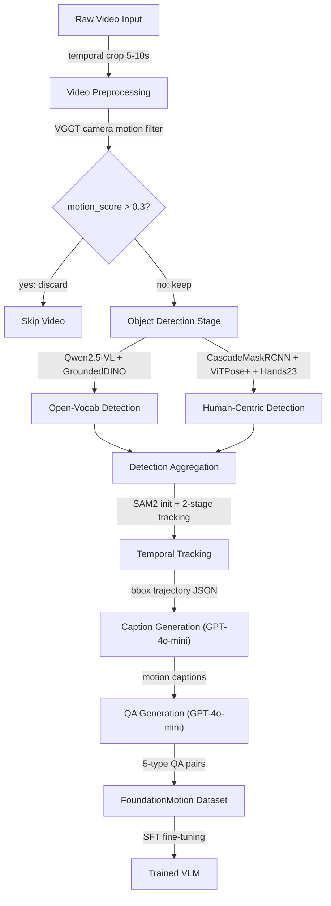

## GPU Runlist-based Preemptive Scheduling（基于Runlist的GPU抢占式调度）

术语是什么？回答尽量完整，回答逻辑链中每一步都解释出来。通过联网搜索让回答具体和精准。

基于 Runlist 的 GPU 抢占式调度是 Capodieci et al. (RTSS 2018) 提出的一类 GPU 实时调度方法。核心机制：将 GPU 的硬件 runlist 作为调度接口——CPU 端 scheduler 维护 task 的就绪队列，按调度策略（如 EDF, Earliest Deadline First）选择最高优先级 task，将其 channel 插入 runlist 使 GPU HW scheduler 开始执行该 task。抢占通过重置 runlist 实现：当更高优先级 task 到达时，CPU scheduler 清空 runlist 上的当前 task channel，插入新 task 的 channel。该方法的优势是 GPU native scheduling 保证执行效率（无需 CPU 端排队），且 runlist 重置提供硬件级别的抢占能力。

从系统架构角度拆解术语，比如术语如何在系统架构中发挥作用，给出术语在系统架构中运转流程的具体例子。通过联网搜索让回答具体和精准。

基于 Capodieci et al. 方法和 Bakita & Anderson 的修正：

```
原Capodieci et al.方法 (基于错误假设——所有GPU仅一个runlist):
  CPU Scheduler (EDF):
    while True:
      next_task = select_highest_priority_EDF(ready_queue)
      reset_runlist()                        # 清空runlist
      insert_channels(next_task, runlist)    # 插入新task的channel
      // 假设: 抢占compute runlist后task不再执行任何GPU操作

Bakita & Anderson修正 (基于R5, R7):
  CPU Scheduler (EDF + multi-runlist aware):
    while True:
      next_task = select_highest_priority_EDF(ready_queue)
      for each runlist in GPU.runlists:       # 遍历所有runlist
        reset_runlist(runlist)                # 必须抢占所有runlist
        if next_task.uses_engine(runlist.engines):
          insert_channels_for_engines(next_task, runlist)
      // 修正: Jetson Xavier有独立compute runlist + copy runlist
      // 仅重置compute runlist → copy runlist上仍有前task的copy 
      // → copy干扰新task的compute → deadline miss
```

Counter-example（Bakita & Anderson §VI-B）：
- Jetson Xavier: compute runlist + copy runlist（独立，R5）
- Task1 (compute+copy, period 3s, deadline 2s) + Task2 (compute-only, period 3s, deadline 3s)
- Task2 以更高 EDF 优先级抢占 Task1 → 只重置 compute runlist → Task1 的 copy 在 copy runlist 上继续 → copy 严重延迟 Task2 的 compute（Olmedo et al. [7] 在 Jetson Xavier 上证明）→ Task2 deadline miss

术语一般如何实现？如何使用？通过联网搜索让回答具体和精准。

正确的实现必须：(i) 通过 nvdebug 的 device_info 接口获取 GPU 的完整 engine-runlist 拓扑；(ii) 为每个 task 记录其使用的 engine 类型；(iii) 抢占时重置所有涉及 engine 的 runlist；(iv) 考虑 runlist 的多 engine 绑定（R6, Runlist 0 同时含 compute 和 GRCE）可能导致的 side effect。在高 end GPU（如 RTX 6000 Ada, 17 runlists）上，runlist 管理比嵌入式平台更复杂但也提供更细粒度的隔离能力。

涉及论文标题：
- Demystifying NVIDIA GPU Internals to Enable Reliable GPU Management

## GPU Mutual Exclusion Locking（GPU互斥锁管理）

术语是什么？回答尽量完整，回答逻辑链中每一步都解释出来。通过联网搜索让回答具体和精准。

GPU Mutual Exclusion Locking 是 GPUSync (Elliott et al., RTSS 2013) 及其扩展提出的一类 GPU 实时管理方法。核心思想：将 GPU 的各 engine（compute engine、copy engine）视为独立可锁资源，GPU-using task 在使用前必须 acquire 对应 engine 的 mutual-exclusion lock，使用后 release。这使得 GPU 调度问题转化为经典的实时资源管理问题——已有的大量实时 locking protocol 和 response-time analysis 可直接应用于 GPU-using task。该方法的优势是实现简单、分析成熟；缺点是 capacity loss（task 持锁期间 GPU engine 可能未被充分利用）。

从系统架构角度拆解术语，比如术语如何在系统架构中发挥作用，给出术语在系统架构中运转流程的具体例子。通过联网搜索让回答具体和精准。

基于 GPUSync 方法和 Bakita & Anderson 的修正：

```
原GPUSync方法 (基于错误假设——copy engine独立):
  系统初始化:
    CUDA报告2个copy engine → 创建:
      Lock_CPU_to_GPU: 对应 Copy Engine 0
      Lock_GPU_to_CPU: 对应 Copy Engine 1
      Lock_Compute:     对应 Compute Engine
  
  Task1 (CPU→GPU copy + graphics):
    acquire(Lock_CPU_to_GPU)  # 获取copy engine 0
    acquire(Lock_Compute)      # 获取compute engine
    // 执行...
    release(Lock_Compute)
    release(Lock_CPU_to_GPU)
  
  Task2 (GPU→CPU copy):
    acquire(Lock_GPU_to_CPU)  # 获取copy engine 1
    // 两个task的lock无交集 → 被认为可并行执行
    // 但实际RTX 6000 Ada上(R8): 
    //   GRCE0(处理CPU→GPU copy)可能共享LCE2(处理GPU→CPU copy)的PCE
    //   → 一个PCE被竞争 → copy时间翻倍 → execution time bound被打破

Bakita & Anderson修正 (基于R6, R8):
  系统初始化:
    通过nvdebug检查PCE-LCE-GRCE映射(Fig.11) → 发现PCE共享
    仅创建实际独立的copy lock数目
    
  正确的lock分配 (基于硬件PCE独立性):
    Lock_PCE0: 对应PCE0上的所有LCE和GRCE
    Lock_PCE1: 对应PCE1上的所有LCE (如果存在且未被GRCE共享)
    Lock_Compute: 对应Compute Engine
```

术语一般如何实现？如何使用？通过联网搜索让回答具体和精准。

正确实现 GPU mutual exclusion locking 的前提：(i) 通过 nvdebug 的 device_info 和 lce_for_pce / shared_lce_for_grce 接口获取正确的 engine 独立性映射；(ii) 在实时系统启动时而非运行时检查硬件配置（因为 PCE-LCE 映射被认为是硬编码常量）；(iii) 考虑 runlist 共享导致的非独立调度（R6, 尤其 Runlist 0 的 compute+copy 共 runlist 可能引入额外干扰）；(iv) 在高 end GPU 上（如 RTX 6000 Ada, 17 runlists + 5 PCE），per-engine locking 可能是安全的——但前提是逐一验证 engine 独立性。

涉及论文标题：
- Demystifying NVIDIA GPU Internals to Enable Reliable GPU Management

## Real-time GPU Management（实时GPU管理）

术语是什么？回答尽量完整，回答逻辑链中每一步都解释出来。通过联网搜索让回答具体和精准。

Real-time GPU Management 是指为满足安全关键系统（如自动驾驶汽车）中 GPU-using task 的实时性要求而设计的一系列 GPU 资源调度与管理技术。核心理念：通过 bound GPU-using task 的 response time（最坏情况完成时间），确保 task 在 deadline 前完成。Bakita & Anderson 将现有方法分为三类：(i) mutual-exclusion-based management (GPUSync)；(ii) preemption-based management (Capodieci et al.)；(iii) management-free response-time analysis (Yang et al.)。所有三类方法均因对 NVIDIA GPU 硬件调度行为的不完整理解而产生 unsafe response-time bound。

从系统架构角度拆解术语，比如术语如何在系统架构中发挥作用，给出术语在系统架构中运转流程的具体例子。通过联网搜索让回答具体和精准。

基于 Bakita & Anderson 论文总结的三类 GPU 管理方法和其硬件假设缺陷：

```
三类GPU管理方法的架构对比:

① Mutual-Exclusion Management (GPUSync [14], Elliott et al. [2]):
   架构: Task → acquire(engine_lock) → use GPU → release(engine_lock)
   硬件假设: copy engines 独立 → R6, R8推翻 (共runlist + PCE共享)
   安全条件: 每个独立PCE一个lock, 需nvdebug验证

② Preemptive EDF (Capodieci et al. [3]):
   架构: Task → CPU EDF scheduler → insert channels into runlist
   硬件假设: 仅一个runlist, 重置runlist=完全抢占 → R5, R7推翻 (多runlist独立)
   安全条件: 抢占所有相关runlist, 需nvdebug获取完整runlist拓扑

③ Management-Free Analysis (Yang et al. [4]):
   架构: 无管理中间件, GPU-using task直接使用GPU → response-time analysis
   硬件假设: kernel按FIFO dequeue → R2推翻 (超channel数时非FIFO)
   安全条件: 限制stream数 ≤ channel数 (默认x86_64上≤8)

共同必要条件 (Bakita & Anderson):
  所有GPU管理方法必须遵守8条调度规则(R1-R8),
  这些规则跨越channel → runlist → engine三个层次
```

术语一般如何实现？如何使用？通过联网搜索让回答具体和精准。

正确实现 real-time GPU management 需要：(i) 使用 nvdebug 等工具在 target GPU 上验证硬件调度配置（engine-runlist 拓扑、PCE-LCE 映射、channel 数量）；(ii) 选择与硬件调度行为一致的管理方法（如在高 end GPU 上用 per-engine locking，在嵌入式单 runlist 平台上用 runlist 抢占）；(iii) 在 response-time analysis 中考虑 channel 限制（R2）、runlist timeslicing 间隔（R4）、跨 engine PCE 干扰（R8）等硬件行为。Bakita & Anderson 的工具套件（nvdebug + gpu-microbench）为这些验证提供了开源基础设施。

涉及论文标题：
- Demystifying NVIDIA GPU Internals to Enable Reliable GPU Management

## PagedAttention（分页注意力）

术语是什么？回答尽量完整，回答逻辑链中每一步都解释出来。通过联网搜索让回答具体和精准。

PagedAttention 是 vLLM（UC Berkeley）提出的 LLM serving 系统的 KV cache 内存管理机制，灵感来自操作系统的虚拟内存分页。核心思想：将 KV cache 划分为固定大小的 block（如 16 或 32 token），通过 block table 将逻辑 KV cache 序列映射到非连续的物理 GPU 内存块。这允许按需动态分配 KV cache 内存（类似 OS 的 demand paging），消除预分配连续内存导致的内部碎片（传统方式需预分配 max_seq_len 连续空间，实际利用率仅 20-30%）。PagedAttention 支持 block 级别的内存共享——不同序列的相同 prefix（如 system prompt）可共享同一物理 KV cache block（Copy-on-Write 语义）。

从系统架构角度拆解术语，比如术语如何在系统架构中发挥作用，给出术语在系统架构中运转流程的具体例子。通过联网搜索让回答具体和精准。

```
vLLM Serving with PagedAttention:

请求到达 → Scheduler:
  1. 为新请求分配逻辑 KV blocks（Block Manager）
  2. Block Table: [req_id] → [physical_block_0, physical_block_1, ...]
  3. 若共享 prefix，指向已有物理 block（引用计数+1）

Prefill 阶段:
  for each token in prompt:
    compute K,V → 写入当前逻辑 block
    if block full:
      allocate new physical block from free pool
      append to block_table[req_id]

Decode 阶段 (PagedAttention Kernel):
  for each query token q_i:
    for each block_id in block_table[req_id]:
      K_block = KV_cache[block_id]     # [block_size, num_heads, head_dim]
      V_block = KV_cache[block_id]
      scores_block = q_i @ K_block^T / sqrt(head_dim)
      // block内完整计算，跨block通过running statistics合并
      o_i += softmax(scores_block) @ V_block

内存释放:
  当请求完成 → block引用计数-1 → 若count=0则回收至free pool
```

相比朴素 KV cache 管理的优势：(i) 内存浪费从平均 60-80% 降至接近 0；(ii) 支持更大 batch size（可用内存更高效）；(iii) prefix sharing 进一步减少冗余存储——在 chatbot 场景中所有请求共享 system prompt 的 KV cache。实验结果：up to 29× 吞吐提升。

术语一般如何实现？如何使用？通过联网搜索让回答具体和精准。

vLLM 开源实现（https://github.com/vllm-project/vllm）。需要自定义 CUDA kernel 支持 block 级 indirect memory access（通过 block_table 索引）。S-LoRA 将 PagedAttention 扩展为 Unified Paging，统一管理多个 LoRA adapter 的 KV cache。vAttention 进一步发现可通过修改 CUDA virtual memory API 让 OS 做物理内存重分配（而非自定义 kernel），在 vLLM 基础上提升 1.29× 端到端吞吐。TensorRT-LLM 和 HuggingFace TGI 也集成了 PagedAttention。

涉及论文标题：
- A Survey of Resource-efficient LLM and Multimodal Foundation Models

## Iteration-Level Scheduling / Selective Batching（迭代级调度）

术语是什么？回答尽量完整，回答逻辑链中每一步都解释出来。通过联网搜索让回答具体和精准。

Iteration-Level Scheduling 是 LLM serving 系统中的细粒度请求调度策略，由 Orca 系统首次提出。传统 serving 的 request-level batching 将不同请求 padding 到相同长度后批处理——padding token 浪费计算、已完成生成但未结束的请求需等待同批次慢请求（head-of-line blocking）。Iteration-level scheduling 在每次 decoder iteration 粒度上动态决定参与批处理的请求集合：新请求可立即加入、已完成请求立即退出（返回给用户），无需等待同批次其他请求。配合 Selective Batching 技术，允许不同请求在同一 batch 内处理不同数量的 token。

从系统架构角度拆解术语，比如术语如何在系统架构中发挥作用，给出术语在系统架构中运转流程的具体例子。通过联网搜索让回答具体和精准。

```
Iteration-Level Scheduling (Orca):

请求队列:
  R1: [Prompt 100 tok | output 必须 ≥ 50 tok]
  R2: [Prompt 30 tok  | output 必须 ≥ 20 tok]
  R3: [Prompt 200 tok | 刚到达，待处理]

时间线 (每步 = 1 iteration ≈ 1 token generation):

iter_0 (prefill):
  Batch: [R1_prefill(100 tok)]
  R1: prefill完成, KV cache建立
  
iter_1:
  Batch: [R1_decode, R2_prefill(30 tok)]
  R1: 生成 token_1
  R2: prefill完成
  
iter_2:
  Batch: [R1_decode, R2_decode, R3_prefill(200 tok)]
  R1: token_2; R2: token_1; R3: prefill完成

iter_3..20:
  R2 在 iter_20 生成 EOS → 立即返回 → 从batch中移除
  R3 在 iter_3 即时加入batch（无需等待R2完成）

iter_4..50:
  Batch: [R1_decode, R3_decode]  (R2已退出)

iter_50: R1生成EOS → 返回 → Batch: [R3_decode] 继续

关键：每iteration重新选择batch成员，消除padding和等待。
```

进化形式：(i) SARATHI/DeepSpeed-FastGen 的 chunked-prefill——将长 prefill 拆分为多个 chunk，与 decode 交替调度，减少 prefill 对 decode 延迟的干扰；(ii) Splitwise 的 prefill-decode disaggregation——将 prefill（compute-heavy）和 decode（memory-heavy）分配到不同机器；(iii) FastServe 的 iteration-level preemptive scheduling + proactive KV cache swapping。

术语一般如何实现？如何使用？通过联网搜索让回答具体和精准。

实现于 vLLM（iteration-level scheduler + block manager）、Orca（首个提出 selective batching）、SARATHI（chunked-prefill schedule）、DeepSpeed-MII（DeepSpeed-FastGen dynamic split-fuse）。核心要求：(i) 调度器可在每 iteration 动态调整 batch 成员；(ii) KV cache 管理需支持随机位置的新请求插入（PagedAttention 天然支持）；(iii) attention kernel 需支持变长序列（无需 padding）。现代 LLM serving 框架普遍采用 iteration-level scheduling 作为基础调度原语。

涉及论文标题：
- A Survey of Resource-efficient LLM and Multimodal Foundation Models

## Hierarchical Caching for Block Diffusion LLM (Block-level + Sub-block Cache)

术语是什么？回答尽量完整，回答逻辑链中每一步都解释出来。通过联网搜索让回答具体和精准。

Hierarchical Caching for Block Diffusion LLM 是Fast-dLLM v2提出的两级缓存机制，用于加速block diffusion模型的推理。包含两个层级：(1) **Block-level KV Cache**：每个已完成解码的block（block size=32）的所有token的K/V被缓存为read-only prefix context。后续block仅需计算自身attention + 对prefix的cross-attention，无需重复计算已解码block的K/V。由于block diffusion的block间使用causal conditioning（已完成block内容不再改变），此cache是精确（exact）而非近似（approximate）的。(2) **Sub-block DualCache**：块内解码时，将当前block进一步划分为sub-block（size=8），使用Fast-dLLM v1的DualCache机制——同时缓存sub-block的prefix（已解码token）和suffix（仍为[MASK]的token）的K/V，仅需计算sub-block内B_sub×B_sub的自注意力。两层缓存协同：block级cache消除跨block的冗余计算，sub-block cache消除块内的冗余计算。在compute-bound regime（如batch size=32）下显著提升throughput。

从系统架构角度拆解术语，比如术语如何在系统架构中发挥作用，给出术语在系统架构中运转流程的具体例子。通过联网搜索让回答具体和精准。

Hierarchical Caching在block diffusion推理中的运转：

```
序列结构: [Prompt | Block_1 | Block_2 | ... | Block_k (current)]
         |←─── Block-level KV Cache (精确, read-only) ──→|

当前Block k内部（size=32, sub-block size=8）:
  Sub_1 (decoded) | Sub_2 (decoding) | Sub_3..4 ([MASK])
  |←─ DualCache prefix ─→|              |←─ DualCache suffix ─→|

单次forward的计算量:
  无Cache:        attention over all (prompt + all blocks) → O((|p|+K·B)²)
  Block-level:    attention over prefix + current block       → O((|p|+B)²)
  + Sub-block:    attention over prefix + sub-block only      → O((|p|+S)²)
  (S=sub-block size, B=block size, K=block count)
```

Block-level cache在block完成时更新——与block的最终forward融合（无额外开销）。Sub-block DualCache在每个sub-block内复用（无需块完成后才更新）。Cache全部存储在GPU HBM中，通过索引访问复用。

术语一般如何实现？如何使用？通过联网搜索让回答具体和精准。

实现要点：(1) Block-level cache存储为Python dict: key=(layer_id, block_range), value=(K_tensor, V_tensor)；(2) Sub-block DualCache继承自Fast-dLLM v1，在PyTorch eager模式实现，通过attention mask控制sub-block可见范围；(3) batch decoding时所有序列同步逐block推进（通过右填充[MASK]对齐block边界）。参数配置：block_size=32（训练和推理固定），sub_block_size=8（推理时可调），threshold=0.9（并行解码阈值，平衡speed-quality）。Sub-block cache是纯效率优化（不影响accuracy, Figure 6a），在compute-bound regime（batch≥32）下效果显著。

涉及论文标题：
- Fast-dLLM v2: Efficient Block-Diffusion LLM

术语是什么？回答尽量完整，回答逻辑链中每一步都解释出来。通过联网搜索让回答具体和精准。

FlashInfer是一个高效且可定制的attention引擎库，专为LLM推理serving设计。提供一组高性能attention kernel（包括FlashAttention变体、各类sparse attention、KV cache操作等），作为底层kernel library被上层inference framework（如vLLM、SGLang、TensorRT-LLM）调用。核心特征：(1) 模块化设计——每个attention variant作为独立kernel实现，可灵活组合；(2) 支持多种attention变体——MHA、GQA、MQA、MLA；(3) 针对现代GPU（Hopper/Blackwell）优化；(4) 提供C++和Python API。

从系统架构角度拆解术语，比如术语如何在系统架构中发挥作用，给出术语在系统架构中运转流程的具体例子。通过联网搜索让回答具体和精准。

FlashInfer在LLM serving系统中的位置和运转流程：

```
Inference Serving Framework (vLLM/SGLang/TensorRT-LLM)
│
├── Scheduler: 请求调度、batching、KV cache管理
│
├── Model Executor: 执行单个模型层的计算
│   │
│   └── Attention Module ← 调用FlashInfer kernel
│       │
│       ├── Prefill: FlashInfer prefill kernel (dense或sparse)
│       │   - 输入: Q/K/V tensors + attention mask
│       │   - 输出: attention output tensor
│       │
│       ├── Decode: FlashInfer decode kernel (dense或sparse)
│       │   - 输入: Q tensor + KV cache pointer + page table
│       │   - 输出: attention output (single token)
│       │
│       └── KV Cache Append: FlashInfer append kernel
│           - 将新计算的K/V写入page table管理的cache
```

BLASST已作为FlashInfer的一个attention kernel实现，提供prefill和decode两套kernel，用户通过调整threshold λ即可在标准FlashInfer attention API中使用sparse attention。

术语一般如何实现？如何使用？通过联网搜索让回答具体和精准。

FlashInfer使用CUDA C++编写，每个kernel手写优化（非triton自动生成），支持Hopper（sm90a）和Blackwell（sm100）architecture。API示例（Python binding）：
```
import flashinfer
# Prefill
O = flashinfer.prefill_with_paged_kv_cache(Q, KV_cache, page_table, ...)
# Decode
O = flashinfer.decode_with_paged_kv_cache(Q, KV_cache, page_table, ...)
```
BLASST集成后增加threshold参数：
```
O = flashinfer.decode_with_paged_kv_cache(Q, KV_cache, page_table, 
        blasst_threshold=λ, ...)
```

涉及论文标题：
- BLASST: Dynamic BLocked Attention Sparsity via Softmax Thresholding

## CUDA Graph

术语是什么？
CUDA Graph 是 NVIDIA 自 CUDA 10 起提供的框架，允许开发者将一系列 GPU 操作（kernel launch、memory copy、memset 等）及其依赖关系预先定义为一个有向无环图（DAG），然后通过单次调用在 GPU 上重放整个图。CUDA Graph 的核心优势是消除重复的 kernel launch 和同步开销：传统模式下每次 kernel launch 需要 CPU→GPU 通信（约 5-20μs/kernel），而 graph replay 只需要一次 launch，所有操作及其依赖关系已在 GPU 端处理。CUDA Graph 支持 graph capture（从现有 stream 操作捕捉）和显式 API 构建两种方式。

从系统架构角度拆解术语：
CUDA Graph 的工作流程：
```
CUDA Graph (静态图) 执行流程:
┌─────────────────────────────────────────────────────┐
│ Step 1: Graph Construction (在CPU端)                 │
│                                                      │
│   cudaGraphCreate(&graph);                           │
│                                                      │
│   // 方法A: Stream Capture (自动捕捉)                │
│   cudaStreamBeginCapture(stream);                   │
│   kernelA<<<..., stream>>>(...);  // 节点A          │
│   kernelB<<<..., stream>>>(...);  // 节点B (依赖A)  │
│   cudaStreamEndCapture(stream, &graph);             │
│                                                      │
│   // 方法B: Explicit API (显式构建)                  │
│   cudaGraphAddKernelNode(&nodeA, graph, ..., kernelA)│
│   cudaGraphAddKernelNode(&nodeB, graph, ..., kernelB)│
│   cudaGraphAddDependencies(graph, nodeA, nodeB);    │
│                                                      │
│ Step 2: Graph Instantiation                          │
│   cudaGraphInstantiate(&instance, graph);           │
│                                                      │
│ Step 3: Graph Launch (可重复多次)                    │
│   cudaGraphLaunch(instance, stream);                │
│   // 仅一次CPU→GPU通信，所有kernel在GPU端按DAG执行  │
└─────────────────────────────────────────────────────┘
```

CUDA Graph 对静态计算图（如固定 DNN 推理）极有效——图只需构建一次即可重复使用。但在 ACS 的目标场景（input-dependent 计算图，即每次输入产生不同的 kernel 依赖 DAG）中，CUDA Graph 的致命缺陷是每次输入变化都需要重新构建整张图。ACS 论文实验表明，Brax 仿真中使用 CUDA Graph 的 DAG 构造时间平均占程序总执行时间的 47%，导致 CUDA Graph 在动态图中反而比单 stream 串行更慢。

术语一般如何实现？如何使用？
CUDA Graph API 包括：`cudaGraphCreate`、`cudaGraphAddKernelNode`、`cudaGraphAddDependencies`、`cudaGraphInstantiate`、`cudaGraphLaunch`。要求 GPU compute capability ≥ 3.5（基本功能），某些高级特性需要更高版本。CUDA Graph 还支持 conditional nodes（条件节点）和 device graph launch（CUDA 12.x+）。AMD 等价框架为 ATMI（Asynchronous Task and Memory Interface），使用 barrier packet 机制在命令队列中编码 DAG 依赖。ACS 论文定量比较了其方案与 CUDA Graph：静态 DNN 中二者性能相当（图只需构建一次），动态 workload 中 ACS 显著优于 CUDA Graph（避免每次重建 DAG）。

涉及论文标题：
- ACS Concurrent Kernel Execution on Irregular, Input-Dependent Computational Graphs

## Input-Dependent Computational Graph

术语是什么？
Input-Dependent Computational Graph（输入依赖的计算图）是指程序执行过程中 GPU kernel 之间的依赖关系（哪些 kernel 依赖哪些 kernel 的输出）由运行时输入决定、不可提前静态获知的计算图。这对于动态神经网络（如 InstaNAS，根据输入图像决定网络架构路径）和深度强化学习物理仿真（如 Brax，每次仿真的接触/碰撞计算路径取决于 agent 与环境的交互结果）是固有特性。Input-dependent 计算图对 GPU 并发 kernel 调度构成根本挑战：传统方法需要预先知道完整计算图（如 CUDA Graph 需提前构建 DAG，静态调度需提前分析图结构），而 input-dependent 场景中每次输入都需要重新分析和调度，开销不可接受。

从系统架构角度拆解术语：
Input-dependent 计算图的运行时行为：
```
固定输入A:                      不同输入B:
K0 ──► K1 ──► K3               K0 ──► K2 ──► K4
  │                    vs        │             │
  └──► K2 ──► K4                └──► K1 ──► K3

时间 T1 (处理输入A):            时间 T2 (处理输入B):
- CPU获知输入A                   - CPU获知输入B
- 确定K0→K1→K3和K0→K2→K4       - 确定K0→K2→K4和K0→K1→K3
- 需要调度K1||K2并发            - 需要调度K2||K1并发
- DAG结构不同, 需要重新分析      - DAG结构不同, 需要重新分析
```

ACS 通过避免提前构建完整 DAG 来解决此问题：运行时仅检查调度窗口内 N 个 kernel 的依赖关系（而非整个计算图），每次 kernel 完成时增量更新窗口内 kernel 的依赖状态。这相当于将"全局 DAG 分析"问题降维为"局部依赖检测"问题，使得每次输入变化时的额外开销从完整 DAG 构建+调度（占 47% 执行时间）降为微秒级的依赖检查（410-1640ns）。

术语一般如何实现？如何使用？
Input-dependent 计算图的主要存在场景：(1) 动态神经网络（InstaNAS、Dynamic Routing、Conditional Convolution 等），网络执行路径由输入决定，每次推理可能有不同的 kernel 序列；(2) 深度 RL 物理仿真（Brax、Isaac Gym），碰撞检测和物理求解的计算路径取决于 agent 行为；(3) 自适应精度推理（提前退出网络），根据中间结果决定是否继续或提前返回。解决 input-dependent 图的通用方法包括：运行时 JIT 编译（开销大）、DAG 缓存（命中率不可控）、ACS 的窗口调度（通用性好且开销低）。

涉及论文标题：
- ACS Concurrent Kernel Execution on Irregular, Input-Dependent Computational Graphs

## Legion Runtime System

术语是什么？回答尽量完整，回答逻辑链中每一步都解释出来。通过联网搜索让回答具体和精准。

Legion 是 Stanford 大学开发的分布式 task-based runtime system，核心设计理念是"表达局部性和独立性"（expressing locality and independence）。Legion 提供两个关键抽象：(1) logical region：分布式数据集合，支持 content-based coherence——同一数据可以多种方式引用（aliasing），runtime 负责维护跨 processor 的数据一致性；(2) task：对 region 进行操作的用户定义函数，runtime 负责发现 task 间的依赖关系、计算并调度所需的通信。Legion 使用 dynamic dependence analysis [14] 在运行时发现 task 间依赖，而非依赖静态分析。Diffuse 构建在 Legion 之上——cuPyNumeric 和 Legate Sparse 原本直接 target Legion，Diffuse 修改它们以生成 Diffuse IR，在优化后转发 task stream 给 Legion。

从系统架构角度拆解术语，比如术语如何在系统架构中发挥作用，给出术语在系统架构中运转流程的具体例子。通过联网搜索让回答具体和精准。

Legion 在 Diffuse 系统栈中的位置：

```
用户 Python 程序 (cuPyNumeric / Legate Sparse API)
    │
    ▼
Diffuse (task fusion + kernel fusion 的中间层)
    │  优化后的 task stream → 转发给 Legion
    ▼
Legion Runtime
    ├── Dynamic Dependence Analysis [14]
    │   - 计算每个 task 的 precise data dependence
    │   - 仅计算每个 node 实际需要的部分依赖（非全局 materialize）
    ├── Distributed Coherence
    │   - 追踪 aliasing views 的数据一致性
    │   - 在需要时自动插入数据拷贝/通信
    ├── Task Scheduling
    │   - 将 task 调度到 processor (GPU/CPU)
    │   - 管理 task 间 synchronization
    └── Memory Management
        - 管理 distributed region 的物理内存分配
        - 处理 multi-GPU 间的数据移动
    ▼
Low-Level Execution (CUDA, OpenMP, ...)
```

Legion 的 task granularity 最小有效值约 1ms/task（Task Bench [49]），这意味着仅 task fusion（减少 task 数）不能显著提升性能——真正加速来自后续的 kernel fusion。

术语一般如何实现？如何使用？通过联网搜索让回答具体和精准。

Legion 开源地址：https://legion.stanford.edu/。以 C++ runtime library 形式提供。任务注册通过宏完成，partition 通过 API 创建（如 `create_partition_by_tiling`）。终端用户不直接使用 Legion API——通过 cuPyNumeric/NumPy 或 Legate Sparse/SciPy Sparse API 间接受益。库开发者需了解 Legion 的 task 和 region 模型来编写 task implementation。Diffuse 作为中间层减少了对库开发者手工优化的需求——许多 fusion 优化由 Diffuse 自动完成。

涉及论文标题：
- Composing Distributed Computations Through Task and Kernel Fusion

## Content-Based Coherence

术语是什么？回答尽量完整，回答逻辑链中每一步都解释出来。通过联网搜索让回答具体和精准。

Content-Based Coherence 是 Legion runtime 中维护分布式数据一致性的机制。与基于地址的 coherence（如 cache coherence protocol，通过物理地址确定数据身份）不同，content-based coherence 允许同一数据以多种不同的方式引用（multiple aliasing views），runtime 负责追踪这些 views 之间的关系并在数据被修改时传播更新。例如在 5-point stencil 中，grid 数组有 5 个 aliasing views (center, north, east, west, south)，当 center 被更新时，其他 views 读取相应位置时必须观察到更新后的值。Legion 使用 dynamic dependence analysis [14] 进行精确的依赖分析和数据 coherence 维护。

从系统架构角度拆解术语，比如术语如何在系统架构中发挥作用，给出术语在系统架构中运转流程的具体例子。通过联网搜索让回答具体和精准。

Content-Based Coherence 在 5-point stencil 中的运转：

```
Grid Array (4×4, 4 GPU partition):
  
  Aliasing Views:
    center = grid[1:3, 1:3]     // 内部 2×2 区域
    north  = grid[0:2, 1:3]     // 上移一行
    east   = grid[1:3, 2:4]     // 右移一列
    west   = grid[1:3, 0:2]     // 左移一列
    south  = grid[2:4, 1:3]     // 下移一行

  Iteration i:
    读取 north, east, west, south, center → 各自 partition
    计算 work, 写入 center 的 partition
    
    Content-based coherence 追踪:
    - GPU 0 写入 center 的 sub-region → 该 sub-region 同时属于
      GPU 2 的 north view、GPU 1 的 east view 等的 sub-region
    - Legion 计算: GPU 0 需要将更新后的 center 数据发送给
      哪些 GPU (使其 aliasing views 获得最新值)
```

对 Diffuse 的关键挑战：aliasing views 使 fusion analysis 复杂化。Diffuse 通过 partition equality check (O(1)) 检测 aliasing——若两个 task 通过不同 partition 访问同一 store，则它们之间的依赖可能跨 processor，融合可能不安全。

术语一般如何实现？如何使用？通过联网搜索让回答具体和精准。

Legion 通过 visibility algorithm [14] 实现 content-based coherence——对每个 task 的参数 (region, privilege, fields)，runtime 在 task 提交时计算其必须等待完成的 preceding task 集合。Diffuse 不实现 content-based coherence（委托给 Legion），但它必须在 fusion analysis 中保守处理 aliasing——通过 fusion constraints 的 partition equality check 确保融合后的依赖不破坏 coherence。

涉及论文标题：
- Composing Distributed Computations Through Task and Kernel Fusion

## Task-Based Runtime System

术语是什么？回答尽量完整，回答逻辑链中每一步都解释出来。通过联网搜索让回答具体和精准。

Task-Based Runtime System 是一种分布式编程运行时范式。应用程序将计算分解为 task（用户定义函数，操作于分布式数据之上），并以 task stream 形式提交给 runtime。Runtime 负责：(1) 从 task stream 中提取并行性；(2) 计算 task 间的同步和通信（数据依赖分析）；(3) 调度 task 到 processor 执行。主流 task-based runtime 包括：Legion [15]、StarPU [7]、PaRSEC [26]、Ray [41]、Pathways [11]、Dask 等。关键抽象：task = (function, data accesses)，runtime 通过分析 data access pattern 自动推断依赖关系。

从系统架构角度拆解术语，比如术语如何在系统架构中发挥作用，给出术语在系统架构中运转流程的具体例子。通过联网搜索让回答具体和精准。

Task-Based Runtime 在 Diffuse 的上下文中的运转流程：

```
cuPyNumeric 程序:
  z = x + y          // NumPy 操作
  w = z * 2.0        // 另一个独立操作

       ▼ 库分解

Task Stream (emit to runtime):
  T1: ADD([(x, R), (y, R), (z, W)])   // index task over partitioned data
  T2: MULT([(z, R), (w, W)])

       ▼ Runtime 处理

  1. Dependence Analysis:
     - T2 depends on T1 (reads z which T1 writes)
     - Synchronization: T2 must wait for T1 (at point-task level)
  
  2. Data Coherence:
     - 追踪 aliasing views 的数据一致性
  
  3. Task Scheduling:
     - 将 point tasks 分配到 processor (GPU/CPU)

       ▼ 执行: GPU 0..N-1 execute T1, then T2
```

Diffuse 定位为 task-based runtime 系统的中间优化层：在库分解出 task stream 之后、runtime 执行 task 之前进行 fusion 分析。

术语一般如何实现？如何使用？通过联网搜索让回答具体和精准。

Task-based runtime 通常以 C/C++ library（如 Legion, StarPU）或 Python/分布式框架（Ray, Dask）形式提供。终端用户通过 NumPy/SciPy drop-in replacement 库（cuPyNumeric, Legate Sparse）间接使用。Diffuse 证明：通过在 task-based runtime 之上添加 scale-free 的中间分析层，可在不修改应用代码的情况下自动实现跨库边界的优化。

涉及论文标题：
- Composing Distributed Computations Through Task and Kernel Fusion

## Cornfigurator

术语是什么？回答尽量完整，回答逻辑链中每一步都解释出来。通过联网搜索让回答具体和精准。

Cornfigurator 是第一个面向通用 Any-to-Any（A2A）多模态模型推理 Serving 的自动化部署规划器。它接收 model definition（组件 DAG）、configuration space（executor 类型及配置）、workload（request type 分布及 per-type latency target）、GPU budget 作为输入，自动搜索最优的 colocation/disaggregation 组合、executor 配置（batch size、parallelism degree、实例数）和请求路由策略，输出可被 Cornserve runtime 直接部署执行的 physical plan。优化目标是最大化 per-request-type goodput（满足各自延迟目标的吞吐量）之和。规划器约 5K 行 Rust 实现，使用三阶段粗到细统计评估管道：Network flow（吞吐量上界估计）→ Monte Carlo（延迟采样）→ Request-level simulator（精确队列建模），每阶段后剪枝淘汰劣化方案。开源地址：https://github.com/cornserve-ai/cornfigurator。

从系统架构角度拆解术语，比如术语如何在系统架构中发挥作用，给出术语在系统架构中运转流程的具体例子。通过联网搜索让回答具体和精准。

Cornfigurator 在 A2A Serving 栈中的位置和运转流程：

```
输入层:
  Model Definition (DAG: E_img→E_vid→L_th→L_ta→G_aud)
  Configuration Space (executor types, batch sizes, TP degrees)
  Workload (8 request types, per-type fractions π_t, latency targets L_t)
  GPU Budget N=16
       │
       ▼
Profiler (§5.1):
  对每个 executor type 在 A100 上 sweep batch size & parallelism
  记录稳态吞吐和延迟（减除 queuing delay）
  输出: per-executor-config throughput & latency profiles
       │
       ▼
Planner - Plan Enumeration (§4.2, Algorithm 1):
  1. Simple subplans: 枚举 model subgraph 的 colocation/disaggregation
  2. Compound subplans: 合并共享节点的 simple subplans (k_c=2)
  3. Logical plans: 组合 subplans 为 supergraph, 覆盖所有 request types (k_s=2)
  4. Physical plans: 注解 GPU 分配 + executor 配置 + routing probabilities
  → 输出 ~483M candidate physical plans
       │
       ▼
Planner - Three-Phase Evaluation (§4.3, Algorithm 2):
  Phase 1: Network Flow (3.48s, 483M→1.95M) - 瓶颈吞吐量上界
  Phase 2: Monte Carlo Latency (34.23s, 1.95M→25) - per-type 延迟 CDF
  Phase 3: Request-Level Simulator (0.83s, 25→5) - queuing + contention
       │
       ▼
输出: Physical Plan (deployed to Cornserve runtime)
```

术语一般如何实现？如何使用？通过联网搜索让回答具体和精准。

Cornfigurator 是 runtime-agnostic 设计，但其 proof-of-concept 实现在 Cornserve 之上。使用流程：(1) 定义 model component graph 和 configuration space；(2) 提供代表性 workload traces；(3) 运行 profiler 收集 per-component 性能数据（平均 4.2 node-hours per pair）；(4) 运行 planner 生成 physical plan（< 2 分钟）；(5) 将 plan 交给 Cornserve runtime 部署执行。支持 workload drift 自适应——当 request type 比例变化时仅需 re-weight profiling samples（无需重新 profiling），re-planning 耗时 single-digit seconds。

涉及论文标题：
- Cornserve Efficiently Serving Any-to-Any Multimodal Models

## Goodput (Per-Request-Type, in A2A Serving)

术语是什么？回答尽量完整，回答逻辑链中每一步都解释出来。通过联网搜索让回答具体和精准。

Goodput 在 Cornfigurator 中的定义为：对于每种 request type t，在给定 physical plan 下，满足其 per-type latency target L_t 的请求吞吐量。即 goodput_t = throughput_t × Pr(latency_t ≤ L_t)。总体 goodput = Σ_t goodput_t。Goodput 同时捕捉吞吐量和延迟合规性。Latency target L_t 的默认设定：对每种 request type 在 isolation 下 profiling，取最高吞吐配置的 p25 延迟。Appendix A 证明当 L_t ∝ compute cost of type t 时，所有 type 的约束 equally tight。

从系统架构角度拆解术语，比如术语如何在系统架构中发挥作用，给出术语在系统架构中运转流程的具体例子。通过联网搜索让回答具体和精准。

Per-type goodput 在 Cornfigurator 中的计算流程：

```
Monte Carlo Phase:
  for each request type t:
    采样请求 → 按 routing prob 穿越 plan graph
    累积 per-executor 处理延迟 → empirical latency CDF F_t(l)
    goodput_t = α·R_d·π_t·F_t(L_t)
  Pruning: Pareto-dominance on goodput vector (g1,...,gT)

Simulator Phase:
  以 α·R_d 速率运行 request-level 模拟
  建模 queuing + inter-type contention + CPU-GPU overlap
  输出 per-type latency CDF → goodput_t
  最终选 max Σ_t goodput_t
```

术语一般如何实现？如何使用？通过联网搜索让回答具体和精准。

Per-type goodput 的关键优势：使用全局单一延迟约束时，仅最重的 request type（如 audio output）约束生效，轻量 type（如 text output）可被无限制降级。Per-type constraint 确保 planner 不能以牺牲轻量 type 延迟为代价提升重量 type 吞吐。

涉及论文标题：
- Cornserve Efficiently Serving Any-to-Any Multimodal Models

## Colocation vs Disaggregation in A2A Model Serving

术语是什么？回答尽量完整，回答逻辑链中每一步都解释出来。通过联网搜索让回答具体和精准。

Colocation 和 Disaggregation 是 A2A 模型推理 Serving 中图级别的两种基本部署策略。Colocation 将多个 model component（如 encoder + LLM）合并到同一个 executor 中运行，共享 GPU 资源；Disaggregation 将不同 component 解耦到独立 executor（通常在不同 GPU 上），允许各自独立扩展。在 Cornfigurator 的 model graph 中，每条 colocatable edge 有 KEEP（disaggregation）或 MERGE（colocation）两种选择。

从系统架构角度拆解术语，比如术语如何在系统架构中发挥作用，给出术语在系统架构中运转流程的具体例子。通过联网搜索让回答具体和精准。

Tradeoff 分析：

```
Colocation 优势: 共享 GPU 资源, 减少 NCD 传输延迟 (~10ms), 无 GPU 碎片
Colocation 劣势: 无法独立扩展, slowest component bottlenecks all

Disaggregation 优势: 每 component 独立扩展, component-specific 硬件匹配
Disaggregation 劣势: GPU 碎片, NCD 传输开销

Cornfigurator 最优决策示例 (Qwen 3 Omni 16GPU 1/3 audio):
  1×(E_aud) + 4×(E_img+E_vid+L_th) + 11×(L_ta+G_aud)
  = audio encoder disaggregated (低吞吐独立扩展),
    其余 encoder+thinker colocated (共享资源),
    talker+vocoder colocated (audio output pipeline)
```

术语一般如何实现？如何使用？通过联网搜索让回答具体和精准。

Disaggregation 并非普遍有利：Qwen-Image（2-component）中 monolithic 最优（LLM prefill 轻量，encoder GPU 会浪费）；InternVL 3 中当 image input 概率从 25%→75%，planner 自动从 monolithic→encoder-disaggregated→增大 batch size 过渡。Cornfigurator 不预设固定策略，将所有策略视为搜索空间中的点并系统化评估。

EPD-Serve 将 Colocation 扩展到 Encode-Prefill-Decode 三阶段的空间复用：逻辑层独立调度，物理层通过 Ascend NPU 上 AI Core（MatMul）和 AI Vector（AllReduce）的资源互补实现 operator-level 共置。部署拓扑符号 "-" = 分置不同硬件，"()" = 物理共置。支持 E-P-D / EP-D / ED-P / E-PD / (E-P)-D / (E-D)-P 等多种拓扑，按 SLO 优先级灵活切换（高性能平衡 / 快速首Token / 最大化吞吐）。实验证明 (E-P)-D 共置比 PD-disaggregated EP-D 提升吞吐 57.37-69.48%，(E-D)-P 共置的 Encode(memory-heavy) + Decode(compute-heavy) 资源互补大幅优化 TTFT。

涉及论文标题：
- Cornserve Efficiently Serving Any-to-Any Multimodal Models
- EPD-Serve A Flexible Multimodal EPD Disaggregation Inference Serving System On Ascend

## Coarse-to-Fine Statistical Evaluation for Serving Plans

术语是什么？回答尽量完整，回答逻辑链中每一步都解释出来。通过联网搜索让回答具体和精准。

Coarse-to-Fine Statistical Evaluation 是 Cornfigurator 的三阶段评估管道，用于高效搜索 ~500M candidate physical plans。三阶段：(1) Network flow-based throughput estimation——将 plan 建模为流网络，计算 bottleneck node 确定最大吞吐量上界；(2) Monte Carlo latency estimation——随机采样请求并通过 plan 模拟处理延迟；(3) Request-level simulator——完整建模请求队列、inter-type contention 和 runtime 细节。剪枝规则精确——仅丢弃保证冗余或被 Pareto-dominate 的方案。

从系统架构角度拆解术语，比如术语如何在系统架构中发挥作用，给出术语在系统架构中运转流程的具体例子。通过联网搜索让回答具体和精准。

Qwen 3 Omni 16GPU 的评估流程和时间：

```
Phase 1: Network Flow — 3.48s, 483M→1.95M (0.40% survival)
  for each node v: capacity_v = Σ throughput_k
  找 bottleneck: first node where Σ demand_t ≥ capacity_v
  Pruning: 冗余 GPU 配置的 plans

Phase 2: Monte Carlo Latency — 34.23s, 1.95M→25
  采样 M 请求 → 按 routing prob 穿越 plan → per-type CDF F_t
  goodput_t = α·R_d·π_t·F_t(L_t)
  Pruning: Pareto-dominance on goodput vector

Phase 3: Simulator — 0.83s, 25→5
  以 α·R_d 速率运行，建模 queuing + inter-type contention
  Pruning: Pareto-dominance → select max Σ goodput
```

术语一般如何实现？如何使用？通过联网搜索让回答具体和精准。

Planning 总时间 < 2 分钟（vs. 全量 simulator 需 4400+ 小时）。F&M 的 mean absolute goodput error 为 10.7%（aggregate），Simulator 降至 4.1%。关键参数 α（吞吐 headroom，默认 0.7）planner 在 ±2% 误差内对 α∈[0.5,0.8] 鲁棒。

涉及论文标题：
- Cornserve Efficiently Serving Any-to-Any Multimodal Models

## Cornserve

术语是什么？回答尽量完整，回答逻辑链中每一步都解释出来。通过联网搜索让回答具体和精准。

Cornserve 是一个分布式 Any-to-Any (A2A) 多模态模型 Serving 平台。它支持通用 A2A 模型的推理部署，能够根据 Cornfigurator 生成的 physical plan 自动在 GPU 集群上实例化 executor、管理组件间数据流、执行请求路由。开源地址：https://github.com/cornserve-ai/cornserve。

从系统架构角度拆解术语，比如术语如何在系统架构中发挥作用，给出术语在系统架构中运转流程的具体例子。通过联网搜索让回答具体和精准。

```
Cornfigurator → Physical Plan → Cornserve Runtime
                                    ├── Plan Deployer (启动 executor 实例)
                                    ├── Request Router (按 routing prob 分发请求)
                                    ├── Data Transfer (NCD, ~10ms median)
                                    ├── Executor (运行 component 推理)
                                    └── Monitoring (per-executor 指标)
```

术语一般如何实现？如何使用？通过联网搜索让回答具体和精准。

Cornserve 在 Cornfigurator 论文中被用作 evaluation platform——所有 baseline plan（vLLM, vLLM-Omni, ModServe, EPD）均通过 Cornfigurator 表达为 equivalent physical plan 后部署到 Cornserve 上运行，以消除框架实现差异对性能的影响。

涉及论文标题：
- Cornserve Efficiently Serving Any-to-Any Multimodal Models

## Prefilling in Diffusion Models (DMLLM KV Cache Reuse)

术语是什么？回答尽量完整，回答逻辑链中每一步都解释出来。通过联网搜索让回答具体和精准。

Prefilling在扩散多模态大模型中是一种KV cache复用策略。在标准DMLLM推理中，由于使用bidirectional (full) attention mask，每步扩散迭代需对整个序列（prompt + answer）重新计算attention，复杂度为$O((L_{prompt} + L_{answer})^2)$。由于visual tokens和多轮对话使L_prompt可能非常长，这成为推理瓶颈。Prefilling策略：仅在首次扩散forward时完整计算prompt tokens的attention并缓存其Key/Value tensors；后续迭代直接复用缓存的prompt K/V，仅需计算answer部分的attention（复杂度降至$O(L_{answer}^2 + L_{answer} \cdot L_{prompt})$）。注意：在DMLLM中Prefilling理论上不是lossless——因为bidirectional attention下answer tokens会attend到prompt tokens，而缓存的K/V基于首次forward结果不变（不同于AR模型中prompt K/V本质上是静态的）。

从系统架构角度拆解术语，比如术语如何在系统架构中发挥作用，给出术语在系统架构中运转流程的具体例子。通过联网搜索让回答具体和精准。

Prefilling在DMLLM推理中的运转流程：

```
Step 0 (首次forward — Prefill):
  输入: [Prompt tokens] + [[MASK] * L_answer]
  Attention计算:
    prompt × prompt: 完整计算 → 缓存 K_prompt, V_prompt
    answer × prompt: answer tokens作为query attend到K_prompt, V_prompt
    answer × answer: [MASK] tokens之间的attention（初始为空）
  输出: 预测分布 z_1 + 缓存的 K_prompt, V_prompt
  复杂度: O(L_prompt² + L_answer·L_prompt + L_answer²)

Step 1+ (后续forward — KV Cache Reuse):
  输入: [Prompt tokens] + [partially decoded answer]
  Attention计算:
    prompt × prompt: 跳过! 直接使用缓存的 K_prompt, V_prompt
    answer × prompt: answer作为query, K_prompt/V_prompt 从缓存读取
    answer × answer: 完整计算
  复杂度: O(L_answer·L_prompt + L_answer²)
  节省: O(L_prompt²) per step

性能影响（Dimple Table 3）:
  - 准确性: 平均性能下降仅0.8%（各benchmark差异小）
  - 加速比: batch=1 平均1.79×; batch=32 平均3.7-7.1×
  - response_length=4: batch=32 TPS加速3.4-3.8×
  - response_length=8: batch=32 TPS加速5.9-7.1×
```

Annotations: L_prompt在DMLLM中包括visual tokens（图像编码产生大量token）、system prompt、多轮对话历史，通常远大于L_answer；Prefilling的loss来源——首次forward时answer全为[MASK]，prompt K/V是基于[MASK] context计算的，但随着扩散进行answer tokens逐渐被填充，prompt tokens本应对新的answer context做出不同的attention响应（但缓存阻止了这种更新）；Dimple实验表明这种loss在实际中很小——说明visual perception和image token utilization在text generation过程中基本保持不变。

术语一般如何实现？如何使用？通过联网搜索让回答具体和精准。

Prefilling实现：(1) 在首次forward pass中，通过attention module的KV cache接口保存prompt positions对应的K/V tensors；(2) 后续forward使用slicing/索引操作从缓存中取出K_prompt/V_prompt，与当前answer tokens的K/V拼接后计算attention；(3) 缓存管理——由于DMLLM的answer长度由response_length预定义，无需动态扩展缓存（与AR serving的动态KV cache不同）。适用于：(a) 长prompt场景（多图像、长文档）；(b) 多轮对话（prompt累积对话历史）；(c) high batch size场景（GPU利用率更高时加速效果更显著，因为attention计算占比更大）。限制：DMLLM特有——AR模型中的KV cache是精确无损的（causal attention保证已生成的token不需要attend到未来token），而DMLLM的bidirectional attention使Prefilling引入理论误差。

涉及论文标题：
- Dimple Discrete Diffusion Multimodal Large Language Model with Parallel Decoding

## EPD Disaggregation (Encode-Prefill-Decode Disaggregation)

术语是什么？回答尽量完整，回答逻辑链中每一步都解释出来。通过联网搜索让回答具体和精准。

EPD Disaggregation 是 EPD-Serve 提出的多模态大语言模型推理的三阶段解耦架构。它将传统的 monolithic 推理 pipeline 拆分为三个独立可调度的实例：**Encode**（Vision Encoder 编码多模态输入为特征向量）、**Prefill**（LLM 首次前向生成首 token 并构建 KVCache）、**Decode**（自回归逐 token 生成）。阶段间通过异步 tensor 传输（E-P 特征预取 + P-D 分层 KV 传输）通信。与 PD Disaggregation（仅解耦 Prefill/Decode）相比，EPD 额外隔离了计算密集的 Encode 阶段，消除了视觉编码对文本推理的资源竞争。

从系统架构角度拆解术语，比如术语如何在系统架构中发挥作用，给出术语在系统架构中运转流程的具体例子。通过联网搜索让回答具体和精准。

EPD-Serve 的 (E-P)-D 部署在 2 NPU 上的流程：

```
请求到达 API Server
  │
  ├── 模态感知路由: 含图像 → E-P-D 管道; 纯文本 → P-D 管道
  │
  ▼
NPU 1 (E-P 共置):
  ┌──────────────────────────────────────┐
  │ Encode: ViT(0.7B) 编码图像 → V_m    │
  │   ↓ 完成后发 hash 事件(异步)         │
  │ Prefill: listener 收到 hash→MM Store │
  │   检索 V_m → 拼接 V_m+V_t → LLM(7B)  │
  │   → 逐层 Prefill 计算 KVCache        │
  │   → 分层传输 KVCache 至 NPU 2        │
  └──────────────────────────────────────┘
                    │ P-D KV 传输(分层分组)
                    ▼
NPU 2 (D 独立):
  ┌──────────────────────────────────────┐
  │ Decode: 接收分层 KVCache              │
  │   → 自回归生成 O_i+1                 │
  │   → 至 max_length 或 <eos>           │
  │ 独立 NPU 不受 E/P 资源竞争影响        │
  └──────────────────────────────────────┘
```

部署拓扑符号: "-" = 分置不同硬件, "()" = 物理共置。支持 E-P-D, EP-D, ED-P, E-PD, (E-P)-D, (E-D)-P, (E-PD) 等拓扑按 SLO 灵活切换。

术语一般如何实现？如何使用？通过联网搜索让回答具体和精准。

EPD 解耦的关键实现要点：(1) 阶段间通信通过 Mooncake Store 的异步传输接口（基于 RDMA/TCP/Shared Memory）；(2) 逻辑隔离 + 物理共置策略——各阶段保留独立进程和调度，但可共享同一 NPU 硬件资源，通过算子级空间复用提升利用率；(3) Proxy 组件统一执行跨实例请求路由和负载均衡；(4) 部署拓扑可按 SLO 优先级动态选择。EPD-Serve 的实验结果显示全解耦 E-P-D (3 NPU) 在 10 req/s 下 SLO 达成率 94.34%，per-NPU effective throughput 为 EP-D 的 7.95 倍。

涉及论文标题：
- EPD-Serve A Flexible Multimodal EPD Disaggregation Inference Serving System On Ascend

## Multimodal Cache Pooling / MM Store

术语是什么？回答尽量完整，回答逻辑链中每一步都解释出来。通过联网搜索让回答具体和精准。

MM Store（Multimodal Cache Pooling）是 EPD-Serve 中用于跨 Encode-Prefill 阶段共享已编码多模态特征的分布式缓存池。它以多模态输入的 hash 值为 key、对应的特征向量（feature vector）为 value 存储。核心设计目标：避免重复编码相同多模态输入，支持跨请求的特征复用，并作为 E-P 异步预取机制的数据源实现零拷贝特征传输。

从系统架构角度拆解术语，比如术语如何在系统架构中发挥作用，给出术语在系统架构中运转流程的具体例子。通过联网搜索让回答具体和精准。

MM Store 在 E-P 异步预取中的运转流程：

```
Encode 实例                    MM Store              Prefill 实例
    │                              │                      │
    │ 1. ViT 编码 I_m              │                      │
    │    → V_m ∈ R^{n×d}           │                      │
    │                              │                      │
    │ 2. hash = SHA256(I_m)        │                      │
    │    put(hash, V_m)            │                      │
    │ ──────────────────────────► │                      │
    │                              │ 存储 key-value       │
    │                              │                      │
    │ 3. 发送 hash 事件(异步)       │                      │
    │ ──────────────────────────────────────────────────► │
    │                              │     4. listener 收到  │
    │                              │        事件            │
    │                              │                      │
    │                              │  5. get(hash)        │
    │                              │ ◄───────────────────  │
    │                              │ ──── V_m ────────►  │
    │                              │                      │
    │                              │     6. 写入本地缓存    │
    │                              │     7. 若 miss:       │
    │                              │       本地重算 V_m    │
    │                              │       (fault-tolerant)│
```

术语一般如何实现？如何使用？通过联网搜索让回答具体和精准。

MM Store 基于 Mooncake Store 的分布式缓存基础设施构建。缓存淘汰策略论文未明确说明。Fault-tolerant 机制：若 Prefill 实例从 MM Store 检索失败（hash miss 或网络故障），触发本地 recomputation 生成缺失的特征向量，保证 pipeline 连续性。适用场景：(1) 多请求共享同一图像时的特征复用（如相同 logo/UI 在多轮对话中重复出现）；(2) E-P 跨 NPU 部署时的低延迟特征传输（仅传 hash，不传完整 tensor）；(3) Encode 与 Prefill 时间解耦——Encode 可提前批量预处理多模态输入并缓存特征。

涉及论文标题：
- EPD-Serve A Flexible Multimodal EPD Disaggregation Inference Serving System On Ascend

## Asynchronous Feature Prefetching (E-P Stage)

术语是什么？回答尽量完整，回答逻辑链中每一步都解释出来。通过联网搜索让回答具体和精准。

Asynchronous Feature Prefetching 是 EPD-Serve 中用于 E-P 跨阶段数据传输的优化机制。核心思想：不直接传输 Encode 阶段产生的完整特征向量（可能很大，如 4K 分辨率图像产生 [16206, 3584] 的 tensor），而是仅传输特征的 hash 值（轻量事件），让 Prefill 实例通过 MM Store 异步检索和预取特征数据。传输与 Encode 计算重叠，隐藏通信延迟。三个关键子机制：Multimodal Cache Pooling（MM Store 缓存）、Event-Driven Asynchronous Prefetching（事件驱动的 hash 通知）、Fault-Tolerant Recomputing（缓存 miss 时的本地重算）。

从系统架构角度拆解术语，比如术语如何在系统架构中发挥作用，给出术语在系统架构中运转流程的具体例子。通过联网搜索让回答具体和精准。

E-P 异步预取在不同分辨率下的 overlap 效果（EPD-Serve Table 3）：

```
分辨率      传输数据Shape    传输延迟   调度延迟   Overlap Ratio
280×280     [100, 3584]      8.15ms    30.80ms    100%
560×560     [400, 3584]     15.82ms    42.41ms    100%
720×1280   [1196, 3584]     38.78ms    81.03ms    100%
1080×1920  [2691, 3584]     80.77ms   151.77ms    100%
4096×3112  [16206, 3584]   729.72ms   728.11ms     99.78%
```

关键洞察：主流分辨率下传输延迟 < 调度延迟（inter/intra-instance scheduling），传输完全被 mask；超高分辨率时 overlap ratio 降至 99.78%，仍接近完全重叠。

```
Timeline:
Encode:   [======= ViT 编码 =======]
                                 ↓ hash event (轻量)
Prefill:                           [listener 等待] [检索特征] [计算]
                                  ↑ overlap: hash传输被隐藏
Transmission:                      [feature get from MM Store]
```

术语一般如何实现？如何使用？通过联网搜索让回答具体和精准。

实现：基于 Mooncake Store 的异步 I/O 接口。Encode 完成后调用 put(hash, V_m)，然后通过 event-driven 消息队列（如 RDMA send/recv 或 TCP notification）向 Prefill 实例发送 hash。Prefill 的 listener 线程接收 hash → 异步调用 get(hash) → V_m 写入 Prefill 本地缓存。当 Prefill 计算需要 V_m 时已提前就绪。对比 baseline（同步传输完整 tensor）：EPD-Serve 的 E-P 异步预取在 2-3 req/s 下降低 TTFT 16.6-21.7%。限制：(1) 需要 MM Store 的额外存储开销；(2) hash collision 或 cache miss 时触发本地重算，产生额外延迟。

涉及论文标题：
- EPD-Serve A Flexible Multimodal EPD Disaggregation Inference Serving System On Ascend

## Hierarchically Grouped KV Cache Transmission

术语是什么？回答尽量完整，回答逻辑链中每一步都解释出来。通过联网搜索让回答具体和精准。

Hierarchically Grouped KV Cache Transmission 是 EPD-Serve 中用于 P-D 跨阶段 KV Cache 传输的优化机制。针对 naive 的同步全量传输——所有 Transformer 层 KVCache 在 Prefill 完成后一次性传输——导致的通信拥塞和高 TTFT，EPD-Serve 提出三层优化：(1) Layer-wise Transmission：按 Transformer 层分拆传输单元，当 Prefill 计算 L+1 层时传输 L 层 KVCache；(2) Grouped Packaging：将相邻多层 KVCache 打包为一个 group 传输，减少握手频率和 metadata overhead；(3) Precise Delayed Scheduling：延迟调度以避免通信峰值拥塞。核心目标：最大化通信-计算重叠（communication-computation overlap）。

从系统架构角度拆解术语，比如术语如何在系统架构中发挥作用，给出术语在系统架构中运转流程的具体例子。通过联网搜索让回答具体和精准。

分层分组 KV 传输的 overlap 效果（EPD-Serve Figure 7 & Table 4）：

```
seq_len=1024:
  Baseline (layer-wise, 无分组):
    KV Latency: 1127ms, Exposed: 955ms, Prefill: 6794ms
    Overlap Ratio: 15.27%, Bandwidth: 7.98 GB/s
  Optimized (hierarchically grouped):
    KV Latency: 716ms, Exposed: 8.8ms, Prefill: 6611ms
    Overlap Ratio: 98.78%, Bandwidth: 12.58 GB/s (+58%)

seq_len=2048:
  Baseline: Overlap 25.08%, BW 10.66 GB/s
  Optimized: Overlap 99.92%, BW 11.71 GB/s (+10%)
```

为什么分组传输大幅提升 overlap？
- Baseline 逐层传输：每层 KV 传输需 metadata handshake（unpredictable latency），传输单元小导致带宽利用率低，handshake 延迟打断了通信-计算重叠。
- 分组传输：多层 KV 打包 → 减少 handshake 次数 → 更大的传输 payload → 更高的带宽利用率 → 延迟调度对齐 Prefill 计算 pipeline → 几乎完全隐藏传输延迟。

术语一般如何实现？如何使用？通过联网搜索让回答具体和精准。

Group size 根据 MLP 计算负载和 handshake 延迟动态确定。实现：(1) Prefill 阶段维护 KV 队列——每层 KVCache 完成后入队；(2) Grouper 线程按配置的 group size 从队列取 KV chunk → 打包 → 调用 Mooncake Store 异步传输接口发送；(3) Decode 实例分层接收 KV chunk → 解包 → 拼装完整 KVCache；(4) Precise scheduling：监控当前通信链路负载，避开峰值时段发送。EPD-Serve 的消融实验：启用 P-D 分层分组后 TTFT 降低 11.9-16%。与 E-P 异步预取联合启用：TTFT 降低 26.1-31.6%。

涉及论文标题：
- EPD-Serve A Flexible Multimodal EPD Disaggregation Inference Serving System On Ascend

## Modality-Aware Multi-Path Scheduling

术语是什么？回答尽量完整，回答逻辑链中每一步都解释出来。通过联网搜索让回答具体和精准。

Modality-Aware Multi-Path Scheduling 是 EPD-Serve 的请求级调度策略，根据请求是否包含非文本模态（图像/音频/视频）将其路由到不同的执行管道。多模态请求走完整的 Encode-Prefill-Decode 管道，纯文本请求直接走 Prefill-Decode 管道（绕过 Encode 阶段）。配合 instance-level 的 least-loaded-first 动态负载均衡，实现异构流量分离和资源隔离。

从系统架构角度拆解术语，比如术语如何在系统架构中发挥作用，给出术语在系统架构中运转流程的具体例子。通过联网搜索让回答具体和精准。

多路径调度+负载均衡的运转流程：

```
API Server 接收请求
  │
  ▼
Modal Detector: 检查 inputs 是否含 image/audio/video
  │
  ├── 多模态请求 → E-P-D Pipeline（完整三阶段）
  │     └── Global Instance Status Table
  │          ├── Encode instances: [E0: queue=2, E1: queue=5] → 选 E0
  │          ├── Prefill instances: [P0: queue=1, P1: queue=3] → 选 P0
  │          └── Decode instances: [D0: queue=4, D1: queue=2] → 选 D1
  │
  └── 纯文本请求 → P-D Pipeline（仅 Prefill-Decode）
        └── Global Instance Status Table
             ├── Prefill instances: 同 P0 (queue=1)
             └── Decode instances: 同 D1 (queue=2)
```

术语一般如何实现？如何使用？通过联网搜索让回答具体和精准。

实现要点：(1) Modal Detector 在 API Server 或 Proxy 层实现，检查 request payload 的 content-type 或多模态字段；(2) Global Instance Status Table 实时追踪各阶段实例的 queue length、pending requests、resource usage 等指标；(3) Least-loaded-first dispatch：新请求发给当前负载最低的实例；(4) 关键效果——防止高负载多模态请求（需 Encode）抢占纯文本请求的 Prefill/Decode 资源，保证两种请求类型的 SLO 不被跨模态干扰。EPD-Serve 论文 evaluation 中使用了含 256 text-image + 256 text-only 的 mixed dataset (VisualWebInstruct) 验证此策略的有效性。

涉及论文标题：
- EPD-Serve A Flexible Multimodal EPD Disaggregation Inference Serving System On Ascend

## Mooncake Store

术语是什么？回答尽量完整，回答逻辑链中每一步都解释出来。通过联网搜索让回答具体和精准。

Mooncake Store 是 Moonshot AI 的 Mooncake 项目中的分布式 KVCache 存储引擎，被 EPD-Serve 用作底层跨阶段异步 tensor 传输中间件。它是面向 PD 分离架构的分层缓存系统，支持跨 DRAM、VRAM、NVMe 的批量数据传输，原生支持 TCP、RDMA（InfiniBand/RoCEv2/GPUDirect）、CXL/共享内存、NVMe over Fabric 等协议。Mooncake 的核心设计理念是"用更多存储换取更少计算"（Trading More Storage for Less Computation），获 FAST 2025 最佳论文奖。开源地址：https://github.com/kvcache-ai/Mooncake。

从系统架构角度拆解术语，比如术语如何在系统架构中发挥作用，给出术语在系统架构中运转流程的具体例子。通过联网搜索让回答具体和精准。

EPD-Serve 使用 Mooncake Store 的两个关键场景：

```
1) E-P 异步特征预取:
   Encode 实例                   Mooncake Store              Prefill 实例
   put(hash, V_m) ────────────►  store in DRAM/NVMe  ◄──── get(hash)
                                 返回 V_m ────────────────► 写入本地缓存

2) P-D 分层 KV 传输:
   Prefill 实例                  Mooncake Store              Decode 实例
   每层 KVCache ──────────────►  RDMA 传输 ──────────────► 分层接收+拼装
   分组打包 + 延迟调度            拓扑感知路径选择
```

术语一般如何实现？如何使用？通过联网搜索让回答具体和精准。

Mooncake Store 由三部分构成：(1) Transfer Engine——拓扑感知的多协议传输引擎，40GB KVCache（≈LLaMA3-70B 128K tokens）在 8×400Gbps RoCE 下可达 190 GB/s 传输带宽；(2) Store——分布式缓存池，支持多副本、大对象条带化、并行 I/O，已集成到 vLLM、SGLang、LMCache、TensorRT-LLM 等主流框架；(3) Conductor——KVCache 感知的全局调度器。Mooncake 2025 年的关键里程碑包括：vLLM-Ascend 集成 (2025.08)、SGLang 正式支持 Mooncake Store (2025.09)、TensorRT LLM 集成 (2025.12)。EPD-Serve 利用 Mooncake 的传输接口实现 Ascend NPU 间的 E-P 特征传输和 P-D KV 传输，但论文未详述具体集成方式。

涉及论文标题：
- EPD-Serve A Flexible Multimodal EPD Disaggregation Inference Serving System On Ascend

## Flexible Stage Disaggregation with Physical Co-location

术语是什么？回答尽量完整，回答逻辑链中每一步都解释出来。通过联网搜索让回答具体和精准。

Flexible Stage Disaggregation with Physical Co-location 是 EPD-Serve 的部署拓扑策略。在逻辑层面，Encode/Prefill/Decode 三阶段被拆分为独立实例进程，各自拥有独立调度和弹性伸缩能力。在物理层面，不同阶段可共享相同的 Ascend NPU 硬件资源（共置），通过 operator-level 的空间复用（如 MatMul 用 AI Core、AllReduce 用 AI Vector 交替执行）提升硬件利用率。这一策略支持多种部署拓扑的动态切换：E-P-D（全解耦）、EP-D（Encode+Prefill 共置+Decode 独立）、ED-P（Encode+Decode 共置+Prefill 独立）、E-PD（Encode 独立+Prefill+Decode 共置）、(E-P)-D、(E-D)-P、(E-PD) 等。

从系统架构角度拆解术语，比如术语如何在系统架构中发挥作用，给出术语在系统架构中运转流程的具体例子。通过联网搜索让回答具体和精准。

不同部署拓扑的性能特征与推荐场景（EPD-Serve Figure 17 & Section 4.7）：

```
场景分类:
  1) 高性能平衡 (Low TTFT + Low TPOT):
     推荐: (E-P)-D
     - Encode+Prefill 共置 1 NPU, Decode 独立 1 NPU
     - 高并发 12 req/s: TPOT 降低 79.99-93.31% vs TP1
     - SLO attainment = 84.96% (strict: TTFT<800ms, TPOT<30ms)

  2) 快速首Token (Low TTFT, 可接受 moderate TPOT):
     推荐: (E-D)-P
     - Encode+Decode 共置 1 NPU, Prefill 独立 1 NPU
     - TTFT 降低 39.22-54.56% vs EP-D
     - Encode(compute-heavy) + Decode(memory-heavy) 资源互补

  3) 最大化吞吐 (放松 TTFT/TPOT 约束):
     推荐: (E-PD)
     - Encode 与 Prefill+Decode 共置 1 NPU
     - 吞吐提升 12.87-14.88% vs monolithic TP1
     - 适合高负载多用户或 RL post-training inference

  4) 严格 SLO 最高达成率:
     推荐: E-P-D (3 NPU 全解耦)
     - SLO attainment = 94.34% (10 req/s, TTFT≤2000ms, TPOT≤50ms)
     - per-NPU throughput = 192.70 (7.95× EP-D)
```

术语一般如何实现？如何使用？通过联网搜索让回答具体和精准。

物理共置的关键实现：通过 Ascend NPU 上不同算子的硬件资源需求互补实现算子级并行。Figure 6 展示了 MatMul（AI Core compute-heavy）和 AllReduce（AI Vector communication-heavy）在共置 NPU 上的交替执行——当一个阶段等待通信（如 P-D 传输）时，另一阶段利用空闲计算单元执行算子，减少 NPU idle 时间。部署拓扑的选择由 Proxy 在运行时根据 workload 特征和 SLO 目标决定。在 EPD-Serve evaluation 中，(E-P)-D 在 12 req/s 高并发下比 PD-disaggregated EP-D 提升吞吐 57.37-69.48%。

涉及论文标题：
- EPD-Serve A Flexible Multimodal EPD Disaggregation Inference Serving System On Ascend

## Radix Tree KV Cache Management for LLM Serving

术语是什么？回答尽量完整，回答逻辑链中每一步都解释出来。通过联网搜索让回答具体和精准。

Radix Tree KV Cache Management（基数树 KV 缓存管理）是 LLM serving 系统中的一种内存管理技术，将系统内所有请求的 KV cache 组织为一棵 radix tree（基数树/前缀树），实现 multi-level prefix sharing（多级前缀共享）。在 radix tree 中，根节点存储共享的系统 prompt（如 "You are a helpful assistant"），子节点存储不同的 few-shot examples 或用户 prompt，叶节点对应各独立请求的 unique suffix。不同请求共享相同前缀时，它们在 radix tree 中共享该前缀对应的 KV cache 节点，从而避免为每个请求重复存储相同的 KV 数据。Radix tree 是一种压缩前缀树（压缩 Trie），每个节点可存储任意长度的 token 序列（而非单个字符/词），因此适合 LLM 的 token 级前缀共享。该技术在 SGLang（Zheng et al., 2023a）中首次以系统级形式提出，后续被多个系统采用（如 FastTree、DeFT、Cascade Attention）。

从系统架构角度拆解术语，比如术语如何在系统架构中发挥作用，给出术语在系统架构中运转流程的具体例子。通过联网搜索让回答具体和精准。

Radix tree KV cache 在 SGLang + FastTree 系统中的完整运作流程：

```
1. 请求到达：
   客户端发送多个请求，共享 different-level 前缀
   例: System Prompt (A1: "You are a helpful assistant", 3193 tokens)
       → Few-shot Example Group 1 (B1: 20-shot examples)
         → Question 1.1, 1.2, ..., 1.16
       → Few-shot Example Group 2 (B2: 20-shot examples)
         → Question 2.1, 2.2, ..., 2.16

2. Radix Tree 构建（SGLang）：
   全局 KV cache 以非连续 paged blocks 存储，按 radix tree 组织：
   
        [A1: system prompt KV]        ← Root, 3193 tokens
        /                    \
   [B1: example 1 KV]   [B2: example 2 KV]  ← Level 1, 459 tokens each
      /  \                   /  \
   [Q1] [Q2] ...        [Q17] [Q18] ...       ← Level 2, unique questions

3. KV Cache 分配与复用：
   - 每个 tree node 对应一组 paged KV blocks (非连续内存)
   - 同一 prefix 的多个请求复用相同 KV blocks（引用计数管理）
   - 新请求到达：沿 radix tree 查找最长匹配前缀 → 复用已有 KV blocks
     → 仅为 unique suffix 分配新 KV blocks
   - 请求完成：引用计数减 1 → 计数为 0 时释放 KV blocks

4. FastTree 接入点：
   FastTree 读取该 radix tree 结构 → greedy heuristic 生成
   context-queries grouping plan → attention kernel 按 group 聚合计算
```

Radix tree 的关键系统优势：(1) 消除冗余 KV cache 存储——从 O(N × prefix_len) 降至 O(prefix_len + N × suffix_len)；(2) 提升内存效率 → 可服务更多并发请求 → 提升吞吐；(3) 支持动态 tree 结构——请求加入/退出时增量更新引用计数。

术语一般如何实现？如何使用？通过联网搜索让回答具体和精准。

SGLang 中的 radix tree 实现基于 paged KV cache（借鉴 vLLM 的分页机制）。Radix tree node 存储：token sequence（用于匹配）、KV block indices（指向实际 GPU 内存中的 paged blocks）、child pointers、reference count。匹配算法：新请求的 token sequence 从 root 沿 tree 遍历，匹配最长公共前缀。KV cache 管理：当 node 的 ref count 从 0 变为 1 时分配 blocks；当 node 的 ref count 降为 0 时释放 blocks。与 paged KV cache 的结合：tree node 对应的 KV blocks 可以在 HBM 中非连续（通过 block table 索引），但 tree structure 提供逻辑上的层次化组织。FastTree 开源在 https://github.com/PanZaifeng/FastTree-Artifact，其 attention kernel 利用 SGLang 维护的 radix tree 结构做 grouping 优化。

涉及论文标题：
- FastTree Optimizing Attention Kernel and Runtime for Tree-Structured LLM Inference

## TTFT / TPOT SLO Constraints in Multimodal Serving

术语是什么？回答尽量完整，回答逻辑链中每一步都解释出来。通过联网搜索让回答具体和精准。

TTFT (Time-To-First-Token) 和 TPOT (Time-Per-Output-Token) 是多模态推理 Serving 系统的两个核心延迟 SLO（Service Level Objective）指标。TTFT 衡量从请求到达系统到生成第一个 token 的时间（包含 Encode + Prefill 延迟），TPOT 衡量后续每个 token 的平均生成时间（Decode 阶段的延迟）。在多模态场景下，TTFT 受视觉编码器和跨阶段数据传输的显著影响，而 TPOT 主要受 Decode 阶段资源竞争影响。EPD-Serve 根据解耦策略定义差异性 SLO：Encode-disaggregated 时 TPOT ≤ 80ms，Decode-disaggregated 时 TPOT ≤ 50ms，TTFT ≤ 2000ms 为通用上限。

从系统架构角度拆解术语，比如术语如何在系统架构中发挥作用，给出术语在系统架构中运转流程的具体例子。通过联网搜索让回答具体和精准。

TTFT/TPOT 在 EPD-Serve 不同部署下的表现（openPangu-7B-VL, ShareGPT-4o, 10 req/s）：

```
Deployment    NPU  TTFT(ms)   TPOT(ms)  SLO Attain  Eff Throughput
TP1×2         2     658.27     95.56      2.15%        13.38
(E-PD)×2      2     548.32     62.22      3.13%        19.70
EP-D          2    5523.82     27.31      8.20%        21.54
(E-P)-D       2    2386.85     28.40     26.17%        77.36
(E-D)-P       2     651.86     50.71     22.66%        69.18
E-P-D         3     557.89     28.92     94.34%       192.70

约束: TTFT ≤ 2000ms, TPOT ≤ 50ms
```

关键洞察：(1) Decode 解耦是稳定低 TPOT 的核心——所有 D-disaggregated 部署 TPOT 均 < 51ms；(2) E-P-D 全解耦实现最高 SLO 达成率（94.34%），但需要 3 NPU；(3) TTFT 受 P-D 传输机制影响显著——EP-D 的 naive 同步传输导致 TTFT 高达 5524ms，远超 SLO 上限。

术语一般如何实现？如何使用？通过联网搜索让回答具体和精准。

TTFT 优化方向：(1) E-P 异步预取隐藏 Encode→Prefill 传输延迟；(2) P-D 分层分组传输隐藏 Prefill→Decode KV 传输延迟；(3) 模态感知路由避免多模态请求阻塞纯文本请求。TPOT 优化方向：(1) Decode 阶段独立部署避免与 Encode/Prefill 竞争 NPU 资源；(2) Continuous batching 最大化 Decode NPU 利用率；(3) Operator-level co-location 在共置场景下复用空闲计算周期。EPD-Serve 的 AISBench 工具控制请求注入速率 1-12 req/s 以模拟不同并发级别。SLO 达标率的计算基于所有请求中满足 SLO 约束的比例。

涉及论文标题：
- EPD-Serve A Flexible Multimodal EPD Disaggregation Inference Serving System On Ascend

## Flash-Decoding / Split-KV（分KV解码并行化）

术语是什么？回答尽量完整，回答逻辑链中每一步都解释出来。通过联网搜索让回答具体和精准。
Flash-Decoding（或 Split-KV）是一种针对 LLM 推理解码阶段的 attention 并行化策略。解码阶段 query sequence length 极短（通常1个token），而 KV cache 极长（数千tokens），attention 变为 memory-bound——瓶颈不是 tensor core 计算吞吐而是 KV cache 的 HBM 加载带宽。此外，FlashAttention-2/3 的默认算法沿 query sequence length 维度并行化（不同 CTA 处理不同 Q tiles），解码时 query length=1 导致 parallelism 不足。Flash-Decoding 的核心思想：将 KV cache sequence length 维度分割为多个 segments，不同的 threadblocks 各自加载同一个 Q tile 和不同 KV segments，独立计算局部 attention output O_k 和 log-sum-exp lse_k，最后通过 separate reduction kernel 合并：O = Σ_k O_k × exp(lse_k - lse_max) / Σ_k exp(lse_k - lse_max)。

从系统架构角度拆解术语：
FlashAttention-3 中 Flash-Decoding 的执行流程（inference, query_len=1, KV_len=8192）：
```
// Split parameter n (heuristic at launch, e.g. n=4)
// Phase 1: Split attention kernel (n threadblocks)
for k in 0..n-1:
    Threadblock k loads:
      - Q tile: same for all k (query_len=1, B_r=1)
      - KV segment k: K/V[k*B_c_seg : (k+1)*B_c_seg]
    Compute local attention:
      S_k = Q × K_k^T
      P_k = softmax(S_k)  // local softmax, may not be globally correct
      O_k = P_k × V_k
      lse_k = rowmax(S_k) + log(rowsum(exp(S_k - rowmax)))
    Write O_k, lse_k to HBM

// Phase 2: Reduction kernel (1 threadblock)
lse_max = max(lse_0, ..., lse_{n-1})
O = Σ_k O_k × exp(lse_k - lse_max)
O = O / Σ_k exp(lse_k - lse_max)
write O to HBM
```
FlashAttention-3 的 enhanced Flash-Decoding 还支持 early exit——如果某 KV segment 中所有 score 低于阈值（如 causal mask 导致），该 threadblock 写 lse = -∞ 并跳过后续计算。

术语一般如何实现？如何使用？通过联网搜索让回答具体和精准。
Flash-Decoding 最早在 PyTorch blog (Dao et al., 2023) 中描述，已集成到 FlashAttention 2.6+ 和 vLLM。FlashAttention-3 的 inference 实现在此基础上增加：(1) GQA packing——将多个 query heads 打包到同一 threadblock 的 Q tile 中（利用 WGMMA first operand width=64 的大粒度），实现 N× speedup（N=GQA ratio）而无需修改 kernel loop 结构；(2) PagedAttention with TMA——使用自定义 SM90_TMA_LOAD_PAGED_OP class 和基于 virtual shape 的 tensor map descriptor，block table 通过额外参数传入 TMA copy method。Flash-Decoding 的 split parameter n 由 heuristic 在 kernel launch 时确定——取决于 KV cache length 和 GPU 的 SM 数量。

涉及论文标题：
- FlashAttention-3 Fast and Accurate Attention with Asynchrony and Low-precision

## PagedAttention with TMA Block Table

术语是什么？回答尽量完整，回答逻辑链中每一步都解释出来。通过联网搜索让回答具体和精准。
PagedAttention (Kwon et al., SOSP 2023) 是一种 KV cache 内存管理技术，将 KV cache 划分为固定大小的 "pages"（blocks），通过 page table 将逻辑 KV block 位置映射到物理 HBM 地址，消除传统 contiguous KV cache 的内存碎片问题。FlashAttention-3 的 inference 实现中（contributed by Kai Londenberg），PagedAttention 与 TMA 首次结合：传统 TMA load 通过 tensor map descriptor（物理 tensor shape）确定坐标，不支持非连续物理地址。FlashAttention-3 定义新的 SM90_TMA_LOAD_PAGED_OP class 和 tensor map constructor，基于 virtual shape（continuous logical KV cache）构建 descriptor，TMA tensor 坐标对应用 virtual 空间计算，而 block table（logical block → physical address mapping）作为额外参数传入 TMA copy method，在 TMA 硬件内部完成地址翻译。

从系统架构角度拆解术语：
```
// 传统TMA: descriptor编码physical tensor shape，坐标=physical位置
cp.async.bulk.tensor.2d.shared.mbarrier(smem, &physical_desc, [i, j], mbarrier);

// PagedAttention+TMA: descriptor编码virtual tensor shape，坐标=virtual位置
// TMA copy method额外接收block_table参数
cp.async.bulk.tensor.2d.shared.mbarrier(smem, &virtual_desc, [i_logical, j_logical],
                                         mbarrier, block_table);
// TMA硬件内部: virtual_coord → logical_block_id → block_table[logical_block_id] → physical_address
```
这与 vLLM 的 PagedAttention 用户态 page table lookup（每个 token 一次）不同——TMA 版本将地址翻译委托给 TMA 硬件，减少 CUDA core 的地址计算开销，特别适合 memory-bound 的 decode 阶段（节省的 instruction slot 可用于发射更多 TMA/MMA 指令）。

术语一般如何实现？如何使用？通过联网搜索让回答具体和精准。
PagedAttention with TMA 需：(1) H100+ GPU（TMA 支持）；(2) CUTLASS 3.x pipeline abstractions 的自定义 TMA copy atom（定义新的 SM90_TMA_LOAD_PAGED_OP class）；(3) host 端创建 virtual tensor map descriptor + 维护 block table。目前 FlashAttention-3 的 inference backend 是主要使用场景。与标准 PagedAttention（A100 兼容，用户态 page table lookup）相比，TMA 版本在 decode 阶段的 instruction overhead 更低，但仅限 Hopper+ 架构。FlashInfer 则从另一角度处理 PagedAttention——将 page table 统一映射为 BSR (Block-Sparse Row) 稀疏矩阵格式，通过 BSR indices arrays 在 kernel 内间接寻址 KV-cache pages，而非修改 TMA 硬件路径。这使得 FlashInfer 的 PagedAttention 支持兼容 A100/H100 全系列 GPU（不依赖 TMA），同时支持 vector-sparsity ($B_c=1$ per-page sparsity) 处理 fine-grained page-level selective attention。

涉及论文标题：
- FlashAttention-3 Fast and Accurate Attention with Asynchrony and Low-precision
- FlashInfer Efficient and Customizable Attention Engine for LLM Inference Serving
- Flex Attention: A Programming Model for Generating Optimized Attention Kernels

## Memory Wall (存储墙 / Memory Bandwidth Bottleneck in GPU Computing)

术语是什么？回答尽量完整，回答逻辑链中每一步都解释出来。通过联网搜索让回答具体和精准。
Memory Wall 是描述 GPU 计算中计算吞吐（compute throughput）增速远超内存带宽（memory bandwidth）增速的现象和由此产生的性能瓶颈。在 FlashFuser 的 quantitative evidence 中：NVIDIA H100 的 FP16 peak compute 从前代 A100 的 300 TFLOPS 增长到约 1000 TFLOPS（3.3×），而 HBM bandwidth 仅从 2 TB/s 增长到 3 TB/s（1.5×），增速差约 2.2×。这使得许多 deep learning workloads（特别是 GEMM-dominated 的 FFN 层和卷积块）从 compute-bound 变为 memory-bound——算子执行受制于 HBM bandwidth 而非 compute capability。Table I 显示在典型推理配置下（seq_len=512），FFN 层在 GPT-6.7B 占 61.28%、LLaMA-1B 占 57.44% 的总执行时间，均呈现 memory-bound 特征。

从系统架构角度拆解术语：
Memory Wall 在 FlashFuser 中的影响和缓解路径：
```
H100 memory hierarchy (近核→远核, bandwidth):
  Reg: ~256KB/SM, ~20TB/s (highest)
  SMEM: ~228KB/SM, ~19TB/s
  DSM: ~0.2-3.6MB [cluster size 1-16], ~4-8TB/s ← FlashFuser 利用此层
  L2: ~50MB, ~12TB/s
  HBM: 80GB, 3.35TB/s ← 传统方法必经此层 (bottleneck)
  
FlashFuser缓解: 将中间tensor的data path从 "SMEM→HBM→HBM→SMEM" 
改为 "SMEM→DSM→SMEM", 减少58% global memory access
```

Memory wall 的具体影响：(1) GEMM chain fusion 受 SMEM 容量限制——当中间 tensor > 227KB/SM，fusion 必须失败或回退到 HBM round-trip；(2) 仅增加 compute 无法解决——即使 H100 有 1000 TFLOPS，如果 HBM bandwidth 无法匹配 data movement demand，实际 throughput 由 bandwidth 主导；(3) DSM 作为 L1.5 cache 是硬件层面的 partial solution，但其 bandwidth 仍低于 SMEM 且随 cluster size 变化。

术语一般如何实现？如何使用？通过联网搜索让回答具体和精准。
Memory Wall 是硬件层面的物理约束，解决方案跨多个层次：(1) 硬件层——增加 HBM bandwidth (HBM3→HBM3e)、增大 on-chip memory (L2 cache 增大)、引入 inter-core connection (DSM)；(2) 编译框架/kernel层——kernel fusion 减少 HBM round-trip (FlashFuser)、tiling 使 working set fit in on-chip memory；(3) 算法层——quantization (FP8/INT4) 减少 data volume、sparse attention 跳过近零计算。FlashFuser 的方法属于编译框架层的 optimization——通过利用 DSM 扩展 on-chip memory 来缓解 memory wall。

涉及论文标题：
- FlashFuser: Expanding the Scale of Kernel Fusion for Compute-Intensive Operators via Inter-Core Connection

## Automated Video Data Curation Pipeline (视频自动数据标注Pipeline)

术语是什么？
Automated Video Data Curation Pipeline 是一种端到端的自动化系统，用于从原始视频中自动生成结构化的训练数据（captions和question-answer pairs）。在FoundationMotion中，该pipeline由四个顺序阶段组成：(1) Video Preprocessing（temporal cropping到5-10秒+使用VGGT过滤高相机运动视频）；(2) Object Detection & Multi-Object Tracking（开放词汇检测Grounded-DINO+人体/手部层级检测+两阶段SAM2时序tracking）；(3) Caption Generation（将tracking JSON+bbox visual overlay+frames输入GPT-4o-mini生成7维度motion captions）；(4) QA Generation（基于captions和frames使用GPT-4o-mini生成5类多选QA）。Pipeline输出是{视频clip, caption, QA pairs}的triplets。与传统人工标注（数分钟per 3-second video）相比，该pipeline全自动运行，在46.7K InternVid视频上规模化为467K QA pairs。

从系统架构角度拆解术语：
FoundationMotion Pipeline的系统架构流程（request flow）：



系统设计的核心权衡：(1) VGGT过滤——丢弃高相机运动视频以提升tracking质量，但减少了可利用的视频量；(2) 两阶段SAM2 tracking——keyframe refinement（每5帧）平衡tracking精度vs计算成本；(3) GPT-4o-mini vs GPT-4 tradeoff——使用更经济的mini版本在467K数据规模上可行，generation quality可通过structured prompts（7维度caption+5类QA）和bbox JSON输入补偿。

术语一般如何实现？如何使用？
通过模块化pipeline实现，每个阶段使用独立的开源模型。用户需：准备原始视频 → 运行preprocessing脚本 → 运行detection+tracking脚本 → 运行caption generation（调用GPT-4 API）→ 运行QA generation → 获得Dataset用于fine-tuning。全部开源：https://github.com/Wolfv0/FoundationMotion。Training使用llamafactory（Qwen系列）或NVILA official code，8×A100 GPUs。

涉及论文标题：
- FoundationMotion: Auto-Labeling and Reasoning about Spatial Movement in Videos

## Video QA Generation via LLM Prompting

术语是什么？
Video QA Generation via LLM Prompting 是指利用大型语言模型（LLM），通过精心设计的prompts，从视频内容和结构化metadata（如bounding box trajectories）中自动生成多选问答对的过程。FoundationMotion使用GPT-4o-mini作为QA generator，输入包括：(1) 视频帧（2fps采样）、(2) motion caption（由前一阶段生成）、(3) structured motion data JSON（归一化bbox轨迹含object_type和interactions）。输出为多选QA list，每个包含question、4个options（正确答案在A位，后续随机打乱避免position bias）、answer和category label。5类QA覆盖：Motion Recognition、Action Order、Motion-related Objects、Location-based Motion、Repetition Count。

从系统架构角度拆解术语：
QA generation的系统交互：
```
Input → GPT-4o-mini:
  - Video frames (2fps, up to ~20 images per 10s clip)
  - Motion caption (7-dimension, from caption stage)
  - Prompt template with 5 categories and format spec

Processing:
  1. GPT-4o-mini generates Q&A in free-text format
     "Q1: What action... A1: The person..."
  2. For each Q&A, GPT-4o-mini generates 3 distractors from caption content
  3. Correct answer at position A, then shuffled

Output:
  [{Q, A, B, C, D, answer, category}]
  # ~10 QAs per video, 467K total from 46.7K videos
```

Quality control：distractors must be "distinctive from the correct answer" and "no ambiguity with any other choice"，通过prompt约束实现。Ablation证明video+bbox JSON比video-only提升Overall QA Quality从6.3→8.6（GPT-4评分，0-10）。

术语一般如何实现？如何使用？
通过OpenAI API或其他LLM API实现。核心是prompt engineering：设计category-specific prompt templates，指定输出格式（JSON list of strings），要求distractors来源于caption但不与正确答案ambiguous。配合视频帧和structured metadata（bbox轨迹JSON）共同输入效果最优。使用时注意token limit（帧数×分辨率影响token数）。

涉及论文标题：
- FoundationMotion: Auto-Labeling and Reasoning about Spatial Movement in Videos

## Context Parallelism (CP)

术语是什么？回答尽量完整，回答逻辑链中每一步都解释出来。通过联网搜索让回答具体和精准。

Context Parallelism (CP，上下文并行) 是一种分布式并行策略，将长序列沿sequence/context维度切分到多个GPU上并行处理。与Data Parallelism（沿batch维度）和Tensor Parallelism（沿hidden/head维度）不同，CP切分的是输入序列而非模型权重或batch。CP的核心优势是**不受global batch size限制**的scalability——当batch size因收敛性要求受限时，DP无法扩展，但CP可随context length线性扩展。数学基础：attention公式 $O_{h,c_q} = \sum_{c_{kv}, \oplus} Q_{h,c_q} \otimes KV_{h,c_{kv}}$ 中的 $\oplus$（online softmax reduction）满足结合律和交换律，允许在$c_{kv}$维度任意split和reduce。Attention可沿三个维度并行：h（Head Parallelism，受head数约束）、$c_q$（需通信KV）、$c_{kv}$（需通信Q和O）。UltraAttn沿两个维度同时切分（2D context-tiling），从stripe-like的O(N) projection降至curled-up的$O(\sqrt{N})$。

从系统架构角度拆解，ring attention-based CP（CP=4）的执行流程：
1. 序列S个token划分为4 chunk，每GPU持有S/4个Q/K/V
2. 每GPU计算本地Q×本地KV的attention
3. GPU间peer-to-peer轮转KV：GPU i → GPU (i+1)%4
4. 重复CP-1=3次，使每GPU的Q attend到完整KV
UltraAttn改进：2D context-tiling → ILP分配block到GPU → 每GPU仅接收需要的Q/KV（非全量轮转）→ ILP runtime调度最大化computation-communication overlap

术语一般如何实现？如何使用？实现：Ring Attention (Li/Liu et al.)、Striped Attention (Brandon et al.)、ZigZag Ring Attention (Fang & Zhao)、DeepSpeed Ulysses (head维度)、UltraAttn (2D tiling)。框架：Megatron-LM sequence parallelism、PyTorch FSDP2混合CP+DP、ring-flash-attention开源库。CP通常与其他并行策略（DP/TP/PP）组合为4D parallelism。通信量在固定context length下随CP增加几乎不变（ring-based），是long-sequence scaling的瓶颈——UltraAttn的目标。

涉及论文标题：
- UltraAttn: Efficiently Parallelizing Attention through Hierarchical Context-Tiling
- DSV: Exploiting Dynamic Sparsity to Accelerate Large-Scale Video DiT Training

DSV在稀疏场景下对CP的贡献：(1) 形式化分析HCP和SCP在稀疏attention下的trade-off。HCP——通过All-to-All重分布head子集，通信量comm_i^hcp = 4·H_i^r·S/N·(N-1)/N·D，近乎恒定但需解决head-wise sparsity heterogeneity导致的load imbalance（用Longest Processing Time算法优化head分配）；SCP——每GPU持有部分序列+全部heads，仅传输critical KV（通信量∝(1-α)·σ，α为sparsity ratio，σ为remote critical KV比例），天然负载均衡但通信量动态变化。(2) 提出Hybrid Sparsity-Aware CP，将CP group划分为HCP和SCP子组，形式化为min-max优化问题（最小化max_i(T_i^comm + T_i^comp)，约束mem_i ≤ M），用Gurobi周期性求解。(3) 部署策略：HCP组优先节点内（利用NVLink高带宽All-to-All），SCP组用于跨节点（仅传输critical KV，通信量小）。

## Ring Attention

术语是什么？回答尽量完整，回答逻辑链中每一步都解释出来。通过联网搜索让回答具体和精准。

Ring Attention是一种context parallelism实现，将GPU组织为逻辑环拓扑，通过沿环轮转KV chunks实现跨设备完整attention。每个GPU持有部分Q chunk和部分KV chunk。每个step：本地Q×当前KV的局部attention→发送KV到下一个rank→从上一个rank接收新KV。重复CP-1次后，所有Q已attend到完整KV。通常与FlashAttention结合实现computation-communication overlap——在发送/接收KV时同步计算attention。

Ring Attention的局限性（UltraAttn指出的）：(1) Stripe-like partition高通信量——projection O(N) vs curled-up $O(\sqrt{N})$；(2) Inflexible kernel granularity——每step计算量极小导致低SM utilization；(3) 带宽浪费——所有KV轮转到所有device（zigzag ring约25%冗余，standard ring约50%）；(4) 跨节点scaling差——ring仅使用2 NIC单向带宽（75%浪费）。执行流程（CP=4）：
Step 1: GPU1(Q1×KV1), GPU2(Q2×KV2), GPU3(Q3×KV3), GPU4(Q4×KV4)
Step 2: GPU1(Q1×KV4), GPU2(Q2×KV1), GPU3(Q3×KV2), GPU4(Q4×KV3)
Step 3: GPU1(Q1×KV3), GPU2(Q2×KV4), GPU3(Q3×KV1), GPU4(Q4×KV2)
Step 4: GPU1(Q1×KV2), GPU2(Q2×KV3), GPU3(Q3×KV4), GPU4(Q4×KV1)

术语一般如何实现？如何使用？实现：ring-flash-attention (zhuzilin)、feifeibear/long-context-attention、NVIDIA Megatron-CP。适用场景：long-context LLM training (256K-1M+ tokens)、long-video generation。与FlashAttention+NCCL结合，替换PyTorch的scaled_dot_product_attention调用。

涉及论文标题：
- UltraAttn: Efficiently Parallelizing Attention through Hierarchical Context-Tiling

## MPS (NVIDIA Multi-Process Service)

术语是什么？回答尽量完整，回答逻辑链中每一步都解释出来。通过联网搜索让回答具体和精准。

MPS (Multi-Process Service) 是 NVIDIA 提供的 CUDA 软件组件，允许来自不同 OS 进程（不同 CUDA context）的 GPU kernel 在同一 GPU 上同时执行。通过启动 MPS control daemon 和 MPS server，多个 client 进程将 kernel dispatch 请求发送给 MPS server，由 server 统一调度到 GPU。与 Priority Streams（仅限同进程）和 Time-Slicing（时分复用，无真正并发）不同，MPS 支持真正的 cross-process spatial sharing——不同进程的 thread blocks 可以在同一 SM 上 colocate。MPS 可配置 per-client 的最大 thread 使用比例（如 `set_active_thread_percentage`），但**无优先级概念**（所有 client 被同等对待，FCFS + leftover policy 调度）。

从系统架构角度拆解术语，比如术语如何在系统架构中发挥作用，给出术语在系统架构中运转流程的具体例子。通过联网搜索让回答具体和精准。

MPS 在 DL 训练+推理并发场景中的执行流程：

```
Host:
  nvidia-cuda-mps-control -d          // 启动 MPS control daemon
  export CUDA_MPS_PIPE_DIRECTORY=...  // 配置通信管道
  // Client 1 (Training, best-effort):
  process_train:
      cudaSetDevice(0)
      for batch in training_data:
          train_kernel<<<grid, block>>>()  // 通过 MPS server 提交
  // Client 2 (Inference, latency-sensitive):
  process_inference:
      cudaSetDevice(0)
      for request in inference_queue:
          inf_kernel<<<grid, block>>>()    // 通过 MPS server 提交

GPU MPS Server:
  // 接收两个 client 的 kernel dispatch 请求
  // FCFS 处理: 先到达的 kernel 先被调度
  // Leftover policy: 队头 kernel 所有 blocks 调度完才处理下一个
  Client_Queue = [train_kernels..., inf_kernels...]
  
  for kernel in Client_Queue (FCFS order):
      dispatch kernel to GPU thread block scheduler
      // thread block scheduler uses leftover + most-room
      // blocks from different clients can colocate on same SM

SM-level:
  SM0: [TrainBlock(256t)][InfBlock(64t)][InfBlock(64t)]  // colocation
       ↑ 如果 client thread limit 设为 100%，两个 client
         的 blocks 可能在所有 SM 上自由混合
```

本文在 RTX 3090 上的核心发现：
- MPS utilization（training execution time）最好（通常仅比 baseline 多 20-30s，vs priority streams 30-40s, time-slicing 50s+）
- 但 inference turnarround time 可能因无优先级而显著退化（ResNet-152: +100%）
- RNNT 训练任务几乎无 large kernels → MPS 对 inference TT 的影响较小
- Leftover policy + FCFS 使得后到达的 inference kernel 可能被已有 training kernel 的 blocks 堵塞
- Compounded delay 在 100% thread limit 下也影响 MPS（与 priority streams 同理）

术语一般如何实现？如何使用？通过联网搜索让回答具体和精准。

配置：`nvidia-smi -c EXCLUSIVE_PROCESS` 设置 GPU 为独占模式，启动 MPS daemon 后 client 进程通过 `CUDA_MPS_PIPE_DIRECTORY` 连接。Thread limit: `export CUDA_MPS_ACTIVE_THREAD_PERCENTAGE=50`。推荐设置: `100 / N`（N=client 数），但本文用 100% 以最大化 utilization。MPS 允许 client 独立管理自己的 GPU memory（无 memory isolation），需谨慎 batch size 配置避免 OOM。局限性：(i) 无优先级 → latency-sensitive task 无法被优先服务；(ii) leftover policy 下大 kernel 会阻塞后续 kernel；(iii) 所有 client 的 kernel 共享 HBM bandwidth/L2 cache，存在跨进程 memory bandwidth 竞争。

涉及论文标题：
- Characterizing Concurrency Mechanisms for NVIDIA GPUs under Deep Learning Workloads
- Towards High-Goodput LLM Serving with Prefill-decode Multiplexing

## Time-Slicing (NVIDIA GPU Application-Level Scheduling)

术语是什么？回答尽量完整，回答逻辑链中每一步都解释出来。通过联网搜索让回答具体和精准。

Time-Slicing 是 NVIDIA GPU 在多进程共享单 GPU 时默认的 application-level 调度机制（当 MPS 未启用时）。CUDA application-level scheduler 以固定时间片（约 2ms，本文在 Ampere RTX 3090 上证实）将 GPU 的全部计算资源（所有 SM、warp scheduler、执行核心）轮流分配给不同进程。在任意给定时刻，仅有一个进程的 kernel 在 GPU 上执行——不支持 spatial sharing（不同进程的 kernel 不会同时执行）。时间片大小和调度频率**不可配置**（除 Jetson 嵌入式平台外）。约 145μs 的 context switch 开销（save + restore）。

从系统架构角度拆解术语，比如术语如何在系统架构中发挥作用，给出术语在系统架构中运转流程的具体例子。通过联网搜索让回答具体和精准。

Time-Slicing 的并发执行流程（两个 DL task 为例）：

```
Timeline (ms):  0        2        4        6        8       10
                |--------|--------|--------|--------|--------|
Process A:      [Train K0][Train K1]        [Train K2][Train K3]
Process B:                [Inf K0][Inf K1]            [Inf K2]
GPU Occupancy:   AAAAAAAAA BBBBBBBB AAAAAAAAA BBBBBBBB AAAAAAAAA
                ↑        ↑        ↑
                |~145μs switch|    |~145μs switch|

各时间片内：
  - 仅一个进程的所有 blocks 在 GPU 上
  - 空闲 SM 资源无法被另一进程使用（空间隔离）
  - Context switch 约 145μs（论文通过 global timer register 测量）
```

本文的三个关键发现：
- **(O2) Predictability vs Utilization trade-off**：Time-slicing 提供最 predictable 的 inference latency（因无 SM 内资源竞争），但 utilization 最差——training time 可比 baseline 多 100+s（如 ResNet/DenseNet）。
- **(O3) 资源共享限制**：尽管两进程不同时执行，但 register/shared memory/global memory 的**总和**需求仍不能超 GPU 硬件上限——否则第二进程 OOM 崩溃。推测是 context switch 时不传输这些资源以节省开销，导致资源"预留"在 time slice 间。
- **(O4) Memory transfer contention**：跨进程的 memory transfer（H2D/D2H）存在竞争（PCIe/DMA 共享），即使 kernel 执行被时间片隔离，memory 操作仍可能被干扰——如 ResNet-34 的 inference TT 因 memory transfer 竞争显著增加。

术语一般如何实现？如何使用？通过联网搜索让回答具体和精准。

Time-slicing 是默认行为：多个进程向同一 GPU 发射 CUDA kernel 时自动启用（Linux），无需配置。其适合的场景：(i) latency-sensitive task 需要 predictable 执行时间且 workload 较短；(ii) GPU 资源不足以支持 spatial sharing（如 kernel 大且全部 SM 需要）。不适合：(i) 需要高 utilization 的 background task；(ii) 有频繁 context switch 的 long-running workload（accumulated switch overhead）；(iii) 需要优先级区分的场景（time slice 大小/频率不可配）。Kubernetes 中可通过 NVIDIA device plugin 的 `sharing.timeSlicing.replicas` 实现 GPU oversubscription，但不提供硬件隔离。

涉及论文标题：
- Characterizing Concurrency Mechanisms for NVIDIA GPUs under Deep Learning Workloads

## Context Remap

术语是什么？回答尽量完整，回答逻辑链中每一步都解释出来。通过联网搜索让回答具体和精准。

Context Remap（上下文重映射）是一种离线预处理技术，通过改变token到context parallel rank的映射函数$\phi: T \to CR$来改变attention workload在设备间的分布，增强data locality并降低通信开销。其关键特性：仅影响attention模块性能——因为LLM中token间交互仅发生在attention（MLP/LN中每token计算独立），改变映射不影响非attention模块。UltraAttn中用于增强node/device-level tiling前的locality。例如strided attention默认sequential mapping $\phi(t_i)=\lfloor i \cdot CP/S\rfloor$在node-level locality差；改用$\phi(t_i)=\lfloor i \cdot 16/S \rfloor \mod 4$后相邻strides被分配至不同node，locality显著改善。Zigzag ring attention的interleaved mapping (Eq.7)也是context remap的一种——用于causal attention load balance。形式化定义：$T=\{t_0,...,t_{S-1}\}$（token set），$CR=\{0,...,CP-1\}$（rank set），$\phi: T \to CR$（任意feasible映射）。当前手动离线设计，自动化面临remapping与hierarchical tiling的联合搜索空间爆炸挑战。

涉及论文标题：
- UltraAttn: Efficiently Parallelizing Attention through Hierarchical Context-Tiling

## Computation-Communication Overlap

术语是什么？

Computation-Communication Overlap（计算-通信重叠）是多 GPU 分布式计算中通过异步执行计算和通信操作来隐藏通信延迟的优化技术。核心思想是利用 GPU 的异构硬件资源——Tensor Core 执行 GEMM 计算，NVLink/PCIe 等互联硬件执行通信——通过 CUDA stream 并发使得两者在时间上重叠，从而降低端到端延迟。在生成式模型的 multi-GPU 部署中，TP/DP/EP 等并行策略引入的 AllReduce、ReduceScatter、All-to-All 等集合通信操作成为主要瓶颈，computation-communication overlap 是缓解该瓶颈的关键技术。

从系统架构角度拆解术语：

多 GPU 训练/推理中三类 overlap 方案的系统级对比（以 TP=4 GEMM+AllReduce 为例）:

```
(1) Sequential (no overlap):
GPU0: |--- GEMM ---|         |--- AllReduce ---|
Total latency = T_GEMM + T_AR

(2) Decomposition-based: 沿一维分解 GEMM output 为子 tensor
GPU0: |-- GEMM(sub0) --|-- AR(sub0) --|-- GEMM(sub1) --|-- AR(sub1) --|
限制: 只能沿一维分解（否则地址不连续）；碎片化 GEMM 可能 GPU 利用率不足

(3) Fusion-based: 通信原语嵌入 GEMM kernel 内部
单 kernel 内 tile 级交织执行 compute 和 communicate
限制: 需手动实现通信原语（不可复用 NCCL）；不同通信原语需独立实现

(4) Signaling-based (FlashOverlap):
Stream A: |------ GEMM (完整, 不碎片化) ------|
Stream B: | spin-wait |-- AR(G1) --| spin-wait |-- AR(G2) --|
优势: 不碎片化 GEMM + 直接调用 NCCL + tile-wise 粒度重叠
```

术语一般如何实现？如何使用？

PyTorch DDP/FSDP 通过 gradient bucketing 实现 overlap；Megatron-LM 和 DeepSpeed 在 pipeline parallelism 中实现。FlashOverlap 在 tensor parallelism 等 data-dependent 场景实现 overlap。衡量效率的指标为 achieved speedup / theoretical speedup 比值——FlashOverlap 在大多数场景达到 >80% 理论加速比。

涉及论文标题：
- Efficient and Adaptable Overlapping for Computation and Communication via Signaling and Reordering

## Decomposition-based Computation-Communication Overlapping

术语是什么？

Decomposition-based overlapping（基于分解的重叠）将 GEMM 输出 tensor 沿单一维度分解为多个子 tensor，依次执行 subtensor_i 的 GEMM → subtensor_i 的通信 → subtensor_{i+1} 的 GEMM，实现计算和通信的异步交叠。代表性工作：CoCoNet (ASPLOS'22)、Centauri (ASPLOS'24)、Async-TP (PyTorch)、Domino、MegaScale。

从系统架构角度拆解术语：

关键限制——单维分解 vs tile 的非连续性：

```
GEMM output C[M×N], 沿 M 维分解: subtensor_i = C[i*chunk_M : (i+1)*chunk_M, :]
  → 地址连续 ✓ (row-major) → 可调用 NCCL
  → 但 tile 在地址上天然二维非连续（stride=N）
  → 单维 subtensor 无法对齐 tile 粒度 → 无 tile-wise overlapping ✗
  → chunk_M 较小时 GPU SM 利用率下降 ✗

根本矛盾: NCCL 要求连续地址 → 只能单维分解
        GEMM tile 是二维非连续的 → decomposition 粒度 > tile 粒度
        → 永远无法实现 tile-wise overlapping
```

术语一般如何实现？如何使用？

PyTorch Async-TP 通过 `_register_async_allreduce()` 注册异步通信。CoCoNet 用 compiler-based 方法自动生成协调 kernel。Centauri 构建 communication partition space 做 hierarchical scheduling。优势是实现简单——直接调用 cuBLAS 和 NCCL API，无需修改 kernel。劣势是重叠粒度粗、碎片化 GEMM 可能降低 GPU 利用率。

涉及论文标题：
- Efficient and Adaptable Overlapping for Computation and Communication via Signaling and Reordering

## Fusion-based Computation-Communication Overlapping

术语是什么？

Fusion-based overlapping（基于融合的重叠）将通信原语实现直接融合到 GEMM kernel 内部，在单个 GPU kernel 中通过指令调度实现 tile 级的计算-通信交织。代表性工作：FLUX、Comet (MLSys'25)、TileLink、cuBLASMp (NVIDIA)、AMD fused embedding+GEMV+GEMM。

从系统架构角度拆解术语：

Fusion-based 方法的架构权衡：

```
单 kernel 内 tile 级交织:
for each tile t:
    compute_tile(t);           // GEMM main loop for this tile
    allreduce_tile_in_kernel(t);  // 手动实现的 AllReduce: local reduce + P2P send/recv

优势:  tile-wise overlapping ✓ → 最大重叠机会
       单 kernel launch → 低 launch overhead
  
限制:
  - 通信需手动实现，无法利用 NCCL 优化（RING algorithm, SHARP 等）
  - 每种通信原语（AR, RS, A2A）需独立融合实现
  - 融合时协调 pipeline 可能需修改 tiling 策略 → 性能退化风险
  - 不同 GPU 架构需不同优化 → 跨平台适配成本高
```

术语一般如何实现？如何使用？

FLUX 针对 TP 优化，融合通信到 GEMM kernel tile 级边界。Comet 用 thread block specialization——computation 和 communication 分配在不同 SM 并行执行。TileLink 用 compiler-based 方法自动生成 overlapping kernel。适合 GPU 架构固定且值得投入 manual optimization 的生产环境。

涉及论文标题：
- Efficient and Adaptable Overlapping for Computation and Communication via Signaling and Reordering
