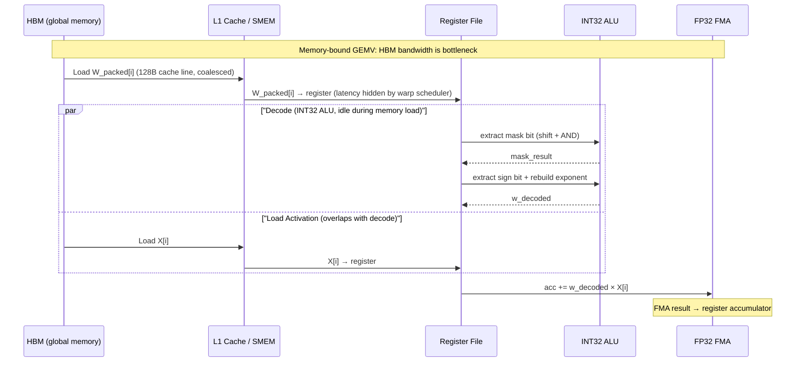

# 知识库_kernel调度

## Sparse Decode Kernel (per-query, per-head, token-level sparsity, 稀疏解码kernel)

术语是什么？回答尽量完整，回答逻辑链中每一步都解释出来。通过联网搜索让回答具体和精准。
稀疏解码 kernel（Sparse Decode Kernel）是一种 GPU kernel，在 LLM decode 阶段仅对 KV cache 中被稀疏索引选中的少量 token 执行 attention 计算，而非全量 dense attention。关键特性：(1) 支持 per-query、per-head 的 token 级别不规则稀疏——不同 batch 元素的不同 query head 可以有不同的选中 token 集合；(2) 无块结构（block sparsity）约束——稀疏模式完全自由，每个 head 可以选择任意位置的 token；(3) 基于 FlashInfer 的 paged KV-cache 后端实现。该 kernel 证明了即使是高度不规则的稀疏模式也能在现代 GPU（H100）上转化为显著的 wall-clock 加速，与"必须块稀疏才能加速"的传统观点相反。

从kernel调度角度拆解术语，比如术语所在kernel调度的伪代码或具体计算过程，给出具体例子。通过联网搜索让回答具体和精准。
```
# 稀疏 decode kernel 伪代码 (H100, GQA Hq=32, Hkv=8, D=128, page_size=16, NHD layout)
def sparse_decode_kernel(Q, sparse_indices, sparse_weights, kv_page_table, page_size=16):
    # Q: (B, Hq, d)
    # sparse_indices: (B, Hq, k)  - 每个 query-head 选中的 token 位置
    # sparse_weights: (B, Hq, k)  - 对应 attention weight
    # kv_page_table: 页表，映射 logical token idx → (physical page, offset)

    B, Hq, d = Q.shape
    k = sparse_indices.shape[-1]

    # === GPU Grid 配置 ===
    # grid: (B, Hq // GQA_ratio) blocks, 每个 block 处理一个 KV head group
    # block: 128-256 threads, 利用 d=128 维度的连续访问

    # === Step 1: Gather K, V from paged KV cache ===
    # 对每个选中的 token，通过页表定位物理地址
    K_sparse = zeros(B, Hq, k, d)   # or (B, Hkv, k, d) with GQA broadcast
    V_sparse = zeros(B, Hq, k, d)

    for b in range(B):
        for hq in range(Hq):
            hkv = hq // GQA_ratio              # GQA: Hq=32, Hkv=8, ratio=4
            for idx in range(k):
                token_pos = sparse_indices[b, hq, idx]
                page_id = token_pos // page_size
                offset  = token_pos % page_size
                phys_addr = kv_page_table[page_id] * page_size + offset
                # 利用 d=128 的连续读取（coalesced memory access）
                K_sparse[b, hq, idx] = load_from_hbm(phys_addr, d)  # 128 FP16 values
                V_sparse[b, hq, idx] = load_from_hbm(phys_addr + kv_stride, d)

    # === Step 2: 分块 attention 计算 (FlashInfer 风格) ===
    # 由于 k << N，可选策略：
    # - k 极小时（k < 256）：直接计算，不分子块
    # - k 较大时：沿 k 维度分块，使用 online softmax

    for b in range(B):
        for hq in range(Hq):
            # 使用 sparse_weights 或重新计算 softmax
            scores = Q[b, hq] @ K_sparse[b, hq].T / sqrt(d)  # (k,)
            if sparse_weights is not None:
                attn_w = sparse_weights[b, hq]                 # 预计算的权重
            else:
                attn_w = softmax(scores)                       # (k,)
            output[b, hq] = attn_w @ V_sparse[b, hq]          # (d,)

    return output  # (B, Hq, d)
```

关键性能洞察：
- HBM 读取量从 O(N·d) 降至 O(k·d)，直接缓解 decode 阶段的 memory bandwidth bottleneck。
- d=128（head dimension）提供足够的连续内存访问来摊销不规则随机 gather 的开销——每个 token 的 K/V 向量是 128 个连续的 FP16 值（256 bytes），可以在一个 coalesced memory transaction 中读取。
- GQA 下（Hq/Hkv=4），每个 KV head 被 4 个 query head 共享，减少了 gather 的重复开销。

术语一般如何实现？如何使用？通过联网搜索让回答具体和精准。
在 "Inference Time Context Sparsity" 论文中，稀疏 decode kernel 基于 FlashInfer（flashinfer.ai）的 paged KV-cache 后端实现。评估配置：H100 80GB HBM3，FP16，GQA Hq=32/Hkv=8/D=128/page_size=16/NHD layout/128K context，batch size B ∈ {1,4,8,16}。不含索引器的 kernel-only 加速比 vs FlashInfer dense：

| B | 2× | 10× | 50× | 100× | 500× |
|---|-----|------|------|-------|-------|
| 1 | 0.32× | 1.45× | 5.57× | 10.25× | 11.14× |
| 8 | 0.38× | 1.90× | 8.88× | 16.82× | 76.14× |
| 16| 0.45× | 2.21× | 10.54×| 20.09× | 76.77× |

关键结论：GQA 下 ~10× 稀疏度 break-even（vs FlashInfer dense），50-500× 稀疏度下 5.5-76× 加速。大 batch 下加速比更高（更多并行度摊销 gather 开销）。加入 Double Sparsity 索引器后，MHA 下 2× 稀疏即 break-even，GQA 下 10-20× 稀疏 break-even。

涉及论文标题：
- Inference Time Context Sparsity

## Factored Iteration (分解迭代)

术语是什么？

Factored Iteration 是 FuseFlow 在生成 SAMML 数据流图时采用的**迭代空间分解策略**。与 Global Iteration（将所有输入的坐标空间合并为一个 n 维全局迭代空间）不同，Factored Iteration 将 n 维稀疏迭代空间**分解为多个 pairwise（二元）子空间**，每个子空间处理一对输入张量的坐标对齐，中间结果通过 streaming 流式传递到下一个子空间。

Factored Iteration 的数学直觉：对于 $D_{il} = \sum_{k,j} A_{ik} B_{kj} C_{jl}$：
- **Global Iteration**：4 维联合遍历 `(i, k, j, l)`，在所有维度上同时做坐标 intersect/union
- **Factored Iteration**：拆为两个 3 维子空间——`(i, k, j)` 处理 $E_{ij} = \sum_k A_{ik} B_{kj}$，然后 `(i, j, l)` 处理 $D_{il} = \sum_j E_{ij} C_{jl}$

从kernel调度角度拆解术语：

Factored Iteration 在 SAMML 图中的空间布局（对应图 11 右侧）：
```
Global Iteration 数据流图:
  ┌─────────────────────────────────────┐
  │  Input Iteration (单一大子图)        │
  │  LS_A → LS_B → Intersect → LS_C →  │
  │  Intersect → LS_D → ...            │
  │  (n 维坐标流全部在此合并)            │
  └─────────────────────────────────────┘
           ↓
  ┌─────────────────────────────────────┐
  │  Computation (单一大子图)            │
  │  Val_A → Val_B → ALU× → Val_C →    │
  │  ALU× → Red → Output               │
  └─────────────────────────────────────┘

Factored Iteration 数据流图 (FuseFlow):
  ┌──────────────────────┐
  │ Input Iter 1: i,k,j  │   子空间 1: 3 维坐标处理
  │ LS_A→LS_B→Intersect  │
  └──────────────────────┘
           ↓
  ┌──────────────────────┐
  │ Compute 1: A×B→E     │   子空间 1: 计算产生中间结果 E
  │ ALU×→Red             │
  └──────────────────────┘
           ↓ (E 通过 streaming 流式传递)
  ┌──────────────────────┐
  │ Input Iter 2: i,j,l  │   子空间 2: 3 维坐标处理
  │ E_stream→LS_C→Inter  │
  └──────────────────────┘
           ↓
  ┌──────────────────────┐
  │ Compute 2: E×C→D     │   子空间 2: 计算产生最终结果 D
  │ ALU×→Red             │
  └──────────────────────┘
```

**为什么选择 Factored Iteration？**
论文给出了两个关键原因（Section 3）：
1. **Coordinate Explosion**：稀疏 ML 模型含多个高阶张量和混合稀疏/稠密索引。Global iteration 的坐标 intersect/union 操作数量随维度指数增长——每个额外维度可能引入大量仅出现在一个张量中的坐标需要被处理（过滤掉）。
2. **Complexity**：Factored iteration 的每个子空间仅处理二元操作，坐标处理开销受控。虽然 factored iteration 可能错过 global iteration 能跳过的一些冗余计算，但在稀疏 ML 场景下，坐标处理开销远大于冗余计算开销。

**Tradeoff**：Factored iteration 在减少坐标处理开销的同时，可能增加计算量（因为每个子空间独立判断哪些坐标参与计算，无法跨子空间全局优化）。这是 sparse-specific 的 space-time tradeoff——类似于稠密计算中 tiling 在内存和计算之间的权衡。

术语一般如何实现？如何使用？

Factored iteration 在 FuseFlow 中通过 **Fusion Table IR** 自动实现——fusion table 的行结构天然产生 factored iteration，因为每行独立处理一个索引变量的坐标流，行间的计算可以交错执行。FuseFlow 将 factored iteration 作为默认策略（对比 Custard/Stardust 的 global iteration 默认策略），且当前版本不提供切换到 global iteration 的选项——论文认为对稀疏 ML，factored 总是优于 global。

涉及论文标题：
- FuseFlow

---

## Dataflow Ordering (数据流排序)

术语是什么？

Dataflow Ordering 是指在数据流计算中，**选择张量索引变量的遍历嵌套顺序**。对于同一个稀疏张量代数表达式（如 $T_i = B_{ij} C_j$），存在多种等效的 dataflow order（如 $j \to i$ 的 Gustavson 算法和 $i \to j$ 的 inner product 算法），每种 order 对应不同的坐标处理开销、计算数据局部性和渐进复杂度。

Dataflow order 的选择直接影响：
1. **渐进复杂度**：对 CSR 矩阵，$j \to i$（先列后行 → concordant 与 innermost 为列的压缩格式配合）是 O(nnz)，$i \to j$（先行后列 → 与 CSR 的列压缩不匹配需要额外查找）可能退化。
2. **坐标处理量**：不同 order 下 intersect/union 操作的输入 token 量不同。
3. **中间结果复用**：不同 order 影响 value stream 的复用模式（如对同一行的所有列重用某个值）。

从kernel调度角度拆解术语：

以嵌套矩阵乘法（GCN 的 $\hat{A}_{il} X_{lj} W_{jk}$，3 个 matmul）为例：

```
可能的 dataflow orders (嵌套循环视角):
  Order A: i → l → j → k   (先遍历 A 和 X 的公共维度 l)
  Order B: i → k → l → j   (先遍历 W 的维度 k)
  Order C: j → k → i → l   (从结果维度 j 开始)

在 SAMML 图中，不同 order 体现为 fusion table 的不同行顺序:
  Order A fusion table rows: [i, l, j, k, val]
  Order B fusion table rows: [i, k, l, j, val]
  Order C fusion table rows: [j, k, i, l, val]

性能差异 (图 18):
  Order A (最优): baseline (1.0× normalized latency)
  Order C (最差): ~29× slower
  
搜索空间 (Table 4):
  无约束 GCN: 最多 ~10^15 种 dataflow order (capped evaluation at 2×10^8)
  施加每 kernel 最优局部约束后: 6.3×10^7 种 (68.5% 缩减)
  无约束 GraphSAGE: 3.9×10^7 → 1.1×10^3 (99.9% 缩减)
```

**POG 在 Dataflow Ordering 中的作用**：
FuseFlow 的 POG 编码了所有局部约束（mode order + 用户指定的 dataflow order），通过 topological sort 输出合法全局 dataflow order 的枚举。用户可以选择特定 order（如第一个 topological sort 结果，默认策略）或遍历所有合法 order 进行 autotuning。

术语一般如何实现？如何使用？

Dataflow ordering 在 FuseFlow 中通过以下方式控制：
- **用户调度**：通过修改 Linalg affine maps 指定局部 dataflow order
- **POG 约束**：未指定的 order 保持自由，POG 枚举所有合法组合
- **默认策略**：选择第一个 valid topological sort（论文中所有 benchmark 的默认行为）
- **Autotuning**：Lacouture et al. [NeurIPS 2025 Workshop] 提出的 LLM-guided autoscheduling 可自动选择最优 dataflow order

涉及论文标题：
- FuseFlow

---

## Sparsity Blocking (稀疏分块)

术语是什么？

Sparsity Blocking 是一种**将 block-sparse 张量的密集块（dense block）映射到数据流硬件最内层迭代的优化技术**。在这类张量中，非零元素以固定大小的稠密子块（如 16×16）形式组织，而非完全非结构化的单个非零值。

Sparsity blocking 的工作原理：
1. **外层稀疏迭代**：在 block 级别进行稀疏坐标处理（LS → Intersect/Union），跳过全零块——保留稀疏数据流的减少无效计算的优势。
2. **内层稠密 block 处理**：当确定某个 block 包含非零值时，将整个 block 作为连续数据流送入 vectorized ALU——利用稠密计算的 SIMD 并行性和连续内存访问。

从kernel调度角度拆解术语：

Sparsity blocking 的伪代码（以 block-sparse 矩阵乘法为例）：
```
输入: A_{ik} [I×K, block size B], X_{kj} [K×J, dense]

// 外层: 稀疏 block 迭代
for i_block in range(0, I, B):           // 行 block
  for k_block in range(0, K, B):         // 公共维度 block
    if A[i_block][k_block] is nonzero:   // LS 稀疏过滤
      // 内层: 稠密 block 计算
      for bi in range(B):                // block 内行
        for bk in range(B):              // block 内列
          for j in range(0, J, B):       // X 的稠密 block
            for bj in range(B):
              // 标准的稠密矩阵乘法 (在 vectorized ALU 上执行)
              T[i_block+bi][j+bj] += A[i_block+bi][k_block+bk] * X[k_block+bk][j+bj]
```

在 SAMML 图中的实现：
```
外层 LS (block 级):
  LS(A_i_block) → LS(A_k_block) → Intersect(k_block, X)
  每个 block 坐标迭代一次（跳过全零 block）

内层 Dense Block Stream:
  当 LS 确认某 block 非零后:
  ┌──────────────────────────────────────┐
  │ Vectorized ALU (处理 B×B 的 tile)     │
  │ 连续读取 A 和 X 的 dense sub-block   │
  │ SIMD 风格的乘加操作                   │
  │ 吞吐量 = B² MACs / cycle             │
  └──────────────────────────────────────┘
```

术语一般如何实现？如何使用？

FuseFlow 通过将 dense blocks 映射到最内层坐标实现 sparsity blocking——外层压缩坐标存储 block 索引（稀疏），内层 dense block 坐标作为连续维度（稠密）。用户通过命令行参数指定 block size。图 17 显示 BigBird attention 的 block sparse 性能随 block size 增长——更大的 block size 提供更好的计算密度（更多连续 MACs），但可能引入更多冗余计算（block 内包含更多零值）。

涉及论文标题：
- FuseFlow

---

## Warp Specialization

术语是什么？

Warp Specialization（Warp 特化）是一种 GPU kernel 编程技术，将 CTA（Cooperative Thread Array，即 thread block）内的 warps 按功能角色划分为 producer（数据搬运）和 consumer（计算），利用 GPU 的异步执行能力实现数据搬运与计算的重叠。在 FlashAttention 系列（FA3/FA4）中，producer warps 专责通过 TMA（Tensor Memory Accelerator）从 HBM（GMEM）异步加载 Q、K、V tile 到 SMEM；consumer warps 分为 MMA warpgroups（驱动 tensor core 执行矩阵乘法）和 softmax warpgroups（执行逐元素指数/最大值/求和）。通过 warp 级别的显式同步（而非整个 CTA 的 barrier），不同 warp 角色的操作可以在时间上重叠执行。

从kernel调度角度拆解术语：

```
FlashAttention-4 Warp Specialization 布局 (per CTA):
CTA 由 4 个 warpgroups 组成，每个含 128 threads (4 warps):

  Warpgroup 0 (MMA driver):   驱动 TMA 加载 + tensor core MMA
  Warpgroup 1 (Softmax A):    处理 Q tile A 的 softmax (max reduction → exp → row sum)
  Warpgroup 2 (Softmax B):    处理 Q tile B 的 softmax
  Warpgroup 3 (Correction):   执行 output rescaling (从关键路径解耦)

Ping-pong 调度时序 (以 forward 为例):

时间轴 →
MMA driver:   [load Q_A,K] [MMA S_A][MMA O_A] [load Q_B,K] [MMA S_B][MMA O_B]
Softmax A:    [idle      ] [softmax S_A        ] [idle      ] [softmax S_A (next)]
Softmax B:    [idle      ] [idle               ] [softmax S_B] [idle              ]
Correction:   [idle      ] [idle               ] [rescale O_A] [rescale O_B       ]

关键: Softmax A 和 MMA driver 在不同 warpgroups 上并行 → softmax 延迟被 MMA 隐藏
      Correction warpgroup 从关键路径分离 → rescaling 不阻塞下一次 MMA 启动
```

与 FA3 的关键差异：
- FA3: MMA accumulator 在寄存器中 → 4 threads/row interleaved → 需要 inter-warp shuffle 做 row reduction
- FA4: MMA accumulator 在 TMEM 中 → 每 thread 处理一整行 (128 elements) → 无需 inter-warp shuffle，更大的 tile (128×128 vs 64×128)

术语一般如何实现？如何使用？

- **CUDA 实现**：通过 `cooperative_groups` API 创建 warp-level groups，使用 `sync()` 在 warpgroup 内部同步（而非 `__syncthreads()` 的 CTA 级 barrier）
- **CuTe-DSL 实现**：FA4 全部用 CuTe-DSL 嵌入 Python 实现，通过 warpgroups 抽象管理 warp 角色分配
- **TMA (Tensor Memory Accelerator)**：Hopper+ 的硬件异步数据搬运单元，producer warps 通过 TMA 指令从 GMEM → SMEM 异步加载数据，不占用 CUDA core 计算资源
- **适用条件**：需要硬件支持异步执行（Hopper SM 架构及以上，Blackwell 进一步增强为 fully asynchronous MMA）
- **性能关键**：warpgroup 间的同步粒度需精细设计，避免 producer-consumer 间的 stall；Blackwell 的 TMEM 解耦了 accumulator 存储与 SMEM，使流水线设计更灵活

涉及论文标题：
- FlashAttention-4

---

## 2-CTA MMA Mode (Cooperative CTA Pair Matrix Multiply)

术语是什么？

2-CTA MMA Mode 是 NVIDIA Blackwell GPU 引入的一种协作矩阵乘法模式，允许同一个 thread block cluster 内的两个 CTA 协同执行单次 tensor core MMA 操作。在该模式下，MMA tile 的 M 维度从单 CTA 的 128 扩展到 256（可选项），两个 CTA 沿 M 维度分区 accumulator（各负责 128 行），并沿 N 维度分区 B 操作数（每个 CTA 只 stage 一半的 B tile 到自己的 SMEM，硬件在乘法时自动合并 B）。这减少了每个 CTA 的 SMEM 容量和带宽需求（每个 CTA 只需存一半 B 操作数），且两个 CTA 的 TMEM 可跨 CTA 访问（通过 DSMEM 辅助数据交换）。FA4 在后向 pass 中利用 2-CTA 模式将共享内存流量从 3328 cycles 降至 2688 cycles（约 19% 减少），并将 dQ 的全局 atomic add 次数减半。

从kernel调度角度拆解术语：

```
1-CTA MMA (标准模式):
  CTA 单独执行 MMA (M=128, N=128, K=d)
  A[M,K] 来自 SMEM/TMEM, B[K,N] 全部来自 SMEM
  每个 CTA 需完整加载 B tile (K×128 elements)

2-CTA MMA (Blackwell 协作模式):
  CTA_0 + CTA_1 协同执行 MMA (M=256, N=128, K=d)
  
  操作数分区:
    A tile: 沿 M 维度分区
      CTA_0: A[0:128, :]    (前 128 行)
      CTA_1: A[128:256, :]  (后 128 行)
    B tile: 沿 N 维度分区
      CTA_0: B[:, 0:64]     (前 64 列, 存于 CTA_0 SMEM)
      CTA_1: B[:, 64:128]   (后 64 列, 存于 CTA_1 SMEM)
    硬件自动合并 B 的完整视图进行乘法
    Accumulator: 沿 M 维度分区
      CTA_0: C[0:128, :]    (写入 CTA_0 TMEM)
      CTA_1: C[128:256, :]  (写入 CTA_1 TMEM)

FlashAttention-4 后向 2-CTA 应用 (dQ 步骤, 图 3):
  dQ = dS @ K (M × d, 归约轴 N)
  
  问题: 2-CTA 模式下 dQ 归约轴 (N) 在两个 CTA 间分区，
        但每个 CTA 需要完整归约 → 冲突！
  
  解决 (DSMEM):
    1. CTA_0 和 CTA_1 计算各自的 dS tile (各 M/2 × N)
    2. 通过 DSMEM 交换半个 dS tile:
       CTA_0 → DSMEM: dS_0[:, N/2:N]  (后半)
       CTA_1 → DSMEM: dS_1[:, 0:N/2]  (前半)
       CTA_0 ← DSMEM: dS_1[:, 0:N/2]  (获得 CTA_1 的前半)
       CTA_1 ← DSMEM: dS_0[:, N/2:N]  (获得 CTA_0 的后半)
    3. 现在每个 CTA 拥有: dS_own (M/2 × 2N) = 完整 2N 归约轴
    4. CTA pair 执行 UMMA: dQ = dS_own (M/2, 2N) × K (2N, d) → (M/2, d)
    5. 每个 CTA 只写一半的 dQ tile → 全局 atomic add 减半!
```

SMEM 流量对比 (backward, M=N=d=128):
|                    | 1-CTA (M=128) | 2-CTA (M=256) |
|--------------------|---------------|---------------|
| MMA operand SMEM   | 2048 cycles   | 1536 cycles   |
| dS write           | 256           | 256           |
| dS DSMEM exchange  | 0             | 384           |
| dQ write + read    | 1024          | 512           |
| Total SMEM         | 3328          | 2688          |
| vs MMA compute     | +30%          | +5%           |

术语一般如何实现？如何使用？

- **硬件要求**：NVIDIA Blackwell GPU (B200/GB200)，需要 thread block cluster 支持（同一 GPC 内的 CTA pair）
- **约束**：(1) CTA 必须以固定 pair 启动（不能动态配对）；(2) 整个 kernel 中 TMEM 和 tensor core 操作必须一致使用 2-CTA 模式（不能混合 1-CTA/2-CTA）；(3) 两个 CTA 必须在同一 cluster 内（共享 GPC）
- **DSMEM (Distributed Shared Memory)**：Blackwell 支持的跨 CTA SMEM 访问机制，位于同一 cluster 的 CTA 可直接读写对方的 SMEM。FA4 用于 dQ 步骤中的 dS tile 交换
- **适用场景**：当 SMEM 带宽而非 MMA 成为瓶颈时（如 FA4 backward），2-CTA 模式通过减少每个 CTA 的 B 操作数加载量来缓解 SMEM 瓶颈
- **在 FA4 中的使用**：后向 pass 的 S, dP, dV, dK MMA 使用 M=256 2-CTA tile；dQ 使用 M=128 双倍归约 2N=256

涉及论文标题：
- FlashAttention-4

---

## Ping-pong Pipeline (Warpgroup-level Double Buffering)

术语是什么？

Ping-pong Pipeline（乒乓流水线）是 FlashAttention-3/4 中使用的一种 warpgroup 级别的双缓冲调度策略。CTA 同时处理两个 Q tile（记为 tile A 和 tile B）。当 tile A 的 softmax 在两个 softmax warpgroups 上计算时，tile B 的 MMA 操作（QK^T 和 PV）在 MMA warpgroup 上执行，反之亦然。通过 warpgroups 之间的异步执行和精细同步（仅同步关键区段），softmax 的计算延迟被隐藏在 MMA 执行期间。FA4 在 FA3 基础上改进：(1) 利用 TMEM 存储 P（替代寄存器），将 output rescaling 从 softmax 关键路径解耦到独立的 "correction" warpgroup；(2) 每线程处理一整行（128 elements），消除 FA3 的 inter-warp shuffle。

从kernel调度角度拆解术语：

```
FA4 Forward Ping-pong 时序 (Gantt 视图):

时间轴 t0 → t1 → t2 → t3 → t4 → ...
         |<---- iteration j ---->|<---- iteration j+1 ---->|

Warpgroup 0 (MMA):   [S^L MMA][P^L V MMA]  [S^H MMA][P^H V MMA]
Warpgroup 1 (Smax H):[softmax S^H          ]                [softmax S^H(next)]
Warpgroup 2 (Smax L):                [softmax S^L          ]
Warpgroup 3 (Corr):  [rescale O^H    ]                [rescale O^L    ]

符号说明:
  S^H = Q_high @ K^T  (tile A)     S^L = Q_low @ K^T  (tile B)
  P^H = softmax(S^H)               P^L = softmax(S^L)
  rescal O^H = e^{Δm} × O_previous (对 tile A 的历史输出 rescale)

关键重叠:
  t0-t1: MMA 计算 S^L + Smax H 计算 softmax(S^H) → 并行!
  t1-t2: MMA 计算 P^L V + Smax L 计算 softmax(S^L) → 并行!
  t2-t3: MMA 计算 S^H + Smax H 计算 softmax(S^H(next)) → 并行!
  Corr 在 MMA 和 Smax 之间插入,不阻塞主流水线

TMEM 管理:
  TMEM 总容量: 256KB / SM
  分配: 2× 128×128×2bytes = 64KB (两个 Q tile 的 output accumulator)
        剩余 TMEM 用于 S/P 存储 (两个 S tile 或 四个 P tile)
  FA4 选择: 两个 S tile + 重叠的 P tile (允许立即计算两个 S tile 启动流水线)
```

与 FA3 对比:
| 方面            | FA3 (Hopper)                | FA4 (Blackwell)                |
|----------------|-----------------------------|--------------------------------|
| Accumulator    | 寄存器 (64×128 tile)         | TMEM (128×128 tile)            |
| Thread/row     | 4 threads interleaved       | 1 thread/row (128 threads)     |
| Row reduction  | inter-warp shuffle          | 无需 (每 thread 处理整行)       |
| Rescaling      | 在 softmax warp 内完成       | 独立 Correction warpgroup       |
| Max tile size  | 64×128                      | 128×128 或 256×128 (2-CTA)     |

术语一般如何实现？如何使用？

- **实现要求**：需要 GPU 支持 warp-level 异步执行（Hopper+ 架构），以及 warpgroup 级别的显式同步（`cooperative_groups::sync()` 在 warpgroup scope）
- **同步策略**：两个 softmax warpgroups 必须在关键区段（指数计算部分）互斥，避免同时竞争 MUFU 单元；但非关键部分可自由重叠
- **Registers 管理**：每线程处理 128 elements 需要 128 registers (BF16 input) + 64 registers (FP32 output) + miscellaneous → 需精细管理避免 register spill
- **适用场景**：attention 计算中 softmax 和 MMA 的时间占比相近时，乒乓流水线效果最佳（roofline 分析中 $T_{\text{exp}} \approx T_{\text{MMA}}$ 时）

涉及论文标题：
- FlashAttention-4

---

## Longest-Processing-Time-First (LPT) CTA Scheduling

术语是什么？

LPT（最长处理时间优先）调度是 FlashAttention-4 引入的一种 CTA（thread block）grid 调度策略，源自经典的 makespan 最小化理论 [Graham 1969]。在 attention kernel 中，不同 CTA 处理的工作量可能差异很大：causal masking 下靠近对角线的 tile 有效计算更多（被 mask 掉的元素少）；variable sequence length (varlen) 下不同 batch 的序列长度差异悬殊。LPT 调度将工作量最大的 tile 优先分配给 SM 处理，使后续的短 tile 可以"填满"各 SM 的空闲时间，最小化整体 makespan（总执行时间）。

从kernel调度角度拆解术语：

```
LPT for Causal Masking (FA4):

标准 grid 遍历顺序 (naive):
  Grid: (mblocks, heads, batches)
  遍历: mblock_0, mblock_1, ..., mblock_{N-1} (升序)
  → 先处理短 tile (靠近对角线远端, 大量被mask), 后处理长 tile
  → SM 在前期负载不足, 后期长 tile 成为瓶颈

LPT 遍历顺序 (FA4):
  Grid: batches (最外层) → section of heads (L2 cache 容量内) → mblocks (降序)
  遍历: mblock_{N-1}, mblock_{N-2}, ..., mblock_0 (降序)
  → 先处理长 tile (靠近对角线, 计算量大), 后处理短 tile
  → 短 tile 填充长 tile SM 的尾部空闲 → makespan 最小化

具体实现:
  batches 作为最外层 → 同一 batch 的 tile 共享 KV cache 在 L2
  section of heads → 确保 L2 cache 不 thrash (heads 分片不超 L2 容量)
  reverse mblock → LPT 核心: 最长 tile 优先

MHA causal 收益: +4-8% FLOPS (on H200)
MQA-8 causal 收益: +7-14% FLOPS (on H200)

---

LPT for Variable Sequence Length (FA4):

问题: 不同 batch 可能有不同的 query 和 KV 序列长度
      (如 mixed batching: prefill batch + decode batch)

解决方案:
  1. 预处理 kernel 读取 per-batch seqlen metadata
  2. 按 max per-worktile 执行时间排序 batches
  3. 生成 virtual→actual batch index mapping
  4. Attention kernel 按 sorted order 遍历 batches
  5. Mapping metadata 可缓存 (重复调用无排序开销)

效果: 消除 varlen 场景下的 CTA load imbalance
```

术语一般如何实现？如何使用？

- **理论基础**：LPT 是最经典的并行机器调度算法之一（Graham 1969），在多台同构机器上最小化 makespan 的近似比为 4/3 - 1/(3m)
- **GPU 适配**：FA4 将 SM 视为同构并行机器，每个 CTA 视为一个 job，CTA 的 mainloop 迭代次数作为处理时间估计
- **L2 cache 考虑**：纯 LPT 可能导致 L2 cache thrash（不同 batch 间 KV 不共享），FA4 的改进是将 batches 作为最外层并在 head section 内做 LPT
- **适用条件**：任何存在 load imbalance 的 GPU kernel（causal masking, varlen, sparse patterns, MQA/GQA with varying head counts）
- **varlen 实现**：预处理 kernel 排序开销只需一次；mapping metadata 常驻 device memory，后续 kernel 调用直接读取

涉及论文标题：
- FlashAttention-4

---

## Deterministic Backward Pass with Semaphore Lock

术语是什么？

FlashAttention-4 的确定性后向 pass 是一种通过 semaphore lock 序列化全局内存归约（atomic add）来消除 backward 中非确定性的执行模式。在标准 attention backward 中，多个 CTA 可能同时向同一 dQ tile 执行全局 atomic add（因为 KV 序列被多个 CTA 分段处理），不同执行顺序导致浮点舍入差异。FA4 的确定性模式通过：（1）每个 dQ tile 关联一个 semaphore lock；（2）CTA 按预定义顺序获取锁 → 执行 atomic add → 释放锁（递增 semaphore 计数器）；（3）Memory fence 确保 semaphore 写入的 device-wide 可见性。结合 2-CTA 模式将 atomic add 次数减半，以及 SPT（shortest-processing-time-first）调度最小化锁等待，FA4 的确定性 backward 达到非确定性 1-CTA 的 75% 性能。

从kernel调度角度拆解术语：

```
确定性 backward CTA 调度 (SPT for causal):

Semaphore lock 协议:
  每个 dQ tile (M×d) 关联一个 semaphore counter
  初始化: semaphore = 0

  CTA 执行流程:
    1. 计算 dQ 贡献 (local tile)
    2. 等待 semaphore == expected_order (按预定顺序获取锁)
       while (atomic_load(semaphore) != my_turn) { spin_wait(); }
    3. Memory fence (__threadfence())  // 确保 device-wide 可见性
    4. 执行 atomicAdd(dQ_global[row, col], dQ_local[row, col])
    5. Memory fence
    6. 释放锁: atomicAdd(semaphore, 1)  // 通知下一个 CTA

SPT (Shortest-Processing-Time-First) 调度 (causal masking):
  Causal masking 下不同 CTA 的 mainloop 长度差异显著
  SPT 策略:
    - KV blocks: 降序遍历 (最远的先处理)
    - Query blocks: 从对角线位置升序遍历
    - dQ reduction: 按 query block index 降序
      效果: 首次 dQ write 时所有 CTA 都不会被 stall

性能:
  非确定性 1-CTA backward:  baseline (100%)
  确定性 1-CTA backward:    约 50-60% (锁争用开销大)
  确定性 2-CTA backward:    约 75%  (atomic add 减半 + SPT 调度减少等待)
  (百分比相对于非确定性 1-CTA)

性能开销来源:
  (1) Memory fence: ~数十 cycles/CTA (确保 semaphore 全局可见)
  (2) Spin-wait stall: 当 CTA 等待前一 CTA 完成时阻塞
       SPT 调度将首次 dQ write 的等待时间降至 0
```

术语一般如何实现？如何使用？

- **适用场景**：强化学习训练（同一 random seed 需 bitwise 可复现的梯度）、调试和验证（排除浮点非确定性作为 bug 根源）
- **实现方式**：CUDA atomic 操作 + `__threadfence()` 或 `__threadfence_system()`（取决于是否需要跨 device 可见性）
- **非确定性来源**：浮点加法不满足结合律，不同 atomic add 顺序产生不同舍入结果（差异通常在最后几位 ULP）
- **FA4 优化**：2-CTA 模式将 dQ atomic add 减半（每个 CTA 只写一半 tile → CTA pair 各写各的，无需 atomic）；SPT 调度消除首次写入的锁等待
- **限制**：确定性模式在 load-imbalanced 场景下性能退化更严重；naive CTA 顺序选择会显著增加 stall

涉及论文标题：
- FlashAttention-4

---

## Distributed Shared Memory (DSMEM)

术语是什么？

Distributed Shared Memory (DSMEM) 是 NVIDIA Blackwell GPU 引入的跨 CTA 共享内存访问机制。位于同一 thread block cluster（同一 GPC）内的 CTA 可以直接读写其他 CTA 的 shared memory（SMEM），而无需通过 global memory 中转。DSMEM 的硬件基础是 GPC 内共享的 crossbar 互连，允许一个 CTA 的 SMEM 地址空间对同 cluster 内其他 CTA 可见。在 FlashAttention-4 中，DSMEM 用于 2-CTA backward dQ 步骤：两个 CTA 通过 DSMEM 交换各自 dS tile 的一半，使每个 CTA 都能构建完整的 2N 归约轴，从而实现 2-CTA MMA 的 dQ 计算。

从kernel调度角度拆解术语：

```
DSMEM 在 FA4 Backward dQ 中的使用:

初始状态:
  CTA_0: dS_0 (M/2 × N), 需要归约 K (N × d) → dQ_0 (M/2 × d)
  CTA_1: dS_1 (M/2 × N), 需要归约 K (N × d) → dQ_1 (M/2 × d)
  问题: 每个 CTA 只有 N 列归约轴, 但 2-CTA UMMA 需要 2N 列

DSMEM 交换流程:
  Step 1: CTA_0 写 dS_0[:, N/2:N] → DSMEM (CTA_1 的 SMEM 地址空间)
          CTA_1 写 dS_1[:, 0:N/2] → DSMEM (CTA_0 的 SMEM 地址空间)
  
  Step 2: Barrier 同步 (cluster 级别)
  
  Step 3: CTA_0 现在拥有: dS_0[:, 0:N] (本地) + dS_1[:, 0:N/2] (DSMEM) 
           → 拼接为 dS_combined_0 (M/2 × 2N)
          CTA_1 现在拥有: dS_1[:, 0:N] (本地) + dS_0[:, N/2:N] (DSMEM)
           → 拼接为 dS_combined_1 (M/2 × 2N)
  
  Step 4: CTA pair 执行 UMMA:
          dQ_0 = dS_combined_0 (M/2, 2N) × K (2N, d) → (M/2, d)
          dQ_1 = dS_combined_1 (M/2, 2N) × K (2N, d) → (M/2, d)

SMEM 开销: DSMEM 交换引入 384 cycles (M=N=d=128 时)
  但通过减半 B 操作数加载 (2048 → 1536) 和减半 dQ 写 (1024 → 512) 弥补
  总 SMEM: 1-CTA 3328 → 2-CTA+DSMEM 2688 cycles
```

术语一般如何实现？如何使用？

- **硬件要求**：NVIDIA Blackwell GPU (B200/GB200)，需要 CTA 在同一 thread block cluster 内
- **与 SMEM 的关系**：DSMEM 本质上是 SMEM 地址空间的 cluster 级扩展，每个 CTA 的 SMEM 对同 cluster 内其他 CTA 可读可写
- **同步**：需要 cluster 级别的 barrier（`cooperative_groups::cluster` 或 PTX `barrier.cluster`）确保 DSMEM 交换完成
- **适用场景**：需要跨 CTA 数据交换的协作 kernel，如 reduction（FA4 dQ）、halo exchange（stencil 计算）、all-to-all 通信模式
- **限制**：(1) 仅在同一 GPC 内的 CTA 间可用；(2) 增加了 SMEM 流量（DSMEM 走 crossbar 而非 local SMEM bank）；(3) 需要额外的 cluster barrier 同步开销

涉及论文标题：
- FlashAttention-4

---

## Fused Persistent Decode Kernel (Single-Launch Multi-Stage Decode Kernel, 融合持久化解码内核)

术语是什么？

Fused Persistent Decode Kernel 是一种将 LLM decode 阶段 attention 计算的多个阶段融合到单次 CUDA kernel launch 中的 GPU kernel 设计模式。"Persistent"指 kernel 使用 persistent thread block 设计——CTA 在 kernel 生命周期内持续驻留在 SM 上，处理多个工作项而非一次性的 tile 计算。"Fused"指将多个原本分离的操作（匹配、分类、加载调度、attention 计算、merge、缓存写回）在单次 launch 中完成，消除中间结果的 HBM 往返和多次 kernel launch 开销。MAC-Attention 的 `mac_persistent_decode_bf16` 是这种设计的典型实例：在一个 kernel 中完成 in-kernel L2 matching → per-head hit/miss classification → load scheduling → partial attention computation (rectification band + tail / full KV) → stable log-sum-exp merge → cache writeback。

从kernel调度角度拆解术语：

```
mac_persistent_decode_bf16 单次 kernel launch 内部执行流程:

Kernel Launch: grid = Hq 个 CTA (每个 CTA 处理一个 head), 持久驻留
│
├─ Stage 1: In-Kernel Matching (SMEM/L2 resident)
│   for i in range(κ):  # κ=512 滑动窗口
│       dist[i] = ||Q_n_pre_rope - Q_ring[i]||_2  # L2 距离, BF16
│   best_idx = argmin(dist)
│   hit = (dist[best_idx] <= τ)  # τ=0.45
│
├─ Stage 2: Load Scheduling (per-head, in-register)
│   if hit:
│       m = n - κ + best_idx  # 匹配 token 绝对位置
│       KV_load_range = [m-r, n]  # r=256 rectification band + tail
│       A_reuse = A_ring[best_idx]  # 复用缓存的 attention
│   else:
│       KV_load_range = [0, n]  # 完整 KV cache
│       A_reuse = None
│
├─ Stage 3: Attention Computation (tiled, FlashInfer-style TMA)
│   if hit:
│       # 并行计算两段 attention
│       A_band = attn(Q_n, K_{m-r~m}, V_{m-r~m})  # rectification band
│       A_tail = attn(Q_n, K_{m~n}, V_{m~n})      # KV tail
│       # Amend: online softmax downdate + update
│       A_prefix = online_softmax_downdate(A_m, Q_m, K_{m-r~m}, V_{m-r~m})
│                 ⊕ online_softmax_update(A_band)
│       # Complete: numerically stable log-sum-exp merge
│       A_n = logsumexp_merge(A_prefix, A_tail)
│   else:
│       A_n = full_attention(Q_n, K_{0~n}, V_{0~n})  # standard
│
├─ Stage 4: Cache Writeback (register → SMEM → global memory)
│   Q_ring[write_ptr] = Q_n_pre_rope
│   A_ring[write_ptr] = A_n
│   write_ptr = (write_ptr + 1) % κ
│
└─ Return: A_n (BF16, Hq×d)
```

**持久化融合设计的优势**：传统方案需多次 kernel launch——(1) matching kernel → HBM 写回匹配结果 → (2) attention kernel → HBM 写回 attention → (3) merge kernel → HBM 写回修正结果 → (4) cache update kernel。Fused persistent kernel 将所有阶段在 SMEM/register 中串联，仅最终 A_n 写回 HBM，消除 3 次中间 HBM 往返。

术语一般如何实现？如何使用？

- **实现方式**：MAC-Attention 使用 CUDA C++ 实现（`mac_decode_persistent.cu`），通过 `torch.utils.cpp_extension` JIT 编译加载。相关辅助 kernel 包括 `mac_decode_rope_preserve.cu`（fused RoPE/query 保存）、`mac_merge_downdate_cache.cu`（prefill cache 合并/downdate）、`mac_prefill_update_cache.cu`（prefill cache 更新）。
- **精度配置**：主计算 BF16（利用 H100 Tensor Core MMA），partial workspace 可选 FP32（`MAC_PERSISTENT_PARTIAL_FP32=1`）保证 amend/merge 阶段的数值稳定性。
- **适用 GPU**：NVIDIA Hopper (H100) 及以上（需 BF16 Tensor Core 支持），CUDA 13.0。
- **CUDA Graph 兼容性**：benchmark 模式下需禁用 CUDA graph（`MAC_DISABLE_CUDA_GRAPH=1`），因为 ring cache 状态更新可能导致 graph capture/replay 不一致。
- **per-head 独立性**：每个 head 独立决定 hit/miss → 不同 head 的 KV 访问范围不同 → kernel 内部 load scheduler 为每个 head 计算不同的 page table 访问范围。

涉及论文标题：
- MAC-Attention Match-Amend-Complete Attention for Efficient Long-Context Inference

---

## Ring Cache for Attention State Reuse (注意力状态复用的环形缓存)

术语是什么？

Ring Cache for Attention State Reuse 是 MAC-Attention 中用于缓存近期 query 和 attention output 的滑动窗口数据结构。它是一个固定大小 κ（默认 512）的 FIFO 环形缓冲区，存储最近 κ 个 decode token 的 (pre-RoPE Q, attention output A) 对。新 token 的结果从尾部写入，最旧的条目从头部驱逐。该 ring cache 是 MAC-Attention Match 阶段的搜索空间——query 匹配仅在此窗口内进行，既避免无限增长的内存开销，又保证匹配到的 query 足够近（位置差 ≤ κ），从而使 Amend 阶段的 rectification band 计算量可控。

从kernel调度角度拆解术语：

```
Ring Cache 在 fused persistent kernel 中的操作:

逻辑数据结构:
  Q_ring: BF16[κ, Hq, d]  # 滑动窗口 pre-RoPE queries (global memory)
  A_ring: BF16[κ, Hq, d]  # 滑动窗口 attention outputs (global memory)
  write_ptr: int (每个请求独立维护, 在 kernel 参数中传递)

Matching 搜索窗口 (in-kernel):
  if n < κ:
      valid_range = [0, write_ptr)   # ring 未填满
  else:
      valid_range = [0, κ)           # ring 已满, 搜索全部 κ 个条目

  # L2 搜索在共享内存中执行 (Q_ring 预加载到 SMEM)
  best_idx = argmin_{i ∈ valid_range} Σ_{j=0}^{d-1} (Q_n_pre[j] - Q_ring[i,j])²
```

**内存分析**：对于 Hq=32, d=128, κ=512：Q_ring: 512×32×128×2 bytes ≈ 4 MB, A_ring: 4 MB, 总共 ~8 MB。可完全驻留在 H100 的 L2 cache (50 MB) 中，使 matching 的内存访问几乎全部命中 L2。

术语一般如何实现？如何使用？

- **与 paged KV cache 的关系**：ring cache 是 MAC-Attention 专有的轻量级结构，独立于 SGLang 的 paged KV cache。它缓存的是 attention output（A），而非 KV 本身。大小仅 κ 个条目（~8 MB），而 paged KV cache 可能达到 GB 级别。
- **FIFO 驱逐策略**：最简单的 FIFO 策略，因为 attention 的 temporal locality 意味着最近的 query 最可能与当前 query 语义相似。更复杂的 LRU/MRU 策略不会带来显著收益。
- **多请求隔离**：每个 serving 请求维护独立的 ring cache 实例（Q_ring + A_ring + write_ptr），避免跨请求的 query/attention 混淆。

涉及论文标题：
- MAC-Attention Match-Amend-Complete Attention for Efficient Long-Context Inference

## Two-Step Dequantization for Mixed-Precision GEMM（混合精度GEMM的两步反量化）

术语是什么？回答尽量完整，回答逻辑链中每一步都解释出来。通过联网搜索让回答具体和精准。

Two-Step Dequantization 是 MixLLM 针对 group-wise weight 量化设计的 CUDA kernel 技术。核心问题：group-wise asymmetric 量化中 zero-point `z` 的存在使 `W_q − z` 为 FP16（z 被 scale 乘回），无法利用 int8 Tensor Core。Two-step dequant 的解法：(1) Partial dequant：仅做 `(W_q_uint4 − z)` 将 uint4 转为 int8（关键：uint4 减 uint4 结果在 `[-15,15]` ∈ int8 安全范围）；(2) int8 Tensor Core MMA：`A_q_int8 × (W_q − z)_int8`；(3) FP16 scale multiply：`s_a × s_w × D_int32`。三步分离使 MMA 使用 int8 Tensor Core 而非 FP16 CUDA Core。

从kernel调度角度拆解术语，比如术语所在kernel调度的伪代码或具体计算过程，给出具体例子。通过联网搜索让回答具体和精准。

```
// === Step 1: Partial Dequant（SIMT, CUDA Core）===
// vsub4: NVIDIA intrinsic, 4-way uint8 SIMD subtract
uint4_packed = load_shared_memory(tile_addr)        // packed uint4 [0,15]
W_deq_int8 = vsub4(uint4_packed, z_uint4_broadcast) // int8 [-15,15] ✓

// === Step 2: int8 Tensor Core MMA ===
// mma.sync.aligned.m16n8k32.row.col.s32.s8.s8.s32
asm("mma.sync ..." : "+r"(D) : "r"(A_int8), "r"(W_deq_int8))

// === Step 3: Fast I2F + Scale Multiply ===
// bias trick: accumulator 初始化为 0x4b400000
D_float = uint_as_float(D_int32) - bias_float  // 1 float sub = 免费 I2F
C_fp16 = D_float * s_w * s_a                     // fp16 scale multiply
```

**安全性**：`W_q ∈ [0,15]`, `z ∈ [0,15]` → `W_q−z ∈ [-15,15]`，完全安全在 int8 `[-128,127]` 范围内，不会溢出。

术语一般如何实现？如何使用？通过联网搜索让回答具体和精准。

- **vsub4 intrinsic**：NVIDIA `__vsub4()` 一次 4 个 uint8 减法（packed in 32-bit reg），用于高效 zero-point 减法。
- **为什么不能先乘 scale**：如果 step 1 乘 `s_w`，结果变 FP16→无法进入 int8 Tensor Core。Two-step 的核心是推迟 scale multiply 到 MMA 后。
- **与 smoothQuant W8A8 对比**：标准 int8 GEMM 用 symmetric（z=0）无需 two-step。MixLLM INT4 用 asymmetric（z≠0），two-step 是必要设计。
- **开源**：https://github.com/microsoft/MixLLM。

涉及论文标题：
- MixLLM: LLM Quantization with Global Mixed-Precision between Output and Embeddings

## Fast Int-to-Float (I2F) Conversion（快速整数到浮点转换）

术语是什么？回答尽量完整，回答逻辑链中每一步都解释出来。通过联网搜索让回答具体和精准。

Fast I2F Conversion 是 MixLLM 消除量化 GEMM 中 I2F 指令开销的数值技巧。原理：当 32-bit 整数 `x < 2^23≈8.39×10^6` 时，IEEE 754 float32 中 `x + 0x4b400000` 的 bit pattern 恰好等价于 float32 值 `2^23+x` 的 binary 表示→再减 `2^23` 得 `x`。MixLLM 将 bias 融合进 MMA accumulator 初始化 `D = A*B + bias_int`，使 I2F 开销降为 1 次 float subtract。

从kernel调度角度拆解术语，比如术语所在kernel调度的伪代码或具体计算过程，给出具体例子。通过联网搜索让回答具体和精准。

```
// === 传统方法 ===
D_float = __int2float_rn(D_int32)  // ~4 cycle, 1 warp-sync instr

// === Fast I2F with bias fusion ===
// 1. MMA accumulator 初始化为 bias (0x4b400000) 而非 0
//    asm: "mma.sync ..." : D += A*B, D_init = 0x4b400000
//    → D_biased = A*B + 0x4b400000 (int32)

// 2. 仅需 1 float sub 即完成 I2F
D_float = uint_as_float(D_biased) - 0x4b400000_as_float
//         ^ no-op reinterpret  ^ 1 float sub

// === I2F 完全免费！===
```

**有效性条件**：LLM GEMM 中 int8 MMA accumulator 最大值（W=4096, `127×127×32=516,128`）远小于 `2^23=8.39×10^6`，无需担心 precision loss。

术语一般如何实现？如何使用？通过联网搜索让回答具体和精准。

- **Bias 值 `0x4b400000` 推导**：IEEE float32 exponent=150 → `2^(150-127)=2^23`。加此 bias 后 bit-cast 还原为 `2^23+x` 的 float 表示→减 `2^23`→得 `x`。
- **每 group 开销节省**：group=128 下每个 output element 需要 1 次 I2F per group（共 K/128 次 per element）。K=4096 则为 32 次 I2F per output element。Fast I2F 将这 32 条 I2F 指令替换为"免费"的 float sub（融合进已有 scale multiply 路径）。
- **与 FP8 转换的对比**：FP8（e4m3/e5m2）需要硬件支持的转换指令，Fast I2F 利用 float32 的数学性质绕开显式转换。

涉及论文标题：
- MixLLM: LLM Quantization with Global Mixed-Precision between Output and Embeddings

## Bit-packed Encoding for Bfloat16 Weights (Bfloat16权重位打包编码 / Exponent Bit Reuse)

术语是什么？回答尽量完整，回答逻辑链中每一步都解释出来。通过联网搜索让回答具体和精准。
Bit-packed Encoding for Bfloat16 Weights 是一种利用 Bfloat16 浮点格式指数域（exponent field）中未使用 bit 来嵌入额外 metadata（如 binary mask、sign bit）的技术，实现**零额外存储开销**的元数据编码。Bfloat16 格式分配 1 sign + 8 exponent + 7 mantissa = 16 bits。多项研究（Su et al. 2024, Zhang et al. 2025, Lee et al. 2025a）发现 LLM 权重的指数值高度集中在一个狭窄范围（如 Mixtral-8x7B 的指数集中在 112-128，仅使用 5-bit 范围），8-bit 指数域中约 3 个高位 bit 实际上是"浪费"的。Bit-packed encoding 利用这一观察：将所有指数统一偏移（shift）到 5-bit 范围（0-31），释放 3 个冗余高位 bit 用于嵌入二进制信息。在 PuzzleMoE 中，这 3 个 bit 被用于存储合并 expert 的 mask bit 和 sign bit。

从kernel调度角度拆解术语，比如术语所在kernel调度的伪代码或具体计算过程，给出具体例子。通过联网搜索让回答具体和精准。
**Bfloat16 格式回顾与指数偏移（以 Mixtral-8x7B 为例）**：
```
Bfloat16 bit layout: [15: sign] [14:7: exponent(8)] [6:0: mantissa(7)]

原始指数值域（Mixtral-8x7B experts）: 112-128 (仅使用 5-bit)
偏移操作: exp' = exp - 112  →  值域变为 0-16 (5-bit)
释放的 bit: bit[14], bit[13], bit[12] (原指数的高 3 位)

PuzzleMoE bit-packed 布局:
  bit[15]: sign_i   (expert i 的符号)
  bit[14]: sign_j   (expert j 的符号)
  bit[13]: mask_i   (expert i 的 mask)
  bit[12]: mask_j   (expert j 的 mask)
  bit[11:7]: exp' (5-bit shifted exponent)
  bit[6:0]: mantissa (7-bit, 不变)
```

**On-the-fly 解码的伪代码**（PuzzleMoE Algorithm 1）：
```
输入: W_packed  (Bfloat16 packed weight), expert_pos ∈ {0,1}
输出: W_decoded  (Bfloat16 decoded weight)

mask_bit = (W_packed >> (13 - expert_pos)) & 1   # 提取对应 expert 的 mask bit
if mask_bit == 0:
    return 0.0                                    # pruned weight (mask=0)
sign_bit = (W_packed >> (15 - expert_pos)) & 1    # 提取对应 expert 的 sign bit
exp = (W_packed & 0x0F80) + (112 << 7)            # 重建指数: (5-bit << 7) + base
mantissa = W_packed & 0x007F                       # 保留尾数
W_raw = (sign_bit << 15) | exp | mantissa          # 重建完整 Bfloat16 位模式
return reinterpret_as_bfloat16(W_raw)
```

**指数偏移的精度影响**：论文验证偏移操作无 perplexity 损失（Mixtral-8x7B: 4.37→4.37, Deepseek-MoE: 6.88→6.88），因为 FP16→BF16 转换本身已经做了类似的指数截断处理。

术语一般如何实现？如何使用？通过联网搜索让回答具体和精准。
实现方式：
1. **适用条件**：仅当模型权重的指数分布确实集中在 ≤5-bit 范围时可用。PuzzleMoE 验证了 Mixtral-8x7B、Deepseek-MoE、Qwen1.5-MoE、Qwen3-MoE 均满足此条件。
2. **打包时机**：在 offline 压缩阶段（sparse merging 之后），对 W_{merged} 的每个元素执行指数偏移和 mask/sign bit 插入。
3. **解码时机**：在 GPU inference kernel 中，权重从 HBM 加载到 register 后、乘加计算前，执行 on-the-fly 解码。解码在 INT32 ALU 上完成（GEMV weight-load 路径期间空闲），不增加延迟。
4. **约束条件**：
   - 仅支持 pairwise 合并（2 experts → 1 merged）：需要 2 mask bits + 2 sign bits = 4 bits ≈ 3.58 bits（mask 压缩为 log₂3≈1.58 bit）嵌入 3 个冗余 bit 中。
   - 不支持 3-expert 合并：需要 3 mask bits + 2 sign bits = 5 bits > 3 冗余 bit，且合并 3 expert 导致 PPL 退化（Mixtral 4.36→5.22）。
   - 极端 outlier 权重（指数超出 112-128 范围）需 clamp 处理：指数 <112 的 round up 到 112。
5. **与其他技术的关系**：
   - 与 LEXI（Huffman coding exponents）不同，PuzzleMoE 是 bit-repurposing（重新分配用途）而非 compression（压缩减少 bit）。
   - 与 DFloat11（variable-length exponent）不同，PuzzleMoE 保持 fixed-length Bfloat16 格式，仅改变语义（某些 bit 从"指数"变为"mask/sign"）。
   - 与 eXmY（reduced exponent bits for quantization）不同，PuzzleMoE 不减少数值精度 bit（仍保留 5-bit 指数 + 7-bit 尾数），而是在冗余 bit 上叠加额外信息。
   - 可以叠加在量化之上：PuzzleMoE merging + 3-bit AWQ quantization → 4.8× 总压缩。

涉及论文标题：
- PuzzleMoE

## On-the-fly Weight Decoding in CUDA GEMV Kernels (CUDA GEMV kernel中的即时权重解码)

术语是什么？回答尽量完整，回答逻辑链中每一步都解释出来。通过联网搜索让回答具体和精准。
On-the-fly Weight Decoding 是一种 GPU kernel 设计技术：权重的解压/解码操作不在单独的预处理 kernel 中完成（避免物化完整解码矩阵到 HBM），而是在 GEMV kernel 的数据加载路径上、每个权重从 HBM 到达 register 后立即解码，解码结果直接送入 FMA（fused multiply-add）单元。在 PuzzleMoE 中，解码指从 packed Bfloat16 中提取 mask bit、sign bit 并重建有效 Bfloat16 权重的过程。关键设计原则是：GEMV 是 memory-bound 操作（受限于 HBM 带宽），weight loading 期间 INT32 ALU 空闲——解码利用这些空闲 ALU cycles，不增加 kernel 延迟。

从kernel调度角度拆解术语，比如术语所在kernel调度的伪代码或具体计算过程，给出具体例子。通过联网搜索让回答具体和精准。
**On-the-fly Decoding GEMV kernel 的简化伪代码**（CUDA pseudocode）：
```cuda
// PuzzleMoE GEMV kernel: 每个 thread block 处理输出的一段
__global__ void puzzle_moe_gemv(
    const __nv_bfloat16* W_packed,  // packed Bfloat16 weights (masks+signs embedded)
    const __nv_bfloat16* X,         // input activation
    __nv_bfloat16* O,               // output
    int expert_pos,                 // 0 or 1, which expert in merge pair
    int d, int h
) {
    // 每个线程处理输出的一个元素
    int row = blockIdx.x * blockDim.x + threadIdx.x;
    if (row >= h) return;

    float acc = 0.0f;
    for (int col = 0; col < d; col++) {
        // Step 1: Load packed weight from HBM (合并访存)
        uint16_t w_packed = W_packed[col * h + row];  // coalesced read

        // Step 2: On-the-fly decode (in INT32 ALU, during next load latency)
        int mask_bit = (w_packed >> (13 - expert_pos)) & 1;
        if (mask_bit == 0) continue;  // pruned, skip multiply

        int sign_bit = (w_packed >> (15 - expert_pos)) & 1;
        // Rebuild exponent: extract 5-bit shifted exp + add base offset 112
        int exp = ((w_packed & 0x0F80) >> 7) + 112;
        int mantissa = w_packed & 0x007F;
        uint16_t w_raw = (sign_bit << 15) | (exp << 7) | mantissa;

        // Step 3: Load activation (合并访存) + FMA
        __nv_bfloat16 x_val = X[col];
        __nv_bfloat16 w_val = __ushort_as_bfloat16(w_raw);
        acc += __bfloat16_to_float(w_val) * __bfloat16_to_float(x_val);
    }
    O[row] = __float_to_bfloat16(acc);
}
```

**数据流时间线（简化）**：


术语一般如何实现？如何使用？通过联网搜索让回答具体和精准。
实现方式与使用场景：
1. **Kernel 编写**：通常用 CUDA C++ 或 CuTe-DSL 实现。PuzzleMoE 使用 CUDA C++，通过 `torch.utils.cpp_extension` JIT 编译加载。
2. **Decode 复杂度**：每个权重的解码仅需 ~2 次 bit shift + ~2 次 bitwise AND/OR + 1 次 integer add。在 A100 INT32 ALU 上这些操作吞吐量很高（≥64 ops/clock/SM）。
3. **数据布局要求**：W_{merged} 保持标准 Bfloat16 行优先或列优先布局，无需特殊重组——解码逻辑通过 bitwise ops 操作单个 16-bit 值，与内存布局无关。
4. **适用场景**：
   - MoE 推理中需要从合并权重重建各 expert 的有效权重
   - 任何需要将二进制 metadata（mask, sign, control flags）与浮点权重绑定但不想额外分配存储的场景
5. **与其他方法的对比**：
   - **CSR (Compressed Sparse Row)**：Lasby et al. (2025) 证明 50% 非结构化稀疏下 CSR 格式因索引存储开销反而零内存节省。Bit-packed 方案以零额外存储编码 mask，消除此问题。
   - **Separate Mask Tensor**：显式存储 binary mask 需要额外 ~1/16 内存（1-bit mask per 16-bit weight），且需额外的 HBM 读取和 kernel launch。On-the-fly decoding 避免这种开销。
   - **Pre-decoding Pass**：先 launch 一个 kernel 解码全部权重到临时 buffer，再 launch GEMV kernel。On-the-fly decoding 消除临时 buffer 的 HBM 写入和额外 kernel launch overhead。
6. **性能影响**：PuzzleMoE 在 Mixtral-8x7B 上实现 1.28× end-to-end 推理加速（vs 全模型 dense GEMV）。Decode overhead 在 memory-bound GEMV 中可忽略——ALU 操作被 HBM 延迟完全隐藏。

涉及论文标题：
- PuzzleMoE

## Multi-Level Software Pipeline for Quantized GEMM（量化GEMM的多级软件流水线）

术语是什么？回答尽量完整，回答逻辑链中每一步都解释出来。通过联网搜索让回答具体和精准。

Multi-Level Software Pipeline 是 MixLLM GEMM kernel 的多级流水线重叠策略。利用量化 kernel 的特殊性——dequant（SIMT CUDA Core）和 MMA（Tensor Core）可并行——引入 quantization group tile（128 元素）作为流水线粒度，配合双 buffer（per-group accumulation + global accumulation）实现 Global→Shared→Reg 加载、Tensor Core MMA、SIMT Dequant 四级重叠。

从kernel调度角度拆解术语，比如术语所在kernel调度的伪代码或具体计算过程，给出具体例子。通过联网搜索让回答具体和精准。

```
// 4 级 Software Pipeline
for g = 0 to K/128:  // quantization groups
    // L1: cp.async — 预取下一 group weight/scale 到 shared memory
    cp_async(&smem[next], &gmem[next])

    // L2: 加载当前 group activation 到 register
    A_reg = smem_activation[g]

    // L3: SIMT Dequant（CUDA Core，与 L4 并行）
    W_deq = vsub4(smem_weight[g], smem_zero[g])

    // L4: Tensor Core MMA（与 L3 并行）
    mma_sync(&per_group_accum, A_reg, W_deq)

    // Group 边界: per-group reduction
    // I2F + scale mul → 累加到 global_accum
    val = uint_as_float(per_group_accum) - bias_float
    global_accum += val * scale[g]
    per_group_accum = {bias}  // 重置（bias 初始化）

// Epilogue: fp16 conversion + multi-precision scatter
C_fp16 = fp16(global_accum)
```

**量化组 tile 的作用**：group=128 意味着每 128 个 K 维度元素需切换 scale/zero→成为流水线自然 "flush" 边界。per-group reduction（I2F+scale mul）在此时执行，避免跨 group 的 int32 accumulator 溢出（不同 group 的 scale 不同不能直接累加）。

术语一般如何实现？如何使用？通过联网搜索让回答具体和精准。

- **Prepacked weight layout**：离线将 weight 重排为 group tile 连续格式，使 L1 `cp.async` 合并访问。
- **双 buffer 设计**：per_group_accum（int32+bias）存 MMA 输出；global_accum（float32）存 scale multiply 后结果。将 I2F+scale 从 MMA 关键路径分离。
- **与 FlashAttention-3 对比**：FA3 是 warp-specialized 3 级流水（producer→consumer→MMA）；MixLLM 额外利用 dequant 可在 SIMT 上与 MMA 并行的特性增加第 4 级。

涉及论文标题：
- MixLLM: LLM Quantization with Global Mixed-Precision between Output and Embeddings

---

## Spatio-Temporal Regularity in GPU Memory Allocation（GPU内存分配的时空规律性）

术语是什么？回答尽量完整，回答逻辑链中每一步都解释出来。通过联网搜索让回答具体和精准。
Spatio-Temporal Regularity（时空规律性）是 STAlloc 发现的 LLM 训练中 GPU 内存分配请求在两个维度上表现出的高度规律性：(1) **Spatial Regularity（空间规律性）**：allocation size 高度重复——由于 Transformer 层的结构重复，一个训练 iteration 内虽有 ~10^5 次 allocation，但仅有 ~32 种 distinct tensor sizes（>512-byte 的请求中）；(2) **Temporal Regularity（时间规律性）**：tensor lifespan 分为三种固定类别——Persistent tensors（weights/gradients/optimizer states，训练全程驻留）、Scoped tensors（forward 分配 → backward 释放的 activations，LIFO 顺序）、Transient tensors（分配后立即释放的中间结果，如 ReLU 输入、recomputation 下的 activations）。这种规律性在应用 optimization techniques（VPP、recomputation、ZeRO）后依然存在，因为 Transformer 层的结构重复性和 training iteration 的一致性不受 optimization 类型影响。

从kernel调度角度拆解术语：

```
LLM 训练一次 iteration 的 allocation/free timeline:

时间线 →
  t0: Persistent alloc —— weights, grads, optimizer states
       [===================================================] 全程驻留
  t1-t3: Scoped tensors (microbatch 0 forward)
       [AAAAAAA][BBBBBBB][CCCCCCC]  forward allocation, LIFO
  t4-t5: Transient tensors (ReLU 中间结果)
       [T][T][T][T][T]  分配后立即释放
  t4-t6: Scoped tensors (microbatch 0 backward)
       [...CCCC...][...BBBB...][...AAAA...]  backward, 逆序释放

Spatial Regularity 统计（Figure 3）:
  Llama2-7B: ~50K requests, ~32 distinct sizes (>512-byte)
  即使 requests 数量随 optimization 增加 30%, distinct sizes 不变
```

术语一般如何实现？如何使用？通过联网搜索让回答具体和精准。
- **发现方法**：STAlloc 的 Allocation Profiler 使用原生 cudaMalloc/cudaFree 精确记录每个 request 的 size、timestamp、computation phase。统计 distinct sizes 和 lifespan patterns。
- **实际意义**：这两种规律性是 STAlloc 能通过离线规划解决 NP-hard 内存分配问题的前提。LLM 训练恰好提供这种规律性（源于重复的 Transformer 结构）。
- **适用范围**：Dense Transformer（规律性最强）、MoE Transformer（dynamic layers 部分破坏，但 static layers 保持）、CNN（层结构不重复 → 弱）、GAN（训练不收敛 → 弱）。

涉及论文标题：
- Reducing GPU Memory Fragmentation via Spatio-Temporal Allocation Planning (STAlloc)

---

## Dynamic Reusable Space（动态可复用空间）

术语是什么？回答尽量完整，回答逻辑链中每一步都解释出来。通过联网搜索让回答具体和精准。
Dynamic Reusable Space 是 STAlloc 在 Static Allocation Plan 中预先标识的、可供 dynamic allocation requests（如 MoE expert tensors）安全复用的空闲地址区间。核心洞察：static 和 dynamic allocations 的峰值通常不出现在同一时刻——static 峰值在 forward midpoint（大量 activations 活跃），dynamic 峰值在 expert layer 执行时。Dynamic Reusable Space 让 dynamic requests 复用 static pool 的空闲区域。

从kernel调度角度拆解术语：

```
预计算（Plan Synthesizer, offline）:
  for each HomoLayer Group G(a,b) (共享同一 model layer pair):
    T(a,b) = [layer_a.start, layer_b.end]
    A_o = union of address ranges of static requests overlapping T(a,b)
    A_i(a,b) = 总地址空间 - A_o  // 空闲区间集合

Runtime 使用（Dynamic Allocator）:
  当 dynamic request m 到达:
    1. 识别 HomoLayer Group G(m.l_s, m.l_e)
    2. A_c = A_a ∩ A_i  (当前空闲 ∩ pre-identified reusable)
    3. 在 A_c 中 best-fit 分配
    4. 无法满足 → fallback Caching Allocator
```

术语一般如何实现？如何使用？通过联网搜索让回答具体和精准。
- **效果**（Table 3）：启用 dynamic reuse 后 fallback 量下降 24.9%（with recomputation）。Layer 粒度（vs phase 粒度）提供更精细的 temporal precision。
- **限制**：(1) 依赖 dynamic lifespan 可预测（MoE 中成立）；(2) static/dynamic peak 时间需不同——若完全重叠，reusable space 很小。

涉及论文标题：
- Reducing GPU Memory Fragmentation via Spatio-Temporal Allocation Planning (STAlloc)

---

## Best-Fit Memory Allocation Policy（最佳匹配内存分配策略）

术语是什么？回答尽量完整，回答逻辑链中每一步都解释出来。通过联网搜索让回答具体和精准。
Best-Fit Allocation Policy 是一种经典的动态内存分配策略：收到大小为 s 的 request 时，遍历所有空闲内存块，选择其中 ≥ s 且与 s 差值最小的 block（"最佳匹配"），从中切出大小为 s 的 chunk，剩余部分保留为新的 free block。PyTorch CUDA Caching Allocator 使用 best-fit 作为核心分配策略。其局限（STAlloc 的核心动机）：是 **online** 策略——仅基于当前空闲块快照决策，对 tensor lifespan 一无所知。局部最优导致全局碎片——early-allocated persistent tensor 放在地址空间中段，后续 transient tensors 在其周围留下碎小空洞，无法聚合成足够大连续空间。

从kernel调度角度拆解术语：

```
PyTorch Caching Allocator Best-Fit 碎片化示例:
  初始: [               free 100MB            ]
  分配 A(30MB): [A:30MB][       free 70MB     ]
  分配 B(20MB): [A:30MB][B:20MB][  free 50MB  ]
  释放 A:      [free 30MB][B:20MB][  free 50MB ]
  分配 C(40MB): → 最大连续 free = 50MB → OK
                [free 30MB][B:20MB][C:40MB][free 10MB]
  释放 B:      [free 30MB][free 20MB][C:40MB][free 10MB]
  分配 D(45MB): → 需要 45MB, 最大 free = 30MB → FAIL (OOM)
                  总 free = 60MB, 但碎片化导致无连续 45MB!

STAlloc 解决: 预知 A 和 B 的 lifespan → 将 A 和 B 紧密排列
  避免 A 释放后的空洞与后续 C 的位置冲突
```

术语一般如何实现？如何使用？通过联网搜索让回答具体和精准。
- **PyTorch 实现**：`CUDACachingAllocator.cpp` 使用 `std::set` 管理 free blocks（按 size 排序），best-fit 通过 `lower_bound` 搜索。
- **替代策略**：First-fit（更快但碎片更多）、Buddy system（大小限定为 2^k，合并高效但内部碎片大）、Slab allocator（适合大量同 size 小对象）。
- **在 STAlloc 中**：Dynamic Allocator 在 Dynamic Reusable Space 中仍使用 best-fit（dynamic size 不可预测），但 static path 完全绕过 best-fit 使用 O(1) 预计算地址查找。

涉及论文标题：
- Reducing GPU Memory Fragmentation via Spatio-Temporal Allocation Planning (STAlloc)

---

## INT8 Tensor Core Attention Kernel (SageBwd, INT8 Tensor Core 注意力Kernel)

术语是什么？回答尽量完整，回答逻辑链中每一步都解释出来。通过联网搜索让回答具体和精准。

INT8 Tensor Core Attention Kernel (SageBwd kernel) 是 Zhang et al. (2025c) 提出的基于 OpenAI Triton 实现的可训练 INT8 注意力 CUDA kernel。与标准 FlashAttention kernel（全 FP16 Tensor Core MatMul）不同，SageBwd kernel 在 tiled FlashAttention 框架中嵌入 per-block INT8 量化/反量化操作，将 7 个 attention MatMul 中的 6 个映射到 GPU INT8 Tensor Core（`mma.sync.aligned.m16n8k32.row.col.s32.s8.s8.s32`），仅保留 dP = dO·V⊤ 使用 FP16 Tensor Core。

Kernel 的核心创新不在 tiling 策略（直接继承 FlashAttention），而在**选择性量化调度**：识别出 dP MatMul 是精度瓶颈（量化 dP 会通过 dS 路径产生灾难性误差放大），对其保留 FP16，对其余 MatMul 使用 INT8。这种"混合精度 kernel"设计在单次 kernel launch 中动态切换 INT8/FP16 Tensor Core 指令——通过 Triton 的 `tl.dot(input_precision="int8")` vs 默认 `tl.dot` (FP16) 实现。

从kernel调度角度拆解术语，比如术语所在kernel调度的伪代码或具体计算过程，给出具体例子。通过联网搜索让回答具体和精准。

SageBwd 前向 kernel 的 Triton-level 伪代码（单 thread block 处理一个 Q tile）：

```python
@triton.jit
def sagebwd_fwd_kernel(Q, K, V, O, L, 
                        B_q: tl.constexpr, B_kv: tl.constexpr, d: tl.constexpr):
    # 获取当前 Q tile
    q_offset = tl.program_id(0) * B_q * d
    Q_i = tl.load(Q + q_offset + tl.arange(0, d)[None, :])  # (B_q, d) in SRAM

    # K-smoothing + per-block INT8 量化 Q_i
    s_Q = tl.max(tl.abs(Q_i)) / 127
    Q_hat_i = tl.round(Q_i / s_Q).to(tl.int8)

    # FlashAttention online softmax 状态
    m_i = tl.full((B_q,), float('-inf'), dtype=tl.float32)
    l_i = tl.zeros((B_q,), dtype=tl.float32)
    O_acc = tl.zeros((B_q, d), dtype=tl.float32)

    for j in range(0, N, B_kv):
        # 加载 K_j, V_j tile
        K_j = tl.load(K + j*d + ...)  # (B_kv, d) in SRAM
        V_j = tl.load(V + j*d + ...)  # (B_kv, d) in SRAM

        # Per-block INT8 量化 K_j
        s_K = tl.max(tl.abs(K_j)) / 127
        K_hat_j = tl.round(K_j / s_K).to(tl.int8)

        # INT8 QKᵀ MatMul (Tensor Core)
        S_int = tl.dot(Q_hat_i, tl.trans(K_hat_j), input_precision="int8")
        S_ij = S_int.to(tl.float32) * s_Q * s_K  # dequant

        # Online softmax (FP32)
        m_new = tl.maximum(m_i, tl.max(S_ij, axis=1))
        P_tilde = tl.exp(S_ij - m_new[:, None])
        l_new = l_i * tl.exp(m_i - m_new) + tl.sum(P_tilde, axis=1)

        # Per-token INT8 量化 P (PV MatMul)
        s_P = tl.max(tl.abs(P_tilde), axis=1) / 127  # per-row scale
        P_hat = tl.round(P_tilde / s_P[:, None]).to(tl.int8)

        # Per-block INT8 量化 V_j
        s_V = tl.max(tl.abs(V_j)) / 127
        V_hat_j = tl.round(V_j / s_V).to(tl.int8)

        # INT8 PV MatMul (Tensor Core)
        O_int = tl.dot(P_hat, V_hat_j, input_precision="int8")
        O_tmp = O_int.to(tl.float32) * s_P[:, None] * s_V

        # Online softmax rescaling
        O_acc = O_acc * tl.exp(m_i - m_new)[:, None] + O_tmp
        m_i, l_i = m_new, l_new

    O_acc = O_acc / l_i[:, None]  # final normalization
    tl.store(O + q_offset + ..., O_acc.to(tl.float16))
    tl.store(L + ..., m_i + tl.log(l_i))  # save logsumexp for backward
```

SageBwd 反向 kernel 的混合精度调度：

```python
@triton.jit
def sagebwd_bwd_kernel(..., dO, Q_hat, K_hat, s_Q, s_K, s_V, O, L):
    # dP = dO @ V^T (FP16 MatMul —— 不量化!)
    dP_ij = tl.dot(dO_i, tl.trans(V_j))  # FP16 Tensor Core

    # dV = P^T @ dO (INT8 MatMul)
    P_hat, s_P = quantize_int8(P_ij)     # per-block
    dO_hat, s_dO = quantize_int8(dO_i)   # per-block
    dV_acc += tl.dot(tl.trans(P_hat), dO_hat, input_precision="int8") * s_P * s_dO

    # dS = P ∘ (dP - D) → INT8 quantize
    dS_ij = P_ij * (dP_ij - D_i[:, None])
    dS_hat, s_dS = quantize_int8(dS_ij)  # per-block

    # dQ = dS @ K (INT8 MatMul)
    dQ_acc += tl.dot(dS_hat, K_hat_j, input_precision="int8") * s_dS * s_K

    # dK = dS^T @ Q (INT8 MatMul)
    dK_acc += tl.dot(tl.trans(dS_hat), Q_hat_i, input_precision="int8") * s_dS * s_Q
```

术语一般如何实现？如何使用？通过联网搜索让回答具体和精准。

- **Triton 实现**：SageBwd 使用 OpenAI Triton（https://github.com/triton-lang/triton）编写 kernel。Triton 的 `tl.dot` 支持 `input_precision="int8"` 参数，自动生成 INT8 Tensor Core MMA PTX 指令（`mma.sync.aligned.m16n8k32.row.col.s32.s8.s8.s32`）。
- **INT8 scale 格式**：对称均匀量化 `δ = max(|X|)/127`，无 zero point。Per-block 粒度与 FlashAttention tile 对齐（B_q ~ 128, B_kv ~ 64），保证 scale 因子由 tile 内全部元素共享。
- **反量化**：`S_fp = S_int32 × δ_A × δ_B`。Triton 中先执行 INT8 `tl.dot`（输出 int32 accumulator），再用 float32 乘法乘 scale。两个 scale 都是 FP32 标量（per-tile），乘法开销可忽略。
- **FP16 回退**：仅 dP = dO·V⊤ 使用 FP16 Tensor Core（`tl.dot` 默认 `input_precision="fp16"`）。FP16 MMA 指令为 `mma.sync.aligned.m16n8k8.row.col.f32.f16.f16.f32`。
- **Kernel 性能**：RTX 4090 上 head dim=128 时达到 FA2 1.67× 吞吐（前向+反向合计）。INT8 Tensor Core 的理论吞吐为 FP16 的 2×（RTX 4090: INT8 660 TOPS vs FP16 330 TOPS），实际加速 <2× 因为：(1) 量化/反量化开销；(2) dP 保持 FP16；(3) non-matmul 操作（softmax, exp, reduce）仍为 FP32/FP16。
- **与 FlashAttention3 FP8 kernel 的对比**：FA3 FP8 使用 e4m3 FP8（需 H100+ 硬件支持），仅支持前向推理；SageBwd INT8 使用标准 INT8 Tensor Core（Turing+ 即支持，更广泛兼容），支持前向+反向训练。
- **开源**：https://github.com/thu-ml/SageAttention（预计 2025 年 7 月 15 日开源）

涉及论文标题：
- SageBwd

## Block-wise Sparse+Linear FlashAttention Kernel（分块稀疏+线性混合 FlashAttention Kernel）

术语是什么？回答尽量完整，回答逻辑链中每一步都解释出来。通过联网搜索让回答具体和精准。

Block-wise Sparse+Linear FlashAttention Kernel 是 SLA2 在 FlashAttention 基础之上构建的自定义 CUDA kernel，将稀疏 softmax attention 和线性 attention 统一在一个 block-wise 双循环框架中。kernel 根据预计算的路由 mask M_c ∈ {0,1}^{T_m×T_n} 对每个 Q-KV block pair 动态分叉执行路径：

- **M_c[i,j] = 1（稀疏路径）**：执行低比特量化 attention matmul（QAT：INT8/FP8 quant→dequant for QKᵀ and PV），融入 FlashAttention 的 online softmax rescaling（m,l 状态维护），输出 O_s 累加
- **M_c[i,j] = 0（线性路径）**：累加局部 KᵀV（h_j = (K_j^φ)ᵀV_j）和归一化因子 z_j = rowsum((K_j^φ)ᵀ)，避免显式 O(N²) 的 QKᵀ 计算

Kernel 最终输出 O = α⊙O^s + (1-α)⊙O^l。

从kernel调度角度拆解术语，比如术语所在kernel调度的伪代码或具体计算过程，给出具体例子。通过联网搜索让回答具体和精准。

SLA2 前向 kernel 伪代码（Algorithm 2 核心逻辑）：

```
输入: Q,K,V ∈ R^{N×d} (FP16), M_c ∈ {0,1}^{T_m×T_n}, b_q,b_k, k%, α
T_m = N/b_q, T_n = N/b_k

# 预处理
K = K - colmean(K)                                   # SageAttention 平滑
Q^φ, K^φ = softmax(Q), softmax(K)                    # linear attn kernel 函数
Q̄ = pool(Q), K̄ = pool(K)                            # 路由压缩

# 分块 Q 和 KV
{Q_i} = split Q into T_m blocks (each b_q × d)
{K_j},{V_j},{K_j^φ} = split into T_n blocks (each b_k × d)

# 预计算线性分支的局部 KᵀV 和归一化
for j in 1..T_n:
    h_j = (K_j^φ)ᵀ @ V_j                               # d×d
    z_j = rowsum((K_j^φ)ᵀ)                             # d×1

# 主循环 (逐 Q block)
for i in 1..T_m:
    m_i = -inf, l_i = 0, O_i^s = 0                    # online softmax 状态
    H_i = 0, Z_i = 0                                   # linear attn 累加器
    
    for j in 1..T_n:
        if M_c[i,j] == 1:                              # === 稀疏路径 ===
            # QAT: 量化 Q_i, K_j
            Q̂_i, s_Q = quant(Q_i)                      # FP16 → INT8/FP8
            K̂_j, s_K = quant(K_j)
            
            # QKᵀ (低比特 matmul on Tensor Core)
            S_ij = dequant(Q̂_i @ K̂_jᵀ, s_Q, s_K) / √d  # b_q×b_k
            
            # Online softmax rescaling
            m_new = max(m_i, rowmax(S_ij))
            P_ij = exp(S_ij - m_new)                    # b_q×b_k
            l_new = l_i * exp(m_i - m_new) + rowsum(P_ij)
            
            # QAT: 量化 P_ij, V_j 然后 PV matmul
            P̂_ij, s_P = quant(P_ij)
            V̂_j, s_V = quant(V_j)
            O_tmp = dequant(P̂_ij @ V̂_j, s_P, s_V)      # b_q×d
            
            O_i^s = diag(exp(m_i - m_new)) @ O_i^s + O_tmp
            m_i, l_i = m_new, l_new
            
        else:                                          # === 线性路径 ===
            H_i += h_j                                  # 累加 KᵀV
            Z_i += z_j                                  # 累加归一化因子
    
    # Q block 完成: 最终归一化
    O_i^s = O_i^s / l_i                                # 除以 softmax normalizer
    O_i^l = Q_i^φ @ H_i / (Q_i^φ @ Z_i)                # linear attn 输出
    
    # α-组合
    O_i = α_i ⊙ O_i^s + (1-α_i) ⊙ O_i^l

输出: O = {O_i} ∈ R^{N×d}
```

反向 kernel (Algorithm 3) 手动推导 Q,K,V,Q^φ,K^φ 梯度，预计算 dH_i, dZ_i 使主循环仅涉及单次矩阵加法，其余参数用 PyTorch autograd。

术语一般如何实现？如何使用？通过联网搜索让回答具体和精准。

- **实现技术**：CUDA kernel 在 FlashAttention 框架上改造。稀疏路径使用 Tensor Core 的 INT8/FP8 MMA 指令加速低比特 matmul；线性路径利用寄存器累加避免 global memory 写回中间结果。K 的列均值减法（colmean）继承自 SageAttention 的数值稳定技术。
- **Block 参数**：b_q=128, b_kv=64，平衡 SRAM 使用和并行度。
- **性能**：RTX 5090 上 97% sparsity 达到 FlashAttn2 的 18.7× 加速。量化（QAT）额外贡献约 1.3×。VMoBA 和 VSA 在 95% sparsity 下分别比 SLA2 (97%) 慢 11.7× 和 2.6×。
- **使用**：替换扩散模型 attention 层的前向+反向 kernel。需要先完成两阶段训练（路由器和 α 训练 + 模型微调）。

涉及论文标题：
- SLA2: Sparse-Linear Attention with Learnable Routing and QAT

---

## Low-bit Attention Quantization (SageAttention2++)（低比特 Attention 量化）

术语是什么？回答尽量完整，回答逻辑链中每一步都解释出来。通过联网搜索让回答具体和精准。

Low-bit Attention Quantization 是将 attention 计算中的矩阵乘法操作数（Q, K, P, V）量化为低比特精度（INT8 或 FP8）以利用 Tensor Core 的低比特 MMA（Matrix Multiply-Accumulate）指令加速计算的技术。SageAttention2++ (Zhang et al., 2025g) 提供了高效的 attention 量化方案，SLA2 在其基础上实现了 QAT 版本的 attention 量化。

量化方案的核心要素：
- **量化对象**：Q, K（QKᵀ matmul 的两个操作数）和 P, V（PV matmul 的两个操作数），四个张量均被量化
- **量化格式**：INT8 或 FP8（论文未指定具体格式，提到遵循 SageAttention2++ 方案）
- **量化粒度**：per-tensor 或 per-block 量化，每个量化张量配有 scale 因子 s 用于反量化
- **QAT 集成**：训练时前向使用低比特量化 attention，反向保持 FP16——SLA2 的独特设计

从kernel调度角度拆解术语，比如术语所在kernel调度的伪代码或具体计算过程，给出具体例子。通过联网搜索让回答具体和精准。

SLA2 中低比特 attention 的量化+反量化流程：

```
# 给定 FP16 的 Q_i, K_j, P_ij, V_j 块

# Step 1: 量化 Q 和 K
Q̂_i, s_Q = quant(Q_i)              # FP16 → INT8/FP8, s_Q 为 scale
K̂_j, s_K = quant(K_j)

# Step 2: 低比特 QKᵀ
S_int = Q̂_i @ K̂_jᵀ                  # INT8/FP8 matmul on Tensor Core
S_ij = dequant(S_int, s_Q, s_K) / √d  # 反量化回 FP16, scale 补偿

# Step 3: Softmax (FP16)
P_ij = softmax(S_ij)                 # FP16 精度 softmax

# Step 4: 量化 P 和 V
P̂_ij, s_P = quant(P_ij)
V̂_j, s_V = quant(V_j)

# Step 5: 低比特 PV
O_int = P̂_ij @ V̂_j                   # INT8/FP8 matmul on Tensor Core
O_tmp = dequant(O_int, s_P, s_V)     # 反量化回 FP16

# Step 6: 累加到 O_i^s (FP16 online softmax rescaling)
```

量化过程的数学表示：
```
quant(x): x̂ = round((x - zero) / scale)  # 映射到离散量化网格
dequant(x̂, scale): x ≈ x̂ * scale + zero  # 反量化回 FP16
```

术语一般如何实现？如何使用？通过联网搜索让回答具体和精准。

- **SageAttention2++ 方案**：https://github.com/thu-ml/SageAttention（Zhang et al., 2025g）。提供 INT4 per-thread 量化和 FP8 量化两种模式，针对 attention 的数值分布特征（Q、K 的平滑化、P 的行归一化特性）设计了专门的量化策略。
- **K 平滑**：量化前对 K 做列均值减法 `K = K - colmean(K)`，减少 K 的数值范围，降低量化误差。这是 SageAttention 系列的关键技术。
- **QAT 的独特价值**：纯后训练量化（PTQ）直接对 attention 做低比特推理会导致显著的精度损失。SLA2 的 QAT 让模型在训练中适应量化误差（前向量化+反向 FP16），使低比特 attention 的精度损失最小化。Ablation 显示去掉 QAT 后视频质量显著下降。
- **加速效果**：低比特量化在 RTX 5090 上额外提供约 1.3× kernel 加速（在已有稀疏加速之上）。
- **局限**：需要微调（不能零样本使用），训练开销增加（前向量化有额外 latency）。

涉及论文标题：
- SLA2: Sparse-Linear Attention with Learnable Routing and QAT

## Expert Parallelism (EP / 专家并行)

术语是什么？回答尽量完整，回答逻辑链中每一步都解释出来。通过联网搜索让回答具体和精准。
Expert Parallelism（EP，专家并行）是 MoE 模型分布式推理/训练中的一种并行策略，核心思想是将不同的 expert FFN 分布到不同的 GPU 上，每个 token 通过 all-to-all communication 被路由到其选中 expert 所在的 GPU。EP 的动机：MoE 的 expert 之间相互独立（无数据依赖），天然适合跨设备并行。在 EP 配置下，每个 GPU 只持有部分 expert 的参数（减少 per-GPU 内存占用），但需要通过 inter-GPU communication 完成 token dispatch（发送 token 到 expert 所在 GPU）和 combine（收集 expert 输出回原 GPU）。EP 适用于 expert 数量多（E >> GPU 数）的场景，可与 Tensor Parallelism (TP) 和 Data Parallelism (DP) 组合使用。

从kernel调度角度拆解术语，比如术语所在kernel调度的伪代码或具体计算过程，给出具体例子。通过联网搜索让回答具体和精准。
EP 的 token dispatch/combine 流程（以 4 GPU, E=128 experts, top-4 gating 为例）：
```
# 每个 GPU 持有 32 个 expert 的参数

# Phase 1: Router + token-to-expert mapping
for each GPU g in parallel:
    scores_g = x_g @ W_gate          # [B_g, 128]
    topk_idx_g = topk(scores_g, k=4)  # [B_g, 4]
    # 构建 dispatch 表: (token_id, src_gpu, dst_gpu, expert_id, score)

# Phase 2: All-to-All token dispatch (通信密集)
all_to_all_scatter(tokens, dispatch_table)  # 每个 token 发到 expert 所在 GPU

# Phase 3: Expert computation (本地)
for each GPU g in parallel:
    for each expert e assigned to GPU g:
        tokens_e = received_tokens[expert_id == e]
        out_e = grouped_GEMM(tokens_e, W1_e) → gelu → @ W2_e

# Phase 4: All-to-All combine (通信密集)
all_to_all_gather(expert_outputs, combine_table)  # 结果发回原 GPU

# Phase 5: Weighted aggregation (本地)
for each token i:
    output[i] = sum(score[i][j] * expert_out[i][j] for j in 1..k)
```

EP 的通信开销由 all-to-all 主导，数据量为 2x（dispatch + combine）× B × d × k/E（每 GPU），随 B 和 d 线性增长。

术语一般如何实现？如何使用？通过联网搜索让回答具体和精准。
- **在 MoE serving 中的角色**：EP 减少 per-GPU 参数存储，使超大 MoE 模型（如 DeepSeek-V3 671B）可在有限 HBM 容量下服务。vLLM、SGLang、DeepSpeed-MoE 均支持 EP。
- **与 TP 的比较**：TP 将单个 expert 的权重矩阵切分到多个 GPU（减少 per-GPU 计算+存储，但引入 all-reduce）；EP 将不同 expert 分布到不同 GPU（减少 per-GPU 存储，但引入 all-to-all）。实际部署中常用 EP+TP 混合：如 8 GPU 的 EP 组 + 每个 EP 组内 4 GPU 做 TP。
- **PIM 场景中的 EP（Sieve 分析）**：PIM 不支持高效的 EP，因为 (1) 所有 PU 在一个 PIM channel 内共享同一 vector operand，不同 bank 无法同时执行不同 expert；(2) commercial PIM 不支持跨 channel 直接通信；(3) EP 在 bimodal distribution 下导致某些 channel 过载、某些空闲（Figure 10）。因此 Sieve 在 PIM 侧采用 tensor parallelism 而非 expert parallelism。
- **EPLB**：Expert Parallelism Load Balancer 是 DeepSeek 提出的 expert 重分配策略，运行时根据 expert 负载动态迁移 expert 到不同 GPU，Sieve 兼容 EPLB。

涉及论文标题：
- Sieve

## Grouped GEMM (分组批量矩阵乘法)

术语是什么？回答尽量完整，回答逻辑链中每一步都解释出来。通过联网搜索让回答具体和精准。
Grouped GEMM（分组批量矩阵乘法）是一种 GPU kernel 优化技术，将多个不同维度的矩阵乘法操作合并到单个 kernel 调用中执行，避免多次 kernel launch overhead。在 MoE 推理中，多个 expert 的 FFN 计算对应多个独立但结构相似的 MatMul（如 W1: [N_i, d] × [d, d_ff] 和 W2: [N_i, d_ff] × [d_ff, d]，不同 expert 的 N_i 不同）。Grouped GEMM 将这些 MatMul 合并，kernel 内部按 expert 分组，每组独立执行自己维度的 MatMul。典型实现：CUTLASS grouped GEMM API、vLLM/SGLang 的 fused MoE kernel、Triton 的 tl.dot with block pointers。在 Sieve 中，GPU 侧的 popular experts 通过 grouped GEMM 高效执行。

从kernel调度角度拆解术语，比如术语所在kernel调度的伪代码或具体计算过程，给出具体例子。通过联网搜索让回答具体和精准。
Grouped GEMM 的 kernel 调度伪代码：
```
输入: experts_G = [(tokens_1, W1_1, W2_1), ..., (tokens_m, W1_m, W2_m)]
      # m 个 GPU-assigned experts, tokens_i 的 shape = [N_i, d]

# 单个 fused kernel 替代 m 个独立 kernel launch
kernel fused_moe_experts:
    for each expert i in 1..m:
        # 第一层 FFN
        for block_row in tiles(N_i):
            for block_col in tiles(d_ff):
                C[block_row, block_col, i] += A[block_row, :] @ B[:, block_col]  # tile-level GEMM

    # 激活函数
    C = gelu(C)

    for each expert i in 1..m:
        # 第二层 FFN
        for block_row in tiles(N_i):
            for block_col in tiles(d):
                C2[block_row, block_col, i] += C[block_row, :] @ W2[:, block_col]
```

关键优化：(1) 将 m 个 kernel launch 减为 1 个，消除 launch overhead；(2) 权重矩阵可预加载到 shared memory 供多 tile 复用；(3) 不同 expert 的 N_i 不同，kernel 通过 group_offsets 数组索引各 expert 的数据起始位置。

术语一般如何实现？如何使用？通过联网搜索让回答具体和精准。
- **框架支持**：CUTLASS 提供 `grouped_gemm` API；vLLM 的 `fused_moe` kernel 是 MoE grouped GEMM 的典型实现；Triton 通过 `tl.dot` + block pointers 实现；SGLang 在 FlashInfer backend 中集成 fused MoE kernel。
- **与 batch MatMul 的区别**：batch MatMul 要求所有 batch 内矩阵维度完全相同；grouped GEMM 允许每组维度不同（不同 N_i），通过 offsets 数组管理。
- **在 Sieve 中的使用**：Sieve Scheduler 决定 popular experts（N_i ≥ threshold）在 GPU 上通过 grouped GEMM 执行。GPU 路径的 T_comp 估计假设 grouped GEMM、variable group sizes。
- **其他应用**：multi-head attention 中不同 head 的 projection、multi-query 的 batch 推理等。

涉及论文标题：
- Sieve

## GEMV on PIM (存内计算上的矩阵-向量乘法)

术语是什么？回答尽量完整，回答逻辑链中每一步都解释出来。通过联网搜索让回答具体和精准。
GEMV（General Matrix-Vector Multiplication）是矩阵-向量乘法的标准线性代数操作：y = A·x，其中 A ∈ R^{M×K} 是矩阵，x ∈ R^K 是向量，y ∈ R^M 是结果向量。在 LLM 推理中，batch=1（或 expert 仅收 1 token）时，FFN 的 MatMul 退化为 GEMV（输入 [1, d] × 权重 [d, d_ff] → [1, d_ff]），算术强度极低（~2 FLOPs/byte），是典型 memory-bound 操作。"GEMV on PIM" 特指在 PIM 硬件上执行 GEMV 操作——利用 PIM bank 内部 adder tree 做 dot product，矩阵权重存储在 DRAM bank 内（无需传输到 GPU），仅需广播输入向量到所有 bank，结果回传 GPU。这是 PIM 最高效的使用模式。

从kernel调度角度拆解术语，比如术语所在kernel调度的伪代码或具体计算过程，给出具体例子。通过联网搜索让回答具体和精准。
PIM 上 GEMV 的 kernel 级调度流程：
```
输入: token x ∈ R^d, expert weights W1 ∈ R^{d×d_ff} (已存储在 PIM banks 中)
配置: 32 PIM channels, 24 banks/channel, W1 按 channel 做 tensor parallelism shard

# 每个 channel 上执行 (W1 的 shard 维度: [d, d_ff/32])
# 每个 bank 存储 W1 的一部分行 (d/24 rows per bank)

# Step 1: Broadcast token (GPU → PIM)
PIM_GWRITE(channel=0..31, addr=global_buffer, data=x)  # 广播 x 到所有 channel

# Step 2: GEMV dot product (PIM 内部)
for each channel c in 0..31:
    for each bank b in 0..23:
        row_start = b * (d/24)
        row_end = (b+1) * (d/24)
        partial = adder_tree_dot_product(x[row_start:row_end], W1[row_start:row_end, :])
        # partial ∈ R^{d_ff/32}, 写入 bank local buffer
    # channel c 聚合 24 个 bank 的 partial → channel_result ∈ R^{d_ff/32}

# Step 3: Readback (PIM → GPU)
PIM_READ(channel=0..31, result → GPU on-chip memory[y_start:y_start + d_ff/32])
# GPU 端拼接所有 channel 结果 → 完整 y ∈ R^{d_ff}
```

关键：PIM 上 GEMV 的执行时间不是 token 数的线性函数——DRAM 时序开销（bank contention, row buffer conflicts, tRCD/tRP/tRFC, refresh cycles）主导 latency。Sieve 论文量化：roofline 估计可能高估 PIM GEMV 时间 1.8–4.2×。因此 Sieve Scheduler 使用运行时实测 cost table（exponential moving average of observed GEMV time per token count）而非纯 roofline 模型。

术语一般如何实现？如何使用？通过联网搜索让回答具体和精准。
- **命令接口**：PIM_GWRITE（broadcast vector operand）→ PIM_GEMV（trigger dot product per bank）→ PIM_READ（read results）。接口定义遵循 NeuPIMs [22] 规范，Sieve 复用此接口。
- **Skinny GEMM → GEMV 转换**：当 expert 收到 2-4 个 token（非 1 token GEMV 也非大 GEMM），Sieve 将其转换为串行 GEMV 序列（每个 token 一次 GEMV），在 PIM 上顺序执行。虽然无法利用 GPU Tensor Core 的 GEMM 加速，但避免了 GPU 上 skinny GEMM 的 memory bandwidth 瓶颈。
- **Tensor Parallelism on PIM**：所有 PIM channels 参与每个 GEMV（参数按列 shard），保证即使 expert distribution 极度不均衡，PIM channel 利用率始终为 100%。这是 Sieve 相对于 PIMoE（使用 expert parallelism 导致 channel 利用率波动）的关键优化。
- **局限**：PIM 仅适合 memory-bound 操作（低算术强度）；commercial PIM 不支持跨 channel 通信；PU 无浮点 multiply-accumulate（仅 adder tree + 累加），需多次读取权重矩阵完成多 token GEMV。

涉及论文标题：
- Sieve

## Dynamic Tiling (动态分块)

术语是什么？

Dynamic Tiling 是一种**在运行时根据实际 workload 特征确定 tile size 的 kernel 级调度策略**，与 static tiling（tile size 在编译时固定）相对。其核心思想是：当处理具有数据依赖形状的 tensor 时（如 MoE 中每个 expert 接收的 token 数量不固定），tile size 自适应实际数据量，从而避免 static tiling 的 padding 浪费（大 tile → 浪费 on-chip memory 和 compute）和频繁 off-chip reload（小 tile → memory-bound）。

在 STeP 中，dynamic tiling 通过以下算子组合实现：
- **Promote** 替代 **Reshape**：Reshape 将 stream 按固定 chunk_size 分块并 padding，而 Promote 仅添加一个外层维度，不做 padding。
- **Accum(dynamic)**：后续 Accum 算子累积动态大小的 tile——遇 stop token 时自动结束当前 tile 的累积，无需预知 tile size。

从kernel调度角度拆解术语：

Dynamic Tiling 在 MoE batch dimension 上的调度伪代码：
```
# Static Tiling (baseline):
for each expert e:
    tokens_e = tokens_routed_to(e)        # D_i tokens (dynamic count)
    padded = ceil(D_i / TILE_SIZE) * TILE_SIZE
    for t in range(0, padded, TILE_SIZE):
        tile = pad(tokens_e[t:t+TILE_SIZE])  # pad with zeros if needed
        matmul(tile, weight_e)               # includes wasted FLOPs on padding

# Dynamic Tiling (STeP):
for each expert e:
    tokens_e = tokens_routed_to(e)        # D_i tokens
    inp_stream = Promote(tokens_e)         # [D_i, 1] → [1, D_i, 1]
    # Accum operator dynamically accumulates tiles:
    #   When S_1 stop token arrives → end current tile
    #   Tile size = actual token count, NO padding
    packed = Accum(inp_stream, RetileRow)  # dynamically-sized tiles
    matmul(packed, weight_e)               # zero wasted FLOPs
```

STeP graph 层面的 transform：
```
Static:  [D_i, 1] → Reshape(chunk=4) → [ceil(D_i/4), 4] → Accum → matmul
Dynamic: [D_i, 1] → Promote → [1, D_i, 1] → Accum(dynamic) → matmul
```

关键性能差异来源：
1. **消除 Padding FLOPs**：Static tiling 中 ceil(D_i/TILE_SIZE) 引入的 padding token 参与完整计算，产生无效 FLOPs。例如 batch=64 时 Qwen3-30B-A3B 的 static tiling 总 FLOPs 是 dynamic tiling 的 3.81×（Figure 12）。
2. **按需使用 On-Chip Memory**：Dynamic tiling 不为 padding 分配 on-chip memory，释放的空间可用于更大 tile 或更激进的 operator fusion。
3. **突破 Static Pareto Frontier**：Static tiling 的 Pareto 边界反映 small tile（频繁 off-chip reload）vs large tile（padding 浪费）的 trade-off；dynamic tiling 通过自适应同时消除两者，实现 Pareto Improvement Distance 1.33×~2.11×。

术语一般如何实现？如何使用？

Dynamic tiling 适用于以下场景：
- **MoE 推理**：每个 expert 的 token 数量数据依赖且变化范围大（batch=64 时可能从 0 到 batch_size）。Qwen3-30B-A3B（128 experts, top-8）比 Mixtral-8x7B（8 experts, top-2）收益更大，因为 expert 粒度更细、负载分布更不均匀。
- **Variable-length sequence batching**：不同 request 的序列长度不同时，tile size 可自适应实际长度。
- **Ragged tensor 处理**：如可变分辨率图像、动态 batch size 等场景。
- **Sparse tensor 的 dense block 提取**：稀疏模式下 dense block 大小数据依赖。

实现要点（基于 STeP）：
1. 需要编程抽象支持**动态维度的 shape semantics**（STeP 的 dynamic-regular/ragged dimensions）。
2. 需要**支持动态 tile size 的 Accum 算子**（Accum 的 accumulator 可以具有动态大小）。
3. 需要**显式的 memory hierarchy 控制**（Bufferize 与其他算子配合，最大化数据复用同时最小化 on-chip memory）。
4. 硬件需要支持**非连续内存分配**和**stream 引用到物理地址的动态映射**。

涉及论文标题：
- Streaming Tensor Programs (STeP)

---

## Configuration Time-Multiplexing (配置时分复用)

术语是什么？

Configuration Time-multiplexing 是一种**在具有数据依赖控制流的应用中，将同一套 compute/memory 配置在不同 branch 之间动态时分复用的 kernel 级优化**。其核心思想是：当应用包含多个执行分支（如 MoE 的多个 expert），但每次仅部分分支活跃时，与其为每个可能的分支静态分配专用 compute 和 memory 资源，不如让一套配置在分支间动态切换。这显著提高了资源利用率，释放的资源可重新分配给更多并发请求或更大模型。

在 STeP 中，configuration time-multiplexing 通过在需要时分复用的 compute region 前后插入 control-flow operators 实现：
- **EagerMerge**：将不同 branch 的输入按到达顺序汇聚到时分复用区域（哪个 expert 的 token 先到就先处理）。
- **RandomOffChipLoad**：动态加载当前活跃 branch 的 weight（根据 selector 读取对应 expert 的 weight），替代固定地址的 LinearOffChipLoad。
- **Partition**：将时分复用区域的输出路由回对应 branch。

从kernel调度角度拆解术语：

Configuration Time-multiplexing 在 MoE 中的调度伪代码：
```
# Static configuration (baseline):
for each expert e in parallel:
    dedicated_compute_region[e] = allocate(PEs, MEM)
    dedicated_weight_buffer[e] = preload(weight_e)
for each expert e in parallel:
    result[e] = matmul(tokens_e, dedicated_weight_buffer[e])
# 问题：仅 top-K experts 活跃，但所有 experts 占用资源

# Configuration Time-multiplexing (STeP):
shared_region = allocate(PEs, MEM)  # 单一共享配置
merged_stream = EagerMerge([tokens_0, tokens_1, ..., tokens_N])
# EagerMerge: 按到达顺序输出 token + expert_id
for (tile, expert_id) in merged_stream:
    weight_tile = RandomOffChipLoad(base_addr, expert_id, tile_shape)
    # RandomOffChipLoad: 根据 expert_id 动态读取对应 weight
    result_tile = matmul(tile, weight_tile)
    Partition(result_tile, expert_id)  # 路由回对应 expert 的输出流
```

STeP graph 层面的修改（对比 Figure 7 和 Figure 11）：
```
Baseline MoE graph:
  Partition → [Expert0 Compute Region] → Reassemble
             → [Expert1 Compute Region] ↗
             → ...
  (每个 Expert 有独立的 LinearOffChipLoad + Map(matmul) 链)

Time-multiplexed MoE graph:
  EagerMerge → RandomOffChipLoad(dynamic) → Map(matmul) → Partition
  (单一 compute region，EagerMerge 汇聚输入，RandomOffChipLoad 动态取 weight)
```

关键性能效果（Qwen3-30B-A3B, batch=64）：
- **Static tiling (tile=32)**：compute utilization 提升 2.64×（<1% 性能开销）
- **Dynamic tiling**：compute utilization 提升 2.51×（约 5% 性能开销）
- **资源释放**：释放 62% 片上 compute 资源和 46% 片上 memory 资源
- **适用条件**：expert 激活稀疏时收益最大。Mixtral-8x7B 在 batch=64 时所有 expert 均活跃，因此未应用此优化。Modern MoE（128+ experts, top-8）天然适合。

术语一般如何实现？如何使用？

Configuration time-multiplexing 适用于：
- **Large-scale MoE 推理**：128+ experts 但仅 top-8 激活的模型（如 DeepSeek-V3, Qwen3, Kimi K2, Llama 4, GPT-OSS），资源节省显著。
- **Multi-branch dynamic networks**：任何具有数据依赖分支结构且分支间计算结构相似的应用。
- **Multi-tenant serving**：不同请求可能需要不同模型变体，但共享底层 compute 资源。

实现前提：
1. 编程抽象需要**动态路由和合并算子**（STeP 的 Partition/Reassemble/EagerMerge），支持在 tile（非 scalar）粒度路由。
2. 需要**随机访问 off-chip memory 的能力**（RandomOffChipLoad），而非仅线性访问。
3. 硬件需要**运行时动态激活/去激活 branch** 的能力（predication 或 NoC routing）。
4. 时分复用的 region 内计算结构必须相同或可参数化（如同一 matmul 但 weight 不同）。

涉及论文标题：
- Streaming Tensor Programs (STeP)

---

## Dynamic Parallelization (动态并行化)

术语是什么？

Dynamic Parallelization 是一种**在 parallel region 可用时立即分发 work 的 kernel 级调度策略**，与 static parallelization（编译时固定 assignment）相对。其核心思想是：当并行处理的 workload 大小不均匀时（如 attention decoding 中 KV cache 长度随 request 变化），work dispatch 由 downstream parallel pipeline 的 availability 驱动，而非固定分配。这实现了负载均衡，避免了 static assignment 下因个别长 request 阻塞整个 parallel region 导致的资源空闲。

在 STeP 中，dynamic parallelization 通过以下算子组合实现：
- **Partition**：将 requests 路由到多个 parallel region 之一。
- **Selector Stream 构造**：由两路 merge 而成——FlatMap 做 round-robin 初始分配（确保第一个 iteration 均匀分配），EagerMerge 收集 parallel region 的 availability 信号（当某 region 完成处理并释放时，新的 work 可分配给它）。
- **EagerMerge**：收集各 parallel region 的输出。

从kernel调度角度拆解术语：

Dynamic Parallelization 在 Attention Decoding 中的调度伪代码：
```
# Static Coarse-grained Parallelization (baseline):
requests_per_region = total_requests / num_regions  # fixed assignment
for region r in parallel:
    for request in region_assignment[r]:             # blocked until all done
        kv_len = kv_cache_length(request)            # variable length
        attention(request, kv_len)                   # long requests stall region

# Static Interleaved Parallelization (baseline):
for request_idx in range(total_requests):            # round-robin
    region = request_idx % num_regions
    dispatch(request, region)
# 问题：一个 long-KV-cache request 阻塞整个 region 的后续短 requests

# Dynamic Parallelization (STeP):
# Selector stream construction:
initial_assignment = FlatMap(round_robin_generator)  # initial round-robin
availability_signals = EagerMerge([region_0_done, region_1_done, ...])
merged_selector = EagerMerge([initial_assignment, availability_signals])

# Partition with dynamic selector:
Partition(requests_stream, merged_selector, num_consumers=N)
# 当 merged_selector 指示 region_i 可用时，下一个 request 立即分配给它

for region r in parallel:
    for request in dynamically_assigned:
        attention(request, kv_cache_length(request))
        signal_availability(region_id=r)  # 处理完立即信号可用
```

STeP graph（Figure 16）：
```
Requests → Partition(selector) → [Region0] → EagerMerge → Output
                                → [Region1] ↗
                                → [Region2] ↗
Selector ← EagerMerge(FlatMap(round_robin), EagerMerge(availability_signals))
```

关键性能效果（Attention layer, batch dimension parallelized by 4）：
- **Low KV-cache variation**：1.14×~1.26× speedup vs static interleaved
- **High KV-cache variation**：1.47×~1.57× speedup vs static interleaved
- **Small batch (batch=16) vs static coarse-grained**：2.72× speedup（因为 coarse-grained 下多个 region 完全 idle）
- **Large batch (batch=64) vs static coarse-grained**：1.43× speedup（仍有持续的负载不均衡）

术语一般如何实现？如何使用？

Dynamic parallelization 适用于：
- **LLM inference serving**：Continuous batching 下 batch size 动态变化，KV cache 长度各异。
- **MoE 的 expert 并行**：不同 expert 的 token 数量不均时。
- **Sparse computation**：稀疏模式下各 region 的有效 work 量不可预测。
- **任何具有不可预测 per-item 执行时间的 data-parallel workload**。

实现前提：
1. 需要**动态路由算子**（Partition with dynamic selector stream）和**动态合并算子**（EagerMerge）。
2. 需要**availability 信号机制**：parallel region 完成当前 work 后能通知 dispatcher。
3. **避免 head-of-line blocking**：每个 parallel region 前需要有足够的缓冲（否则 static interleaved 同样能 work），但过多的缓冲增加 on-chip memory 需求——dynamic parallelization 通过 runtime dispatch 避免此 trade-off。
4. 与 static coarse-grained 相比：dynamic 消除资源空闲；与 static interleaved 相比：dynamic 消除 head-of-line blocking。

涉及论文标题：
- Streaming Tensor Programs (STeP)

---

## Bufferize & Streamify (片上内存流式化管理算子)

术语是什么？

Bufferize 和 Streamify 是 STeP 中的一对**片上内存管理算子**，共同实现数据在计算流和片上 scratchpad 之间的显式转换，使程序员/编译器可以精确控制数据在 memory hierarchy 中的位置。

- **Bufferize**：将输入流中的 tile 按线性顺序存储到片上内存，并输出一个 **buffer 引用流**（stream of read-only references to allocated on-chip memory）。存储的数据量由 *bufferize rank* 参数决定——operator 持续累积 tile 直到遇到大于等于 bufferize rank 的 stop token，此时将当前累积的数据打包为一个 buffer 引用并输出，然后开始累积新的 buffer。STeP 允许 bufferize 的内层维度为 dynamic-regular，最外层 bufferize 维度为 dynamic-ragged。
- **Streamify**：接收 buffer 引用流和一个 reference stream，从片上内存中读取 buffer 数据并输出为数据流。当 buffer shape 仅包含 static-regular 维度时，支持通过 stride 和 shape 参数进行仿射读取（类似 LinearOffChipLoad）；否则线性流式输出 buffer 引用的每个 tile。

从kernel调度角度拆解术语：

Bufferize & Streamify 在 MoE 中的调度流程：
```
# 场景：将 expert 计算结果暂存片上内存，后续多 consumer 复用

输入流: [D_i, 256] shaped stream of [1, 256] tiles
         ↓
Bufferize(rank=1):
  while stream not done:
    buf = allocate_on_chip_memory()
    for tile in stream:
      if tile has S_1 stop token:
        break
      write tile to buf[offset:]
      offset += tile_size
    output.send(buffer_ref(buf))       # buffer 引用（只读地址）
    offset = 0
         ↓
输出流: [D_i] shaped stream of buffer<[D_0, 256]>
  (每个 buffer 的动态大小 D_0 由 expert 的 token 数决定)
         ↓
... control flow operators (Partition/Reassemble) can be inserted here ...
         ↓
Streamify(rank=1):
  for buf_ref in buffer_stream:
    for each ref_tile in reference_stream:
      # 仿射读取（当 buffer 维度 static-regular 时）：
      tile = buf_ref[ref_tile.offset : ref_tile.offset + tile_size]
      output.send(tile)
         ↓
输出流: [D_i, ...] shaped stream of tiles (恢复为可计算的数据流)
```

Bufferize 的对偶缓冲（double buffering）内存需求：
$$on\_chip\_mem = |input\_dtype| + ||buffer|| \times |input\_dtype| \times 2$$
其中 ||buffer|| 是 buffer 的基数（各维度大小的乘积），乘以 2 是因为 double buffering。

术语一般如何实现？如何使用？

Bufferize 和 Streamify 的核心价值：
1. **显式 Memory Hierarchy 控制**：与 Ripple [PLDI 2025] 的隐式内存层次不同，STeP 让程序员显式标记数据在 off-chip→on-chip→compute 之间移动的位置，这对 memory-bound tensor 应用（如 dense ML）的性能至关重要。
2. **支持动态大小的 Buffer**：与 Spatial [PLDI 2018] 的静态内存分配不同，Bufferize 支持 bufferize 维度为 dynamic-regular，允许 buffer 大小随 runtime data 变化（如每个 expert 的 token 数不同时，buffer 大小自适应）。
3. **Trade-off 探索**：Bufferize 让程序员在 on-chip memory usage 和 off-chip traffic 之间做显式权衡——更多的 buffer 减少重复 off-chip load，但占用更多 on-chip memory。STeP 的 symbolic frontend 自动量化这两个指标。
4. **算子间插入 Control Flow**：Bufferize 输出的 buffer 引用流可以在 Streamify 之前插入任何 control-flow operator（Partition/Reassemble/EagerMerge）或 shape operator，实现对 buffer 的动态路由。

涉及论文标题：
- Streaming Tensor Programs (STeP)

## Low-Precision Weight Loading Pipeline with Register Tensor Reinterpretation (低精度权重加载流水线与寄存器张量重解释)

术语是什么？回答尽量完整，回答逻辑链中每一步都解释出来。通过联网搜索让回答具体和精准。

Low-Precision Weight Loading Pipeline 是 Tilus 提出的**低精度（1-8 bit）权重从 GPU global memory 加载到寄存器并完成类型转换的最优流水线**。该流水线通过代数布局系统支持的寄存器张量 reinterpretation，消除了传统方法（Triton 和 Ladder）中的冗余数据搬运。以 uint4 为例，流水线包含 4 步：

1. **Pipelined Async Copy（Global → Shared）**：使用 `CopyAsync` 指令（底层映射到 cp.async PTX 指令）异步从 global memory 加载权重到 shared memory。通过 `CopyAsyncCommitGroup()` 和 `CopyAsyncWaitGroup(n)` 管理流水线深度，使内存加载与计算重叠（software pipelining）。
2. **Shared → Register Load**：使用 `LoadShared` 从 shared memory 加载到寄存器。当寄存器布局兼容时，编译器选择 ldmatrix PTX 指令（一次加载 4 个 8×8 矩阵片段到 32 线程）而非通用 lds 指令。
3. **Register Tensor Reinterpretation（无代价）**：使用 `View(tensor, dtype=new_dtype, layout=new_layout)` 指令将寄存器张量重新解释为不同的数据类型和布局。此操作是**零开销的**——仅改变编译器对同一物理寄存器 bits 的解释方式，不生成任何 GPU 指令。前提是两个布局具有相同的 per-thread bit 数。
4. **Vectorized Casting（Register → Register）**：使用 `Cast(tensor, target_dtype)` 将低精度数据（如 uint4）转换为标准精度（如 float16）。底层使用 PRMT + LOP3 + bitwise 指令，全部在寄存器内完成，无需线程间通信或 shared memory 中转。

从kernel调度角度拆解术语：

对比三种方法的 uint4 权重加载流程，可以看出 Tilus 的优势：

**Triton 的流程（图 1a）**：
```
① cp.async: global → shared (pipelined)
② lds: shared → registers
③ bitwise unpack + casting: registers (uint4 → float16)
④ layout conversion via shared memory: registers → shared → registers  ← 瓶颈！
```
Step ④ 是主要瓶颈——Triton 不暴露 layout 给程序员，寄存器张量的 layout 必须通过 shared memory 中转转换。

**Ladder 的流程（图 1b）**：
```
① ldg: global → registers (无 pipelining!)  ← 瓶颈！
② vectorized casting: registers
③ sts: registers → shared memory
④ ldmatrix: shared memory → registers (tensor core 要求的 layout)
```
Step ① 缺少 software pipelining——权重加载与计算串行执行，memory latency 无法隐藏。

**Tilus 的流程（图 1c）**：
```
① cp.async: global → shared (pipelined, 与计算重叠)
② ldmatrix/lds: shared → registers
③ View: registers (零开销 reinterpretation)
④ PRMT/LOP3: registers (向量化 casting, 纯寄存器操作)
⑤ mma: registers → tensor core (直接计算)
```
Tilus 流水线**同时**具有 pipelining（vs Ladder）和无 layout conversion overhead（vs Triton）。

术语一般如何实现？如何使用？通过联网搜索让回答具体和精准。

Tilus 开源在 https://github.com/NVIDIA/tilus。关键实现细节：
- **权重布局预变换**：在 kernel 启动前，通过 transform program 将权重的 global memory 布局从原始格式（如 i6[K,N]）变换为 u8[K/BK, N/BN, BK×BN×6/8] 紧凑打包格式，使 LoadGlobal 可以做 coalesced access。
- **Reinterpretation 合法性检查**：编译器验证两个布局是否具有相同的 (T, N) 和 per-thread bit 数。通用规则——给定每线程 n bytes 和 T 线程，reinterpret 为 `u8, local(n₂).spatial(T).local(n₁)` 其中 n₁=gcd(n,16), n₂=n/gcd(n₁,16)。
- **性能**：对 uint4 权重，Tilus 的权重加载流水线比 Triton 减少 ~40% 的 shared memory traffic（消除 layout conversion），比 Ladder 增加 ~30% 的 memory bandwidth 利用率（通过 software pipelining）。

涉及论文标题：
- Tilus: A Tile-Level GPGPU Programming Language for Low-Precision Computation

## PRMT/LOP3-based Vectorized Casting for Low-Precision Data (基于PRMT/LOP3的低精度数据向量化类型转换)

术语是什么？回答尽量完整，回答逻辑链中每一步都解释出来。通过联网搜索让回答具体和精准。

PRMT/LOP3-based Vectorized Casting 是 Tilus 在 NVIDIA GPU 上实现**低精度数据类型（1-8 bit）到标准精度（如 float16）高效转换**的技术。它利用两条专用 PTX 指令在寄存器内完成向量化的位域操作，**零线程间通信、零 shared memory 中转**：

- **PRMT (Permute Bytes, PTX `prmt.b32`)**：在 32-bit 寄存器内按字节粒度置换、提取和拼接。将两个源寄存器 a, b 视为 8 字节序列 {b₇...b₄, b₃...b₀}，通过 4 个 4-bit 选择器 nibble（低位 3 bit 选源字节索引 0-7，高位 1 bit 控制是否符号扩展），输出 4 个字节。用于提取分散在不同 u8/u32 字节中的低精度字段并拼接到连续位置。

- **LOP3 (Logical Operation 3-input, PTX `lop3.b32`)**：通过 8-bit LUT（lookup table，2³=256 种可能的 3 输入布尔函数）在单条指令内实现任意 3 输入逻辑运算。用于低精度值的符号扩展（sign extension）、位域清零（masking）、位域合并（OR）等操作——将原本需要多条 AND/OR/XOR/SHIFT 的序列融合为一条指令。

- **Bitwise 指令**（AND, SHIFT, OR）：与 PRMT/LOP3 配合完成字节内的细粒度位操作。

从kernel调度角度拆解术语：

以 INT6 → FP16 的向量化 casting 为例，每 32 线程处理 4×int6=24 bits 数据：

```
// 输入: 每个线程持有 24 bits = 4×int6 值，存储在寄存器 r_in (i32)
//      bit layout: [elem3: 18-23] [elem2: 12-17] [elem1: 6-11] [elem0: 0-5]
// 输出: 4 个 f16 值，存储在 2 个 32-bit 寄存器中

// Step 1: 用 PRMT 将 4 个 int6 值分别提取并零扩展到 8-bit (int8)
//   选择器配置: 从 r_in 中提取 bytes [0:0-7], [0:6-13], [1:0-7], [1:6-13]
//   注意 int6 值跨越 byte 边界的情况
mask_6bit = 0x3F  // 低 6 bit 掩码
elem0 = r_in & mask_6bit                           // extract elem0 (bits 0-5)
elem1 = (r_in >> 6) & mask_6bit                    // extract elem1 (bits 6-11)
elem2 = (r_in >> 12) & mask_6bit                   // extract elem2 (bits 12-17)
elem3 = (r_in >> 18) & mask_6bit                   // extract elem3 (bits 18-23)

// Step 2: 用 LOP3 做符号扩展 (int6 → int32)
//   int6 sign bit = bit 5, 扩展到 bit 6-31
//   LOP3 LUT 配置: (A & 0x20) ? (A | 0xFFFFFFC0) : A
//   单条 LOP3 指令完成: 检测符号位 + 条件扩展
elem0_sext = lop3_sign_extend(elem0, 5)            // sign-extend from bit 5
elem1_sext = lop3_sign_extend(elem1, 5)
elem2_sext = lop3_sign_extend(elem2, 5)
elem3_sext = lop3_sign_extend(elem3, 5)

// Step 3: int32 → float32 → float16
//   标准 CUDA intrinsic: __int2float_rn() + __float2half()
//   或使用 Fast I2F 技巧 (见 MixLLM) 进一步优化
elem0_f16 = __float2half(__int2float_rn(elem0_sext))
...

// Step 4: PRMT 打包 2×f16 → 1×u32 (准备 Tensor Core MMA)
packed_01 = __byte_perm(elem0_f16_raw, elem1_f16_raw, 0x5410)
packed_23 = __byte_perm(elem2_f16_raw, elem3_f16_raw, 0x5410)
```

**整体开销**：per-element casting ~2-4 instructions（PRMT提取 + LOP3符号扩展 + I2F + 打包），全部在寄存器内完成。32 线程同时处理，无 divergence。

术语一般如何实现？如何使用？通过联网搜索让回答具体和精准。

- PRMT 通过 CUDA intrinsic `__byte_perm(a, b, c)` 或内联 PTX `asm("prmt.b32 %0, %1, %2, %3;" : "=r"(d) : "r"(a), "r"(b), "r"(c))` 使用。注意 `__byte_perm` 不支持符号扩展模式（MSB 被清零），需内联 PTX 获取完整功能。
- LOP3 通过内联 PTX `asm("lop3.b32 %0, %1, %2, %3, 0xNN;" : "=r"(d) : "r"(a), "r"(b), "r"(c))` 使用，其中 0xNN 为 8-bit LUT 值。
- 从 Maxwell (CC 5.0) 开始所有 NVIDIA GPU 均支持。Tilus 编译器在低精度 lowering pass 中自动将 `Cast(tensor, f16)` 指令展开为 PRMT/LOP3 序列。
- 与 Tilus 的代数布局系统协同：布局 reinterpretation（View）确保低精度数据在 casting 前已被重组为寄存器友好的排列，使 PRMT/LOP3 序列最大程度利用向量化。

涉及论文标题：
- Tilus: A Tile-Level GPGPU Programming Language for Low-Precision Computation

---

## CIDRA (Concurrent In-place Duplicating ReROPE Algorithm / 并发就地复制重RoPE算法)

术语是什么？回答尽量完整，回答逻辑链中每一步都解释出来。通过联网搜索让回答具体和精准。
CIDRA（Concurrent In-place Duplicating ReROPE Algorithm）是 Span Query 论文提出的 KV cache block 并发重定位算法。当多个并发请求复用同一物理 KV cache block 但需要不同的 virtual position offset 时，CIDRA 构建 block repositioning 依赖图，通过 SCC 分析 + GPU bin packing + duplicate-on-demand 策略，在最小化 scratch memory 的前提下并行完成所有 block 的 position remap。

从kernel调度角度拆解术语，比如术语所在kernel调度的伪代码或具体计算过程，给出具体例子。
CIDRA 的伪代码执行流程：
```
输入: Repositioning requests R = {(block_id, src_pos, dst_pos, request_id)}
      // 多个并发请求要将各自的 blocks 从 src_pos 移到 dst_pos

输出: Remapped blocks, 每个 block 在目标 position 就位

// === Phase 1: Build Dependency Graph ===
G = DirectedGraph()
for each request r in R:
    for each other request r' in R:
        if r.src_pos == r'.dst_pos:
            G.add_edge(r, r')  
            // r 依赖 r': r' 必须先读取，然后 r 才能占据该位置

// === Phase 2: SCC Analysis (Tarjan) ===
sccs = tarjan(G)
for each scc in topological_sort(sccs):
    if len(scc) == 1:
        gpu_bins.append(scc.node)       // 无循环 → GPU 并行
    elif len(scc) <= threshold:         // 通常 size=2
        cpu_reposition(scc)             // CPU 顺序处理小循环
    else:
        duplicate_and_resolve(scc)      // duplicate 打破大循环（罕见）

// === Phase 3: Duplicate Blocks with Out-degree > 1 ===
for each block b in G:
    if G.out_degree(b) > 1:
        duplicate_block(b, count=G.out_degree(b))

// === Phase 4: GPU Bin Packing ===
gpu_bins = bin_pack(independent_sccs, gpu_memory_limit)
for bin in gpu_bins:
    parallel_kernel_launch(bin)

// === Phase 5: Concatenate Layers (small batch) ===
if batch_size < threshold:
    concatenate_layers_for_single_kernel()

// Max throughput: 500 tokens per millisecond
```

CIDRA 的关键设计决策：(1) **In-place 优先**——尽可能在原物理位置完成 reposition（更新 Span Table mapping），避免不必要的 memcpy；(2) **Duplicate on demand**——仅当同一 block 被多个并发请求以不同 dst_pos 引用（出度 >1）时才物理复制；(3) **SCC 分层处理**——小循环（size 通常 2）回退 CPU 顺序处理（GPU latency overhead > 并行收益），大循环通过 duplicate 打破；(4) **GPU bin packing**——确保每次 kernel launch 的 reposition 量不超过 GPU memory bandwidth limit。

术语一般如何实现？如何使用？通过联网搜索让回答具体和精准。
CIDRA 在 Span Query 的 vLLM 修改中作为 block repositioning 模块实现（属于 kv_cache_manager.py 和 gpu_model_runner.py 的修改范围）。触发条件：scheduler 检测到多个 pending 请求共享部分 span（如相同 documents 不同 queries），且 span physical pages 已被分配但 virtual position 不同。CIDRA 与 RoPE on read 紧密耦合——RoPE on read 确保 reposition 后的 block 在 attention 计算时可获得正确的 position encoding（position 从 Span Table 动态读取）。论文未开源 CIDRA 的独立实现——CIDRA 是 SPNL library（https://github.com/IBM/spnl）和 vLLM 修改的集成组件。

涉及论文标题：
- Using Span Queries to Optimize Cache and Attention Locality
